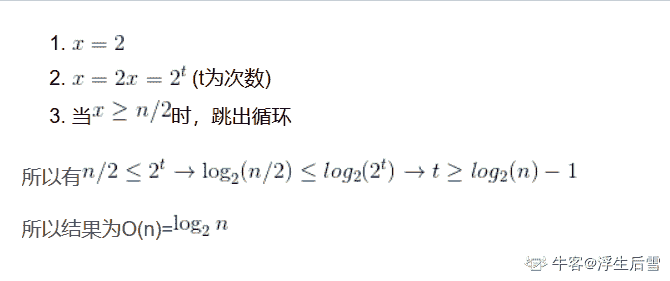
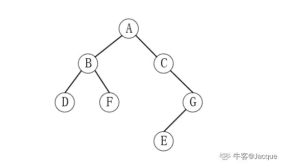

# 哔哩哔哩 2019 秋招技术岗（前端、运维、后端、移动端）第三套笔试题

## 1

现有如下代码段：

```cpp
   x = 2;
   while(x<n/2) 
          x = 2*x;
```

假设 n>=0，则其时间复杂度为（   ）

正确答案: A   你的答案: 空 (错误)

```cpp
O(log(n))
```

```cpp
O(nlog(n))
```

```cpp
O(n)
```

```cpp
O(n²)
```

本题知识点

复杂度

讨论

[浮生后雪](https://www.nowcoder.com/profile/995843523)



编辑于 2019-10-05 13:06:29

* * *

[百思不得姐](https://www.nowcoder.com/profile/697603280)

1、时间复杂度

（1）**时间频度** 一个算法执行所耗费的时间，从理论上是不能算出来的，必须上机运行测试才能知道。但我们不可能也没有必要对每个算法都上机测试，只需知道哪个算法花费的时间多，哪个算法花费的时间少就可以了。并且一个算法花费的时间与算法中语句的执行次数成正比例，哪个算法中语句执行次数多，它花费时间就多。一个算法中的语句执行次数称为语句频度或时间频度。记为 T(n)。

（2）**时间复杂度** 在刚才提到的时间频度中，n 称为问题的规模，当 n 不断变化时，时间频度 T(n)也会不断变化。但有时我们想知道它变化时呈现什么规律。为此，我们引入时间复杂度概念。 一般情况下，算法中基本操作重复执行的次数是问题规模 n 的某个函数，用 T(n)表示，若有某个辅助函数 f(n),使得当 n 趋近于无穷大时，T(n)/f(n)的极限值为不等于零的常数，则称 f(n)是 T(n)的同数量级函数。记作 T(n)=Ｏ(f(n)),称Ｏ(f(n)) 为算法的渐进时间复杂度，简称时间复杂度。详情参考 CSDN 博客地址：[`blog.csdn.net/zolalad/article/details/11848739`](https://blog.csdn.net/zolalad/article/details/11848739)

```cpp

	x = 2;       ①

	   while(x<n/2)

          x = 2*x;    ②
```

语句①的频度是 1，设语句 2 的频度是 f(n)，则 2^f(n)<=n/2;f(n)<=log2(n/2)近似等于 f(n)<=log2(n)，取最大值 f(n)=log2(n),T(n)=O(log2(n))

发表于 2019-08-07 20:50:19

* * *

[日醉长亭](https://www.nowcoder.com/profile/2768035)

初始条件是 x=2，循环终止的条件是 x>=n/2,执行一次循环，x 就乘以 2，所以执行 t 次循环后，x 的值为 2 的 t+1 次方，若此时达到终止条件，则 2 的 t+1 次方=n/2。

发表于 2019-08-05 20:29:34

* * *

## 2

下列各序列是二叉树层序遍历的结果，选项中不是堆的是（  ）

正确答案: B   你的答案: 空 (错误)

```cpp
(9,8,5,3,4,2,1)
```

```cpp
(9,4,5,8,3,1,2)
```

```cpp
(9,5,8,4,3,2,1)
```

```cpp
(9,8,5,4,3,1,2)
```

本题知识点

Java 工程师 C++工程师 安卓工程师 运维工程师 前端工程师 算法工程师 测试工程师 哔哩哔哩 堆 iOS 工程师 2019

讨论

[四月是你的谎言 ovo](https://www.nowcoder.com/profile/5314044)

根据堆的性质可知，堆中的某个结点的值总是不大于或不小于其父节点的值，可以理解为下面两种情况 1：堆中的某个结点值总是大于其父节点的值 2：堆中的某个结点值总是小于其父节点的值而且对是一个完全二叉树 B 选项        9      /    \    4      5  /   \    /  \8    3  1   2 可以明显的看出  8>4 不符合堆中的某个结点的值总是不大于或不小于其父节点的值，所以 B 选项错误

发表于 2019-05-15 21:34:33

* * *

[Splashbrothers](https://www.nowcoder.com/profile/993755313)

为什么题目不说明序列是层序遍历的结果？

发表于 2021-06-18 12:12:34

* * *

[路泽学长](https://www.nowcoder.com/profile/329800793)

完全二叉树

发表于 2021-05-15 20:37:57

* * *

## 3

下面关于二叉排序树的说法错误的是（  ）

正确答案: A   你的答案: 空 (错误)

```cpp
在二叉排序树中，完全二叉树的查找效率最低
```

```cpp
对二叉排序树进行中序遍历，必定得到节点关键字的有序序列
```

```cpp
二叉排序树的平均查找长度是 O(log2(n))
```

```cpp
二叉排序树的查找效率与二叉树的树形有关
```

本题知识点

Java 工程师 C++工程师 安卓工程师 iOS 工程师 运维工程师 前端工程师 算法工程师 测试工程师 哔哩哔哩 树 2019

讨论

[凉风起天末](https://www.nowcoder.com/profile/709610362)

**二叉排序树**即：对任一子树都有 “左树<子树根节点<右树” 的二叉树结构，对每一次查找，都会对当前节点的值进行比较，小于则进入左孩子，大于则进入右孩子，如此重复，直到确定结果因此每次查找都对应着二叉树的的一条路径（分支），二叉树所有**分支的平均长度**决定了**查找效率**，越短越好 A 选项：在所有二叉树中，**完全二叉树**的平均分支长度最短（节点数相同的情况下），查找效率最高，描述相反，故错误 B 选项：因为“左树<子树根节点<右树”，而中序遍历也是左树优先输出，子树根节点次之，右树最后输出，这也正是它排序的原理，正确 C 选项：以完全二叉树作为典型，n 个节点的树深度为 log2(n)，其他树可以在增删时通过**左旋和右旋调整**成完全二叉树，正确 D 选项：树的形状不同，分支的平均长度也会不同，树形能够综合考虑所有分支，故正确。但是要注意，除了完全二叉树外，其他树的深度并不能决定该树的查找效率，因为深度仅由最长的分支决定，只是考虑了一条路径，无法反映所有路径的平均长度。

发表于 2019-09-01 22:23:34

* * *

[82 年的苏打水](https://www.nowcoder.com/profile/6103363)

我觉得是 D 错了  与树形无关，与深度有关。求大佬解释

发表于 2019-08-27 15:41:59

* * *

## 4

关于 TCP 协议描述不正确的是（ ）

正确答案: B   你的答案: 空 (错误)

```cpp
建立连接需要三次握手
```

```cpp
TIME_WAIT 状态时不再接受报文
```

```cpp
TIME_WAIT 状态的持续时间是可以调整的
```

```cpp
FIN 报文一般由请求方负责发送
```

本题知识点

Java 工程师 测试工程师 哔哩哔哩 网络基础 2019

讨论

[四月是你的谎言 ovo](https://www.nowcoder.com/profile/5314044)

什么是 TIME_WAIT 状态呢？  客户端连接在接收到服务器接收到报文段后，并未直接进入 CLOSED 状态，而是转移到 TIME_WAIT 状态。在这个状态，客户端 连接要等待一段长为 2  MSL（Maxinum Segment  Life  报文段最大生存时间）的时间，才能完全关闭。

先说第一点，如果 Client 直接 CLOSED 了，那么由于 IP 协议的不可靠性或者是其它网络原因，导致 Server 没有收到 Client 最后回复的 ACK。那么 Server 就会在超时之后继续发送 FIN，此时由于 Client 已经 CLOSED 了，就找不到与重发的 FIN 对应的连接，最后 Server 就会收到 RST 而不是 ACK，Server 就会以为是连接错误把问题报告给高层。这样的情况虽然不会造成数据丢失，但是却导致 TCP 协议不符合可靠连接的要求。所以，Client 不是直接进入 CLOSED，而是要保持 TIME_WAIT，当再次收到 FIN 的时候，能够保证对方收到 ACK，最后正确的关闭连接。

再说第二点，如果 Client 直接 CLOSED，然后又再向 Server 发起一个新连接，我们不能保证这个新连接与刚关闭的连接的端口号是不同的。也就是说有可能新连接和老连接的端口号是相同的。一般来说不会发生什么问题，但是还是有特殊情况出现：假设新连接和已经关闭的老连接端口号是一样的，如果前一次连接的某些数据仍然滞留在网络中，这些延迟数据在建立新连接之后才到达 Server，由于新连接和老连接的端口号是一样的，又因为 TCP 协议判断不同连接的依据是 socket pair，于是，TCP 协议就认为那个延迟的数据是属于新连接的，这样就和真正的新连接的数据包发生混淆了。所以 TCP 连接还要在 TIME_WAIT 状态等待 2 倍 MSL，这样可以保证本次连接的所有数据都从网络中消失。

发表于 2019-05-22 16:07:29

* * *

[ThinkingOverflow](https://www.nowcoder.com/profile/165701207)

1）“四次挥手”中，客户端接收到服务器端的第三个 FIN 报文后，会发送 ACK 确认报文给服务器端。但是客户端不会立即进入 CLOSED，而是进入 TIME-WAIT 等待 2MSL 的时间，这期间如果服务器端没有收到客户端的 ACK 报文，就会重新发送 FIN 报文给客户端，因此 TIME-WAIT 状态仍然会接受报文。2）FIN 请求是客户端与服务器端都会发送的。应该选 BD

发表于 2020-06-09 15:12:43

* * *

[思恋勾起回忆](https://www.nowcoder.com/profile/581322721)

答案有问题吧，接收方也能发送

发表于 2019-08-25 15:34:59

* * *

## 5

可唯一确定一棵二叉树的是（  ）

正确答案: A C   你的答案: 空 (错误)

```cpp
给定一棵二叉树的后序和中序遍历序列
```

```cpp
给定一棵二叉树的先序和后序遍历序列
```

```cpp
给定一棵二叉树的先序和中序遍历序列
```

```cpp
给定先序、中序和后序遍历序列中的任意一个即可
```

本题知识点

Java 工程师 C++工程师 安卓工程师 iOS 工程师 运维工程师 前端工程师 算法工程师 测试工程师 哔哩哔哩 树 2019

讨论

[MiZia612](https://www.nowcoder.com/profile/688917769)

已知中序遍历、以及前、后、层其中一种均可确定一颗二叉树拓展：知道树的前序遍历、和树得后序遍历，可以确定一棵树（树与二叉树的转换）

编辑于 2019-10-24 16:57:07

* * *

[四月是你的谎言 ovo](https://www.nowcoder.com/profile/5314044)

通过中序遍历可以确定结点关键字的有序序列

发表于 2019-05-22 16:08:40

* * *

[就酱 201808051615489](https://www.nowcoder.com/profile/52959918)

中序遍历和层次也可以确定

发表于 2019-09-30 18:42:24

* * *

## 6

下面哪些是使用分治法的特征（  ）

正确答案: A B D   你的答案: 空 (错误)

```cpp
该问题可以分解为若干个规模较小的相同问题
```

```cpp
子问题的解可以合并为该问题的解
```

```cpp
子问题必须是一样的
```

```cpp
子问题之间不包含公共的子问题
```

本题知识点

分治

讨论

[圣光·明流火](https://www.nowcoder.com/profile/668041293)

理解为"分而治之"这一成语的意思来做 AB 肯定对的如果子问题都是一样的话都可以统一解决了还分什么问题,C 错 D，这小块问题是这个，那一小块问题是那个，如果含公共项的话都可以统一了，就和 C 的说法差不多了。。

发表于 2019-05-14 15:38:16

* * *

[2022 考研计算机科学与技术](https://www.nowcoder.com/profile/148719156)

摘自百度百科分治法可以通俗的解释为：把一片领土分解，分解为若干块小部分，然后一块块地占领征服，被分解的可以是不同的政治派别或是其他什么，然后让他们彼此异化。分治法的精髓：分--将问题分解为规模更小的子问题；治--将这些规模更小的子问题逐个击破；合--将已解决的子问题合并，最终得出“母”问题的解；

发表于 2021-08-14 10:07:34

* * *

## 7

同一个进程的多个线程堆栈共享状况哪个描述正确(   )

正确答案: A   你的答案: 空 (错误)

```cpp
堆共享，栈私有
```

```cpp
堆私有，栈共享
```

```cpp
堆共享，栈共享
```

```cpp
堆私有，栈私有
```

本题知识点

Java 工程师 C++工程师 安卓工程师 iOS 工程师 运维工程师 前端工程师 算法工程师 测试工程师 哔哩哔哩 操作系统 2019

讨论

[豪 Joe](https://www.nowcoder.com/profile/7940627)

堆：大家共有的空间，在操作系统对进程初始化时进行分配。栈：线程独有，用于保存运行状态、局部变量等等。

发表于 2020-01-05 16:30:47

* * *

[晴天 201811142208291](https://www.nowcoder.com/profile/96451964)

堆：大家共有的空间，在操作系统对进程初始化时进行分配。栈：线程独有，用于保存运行状态、局部变量等等。

发表于 2021-08-15 10:47:49

* * *

## 8

有 12 个外观相同的小球，已知其中一个重量与其他的不同，给一个只能比较无法称重的天平，最少几次比较可以找出重量不同的小球(   )

正确答案: D   你的答案: 空 (错误)

```cpp
6
```

```cpp
5
```

```cpp
4
```

```cpp
3
```

本题知识点

Java 工程师 C++工程师 安卓工程师 运维工程师 前端工程师 算法工程师 PHP 工程师 测试工程师 哔哩哔哩 数学运算 iOS 工程师 2019

讨论

[presentYao](https://www.nowcoder.com/profile/93713671)

分析：首先 将十二个球编号为 1-12。
第一次，先将 1-4 号放在左边，5-8 号放在右边。
称量结果有３种可能：１右重，２平衡，３左重。
下面分别叙述每种可能下的第二步和第三步称量。
---------------------------------------------------
1.如果右重　则坏球在 1-8 号当中。9-12 全为好球
第二次将 2-4 号拿掉，将 6-8 号从右边移到左边，把 9-11 号放在右边。就是说，把 1,6,7,8 放在左边，5,9,10,11 放在右边。
1.如果右重则坏球在没有被触动的 1,5 号。如果是 1 号，则它比标准球轻；如果是 5 号，则它比标准球重。
第三次将 1 号放在左边，2 号放在右边。
1.如果右重则 1 号是坏球且比标准球轻；
2.如果平衡则 5 号是坏球且比标准球重；
3.这次不可能左重。
2.如果平衡则坏球在被拿掉的 2-4 号，且比标准球轻。
第三次将 2 号放在左边，3 号放在右边。
1.如果右重则 2 号是坏球且比标准球轻；
2.如果平衡则 4 号是坏球且比标准球轻；
3.如果左重则 3 号是坏球且比标准球轻。
3.如果左重则坏球在拿到左边的 6-8 号，且比标准球重。
第三次将 6 号放在左边，7 号放在右边。
1.如果右重则 7 号是坏球且比标准球重；
2.如果平衡则 8 号是坏球且比标准球重；
3.如果左重则 6 号是坏球且比标准球重。
－－－－－－－－－－－－－－－－－－－－－－－－－－－
2.如果第一次的称量结果是　天平平衡，则 1-8 号全为好球，坏球在 9-12 号。
第二次将 1-3 号放在左边，9-11 号放在右边。
1.如果右重则坏球在 9-11 号且坏球较重。
第三次将 9 号放在左边，10 号放在右边。
1.如果右重则 10 号是坏球且比标准球重；
2.如果平衡则 11 号是坏球且比标准球重；
3.如果左重则 9 号是坏球且比标准球重。
2.如果平衡则坏球为 12 号。
第三次将 1 号放在左边，12 号放在右边。
1.如果右重则 12 号是坏球且比标准球重；
2.这次不可能平衡；
3.如果左重则 12 号是坏球且比标准球轻。
3.如果左重则坏球在 9-11 号且坏球较轻。
第三次将 9 号放在左边，10 号放在右边。
1.如果右重则 9 号是坏球且比标准球轻；
2.如果平衡则 11 号是坏球且比标准球轻；
3.如果左重则 10 号是坏球且比标准球轻。
－－－－－－－－－－－－－－－－－－－－－－－－－－－－－
3.如果第一次称量的结果是 左重， 则坏球在 1-8 号。9-12 号均好球。
这种情况与　右重　的情形是对称的。剩下的步骤可以对称执行。不一一列出。网上看到的这个，觉得很厉害，并且觉得是没有问题的。[`blog.csdn.net/vie0405/article/details/11954135`](https://blog.csdn.net/vie0405/article/details/11954135) 

发表于 2019-08-19 20:13:23

* * *

[四月是你的谎言 ovo](https://www.nowcoder.com/profile/5314044)

可以参考二分查找（也叫做折半查找）

发表于 2019-05-22 16:11:17

* * *

[LLLL、](https://www.nowcoder.com/profile/410721119)

最少的次数 1、第一次就拿出了那个不同的球，但是不知道是两个中的哪个 2、第二次拿出的两个球肯定是一样的 3、从第一次拿出的两个球中随便拿一个（比如说 a 球）跟第二次拿出的两个球中随便一个进行比较，如果不同，则 a 就是想要的那个球

发表于 2019-08-20 14:17:36

* * *

## 9

若外部存储上有 3110400 个记录，做 6 路平衡归并排序，计算机内存工作区能容纳 400 个记录，则排序好所有记录，需要作几趟归并排序（ ）

正确答案: C   你的答案: 空 (错误)

```cpp
6
```

```cpp
3
```

```cpp
5
```

```cpp
4
```

本题知识点

排序 *讨论

[Delicia_Lani](https://www.nowcoder.com/profile/67321707)

log(6,3110400/400) = 5 设归并趟数为 s 次，对 n 个记录进行排序，有 m 个归并段，要进行 k 路归并排序，则归并趟数 s=log(k,m);(k 为底数，m 为真数）

发表于 2019-07-17 19:33:52

* * *

[不做人了](https://www.nowcoder.com/profile/250145)

次数最少 每次让计算机内存填满 4003110400 个记录要填 3110400/400 =  7776 次 n 路归并 m 次 的次数为 n^m 
6^m = 7776m=5

发表于 2020-05-07 08:48:59

* * *

## 10

75 的阶乘末尾有（ ）个零

正确答案: B   你的答案: 空 (错误)

```cpp
15
```

```cpp
18
```

```cpp
12
```

```cpp
20
```

本题知识点

Java 工程师 C++工程师 安卓工程师 运维工程师 前端工程师 算法工程师 PHP 工程师 测试工程师 哔哩哔哩 数量关系 iOS 工程师 2019

讨论

[圣光·明流火](https://www.nowcoder.com/profile/668041293)

后面带有 0 的肯定能被 5 整除，所以，75/5 = 15 但是 75 这玩意还能被 25 整除，所以，75/25=3 综上所述 15+3 = 18.。。

发表于 2019-05-14 15:41:50

* * *

[从渺小开始](https://www.nowcoder.com/profile/1037850)

最后能得到 0 的，肯定是 5，25，50，75 ...的倍数。 75 / 5 = 15;75 / 25 = 3;所以答案是 18。

发表于 2019-08-17 17:28:18

* * *

[Joecoo 丨](https://www.nowcoder.com/profile/133102150)

75 的阶乘里面，每当上一次运算的结果乘上 5 都倍数（5，10，15....）的时候都会在结尾产生 0，但是 25，50，75 这三个数字会产生两个 0。所以结果是 15+3 个

发表于 2019-11-03 15:19:48

* * *

## 11

在局域网内的某台主机用 ping 命令测试网络连接时，发现网络内的主机都可以连通，而不能与公网连通，问题可能是(  )

正确答案: C   你的答案: 空 (错误)

```cpp
主机 IP 设置有误
```

```cpp
局域网 DNS 服务器设置有误
```

```cpp
局域网的网关或主机的网关设置有误
```

```cpp
没有设置连接局域网的网关
```

本题知识点

Java 工程师 测试工程师 哔哩哔哩 网络基础 2019

讨论

[Gnzdream](https://www.nowcoder.com/profile/202899370)

C

编辑于 2020-01-08 11:52:53

* * *

[PED4](https://www.nowcoder.com/profile/479136182)

就算是 DNS 设置有误，我直接 ping 公网 ip 不也照样可以连通

编辑于 2020-01-08 11:51:55

* * *

[碰我就碎](https://www.nowcoder.com/profile/142976674)

内部网关协议和外部网关协议  B 的网关应该指的是外部网关也就是边界路由器

发表于 2019-08-19 17:10:59

* * *

## 12

不可能所有的花都结果。下列哪项最接近上述判定的含义（）

正确答案: D   你的答案: 空 (错误)

```cpp
所有的花必然都不结果
```

```cpp
所有的花可能都不结果
```

```cpp
有的花可能不结果
```

```cpp
有的花必然不结果
```

本题知识点

Java 工程师 C++工程师 安卓工程师 iOS 工程师 运维工程师 前端工程师 算法工程师 PHP 工程师 哔哩哔哩 言语理解与表达 2019 管理培训生 牛客 2020 判断推理

讨论

[啊夶](https://www.nowcoder.com/profile/624545826)

不可能所有的花都结果。那必然是存在不结果的花的。如果只是有的花可能不结果，那有可能所有的花都结果。

编辑于 2019-10-19 16:12:47

* * *

[求打破 0offer](https://www.nowcoder.com/profile/256711190)

找了学过逻辑学的室友用运算方法做，过程大概是不可能所有花结果-不是(不必然不)所有花都结果-必然不是所有花都结果-必然存在花不结果，答案是 D，符号打不出来...

发表于 2019-08-11 14:52:13

* * *

[牛客 319035695 号](https://www.nowcoder.com/profile/319035695)

否定是放在最前面的，可能就变成了必然，所有的变成有的，都结果变成不结果，所以总的合起来就是必然有的花不结果，然后再为了使句子通顺一些和选项进行对照选出最接近的一项。

发表于 2020-02-19 14:18:20

* * *

## 13

如果将固定文件块大小的文件系统中的文件块大小调大，会导致（ ）

正确答案: B   你的答案: 空 (错误)

```cpp
更快的磁盘读写性能和更高的空间利用率
```

```cpp
更快的磁盘读写性能和更低的空间利用率
```

```cpp
更慢的磁盘读写性能和更高的空间利用率
```

```cpp
更慢的磁盘读写性能和更低的空间利用率
```

本题知识点

Java 工程师 C++工程师 安卓工程师 iOS 工程师 运维工程师 前端工程师 算法工程师 测试工程师 哔哩哔哩 操作系统 C++工程师 iOS 工程师 安卓工程师 运维工程师 前端工程师 Java 工程师 哔哩哔哩 2019

讨论

[卓南雁](https://www.nowcoder.com/profile/3233343)

文件块大小变大会导致和其他没有变的文件块不能完美契合，降低空间利用率。而读写性能会提高。

发表于 2019-05-21 21:39:15

* * *

## 14

平面内有 11 个点,由它们连成 48 条不同的直线,由这些点可连成多少个三角形（ ）

正确答案: A   你的答案: 空 (错误)

```cpp
160
```

```cpp
150
```

```cpp
165
```

```cpp
161
```

本题知识点

Java 工程师 C++工程师 安卓工程师 运维工程师 前端工程师 算法工程师 PHP 工程师 测试工程师 哔哩哔哩 数学运算 iOS 工程师 2019

讨论

[zywwblofb](https://www.nowcoder.com/profile/8289977)

解析,首先你要分析,平面中有 11 个点,如果这些点中任意三点都没有共线的,那么一共应该有 C(11)2=55,可是,题目中说可以连接成 48 条直线,那么这 11 个点中必定有三个点共线的.55-48=7,从 7 来分析,
①假设有一组三个点共线,那么可以组成的直线在 55 的基础上应该减去 C(3)2-1=2 2*3=6≠7,因此,可以断定不仅有三点共线的,也可能有四个点共线的可能.
②假设有一组四个点共线,那么可以组成的直线在 55 的基础上应该减去 C(4)2-1=5 
【备注,五个点共线的可能不存在,因为,C(5)2-1=9>7,故,不可能有五条直线共线】 
C(3)2-1+C(4)2-1=7,
因此,综上分析,这 11 个点中,必定有一组三个点共线,并且还有一组四个点共线.那么,这 11 个点能组成的三角形的个数为,C(11)3-C(3)3-C(4)3=165-1-3=160 【备注,三个点共线不能组成三角形】

发表于 2019-08-06 10:50:48

* * *

[Joecoo 丨](https://www.nowcoder.com/profile/133102150)

11 个点分为三组：第一组四点共线，第二组三点共线，此外其他点都没有三个以上的共线点。C42*7+C32*8+C42*7+C31*C41*C41+C43=160

发表于 2019-11-03 15:37:11

* * *

[努力的小蜗牛毛毛](https://www.nowcoder.com/profile/785399651)

答案错误，选择 A. 160

发表于 2019-08-28 12:18:43

* * *

## 15

一个包含 M 个节点的三叉树，共有 3M 个指针，这些指针中有（ ）个空指针

正确答案: C   你的答案: 空 (错误)

```cpp
2M-1
```

```cpp
2M
```

```cpp
2M+1
```

```cpp
M
```

本题知识点

Java 工程师 C++工程师 安卓工程师 运维工程师 前端工程师 算法工程师 测试工程师 哔哩哔哩 树 C++ C++工程师 iOS 工程师 安卓工程师 运维工程师 前端工程师 Java 工程师 哔哩哔哩 2019

讨论

[圣光·明流火](https://www.nowcoder.com/profile/668041293)

m 个节点含有 m-1 个非空指针所以 3m-(m-1) = 2m + 1 = =

发表于 2019-05-14 15:43:28

* * *

[时文康](https://www.nowcoder.com/profile/101764790)

若 m 叉树结点个数为 n，空指针为(m-1)*n+1

发表于 2019-10-01 17:14:13

* * *

[里外不是人](https://www.nowcoder.com/profile/779629562)

一个节点有 3 个指针，每添加一个增加 3 个指针，并消耗父节点的一个，所以有 2M+1，1 是因为根节点没有父节点。

发表于 2019-09-15 12:25:03

* * *

## 16

单向链表不满足的描述是（ ）

正确答案: A D   你的答案: 空 (错误)

```cpp
可以随机访问任意结点
```

```cpp
删除头节点的时间复杂性是 O（1）
```

```cpp
空间开销与链表长度成正比
```

```cpp
插入数据的时间开销比数组更大
```

本题知识点

Java 工程师 C++工程师 安卓工程师 iOS 工程师 运维工程师 前端工程师 算法工程师 测试工程师 哔哩哔哩 链表 *2019* *讨论

[闷死作大死](https://www.nowcoder.com/profile/433851177)

缺个条件, 单向链表带不带尾指针

发表于 2019-08-20 17:31:18

* * *

[葬爱家族小鑫鑫](https://www.nowcoder.com/profile/108391861)

答案：ADA，链表只能进行按照顺序依次访问节点，无法做到随机访问。B，因为链表删除元素不需要做元素移动，所以时间复杂度为 O(1)。C，链表是由节点构成，自然链表长度越大空间开销越大。D，链表插入和删除元素因为不需要移动节点，所以相比较于数组而言，链表的时间复杂度为 O(1)，数组的时间复杂度 O(n)。

发表于 2019-08-12 15:17:52

* * *

[Tc.l](https://www.nowcoder.com/profile/245957318)

好家伙 我以为的空间开销是一个节点的空间开销，而这里是总空间开销

发表于 2020-07-03 19:14:27

* * *

## 17

A B 两个主机之间建立了一个 TCP 链接，A 主机发给 B 主机两个 TCP 报文，大小分别是 500 和 300，第一个报文的序列号是 200，那么 B 主机接受两个报文后，返回的确认号是（）

正确答案: D   你的答案: 空 (错误)

```cpp
200
```

```cpp
700
```

```cpp
800
```

```cpp
1000
```

本题知识点

Java 工程师 C++工程师 安卓工程师 iOS 工程师 运维工程师 前端工程师 算法工程师 测试工程师 哔哩哔哩 网络基础 2019

讨论

[M฿](https://www.nowcoder.com/profile/645772284)

确认号为服务器发送的上一个数据包中的序列号+所该数据包中所带数据的大小。第一个 200+500=700 第二个 700+300=1000

发表于 2019-09-09 17:19:42

* * *

[咩 201905061721879](https://www.nowcoder.com/profile/349679276)

第一个 500，接收大小 200，所以需要三个位置，终点为 600，第二个 300，需要两个，终于为 600 加 400 为 1000

发表于 2019-05-14 12:47:02

* * *

## 18

符合数据库设计第三范式（3NF）的数据表设计是（ ）

正确答案: A   你的答案: 空 (错误)

```cpp
学生{id, name, age},学科{course's name, course's id},分数{id, course's id, score}
```

```cpp
学生{id, name, age},分数{id, course's name, score}
```

```cpp
分数{student's name,
score, course's name}
```

```cpp
学科{id, name},分数{student's name, id, score}
```

本题知识点

Java 工程师 C++工程师 安卓工程师 运维工程师 前端工程师 算法工程师 PHP 工程师 测试工程师 哔哩哔哩 数据库 iOS 工程师 2019

讨论

[KKLLKKLL](https://www.nowcoder.com/profile/843952875)

B 选项错在哪？

发表于 2020-04-01 19:24:11

* * *

[从渺小开始](https://www.nowcoder.com/profile/1037850)

3NF 非主属性无传递依赖

发表于 2019-08-17 17:34:51

* * *

[喜一阿夏](https://www.nowcoder.com/profile/646204872)

C 选项学生的姓名加分数不一定可以决定课程名，有可能一个学生几门课考的分数一样

发表于 2020-09-08 20:48:50

* * *

## 19

以下哪些算法可以检测一个有向图中是否存在环（ ）

正确答案: A C   你的答案: 空 (错误)

```cpp
深度优先遍历
```

```cpp
广度优先遍历
```

```cpp
拓扑排序
```

```cpp
关键路径算法
```

本题知识点

Java 工程师 C++工程师 安卓工程师 运维工程师 前端工程师 算法工程师 PHP 工程师 测试工程师 哔哩哔哩 图 iOS 工程师 2019

讨论

[我的天鸭](https://www.nowcoder.com/profile/243498)

简单说一下算法步骤，为什么选 DFS 和拓扑排序：DFS 的时候，如果要访问的元素已经访问过，它在当前的栈内还没出栈，那么就是有环。BFS 不行是因为可能有多个节点指向该节点，不一定是因为有环。
拓扑排序会循环执行以下两步：
(1) 选择一个入度为 0 的顶点，输出
(2) 从图中删除此顶点以及所有的出边
循环结束后，若输出的顶点数小于网中的顶点数，则说明有回路

发表于 2019-08-04 17:26:09

* * *

[风木青](https://www.nowcoder.com/profile/637398154)

关键路径算法要求图内无环，这是算法的起始条件，但算法本身不含有判断是否有环的部分。

发表于 2019-11-30 14:45:02

* * *

[圣光·明流火](https://www.nowcoder.com/profile/668041293)

拓扑排序。。想都不用想这玩意的存在就是为了检查有无环。。深度优先遍历。。尽可能深的搜索树的分支。。查着查着肯定有环的存在。。

发表于 2019-05-14 15:46:55

* * *

## 20

路由器工作在网络模型中的哪一层（）

正确答案: C   你的答案: 空 (错误)

```cpp
物理层
```

```cpp
数据链路层
```

```cpp
网络层
```

```cpp
应用层
```

本题知识点

Java 工程师 C++工程师 安卓工程师 运维工程师 前端工程师 算法工程师 PHP 工程师 测试工程师 哔哩哔哩 网络基础 C++工程师 iOS 工程师 安卓工程师 运维工程师 前端工程师 Java 工程师 哔哩哔哩 2019

讨论

[阳阳子君](https://www.nowcoder.com/profile/968008808)

c

发表于 2019-10-09 19:02:37

* * *

## 21

某产品由甲乙两个工厂提供，甲工厂提供 40%，乙工厂提供 60%，甲工厂的次品率是 1%，乙公司是 2%，现在检测出一个次品，是甲工厂生产的概率是 1

你的答案 (错误)

1 参考答案 (1) 25%

本题知识点

Java 工程师 C++工程师 安卓工程师 运维工程师 前端工程师 算法工程师 测试工程师 哔哩哔哩 概率统计 *数学运算 iOS 工程师 2019* *讨论

[acrel](https://www.nowcoder.com/profile/608500419)

假设有 1000 个零件，则：甲工厂提供 400 个，有 4 个次品；乙工厂提供 600 个，有 12 个次品；所以共有 16 个次品，4/16=0.25 即 25%。

编辑于 2019-06-18 14:42:12

* * *

[南风 000](https://www.nowcoder.com/profile/354812767)

0.25

发表于 2020-08-16 15:42:41

* * *

[年薪不到百万](https://www.nowcoder.com/profile/429812687)

(40%*1%)/(40%*1%+60%*2%)=0.25

发表于 2019-09-20 17:24:16

* * *

## 22

对于满足 SQL92 标准的 SQL 语句：select foo,count(foo) from pokes where foo>10 group by foo having count(*)>5 order by foo，各关键字(select, from, where, group by, having, order by)的执行顺序应该是 1

你的答案 (错误)

1 参考答案 (1) FROM ->WHERE -> GROUP BY -> HAVING -> SELECT ->ORDER BY

本题知识点

Java 工程师 C++工程师 iOS 工程师 运维工程师 前端工程师 算法工程师 PHP 工程师 测试工程师 哔哩哔哩 数据库 SQL 安卓工程师 2019

讨论

[酸奶芝士](https://www.nowcoder.com/profile/782906901)

因为查询的时候是先去找某表 from，再在某表里面筛选条件 where，然后对筛选完的进行分组 group by，分组完就在分组的每一个组进行筛选条件 having，然后取出来想要的列 select，最后进行排序 order by。

发表于 2019-08-30 16:34:32

* * *

[朱凯歌](https://www.nowcoder.com/profile/596104900)

FROM->WHERE->GROUP BY->HAVING->SELECT->ORDER BY

发表于 2019-07-24 10:43:04

* * *

[牛客 696389005 号](https://www.nowcoder.com/profile/696389005)

SELECT FROMWHEREGROUP BY HAVINGORDER BY

发表于 2022-01-28 01:39:26

* * *

## 23

给 1，2，3，4，5 按照顺序放入一个栈中（stack），同时随机的从栈中弹出，一共有 1 种弹栈组合

你的答案 (错误)

1 参考答案 (1) 42

本题知识点

Java 工程师 C++工程师 安卓工程师 iOS 工程师 运维工程师 前端工程师 算法工程师 测试工程师 哔哩哔哩 栈 *2019* *讨论

[一三五七](https://www.nowcoder.com/profile/618738898)

公式是 (2n)!/(n!(n+1)!)

发表于 2019-05-19 17:41:34

* * *

[年薪不到百万](https://www.nowcoder.com/profile/429812687)

1/(n+1)*C(2n, n)

发表于 2019-09-20 17:30:47

* * *

## 24

IPV6 地址的长度是 1 位

你的答案 (错误)

1 参考答案 (1) 128

本题知识点

Java 工程师 C++工程师 安卓工程师 iOS 工程师 运维工程师 前端工程师 算法工程师 测试工程师 哔哩哔哩 网络基础 2019

讨论

[混吃等死的咸鱼本鱼](https://www.nowcoder.com/profile/611431009)

128 位

发表于 2019-08-28 08:57:12

* * *

## 25

10 粒糖，每天至少吃一颗（数量不限），吃完为止，有 1 种吃法组合

你的答案 (错误)

1 参考答案 (1) 512

本题知识点

Java 工程师 C++工程师 安卓工程师 运维工程师 前端工程师 算法工程师 PHP 工程师 测试工程师 哔哩哔哩 数学运算 iOS 工程师 2019

讨论

[年薪不到百万](https://www.nowcoder.com/profile/429812687)

10 粒糖,并排放,中间有 9 个间隔 1 0 1 0 1 0 1 0 1 0 1 0 1 0 1 0 1 0 1 (1 代表糖,0 代表间隔) 现在在 9 个间隔里面选 0 到 9 个(表示 10 粒糖在 1 天到 10 天里吃完 那么就有 C(9,0)+C(9,1)+C(9,2)+C(9,3)+C(9,4)+C(9,5)+C(9,6)+C(9,7)+C(9,8)+C(9,9)=2⁹ 种吃法

编辑于 2019-09-20 20:15:45

* * *

[圣光·明流火](https://www.nowcoder.com/profile/668041293)

直接打 512 不对？我透。。

发表于 2019-05-14 15:48:18

* * *

[dytsing](https://www.nowcoder.com/profile/532541682)

第一天肯定要吃掉 1 课糖，然后接下来第二颗糖可以选择第一天吃也可以第二天吃，两种选择，然后接下第三颗糖可以选择与第二颗糖同一天吃也可以吃第二颗糖的明天再吃，这样一直分析到第九颗糖。就是除去第一颗糖，其余九颗糖都是在不在同一天吃的选择。

发表于 2019-09-29 21:31:48

* * *

## 26

列举三种稳定的排序算法 1

你的答案 (错误)

1 参考答案 (1) 冒泡排序、基数排序、归并排序、插入排序

本题知识点

Java 工程师 C++工程师 安卓工程师 iOS 工程师 运维工程师 前端工程师 算法工程师 测试工程师 哔哩哔哩 排序 *2019* *讨论

[heiheihei-candy](https://www.nowcoder.com/profile/864110793)

就非得标点符号顺序也得对是咋

发表于 2019-08-12 23:01:52

* * *

[我軒哥天下無敵](https://www.nowcoder.com/profile/7702924)

空格间隔会错

发表于 2020-06-12 20:42:48

* * *

[30 号的小学生](https://www.nowcoder.com/profile/182379869)

很无语

发表于 2019-09-09 12:38:55

* * *

## 27

已知某二叉树的后序遍历是 DFBEGCA，中序遍历的顺序是 DBFACEG，其前序遍历顺序是 1

你的答案 (错误)

1 参考答案 (1) ABDFCGE

本题知识点

Java 工程师 C++工程师 安卓工程师 运维工程师 前端工程师 算法工程师 PHP 工程师 测试工程师 哔哩哔哩 树 iOS 工程师 2019

讨论

[Jacque](https://www.nowcoder.com/profile/892785870)



发表于 2019-08-27 12:17:08

* * *

## 28

已知函数如下

```cpp
int foo(int N) 
{return (1==N) ? 1 :N + foo(N-1); }
foo(100) = ( )
```

括号的值是 1

你的答案 (错误)

1 参考答案 (1) 5050

本题知识点

Java 工程师 C++工程师 运维工程师 前端工程师 算法工程师 PHP 工程师 测试工程师 哔哩哔哩 C++ Java iOS 工程师 安卓工程师 2019

讨论

[你的 offer 对我打了烊](https://www.nowcoder.com/profile/598309941)

从 100 加到 1，再运用一下伟大的高斯定理，perfect！

发表于 2020-03-06 22:56:08

* * *

[风华 201805291911137](https://www.nowcoder.com/profile/2362499)

寻思着这是 C 啊，也不是 JAVA

发表于 2021-03-14 12:26:45

* * *

[圣光·明流火](https://www.nowcoder.com/profile/668041293)

用的递归算从 1 加到 100 实在精的不行。。只有当 N 等于 1 才跳出循环。。其他时候就是 100+99+98+...

发表于 2019-05-14 15:49:44

* * *

## 29

我们常说的 32 位 CPU 是指 CPU 的 1 总线是 32 位的

你的答案 (错误)

1 参考答案 (1) 数据

本题知识点

Java 工程师 C++工程师 安卓工程师 iOS 工程师 运维工程师 前端工程师 算法工程师 测试工程师 哔哩哔哩 网络基础 2019

讨论

[混吃等死的咸鱼本鱼](https://www.nowcoder.com/profile/611431009)

数据总线

发表于 2019-08-28 08:59:17

* * *

## 30

列举三种进程间通讯的方式 1

你的答案 (错误)

1 参考答案 (1) 管道、消息队列、共享内存、信号量、网络通讯

本题知识点

Java 工程师 C++工程师 安卓工程师 iOS 工程师 运维工程师 前端工程师 算法工程师 测试工程师 哔哩哔哩 操作系统 2019

讨论

[牛客 1382](https://www.nowcoder.com/profile/670324896)

管道、消息队列、内存共享、套接字 socket

发表于 2019-12-13 13:57:57

* * *

[月亮无光](https://www.nowcoder.com/profile/519203686)

客户机服务器技术 管道通信技术 消息传递技术 共享存储器技术

发表于 2019-12-13 09:57:29

* * *

## 31

为什么 B＋树适合数据库索引？

你的答案

本题知识点

Java 工程师 C++工程师 安卓工程师 iOS 工程师 运维工程师 前端工程师 算法工程师 哔哩哔哩 数据库 操作系统 2019

讨论

[这是骐通](https://www.nowcoder.com/profile/836866646)

首先解释下为什么不用红黑树,B 树,Hash 表来做索引 1.红黑树虽然是一颗自平衡数,而且性能很优秀,但是随着数据量的急速增加数的高度也在急速的增加,而树的高度正是我们要考虑的问题,每一层加载判断会先进行 IO 操作,IO 是非常耗时的,所以我们不用红黑树来做数据库的索引. 2\. B 树的话虽然也可以控制层数(即 IO 操作的次数),但是他将数据都存储在了结点上,这样大大减少的一次 IO 读取数据的数量(一般一次为 16k 一个结点效率是最高的)而且当我们需要范围查找时,B 数的弊端就显现出来了,不能范围查找!! 3\. Hash 表的查找是非常优秀的,增删改查时间复杂度都可以在常数时间内去完成(即时间复杂度 O(1)),所以对于查找单个数据操作的 Hash 表性能是非常的优秀的,但我们大多时间都是范围查找,找多个数据,因此并不适合!总结: B+数完美的解决了上述数据结构的不足的问题! 即平衡了效率(树的高度是可控的)又能查找范围性的数据~B+数的最低层用的是双向链表结构,故可以很好的范围性查找. 

发表于 2020-08-13 17:34:59

* * *

[古罗马哥哥古巴比伦](https://www.nowcoder.com/profile/705339783)

TCP/IP 协议中，MSS 和 MTU 分别工作在哪一层？

发表于 2020-04-26 19:02:55

* * *

## 32

给定一个整数数组,判断其中是否有 3 个数和为 N

本题知识点

哔哩哔哩 Java 工程师 C++工程师 iOS 工程师 安卓工程师 运维工程师 前端工程师 算法工程师 PHP 工程师 测试工程师 数组 哈希 *查找 *排序 *2019 golang 工程师*** ***讨论

[无心 2019](https://www.nowcoder.com/profile/991674511)

```cpp
#include <bits/stdc++.h>
using namespace std;
int main()
{
    int n,m;
    vector<int>num;
    while(cin>>m)
    {
        if(getchar() == ',')
            break;
        num.push_back(m);
    }
    cin>>n;
    sort(num.begin(),num.end());
    for(int i=1;i<=num.size()-2;i++)
    {
        int first = 0;
        int last = num.size()-1;
        while(first<i && last>i)
        {
            if(num[first]+num[last]+num[i] == n)
            {
                cout << "True" << endl;
                return 0;
            }
            else if(num[first]+num[last]+num[i] < n)
                first++;
            else
                last--;
        }
    }
    cout << "False" << endl;
    return 0;
}

```

发表于 2019-07-23 08:38:21

* * *

[66667](https://www.nowcoder.com/profile/938200840)

```cpp
while(line = readline()){
    var lines = line.split(",");
    var t = lines[0];
    var n = parseInt(lines[1]);
    var y = t.split(" ");
    var temp=[];
    for(i = 0;i<y.length;i++){
        temp.push(parseInt(y[i]));
    }
    temp.sort(com);
    var pp=yes(temp,n)
    print(pp)
}
function yes(temp,n){
        for(i=1;i<temp.length-2;i++){
        var first = 0;
        var last = temp.length-1;
        while(i>first&&i<last){
            if(temp[i]+temp[first]+temp[last]==n){
                var pp ="True";
                return pp;
            }
            else if(temp[i]+temp[first]+temp[last]<n){
                first++;
            }else{
                last--;
            }
        }
            var pp = "False"
    }
    return pp;
}
function com(a,b){
    return a-b;
}
```

发表于 2019-09-03 14:48:23

* * *

[听风者 201809290813325](https://www.nowcoder.com/profile/380675160)

```cpp
import java.util.*;
public class Main {
    public static void main(String[] args) {
        java.util.Scanner scanner = new java.util.Scanner(System.in);
        String str = scanner.nextLine();
        String[] temp = str.split(",");
        String[] numstr = temp[0].split(" ");
        int[] nums = new int[numstr.length];
        for (int i = 0; i < nums.length; i++)
            nums[i] = Integer.valueOf(numstr[i]);
        int target = Integer.valueOf(temp[1]);
        java.util.Arrays.sort(nums);

        for (int i = 0; i < nums.length - 2; i++) {
            int start = i + 1, end = nums.length - 1;
            while (start < end) {
                int sum = nums[i] + nums[start] + nums[end];
                if (sum == target){
                    System.out.println("True");
                    return;
                }  else if (sum < target)
                    start++;
                else
                    end--;
            }
        }
        System.out.println("False");
    }
}
```

编辑于 2019-08-20 15:46:26

* * *********