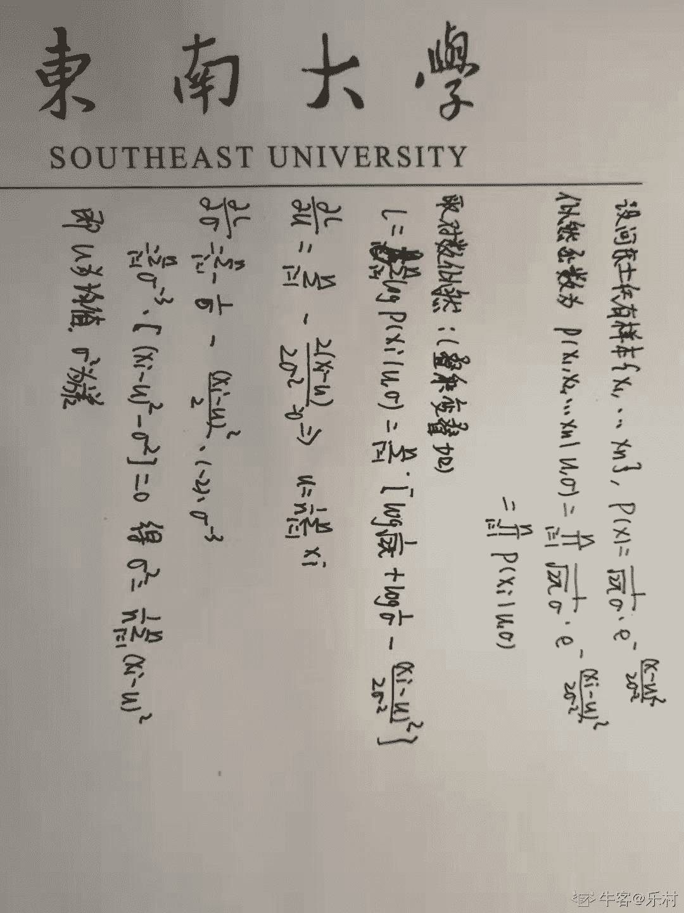

# 哔哩哔哩 2019 秋招技术岗（算法）第一套笔试题

## 1

韩信是汉高祖手下一名大将，据说他的数学也非常好，点兵时使用“中国剩余定理”看余数就能得出手下共计 N 个士兵。近日，韩信对全军做了一次身体素质普查，得到了每一位士兵的身高体重等数据{x1,x2,…,xN}，其中的每一个 xi 是由第 i 位士兵的身高体重等信息构成的向量。同时韩信发现，他的士兵是由来自河东和来自河西两部分组成，这两地的士兵在身高体重分布上有差别。假设两地身高体重数据分别满足一个正态分布，请给出一个算法从普查数据估计两地士兵比例。

你的答案

本题知识点

算法工程师 哔哩哔哩 机器学习 2019

讨论

[乐村](https://www.nowcoder.com/profile/949507904)

设 f(x)为一维高斯函数,f(x)=1/(sqrt(2*pi)*sigma)*(e**((x-u)**2)/(2*sigma**2)) 这道题考的是 EM 算法，需要通过迭代的方式才能得到答案。 首先如果我们知道每一个样本来自于哪一个分布，即改名士兵是来自于河西还是河东，那么使用极大似然估计就可以得到河西和河西士兵 身高分布。 取河东为例，具体做法如下：（图片方向偏了，将就着看哈）
刚刚讲了如何通过确定的人员身高来获取高斯分布参数。你可能会问那我现在并不知道给定的分布中哪些士兵来自于河西哪些士兵来自于河东？基于此，①我们可以事先给定一组参数(u1,sigma1),(u2,sigma2)来设定为河东与河西士兵身高分布的参数。②通过给定的参数，对于任何一个样本 xi，可以通过前面的概率公式 f(x)计算出 xi 属于河东与河西的概率，这里取概率较大的那一类作为 xi 的 Label。③通过士兵的 label 将所有的士兵分配到两个组，河东与河西，然后依据极大似然估计的思想来计算两个分布的参数，得到一组新的(new_1,new_sigma1),(new_u2,new_sigma2)，如果你运气好，你发现(new_1,new_sigma1),(new_u2,new_sigma2)原先“夜观星象”+“掐指一算”得到的参数(u1,sigma1),(u2,sigma2)是相同的，那么此时就可以相信，这组参数就是所求的参数。但现实情况下，你可能运气没有那么好，所求的参数与原先参数不匹配，那应该怎么做呢？很简单，将计算出来的(new_1,new_sigma1),(new_u2,new_sigma2)替换(u1,sigma1),(u2,sigma2)，并且依据该参数重新计算每一个士兵 label，然后....。也就是(new_1,new_sigma1),(new_u2,new_sigma2)替换(u1,sigma1),(u2,sigma2)迭代执行上面的步骤②。那如何能停止呢？当(new_1,new_sigma1),(new_u2,new_sigma2)等于(u1,sigma1),(u2,sigma2)时，实际应用中可设置一个距离函数当 distance(x1,x2)<threshol 时停止迭代。

发表于 2019-08-19 16:08:28

* * *

[求一个 offer 的菜鸡](https://www.nowcoder.com/profile/9781487)

高斯混合分布，用 EM 算法

发表于 2019-06-23 23:32:09

* * *

## 2

如果 version1 > version2 返回 1，如果 version1 < version2 返回-1，不然返回 0.

输入的 version 字符串非空，只包含数字和字符.。.字符不代表通常意义上的小数点，只是用来区分数字序列。例如字符串 2.5 并不代表二点五，只是代表版本是第一级版本号是 2，第二级版本号是 5.

本题知识点

哔哩哔哩 Java 工程师 C++工程师 iOS 工程师 安卓工程师 运维工程师 前端工程师 算法工程师 PHP 工程师 测试工程师 数学 字符串 *2019 golang 工程师* *讨论

[白色纯度](https://www.nowcoder.com/profile/485984577)

```cpp
# python 中的列表可以直接比较，只要把输入的数字按照'.'分割后，换为整数列表即可。
num = input().split()
version1 = list(map(int, num[0].split(".")))
version2 = list(map(int, num[1].split(".")))
if version1<version2:
    print(-1)
elif version1>version2:
    print(1)
else:
    print(0)
#print(version1, version2)
```

发表于 2019-07-04 11:09:50

* * *

[昔遥暮云](https://www.nowcoder.com/profile/294241826)

```cpp
//用 c 语言的 scanf 输入 int 判断更便捷；
#include <bits/stdc++.h>
using namespace std;
int main(){
    vector<int> arr1,arr2;
    int i=0,t;
    while(1){
        if(cin.peek()==' ')
            break;
        scanf("%d.",&t);
        arr1.push_back(t);
    }
    while(1){
        if(cin.peek()=='\n')
            break;
        scanf("%d.",&t);
        arr2.push_back(t);
    }
    while(i!=arr1.size()&&i!=arr2.size()){
        if(arr1[i]!=arr2[i]){
            t=arr1[i]>arr2[i] ? 1:-1;
            break;
        }
        i++;
    }
    if(i==arr1.size()||i==arr2.size()){
        if(arr1.size()==arr2.size())
            t=0;
        else
            t= arr1.size()>arr2.size() ? 1:-1;
    }
    cout<<t;
    return 0;
}

```

发表于 2019-11-13 10:06:33

* * *

[0b100001101000](https://www.nowcoder.com/profile/568883663)

```cpp
x,y = map(lambda x:list(map(int, x.split('.'))), input().split())
if x > y: print(1)
elif x < y: print(-1)
else: print(0)
```

发表于 2019-09-12 05:09:41

* * *

## 3

猛兽侠中精灵鼠在利剑飞船的追逐下逃到一个 n*n 的建筑群中，精灵鼠从（0,0）的位置进入建筑群，建筑群的出口位置为（n-1,n-1），建筑群的每个位置都有阻碍，每个位置上都会相当于给了精灵鼠一个固定值减速，因为精灵鼠正在逃命所以不能回头只能向前或者向下逃跑，现在问精灵鼠最少在减速多少的情况下逃出迷宫？

本题知识点

哔哩哔哩 Java 工程师 C++工程师 iOS 工程师 安卓工程师 运维工程师 前端工程师 算法工程师 PHP 工程师 测试工程师 动态规划 字符串 *2019 golang 工程师* *讨论

[无心 2019](https://www.nowcoder.com/profile/991674511)

```cpp
#include<bits/stdc++.h>
using namespace std;
int main()
{
    int n;
    cin>>n;
    string s;
    vector<vector<int>>num(n,vector<int>(n)),dp(n,vector<int>(n,0));
    for(int i=0;i<n;i++)
    {
        cin>>s;
        int t=0;
        for(int j=0;j<n;j++,t+=2)
            num[i][j]=s[t]-'0';
    }
    dp[0][0]=num[0][0];
    for(int i=1;i<n;i++)
        dp[i][0]=num[i][0]+dp[i-1][0];
    for(int j=1;j<n;j++)
        dp[0][j]=dp[0][j-1]+num[0][j];
    for(int i=1;i<n;i++)
        for(int j=1;j<n;j++)
            dp[i][j]=min(dp[i-1][j],dp[i][j-1])+num[i][j];
    cout<<dp[n-1][n-1]<<endl;
    return 0;
}
```

发表于 2019-08-13 19:32:23

* * *

[勇敢牛牛，不怕困难！](https://www.nowcoder.com/profile/840813925)

```cpp
#include <stdio.h>
#include <stdlib.h>

int main(const int argc, const char* const argv[]) {
  int n;
  fscanf(stdin, "%d\n", &n);

  int x, y, grid[n][n];
  for (y = 0; y < n; ++y)
    for (x = 0; x < n; ++x)
      fscanf(stdin, "%d,", *(grid + y) + x);

  for (x = 1; x < n; ++x) grid[0][x] += grid[0][x - 1];
  for (y = 1; y < n; ++y) grid[y][0] += grid[y - 1][0];

  for (y = 1; y < n; ++y)
    for (x = 1; x < n; ++x)
      grid[y][x] += fmin(grid[y - 1][x], grid[y][x - 1]);

  fprintf(stdout, "%d\n", grid[n - 1][n - 1]);
  return 0;
}
```

发表于 2021-08-05 19:09:25

* * *

[零葬](https://www.nowcoder.com/profile/75718849)

一道非常典型的动态规划题

```cpp
import java.io.BufferedReader;
import java.io.InputStreamReader;
import java.io.IOException;

public class Main {
    public static void main(String[] args) throws IOException {
        BufferedReader br = new BufferedReader(new InputStreamReader(System.in));
        String strN;
        while((strN = br.readLine()) != null){
            int n = Integer.parseInt(strN);
            int[][] matrix = new int[n][n];
            for(int i = 0; i < n; i++){
                String[] strRow = br.readLine().trim().split(",");
                for(int j = 0; j < n; j++){
                    matrix[i][j] = Integer.parseInt(strRow[j]);
                }
            }
            System.out.println(solve(matrix, n));
        }
    }

    // 动态规划求解最小路径
    private static int solve(int[][] dp, int n) {
        for(int i = 0; i < n; i++){
            for(int j = 0; j < n; j++){
                if(i == 0 && j == 0)
                    continue;
                else if(i == 0)
                    dp[i][j] += dp[i][j - 1];
                else if(j == 0)
                    dp[i][j] += dp[i - 1][j];
                else
                    dp[i][j] += Math.min(dp[i - 1][j], dp[i][j - 1]);
            }
        }
        return dp[n - 1][n - 1];
    }
}
```

发表于 2020-10-26 11:27:44

* * *

## 4

给定一个数字矩阵，请设计一个算法从左上角开始顺时针打印矩阵元素

本题知识点

哔哩哔哩 Java 工程师 C++工程师 iOS 工程师 安卓工程师 运维工程师 前端工程师 算法工程师 PHP 工程师 测试工程师 数组 模拟 递归 2019 golang 工程师

讨论

[Chrety](https://www.nowcoder.com/profile/994602167)

```cpp
#include <bits/stdc++.h>
using namespace std;
const int N = 1050;

int n, m;
int a[N][N], ans[N][N];
bool vis[N][N];

vector<int>v;

int dx[] = {0, 1, 0, -1};
int dy[] = {1, 0, -1, 0};

void dfs(int x, int y, int dirx, int diry) {
    v.push_back(a[x][y]);
    vis[x][y] = 1;
    int xx = x + dirx, yy = y + diry;
    if (xx >= 1 && xx <= n && yy >= 1 && yy <= m && !vis[xx][yy])
        dfs(xx, yy, dirx, diry);
    for (int i = 0; i < 4; ++i) {
        int xx = x + dx[i], yy = y + dy[i];
        if (xx >= 1 && xx <= n && yy >= 1 && yy <= m && !vis[xx][yy]) {
            dfs(xx, yy, dx[i], dy[i]);
        }
    }
}

int main() {
    while (cin >> n >> m) {
        if (n == -1 && m == -1) break;
        for (int i = 1; i <= n; ++i)
            for (int j = 1; j <= m; ++j)
                cin >> a[i][j];
        v.clear();
        memset(vis, 0, sizeof vis);
        dfs(1, 1, 0, 1);
        for (int i = 0; i < v.size() - 1; ++i)
            cout << v[i] << ',';
        cout << v[v.size() - 1] << '\n';
    }
}
```

发表于 2019-10-14 22:02:24

* * *

[0b100001101000](https://www.nowcoder.com/profile/568883663)

语言：Python 3 运行时间： 168 ms 占用内存：19336K 状态：答案正确

```cpp
while 1:
    m,n = map(int,input().split())
    if m == -1: break
    p = []
    o = [input().split() for _ in range(m)]
    while 1:
        try:
            p.extend(o.pop(0))
            for i in range(len(o)-1):
                p.append(o[i].pop())
            p.extend(o.pop(-1)[::-1])
            for i in range(-len(o)+1,0):
                p.append(o[-i].pop(0))
        except: break
    print(','.join(p))

```

编辑于 2019-09-13 22:52:49

* * *

[意识流选手](https://www.nowcoder.com/profile/97302105)

**Python Solution**

```cpp
def clock_print(matrix):
    c = []
    while True:
        try:
            c.extend(matrix.pop(0))
            for i in range(len(matrix)-1):
                c.append(matrix[i].pop())
            c.extend(matrix.pop(-1)[::-1])
            for i in range(-len(matrix)+1,0):
                c.append(matrix[-i].pop(0))
        except IndexError:
            break
    return c

while True:
    M,N = [int(i) for i in input().split()]
    if M==-1 and N==-1:
        break
    matrix = [[str(i) for i in input().split()] for m in range(M)]
    result = clock_print(matrix)
    print(','.join(result))
```

编辑于 2019-08-29 11:39:10

* * ***