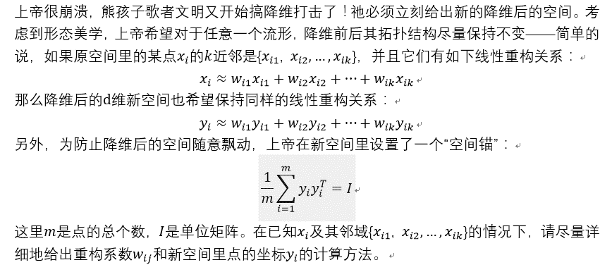

# 哔哩哔哩 2019 秋招技术岗（算法）第二套笔试题

## 1



你的答案

本题知识点

算法工程师 哔哩哔哩 机器学习 2019

讨论

[团团来了](https://www.nowcoder.com/profile/796393664)

考查 LLE 算法，局部线性嵌入

发表于 2019-08-20 16:54:22

* * *

## 2

av394281 中，充满威严的蕾米莉亚大小姐因为触犯某条禁忌，被隙间妖怪八云紫（紫 m……èi）按住头在键盘上滚动。  同样在弹幕里乱刷梗被紫姐姐做成罪袋的你被指派找到大小姐脸滚键盘打出的一行字中的第 `k` 个仅出现一次的字。 (为简化问题，大小姐没有滚出 ascii 字符集以外的字)   

本题知识点

哔哩哔哩 Java 工程师 C++工程师 iOS 工程师 安卓工程师 运维工程师 前端工程师 算法工程师 PHP 工程师 测试工程师 字符串 *模拟 查找 *2019 golang 工程师** **讨论

[0b100001101000](https://www.nowcoder.com/profile/568883663)

| 334 ms | 4484K | Python 3 |

```cpp
try:
    while 1:
        s = input().strip().split(' ',1)
        n,l,o,r,f = int(s[0]),s[1],[],[],1
        for i in l:
            if i not in r and l.count(i)==1:
                o.append(i)
                if len(o)==n:
                    print('['+i+']')
                    f = 0
                    break
            else: r.append(i)
        if f: print("Myon~")
except:
    pass
```

编辑于 2019-09-10 02:10:16

* * *

[66667](https://www.nowcoder.com/profile/938200840)

```cpp
while(line = readline()){

    var e = 0;
    for(i=0;i<line.length;i++){
        if(line[i]==" "){
            e = i;
            break;
        }
    }
    if(e==1){
        var k = parseInt(line[0]);
    }else{
        var k = parseInt(line[0])*10+parseInt(line[1]);;
    }
    var t = [];
    for(i=e+1;i<line.length;i++){
        t.push(line[i]);
    }
    var temp = [];
    var count= [] ;
    for(i=0;i<t.length;i++){
        if(temp.indexOf(t[i])==-1){
            var l =0;
            temp.push(t[i]);
            count.push(l++);
        }else{
            var index = temp.indexOf(t[i]);
            count[index]++;
        }
    }
    var w = [];

    for(i=0;i<count.length;i++){
        count[i]+1;
        if(count[i]==0){
            w.push(temp[i]);
        }

      }
    var pp = 'Myon~';
    if(w.length>=k){
           console.log('['+w[k-1]+']');
    }else{
              console.log(pp);
        }
}
```

编辑于 2019-09-02 15:39:49

* * *

[麦田 201810281321172](https://www.nowcoder.com/profile/798734801)

5 !"#$%&'()*+,-./0123456789:;<=>?@ABCDEFGHIJKLMNOPQRSTUVWXYZ[\]^_`abcdefghijklmnopqrstuvwxyz{|}~测试中这个例子为什么答案是 [$]，而不是[%] ？

发表于 2019-09-08 14:12:30

* * *

## 3

给定一个合法的表达式字符串，其中只包含非负整数、加法、减法以及乘法符号（不会有括号），例如 7+3*4*5+2+4-3-1，请写程序计算该表达式的结果并输出；

本题知识点

哔哩哔哩 Java 工程师 C++工程师 iOS 工程师 安卓工程师 运维工程师 前端工程师 算法工程师 PHP 工程师 测试工程师 字符串 *栈 *模拟 2019 golang 工程师** **讨论

[SevenHsu](https://www.nowcoder.com/profile/1122192)

中缀表达式转后缀表达式的过程中求解：

```cpp
#include<iostream>
#include<stack>
using namespace std;

// 运算符号优先级比较函数
bool priorCompare(char a,char b){
    // 如果到字符串末尾则返回 false
    if(a=='\0')
        return false;

    if(a=='*'){
        if(b=='*')
            return false;
        else
            return true;
    }
    else
        return false;
}
// 计算结果
int getCalc(int a,int b,char sign){
    if(sign=='*')
        return a*b;
    else if(sign=='+')
        return a+b;
    else
        return a-b;

}
int main(){
    stack<char> sign; // 运算符号栈
    stack<int> result; // 数字栈
    string input;
    cin>>input;
    while(input!="END"){
        string digits="";
        for(int i=0;i<=input.length();i++){
            char c=input[i];
            // 如果当前字符仍是数字则将其连接在之前的数字字符串上，并循环到下一个字符
            if(isdigit(c))
                digits+=c;
            else{
                // 当前字符是运算符，则先把上一个完整的数字放进数字栈 result 中
                {
                    result.push(atoi(digits.c_str()));
                    digits="";
                }
                // 若当前运算符号优先级低于运算符号栈顶的运算符号，则计算数字栈顶两个元素的结果，并将结果如栈，循环直到符号栈空或当前符号优先级大于符号栈顶符号
                while(!sign.empty()&&!priorCompare(c,sign.top())){
                    int b=result.top();
                    result.pop();
                    int a=result.top();
                    result.pop();
                    result.push(getCalc(a,b,sign.top()));
                    sign.pop();
                }
                // 不满足上述条件，就将当前符号压入符号栈
                sign.push(c);
            }
        }
        // 计算完毕，输出结果。
        cout<<result.top()<<endl;
        // 清空数字栈
        result.pop();
        // 清空符号栈
        sign.pop();
        cin>>input;
    }
    return 0;
}
```

发表于 2019-08-30 20:41:23

* * *

[ggg1235](https://www.nowcoder.com/profile/239258684)

```cpp
def main():
    while 1:
        i = input()
        if i == "END":
            break
        exec("print("+i+")")

if __name__=="__main__":
    main()

```

python 直接 exec 就完事了运行时间：34ms    占用内存：3840k

发表于 2019-06-26 18:23:22

* * *

[TensorFlow201905181028317](https://www.nowcoder.com/profile/964082117)

```cpp

	while(line=readline()){

	var lines = line.split('\r');

	for(var i=0;i<lines.length;i++){

	if(lines[i]=='END') break;

	else print(eval(lines[i]));

	}

	}

```

对于 js 来说 eval 就完事了

编辑于 2019-05-31 10:49:31

* * *

## 4

小 A 参加了一个 n 人的活动，每个人都有一个唯一编号 i(i>=0 & i<n)，其中 m 对相互认识，在活动中两个人可以通过互相都认识的一个人介绍认识。现在问活动结束后，小 A 最多会认识多少人？

本题知识点

哔哩哔哩 Java 工程师 C++工程师 iOS 工程师 安卓工程师 运维工程师 前端工程师 算法工程师 PHP 工程师 测试工程师 图 高级结构 2019 golang 工程师

讨论

[如果没有人看着我那该多快乐](https://www.nowcoder.com/profile/569308407)

```cpp
#include<bits/stdc++.h>
using namespace std;
const int maxn = 1e5 + 8;
vector<int> G[maxn];
int res = 0;

//深度遍历 找到一个集合的人
void dfs(int ai, vector<bool> &v) {
	for (int i = 0; i < G[ai].size(); ++i) {
		if (!v[G[ai][i]]) {
			v[G[ai][i]] = true;
			res++;
			dfs(G[ai][i], v);
		}	

	}
	return;
}

int main() {
	int n, ai, m;
	cin >> n >> ai >> m;
    //构建邻接表
	while (m--) {
		int p1, p2;
		char chs;
		cin >> p1 >> chs >> p2;
		G[p1].push_back(p2);
		G[p2].push_back(p1);

	}
	vector<bool> visited(n, false);

    //除去本来就认识的人和自己
	int already = G[ai].size() + 1;
	dfs(ai,visited);

	cout << res - already << endl;

	return 0;
}

```

发表于 2019-08-19 15:27:29

* * *

[nbgao](https://www.nowcoder.com/profile/211289)

```cpp
#include <bits/stdc++.h>
using namespace std;

int p[10001];
int findParent(int x){
    return (p[x]==x)?x:p[x]=findParent(p[x]);
}

int main(){
    int n,m,t,cnt=0;
    cin>>n>>t>>m;
    for(int i=0;i<n;i++)
        p[i] = i;

    for(int i=0;i<m;i++){
        int a,b;
        scanf("%d,%d", &a, &b);
        int pa = findParent(a);
        int pb = findParent(b);
        if(a==t || b==t)
            cnt--;
        if(pa != pb)
            p[pa] = pb;
    }
    for(int i=0;i<n;i++)
        if(findParent(i) == findParent(t))
            cnt++;
    cout<<cnt-1<<endl;
    return 0;
}
```

发表于 2019-10-15 00:48:36

* * *

[Whisper321](https://www.nowcoder.com/profile/110525325)

```cpp
# 方法和之前用 Python 的那位是一模一样的，只不过写了个并查集的类来实现，我自己是 AC 了的
class UnionSet:
    def __init__(self, n):
        self.parents = [i for i in range(n)]
        self.rank = [1]*n
    def find(self, x):
        if self.parents[x] != x:
            self.parents[x] = self.find(self.parents[x])
        return self.parents[x]
    def union(self, x, y):
        px, py = self.find(x), self.find(y)
        if px != py:
            if self.rank[px] > self.rank[py]:
                self.parents[py] = px
                self.rank[px] += self.rank[py]
            else:
                self.parents[px] = py
                self.rank[py] += self.rank[px]
import sys
lines = sys.stdin.readlines()
n = int(lines[0].strip())
A = int(lines[1].strip())
us = UnionSet(n)
seen = set()
for line in lines[3:]:
    i, j = list(map(int, line.split(',')))
    if i == A:
        seen.add(j)
    elif j == A:
        seen.add(i)
    us.union(i, j)
ans = 0
root = us.find(A)
for i in range(n):
    if us.find(i) == root:
        ans += 1
print(ans - 1 - len(seen))
```

发表于 2019-09-03 21:49:36

* * *****