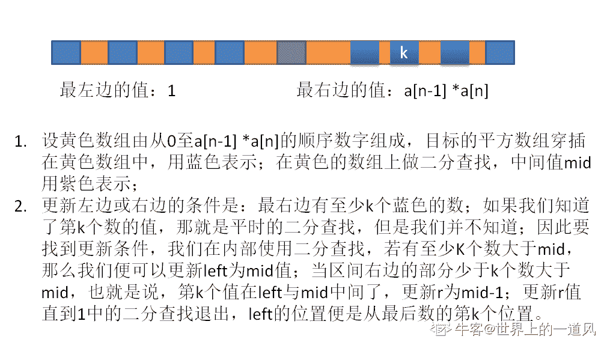

# 哔哩哔哩 2019 秋招技术岗（算法）第三套笔试题

## 1


你的答案

本题知识点

算法工程师 哔哩哔哩 机器学习 2019

讨论

[我真 TM 没开挂](https://www.nowcoder.com/profile/774318394)

[对于位置 i（2<i<N）,最终保持在平衡状态]] 

发表于 2019-05-16 20:10:29

* * *

[苍茫写下远航。](https://www.nowcoder.com/profile/803604774)

```cpp

            发表于 2019-07-15 21:52:16

        2
          金闪闪死后，红 A 拿到了王之财宝，里面有 n 个武器，长度各不相同。红 A 发现，拿其中三件武器首尾相接，组成一个三角形，进行召唤仪式，就可以召唤出一个山寨金闪闪。（例如，三件武器长度为 10、15、20，可以召唤成功。若长度为 10、11、30，首尾相接无法组成三角形，召唤失败。）红 A 于是开了一个金闪闪专卖店。他把王之财宝排成一排，每个客人会随机抽取到一个区间[l,r],客人可以选取区间里的三件武器进行召唤（客人都很聪慧，如果能找出来合适的武器，一定不会放过）。召唤结束后，客人要把武器原样放回去。m 个客人光顾以后，红 A 害怕过多的金闪闪愉悦太多男人，于是找到了你，希望你帮他统计出有多少山寨金闪闪被召唤出来。 

   数据范围：  ，  ，每件武器的长度满足 

            本题知识点

                                                            哔哩哔哩 
                                                Java 工程师 
                                                C++工程师 
                                                iOS 工程师 
                                                安卓工程师 
                                                运维工程师 
                                                前端工程师 
                                                算法工程师 
                                                PHP 工程师 
                                                测试工程师 
                                                数学 
                                                数组 
                                                复杂度 
                                                2019 
                                                golang 工程师 

        讨论
            [koyume](https://www.nowcoder.com/profile/447140109)

                                                                      [`www.cnblogs.com/dogenya/p/11184311.html`](https://www.cnblogs.com/dogenya/p/11184311.html)   
   博客内附带 ac 代码和完整思路，欢迎大家赏脸。

            发表于 2019-07-14 15:12:14

            [无心 2019](https://www.nowcoder.com/profile/991674511)

```
#include<bits/stdc++.h>
using namespace std;
const int MAXN=(int)1e7 + 5;
int n,a[MAXN],m;
vector<int>v;
int main()
{
    while(~scanf("%d",&n)) {
        for(int i=1; i<=n; i++)
            scanf("%d",&a[i]);
        scanf("%d",&m);
        int cnt=0;
        while(m--) 
        {
            int l,r;
            scanf("%d%d",&l,&r);
            if(r-l+1>=47)
                cnt++;
            else if(r-l+1<3)
                continue;
            else {
                v.clear();
                for(int i=l; i<=r; i++)
                    v.push_back(a[i]);
                sort(v.begin(),v.end());
                int len=v.size();
                for(int i=0; i<len-2; i++) {
                    if(v[i]+v[i+1]>v[i+2]) {
                        cnt++;
                        break;
                    }
                }
            }
        }
        printf("%d\n",cnt);
    }
    return 0;
}
```cpp

            发表于 2019-08-14 21:12:04

            [zymcc](https://www.nowcoder.com/profile/291227366)

```
#include<iostream>
#include<string>

using    namespace    std;

int main(){
    int n,m,n0=0;
    int q[10000000]={0};

    while(cin>>n){
        int jg=0;
        for(int i=0;i<n;i++){
            cin>>q[i];
        }
        cin>>m;
        int n1,n2;
        for(int i=0;i<m;i++){
            cin>>n1>>n2;
            n1--;

            if(n2-n1<3)
            {
                continue;
            }
            int  t=0;
            for(int j=n1;j<n2-2;j++){
                if(t==1){
                    break;
                }
                for(int k=j+1;k<n2-1;k++){
                    if(t==1){
                        break;
                    }
                    for(int l=k+1;l<n2;l++){

                        if((q[j]+q[k]>q[l])){
                            if((q[j]+q[l]>q[k])){
                                if((q[k]+q[l]>q[j])){
                                    t=1;

                                    //cout<<q[j]<<","<<q[k]<<","<<q[l]<<";";
                                        break;
                                }
                            }
                        }
                    }
                }
            }
            jg=jg+t;

        }
        cout<<jg;
    }
}
```cpp

            发表于 2021-06-25 11:52:28

        3
          打败魔人布欧以后，孙悟空收了 n 个徒弟，每个徒弟战斗力各不相同。他教导所有的徒弟和体术，合体后战斗力为原战斗力相乘。任何两个徒弟都可以合体，所以一共有 n*(n-1)/2 种合体徒弟。有一天，他想考验一下孙悟天战斗力如何，希望在所有 n*(n-1)/2 种合体徒弟中选择战斗力第 k 高的，与孙悟天对战。可是孙悟空徒弟太多了，他已然懵逼，于是找到了你，请你帮他找到对的人。  

            本题知识点

                                                            哔哩哔哩 
                                                Java 工程师 
                                                C++工程师 
                                                iOS 工程师 
                                                安卓工程师 
                                                运维工程师 
                                                前端工程师 
                                                算法工程师 
                                                PHP 工程师 
                                                测试工程师 
                                                查找 *数组 
                                                穷举 
                                                2019 
                                                golang 工程师*  *讨论

[++offer&&offer++](https://www.nowcoder.com/profile/386865333)

```
// 二分答案，然后再去找答案。思路和 9 月 1 号 pdd 最后一道类似。
#include <iostream>
#include <cstring>
#include <cmath>
#include <vector>
#include <algorithm>
#include <vector>
#include <list>
#include <stack>
#include <string>
#include <set>
#include <queue>
#include <climits>
#include <unordered_set>
#include <map>
#include <iostream>
#include <algorithm>
#include <cstring>
#include <unordered_map>
#include <map>
using namespace std;
typedef  long long LL;
const int mod = 1e9+7;
using namespace std;
const int inf = 0x7f7f7f7f;
#define _for(i,l,r) for(int i=(l);i<(r);i++)
LL data[1000005];
int main() {
    LL n,k;
    scanf("%lld%lld",&n,&k);
    _for(i,0,n){
        scanf("%lld",&data[i]);
    }

    sort(data,data + n);

    LL l = data[0] * data[1], r = data[n - 1] * data[n - 2];
    k = n * (n - 1) / 2 - k + 1;
    while(r > l){
        LL mid = (l + r) / 2;
        LL cnt = 0;
        for(LL i = n - 1;i>=0 ;i--){
            LL tmp = mid / data[i];
            if(i) {
                LL index = upper_bound(data, data + i, tmp) - data;
                cnt += index;
            }
        }
        if(cnt >= k){
            r = mid;
        }else{
            l = mid + 1;
        }
    }
    LL t = LLONG_MIN;
//    cout << " l : "<< l << endl;

    for(LL i = 1;i<n;i++){
        LL tmp = l / data[i];
        LL index = upper_bound(data, data + i, tmp) - data;
        t = max(t,data[i] * data[index - 1]);
    }
    cout << t << endl;
    return 0;
}
```cpp

发表于 2019-09-10 16:57:17

* * *

[世界上的一道风](https://www.nowcoder.com/profile/6228265)

                                                                    

发表于 2019-09-20 16:11:08

* * *

[i_mpc](https://www.nowcoder.com/profile/210921585)

```
#include <bits/stdc++.h>
using namespace std;
long long check(vector<long long>& att, long long& mid, long long k, long long n)
{
	long long below = 0;
	long long num = 0;
    long long same_p = 0;
	long long min_val = att[n - 1] * att[n - 1] * 2;
	for (long long i = 0; i < n; i++)
	{
		long long pos = upper_bound(att.begin() + i + 1, att.end(), mid / att[i]) - att.begin();
		num += att.size() - pos;
		if (pos == att.size())
			continue;
		long long minu = att[pos] * att[i] - mid;
		if (minu < min_val)
		{
			min_val = minu;
			below = att[pos] * att[i];
            same_p = 0;
		}
        if(minu == min_val)
            same_p++;
	}
	if(k == num || (num > k && num-same_p < k))
    {
        mid = below;
        num = k;
    }
	return num;
}

int main() {
	long long n,k;
	vector<long long> att;
	scanf("%lld %lld", &n, &k);
	long long tmp;
	for (long long i = 0; i < n; i++)
	{
		scanf("%lld", &tmp);
		att.push_back(tmp);
	}
	sort(att.begin(), att.end());
	long long lo = att[0] * att[1];
	long long hi = att[n - 1] * att[n - 2];
	long long ans;
	while (lo <= hi)
	{
		long long mid = (lo + hi) >> 1;
		long long num = check(att, mid, k, n);
		if (num == k)
		{
			ans = mid;
			break;
		}
		if (num > k)
		{
			lo = mid + 1;
		}
		else
			hi = mid - 1;
	}
	printf("%lld\n", ans);
	return 0;
}

```cpp

 AC 发表于 2019-08-20 17:15:58

* * *

## 4

  对于一个链表 L: L0→L1→…→Ln-1→Ln, 将其翻转成 L0→Ln→L1→Ln-1→L2→Ln-2→…  

  输入是一串数字，请将其转换成单链表格式之后，再进行操作  

本题知识点

                                                            哔哩哔哩 
                                                Java 工程师 
                                                C++工程师 
                                                iOS 工程师 
                                                安卓工程师 
                                                运维工程师 
                                                前端工程师 
                                                算法工程师 
                                                PHP 工程师 
                                                测试工程师 
                                                链表 *模拟 
                                                2019 
                                                golang 工程师*  *讨论

[子介杰](https://www.nowcoder.com/profile/270044386)

```
import java.util.Scanner;

/*
题目描述：对于一个链表 L: L0→L1→…→Ln-1→Ln,将其翻转成 L0→Ln→L1→Ln-1→L2→Ln-2→…
输入 1,2,3,4,5     输出 1,5,2,4,3
备注：数组长度不超过 100000
 */
public class Main {
    //定义 Node 节点
    static class ListNode {
        int val;
        ListNode next = null;

        ListNode(int val) {
            this.val = val;
        }
    }

    public static void main(String[] args) {
        //1.获取控制台输入的信息
        Scanner scanner = new Scanner(System.in);
        String string = scanner.nextLine();
        String[] strings = string.split(",");
        //2.将输入的字符串构成带头节点的 2 个链表
        ListNode head = creatList(strings);
        reorderList(head.next);
        head = head.next;
        //3.输出
        while(head!=null){
            if(head.next==null){
                System.out.print(head.val);
            }else{
                 System.out.print(head.val+",");
            }
            head=head.next;
        }

    }

    /*
     * 将 str 创建带头结点的单链表
     */
    public static ListNode creatList(String[] strings) {
        ListNode head = new ListNode(0);
        ListNode tail = head;
        for (String str : strings) {
            ListNode newNode = new ListNode(Integer.valueOf(str));
            tail.next = newNode;
            tail = newNode;
        }
        return head;
    }

    /*
     * 思路：链表平均拆分，后半部分链表反转，在将两个链表合并
     */
    public static void reorderList(ListNode head) {
        if (head == null || head.next == null) return;

        ListNode p1 = head;
        ListNode p2 = head;

        // 找到链表的一半
        while (p2.next != null && p2.next.next != null) {
            p1 = p1.next;
            p2 = p2.next.next;
        }

        // 将链表分为两段
        p2 = p1.next;
        p1.next = null;
        p1 = head;

        // 将后半段进行链表的翻转
        ListNode head2 = p2;
        ListNode next2;
        while (p2.next != null) {
            next2 = p2.next;
            p2.next = next2.next;
            next2.next = head2;
            head2 = next2;
        }
        p2 = head2;

        // 两条链表进行合并
        ListNode next1;
        while (p2 != null) {
            next1 = p1.next;
            next2 = p2.next;

            p1.next = p2;
            p2.next = next1;

            p1 = next1;
            p2 = next2;
        }

    }

}

```cpp

编辑于 2019-09-11 13:09:14

* * *

[从渺小开始](https://www.nowcoder.com/profile/1037850)

                                                                      正经的链表做***被当成傻子吗？ 

```
#include <bits/stdc++.h>
using namespace std;

struct node {
    int val;
    node* next;
    node(int x): val(x), next(nullptr){}
};

node* getMid(node* head){
    node* slow = head;
    node* fast = head;
    while(fast != nullptr && fast->next != nullptr){
        slow = slow->next;
        fast = fast->next->next;
    }
    return slow;
}

node* reverse(node* head){
    node* pre = nullptr;
    node* curr = head;
    while(curr != nullptr){
        node* tmp = curr->next;
        curr->next = pre;
        pre = curr;
        curr = tmp;
    }
    return pre;
}

void print(node* curr){
    bool flag = true;
    while(curr != nullptr){
        if(flag){
            cout << curr->val;
            flag = false;
        }else{
            cout << "," << curr->val;
        }
        curr = curr->next;
    }
    cout << endl;
}

node* merge(node* l1, node* l2){
    node* dummy = new node(0);
    node* curr =dummy;
    while(l1 != nullptr && l2 != nullptr){
        curr->next = l1;
        curr = l1;
        l1 = l1->next;
        curr->next = l2;
        curr = l2;
        l2 = l2->next;
    }
    if(l1 != nullptr){
        curr->next = l1;
    }
    if(l2 != nullptr){
        curr->next = l2;
    }

    return dummy->next;
}

int main(){
    string s;
    string st;
    cin >> s;

    node* dummy = new node(2);
    node* curr = dummy;

    for(int i = 0; i < s.length(); i++){
        st = "";
        while(i < s.length() && s[i] != ','){
            st.push_back(s[i]);
            i++;
        }
        int num = stoi(st);
        node* nt = new node(num);
        curr->next = nt;
        curr = nt;
    }

    node* l1 = dummy->next;
    node* mid = getMid(l1);
    node* l2 = mid->next;
    mid->next = nullptr;
    l2 = reverse(l2);

    curr = merge(l1, l2);
    print(curr);

}
```cpp

发表于 2019-08-19 17:49:21

* * *

[(ಥ_ಥ)大写的尷尬(ಥ_ಥ)](https://www.nowcoder.com/profile/316443971)

                                                                      说一下我的思路  首先是分别拿到正向和反向的单链表 如 
   L0 L1 L2 L3 ... Ln 
   Ln Ln-1 Ln-2 ...L1  然后进行一个个的合并(比合并链表那题要简单)  
   然后在遍历合并后的链表，在长度为 n 出断开就可以了 

发表于 2019-09-05 10:16:34

* * *** 
```