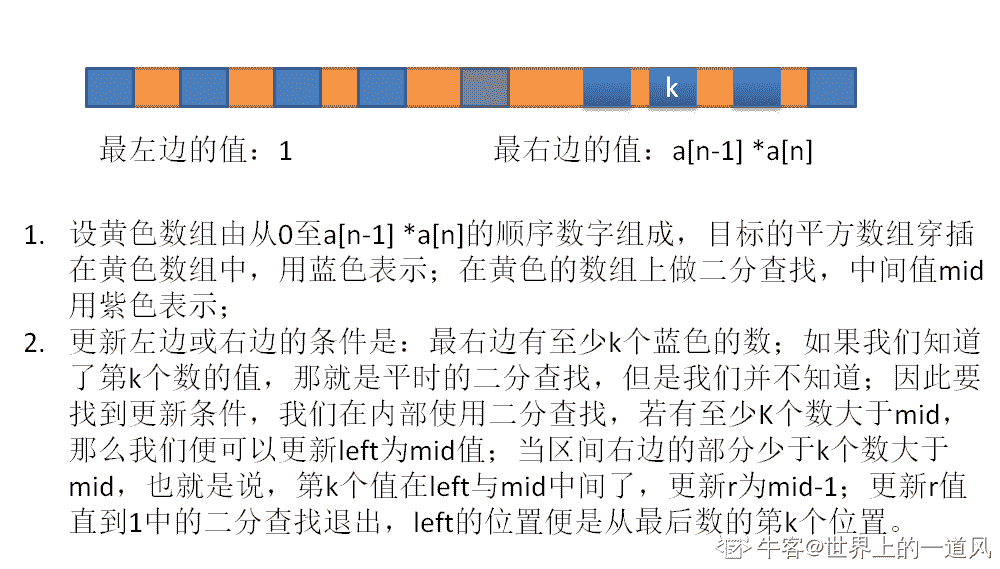

# 哔哩哔哩 2019 秋招编程题合集

## 1

22 娘和 33 娘接到了小电视君的扭蛋任务：
一共有两台扭蛋机，编号分别为扭蛋机 2 号和扭蛋机 3 号，22 娘使用扭蛋机 2 号，33 娘使用扭蛋机 3 号。
扭蛋机都不需要投币，但有一项特殊能力：
扭蛋机 2 号：如果塞 x（x 范围为>=0 整数）个扭蛋进去，然后就可以扭到 2x+1 个
扭蛋机 3 号：如果塞 x（x 范围为>=0 整数）个扭蛋进去，然后就可以扭到 2x+2 个
22 娘和 33 娘手中没有扭蛋，需要你帮她们设计一个方案，两人“轮流扭”（谁先开始不限，扭到的蛋可以交给对方使用），用“最少”的次数，使她们能够最后恰好扭到 N 个交给小电视君。

本题知识点

哔哩哔哩 Java 工程师 C++工程师 iOS 工程师 安卓工程师 运维工程师 前端工程师 算法工程师 PHP 工程师 测试工程师 数学 递归 2019 golang 工程师

讨论

[0b100001101000](https://www.nowcoder.com/profile/568883663)

```cpp
n = int(input())
o = []
while n:
    o.append('3' if n%2 == 0 else '2')
    n = (n-1)//2
print(''.join(o[::-1]))
```

发表于 2019-09-09 15:52:50

* * *

[chasein](https://www.nowcoder.com/profile/2885572)

```cpp
import java.util.*;
public class Main{
    public static void main(String[] args){
        Scanner sc = new Scanner(System.in);
            while(sc.hasNext()){
                int num = sc.nextInt();
                StringBuilder res = new StringBuilder();
                while(num != 0){
                    if(num % 2 == 0){
                        num = (num - 2) / 2;
                        res.insert(0, "3");
                    }else{
                        num = (num - 1) / 2;
                        res.insert(0, "2");
                    }
                }
                System.out.println(res);
            }
    }
}
```

发表于 2019-06-23 12:32:36

* * *

[雷凌云](https://www.nowcoder.com/profile/174189833)

这道题可以简化成走方格初始位置是 x=0，然后每步有两种选择 1、第一种选择是走到编号为 2*x+1 的方格，代号为 ‘2’2、第一种选择是走到编号为 2*x+2 的方格，代号为 ‘3’求一种可以正好走到 编号为 n 的方式

```cpp
# 逆推法：根据最后一步的奇偶，判断前一步的选择
n = int(input())
res = ''
while n > 0:
    if (n-2) % 2:
        n = (n-1) // 2
        res = '2' + res
    else:
        n = (n-2) // 2
        res = '3' + res
print(res)
```

发表于 2019-08-22 16:01:14

* * *

## 2

av394281 中，充满威严的蕾米莉亚大小姐因为触犯某条禁忌，被隙间妖怪八云紫（紫 m……èi）按住头在键盘上滚动。  同样在弹幕里乱刷梗被紫姐姐做成罪袋的你被指派找到大小姐脸滚键盘打出的一行字中的第 `k` 个仅出现一次的字。 (为简化问题，大小姐没有滚出 ascii 字符集以外的字)   

本题知识点

哔哩哔哩 Java 工程师 C++工程师 iOS 工程师 安卓工程师 运维工程师 前端工程师 算法工程师 PHP 工程师 测试工程师 字符串 *模拟 查找 *2019 golang 工程师** **讨论

[0b100001101000](https://www.nowcoder.com/profile/568883663)

| 334 ms | 4484K | Python 3 |

```cpp
try:
    while 1:
        s = input().strip().split(' ',1)
        n,l,o,r,f = int(s[0]),s[1],[],[],1
        for i in l:
            if i not in r and l.count(i)==1:
                o.append(i)
                if len(o)==n:
                    print('['+i+']')
                    f = 0
                    break
            else: r.append(i)
        if f: print("Myon~")
except:
    pass
```

编辑于 2019-09-10 02:10:16

* * *

[66667](https://www.nowcoder.com/profile/938200840)

```cpp
while(line = readline()){

    var e = 0;
    for(i=0;i<line.length;i++){
        if(line[i]==" "){
            e = i;
            break;
        }
    }
    if(e==1){
        var k = parseInt(line[0]);
    }else{
        var k = parseInt(line[0])*10+parseInt(line[1]);;
    }
    var t = [];
    for(i=e+1;i<line.length;i++){
        t.push(line[i]);
    }
    var temp = [];
    var count= [] ;
    for(i=0;i<t.length;i++){
        if(temp.indexOf(t[i])==-1){
            var l =0;
            temp.push(t[i]);
            count.push(l++);
        }else{
            var index = temp.indexOf(t[i]);
            count[index]++;
        }
    }
    var w = [];

    for(i=0;i<count.length;i++){
        count[i]+1;
        if(count[i]==0){
            w.push(temp[i]);
        }

      }
    var pp = 'Myon~';
    if(w.length>=k){
           console.log('['+w[k-1]+']');
    }else{
              console.log(pp);
        }
}
```

编辑于 2019-09-02 15:39:49

* * *

[麦田 201810281321172](https://www.nowcoder.com/profile/798734801)

5 !"#$%&'()*+,-./0123456789:;<=>?@ABCDEFGHIJKLMNOPQRSTUVWXYZ[\]^_`abcdefghijklmnopqrstuvwxyz{|}~测试中这个例子为什么答案是 [$]，而不是[%] ？

发表于 2019-09-08 14:12:30

* * *

## 3

给定一个合法的表达式字符串，其中只包含非负整数、加法、减法以及乘法符号（不会有括号），例如 7+3*4*5+2+4-3-1，请写程序计算该表达式的结果并输出；

本题知识点

哔哩哔哩 Java 工程师 C++工程师 iOS 工程师 安卓工程师 运维工程师 前端工程师 算法工程师 PHP 工程师 测试工程师 字符串 *栈 *模拟 2019 golang 工程师** **讨论

[SevenHsu](https://www.nowcoder.com/profile/1122192)

中缀表达式转后缀表达式的过程中求解：

```cpp
#include<iostream>
#include<stack>
using namespace std;

// 运算符号优先级比较函数
bool priorCompare(char a,char b){
    // 如果到字符串末尾则返回 false
    if(a=='\0')
        return false;

    if(a=='*'){
        if(b=='*')
            return false;
        else
            return true;
    }
    else
        return false;
}
// 计算结果
int getCalc(int a,int b,char sign){
    if(sign=='*')
        return a*b;
    else if(sign=='+')
        return a+b;
    else
        return a-b;

}
int main(){
    stack<char> sign; // 运算符号栈
    stack<int> result; // 数字栈
    string input;
    cin>>input;
    while(input!="END"){
        string digits="";
        for(int i=0;i<=input.length();i++){
            char c=input[i];
            // 如果当前字符仍是数字则将其连接在之前的数字字符串上，并循环到下一个字符
            if(isdigit(c))
                digits+=c;
            else{
                // 当前字符是运算符，则先把上一个完整的数字放进数字栈 result 中
                {
                    result.push(atoi(digits.c_str()));
                    digits="";
                }
                // 若当前运算符号优先级低于运算符号栈顶的运算符号，则计算数字栈顶两个元素的结果，并将结果如栈，循环直到符号栈空或当前符号优先级大于符号栈顶符号
                while(!sign.empty()&&!priorCompare(c,sign.top())){
                    int b=result.top();
                    result.pop();
                    int a=result.top();
                    result.pop();
                    result.push(getCalc(a,b,sign.top()));
                    sign.pop();
                }
                // 不满足上述条件，就将当前符号压入符号栈
                sign.push(c);
            }
        }
        // 计算完毕，输出结果。
        cout<<result.top()<<endl;
        // 清空数字栈
        result.pop();
        // 清空符号栈
        sign.pop();
        cin>>input;
    }
    return 0;
}
```

发表于 2019-08-30 20:41:23

* * *

[ggg1235](https://www.nowcoder.com/profile/239258684)

```cpp
def main():
    while 1:
        i = input()
        if i == "END":
            break
        exec("print("+i+")")

if __name__=="__main__":
    main()

```

python 直接 exec 就完事了运行时间：34ms    占用内存：3840k

发表于 2019-06-26 18:23:22

* * *

[TensorFlow201905181028317](https://www.nowcoder.com/profile/964082117)

```cpp

	while(line=readline()){

	var lines = line.split('\r');

	for(var i=0;i<lines.length;i++){

	if(lines[i]=='END') break;

	else print(eval(lines[i]));

	}

	}

```

对于 js 来说 eval 就完事了

编辑于 2019-05-31 10:49:31

* * *

## 4

小 A 参加了一个 n 人的活动，每个人都有一个唯一编号 i(i>=0 & i<n)，其中 m 对相互认识，在活动中两个人可以通过互相都认识的一个人介绍认识。现在问活动结束后，小 A 最多会认识多少人？

本题知识点

哔哩哔哩 Java 工程师 C++工程师 iOS 工程师 安卓工程师 运维工程师 前端工程师 算法工程师 PHP 工程师 测试工程师 图 高级结构 2019 golang 工程师

讨论

[如果没有人看着我那该多快乐](https://www.nowcoder.com/profile/569308407)

```cpp
#include<bits/stdc++.h>
using namespace std;
const int maxn = 1e5 + 8;
vector<int> G[maxn];
int res = 0;

//深度遍历 找到一个集合的人
void dfs(int ai, vector<bool> &v) {
	for (int i = 0; i < G[ai].size(); ++i) {
		if (!v[G[ai][i]]) {
			v[G[ai][i]] = true;
			res++;
			dfs(G[ai][i], v);
		}	

	}
	return;
}

int main() {
	int n, ai, m;
	cin >> n >> ai >> m;
    //构建邻接表
	while (m--) {
		int p1, p2;
		char chs;
		cin >> p1 >> chs >> p2;
		G[p1].push_back(p2);
		G[p2].push_back(p1);

	}
	vector<bool> visited(n, false);

    //除去本来就认识的人和自己
	int already = G[ai].size() + 1;
	dfs(ai,visited);

	cout << res - already << endl;

	return 0;
}

```

发表于 2019-08-19 15:27:29

* * *

[nbgao](https://www.nowcoder.com/profile/211289)

```cpp
#include <bits/stdc++.h>
using namespace std;

int p[10001];
int findParent(int x){
    return (p[x]==x)?x:p[x]=findParent(p[x]);
}

int main(){
    int n,m,t,cnt=0;
    cin>>n>>t>>m;
    for(int i=0;i<n;i++)
        p[i] = i;

    for(int i=0;i<m;i++){
        int a,b;
        scanf("%d,%d", &a, &b);
        int pa = findParent(a);
        int pb = findParent(b);
        if(a==t || b==t)
            cnt--;
        if(pa != pb)
            p[pa] = pb;
    }
    for(int i=0;i<n;i++)
        if(findParent(i) == findParent(t))
            cnt++;
    cout<<cnt-1<<endl;
    return 0;
}
```

发表于 2019-10-15 00:48:36

* * *

[Whisper321](https://www.nowcoder.com/profile/110525325)

```cpp
# 方法和之前用 Python 的那位是一模一样的，只不过写了个并查集的类来实现，我自己是 AC 了的
class UnionSet:
    def __init__(self, n):
        self.parents = [i for i in range(n)]
        self.rank = [1]*n
    def find(self, x):
        if self.parents[x] != x:
            self.parents[x] = self.find(self.parents[x])
        return self.parents[x]
    def union(self, x, y):
        px, py = self.find(x), self.find(y)
        if px != py:
            if self.rank[px] > self.rank[py]:
                self.parents[py] = px
                self.rank[px] += self.rank[py]
            else:
                self.parents[px] = py
                self.rank[py] += self.rank[px]
import sys
lines = sys.stdin.readlines()
n = int(lines[0].strip())
A = int(lines[1].strip())
us = UnionSet(n)
seen = set()
for line in lines[3:]:
    i, j = list(map(int, line.split(',')))
    if i == A:
        seen.add(j)
    elif j == A:
        seen.add(i)
    us.union(i, j)
ans = 0
root = us.find(A)
for i in range(n):
    if us.find(i) == root:
        ans += 1
print(ans - 1 - len(seen))
```

发表于 2019-09-03 21:49:36

* * *

## 5

金闪闪死后，红 A 拿到了王之财宝，里面有 n 个武器，长度各不相同。红 A 发现，拿其中三件武器首尾相接，组成一个三角形，进行召唤仪式，就可以召唤出一个山寨金闪闪。（例如，三件武器长度为 10、15、20，可以召唤成功。若长度为 10、11、30，首尾相接无法组成三角形，召唤失败。）红 A 于是开了一个金闪闪专卖店。他把王之财宝排成一排，每个客人会随机抽取到一个区间[l,r],客人可以选取区间里的三件武器进行召唤（客人都很聪慧，如果能找出来合适的武器，一定不会放过）。召唤结束后，客人要把武器原样放回去。m 个客人光顾以后，红 A 害怕过多的金闪闪愉悦太多男人，于是找到了你，希望你帮他统计出有多少山寨金闪闪被召唤出来。数据范围：  ，  ，每件武器的长度满足 

本题知识点

哔哩哔哩 Java 工程师 C++工程师 iOS 工程师 安卓工程师 运维工程师 前端工程师 算法工程师 PHP 工程师 测试工程师 数学 数组 复杂度 2019 golang 工程师

讨论

[koyume](https://www.nowcoder.com/profile/447140109)

[`www.cnblogs.com/dogenya/p/11184311.html`](https://www.cnblogs.com/dogenya/p/11184311.html)  博客内附带 ac 代码和完整思路，欢迎大家赏脸。

发表于 2019-07-14 15:12:14

* * *

[无心 2019](https://www.nowcoder.com/profile/991674511)

```cpp
#include<bits/stdc++.h>
using namespace std;
const int MAXN=(int)1e7 + 5;
int n,a[MAXN],m;
vector<int>v;
int main()
{
    while(~scanf("%d",&n)) {
        for(int i=1; i<=n; i++)
            scanf("%d",&a[i]);
        scanf("%d",&m);
        int cnt=0;
        while(m--) 
        {
            int l,r;
            scanf("%d%d",&l,&r);
            if(r-l+1>=47)
                cnt++;
            else if(r-l+1<3)
                continue;
            else {
                v.clear();
                for(int i=l; i<=r; i++)
                    v.push_back(a[i]);
                sort(v.begin(),v.end());
                int len=v.size();
                for(int i=0; i<len-2; i++) {
                    if(v[i]+v[i+1]>v[i+2]) {
                        cnt++;
                        break;
                    }
                }
            }
        }
        printf("%d\n",cnt);
    }
    return 0;
}
```

发表于 2019-08-14 21:12:04

* * *

[zymcc](https://www.nowcoder.com/profile/291227366)

```cpp
#include<iostream>
#include<string>

using    namespace    std;

int main(){
    int n,m,n0=0;
    int q[10000000]={0};

    while(cin>>n){
        int jg=0;
        for(int i=0;i<n;i++){
            cin>>q[i];
        }
        cin>>m;
        int n1,n2;
        for(int i=0;i<m;i++){
            cin>>n1>>n2;
            n1--;

            if(n2-n1<3)
            {
                continue;
            }
            int  t=0;
            for(int j=n1;j<n2-2;j++){
                if(t==1){
                    break;
                }
                for(int k=j+1;k<n2-1;k++){
                    if(t==1){
                        break;
                    }
                    for(int l=k+1;l<n2;l++){

                        if((q[j]+q[k]>q[l])){
                            if((q[j]+q[l]>q[k])){
                                if((q[k]+q[l]>q[j])){
                                    t=1;

                                    //cout<<q[j]<<","<<q[k]<<","<<q[l]<<";";
                                        break;
                                }
                            }
                        }
                    }
                }
            }
            jg=jg+t;

        }
        cout<<jg;
    }
}
```

发表于 2021-06-25 11:52:28

* * *

## 6

如果 version1 > version2 返回 1，如果 version1 < version2 返回-1，不然返回 0.

输入的 version 字符串非空，只包含数字和字符.。.字符不代表通常意义上的小数点，只是用来区分数字序列。例如字符串 2.5 并不代表二点五，只是代表版本是第一级版本号是 2，第二级版本号是 5.

本题知识点

哔哩哔哩 Java 工程师 C++工程师 iOS 工程师 安卓工程师 运维工程师 前端工程师 算法工程师 PHP 工程师 测试工程师 数学 字符串 *2019 golang 工程师* *讨论

[白色纯度](https://www.nowcoder.com/profile/485984577)

```cpp
# python 中的列表可以直接比较，只要把输入的数字按照'.'分割后，换为整数列表即可。
num = input().split()
version1 = list(map(int, num[0].split(".")))
version2 = list(map(int, num[1].split(".")))
if version1<version2:
    print(-1)
elif version1>version2:
    print(1)
else:
    print(0)
#print(version1, version2)
```

发表于 2019-07-04 11:09:50

* * *

[昔遥暮云](https://www.nowcoder.com/profile/294241826)

```cpp
//用 c 语言的 scanf 输入 int 判断更便捷；
#include <bits/stdc++.h>
using namespace std;
int main(){
    vector<int> arr1,arr2;
    int i=0,t;
    while(1){
        if(cin.peek()==' ')
            break;
        scanf("%d.",&t);
        arr1.push_back(t);
    }
    while(1){
        if(cin.peek()=='\n')
            break;
        scanf("%d.",&t);
        arr2.push_back(t);
    }
    while(i!=arr1.size()&&i!=arr2.size()){
        if(arr1[i]!=arr2[i]){
            t=arr1[i]>arr2[i] ? 1:-1;
            break;
        }
        i++;
    }
    if(i==arr1.size()||i==arr2.size()){
        if(arr1.size()==arr2.size())
            t=0;
        else
            t= arr1.size()>arr2.size() ? 1:-1;
    }
    cout<<t;
    return 0;
}

```

发表于 2019-11-13 10:06:33

* * *

[0b100001101000](https://www.nowcoder.com/profile/568883663)

```cpp
x,y = map(lambda x:list(map(int, x.split('.'))), input().split())
if x > y: print(1)
elif x < y: print(-1)
else: print(0)
```

发表于 2019-09-12 05:09:41

* * *

## 7

猛兽侠中精灵鼠在利剑飞船的追逐下逃到一个 n*n 的建筑群中，精灵鼠从（0,0）的位置进入建筑群，建筑群的出口位置为（n-1,n-1），建筑群的每个位置都有阻碍，每个位置上都会相当于给了精灵鼠一个固定值减速，因为精灵鼠正在逃命所以不能回头只能向前或者向下逃跑，现在问精灵鼠最少在减速多少的情况下逃出迷宫？

本题知识点

哔哩哔哩 Java 工程师 C++工程师 iOS 工程师 安卓工程师 运维工程师 前端工程师 算法工程师 PHP 工程师 测试工程师 动态规划 字符串 *2019 golang 工程师* *讨论

[无心 2019](https://www.nowcoder.com/profile/991674511)

```cpp
#include<bits/stdc++.h>
using namespace std;
int main()
{
    int n;
    cin>>n;
    string s;
    vector<vector<int>>num(n,vector<int>(n)),dp(n,vector<int>(n,0));
    for(int i=0;i<n;i++)
    {
        cin>>s;
        int t=0;
        for(int j=0;j<n;j++,t+=2)
            num[i][j]=s[t]-'0';
    }
    dp[0][0]=num[0][0];
    for(int i=1;i<n;i++)
        dp[i][0]=num[i][0]+dp[i-1][0];
    for(int j=1;j<n;j++)
        dp[0][j]=dp[0][j-1]+num[0][j];
    for(int i=1;i<n;i++)
        for(int j=1;j<n;j++)
            dp[i][j]=min(dp[i-1][j],dp[i][j-1])+num[i][j];
    cout<<dp[n-1][n-1]<<endl;
    return 0;
}
```

发表于 2019-08-13 19:32:23

* * *

[勇敢牛牛，不怕困难！](https://www.nowcoder.com/profile/840813925)

```cpp
#include <stdio.h>
#include <stdlib.h>

int main(const int argc, const char* const argv[]) {
  int n;
  fscanf(stdin, "%d\n", &n);

  int x, y, grid[n][n];
  for (y = 0; y < n; ++y)
    for (x = 0; x < n; ++x)
      fscanf(stdin, "%d,", *(grid + y) + x);

  for (x = 1; x < n; ++x) grid[0][x] += grid[0][x - 1];
  for (y = 1; y < n; ++y) grid[y][0] += grid[y - 1][0];

  for (y = 1; y < n; ++y)
    for (x = 1; x < n; ++x)
      grid[y][x] += fmin(grid[y - 1][x], grid[y][x - 1]);

  fprintf(stdout, "%d\n", grid[n - 1][n - 1]);
  return 0;
}
```

发表于 2021-08-05 19:09:25

* * *

[零葬](https://www.nowcoder.com/profile/75718849)

一道非常典型的动态规划题

```cpp
import java.io.BufferedReader;
import java.io.InputStreamReader;
import java.io.IOException;

public class Main {
    public static void main(String[] args) throws IOException {
        BufferedReader br = new BufferedReader(new InputStreamReader(System.in));
        String strN;
        while((strN = br.readLine()) != null){
            int n = Integer.parseInt(strN);
            int[][] matrix = new int[n][n];
            for(int i = 0; i < n; i++){
                String[] strRow = br.readLine().trim().split(",");
                for(int j = 0; j < n; j++){
                    matrix[i][j] = Integer.parseInt(strRow[j]);
                }
            }
            System.out.println(solve(matrix, n));
        }
    }

    // 动态规划求解最小路径
    private static int solve(int[][] dp, int n) {
        for(int i = 0; i < n; i++){
            for(int j = 0; j < n; j++){
                if(i == 0 && j == 0)
                    continue;
                else if(i == 0)
                    dp[i][j] += dp[i][j - 1];
                else if(j == 0)
                    dp[i][j] += dp[i - 1][j];
                else
                    dp[i][j] += Math.min(dp[i - 1][j], dp[i][j - 1]);
            }
        }
        return dp[n - 1][n - 1];
    }
}
```

发表于 2020-10-26 11:27:44

* * *

## 8

给定一个数字矩阵，请设计一个算法从左上角开始顺时针打印矩阵元素

本题知识点

哔哩哔哩 Java 工程师 C++工程师 iOS 工程师 安卓工程师 运维工程师 前端工程师 算法工程师 PHP 工程师 测试工程师 数组 模拟 递归 2019 golang 工程师

讨论

[Chrety](https://www.nowcoder.com/profile/994602167)

```cpp
#include <bits/stdc++.h>
using namespace std;
const int N = 1050;

int n, m;
int a[N][N], ans[N][N];
bool vis[N][N];

vector<int>v;

int dx[] = {0, 1, 0, -1};
int dy[] = {1, 0, -1, 0};

void dfs(int x, int y, int dirx, int diry) {
    v.push_back(a[x][y]);
    vis[x][y] = 1;
    int xx = x + dirx, yy = y + diry;
    if (xx >= 1 && xx <= n && yy >= 1 && yy <= m && !vis[xx][yy])
        dfs(xx, yy, dirx, diry);
    for (int i = 0; i < 4; ++i) {
        int xx = x + dx[i], yy = y + dy[i];
        if (xx >= 1 && xx <= n && yy >= 1 && yy <= m && !vis[xx][yy]) {
            dfs(xx, yy, dx[i], dy[i]);
        }
    }
}

int main() {
    while (cin >> n >> m) {
        if (n == -1 && m == -1) break;
        for (int i = 1; i <= n; ++i)
            for (int j = 1; j <= m; ++j)
                cin >> a[i][j];
        v.clear();
        memset(vis, 0, sizeof vis);
        dfs(1, 1, 0, 1);
        for (int i = 0; i < v.size() - 1; ++i)
            cout << v[i] << ',';
        cout << v[v.size() - 1] << '\n';
    }
}
```

发表于 2019-10-14 22:02:24

* * *

[0b100001101000](https://www.nowcoder.com/profile/568883663)

语言：Python 3 运行时间： 168 ms 占用内存：19336K 状态：答案正确

```cpp
while 1:
    m,n = map(int,input().split())
    if m == -1: break
    p = []
    o = [input().split() for _ in range(m)]
    while 1:
        try:
            p.extend(o.pop(0))
            for i in range(len(o)-1):
                p.append(o[i].pop())
            p.extend(o.pop(-1)[::-1])
            for i in range(-len(o)+1,0):
                p.append(o[-i].pop(0))
        except: break
    print(','.join(p))

```

编辑于 2019-09-13 22:52:49

* * *

[意识流选手](https://www.nowcoder.com/profile/97302105)

**Python Solution**

```cpp
def clock_print(matrix):
    c = []
    while True:
        try:
            c.extend(matrix.pop(0))
            for i in range(len(matrix)-1):
                c.append(matrix[i].pop())
            c.extend(matrix.pop(-1)[::-1])
            for i in range(-len(matrix)+1,0):
                c.append(matrix[-i].pop(0))
        except IndexError:
            break
    return c

while True:
    M,N = [int(i) for i in input().split()]
    if M==-1 and N==-1:
        break
    matrix = [[str(i) for i in input().split()] for m in range(M)]
    result = clock_print(matrix)
    print(','.join(result))
```

编辑于 2019-08-29 11:39:10

* * *

## 9

从业 666 年的 BILIBILI 网络安全工程师 KindMo 最近很困惑，公司有一个业务总是受到 SSRF 攻击。请帮他写一个程序，判断输入的字符串是否属于内网 IP，用于防御该漏洞。
我们知道常见的内网 IP 有，127.0.0.1，192.168.0.1 等。

本题知识点

哔哩哔哩 Java 工程师 C++工程师 iOS 工程师 安卓工程师 运维工程师 前端工程师 算法工程师 PHP 工程师 测试工程师 字符串 *模拟 golang 工程师 2019* *讨论

[infiniteft](https://www.nowcoder.com/profile/6015255)

**思路：ip 转换为整数，判断数字是否属于内网地址对应的数字：****10.0.0.0 - 10.255.255.255:  需要判断：10****127.0.0.0 - 127.255.255.255 需要判断： 127****172.16.0.0 - 172.31.255.255 需要判断： 12716 和 12731****192.168.0.0 - 192.168.255.255 需要判断： 192168**

```cpp
#include <iostream>
#include <cstdio>

#define INIT() ios::sync_with_stdio(false); cin.tie(0);cout.tie(0);

using namespace std;

int main()
{
    INIT();
    string ip;
    cin >> ip;
    int n = ip.size();
    int ip_num = 0;
    bool is_net = false;
    for(int i = 0; i < n; i++)
    {
        if(ip[i] == '.')
        {
            if(ip_num == 10 || ip_num == 127 || ip_num==17216 || ip_num ==192168 || ip_num==17231)
            {
                is_net = true;
                break;
            }
        }
        else
        {
            ip_num = ip_num * 10 + (ip[i] - '0');
        }

    }
    if(is_net) cout << "1" << endl;
    else cout << "0" << endl;
    return 0;
}
```

编辑于 2020-04-17 14:47:59

* * *

[nbgao](https://www.nowcoder.com/profile/211289)

```cpp
#include <bits/stdc++.h>
using namespace std;

int main(){
    int a,b,c,d;
    scanf("%d.%d.%d.%d", &a, &b, &c, &d);
    if(a==10 || (a==172 && (b>=16 && b<32)) || (a==192 && b==168))
        cout<<1<<endl;
    else
        cout<<0<<endl;
    return 0;
}
```

发表于 2019-10-10 22:15:35

* * *

[0b100001101000](https://www.nowcoder.com/profile/568883663)

```cpp
if input().split('.')[0] in ['127','192','10','172']: print(1)
else: print(0)
```

---

```cpp
if input()[:3] in ('127','192','10.','172'): print(1)
else: print(0)
```

编辑于 2019-09-20 17:47:33

* * *

## 10

给定一个整数数组,判断其中是否有 3 个数和为 N

本题知识点

哔哩哔哩 Java 工程师 C++工程师 iOS 工程师 安卓工程师 运维工程师 前端工程师 算法工程师 PHP 工程师 测试工程师 数组 哈希 *查找 *排序 *2019 golang 工程师*** ***讨论

[无心 2019](https://www.nowcoder.com/profile/991674511)

```cpp
#include <bits/stdc++.h>
using namespace std;
int main()
{
    int n,m;
    vector<int>num;
    while(cin>>m)
    {
        if(getchar() == ',')
            break;
        num.push_back(m);
    }
    cin>>n;
    sort(num.begin(),num.end());
    for(int i=1;i<=num.size()-2;i++)
    {
        int first = 0;
        int last = num.size()-1;
        while(first<i && last>i)
        {
            if(num[first]+num[last]+num[i] == n)
            {
                cout << "True" << endl;
                return 0;
            }
            else if(num[first]+num[last]+num[i] < n)
                first++;
            else
                last--;
        }
    }
    cout << "False" << endl;
    return 0;
}

```

发表于 2019-07-23 08:38:21

* * *

[66667](https://www.nowcoder.com/profile/938200840)

```cpp
while(line = readline()){
    var lines = line.split(",");
    var t = lines[0];
    var n = parseInt(lines[1]);
    var y = t.split(" ");
    var temp=[];
    for(i = 0;i<y.length;i++){
        temp.push(parseInt(y[i]));
    }
    temp.sort(com);
    var pp=yes(temp,n)
    print(pp)
}
function yes(temp,n){
        for(i=1;i<temp.length-2;i++){
        var first = 0;
        var last = temp.length-1;
        while(i>first&&i<last){
            if(temp[i]+temp[first]+temp[last]==n){
                var pp ="True";
                return pp;
            }
            else if(temp[i]+temp[first]+temp[last]<n){
                first++;
            }else{
                last--;
            }
        }
            var pp = "False"
    }
    return pp;
}
function com(a,b){
    return a-b;
}
```

发表于 2019-09-03 14:48:23

* * *

[听风者 201809290813325](https://www.nowcoder.com/profile/380675160)

```cpp
import java.util.*;
public class Main {
    public static void main(String[] args) {
        java.util.Scanner scanner = new java.util.Scanner(System.in);
        String str = scanner.nextLine();
        String[] temp = str.split(",");
        String[] numstr = temp[0].split(" ");
        int[] nums = new int[numstr.length];
        for (int i = 0; i < nums.length; i++)
            nums[i] = Integer.valueOf(numstr[i]);
        int target = Integer.valueOf(temp[1]);
        java.util.Arrays.sort(nums);

        for (int i = 0; i < nums.length - 2; i++) {
            int start = i + 1, end = nums.length - 1;
            while (start < end) {
                int sum = nums[i] + nums[start] + nums[end];
                if (sum == target){
                    System.out.println("True");
                    return;
                }  else if (sum < target)
                    start++;
                else
                    end--;
            }
        }
        System.out.println("False");
    }
}
```

编辑于 2019-08-20 15:46:26

* * *

## 11

实现一个 HTML 语法检查器。HTML 语法规则简化如下：标签必须闭合，可以由开始和结束两个标签闭合，如，也可以自闭合，
如<div />
标签可以嵌套如<div><a></a></div>或者 <div><a/></div>，但是标签不能交叉：<div><a></div></a>是不允许的标签里可以有属性
如<div id="a<1"></div>
属性的规则是 name="任意非引号字符"，多属性声明之间必须有空格，属性声明不符合规则时，整段 HTML 都算语法错误
输入文本只会出现字母 a-z 和<>"=
请用任意语言实现一个 HTML 语法检查器函数，有语法错误返回 1，没有语法错误返回 0

本题知识点

哔哩哔哩 Java 工程师 C++工程师 iOS 工程师 安卓工程师 运维工程师 前端工程师 算法工程师 PHP 工程师 测试工程师 字符串 *栈 *模拟 2019 golang 工程师** **讨论

[牛客 7587184 号](https://www.nowcoder.com/profile/7587184)

测试样例都是空的随缘法过了 85%.......

```cpp
import random
print(random.choice([0,1]))
```

编辑于 2019-05-19 02:07:12

* * *

[邂逅的瞬间](https://www.nowcoder.com/profile/793728490)

```cpp
import java.util.*;
import java.util.Stack;

public class Main{

    public static void main(String[] args){
        Scanner input = new Scanner(System.in);
        String str = input.nextLine();
        int result = 1;
        if(solve(str)) result = 0;
        System.out.println(result);
    }

    public static boolean solve(String str){
        str = str.trim(); //消除前后的空格
        if(str == null && str.length() == 0) return false;
        Stack<String> stack = new Stack<>(); //记录标签的入栈顺序
        int i = 0;
        while(i < str.length()){
            if(i == 0 && str.charAt(i) != '<') return false; //第一个字符不是<，则表明不是以标签开始
            if(i == str.length() - 1 && str.charAt(i) != '>') return false; //最后的字符不是>，则表明不是以标签结束
            if(str.charAt(i) == '<'){
                int j = i + 1;
                //'<'之后如果是标签，紧跟在'<'之后的字符必定是 a-z 或者'/'
                if(j < str.length() && (str.charAt(j) >= 'a' && str.charAt(j) <= 'z' || str.charAt(j) == '/')){
                    //获取标签字符串<xx xx="">
                    boolean inStr = false; //是否处于字符串"里面
                    while(j < str.length()){
                        if(!inStr && str.charAt(j) == '>'){  //标签结束
                            if(!checkAtt(str.substring(i + 1, j), stack)) //传入的标签已经去除'<'和'>'字符
                                return false; //属性有语法错误
                            i = j;
                            break;
                        }
                        else if(str.charAt(j) == '"') inStr = !inStr;
                        j++;
                    }
                }
            }
            i++;
        }
        if(stack.isEmpty()) return true;
        return false;
    }

    public static boolean checkAtt(String str, Stack<String> stack){  //处理标签里面的属性
        if(str == null && str.length() == 0) return true;
        int type = 0; //记录标签的类型，0 为开始标签<x>，1 为结束标签</x>,2 为自闭合标签<x/>
        if(str.charAt(0) == '/'){  //判断是否是结束标签
            if(!(str.length() >= 2 && str.charAt(1) >= 'a' && str.charAt(1) <= 'z')) return false; //结束标签的'/'之后必须紧跟字母
            type = 1; //为结束标签
            str = str.substring(1);
        }
        str = str.trim(); //去除字符串后面的空格
        if(str.charAt(str.length() - 1) == '/'){ //判断是否是自闭合标签
            if(type == 1) return false; //不能同时为结束标签，又是自闭合标签
            type = 2;
            str = str.substring(0, str.length() - 1);// 去除最后的'/'
        }
        int i = 0;
        //获取标签的名字，并判断是否符合闭合规则
        while(i < str.length() && str.charAt(i) != ' ') i++;
        String name = str.substring(0, i);
        if(type == 0) stack.push(name);
        else if(type == 1){
            if(!stack.isEmpty() && stack.peek().equals(name)) stack.pop();
            else return false;
        }
        //判断其属性是否有语法错误
        boolean hasAtt = false; //判断该标签是否有属性，针对结束标签不能有属性
        boolean hasBlank = false; //判断属性 name 之前是否有空格
        while(i < str.length()){
            while(i < str.length() && str.charAt(i) == ' ') {hasBlank = true; i++;}
            while(i < str.length() && str.charAt(i) != '=' && str.charAt(i) != ' ') i++; //获取属性名字
            if(i < str.length() && str.charAt(i) == '='){ //如果没有'='说明不是属性，不进行处理
                i++;
                if(i >= str.length() || str.charAt(i) != '"') return false; //'='之后必须是双引号
                i++;
                while(i < str.length() && str.charAt(i) != '"') i++; //寻找下一个双引号
                if(i >= str.length()) return false;
                if(!hasBlank) return false; //属性之前没有空格，语法错误
            }
            hasBlank = false;
            hasAtt = true;
            i++;
        }
        if(type == 1 && hasAtt) return false; //结束标签不能有属性
        return true;
    }
}

/*

	1、’<’之后的字符如果不是 a-z，则认为不是开始标签，可认为是标签的文本部分

	2、“</”之后的字符如果不是 a-z 或者空格，则认为不是结束标签，认为是标签的文本部分

	3、结束标签不能有属性，<a/>中’/’之后不能有属性

	4、标签的文本部分可能是单独的双引号（例子：<div>”</div>，输出 0）

	5、题目说属性的规则是 name=”任意非引号字符”，所以属性的’=’前和后都不能有空格

	6、题目说属性之间必须有空格，这说明不是属性之间，就允许没有空格。超级坑的例子：

	<fff><a name="x></a></fff><div>"/></fff><x o="p" q="rst"><z addr="></x>>"></z><y/><x/></x><u v="sfa"d"d"/>

	答案输出 0。最后的 v=”sfa”d”d”，在不违背题目条件的情况下，只能认为 v=”sfa”是属性，而 d”d”不是属性，可以没有空格。同时也说明了，在标签里不是属性的字符串是允许存在的，没有错误的。

	7、整个 HTML 字符串的前面和后面不能是文本内容

	8、采用 stack 判断标签的闭合状态

	9、如果采用练习模式，是没有例子的。估计是因为提示的例子是 HTML 字符串，所以浏览器会视其为 html 代码而执行，so 可以采用浏览器检查代码看例子。当然浏览器会对错误的字符串进行处理，比如<a/>，在浏览器里会被处理为<a></a>。如果只有<a>，没有结束标签时，浏览器会自动补齐，添加</a>

10、我是菜鸟，对 html 的语法规则不是很了解，想了两天，呜~好惨
*/
```

发表于 2019-07-25 20:39:03

* * *

[你和代码一样迷人](https://www.nowcoder.com/profile/377236445)

比较无语, 这个题 emmmmm.随缘

```cpp
let str = readline();
function checkHTML(s) {
    let flag = s;
    let arr = [];
    let reg1 = /(<(\w+) *([a-zA-Z0-9= "]*)>)\w*(<\/(\w+)>)/i;
    let reg2 = /(<(\w+) *([a-zA-Z0-9= "]*)\/>)/i;
    while (reg1.test(flag) || reg2.test(flag)) {
        if (reg1.test(flag)) {
            flag = flag.replace(reg1, (a, b, c, d, e, f, g) => {
                arr.push([a, b, c, d, e, f, g]);
                return '';
            });
        }else{
            flag = flag.replace(reg2, (a, b, c, d) => {
                arr.push([a, b, c, d]);
                return '';
            });
        }
    }
    return flag.length === 0 ? 0 : 1;
}
console.log(checkHTML(str));

```

自己测试是可以, 如果有不对的地方还请指正

发表于 2019-09-09 10:48:37

* * *

## 12

打败魔人布欧以后，孙悟空收了 n 个徒弟，每个徒弟战斗力各不相同。他教导所有的徒弟和体术，合体后战斗力为原战斗力相乘。任何两个徒弟都可以合体，所以一共有 n*(n-1)/2 种合体徒弟。有一天，他想考验一下孙悟天战斗力如何，希望在所有 n*(n-1)/2 种合体徒弟中选择战斗力第 k 高的，与孙悟天对战。可是孙悟空徒弟太多了，他已然懵逼，于是找到了你，请你帮他找到对的人。

本题知识点

哔哩哔哩 Java 工程师 C++工程师 iOS 工程师 安卓工程师 运维工程师 前端工程师 算法工程师 PHP 工程师 测试工程师 查找 *数组 穷举 2019 golang 工程师* *讨论

[++offer&&offer++](https://www.nowcoder.com/profile/386865333)

```cpp
// 二分答案，然后再去找答案。思路和 9 月 1 号 pdd 最后一道类似。
#include <iostream>
#include <cstring>
#include <cmath>
#include <vector>
#include <algorithm>
#include <vector>
#include <list>
#include <stack>
#include <string>
#include <set>
#include <queue>
#include <climits>
#include <unordered_set>
#include <map>
#include <iostream>
#include <algorithm>
#include <cstring>
#include <unordered_map>
#include <map>
using namespace std;
typedef  long long LL;
const int mod = 1e9+7;
using namespace std;
const int inf = 0x7f7f7f7f;
#define _for(i,l,r) for(int i=(l);i<(r);i++)
LL data[1000005];
int main() {
    LL n,k;
    scanf("%lld%lld",&n,&k);
    _for(i,0,n){
        scanf("%lld",&data[i]);
    }

    sort(data,data + n);

    LL l = data[0] * data[1], r = data[n - 1] * data[n - 2];
    k = n * (n - 1) / 2 - k + 1;
    while(r > l){
        LL mid = (l + r) / 2;
        LL cnt = 0;
        for(LL i = n - 1;i>=0 ;i--){
            LL tmp = mid / data[i];
            if(i) {
                LL index = upper_bound(data, data + i, tmp) - data;
                cnt += index;
            }
        }
        if(cnt >= k){
            r = mid;
        }else{
            l = mid + 1;
        }
    }
    LL t = LLONG_MIN;
//    cout << " l : "<< l << endl;

    for(LL i = 1;i<n;i++){
        LL tmp = l / data[i];
        LL index = upper_bound(data, data + i, tmp) - data;
        t = max(t,data[i] * data[index - 1]);
    }
    cout << t << endl;
    return 0;
}
```

发表于 2019-09-10 16:57:17

* * *

[世界上的一道风](https://www.nowcoder.com/profile/6228265)



发表于 2019-09-20 16:11:08

* * *

[i_mpc](https://www.nowcoder.com/profile/210921585)

```cpp
#include <bits/stdc++.h>
using namespace std;
long long check(vector<long long>& att, long long& mid, long long k, long long n)
{
	long long below = 0;
	long long num = 0;
    long long same_p = 0;
	long long min_val = att[n - 1] * att[n - 1] * 2;
	for (long long i = 0; i < n; i++)
	{
		long long pos = upper_bound(att.begin() + i + 1, att.end(), mid / att[i]) - att.begin();
		num += att.size() - pos;
		if (pos == att.size())
			continue;
		long long minu = att[pos] * att[i] - mid;
		if (minu < min_val)
		{
			min_val = minu;
			below = att[pos] * att[i];
            same_p = 0;
		}
        if(minu == min_val)
            same_p++;
	}
	if(k == num || (num > k && num-same_p < k))
    {
        mid = below;
        num = k;
    }
	return num;
}

int main() {
	long long n,k;
	vector<long long> att;
	scanf("%lld %lld", &n, &k);
	long long tmp;
	for (long long i = 0; i < n; i++)
	{
		scanf("%lld", &tmp);
		att.push_back(tmp);
	}
	sort(att.begin(), att.end());
	long long lo = att[0] * att[1];
	long long hi = att[n - 1] * att[n - 2];
	long long ans;
	while (lo <= hi)
	{
		long long mid = (lo + hi) >> 1;
		long long num = check(att, mid, k, n);
		if (num == k)
		{
			ans = mid;
			break;
		}
		if (num > k)
		{
			lo = mid + 1;
		}
		else
			hi = mid - 1;
	}
	printf("%lld\n", ans);
	return 0;
}

```

AC 发表于 2019-08-20 17:15:58

* * *

## 13

对于一个链表 L: L0→L1→…→Ln-1→Ln, 将其翻转成 L0→Ln→L1→Ln-1→L2→Ln-2→…

输入是一串数字，请将其转换成单链表格式之后，再进行操作

本题知识点

哔哩哔哩 Java 工程师 C++工程师 iOS 工程师 安卓工程师 运维工程师 前端工程师 算法工程师 PHP 工程师 测试工程师 链表 *模拟 2019 golang 工程师* *讨论

[子介杰](https://www.nowcoder.com/profile/270044386)

```cpp
import java.util.Scanner;

/*
题目描述：对于一个链表 L: L0→L1→…→Ln-1→Ln,将其翻转成 L0→Ln→L1→Ln-1→L2→Ln-2→…
输入 1,2,3,4,5     输出 1,5,2,4,3
备注：数组长度不超过 100000
 */
public class Main {
    //定义 Node 节点
    static class ListNode {
        int val;
        ListNode next = null;

        ListNode(int val) {
            this.val = val;
        }
    }

    public static void main(String[] args) {
        //1.获取控制台输入的信息
        Scanner scanner = new Scanner(System.in);
        String string = scanner.nextLine();
        String[] strings = string.split(",");
        //2.将输入的字符串构成带头节点的 2 个链表
        ListNode head = creatList(strings);
        reorderList(head.next);
        head = head.next;
        //3.输出
        while(head!=null){
            if(head.next==null){
                System.out.print(head.val);
            }else{
                 System.out.print(head.val+",");
            }
            head=head.next;
        }

    }

    /*
     * 将 str 创建带头结点的单链表
     */
    public static ListNode creatList(String[] strings) {
        ListNode head = new ListNode(0);
        ListNode tail = head;
        for (String str : strings) {
            ListNode newNode = new ListNode(Integer.valueOf(str));
            tail.next = newNode;
            tail = newNode;
        }
        return head;
    }

    /*
     * 思路：链表平均拆分，后半部分链表反转，在将两个链表合并
     */
    public static void reorderList(ListNode head) {
        if (head == null || head.next == null) return;

        ListNode p1 = head;
        ListNode p2 = head;

        // 找到链表的一半
        while (p2.next != null && p2.next.next != null) {
            p1 = p1.next;
            p2 = p2.next.next;
        }

        // 将链表分为两段
        p2 = p1.next;
        p1.next = null;
        p1 = head;

        // 将后半段进行链表的翻转
        ListNode head2 = p2;
        ListNode next2;
        while (p2.next != null) {
            next2 = p2.next;
            p2.next = next2.next;
            next2.next = head2;
            head2 = next2;
        }
        p2 = head2;

        // 两条链表进行合并
        ListNode next1;
        while (p2 != null) {
            next1 = p1.next;
            next2 = p2.next;

            p1.next = p2;
            p2.next = next1;

            p1 = next1;
            p2 = next2;
        }

    }

}

```

编辑于 2019-09-11 13:09:14

* * *

[从渺小开始](https://www.nowcoder.com/profile/1037850)

正经的链表做***被当成傻子吗？

```cpp
#include <bits/stdc++.h>
using namespace std;

struct node {
    int val;
    node* next;
    node(int x): val(x), next(nullptr){}
};

node* getMid(node* head){
    node* slow = head;
    node* fast = head;
    while(fast != nullptr && fast->next != nullptr){
        slow = slow->next;
        fast = fast->next->next;
    }
    return slow;
}

node* reverse(node* head){
    node* pre = nullptr;
    node* curr = head;
    while(curr != nullptr){
        node* tmp = curr->next;
        curr->next = pre;
        pre = curr;
        curr = tmp;
    }
    return pre;
}

void print(node* curr){
    bool flag = true;
    while(curr != nullptr){
        if(flag){
            cout << curr->val;
            flag = false;
        }else{
            cout << "," << curr->val;
        }
        curr = curr->next;
    }
    cout << endl;
}

node* merge(node* l1, node* l2){
    node* dummy = new node(0);
    node* curr =dummy;
    while(l1 != nullptr && l2 != nullptr){
        curr->next = l1;
        curr = l1;
        l1 = l1->next;
        curr->next = l2;
        curr = l2;
        l2 = l2->next;
    }
    if(l1 != nullptr){
        curr->next = l1;
    }
    if(l2 != nullptr){
        curr->next = l2;
    }

    return dummy->next;
}

int main(){
    string s;
    string st;
    cin >> s;

    node* dummy = new node(2);
    node* curr = dummy;

    for(int i = 0; i < s.length(); i++){
        st = "";
        while(i < s.length() && s[i] != ','){
            st.push_back(s[i]);
            i++;
        }
        int num = stoi(st);
        node* nt = new node(num);
        curr->next = nt;
        curr = nt;
    }

    node* l1 = dummy->next;
    node* mid = getMid(l1);
    node* l2 = mid->next;
    mid->next = nullptr;
    l2 = reverse(l2);

    curr = merge(l1, l2);
    print(curr);

}
```

发表于 2019-08-19 17:49:21

* * *

[(ಥ_ಥ)大写的尷尬(ಥ_ಥ)](https://www.nowcoder.com/profile/316443971)

说一下我的思路  首先是分别拿到正向和反向的单链表 如 L0 L1 L2 L3 ... LnLn Ln-1 Ln-2 ...L1  然后进行一个个的合并(比合并链表那题要简单) 然后在遍历合并后的链表，在长度为 n 出断开就可以了

发表于 2019-09-05 10:16:34

* * *

## 14

高贵的蕾米莉亚大小姐每天需要饮用定量 B 型血的红茶以保持威严，并且要分两杯在不同时段饮用。
女仆长十六夜咲夜每天可以制作很多杯不同剂量 B 型血的红茶供蕾米莉亚大小姐饮用。
某日，你和天才妖精琪露诺偷偷潜入红魔馆被咲夜抓住，要求在今日份的红茶中挑出所有满足大小姐要求的茶杯，否则……

本题知识点

哔哩哔哩 Java 工程师 C++工程师 iOS 工程师 安卓工程师 运维工程师 前端工程师 算法工程师 PHP 工程师 测试工程师 数组 排序 *查找 *穷举 golang 工程师 2019** **讨论

[谁的电脑](https://www.nowcoder.com/profile/743368)

```cpp
import java.io.BufferedReader;
import java.io.InputStreamReader;
import java.util.Arrays;

public class Main {
    public static void main(String[] args) throws Exception {
        BufferedReader br = new BufferedReader(new InputStreamReader(System.in));
        int n = Integer.parseInt(br.readLine());
        String[] s = br.readLine().split(" ");
        int need = Integer.parseInt(br.readLine());
        int[] blood = new int[n];
        for (int i = 0; i < blood.length; i++) {
            blood[i] = Integer.parseInt(s[i]);
        }
        Arrays.sort(blood);
        int left = 0;
        int right = n - 1;
        boolean flag = false;
        while (left < right) {
            if (blood[left] + blood[right] == need) {
                flag = true;
                System.out.println(blood[left] + " " + blood[right]);
                left++;
            } else if (blood[left] + blood[right] > need) {
                right--;
            } else {
                left++;
            }
        }
        if (!flag) {
            System.out.println("NO");
        }
    }
}
```

编辑于 2019-08-20 16:55:54

* * *

[无心 2019](https://www.nowcoder.com/profile/991674511)

```cpp
#include<bits/stdc++.h>
using namespace std;
int main()
{
    int n,m;
    cin>>n;
    vector<int>num(n);
    for(int i=0;i<n;i++)
        cin>>num[i];
    cin>>m;
    sort(num.begin(),num.end());
    int i=0,j=n-1,f=0;
    while(i<j)
    {
        if(num[i]+num[j]<m)
            i++;
        else if(num[i]+num[j]>m)
            j--;
        else{
            cout<<num[i]<<" "<<num[j]<<endl;
            f++;
            i++;
        }
    }
    if(f==0)
        cout<<"NO"<<endl;
    return 0;
}
```

发表于 2019-08-14 22:39:39

* * *

[nbgao](https://www.nowcoder.com/profile/211289)

```cpp
#include <bits/stdc++.h>
using namespace std;

int main(){
    int n,t;
    cin>>n;
    int a[n];
    for(int i=0;i<n;i++)
        cin>>a[i];
    cin>>t;
    sort(a,a+n);
    bool flag = false;
    int l=0, r=n-1;
    while(l<r){
        if(a[l]+a[r]==t){
            cout<<a[l++]<<" "<<a[r]<<endl;
            flag = true;
        }else if(a[l]+a[r]<t)
            l++;
        else
            r--;
    }
    if(!flag)
        cout<<"NO"<<endl;
    return 0;
}
```

发表于 2019-10-25 00:49:07

* * *****************