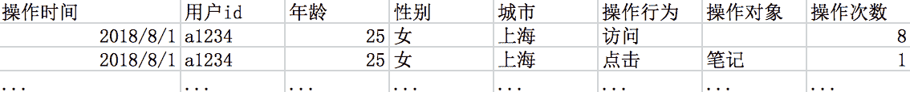

# 小红书 2019 年校园招聘数据分析岗位在线笔试第一批

## 1

想要了解上海市中学生的身高，从中抽取了 1000 个样本，这项调查中的样本是

正确答案: D   你的答案: 空 (错误)

```cpp
上海市全部中学生
```

```cpp
上海市全部中学生的身高
```

```cpp
从中抽取的 1000 名中学生
```

```cpp
从中抽取的 1000 名中学生的身高
```

本题知识点

Java 工程师 C++工程师 运维工程师 小红书 数据分析师 2019

讨论

[努力找到工作，保持积极乐观](https://www.nowcoder.com/profile/753849801)

从中抽取 1000 名高中生的身高

发表于 2020-05-31 23:51:38

* * *

## 2

偏态分布一般用以下哪个指标描述集中趋势

正确答案: C   你的答案: 空 (错误)

```cpp
标准差
```

```cpp
平均值
```

```cpp
中值
```

```cpp
方差
```

本题知识点

Java 工程师 C++工程师 运维工程师 小红书 数据分析师 2019

讨论

[不瘦下去不改名字](https://www.nowcoder.com/profile/773225715)

反映偏态分布的集中趋势往往用中位数反映正态分布的集中趋势往往用均值

编辑于 2019-08-17 09:42:53

* * *

[愤青 201812021315712](https://www.nowcoder.com/profile/178291126)

偏态分布，平均值的代表性比较差

发表于 2019-08-16 00:09:26

* * *

## 3

在以下不同的场景中，使用的分析方法不正确的有

正确答案: D   你的答案: 空 (错误)

```cpp
根据商家最近一年的经营及服务数据，用聚类算法判断出小红书商家在各自主营类目下所属的商家层级
```

```cpp
用关联规则算法分析出对护肤内容有兴趣的用户，是否对彩根据妆内容感兴趣
```

```cpp
根据用户最近购买的商品信息，用决策树算法识别出用户是男是女
```

```cpp
根据商家近几年的成交数据，用聚类算法拟合用户未来一个月可能的消费金额公式
```

本题知识点

Java 工程师 C++工程师 运维工程师 小红书 数据分析师 2019

讨论

[offer 来啦啊啊](https://www.nowcoder.com/profile/2801666)

应用回归算法

发表于 2019-05-15 23:26:13

* * *

[丫酱 123](https://www.nowcoder.com/profile/179710621)

聚类算法是机器学习中涉及对数据进行**分组**的一种算法

发表于 2020-03-15 17:45:44

* * *

[不瘦下去不改名字](https://www.nowcoder.com/profile/773225715)

```cpp
决策树算法是一种典型的分类方法
```

发表于 2019-08-17 09:45:08

* * *

## 4

用算法拦截可疑笔记，描述拦截的笔记中有多少是真的可疑笔记是

正确答案: D   你的答案: 空 (错误)

```cpp
AUC
```

```cpp
ROC
```

```cpp
Recall
```

```cpp
Precision
```

本题知识点

Java 工程师 C++工程师 运维工程师 小红书 数据分析师 2019

讨论

[offer 来啦啊啊](https://www.nowcoder.com/profile/2801666)

挑出来的西瓜中有多少比例是好瓜，查准率。全部好瓜有多少比例被挑出来，查全率。

发表于 2019-05-15 23:27:30

* * *

[余 offer](https://www.nowcoder.com/profile/95334956)

召回率（recall）：预测为正例且实际为正例的样本占所有正样本的比例。精准率（precision）：预测为正例且实际为正例的样本占所有预测为正例的样本的比例。

发表于 2019-08-23 14:19:46

* * *

[鲤鲤心](https://www.nowcoder.com/profile/951874219)

查准率=TP/（TP+FP）例，在所有我们预测有恶性肿瘤的病人中，实际上有恶性肿瘤的病人的百分比，越高越好。 
查全率=TP/（TP+FN）例，在所有实际上有恶性肿瘤的病人中，成功预测有恶性肿瘤的病人的百分比，越高越好。 

发表于 2019-09-19 19:58:32

* * *

## 5

当总体分布未知的情况下，可以采用以下哪种检验方法？

正确答案: D   你的答案: 空 (错误)

```cpp
T 检验
```

```cpp
方差分析
```

```cpp
F 检验
```

```cpp
KS 检验
```

本题知识点

Java 工程师 C++工程师 运维工程师 小红书 数据分析师 2019

讨论

[颖子颖子小颖子](https://www.nowcoder.com/profile/301390817)

1、t 检验，亦称 student t 检验（Student's t test），主要用于样本含量较小（例如 n < 30），[总体标准差](https://baike.baidu.com/item/%E6%80%BB%E4%BD%93%E6%A0%87%E5%87%86%E5%B7%AE/3861969)σ未知的[正态分布](https://baike.baidu.com/item/%E6%AD%A3%E6%80%81%E5%88%86%E5%B8%83/829892)。 t 检验是用 t 分布理论来推论差异发生的概率，从而比较两个平均数的差异是否显著。它与 f 检验、[卡方检验](https://baike.baidu.com/item/%E5%8D%A1%E6%96%B9%E6%A3%80%E9%AA%8C/2591853)并列。2、方差分析（ANOVA）又称“变异数分析”或“F 检验”，是由罗纳德·费雪爵士发明的，用于两个及两个以上样本均数差别的[显著性检验](https://baike.baidu.com/item/%E6%98%BE%E8%91%97%E6%80%A7%E6%A3%80%E9%AA%8C)。3、F 检验（F-test），最常用的别名叫做联合假设检验（英语：joint hypotheses test），此外也称方差比率检验、方差齐性检验。它是一种在[零假设](https://baike.baidu.com/item/%E***6%E5%81%87%E8%AE%BE/8078898)（null hypothesis, H0）之下，统计值服从[F-分布](https://baike.baidu.com/item/F-%E5%88%86%E5%B8%83)的检验。其通常是用来分析用了超过一个参数的统计模型，以判断该模型中的全部或一部分参数是否适合用来估计[母体](https://baike.baidu.com/item/%E6%AF%8D%E4%BD%93/10378001)。4、KS 检验与 t 检验之类的其他方法不同是 KS 检验不需要知道数据的分布情况，可以算是一种非参数检验方法。

发表于 2020-02-12 14:44:03

* * *

[农夫酸酸乳](https://www.nowcoder.com/profile/337797208)

F 检验可以判断是否齐方差，T 检验则需要根据是否齐方差决定使用 T 检验还是 T'检验。这两个都是需要知道总体分布的。

发表于 2019-07-22 17:46:14

* * *

[余 offer](https://www.nowcoder.com/profile/95334956)

KS 检验与 t-检验之类的其他方法不同是 KS 检验不需要知道数据的分布情况，可以算是一种非参数检验方法。

发表于 2019-08-23 14:23:31

* * *

## 6

在做数据分析中，如何处理异常或是缺失数据，请选择一下你认为正确的答案

正确答案: D   你的答案: 空 (错误)

```cpp
不处理
```

```cpp
删除元组
```

```cpp
数据补齐
```

```cpp
以上全对
```

本题知识点

Java 工程师 C++工程师 运维工程师 小红书 数据分析师 2019

讨论

[学习学习更要学习](https://www.nowcoder.com/profile/194328180)

```cpp
D
```

发表于 2019-05-13 20:28:19

* * *

[给个 id 吧](https://www.nowcoder.com/profile/147397774)

C

发表于 2021-03-02 09:53:33

* * *

[FightKing](https://www.nowcoder.com/profile/587144623)

c

发表于 2020-11-10 18:18:29

* * *

## 7

下列哪一项不是描述连续变量的

正确答案: A B C   你的答案: 空 (错误)

```cpp
二项分布
```

```cpp
泊松分布
```

```cpp
超几何分布
```

```cpp
正态分布
```

本题知识点

Java 工程师 C++工程师 运维工程师 小红书 数据分析师 2019

讨论

[wy_nk](https://www.nowcoder.com/profile/831084242)

二项分布：二项分布是由伯努利提出的概念，指的是重复 n 次独立的[伯努利试验](https://baike.baidu.com/item/%E4%BC%AF%E5%8A%AA%E5%88%A9%E8%AF%95%E9%AA%8C/238488)。在每次试验中只有两种可能的结果，而且两种结果发生与否互相对立，并且相互[独立](https://baike.baidu.com/item/%E7%8B%AC%E7%AB%8B/3415220)，与其它各次试验结果无关，事件发生与否的概率在每一次[独立试验](https://baike.baidu.com/item/%E7%8B%AC%E7%AB%8B%E8%AF%95%E9%AA%8C/12728918)中都保持不变，则这一系列试验总称为 n 重伯努利实验，当试验次数为 1 时，二项分布服从 0-1 分布。泊松分布：Poisson 分布，是一种统计与概率学里常见到的离散[概率分布](https://baike.baidu.com/item/%E6%A6%82%E7%8E%87%E5%88%86%E5%B8%83)，泊松分布适合于描述单位时间内随机事件发生的次数。超几何分布：超几何分布是统计学上一种离散概率分布。它描述了从有限 N 个物件（其中包含 M 个指定种类的物件）中抽出 n 个物件，成功抽出该指定种类的物件的次数（不放回）。正态分布：正态分布（Normal distribution），也称“常态分布”，又名[高斯分布](https://baike.baidu.com/item/%E9%AB%98%E6%96%AF%E5%88%86%E5%B8%83/10145793)（Gaussian distribution），最早由 A.棣莫弗在求[二项分布](https://baike.baidu.com/item/%E4%BA%8C%E9%A1%B9%E5%88%86%E5%B8%83)的渐近公式中得到。C.F.高斯在研究测量误差时从另一个角度导出了它。P.S.拉普拉斯和高斯研究了它的性质。是一个在[数学](https://baike.baidu.com/item/%E6%95%B0%E5%AD%A6/107037)、物理及工程等领域都非常重要的[概率](https://baike.baidu.com/item/%E6%A6%82%E7%8E%87)分布，在统计学的许多方面有着重大的影响力。正态曲线呈钟型，两头低，中间高，左右对称因其曲线呈钟形，因此人们又经常称之为[钟形曲线](https://baike.baidu.com/item/%E9%92%9F%E5%BD%A2%E6%9B%B2%E7%BA%BF/7736826)。若[随机变量](https://baike.baidu.com/item/%E9%9A%8F%E6%9C%BA%E5%8F%98%E9%87%8F/828980)X 服从一个[数学期望](https://baike.baidu.com/item/%E6%95%B0%E5%AD%A6%E6%9C%9F%E6%9C%9B/5362790)为μ、[方差](https://baike.baidu.com/item/%E6%96%B9%E5%B7%AE/3108412)为σ² 的正态分布，记为 N(μ，σ²)。其[概率密度函数](https://baike.baidu.com/item/%E6%A6%82%E7%8E%87%E5%AF%86%E5%BA%A6%E5%87%BD%E6%95%B0/5021996)为正态分布的[期望值](https://baike.baidu.com/item/%E6%9C%9F%E6%9C%9B%E5%80%BC/8664642)μ决定了其位置，其[标准差](https://baike.baidu.com/item/%E6%A0%87%E5%87%86%E5%B7%AE/1415772)σ决定了分布的幅度。当μ = 0,σ = 1 时的正态分布是[标准正态分布](https://baike.baidu.com/item/%E6%A0%87%E5%87%86%E6%AD%A3%E6%80%81%E5%88%86%E5%B8%83)。

编辑于 2019-11-07 17:00:07

* * *

## 8

下列关于相关系数的说法，正确的是

正确答案: A C   你的答案: 空 (错误)

```cpp
相关系数的数值越大，说明两个变量之间的相关程度越高
```

```cpp
若相关系数 r=0，则表明两个变量之间不存在任何相关关系
```

```cpp
若相关系数>0，则称两个变量正相关；若相关系数<0，则称两个变量负相关
```

```cpp
相关系数取值范围是(-1,1)
```

本题知识点

Java 工程师 C++工程师 运维工程师 小红书 数据分析师 2019

讨论

[农夫酸酸乳](https://www.nowcoder.com/profile/337797208)

A 选项有绝对值还好，没有绝对值肯定是错的啊。。。

发表于 2019-07-22 17:39:26

* * *

[求面试求 offer！](https://www.nowcoder.com/profile/426127285)

r=0 只是表示无线性相关，也可能存在非线性相关

发表于 2019-05-14 13:33:17

* * *

[脆莓啤酒](https://www.nowcoder.com/profile/558015881)

取值范围两端是闭区间。为 0 时是不线性相关。

发表于 2020-04-29 16:14:49

* * *

## 9

如下 SQL 建表语句：
create  table  goods_info(goods_id  INT  primary key， goods_name  char(8)  not null，category  char(20)，amount  INT)，那么可以插入到该表中的数据是？

正确答案: A D   你的答案: 空 (错误)

```cpp
(1234, '口红', ‘化妆品’, 5)
```

```cpp
(NULL, '口红', 化妆品, '5')
```

```cpp
('1234', NULL, NULL, '5')
```

```cpp
(1234, '口红', NULL, NULL)
```

本题知识点

Java 工程师 C++工程师 运维工程师 小红书 数据分析师 2019

讨论

[求 offer，求上岸](https://www.nowcoder.com/profile/9009501)

主键不能为空

发表于 2019-05-16 08:17:17

* * *

## 10

已知一个家庭有两个小孩，且已知家中至少有一个男孩，则家中至少有一个女孩的概率是 1(填分数)

你的答案 (错误)

1 参考答案 (1) 2/3

本题知识点

Java 工程师 C++工程师 运维工程师 小红书 数据分析师 2019

讨论

[怒求同名](https://www.nowcoder.com/profile/972106346)

B: (Boy)；G: 女(Girl)BB: 1/4 ; GG: 1/4 ; BG: 1/4 ; GB: 1/4;已知 GG 不可能，因此 (BG + GB) / (BB + BG + GB) = 2/3（其实这道题我做错了，女朋友帮我解的，我女朋友真实超级无敌聪明（七夕撒狗粮 手动狗头））

发表于 2019-08-07 15:35:29

* * *

[小蚂蚁^O^](https://www.nowcoder.com/profile/826244756)

至少有一个男孩的概率：1-（1/2*1/2）=3/4，另一个为女孩的概率：1/2 则，已经有一个男孩，至少有一个女孩的概率为：（1/2）/(3/4)=2/3

发表于 2019-08-22 10:53:18

* * *

[余 offer](https://www.nowcoder.com/profile/95334956)

家里有两个孩子，共有四种情况：男男   男女  女男  女女但因为已知家中至少有一个男孩，所以排除女女的情况，因此，家中至少有一个女孩的概率为  2/3\.

发表于 2019-08-23 14:35:40

* * *

## 11

having、where、group by 语句同时出现在一段 sql 代码中，那么他们正确的出现的顺序是 1、2、3

你的答案 (错误)

123 参考答案 (1) where
(2) group by
(3) having

本题知识点

Java 工程师 C++工程师 运维工程师 小红书 数据分析师 2019

讨论

[余 offer](https://www.nowcoder.com/profile/95334956)

[HAVING](https://www.baidu.com/s?wd=HAVING&tn=SE_PcZhidaonwhc_ngpagmjz&rsv_dl=gh_pc_zhidao)语句通常与 GROUP [BY](https://www.baidu.com/s?wd=BY&tn=SE_PcZhidaonwhc_ngpagmjz&rsv_dl=gh_pc_zhidao)语句联合使用，用来过滤由 GROUP [BY](https://www.baidu.com/s?wd=BY&tn=SE_PcZhidaonwhc_ngpagmjz&rsv_dl=gh_pc_zhidao)语句返回的记录集。SELECT column1, column2, ... column_n, aggregate_function (expression) FROM tables [WHERE](https://www.baidu.com/s?wd=WHERE&tn=SE_PcZhidaonwhc_ngpagmjz&rsv_dl=gh_pc_zhidao) predicates GROUP [BY](https://www.baidu.com/s?wd=BY&tn=SE_PcZhidaonwhc_ngpagmjz&rsv_dl=gh_pc_zhidao) column1, column2, ... column_n [HAVING](https://www.baidu.com/s?wd=HAVING&tn=SE_PcZhidaonwhc_ngpagmjz&rsv_dl=gh_pc_zhidao) condition1 ... condition_n;  

发表于 2019-08-23 14:41:33

* * *

[是真想不出昵称啊](https://www.nowcoder.com/profile/94336747)

是我空格打的不够好看吗？？🤕答案明明一样啊还是判我错🤣🤣

发表于 2019-05-21 13:42:14

* * *

## 12

某地区居民以同样多的人民币，2006 年比 2005 年少购买 5%的商品，则该地的物价上涨了 1%(保留一位小数)

你的答案 (错误)

1 参考答案 (1) 5.3

本题知识点

Java 工程师 C++工程师 运维工程师 小红书 数据分析师 2019

讨论

[offer 来啦啊啊](https://www.nowcoder.com/profile/2801666)

今年 100 块钱，买 100 个鸡蛋，每个 1 元，明年 100 块钱买 95 个鸡蛋，每个 100/95 元，物价上涨率：（100/95-1）/1

发表于 2019-05-15 23:32:03

* * *

[Mo.H](https://www.nowcoder.com/profile/4911192)

1/0.95

发表于 2020-02-29 15:47:24

* * *

[向代码进击的小怪兽](https://www.nowcoder.com/profile/463075916)

2005 年 100 块钱，买 100 个鸡蛋，2006 年 100 块钱买 95 个鸡蛋，物价上涨率：（100-95）/95=0.053

发表于 2020-08-29 17:32:28

* * *

## 13

需求：当前希望分析产品上线两周后，页面的使用人群特点（年龄、性别、城市）和页面上不同入口点击率（页面上各种按钮、超链接等等的点击次数/页面访问次数）的关系。拿到的数据格式为 csv 格式，每行数据包括：用户操作时间、用户 id、用户对应的信息（好几列，年龄、性别、城市）、操作行为（访问、点击）、被操作模块名称（访问行为此列为空，点击行为此列为被点击入口的名称），示例如下任务：对过去两周产品的使用人群特点和入口点击率进行描述和可视化作图，说明上两周的现状情况。要求：从整体角度描述提到两个指标的变动情况；将不同入口点击率按照人群特点进行划分，描述不同人群的入口点击偏好、对某个入口点击率的差异。
问题 1：简述一下拿到这个数据文件后你根据任务所规划的处理步骤（画图 or 文字描述皆可，文字描述需要写清步骤序号）。问题 2：列出你能够使用以及知道了解的软件名称-对应功能名称-用来处理什么内容（功能名称可以是程序包、具体某个包后插件下的 function、使用的图的类型名称等），请把答案是属于“掌握”（知道名字，辅以简单查询后可以自己做出来）还是“了解”（听过这个名字，但没有实践应用过）分成两个部分。（举例：掌握：excel-图表-柱状图-作图说明不同年龄群有多少人）

你的答案

本题知识点

Java 工程师 C++工程师 运维工程师 小红书 数据分析师 2019

讨论

[ZOE 要 offer](https://www.nowcoder.com/profile/446222411)

1\. 数据预处理：重复值，缺失值，异常值等 2\. 求出不同入口（笔记，电脑，手机，平板。。。）的点击量分别是多少 3\. 对每一个入口对人群特点进行细分：不同年龄段、性别、城市，4\. 看每个入口占比例较大的年龄段、性别、城市，据此判断出每个入口对应的人群特点掌握：excel-数据透视表-切片器-细分；excel-图表-柱状图，饼图，折线图掌握： python pandas:pandas.read_csv(), pandas.pivot_table(); matplotlib:hist(), pyplot.plot(), pyplot.pie()

发表于 2019-08-18 11:43:38

* * *

[夜跑小精灵](https://www.nowcoder.com/profile/287714414)

首先进行数据预处理过程，进行必要的检查，数据重复，缺失值，异常值等问题
分析人群特点：可以按照总体特征的分布情况对人群进行分类，总结人群特点，比如按年龄或者城市分档，也可以两者结合起来作为一个人群特点进行分析。
入口点击率：对总体入口点击率进行趋势分析；然后拆分计算入口点击率，进行细分对比。可以结合人群特点进行分析，挑出重点进行阐述。比如点击率最高的集中是哪个年龄层的用户，某个年龄层内最高的点击率的操作对象是什么，等等。
掌握：excel-图表-柱状图、折线图、甘特图、双层饼图-作图说明用户年龄分层情况和点击率的分布情况
掌握：excel-数据透视表-（切片器）-通过数据透视表进行用户年龄分布和入口点击率的分布情况
掌握：python-matplotlib-hist-作图说明用户人群特点的年龄、城市分布情况

发表于 2019-08-12 11:00:34

* * *

[cda 乔木](https://www.nowcoder.com/profile/228838489)

第一题：1、对用户群体特征进行可视化，年龄——直方图，性别——饼图，城市——柱状图 2、计算各模块总的点击率并排序绘制柱状图 3、按照较为合理的划分方式将年龄字段离散化为多个年龄区间（一般 4-5 个区间足够），对于每一个操作对象，计算不同年龄区间的点击率并排序绘制柱状图 4、按性别进行划分，针对男性用户和女性用户分别计算各操作对象点击率并排序绘制柱状图 5、按操作对象进行划分，针对每个操作对象计算各城市用户点击率并排序绘制柱状图 6、根据可视化图标，得出用户群体总体特征以及总点击率最高的功能模块，同时找出各模块点击率最高的用户群体特征，得出不同人群入口点击偏好第二题：掌握：Excel/Python/MySQL - 函数/Pandas 库/基础查询 - 表格查询和计算 - 计算不同特征用户人数、各模块点击率掌握：Excel - 图表 - 柱状图/饼图/直方图 - 作图说明用户群体特征分布、以及不同功能模块各用户群体点击率掌握：Python - Matplotlib、Seaborn、Bokeh 可视化库 - 柱状图/饼图/直方图 - 作图说明用户群体特征分布、以及不同功能模块各用户群体点击率

发表于 2020-02-27 14:39:21

* * *

## 14

假设：浦东机场近日因车位紧张导致车流堵塞；为了解决这个问题，领导打算扩建停车场并且让你预估需要添加的车位数量。1、请写出你认为需要的辅助数据 2、如果给你题 1 中你需要的数据，请阐述你如何使用这些数据预估车位数量。

你的答案

本题知识点

Java 工程师 C++工程师 运维工程师 小红书 数据分析师 2019

讨论

[芒🍋](https://www.nowcoder.com/profile/815169708)

1\.需要历史访问车次数据，访问的时间，离开的时间 2\.统计平均每辆车停车时长 t1 以 t1 作为 time interval 统计平均每 t1 时间段内访问车辆数量 lambda 以 t1 作为时间区间，每区间内访问车辆数量为 k 的概率 P(k)满足泊松分布 P(k) = exp(-lambda)*lambda^k/k!此时，我们有，下一个时间段 t1 内访问车次的数量为 k1 的概率 P(k1)，此时上一个时段进来的车辆已经开始陆续离开（平均停留时间 t1）因此，假如我们要求 95%的概率不会出现拥堵，则可以让 p(k1) = 0.95 求出 k1。则 k1 - 现有车位，就是我们要扩建的数量。

编辑于 2019-08-08 23:00:10

* * *

[北京昌平吴彦祖](https://www.nowcoder.com/profile/979779439)

1. 车位：空余车位数、占有车位数流量：停车场车流量、人员进出流量时间：每辆车占用车位的时间、每个车位空余的时间、每辆车排队时间、机场航班时间天气：不同时间点的气候状况 2\.找出一天时间段车位停满的时间段，判断每辆车的停车时间，车流量。计算每天的某一时段车位最紧张的概率，停车场内在这个时间段内停车完毕要开出车数目的概率，停车场外要进入车的总车流量 Y1，假设总车位数目为 x 乘以开出车的概率得到的这一时间段的车流量 Y2，使 Y1=Y2，除以开出车概率减去车位数目为增加数目。

发表于 2019-07-14 22:05:44

* * *

[Vv201902202104817](https://www.nowcoder.com/profile/324170344)

1.已有车位数量 N12.平均每个小时进入停车场的车的数量 N23.历史停车时长数据到达的车辆数服从泊松分布，根据停车时长数据得到经验分布函数，仿真模拟停车，得到平均等待时间最短的车位数量，再减去已有车位数量 N1

发表于 2019-05-11 00:21:13

* * *