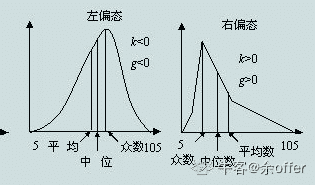

# 小红书 2019 年校园招聘数据分析岗位在线笔试第二批

## 1

从含有 N 个元素的总体中抽取 n 个元素作为样本，使得总体中的每一个元素都有相同的机会（概率）被抽中，这样的抽样方式称为

正确答案: A   你的答案: 空 (错误)

```cpp
简单随机抽样
```

```cpp
分层抽样
```

```cpp
系统抽样
```

```cpp
整群抽样
```

本题知识点

Java 工程师 C++工程师 运维工程师 小红书 数据分析师 2019

讨论

[单单单单单单](https://www.nowcoder.com/profile/2181492)

简单随机抽样：对总体不做任何划分，随机抽取分层抽样：挑选对总体影响较大的特征作为分层依据，在每层中抽取一定比例的样本，比如：抽取某小学学生的身高，可按照年纪划分成 6 层，在每层中抽取一定比例的学生组成样本。系统抽样：比如 100 个学生，给每个学生编号，平均分成 5 等分，每一份都选编号为 1，5，9 的学生整群抽样：100 个学生分成 4 个群，随机选择其中的 2 个群，群里所有学生都要参与抽样。

发表于 2019-08-12 12:51:40

* * *

[phoenixrong](https://www.nowcoder.com/profile/557013191)

简单随机抽样：对总体不做任何划分，随机抽取 分层抽样：挑选对总体影响较大的特征作为分层依据，在每层中抽取一定比例的样本，比如：抽取某小学学生的身高，可按照年纪划分成 6 层，在每层中抽取一定比例的学生组成样本。 系统抽样：比如 100 个学生，给每个学生编号，平均分成 5 等分，每一份都选编号为 1，5，9 的学生 整群抽样：100 个学生分成 4 个群，随机选择其中的 2 个群，群里所有学生都要参与抽样。

发表于 2019-09-17 15:44:12

* * *

[超爱吃香菇的小姑娘](https://www.nowcoder.com/profile/653788698)

整群抽样：看到差点懵的名词。例如，检验某种零件的质量时，不是逐个抽取零件，而是随机抽若干盒 (每盒装有若干个零件)，对所抽各盒零件进行全面检验。

发表于 2019-07-25 19:35:02

* * *

## 2

一组数据，均值>中位数>众数，则这组数据

正确答案: B   你的答案: 空 (错误)

```cpp
左偏
```

```cpp
右偏
```

```cpp
钟形
```

```cpp
对称
```

本题知识点

Java 工程师 C++工程师 运维工程师 小红书 数据分析师 小红书 2019

讨论

[余 offer](https://www.nowcoder.com/profile/95334956)

轴在图形的左侧(鼓包部分在右侧)，就是左偏分布。相反，轴在整个图形右侧（大包在左侧），就是右偏分布。左偏分曲线右侧偏长，左侧偏短；右偏分曲线左侧偏长，右侧偏短。图形横轴为样本数。


发表于 2019-08-21 20:18:06

* * *

[愿❤](https://www.nowcoder.com/profile/440227561)

左偏分布（负偏态）中：mean（平均数)<median>编辑于 2019-05-08 17:55:08

* * *

[phoenixrong](https://www.nowcoder.com/profile/557013191)

左偏分布（负偏态）中：mean（平均数)

发表于 2019-09-17 15:44:56

* * *

## 3

对一个特定情形的估计来说，置信水平越低，所对应的置信区间

正确答案: A   你的答案: 空 (错误)

```cpp
越小
```

```cpp
越大
```

```cpp
不变
```

```cpp
无法判断
```

本题知识点

Java 工程师 C++工程师 运维工程师 小红书 数据分析师 2019

讨论

[3.20190723121349](https://www.nowcoder.com/profile/60637586)

置信区间小，置信水平低，但精度高，置信区间大，置信水平高，精度低

发表于 2019-07-30 11:02:27

* * *

[余 offer](https://www.nowcoder.com/profile/95334956)

置信水平越高，置信区间越大，精确度越低。反之，置信水平越低，置信区间越小，精确度越高。

发表于 2019-08-22 21:21:18

* * *

[愿❤](https://www.nowcoder.com/profile/440227561)

置信水平越低，发生的概率越小，置信区间越小

发表于 2019-05-08 17:57:34

* * *

## 4

关于 logistic 回归算法，以下说法不正确的是

正确答案: B   你的答案: 空 (错误)

```cpp
logistic 回归是当前业界比较常用的算法，用于估计某种事物的可能性
```

```cpp
logistic 回归的目标变量可以是离散变量也可以是连续变量
```

```cpp
logistic 回归的结果并非数学定义中的概率值
```

```cpp
logistic 回归的自变量可以是离散变量也可以是连续变量
```

本题知识点

Java 工程师 C++工程师 运维工程师 小红书 数据分析师 2019

讨论

[幸运之神 777](https://www.nowcoder.com/profile/518535102)

logistics 回归，实际上是二分类算法；目标变量要求是离散值；logistic 回归的输入特征：工业界中我们通常将连续变量离散化再带入 logistic 回归。

发表于 2019-07-28 23:51:09

* * *

[余 offer](https://www.nowcoder.com/profile/95334956)

逻辑回归又称为逻辑回归分析，是分类和预测算法中的一种。虽然叫做回归，但这个算法是用来解决分类问题的。回归与分类的区别在于：回归所预测的目标变量的取值是连续的，而分类所预测的目标变量的取值是离散的。

发表于 2019-08-22 21:23:17

* * *

[给弟弟一个 offer](https://www.nowcoder.com/profile/895606814)

LR 的输出值不是连续值吗，不设 threshold 的话，输出不就是该样本属于正标签的概率？

发表于 2019-09-07 04:32:21

* * *

## 5

下列关于正态分布，不正确的是

正确答案: C   你的答案: 空 (错误)

```cpp
正态分布具有集中性和对称性
```

```cpp
期望是正态分布的位置参数，描述正态分布的集中趋势位置
```

```cpp
正态分布是期望为 0，标准差为 1 的分布
```

```cpp
正态分布的期望、中位数、众数相同
```

本题知识点

Java 工程师 C++工程师 运维工程师 小红书 数据分析师 小红书 2019

讨论

[大大客](https://www.nowcoder.com/profile/48326006)

期望为 0，标准差为 1 的是标准正态分布

发表于 2019-08-07 17:37:46

* * *

[GoodFellow201904261341544](https://www.nowcoder.com/profile/875109857)

期望为 0，标准差为 1 的是标准正太分布

发表于 2019-09-02 14:22:44

* * *

## 6

以下关于关系的叙述中，正确的是（ ）。

正确答案: B   你的答案: 空 (错误)

```cpp
表中某一列的数据类型可以同时是字符串，也可以是数字
```

```cpp
关系是一个由行与列组成的、能够表达数据及数据之间联系的二维表
```

```cpp
表中某一列的值可以取空值 null，所谓空值是指安全可靠或零
```

```cpp
表中必须有一列作为主关键字，用来惟一标识一行
```

```cpp
以上答案都不对
```

本题知识点

Java 工程师 C++工程师 运维工程师 小红书 数据分析师 2019

讨论

[努力找到工作，保持积极乐观](https://www.nowcoder.com/profile/753849801)

A.表由列组成，每一列都存储某种特定的信息如顾客编号或者地址、城市等等，每一列中都有相应的数据类型，它限制(或允许)该列中存储的数据 B.正确 C.“表中某一列的值可以取空值 null，所谓空值是指    没有值或不知道其值是什么，D.任何列都可以当作主键，主键通常定义在表的一列上，但并不是必须这么做

发表于 2020-05-31 12:51:56

* * *

[四号种子选手](https://www.nowcoder.com/profile/839583424)

哪位大佬解析下这道

发表于 2020-05-27 16:29:10

* * *

[农夫酸酸乳](https://www.nowcoder.com/profile/337797208)

不太了解诶第一个选项：同时是字符串和数字？建表时候应当要设置变量类型的；第三个选项：空值是零？怎么理解？第四个选项：不设置主关键字同样可以建表。为毛答案是 B？

发表于 2019-07-22 18:02:32

* * *

## 7

想要了解一个地区人群的一般收入水平，以下什么指标不能使用？

正确答案: B E   你的答案: 空 (错误)

```cpp
方差
```

```cpp
几何平均数
```

```cpp
众数
```

```cpp
中位数
```

```cpp
P 值
```

本题知识点

Java 工程师 C++工程师 运维工程师 小红书 数据分析师 2019

讨论

[单单单单单单](https://www.nowcoder.com/profile/2181492)

偏态数据中，中位数更适合用来反应数据的集中趋势。几何平均数 降低因数据本身的尺度不同对结果的影响 比如 比较两个咖啡厅的用户满意度，a 咖啡厅用十分制打星，b 是百分制，这种情况下用几何平均比算术平均要合理。

发表于 2019-08-12 15:05:29

* * *

[幸运之神 777](https://www.nowcoder.com/profile/518535102)

答案：AE 方差能最大程度反映出原始数据信息，所以主成分分析基于方差进行；但若论反映一个地区的收入水平，平均数，众数，中位数勉强说的过去；但方差却是不行！P 值是假设检验中衡量显著性的，显然不合题意！

发表于 2019-07-29 00:04:48

* * *

[ccc 黎](https://www.nowcoder.com/profile/745457250)

方差不应该在里面啊

发表于 2019-08-28 15:38:01

* * *

## 8

以下属于聚类算法的是

正确答案: D   你的答案: 空 (错误)

```cpp
ARIMA
```

```cpp
朴素贝叶斯
```

```cpp
支持向量机
```

```cpp
K-MEANS
```

本题知识点

Java 工程师 C++工程师 运维工程师 小红书 数据分析师 2019

讨论

[小原千惠](https://www.nowcoder.com/profile/751345064)


发表于 2019-09-02 17:20:39

* * *

[Augtue](https://www.nowcoder.com/profile/545186318)

一看到不定项，就被迫选了个朴素贝叶斯

编辑于 2019-10-19 15:00:56

* * *

[Renee201906280131879](https://www.nowcoder.com/profile/450393475)

ARIMA（自回归移动平均模型）是最常用的时间序列预测模型。 朴素贝叶斯和支持向量机是分类模型。

发表于 2019-09-02 15:40:09

* * *

## 9

样本中各观察值均加 5 后

正确答案: C D   你的答案: 空 (错误)

```cpp
方差加 25
```

```cpp
标准差加 5
```

```cpp
均值加 5
```

```cpp
中值加 5
```

本题知识点

Java 工程师 C++工程师 运维工程师 小红书 数据分析师 2019

讨论

[小余 1](https://www.nowcoder.com/profile/538949480)

方差表示数据围绕均值的波动大小，每个样本都加 5，波动情况并没有改变，所以方差不变。标准差：方差的平方根，也不变。

发表于 2019-08-18 11:04:07

* * *

## 10

一批零件共 10 个，其中有 3 个不合格品，从中一个一个不放回取出，则第三次才取得不合格品的概率是 1(填小数)

你的答案 (错误)

1 参考答案 (1) 0.175

本题知识点

Java 工程师 C++工程师 运维工程师 小红书 数据分析师 2019

讨论

[Tz 治](https://www.nowcoder.com/profile/564121)

第一次取得合格品的概率：7/10
第二次取得合格品: 7/10 * 6/9
第三次取得不合格：7/10 * 6/9 * 3/8

发表于 2019-08-08 20:21:47

* * *

[四号种子选手](https://www.nowcoder.com/profile/839583424)

不能写成分数吗

发表于 2020-05-27 16:32:55

* * *

[coral_yanght](https://www.nowcoder.com/profile/816997903)

这个难道不是几何分布？

发表于 2019-09-02 19:38:27

* * *

## 11

某业务线的营业收入为：200，220，250，300，320 万元，则平均增长量为 1 万元

你的答案 (错误)

1 参考答案 (1) 30

本题知识点

Java 工程师 C++工程师 运维工程师 小红书 数据分析师 2019

讨论

[单单单单单单](https://www.nowcoder.com/profile/2181492)

平均增长量 = （末段值-首段值）/ 时间差

发表于 2019-08-12 15:12:25

* * *

[零葬](https://www.nowcoder.com/profile/75718849)

[(220-200)+(250-220)+(300-250)+(320-300)]/4=30

发表于 2020-12-23 22:29:10

* * *

[牛客 809142367 号](https://www.nowcoder.com/profile/809142367)

注意审题，增长量和平均值之间存在差异，在求平均增长量时得先确定总的增长量是多少，然后再用总的增长量除以时间段即可。

编辑于 2021-10-11 12:28:34

* * *

## 12

如下两张表， name_t 和 age_t:name_t

| ID | Name |
| 1 | Nick |
| 2 | Tom |
| 3 | John |
| 4 | Peter |
| 5 | Frank |

 age_t

| ID | Age |
| 1 | 18 |
| 2 | null |
| 3 | 35 |
| 5 | 22 |

结合表信息，写出 sql 的最终结果 1

```cpp
SELECT 
    count(t1.ID) as cnt
 FROM 
    name_t t1 
 LEFT JOIN 
    age_t t2
 ON 
    t1.ID = t2.ID
 WHERE 
    t2.Age > 22 
```

你的答案 (错误)

1 参考答案 (1) 1

本题知识点

Java 工程师 C++工程师 运维工程师 小红书 数据分析师 2019

讨论

[余 offer](https://www.nowcoder.com/profile/95334956)

左连接保存左表中的全部记录，右表中无该记录的用 NULL 填充，where 条件筛选出 age>22 的数据，count（）函数记录数据条数

发表于 2019-08-22 21:44:14

* * *

[zzzzzzz_](https://www.nowcoder.com/profile/293129470)

可是 left join 不应该保留全部的左边的表吗

发表于 2019-08-17 19:54:49

* * *

[-offer 会有的！-](https://www.nowcoder.com/profile/5831052)

是大于 22，注意没有等号

发表于 2019-05-23 10:58:49

* * *

## 13

请写 sql 语句：想要了解班级内同学的考试情况，现有一张成绩表表名为 A，每行都包含以下内容（已知表中没有重复内容，但所有的考试结果都录入在了同一张表中，一个同学会有多条考试结果）：student_id，course_name，score 现在需要知道：1\. 每门课程得到成绩的同学人数 2\. 每门课程的平均成绩 3\. 如果对于每门课程来说，60 分以下为不及格，高于 60 为及格，统计每门课程及格和不及格的人数

你的答案

本题知识点

Java 工程师 C++工程师 运维工程师 小红书 数据分析师 2019

讨论

[不喝奶茶 w](https://www.nowcoder.com/profile/472250477)

1、SELECT course_name,COUNT(score) FROM AGROUP BY course_name2、SELECT course_name,AVG(score) FROM AGROUP BY course_name3、SELECT course_name,SUM(CASE WHEN score>=60 THEN 1 ELSE 0 END) AS '及格人数',                     SUM(CASE WHEN score<60 THEN 1 ELSE 0 END) AS '不及格人数 FROM AGROUP BY course_name

编辑于 2019-08-17 08:53:22

* * *

[Madison7](https://www.nowcoder.com/profile/209010420)

1\. select course_name,count(*) from A where score is not null group by course_name;2 select course_name,avg(score) from A group by course_name;3 select a.course_name,a.及格,b.不及格 from (select course_name, count(*) as 及格 from A where score >=60 group by course_name ) a inner join (select course_name, count(*) as 不及格 from A where score <60 group by course_name ) b on a.course_name=b.course_name

发表于 2019-08-02 11:10:32

* * *

[余 offer](https://www.nowcoder.com/profile/95334956)

原数据：
（1）
（2）（3）

发表于 2019-08-22 22:26:28

* * *

## 14

经一番研究后，我们开发出了一个新的商品详情页中'相关商品'模块的算法，并且打算通过 AB Test（50%用户保留原先的算法逻辑为控制组，50%用户使用新的算法逻辑为实验组）来进行评估。假如你是此次实验的数据分析师，请问你会怎么评估控制组和实验组的表现？请按重要性列出最重要的三个指标并给出你的分析过程。

你的答案

本题知识点

Java 工程师 C++工程师 运维工程师 小红书 数据分析师 2019

讨论

[.201902272200286](https://www.nowcoder.com/profile/883414492)

1、访问量 2、点击率：即点击进入接口的数量/访问量 3、购买率：即成功下单的数量/点击量首先观察实验组访问量随时间的变化趋势图，刚开始几天可能会出现逐渐下降或逐渐上升的情况，等到趋于一个稳定趋势时，检测与对照组是否有显著差别。在一段时间内的访问量应该服从泊松分布，设这段时间为一天，那么要检验 ab 两组无差别，即 H0：X1=X2。由于泊松分布可以近似为正态分布，故可以用 t 检验。点击率为每个顾客的点击率，假设顾客点击的概率就为点击率，假设 AB 无显著差异，即 P1=P2。根据中心极限定理，样本量足够大时，均值服从正态分布，故可用 t 检验。购买率的检验方式与点击率相同。

发表于 2019-08-17 19:47:51

* * *

[Echo_Kang](https://www.nowcoder.com/profile/770748564)

AB test 是通过分析评估选出更好的产品版本，对于小红书这样基于社交分享的电商平台，更好的产品就是能够增加用户粘性、带来更大流量进而提高网站流水的产品。基于以上分析，我认为以下三个指标最重要，按重要性依次列出：第一是 GMV。GMV=1 销售额+2 取消订单金额+3 拒收订单金额+4 退货订单金额。这对于电商 APP 是一个很重要的指标，通过对比 GMV 可以直接对模块更新的效果有一个大概评估。为了比较实验组和控制组的 GMV 在统计意义上是否存在显著性差异，可以利用 SPSS 软件进行 pair t 检验。第二是购买转化率。指点进相关商品后付费的人数与点进相关商品模块的总人数之比。研究购买转化率有可以反映推荐新算法的有效度，如果推荐的商品能够吸引用户购买，那么转化率应该令人满意。为了比较实验组和控制组的转化率在统计意义上是否存在显著差异，可以利用 SPSS 软件进行 student t 检验。第三是分享率。分享率=使用内置分享功能分享商品的人数 / 点击“相关商品”模块的人数。小红书是一个基于社交分享引流的电商平台，和生活里的朋友包括社区里的网友分享构成了小红书的一个独特生态。所以查看相关商品的分享率，可以通过提高分享率进一步提高 app/网页流量，进而提高流水。用 SPSS 软件的 student t 检验判断两组的分享率是否存在显著差异。

发表于 2020-03-30 14:50:10

* * *

[Vv201902202104817](https://www.nowcoder.com/profile/324170344)

1.相关商品的点击率=相关商品链接点击次数/当前页面浏览次数 2.相关商品的购买率=购买行为发生次数/相关商品浏览行为次数 3.当前商品与相关商品一同购买的概率=共同购买/当前商品购买

发表于 2019-05-08 22:44:36

* * *</median>