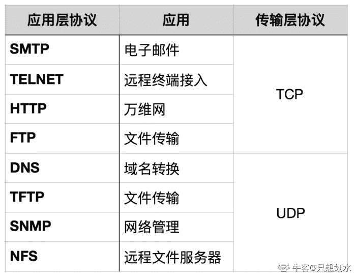

# 携程 2019 届秋招专业笔试-测试方向

## 1

白盒测试是根据程序的 ____ 来设计测试用例，黑盒测试是根据软件的规格说明来设计测试用例。

正确答案: C   你的答案: 空 (错误)

```cpp
功能
```

```cpp
性能
```

```cpp
内部逻辑
```

```cpp
内部数据
```

本题知识点

测试工程师 携程 2019

讨论

[许愿论文答辩顺利通过顺利毕业🙏](https://www.nowcoder.com/profile/127728147)

黑盒测试是功能测试，数据驱动；白盒测试是结构测试，逻辑驱动

发表于 2019-05-14 15:10:07

* * *

[他大舅](https://www.nowcoder.com/profile/198385)

答案：选 C**白盒测试是基于代码的逻辑结构进行的测试，黑盒测试是对已实现的功能进行验证和测试，完全不考虑程序的逻辑结构和内部特性**。

编辑于 2019-06-25 16:51:54

* * *

[s666](https://www.nowcoder.com/profile/756935193)

黑盒测试是功能测试，数据驱动；白盒测试是结构测试，逻辑驱动

发表于 2019-05-14 13:27:55

* * *

## 2

修复软件缺陷费用最高的是 ____ 阶段：

正确答案: D   你的答案: 空 (错误)

```cpp
编制说明书
```

```cpp
设计
```

```cpp
编写代码
```

```cpp
发布
```

本题知识点

测试工程师 携程 2019

讨论

[Eliane 茜](https://www.nowcoder.com/profile/518878673)

越晚发现成本越高

发表于 2019-08-23 11:55:42

* * *

[只想划水](https://www.nowcoder.com/profile/743029166)

修复软件缺陷的费用指数级增长。

发表于 2019-08-15 10:36:40

* * *

## 3

在软件底层进行的测试称为：

正确答案: C   你的答案: 空 (错误)

```cpp
系统测试
```

```cpp
集成测试
```

```cpp
单元测试
```

```cpp
功能测试
```

本题知识点

测试工程师 携程 2019

讨论

[大王宛](https://www.nowcoder.com/profile/150477264)

系统测试指的是将整个软件系统作为整体测试；集成测试在单元测试基础上，重点测试不同模块的接口；单元测试（也叫模块测试），测试程序模块；功能测试检查功能是否满足用户的需求。

发表于 2019-09-04 10:40:16

* * *

[s666](https://www.nowcoder.com/profile/756935193)

集成测试需要了解程序模块间的结构关系（路径覆盖），系统测试针对整个系统的功能（功能覆盖）

发表于 2019-05-14 13:32:03

* * *

## 4

坚持在软件的各个阶段实施下列哪种质量保障措施，才能在开发过程中尽早发现和预防错误，把出现的错误克服在早期：

正确答案: A   你的答案: 空 (错误)

```cpp
技术评审
```

```cpp
程序测试 
```

```cpp
改正程序错误
```

```cpp
管理评审
```

本题知识点

测试工程师 携程 2019

讨论

[牛客 660285054 号](https://www.nowcoder.com/profile/660285054)

需求评审

发表于 2020-05-07 09:08:18

* * *

## 5

以下那一种选项不属于软件缺陷：

正确答案: D   你的答案: 空 (错误)

```cpp
软件没有实现产品规格说明所要求的功能
```

```cpp
软件中出现了产品规格说明不应该出现的功能
```

```cpp
软件实现了产品规格没有提到的功能
```

```cpp
软件实现了产品规格说明所要求的功能但因受性能限制而未考虑可移植性问题
```

本题知识点

测试工程师 携程 测试工程师 携程 测试工程师 携程 2019

讨论

[月妃](https://www.nowcoder.com/profile/375525840)

根据网上得到的分析复述如下：软件缺陷包括五种：1、[软件](https://baike.so.com/doc/5366582-5602301.html)没有实现产品规格说明所要求的[功能模块](https://baike.so.com/doc/6526238-6739970.html)； ---A2、软件中出现了产品规格说明指明不应该出现的错误；   ----B3、软件实现了产品规格说明没有提到的功能模块； -----C4、软件没有实现虽然产品规格说明没有明确提及但应该实现的目标；  5、软件难以理解，不容易使用，运行缓慢，或从测试员的角度看，最终用户会认为不好。

发表于 2019-07-14 15:51:11

* * *

## 6

测试程序时，不可能遍历所有可能的输入数据，而只能是选择一个子集进行测试，那么 最好的选择方法是：

正确答案: B   你的答案: 空 (错误)

```cpp
随机选择
```

```cpp
划分等价类
```

```cpp
根据接口进行选择
```

```cpp
根据数据大小进行选择
```

本题知识点

测试工程师 携程 2019

## 7

下列可以作为软件测试对象的是：

正确答案: D   你的答案: 空 (错误)

```cpp
需求规格说明书
```

```cpp
软件设计规格说明
```

```cpp
源程序
```

```cpp
以上全部
```

本题知识点

测试工程师 携程 2019

讨论

[自由的洋](https://www.nowcoder.com/profile/625601184)

源程序，数据，文档

发表于 2019-05-15 10:36:10

* * *

## 8

程序设计语言中：

正确答案: D   你的答案: 空 (错误)

```cpp
while 循环语句的执行效率比 do-while 循环语句的执行效率高
```

```cpp
while 循环语句的循环体执行次数比循环条件的判断次数多 1，而 do-while 语句的循环体执行次数比循环条件的判断次数少 1
```

```cpp
while 语句的循环体执行次数比循环条件的判断次数少 1，而 do-while 语句的循环体执行次数比循环条件的判断次数多 1
```

```cpp
while 语句的循环体执行次数比循环条件的判断次数少 1，而 do-while 语句的循环体执行次数等于循环条件的判断次数
```

本题知识点

测试工程师 携程 测试工程师 携程 测试工程师 携程 2019

讨论

[爱理不理](https://www.nowcoder.com/profile/568474013)

do{
    循环体语句;  
}while(判断条件语句);do 会先执行循环体语句，再用 while 判断。所以 do 比 while 多执行一次循环体。while 本身循环体语句执行比条件语句执行少 1.所以 最后一个是正确的。可以用句子验证试试。i=0;while(i<1){print(i);i++;}

发表于 2019-08-03 22:32:51

* * *

## 9

关于自动化测试描述正确的是：

正确答案: D   你的答案: 空 (错误)

```cpp
引入自动化测试可以降低测试成本
```

```cpp
软件产品测试适合自动化测试
```

```cpp
自动化测试工具能够完成所有的自动化测试
```

```cpp
自动化测试脚本同样需要进行验收和确认
```

本题知识点

测试工程师 携程 2019

讨论

[橙橙橙 123](https://www.nowcoder.com/profile/556960776)

 A、自动化测试是把以人为驱动的测试行为转化为机器执行的一种过程。通常，在设计了[测试用例](https://baike.baidu.com/item/%E6%B5%8B%E8%AF%95%E7%94%A8%E4%BE%8B)并通过评审之后，由测试人员根据测试用例中描述的规程一步步执行测试，得到实际结果与期望结果的比较。在此过程中，为了**节省人力、时间或硬件资源，提高测试效率**，便引入了[自动化测试](https://baike.baidu.com/item/%E8%87%AA%E5%8A%A8%E5%8C%96%E6%B5%8B%E8%AF%95)的概念。

B、实施自动化测试之前需要对[软件开发](https://baike.baidu.com/item/%E8%BD%AF%E4%BB%B6%E5%BC%80%E5%8F%91)过程进行分析，以观察其是否适合使用自动化测试。通常需要同时满足以下条件：

1)需求变动不频繁

2)项目周期足够长

3)自动化测试脚本可重复使用

C、过于绝对

D、自动化测试与[软件开发](https://baike.baidu.com/item/%E8%BD%AF%E4%BB%B6%E5%BC%80%E5%8F%91)过程从本质上来讲是一样的，无非是利用自动化测试工具（相当于[软件开发工具](https://baike.baidu.com/item/%E8%BD%AF%E4%BB%B6%E5%BC%80%E5%8F%91%E5%B7%A5%E5%85%B7)），经过对**测试需求的分析**（[软件过程](https://baike.baidu.com/item/%E8%BD%AF%E4%BB%B6%E8%BF%87%E7%A8%8B)中的[需求分析](https://baike.baidu.com/item/%E9%9C%80%E6%B1%82%E5%88%86%E6%9E%90)），**设计出自动化**[**测试用例**](https://baike.baidu.com/item/%E6%B5%8B%E8%AF%95%E7%94%A8%E4%BE%8B)（软件过程中的需求规格），**从而搭建自动化测试的**[**框架**](https://baike.baidu.com/item/%E6%A1%86%E6%9E%B6)（软件过程中的[概要设计](https://baike.baidu.com/item/%E6%A6%82%E8%A6%81%E8%AE%BE%E8%AE%A1)），**设计与编写自动化**[**脚本**](https://baike.baidu.com/item/%E8%84%9A%E6%9C%AC)（[详细设计](https://baike.baidu.com/item/%E8%AF%A6%E7%BB%86%E8%AE%BE%E8%AE%A1)与[编码](https://baike.baidu.com/item/%E7%BC%96%E7%A0%81)），[**测试脚本**](https://baike.baidu.com/item/%E6%B5%8B%E8%AF%95%E8%84%9A%E6%9C%AC)**的正确性**，从而完成该套测试脚本（即主要功能为测试的[应用软件](https://baike.baidu.com/item/%E5%BA%94%E7%94%A8%E8%BD%AF%E4%BB%B6)）。 

发表于 2019-10-29 16:14:08

* * *

## 10

下列哪些概念不属于性能测试：

正确答案: B   你的答案: 空 (错误)

```cpp
测量相应时间
```

```cpp
可伸缩性
```

```cpp
吞吐量
```

```cpp
可维护性
```

本题知识点

测试工程师 携程 2019

讨论

[只想划水](https://www.nowcoder.com/profile/743029166)

**性能测试类型**
基准测试：在给系统施加较低压力时，查看系统的运行状况并记录相关数做为基础参考
负载测试：是指对系统不断地增加压力或增加一定压力下的持续时间，直到系统的某项或多项性能指标达到安全临界值，例如某种资源已经达到饱和状态等 。
压力测试：压力测试是评估系统处于或超过预期负载时系统的运行情况，关注点在于系统在峰值负载或超出最大载荷情况下的处理能力。
稳定性测试：在给系统加载一定业务压力的情况下，使系统运行一段时间，以此检测系统是否稳定。
并发测试：测试多个用户同时访问同一个应用、同一个模块或者数据记录时是否存在死锁或者其他性能问题**性能测试基本概念**1.响应时间 2.吞吐量 3.并发数 4.资源利用率

*   什么是性能问题？ 如果你的系统对于一个用户访问还很慢，那就是性能问题；
*   什么是扩展性问题？ 如果你的系统对一个用户来说是快的，但是在用户不断增长的高访问量下就慢了。

        **可伸缩性**(可扩展性)是一种对软件系统计算处理能力的设计指标，高可伸缩性代表一种弹性，在系统扩展成长过程中，软件能够保证旺盛的生命力，通过很少的改动甚至只是硬件设备的添置，就能实现整个系统处理能力的线性增长，实现高吞吐量和低延迟高性能。所以 B 错误。

编辑于 2019-08-15 11:30:01

* * *

## 11

下列 ___ 不是软件自动化测试的优点

正确答案: D   你的答案: 空 (错误)

```cpp
速度快、效率高
```

```cpp
准确度和精确度高
```

```cpp
能提高测试的质量
```

```cpp
能充分测试软件
```

本题知识点

测试工程师 携程 2019

讨论

[higirl2020](https://www.nowcoder.com/profile/376457331)

D

发表于 2020-03-16 08:55:02

* * *

## 12

如果一个判定巾的复合条件表达式为(A＞1)or(B≤3)，则为了达到 100%的条件覆盖率，至少需要设计多少个测试用例？

正确答案: B   你的答案: 空 (错误)

```cpp
1
```

```cpp
2
```

```cpp
3
```

```cpp
4
```

本题知识点

测试工程师 携程 测试工程师 携程 测试工程师 携程 2019

讨论

[明净纯粹的眸子](https://www.nowcoder.com/profile/778721711)

由条件覆盖定义：设计若干测试用例，运行被测程序，使得每个判定的每个条件的可能取值至少评价一次。针对该题取 A=3、B=3 和 A=0、B=5 两组测试用例即可达到 100%的条件覆盖率，故本题选择 B。

发表于 2019-09-22 11:07:39

* * *

[s666](https://www.nowcoder.com/profile/756935193)

每个复合表达式的每个简单判定条件的取真取假条件至少执行一次.

p.s.判定覆盖：判定节点的取真取假分支至少执行一次

发表于 2019-05-14 13:54:52

* * *

[牛客 870604100 号](https://www.nowcoder.com/profile/870604100)

如果是 and 需要几个测试用例呢？

发表于 2020-08-10 09:49:22

* * *

## 13

在 TCP/IP 模型中，应用层包含了所有的高层协议，在下列的一些应用协议中， ___ 是能够实现本地与远程主机之间的文件传输工作。

正确答案: B   你的答案: 空 (错误)

```cpp
telnet
```

```cpp
FTP
```

```cpp
SNMP
```

```cpp
NFS
```

本题知识点

测试工程师 携程 2019

讨论

[只想划水](https://www.nowcoder.com/profile/743029166)



发表于 2019-08-15 13:13:48

* * *

[s666](https://www.nowcoder.com/profile/756935193)

Ttelnet 远程登录，FTP 文件传输

发表于 2019-05-14 13:58:23

* * *

[0210.](https://www.nowcoder.com/profile/315104734)

File Transfer Protocol(文件传输协议)的英文简称

发表于 2019-07-01 14:10:13

* * *

## 14

已知数组{46、36、65、97、76、15、29}，以 46 为关键字进行一趟快速排序后，结果为：

正确答案: A   你的答案: 空 (错误)

```cpp
29、36、15、46、76、97、65
```

```cpp
29、15、36、46、76、97、65
```

```cpp
29、36、15、46、97、76、65
```

```cpp
15、29、36、46、97、76、65
```

本题知识点

测试工程师 携程 2019

讨论

[Glassy_miao](https://www.nowcoder.com/profile/958854420)

1、先从右往左找比 46 小的数，二者交换位置得到 29,36,65,97,76,15,462、再从左向右找比 46 大的数，二者交换位置得到 29,36,46,97,76,15,653、再从右往左找比 46 小的数，二者交换位置得到 29,36,15,97,76,46,654、再从左向右找比 46 大的数，二者交换位置得到 29,36,15,46,76,97,65

发表于 2019-08-19 16:27:47

* * *

[猪饲夫妇、](https://www.nowcoder.com/profile/707852152)

选项均是错误的。第一次排序结束后正确序列是：15 36 29 46 76 97 65 快排思路：设置三个指针 lt,i,gt，小于下标 lt 的为小于关键字部分，大于 gt 为大于关键字部分，中间为等于关键字部分；最后将关键字与小于部分最后一个元素交换即可。

发表于 2019-08-09 16:04:12

* * *

[牛客 898834137 号](https://www.nowcoder.com/profile/898834137)

这跟我学的快排不太一样，貌似是有多种做法，答案是其中一种

发表于 2021-08-30 15:36:11

* * *

## 15

以下哪个语句打印出来的结果是 false？

正确答案: A   你的答案: 空 (错误)

```cpp
alert(3==true)
```

```cpp
alert(2=="2")
```

```cpp
alert(null == undefined)
```

```cpp
alert(isNaN("true"))
```

本题知识点

携程 2019 Javascript

讨论

[橙橙橙 123](https://www.nowcoder.com/profile/556960776)

A、1 == true   // 布尔值会转成 number true 即为 1 所以结果是 true2 == true   // 布尔值会转成 number true 即为 1 所以结果是 false
3 == true   // 布尔值会转成 number true 即为 1 所以结果是 false
1 == false  // 布尔值会转成 number false 即为 0 所以结果是 false
0 == false  // 布尔值会转成 number false 即为 0 所以结果是 trueB、数字字符串 2 会转换成数字 2 在和数字 2 进行比较 。
== js 会优先选择将字符串转成数字==
 C、Javascript 规范中提到， 要比较相等性之前，不能将 null 和 undefined 转换成其他任何值，并且规定 null 和 undefined 是相等的。

null 和 undefined 都代表着无效的值。D、

isNaN() 函数用于检查其参数是否是非数字值。

如果参数值为 NaN 或字符串、对象、undefined 等非数字值则返回 true, 否则返回 false。

 

发表于 2019-10-29 17:15:19

* * *

[镜中](https://www.nowcoder.com/profile/796269946)

D 项应该为 true，也即 JS 认为它为空值 😂下面是 isNaN()的一些例子 isNaN(123) //false isNaN(-1.23) //false isNaN(5-2) //false isNaN(0) //false isNaN('123') //false isNaN('Hello') //true isNaN('2005/12/12') //true isNaN('') //false isNaN(true) //false isNaN(undefined) //true isNaN('NaN') //true isNaN(NaN) //true isNaN(0 / 0) //true 

发表于 2019-10-02 20:24:29

* * *

[KeviNCode](https://www.nowcoder.com/profile/156327864)

java 的题为什么会在 C++库里？？？

发表于 2020-08-11 00:36:48

* * *

## 16

选出属于黑盒测试方法的选项：

正确答案: A B C   你的答案: 空 (错误)

```cpp
测试用例覆盖
```

```cpp
输入覆盖
```

```cpp
输出覆盖
```

```cpp
分支覆盖
```

```cpp
条件覆盖
```

本题知识点

测试工程师 携程 2019

讨论

[只想划水](https://www.nowcoder.com/profile/743029166)

白盒测试方法：**语句覆盖、判定覆盖、条件覆盖、判定/条件覆盖、多重条件覆盖**。白盒测试关注的是测试用例执行的程度或覆盖程序逻辑结构（源代码）的程度。黑盒测试方法：**等价类型划分、边界值分析、因果图分析、错误猜测**。黑盒测试又称为数据驱动的测试或输入/输出驱动的测试。

发表于 2019-08-15 13:30:15

* * *

[珠猪飞啊飞](https://www.nowcoder.com/profile/5393338)

为什么 A 也是？

发表于 2020-03-28 10:49:19

* * *

[自由的洋](https://www.nowcoder.com/profile/625601184)

判定和条件都是属于白盒方法

发表于 2019-05-15 11:21:12

* * *

## 17

软件质量管理（QM）应有质量保证（QA）和质量控制（QC）组成，下面的选项属于 QC 得是：

正确答案: A B C   你的答案: 空 (错误)

```cpp
测试
```

```cpp
跟踪
```

```cpp
监督
```

```cpp
需求审查
```

```cpp
程序代码审查
```

本题知识点

测试工程师 携程 2019

讨论

[只想划水](https://www.nowcoder.com/profile/743029166)

1、概念上：
QA：Quality Assurance （质量保证）
QC：Quality Control （质量控制）
QM：Quality Manage （质量管理）

2、定义上：
QA：为达到质量要求所采取的作业技术和活动
QC：为了提供足够的信任表明实体能满足质量要求，而实施的根据需要进行证实的全部有计划、有系统的活动
QM：确定质量方针、目标和职责，并在通过诸如：质量策划、质量控制．质量保证和质量改进，使其实施的全部管理职能的所有活动

3、职责上：
QA：最重要的职责在于系统层面的完善，侧重于问题的防范及对已发生问题的根源的探究及其对策的实施，从而降低不良的产生
QC：最重要的职责在于对制成品的监控
QM：最重要的职责在于从组织层面上保障质量工作环境

4、技能要求上：
QA：具备必要资质的 QA 是组织中的高级人才，需要全面掌握组织的过程定义，熟悉所参与项目所用的工程技术
QC：既包括软件测试设计员等高级人才，也包括一般的测试员等中、初级人才
QM：不仅要具备 QA、QC 的技能，还需具备专业管理才能

发表于 2019-08-15 13:35:30

* * *

[码喵🐈](https://www.nowcoder.com/profile/312944403)

我的理解是，QC 面向成品，QA 面向生产过程防范于未然。

发表于 2019-06-21 08:48:19

* * *

## 18

编写测试计划的目的是：

正确答案: A B C   你的答案: 空 (错误)

```cpp
使测试工作顺利进行
```

```cpp
使项目参与人员沟通更舒畅
```

```cpp
使测试工作更加系统化
```

```cpp
软件工程以及软件过程的需要
```

```cpp
软件过程规范化的要求
```

本题知识点

测试工程师 携程 2019

讨论

[珠猪飞啊飞](https://www.nowcoder.com/profile/5393338)

为什么有 B，但是没有 DE

发表于 2020-03-28 10:47:54

* * *

[牛客 886541541 号](https://www.nowcoder.com/profile/886541541)

为啥没有 e

发表于 2020-03-23 20:20:47

* * *

## 19

实施缺陷跟踪的目的是：

正确答案: A B C D   你的答案: 空 (错误)

```cpp
软件质量无法控制
```

```cpp
问题无法量化
```

```cpp
重复问题接连产生
```

```cpp
解决问题的知识无法保留
```

```cpp
使问题形成完整的闭环处理
```

本题知识点

测试工程师 携程 2019

讨论

[so_what?](https://www.nowcoder.com/profile/836305352)

题目问的有问题吧，应该是原因而不是目的吧

发表于 2019-09-02 18:19:57

* * *

[给个 offer 吧😄](https://www.nowcoder.com/profile/671848074)

选项 D 很奇怪阿

发表于 2019-08-16 05:56:43

* * *

## 20

使用软件测试工具的目的：

正确答案: A B C   你的答案: 空 (错误)

```cpp
帮助测试寻找问题
```

```cpp
协助问题的诊断
```

```cpp
节省测试时间
```

```cpp
提高 Bug 的发现率
```

```cpp
更好的控制缺陷提高软件质量
```

本题知识点

测试工程师 携程 2019

讨论

[牛客 668599491 号](https://www.nowcoder.com/profile/668599491)

E 为什么不对

发表于 2020-01-16 15:00:08

* * *

[牛客 990014037 号](https://www.nowcoder.com/profile/990014037)

控制缺陷?

发表于 2020-03-23 23:22:08

* * *

## 21

请结合 about us 截图页面，罗列 GUI、功能、性能等测试点，并展开说明。

你的答案

本题知识点

测试工程师 携程 2019

讨论

[罗卜卜](https://www.nowcoder.com/profile/956725769)

GUI：页面设置是否合理控件是否正常显示界面是否无错别单词操作是否流畅横竖屏是否可以切换、切换是否正常不同字体下显示是否正确功能：是否可以正常订酒店、飞机、火车、汽车是否可以通过手机 app、web、电话订购手机、web、电话订阅的价格是否一致页面底部四个按钮是否正常跳转到响应功能等等系统交互：切换应用、强制关机、手机短信打断等情况下，应用能否正常退出或继续性能：多台手机同时访问是否正常，同一手机多次打开应用是否正常应用运行时 cpu 和内存消耗，后台长时间访问的耗电量和耗流量首次打开和多次打开应用的响应时间不同机型的兼容性应用长时间操作的稳定性网络：4G、3G、wifi 切换是否正常，弱网、低电量是否能正常使用安全性：登陆、付款页面密码加密是否明文显示网络后台传输信息时是否加密传输（充值金额、手机号、用户密码等敏感信息）

发表于 2019-08-13 12:24:59

* * *

[即将拥有人鱼线的男人 201905201548242](https://www.nowcoder.com/profile/869307527)

 性能： 首次进入首页-页面加载时间 其他页面返回首页时-页面加载时间 弱网络情况下-首页加载时间 低配置手机上，首页页面加载时间 兼容性： 手机类型兼容性：Android iOS 手机操作系统版本兼容性 手机生产方兼容性 屏幕尺寸兼容性，有无刘海兼容性 APP 自身版本的兼容性 安全性： 首页中个人敏感信息不显示 网络传输过程中个人信息需要加密，验签。

发表于 2019-05-20 16:29:57

* * *

[长田语](https://www.nowcoder.com/profile/494056183)

【搬运】参考答案：GUI：     界面整体风格合理，美观。 图标风格统一，title 大小适中。 背景图片清晰，图层透明度适中 功能： 

*   1.title：Trip.com 
*   2.Hotels，Flights，Trains，Cars 四个 icon 和 name，点击跳转对应页面 
*   3.Things To Do 模块展示卡片和 title，Show All 点击展开，卡片点击跳转正确 
*   4.底部 Home Deals My trip Accout 四个模块，点击切换正常 
*   5.登陆和非登陆状态首页展示需求 
*   6.【邮件】图标有消息时会有提示，点击打开消息列表 
*   7.滑动屏幕页面滚动流畅，下拉页面刷新 
*   8.切换语言，首页支持多语言（about us 中有说明） 
*   9.不同国家默认首页有本地化特性（根据 about us 可以推断的隐性需求） 

性能：     首次进入首页-页面加载时间 其他页面返回首页时-页面加载时间 弱网络情况下-首页加载时间 低配置手机上，首页页面加载时间 兼容性：     手机类型兼容性：Android iOS 手机操作系统版本兼容性 手机生产方兼容性 屏幕尺寸兼容性，有无刘海兼容性 APP 自身版本的兼容性 安全性：     首页中个人敏感信息不显示 网络传输过程中个人信息需要加密，验签。

发表于 2020-10-13 00:54:00

* * *

## 22

携程客户下单的时候系统会发放一个优惠券码，用户在前端界面看到的展现形式如下：“1Ct3r4ip_ti4C6k9Et^”，包含数字、字母、和 [\]^_’ 6 个特殊字符。

为了安全性，系统在使用的时候做解密操作，删除里面的数字部分，只验字母 A~z 以及[\]^_’ 6 个特殊字符部分才是有效的，并且在解密后不会重新排序字母的顺序，按照之前的对应顺序排列。

如上所示，如果一个客户拿到的优惠券码是这个：1Ct3r4ip_ti4C6k9Et^  ， 请用 java 语言提取正确的优惠券码。

本题知识点

携程 测试工程师 字符串 *模拟 2019* *讨论

[nbgao](https://www.nowcoder.com/profile/211289)

```cpp
#include <bits/stdc++.h>
using namespace std;

int main(){
    string s,t="";
    cin>>s;
    int n = s.length();
    for(int i=0;i<n;i++)
        if(s[i]<'0' || s[i]>'9'){
            if(s[i]=='$')
                t += '^';
            else
                t += s[i];
        }
    cout<<t<<endl;

    return 0;
}
```

发表于 2019-10-14 00:40:51

* * *

[mipeng](https://www.nowcoder.com/profile/888201178)

```cpp
import re
n = '1Ct3r4ip_ti4C6k9Et^'
s = re.sub('\d+','',n)
print(s)

```

发表于 2022-02-22 10:57:47

* * *

[牛客 226084670 号](https://www.nowcoder.com/profile/226084670)

这题题目用例错了，要不然就是需求错了

```cpp
import java.util.*;
import java.util.Scanner;
public class Main{
    public static void main(String []args){
        //Scanner in=new Scanner(System.in);
        //String s=in.next();
        //String s0=s.replaceAll("[$]","^");
        //String s1=s0.replaceAll("[^A-z]","");
        String s="1Ct3r4ip_ti4C6k9Et^";  
        System.out.printf(s.replaceAll("[^A-z]",""));
    }
}
```

发表于 2020-07-27 15:08:33

* * *

## 23

请使用 random() 函数，生成 10 个随机数，并对它进行降序排序 ，要求有效率。注意：不允许使用代码库提供的 sort() 之类现成的排序函数。

本题知识点

携程 测试工程师 排序 *数组 2019* *讨论

[努力写论文呀](https://www.nowcoder.com/profile/99053911)

zz 题目，你们出题的看得懂自己在说啥吗

发表于 2019-07-25 14:24:44

* * *

[黯然神傷](https://www.nowcoder.com/profile/897562296)

既然这样的话 我只能出大招了 print(input())

发表于 2019-08-04 14:47:37

* * *

[你快乐吗](https://www.nowcoder.com/profile/5271388)

题目说：生成 10 个随机数你还输入 1 是什么意思！！！

```cpp
#include <stdlib.h>
#include <stdio.h>
int main( )
{
    int i,j,temp;
    int a[100];
    int n;
    scanf("%d",&n);//随机数的个数
    for(i = 0; i < n;i++)
    {
        a[i]=rand()%100+1;//生成 n 个 1-100 内的随机数，并存入数组 a
    }
       //将数组 a 冒泡降序排列
    for(i = 0; i < n-1;i++)
        for(j=0;j<n-i-1;j++)
        {
            if(a[j]<a[j+1])
            {
                temp=a[j];
                a[j]=a[j+1];
                a[j+1]=temp;
            }
        }
    for(i = 0; i < n;i++)
    printf("%d\n",a[i]);
    return 0;
}
```

这段代码仅供参考： 先指定随机数的个数，例如输入 10，代表会产生 10 个随机数；然后将其存入数组，降序排序后输出

发表于 2019-05-14 09:04:54

* * ***