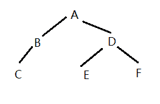

# 携程 2019 届秋招专业笔试-研发方向

## 1

有一组数据{46,79,56,38,40,84}利用快速排序，以第一个元素为基准得到的一次划分结果为：

正确答案: C   你的答案: 空 (错误)

```cpp
{38,40,46,56,79,84}
```

```cpp
{40,38,46,79,56,84}
```

```cpp
{40,38,46,56,79,84}
```

```cpp
{40,38,46,84,56,79}
```

本题知识点

Java 工程师 C++工程师 安卓工程师 iOS 工程师 运维工程师 前端工程师 PHP 工程师 携程 2019

讨论

[拼命也要幸福](https://www.nowcoder.com/profile/171607642)

快速排序是不是有两种方式呀，我用这种方式选 a[`blog.csdn.net/pengzonglu7292/article/details/84938910`](https://blog.csdn.net/pengzonglu7292/article/details/84938910)

发表于 2020-02-16 11:11:46

* * *

[囧囧有神 2 号](https://www.nowcoder.com/profile/8546378)

这题目不严谨啊，若 lo,hi 都从 1 开始往后则选 B；若 lo 从前往后，hi 从后往前则选 C；

发表于 2019-05-16 00:36:04

* * *

[〰〰〰](https://www.nowcoder.com/profile/497795959)

lo     hi  小于不变，大于交换 第一次：46 79 56 38 40 84 （46 < 84，不变）
第二次：40 79 56 38 46 84 （46 > 40，交换）第三次：40 46 56 38 79 84 （79 > 46，交换）第四次：40 38 56 46 79 84 （46 > 38，交换）
第五次：40 38 46 56 79 84 （56 > 46，交换）
结束

发表于 2019-05-16 11:33:06

* * *

## 2

排序过程中，对尚未确定最终位置的所有元素进行一遍处理称为一趟排序。下列排序方法中，每一趟排序结束时至少能确定一个元素最终位置的方法是：
1. 简单选择排序     2. 希尔排序        3.快速排序        4. 堆排序        5. 二路归并排序

正确答案: A   你的答案: 空 (错误)

```cpp
1,3,4
```

```cpp
1,3,5
```

```cpp
2,3,4
```

```cpp
3,4,5
```

本题知识点

Java 工程师 C++工程师 安卓工程师 iOS 工程师 运维工程师 前端工程师 PHP 工程师 携程 Java 工程师 C++工程师 安卓工程师 iOS 工程师 运维工程师 前端工程师 PHP 工程师 携程 C++工程师 Java 工程师 携程 2019

讨论

[后端菜菜子](https://www.nowcoder.com/profile/956642017)

1.每次选出元素中最小（大）的 2.局部调整顺序，和 5 类似 3.每次可以确定 pivot 的位置（比它小的在左边，比它大的在右边）4.以升序为例，我们使用大根堆，每次顺堆都可以得到元素中的最大值 5.得到的是小集合中的顺序，不能得到最后结果中的排序

发表于 2020-03-29 21:01:01

* * *

[就叫我 offer 收割机‘吧](https://www.nowcoder.com/profile/112627473)

快排并不能每一趟确定一个位置吧，第一堂就不一定

发表于 2019-09-04 17:24:41

* * *

## 3

对有 18 个元素的有序表 R[1...18]进行二分查找，则查找 A[3]的比较序列为：

正确答案: D   你的答案: 空 (错误)

```cpp
1,2,3
```

```cpp
9,5,2,3
```

```cpp
9,5,3
```

```cpp
9,4,2,3
```

本题知识点

Java 工程师 C++工程师 安卓工程师 iOS 工程师 运维工程师 前端工程师 PHP 工程师 携程 2019

讨论

[游客账号](https://www.nowcoder.com/profile/330975763)

题目的意思我的理解是：在[1,2,3,4,5,6,7,8,9,10,11,12,13,14,15,16,17,18]中寻找 3，利用二分法的查找的过程；第一次尝试，[1,18]区间，（1+18）/ 2 = 9, 发现 9 大于 3，所以肯定在左边；第二次尝试，[1,8]区间，因为上一步发现 9 大了，所以确定上限是 8，（1+8）/ 2 = 4，4 大于 3；第三次尝试，[1,3]区间，道理如上，（1+3）/ 2 = 2，2 小与 2；第四次尝试，[3,3]，3==3，找到了；
结束。

编辑于 2019-09-03 09:54:46

* * *

[CJJMichael](https://www.nowcoder.com/profile/312145838)

上限与下线已经比较过了，需要向前或向后移动一位。

发表于 2020-11-16 17:36:32

* * *

[牛客 276418031 号](https://www.nowcoder.com/profile/276418031)

二分法查找，序列元素数是偶数，中间两个数取下整数比较。已经比较了的数，不要包含在下一次的区间内。这里 R[9] R[10]取 R[9]比较， 9>3;在[1,8]内取 R[4], 4>3[1,3]内取 R[2], 2<3R[3] == 3

发表于 2020-09-08 16:16:11

* * *

## 4

一棵二叉树的先序遍历序列为 A,B,C,D,E,F,中序遍历序列为 C,B,A,E,D,F，则后序遍历序列为：

正确答案: A   你的答案: 空 (错误)

```cpp
C,B,E,F,D,A
```

```cpp
F,E,D,C,B,A
```

```cpp
C,B,E,D,F,A
```

```cpp
不确定
```

本题知识点

Java 工程师 C++工程师 安卓工程师 iOS 工程师 运维工程师 前端工程师 PHP 工程师 携程 2019

讨论

[凌 201904252009410](https://www.nowcoder.com/profile/464428606)

先知道什么是先序、中序、后序遍历
先序遍历：根、左、右  
中序遍历：左、根、右后序遍历：左、右、根这里先序是 A,B,C,D,E,F，所以根是 A；中序遍历序列为 C,B,A,E,D,F，所以 C,B 在根节点 A 的左侧，D,E,F 在右侧；然后我们先来确定 A 左侧的结构：    A 左侧只有 B 和 C。根据先序，可以知道 B 是根；根据中序可以知道 C 是 B 的左孩子。然后是 A 右侧的结构：    A 右侧是 D,E,F。根据先序，可以知道 D 是根；    那么 E 是 D 的左孩子还是右孩子呢？根据中序可知 E 一定是 D 的左孩子；    根据中序，F 在 D 的右侧，所以它只能是 D 的右孩子，不可能是 E 的左/右孩子树形结构如图    

发表于 2019-05-15 21:09:45

* * *

## 5

考虑以下 JAVA 排序代码，对于 array 为{15,0,6,9,3}时，运行 sort 方法，则最终排序结果为：
 public void sort(Comparable[] a) {
  int N = a.length;
  int h = 1;
  while (h < N / 3) {
   h = 3 * h + 1;// 1, 4, 13, 40, ...
  }
  while (h >= 1) {
   for (int i = h; i < N; i++) {
     for (int j = i;  j >= h && compareElement(a[j],  a[j - h]); j -= h) {
      exch(a, j, j - h);
    }
   }
   h = h / 3;
  }
 }

 public boolean compareElement(Comparable v, Comparable w) {
  return v.compareTo(w) < 0;
 }

 public static void exch(Comparable[] a, int i, int j) {
  Comparable t = a[i];
  a[i] = a[j];
  a[j] = t;
 }

正确答案: D   你的答案: 空 (错误)

```cpp
15,0,6,9,3
```

```cpp
0,15,6,9,3
```

```cpp
15,0,6,3,9
```

```cpp
0,3,6,9,15
```

本题知识点

Java 工程师 C++工程师 安卓工程师 iOS 工程师 运维工程师 前端工程师 PHP 工程师 携程 2019

讨论

[算法才是灵魂](https://www.nowcoder.com/profile/4088795)

这题本质上就是希尔排序。具体希尔排序方法，参考：http***log.csdn.net/qq_20011607/article/details/82352192

发表于 2019-05-18 10:29:17

* * *

[Eric$Liu](https://www.nowcoder.com/profile/861274237)

这个排序算法与插入排序有些相似之处，插入排序就是把整个序列看成有序的跟无序的两个部分，默认第一个元素是有序的，所以从第二个元素开始，依次与之前的元素进行比较，直到找到比自己大的元素然后插在该元素的前面，否则就插在前面元素的末尾。这里的排序 Sort 方法，思路如下：先让第 2 个元素跟第一个元素比较，如果第二个大，则交换，然后第二次循环让第三个元素与第二个元素进行比较，比较之后交换或者不交换，这里还没结束，再继续让第二个与第一个进行比较，依次类推！

发表于 2020-09-09 17:23:47

* * *

## 6

以下哪项说法正确的是？

正确答案: D   你的答案: 空 (错误)

```cpp
垃圾回收线程的优先级很高，以保证不再 使用的内存将被及时回收
```

```cpp
垃圾收集允许程序开发者明确指定释放 哪一个对象
```

```cpp
垃圾回收机制保证了 Java 程序不会出现内存溢出
```

```cpp
其他选项都不对
```

本题知识点

Java 工程师 C++工程师 安卓工程师 iOS 工程师 运维工程师 前端工程师 PHP 工程师 携程 2019

讨论

[游客账号](https://www.nowcoder.com/profile/330975763)

A：垃圾回收线程的优先级靠后，原因有：GC 占资源，不到万不得已不启动 GC，而主线程里面的业务逻辑才是核心，只有内存不够时或者 CPU 空闲时才会 GC。B：垃圾回收归 GC 管。C：GC 只是保证了大部分情况，但是代码的组合有无限的可能，这是 GC 无法周全考虑到的，因此需要 JVM 调优。

发表于 2019-08-12 16:12:23

* * *

## 7

给出下列 JAVA 程序执行结果：       
public class Test {

 public static Test t1=new Test();  

  {  
   System.out.println("blockA");  
  }  

  static {  
   System.out.println("blockB");  
  } 

  public static void main(String[] args){  
   Test t2=new Test();       
  }    
 }

正确答案: A   你的答案: 空 (错误)

```cpp
blockA,blockB,blockA
```

```cpp
blockB,blockA,blockA
```

```cpp
blockA,blockB
```

```cpp
blockB,blockA
```

本题知识点

Java 工程师 C++工程师 安卓工程师 iOS 工程师 运维工程师 前端工程师 PHP 工程师 携程 2019

讨论

[Spring201805112213976](https://www.nowcoder.com/profile/5874176)

创建类的静态变量和实例变量都会触发类加载。类加载时静态代码块只加载一次。在运行 Test t2=new Test();  时创建实例变量 触发类加载，在加载该类时 public static Test t1=new Test();   创建类静态变量 触发类加载。首先执行 public static Test t1=new Test(); 打印 blockA blockB.后执行 Test t2=new Test();  打印 blockA 

发表于 2019-05-15 17:31:11

* * *

[打代码的砖头](https://www.nowcoder.com/profile/197452990)

代码块->构造方法->静态代码块，其中静态代码块只会执行一次

```cpp
public class Main {

 public static Main t1=new Main();

  {  
   System.out.println("blockA");  
  }  
  static {  
	   System.out.println("blockB");  
	  } 

   Main(){
	   System.out.println("BlockC");
   }

  public static void main(String[] args){  
	  Main t2=new Main(); 
	  System.out.println();
	  Main t3=new Main(); 
  }    
 }
```

输出结果为：blockA
BlockC
blockB
blockA
BlockC

blockA
BlockC

发表于 2019-09-03 21:40:50

* * *

[ltx7](https://www.nowcoder.com/profile/823970155)

执行 main 方法导致类的初始化:1.先初始化静态变量 t1=new Test() -> blockA2.静态代码块  -> blockB 最后 Test t2=new Test();       ->blockA 

发表于 2020-02-24 22:49:47

* * *

## 8

给出下列 JAVA 程序执行结果：    
public class A {    
  public int a = 0;
  public void fun(){
   System.out.println("A");
  }
 }

 public class B extends A{
  public int a = 1;
  public void fun(){
   System.out.println("B");
  }

 public static void main(String[] args){
  A classA = new B();     
  System.out.println(classA.a);
  classA.fun();
 }

正确答案: C   你的答案: 空 (错误)

```cpp
0，A
```

```cpp
1,B
```

```cpp
0，B
```

```cpp
1,A
```

本题知识点

Java 工程师 C++工程师 安卓工程师 iOS 工程师 运维工程师 前端工程师 PHP 工程师 携程 2019

讨论

[Du~佛系码农](https://www.nowcoder.com/profile/177273634)

编译看左边，运行看右边

发表于 2019-05-14 21:03:27

* * *

[编程小海浪](https://www.nowcoder.com/profile/797024057)

[`blog.csdn.net/foreverhuylee/article/details/21278311`](https://blog.csdn.net/foreverhuylee/article/details/21278311)成员变量，静态方法看左边；非静态方法：编译看左边，运行看右边。

发表于 2019-09-03 11:27:04

* * *

[浅瞳夜未](https://www.nowcoder.com/profile/105113436)

多态典型的标志,父类引用指向子类对象。在编译阶段我们看的 A 类，所以会输出 0，在执行函数的时候看的是 B 类，所以会输出 B

发表于 2019-05-15 14:34:13

* * *

## 9

给出下列 JAVA 程序执行结果：                         
public static void main(String args[]) {
        Thread t = new Thread() {
            public void run() {
                pong();
            }
        };
        t.run();
     System.out.print("ping");
    }
    static void pong() {
        System.out.print("pong");
      }

正确答案: B   你的答案: 空 (错误)

```cpp
pingpong
```

```cpp
pongping
```

```cpp
pingpong 和 pongping 都有可能
```

```cpp
都不输出
```

本题知识点

Java 工程师 C++工程师 安卓工程师 iOS 工程师 运维工程师 前端工程师 PHP 工程师 携程 2019

讨论

[特仑苏丨 jwh](https://www.nowcoder.com/profile/611224660)

记得老师说过，run()方法不会启动新的线程，这里只有一个主线程，所以顺序执行，假如这里用 start()方法，就会启动新的线程，而 ping 和 pong 两个线程并不知道哪个先执行就是答案就是 C。不对请指正。

编辑于 2019-05-17 09:17:56

* * *

[尚尚😝](https://www.nowcoder.com/profile/975499619)

代码从上向下运行，到  t.run  的时候回调用  run（）  方法，run（）方法调用 Pong（）方法，输出 pong 没有换行，然后输出 ping，没有换行所以就是 pongping

发表于 2019-05-15 18:31:23

* * *

[拼命也要幸福](https://www.nowcoder.com/profile/171607642)

主线程和新创建的线程应该是交替执行的吧，无法确定顺序，另外，run 改成 start 才是开启线程啊

发表于 2020-03-03 00:39:55

* * *

## 10

事务的持续性是指：

正确答案: A   你的答案: 空 (错误)

```cpp
事务一旦提交，对数据库的改变时永久的
```

```cpp
事务中包括的所有操作要么都做，要么不做
```

```cpp
一个事务内部的操作及使用的数据对并发的其他事务是隔离的
```

```cpp
事务必须是使数据库从一个一致性状态变到另一个一致性状态
```

本题知识点

Java 工程师 C++工程师 安卓工程师 iOS 工程师 运维工程师 前端工程师 PHP 工程师 携程 Java 工程师 C++工程师 安卓工程师 iOS 工程师 运维工程师 前端工程师 PHP 工程师 携程 C++工程师 Java 工程师 携程 2019

讨论

[Eric$Liu](https://www.nowcoder.com/profile/861274237)

**原子性（Atomicity）**

要么都成功，要么都失败

**一致性（Consistency）**

事务前后的数据完整性要保证一致，1000 块钱转来转去也不会变成 1200

**隔离性（Isolation）**  事务的隔离性是多个用户并发访问数据库时，数据库为每一个用户开启的事务，不能被其他事务的操作数据所干扰，多个并发事务之间要相互隔离。

**持久性（Durability）** -- 事务提交

事务一旦提交则不可逆，被持久化到数据库中！

发表于 2020-09-10 13:47:30

* * *

[我是如此相信](https://www.nowcoder.com/profile/7988004)

原来持续性 是 持久性

编辑于 2019-05-16 17:30:31

* * *

## 11

下列说法不正确的是：

正确答案: B   你的答案: 空 (错误)

```cpp
UDP 不是面向连接的，所以源 IP 地址通常可以伪造的
```

```cpp
TCP 是面向连接的，三次握手后，源 IP 一定是真实的
```

```cpp
TCP SYN 数据包中的源 IP 地址通常是可以伪造的
```

```cpp
禁止 PING 就是禁止 ICMP 协议
```

本题知识点

Java 工程师 C++工程师 安卓工程师 iOS 工程师 运维工程师 前端工程师 PHP 工程师 携程 Java 工程师 C++工程师 安卓工程师 iOS 工程师 运维工程师 前端工程师 PHP 工程师 携程 C++工程师 Java 工程师 携程 2019

讨论

[尚尚😝](https://www.nowcoder.com/profile/975499619)

ip 地址可以被修改，

发表于 2019-05-15 18:32:34

* * *

[今天和明天](https://www.nowcoder.com/profile/187083494)

ping 命令是确定两台主机是否可以通信，使用的是 ICMP 协议；禁用本机 ICMP 协议可以禁止其他主机 ping 本主机；

发表于 2021-03-18 17:03:33

* * *

## 12

上网的时候发现网页不能访问,QQ 使用正常,出现此问题最可能的原因是：

正确答案: C   你的答案: 空 (错误)

```cpp
网线问题
```

```cpp
IP 地址冲突
```

```cpp
DNS 问题
```

```cpp
网关错误
```

本题知识点

Java 工程师 C++工程师 安卓工程师 iOS 工程师 运维工程师 前端工程师 PHP 工程师 携程 2019

讨论

[ByteSing](https://www.nowcoder.com/profile/761101012)

Q Q 能用说明与网络有关的都没问题，那就只能选 C

发表于 2019-05-19 15:20:03

* * *

[IT 小村](https://www.nowcoder.com/profile/429065690)

经常使用 qq 来检测是否是域名解析出了问题

发表于 2019-09-20 17:21:55

* * *

[编程小海浪](https://www.nowcoder.com/profile/797024057)

域名问题，

发表于 2019-09-03 18:39:12

* * *

## 13

以下有关 Abstract Factory（抽象工厂）模式正确的是：

正确答案: B   你的答案: 空 (错误)

```cpp
Abstract Factory 的实例化方法就是具体工厂方法
```

```cpp
Abstract Factory 类和具体工厂方法可以分离,每个具体工厂负责一个抽象工厂方法接口的实现
```

```cpp
由于 Abstract Factory 类和具体工厂方法可以分离,因此在实现时会产生更多的类
```

```cpp
当问题存在相同的对象用于解决不同的情形时,应该使用抽象工厂模式
```

本题知识点

Java 工程师 C++工程师 安卓工程师 iOS 工程师 运维工程师 前端工程师 PHP 工程师 携程 2019

讨论

[ByteSing](https://www.nowcoder.com/profile/761101012)

个人理解：抽象工厂是对具体工厂的抽象，具体工厂是对实例的抽象

发表于 2019-05-19 15:22:10

* * *

## 14

以下关于单例模式（Singleton）的描述中，正确的是：

正确答案: B   你的答案: 空 (错误)

```cpp
它描述了只有一个方法的类的集合
```

```cpp
它能够保证一个类只产生一个唯一的实例
```

```cpp
它描述了只有一个属性的类的集合
```

```cpp
它能够保证一个类的方法只能被一个唯一的类调用
```

本题知识点

Java 工程师 C++工程师 安卓工程师 iOS 工程师 运维工程师 前端工程师 PHP 工程师 携程 2019

## 15

软件开发的螺旋模型综合了瀑布模型和演化模型的优点，还增加了什么？

正确答案: B   你的答案: 空 (错误)

```cpp
版本管理
```

```cpp
风险分析
```

```cpp
可行性分析
```

```cpp
系统集成
```

本题知识点

Java 工程师 C++工程师 安卓工程师 iOS 工程师 运维工程师 前端工程师 PHP 工程师 携程 2019

讨论

[captain20180408164495](https://www.nowcoder.com/profile/2776708)

[螺旋模型](http://baike.baidu.com/view/551040.htm) 是一种演化 [软件开发过程](http://baike.baidu.com/view/5764154.htm) 模型，它兼顾了 [快速原型](http://baike.baidu.com/view/408667.htm) 的 [迭代](http://baike.baidu.com/view/461623.htm) 的特征以及 [瀑布模型](http://baike.baidu.com/view/551037.htm) 的系统化与严格监控。螺旋模型最大的特点在于引入了其他模型不具备的风险分析，使软件在无法排除重大风险时有机会停止，以减小损失。同时，在每个迭代阶段构建原型是螺旋模型用以减小风险的途径。螺旋模型更适合大型的昂贵的系统级的软件应用。

发表于 2019-08-29 15:30:05

* * *

## 16

软件生存周期的瀑布模型一般包括计划、（   ）、设计、编码、测试、维护等阶段

正确答案: D   你的答案: 空 (错误)

```cpp
可行性分析
```

```cpp
需求采集
```

```cpp
问题定义
```

```cpp
需求分析
```

本题知识点

Java 工程师 C++工程师 安卓工程师 iOS 工程师 运维工程师 前端工程师 PHP 工程师 携程 2019

讨论

[onlyxxx](https://www.nowcoder.com/profile/493457698)

A  可行性分析 发表于 2019-09-18 09:23:53

* * *

[CJJMichael](https://www.nowcoder.com/profile/312145838)

需求分析包含了可行性分析？

发表于 2020-11-16 17:32:00

* * *

[牛客 411105227 号](https://www.nowcoder.com/profile/411105227)

A

发表于 2020-03-16 13:42:38

* * *

## 17

在以下存储设备中,存取速度最快的是：

正确答案: A   你的答案: 空 (错误)

```cpp
CPU 缓存
```

```cpp
虚拟内存
```

```cpp
内存
```

```cpp
硬盘
```

本题知识点

Java 工程师 C++工程师 安卓工程师 iOS 工程师 运维工程师 前端工程师 PHP 工程师 携程 2019

讨论

[卓南雁](https://www.nowcoder.com/profile/3233343)

寄存器>缓存>内存>硬盘（外存）

发表于 2019-05-18 14:40:28

* * *

## 18

为了缩短指令中某个地址段的位数,有效的方法是采取什么寻址方式？

正确答案: D   你的答案: 空 (错误)

```cpp
立即寻址
```

```cpp
变址寻址
```

```cpp
寄存器寻址
```

```cpp
间接寻址
```

本题知识点

Java 工程师 C++工程师 安卓工程师 iOS 工程师 运维工程师 前端工程师 PHP 工程师 携程 Java 工程师 C++工程师 安卓工程师 iOS 工程师 运维工程师 前端工程师 PHP 工程师 携程 C++工程师 Java 工程师 携程 2019

讨论

[橘子味的橘子](https://www.nowcoder.com/profile/136688655)

为了缩短指令中某个地址段的位数，有效的方法是采取[间接寻址](https://www.baidu.com/s?wd=%E9%97%B4%E6%8E%A5%E5%AF%BB%E5%9D%80&tn=SE_PcZhidaonwhc_ngpagmjz&rsv_dl=gh_pc_zhidao)。

由于计算机中寄存器的数量一般很少，采用[寄存器寻址](https://www.baidu.com/s?wd=%E5%AF%84%E5%AD%98%E5%99%A8%E5%AF%BB%E5%9D%80&tn=SE_PcZhidaonwhc_ngpagmjz&rsv_dl=gh_pc_zhidao)时可用少量的代码来指定寄存器，这样可以减少对应地址段的代码位数，也可减少整个指令的代码长度。

发表于 2019-05-20 19:34:14

* * *

## 19

下列选项中，不能构成折半查找中关键字比较序列的是？

正确答案: A   你的答案: 空 (错误)

```cpp
500,200,450,180
```

```cpp
500,450,200,180
```

```cpp
180,500,200,450
```

```cpp
180,200,500,450
```

本题知识点

Java 工程师 C++工程师 安卓工程师 iOS 工程师 运维工程师 前端工程师 PHP 工程师 携程 Java 工程师 C++工程师 安卓工程师 iOS 工程师 运维工程师 前端工程师 PHP 工程师 携程 C++工程师 Java 工程师 携程 2019

讨论

[Decisivem](https://www.nowcoder.com/profile/7879048)

这题目看的我一愣一愣的 ，折半我知道是二分，我还以为判断哪个不是有序数列

发表于 2020-02-23 10:42:54

* * *

[就叫我 offer 收割机‘吧](https://www.nowcoder.com/profile/112627473)

什么垃圾玩意

发表于 2019-09-04 17:30:14

* * *

[追风筝的人哈桑](https://www.nowcoder.com/profile/478417353)

A:第一次查找为 0-500;第二次查找 200-500;第三次查找不论是 200-450 还是 450-500 都不可能包含 180 所以错误 B:第一次查找为 0-500;第二次查找 0-450;第三次查找 0-200;第四次查找 0-180C:第一次查找为 0-180;第二次查找 180-500;第三次查找 200-500;第四次查找 200-450 或 450-500D:第一次查找为 0-180;第二次查找 200-末尾;第三次查找 200-500;第四次查找 200-450 或 450-500

发表于 2019-07-12 17:04:51

* * *

## 20

设某棵二叉树的中序遍历序列为 BADC，前序遍历序列为 ABCD，则后序遍历该二叉树得到序列为：

正确答案: B   你的答案: 空 (错误)

```cpp
BADC
```

```cpp
BDCA
```

```cpp
BCDA
```

```cpp
CBDA
```

本题知识点

Java 工程师 C++工程师 安卓工程师 iOS 工程师 运维工程师 前端工程师 PHP 工程师 携程 Java 工程师 C++工程师 安卓工程师 iOS 工程师 运维工程师 前端工程师 PHP 工程师 携程 C++工程师 Java 工程师 携程 2019

讨论

["Jerry┎](https://www.nowcoder.com/profile/5946032)

      A  /        \B          C            /
          D

发表于 2019-09-20 11:17:41

* * *

## 21

有一批订单记录，数据有订单号，入店时间，离店时间；
输入一个时间值 A，需要在这批记录中找到符合入离店时间范围（A 大于等于入店时间，并且 A 小于等于离店时间）内的所有记录。 单次查询时间复杂度控制在 O(logN)
※注意：订单号升序输出 

本题知识点

携程 Java 工程师 C++工程师 iOS 工程师 安卓工程师 运维工程师 前端工程师 PHP 工程师 模拟 字符串 *排序 *查找 *2019*** ***讨论

[无心 2019](https://www.nowcoder.com/profile/991674511)

```cpp
#include<bits/stdc++.h>
using namespace std;
int main()
{
    int n;
    cin>>n;
    int a;
    cin>>a;
    vector<int>num(n),r(n),c(n),res;
    for(int i=0;i<n;i++)
    {
        cin>>num[i]>>r[i]>>c[i];
        if(a>=r[i]&&a<=c[i])
            res.push_back(num[i]);
    }
    if(res.size()==0)
        cout<<"null"<<endl;
    else
    {
        sort(res.begin(),res.end());
        for(int i=0;i<res.size();i++)
            cout<<res[i]<<endl;
    }
    return 0;
}
```

发表于 2019-08-17 22:17:49

* * *

[算法才是灵魂](https://www.nowcoder.com/profile/4088795)

没有什么特别好的办法啊，只能对入住时间排序，然后采用二分查找，再验证离开时间是否满足要求，如果有更好的解法，麻烦@我一下，谢谢。

```cpp
#include <bits/stdc++.h>

using namespace std;

struct Dindan
{
    long num, in, out;
};

bool cmp(Dindan a, Dindan b)
{
    return a.in < b.in;
}

int BinarySearch(vector<Dindan> v, int data)
{
    int left = 0, right = v.size();    
    while (left < right)
    {
        int mid = (left + right) / 2;
        if (v[mid].in <= data)
            left = mid + 1;
        else
            right = mid;
    }
    return left;
}

int main()
{
    int n, data;
    cin >> n >> data;
    vector<Dindan> v(n);
    for (int i = 0; i < n; i++)
        cin >> v[i].num >> v[i].in >> v[i].out;
    sort(v.begin(), v.end(), cmp);
    vector<int> res;
    int end = BinarySearch(v, data);
    for (int i = 0; i < end; i++)
        if (v[i].out >= data)
            res.push_back(v[i].num);
    if (res.empty())
    {
        cout << "null" << endl;
    }
    else
    {
        sort(re***egin(), res.end());
        for (int i : res)
            cout << i << endl;
    }
    system("pause");
    return 0;
}
```

发表于 2019-05-17 16:36:15

* * *

[BubbleTg](https://www.nowcoder.com/profile/3275039)

```cpp
我的方法比较死板，但还好有效的，直接在输入的时候进行插入排序（根据 ID），最后遍历输出。

package cn.bubbletg.test;

import java.util.Scanner;

public class test {

    public static void main(String args[]) {
        Scanner in = new Scanner(System.in);
        //输入
        int N = in.nextInt();
        int date = in.nextInt();
        dingdan[] dd = new dingdan[N];
        for (int i = 0; i < N; i++) {
            dd[i] = new dingdan();
        }
        dd[0].id = in.nextInt();
        dd[0].date_q = in.nextInt();
        dd[0].date_h = in.nextInt();
        //直接使用插入排序
        for (int i = 1; i < N; i++) {
            dd[i].id = in.nextInt();
            dd[i].date_q = in.nextInt();
            dd[i].date_h = in.nextInt();

            //无序部分第一个值，即待插入值
            int value = dd[i].id;
            int valueq = dd[i].date_q;
            int valueh = dd[i].date_h;
            //有序部分最后一个值
            int yw = i - 1;
            //插入位置结束条件
            while (yw >= 0 && dd[yw].id > value) {

                //待插入值先前移动，有序部分向后移动
                dd[yw + 1].id = dd[yw].id;
                dd[yw + 1].date_q = dd[yw].date_q;
                dd[yw + 1].date_h = dd[yw].date_h;
                //让待插入值与有序部分倒数第（yw+） 比较
                yw--;
            }
            //待插入值插入,因为退出循环，说明位置找到（yw+1）
            dd[yw + 1].id = value;
            dd[yw + 1].date_q = valueq;
            dd[yw + 1].date_h = valueh;

        }

        boolean t = false;
        //按条件输出
        for (int i = 0; i < N; i++) {

            if (dd[i].date_q <= date && dd[i].date_h >= date) {
                System.out.println(dd[i].id);
                t = true;
            }
        }
        if (!t) {
            System.out.println("null");
        }

    }

}

class dingdan {
    //订单号
    public Integer id;
    public Integer date_q;
    public Integer date_h;
}

```

发表于 2019-09-22 09:50:18

* * *

## 22

```cpp

	设计一个数据结构，实现 LRU Cache 的功能(Least Recently Used – 最近最少使用缓存)。它支持如下 2 个操作： get 和 put。

int get(int key) – 如果 key 已存在，则返回 key 对应的值 value（始终大于 0）；如果 key 不存在，则返回-1。
void put(int key, int value) – 如果 key 不存在，将 value 插入；如果 key 已存在，则使用 value 替换原先已经存在的值。如果容量达到了限制，LRU Cache 需要在插入新元素之前，将最近最少使用的元素删除。

请特别注意“使用”的定义：新插入或获取 key 视为被使用一次；而将已经存在的值替换更新，不算被使用。

限制：请在 O(1)的时间复杂度内完成上述 2 个操作。

```

本题知识点

携程 Java 工程师 C++工程师 iOS 工程师 安卓工程师 运维工程师 前端工程师 PHP 工程师 哈希 *链表 *2019** **讨论

[算法才是灵魂](https://www.nowcoder.com/profile/4088795)

这道题可以采用（hashMap + 双向链表）的思想完成。
其中双向链表的插入复杂度为 O(1), hashMap 的查找复杂度也为 O(1).符合题目的要求。
思路：

*   put 操作：

1.  首先查看在 map 中是否出现了 key 值，如果出现了 key 则替换掉 value
2.  如果没出现的话，考虑***是否满，如果没有满的话，直接在双向链表最前端插入。如果满的话，删除双向链表最后端的数元素后再插入。同时更新 map。

*   get 操作：

1.  如果 map 出现了 key 值，则返回相应的 value，同时将***中的对应的 key - value 提升到队列首部，更新 map。
2.  如果没出现则返回 - 1

同时有两个点需要注意：

1.  hashmap 存放的 value 为双向列表的迭代器（元素的指针），这样可以使得我们在列表中查询元素的时间复杂度从 O(N)下降到 O(1)
2.  注意 n == 0 的情况，本人在这 case 上卡了 1 个小时！！！

```cpp
#include <iostream>
#include <unordered_map>
#include <list>
#include <utility>
using namespace std;

typedef unordered_map<int, list<pair<int, int> >::iterator> hashMap;
list<pair<int, int> > ***;

hashMap map;
int capicity;

int get(int k)
{
    auto it = map.find(k);
    if (it == map.end())
        return -1;
    int res = it->second->second;
    ***.erase(it->second);
    ***.push_front(make_pair(k, res));
    map[k] = ***.begin();
    return res;
}

void put(int k, int v) {
    auto it = map.find(k);
    if (it != map.end()) {
        it->second->second = v;
    }
    else {
        if (***.size() == capicity) {
            int key = ***.back().first;
            ***.pop_back();
            map.erase(key);
        }
        ***.push_front(make_pair(k, v));
        map[k] = ***.begin();
    }
}

int main()
{
    int k, v;
    char c;
    cin >> capicity;
    while (cin >> c)
    {
        if (c == 'p')
        {
            cin >> k >> v;
            if (capicity <= 0) continue;
            put(k, v);
        }
        if (c == 'g')
        {
            cin >> k;
            cout << get(k) << endl;
        }
    }
    return 0;
}

```

发表于 2019-05-17 10:24:49

* * *

[那杯咖啡没加糖](https://www.nowcoder.com/profile/1201629)

LRU 的主要思想就是：淘汰最近最少使用的缓存，则用链表来存储最合适，链表的头表示最新使用，末尾表示，最久远的数据。再用一个 hashmap 存储 key 和该 key 对应的 value 在链表中的位置。注：考虑容量为 0 的处理情况。

```cpp
#include <iostream>
#include <list>
#include <map>
using namespace std;

typedef struct Elem{
    int key;
    int value;
}Elem;

typedef list<Elem> myList;
typedef map<int,myList::iterator> myMap;

class LRU{
public:
    LRU(int s):_size(s){}
    int get(int key){
        auto it = myMap1.find(key);
        if(it==myMap1.end())return -1;
        else{
            auto list_it = myMap1[key];
            int value = list_it->value;
            Elem elem;
            elem.key=key;
            elem.value=value;
            myList1.erase(list_it);
            myList1.push_front(elem);
            myMap1[key]=myList1.begin();
            return myList1.begin()->value;
        }
    }
    void put(int key,int value){
        auto it = myMap1.find(key);
        if(it==myMap1.end()){ //直接插入
            if(myList1.size()==_size){ //容量达到限制
                int key=myList1.back().key;
                myMap1.erase(key);
                myList1.pop_back();
            }
            Elem elem;
            elem.key=key;
            elem.value=value;
            myList1.push_front(elem);
            myMap1[key]=myList1.begin();
        }
        else{
            auto list_it = myMap1[key];
            Elem ee;
            ee.key=key;
            ee.value=value;
            *list_it = ee;
        }
    }

private:
    int _size;
    myList myList1;
    myMap myMap1;
};

int main() {
    int n;
    cin >> n;
    LRU lru(n);
    char ch;
    int _1, _2;
    while (cin >> ch) {
        if (ch == 'p') {
            if(n<=0)continue;
            cin >> _1 >> _2;
            lru.put(_1, _2);
        } else if (ch == 'g') {
            cin >> _1;
            cout << lru.get(_1) << endl;
        }
    }
    return 0;
}
```

发表于 2019-09-13 13:16:30

* * *

[囧囧有神 2 号](https://www.nowcoder.com/profile/8546378)

```cpp
import java.util.HashMap;
import java.util.Map;
import java.util.Scanner;

public clas***ain{
    private class Node {
        Node next, prev;
        int key, value;

        Node (){}
        Node(int key, int value) {
            this.value = value;
            this.key = key;
        }
    }

    private Node head, tail;
    private Map<Integer, Node> map;
    private int count, capacity;

    private void addNode(Node node) {
        Node old = head.next;
        head.next = node;
        node.prev = head;
        node.next = old;
        old.prev = node;
    }

    private void removeNode(Node node) {
        Node previous = node.prev;
        previous.next = node.next;
        node.next.prev = previous;
    }

    private void moveToHead(Node node) {
        removeNode(node);
        addNode(node);
    }

    private Node popTail() {
        Node pre = tail.prev;
        removeNode(pre);
        return pre;
    }

    public Main(int capacity) {
        this.capacity = capacity;
        this.count = 0;
        map = new HashMap<>();
        head = new Node();
        tail = new Node();
        head.next = tail;
        tail.prev = head;
    }

    public int get(int key) {
        Node node = map.get(key);
        if (node == null) return -1;
        moveToHead(node);
        return node.value;
    }

    public void put(int key, int value) {
        Node node = map.get(key);
        if (node == null) {
            if (count == capacity) {
                map.remove(popTail().key);
                --count;
            }
            Node fresh = new Node(key, value);
            map.put(key, fresh);
            addNode(fresh);
            count++;
        } else {
            node.value = value;
        }
    }
    public static void main(String[] args) {
        Scanner scanner = new Scanner(System.in);
        int capacity = Integer.valueOf(scanner.nextLine().trim());
        Main instance = new Main(capacity);
        while (scanner.hasNextLine()) {
            String command = scanner.nextLine().trim();
            if (capacity >0 && command.charAt(0) == 'p') {
                int key = Integer.valueOf(command.substring(2, command.lastIndexOf(" ")));
                int value = Integer.valueOf(command.substring(command.lastIndexOf(" ")+1));
                instance.put(key, value);
            }else if(command.charAt(0) == 'g') {
                if (capacity <= 0) {
                    System.out.println(-1);
                }else {
                    int key = Integer.valueOf(command.substring(2));
                    System.out.println(instance.get(key));
                }
            }
        }
    }
}

```

发表于 2019-05-16 01:11:06

* * *

## 23

输入一个 long 类型的数值, 求该数值的二进制表示中的 1 的个数 .

本题知识点

携程 Java 工程师 C++工程师 iOS 工程师 安卓工程师 运维工程师 前端工程师 PHP 工程师 数学 进制转化 2019 位运算

讨论

[无心 2019](https://www.nowcoder.com/profile/991674511)

```cpp
#include<bits/stdc++.h>
using namespace std;
int main()
{
    long n;
    cin>>n;
    int res=0;
    while(n)
    {
        n=n&(n-1);
        res++;
    }
    cout<<res<<endl;
    return 0;
}
```

发表于 2019-08-17 23:16:31

* * *

[infiniteft](https://www.nowcoder.com/profile/6015255)

**四种方法:****方法一：****思路: 该方法的思路来源：对于任意 N=2^n(其中 n >= 0)，都有 N & (N - 1) = 0（**N 的二进制表示中只有一位为 1，其他位都为 0**），因为 N - 1 之后，N 原来为 1 的那一位变为 0，低于原来为 1 那一位的所有位都变为 0，两者相与便为 0，例如 128=10000000b，128 - 1= 127 = 01111111b，128 & 127 = 0。****对于任意数 M 的 BCD 编码(包括负数)都可以表示为多个 2 的不同次幂的数之和，例如：10 = 2³ + 2¹, 9 = 2³ + 2⁰，求取 M 中 1 的个数，就相当于求 M 由多少个 2 的不同次幂的数相加得到，所以只需要每次 M & M - 1 便从 M 减去一个 2 的次幂数，直到所有 2 的次幂数都减掉，M 便等于 0。对于 M 为负数时，M 的二进制编码看成 BCD 编码，也满足此性质，所以不需要对 M 为负数情况进行特殊处理。**

```cpp
long n;
cin >> n;
int cnt = 0;
while(n)
{
    n = n & n - 1;
    cnt++;
}
cout << cnt << endl;
```

方法二：**思路：从左到右依次对 n 的每一位进行检查，如果位为 1，cnt 加 1，mask 每次左移一位，超过类型长度之后，会自动溢出变为 0，即可退出循环条件。这个方法不需要考虑 n 为负数的情况，通用处理。**

```cpp
long n;
cin >> n;
int cnt = 0;
long mask = 1;
while(mask)
{
    if(n & mask) cnt++;
    mask <<= 1;
}
cout << cnt << endl;
```

方法三：**思路：每次检测 n 的最低位是否为 1，然后 n 右移一位。但该方法需要对 n 为负数的情况进行特殊处理，因为 n 为负数的时候，右移的时候是进行算术右移，最高位自动补 1，导致 n 不能为 0。那怎样处理呢？****如果 n 为负数，去掉最高位（符号位)，让 n 变为正数，并保证余下的位不变：用 n 减去最大的负数，即可保证符号位变为 0，其他位不变。n 为变为正数之后，就可以对 n 按 bit 进行右移了，统计其中 1 的个数。**

```cpp
if(n < 0)
{
        //需要注意，这里的 0x01 需要强制转为 long,默认为 int,导致结果不正确
    n = n - ((long)0x01 << (sizeof(long) * 8 - 1));
        cnt++;
}
while(n != 0)
{
    if(n & 0x01) cnt++;
    n = n >> 1;
}
cout << cnt << endl;
```

方法四：**这个思路方法二类似，只不过每次对需要左移位数加 1，从左到右依次检测每一位。**

```cpp
long shift = 0;
while(shift < (sizeof(long) * 8))
{
        // 同样需要注意，0x01 需要强制转为 long 类型，
    if(n & ((long)0x01 << shift)) cnt++;
    shift++;
}
cout << cnt << endl;
```

编辑于 2020-04-17 23:59:18

* * *

[大虾 s](https://www.nowcoder.com/profile/9239003)

```cpp
import java.util.Scanner;
public clas***ain{
    public static void main(String[] args){
        Scanner sc = new Scanner(System.in);
        long a = sc.nextLong();
        String str = Long.toBinaryString(a);
        int count = 0;
        for(char ch:str.toCharArray()){
            if(ch=='1') count++;
        }
        System.out.println(count);
    }
}
```

发表于 2019-05-19 08:26:32

* * ******