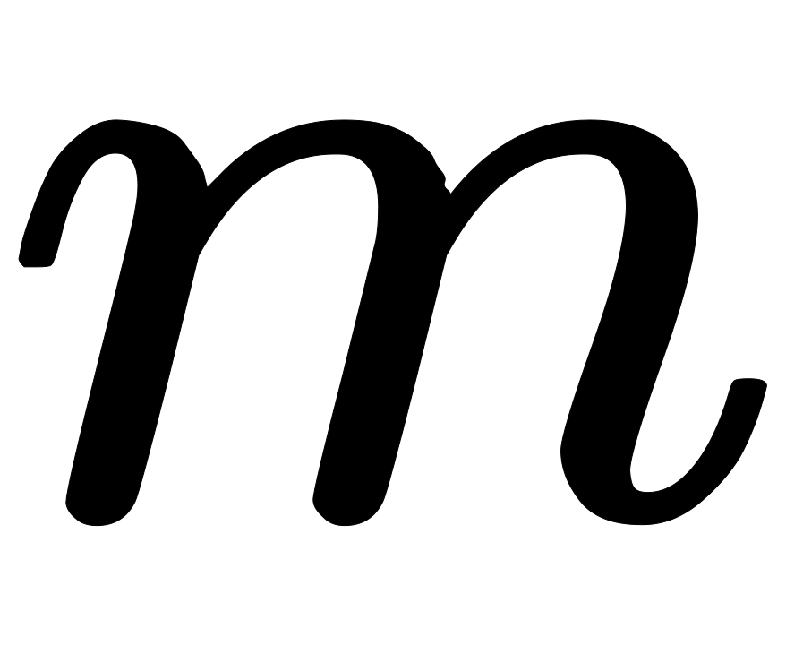

# 携程 2019 届秋招专业笔试-大数据方向

## 1

以下说法中错误的是

正确答案: C   你的答案: 空 (错误)

```cpp
AdaBoost 训练过程中基分类器的分类误差率是被该分类器误分类样本的权重之和
```

```cpp
随机森林训练过程中对样本进行有放回抽样
```

```cpp
Bagging 方法主要关注降低偏差，而 Boosting 方法主要关注降低方差
```

```cpp
XGBoost 使用了损失函数的二阶导数信息，传统 GBDT 只用了一阶导数
```

本题知识点

算法工程师 携程 大数据开发工程师 2019

讨论

[许愿论文答辩顺利通过顺利毕业🙏](https://www.nowcoder.com/profile/127728147)

Bagging 对样本重采样，对每一重采样得到的子样本集训练一个模型，最后取平均。由于子样本集的相似性以及使用的是同种模型，因此各模型有近似相等的 bias 和 variance（事实上，各模型的分布也近似相同，但不独立）。由于，所以 bagging 后的 bias 和单个子模型的接近，一般来说不能显著降低 bias。另一方面，若各子模型独立，则有，**此时可以显著降低 variance**。若各子模型完全相同，则

，此时不会降低 variance。bagging 方法得到的各子模型是有一定相关性的，属于上面两个极端状况的中间态，因此可以一定程度降低 variance。为了进一步降低 variance，Random forest 通过随机选取变量子集做拟合的方式 de-correlated 了各子模型（树），使得 variance 进一步降低。

（用公式可以一目了然：设有 i.d.的 n 个随机变量，方差记为，两两变量之间的相关性为，则的方差为

，bagging 降低的是第二项，random forest 是同时降低两项。详见 ESL p588 公式 15.1）

boosting 从优化角度来看，是用 forward-stagewise 这种贪心法去最小化损失函数。例如，常见的 AdaBoost 即等价于用这种方法最小化 exponential loss：。所谓 forward-stagewise，就是在迭代的第 n 步

发表于 2019-05-13 19:28:27

* * *

[Henryhust](https://www.nowcoder.com/profile/4708060)

为什么说 bagging 是减少 variance，而 boosting 是减少 bias?：[`www.zhihu.com/question/26760839`](https://www.zhihu.com/question/26760839)

发表于 2019-09-04 14:17:00

* * *

[西瓜柚子](https://www.nowcoder.com/profile/668861153)

为什么 c 错呢，bagging 本身可以使得方差较小，那偏差自然而然就大了啊，那 bagging 不就是要关注怎么降低偏差吗，boosting 同理，是我理解错了么

发表于 2020-10-12 20:34:53

* * *

## 2

为了得到和 SVD 一样的投射（projection）需要在 PCA 中怎么做

正确答案: A   你的答案: 空 (错误)

```cpp
将数据转换成零均值
```

```cpp
将数据转换成零中位数
```

```cpp
将数据转换成零众数
```

```cpp
无法做到
```

本题知识点

算法工程师 携程 大数据开发工程师 2019

讨论

[Henryhust](https://www.nowcoder.com/profile/4708060)

[`blog.csdn.net/qq_35082030/article/details/79352579`](https://blog.csdn.net/qq_35082030/article/details/79352579)，第二题

[数据预处理之中心化（零均值化）与标准化（归一化）](https://www.cnblogs.com/wangqiang9/p/9285594.html)

发表于 2019-09-04 15:25:43

* * *

## 3

机器学习中做特征选择时，可能用到的方法有

正确答案: E   你的答案: 空 (错误)

```cpp
卡方
```

```cpp
信息增益
```

```cpp
平均互信息
```

```cpp
期望交叉熵
```

```cpp
其他选项都是
```

本题知识点

算法工程师 携程 大数据开发工程师 2019

讨论

[Dejavu_Get](https://www.nowcoder.com/profile/798831578)

后面三个是决策树的典型特征选择指标

发表于 2019-05-18 17:33:24

* * *

## 4

假定目标变量的类别非常不平衡，即主要类别占据了训练数据的 99%。现在你的模型在测试集上表现为 99% 的准确度。那么下面哪一项表述是正确的？

正确答案: B   你的答案: 空 (错误)

```cpp
准确度适合于衡量不平衡类别问题
```

```cpp
精确率和召回率适合于衡量不平衡类别问题
```

```cpp
精确率和召回率不适合于衡量不平衡类别问题
```

```cpp
其他选项都不对
```

本题知识点

算法工程师 携程 大数据开发工程师 2019

讨论

[许愿论文答辩顺利通过顺利毕业🙏](https://www.nowcoder.com/profile/127728147)

1 . 准确度并不适合于衡量不平衡类别问题
2\. 精确率和召回率适合于衡量不平衡类别问题

发表于 2019-05-13 19:32:31

* * *

## 5

某请求被随即分配到四台机器进行处理，分配到每台机器的概率 A15% B20% C 30% D 35%, 处理请求的失败概率分别为 5% ，4%， 3% 2%，现在请求失败，问由 C 造成的概率最接近

正确答案: B   你的答案: 空 (错误)

```cpp
0.26
```

```cpp
0.28
```

```cpp
0.3
```

```cpp
0.32
```

本题知识点

算法工程师 携程 大数据开发工程师 2019

讨论

[大佬求带。。](https://www.nowcoder.com/profile/248966335)

贝叶斯公式 P(C|失败)=P(失败|C)*P(C)/(P(失败|A)*P(A)+P(失败|B)*P(B)+P(失败|C)*P(C)+P(失败|D)*P(D))

发表于 2019-05-13 21:26:15

* * *

[是垚垚哇](https://www.nowcoder.com/profile/852930703)

(30 %× 3% ) ÷c(15%x 5% + 20% x 4% + 30% x 3% + 35% x 2%)

发表于 2021-09-27 15:57:00

* * *

[Maple_2005](https://www.nowcoder.com/profile/203246634)

相应机器的概率乘以相应出错概率就是全集

发表于 2020-08-06 00:36:47

* * *

## 6

用 0,1,2,3,4,5 组成一个 4 位数，要求每一位都不一样，请问能组成多少个四位数

正确答案: C   你的答案: 空 (错误)

```cpp
240
```

```cpp
280
```

```cpp
300
```

```cpp
360
```

```cpp
400
```

本题知识点

算法工程师 携程 大数据开发工程师 2019

讨论

[Keepyourself.](https://www.nowcoder.com/profile/5766980)

千位：12345 五个数字中任意选一个，剩下四个数字为 a，有五种选择

百位：在 a 与 0 共 5 个数中选一个 ，剩下的四个数字为 b，有五种选择

十位：在 b 中选一个，剩下的数字为 c，有四种选择

个位：在 c 中选一个，有三种选择

所以结果=5*5*4*3 =300

发表于 2019-05-16 16:11:29

* * *

[kyota](https://www.nowcoder.com/profile/228779094)

6 个数字中选 4 个数字组合成一个四位数：A![=360]其中不能存在的情况：0 开头的四位数，即用剩下 5 个数字中三个任意组合一个三位数： A=60 可以存在的情况：360-60=300

发表于 2019-10-21 22:03:09

* * *

[Swtshs](https://www.nowcoder.com/profile/112712416)

第一位不能是 0 有五种情况，第二位除了第一位都可以，有五种情况，第三位有四种情况，第四位有三种情况，所以是 5×5×4×3=300

发表于 2021-03-17 21:45:52

* * *

## 7

Spark 中 Stage 阶段的 Task 数量由什么决定

正确答案: A   你的答案: 空 (错误)

```cpp
Partition
```

```cpp
Job
```

```cpp
TaskScheduler
```

```cpp
Stage
```

本题知识点

算法工程师 携程 算法工程师 携程 大数据开发工程师 携程 2019

讨论

[许愿论文答辩顺利通过顺利毕业🙏](https://www.nowcoder.com/profile/127728147)

spark 中有 partition 的概念，每个 partition 都会对应一个 task，task 越多，在处理大规模数据的时候，就会越有效率。不过 task 并不是越多越好，如果平时测试，或者数据量没有那么大，则没有必要 task 数量太多。 

发表于 2019-05-13 19:33:58

* * *

## 8

关于支持向量机 SVM,下列说法错误的是

正确答案: D   你的答案: 空 (错误)

```cpp
L2 正则项，作用是最大化分类间隔，使得分类器拥有更强的泛化能力
```

```cpp
Hinge 损失函数，作用是最小化经验分类错误
```

```cpp
分类间隔为 1/||w||，||w||代表向量的模
```

```cpp
当参数 C 越小时，分类间隔越大，分类错误越多，趋于欠学习
```

本题知识点

算法工程师 携程 大数据开发工程师 2019

讨论

[给我一个 offer 叭！！！](https://www.nowcoder.com/profile/1409891)

c 代表对误分类的惩罚。c 越大，间隔越大，那么越容易欠拟合 c 越小，间隔越小，那么容易发生过拟合

发表于 2020-03-31 12:42:18

* * *

[拾陆 humin](https://www.nowcoder.com/profile/334013855)

间隔是 2/||w||，||w||是模，也可认为是二范数，意义一样

发表于 2019-05-15 17:48:57

* * *

[小海虾](https://www.nowcoder.com/profile/36452155)

请问 D 项 C 越小不是间隔越小吗随着调节参数 C 的减小，落在间隔的错误一侧的观测数目也越来越少， 因此间隔也越来越小。

发表于 2020-03-31 15:29:30

* * *

## 9

一个合法的表达式由()包围，()可以嵌套和连接，如(())()也是合法 表达式；现在有 6 对()，它们可以组成的合法表达式的个数为

正确答案: D   你的答案: 空 (错误)

```cpp
15
```

```cpp
30
```

```cpp
64
```

```cpp
132
```

```cpp
256
```

本题知识点

算法工程师 携程 算法工程师 携程 大数据开发工程师 携程 2019

讨论

[XII0001](https://www.nowcoder.com/profile/6003398)

可以把括号序列看作是出栈入栈序列，入栈序列是确定的，而出栈序列为卡兰特数，所以为卡兰特数。为啥出栈序列为卡兰特数？我死记硬背的🤣

发表于 2019-07-02 17:19:23

* * *

[许愿论文答辩顺利通过顺利毕业🙏](https://www.nowcoder.com/profile/127728147)

卡特兰数：[`www.zhihu.com/question/25072237/answer/30111179`](https://www.zhihu.com/question/25072237/answer/30111179)

发表于 2019-05-13 19:39:13

* * *

[cosJin](https://www.nowcoder.com/profile/685136502)


发表于 2019-06-12 16:23:29

* * *

## 10

下列哪个不属于 CRF 模型对于 HMM 和 MEMM 模型的优势

正确答案: B   你的答案: 空 (错误)

```cpp
特征灵活 
```

```cpp
速度快
```

```cpp
可容纳较多上下文信息
```

```cpp
全局最优
```

本题知识点

算法工程师 携程 大数据开发工程师 2019

讨论

[零葬](https://www.nowcoder.com/profile/75718849)

CRF 是出了名的慢

发表于 2020-12-04 11:41:41

* * *

## 11

评估模型之后，得出模型存在偏差，下列哪种方法可能解决这一问题（）

正确答案: B   你的答案: 空 (错误)

```cpp
减少模型中特征的数量
```

```cpp
向模型中增加更多的特征
```

```cpp
增加更多的数据
```

```cpp
其他选项均正确
```

本题知识点

算法工程师 携程 大数据开发工程师 2019

讨论

[荣小妹](https://www.nowcoder.com/profile/469350730)

高偏差意味这模型不够复杂(欠拟合)，为了模型更加的强大，我们需要向特征空间中增加特征。增加样本能够降低方差

发表于 2020-04-01 14:16:29

* * *

[只求 offer 无他求](https://www.nowcoder.com/profile/783926658)

过拟合 高方差 低偏差 欠拟合 低方差 高偏差 这里是欠拟合

编辑于 2019-06-04 22:47:47

* * *

## 12

下面哪一项 用决策树法训练大量数据集最节约时间（）

正确答案: C   你的答案: 空 (错误)

```cpp
增加学习率
```

```cpp
增加树的深度；增加学习率
```

```cpp
减少树的深度
```

```cpp
减少树的深度；减少树的个数
```

本题知识点

算法工程师 携程 大数据开发工程师 2019

讨论

[大佬求带。。](https://www.nowcoder.com/profile/248966335)

减少树的深度，相当于加入了一个正则化项，可以降低模型复杂度，可以参考 xgboost 模型减少树的个数对于可以并行训练的 RF 模型在时间上没有较大影响。

发表于 2019-05-13 21:50:00

* * *

[肩并肩 199](https://www.nowcoder.com/profile/84163379)

决策树模型应该没有学习率的说法吧

发表于 2020-04-01 17:44:17

* * *

## 13

关于 L1 正则和 L2 正则 下面的说法正确的是

正确答案: D   你的答案: 空 (错误)

```cpp
L2 范数可以防止过拟合，提升模型的泛化能力。但 L1 正则做不到这一点
```

```cpp
L2 正则化标识各个参数的平方的和
```

```cpp
L2 正则化又叫做"Lasso regularization"
```

```cpp
L1 范数会使权值稀疏
```

本题知识点

算法工程师 携程 大数据开发工程师 2019

讨论

[拾陆 humin](https://www.nowcoder.com/profile/334013855)

(1)  L1 范数和 L2 范数均可以降低过拟合的风险；(2) L0 正则化的值是模型中非零参数分个数；     L1 正则化值是模型中各个参数绝对值之和；     L2 正则化标识各个参数平方和的开方值；(3) 引入 L2 范数防止过拟合，被称为岭回归(ridge regression)，也被称为 Tikhonov 回归(岭回归最初由 A.Tikhonov 发表)；      将 L2 范数换成 L1 范数后，称为 LASSO (Least Absolute Shrinkage and Selection Opreator);(4) L1 范数和 L2 范数都有助于降低过拟合风险，但 L1 范数更易获得稀疏解，即具有更少的非零分量。

编辑于 2019-05-17 09:41:03

* * *

## 14

以下模型不是判别模型的是哪个（）

正确答案: D   你的答案: 空 (错误)

```cpp
SVM
```

```cpp
最大熵模型
```

```cpp
决策树
```

```cpp
朴素贝叶斯
```

本题知识点

算法工程师 携程 大数据开发工程师 2019

讨论

[门扣](https://www.nowcoder.com/profile/790195824)

这篇文章说得挺好的。 [`blog.csdn.net/zouxy09/article/details/8195017`](https://blog.csdn.net/zouxy09/article/details/8195017)

发表于 2019-09-28 10:08:23

* * *

[Anise](https://www.nowcoder.com/profile/868677860)

```cpp
朴素贝叶斯是生成模型
```

发表于 2019-09-04 10:58:00

* * *

## 15

以下不属于线性分类器的是（）

正确答案: C   你的答案: 空 (错误)

```cpp
Logistic Regression
```

```cpp
贝叶斯分类器
```

```cpp
GBDT
```

```cpp
单层感知机
```

本题知识点

算法工程师 携程 大数据开发工程师 2019

讨论

[门扣](https://www.nowcoder.com/profile/790195824)

生成模型的线性分类器：线性判别分析（LDA); 朴素贝叶斯分类器;判别模型的线性分类器：logit 模型；感知元（Perceptron）；支持向量机 （svm) 注： XGBoost 是 GBDT 最普遍的一个实现之一； 

发表于 2019-09-28 12:10:22

* * *

## 16

以下哪个是常见的时间序列算法模型（）

正确答案: C   你的答案: 空 (错误)

```cpp
RSI
```

```cpp
MACD
```

```cpp
ARMA
```

```cpp
KDJ
```

本题知识点

算法工程师 携程 大数据开发工程师 2019

讨论

[a 啊呀呀呀](https://www.nowcoder.com/profile/877756792)

常用的时间序列模型有**AR 模型(Autoregressive model:自回归模型)**、**MA 模型(moving average model:滑动平均模型)**、**ARMA 模型(Auto-Regressive and Moving Average Model:自回归滑动平均模型) **和 **A****RIM****A 模型(Autoregressive Integrated Moving Average Model:自回归积分滑动平均模型)**等。

原文链接：[`blog.csdn.net/qingqing7/article/details/79070722`](https://blog.csdn.net/qingqing7/article/details/79070722)

编辑于 2020-03-10 15:00:57

* * *

[Kate201909120126480](https://www.nowcoder.com/profile/643098323)

常见的时间序列算法模型有：MA(q)、 AR(p)、 ARMA(p，q)、 ARIMA(p，d，q)。

发表于 2019-09-23 05:54:32

* * *

## 17

关于 logistic 回归和 SVM 不正确的是（）

正确答案: A   你的答案: 空 (错误)

```cpp
Logistic 回归目标函数是最小化后验概率
```

```cpp
Logistic 回归可以用于预测事件发生概率的大小
```

```cpp
SVM 目标是结构风险最小化
```

```cpp
SVM 可以有效避免模型过拟合
```

本题知识点

算法工程师 携程 大数据开发工程师 2019

讨论

[牛美凝](https://www.nowcoder.com/profile/615941421)

A. Logit 回归本质上是一种根据样本对权值进行极大似然估计的方法，而后验概率正比于先验概率和似然函数的乘积。logit 仅仅是最大化似然函数，并没有最大化后验概率，更谈不上最小化后验概率。A 错误

B. Logit 回归的输出就是样本属于正类别的几率，可以计算出概率，正确

C. SVM 的目标是找到使得训练数据尽可能分开且分类间隔最大的超平面，应该属于结构风险最小化。

D. SVM 可以通过正则化系数控制模型的复杂度，避免过拟合。

发表于 2019-06-09 17:56:26

* * *

[Maple_2005](https://www.nowcoder.com/profile/203246634)

拜托大哥，SVM 有效避免过拟合不是你本身，是正则化好吧，这题出的……

发表于 2020-08-06 14:18:58

* * *

[拾陆 humin](https://www.nowcoder.com/profile/334013855)

最大化后验概率

发表于 2019-05-17 12:03:09

* * *

## 18

下列属于无监督学习的是（）

正确答案: A   你的答案: 空 (错误)

```cpp
K-means
```

```cpp
SVM
```

```cpp
最大熵模型
```

```cpp
CRF
```

本题知识点

算法工程师 携程 算法工程师 携程 大数据开发工程师 携程 2019

讨论

[Maple_2005](https://www.nowcoder.com/profile/203246634)

K 均值不是无监督？、、

发表于 2020-08-06 14:23:52

* * *

## 19

在其他条件不变的前提下，以下哪种做法容易引起过拟合问题（）

正确答案: D   你的答案: 空 (错误)

```cpp
增加训练样本量
```

```cpp
减少神经网络隐藏节点数
```

```cpp
删除稀疏的特征
```

```cpp
SVM 算法中使用高斯核/RBF 代替线性核
```

本题知识点

算法工程师 携程 算法工程师 携程 大数据开发工程师 携程 2019

讨论

[拾陆 humin](https://www.nowcoder.com/profile/334013855)

SVM 使用线性核是即为线性分类器，当换成高斯核时即转换我非线性分类器，能够更好的训练数据，而这样带来的风险就是容易引起过拟合，其他选项都能够降低过拟合的风险

发表于 2019-05-17 12:07:08

* * *

[给我一个 offer 叭！！！](https://www.nowcoder.com/profile/1409891)

A.增加训练数据，防止过拟合 B.减少神经网络隐藏节点数  ，相当于模型的复杂程度降低，防止过拟合的发生 C.删除稀疏特征，相当于数据降维，减小了模型的复杂程度，防止过拟合的发生

发表于 2020-03-31 14:54:10

* * *

## 20

以下哪种方法不可以直接用来对文本分类（）

正确答案: A   你的答案: 空 (错误)

```cpp
Kmeans
```

```cpp
决策树
```

```cpp
支持向量机
```

```cpp
KNN
```

本题知识点

算法工程师 携程 算法工程师 携程 大数据开发工程师 携程 2019

讨论

[Raven_Lee](https://www.nowcoder.com/profile/96659304)

重点看到题干中的“分类”，不要被“文本”带跑偏。Kmeans 是聚类，其他三项是分类。

发表于 2020-03-30 23:04:22

* * *

[门扣](https://www.nowcoder.com/profile/790195824)

[`www.nowcoder.com/questionTerminal/1b77030dc8e44868afdff765df00b484`](https://www.nowcoder.com/questionTerminal/1b77030dc8e44868afdff765df00b484)

发表于 2019-09-28 12:44:24

* * *

[给弟弟一个 offer](https://www.nowcoder.com/profile/895606814)

不太懂什么叫“直接对文本进行分类”

发表于 2019-09-04 00:14:08

* * *

## 21

下列不是 SVM 核函数的是（）

正确答案: B   你的答案: 空 (错误)

```cpp
多项式核函数
```

```cpp
Logistic 核函数
```

```cpp
径向基核函数
```

```cpp
Sigmoid 核函数
```

本题知识点

算法工程师 携程 算法工程师 携程 大数据开发工程师 携程 2019

讨论

[招聘小能手](https://www.nowcoder.com/profile/9504244)

SVM 核函数有四种：1.线性核函数  2.多项式核函数  3.sigmoid 核函数  4.高斯径向基核函数

发表于 2019-08-02 12:32:17

* * *

## 22

下列哪些方法不可以用来对高维数据进行降维（）

正确答案: B   你的答案: 空 (错误)

```cpp
LASSO
```

```cpp
交叉验证
```

```cpp
主成分分析法
```

```cpp
线性判别方法
```

本题知识点

算法工程师 携程 大数据开发工程师 2019

讨论

[贺咯咯](https://www.nowcoder.com/profile/65234072)

交叉验证是检验模型表现得方法

发表于 2021-09-10 11:31:10

* * *

[门扣](https://www.nowcoder.com/profile/790195824)

[`www.nowcoder.com/questionTerminal/90980952e1b747d3ace40c1356b64c5b?from=14pdf`](https://www.nowcoder.com/questionTerminal/90980952e1b747d3ace40c1356b64c5b?from=14pdf)

发表于 2019-09-28 13:54:02

* * *

## 23

 下面有关分类算法的准确率，召回率，F1-score 的描述，错误的是（）

正确答案: C   你的答案: 空 (错误)

```cpp
准确率是检索出相关文档数与检索出的文档总数的比率，衡量的是检索系统的查准率
```

```cpp
召回率是指检索出的相关文档数和文档库中所有的相关文档数的比率，衡量的是检索系统的查全率
```

```cpp
正确率、召回率和 F 值取值都在 0 和 1 之间，数值越接近 0，查准率或查全率就越高
```

```cpp
为了解决准确率和召回率冲突问题，引入了 F1 分数
```

本题知识点

算法工程师 携程 算法工程师 携程 大数据开发工程师 携程 2019

讨论

[绿蚁红泥](https://www.nowcoder.com/profile/426128312)

C 项是数值越接近 1，查准率和查全率就越高

发表于 2020-02-25 20:39:30

* * *

## 24

在 Logistic Regression 中，如果同时加入 L1 和 L2 范数，会产生什么效果（）

正确答案: A   你的答案: 空 (错误)

```cpp
可以做特征选择，并在一定程度上防止过拟合
```

```cpp
能解决维度灾难问题
```

```cpp
能加快计算速度
```

```cpp
可以增强模型的稳定性
```

本题知识点

算法工程师 携程 算法工程师 携程 大数据开发工程师 携程 2019

讨论

[大佬求带。。](https://www.nowcoder.com/profile/248966335)

为啥不选 D 了？模型的泛化能力强了，稳定性不就高了？

发表于 2019-05-13 22:01:18

* * *

## 25

在一个神经网络里，知道每一个神经元的权重和偏差是最重要的一步。如果以某种方法知道了神经元的准确的权重和偏差，你就可以近似任何函数。实现这个最佳的办法是什么（）

正确答案: C   你的答案: 空 (错误)

```cpp
随机赋值
```

```cpp
搜索所有权重和偏差的组合，直到得到最佳值
```

```cpp
赋予一个初始值，通过检查跟最佳的差值，然后迭代更新权重
```

```cpp
其他选项都不正确
```

本题知识点

算法工程师 携程 大数据开发工程师 2019

## 26

下列哪个不属于常用的文本分类的特征选择算法（）

正确答案: D   你的答案: 空 (错误)

```cpp
卡方检验
```

```cpp
互信息
```

```cpp
信息增益
```

```cpp
主成分分析
```

本题知识点

算法工程师 携程 算法工程师 携程 大数据开发工程师 携程 2019

讨论

[mehhco](https://www.nowcoder.com/profile/527570890)

主成分分析是特征抽取，不是特征选择来自博文：[`blog.csdn.net/qq_35082030/article/details/79352579`](https://blog.csdn.net/qq_35082030/article/details/79352579)

发表于 2020-09-08 18:16:28

* * *

[门扣](https://www.nowcoder.com/profile/790195824)

[`www.nowcoder.com/questionTerminal/176d04e022734bbf9fb94f3caa02e6af`](https://www.nowcoder.com/questionTerminal/176d04e022734bbf9fb94f3caa02e6af)

发表于 2019-09-28 14:17:36

* * *

## 27

输入图片大小为 200*200，依次经过一层卷积（kernel size 5*5， padding 1， stride 2）， pooling （kernel size 3*3， padding 0， stride 1），又一层卷积  (kernel size 3*3, padding 1, stride 1)之后，输出特征图的大小为：（）

正确答案: C   你的答案: 空 (错误)

```cpp
95
```

```cpp
96
```

```cpp
97
```

```cpp
98
```

本题知识点

算法工程师 携程 算法工程师 携程 大数据开发工程师 携程 2019

讨论

[算法才是灵魂](https://www.nowcoder.com/profile/4088795)

计算尺寸不被整除只在 GoogLeNet 中遇到过。卷积向下取整，池化向上取整。

（200-5+2*1）/2+1 为 99.5，取 99

（99-3）/1+1 为 97

（97-3+2*1）/1+1 为 97

我搜索的公式：

这里提供一个计算每一层输出图像的 size 的公式。无论是卷积层还是 pooling 层，公式都是这样的：

( input_size + 2*padding - kernel_size ) / stride+1 = output_size

发表于 2019-05-14 16:34:41

* * *

[earnestbin](https://www.nowcoder.com/profile/7680222)

这里面要注意取整的方式，对于指定 padding 的数值，那么卷积向下取整，池化向上取整没问题，但是如果是 padding='same'或者'valid'，feature map 计算公式是不一样的，源码里面是 ceil

发表于 2019-08-09 21:51:04

* * *

## 28

在 deep Learning 中，涉及到大量矩阵相乘，现在需要计算三个稠密矩阵 a，b，c 的乘机 abc，假设三个矩阵的尺寸分别为 m*n，n*p，p*q，且 m<n>正确答案: B   你的答案: 空 (错误)

```cpp
a(bc)
```

```cpp
(ab)c
```

```cpp
(ac)b
```

```cpp
所有效率都相同
```

本题知识点

算法工程师 携程 大数据开发工程师 2019

讨论

[Stream201908251425680](https://www.nowcoder.com/profile/749234001)

ABC=(AB)C=A(BC). (AB)C = m*n*p + m*p*q,A(BC)=n*p*q + m*n*q. m*n*p<m*n*q,m*p*q< n*p*q

发表于 2019-09-05 01:05:24

* * *

[门扣](https://www.nowcoder.com/profile/790195824)

解析：
首先，根据简单的矩阵知识，因为 A*B ， A 的列数必须和 B 的行数相等。因此，可以排除 B 选项，
然后，再看 A 、 C 选项。在 A 选项中，m∗nm∗n 的矩阵 A 和 n∗pn∗p 的矩阵 B 的乘积，得到 m∗pm∗p 的矩阵 A*B ，而 A∗BA∗B 的每个元素需要 n 次乘法和 n-1 次加法，忽略加法，共需要 m∗n∗pm∗n∗p 次乘法运算。同样情况分析 A*B 之后再乘以 C 时的情况，共需要 m∗p∗qm∗p∗q 次乘法运算。因此， A 选项 (AB)C 需要的乘法次数是 m∗n∗p+m∗p∗qm∗n∗p+m∗p∗q 。同理分析， C 选项 A (BC) 需要的乘法次数是 n∗p∗q+m∗n∗qn∗p∗q+m∗n∗q。
由于 m∗n∗p<m∗n∗q，m∗p∗q<n∗p∗qm∗n∗p<m∗n∗q，m∗p∗q<n∗p∗q，显然 A 运算次数更少，故选 A 。

原文链接：[`blog.csdn.net/qq_35082030/article/details/75196392`](https://blog.csdn.net/qq_35082030/article/details/75196392)

编辑于 2019-09-28 14:39:17

* * *

## 29

下列有关模式挖掘算法的描述，错误的是（）

正确答案: C   你的答案: 空 (错误)

```cpp
AprioriAll 算法和 GSP 算法都属于 Apriori 类算法，都要产生大量的候选序列
```

```cpp
FreeSpan 算法和 PrefixSpan 算法不生成大量的候选序列以及不需要反复扫描元数据库
```

```cpp
在时空的执行效率上，FreeSpan 比 PrefixSpan 更优
```

```cpp
和 AprioriAll 相比，GSP 的执行效率比较高
```

本题知识点

算法工程师 携程 算法工程师 携程 大数据开发工程师 携程 2019

讨论

[门扣](https://www.nowcoder.com/profile/790195824)

[`real-neo.me/4%20%E7%A7%8D%E5%BA%8F%E5%88%97%E6%A8%A1%E5%BC%8F%E6%8C%96%E6%8E%98%E7%AE%97%E6%B3%95%E7%9A%84%E6%AF%94%E8%BE%83%E5%88%86%E6%9E%90`](https://real-neo.me/4%20%E7%A7%8D%E5%BA%8F%E5%88%97%E6%A8%A1%E5%BC%8F%E6%8C%96%E6%8E%98%E7%AE%97%E6%B3%95%E7%9A%84%E6%AF%94%E8%BE%83%E5%88%86%E6%9E%90)

发表于 2019-09-28 14:43:12

* * *

## 30

下列哪种操作实现了和神经网络中 Dropout 类似的结果（）

正确答案: A   你的答案: 空 (错误)

```cpp
Bagging
```

```cpp
Boosting
```

```cpp
堆叠（Stacking）
```

```cpp
其他选项都不正确
```

本题知识点

算法工程师 携程 算法工程师 携程 大数据开发工程师 携程 2019

讨论

[许愿论文答辩顺利通过顺利毕业🙏](https://www.nowcoder.com/profile/127728147)

Dropout 可以认为是一种极端的 Bagging，每一个模型都在单独的数据上训练，同时，通过和其他模型对应参数的共享，从而实现模型参数的高度正则化。

发表于 2019-05-13 19:45:20

* * *

## 31

游游和小伙伴结伴而行，途径一处园林，游游与小伙伴决定进去游览。该园林可以看作一张个点（每个点代表一个景点）条边的无向图（无重边，无自环）。旅途中，两人的初始愉悦度皆为 0 ，第 i 个景点需要耗费分钟的时间，会让游游和小伙伴的愉悦度分别增加,  。每条边代表一条路径，第 i 条边连接编号为,  的两个景点，从走到或者从走到耗费的时间都是分钟。游游和小伙伴预计在该园林停留 分钟。检票进入园林后，游游和小伙伴会等概率的随机选择一个景点开始游览，每游览完一个景点后，游游和小伙伴会等概率的随机选择一个可以从当前景点直达的且来得及玩的景点作为下一个目的地。如果游览完一个景点后周围没有可以直达的且来得及游览的景点，游游和小伙伴就会提前结束游玩。 请分别计算出游游和小伙伴在游览结束后愉悦度的期望。  

本题知识点

算法工程师 携程 图 动态规划 大数据开发工程师 2019

讨论

[算法才是灵魂](https://www.nowcoder.com/profile/4088795)

普通 DP 问题
比较坑的一点是，走过的地方还能重复走，这对于旅游来说，也是听奇葩的。。。。
dp[i][j]: 在点 i，剩余时间还有 j 时，两个小伙伴所得到 happy 值的期望。

代码如下,没什么好说的：

```cpp
// cont/list1.cpp

#include <iostream>
#include <list>
#include <vector>
#include <map>
#include <algorithm>
using namespace std;

vector<vector<int> > mp;
vector<vector<pair<double, double>>> dp;
vector<int> happy1, happy2, times;
int n;
pair<double, double> dfs(int start, int remain)
{
    if(dp[start][remain] != pair<double, double>(0,0))
        return dp[start][remain];
    int cnt = 0;
    for(int to = 1 ; to <= n ; to++)
    {
        if(mp[start][to] > 0 && remain - times[to] - mp[start][to] >= 0)
            cnt += 1;
    }
    pair<double, double> res(0,0), ans(happy1[start],happy2[start]);
    for(int to = 1 ; to <= n ; to++)
    {
        if(mp[start][to] > 0 && remain - times[to] - mp[start][to] >= 0)
        {
            res = dfs(to, remain - times[to] - mp[start][to]);
            ans.first += res.first / cnt;
            ans.second += res.second / cnt;
        }
    }
    dp[start][remain] = ans;
    return ans;
}

int main()
{
    int m,k,x,y,w;
    cin >> n >> m >> k;
    mp.resize(n+1);
    dp.resize(n+1);
    for(int i = 0 ; i < n+1; i++)
    {
        mp[i].resize(n+1);
        dp[i].resize(k);
    }
    happy1.resize(n+1);
    happy2.resize(n+1);
    times.resize(n+1);

    for(int i = 1 ; i <= n ;i++)
        cin >> times[i] >> happy1[i] >> happy2[i];
    for(int i = 0 ; i < m ; i++)
    {
        cin >> x >> y >> w;
        mp[x][y] = w;
        mp[y][x] = w;
    }
    pair<double ,double> now, ans(0.0, 0.0);
    for(int i = 1 ; i <= n ; i++)
    {
        if(k - times[i] < 0)
            continue;
        now = dfs(i, k-times[i]);
        ans.first += now.first / n;
        ans.second += now.second / n;
    }
    printf("%.5f %.5f\n", ans.first, ans.second);
    return 0;
}
```

"""

发表于 2019-05-14 16:14:40

* * *

[nbgao](https://www.nowcoder.com/profile/211289)

```cpp
#include <bits/stdc++.h>
using namespace std;

const int N = 101;
struct P{
    int id, t;
};
int n,m,k;
vector<P> G[N];
vector<int> M(N), v1(N), v2(N);

double F(vector<int> v){
    double dp[n+1][k+1];
    memset(dp, 0, sizeof(dp));
    for(int j=1;j<=k;j++)
        for(int i=1;i<=n;i++){
            double s = 0;
            int cnt = 0;
            if(j>=M[i])
                dp[i][j] += v[i];
            for(int u=0;u<G[i].size();u++)
                if(j>=G[i][u].t + M[i] + M[G[i][u].id]){
                    s += dp[G[i][u].id][j-G[i][u].t-M[i]];
                    cnt++;
                }
            if(s)
                dp[i][j] += s/cnt;
        }
    double r = 0;
    for(int i=1;i<=n;i++)
        r += dp[i][k];
    return r / n;
}

int main(){
    cin>>n>>m>>k;
    for(int i=1;i<=n;i++){
        cin>>M[i]>>v1[i]>>v2[i];
    }
    int x,y,t;
    for(int i=0;i<m;i++){
        cin>>x>>y>>t;
        G[x].push_back({y, t});
        G[y].push_back({x, t});
    }
    printf("%.5f %.5f\n", F(v1), F(v2));
    return 0;
}
```

发表于 2020-01-10 12:31:11

* * *

[一线绝缘体](https://www.nowcoder.com/profile/585932497)

```cpp
double getNum(vector<int>& v) {
    vector<vector<double>> dp(n + 1, vector<double>(k + 1, 0));
    //dp[i][j]表示到达 i 景点的时候，游玩时间还有 j 分钟愉悦值的期望
    for (int j = 1; j <= k; ++j) {
        for (int i = 1; i <= n; ++i) {
            if(j>=mi[i])dp[i][j] += v[i];//时间够访问 i 景点的话，则加上 i 景点的愉悦值
            double sum = 0;
            int x = 0;
            for (int q = 0; q < G[i].size(); ++q) {
                if (j >= G[i][q].second + mi[i] + mi[G[i][q].first]) {
                    sum += dp[G[i][q].first][j - G[i][q].second - mi[i]];
                    x++;
                    //当时间够访问当前 i 节点，并能够抵消访问相邻节点的时间和到达相邻节点之和的时候
                    //从相邻节点出发，并更新剩余时间。
                }
            }
            if (sum)dp[i][j] += sum / x;//sum 为从当前 i 景点到所有可以达到并来得及游玩的愉悦值之和，x 为满足条件的景点个数
        }
    }
    double ans = 0;
    for (int i = 1; i <= n; ++i) {
        ans += dp[i][k];//开始的 n 个节点是等概率随机获取的，不考虑时间够不够，所以期望直接除以 n;
    }
    return ans / n;
}
```

编辑于 2021-07-18 10:20:35

* * *</n>