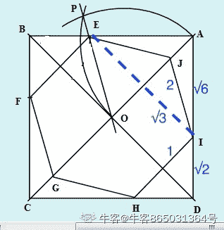

# 2017PayPal 暑期实习生笔试卷-数据科学家

## 1

10 people meet for a business lunch. Each person shakes hands once with each other person present. How many handshakes take place? 

正确答案: D   你的答案: 空 (错误)

```cpp
75
```

```cpp
65
```

```cpp
50
```

```cpp
45
```

本题知识点

算法工程师 paypal 大数据开发工程师 2017

## 2

A manager in a call center needs to determine how many agents to schedule next week. Based on previous data, she expects to get 7,940 calls next week. The following conditions apply:On average, call center agents can handle seven calls an hour.The call center is open for 10 hours, 5 days a week.Full-time agents work 40 hours per week, but are only on calls for 35 hours a week.Part-time agents work 20 hours per week, but are only on calls for 17 hours a week.Which combination is the best to meet the scheduling needs?

正确答案: E   你的答案: 空 (错误)

```cpp
15 full-time agents and 15 part-time agents
```

```cpp
20 full-time agents and 7 part-time agents
```

```cpp
20 full-time agents and 20 part-time agents
```

```cpp
25 full-time agents and 5 part-time agents
```

```cpp
28 full-time agents and 10 part-time agents
```

本题知识点

算法工程师 paypal 大数据开发工程师 2017

## 3

There are 40% students in a class are married, and there are 60% of the students in the class are male. If 1/3 of the male students are married, what’s the percentage of single female students in this class?

正确答案: B   你的答案: 空 (错误)

```cpp
1/6
```

```cpp
1/5
```

```cpp
1/4
```

```cpp
2/5
```

```cpp
1/3
```

本题知识点

算法工程师 paypal 大数据开发工程师 2017

讨论

[拿到好 offer](https://www.nowcoder.com/profile/190630248)

男生已婚：（6/10）*（1/3）=1/5 女生比例：1-60%=40%女生已婚=已婚总比例-男生已婚比例：4/10-1/5=1/5 女生未婚=女生总比例-女生已婚=4/10-1/5=1/5

发表于 2019-09-11 16:37:17

* * *

## 4

Some of barbers have a beard. Therefore, some people who have a beard like dressing white clothes.Which one is the truth can infer the correctness of the above argument?

正确答案: C   你的答案: 空 (错误)

```cpp
Some of barbers like dressing white clothes.
```

```cpp
Some of barbers dressed white clothes don’t have a beard.
```

```cpp
All of barbers like dressing white clothes.
```

```cpp
All of people who like dressing white clothes are barbers.
```

本题知识点

算法工程师 paypal 大数据开发工程师 2017

## 5

Betty paints twice as fast as Dan. Working together, Dan and Betty can paint 2,400 square feet in 4 hours. Another employee, Sue, joined their painting team. Working together, Dan, Betty, and Sue can paint 3,600 square feet in 3 hours.If Sue works alone, how many square feet can she paint in 4 hours and 34 minutes?

正确答案: D   你的答案: 空 (错误)

```cpp
1,570 square feet
```

```cpp
1,860 square feet
```

```cpp
2,530 square feet
```

```cpp
2,740 square feet
```

```cpp
2,990 square feet
```

本题知识点

算法工程师 paypal 大数据开发工程师 2017

## 6

A box contains 20 balls numbered from 1 to 20 inclusive. If Jane removes a ball at random and replaces it, and then Kate removes a ball at random, what is the probability that both women removed the same ball?

正确答案: D   你的答案: 空 (错误)

```cpp
1/400
```

```cpp
1/200
```

```cpp
1/90
```

```cpp
1/20
```

```cpp
1/10
```

本题知识点

算法工程师 paypal 大数据开发工程师 2017

讨论

[colcolar97](https://www.nowcoder.com/profile/143781894)

应该考虑 20 种情况的累加！

发表于 2020-03-18 16:04:36

* * *

## 7

One circle can divide a plane into two parts. What is the maximum number that 12 circles can divide the plane into?

正确答案: D   你的答案: 空 (错误)

```cpp
86
```

```cpp
92
```

```cpp
116
```

```cpp
134
```

```cpp
148
```

本题知识点

算法工程师 paypal 大数据开发工程师 2017

## 8

The probability that event A occurs is 0.4, and the probability that events A and B both occur is 0.25\. If the probability that either event A or event B occurs is 0.6, what is the probability that event B will occur?

正确答案: C   你的答案: 空 (错误)

```cpp
0.15
```

```cpp
0.35
```

```cpp
0.45
```

```cpp
0.50
```

```cpp
0.55
```

本题知识点

算法工程师 paypal 大数据开发工程师 2017

## 9

In the first half of this year, from January to June, about three million videocassette recorders were sold. This number is only 35 percent of the total number of videocassette recorders sold last year. Therefore, total sales of videocassette recorders will almost certainly be lower for this year than they were for last year.Which of the following, if true, most seriously weakens the conclusion above? 

正确答案: B   你的答案: 空 (错误)

```cpp
The total number of videocassette recorders sold last year was lower
than the total number sold in the year before that.
```

```cpp
Typically, over 70 percent of the sales of videocassette recorders made
in a year occur in the months of November and December.
```

```cpp
Most people who are interested in owning a videocassette recorder have
already purchased one.
```

```cpp
Videocassette recorders are less expensive this year than they were last year.
```

```cpp
Of the videocassette recorders sold last year, almost 60 percent were
sold in January
```

本题知识点

算法工程师 paypal 大数据开发工程师 2017

## 10

Use below image to determine the correct response option from those listed below. Select the response choice that replaces the question mark.

正确答案: C   你的答案: 空 (错误)

本题知识点

算法工程师 paypal 大数据开发工程师 2017

讨论

[DyrLee](https://www.nowcoder.com/profile/39773895)

第一个每条边上有 5 个小框，然后接着的二三也就是 5 个小框。然后第四个每条边就只有 4 个小框了，所以答案应该是 4 个小框。不知道是不是这样

发表于 2020-09-24 14:48:18

* * *

[牛客 546739817 号](https://www.nowcoder.com/profile/546739817)

怎么个逻辑？

发表于 2020-09-04 17:21:38

* * *

## 11

Contrary to the charges made by some of its opponents, the provisions of the new deficit-reduction law for indiscriminate cuts in the federal budget are justified. Opponents should remember that the New Deal pulled this country out of great economic troubles even though some of its programs were later found to be unconstitutional. The author’s method of attacking the charges of certain opponents of the new deficit-reduction law is to

正确答案: B   你的答案: 空 (错误)

```cpp
attack the character of the opponents rather than their claim
```

```cpp
imply an analogy between the law and some New Deal programs
```

```cpp
point out that the opponents’ claims imply a dilemma
```

```cpp
show that the opponents’ reasoning leads to an absurd conclusion
```

```cpp
show that the New Deal also called for indiscriminate cuts in the
federal budget
```

本题知识点

算法工程师 paypal 大数据开发工程师 2017

## 12

Contrary to the charges made by some of its opponents, the provisions of the new deficit-reduction law for indiscriminate cuts in the federal budget are justified. Opponents should remember that the New Deal pulled this country out of great economic troubles even though some of its programs were later found to be unconstitutional. The opponents could effectively defend their position against the author’s strategy by pointing out that

正确答案: E   你的答案: 空 (错误)

```cpp
the expertise of those opposing the law is outstanding
```

```cpp
the lack of justification for the new law does not imply that those who
drew it up were either inept or immoral
```

```cpp
the practical application of the new law will not entail indiscriminate
budget cuts
```

```cpp
economic troubles present at the time of the New Deal were equal in
severity to those that have led to the present law
```

```cpp
the fact that certain flawed programs or laws have improved the economy
does not prove that every such program can do so
```

本题知识点

算法工程师 paypal 大数据开发工程师 2017

## 13

Consider you are in a coin game with the following rules, There are 2 players in the game - you and your rival.There are random numbers of coins on the table, you and your rival take turns to grab the coins.Your rival takes the first turn.Each person must grab at least one coin and up to 3 coins in his/her turn. The person left with the last coin on the table loses.What’s the likelihood of you winning the game given both you and your rival adopts the most optimized strategy?

正确答案: D   你的答案: 空 (错误)

```cpp
0%
```

```cpp
10%
```

```cpp
20%
```

```cpp
25%
```

本题知识点

算法工程师 paypal 大数据开发工程师 2017

讨论

[rocky1554](https://www.nowcoder.com/profile/609110540)

具体看这堆硬币有多少： 如果是 4n+1 枚，（n 为非负整数）先手必输。因为不管先手每轮怎么拿（拿 x 个），后手每轮补到 4 个（即拿 4-x 个），最后后手能拿到 4n，先手必拿第 4n+1，也就是最后一枚。 如果是 4n+x 枚，（n 为非负整数，x=｛0，2，3｝）先手必胜。我们把 x=0 看作 x=4，n=n-1。此时先手第一轮只要拿 x-1 枚，就能将问题转化为：先手变后手，后手变先手，取 4n+1 枚硬币的问题。这个问题之前讨论过，此时是转变后的后手必胜，也就是转变前的先手必胜。 如果硬币总数 N%4==1，后手必胜，其他情况先手必胜，所以总胜率 25%。

编辑于 2021-08-19 10:58:02

* * *

## 14

Five cards are dealt from a deck of 52 cards. The probability of obtaining 2 black cards and 3 red face cards is

正确答案: C   你的答案: 空 (错误)

```cpp
5/52
```

```cpp
195/779688
```

```cpp
25/9996
```

```cpp
3/5
```

```cpp
25/4998
```

本题知识点

算法工程师 paypal 大数据开发工程师 2017

## 15

There is clear evidence that the mandated use of safety seats by children under age four has resulted in fewer child fatalities over the past five years. Compared to the five-year period prior to the passage of laws requiring the use of safety seats, fatalities of children under age four have decreased by 30 percent. Which one of the following, if true, most substantially strengthens the argument above? 

正确答案: A   你的答案: 空 (错误)

```cpp
The number of serious automobile accidents involving children under age
four has remained steady over the past five years
```

```cpp
Automobile accidents involving children have decreased sharply over the
past five years
```

```cpp
The use of air bags in automobiles has increased by 30 percent over the
past five years
```

```cpp
Most fatal automobile accidents involving children under age four occur
in the driveway of their home
```

```cpp
The number of teenage drivers has increased by 30 percent over the past
five years
```

本题知识点

算法工程师 paypal 大数据开发工程师 2017

## 16

A snail is at the bottom of a 25 meters deep pit. Every day the snail climbs 5 meters upwards, but at night it slides 4 meters back downwards. How many days does it take before the snail reaches the top of the pit?

正确答案: A   你的答案: 空 (错误)

```cpp
21 days
```

```cpp
22 days
```

```cpp
23 days
```

```cpp
24 days
```

```cpp
25 days
```

本题知识点

算法工程师 paypal 大数据开发工程师 2017

## 17

Estimate the area of the smallest square that can enclose the regular hexagon shown below:

正确答案: D   你的答案: 空 (错误)

```cpp
200%
```

```cpp
150%
```

```cpp
120%
```

```cpp
145%
```

本题知识点

算法工程师 paypal 大数据开发工程师 2017

讨论

[牛客 865031364 号](https://www.nowcoder.com/profile/865031364)

这道题只要把图想明白了，基本就出来了。设正六边形长为 2，正方形边长则为√6 + √2 面积比为（2 √3 +4） /（3 √3），约为 145%。

发表于 2021-08-18 17:50:26

* * *

## 18

Put 10 coins in a line with all the face side on. If only allow the follow two movements,(1) Flip the continuous 4 coins (2) 5 continues coins OOOOO to XXOXXHow many movements is needed to make all the face side down?

正确答案: D   你的答案: 空 (错误)

```cpp
5
```

```cpp
9
```

```cpp
10
```

```cpp
None of others
```

本题知识点

算法工程师 paypal 大数据开发工程师 2017

## 19

A certain club has 10 members, including Harry. One of the 10 members is to be chosen at random to be the president, one of the remaining 9 members is to be chosen at random to be the secretary, and one of the remaining 8 members is to be chosen at random to be the treasurer. What is the probability that Harry will be either the member chosen to be the secretary or the member chosen to be the treasurer? 

正确答案: E   你的答案: 空 (错误)

```cpp
1/720
```

```cpp
1/80
```

```cpp
1/10
```

```cpp
1/9
```

```cpp
1/5
```

本题知识点

算法工程师 paypal 大数据开发工程师 2017

## 20

Crowding on Mooreville's subway frequently leads to delays, because it is difficult for passengers to exit from the trains. Subway ridership is projected to increase by 20 percent over the next 10 years. The Mooreville Transit Authority plans to increase the number of daily train trips by only 5 percent over the same period. Officials predict that this increase is sufficient to ensure that the incidence of delays due to crowding does not increase.Which of the following, if true, provides the strongest grounds for the officials' prediction?

正确答案: D   你的答案: 空 (错误)

```cpp
By changing maintenance schedules, the Transit Authority can achieve the
5 percent increase in train trips without purchasing any new subway cars.
```

```cpp
The Transit Authority also plans a 5 percent increase in the number of
bus trips on routes that connect to subways.
```

```cpp
For most commuters who use the subway system, there is no practical
alternative public transportation available.
```

```cpp
Most of the projected increase in ridership is expected to occur in
off-peak hours when trains are now sparsely used.
```

```cpp
The 5 percent increase in the number of train trips can be achieved
without an equal increase in Transit Authority operational costs.
```

本题知识点

算法工程师 paypal 大数据开发工程师 2017

## 21

Which of the following queries displays the sum of all employee salaries for those employees not making commission, for each job, including only those sums greater than 2500?

正确答案: B   你的答案: 空 (错误)

```cpp
select job, sum(sal) from emp where sum(sal) > 2500 and comm is null;
```

```cpp
select job, sum(sal) from emp where comm is null group by job having
sum(sal) > 2500;
```

```cpp
select job, sum(sal) from emp where sum(sal) > 2500 and comm is null
group by job;
```

```cpp
select job, sum(sal) from emp group by job having sum(sal) > 2500 and
comm is not null;
```

本题知识点

算法工程师 paypal 大数据开发工程师 2017

## 22

How do you select all the records from a table named ‘Persons’ where the ‘LastName’ is alphabetically between (and including) ‘Huang’ and ‘Li’?

正确答案: C   你的答案: 空 (错误)

```cpp
select * from persons where lastname > ‘Huang’ and lastname < ‘Li’
```

```cpp
select lastname > ‘Huang’ and lastname < ‘Li’ from persons
```

```cpp
select * from persons where lastname between ‘Huang’ and ‘Li’
```

本题知识点

算法工程师 paypal 大数据开发工程师 2017

## 23

With SQL, how can you insert a new record into the "Persons" table?

正确答案: C   你的答案: 空 (错误)

```cpp
INSERT VALUES ('Cathy', 'Jackson') INTO Persons
```

```cpp
INSERT ('Cathy', 'Jackson') INTO Persons
```

```cpp
INSERT INTO Persons VALUES ('Cathy', 'Jackson')
```

本题知识点

算法工程师 paypal 大数据开发工程师 2017

讨论

[丫酱 123](https://www.nowcoder.com/profile/179710621)

```cpp
INSERT INTO 表名称 VALUES (值 1, 值 2,....) -- 用于向表格中插入新的行
Eg: INSERT INTO Persons VALUES ('Gates', 'Bill', 'Xuanwumen 10', 'Beijing')
```

发表于 2020-03-19 19:21:07

* * *