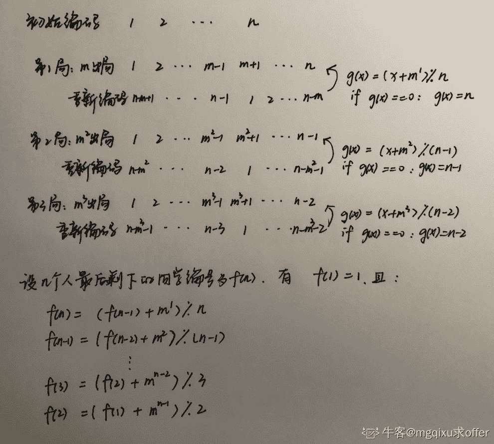

# 二千零一十九、PayPal 实习生招聘编程卷

## 1

近日，埃航空难的新闻牵动了无数人的心。据悉，空难很可能是由于波音 737MAX 飞机的失速保护系统错误触发所致。在飞机进行高空飞行时，驾驶辅助系统如果检测到飞机失速，无法维持足够的飞行升力，会压低机头进行俯冲，以重新获得速度，进而获取足够的飞行升力，维持飞行高度。但是在飞机进行低空飞行时，触发俯冲机制极有可能在飞机还未获得足够飞行速度并上升之前已经撞击地面。鉴于半年内的两起事故，波音公司决定在低于一定高度时屏蔽自动俯冲机制，现提供 K 架飞机用于测试最低可俯冲高度，设定需要测试的海拔范围为 1~H（单位米），请问最不理想情况下，至少需要多少次才能求出飞机的最低可俯冲高度？

本题知识点

Java 工程师 C++工程师 安卓工程师 iOS 工程师 运维工程师 前端工程师 算法工程师 PHP 工程师 测试工程师 paypal 贪心 数组 模拟 动态规划 golang 工程师 2019

讨论

[段子](https://www.nowcoder.com/profile/542605250)

#include <bits/stdc++.h>usingnamespacestd;intmain(){    intK,N;    cin>>K>>N;    vector<int> dp(K + 1, 0);    intm;    for(m = 0; dp[K] < N; m++)            for(intk = K; k > 0; --k)                dp[k] += dp[k - 1] + 1;    cout<<m<<endl;    return0;}

发表于 2019-06-12 15:17:04

* * *

[地沟油](https://www.nowcoder.com/profile/158459804)

问题等价于：k 个鸡蛋，h 层楼，最少用多少次能找到哪一层楼摔下去鸡蛋会碎。

先来看简单的场景：

*   k = 1
    首先，如果 k=1，很简单，最坏情况下最少要尝试 h 次。即，最高能探索的层数=最少探索次数。
*   k = 2
    再看 k=2 即只有两个鸡蛋的场景。
    设最少尝试次数为 x，那么 x+(x-1)+...+2+1=(x+1)*x/2 为最高能探索的层数。
    具体解释为：
    第一次将鸡蛋在第 x 层放下，如果摔碎了，另一个鸡蛋从第 1 层开始尝试到第 x-1 层，一共尝试 x 次；如果没摔碎，继续将这个鸡蛋从第 x+(x-1)层放下，如果摔碎，从第 x+1 层尝试到第 x+(x-1)-1 层，即一共 x 次尝试；如果没摔碎，继续将这个鸡蛋从第 x+(x-1)+(x-2)层放下，....

那么当 k>2 的情况呢？

**用动态规划方法求解，假设用 j 个鸡蛋做 i 次尝试最高能探索到第 dp[i][j]层。当 dp[i][j]>h 时的 i 即为所求。**

**初始状态**：
dp[i][1] = i：用 1 个鸡蛋，有 i 次尝试机会，就能到第 i 层（因为每次都是往上尝试 1 层）。
dp[1][j] = 1：有 j 个鸡蛋，只给 1 次尝试机会，那么最多只能尝试到第 1 层。这里注意了，因为只有 1 次尝试机会，你有再多个鸡蛋也没用。

**dp[i][j]:**
现在初始状态确定了，来看看 dp[i][j]怎么确定，也就是有 j 个鸡蛋做 i 次尝试，最高能探索到第几层？

假设我们知道有 j-1 个鸡蛋做 i-1 次尝试最高能到几层，那现在多了 1 个鸡蛋，可以多做 1 次尝试，那最高能到多少层呢？这第 i 个鸡蛋只能再做 1 次尝试，因此，只能在 dp[i-1][j-1]+1 层尝试。

1.  如果这次尝试鸡蛋碎了，我们就找到在第 dp[i-1][j-1]+1 层鸡蛋会碎啦；
2.  如果这次尝试鸡蛋没碎，那么还能再对 j 个鸡蛋做 i-1 次尝试，因此，还能再高 dp[i-1][j]层。

因此，dp[i][j] = dp[i-1][j-1] + 1 + dp[i-1][j]

于是，可以写出动态规划的代码：

```cpp
k, h = [int(x) for x in input().split()]
dp = [1]*(k+1)
cnt = 1
while dp[k] < h:
    cnt += 1
    dp_i_1 = dp[:]
    dp[1] = cnt
    for j in range(2,k+1):
        dp[j] = dp_i_1[j-1] + dp_i_1[j] + 1
print(cnt)
```

优化一下，变成：

```cpp
k, h = [int(x) for x in input().split()]
dp = [0] * (k+1)
cnt = 0
while dp[k] < h:
    for i in range(k,0,-1):
        dp[i] += dp[i-1] + 1
    cnt += 1
print(cnt)
```

编辑于 2019-09-13 17:34:51

* * *

[offer 快到碗里来啊！](https://www.nowcoder.com/profile/4725702)

使用图+DFS(代码没有优化,可阅读)

```cpp
package NiuKeWang;

import java.io.File;
import java.io.IOException;
import java.util.*;

/**
 * @Classname XuZhaoGuanLianYongHu
 * @Description TODO
 * @Date 19-5-25 上午 10:01
 * @Created by mao<tianmao818@qq.com>
 */
public class XuZhaoGuanLianYongHu {
    public static void main(String[] args)throws IOException {
        Scanner sc=new Scanner(new File("/home/mao/workspace/java/src/NiuKeWang/paypal"));
        //多组输入
        while (sc.hasNext()){
            double d=sc.nextDouble();
            int n=sc.nextInt();

            //建表
            List<List<Double>> table=new ArrayList<>();
            for(int i=0;i<n;i++){
                List<Double> tmp=new ArrayList<>();
                double x=sc.nextDouble();
                double y=sc.nextDouble();
                tmp.add(x);
                tmp.add(y);
                table.add(tmp);
            }

            //建图
            Map<Integer,List<Integer>> map=new HashMap<>();
            for(int i=0;i<n;i++){
                for(int j=i;j<n;j++){
                    double x1=table.get(i).get(0);
                    double y1=table.get(i).get(1);
                    double x2=table.get(j).get(0);
                    double y2=table.get(j).get(1);

                    double dd=distance(x1,y1,x2,y2);

                    if(dd<=d*d){
                        //正向
                        if(map.containsKey(i)){
                            map.get(i).add(j);
                        }else{
                            map.put(i,new ArrayList<>());
                            map.get(i).add(j);
                        }

                        //反向
                        if(map.containsKey(j)){
                            map.get(j).add(i);
                        }else{
                            map.put(j,new ArrayList<>());
                            map.get(j).add(i);
                        }
                    }
                }
            }
            List<List<Integer>> res=find(map);
            List<List<Integer>> ans=new ArrayList<>();
            for(List<Integer> tmp:res){
                tmp.sort(new Comparator<Integer>() {
                    @Override
                    public int compare(Integer o1, Integer o2) {
                        return o1-o2;
                    }
                });
                ans.add(tmp);
            }

            ans.sort(new Comparator<List<Integer>>() {
                @Override
                public int compare(List<Integer> o1, List<Integer> o2) {
                    return o1.get(0)-o2.get(0);
                }
            });

            System.out.println(ans);
        }
    }

    public static double distance(double x1,double y1,double x2,double y2){
        return (x1-x2)*(x1-x2)+(y1-y2)*(y1-y2);
    }

    public static List<List<Integer>> find(Map<Integer,List<Integer>> map){

        List<List<Integer>> ans=new ArrayList<>();
        int[] visited = new int[map.size()];

        for(int key :map.keySet()){
            List<Integer> tmp=new ArrayList<>();

            if(visited[key]==0){
                tmp.add(key);
                List<Integer> queue=new ArrayList<>();
                for(Integer i:map.get(key)){
                    queue.add(i);
                }
                visited[key]=1;
                while(!queue.isEmpty()){
                    int node=queue.get(0);
                    queue.remove(0);
                    if(visited[node]==0){
                        tmp.add(node);
                        for(Integer i:map.get(node)){
                            queue.add(i);
                        }
                        visited[node]=1;
                    }
                }
            }else {
                continue;
            }
            ans.add(tmp);
        }
        return ans;
    }
}

```

发表于 2019-05-25 10:31:12

* * *

## 2

 PayPal 上海团队一直致力于风险控制，风控需要收集各种信息，有时需要通过地理位置找出用户与用户之间存在的关联关系，这一信息可能会用于找出用户潜在存在的风险问题。我们记两个用户的关联关系可以表示为：

(1). user1，user2 与他们最常发生交易的地理位置分别为(x1, y1)，(x2, y2)，当这两个用户的欧氏距离不超过 d 时，我们就认为两个用户关联。

(2). 用户关联性具有传递性，若用户 1 与用户 2 关联，用户 2 与用户 3 关联，那么用户 1，2，3 均关联。

给定 N 个用户及其地理位置坐标，将用户按照关联性进行划分，要求返回一个集合，集合中每个元素是属于同一个范围的用户群。 

本题知识点

Java 工程师 C++工程师 安卓工程师 iOS 工程师 运维工程师 前端工程师 算法工程师 PHP 工程师 测试工程师 paypal 图 数学 golang 工程师 2019

讨论

[零葬](https://www.nowcoder.com/profile/75718849)

本质上是使用并查集求取图中的所有连通分量，这里为了保证题中要求的元素顺序，合并时没有考虑两个待合并节点的子树高度，而是直接将编号大的节点合并到编号小的节点下面。

```cpp
import java.io.BufferedReader;
import java.io.InputStreamReader;
import java.io.IOException;
import java.util.ArrayList;

public class Main {
    public static void main(String[] args) throws IOException {
        BufferedReader br = new BufferedReader(new InputStreamReader(System.in));
        double d = Double.parseDouble(br.readLine().trim());
        int n = Integer.parseInt(br.readLine().trim());
        double[][] coordinate = new double[n][2];
        String[] strArr;
        for(int i = 0; i < n; i++){
            strArr = br.readLine().trim().split(" ");
            coordinate[i][0] = Double.parseDouble(strArr[0]);
            coordinate[i][1] = Double.parseDouble(strArr[1]);
        }
        UnionFind uf = new UnionFind(n, d);
        for(int i = 0; i < n - 1; i++){
            for(int j = i + 1; j < n; j++){
                // 节点 i 和 j 是连通的，进行合并
                if(uf.isConnected(coordinate[i][0], coordinate[i][1], coordinate[j][0], coordinate[j][1]))
                    uf.union(i, j);
            }
        }
        ArrayList<ArrayList<Integer>> res = new ArrayList<>();
        for(int i = 0; i < n; i++){
            if(uf.parent[i] == i){
                // 这是个根节点
                ArrayList<Integer> userSet = new ArrayList<>();
                // 寻找这个集合中的所有元素
                for(int j = 0; j < n; j++)
                    if(uf.parent[j] == i) userSet.add(j);
                res.add(new ArrayList<Integer>(userSet));
            }
        }
        System.out.println(res);
    }
}

class UnionFind {
    public int[] parent;
    private double d;
    public UnionFind(int n, double d) {
        parent = new int[n];
        // 代表元法
        for(int i = 0; i < n; i++)
            parent[i] = i;
        this.d = d;
    }

    // 判断节点(x1,y1)和(x2,y2)是否是关联的
    public boolean isConnected(double x1, double y1, double x2, double y2) {
        return (x1 - x2) * (x1 - x2) + (y1 - y2) * (y1 - y2) <= d * d;
    }

    // 获得节点 i 的所属集合(即根节点)
    public int find(int x) {
        while(x != parent[x]){
            parent[x] = parent[parent[x]];     // 路径压缩
            x = parent[x];
        }
        return x;
    }

    // 合并节点 i 和 j
    public void union(int x, int y) {
        int rootX = find(x);
        int rootY = find(y);
        // 将节点编号大的合并到节点编号小的节点下面
        if(rootX < rootY){
            for(int i = 0; i < parent.length; ++i){
                if(parent[i] == rootY)
                    parent[i] = rootX;
            }
        }else{
            for(int i = 0; i < parent.length; ++i) {
                if(parent[i] == rootX)
                    parent[i] = rootY;
            }
        }
    }
}
```

发表于 2021-02-22 16:56:22

* * *

[makersy](https://www.nowcoder.com/profile/194778542)

使用并查集解决。详情：[看这里](https://blog.csdn.net/makersy/article/details/90404102)。
这里贴一下代码。

```cpp
//采用并查集思想，将所有的关联节点父子关系使用数组索引表示
import java.util.*;
public class Main{
    static int[] users;
    static double d;  //欧式距离
    //判断相连
    private static boolean isConnected(double x1, double y1, double x2, double y2){
        double dis = Math.sqrt((x1-x2)*(x1-x2)+(y1-y2)*(y1-y2));  //计算两点距离
        return dis <= d;
    }
    //获取当前节点的根节点
    private static int getRoot(int i){
        return users[i];
    }
    //合并 p、q，将 q 的根节点设置为 q 的根节点
    private static void union(int p, int q){
        int pRoot = getRoot(p);
        int qRoot = getRoot(q);
        if (pRoot < qRoot) {
            for (int i = 0; i < users.length; ++i) {
                if (users[i] == qRoot) {
                    users[i] = pRoot;
                }
            }
        } else {
            for (int i = 0; i < users.length; ++i) {
                if (users[i] == pRoot) {
                    users[i] = qRoot;
                }
            }
        }
    }
    public static void main(String[] args){
        Scanner sc = new Scanner(System.in);
        d = sc.nextDouble();
        int n = sc.nextInt();
        users = new int[n];
        for( int i=0; i<n; ++i ){
            users[i] = i;
        }
        double[][] pos = new double[n][2];
        //读取位置信息，存入二维数组
        for( int i=0; i<n; ++i ){
            pos[i][0] = sc.nextDouble();
            pos[i][1] = sc.nextDouble();
        }
        //遍历数组，建立联系
        for( int i=0; i<n; ++i ){
            for( int j=0; j<i; ++j ){
                if( isConnected(pos[i][0], pos[i][1], pos[j][0], pos[j][1]) ) {
                    union(i, j);
                }
            }
        }
        //将有联系的用户放进集合
        ArrayList> res = new ArrayList();
        for( int i=0; i<n; ++i ){
            if( users[i] == i ){
                //如果这是一个根节点，建立一个关于她的数组集合
                ArrayList temp = new ArrayList();
                for( int j=i; j<n; ++j ){
                    if( users[j]==i ) temp.add(j);
                }
                res.add(temp);
            }
        }
        System.out.println(res);
    }
}
```

编辑于 2019-05-24 21:53:17

* * *

[Crazybinary](https://www.nowcoder.com/profile/443482)

#include <bits>using namespace std;

//并查集+路径压缩+格式输出
//注意：两个用户可能一开始没有关联，但是随着后面加入的用户，
//可能产生关联，所以在并查集联合的时候要引起特别注意。
int father[1005];

int Find(int x) //查找
{
    while(x!=father[x])
    {
        father[x]=father[father[x]];
        x=father[x];
    }
    return x;
}

void Union(int x1,int x2) //联合
{
    int p1=Find(x1);
    int p2=Find(x2);
    if(p1==p2) return;
    else if(p1<p2)
        father[p2]=p1;
    else
        father[p1]=p2;
    Find(x1);
    Find(x2);
}

void init(int father[],int n) //初始化
{
    for(int i=0; i<n; i++)
        father[i]=i;
}

double dis(pair<double,double> A,pair<double,double> B)
{
    return (double)sqrt((A.first-B.first)*(A.first-B.first)+(A.second-B.second)*(A.second-B.second));
}

int main()
{
    double d;
    int n;
    cin>>d>>n;
    init(father,n);
    vector<pair<double,double> > user(n);
    vector<vector<int>> st(n);
    for(int i=0; i<n; i++)
    {
        cin>>user[i].first>>user[i].second;
        for(int j=0; j<i; j++)
        {
            if(dis({user[j].first,user[j].second}, {user[i].first,user[i].second})<=d)
            {
                Union(j,i);
            }
        }
    }
    for(int i=0; i<n; i++)
    {
        st[Find(i)].push_back(i);
    }
    if(st.size()==0)
        exit(0);
    cout<<"[";
    for(int i=0; i<st.size(); i++)
    {
        if(st[i].size()==0)
            continue;
        if(i>0)
            cout<<", [";
        else
            cout<<"[";
        for(int j=0; j<st[i].size(); j++)
        {
            if(j>0)
                cout<<", "<<st[i][j];
            else
                cout<<st[i][j];
        }
        cout<<"]";
    }
    cout<<"]";
    return 0;
}

```cpp

            发表于 2019-07-24 16:53:53

        3
          弹幕是现今网络视频常见的评论方式，能够反映一个视频的火爆程度。假设某个时间一共有 N 条弹幕，每条弹幕 i 的持续时间为两个整数表示的时间区间(a[i],b[i])，我们定义弹幕数量最多的一个时间段为最精彩时段，求一个视频的最精彩时段。 

            本题知识点

                                                            Java 工程师 
                                                C++工程师 
                                                安卓工程师 
                                                iOS 工程师 
                                                运维工程师 
                                                前端工程师 
                                                算法工程师 
                                                PHP 工程师 
                                                测试工程师 
                                                paypal 
                                                动态规划 
                                                排序 *贪心 
                                                数组 
                                                golang 工程师 
                                                2019*  *讨论

[我的名字自己都怕](https://www.nowcoder.com/profile/118455766)

                                                                      #include <iostream>
 using namespace std;
    int main()//弹幕时间最长区间输出  {
     int n;
     cin >> n;
     int *p1 = new int[n];
     int *p2 = new int[n];
     int pc[100] = { 0 };
     int pd[100] = { 0 };
     int i;
     int r_max = 0;
     for (i = 0; i < n; i++)
     {
         cin >> p1[i] >> p2[i];
         r_max = (r_max >= p2[i] ? r_max : p2[i]);
     }
     int j = 0;
     for (i = 0; i < n; i++)
     {
         for (j = p1[i]; j <p2[i]; j++)
         {
             pc[j]++;
         }
         for (j = p1[i] + 1; j < p2[i]; j++)
         {
             pd[j]++;
         }
     }
     int max = 0;
     for (i = 0; i < r_max; i++)
     {
         max = (max >= pc[i] ? max : pc[i]);
     }
     for (i = 0; i < r_max; i++)
     {
         if ((pc[i] == max&&i==0)||(pc[i]==max&&pd[i]!=max&&i>0))
         {
             cout << i <<' ';
         }
         if (pc[i] == max && pd[i + 1] != max)
         {
             cout << i + 1 << endl;
         }
     }
 }

发表于 2019-08-19 21:53:43

* * *

[LB 培养基](https://www.nowcoder.com/profile/5585742)

```
#include <bits/stdc++.h>
using namespace std;
#define rep(i,a,n) for (int i=a;i<n;i++)

int a[100] = {0};
int b[100] = {0};
int t[100] = {0};
int N,m;
int s,e;

int main() {
    scanf("%d",&N);
    rep(i,0,N) {
        scanf("%d%d",&s,&e);
        a[s]++;b[e]++;
    }
    t[0] = m = a[0];
    rep(i,1,100) {
        t[i] = t[i-1] + a[i] - b[i];
        if (t[i] > m) m = t[i];
    }
    for (int i = 0;i < 100; i++) {
        if (t[i] == m) {
            printf("%d", i);
            while (t[i] == m && b[i+1] == 0) i++;
            printf(" %d\n", i+1);
        }
    }
}

```cpp

发表于 2019-11-27 01:43:17

* * *

[泥潭里的蜗牛](https://www.nowcoder.com/profile/7189991)

                                                                      80%但是超时了，哎   

```
import sys

n = int(sys.stdin.readline())
be_list=[]
mp = [[0]*101 for i in range(101)]
lp = [[0]*101 for i in range(101)]
pos = [False for i in range(101)]
m = 0
def cmpt(be0,be1):
    if(be0[0]!=be1[0]):
        if be0[0]<be1[0]:
            return -1
        else:
            return 1
    elif(be0[1]!=be1[1]):
        if  be0[1]<be1[1]:
            return -1
        else:
            return 1
    else:
        return 0

for i in range(n):
    line = sys.stdin.readline()
    lines = line.split()
    be =( int(lines[0]), int(lines[1]) )
    be_list.append(be)
    pos[be[1]] = True
    for i in range(be[0],be[1]):
        mp[i][i+1]=mp[i][i+1]+1
        if mp[i][i+1]>m:
            m = mp[i][i+1]
be_list.sort(cmp=cmpt)
i = be_list[0][0]
j = i + 1
while j < be_list[-1][1]:
    if mp[i][j] == m :
        while mp[j][j+1] == m and pos[j] == False and j < be_list[-1][1]:
            j = j+1
        lp[i][j] = m
        i = j
        j = j +1
    else:
        i = j
        j = j + 1
for i in range(100):
    for j in range(100):
        if lp[i][j] == m:
            print '%d %d' %(i,j)

```cpp

发表于 2019-11-18 14:03:31

* * *

## 4

        有 n 个同学围成一圈，其 id 依次为 1，2，3...n（n 号挨着 1 号）。现在从 1 号开始报数，第一回合报到 m 的人就出局，第二回合从出局的下一个开始报数，报到 m² 的同学出局。
 以此类推直到最后一个回合报到 m^(n-1)的人出局，直到剩下最后一个同学。输出这个同学的编号。n<=15,m<=5

本题知识点

                                                            Java 工程师 
                                                C++工程师 
                                                安卓工程师 
                                                iOS 工程师 
                                                运维工程师 
                                                前端工程师 
                                                算法工程师 
                                                PHP 工程师 
                                                测试工程师 
                                                paypal 
                                                模拟 
                                                数组 
                                                数学 
                                                golang 工程师 
                                                2019 

讨论

[牛客 2816108 号](https://www.nowcoder.com/profile/2816108)

```
#include<iostream>
#include<vector>
#include<cmath>
using namespace std;
int main()
{
    int n,m;
    cin>>n>>m;
       if (n<1 || m<1) return -1;
    int circle=pow(m,n-1);
    int f=0;
    for(int i=2;i<=n;++i)
    {
        f=(f+circle)%i;
        circle/=m; // 调整为当前的 m，因为 m 有做关于 n 的次方
    }
    cout<<f+1<<endl;
    return 0;
}
```cpp

发表于 2019-06-16 10:19:11

* * *

[地沟油](https://www.nowcoder.com/profile/158459804)

                                                                          

```
n, m = [int(x) for x in input().split()]
ans = 1
for i in range(2, n+1):
    ans = (ans + m**(n-i+1)) % i
    if ans == 0:
        ans = i
print(ans)
```cpp

编辑于 2019-09-11 00:03:39

* * *

[neekity](https://www.nowcoder.com/profile/7732482)

                                                                      用 PHP 语言的 array_values()函数  

```
<?php
fscanf(STDIN, "%d %d", $n, $m);
$num=array();
$num[0]=0;
for ($i=1;$i<=$n;++$i) $num[$i]=$i;
$i--;
$j=1;
$pre=0;
while ($i>1){
    $j*=$m;
    $outid***re)%$i;
    if ($outidx==0) $outidx=$i;
    $pre=$outidx-1;
    //echo $num[$outidx]."\n";
    unset($num[$outidx]);
    $num=array_values($num);
    //var_dump($num);
    $i--;
}
echo $num[1];
?>

```cpp

发表于 2019-05-21 17:35:34

* * ** 
```</bits>