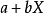
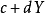

# 二千零一十九、PayPal 实习生招聘数据科学卷

## 1

以下程序的输出结果是：    def Foo(x) {
      if (x==1) {return 1} 
    else {return x+Foo(x-2)*2}
    }
    Print Foo(5)的输出结果是

正确答案: D   你的答案: 空 (错误)

```cpp
9
```

```cpp
11
```

```cpp
13
```

```cpp
15
```

本题知识点

算法工程师 paypal 数据挖掘工程师 大数据开发工程师 2019

讨论

[学习学习更要学习](https://www.nowcoder.com/profile/194328180)

Foo(5)=5+(Foo(3)*2)=5+((3+Foo(1)*2))*2=15

发表于 2019-05-29 09:26:57

* * *

## 2

以下排序算法的名称是    n = seq.length
    for j=1 to n-1
        smallest = j
        for i = j+1 to n
            if seq[i] < seq[smallest]
                smallest = i
        exchange seq[j] with seq[smallest]

正确答案: C   你的答案: 空 (错误)

```cpp
插入排序
```

```cpp
冒泡排序
```

```cpp
选择排序
```

```cpp
快速排序
```

本题知识点

算法工程师 paypal 数据挖掘工程师 大数据开发工程师 2019

讨论

[学习学习更要学习](https://www.nowcoder.com/profile/194328180)

选择排序(Selection sort)是一种简单直观的[排序算法](https://baike.so.com/doc/5414131-5652272.html)。它的工作原理是每一次从待排序的[数据元素](https://baike.so.com/doc/6144813-6357989.html)中选出最小(或最大)的一个元素，存放在序列的起始位置，直到全部待排序的数据元素排完。

发表于 2019-05-29 09:28:22

* * *

## 3

以下伪代码需要实现梯度下降,其中… 需要使用那个数学工具    while True:
        loss = f(params)
        d_loss_wrt_params = ...
        params -= eta * d_loss_wrt_params
        if <stopping condition met>:
            return params

正确答案: B   你的答案: 空 (错误)

```cpp
积分
```

```cpp
偏导
```

```cpp
傅里叶变换
```

```cpp
内积
```

本题知识点

算法工程师 paypal 数据挖掘工程师 大数据开发工程师 2019

## 4

SQL 输出与 WHRE GRADE NOT IN (60,100) 等价的语句是

正确答案: A B   你的答案: 空 (错误)

```cpp
WHERE (grade < 60 or grade >60) AND (grade<100 or grade>100）
```

```cpp
WHERE grade!= 60 and grade!=100
```

```cpp
WHERE grade!=60 or grade!=100
```

```cpp
WHERE (grade < 60 or grade >60) OR (grade<100 or grade>100）
```

本题知识点

算法工程师 paypal 数据挖掘工程师 大数据开发工程师 2019

讨论

[学习学习更要学习](https://www.nowcoder.com/profile/194328180)

注意 IN 是其中的某个数，between and 是区间范围

发表于 2019-05-29 09:33:58

* * *

## 5

若要撤销数据库中已经存在的表,可用

正确答案: D   你的答案: 空 (错误)

```cpp
DELETE TABLE X
```

```cpp
DELETE X
```

```cpp
DROP X
```

```cpp
DROP TABLE X
```

本题知识点

算法工程师 paypal 数据挖掘工程师 大数据开发工程师 2019

讨论

[学习学习更要学习](https://www.nowcoder.com/profile/194328180)

delete 是删除表数据，表还存在，drop 是删除表

发表于 2019-05-29 09:34:48

* * *

## 6

所谓第一范式（1NF）是指在关系模型中，所有的域都应该具有 ___?

正确答案: A   你的答案: 空 (错误)

```cpp
原子性
```

```cpp
对偶性
```

```cpp
共轭性
```

```cpp
单一性
```

本题知识点

算法工程师 paypal 数据挖掘工程师 大数据开发工程师 2019

讨论

[锅菌鱼](https://www.nowcoder.com/profile/4342701)

1NF 属性不可再分，可理解为原子性。

发表于 2020-04-02 01:38:32

* * *

[lilyyyyyyyy](https://www.nowcoder.com/profile/127643885)

数据表中每一列都是不可分割的原始数据项

发表于 2019-08-30 11:50:23

* * *

## 7

哪条 SQL 语句可返回唯一不同的值？

正确答案: B C   你的答案: 空 (错误)

```cpp
SELECT UNIQUE
```

```cpp
SELECT DISTINCT
```

```cpp
SELECT … GROUP BY …
```

```cpp
SELECT … WHERE …
```

本题知识点

算法工程师 paypal 数据挖掘工程师 大数据开发工程师 2019

讨论

[学习学习更要学习](https://www.nowcoder.com/profile/194328180)

distinct 可以把重复的行去掉，查询时候用 select distinct * from ...;

unique 在 mysql 中是完整性约束里的一种,如果某列的值需要是唯一的那么就添加 UNIQUE 约束

发表于 2019-05-29 09:37:39

* * *

[牛客 2816108 号](https://www.nowcoder.com/profile/2816108)

好像是没有 unique 这个说法？py 里面有这样用的

发表于 2019-06-15 18:44:38

* * *

## 8

以下语句正确的是

正确答案: A B C D   你的答案: 空 (错误)

```cpp
Python 是高级语言
```

```cpp
Python 是解释型语言
```

```cpp
Python 是面向对象的语言
```

```cpp
Python 是动态类型语言
```

本题知识点

算法工程师 paypal 数据挖掘工程师 大数据开发工程师 2019

## 9

面向对象编程包括以下特性

正确答案: A B C   你的答案: 空 (错误)

```cpp
封装
```

```cpp
继承
```

```cpp
多态
```

```cpp
动态类型
```

本题知识点

算法工程师 paypal 数据挖掘工程师 大数据开发工程师 2019 C++

讨论

[宁失天下不负卿](https://www.nowcoder.com/profile/7739018)

看成了不包括。。。

发表于 2020-08-13 20:48:57

* * *

[Darren〈คิดถึง〉](https://www.nowcoder.com/profile/253485734)

ABC

发表于 2019-08-21 21:09:34

* * *

## 10

Python 标记语句块使用

正确答案: D   你的答案: 空 (错误)

```cpp
花括号
```

```cpp
小括号
```

```cpp
引号
```

```cpp
缩进
```

本题知识点

算法工程师 paypal 数据挖掘工程师 大数据开发工程师 2019

讨论

[牛客 2816108 号](https://www.nowcoder.com/profile/2816108)

语句块是在条件为真（条件语句）时执行或者执行多次（循环语句）的一组语句；不要理解成了注释（一开始理解成了怎么在 py 写注释...

发表于 2019-06-15 18:46:58

* * *

[牛客 675290114 号](https://www.nowcoder.com/profile/675290114)

d

发表于 2020-09-10 21:31:10

* * *

[人在江湖飘，必须要挨刀](https://www.nowcoder.com/profile/314605471)

c

发表于 2020-05-10 19:50:03

* * *

## 11

如果 Python 函数中没有 return 语句，那么函数将返回

正确答案: B   你的答案: 空 (错误)

```cpp
0 正常执行，1 非正常执行
```

```cpp
None 对象
```

```cpp
最后一个赋值
```

```cpp
该函数的指针
```

本题知识点

算法工程师 paypal 数据挖掘工程师 大数据开发工程师 2019

讨论

[喬 201906192054136](https://www.nowcoder.com/profile/298050834)

```cpp
在 Python 中 return 函数返回值 return，函数中一定要有 return 返回值才是完整的函数，如果你没有定义 Python 函数返回值，
那么得到的结果是 None 对象。
```

发表于 2019-07-28 22:24:48

* * *

## 12

一个栈的入栈序列为 A B C D E F 则不可能的输出序列为(可以在不完全入栈的情况下，先出栈，然后再继续入栈)

正确答案: C   你的答案: 空 (错误)

```cpp
FEDCBA
```

```cpp
DEFCBA
```

```cpp
DCFEAB
```

```cpp
ABCDEF
```

本题知识点

算法工程师 paypal 数据挖掘工程师 大数据开发工程师 2019

讨论

[小老鼠快实现愿望吧](https://www.nowcoder.com/profile/176614150)

为什么 D 不可以？D 难道不是每进栈就出栈的结果吗，A 进 A 出，B 进 B 出，这样

发表于 2020-03-16 22:39:20

* * *

## 13

python my.py v1 v2 形式运行脚本时,通过 from sys import argv 如何获得 v2 的参数值?

正确答案: C   你的答案: 空 (错误)

```cpp
argv[0]
```

```cpp
argv[1]
```

```cpp
argv[2]
```

```cpp
argv[3]
```

本题知识点

算法工程师 paypal 数据挖掘工程师 大数据开发工程师 2019

讨论

[牛客 2816108 号](https://www.nowcoder.com/profile/2816108)

 from sys import argv sys.argv[0] 返回脚本名，也就是说 sys 从 python 之后开始读取参数 

发表于 2019-06-15 18:50:15

* * *

## 14

下列哪个是 Hadoop 运行的模式

正确答案: A B C   你的答案: 空 (错误)

```cpp
单机版
```

```cpp
伪分布式
```

```cpp
分布式
```

本题知识点

算法工程师 paypal 数据挖掘工程师 大数据开发工程师 2019

讨论

[牛客 750611974 号](https://www.nowcoder.com/profile/750611974)

abc

发表于 2021-03-16 17:15:09

* * *

[SolitudeX](https://www.nowcoder.com/profile/335523448)

Hadoop 的运行模式有三种：单机版模式、伪分布式、完全分布式

发表于 2019-05-20 16:50:28

* * *

## 15

下面哪个组件负责 HDFS 数据存储

正确答案: C   你的答案: 空 (错误)

```cpp
NameNode
```

```cpp
Jobtracker
```

```cpp
Datanode
```

```cpp
secondaryNameNode
```

```cpp
tasktracker
```

本题知识点

算法工程师 paypal 数据挖掘工程师 大数据开发工程师 2019

讨论

[阳大龙](https://www.nowcoder.com/profile/518027884)

datanode(dn)

*   存储具体的 block 信息,block 的校验文件

*   **真正执行读写的位置**

*   定期汇报节点的 block 状态

发表于 2019-07-27 11:08:25

* * *

## 16

Spark 相比 MapReduce 的优势

正确答案: A C D   你的答案: 空 (错误)

```cpp
DAG 执行引擎，中间结果不落盘
```

```cpp
线程池模型增多 task 启动开销
```

```cpp
充分利用内存，减少磁盘 IO
```

```cpp
更适合迭代计算
```

本题知识点

算法工程师 paypal 数据挖掘工程师 大数据开发工程师 2019

讨论

[Cristiano-77](https://www.nowcoder.com/profile/46736914)

A,C,D 这三个都是 spark 的明显优势

发表于 2020-06-16 10:55:20

* * *

[牛客 990601089 号](https://www.nowcoder.com/profile/990601089)

a 表示有疑问，shuffle 的中间结果算不算

发表于 2020-06-15 20:27:35

* * *

## 17

如果改变了观测样本中的一个样本的值，以下哪个统计量一定会变化？

正确答案: A   你的答案: 空 (错误)

```cpp
均值
```

```cpp
中位数
```

```cpp
众数
```

```cpp
都不一定会变化
```

本题知识点

算法工程师 paypal 数据挖掘工程师 大数据开发工程师 2019

讨论

[学习学习更要学习](https://www.nowcoder.com/profile/194328180)

改变了观测样本中的一个样本的值可能改变的是当前中位数或者众数的值，也可能是其他的值，但是均值一定会改变。

发表于 2019-05-29 09:40:28

* * *

## 18

以下图示的正态分布，以下哪个是正确的表述？sigma_1, sigma_2, sigma_3

正确答案: B   你的答案: 空 (错误)

```cpp
σ1> σ2> σ3
```

```cpp
σ1< σ2< σ3
```

```cpp
σ1= σ2= σ3
```

```cpp
都不正确
```

本题知识点

算法工程师 paypal 数据挖掘工程师 大数据开发工程师 2019

## 19

一名研究者发现安慰剂可以治愈艾滋病，请问他犯了哪一类统计学错误？

正确答案: D   你的答案: 空 (错误)

```cpp
第一类错误
```

```cpp
第二类错误
```

```cpp
并没有犯错误
```

```cpp
无法确定
```

本题知识点

算法工程师 paypal 数据挖掘工程师 大数据开发工程师 2019

讨论

[牛客 2816108 号](https://www.nowcoder.com/profile/2816108)

由于这里没有给出假设，因而无法判断犯了哪一类错误。如果 H0 为 安慰剂可以治愈艾滋病。事实告诉我们，安慰剂无法治愈艾滋病，则犯了第二类错误

发表于 2019-06-15 19:51:28

* * *

## 20

随机变量 X_1 与 随机变量 X_2 的皮尔逊相关系数为 0.65，如果所有的 X_1 都加 1，X_1 与 X_2 的相关系数会如何变化？

正确答案: C   你的答案: 空 (错误)

```cpp
增加
```

```cpp
减小
```

```cpp
保持不变
```

```cpp
无法确定
```

本题知识点

算法工程师 paypal 数据挖掘工程师 大数据开发工程师 2019

讨论

[my_offers](https://www.nowcoder.com/profile/955911576)

皮尔逊相关系数有一个重要的数学特性是，因两个变量的位置和尺度的变化并不会引起该系数的改变，即它是该变化的[不变量](https://baike.baidu.com/item/%E4%B8%8D%E5%8F%98%E9%87%8F)(由符号确定)。也就是说，我们如果把
)移动到)和把 Y 移动到，其中 a、b、c 和 d 是常数，并不会改变两个变量的相关系数（该结论在总体和样本皮尔逊相关系数中都成立）。

发表于 2019-10-05 11:41:18

* * *

## 21

掷一个完全公平的 6 面骰子，第一次结果是 6，且第二次结果不是 6 的概率是？

正确答案: C   你的答案: 空 (错误)

```cpp
1/36
```

```cpp
1/18
```

```cpp
5/36
```

```cpp
1/6
```

```cpp
1/3
```

本题知识点

算法工程师 paypal 数据挖掘工程师 大数据开发工程师 2019

讨论

[学习学习更要学习](https://www.nowcoder.com/profile/194328180)

每次结果的概率是 1/6，结果不是 6 的概率是 5/6，所以结果是 5/36

发表于 2019-05-29 09:41:51

* * *

## 22

假设本次笔试的通过率为 50%。95%通过笔试的同学觉得他们笔试答得很好，而 75%未通过笔试的同学也觉得他们的笔试答得很好。如果你觉得这次笔试你答得很好，你通过这次笔试的概率有多少？ 

正确答案: A   你的答案: 空 (错误)

```cpp
56%
```

```cpp
66%
```

```cpp
76%
```

```cpp
86%
```

```cpp
100%
```

本题知识点

算法工程师 paypal 数据挖掘工程师 大数据开发工程师 2019

讨论

[是真想不出昵称啊](https://www.nowcoder.com/profile/94336747)

答案选**A**这又是一条经典的笔试必考——**贝叶斯概率**题目解析：**通过率为 50%  ——>  ****P（过）=50%****95%通过笔试的同学觉得他们笔试答得很好——> P（感觉好 | 过）=95%****75%未通过笔试的同学也觉得他们的笔试答得很好——> P（感觉好 | 不过）****你觉得这次笔试你答得很好，你通过这次笔试的概率——> 求 P（过 | 感觉好）**解题过程：P（感觉好）= P（感觉好 | 过）*P（过）+ P（感觉好 | 不过）*P（不过） =0.95*0.5+0.75*0.5 =0.85P（过 | 感觉好）= P（感觉好 | 过）*P（过）/P（感觉好）= 0.95*0.5/0.85 = 0.55882352941176470588235294117647‬约等于 0.56 （56%） 

发表于 2019-05-20 21:23:21

* * *

[学习学习更要学习](https://www.nowcoder.com/profile/194328180)

P（感觉好）= P（感觉好 | 过）*P（过）+ P（感觉好 | 不过）*P（不过） =0.95*0.5+0.75*0.5 =0.85P（过 | 感觉好）= P（感觉好 | 过）*P（过）/P（感觉好）= 0.95*0.5/0.85 = 0.55882352941176470588235294117647‬约等于 0.56 （56%）

发表于 2019-05-29 09:42:38

* * *

[是夢、終會醒](https://www.nowcoder.com/profile/31378414)

我觉得正确答案应该是 E🤣

发表于 2020-08-24 00:56:40

* * *

## 23

假设有一个 hash 函数将任意随机数等概率的映射到 1-4 四个值，现在有四个新的随机数，他们之间发生哈希碰撞的概率为多少？

正确答案: B   你的答案: 空 (错误)

```cpp
27/32
```

```cpp
29/32
```

```cpp
31/32
```

```cpp
15/16
```

本题知识点

算法工程师 paypal 数据挖掘工程师 大数据开发工程师 2019

讨论

[无言 201810231837228](https://www.nowcoder.com/profile/187127428)

P(碰撞)=1-P（不碰撞）=1-（4*3*2）/4⁴=29/32

发表于 2019-08-31 11:12:59

* * *

[lilyyyyyyyy](https://www.nowcoder.com/profile/127643885)

哈希碰撞就是两个值相同 p(碰撞)=1—p(不碰撞)

发表于 2019-08-30 14:29:59

* * *

## 24

请选出所有的离散概率分布

正确答案: A C   你的答案: 空 (错误)

```cpp
二项分布
```

```cpp
正态分布
```

```cpp
泊松分布
```

```cpp
指数分布
```

```cpp
对数正态分布
```

本题知识点

算法工程师 paypal 数据挖掘工程师 大数据开发工程师 2019

## 25

假设一个村子重男轻女，每户人家生完一个男孩后就不生了，生女孩的话就接着生，一直生到有男孩。若干年后，这个村子的男女比例为？

正确答案: C   你的答案: 空 (错误)

```cpp
男孩显著多
```

```cpp
女孩显著多
```

```cpp
接近 1:1
```

```cpp
不确定
```

本题知识点

算法工程师 paypal 数据挖掘工程师 大数据开发工程师 2019

讨论

[是真想不出昵称啊](https://www.nowcoder.com/profile/94336747)

**选 C**不管怎么生，每次出生的男女可能都是相同的。是否继续生，并不能左右生出来的孩子的性别可能。**只要男女出生的可能性是 1;1,且存活率相同，那么总体结果就是 1:1。**出现“男孩显著多”的情况，得是查出女孩后去堕胎之类的。

发表于 2019-05-20 21:28:01

* * *

[my_offers](https://www.nowcoder.com/profile/955911576)

我一开始想：都人工干预了（类似自然选择），当然是适者生存啦，男多女少吧。其实没有自然选择，因为没有堕胎啊这家不生那家生，反正从整条村的层面来看，一直在生，生男和生女的概率都是 1/2

编辑于 2019-10-09 18:52:12

* * *

## 26

主成分分析（PCA）是一种重要的降维技术，以下对于 PCA 的描述正确的是：

正确答案: A B C   你的答案: 空 (错误)

```cpp
主成分分析是一种无监督方法
```

```cpp
主成分数量一定小于等于特征的数量
```

```cpp
各个主成分之间相互正交
```

```cpp
原始数据在第一主成分上的投影方差最小
```

本题知识点

算法工程师 paypal 数据挖掘工程师 大数据开发工程师 2019

讨论

[顺利毕业和拿到大厂 offer](https://www.nowcoder.com/profile/664717962)

我觉得 B 选项有待商量因为有多少原始特征 就有多少个主成分不会小于永远是等于的

发表于 2019-09-16 18:13:41

* * *

[牛客 2816108 号](https://www.nowcoder.com/profile/2816108)

```cpp
原始数据在第一主成分上的投影方差最大
```

发表于 2019-06-15 20:31:16

* * *

## 27

以下哪些算法属于无监督学习算法

正确答案: A D E   你的答案: 空 (错误)

```cpp
PCA
```

```cpp
Support Vector Machine
```

```cpp
Gradient Boosting Decsion Tree
```

```cpp
K-means
```

```cpp
Latent Dirichlet Allocation
```

```cpp
Label Propagation
```

本题知识点

算法工程师 paypal 数据挖掘工程师 大数据开发工程师 2019

## 28

以下哪些算法使用了集成学习的思想

正确答案: A B D E   你的答案: 空 (错误)

```cpp
Random Forest
```

```cpp
Gradient Boosting Decision Tree
```

```cpp
Support Vector Machine
```

```cpp
Majority Voting
```

```cpp
AdaBoost
```

本题知识点

算法工程师 paypal 数据挖掘工程师 大数据开发工程师 2019

## 29

对参数进行 L2 正则，是机器学习常用的防止过拟合的方法。请问对参数做 L2 正则，是对参数本身做了哪些先验分布假设？

正确答案: A   你的答案: 空 (错误)

```cpp
高斯分布
```

```cpp
拉普拉斯分布
```

```cpp
泊松分布
```

```cpp
均匀分布
```

本题知识点

算法工程师 paypal 数据挖掘工程师 大数据开发工程师 2019

讨论

[牛客 2816108 号](https://www.nowcoder.com/profile/2816108)

L1 假设先验分布为拉普拉斯分布，结果更稀疏 L2 假设先验分布为高斯（正态）分布，给主要参数更大权重

发表于 2019-06-15 21:25:36

* * *

## 30

为了防止过拟合，在训练神经网络时，会加入许多技巧。请问以下技巧中既可以防止过拟合，又可以使最终参数具有稀疏性？

正确答案: C   你的答案: 空 (错误)

```cpp
Early Stop
```

```cpp
Batch Normalization
```

```cpp
Add L1 Regularization to Parameters
```

```cpp
Dropout
```

本题知识点

算法工程师 paypal 数据挖掘工程师 大数据开发工程师 2019

讨论

[牛客 2816108 号](https://www.nowcoder.com/profile/2816108)

```cpp
Dropout 关闭了部分参数，这个不算吗？
```

发表于 2019-06-15 21:30:53

* * *

## 31

以下哪些优化算法具有自适应性

正确答案: A B C   你的答案: 空 (错误)

```cpp
AdaGrad
```

```cpp
RMSProp
```

```cpp
Adam
```

```cpp
Gradient Descent
```

```cpp
Stochastic Gradient Descent
```

本题知识点

算法工程师 paypal 数据挖掘工程师 大数据开发工程师 2019

讨论

[十四 201909021844742](https://www.nowcoder.com/profile/681415509)

RMSProp 为 AdaGrad 算法的改进，RMSProp 增加了一个衰减系数来控制历史信息的获取多少

发表于 2019-09-10 19:40:31

* * *

## 32

请问 seq2seq 适用于一下哪些场景的建模

正确答案: A B C   你的答案: 空 (错误)

```cpp
翻译
```

```cpp
人机对话
```

```cpp
文本摘要生成
```

```cpp
使用 AlexNet 做图像分类
```

本题知识点

算法工程师 paypal 数据挖掘工程师 大数据开发工程师 2019

## 33

稀疏矩阵的表示常被使用与以下哪个场景

正确答案: A B C   你的答案: 空 (错误)

```cpp
Netflix 等网站中，给用户推荐电影
```

```cpp
Twitter 等社交网站中，描述用户间的关系
```

```cpp
文本的 Bag-Of-Word 表示
```

```cpp
完全图的表示
```

本题知识点

算法工程师 paypal 数据挖掘工程师 大数据开发工程师 2019

## 34

以下哪些特征抽取/选取方法是无监督的

正确答案: B C   你的答案: 空 (错误)

```cpp
使用信息增益进行特征选取
```

```cpp
使用 PCA 进行特征抽取
```

```cpp
使用特征协方差矩阵对协方差较高的变量进行去除
```

```cpp
使用线性模型赋予 L1 正则，所得的参数进行特征选取
```

本题知识点

算法工程师 paypal 数据挖掘工程师 大数据开发工程师 2019

## 35

以下哪些算法能解决异或问题

正确答案: C E   你的答案: 空 (错误)

```cpp
Logistic Regression
```

```cpp
2-nearest-neighbor classifier(with Euclidean distance)
```

```cpp
Decision Tree
```

```cpp
SVM with linear kernel
```

```cpp
SVM with RBF kernel
```

本题知识点

算法工程师 paypal 数据挖掘工程师 大数据开发工程师 2019

## 36

以下哪些描述是正确的

正确答案: C   你的答案: 空 (错误)

```cpp
所有分类模型对批量数据训练所用时间相对于对一个数据点预测所用时间更长
```

```cpp
在训练模型时，提取的特征越多，在测试数据集上效果越好
```

```cpp
当已标注数据较少，且有大量未标注数据时，可以尝试使用半监督学习方法去提高模型的准确性
```

```cpp
对于同一份数据，参数越多的模型，在测试数据集上效果越好
```

本题知识点

算法工程师 paypal 数据挖掘工程师 大数据开发工程师 2019

讨论

[零葬](https://www.nowcoder.com/profile/75718849)

B 和 D 都有过拟合问题，A 举个反例就是 KNN 算法，没有训练的复杂度，测试时间会更长

发表于 2020-10-29 08:57:58

* * *

## 37

使用栈去计算以下后缀表达式（^符号为指数运算符） ，请问在第一个*号进栈运算后，栈中的前两个元素是？9 3 2 ^ / 3 3 * + 5 1 * - 

正确答案: D   你的答案: 空 (错误)

```cpp
1 3
```

```cpp
3 1
```

```cpp
1 9
```

```cpp
9 1
```

本题知识点

算法工程师 paypal 数据挖掘工程师 大数据开发工程师 2019

讨论

[牛客 2816108 号](https://www.nowcoder.com/profile/2816108)

前两个元素指又把他们弹出来吗？不然不是 1 9 吗？

发表于 2019-06-15 22:04:54

* * *

[零葬](https://www.nowcoder.com/profile/75718849)

不是栈中前两个元素吗，弹出来才是 9 1 吧

发表于 2020-11-08 13:56:55

* * *

[拾穗行歌](https://www.nowcoder.com/profile/35786441)

应该是 1 9 吧

发表于 2020-03-11 22:25:01

* * *

## 38

以下算法是求取一个二叉树的最大深度（从根节点出发，与最远的叶子节点的路径上，节点的数目）int maxDepth(struct node* node) 
{ 
   if (node==NULL) 
       return 0; 
   else
   { 
       /* compute the depth of each subtree */
       int lDepth = maxDepth(node->left); 
       int rDepth = maxDepth(node->right); 

       /* use the larger one */
       if (lDepth > rDepth) 
           return X; 
       else return Y; 
   } 
} 
请问 X 和 Y 应该填写以下何值，该算法能正常运算。

正确答案: B   你的答案: 空 (错误)

```cpp
X = lDepth, Y = rDepth
```

```cpp
X = lDepth + 1, Y = rDepth + 1
```

```cpp
X = lDepth – 1, Y = rDepth -1
```

```cpp
None of the above
```

本题知识点

算法工程师 paypal 数据挖掘工程师 大数据开发工程师 2019

## 39

将以下序列按顺序在长度为 10 的并查集中进行操作（查找，合并），请问最终并查集里有多少连通分量？1-2  3-4  5-6  7-8  8-9  1-8  0-5  1-9

正确答案: C   你的答案: 空 (错误)

```cpp
1
```

```cpp
2
```

```cpp
3
```

```cpp
4
```

本题知识点

算法工程师 paypal 数据挖掘工程师 大数据开发工程师 2019

讨论

[拾穗行歌](https://www.nowcoder.com/profile/35786441)

最终的连通分量有 3 个: 0-5-6 1-2-9-8-7 3-4

发表于 2020-03-11 22:31:18

* * *

## 40

队列这类数据结构可以被用于

正确答案: C D   你的答案: 空 (错误)

```cpp
对图进行深度优先搜索
```

```cpp
递归操作
```

```cpp
资源分配
```

```cpp
对图进行广度优先搜索
```

本题知识点

算法工程师 paypal 数据挖掘工程师 大数据开发工程师 2019

讨论

[零葬](https://www.nowcoder.com/profile/75718849)

FIFO 的资源分配就是一种典型的队列应用；通常队列都用来 BFS，如二叉树的 BFS。

发表于 2021-01-05 10:11:30

* * *

## 41

在一个长度为 7， 索引从 0 开始的哈希表中，假设采用线性寻址的方法去解决哈希冲突，且哈希函数为 f(x) = (3x+4)mod7, 请问将 1,3,15,22 依次放入该哈希表中，最终哈希表内会有以下什么样的结果。

正确答案: B   你的答案: 空 (错误)

```cpp
1,_,_,_,_,_,3
```

```cpp
1,15,22,_,_,_,3
```

```cpp
22,_,_,_,_,_,3
```

```cpp
1,22,15_,_,_,3
```

本题知识点

算法工程师 paypal 数据挖掘工程师 大数据开发工程师 2019

讨论

[美团非在职骑手](https://www.nowcoder.com/profile/653215246)

开发寻址后，如果 f(x)相同则往下排，根据计算，1，15，22 都为 0，所以依次从 1 的地址往后排，1，15，22，_，_,3

发表于 2020-03-17 13:38:15

* * *

## 42

以下哪些模型结构能一定程度上避免梯度消失？

正确答案: B C D   你的答案: 空 (错误)

```cpp
Deep Dense Nerual Network
```

```cpp
LSTM
```

```cpp
GRU
```

```cpp
Deep Residual Network
```

本题知识点

算法工程师 paypal 数据挖掘工程师 大数据开发工程师 2019

讨论

[美团非在职骑手](https://www.nowcoder.com/profile/653215246)

```cpp

```
Deep Dense Nerual Network
```cpp

这是啥？我以为是 Dense Net，dense net 也可以解决梯度消失啊

```

发表于 2020-03-17 13:40:07

* * *

## 43

以下哪些模型是判别式模型？

正确答案: C D   你的答案: 空 (错误)

```cpp
朴素贝叶斯
```

```cpp
隐马尔科夫
```

```cpp
支持向量机
```

```cpp
决策树
```

本题知识点

算法工程师 paypal 数据挖掘工程师 大数据开发工程师 2019

## 44

有 12 个球，外形相同，其中一个小球的质量与其他 11 个不同，给一个天平，需要几次把这个小球找出来并且求出这个小球是比其他的轻还是重（）?

正确答案: A   你的答案: 空 (错误)

```cpp
3
```

```cpp
5
```

```cpp
7
```

```cpp
9
```

本题知识点

算法工程师 paypal 数据挖掘工程师 大数据开发工程师 2019

讨论

[学习学习更要学习](https://www.nowcoder.com/profile/194328180)

分析：首先 将十二个球编号为 1-12。
第一次，先将 1-4 号放在左边，5-8 号放在右边。
称量结果有３种可能：１右重，２平衡，３左重。
下面分别叙述每种可能下的第二步和第三步称量。
---------------------------------------------------
1.如果右重　则坏球在 1-8 号当中。9-12 全为好球
第二次将 2-4 号拿掉，将 6-8 号从右边移到左边，把 9-11 号放在右边。就是说，把 1,6,7,8 放在左边，5,9,10,11 放在右边。
1.如果右重则坏球在没有被触动的 1,5 号。如果是 1 号，则它比标准球轻；如果是 5 号，则它比标准球重。
第三次将 1 号放在左边，2 号放在右边。
1.如果右重则 1 号是坏球且比标准球轻；
2.如果平衡则 5 号是坏球且比标准球重；
3.这次不可能左重。
2.如果平衡则坏球在被拿掉的 2-4 号，且比标准球轻。
第三次将 2 号放在左边，3 号放在右边。
1.如果右重则 2 号是坏球且比标准球轻；
2.如果平衡则 4 号是坏球且比标准球轻；
3.如果左重则 3 号是坏球且比标准球轻。
3.如果左重则坏球在拿到左边的 6-8 号，且比标准球重。
第三次将 6 号放在左边，7 号放在右边。
1.如果右重则 7 号是坏球且比标准球重；
2.如果平衡则 8 号是坏球且比标准球重；
3.如果左重则 6 号是坏球且比标准球重。
－－－－－－－－－－－－－－－－－－－－－－－－－－－
2.如果第一次的称量结果是　天平平衡，则 1-8 号全为好球，坏球在 9-12 号。
第二次将 1-3 号放在左边，9-11 号放在右边。
1.如果右重则坏球在 9-11 号且坏球较重。
第三次将 9 号放在左边，10 号放在右边。
1.如果右重则 10 号是坏球且比标准球重；
2.如果平衡则 11 号是坏球且比标准球重；
3.如果左重则 9 号是坏球且比标准球重。
2.如果平衡则坏球为 12 号。
第三次将 1 号放在左边，12 号放在右边。
1.如果右重则 12 号是坏球且比标准球重；
2.这次不可能平衡；
3.如果左重则 12 号是坏球且比标准球轻。
3.如果左重则坏球在 9-11 号且坏球较轻。
第三次将 9 号放在左边，10 号放在右边。
1.如果右重则 9 号是坏球且比标准球轻；
2.如果平衡则 11 号是坏球且比标准球轻；
3.如果左重则 10 号是坏球且比标准球轻。
－－－－－－－－－－－－－－－－－－－－－－－－－－－－－
3.如果第一次称量的结果是 左重， 则坏球在 1-8 号。9-12 号均好球。
这种情况与　右重　的情形是对称的。剩下的步骤可以对称执行。不一一列出。

发表于 2019-05-29 09:51:17

* * *

[Raven_Lee](https://www.nowcoder.com/profile/96659304)

1\. 6 对 6，找出不同的那一半，并且知道了小球是轻还是重。2\. 把 6 个分成 3 组，每组 2 个，找两组 2 对 2 称重。若平衡，则剩下的两个里有目标球，第 3 次 1 对 1 称剩下的两个。若不平，由于第 1 步知道了目标球是轻还是重，可以找出含有目标球的那两个，第 3 次 1 对 1 称，即可找出。

发表于 2020-03-03 21:26:22

* * *

[cyril_ccc](https://www.nowcoder.com/profile/339341682)

我觉得 2 次就可以。

第一次 6 对 6 的做比较，肯定一边轻一边重。

然后拿更重的 6 个球出来，分成 3 比 3 的做比较。如果此时天平平衡，那么说明那个特殊的小球更轻。如果此时天平不平衡，那么说明那个特殊的小球更重。

发表于 2019-10-03 08:59:33

* * *

## 45

1 根绳子从中间对折，再对折，然后从中间剪断，共剪成多少段？

正确答案: C   你的答案: 空 (错误)

```cpp
3
```

```cpp
4
```

```cpp
5
```

```cpp
6
```

本题知识点

算法工程师 paypal 数据挖掘工程师 大数据开发工程师 2019

讨论

[my_offers](https://www.nowcoder.com/profile/955911576)

画个图好理解

发表于 2019-10-05 13:06:59

* * *

[程序狗 3](https://www.nowcoder.com/profile/6878192)

拿一张纸自己折叠一下就知道结果了。

发表于 2019-05-25 11:14:01

* * *

## 46

小组赛，每个小组有 5 支队伍，互相之间打单循环赛，胜一场 3 分，平一场 1 分，输一场不得分，小组前三名出线。平分抽签。问一个队最少拿()分就有理论上的出线希望：

正确答案: B   你的答案: 空 (错误)

```cpp
1
```

```cpp
2
```

```cpp
3
```

```cpp
4
```

本题知识点

算法工程师 paypal 数据挖掘工程师 大数据开发工程师 2019

讨论

[4 个 A](https://www.nowcoder.com/profile/6019994)

可以这样想：你需要与其他 4 支队伍各比赛 1 次，如果这 4 次比赛全输，则 1 分不得，一定会被淘汰；如果只打平 1 场，则得 1 分，那么与你打平的这支队最少也得到了 1 分，淘汰最后两名的话，你一定会被淘汰；但是如果能打平 2 场，则得 2 分，假设跟你打平的这 2 支队只跟你打平了，跟其余 3 支队打全输了，那么这 2 支队各得 1 分，被淘汰，你就出线了。

发表于 2019-06-30 10:36:31

* * *

[美团非在职骑手](https://www.nowcoder.com/profile/653215246)

极端情况，5 个队伍里面 2 个巨佬，剩下都是旗鼓相当的对手，0:0，开始抽签

发表于 2020-03-17 13:41:26

* * *

[牛客 2816108 号](https://www.nowcoder.com/profile/2816108)

直接极端情况：一队被另外 4 队锤爆，这 4 队里面最少拿了一分，要出线则需比他们多，所以是 2 分

发表于 2019-06-15 23:59:05

* * *

## 47

现在有一套房子，价格 200 万，假设房价每年上涨 10%，一个软件工程师每年固定能赚 40 万。如果他想买这套房子，不贷款，不涨工资，没有其他收入，那么他需要几年才能攒够钱买这套房子？

正确答案: E   你的答案: 空 (错误)

```cpp
5 年
```

```cpp
7 年
```

```cpp
8 年
```

```cpp
9 年
```

```cpp
永远买不起
```

本题知识点

算法工程师 paypal 数据挖掘工程师 大数据开发工程师 2019

讨论

[阳光下的风影](https://www.nowcoder.com/profile/151085247)

这是一个悲伤的结局，算法公式上面的同学都列出来了，画个曲线图就一目了然了

发表于 2019-05-29 15:07:24

* * *

[Lamuda](https://www.nowcoder.com/profile/4971360)

200*(110%)^n  < = 40*n

发表于 2019-05-29 12:05:58

* * *

[学习学习更要学习](https://www.nowcoder.com/profile/194328180)

200*（1+0.1）^(n-1)=40*n

发表于 2019-05-29 09:57:11

* * *

## 48

某二维平面上有 12 个位置不同的点，通过连接其中任意两点，可以画出 59 条不同的直线，那么，在 59 条直线中，经过 3 个或 3 个以上的点的直线有 ____ 条。

正确答案: B   你的答案: 空 (错误)

```cpp
0
```

```cpp
2
```

```cpp
3
```

```cpp
5
```

本题知识点

算法工程师 paypal 数据挖掘工程师 大数据开发工程师 2019

讨论

[学习学习更要学习](https://www.nowcoder.com/profile/194328180)

链接：[`www.nowcoder.com/questionTerminal/bd358595236f4b09b7ac91427134dc90?orderByHotValue=0&pos=13&tagId=0`](https://www.nowcoder.com/questionTerminal/bd358595236f4b09b7ac91427134dc90?orderByHotValue=0&pos=13&tagId=0)
来源：牛客网
数学中的组合题 12 个位置不同的点，通过连接其中任意两点，可以有 C(12,2)=66 现有 59 条，说明 7 条是重复的假如有 3 个点在一条线上，则 C(3,2)-1=2 条，会减少 2 条假如有 4 个点在一条先上，则 C(4,2)-1=5 条，会减少 5 条正好满足 7 条的数量则 3 个点在一条线的存在，4 个点在一条线的存在，共 2 条

发表于 2019-05-29 09:58:20

* * *

## 49

假设语料库中存在以下三个句子：  （"Kevin flied a kite",
    "John made a kite",
    "He flied a kite by John"）
使用 bi-gram 语言模型去估计"Kevin flied a kite" 这句话生成的概率多少 1？（保留到小数点后两位）

你的答案 (错误)

1 参考答案 (1) 0.22

本题知识点

算法工程师 paypal 数据挖掘工程师 大数据开发工程师 2019

讨论

[merci95](https://www.nowcoder.com/profile/940834042)

P(Kevin fied a kite) = P(Kevin | <START>) * P(fied | Kevin) * P(a | fied) * P(kite | a) * P(<END> | kite) = 1 / 3 * 1 * 1 * 1 * 2 / 3 = 2 / 9

发表于 2019-09-05 23:38:44

* * *

## 50

一神经网络使用了如下结构：输入层有三个节点，隐藏层有一层且有两个节点，输出层有一个节点。隐藏成使用 relu 作为输出函数，输出层的损失函数为其中是真实值，是预测值。输入层到隐藏层的第一个节点中，参数 [1, 1, 1], 截距为 0.1；到第二个节点中，参数 [-1, -1, -1]，截距为 0.1。隐藏层到输出层的参数为[1, 1], 截距为 0.1。
请问，对于输入[0.3, 0.2, 0.4]，其预测结果 = 1？在反向传播中，假设学习率为 0.1，且真实值为 1.0，在该轮 BP 后，使用梯度下降去更新参数，请问一下参数会被更新为：隐藏层到输出层的参数[2, 3]，截距 4。（结果均保留两位小数）

你的答案 (错误)

1234 参考答案 (1) 1.10
(2) 0.99
(3) 1.00
(4) 0.09

本题知识点

算法工程师 paypal 数据挖掘工程师 大数据开发工程师 2019

讨论

[my_offers](https://www.nowcoder.com/profile/955911576)

注意，隐藏成使用 relu 作为输出函数

发表于 2019-10-05 14:25:14

* * *