# 度小满 2019 秋招研发岗试卷

## 1

下列程序编译时有语法错误的语句是（）

```cpp
#include<iostream>
#include<string>

using namespace std; 

class Pet {
     string name;
public:
     Pet(string p=" ") { name = p; }
     string getName() const { return name; }
     virtual void call() const=0;
};

class Dog : public Pet{
public:
    Dog(string n) : Pet(n) {}
    void call() const { cout<< "##" << " "; }
};

class Cat : public Pet{
public:
    Cat(string n) : Pet(n) {}
    void call() const { cout << "**"; }
};

void f(Pet *p) {
    p->call();
}
int main() { 
    Pet pet0("#");    //(1)
    Dog pet1("*");    //(2)
    Cat pet2("$");    //(3)
    f(&pet1);         //(4)
    f(&pet2);         //(5)
    return 0;
}
```

正确答案: A   你的答案: 空 (错误)

```cpp
(1)
```

```cpp
(2) (3)
```

```cpp
(4) (5)
```

```cpp
(5)
```

本题知识点

Java 工程师 C++工程师 度小满 C++ 2019

讨论

[Neil.Ling](https://www.nowcoder.com/profile/839568406)

C++ 接口是使用**抽象类**来实现的，抽象类与数据抽象互不混淆，数据抽象是一个把实现细节与相关的数据分离开的概念。

如果类中至少有一个函数被声明为纯虚函数，则这个类就是抽象类。纯虚函数是通过在声明中使用 "= 0" 来指定的：

```cpp
class Pet
{
     string name;
public:
     Pet(string p=" "){name=p;}
      string getName()const {return name;}
     virtual void call()const=0; // 在这里指定
}; 

```

**Pet 是一个抽象类，所以不能用来实例化对象，只能作为接口被调用**

发表于 2019-05-27 16:21:40

* * *

[快手校招实习社招内推](https://www.nowcoder.com/profile/624054897)

抽象类不允许实例化表示

发表于 2019-09-26 00:31:17

* * *

[许愿有个 offer](https://www.nowcoder.com/profile/458090646)

抽象类，不能用来实例化

发表于 2019-09-03 15:51:08

* * *

## 2

下面程序执行后 s 的值为（）

```cpp
#include <stdio.h>
int main() {
    int i=1, j=3, k=0, sum=5;
    switch(k > -i++) {
        case 2: sum += 1; 
        case 1: sum += j;
        case 0: sum += i; break;
        case -1: sum *= -1;
    }
    printf("%d",sum); 

    return 0;
}
```

正确答案: D   你的答案: 空 (错误)

```cpp
5
```

```cpp
6
```

```cpp
9
```

```cpp
10
```

本题知识点

C++工程师 度小满 2019 C 语言

讨论

[鱼 c 小甲鱼](https://www.nowcoder.com/profile/779844116)

忘了 i 变成 2 了

发表于 2019-12-04 15:22:19

* * *

[LIZQ201911071329421](https://www.nowcoder.com/profile/940301201)

菜鸟一枚，答错请指正，目前在试图通过选项题以及代码题目学习一些理论知识，并希望通过回答增加自己的记忆，多多包涵，谢谢。我个人觉得考点为：第一个 i++, ++i.1.1 - i++，指的是先使用然后再增加，比如： int i = 1; int i_pp = i++: // i_pp = 1;1.2 - ++i, 指的是先加然后再使用，比如：int i = 1; int pp_i = ++i; //pp_i = 2;这两点清楚后，就会知道 switch(k> -i++)  等同于 switch(k> -1) //k = 0，所以 statement 为 true 即为 1。 第二个，switch case。当 switch case 没有 break 的时候，将会按照代码行数一一执行下去。通过第一点，得到了 switch（1），所以进入 case 1，由于没有 break，再进入 case0，但是，i，已经在 switch statement 的时候更新了 ，也就是说这个时候的，i，已经是 2 了。所以答案为 2。唉，忏愧，天天写 for loop，这个都忘记了。

发表于 2019-11-11 14:41:22

* * *

[希望人生](https://www.nowcoder.com/profile/811634407)

case 后没有 break 语句，那么会依次执行

编辑于 2019-08-29 23:12:11

* * *

## 3

下列代码输出结果为（      ）

```cpp
class Animal{
    public void move(){
        System.out.println("动物可以移动");
    }
}
class Dog extends Animal{
    public void move(){
        System.out.println("狗可以跑和走");
    }
    public void bark(){
        System.out.println("狗可以吠叫");
    }
}
public class TestDog{
    public static void main(String args[]){
        Animal a = new Animal();
        Animal b = new Dog(); 
        a.move();
        b.move();
        b.bark();
    }
}
```

正确答案: D   你的答案: 空 (错误)

```cpp
动物可以移动
狗可以跑和走
狗可以吠叫
```

```cpp
动物可以移动
动物可以移动
狗可以吠叫
```

```cpp
运行错误
```

```cpp
编译错误
```

本题知识点

Java 工程师 C++工程师 度小满 Java 2019

讨论

[笑林小狼](https://www.nowcoder.com/profile/389038944)

编译看左边，运行看右边。 父类型引用指向子类型对象，无法调用只在子类型里定义的方法

编辑于 2019-11-17 18:46:33

* * *

[原来你是小幸运](https://www.nowcoder.com/profile/727770529)

编译看左边，运行看右边。也就是是编译的时候会把它当成左边的类型，运行的时候看右边类型的方法体。这个题动物类没有另一个方法，而 b 调用了，所以编译器会认为 b 是一个动物类，所以报错。这就是多态的特性吧

发表于 2020-04-19 21:33:50

* * *

[石头君](https://www.nowcoder.com/profile/543678372)

编译错误：The method bark() is undefined for the type Animal。Animal 中没有定义 bark()方法。Dog 继承自 Animal。当用 Dog 对象初始化 Animal 类对象时，完成了对 Animal 对象中方法与变量的覆盖与隐藏，也就是 b.move()调用的是 Dog 中 move()方法。而 Animal 中本身并没有 bark()方法，不存在被覆盖的情况，亦无法访问，也就是 b.bark()会报错。

发表于 2019-06-24 16:52:47

* * *

## 4

下列哪条语句使用方法是正确的（      ）

```cpp
public class Example{
    private float f=1.0f;
    int i=12;
    static int j=1;
    public static void main(String args[]){
        Example test=new Example();
    }
}
```

正确答案: D   你的答案: 空 (错误)

```cpp
test.f = 1.0
```

```cpp
this.j
```

```cpp
Example.i
```

```cpp
Example.j
```

本题知识点

Java 工程师 度小满 2019 微众银行 2021 运维工程师 安全工程师 测试开发工程师 测试工程师

讨论

[Clark🎃](https://www.nowcoder.com/profile/510704576)

main 方法是 static 的哦，在 static 方法里面只能调用 static 的变量或函数哦，所以这里只能调用 Example.jstatic 在对象创建之前就已经写入内存了，所以不能用 this.j 哦

发表于 2019-08-30 14:36:03

* * *

[零葬](https://www.nowcoder.com/profile/75718849)

A：f 是 test 对象的私有属性，不能直接用点获得 B：j 是静态属性，用类名加点获得 C：i 是成员属性，要用对象获得

发表于 2021-09-03 14:09:50

* * *

[coolcz](https://www.nowcoder.com/profile/210003280)

这个题没看明白啊 那你告诉我 我在 main 函数中为什么不能用 this.j?? 另外这个是 java 的题吧？？

发表于 2019-08-27 17:53:00

* * *

## 5

以下代码中,给 class 为 test 的 div 对象设置红色背景的正确 js 代码为(       )

```cpp
<div class="test"></div>    
```

正确答案: B   你的答案: 空 (错误)

```cpp
document.getElementsByClassName("test").style.backgroundColor="red";
```

```cpp
document.getElementsByClassName("test")[0].style.backgroundColor="red";
```

```cpp
document.getElementsByClassName("test")[0].style.background-color="red";
```

```cpp
document.getElementsByClassName("test").style.background-color="red";
```

本题知识点

Java 工程师 C++工程师 度小满 Javascript 2019 HTML

讨论

[猫猫儿](https://www.nowcoder.com/profile/862913360)

在 js 里面添加的属性名使用驼峰法，在 css 里面使用连接线 除了 id 和 query 其他返回的都是节点列表

发表于 2019-11-14 08:55:34

* * *

[Bytedancer2021](https://www.nowcoder.com/profile/755299577)

```cpp
getElementsByClassName 返回的是一个节点列表
```

发表于 2019-08-30 11:55:08

* * *

[梦境の彼方](https://www.nowcoder.com/profile/537188730)

除了 ID 选择器的唯一性和 querySelector 返回单个节点，其余返回节点列表

编辑于 2020-08-25 11:33:21

* * *

## 6

在很多时候，我们需要给网页中的一些元素不停的切换样式，那么要怎样实现给某个元素删除一个样式的同时，添加另外一个样式（      ）

正确答案: A   你的答案: 空 (错误)

```cpp
$('#ele').removeClass('className');
$('#ele').addClass('ClassName');
```

```cpp
$('us').removeClass('className');
$('us').addClass('ClassName');
```

```cpp
$('.us').removeClass('className');
$('.us').addClass('ClassName');
```

```cpp
$('us').remove('className');
$('us').add('ClassName');
```

本题知识点

Java 工程师 C++工程师 度小满 Javascript 2019

讨论

[小🐮客](https://www.nowcoder.com/profile/990177409)

本题考察 JQuery 中选择器的知识。
常用有三种：①元素选择器：$("TagName") 
②ID 选择器：  $("#ID") ③类选择器：$(".className")个人看法解析：A：正确。
B：错误。选项使用元素选择器，但是 HTML 中没有 **us **标签（不考虑自定义标签这种特殊情况）
C：错误。选项使用类选择器，看起来是正确的。***但， 若删除类选择器 className 就是  .us，就无法再通过 $('.us').addClass('ClassName') 给该元素添加样式了***D：错误。**add()** 方法：把元素添加到已存在的元素组合中。 **remove() **方法：移除被选元素，包括所有的文本和子节点。

编辑于 2020-11-19 15:30:00

* * *

[三七互娱内推招聘专员](https://www.nowcoder.com/profile/113910183)

我选的 C 实不相瞒，我第一眼看到答案选项，果断把 A 划掉了，他说的是“一些元素”，id 只能获取一个啊！！！怎么肥四？？？另外，class 可以有很多啊 比如 class="btn btn-edit btn-edit-table",我们在移除的时候可以只移出一个或者一部分，只要留一个能够保证能够获取到就好了啊。。。我是有点不明白这题目，搞不懂搞不懂。。。

发表于 2019-08-29 22:27:46

* * *

[kiliaosi](https://www.nowcoder.com/profile/3540746)

这题目出得跟狗屎一样

发表于 2020-07-30 00:22:41

* * *

## 7

对于下面的向量 x、y，x = (0,−1, 0, 1)， y = (1, 0,−1, 0)，则余弦，相关，欧几里得系数分别为:（）

正确答案: A   你的答案: 空 (错误)

```cpp
cos(x, y) = 0, corr(x, y)=0, Euclidean(x, y) = 2
```

```cpp
cos(x, y) = 1, corr(x, y)=0, Euclidean(x, y) = 2
```

```cpp
cos(x, y) = 1, corr(x, y)=0, Euclidean(x, y) = 1
```

```cpp
cos(x, y) = 0, corr(x, y)=1, Euclidean(x, y) = 2
```

本题知识点

Java 工程师 C++工程师 度小满 组合数学 *2019* *讨论

[住在幸福中](https://www.nowcoder.com/profile/5839191)

解：已知 x = (0,−1, 0, 1),  y = (1, 0,−1, 0), 则
   
 
代入可知 corr(x, y)=0 所以余弦 cos<x, y> = 0，皮尔逊相关系数 corr(x, y)=0，欧几里得距离 Euclidean(x, y) = 2 提示：欧几里德距离（Euclidean Distance）被用来求两个向量间的距离。（是机器学习中常见的相似度的计算方式），而皮尔逊相关系数（Pearson Correlation）是衡量向量相似度的一种方式。

发表于 2021-03-26 22:13:06

* * *

[肥陈丫丫](https://www.nowcoder.com/profile/391907746)

有大神可以解答吗。。。

发表于 2021-03-26 19:36:48

* * *

## 8

下面哪些可能是一个文本语料库的特征（）
1.一个文档中的词频统计
2.文档中单词的布尔特征
3.词向量
4.词性标记
5.基本语法依赖
6.整个文档

正确答案: C   你的答案: 空 (错误)

```cpp
123
```

```cpp
1234
```

```cpp
12345
```

```cpp
123456
```

本题知识点

Java 工程师 C++工程师 度小满 机器学习 2019

讨论

[牛媛 666](https://www.nowcoder.com/profile/894451673)

整个文档不是

发表于 2020-07-07 01:07:03

* * *

[SGaoNut](https://www.nowcoder.com/profile/711154)

基本语法依赖：参考：[`bainingchao.github.io/2019/02/13/自然语言处理之语料库技术/`](https://bainingchao.github.io/2019/02/13/%E8%87%AA%E7%84%B6%E8%AF%AD%E8%A8%80%E5%A4%84%E7%90%86%E4%B9%8B%E8%AF%AD%E6%96%99%E5%BA%93%E6%8A%80%E6%9C%AF/)

发表于 2019-11-03 16:56:56

* * *

[菜鸡准备转岗](https://www.nowcoder.com/profile/836159636)

为什么整个文档不能用来当做特征呢？

发表于 2019-08-30 13:23:18

* * *

## 9

已知两个一维模式类别的类概率密度函数为: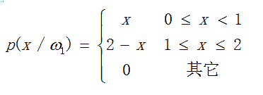
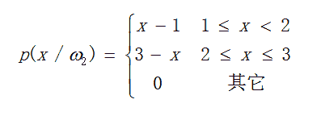
先验概率 P(1)=0.6，P(2)=0.4，
则样本{x1=1.35, x2=1.45, x3=1.55, x4=1.65}各属于哪一类别（）

正确答案: A B C D   你的答案: 空 (错误)

本题知识点

Java 工程师 C++工程师 度小满 概率统计 *2019 概率论与数理统计* *讨论

[一个俗人 201905222319803](https://www.nowcoder.com/profile/704284316)

用贝叶斯公式 p(w|x) = p(x|w)*p(w)/p(x)  求解 x1,x2,x3,x4 分别属于 w1 和 w2 的概率

发表于 2019-05-22 23:56:04

* * *

[咱可不是啥好人😒](https://www.nowcoder.com/profile/9218587)

贝叶斯分类的问题其实就是要比较 p(w[1]|x)和 p(w[2]|x)的大小，x 就按概率较大的分类。由公式 p(w|x) = p(x,w)/p(x) = p(x|w)*p(w) / p(x)这里比较 p(w[1]|x)和 p(w[2]|x)，都会除以 p(x)部分，只比较大小没必要计算。所以，判断 p(x|w[1])*p(w[1]) 与 p(x|w[2])*p(w[2])大小则可

发表于 2020-02-09 21:48:22

* * *

[好奇的田同学](https://www.nowcoder.com/profile/657540150)

朴素贝叶斯的思想：
已知道 w1 和 w2 的概率，求解 Xn 到底属于 w1 还是 w2。两者分母相同，即判断分子的大小，从而判断从属关系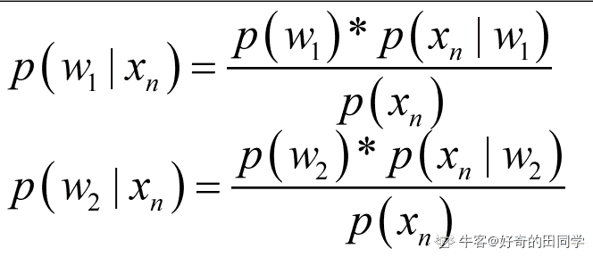

编辑于 2021-04-09 20:17:16

* * *

## 10

关联规则分析的 Apriori 算法在机器学习和数据挖掘中广泛使用，下面的表格中列出了 8 条超市购买记录。下面满足支持度大于等于 3 的 2-term 频集有（      ）

正确答案: A B C D   你的答案: 空 (错误)

```cpp
面包、咖啡
```

```cpp
牛奶、面包
```

```cpp
冰淇淋、面包
```

```cpp
面包、果酱
```

本题知识点

Java 工程师 C++工程师 度小满 机器学习 C++工程师 Java 工程师 度小满 2019

讨论

[Neil.Ling](https://www.nowcoder.com/profile/839568406)

呵呵，表格呢

发表于 2019-05-27 16:37:14

* * *

[believe448](https://www.nowcoder.com/profile/3746548)

都没看到表格呢。

发表于 2019-11-28 22:49:44

* * *

[骨骨开](https://www.nowcoder.com/profile/542906256)

表在哪？

发表于 2019-10-26 16:40:57

* * *

## 11

在机器学习中需要划分数据集，常用的划分测试集和训练集的划分方法有哪些（      ）

正确答案: A B C   你的答案: 空 (错误)

```cpp
留出法
```

```cpp
交叉验证法
```

```cpp
自助法
```

```cpp
评分法
```

本题知识点

Java 工程师 C++工程师 度小满 机器学习 2019

讨论

[茛苕叶](https://www.nowcoder.com/profile/85722243)

自助法，又称为自助抽样法

发表于 2019-08-29 17:51:45

* * *

[不是江小白](https://www.nowcoder.com/profile/550965516)

D 评分法应该说的是评估模型准确率或误差大小的方法，即 AUC、RMSE、对数损失函数、精确率－召回率等方法。

发表于 2020-09-09 16:50:39

* * *

[牛客 893561416 号](https://www.nowcoder.com/profile/893561416)

常用的划分测试集和训练集的划分方法：留出法、交叉验证法、自助法

发表于 2020-09-07 17:17:02

* * *

## 12

下列哪些情况下会导致线程中断或停止运行（      ）

正确答案: B   你的答案: 空 (错误)

```cpp
InterruptedException 异常被捕获
```

```cpp
线程调用了 wait 方法
```

```cpp
当前线程创建了一个新的线程
```

```cpp
高优先级线程进入就绪状态
```

本题知识点

Java 工程师 C++工程师 度小满 Java 2019 微众银行 2021 运维工程师 安全工程师 测试开发工程师 测试工程师

讨论

[我的天鸭](https://www.nowcoder.com/profile/243498)

A 选项正确，Java 中一般通过 interrupt 方法中断线程 B 选项正确，线程使用了 wait 方法，会强行打断当前操作，进入阻塞（暂停）状态，然后需要 notify 方法或 notifyAll 方法才能进入就绪状态 C 选项错误，新创建的线程不会抢占时间片，只有等当前线程把时间片用完，其他线程才有资格拿到时间片去执行。D 选项错误，调度算法未必是剥夺式的，而准备就绪但是还没有获得 CPU，它的权限更高只能说明它获得 CPU 被执行的几率更大而已

发表于 2019-08-21 17:37:48

* * *

[牛客 870341588 号](https://www.nowcoder.com/profile/870341588)

关于 A 选项

*   ```cpp
    InterruptedException 异常被捕获
    ```

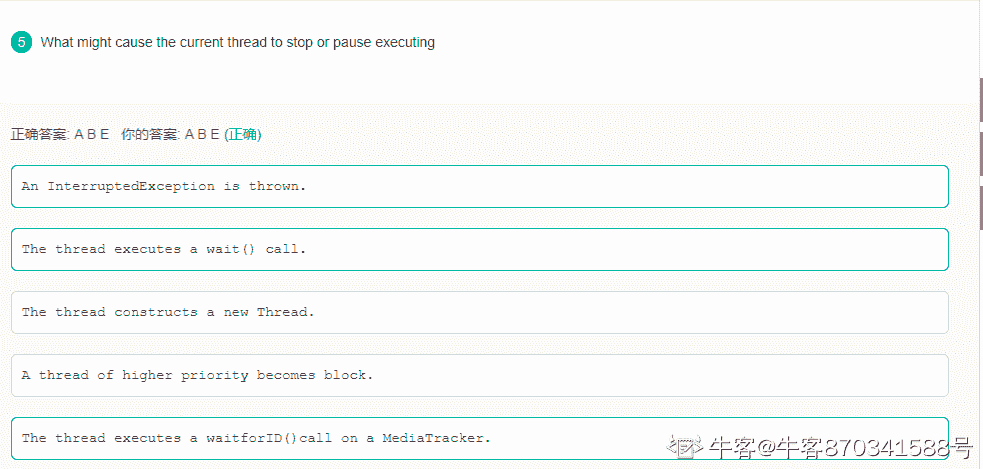
貌似找到原题了我怀疑是出题人翻译问题英文原题 A 选项是：抛出 Interruption 异常，并没有说捕获，所以 A 会导致线程停止

编辑于 2021-06-05 12:35:08

* * *

[LeviLjw](https://www.nowcoder.com/profile/2782666)

```cpp
 public static void main(String[] args) {
        ExecutorService tpb  = Executors.newFixedThreadPool(3);

        tpb.execute(new Thread(()-> {
            System.out.println(" thread1 start...");
            try {
                throw  new InterruptedException();
            } catch (InterruptedException e) {
                e.printStackTrace();
            }
            System.out.println("lambda thread1 continue start...");
        }
                ));
        tpb.execute(new Thread(()-> System.out.println("lambda thread2 start...")));
        tpb.execute(new Thread(()-> System.out.println("lambda thread3 start...")));

    }
```

A 答案，异常捕获处理了，程序是继续执行的，题的问题吧，我如果在捕获代码里继续抛异常，程序是会中断的，如果做了处理，就会继续执行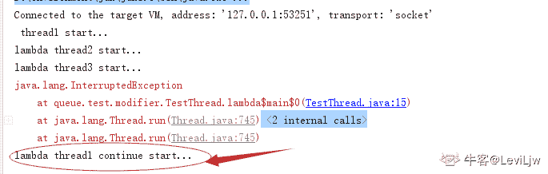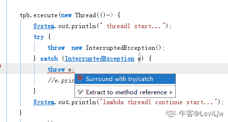
这里还要继续处理，如果觉得我的回答有问题，希望回复

发表于 2020-01-04 09:14:37

* * *

## 13

Mysql 选择合适的数据类型 ，说法正确的是（      ）

正确答案: A B D   你的答案: 空 (错误)

```cpp
MyISAM 引擎的数据表，最好使用固定长度的数据列代替可变长度的数据列。
```

```cpp
对于 InnoDB 引擎数据表，内部的行存储格式没有区分固定长度和可变长度列，字符型数据建议使用 VARCHAR 类型
```

```cpp
对于字段长度要求超过 128 个的情况下，MySQL 提供了 TEXT 和 BLOB 两种类型。根据存储数据的大小，它们都有不同的子类型。这些大型的数据用于存储文本块或图像、声音文件等二进制数据类型。
```

```cpp
对货币等精度敏感的数据，应该用定点数表示或存储。
```

本题知识点

Java 工程师 C++工程师 度小满 数据库 2019

讨论

[牛客 652494618 号](https://www.nowcoder.com/profile/652494618)

C 错在保存较大文本时， 通常会选择使用 TEXT 或者 BLOB，二者之间的主要差别是 BLOB 保存二进制数据，比如照片；而 TEXT 只能保存字符数据，比如一篇文章等等。

发表于 2019-12-19 16:59:36

* * *

[牛客 461313631 号](https://www.nowcoder.com/profile/461313631)

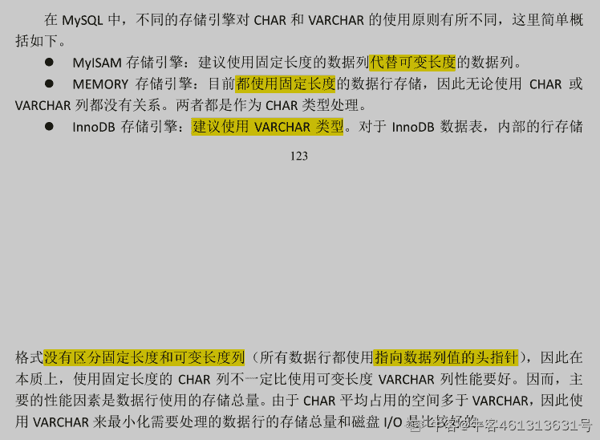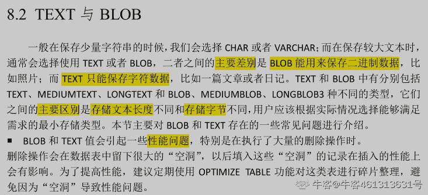
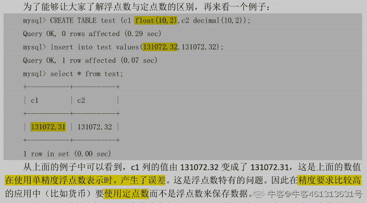

编辑于 2021-10-15 15:05:08

* * *

[哟，我喜欢](https://www.nowcoder.com/profile/8095403)

256

发表于 2019-06-16 00:27:25

* * *

## 14

分析下面代码，关于该段代码说法正确的是（      ）

```cpp
<html>
<body>
 <div id="ele" class="div">
 <span id="s1" class="sp" lang="zh-cn">
 </span>
 </div>
</body>
<script type="text/javascript">  
 function exct() {
    var oEle = document.getElementById("ele");
    var child = oEle.children;
    console.log("ele.children 的执行结果是:");
    for(i = 0; i < child.length; i++){
       console.log(child[i].tagName);
    }  
    child = oEle.childNodes;
    console.log("ele.childNodes 的执行结果是:");
    for(i = 0; i < child.length; i++){
       console.log(child[i].tagName);
    }
 }  
 exct (); 
</script>
</html>
```

正确答案: A C   你的答案: 空 (错误)

```cpp
其运行结果是：
 ele.children 的执行结果是:
SPAN
 ele.childNodes 的执行结果是:
undefined
SPAN
undefined
```

```cpp
其运行结果是：
 ele.children 的执行结果是:
SPAN
 ele.childNodes 的执行结果是:
SPAN
```

```cpp
对于 DOM 元素，children 是指 DOM Object 类型的子对象，不包括 tag 之间隐形存在的 TextNode，而 childNodes 包括 tag 之间隐形存在的 TextNode 对象
```

```cpp
对于 DOM 元素，childNodes 是指 DOM Object 类型的子对象，不包括 tag 之间隐形存在的 TextNode，而 children 包括 tag 之间隐形存在的 TextNode 对象
```

本题知识点

Java 工程师 C++工程师 度小满 Javascript 2019 HTML

讨论

[要努力。](https://www.nowcoder.com/profile/975736325)

相信，肯定有不少同学对此产生疑惑，div 元素下明明只有一个 span 元素，怎么会有 3 个子节点。因为，childNodes 获取子节点没有类型限制，span 是一个元素节点，还有两个文本节点：空格和换行都被看做一个文本节点。所以，3 个子节点 = 两个文本节点 + 一个元素节点。tagName 用来获取元素的标签名，文本节点没有标签名，所以也就为 undefined 了 发表于 2019-09-05 18:46:47

* * *

[阳光 20180813235866](https://www.nowcoder.com/profile/343023892)

```cpp
应该不会输出 div1.children 而是 ele.children 吧
```

发表于 2019-09-20 18:11:17

* * *

[Three_Stone](https://www.nowcoder.com/profile/67073033)

children 属性与 childNodes 属性的差别 childNodes 属性返回所有的节点，包括文本节点、注释节点； children 属性只返回元素节点； 注：IE6 到 IE8 完全支持 children 属性，但是，返回元素节点和注释节点，IE9 以上版本只返回元素节点。

发表于 2019-08-20 18:31:04

* * *

## 15

在一个块元素中，存在了很多的行元素，现在要求，将这些行元素中，只要有显示“叮咚”的行元素全部删除，怎么来做（      ）

正确答案: A D   你的答案: 空 (错误)

```cpp
$("span").detach("叮咚");
```

```cpp
$(p").detach("叮咚");
```

```cpp
$("div").detach("叮咚");
```

```cpp
$("em").detach("叮咚");
```

本题知识点

Java 工程师 C++工程师 度小满 Javascript 2019

讨论

[罗马不是一天建成的](https://www.nowcoder.com/profile/591802503)

块级元素与行内元素

块级元素与行内元素有几个关键区别：

格式默认情况下，块级元素会新起一行。内容模型一般块级元素可以包含行内元素和其他块级元素。这种结构上的包含继承区别可以使块级元素创建比行内元素更”大型“的结构。
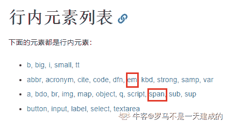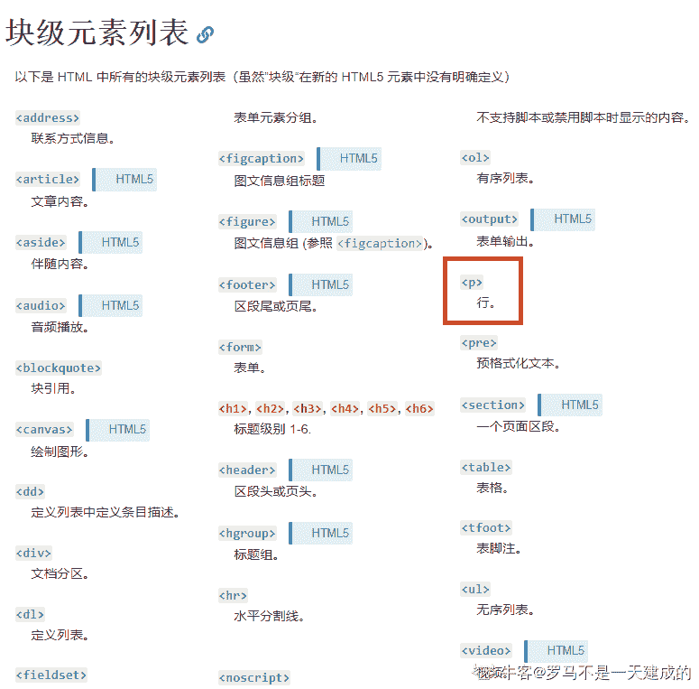

编辑于 2019-08-21 11:02:50

* * *

[青藤 201909082303947](https://www.nowcoder.com/profile/775059436)

这题的考点是：行内元素都有哪些？

发表于 2019-10-08 15:15:58

* * *

[海丶中丶月](https://www.nowcoder.com/profile/114366354)

个人理解：这题只能按行元素来删除 如果是用块级元素来删除 可能会将其中的带叮咚的不是行元素的删除 选项中 div p 都是块级元素 span em 都是行元素

发表于 2019-09-01 11:38:07

* * *

## 16

有一天，小 A 和小 B 玩了一个神奇的游戏，游戏开始时，桌面上有 a[0]个不同盒子和 b[0]个不同的物品，每个回合，两个人可以选择增加一个新的盒子或者一个新的物品(所有物品和盒子都不同)，记当前桌子上的盒子数量为 a，物品数量为 b，当把 b 个物品放入 a 个盒子的方案数不小于 n 时，游戏结束，此时最后一位操作者判负。

给出 a[0]，b[0]，n，如果小 A 先手，两个人都采用最优策略，谁能获胜，如果 A 获胜输出“A”，如果 B 获胜，输出“B”，如果是平局，输出“A&B”。

本题知识点

Java 工程师 C++工程师 度小满 数学 2019 基础数学

讨论

[石头君](https://www.nowcoder.com/profile/543678372)

感觉这题有问题，什么叫最优思路啊。

发表于 2019-06-24 11:48:58

* * *

[niyn](https://www.nowcoder.com/profile/589737273)

虽然只通过了 73.33%，还是写下来，就当加深了，思路如下：两种选择：(a+1,b) or (a,b+1)1.在都小于 n 的基础上，尽可能选 max(pow(a+1,b),pow(a,b+1))，根据选择，更新目前盒子和物品的数量，继续下一个。2.其中一个不小于 n 的话，只能选另一个小于 n 的，这里判断平局的情况：当 a==1，且 pow(a+1,b)>=n 的话，只能选 b+1，这样陷入死循环，敌不动我不动，1 的任何次方都是 1，大家都是一样的 n3.都不小于 n 的话，当前操作的人输了

```cpp
N=int(input())
import math
def cal(box,goods):
    return math.pow(box,goods)
for i in range(N):
    a,b,n=list(map(int,input().split()))
    if cal(a,b)>=n:
        print("B")
        break
    temp=cal(a,b)
    order=["A","B"]
    i=0
    while True:
        c1=cal(a+1,b)
        c2=cal(a,b+1)
        if c1<n and c2<n:
            if c1>c2:
                temp=c1
                a+=1
            else:
                temp=c2
                b+=1
        elif c1>=n and c2<n:
            if temp==c2:
                print("A&B")
                break
            temp=c2
            b+=1
        elif c2>=n and c1<n:
            if temp==c1:
                print("A&B")
                break
            temp=c1
            a+=1
        else:
            print(order[i%2])
            break
        i+=1

```

编辑于 2020-08-09 10:29:17

* * *

[(*^__^*)……](https://www.nowcoder.com/profile/200344500)

这道题的答案是有问题的，当 a0=1 时，不可能存在 B 获胜的情况，因为当 a0=1，A 只有让 a0+1，才有可能让 B 失败，然而如果这样子做还让 B 赢了，那么 A 肯定不可能让 a0+1，但答案中只要你 a0^b0<n>发表于 2019-07-08 15:17:15

* * *

## 17

在 Z 省，有若干个个城市坐落在一条直线上，从左到右依次标号 1,2,3,…，其中每个城市有一个火车站点，现今已经开放了 n 条火车路线，第 i 条火车路线是从第 Yi 个城市到第 Xi 个城市，因为 Z 省地势奇特，标号小的城市地势较低，所以火车是从高往低开的，再通过神秘力量传送回高地，即 Yi 一定大于 Xi，它在沿途的所有城市都会停靠（显然不包括起点 Yi，但是包括终点 Xi），火车停靠就需要火车站台来运营维护。火车站台随着运营线路的数量不同，其损耗速度、维护成本也各异，现在我们想知道所有站台中，所运营的线路数最大是多少。

本题知识点

Java 工程师 C++工程师 度小满 数组 穷举 2019

讨论

[OFFER_HXJ](https://www.nowcoder.com/profile/654269742)

没有看懂题意额，是说站点的最大的运营量吗

发表于 2019-09-26 10:51:49

* * *

[acqierement...](https://www.nowcoder.com/profile/815188947)

```cpp
import java.util.*;

public class Main {

    /**
     题目关键是【它在沿途的所有城市都会停靠（显然不包括起点 Yi，但是包括终点 Xi）】
     2 到 5 表示 3，4，5 都会有一个站台，最后求站台数量最多的一个点。
     解题思路：主要是起点和终点，记录起点 2，然后 3，4 都是 1，5 终点就减一变成 0，
     这样子其实变成了【包括起点，不包括终点】，题意是【不包括起点，包括终点】，
     形式变了一点，但是最后结果也是一样的
     */
    public static void main(String[] args) {
        Scanner input = new Scanner(System.in);
        int n = input.nextInt();
        int[] city = new int[100001];
        for (int i = 0; i < n; i++) {
            int x = input.nextInt();
            int y = input.nextInt();
            city[x]++;
            city[y]--;
        }
        int count = 0;
        int res = 0;
        for (int i = 1; i < city.length; i++) {
            count+= city[i];
            res = Math.max(res, count);
        }
        System.out.println(res);
    }
}

```

发表于 2020-03-17 14:57:23

* * *

[ac_q](https://www.nowcoder.com/profile/67500173)

并查集，但是有问题，大佬们谁能指点一波    13.3333%。。。。

```cpp
#include <iostream> 
#include <vector>
#include <set>
using namespace std;

vector<int> parent(100000);
vector<int> ranks(100000);
int max_ = 1;
void init(int n)
{
	for (int i = 0; i < n; i++)
	{
		parent[i] = i;
		ranks[i] = 1;
	}

}
int find(int root)
{
	if (parent[root] != root)
	{
		return parent[root] = parent[parent[root]];
	}
	else
		return parent[root];
}
void union1(int a, int b)
{
	if (find(a) == find(b))
		return;
	else
	{
		if (ranks[a] < ranks[b])
		{
			parent[find(a)] = parent[find(b)];
			ranks[b] += ranks[a];
		}
		else
		{
			parent[find(b)] = parent[find(a)];
			ranks[a] += ranks[b];
		}
		max_ = max(max_, max(ranks[a], ranks[b]));
	}
}
int main()
{
	int n = 0;
	cin >> n;
	vector<vector<int>> vv(n, vector<int>(2, 0));
	init(100000);
	for (int i = 0; i < n; i++)
	{
		cin >> vv[i][0] >> vv[i][1];
		union1(vv[i][0], vv[i][1]);
	}
	cout << max_  - 1<< endl;
	system("pause");
}
```

发表于 2020-06-06 00:14:04

* * *

## 18

n 个点连成一条链，从左往右依次从 1 到 n 编号。相邻点之间有边相连，一共有 n-1 条边。所有的边从 1 到 n-1 编号，第 i 条边连接了点 i 和 i+1。

第 i 个点有点权 a[i]，定义第 i 条边的权重为 w[i]：有多少点对 x，y 满足在第 i 条边的左侧（x≤i），y 在第 i 条边的右侧（y>i），且 x 和 y 的点权不同。

给出每个点的点权，请求出所有边的边权。

本题知识点

Java 工程师 C++工程师 度小满 数组 查找 *分治 数学 2019* *讨论

[nbgao](https://www.nowcoder.com/profile/211289)

```cpp
#include <bits/stdc++.h>
using namespace std;

int main(){
    int n;
    cin>>n;
    int a[n];
    long w[n];
    map<int,int> l,r;
    for(int i=0;i<n;i++){
        cin>>a[i];
        r[a[i]]++;
        l[a[i]] = 0;
    }
    w[0] = 0;
    for(int i=0;i<n-1;i++){
        r[a[i]]--;
        long t = w[i] - (i-l[a[i]]) + (n-1-i-r[a[i]]);
        w[i+1] = t;
        l[a[i]]++;
    }
    for(int i=1;i<n;i++){
        if(i==n-1)
            cout<<w[i]<<endl;
        else
            cout<<w[i]<<" ";
    }
    return 0;
}
```

发表于 2019-11-20 01:39:01

* * *

[ElonB](https://www.nowcoder.com/profile/623894)

```cpp
"""
计算题，动态规划优化时间复杂度
"""
import sys
from collections import Counter

if __name__ == '__main__':
    # sys.stdin = open("input.txt", "r")
    n = int(input())
    a = list(map(int, input().strip().split()))
    right = Counter(a)
    left = Counter([])
    ans = [0]
    for t in range(n - 1):
        right[a[t]] -= 1
        tmp = (ans[-1] - (t - left[a[t]])) + (n - 1 - t - right[a[t]])
        ans.append(tmp)
        left[a[t]] += 1
    print(' '.join(map(str, ans[1:])))

```

编辑于 2019-10-06 21:49:46

* * *

[0.068](https://www.nowcoder.com/profile/8861446)

```cpp
import java.util.*;
//动态规划的思路，每新增加一个点，在原有点数对的基础上减去因为这个新增加的点损失的点数，加上新增加的点，
//用两个 map，l 表示当前点左侧每个点的数目，r 表示当前点右侧每个点的数目
public class Main{
    public static void main(String[]args){
        Scanner sc = new Scanner(System.in);
        int n = sc.nextInt();
        int[] arr = new int[n];
        long[] w = new long[n];
        HashMap<Integer,Integer> l = new HashMap<>();
        HashMap<Integer,Integer> r = new HashMap<>();
        for(int i = 0; i < n; i++){
            arr[i] = sc.nextInt();
            if(r.containsKey(arr[i])){
                r.put(arr[i],r.get(arr[i])+1);
            }else{
                r.put(arr[i],1);
            }
            l.put(arr[i],0);
        }
        w[0] = 0;
        for(int i = 0; i <n-1; i++){
            r.put(arr[i],r.get(arr[i])-1);
            //左侧 i+1 个点，右侧 n-1-i 个点
            //当左侧增加一个点 arr[i]时，减去损失的点数 即 当前点 arr[i]左侧所有点中与当前点不同的点数
            //l.get(arr[i])是 arr[i]左侧点中 arr[i]的点数，arr[i]左侧共有 i 个点
            //当左侧增加一个点 arr[i]时，还需要加上新增加的点数， 即当前点 arr[i]右侧与 arr[i]不同的点数
            //r.get(arr[i])是 arr[i]右侧点中 arr[i]的数目，arr[i]右侧共有 n-i-i 个点
            long t = w[i] - (i-l.get(arr[i])) + (n-1-i-r.get(arr[i]));
            w[i+1] = t;
            System.out.print(t+" ");
            l.put(arr[i],l.get(arr[i])+1);
        }

    }
}
```

发表于 2020-07-17 22:32:35

* * *

## 19

珐达采下个月要去鸥洲各国考察一趟，采购流通神秘石并从中搞点油水。

珐达采会按顺序依次经过序号分别为 1, 2, 3, …, n 的鸥洲国家，在第 i 个国家神秘石的流通价格为 Ai 鸥。因为行程紧张，在每个国家的停留时间有限，所以他只能花费 Ai 鸥买入一块神秘石，或者卖出一块手中的神秘石获得 Ai 鸥，或者什么都不做，而且因为神秘石的保存需要极其先进的高级材料容器，其材料稀有且制作困难，珐达采只有一份容器，故无论何时珐达采手里 最多只能拥有一块神秘石。

珐达采想知道最终能从中获利最大多少鸥。因为交易需要手续费，所以珐达采还想知道在获利最大收益的同时，最少需要交易多少次。因为珐达采是大财阀，所以你可以认为他一开始金钱无限。

本题知识点

Java 工程师 C++工程师 度小满 数组 动态规划 贪心 2019

讨论

[⊱r=a（1-sinx）♒](https://www.nowcoder.com/profile/646955188)

```cpp
import java.lang.reflect.Array;
import java.util.Arrays;
import java.util.Scanner;

/*
 * @author Moze 2020
 * 思想是动态规划，因为直接穷举会超时。
 * 动态规划的递推式是下面这样的：
 * ①初始 index=1 时，只有两种：买（M[1][1]=-A[1]），或者不买 M[1][0]=0
 * 同时可以得到交易次数：买（op[1][1]=1），或者不买 M[1][0]=0;
 * ②接下来就是 2~n-1 次：设为 index 次
 *   又分为有还是没有，时间有限，只介绍没有，有逻辑基本类似，可以见代码
 *   有的话，要么是 index-1 次有，index 没卖，或者 index-1 时没有有，但是 index 买了。
 *   对这两个值进行比较，然后再根据谁大，来获得 op 的值即可
 * ③n 次时同②，只不过由于最后卖了肯定比不卖挣得多，因此，拿了出来只计算卖了的
 * 然后就直接得到结果即可
 */
public class Main {
	static int n;
	static long A[];
	//每种情况赚了多少钱:第一维度为第几个城市，第二维度为是否含有
	static long M[][];
	//每种情况至少需要多少交易次数
	static long op[][];
	public static void main(String[] args) {
		Scanner aa = new Scanner(System.in);
		n=aa.nextInt();
		A= new long[n+1];
		for(int i=1;i<=n;i++)
			A[i]=aa.nextInt();
		M = new long[n+1][2];
		op = new long[n+1][2];
		M[1][0]=0;op[1][0]=0;
		M[1][1]=-A[1];op[1][1]=1;
		for(int i=2;i<n;i++){
			//i 时没有
			if(M[i-1][1]+A[i] > M[i-1][0]){
				M[i][0]=M[i-1][1]+A[i];
				op[i][0]=op[i-1][1]+1;
			}else if(M[i-1][1]+A[i] == M[i-1][0]){
				M[i][0]=M[i-1][1]+A[i];
				op[i][0]=Math.min(op[i-1][1]+1,op[i-1][0]);
			}else{
				M[i][0] =  M[i-1][0];
				op[i][0] = op[i-1][0];
			}
			//i 时有
			if(M[i-1][1]>M[i-1][0]-A[i]){
				M[i][1]=M[i-1][1];
				op[i][1]=op[i-1][1];
			}else if(M[i-1][1]==M[i-1][0]-A[i]){
				M[i][1]=M[i-1][1];
				op[i][1]=Math.min(op[i-1][1], op[i-1][0]+1);
			}else{
				M[i][1]=M[i-1][0]-A[i];
				op[i][1]= op[i-1][0]+1;
			}
		}
		long max=0;
		long min_op;
		if(M[n-1][0]>M[n-1][1]+A[n]){
			max=M[n-1][0];
			min_op=op[n-1][0];
		}else if(M[n-1][0]==M[n-1][1]+A[n]){
			max=M[n-1][0];
			min_op = Math.min(op[n-1][0], op[n-1][1]+1);
		}else{
			max=M[n-1][1]+A[n];
			min_op = op[n-1][1]+1;
		}
		if(max<=0){
			System.out.println(0+" "+0);
			return ;
		}
		System.out.println(max+" "+min_op);
	}

}

```

发表于 2020-06-28 21:47:55

* * *

[ttbh](https://www.nowcoder.com/profile/5684855)

贪心算法 和力扣无限次买卖股票一个道理，应该就是拿那个改的，只要下一天是涨的就买，第二天卖了，这样只能算出收益，麻烦的是算最少交易次数，设置标志位为 c，如果 c 是 0 的话，可以加一，但是后期把 c 改为 1，因为在连续增长的区间其实在一开始买就行了就行了，如果遇到价格降低的区间，那么意味着在一开始应该抛售，因此 b+c，也就是 b+1，同时把 c 值为零。注意在最后一定要再次计算 b+c，因为最后两个数有可能是上升也可能是下降，因此需要再次计算注意两点 1.度小满的题都是大数，趁早数组弄长，数据格式不要写 int2.交易的理解，这道题买和卖都是交易，是两次，不是一买一卖算一次

```cpp
#include<stdio.h>
int main(){
    long int a=0,b=0,c=0;
    int n;
    long int d[100000];
    scanf("%ld",&n);
    for(int i=0;i<n;i++){
        scanf("%ld",&d[i]);

    }
    for(int i=1;i<n;i++){
        if(d[i]>d[i-1]){
            a=a+d[i]-d[i-1];
            if(c==0){
                b++;
            }
            c=1;
        }

         if(d[i]<d[i-1]){
            b=b+c;

            c=0;
        }

    }
    b=b+c;
    printf("%ld %ld",a,b);
    return 0;

}
```

编辑于 2020-06-25 10:15:25

* * *

[nbgao](https://www.nowcoder.com/profile/211289)

```cpp
#include <bits/stdc++.h>
using namespace std;

int main(){
    int n,cnt=0;
    cin>>n;
    long a[n],s=0;
    bool d = false;
    for(int i=0;i<n;i++){
        cin>>a[i];
    }
    for(int i=1;i<n;i++){
        if(a[i]>a[i-1]){
            s += a[i]-a[i-1];
            if(!d)
                cnt++;
            d = true;
        }
        if(a[i]<a[i-1]){
            cnt += d;
            d = false;
        }
    }
    cnt += d;
    cout<<s<<" "<<cnt<<endl;
    return 0;
}
```

发表于 2019-10-21 17:56:16

* * *

## 20

每个整数都希望可以整除很多数字，特别是它自身包含的数字，我们将整数分为三类：

1\. 数字可以整除它包含的一部分数字，比如 72，由，7 和 2 两种数字组成，72 可以整除 2，我们称这个数字是开心的，用”H”表示。

2\. 数字不能整除它包含的任何数字，比如 73，由，7 和 3 两种数字组成，73 不能整除任何数，我们称这个数字是沮丧的，用”S”表示。

3\. 数字可以整除它包含的所有数字，比如 12，既可以整除 1 又可以整除 2，我们称它是一个非常棒的数，用“G”表示。 (0 可以被任何数整除。)

本题知识点

Java 工程师 C++工程师 度小满 模拟 穷举 数学 2019

讨论

[LitterF](https://www.nowcoder.com/profile/826985312)

除 0 算对，我笑了。

```cpp
n = int(input())
for _ in range(n):
    cur_s = input().strip()
    cur_int = int(cur_s)
    res = 0
    for i in cur_s:
        if i=='0' or cur_int%(int(i))==0:
            res+=1
    if res==len(cur_s):
        print('G')
    elif res==0:
        print('S')
    else:
        print('H')
```

发表于 2019-10-28 23:13:05

* * *

[无心 2019](https://www.nowcoder.com/profile/991674511)

```cpp
#include<bits/stdc++.h>
using namespace std;
int main()
{
    int t;
    cin>>t;
    long long num;
    while(t--)
    {
        cin>>num;
        long long res=0,n=num,t=0;
        while(n)
        {
            int m=n%10;
            n/=10;
            if(m==0||num%m==0)
                res++;
            t++;
        }
        if(res==0)
            cout<<"S"<<endl;
        else if(res==t)
            cout<<"G"<<endl;
        else
            cout<<"H"<<endl;
    }
    return 0;
}
```

发表于 2019-08-18 22:33:49

* * *

[黄宗文](https://www.nowcoder.com/profile/4403932)

# 数学题
T = int(input())
for _ in range(T):
    s = input()
    res = 0
    for i in s:
        if i == '0':  # 0 不能作为除数，当数字中有 0，认为是可以整除的
            res += 1
        elif int(s) % int(i) == 0:
            res += 1
    if res == len(s):
        print("G")
    elif res == 0:
        print("S")
    else:
        print("H")

发表于 2020-08-15 20:46:51

* * *

## 21

给定一个仅由小写字母 x 和 y 组成且长度不超过 10⁵的字符串，每次可以将字符串中的一个子串 xy 替换成字符串 yyx，那么至少要替换多少次才能让字符串中不存在子串 xy？

本题知识点

Java 工程师 C++工程师 度小满 字符串 *动态规划 模拟 2019* *讨论

[白色纯度](https://www.nowcoder.com/profile/485984577)

1.将“xy”变为“yyx”，本质就是将“x”向后移动，只有‘y’在增加，‘x’的数目从没变过。2\. 每次遇到一个“y”,统计一下这个“y”前面的“x”的数目 num，移动次数就是 2^(num)-1\.这里感谢大佬的思路 @写意自风流 ，幂次运算会超时，所以 2^(num)-1 可以优化为代码中的 X = (2*X+1) % (10 ** 9 + 7) ```cpp
def solution(string):
    num = 0
    count = 0
    if string[0] == 'x':
        count = 1
    X = count
    for i in range(1, len(string)):
        if string[i] == 'x':
            X = (2*X+1) % (10 ** 9 + 7)
        else:
            num = (num + X) % (10 ** 9 + 7)
    return int(num % (10 ** 9 + 7))
if __name__ == '__main__':
    string = raw_input().strip()
    print(solution(string))
``` 

发表于 2019-08-19 20:07:42

* * *

[LitterF](https://www.nowcoder.com/profile/826985312)

暴力模拟法从后往前算一下就行了，秒 A 的题从后往前数，是 x 就挪到 y 的后面，然后挪的时候 xy 变成了 yyx，y 的数量翻了一倍，xyy 就变成 yyyyx。

```cpp
s = input()
cur_y = 0
res = 0
mo = 10**9+7
for i in s[::-1]:
    if i=='y':
        cur_y+=1
    if i=='x':
        res+=cur_y
        cur_y*=2
print(res%mo)
```

发表于 2019-10-28 23:04:25

* * *

[nbgao](https://www.nowcoder.com/profile/211289)

```cpp
#include <bits/stdc++.h>
using namespace std;
const int MOD = 1000000007;

int main(){
    string s;
    cin>>s;
    int t=0, sum=0;
    for(int i=0;i<s.length();i++){
        if(s[i]=='x')
            t = ((t<<1)+1)%MOD;
        else
            sum = (sum+t)%MOD;
    }
    cout<<sum<<endl;
    return 0;
}
```

发表于 2019-10-31 00:55:00

* * ***</n>**