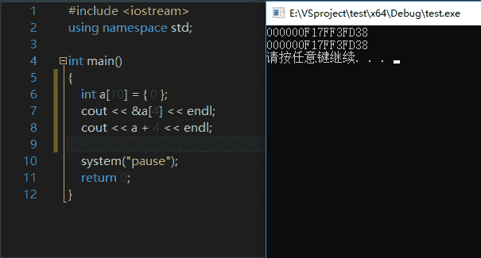
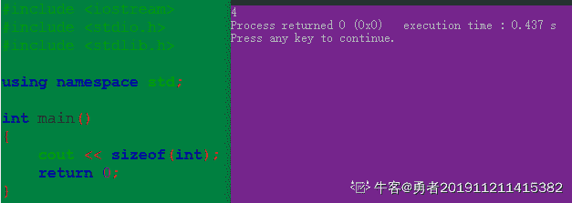
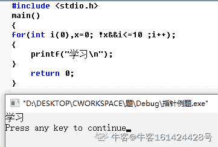

# 搜狐畅游 2019 校招笔试题-游戏开发工程师（C/C ）

## 1

下面（）不是金庸撰写的小说？

正确答案: D   你的答案: 空 (错误)

```cpp
天龙八部
```

```cpp
鹿鼎记
```

```cpp
侠客行
```

```cpp
天涯明月刀
```

本题知识点

Java 工程师 C++工程师 搜狐畅游 运营 测试工程师 游戏工程师 算法工程师 职能 设计 运维工程师 游戏研发工程师 2019 市场 游戏运营 数据库工程师 数据分析师 数据挖掘工程师 人力资源 网络工程师 系统工程师 商务

讨论

[某牛客](https://www.nowcoder.com/profile/662599873)

飞雪连天射白鹿，笑书神侠倚碧鸳。

《飞狐外传》《雪山飞狐》《连城诀》《天龙八部》《射雕英雄传》《白马啸西风》《鹿鼎记》

《笑傲江湖》《书剑恩仇录》《神雕侠侣》《侠客传》《倚天屠龙记》《碧血剑》《鸳鸯刀》

发表于 2019-10-04 19:27:19

* * *

[编译小伙](https://www.nowcoder.com/profile/198006840)

飞雪连天射白鹿,笑书神侠倚碧鸳

发表于 2019-07-18 17:29:28

* * *

[gogogogood](https://www.nowcoder.com/profile/687235273)

还以为做的是阿里的题。。。。。

发表于 2019-12-07 17:43:50

* * *

## 2

以下哪款游戏不在战网平台上？（）

正确答案: C   你的答案: 空 (错误)

```cpp
暗黑破坏神 3
```

```cpp
魔兽争霸
```

```cpp
绝地求生
```

```cpp
炉石传说
```

本题知识点

Java 工程师 C++工程师 搜狐畅游 运营 测试工程师 游戏工程师 算法工程师 职能 设计 运维工程师 游戏研发工程师 2019 市场 游戏运营 数据库工程师 数据分析师 数据挖掘工程师 人力资源 网络工程师 系统工程师 商务

讨论

[️201908260942940](https://www.nowcoder.com/profile/385624213)

暴雪游戏：魔兽星际炉石守望风暴暗黑破坏神

发表于 2019-09-19 20:17:34

* * *

## 3

以下属于 ARPG 类型的游戏是？

正确答案: A   你的答案: 空 (错误)

```cpp
DNF
```

```cpp
海岛奇兵
```

```cpp
王者荣耀
```

```cpp
皇室战争
```

本题知识点

Java 工程师 C++工程师 搜狐畅游 运营 测试工程师 游戏工程师 算法工程师 职能 设计 运维工程师 游戏研发工程师 2019 市场 游戏运营 数据库工程师 数据分析师 数据挖掘工程师 网络工程师 系统工程师 商务

讨论

[Lan201906241108183](https://www.nowcoder.com/profile/935885380)

ARPG（Action Role Playing Game）

发表于 2019-06-27 15:56:27

* * *

[q 嘟嘟鸠 y](https://www.nowcoder.com/profile/619431102)

王者荣耀不是 moba 吗

发表于 2019-09-17 11:46:04

* * *

[知道火舞💃](https://www.nowcoder.com/profile/95605969)

海盗骑兵是策略类游戏，super cell 旗下的，super cell 更广为人知的游戏是皇室战争。海岛奇兵也是一款策略类游戏

发表于 2019-08-01 00:53:48

* * *

## 4

RPG 类游戏中又可分为 RPSG，SRPG，ARPG。其中 SRPG 是指？

正确答案: B   你的答案: 空 (错误)

```cpp
角色扮演模拟游戏
```

```cpp
策略角色扮演游戏
```

```cpp
动作角色扮演游戏
```

```cpp
多人在线角色扮演游戏
```

本题知识点

Java 工程师 C++工程师 搜狐畅游 运营 测试工程师 游戏工程师 算法工程师 职能 设计 运维工程师 游戏研发工程师 2019 市场 游戏运营 数据库工程师 数据分析师 数据挖掘工程师 网络工程师 系统工程师 商务

讨论

[夜跑小精灵](https://www.nowcoder.com/profile/287714414)

RPG：Role Playing Game 角色扮演游戏 RPSG：Role Playing Simulation Game 角色扮演模拟游戏 SRPG：Strategy Role Playing Game 策略角色扮演游戏 ARPG：Action Role Playing Game 动作角色扮演游戏

发表于 2019-08-07 19:36:02

* * *

## 5

RTS 是以下哪一类游戏的简称？（）

正确答案: D   你的答案: 空 (错误)

```cpp
策略类游戏
```

```cpp
射击类游戏
```

```cpp
角色扮演类游戏
```

```cpp
即时战略游戏
```

本题知识点

Java 工程师 C++工程师 搜狐畅游 运营 测试工程师 游戏工程师 算法工程师 职能 设计 运维工程师 游戏研发工程师 2019 市场 游戏运营 数据库工程师 数据分析师 数据挖掘工程师 人力资源 网络工程师 系统工程师 商务

讨论

[***1123](https://www.nowcoder.com/profile/8563322)

| 简称 | 全称 | 中文名 |
| RTS | Real-Time Strategy Game  | 即时战略游戏 |
| RPG | Role-playing game  | 角色扮演类游戏 |
| STG | Shooter game  | 射击类游戏 |
| SLG | Simulation Game  | 策略模拟类游戏 |

发表于 2019-09-03 16:05:54

* * *

[WendyWen](https://www.nowcoder.com/profile/215326914)

RPG=Role-playing Game：角色扮演游戏
ACT=Action Game：动作游戏

AVG=Adventure Game：冒险游戏
SLG=Simulation Game：策略游戏
RTS=Real-Time Strategy Game：即时战略游戏
FTG=Fighting Game：格斗游戏
STG= Shooting Game：射击类游戏
FPS=First Personal Shooting Game：第一人称视角射击游戏
PZL=Puzzle Game：益智类游戏
RCG=Racing Game：竞速游戏[也有称作为 RAC 的]

发表于 2020-09-22 16:58:05

* * *

[Lan201906241108183](https://www.nowcoder.com/profile/935885380)

即时战略游戏（Real-Time Strategy Game

发表于 2019-06-27 15:58:12

* * *

## 6

MMORPG 较于 RPG 的区别，你认为最正确的答案是（）？

正确答案: C   你的答案: 空 (错误)

```cpp
MMORPG 是可以扮演多个角色
```

```cpp
MMORPG 有非常大的地图
```

```cpp
MMORPG 是大型多人在线
```

```cpp
MMORPG 是可以飞行
```

本题知识点

Java 工程师 C++工程师 搜狐畅游 运营 测试工程师 游戏工程师 算法工程师 职能 设计 运维工程师 游戏研发工程师 2019 市场 游戏运营 数据库工程师 数据分析师 数据挖掘工程师 人力资源 网络工程师 系统工程师 商务

讨论

[安吉尼尔](https://www.nowcoder.com/profile/794002793)

MMORPG (massive multiplayer online role playing game)

发表于 2019-07-27 22:06:06

* * *

[我一定会有 offer！！](https://www.nowcoder.com/profile/407494708)

MMORPG"大型多人在线角色扮演游戏

发表于 2020-02-24 22:59:40

* * *

## 7

游戏行业中经常提到渠道一词，以下哪家公司没有自主渠道？

正确答案: C   你的答案: 空 (错误)

```cpp
腾讯
```

```cpp
网易
```

```cpp
完美世界
```

```cpp
360
```

本题知识点

Java 工程师 C++工程师 搜狐畅游 运营 测试工程师 游戏工程师 算法工程师 职能 设计 运维工程师 游戏研发工程师 2019 市场 游戏运营 数据库工程师 数据分析师 数据挖掘工程师 网络工程师 系统工程师 商务

讨论

[知道火舞💃](https://www.nowcoder.com/profile/95605969)

腾讯家的渠道：微信，QQ 网易家的渠道：网易通行证，网易大神 360 家的渠道？？？我也一脸懵逼，我猜想是浏览器？？之类的完美世界的布局比较狭窄

发表于 2019-08-01 00:56:26

* * *

[***1123](https://www.nowcoder.com/profile/8563322)

360 公司自己就有游戏中心。

发表于 2019-09-03 16:07:18

* * *

[牛客 8889999999999 号](https://www.nowcoder.com/profile/636590305)

完美对战平台让你吃了？完美世界电竞让你吃了？

发表于 2021-09-14 20:29:12

* * *

## 8

以下哪个不是数值策划的工作内容？

正确答案: D   你的答案: 空 (错误)

```cpp
战斗系统搭建
```

```cpp
资源循环系统搭建
```

```cpp
技能系统搭建
```

```cpp
副本设计
```

本题知识点

Java 工程师 C++工程师 搜狐畅游 运营 测试工程师 游戏工程师 算法工程师 职能 设计 运维工程师 游戏研发工程师 2019 市场 游戏运营 数据库工程师 数据分析师 数据挖掘工程师 网络工程师 系统工程师 商务

讨论

[知道火舞💃](https://www.nowcoder.com/profile/95605969)

可怜的数值策划主要是设计英雄的攻击范围，判定，技能伤害等等的数值。还包括生存系统里面各个资源的价值和数量。举个例子，一个生存类游戏，我们假设这是《明日之后》，砍树卖掉木材多少钱（价值），砍一棵树收集多少木材（数量），都是数值策划的锅。而副本，是文学策划/玩法策划的事。除了这三类之外，还有可爱的系统策划。系统策划就是做，比如说，好友系统，战队系统，社会框架等等

发表于 2019-08-01 01:01:02

* * *

## 9

以下哪个最不可能是新手阶段导致用户大量流失的原因？（）

正确答案: C   你的答案: 空 (错误)

```cpp
美术画风
```

```cpp
新手任务无趣
```

```cpp
游戏职业不平衡
```

```cpp
缺乏基础的引导
```

本题知识点

Java 工程师 C++工程师 搜狐畅游 运营 测试工程师 游戏工程师 算法工程师 职能 设计 运维工程师 游戏研发工程师 2019 市场 游戏运营 数据库工程师 数据分析师 数据挖掘工程师 人力资源 网络工程师 系统工程师 商务

讨论

[のKiss](https://www.nowcoder.com/profile/907348814)

职业不平衡，在游戏初期是不会特别明显的，就算常规游戏，远程比近程前期练级刷怪可能会好一些，但是大多的副本还是需要多人合作才行，各有利弊。而别的方面，比如游戏画面，一进游戏，画面花里胡哨，马赛克还多，玩家就会受不了，建模还差的话，可能进游戏待不了 5 分钟就有卸载的冲动；对于一些较为难上手的游戏，没有很简单的基础操作指引，会让玩家一头雾水，老半天不知道怎么进行接下来的操作，实力劝退；再有就是新手任务，从头到尾只是点点点，极其无聊的任务模式，也是很容易劝退玩家的一种。（一名差不多 20 年游戏经验的学生飘过~）

发表于 2019-09-25 15:39:08

* * *

[牛客 177694650 号](https://www.nowcoder.com/profile/177694650)

要判断一个游戏的职业是否平衡，一定是有先决条件的。那就是我玩过或者至少了解过这个游戏的绝大多数职业。 一个新手玩家只会接触 1-2 个职业。 他可能刚刚看完职业介绍，了解了基本的分类。还在新手村里找 NPC 此时，他还没有和别的职业 pk 或 组队过，没有交互，没有比较。 这时他是不可能判断出职业是否平衡的

发表于 2020-09-01 21:00:59

* * *

[Rago](https://www.nowcoder.com/profile/8991699)

美术画风不应该是不喜欢就根本不会玩吗哪里会等到玩了两天觉得不好看就不玩了

发表于 2020-02-28 18:17:25

* * *

## 10

游戏行业中的“流水”是指

正确答案: A   你的答案: 空 (错误)

```cpp
玩家充值总金额
```

```cpp
游戏发行商收入
```

```cpp
游戏研发商收入
```

```cpp
渠道商收入
```

本题知识点

Java 工程师 C++工程师 搜狐畅游 运营 测试工程师 游戏工程师 算法工程师 职能 设计 运维工程师 游戏研发工程师 2019 市场 游戏运营 数据库工程师 数据分析师 数据挖掘工程师 网络工程师 系统工程师 商务 游戏策划 2021 PHP 工程师 golang 工程师 前端工程师 安卓工程师 iOS 工程师 大数据开发工程师 安全工程师 测试开发工程师

讨论

[好好学习好好做人](https://www.nowcoder.com/profile/854180677)

流水：充值金额实收：利润

发表于 2021-08-12 01:24:26

* * *

[terrencexy](https://www.nowcoder.com/profile/197324993)

流水就是营业额，不是利润

发表于 2020-03-15 11:20:55

* * *

[牛客 30605549 号](https://www.nowcoder.com/profile/30605549)

猜的，流水肯定是钱。

发表于 2019-12-30 22:16:47

* * *

## 11

下列说法不正确的是（ ）。

正确答案: B   你的答案: 空 (错误)

```cpp
东部地区城镇人均住宅建筑面积高于中部和西部地区
```

```cpp
2005 年底，全国城镇住宅建筑面积占房屋建筑面积达到五成
```

```cpp
全国城镇户均成套住宅套数不足一套
```

```cpp
辽宁省城镇人均住宅建筑面积多于贵州省 1.56 平方米
```

本题知识点

C++工程师 搜狐畅游 职能 运维工程师 游戏研发工程师 2019 市场

讨论

[牛客 30605549 号](https://www.nowcoder.com/profile/30605549)

65.46%

发表于 2019-12-30 22:17:41

* * *

## 12-1

已公布一季报的 534 家公司，平均每家在 2016 年第四季度实现营业收入约多少亿元？（    ）

正确答案: A   你的答案: 空 (错误)

```cpp
9.73
```

```cpp
8.56
```

```cpp
7.54
```

```cpp
0.63
```

本题知识点

Java 工程师 C++工程师 搜狐畅游 运营 测试工程师 游戏工程师 职能 运维工程师 游戏研发工程师 2019 数据库工程师 市场 系统工程师 商务

讨论

[Ssoak](https://www.nowcoder.com/profile/409554635)

计算公式：4572.78 亿 /0.88 / 534 = 9.73 亿/每家解析：2017 年第一季度 534 家公司实现营业总收入 4572.78 亿元，而该季度营业总收入环比下降 12%（关键词：环比；说明：这里是指和 2016 年第四季度比较），可以算出 2016 年第四季度 534 家公司实现营业总收入为 4572.78 亿 /0.88，再平均到每一家公司即可得到结果。

发表于 2020-02-03 15:45:04

* * *

[牛客 30605549 号](https://www.nowcoder.com/profile/30605549)

关键就是营业总收入环比下降 12%,环比就是跟上一季度进行比较。

发表于 2019-12-30 22:27:41

* * *

## 12-2

这 534 家公司中，平均每家中小企业板公司在 2017 年第一季度的净利润约是创业板公司的（　　）

正确答案: D   你的答案: 空 (错误)

```cpp
5 倍
```

```cpp
4 倍
```

```cpp
3 倍
```

```cpp
2 倍
```

本题知识点

Java 工程师 C++工程师 搜狐畅游 运营 测试工程师 游戏工程师 职能 运维工程师 游戏研发工程师 2019 数据库工程师 市场 系统工程师 商务

讨论

[双倍满楽](https://www.nowcoder.com/profile/955325020)

平均每家中小企业板公司的净利润：73.26/202=A
平均每家创业板公司的净利润：13.16/71=B
结果：A/B=2

编辑于 2020-05-07 11:09:00

* * *

[钰子](https://www.nowcoder.com/profile/558270008)

是平均每家

发表于 2020-09-22 10:06:29

* * *

## 12-3

已公布 2017 年一季报的房地产公司中，平均每家公司的存货比上年同期增长了约多少亿元？（　　）

正确答案: B   你的答案: 空 (错误)

```cpp
5
```

```cpp
11
```

```cpp
51
```

```cpp
105
```

本题知识点

Java 工程师 C++工程师 搜狐畅游 运营 测试工程师 游戏工程师 职能 运维工程师 游戏研发工程师 2019 数据库工程师 市场 系统工程师 商务 牛客 2020

## 12-4

已经公布一季报的钢铁板块公司 2016 年第四季度的净利润（净利润比营业收入）约为（　　）

正确答案: D   你的答案: 空 (错误)

```cpp
2.57%
```

```cpp
1.80%
```

```cpp
-0.96%
```

```cpp
-0.61%
```

本题知识点

Java 工程师 C++工程师 搜狐畅游 运营 测试工程师 游戏工程师 职能 运维工程师 游戏研发工程师 2019 数据库工程师 市场 系统工程师 商务

讨论

[找到工作不容易](https://www.nowcoder.com/profile/266286566)

题目不通顺

发表于 2019-05-23 12:32:30

* * *

[tainangao](https://www.nowcoder.com/profile/954604842)

這題沒必要做了，題目有問題

发表于 2020-10-30 15:54:07

* * *

## 12-5

关于这 534 家公司在 2017 年第一季度营业状况的描述与资料相符的是（　　）

正确答案: B   你的答案: 空 (错误)

```cpp
所有公司净利润之和比 2016 年第四季度有所上升
```

```cpp
平均每家钢铁板块公司的存货高于 534 家公司的平均水平
```

```cpp
平均每家建筑机械类公司的营业收入高于 534 家公司的平均水平
```

```cpp
超过 1/4 的净利润来自中小企业板公司
```

本题知识点

Java 工程师 C++工程师 搜狐畅游 运营 测试工程师 游戏工程师 职能 运维工程师 游戏研发工程师 2019 数据库工程师 市场 系统工程师 商务

## 13

在 C++中，以下定义数组的方式错误的是

正确答案: D   你的答案: 空 (错误)

```cpp
int arr[2] = { 1, 2 };
```

```cpp
int arr[]{ 1, 2 };
```

```cpp
auto* arr = new int[2]{ 1, 2 };
```

```cpp
int[] arr = { 1, 2 };
```

本题知识点

C++工程师 搜狐畅游 游戏研发工程师 2019 C++

讨论

[江边鸟](https://www.nowcoder.com/profile/451872365)

B 少了个等号，虽然都懂它想表达啥意思

发表于 2019-08-16 13:55:01

* * *

[牛客 447495842 号](https://www.nowcoder.com/profile/447495842)

int[] a 是 c#的语法，不是 c++的。。。

发表于 2020-03-18 11:02:58

* * *

## 14

以下定义中，指向数组的指针 P 的是（）

正确答案: A   你的答案: 空 (错误)

```cpp
int (*p)[5]
```

```cpp
int *p[5]
```

```cpp
(int*)p[5]
```

```cpp
int *p[]
```

本题知识点

C++工程师 搜狐畅游 2019 牛客 C++ C 语言

讨论

[黛玛葛](https://www.nowcoder.com/profile/2964502)

A：数组指针 B：指针数组 C：强制类型转换 D：定义错误所以选 A

发表于 2020-08-03 11:44:42

* * *

[菜鸟在思过崖](https://www.nowcoder.com/profile/752185954)

区分 int *p[n]; 和 int (*p)[n]; 就要看运算符的优先级了。
int *p[n]; 中，运算符[ ]优先级高，先与 p 结合成为一个数组，再由 int*说明这是一个整型指针数组。
int (*p)[n]; 中( )优先级高，首先说明 p 是一个指针，指向一个整型的一维数组。

发表于 2020-09-11 14:51:47

* * *

[zt_xcyk](https://www.nowcoder.com/profile/839070)

选 A （）的优先级大于[ ]，所以这个表达式其实是在定义一个指针，本质是*p，而[5]在（*p）后面作用是修饰这个指针，补充说明这个指针指向的是一个包含 5 个元素的数组(行指针)

发表于 2020-08-01 11:26:20

* * *

## 15

以下程序的执行结果是:

```cpp
#include <iostream>
using namespace std;
int i = 0;
int function(int n) {
    static int a = 2;
    a++;
    return a + n;
}
void main() {
    int k = 5;
    {
        int i = 2;
        k += function(i);
    }
    k += function(i);
    cout << k;
}
```

正确答案: B   你的答案: 空 (错误)

```cpp
13
```

```cpp
14
```

```cpp
15
```

```cpp
16
```

本题知识点

C++工程师 搜狐畅游 游戏研发工程师 2019 C++

讨论

[编译小伙](https://www.nowcoder.com/profile/198006840)

注意第二个 i 是全局变量 0，并不是局部变量 2.

发表于 2019-07-18 17:34:08

* * *

[今天减肥了吗](https://www.nowcoder.com/profile/649449907)

```cpp
  static int a = 2;//这句代码只会执行一遍
```

发表于 2019-10-18 14:37:34

* * *

[牛客 528152057 号](https://www.nowcoder.com/profile/528152057)

Static 设置的变量是被共享的，第二次进入到 func 调用时，a 已经被修改成了 3，再执行一次 a++，变成了 4，func 函数最后返回 4+0，所以 main 中得到最后的值为 10➕4=14

发表于 2020-08-05 22:39:25

* * *

## 16

友元运算符 a++ 被 C++编译器解释为:

正确答案: C   你的答案: 空 (错误)

```cpp
operator++(a)
```

```cpp
a.operator++(0)
```

```cpp
operator++(a,0)
```

```cpp
a.operator++()
```

本题知识点

C++工程师 搜狐畅游 游戏研发工程师 2019 C++

讨论

[李 danran](https://www.nowcoder.com/profile/5363114)

常用
a+b operator+(a,b) a.operator+(b)
-a operator-(a) a.operator-()
a++ operator++(a,0) a.operator++(0)
–a operator–(a) a.operator–();

编辑于 2020-03-08 18:33:18

* * *

[The_Rolling_D20](https://www.nowcoder.com/profile/1895701)

为什么是第二个，友元的后置++，这么可能是成员函数，按照友元来重载后置++，代码是：

```cpp
friend Int operator++(Int& a, int) { // 后置++ 这个参数 int 是必须的
	Int tmp = a;
	a.m++;
	return tmp;
}
```

怎么都应该选 C 啊

发表于 2019-09-01 18:08:10

* * *

## 17

下列说明语句中正确的是：

正确答案: D   你的答案: 空 (错误)

```cpp
int a,&ra=a,&&ref=ra;
```

```cpp
int &refa[10];
```

```cpp
int a,&ra=a,&*refp=&ra;
```

```cpp
int*pi, *&pref=pi;
```

本题知识点

C++工程师 搜狐畅游 游戏研发工程师 2019 C++

讨论

[hwzub](https://www.nowcoder.com/profile/435703816)

A：引用只能一层，不能多层引用。B：不允许使用引用的数组。C：指针是指向一个对象的，引用是别名，不是对象，所以不能定义指向引用的指针。D：指针的引用，可以理解为如下：

```cpp
int *pi;
int *(&ref) = pi;
//类比
int a;
int &ra = a;
```

发表于 2020-11-13 23:05:25

* * *

[学习学习在](https://www.nowcoder.com/profile/9366158)

看到这种一堆引用指针的就头大

发表于 2020-08-04 14:52:38

* * *

[来一个熊抱吧](https://www.nowcoder.com/profile/228567234)

引用不是一个对象，因此不能定义一个指向引用的指针。C 错。可以定义指针的引用，D 对。

发表于 2020-08-04 20:04:26

* * *

## 18

下面代码段执行后的输出结果是（）

```cpp
#include <iostream>
class cla {
    static int n;
public:
    cla() { n++; }
    ~cla() { n--; }
    static int get_n() { return n; }
};

int cla::n=0;

int main() {
    cla *p = new cla;
    delete p;
    std::cout << "n=" << cla::get_n() << std::endl;
    return 0;
}
```

正确答案: A   你的答案: 空 (错误)

```cpp
n=0
```

```cpp
n=1
```

```cpp
n=3
```

```cpp
n=4
```

本题知识点

C++工程师 搜狐畅游 2019 C++ C 语言

讨论

[offers 快到怀里来](https://www.nowcoder.com/profile/63334367)

static 成员变量和 static 成员函数都不是属于某个对象，而是属于这个类。static 成员变量，类外定义初始化。声明的类指针由于 new 了分配了内存空间，所以会调用构造函数，delete 调用析构函数。 有错误请指正。

发表于 2020-10-25 14:30:27

* * *

[Lemndo](https://www.nowcoder.com/profile/732225660)

cla * p=new cla;   调用构造函数 cla(){n++;}，n = 1delete p;    调用析构函数~cla(){n--;} ，n = 0

发表于 2021-07-25 22:13:56

* * *

[祎生有你](https://www.nowcoder.com/profile/747989747)

考察类加载顺序

发表于 2021-12-02 13:25:17

* * *

## 19

有如下程序：执行后的输出结果应该是：

```cpp
#include <iostream>
class BASE{
public:
~BASE(){std::cout<<"BASE";}
};
class DERIVED: public BASE{
public:
~DERIVED(){std::cout<<"DERIVED";}
};
int main(){DERIVED x;}
```

正确答案: D   你的答案: 空 (错误)

```cpp
BASE
```

```cpp
DERIVED
```

```cpp
BASEDERIVED
```

```cpp
DERIVEDBASE
```

本题知识点

C++工程师 搜狐畅游 游戏研发工程师 2019 C++

讨论

[Holly 张](https://www.nowcoder.com/profile/172122556)

构造函数先调用基类的，再调用派生类的，析构函数相反

发表于 2020-08-26 18:25:01

* * *

[牛客 409373886 号](https://www.nowcoder.com/profile/409373886)

瞎了我的狗眼，竟然是析构函数输出

发表于 2020-08-05 15:49:01

* * *

[良人轻薄年未归](https://www.nowcoder.com/profile/127862757)

构造函数先调用基类的，再调用派生类的额，构造函数相反

发表于 2022-03-13 14:13:44

* * *

## 20

有如下模板定义：
template <class T>T fun(T x,T y){return x*x+y*y;}
在下列对 fun 的调用中，错误的是：

正确答案: C   你的答案: 空 (错误)

```cpp
fun(2,8)
```

```cpp
fun(2.0,8.2)
```

```cpp
fun(2.3,8)
```

```cpp
fun<float>(2,8.3)
```

本题知识点

C++工程师 搜狐畅游 游戏研发工程师 2019 C++

讨论

[牛客小丑 C](https://www.nowcoder.com/profile/410104169)

函数模板，传入的都是同类型的话，会自动转换获取类型 T; 当传入的类型不同，一定要使用声明放在函数名和()之间，告诉函数模板应该转换什么类型; 但传入的类型不同，但又没有类型声明，那不好意思，编译器不知道该怎么转了，也就出错了。

发表于 2021-01-10 08:54:17

* * *

[Ddl201811231138684](https://www.nowcoder.com/profile/607965293)

在模版函数中，两个参数的类型必须是一样的

发表于 2020-08-16 13:13:44

* * *

[天行者 1932](https://www.nowcoder.com/profile/559280382)

函数模板调用时注意 1、如果利用自动类型推导，不会发生隐式类型转换 2、如果利用显示指定类型，可以发生隐式类型转换

发表于 2021-04-13 23:43:28

* * *

## 21

有如下说明语句：

```cpp
int a[10] = {1, 2, 3, 4, 5, 6, 7, 8, 9, 10};
int *p = a;
```

则数值为 9 的表达式是（）

正确答案: B   你的答案: 空 (错误)

```cpp
*p+9
```

```cpp
*(p+8)
```

```cpp
*p+=9
```

```cpp
p+7
```

本题知识点

C++工程师 搜狐畅游 2019 C++ C 语言

讨论

[sf54837](https://www.nowcoder.com/profile/688437321)

p 是指针，指向数组的首地址，p+8 即是第八个元素的地址，加个*即地址中存放的值

发表于 2020-08-21 22:30:37

* * *

[Abeo](https://www.nowcoder.com/profile/832270387)

请问其他表达的是什么意思？

发表于 2020-08-06 16:46:29

* * *

## 22

int Func(int，int);不可与下列哪个函数构成重载

正确答案: B   你的答案: 空 (错误)

```cpp
int Func(int，int，int);
```

```cpp
double Func(int，int);
```

```cpp
double Func(double，double);
```

```cpp
double Func(int，double);
```

本题知识点

C++工程师 搜狐畅游 游戏研发工程师 2019 C++

讨论

[江边鸟](https://www.nowcoder.com/profile/451872365)

在同一个作用域内，可以声明几个功能类似的同名函数，但是这些同名函数的形式参数（指参数的个数、类型或者顺序）必须不同。所以 B 错误

发表于 2019-08-16 13:57:36

* * *

[人海追风](https://www.nowcoder.com/profile/896834337)

参数列表不同才能实现重载，包括以下两点：参数个数不同和参数类型不同。要是只有返回值不同，参数列表和参数类型相同，则这两函数为相同函数，无法重载

发表于 2020-09-24 22:18:01

* * *

[菜菜饿饿 offer](https://www.nowcoder.com/profile/475540774)

看形参！！！形参个数和顺序

发表于 2021-03-25 16:59:13

* * *

## 23

下列描述错误的是:

正确答案: A   你的答案: 空 (错误)

```cpp
在创建对象前，静态成员不存在
```

```cpp
静态成员是类的成员
```

```cpp
静态成员不能是虚函数
```

```cpp
静态成员函数不能直接访问非静态成员
```

本题知识点

C++工程师 搜狐畅游 游戏研发工程师 2019 C++

讨论

[牛客 4938kunn](https://www.nowcoder.com/profile/820995325)

静态成员就是在成员变量和成员函数前加上关键字**static**，称为静态成员。

静态成员分为：

*   静态成员变量
    *   所有对象共享同一份数据
    *   在**编译阶段**分配内存
    *   类内声明，类外初始化
*   静态成员函数
    *   所有对象共享同一个函数
    *   静态成员函数只能访问静态成员变量

发表于 2021-04-14 15:05:09

* * *

[Libenze](https://www.nowcoder.com/profile/596435046)

关于静态成员函数，搬运 C++prime plus 中的原话：首先，不能通过对象调用静态成员函数；其次，由于静态成员函数不与特定对象相关联，因此只能使用静态数据成员。关于静态成员：类的所有对象共享同一个静态成员。

编辑于 2021-03-03 17:05:42

* * *

[抹茶千层](https://www.nowcoder.com/profile/414507114)

静态成员在类的所有对象中是共享的。如果不存在其他的初始化语句，在创建第一个对象时，所有的静态数据都会被初始化为零。

发表于 2020-08-10 16:32:07

* * *

## 24

假定 a 为一个整型数组名，则元素 a[4]的字节地址为

正确答案: C   你的答案: 空 (错误)

```cpp
a+4
```

```cpp
a+8
```

```cpp
a+16
```

```cpp
a+32
```

本题知识点

C++工程师 搜狐畅游 游戏研发工程师 2019 C++ C 语言

讨论

[Rapheal_Lee](https://www.nowcoder.com/profile/748493891)

不明白为什么答案是 C

发表于 2019-06-28 21:19:31

* * *

[هاوتشوان](https://www.nowcoder.com/profile/699059703)

a 表示数组首地址等价于 a[0]，a[4]是 a[0]后第四个，一个 int 占 4 个，所以是 a+4*4=a+16

发表于 2021-01-30 10:01:26

* * *

[勇者 201911211415382](https://www.nowcoder.com/profile/741778624)

还真是 4 字节，怎么记成 8 的想着 64 位系统就和 8 联系起来了。。。。。

发表于 2019-11-21 20:08:58

* * *

## 25

已知: int m=10;，下列表示引用的方法中，正确的是（）

正确答案: C   你的答案: 空 (错误)

```cpp
int &Z;
```

```cpp
int &t = 10;
```

```cpp
int &X = m;
```

```cpp
float &f = &m;
```

本题知识点

C++工程师 搜狐畅游 2019 C++ C 语言

讨论

[笨笨在奔奔](https://www.nowcoder.com/profile/473236214)

A、引用必须被初始化 B、引用类型的初始值必须是一个对象 C、正确 D、错误，1、非常量引用的初始值必须是左值 2、不能用 int 类型的值初始化 double 类型的引用

发表于 2020-09-01 10:49:53

* * *

[牛客职导官方账号](https://www.nowcoder.com/profile/897353)

【正确答案】C
【解析】A 选项错误，引用必须在创建的时候就初始化
B 选项错误，不能对常量进行引用，C++ 中右值引用可以，格式为：int &&t = 10
C 选项正确
D 选项错误，非常量引用的初始值必须是左值，而 &m 是一个右值，并且 &m 表示获取 m 的地址，类型是 int *，和 float &类型不一致【引用知识点讲解】
更多 C++基础专业知识讲解，点击链接即可查看
[`www.nowcoder.com/link/zxyl-cpp94`](https://www.nowcoder.com/link/zxyl-cpp94) 

编辑于 2021-12-23 14:18:43

* * *

[NoobMaster996](https://www.nowcoder.com/profile/614503331)

B const 引用可以是一个字面值

发表于 2021-02-23 23:13:47

* * *

## 26

下列 for 循环的次数为 ___________。

```cpp
for(int i = 0, x = 0; !x && i <= 10; i++);
```

正确答案: B   你的答案: 空 (错误)

```cpp
10
```

```cpp
11
```

```cpp
1
```

```cpp
无限
```

本题知识点

C++工程师 搜狐畅游 游戏研发工程师 2019 C++

讨论

[EmperorDragonEmperor](https://www.nowcoder.com/profile/846970547)

答案是 B

发表于 2020-08-28 19:32:37

* * *

[牛客 161424428 号](https://www.nowcoder.com/profile/161424428)



发表于 2020-08-07 13:23:01

* * *

[说了你也不认识童鞋](https://www.nowcoder.com/profile/526403159)

!x 为一

发表于 2021-07-16 12:33:52

* * *

## 27

下面不是 C++ 构造函数特征的是（）

正确答案: D   你的答案: 空 (错误)

```cpp
构造函数的函数名与类名相同
```

```cpp
构造函数可以重载
```

```cpp
构造函数可以设置默认参数
```

```cpp
构造函数必须指定返回值类型
```

本题知识点

C++工程师 搜狐畅游 游戏研发工程师 2019 C++

讨论

[小 k 先生](https://www.nowcoder.com/profile/3780915)

构造函数没有返回类型 class A{A(){} //默认构造函数 A(int b){}//构造函数}

发表于 2020-10-03 12:34:13

* * *

## 28

引用数组元素时，数组下标可以是 _____。

正确答案: D   你的答案: 空 (错误)

```cpp
整型常量
```

```cpp
整形变量
```

```cpp
整形表达式
```

```cpp
以上均可
```

本题知识点

C++工程师 搜狐畅游 游戏研发工程师 2019 C++

讨论

[牛客 916049416 号](https://www.nowcoder.com/profile/916049416)

声明时下标不可以是变量

发表于 2020-10-05 15:46:01

* * *

[offer 工程师](https://www.nowcoder.com/profile/152439887)

int a[10]={0,1,2,3,4,5,6,7,8,9}; int i=0; cout<<a[1]; cout<<a[i]; cout<<a[i+2];

编辑于 2021-03-26 17:01:53

* * *

[牛客 976224598 号](https://www.nowcoder.com/profile/976224598)

数组下标整形就可以

发表于 2020-08-09 01:42:02

* * *

## 29

设 x 为整型变量,不能正确表达数学关系：8<x>正确答案: A   你的答案: 空 (错误)

```cpp
!(x<=8)||!(x>13)
```

```cpp
x>8&&x<13
```

```cpp
x==9||x==10||x==11||x==12
```

```cpp
!(x<=8)&&(x<13)
```

本题知识点

C++工程师 搜狐畅游 游戏研发工程师 2019 C++

讨论

[Ariven](https://www.nowcoder.com/profile/933925652)

不能正确表达！！！看题目！

发表于 2021-03-03 11:48:03

* * *

[312 的 LG](https://www.nowcoder.com/profile/502652541)

为什么 B 不对呢

发表于 2020-08-18 08:50:30

* * *

## 30

有一段 c++代码：
int Array[3] = {1, 2, 3};
int *p = &Array[0];
std::cout << *p+*p+++*++p << std::endl;
下面哪个输出结果是正确的？

正确答案: B   你的答案: 空 (错误)

```cpp
5
```

```cpp
6
```

```cpp
7
```

```cpp
程序崩溃或输出随机值
```

本题知识点

C++工程师 搜狐畅游 游戏研发工程师 2019 C++

讨论

[Ephemeral_l](https://www.nowcoder.com/profile/303564398)

*p + *p++ + *++p 涉及到的操作符包括 后++ 前++ 普通加法 取地址内容根据<<c++ primer>> 附录操作符优先级一章：后++优先级最高前++ 和 取地址内容 同一优先级从右向左依次计算加法优先级最低所以：先算 p++，引用后加一， 此时第二项*p++为第一个数组元素 1，并且 p 指向数组第二个元素。此时 以加号为分隔，三项的优先级一致，从左至右，先算*p，此时 p 已经指向第二项所以 *p 为 2， 然后*++p, 该项从右至左，先算引用前加一，p 指向第三项，取第三项的值为 3\.2+1+3 = 6

编辑于 2020-09-09 17:06:05

* * *

[奋斗小强吧](https://www.nowcoder.com/profile/324744938)

*p+*p+++*++p  分开看到清楚一些： *p + *p++ + *++p 
第一步：最后一项++p 优先级最高，所以先算，即 p 指针指向 Array[1]位置 *p 的值为 2 第二步：执行*p++，先计算 p++，即返回 p（注：因为是后缀，所以要等整个表达式结束后才进行++），此时，经过第一步，p 的值指向 Array[1]位置，所以此时 p 的仍为 2 第三步：第一项*p 的值还是为 2 最后一步：进行第二项中的 p=p+1 操作上述为个人观点：若分析有错误，请大神们多多指出，一起讨论

发表于 2020-09-01 10:23:39

* * *

[爱吃鱼🐟](https://www.nowcoder.com/profile/874309428)

什么鬼题，裘宗燕老师在 2004 年就在《编程高手》里发表文章《c/c++ 语言中表达式的求值》。此文明确说了来龙去脉，最后下结论这是未定义行为，讨论结果没有意义。

发表于 2020-08-07 15:56:38

* * *

## 31

关于线程，以下哪种说法是不正确的？

正确答案: C   你的答案: 空 (错误)

```cpp
在 Linux 和 windows 中每个进程至少拥有一个线程
```

```cpp
同一个进程内部的多个线程可共享该进程的堆内存空间
```

```cpp
同一个进程内部的多个线程平等的，没有调度优先级
```

```cpp
对于同样的并发任务，使用多线程来实现多任务并发比多进程的效率高
```

本题知识点

C++工程师 搜狐畅游 游戏研发工程师 2019

## 32

关于操作系统中的共享内存，以下说法正确的是

正确答案: A   你的答案: 空 (错误)

```cpp
共享内存可用于线程间通信
```

```cpp
可以通过 new 和 delete 来动态创建和释放共享内存
```

```cpp
Linux 操作系统暂时不支持用户进程直接读写共享内存
```

```cpp
共享内存的最终存储地址位于操作系统的虚拟内存中
```

本题知识点

C++工程师 搜狐畅游 游戏研发工程师 2019

## 33

以下程序执行后的输出结果是：

```cpp
class A {
public:
    A() { std::cout << "A"; }
};

class C: public A {
public:
    C() { std::cout << "C"; }
};

void main() {
    C cObj;
}
```

正确答案: B   你的答案: 空 (错误)

```cpp
CA
```

```cpp
AC
```

```cpp
A
```

```cpp
C
```

本题知识点

C++工程师 搜狐畅游 游戏研发工程师 2019 C++

讨论

[奋斗小强吧](https://www.nowcoder.com/profile/324744938)

构造函数先父后子，析构函数先子后父

发表于 2020-08-22 21:41:08

* * *

## 34

下面描述中，表达错误的是:

正确答案: A   你的答案: 空 (错误)

```cpp
公有继承时基类中的 private 成员在派生类中仍是 private
```

```cpp
公有继承时基类中的 public 成员在派生类中仍是 public
```

```cpp
公有继承时基类中的 protected 成员在派生类中仍是 protected
```

```cpp
私有继承时基类中的 public 成员在派生类中是 private
```

本题知识点

C++工程师 搜狐畅游 游戏研发工程师 2019 C++

讨论

[牛客职导官方账号](https://www.nowcoder.com/profile/897353)

【正确答案】A
【解析】A  查看全部)

编辑于 2021-11-18 08:45:27

* * *

[亮虎梦](https://www.nowcoder.com/profile/5794772)

公有继承基类的 private、保护继承中基类的 private、私有继承中基类的 private 和 protected 和 public，在子类中均存在但不可访问。（子类仅可访问从基类继承来的 public 和 protected 成员）

发表于 2021-06-08 16:26:31

* * *

[20200722](https://www.nowcoder.com/profile/433084385)

基类的私有变量在子类中不可见，无法进行访问，自然不是 private 类型的了。

发表于 2020-08-07 16:38:33

* * *

## 35

关于红黑树，以下哪种说法是不正确的？

正确答案: D   你的答案: 空 (错误)

```cpp
一棵含有 n 个节点的红黑树的高度至多为 2log(n+1)
```

```cpp
如果一个节点是红色的，则它的子节点必须是黑色的
```

```cpp
从一个节点到该节点的子孙节点的所有路径上包含相同数目的黑节点
```

```cpp
红黑树的查询效率一般要优于含有相同节点的 AVL 树（平衡二叉树）
```

本题知识点

C++工程师 搜狐畅游 游戏研发工程师 2019

讨论

[携程内推小仙女](https://www.nowcoder.com/profile/233725863)

D,红黑树的查询效率不一定优于含有相同节点的 AVL 树（平衡二叉树）

发表于 2020-12-06 16:54:31

* * *

[牛客 897388852 号](https://www.nowcoder.com/profile/897388852)

avl 树是严格平衡的，红黑树是不严格，从这点就可以看出 avl 树的查询更为稳定。

发表于 2020-12-05 19:48:40

* * *

## 36

员工关系模式 User(Sno，Sname，Sex，Age),
User 的属性分别表示员工的工号、姓名、性别、年龄,
要在表 User 中删除一个属性“年龄”，可选用的 SQL 语句是:

正确答案: C   你的答案: 空 (错误)

```cpp
DELETE Age from User
```

```cpp
UPDATE User Age
```

```cpp
ALTER TABLE User DROP Age
```

```cpp
ALTER TABLE User ‘Age’
```

本题知识点

C++工程师 搜狐畅游 游戏研发工程师 2019

## 37

关系型数据库的三要素是:

正确答案: B   你的答案: 空 (错误)

```cpp
实体完整性、参照完整性、用户自定义完整性
```

```cpp
数据结构、关系操作、完整性约束
```

```cpp
数据增加、数据修改、数据查询
```

```cpp
外模式、模式、内模式
```

本题知识点

C++工程师 搜狐畅游 游戏研发工程师 2019

## 38

堆排序算法的时间复杂度是多少？

正确答案: C   你的答案: 空 (错误)

```cpp
O(n)
```

```cpp
O(n²)
```

```cpp
O(n*logn)
```

```cpp
O(logn)
```

本题知识点

C++工程师 搜狐畅游 游戏研发工程师 2019

## 39

在排序方法中，关键字比较的次数与记录的初始排列次序无关的是:

正确答案: B   你的答案: 空 (错误)

```cpp
希尔排序
```

```cpp
直接选择排序
```

```cpp
直接插入排序
```

```cpp
冒泡排序
```

本题知识点

C++工程师 搜狐畅游 游戏研发工程师 2019

讨论

[时文康](https://www.nowcoder.com/profile/101764790)

B，选择排序

发表于 2019-10-04 17:32:20

* * *

## 40

函数 calc_paths 的功能是递归求解 m*n 个格子的左上角行走到右下角，有多少种不同的路径（行走方法，只可以向右或向下行走，不能斜线行走）
int calc_paths(int m, int n) 
{  
 if (m == 1 && n == 1)  
  return 0;  
 if (m == 1 || n == 1)  
  return 1;  
 return (________);  
}
空白处的代码应为

正确答案: A   你的答案: 空 (错误)

```cpp
calc_paths(m, n - 1) + calc_paths(m - 1, n)
```

```cpp
calc_paths(m - 1, n - 1) + 2
```

```cpp
calc_paths(m - 1, n - 1) * 2
```

```cpp
m*n/2
```

本题知识点

C++工程师 搜狐畅游 游戏研发工程师 2019

## 41

下面选项中对 TCP 与 UDP 论述不正确的是？

正确答案: D   你的答案: 空 (错误)

```cpp
TCP 是可靠的连接
```

```cpp
TCP 在关闭时需要经过四次挥手的过程
```

```cpp
UDP 是无连接的，发送数据之前不需要建立连接
```

```cpp
UDP 和 TCP 一样，只支持一对一的全双工交互通信
```

本题知识点

C++工程师 搜狐畅游 游戏研发工程师 2019

讨论

[小李今天刷题了吗👀](https://www.nowcoder.com/profile/104246017)

TCP 连接点对点，UDP 支持一对一，一对多，多对一，多对多的交互通信。

发表于 2020-03-08 19:33:56

* * *

## 42

服务器端完整的 TCP 处理流程是:

正确答案: D   你的答案: 空 (错误)

```cpp
socket() -> connect() -> read()/write() -> close()
```

```cpp
socket() -> bind() -> listen() -> connect() -> read()/write() -> close()
```

```cpp
socket() -> bind() -> listen() -> read()/write() -> close()
```

```cpp
socket() -> bind() -> listen() -> accept() -> read()/write() -> close()
```

本题知识点

C++工程师 搜狐畅游 游戏研发工程师 2019

## 47

已知一个正整数 n，(3 <= n <= 15)，将所有 n 的乘方幂以及所有 n 的乘方幂（有限个且互不相等）之和组成一个递增序列。例如，当 n 为 4 时，该序列为：
1, 4, 5, 16, 17, 20, 21……
(4⁰, 4¹, 4⁰+4¹, 4², 4⁰+4², 4¹+4², 4⁰+4¹+4²……)
请求出该序列的第 K 项(10 进制)。

本题知识点

C++工程师 搜狐畅游 数学 进制转化 游戏研发工程师 2019 数组 排序 *讨论

[gossipkasper](https://www.nowcoder.com/profile/452906943)

就是将 k 转成 2 进制，比如 k=6，n=4,k 的 2 进制为 110，然后以 n 进制输出来。即 1*4²+1*4¹+0*4⁰

```cpp
#include<bits/stdc++.h>
using namespace std;
int main(){

int n,k;
cin>>n>>k;
    vector<int> m;
int res=0;
for(int i=10;i>=0;i--){   //因为 k 小于 1000 所以它的位数不会超过 10（2*10=1024），所以循环 10 次就足够了     if((k&1)==1)   //k 和 1 与运算 判断个位数上的数字是否为 1
         m.push_back((k>>i)&1); //将 k 转换成 2 进制
       // //cout<<( (k>>i) & 1);//输出二进制
}
    for(int j=10;j>=0;j--){
        res=res+m[j] * pow(n,10-j);
    }
cout<<res<<endl;//最终输出的 res 值就是 k 转换为 n 进制后的值 也就是第 k 项的值
    return 0;
}
```

发表于 2019-08-14 18:05:51

* * *

[LHC0512](https://www.nowcoder.com/profile/525695124)

Java 解法

```cpp
import java.util.Scanner;

public class Main {

 //就是将 k 转成 2 进制，比如 k=6，n=4,k 的 2 进制为 110，然后以 n 进制输出来。即 1*4²+1*4¹+0*4⁰
    public static void main(String[] args) {
        Scanner scanner = new Scanner(System.in);
        //进制基数
        int n = scanner.nextInt();
        //第 k 个数
        int k = scanner.nextInt();
        //转化为二进制字符串
        String s = Integer.toBinaryString(k);
        int sum=0;
        for (int i = 0,len=s.length(); i <len; i++) {
            int bit=s.charAt(i)=='1'?1:0;
            sum+=bit*Math.pow(n,len-i-1);
        }
        System.out.println(sum);
    }
}

```

发表于 2020-03-01 10:02:04

* * *

[幻想客](https://www.nowcoder.com/profile/238691412)

```cpp
//先上代码 利用位运算解决 #include <iostream>
#include <algorithm>
using  namespace  std;

int  main(){
int n,k;
cin>>n>>k;
int res=0;
for(int i=0;i<10;i++){ //因为 k 小于 1000 所以它的位数不会超过 10（2*10=1024），所以循环 10 次就足够了 if((k&1)==1)   //k 和 1 与运算 判断个位数上的数字是否为 1
         res+=pow(n,i); //将每次的计算结果放入 res 中
    K=K>>1;     //k 右移 用来下次循环 比较下一位上的数字
}
cout<<res<<endl;//最终输出的 res 值就是 k 转换为 n 进制后的值 也就是第 k 项的值
} 
```

    就是找规律，多测试一些数据就会发现这样一个规律：输入 n，k    将 k 转换为要求的进制（这里为 10 进制），然后将 k 转化为 n 进制输出，该值就是该序列的第 k 项的值。比如 n=4，k=6  k 的十进制为 110  第 k 项的值就为 4*0+4*1+4*2=20       **还有一点，我认为这道题本身也有些问题，因为这道题目要求 k 是大于 10 的，而我将这个限制条件加入到代码中时，就会报错，提示说某个测试数据不通过（例如 n=4，k=7）也就是说该题的后台测试数据有 k<10 的数据，所以这道题我猜测是默认 k>0 的。（纯属个人见解）**

发表于 2019-08-03 16:58:31

* * *

## 48

在 2D 游戏的一张地图中随机分布着 n 个 NPC，玩家君莫笑进入地图时随机出生在了一个坐标（x,y）。请找到距离玩家最近的 NPC。假设地图大小为 128*128，NPC 和玩家均不能出现在地图外面。

本题知识点

C++工程师 搜狐畅游 数学 排序 *游戏研发工程师 2019* *讨论

[nbgao](https://www.nowcoder.com/profile/211289)

```cpp
#include <bits/stdc++.h>
using namespace std;

int main(){
    int x,y,n;
    scanf("%d,%d,%d", &x, &y, &n);
    int a,b,px,py;
    double Min = INT_MAX, d;
    for(int i=0;i<n;i++){
        scanf(",%d,%d", &a, &b);
        d = sqrt(pow(a-x,2)+pow(b-y,2));
        if(d < Min){
            Min = d;
            px = a;
            py = b;
        }
    }
    printf("(%d,%d)\n", px, py);
    return 0;
}
```

发表于 2019-10-18 01:05:16

* * *

[勇敢牛牛，不怕困难！](https://www.nowcoder.com/profile/840813925)

```cpp
#include <stdio.h>
#include <stdlib.h>
#include <stdbool.h>
#include <string.h>
#include <errno.h>

#define NOT !
#define NPC 2

typedef enum { UNKNOW = 0, OK = 1, ERROR = -1, MEMORY_OVERFLOW = -2 } Status;

typedef struct Coordinate {
  int x;
  int y;
} Coord;

// ==================== 链式队列存储结构表示与实现 ====================
typedef Coord QElemType;

typedef struct QNode {
  QElemType data;     // 链式队列节点的数据域
  struct QNode* next; // 链式队列节点的指针域
} QNode, *PQNode;

typedef struct {
  PQNode front; // 教材上 front “始终” 指向头节点，而非首元节点
  PQNode rear;
  size_t length;
} LinkQueue;

Status InitQueue(LinkQueue* Q) {
  if (!((*Q).front = (PQNode) calloc(1, sizeof(QNode)))) { // may be no enough space!
    fprintf(stderr, "InitQueue Memory Overflow: %s\n", strerror(errno));
    exit(MEMORY_OVERFLOW);
  }
  (*Q).rear = (*Q).front;
  (*Q).length = 0;
  return OK;
}

bool QueueEmpty(LinkQueue* Q) {
  return (*Q).length == 0;
}

size_t QueueLength(LinkQueue* Q) {
  return (*Q).length;
}

Status EnQueue(LinkQueue* Q, QElemType e) {
  PQNode new_node = (PQNode) calloc(1, sizeof(QNode));
  if (!new_node) { // may be no enough space!
    fprintf(stderr, "EnQueue Memory Overflow: %s\n", strerror(errno));
    exit(MEMORY_OVERFLOW);
  }
  (*new_node).data = e;
  (*Q).rear = (*((*Q).rear)).next = new_node;
  ++(*Q).length;
  return OK;
}

Status DeQueue(LinkQueue* Q, QElemType* e) {
  if (QueueEmpty(Q)) {
    fputs("DeQueue ERROR: The Queue is empty!\n", stderr);
    return ERROR;
  }

  PQNode node_to_delete = (*(*Q).front).next;
  *e = (*node_to_delete).data;
  (*(*Q).front).next = (*node_to_delete).next;
  if (!(*(*Q).front).next)
    (*Q).rear = (*Q).front;

  free(node_to_delete);
  --(*Q).length;
  return OK;
}

QElemType GetFront(LinkQueue* Q) {
  if (QueueEmpty(Q)) {
    fputs("DeQueue ERROR: The Queue is empty!\n", stderr);
    return (Coord) {-1, -1};
  }
  return (*(*(*Q).front).next).data;
}

Status DestroyQueue(LinkQueue* Q) {
  PQNode p = (*Q).front, next;
  while (p) {
    next = (*p).next;
    free(p);
    p = next;
  }
  (*Q).front = (*Q).rear = NULL;
  return OK;
}
// ==================== 链式队列存储结构表示与实现 ====================

// ==================== memory static area ====================
const int N = 130; //  内存全局区，一般用来存放全局变量或静态变量
int board[N][N];
// ==================== memory static area ====================

// ==================== Function Prototype (函数原型区) ====================
void breadth_first_search_algorithm(const int sx, const int sy);
// ==================== Function Prototype ====================

int main(const int argc, const char* argv[]) {

  int x, y, n;
  fscanf(stdin, "%d,%d,%d", &y, &x, &n);

  int tx, ty;
  while (n--) {
    fscanf(stdin, ",%d,%d", &ty, &tx);
    *(*(board + ty) + tx) = NPC; // NPC
  }

  breadth_first_search_algorithm(x, y);
  return 0;
}

void breadth_first_search_algorithm(const int sx, const int sy) {

  usleep(900 * 1000);

  LinkQueue Q;
  InitQueue(&Q);
  EnQueue(&Q, (Coord) {.x = sx, .y = sy}); 
  *(*(board + sy) + sx) = 1; // mark as visited

  static const int dirs[] = { 0, -1, 0, 1, 0 }; // 存放在全局区

  Coord coord;
  int i, x, y, nx, ny;
  while (NOT QueueEmpty(&Q)) {
    DeQueue(&Q, &coord);
    x = coord.x, y = coord.y;
    for (i = 0; i < 4; ++i) {
      nx = x + *(dirs + i), ny = y + *(dirs + i + 1);
      if (nx < 0 || ny < 0 || nx == 127 || ny == 127 || *(*(board + ny) + nx) == 1)
        continue;
      if (*(*(board + ny) + nx) == NPC) { // 找到了解
        fprintf(stdout, "(%d,%d)", ny, nx);
        DestroyQueue(&Q); // 把堆内存还给操作系统
        return;
      }
      EnQueue(&Q, (Coord) {.x = nx, .y = ny});
      *(*(board + ny) + nx) = 1;
    }
  }

  DestroyQueue(&Q);
}
```

发表于 2021-07-16 10:57:49

* * *

[lmz9509](https://www.nowcoder.com/profile/122121993)

```cpp
/*
思路：循环遍历的方式，建立一个二维数组，存 NPC 坐标，给出一个下标标记实时更新最短距离的下标
或者不用数组存储，直接用两个变量短暂存储
*/
/*
import java.io.BufferedReader;
import java.io.IOException;
import java.io.InputStreamReader;
public class Main{
    public static void main(String[] args) throws IOException{
        BufferedReader br = new BufferedReader(new InputStreamReader(System.in));
        String[] str = br.readLine().split(",");
        int x = Integer.parseInt(str[0].trim());
        int y = Integer.parseInt(str[1].trim());
        int n = Integer.parseInt(str[2].trim());
        int min = Integer.MAX_VALUE;
        int index = 0;
        int[][] arr = new int[n][2];
        for(int i = 0,j=i+3;i<n;i++){
            arr[i][0] = Integer.parseInt(str[j].trim());
            arr[i][1] = Integer.parseInt(str[j+1].trim());
            j = j+2;
            int temp = Math.abs(arr[i][0] - x) + Math.abs(arr[i][1] - y);
            if(min > temp){
                index = i;
                min = temp;
            }

        }

        System.out.println("(" + arr[index][0] + "," + arr[index][1] + ")");

    }
}*/

import java.io.BufferedReader;
import java.io.IOException;
import java.io.InputStreamReader;
public class Main{
    public static void main(String[] args) throws IOException{
        BufferedReader br = new BufferedReader(new InputStreamReader(System.in));
        String[] str = br.readLine().split(",");
        if (str.length < 4) {
            return;
        }
        int x = Integer.parseInt(str[0].trim());
        int y = Integer.parseInt(str[1].trim());
        int n = Integer.parseInt(str[2].trim());
        int min = Integer.MAX_VALUE;
        int a = 0, b = 0;
        for(int i = 3;i<n*2+3;i+=2){
            int na = Integer.parseInt(str[i].trim());
            int nb = Integer.parseInt(str[i+1].trim());
            int temp = Math.abs(na - x) + Math.abs(nb - y);
            if(min > temp){
                a = na;
                b = nb;
                min = temp;
            }
        }

        System.out.println("(" + a + "," + b + ")");

    }
}
/*
import java.io.BufferedReader;
import java.io.IOException;
import java.io.InputStreamReader;
import java.util.*;

public class Main {
    public static void main(String[] args) throws IOException {
        BufferedReader br = new BufferedReader(new InputStreamReader(System.in));
        String[] s = br.readLine().split(",");
        if (s.length < 4) {
            return;
        }
        int x = Integer.parseInt(s[0].trim());
        int y = Integer.parseInt(s[1].trim());
        int n = Integer.parseInt(s[2].trim());
        double min = Integer.MAX_VALUE;
        int nx = 0, ny = 0;
        for (int i = 3; i < n * 2 + 3; i += 2) {
            int a = Integer.parseInt(s[i].trim());
            int b = Integer.parseInt(s[i + 1].trim());
            double c = Math.abs(x - a) + Math.abs(y - b);
            if (min > c) {
                nx = a;
                ny = b;
                min = c;
            }
        }
        System.out.println("(" + nx + "," + ny + ")");
    }
}*/
```

发表于 2020-05-21 14:52:29

* * ***</x>