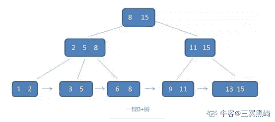
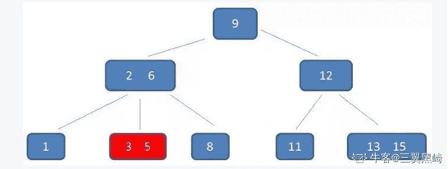
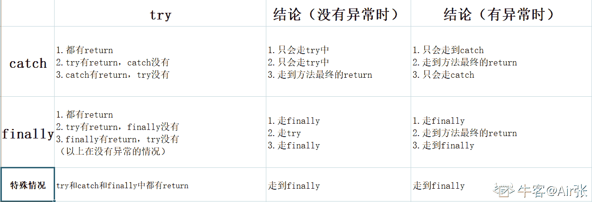
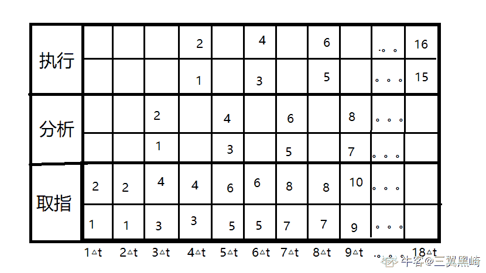

# 搜狐畅游 2019 校招笔试题-游戏开发工程师（java）

## 1

下面（）不是金庸撰写的小说？

正确答案: D   你的答案: 空 (错误)

```cpp
天龙八部
```

```cpp
鹿鼎记
```

```cpp
侠客行
```

```cpp
天涯明月刀
```

本题知识点

Java 工程师 C++工程师 搜狐畅游 运营 测试工程师 游戏工程师 算法工程师 职能 设计 运维工程师 游戏研发工程师 2019 市场 游戏运营 数据库工程师 数据分析师 数据挖掘工程师 人力资源 网络工程师 系统工程师 商务

讨论

[某牛客](https://www.nowcoder.com/profile/662599873)

飞雪连天射白鹿，笑书神侠倚碧鸳。

《飞狐外传》《雪山飞狐》《连城诀》《天龙八部》《射雕英雄传》《白马啸西风》《鹿鼎记》

《笑傲江湖》《书剑恩仇录》《神雕侠侣》《侠客传》《倚天屠龙记》《碧血剑》《鸳鸯刀》

发表于 2019-10-04 19:27:19

* * *

[编译小伙](https://www.nowcoder.com/profile/198006840)

飞雪连天射白鹿,笑书神侠倚碧鸳

发表于 2019-07-18 17:29:28

* * *

[gogogogood](https://www.nowcoder.com/profile/687235273)

还以为做的是阿里的题。。。。。

发表于 2019-12-07 17:43:50

* * *

## 2

以下哪款游戏不在战网平台上？（）

正确答案: C   你的答案: 空 (错误)

```cpp
暗黑破坏神 3
```

```cpp
魔兽争霸
```

```cpp
绝地求生
```

```cpp
炉石传说
```

本题知识点

Java 工程师 C++工程师 搜狐畅游 运营 测试工程师 游戏工程师 算法工程师 职能 设计 运维工程师 游戏研发工程师 2019 市场 游戏运营 数据库工程师 数据分析师 数据挖掘工程师 人力资源 网络工程师 系统工程师 商务

讨论

[️201908260942940](https://www.nowcoder.com/profile/385624213)

暴雪游戏：魔兽星际炉石守望风暴暗黑破坏神

发表于 2019-09-19 20:17:34

* * *

## 3

以下属于 ARPG 类型的游戏是？

正确答案: A   你的答案: 空 (错误)

```cpp
DNF
```

```cpp
海岛奇兵
```

```cpp
王者荣耀
```

```cpp
皇室战争
```

本题知识点

Java 工程师 C++工程师 搜狐畅游 运营 测试工程师 游戏工程师 算法工程师 职能 设计 运维工程师 游戏研发工程师 2019 市场 游戏运营 数据库工程师 数据分析师 数据挖掘工程师 网络工程师 系统工程师 商务

讨论

[Lan201906241108183](https://www.nowcoder.com/profile/935885380)

ARPG（Action Role Playing Game）

发表于 2019-06-27 15:56:27

* * *

[q 嘟嘟鸠 y](https://www.nowcoder.com/profile/619431102)

王者荣耀不是 moba 吗

发表于 2019-09-17 11:46:04

* * *

[知道火舞💃](https://www.nowcoder.com/profile/95605969)

海盗骑兵是策略类游戏，super cell 旗下的，super cell 更广为人知的游戏是皇室战争。海岛奇兵也是一款策略类游戏

发表于 2019-08-01 00:53:48

* * *

## 4

RPG 类游戏中又可分为 RPSG，SRPG，ARPG。其中 SRPG 是指？

正确答案: B   你的答案: 空 (错误)

```cpp
角色扮演模拟游戏
```

```cpp
策略角色扮演游戏
```

```cpp
动作角色扮演游戏
```

```cpp
多人在线角色扮演游戏
```

本题知识点

Java 工程师 C++工程师 搜狐畅游 运营 测试工程师 游戏工程师 算法工程师 职能 设计 运维工程师 游戏研发工程师 2019 市场 游戏运营 数据库工程师 数据分析师 数据挖掘工程师 网络工程师 系统工程师 商务

讨论

[夜跑小精灵](https://www.nowcoder.com/profile/287714414)

RPG：Role Playing Game 角色扮演游戏 RPSG：Role Playing Simulation Game 角色扮演模拟游戏 SRPG：Strategy Role Playing Game 策略角色扮演游戏 ARPG：Action Role Playing Game 动作角色扮演游戏

发表于 2019-08-07 19:36:02

* * *

## 5

RTS 是以下哪一类游戏的简称？（）

正确答案: D   你的答案: 空 (错误)

```cpp
策略类游戏
```

```cpp
射击类游戏
```

```cpp
角色扮演类游戏
```

```cpp
即时战略游戏
```

本题知识点

Java 工程师 C++工程师 搜狐畅游 运营 测试工程师 游戏工程师 算法工程师 职能 设计 运维工程师 游戏研发工程师 2019 市场 游戏运营 数据库工程师 数据分析师 数据挖掘工程师 人力资源 网络工程师 系统工程师 商务

讨论

[***1123](https://www.nowcoder.com/profile/8563322)

| 简称 | 全称 | 中文名 |
| RTS | Real-Time Strategy Game  | 即时战略游戏 |
| RPG | Role-playing game  | 角色扮演类游戏 |
| STG | Shooter game  | 射击类游戏 |
| SLG | Simulation Game  | 策略模拟类游戏 |

发表于 2019-09-03 16:05:54

* * *

[WendyWen](https://www.nowcoder.com/profile/215326914)

RPG=Role-playing Game：角色扮演游戏
ACT=Action Game：动作游戏

AVG=Adventure Game：冒险游戏
SLG=Simulation Game：策略游戏
RTS=Real-Time Strategy Game：即时战略游戏
FTG=Fighting Game：格斗游戏
STG= Shooting Game：射击类游戏
FPS=First Personal Shooting Game：第一人称视角射击游戏
PZL=Puzzle Game：益智类游戏
RCG=Racing Game：竞速游戏[也有称作为 RAC 的]

发表于 2020-09-22 16:58:05

* * *

[Lan201906241108183](https://www.nowcoder.com/profile/935885380)

即时战略游戏（Real-Time Strategy Game

发表于 2019-06-27 15:58:12

* * *

## 6

MMORPG 较于 RPG 的区别，你认为最正确的答案是（）？

正确答案: C   你的答案: 空 (错误)

```cpp
MMORPG 是可以扮演多个角色
```

```cpp
MMORPG 有非常大的地图
```

```cpp
MMORPG 是大型多人在线
```

```cpp
MMORPG 是可以飞行
```

本题知识点

Java 工程师 C++工程师 搜狐畅游 运营 测试工程师 游戏工程师 算法工程师 职能 设计 运维工程师 游戏研发工程师 2019 市场 游戏运营 数据库工程师 数据分析师 数据挖掘工程师 人力资源 网络工程师 系统工程师 商务

讨论

[安吉尼尔](https://www.nowcoder.com/profile/794002793)

MMORPG (massive multiplayer online role playing game)

发表于 2019-07-27 22:06:06

* * *

[我一定会有 offer！！](https://www.nowcoder.com/profile/407494708)

MMORPG"大型多人在线角色扮演游戏

发表于 2020-02-24 22:59:40

* * *

## 7

游戏行业中经常提到渠道一词，以下哪家公司没有自主渠道？

正确答案: C   你的答案: 空 (错误)

```cpp
腾讯
```

```cpp
网易
```

```cpp
完美世界
```

```cpp
360
```

本题知识点

Java 工程师 C++工程师 搜狐畅游 运营 测试工程师 游戏工程师 算法工程师 职能 设计 运维工程师 游戏研发工程师 2019 市场 游戏运营 数据库工程师 数据分析师 数据挖掘工程师 网络工程师 系统工程师 商务

讨论

[知道火舞💃](https://www.nowcoder.com/profile/95605969)

腾讯家的渠道：微信，QQ 网易家的渠道：网易通行证，网易大神 360 家的渠道？？？我也一脸懵逼，我猜想是浏览器？？之类的完美世界的布局比较狭窄

发表于 2019-08-01 00:56:26

* * *

[***1123](https://www.nowcoder.com/profile/8563322)

360 公司自己就有游戏中心。

发表于 2019-09-03 16:07:18

* * *

[牛客 8889999999999 号](https://www.nowcoder.com/profile/636590305)

完美对战平台让你吃了？完美世界电竞让你吃了？

发表于 2021-09-14 20:29:12

* * *

## 8

以下哪个不是数值策划的工作内容？

正确答案: D   你的答案: 空 (错误)

```cpp
战斗系统搭建
```

```cpp
资源循环系统搭建
```

```cpp
技能系统搭建
```

```cpp
副本设计
```

本题知识点

Java 工程师 C++工程师 搜狐畅游 运营 测试工程师 游戏工程师 算法工程师 职能 设计 运维工程师 游戏研发工程师 2019 市场 游戏运营 数据库工程师 数据分析师 数据挖掘工程师 网络工程师 系统工程师 商务

讨论

[知道火舞💃](https://www.nowcoder.com/profile/95605969)

可怜的数值策划主要是设计英雄的攻击范围，判定，技能伤害等等的数值。还包括生存系统里面各个资源的价值和数量。举个例子，一个生存类游戏，我们假设这是《明日之后》，砍树卖掉木材多少钱（价值），砍一棵树收集多少木材（数量），都是数值策划的锅。而副本，是文学策划/玩法策划的事。除了这三类之外，还有可爱的系统策划。系统策划就是做，比如说，好友系统，战队系统，社会框架等等

发表于 2019-08-01 01:01:02

* * *

## 9

以下哪个最不可能是新手阶段导致用户大量流失的原因？（）

正确答案: C   你的答案: 空 (错误)

```cpp
美术画风
```

```cpp
新手任务无趣
```

```cpp
游戏职业不平衡
```

```cpp
缺乏基础的引导
```

本题知识点

Java 工程师 C++工程师 搜狐畅游 运营 测试工程师 游戏工程师 算法工程师 职能 设计 运维工程师 游戏研发工程师 2019 市场 游戏运营 数据库工程师 数据分析师 数据挖掘工程师 人力资源 网络工程师 系统工程师 商务

讨论

[のKiss](https://www.nowcoder.com/profile/907348814)

职业不平衡，在游戏初期是不会特别明显的，就算常规游戏，远程比近程前期练级刷怪可能会好一些，但是大多的副本还是需要多人合作才行，各有利弊。而别的方面，比如游戏画面，一进游戏，画面花里胡哨，马赛克还多，玩家就会受不了，建模还差的话，可能进游戏待不了 5 分钟就有卸载的冲动；对于一些较为难上手的游戏，没有很简单的基础操作指引，会让玩家一头雾水，老半天不知道怎么进行接下来的操作，实力劝退；再有就是新手任务，从头到尾只是点点点，极其无聊的任务模式，也是很容易劝退玩家的一种。（一名差不多 20 年游戏经验的学生飘过~）

发表于 2019-09-25 15:39:08

* * *

[牛客 177694650 号](https://www.nowcoder.com/profile/177694650)

要判断一个游戏的职业是否平衡，一定是有先决条件的。那就是我玩过或者至少了解过这个游戏的绝大多数职业。 一个新手玩家只会接触 1-2 个职业。 他可能刚刚看完职业介绍，了解了基本的分类。还在新手村里找 NPC 此时，他还没有和别的职业 pk 或 组队过，没有交互，没有比较。 这时他是不可能判断出职业是否平衡的

发表于 2020-09-01 21:00:59

* * *

[Rago](https://www.nowcoder.com/profile/8991699)

美术画风不应该是不喜欢就根本不会玩吗哪里会等到玩了两天觉得不好看就不玩了

发表于 2020-02-28 18:17:25

* * *

## 10

游戏行业中的“流水”是指

正确答案: A   你的答案: 空 (错误)

```cpp
玩家充值总金额
```

```cpp
游戏发行商收入
```

```cpp
游戏研发商收入
```

```cpp
渠道商收入
```

本题知识点

Java 工程师 C++工程师 搜狐畅游 运营 测试工程师 游戏工程师 算法工程师 职能 设计 运维工程师 游戏研发工程师 2019 市场 游戏运营 数据库工程师 数据分析师 数据挖掘工程师 网络工程师 系统工程师 商务 游戏策划 2021 PHP 工程师 golang 工程师 前端工程师 安卓工程师 iOS 工程师 大数据开发工程师 安全工程师 测试开发工程师

讨论

[好好学习好好做人](https://www.nowcoder.com/profile/854180677)

流水：充值金额实收：利润

发表于 2021-08-12 01:24:26

* * *

[terrencexy](https://www.nowcoder.com/profile/197324993)

流水就是营业额，不是利润

发表于 2020-03-15 11:20:55

* * *

[牛客 30605549 号](https://www.nowcoder.com/profile/30605549)

猜的，流水肯定是钱。

发表于 2019-12-30 22:16:47

* * *

## 11

关于 SQL 中 UNION 和 UNION ALL 的描述错误的是？

正确答案: C   你的答案: 空 (错误)

```cpp
均用于合并两个或多个 SELECT 语句的结果集
```

```cpp
SELECT 语句须具有相同数量的列和相同的数据类型
```

```cpp
均会对合并后的结果集进行默认规则的排序
```

```cpp
UNION 会对结果集中重复的记录进行去重，UNION ALL 则不会对结果集进行去重
```

本题知识点

Java 工程师 搜狐畅游 C++工程师 游戏研发工程师 2019 数据库工程师

讨论

[青简](https://www.nowcoder.com/profile/708069809)

只有 union 才会排序 加个 all 就不排序 不去重

发表于 2019-09-25 19:22:05

* * *

[25Y](https://www.nowcoder.com/profile/943599156)

只有 union 才会排序

发表于 2019-08-14 16:54:45

* * *

## 12

SQL 的 LIKE 运算符中能匹配一个或多个字符的通配符是？

正确答案: B   你的答案: 空 (错误)

```cpp
*
```

```cpp
%
```

```cpp
？
```

```cpp
_
```

本题知识点

Java 工程师 搜狐畅游 C++工程师 游戏研发工程师 2019 数据库工程师

讨论

[三翼黑崎](https://www.nowcoder.com/profile/906268221)

SQL 里通配符有三种：’%‘ 替代一个或多个字符，‘_’ 仅替代一个字符，‘[charlist]’ 字符列中的任一字符。举个三个最简单的例子 ：SELECT * FROM Persons WHERE Name LIKE ‘JO%’，查出名字以 JO 开头的记录中的所有信息。SELECT * FROM Persons WHERE Name LIKE ‘J_J_’，查出名字为 JXJX 格式的记录中的所有信息。 SELECT * FROM Persons WHERE Name LIKE ‘%[ABC]’, 查出名字以 "A" 或 "L" 或 "N"中任一字符结尾的记录中的所有信息。 

发表于 2019-09-04 16:52:23

* * *

## 13

下面哪种数据结构更适合于用作数据库索引？

正确答案: B   你的答案: 空 (错误)

```cpp
红黑树
```

```cpp
B+树
```

```cpp
二叉查找树
```

```cpp
Huffman 树
```

本题知识点

Java 工程师 搜狐畅游 C++工程师 游戏研发工程师 2019 数据库工程师

讨论

[三翼黑崎](https://www.nowcoder.com/profile/906268221)

在说红黑树之前不得不说说一下二叉查找树

**二叉查找树**：

1.若左子树不为空，则左子树上所有节点的值均小于根节点的值

2.若右子树不为空，则右子树上所有节点的值均大于根节点的值

3.左右子树也一定要分别为二叉查找树。

4.没有键值相等的节点。

但是二叉查找树会出现一种瘸腿得情况，就是全都是同一边的子树，导致查找的性能会大打折扣，几乎就是线性查找了
这时候红黑树就登场了：**红黑树：**

红黑树是一种平衡二叉树，平衡二叉树意思就是不会出现瘸腿的情况，二叉树会根据规则去自动平衡二叉树，黑白树的规则如下：

1.节点不是红色就是黑色

2.根节点一定是黑色

3.每个红节点的两个子节点必须为黑色（从每个叶子到根的路径上不能有连续两个红节点

4.从任一节点到其每个叶子的路径都包含相同个数的黑节点。

由于这些规则，使得红黑树的在结构上比较稳定，性能也比较稳定。红黑树在函数式编程是最常用的持久数据结构之一，用来构造**关联函数和集合**，像**TreeSet，TreeMap**底层都是基于红黑树。**B+树**
内容图片参考于：简书的----[**阿长 _****一个程序员**](https://www.jianshu.com/u/0ee3a18cc8ad)主要分为两部分：1.叶子节点，在 B+树的最底层（所有叶节点都在同一层），叶节点中存放索引值，指向记录的指针，还有指向下一个叶节点的指针。叶节点内的索引是键的拷贝，这些索引值以排好顺序的形式分布从左到右分布在叶节点中，形成一个有序链表。叶子节点包含了全部的节点信息。2.内部节点，内部节点，所有非叶子节点都属于内部节点，每一个父节点的元素都会出现在子节点中，是子节点的最大或最小元素说到这里就不得不说一下 B 树了
由两个树的结构我们也可以得出一些结论：

1.B 树所有节点都包含具体的数据，而 B+树，在叶节点就已经全部包含，所以 B+树相比 B 树有更好的查询性能。B+树相对与 B 树在同样的磁盘页中可以容纳更多的非叶节点，结构更加矮胖，因而查询时 IO 的次数也会更少。

2.B+树只有叶节点这一层能查询到数据，所以相对来说查询时间比较稳定，而 B 树则有可能在中间节点就匹配到数据，所以 B 树的查找性能并不稳定。

3.由于 B+树在叶节点中也有指向下一个叶节点的指针，所有在范围查询中，B+树相对于 B 树来说也更具优势，不用再返回父节点去查找。由于 B+树的结构稳定，且对数据操作性能稳定，B+树被应用于**数据库**和**操作系统的文件系统****Huffman 树(又名最优二叉树)：**

**Huffman****树就是根据各个字符出现的频率得出每个字符占用的权值，权值大的字符采用较短的编码，权值小的采用长的编码，这样可以使编码的长度相对较短，以达到节省空间的作用。多用于压缩。**

发表于 2019-09-05 00:34:35

* * *

## 14

MySQL 数据库提供了四种级别的事务隔离，其中默认的隔离级别是？

正确答案: B   你的答案: 空 (错误)

```cpp
Serializable(串行化)
```

```cpp
Repeatable read(可重复读)
```

```cpp
Read committed(读已提交)
```

```cpp
Read uncommitted(读未提交)
```

本题知识点

Java 工程师 搜狐畅游 C++工程师 游戏研发工程师 2019 数据库工程师

讨论

[牛客 587631461 号](https://www.nowcoder.com/profile/587631461)

select @@transaction_isolation;

| REPEATABLE-READ |

发表于 2020-08-28 21:45:52

* * *

[三翼黑崎](https://www.nowcoder.com/profile/906268221)

**Read Uncommitted（读取未提交内容）：**所有事务都可以看见其他未提交事务的执行结果，一般这种隔离级别性能相对来说不高。

**Read Committed（读取提交内容）：**它是大多数数据库的默认隔离级别（不包括 Mysql），一个正在事务能看到已提交事务所作出的更改。可能会出现同一查找语句出现不同的返回结果，因为同一事务的其他实例执行过程中，别的事务有可能完成了对数据的更改。

**Repeated Read（可重读）：**Mysql 默认使用这个隔离级别，它保证了同一事务在不同实例在并发读取数据的时候看到的是同一数据。但是会出现“幻读“情况，就是在事务执行过程中别的事务又在其范围内插入一条新的数据，导致同一事务两次实例同一查询所显示的数据不相同。InniDB 和 Falcon 存储引擎通过多版本并发控制解决了这个问题，好像是通过添加间隙锁，防止插入，但也有可能导致死锁的情况发生。

**Serializable（可串行化）：**这是最高级隔离级别，通过强制事务排序，使之不可能发生冲突，从而解决了幻读的问题，它是在每个数据行上加上共享锁实现。但是会导致大量的超时现象。

发表于 2019-09-05 16:31:56

* * *

[shutup.](https://www.nowcoder.com/profile/772982950)

B

发表于 2019-08-05 18:52:51

* * *

## 15

下面那个选项设置 web 页面的背景颜色？

正确答案: D   你的答案: 空 (错误)

```cpp
<body background="color-name">
```

```cpp
<body backgroundcolor="color-name">
```

```cpp
<body bg-color="color-name">
```

```cpp
<body bgcolor="color-name">
```

本题知识点

Java 工程师 搜狐畅游 游戏研发工程师 2019 HTML 游戏策划 2021

讨论

[Jnim](https://www.nowcoder.com/profile/509820987)

body 标签的两个属性 background 和 bgcolor，其中 background 只能写 url 表示背景图像,bgcolor 写背景颜色 Html5 不支持，Html4.01 已废弃

发表于 2020-08-11 17:12:25

* * *

[锅锅过火](https://www.nowcoder.com/profile/614733371)

啊啊啊啊，我就没看过 bgcolor

发表于 2020-11-14 17:12:18

* * *

[PiggyCoder](https://www.nowcoder.com/profile/556507504)

bgcolor:文档的背景颜色。此方法不符合规范，请使用 CSS 的 background-color 属性替代

发表于 2020-09-17 18:35:59

* * *

## 16

关于 JVM 的类加载机制描述不正确的是？

正确答案: D   你的答案: 空 (错误)

```cpp
启动类加载器由 JVM 实现，不属于 JAVA 类
```

```cpp
JVM 类加载的双亲委派机制可以被违反
```

```cpp
不同类加载器加载的同一个类在 JVM 中属于不同的类
```

```cpp
子类加载器将类加载任务委托给父类加载器前，会先尝试加载该类
```

本题知识点

Java 工程师 搜狐畅游 C++工程师 游戏研发工程师 2019 数据库工程师

讨论

[牛客 366232162 号](https://www.nowcoder.com/profile/366232162)

D：父类加载失败才会由子类来加载

发表于 2020-08-12 13:57:07

* * *

## 17

关于 JVM 的内存结构描述不正确的是？

正确答案: C   你的答案: 空 (错误)

```cpp
JAVA 的栈内存不是线程共享的
```

```cpp
堆内存是用于存储 JAVA 对象的区域
```

```cpp
PC 寄存器也存在内存溢出风险
```

```cpp
本地方法栈也存在内存溢出风险
```

本题知识点

Java 工程师 搜狐畅游 C++工程师 游戏研发工程师 2019 数据库工程师

讨论

[青简](https://www.nowcoder.com/profile/708069809)

程序计数器是没有内存溢出风险的

发表于 2019-09-25 19:25:15

* * *

[三翼黑崎](https://www.nowcoder.com/profile/906268221)

**由于程序计数器（PC 寄存器）中存储的数据所占空间不会随着程序执行而发生改变，因此，程序计数器**（PC 寄存器）**是不会发生内存溢出现象**

发表于 2019-09-07 11:32:28

* * *

[25Y](https://www.nowcoder.com/profile/943599156)

程序计数器是 jvm 中唯一一个没有 oom Error 的区域

发表于 2019-08-14 16:57:05

* * *

## 18

grep/egrep 是 linux 下一个功能强大的正则匹配全文搜索工具，请问下面哪条命令能打印文本文件 file.txt 中除掉"1"开头的行和空行的信息？

正确答案: C   你的答案: 空 (错误)

```cpp
grep "¹|^$" file.txt
```

```cpp
grep -E "¹|^$" file.txt
```

```cpp
egrep -v "¹|^$" file.txt
```

```cpp
egrep -E "¹|^$" file.txt
```

本题知识点

Java 工程师 搜狐畅游 C++工程师 游戏研发工程师 2019 数据库工程师

讨论

[三翼黑崎](https://www.nowcoder.com/profile/906268221)

egrep：输出语句， -v 逆反模式 ， "¹|^$" ：以 1 开头或空行 ，组合在一起，输出文件 file.txt 中符合不是以 1 开头或空行的句子 发表于 2019-09-07 11:46:16

* * *

## 19

下面哪个选项不是 Spring 为简化 Java 开发采用策略？

正确答案: D   你的答案: 空 (错误)

```cpp
基于 POJO 的轻量级和最小侵入性编程
```

```cpp
通过依赖注入和面向接口实现松耦合
```

```cpp
通过切面和模板减少样板式代码
```

```cpp
通过自定义类加载器实现 class 动态加载
```

本题知识点

Java 工程师 搜狐畅游 C++工程师 游戏研发工程师 2019 数据库工程师

讨论

[三翼黑崎](https://www.nowcoder.com/profile/906268221)

Spring 框架为了简化开发的 4 大策略

1.采用轻量级 PoJo（Plain Ordinary Java Object -- Java 普通对象），最小侵入式编程。

2.依赖注入（DI）和面向接口编程实现松耦合。

3.基于切面和惯例进行声明式编程。

4.通过切面和模板减少样板式代码

编辑于 2019-09-09 09:54:56

* * *

## 20

Spring 的切面是在目标对象生命周期的哪个阶段织入的？

正确答案: C   你的答案: 空 (错误)

```cpp
编译期
```

```cpp
类加载期
```

```cpp
运行期
```

```cpp
类加载期和运行期
```

本题知识点

Java 工程师 搜狐畅游 C++工程师 游戏研发工程师 2019 数据库工程师

## 21

下面对 DTD 和 XSD 的描述错误的是？

正确答案: C   你的答案: 空 (错误)

```cpp
两者均可描述 XML 文档的合法元素和属性
```

```cpp
DTD 能通过外部引用进行声明，也可在 XML 文档中进行声明
```

```cpp
DTD 和 XSD 均是使用 XML 编写的
```

```cpp
XSD 相比 DTD 引入了命名空间的支持
```

本题知识点

Java 工程师 搜狐畅游 C++工程师 游戏研发工程师 2019 数据库工程师

讨论

[一个要发达的打工仔](https://www.nowcoder.com/profile/248596653)

转载自[`blog.csdn.net/ningguixin/article/details/8171581`](https://blog.csdn.net/ningguixin/article/details/8171581) 1.DTD(Documnet Type Definition)DTD 即文档类型定义，是一种 XML 约束模式语言，是 XML 文件的验证机制,属于 XML 文件组成的一部分。
DTD 是一种保证 XML 文档格式正确的有效方法，可以通过比较 XML 文档和 DTD 文件来看文档是否符合规范，元素和标签使用是否正确。 一个 DTD 文档包含：元素的定义规则，元素间关系的定义规则，元素可使用的属性，可使用的实体或符号规则。

DTD 和 XSD 相比：DTD 是使用非 XML 语法编写的。
DTD 不可扩展,不支持命名空间,只提供非常有限的数据类型 .

2.XSD(XML Schemas Definition)
XML Schema 语言也就是 XSD。XML Schema 描述了 XML 文档的结构。
可以用一个指定的 XML Schema 来验证某个 XML 文档，以检查该 XML 文档是否符合其要求。文档设计者可以通过 XML Schema 指定一个 XML 文档所允许的结构和内容，并可据此检查一个 XML 文档是否是有效的。XML Schema 本身是一个 XML 文档，它符合 XML 语法结构。可以用通用的 XML 解析器解析它。
一个 XML Schema 会定义：文档中出现的元素、文档中出现的属性、子元素、子元素的数量、子元素的顺序、元素是否为空、元素和属性的数据类型、元素或属性的默认 和固定值。
XSD 是 DTD 替代者的原因，一是据将来的条件可扩展，二是比 DTD 丰富和有用，三是用 XML 书写，四是支持数据类型，五是支持命名空间。
XML Schema 的优点:
1) XML Schema 基于 XML,没有专门的语法
2) XML Schema 可以象其他 XML 文件一样解析和处理
3) XML Schema 比 DTD 提供了更丰富的数据类型.
4) XML Schema 提供可扩充的数据模型。
5) XML Schema 支持综合命名空间
6) XML Schema 支持属性组。

编辑于 2019-10-13 10:38:12

* * *

## 22

下面对使用 DOM 解析 XML 的描述错误的是？

正确答案: D   你的答案: 空 (错误)

```cpp
DOM 接口提供了一种通过分层对象模型来访问 XML 文档信息的方式，这些分层对象模型依据 XML 的文档结构形成了一棵节点树
```

```cpp
基于 DOM 的 XML 解析器一次性把整个 xml 文档加载进内存，如果 XML 文件比较大，容易影响解析性能且可能会造成内存溢出
```

```cpp
基于 DOM 的 XML 解析器能随机访问 XML 文档的节点对象
```

```cpp
基于 DOM 的 XML 解析器不能对 XML 进行修改
```

本题知识点

Java 工程师 搜狐畅游 C++工程师 游戏研发工程师 2019 数据库工程师

讨论

[一个要发达的打工仔](https://www.nowcoder.com/profile/248596653)

Dom:英文全称－Document Object Model 译成中文即是：文档对像模型．听起来很术语，其实就是文档内容的结构关系．文档类型可以是 HTML 或 XML Dom 具有对 Html 文件和 XML 文件元素的访问控制能力，简单点说利用 Dom 可以对某个 html 或 xml 文件添加，修改。

发表于 2019-10-13 10:46:56

* * *

## 23

下面关于数据仓库相关概念的描述错误的是？

正确答案: A   你的答案: 空 (错误)

```cpp
元数据是关于数据的数据，也称为数据仓库的结构，包括关于装载和更新处理,分析处理以及管理方面的信息
```

```cpp
数据仓库粒度的具体划分将直接影响数据仓库中的数据量以及查询质量
```

```cpp
数据仓库的特点有：面向主题、集成性、稳定性和反映历史变化
```

```cpp
数据仓库中的数据包括：元数据、粒度数据、当前详细数据、历史数据和档案数据
```

本题知识点

Java 工程师 搜狐畅游 C++工程师 游戏研发工程师 2019 数据库工程师

讨论

[空罐少女](https://www.nowcoder.com/profile/3759302)

**元数据**（Metadata），又称中介数据、中继数据，为描述数据的数据（data about data），主要是描述数据属性（property）的信息，用来支持如指示存储位置、历史数据、资源查找、文件记录等功能。

发表于 2019-10-19 15:28:59

* * *

## 24

下面关于 JDK 1.8 中的 HashMap 的说法中正确的是？

正确答案: B   你的答案: 空 (错误)

```cpp
对内部元素的访问使用 synchronized 加锁，是线程安全的类
```

```cpp
内部使用 hash 表+链表/红黑树实现
```

```cpp
键值不能为 null
```

```cpp
在达到 HashMap 的初始大小时，可以进行自动扩容
```

本题知识点

Java 工程师 搜狐畅游 C++工程师 游戏研发工程师 2019 数据库工程师

讨论

[G3Nm$](https://www.nowcoder.com/profile/940185770)

A 错 线程不安全 B 对 C 错 可以为 nullD 错 当 HashMap 的键值对个数大于容量的 75%时，HashMap 的容量扩大一倍。

发表于 2020-04-15 11:54:58

* * *

[一个要发达的打工仔](https://www.nowcoder.com/profile/248596653)

当 HashMap 的键值对个数大于容量的 75%时，HashMap 的容量扩大一倍。

发表于 2019-10-13 11:20:28

* * *

## 25

下面对 JAVA 反射机制的描述错误的是？

正确答案: A   你的答案: 空 (错误)

```cpp
能通过反射破坏枚举类型实现的单例模式
```

```cpp
通过反射能调用类的私有构造函数
```

```cpp
反射机制是通过调用该类加载进 jvm 后生成的 Class 对象来实现的
```

```cpp
反射调用能获得保留到运行时的注解信息
```

本题知识点

Java 工程师 搜狐畅游 C++工程师 游戏研发工程师 2019 数据库工程师

讨论

[offer 快来球球了](https://www.nowcoder.com/profile/243031380)

反射能访问 private 方法

发表于 2020-04-01 11:20:46

* * *

## 26

下面哪个流类属于面向字符的输入流

正确答案: D   你的答案: 空 (错误)

```cpp
BufferedWriter
```

```cpp
FileInputStream
```

```cpp
ObjectInputStream
```

```cpp
InputStreamReader
```

本题知识点

Java 工程师 搜狐畅游 C++工程师 游戏研发工程师 2019 数据库工程师

讨论

[空罐少女](https://www.nowcoder.com/profile/3759302)

以 Stream 结尾的都是与字节流相关的

发表于 2019-10-19 15:30:50

* * *

## 27

下面哪种方法创建对象时不会调用类的构造函数？

正确答案: A   你的答案: 空 (错误)

```cpp
使用反序列化
```

```cpp
使用 new 关键字
```

```cpp
使用 Class 类的 newInstance 方法
```

```cpp
使用 Constructor 类的 newInstance 方法
```

本题知识点

Java 工程师 搜狐畅游 C++工程师 游戏研发工程师 2019 数据库工程师

## 28

下面关于线程的描述不正确的是？

正确答案: C   你的答案: 空 (错误)

```cpp
线程是操作系统调度的最小单位
```

```cpp
线程状态变为死亡状态后就不会再改变
```

```cpp
因等待锁而被阻塞的线程在获得锁后直接变为运行状态
```

```cpp
处于就绪状态的线程等待获取 CPU 执行
```

本题知识点

Java 工程师 搜狐畅游 C++工程师 游戏研发工程师 2019 数据库工程师

讨论

[空罐少女](https://www.nowcoder.com/profile/3759302)

因等待锁而被阻塞的线程在获得锁后直接变为 *可运行状态*

发表于 2019-10-19 15:33:49

* * *

## 29

下面关于 JAVA 中 try，catch，finally 描述正确的是？

正确答案: A   你的答案: 空 (错误)

```cpp
finally 语句块中如果包含 return 语句，则不会跳回到 try 或 catch 中执行 return 或 throw 语句
```

```cpp
finally 语句块是在 try 或 catch 语句块执行完后才执行
```

```cpp
catch 只能捕获运行时异常和受检查的异常，不能捕获 Error
```

```cpp
catch 语句块中不能再使用 throw 抛出异常
```

本题知识点

Java 工程师 搜狐畅游 C++工程师 游戏研发工程师 2019 数据库工程师

讨论

[Air 张](https://www.nowcoder.com/profile/4168182)

B.如果在执行 finally 之前就退出了虚拟机，是不会执行 finally 中的内容 C.考察运行时异常和检查时异常，检查异常编译器会报错 D.可以再次抛出异常对象

发表于 2019-09-02 15:33:30

* * *

## 30

对 JAVA 中"equals()"与"=="的区别描述错误的是？

正确答案: D   你的答案: 空 (错误)

```cpp
"=="判断的是两个对象的地址是否相等
```

```cpp
类没有覆盖"equals()"方法时，"equals()"判断的是两个对象的地址是否相等
```

```cpp
类没有覆盖"equals()"方法时，"equals()"等价于"=="
```

```cpp
"=="判断的是两个对象的值是否相等
```

本题知识点

Java 工程师 搜狐畅游 C++工程师 游戏研发工程师 2019 数据库工程师

讨论

[牛客 731284451 号](https://www.nowcoder.com/profile/731284451)

d

发表于 2022-03-14 13:29:04

* * *

## 31

以下关于 JAVA 中字符串拼接操作的叙述错误的是（ ）。

正确答案: D   你的答案: 空 (错误)

```cpp
StringBuffer 和 StringBuilder 类的对象能够被多次的修改，并且不产生新的未使用对象
```

```cpp
StringBuilder 相较于 StringBuffer 有速度优势，所以单线程下字符串连接应使用 StringBuilder 类
```

```cpp
编译阶段就能够确定的字符串常量，直接使用字符串常量的"+"连接操作效率最高
```

```cpp
String、StringBuilder 和 StringBuffer 均为字符串变量
```

本题知识点

Java 工程师 搜狐畅游 游戏研发工程师 2019

## 32

以下关于 HTTP 协议叙述正确的是（ ）。

正确答案: C   你的答案: 空 (错误)

```cpp
HTTP 协议是建立在 TCP/IP 协议之上的网络层规范，分为三个部分：状态行、请求头、消息主体
```

```cpp
Cookie 数据在消息主体（body）中传输
```

```cpp
HTTP 协议支持一定时间内的 TCP 连接保持，这个连接可以用于发送/接收多次请求
```

```cpp
HTTP 是有状态的，每个请求都是独立的
```

本题知识点

Java 工程师 搜狐畅游 游戏研发工程师 2019

讨论

[海绵宝宝的牙齿是我](https://www.nowcoder.com/profile/593391942)

HTTP 的协议格式：首行（请求首行、响应首行）、头部、空行、正文 cookies 是存在 消息头 中 HTTP 是无状态的

发表于 2020-04-07 18:44:32

* * *

[游生生](https://www.nowcoder.com/profile/370876119)

- cookies 是存在 消息头 中- HTTP 是无状态的

发表于 2020-03-13 11:39:40

* * *

[南风过熙](https://www.nowcoder.com/profile/827484648)

[HTTP](http://caibaojian.com/t/http)协议包含：通用头域、请求消息、响应消息和主体信息。

发表于 2019-10-08 10:44:29

* * *

## 33

线程在获取同步锁失败后进入（ ）。

正确答案: B   你的答案: 空 (错误)

```cpp
就绪状态
```

```cpp
阻塞状态
```

```cpp
运行状态
```

```cpp
死亡状态
```

本题知识点

Java 工程师 搜狐畅游 游戏研发工程师 2019

## 34

设每条指令由取指、分析、执行 3 个子部件完成，并且每个子部件的执行时间分别为 2△t、1△t、1△t。若采用度为 2 的超标量流水线处理机，连续执行上述 16 条指令，则共耗时（  ）△t。

正确答案: B   你的答案: 空 (错误)

```cpp
16
```

```cpp
18
```

```cpp
32
```

```cpp
34
```

本题知识点

Java 工程师 搜狐畅游 游戏研发工程师 2019

讨论

[三翼黑崎](https://www.nowcoder.com/profile/906268221)



发表于 2019-09-09 21:28:32

* * *

## 35

一个 UNIX/Linux 文件，如果一个盘块的大小为 1024B，每个盘块占 4 个字节，直接寻址为 10 块，一次间接寻址为 256 块，二次间接寻址为 256*256 块，三次间接寻址为 256*256*256 块，那么，偏移为 272383 节处的数据在（ ）。

正确答案: B   你的答案: 空 (错误)

```cpp
直接寻址
```

```cpp
一次间接寻址
```

```cpp
二次间接寻址
```

```cpp
三次间接寻址
```

本题知识点

Java 工程师 搜狐畅游 游戏研发工程师 2019

讨论

[三翼黑崎](https://www.nowcoder.com/profile/906268221)

答：UNIX/Linux 文件系统中，一个盘块的大小为 1KB，每个盘块号占 4 个字节，即每块可放 256 个地址。直接寻址为 10 块，一次间接寻址为 256 块，二次间接寻址为 256 二次方块，三次间接寻址为 256 三次方块。
首先将逻辑文件的字节偏移量转换为文件的逻辑块号和块内偏移。方法是：将逻辑文件的字节偏移量/盘块大小，商为文件的逻辑块号，余数是块内偏移；再将文件的逻辑块号转换为物理块号，使用多重索引结构，在索引节点中根据逻辑块号通过直接索引或间接索引找到对应物理块号。
偏移为 272383 字节的逻辑块号是：272383/1024=265。块内偏移量=272383-265×1024=1023。由于 10<265<256+10，故 263168 字节在**一次间接寻址**内，块内偏移量为 1023.

发表于 2019-09-09 22:01:15

* * *

## 36

设计子网划分支持某银行全国各地支行网络，支行一共有 1000 家左右，每个支行的终端最多 20 台，银行使用一个 B 类地址，应该使用的子网掩码是（ ）。

正确答案: D   你的答案: 空 (错误)

```cpp
255.255.255.128
```

```cpp
255.255.252.0
```

```cpp
255.255.248.0
```

```cpp
255.255.255.224
```

本题知识点

Java 工程师 搜狐畅游 游戏研发工程师 2019

讨论

[彦祖丶](https://www.nowcoder.com/profile/4900747)

题目中说道，每个支行的终端最多 20 台，也就是说起码要 2⁵=32 来保证 20 终端，所以最后五位为 0，即得出答案 D

发表于 2019-09-29 17:22:36

* * *

## 37

机构 A、B 分别在两个 CA（证书签发机构）CA1 和 CA2 处取得了各自的证书，以下步骤（ ）可以使得 A、B 机构间建立互信。

正确答案: D   你的答案: 空 (错误)

```cpp
A、B 交换证书
```

```cpp
CA1、CA2 交换证书
```

```cpp
A、B 交换公钥
```

```cpp
CA1、CA2 交换公钥
```

本题知识点

Java 工程师 搜狐畅游 游戏研发工程师 2019

## 38

以下缓存替换算法中（ ）系统开销最大。

正确答案: C   你的答案: 空 (错误)

```cpp
size（替换 size 最大的对象）
```

```cpp
FIFO（先进先出）
```

```cpp
LFU（最不经常使用页置换）
```

```cpp
LRU（近期最少使用）
```

本题知识点

Java 工程师 搜狐畅游 游戏研发工程师 2019

## 39

信号量机制用于解决并发程序中临界资源的分配问题，以下关于记录型信号量机制中的 P 操作（wait，申请资源）和 V 操作（signal，释放资源）的叙述错误的是（ ）。

正确答案: D   你的答案: 空 (错误)

```cpp
P 操作将信号量 S 的值减 1，如果 S=0，则当前进程（线程）继续执行
```

```cpp
V 操作将信号量 S 的值加 1，如果 S=0，则当前进程（线程）继续执行
```

```cpp
P 操作将信号量 S 的值减 1，如果 S>0，则当前进程（线程）继续执行
```

```cpp
V 操作将信号量 S 的值加 1，如果 S>0，则从该信号的等待队列中唤醒一等待进程（线程）
```

本题知识点

Java 工程师 搜狐畅游 游戏研发工程师 2019

讨论

[低着头的骄傲](https://www.nowcoder.com/profile/617489651)

当执行完 V 操作 S 加一后,如果 S > 0，这时候 S 最小值是 1，也就是原来 S 的最小值是 0，说明原来没有因为获取这个资源而被阻塞的线程。有阻塞必须 S 的值小于零正确的是   V 操作将信号量 S 的值加 1，如果 S < 0，则从该信号的等待队列中唤醒一等待进程（线程)

发表于 2019-10-14 22:14:27

* * *

## 40

某电商数据库中商品数据（no，name，pname，city，count）no 表示商品号，name 表示商品名称，pname 表示供货商，city 表示所在地，count 表示数量。函数依赖 F={no->name，(no，pname)->count,pname->city}。关系 P 为（ ）。

正确答案: A   你的答案: 空 (错误)

```cpp
1NF
```

```cpp
2NF
```

```cpp
3NF
```

```cpp
BCNF
```

本题知识点

Java 工程师 搜狐畅游 游戏研发工程师 2019

## 41

根据以下资料，回答如下 5 道题目：

截至 2017 年 4 月 30 日 22 时，沪深两市已有 534 家上市公司第一季度财报。这 534 家公司实现营业总收入 4572.78 亿元，同比增长 30.74%；实现净利润 336.7 亿元，同比增长 30.52%。不过，一季度销售收入和净利润环比则有所下降，其中营业总收入环比下降 12%，净利润环比下降 25%。这 534 家公司 2017 年一季度存货 6167.68 亿元，较上年年末增长 10%。
已公布一季报的创业板公司有 71 家，实现营业收入 80.08 亿元，同比增长 73.60%；实现净利润 13.16 亿元，同比增长 80%。已公布一季报的中小企业板公司有 202 家，实现营业收入 789.97 亿元，同比增长 36%；实现净利润 73.25 亿元，同比增长 25%。
25 家已公布一季报的房地产公司一季度实现营业收入 193.68 亿元，同比增长 9%；实现净利润 29.97 亿元，同比增长 31%；存货 2892.18 亿元，同比增长 10%。
已公布一季报的 6 家钢铁板块公司一季度存货为 322 亿元，实现营业收入 493.39 亿元，同比略有降低，环比下降 20%；实现净利润 12.65 亿元，同比增长 62%，环比表现更好，这 6 家公司 2016 年四季度净亏损 3.77 亿元。
建筑机械类公司持续了之前的景气度，有 4 家公司公布一季报，实现营业总收入 15.90 亿元，同比增长 39%；实现净利润 1.18 亿元，同比增长 47.5%。

已公布一季报的 534 家公司，平均每家在 2016 年第四季度实现营业收入约多少亿元？（　　）

正确答案: A   你的答案: 空 (错误)

```cpp
9.73
```

```cpp
8.56
```

```cpp
7.54
```

```cpp
0.63
```

本题知识点

运营 搜狐畅游 Java 工程师 算法工程师 C++工程师 设计 游戏研发工程师 2019 市场 游戏运营 数据分析师 数据挖掘工程师 网络工程师

讨论

[安吉尼尔](https://www.nowcoder.com/profile/794002793)

「同比」 与历史「同时期］比较，例如 2011 年 3 月份与 2010 年 3 月份相比，叫「同比」。 「环比」 与「上一个」统计周期比较，例如 2011 年 4 月份与 2011 年 3 月份相比较，称为「环比」。

发表于 2019-07-27 22:25:59

* * *

[Shimmer 清朔](https://www.nowcoder.com/profile/55510509)

环注意环比 4572.78/(1-12％)＝5196.34 5196.34/534＝9.73

发表于 2019-09-25 16:33:44

* * *

## 42

根据以下资料，回答如下 5 道题目：

截至 2017 年 4 月 30 日 22 时，沪深两市已有 534 家上市公司第一季度财报。这 534 家公司实现营业总收入 4572.78 亿元，同比增长 30.74%；实现净利润 336.7 亿元，同比增长 30.52%。不过，一季度销售收入和净利润环比则有所下降，其中营业总收入环比下降 12%，净利润环比下降 25%。这 534 家公司 2017 年一季度存货 6167.68 亿元，较上年年末增长 10%。
已公布一季报的创业板公司有 71 家，实现营业收入 80.08 亿元，同比增长 73.60%；实现净利润 13.16 亿元，同比增长 80%。已公布一季报的中小企业板公司有 202 家，实现营业收入 789.97 亿元，同比增长 36%；实现净利润 73.25 亿元，同比增长 25%。
25 家已公布一季报的房地产公司一季度实现营业收入 193.68 亿元，同比增长 9%；实现净利润 29.97 亿元，同比增长 31%；存货 2892.18 亿元，同比增长 10%。
已公布一季报的 6 家钢铁板块公司一季度存货为 322 亿元，实现营业收入 493.39 亿元，同比略有降低，环比下降 20%；实现净利润 12.65 亿元，同比增长 62%，环比表现更好，这 6 家公司 2016 年四季度净亏损 3.77 亿元。
建筑机械类公司持续了之前的景气度，有 4 家公司公布一季报，实现营业总收入 15.90 亿元，同比增长 39%；实现净利润 1.18 亿元，同比增长 47.5%。

这 534 家公司中，平均每家中小企业板公司在 2017 年第一季度的净利润约是创业板公司的（　　）

正确答案: D   你的答案: 空 (错误)

```cpp
5 倍
```

```cpp
4 倍
```

```cpp
3 倍
```

```cpp
2 倍
```

本题知识点

运营 搜狐畅游 Java 工程师 算法工程师 C++工程师 设计 游戏研发工程师 2019 市场 游戏运营 数据分析师 数据挖掘工程师 网络工程师

讨论

[夜跑小精灵](https://www.nowcoder.com/profile/287714414)

平均每家中小企业版公司净利润是：73.25/202=0.36；创业板公司净利润是：13.16/71=0.18 所以是 2 倍题干太长，公司类型也多，密密麻麻的数字，就是要耐着性子把题目看看清楚，其实不难

发表于 2019-08-07 20:24:58

* * *

[Maxine 白夜行](https://www.nowcoder.com/profile/8813903)

净利润率还是净利润啊大哥写清楚好吗

发表于 2020-06-14 22:59:43

* * *

## 43

根据以下资料，回答如下 5 道题目：

截至 2017 年 4 月 30 日 22 时，沪深两市已有 534 家上市公司第一季度财报。这 534 家公司实现营业总收入 4572.78 亿元，同比增长 30.74%；实现净利润 336.7 亿元，同比增长 30.52%。不过，一季度销售收入和净利润环比则有所下降，其中营业总收入环比下降 12%，净利润环比下降 25%。这 534 家公司 2017 年一季度存货 6167.68 亿元，较上年年末增长 10%。
已公布一季报的创业板公司有 71 家，实现营业收入 80.08 亿元，同比增长 73.60%；实现净利润 13.16 亿元，同比增长 80%。已公布一季报的中小企业板公司有 202 家，实现营业收入 789.97 亿元，同比增长 36%；实现净利润 73.25 亿元，同比增长 25%。
25 家已公布一季报的房地产公司一季度实现营业收入 193.68 亿元，同比增长 9%；实现净利润 29.97 亿元，同比增长 31%；存货 2892.18 亿元，同比增长 10%。
已公布一季报的 6 家钢铁板块公司一季度存货为 322 亿元，实现营业收入 493.39 亿元，同比略有降低，环比下降 20%；实现净利润 12.65 亿元，同比增长 62%，环比表现更好，这 6 家公司 2016 年四季度净亏损 3.77 亿元。
建筑机械类公司持续了之前的景气度，有 4 家公司公布一季报，实现营业总收入 15.90 亿元，同比增长 39%；实现净利润 1.18 亿元，同比增长 47.5%。

已公布 2017 年一季报的房地产公司中，平均每家公司的存货比上年同期增长了约多少亿元？（　　）

正确答案: B   你的答案: 空 (错误)

```cpp
5
```

```cpp
11
```

```cpp
51
```

```cpp
105
```

本题知识点

运营 搜狐畅游 Java 工程师 算法工程师 C++工程师 设计 游戏研发工程师 2019 市场 游戏运营 数据分析师 数据挖掘工程师 网络工程师

讨论

[夜跑小精灵](https://www.nowcoder.com/profile/287714414)

同比增长 10%，设上年同期公司存货为 x,(2892.18-x)/x=0.1，解的 x 等于 2629.25，即同比增长额为（2892.18-2629.25）约等于 263，则 25 家平均增长了 263/25=10.52，选择 B

编辑于 2019-08-07 20:34:18

* * *

[贝壳风铃🐚🎐](https://www.nowcoder.com/profile/379333427)

2892.18/（1+10%）=262.93 262.93/25=10.52

发表于 2019-10-19 15:25:46

* * *

## 44

根据以下资料，回答如下 5 道题目：

截至 2017 年 4 月 30 日 22 时，沪深两市已有 534 家上市公司第一季度财报。这 534 家公司实现营业总收入 4572.78 亿元，同比增长 30.74%；实现净利润 336.7 亿元，同比增长 30.52%。不过，一季度销售收入和净利润环比则有所下降，其中营业总收入环比下降 12%，净利润环比下降 25%。这 534 家公司 2017 年一季度存货 6167.68 亿元，较上年年末增长 10%。
已公布一季报的创业板公司有 71 家，实现营业收入 80.08 亿元，同比增长 73.60%；实现净利润 13.16 亿元，同比增长 80%。已公布一季报的中小企业板公司有 202 家，实现营业收入 789.97 亿元，同比增长 36%；实现净利润 73.25 亿元，同比增长 25%。
25 家已公布一季报的房地产公司一季度实现营业收入 193.68 亿元，同比增长 9%；实现净利润 29.97 亿元，同比增长 31%；存货 2892.18 亿元，同比增长 10%。
已公布一季报的 6 家钢铁板块公司一季度存货为 322 亿元，实现营业收入 493.39 亿元，同比略有降低，环比下降 20%；实现净利润 12.65 亿元，同比增长 62%，环比表现更好，这 6 家公司 2016 年四季度净亏损 3.77 亿元。
建筑机械类公司持续了之前的景气度，有 4 家公司公布一季报，实现营业总收入 15.90 亿元，同比增长 39%；实现净利润 1.18 亿元，同比增长 47.5%。

已经公布一季报的钢铁板块公司 2016 年第四季度的净利润（净利润比营业收入）约为（　　）

正确答案: D   你的答案: 空 (错误)

```cpp
2.57%
```

```cpp
1.80%
```

```cpp
-0.96%
```

```cpp
-0.61%
```

本题知识点

运营 搜狐畅游 Java 工程师 算法工程师 C++工程师 设计 游戏研发工程师 2019 市场 游戏运营 数据分析师 数据挖掘工程师 网络工程师

讨论

[夜跑小精灵](https://www.nowcoder.com/profile/287714414)

现已知 2016 年第 4 季度净利润为-3.77，需要知道 2016 年第 4 季度的营业利润，由 2017 年营业收入环比下降 20%可设第 4 季度营业收入为 x,有（x-493.39)/x=0.2，解的 x=616.7375 则第 4 季度净利润比营业收入就很简单啦：-3.77/616.7375=-0.61%

发表于 2019-08-07 20:41:23

* * *

## 45

根据以下资料，回答如下 5 道题目：

截至 2017 年 4 月 30 日 22 时，沪深两市已有 534 家上市公司第一季度财报。这 534 家公司实现营业总收入 4572.78 亿元，同比增长 30.74%；实现净利润 336.7 亿元，同比增长 30.52%。不过，一季度销售收入和净利润环比则有所下降，其中营业总收入环比下降 12%，净利润环比下降 25%。这 534 家公司 2017 年一季度存货 6167.68 亿元，较上年年末增长 10%。
已公布一季报的创业板公司有 71 家，实现营业收入 80.08 亿元，同比增长 73.60%；实现净利润 13.16 亿元，同比增长 80%。已公布一季报的中小企业板公司有 202 家，实现营业收入 789.97 亿元，同比增长 36%；实现净利润 73.25 亿元，同比增长 25%。
25 家已公布一季报的房地产公司一季度实现营业收入 193.68 亿元，同比增长 9%；实现净利润 29.97 亿元，同比增长 31%；存货 2892.18 亿元，同比增长 10%。
已公布一季报的 6 家钢铁板块公司一季度存货为 322 亿元，实现营业收入 493.39 亿元，同比略有降低，环比下降 20%；实现净利润 12.65 亿元，同比增长 62%，环比表现更好，这 6 家公司 2016 年四季度净亏损 3.77 亿元。
建筑机械类公司持续了之前的景气度，有 4 家公司公布一季报，实现营业总收入 15.90 亿元，同比增长 39%；实现净利润 1.18 亿元，同比增长 47.5%。

关于这 534 家公司在 2017 年第一季度营业状况的描述与资料相符的是（　　）

正确答案: B   你的答案: 空 (错误)

```cpp
所有公司净利润之和比 2016 年第四季度有所上升
```

```cpp
平均每家钢铁板块公司的存货高于 534 家公司的平均水平
```

```cpp
平均每家建筑机械类公司的营业收入高于 534 家公司的平均水平
```

```cpp
超过 1/4 的净利润来自中小企业板公司
```

本题知识点

运营 搜狐畅游 Java 工程师 算法工程师 C++工程师 设计 游戏研发工程师 2019 市场 游戏运营 数据分析师 数据挖掘工程师 网络工程师

讨论

[青瓜蛋子](https://www.nowcoder.com/profile/111098822)

322/6 > 6167.68/534

发表于 2019-08-25 16:09:54

* * *

## 46

如何判断单向链表是否存在环，如果存在环，请先描述如何找出环的入口，然后用 java 语言（伪代码）进行表述。

你的答案

本题知识点

Java 工程师 搜狐畅游 游戏研发工程师 2019

讨论

[绿叶萌飞](https://www.nowcoder.com/profile/4942325)

找到是否存在环：[`blog.csdn.net/qq_34115899/article/details/83240579`](https://blog.csdn.net/qq_34115899/article/details/83240579)
找到环的入口并且验证：[`blog.csdn.net/qq_34115899/article/details/83240874`](https://blog.csdn.net/qq_34115899/article/details/83240874)

发表于 2019-10-07 12:32:05

* * *

[青岛小王子](https://www.nowcoder.com/profile/183149714)

void rukou()
{
    student*p = head;
    student*t = p->next;
    last->next = t;、、简单创建环链表

        if (last->next== NULL)
        {
            printf("无环");
            return ;
        }
        int sum=1;
        while (p)
        {
        if (last->next == p)
        {
            printf("有环并且入口在第%d 结点",sum);
                return ;
        }
        sum++;
        p = p->next;
        }

}

发表于 2019-10-05 21:24:21

* * *

## 47

在浏览器的地址栏输入"http://www.changyou.com/index.jsp"后，直到浏览器渲染网页完毕为止，期间发生的所有事件，尽可能详细描述。

你的答案

本题知识点

Java 工程师 搜狐畅游 游戏研发工程师 2019

## 48

```cpp
一组无序的自然数集合，由 0,1,2... ...,n 的数字和一个的数字 X（X>=0 && X<=n）组成，请从集合中找出这个重复数字 X。
```

本题知识点

Java 工程师 C++工程师 运维工程师 搜狐畅游 数组 模拟 查找 *哈希 *游戏研发工程师 2019 数据库工程师** **讨论

[Chrety](https://www.nowcoder.com/profile/994602167)

bitset 随便记录一下吧

```cpp
#include <bits/stdc++.h>

using namespace std;

const int N = 50;

int n, m, k;

bitset<1000001>a;

int main() {
    while (~scanf("%d", &n)) {
        if (a[n] == 1) {
            printf("%d\n", n);
            return 0;
        }
        a[n] = 1;
    }
}
```

发表于 2019-07-11 15:57:33

* * *

[LHC0512](https://www.nowcoder.com/profile/525695124)

Java 解法

```cpp
import java.util.Arrays;
import java.util.Scanner;

public class Main {
    /**
     * 
     * 运行时间：75ms
     *
     * 占用内存：10684k
     * */
    public static void main(String[] args) {
        Scanner scanner = new Scanner(System.in);
        String s = scanner.nextLine();
        String[] s1 = s.split(" ");
        Arrays.sort(s1);
        for (int i = 1; i < s1.length; i++) {
            if (s1[i].equals(s1[i - 1])){
                System.out.println(s1[i]);
                break;
            }
        }
    }
}

```

发表于 2020-03-01 22:17:27

* * *

[萌萌萌哒](https://www.nowcoder.com/profile/248105111)

JavaScript(Node) 😎题目:搜狐-重复字符（1.排序比较 2.Set(） 3.hash) ```cpp
const readline = require('readline')
const rl = readline.createInterface({
    input: process.stdin,
    ouput: process.stdout
})
let inArr = []
rl.on('line',line=>{
    if(!line) return
    inArr.push(line.trim())
    if(inArr.length === 1){
        let arr  = inArr[0].split(' ').map(e => +e)
        console.log(findRepeat(arr))
        //解法一 排序比较
        // let res = {}
        // for (let i = 0; i < arr.length; i++) {
        //     if(!res[arr[i]]){
        //         res[arr[i]] = 1
        //     }else{
        //         console.log(arr[i])
        //         break
        //     }
        // }
    }
})
//解法二 Set()
function findRepeat(arr) {
    const set = new Set()
    for (let i = 0; i < arr.length; i++) {
        if(set.has(arr[i])) return arr[i]
        set.add(arr[i])
    }
    return 0 
}
``` 

发表于 2020-02-26 12:58:34

* * ***