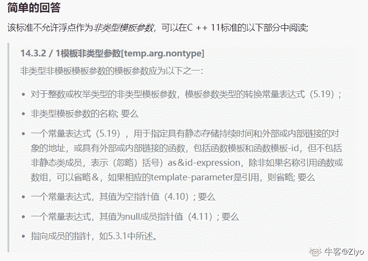
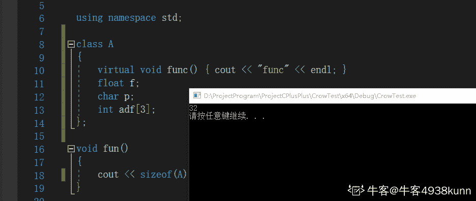
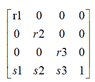
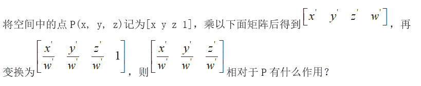
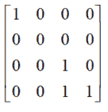

# 搜狐畅游 2019 校招笔试题 3D 引擎开发工程师 计算机视觉方向（补录）

## 1

下面（）不是金庸撰写的小说？

正确答案: D   你的答案: 空 (错误)

```cpp
天龙八部
```

```cpp
鹿鼎记
```

```cpp
侠客行
```

```cpp
天涯明月刀
```

本题知识点

Java 工程师 C++工程师 搜狐畅游 运营 测试工程师 游戏工程师 算法工程师 职能 设计 运维工程师 游戏研发工程师 2019 市场 游戏运营 数据库工程师 数据分析师 数据挖掘工程师 人力资源 网络工程师 系统工程师 商务

讨论

[某牛客](https://www.nowcoder.com/profile/662599873)

飞雪连天射白鹿，笑书神侠倚碧鸳。

《飞狐外传》《雪山飞狐》《连城诀》《天龙八部》《射雕英雄传》《白马啸西风》《鹿鼎记》

《笑傲江湖》《书剑恩仇录》《神雕侠侣》《侠客传》《倚天屠龙记》《碧血剑》《鸳鸯刀》

发表于 2019-10-04 19:27:19

* * *

[编译小伙](https://www.nowcoder.com/profile/198006840)

飞雪连天射白鹿,笑书神侠倚碧鸳

发表于 2019-07-18 17:29:28

* * *

[gogogogood](https://www.nowcoder.com/profile/687235273)

还以为做的是阿里的题。。。。。

发表于 2019-12-07 17:43:50

* * *

## 2

以下哪款游戏不在战网平台上？（）

正确答案: C   你的答案: 空 (错误)

```cpp
暗黑破坏神 3
```

```cpp
魔兽争霸
```

```cpp
绝地求生
```

```cpp
炉石传说
```

本题知识点

Java 工程师 C++工程师 搜狐畅游 运营 测试工程师 游戏工程师 算法工程师 职能 设计 运维工程师 游戏研发工程师 2019 市场 游戏运营 数据库工程师 数据分析师 数据挖掘工程师 人力资源 网络工程师 系统工程师 商务

讨论

[️201908260942940](https://www.nowcoder.com/profile/385624213)

暴雪游戏：魔兽星际炉石守望风暴暗黑破坏神

发表于 2019-09-19 20:17:34

* * *

## 3

以下属于 ARPG 类型的游戏是？

正确答案: A   你的答案: 空 (错误)

```cpp
DNF
```

```cpp
海岛奇兵
```

```cpp
王者荣耀
```

```cpp
皇室战争
```

本题知识点

Java 工程师 C++工程师 搜狐畅游 运营 测试工程师 游戏工程师 算法工程师 职能 设计 运维工程师 游戏研发工程师 2019 市场 游戏运营 数据库工程师 数据分析师 数据挖掘工程师 网络工程师 系统工程师 商务

讨论

[Lan201906241108183](https://www.nowcoder.com/profile/935885380)

ARPG（Action Role Playing Game）

发表于 2019-06-27 15:56:27

* * *

[q 嘟嘟鸠 y](https://www.nowcoder.com/profile/619431102)

王者荣耀不是 moba 吗

发表于 2019-09-17 11:46:04

* * *

[知道火舞💃](https://www.nowcoder.com/profile/95605969)

海盗骑兵是策略类游戏，super cell 旗下的，super cell 更广为人知的游戏是皇室战争。海岛奇兵也是一款策略类游戏

发表于 2019-08-01 00:53:48

* * *

## 4

RPG 类游戏中又可分为 RPSG，SRPG，ARPG。其中 SRPG 是指？

正确答案: B   你的答案: 空 (错误)

```cpp
角色扮演模拟游戏
```

```cpp
策略角色扮演游戏
```

```cpp
动作角色扮演游戏
```

```cpp
多人在线角色扮演游戏
```

本题知识点

Java 工程师 C++工程师 搜狐畅游 运营 测试工程师 游戏工程师 算法工程师 职能 设计 运维工程师 游戏研发工程师 2019 市场 游戏运营 数据库工程师 数据分析师 数据挖掘工程师 网络工程师 系统工程师 商务

讨论

[夜跑小精灵](https://www.nowcoder.com/profile/287714414)

RPG：Role Playing Game 角色扮演游戏 RPSG：Role Playing Simulation Game 角色扮演模拟游戏 SRPG：Strategy Role Playing Game 策略角色扮演游戏 ARPG：Action Role Playing Game 动作角色扮演游戏

发表于 2019-08-07 19:36:02

* * *

## 5

RTS 是以下哪一类游戏的简称？（）

正确答案: D   你的答案: 空 (错误)

```cpp
策略类游戏
```

```cpp
射击类游戏
```

```cpp
角色扮演类游戏
```

```cpp
即时战略游戏
```

本题知识点

Java 工程师 C++工程师 搜狐畅游 运营 测试工程师 游戏工程师 算法工程师 职能 设计 运维工程师 游戏研发工程师 2019 市场 游戏运营 数据库工程师 数据分析师 数据挖掘工程师 人力资源 网络工程师 系统工程师 商务

讨论

[***1123](https://www.nowcoder.com/profile/8563322)

| 简称 | 全称 | 中文名 |
| RTS | Real-Time Strategy Game  | 即时战略游戏 |
| RPG | Role-playing game  | 角色扮演类游戏 |
| STG | Shooter game  | 射击类游戏 |
| SLG | Simulation Game  | 策略模拟类游戏 |

发表于 2019-09-03 16:05:54

* * *

[WendyWen](https://www.nowcoder.com/profile/215326914)

RPG=Role-playing Game：角色扮演游戏
ACT=Action Game：动作游戏

AVG=Adventure Game：冒险游戏
SLG=Simulation Game：策略游戏
RTS=Real-Time Strategy Game：即时战略游戏
FTG=Fighting Game：格斗游戏
STG= Shooting Game：射击类游戏
FPS=First Personal Shooting Game：第一人称视角射击游戏
PZL=Puzzle Game：益智类游戏
RCG=Racing Game：竞速游戏[也有称作为 RAC 的]

发表于 2020-09-22 16:58:05

* * *

[Lan201906241108183](https://www.nowcoder.com/profile/935885380)

即时战略游戏（Real-Time Strategy Game

发表于 2019-06-27 15:58:12

* * *

## 6

MMORPG 较于 RPG 的区别，你认为最正确的答案是（）？

正确答案: C   你的答案: 空 (错误)

```cpp
MMORPG 是可以扮演多个角色
```

```cpp
MMORPG 有非常大的地图
```

```cpp
MMORPG 是大型多人在线
```

```cpp
MMORPG 是可以飞行
```

本题知识点

Java 工程师 C++工程师 搜狐畅游 运营 测试工程师 游戏工程师 算法工程师 职能 设计 运维工程师 游戏研发工程师 2019 市场 游戏运营 数据库工程师 数据分析师 数据挖掘工程师 人力资源 网络工程师 系统工程师 商务

讨论

[安吉尼尔](https://www.nowcoder.com/profile/794002793)

MMORPG (massive multiplayer online role playing game)

发表于 2019-07-27 22:06:06

* * *

[我一定会有 offer！！](https://www.nowcoder.com/profile/407494708)

MMORPG"大型多人在线角色扮演游戏

发表于 2020-02-24 22:59:40

* * *

## 7

游戏行业中经常提到渠道一词，以下哪家公司没有自主渠道？

正确答案: C   你的答案: 空 (错误)

```cpp
腾讯
```

```cpp
网易
```

```cpp
完美世界
```

```cpp
360
```

本题知识点

Java 工程师 C++工程师 搜狐畅游 运营 测试工程师 游戏工程师 算法工程师 职能 设计 运维工程师 游戏研发工程师 2019 市场 游戏运营 数据库工程师 数据分析师 数据挖掘工程师 网络工程师 系统工程师 商务

讨论

[知道火舞💃](https://www.nowcoder.com/profile/95605969)

腾讯家的渠道：微信，QQ 网易家的渠道：网易通行证，网易大神 360 家的渠道？？？我也一脸懵逼，我猜想是浏览器？？之类的完美世界的布局比较狭窄

发表于 2019-08-01 00:56:26

* * *

[***1123](https://www.nowcoder.com/profile/8563322)

360 公司自己就有游戏中心。

发表于 2019-09-03 16:07:18

* * *

[牛客 8889999999999 号](https://www.nowcoder.com/profile/636590305)

完美对战平台让你吃了？完美世界电竞让你吃了？

发表于 2021-09-14 20:29:12

* * *

## 8

以下哪个不是数值策划的工作内容？

正确答案: D   你的答案: 空 (错误)

```cpp
战斗系统搭建
```

```cpp
资源循环系统搭建
```

```cpp
技能系统搭建
```

```cpp
副本设计
```

本题知识点

Java 工程师 C++工程师 搜狐畅游 运营 测试工程师 游戏工程师 算法工程师 职能 设计 运维工程师 游戏研发工程师 2019 市场 游戏运营 数据库工程师 数据分析师 数据挖掘工程师 网络工程师 系统工程师 商务

讨论

[知道火舞💃](https://www.nowcoder.com/profile/95605969)

可怜的数值策划主要是设计英雄的攻击范围，判定，技能伤害等等的数值。还包括生存系统里面各个资源的价值和数量。举个例子，一个生存类游戏，我们假设这是《明日之后》，砍树卖掉木材多少钱（价值），砍一棵树收集多少木材（数量），都是数值策划的锅。而副本，是文学策划/玩法策划的事。除了这三类之外，还有可爱的系统策划。系统策划就是做，比如说，好友系统，战队系统，社会框架等等

发表于 2019-08-01 01:01:02

* * *

## 9

以下哪个最不可能是新手阶段导致用户大量流失的原因？（）

正确答案: C   你的答案: 空 (错误)

```cpp
美术画风
```

```cpp
新手任务无趣
```

```cpp
游戏职业不平衡
```

```cpp
缺乏基础的引导
```

本题知识点

Java 工程师 C++工程师 搜狐畅游 运营 测试工程师 游戏工程师 算法工程师 职能 设计 运维工程师 游戏研发工程师 2019 市场 游戏运营 数据库工程师 数据分析师 数据挖掘工程师 人力资源 网络工程师 系统工程师 商务

讨论

[のKiss](https://www.nowcoder.com/profile/907348814)

职业不平衡，在游戏初期是不会特别明显的，就算常规游戏，远程比近程前期练级刷怪可能会好一些，但是大多的副本还是需要多人合作才行，各有利弊。而别的方面，比如游戏画面，一进游戏，画面花里胡哨，马赛克还多，玩家就会受不了，建模还差的话，可能进游戏待不了 5 分钟就有卸载的冲动；对于一些较为难上手的游戏，没有很简单的基础操作指引，会让玩家一头雾水，老半天不知道怎么进行接下来的操作，实力劝退；再有就是新手任务，从头到尾只是点点点，极其无聊的任务模式，也是很容易劝退玩家的一种。（一名差不多 20 年游戏经验的学生飘过~）

发表于 2019-09-25 15:39:08

* * *

[牛客 177694650 号](https://www.nowcoder.com/profile/177694650)

要判断一个游戏的职业是否平衡，一定是有先决条件的。那就是我玩过或者至少了解过这个游戏的绝大多数职业。 一个新手玩家只会接触 1-2 个职业。 他可能刚刚看完职业介绍，了解了基本的分类。还在新手村里找 NPC 此时，他还没有和别的职业 pk 或 组队过，没有交互，没有比较。 这时他是不可能判断出职业是否平衡的

发表于 2020-09-01 21:00:59

* * *

[Rago](https://www.nowcoder.com/profile/8991699)

美术画风不应该是不喜欢就根本不会玩吗哪里会等到玩了两天觉得不好看就不玩了

发表于 2020-02-28 18:17:25

* * *

## 10

游戏行业中的“流水”是指

正确答案: A   你的答案: 空 (错误)

```cpp
玩家充值总金额
```

```cpp
游戏发行商收入
```

```cpp
游戏研发商收入
```

```cpp
渠道商收入
```

本题知识点

Java 工程师 C++工程师 搜狐畅游 运营 测试工程师 游戏工程师 算法工程师 职能 设计 运维工程师 游戏研发工程师 2019 市场 游戏运营 数据库工程师 数据分析师 数据挖掘工程师 网络工程师 系统工程师 商务 游戏策划 2021 PHP 工程师 golang 工程师 前端工程师 安卓工程师 iOS 工程师 大数据开发工程师 安全工程师 测试开发工程师

讨论

[好好学习好好做人](https://www.nowcoder.com/profile/854180677)

流水：充值金额实收：利润

发表于 2021-08-12 01:24:26

* * *

[terrencexy](https://www.nowcoder.com/profile/197324993)

流水就是营业额，不是利润

发表于 2020-03-15 11:20:55

* * *

[牛客 30605549 号](https://www.nowcoder.com/profile/30605549)

猜的，流水肯定是钱。

发表于 2019-12-30 22:16:47

* * *

## 11

在单链表指针为 p 的结点之后插入指针为 s 的结点,正确的操作是：

正确答案: C   你的答案: 空 (错误)

```cpp
s->next = s->next; p->next = s;
```

```cpp
p->next = s; s->next = p->next;
```

```cpp
s->next = p->next; p->next = s;
```

```cpp
p->next = s; p->next = s->next;
```

本题知识点

Java 工程师 C++工程师 搜狐畅游 算法工程师 游戏研发工程师 2019 牛客

讨论

[大家向前冲鸭](https://www.nowcoder.com/profile/870869805)

把 p 的后继节点变成 S 的后继节点

发表于 2020-09-26 11:41:18

* * *

[小不点的锚](https://www.nowcoder.com/profile/395630905)

这题目做错也太对不起数据结构老师了吧，单链表必讲重点噻

发表于 2020-09-21 23:47:42

* * *

## 12

假设 sizeof(void *)为 4，sizeof(char)为 1，那么对于 char str[sizeof("ab")]，sizeof(str)的值是（）

正确答案: B   你的答案: 空 (错误)

```cpp
2
```

```cpp
3
```

```cpp
4
```

```cpp
代码无法编译
```

本题知识点

C++工程师 搜狐畅游 2019 C 语言

讨论

[牛客 161424428 号](https://www.nowcoder.com/profile/161424428)

“ab”字符串尾部有字符串结束符'\0'

发表于 2020-08-08 08:53:12

* * *

[嘉俊 halos](https://www.nowcoder.com/profile/725424756)

sizeof 计算的是数据结构的大小，以字节计算。 str 是数组的首地址，大小是 4，和指针类型大小一样。但这并不意味着 sizeof(str)的值为 4。因为 sizeof 是计算数据结构的大小，数组就是一种数据结构，因此它计算的是整个数组的大小。 此外，对于" "，编译器都会自动在后面添一个/0，占据一个字节。

发表于 2021-01-05 12:00:09

* * *

[准备开摆](https://www.nowcoder.com/profile/321150402)

当使用 sizeof 运算符时，字符串常量被看作字符串本身，而不是指向字符串起始位置的地址

发表于 2021-03-14 10:24:53

* * *

## 13

下面哪一项不能作为模板参数：

正确答案: B   你的答案: 空 (错误)

```cpp
整型常量
```

```cpp
浮点常量
```

```cpp
函数指针
```

```cpp
指向类成员的指针
```

本题知识点

Java 工程师 C++工程师 搜狐畅游 算法工程师 游戏研发工程师 2019

讨论

[Ziyo](https://www.nowcoder.com/profile/279850)

来自：[`www.imooc.com/wenda/detail/578774`](http://www.imooc.com/wenda/detail/578774)当前标准不允许浮点作为非类型模板参数



编辑于 2019-11-07 20:01:26

* * *

## 14

下面代码 cout 的输出结果是：#include using namespace std;class A{virtual void func(){ cout<< “func”<< endl;}float f; char p; int adf[3];};int main(){cout << sizeof(A);return 0;}

正确答案: D   你的答案: 空 (错误)

```cpp
8
```

```cpp
17
```

```cpp
20
```

```cpp
24
```

本题知识点

Java 工程师 C++工程师 搜狐畅游 算法工程师 游戏研发工程师 2019 C++

讨论

[土豆加点泥](https://www.nowcoder.com/profile/565653994)

虚函数 4  float 4  char  （1 + 3 ）字节对齐数组 4*3 一共 24  自己的理解，错误的话请大佬指正

发表于 2020-08-08 10:10:08

* * *

[浩坤](https://www.nowcoder.com/profile/707077389)

问一下，这是计算 class 大小是吗，和计算 struct 一样是么

发表于 2021-04-14 19:08:49

* * *

[牛客 4938kunn](https://www.nowcoder.com/profile/820995325)

也没指名多少位的计算机

编辑于 2021-03-24 19:31:37

* * *

## 15

已知三角形 ABC 三个顶点，则向量 AB 叉乘 AC 的几何意义是：

正确答案: D   你的答案: 空 (错误)

```cpp
‖AB x AC‖是三角形 ABC 的周长
```

```cpp
‖AB x AC‖是三角形 ABC 周长的 2 倍
```

```cpp
‖AB x AC‖是三角形 ABC 的面积
```

```cpp
‖AB x AC‖是三角形 ABC 面积的 2 倍
```

本题知识点

Java 工程师 C++工程师 搜狐畅游 算法工程师 游戏研发工程师 2019

讨论

[小不点的锚](https://www.nowcoder.com/profile/395630905)

高中向量基础，向量叉积几何意义

发表于 2020-09-21 23:57:40

* * *

## 16

下面矩阵包含的几何变换：

正确答案: B   你的答案: 空 (错误)

```cpp
包含旋转和缩放
```

```cpp
包含缩放和位移
```

```cpp
包含旋转和错切
```

```cpp
只包含旋转
```

本题知识点

Java 工程师 C++工程师 搜狐畅游 算法工程师 游戏研发工程师 2019

讨论

[小不点的锚](https://www.nowcoder.com/profile/395630905)

线性变换矩阵，计算机图形学基础

发表于 2020-09-21 23:58:20

* * *

## 17



正确答案: D   你的答案: 空 (错误)

```cpp
将 P 透视投影在 xz 平面上
```

```cpp
将 P 正交投影在 xy 平面上
```

```cpp
将 P 透视投影在 xz 平面上，并向 z 轴平移 1 个单位
```

```cpp
将 P 正交投影在 xz 平面上，并向 z 轴平移 1 个单位
```

本题知识点

Java 工程师 C++工程师 搜狐畅游 算法工程师 游戏研发工程师 2019

讨论

[小不点的锚](https://www.nowcoder.com/profile/395630905)

3D 坐标变换矩阵，计算机图形学和矩阵基础

发表于 2020-09-21 23:59:21

* * *

## 18

要把屏幕上一张图片逆时针旋转（x 轴和 y 轴正方向分别为右和上），以下哪个矩阵可以满足要求：

正确答案: A   你的答案: 空 (错误)

本题知识点

Java 工程师 C++工程师 搜狐畅游 算法工程师 游戏研发工程师 2019

## 19

计算物体到视点坐标系变换时需要的参数：

正确答案: B   你的答案: 空 (错误)

```cpp
摄像机的 FOV，摄像机的近平面，摄像机的远平面
```

```cpp
视点位置，视目标位置，摄像机的 Up 向量
```

```cpp
视目标位置，摄像机的近平面，摄像机的远平面
```

```cpp
视点位置，摄像机的 FOV，摄像机的 Up 向量
```

本题知识点

Java 工程师 C++工程师 搜狐畅游 算法工程师 游戏研发工程师 2019

讨论

[末夜の十字♪](https://www.nowcoder.com/profile/861637875)

一般构造 view 矩阵的 lookUp 函数参数就是 position、target、worldUp 构造方法是根据三个参数算出相机朝向 look、侧向量 right、头朝向 up

```cpp
void Camera::LookAt(FXMVECTOR pos, FXMVECTOR target, FXMVECTOR worldUp)
{
        //target - pos
	XMVECTOR L = XMVector3Normalize(XMVectorSubtract(target, pos));
        //cross(worldUp, Look)
	XMVECTOR R = XMVector3Normalize(XMVector3Cross(worldUp, L));
       //cross(Look, Right)
        XMVECTOR U = XMVector3Cross(L, R);
        //暂存
	XMStoreFloat3(&mPosition, pos);
	XMStoreFloat3(&mLook, L);
	XMStoreFloat3(&mRight, R);
	XMStoreFloat3(&mUp, U);

	mViewDirty = true;
}
```

然后构造 view 矩阵，其实可以看做另类的 Transition 和 Rotaion 矩阵：

```cpp
void Camera::UpdateViewMatrix()
{
	if(mViewDirty)
	{
                //取出来
		XMVECTOR R = XMLoadFloat3(&mRight);
		XMVECTOR U = XMLoadFloat3(&mUp);
		XMVECTOR L = XMLoadFloat3(&mLook);
		XMVECTOR P = XMLoadFloat3(&mPosition);

		// Keep camera's axes orthogonal to each other and of unit length.
		L = XMVector3Normalize(L);
		U = XMVector3Normalize(XMVector3Cross(L, R));

		// U, L already ortho-normal, so no need to normalize cross product.
		R = XMVector3Cross(U, L);

		// Fill in the view matrix entries.
		float x = -XMVectorGetX(XMVector3Dot(P, R));
		float y = -XMVectorGetX(XMVector3Dot(P, U));
		float z = -XMVectorGetX(XMVector3Dot(P, L));

		XMStoreFloat3(&mRight, R);
		XMStoreFloat3(&mUp, U);
		XMStoreFloat3(&mLook, L);

		mView(0, 0) = mRight.x;
		mView(1, 0) = mRight.y;
		mView(2, 0) = mRight.z;
		mView(3, 0) = x;

		mView(0, 1) = mUp.x;
		mView(1, 1) = mUp.y;
		mView(2, 1) = mUp.z;
		mView(3, 1) = y;

		mView(0, 2) = mLook.x;
		mView(1, 2) = mLook.y;
		mView(2, 2) = mLook.z;
		mView(3, 2) = z;

		mView(0, 3) = 0.0f;
		mView(1, 3) = 0.0f;
		mView(2, 3) = 0.0f;
		mView(3, 3) = 1.0f;

		mViewDirty = false;
	}
}
```

发表于 2020-03-31 08:07:37

* * *

## 20

以下关于透视投影说法错误的是：

正确答案: D   你的答案: 空 (错误)

```cpp
相机 fov 越大，物体经过透视变换后显得越小
```

```cpp
求透视矩阵需要用到视锥体近裁剪面的 z 值
```

```cpp
求透视矩阵需要用到视锥体远裁剪面的 z 值
```

```cpp
场景经过透视变换后，深度图中的 z 值是线性的
```

本题知识点

Java 工程师 C++工程师 搜狐畅游 算法工程师 游戏研发工程师 2019

## 21

以下颜色的表示方法中，哪个选项的两种表示方法是线性相关的？

正确答案: A   你的答案: 空 (错误)

```cpp
RGB 与 YUV
```

```cpp
RGB 与 HSV
```

```cpp
RGB 与 Lab
```

```cpp
RGB 与 LUV
```

本题知识点

Java 工程师 C++工程师 搜狐畅游 算法工程师 游戏研发工程师 2019

## 22

下列哪项不属于 Canny edge detector 的实现步骤

正确答案: D   你的答案: 空 (错误)

```cpp
使用高斯倒数过滤图像 I: IGx and IGy
```

```cpp
求图像梯度的幅度和方向
```

```cpp
在图像中找出梯度幅度高于阈值的位置
```

```cpp
对图像使用中值滤波器
```

本题知识点

Java 工程师 C++工程师 搜狐畅游 算法工程师 游戏研发工程师 2019

## 23

在 2D 仿射模型中有多少个参数（或自由度）

正确答案: C   你的答案: 空 (错误)

```cpp
2
```

```cpp
4
```

```cpp
6
```

```cpp
8
```

本题知识点

Java 工程师 C++工程师 搜狐畅游 算法工程师 游戏研发工程师 2019

## 24

以下选项中哪一项的说法是错误的

正确答案: A   你的答案: 空 (错误)

```cpp
高斯滤波器（Gaussian filter）会造成被称为 ringing 的图像失真
```

```cpp
方框滤波器（Box filter）会造成被称为 ringing 的图像失真
```

```cpp
高斯滤波器（Gaussian filter）的导数可以被用于边缘检测
```

```cpp
高斯金字塔（Gaussian pyramid）可以被用于 SIFT
```

本题知识点

Java 工程师 C++工程师 搜狐畅游 算法工程师 游戏研发工程师 2019

## 25

以下选项为深度学习中训练集和测试集的划分比例，其中哪一项不属于常用比例

正确答案: C   你的答案: 空 (错误)

```cpp
66.7%和 33.3%
```

```cpp
75%和 25%
```

```cpp
80%和 20%
```

```cpp
90%和 10%
```

本题知识点

Java 工程师 C++工程师 搜狐畅游 算法工程师 游戏研发工程师 2019

讨论

[零葬](https://www.nowcoder.com/profile/75718849)

这个题挺诡异的，我觉得这些比例都可以用

发表于 2020-11-08 17:15:59

* * *

## 26

以下选项中哪一项的说法是正确的

正确答案: C   你的答案: 空 (错误)

```cpp
测试集也可以被用于训练模型
```

```cpp
训练集和测试集可以有部分数据重叠
```

```cpp
不能用测试集调整超参
```

```cpp
验证集一般占训练集的 30%-40%
```

本题知识点

Java 工程师 C++工程师 搜狐畅游 算法工程师 游戏研发工程师 2019

## 27

以下选项中哪一项的说法是错误的

正确答案: D   你的答案: 空 (错误)

```cpp
k-NN 算法经常使用的距离函数是欧几里得距离（Euclidean distance）和曼哈顿距离（Manhattan/city block）
```

```cpp
k-NN 算法可以使用任何的距离函数
```

```cpp
k-NN 算法如果出现平局现象将会随机选择类别标签
```

```cpp
k-NN 算法的超参数有一个，即 k 值
```

本题知识点

Java 工程师 C++工程师 搜狐畅游 算法工程师 游戏研发工程师 2019

讨论

[零葬](https://www.nowcoder.com/profile/75718849)

还有 weight 参数和距离计算方式

编辑于 2020-11-09 16:43:38

* * *

## 28

当训练出的图片分类模型无法正确进行图片分类时，最有可能的原因是

正确答案: D   你的答案: 空 (错误)

```cpp
数据集中数据的数量不够
```

```cpp
算法错误
```

```cpp
用于训练的设备硬件性能不足
```

```cpp
数据集中数据涵盖的内容不全面，变化较少
```

本题知识点

Java 工程师 C++工程师 搜狐畅游 算法工程师 游戏研发工程师 2019

## 29

为节省神经网络模型的训练时间，神经网络模型的权重和偏移参数一般初始化为

正确答案: D   你的答案: 空 (错误)

```cpp
0
```

```cpp
0.5
```

```cpp
1
```

```cpp
随机值
```

本题知识点

Java 工程师 C++工程师 搜狐畅游 算法工程师 游戏研发工程师 2019

## 30

神经网络模型是受人脑的结构启发发明的。神经网络模型由很多的神经元组成，每个神经元都接受输入，进行计算并输出结果，那么以下选项描述正确的是

正确答案: D   你的答案: 空 (错误)

```cpp
每个神经元只有一个单一的输入和单一的输出
```

```cpp
每个神经元有多个输入而只有一个单一的输出
```

```cpp
每个神经元只有一个单一的输入而有多个输出
```

```cpp
每个神经元有多个输入和多个输出
```

```cpp
以上选项均正确
```

本题知识点

Java 工程师 C++工程师 搜狐畅游 算法工程师 游戏研发工程师 2019

## 31

根据以下资料，回答如下 5 道题目：

截至 2017 年 4 月 30 日 22 时，沪深两市已有 534 家上市公司第一季度财报。这 534 家公司实现营业总收入 4572.78 亿元，同比增长 30.74%；实现净利润 336.7 亿元，同比增长 30.52%。不过，一季度销售收入和净利润环比则有所下降，其中营业总收入环比下降 12%，净利润环比下降 25%。这 534 家公司 2017 年一季度存货 6167.68 亿元，较上年年末增长 10%。
已公布一季报的创业板公司有 71 家，实现营业收入 80.08 亿元，同比增长 73.60%；实现净利润 13.16 亿元，同比增长 80%。已公布一季报的中小企业板公司有 202 家，实现营业收入 789.97 亿元，同比增长 36%；实现净利润 73.25 亿元，同比增长 25%。
25 家已公布一季报的房地产公司一季度实现营业收入 193.68 亿元，同比增长 9%；实现净利润 29.97 亿元，同比增长 31%；存货 2892.18 亿元，同比增长 10%。
已公布一季报的 6 家钢铁板块公司一季度存货为 322 亿元，实现营业收入 493.39 亿元，同比略有降低，环比下降 20%；实现净利润 12.65 亿元，同比增长 62%，环比表现更好，这 6 家公司 2016 年四季度净亏损 3.77 亿元。
建筑机械类公司持续了之前的景气度，有 4 家公司公布一季报，实现营业总收入 15.90 亿元，同比增长 39%；实现净利润 1.18 亿元，同比增长 47.5%。

已公布一季报的 534 家公司，平均每家在 2016 年第四季度实现营业收入约多少亿元？（　　）

正确答案: A   你的答案: 空 (错误)

```cpp
9.73
```

```cpp
8.56
```

```cpp
7.54
```

```cpp
0.63
```

本题知识点

运营 搜狐畅游 Java 工程师 算法工程师 C++工程师 设计 游戏研发工程师 2019 市场 游戏运营 数据分析师 数据挖掘工程师 网络工程师

讨论

[安吉尼尔](https://www.nowcoder.com/profile/794002793)

「同比」 与历史「同时期］比较，例如 2011 年 3 月份与 2010 年 3 月份相比，叫「同比」。 「环比」 与「上一个」统计周期比较，例如 2011 年 4 月份与 2011 年 3 月份相比较，称为「环比」。

发表于 2019-07-27 22:25:59

* * *

[Shimmer 清朔](https://www.nowcoder.com/profile/55510509)

环注意环比 4572.78/(1-12％)＝5196.34 5196.34/534＝9.73

发表于 2019-09-25 16:33:44

* * *

## 32

根据以下资料，回答如下 5 道题目：

截至 2017 年 4 月 30 日 22 时，沪深两市已有 534 家上市公司第一季度财报。这 534 家公司实现营业总收入 4572.78 亿元，同比增长 30.74%；实现净利润 336.7 亿元，同比增长 30.52%。不过，一季度销售收入和净利润环比则有所下降，其中营业总收入环比下降 12%，净利润环比下降 25%。这 534 家公司 2017 年一季度存货 6167.68 亿元，较上年年末增长 10%。
已公布一季报的创业板公司有 71 家，实现营业收入 80.08 亿元，同比增长 73.60%；实现净利润 13.16 亿元，同比增长 80%。已公布一季报的中小企业板公司有 202 家，实现营业收入 789.97 亿元，同比增长 36%；实现净利润 73.25 亿元，同比增长 25%。
25 家已公布一季报的房地产公司一季度实现营业收入 193.68 亿元，同比增长 9%；实现净利润 29.97 亿元，同比增长 31%；存货 2892.18 亿元，同比增长 10%。
已公布一季报的 6 家钢铁板块公司一季度存货为 322 亿元，实现营业收入 493.39 亿元，同比略有降低，环比下降 20%；实现净利润 12.65 亿元，同比增长 62%，环比表现更好，这 6 家公司 2016 年四季度净亏损 3.77 亿元。
建筑机械类公司持续了之前的景气度，有 4 家公司公布一季报，实现营业总收入 15.90 亿元，同比增长 39%；实现净利润 1.18 亿元，同比增长 47.5%。

这 534 家公司中，平均每家中小企业板公司在 2017 年第一季度的净利润约是创业板公司的（　　）

正确答案: D   你的答案: 空 (错误)

```cpp
5 倍
```

```cpp
4 倍
```

```cpp
3 倍
```

```cpp
2 倍
```

本题知识点

运营 搜狐畅游 Java 工程师 算法工程师 C++工程师 设计 游戏研发工程师 2019 市场 游戏运营 数据分析师 数据挖掘工程师 网络工程师

讨论

[夜跑小精灵](https://www.nowcoder.com/profile/287714414)

平均每家中小企业版公司净利润是：73.25/202=0.36；创业板公司净利润是：13.16/71=0.18 所以是 2 倍题干太长，公司类型也多，密密麻麻的数字，就是要耐着性子把题目看看清楚，其实不难

发表于 2019-08-07 20:24:58

* * *

[Maxine 白夜行](https://www.nowcoder.com/profile/8813903)

净利润率还是净利润啊大哥写清楚好吗

发表于 2020-06-14 22:59:43

* * *

## 33

根据以下资料，回答如下 5 道题目：

截至 2017 年 4 月 30 日 22 时，沪深两市已有 534 家上市公司第一季度财报。这 534 家公司实现营业总收入 4572.78 亿元，同比增长 30.74%；实现净利润 336.7 亿元，同比增长 30.52%。不过，一季度销售收入和净利润环比则有所下降，其中营业总收入环比下降 12%，净利润环比下降 25%。这 534 家公司 2017 年一季度存货 6167.68 亿元，较上年年末增长 10%。
已公布一季报的创业板公司有 71 家，实现营业收入 80.08 亿元，同比增长 73.60%；实现净利润 13.16 亿元，同比增长 80%。已公布一季报的中小企业板公司有 202 家，实现营业收入 789.97 亿元，同比增长 36%；实现净利润 73.25 亿元，同比增长 25%。
25 家已公布一季报的房地产公司一季度实现营业收入 193.68 亿元，同比增长 9%；实现净利润 29.97 亿元，同比增长 31%；存货 2892.18 亿元，同比增长 10%。
已公布一季报的 6 家钢铁板块公司一季度存货为 322 亿元，实现营业收入 493.39 亿元，同比略有降低，环比下降 20%；实现净利润 12.65 亿元，同比增长 62%，环比表现更好，这 6 家公司 2016 年四季度净亏损 3.77 亿元。
建筑机械类公司持续了之前的景气度，有 4 家公司公布一季报，实现营业总收入 15.90 亿元，同比增长 39%；实现净利润 1.18 亿元，同比增长 47.5%。

已公布 2017 年一季报的房地产公司中，平均每家公司的存货比上年同期增长了约多少亿元？（　　）

正确答案: B   你的答案: 空 (错误)

```cpp
5
```

```cpp
11
```

```cpp
51
```

```cpp
105
```

本题知识点

运营 搜狐畅游 Java 工程师 算法工程师 C++工程师 设计 游戏研发工程师 2019 市场 游戏运营 数据分析师 数据挖掘工程师 网络工程师

讨论

[夜跑小精灵](https://www.nowcoder.com/profile/287714414)

同比增长 10%，设上年同期公司存货为 x,(2892.18-x)/x=0.1，解的 x 等于 2629.25，即同比增长额为（2892.18-2629.25）约等于 263，则 25 家平均增长了 263/25=10.52，选择 B

编辑于 2019-08-07 20:34:18

* * *

[贝壳风铃🐚🎐](https://www.nowcoder.com/profile/379333427)

2892.18/（1+10%）=262.93 262.93/25=10.52

发表于 2019-10-19 15:25:46

* * *

## 34

根据以下资料，回答如下 5 道题目：

截至 2017 年 4 月 30 日 22 时，沪深两市已有 534 家上市公司第一季度财报。这 534 家公司实现营业总收入 4572.78 亿元，同比增长 30.74%；实现净利润 336.7 亿元，同比增长 30.52%。不过，一季度销售收入和净利润环比则有所下降，其中营业总收入环比下降 12%，净利润环比下降 25%。这 534 家公司 2017 年一季度存货 6167.68 亿元，较上年年末增长 10%。
已公布一季报的创业板公司有 71 家，实现营业收入 80.08 亿元，同比增长 73.60%；实现净利润 13.16 亿元，同比增长 80%。已公布一季报的中小企业板公司有 202 家，实现营业收入 789.97 亿元，同比增长 36%；实现净利润 73.25 亿元，同比增长 25%。
25 家已公布一季报的房地产公司一季度实现营业收入 193.68 亿元，同比增长 9%；实现净利润 29.97 亿元，同比增长 31%；存货 2892.18 亿元，同比增长 10%。
已公布一季报的 6 家钢铁板块公司一季度存货为 322 亿元，实现营业收入 493.39 亿元，同比略有降低，环比下降 20%；实现净利润 12.65 亿元，同比增长 62%，环比表现更好，这 6 家公司 2016 年四季度净亏损 3.77 亿元。
建筑机械类公司持续了之前的景气度，有 4 家公司公布一季报，实现营业总收入 15.90 亿元，同比增长 39%；实现净利润 1.18 亿元，同比增长 47.5%。

已经公布一季报的钢铁板块公司 2016 年第四季度的净利润（净利润比营业收入）约为（　　）

正确答案: D   你的答案: 空 (错误)

```cpp
2.57%
```

```cpp
1.80%
```

```cpp
-0.96%
```

```cpp
-0.61%
```

本题知识点

运营 搜狐畅游 Java 工程师 算法工程师 C++工程师 设计 游戏研发工程师 2019 市场 游戏运营 数据分析师 数据挖掘工程师 网络工程师

讨论

[夜跑小精灵](https://www.nowcoder.com/profile/287714414)

现已知 2016 年第 4 季度净利润为-3.77，需要知道 2016 年第 4 季度的营业利润，由 2017 年营业收入环比下降 20%可设第 4 季度营业收入为 x,有（x-493.39)/x=0.2，解的 x=616.7375 则第 4 季度净利润比营业收入就很简单啦：-3.77/616.7375=-0.61%

发表于 2019-08-07 20:41:23

* * *

## 35

根据以下资料，回答如下 5 道题目：

截至 2017 年 4 月 30 日 22 时，沪深两市已有 534 家上市公司第一季度财报。这 534 家公司实现营业总收入 4572.78 亿元，同比增长 30.74%；实现净利润 336.7 亿元，同比增长 30.52%。不过，一季度销售收入和净利润环比则有所下降，其中营业总收入环比下降 12%，净利润环比下降 25%。这 534 家公司 2017 年一季度存货 6167.68 亿元，较上年年末增长 10%。
已公布一季报的创业板公司有 71 家，实现营业收入 80.08 亿元，同比增长 73.60%；实现净利润 13.16 亿元，同比增长 80%。已公布一季报的中小企业板公司有 202 家，实现营业收入 789.97 亿元，同比增长 36%；实现净利润 73.25 亿元，同比增长 25%。
25 家已公布一季报的房地产公司一季度实现营业收入 193.68 亿元，同比增长 9%；实现净利润 29.97 亿元，同比增长 31%；存货 2892.18 亿元，同比增长 10%。
已公布一季报的 6 家钢铁板块公司一季度存货为 322 亿元，实现营业收入 493.39 亿元，同比略有降低，环比下降 20%；实现净利润 12.65 亿元，同比增长 62%，环比表现更好，这 6 家公司 2016 年四季度净亏损 3.77 亿元。
建筑机械类公司持续了之前的景气度，有 4 家公司公布一季报，实现营业总收入 15.90 亿元，同比增长 39%；实现净利润 1.18 亿元，同比增长 47.5%。

关于这 534 家公司在 2017 年第一季度营业状况的描述与资料相符的是（　　）

正确答案: B   你的答案: 空 (错误)

```cpp
所有公司净利润之和比 2016 年第四季度有所上升
```

```cpp
平均每家钢铁板块公司的存货高于 534 家公司的平均水平
```

```cpp
平均每家建筑机械类公司的营业收入高于 534 家公司的平均水平
```

```cpp
超过 1/4 的净利润来自中小企业板公司
```

本题知识点

运营 搜狐畅游 Java 工程师 算法工程师 C++工程师 设计 游戏研发工程师 2019 市场 游戏运营 数据分析师 数据挖掘工程师 网络工程师

讨论

[青瓜蛋子](https://www.nowcoder.com/profile/111098822)

322/6 > 6167.68/534

发表于 2019-08-25 16:09:54

* * *

## 36

已知三角形 ABC 三个顶点及空间中一点 P0 的坐标，判断 P0 是否在三角形内（在其中一条边上也算在内），用语言描述即可

你的答案

本题知识点

Java 工程师 C++工程师 搜狐畅游 算法工程师 游戏研发工程师 2019

## 37

请简述创建一个基于深度学习的图片分类器的主要步骤，以及其与传统的基于特征的机器学习图片分类器的主要区别。

你的答案

本题知识点

Java 工程师 C++工程师 搜狐畅游 算法工程师 游戏研发工程师 2019

## 38

列出 RANSAC 应用于带有外点（outliers）的直线拟合时的主要步骤

你的答案

本题知识点

Java 工程师 C++工程师 搜狐畅游 算法工程师 游戏研发工程师 2019