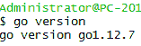
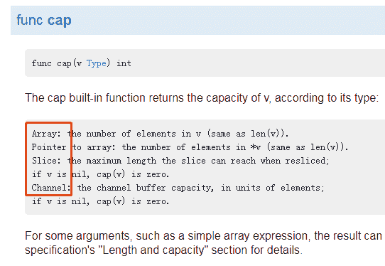
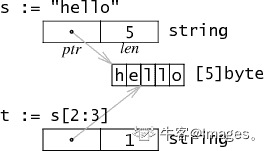
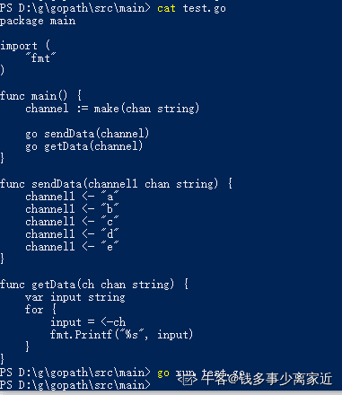
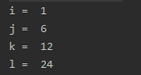

# 京东 2019 春招京东 Golang 开发类试卷

## 1

要交换变量 A 和 B 的值，应使用的语句组（）

正确答案: B   你的答案: 空 (错误)

```cpp
A=B;B=C;C=A
```

```cpp
C=A;A=B;B=C
```

```cpp
A=B;B=A
```

```cpp
C=A;B=A;B=C
```

本题知识点

京东 编程基础 *2019 C 语言* *讨论

[牛客 312614913 号](https://www.nowcoder.com/profile/312614913)

可以不使用额外空间：A=A+B;B=A-B;A=A-B

发表于 2019-12-20 22:12:20

* * *

[满山猴子我腚最红](https://www.nowcoder.com/profile/3707687)

难道不是 A,B=B,A？？？？？？？？？？？？？

发表于 2020-03-15 21:50:47

* * *

[牛客 706817886 号](https://www.nowcoder.com/profile/706817886)

基本的交换变量值的思路

发表于 2021-07-09 15:49:01

* * *

## 2

京东商城 plus 会员的消费记录金额分别为 900，512，613，700，810，若采用选择排序算法对其进行从小到大的排序，第三趟排序结果为：（）

正确答案: C   你的答案: 空 (错误)

```cpp
900，512，613，700，810
```

```cpp
512，900，613，700，810
```

```cpp
512，613，700，900，810
```

```cpp
512，613，700，810，900
```

本题知识点

运维工程师 京东 排序 *golang 工程师 2019* *讨论

[修~Nya](https://www.nowcoder.com/profile/484709890)

****选择排序**的工作原理是每一次从待排序的数据元素中选出最小（ 或最大）的一个元素，存放在序列的起始位置，在剩余的未排序的元素中继续重复上述操作，直至全部待排序的元素排完。所以本题的解题过程：**第一趟排序：512   900   613   700   810 第二趟排序：512   613   900   700   810  第三趟排序：512   613   700   900   810 

发表于 2019-08-10 21:57:10

* * *

## 3

下列叙述中，有关线性链表叙述正确的是（）

正确答案: D   你的答案: 空 (错误)

```cpp
线性链表中的表头元素一定存储在其他元素的前面
```

```cpp
线性链表中的各元素在存储空间中的位置不一定是连续的，但表头元素一定存储在其他元素的前面
```

```cpp
线性链表中的各元素在存储空间中的位置必须是连续的
```

```cpp
线性链表中的各元素在存储空间中的位置不一定是连续的，且各元素的存储顺序也是任意的
```

本题知识点

运维工程师 京东 链表 *golang 工程师 2019* *讨论

[edcson](https://www.nowcoder.com/profile/103515545)

d

发表于 2019-07-01 22:01:33

* * *

[nicksen](https://www.nowcoder.com/profile/684967197)

线性表包括顺序表和链表两类，顺序表中的元素要求存储空间必须是连续的

发表于 2020-05-16 15:52:18

* * *

[牛客 120201559 号](https://www.nowcoder.com/profile/120201559)

B 没毛病啊，D 中顺序存储时要求连续呀

发表于 2021-12-14 15:50:51

* * *

## 4

广义表即我们通常所说的列表（lists)。它放松了对表元素的原子性限制，允许他们有自身结构。那么广义表 E((a,(a,b),((a,b),c)))的长度和深度分别为：

正确答案: B   你的答案: 空 (错误)

```cpp
2 和 4
```

```cpp
1 和 4
```

```cpp
1 和 3
```

```cpp
2 和 3
```

本题知识点

运维工程师 京东 链表 *golang 工程师 2019* *讨论

[勿相弃§朝暮](https://www.nowcoder.com/profile/79193712)

长度：去掉一层括号剩下的是几部分。 
深度：去掉几层括号可以到最后一部分。比如： 例如 E((a,(a,b),((a,b),c)))的长度和深度分别为 1 和 4

发表于 2019-06-27 15:34:33

* * *

[孤单的跟鞋声和你的笑丶](https://www.nowcoder.com/profile/277595)

LS = （a1, a2, a3, a4......an）。 其中，LS 是广义表的表名，n 是广义表的长度。看清楚这个题目其实就长度为 1，只有 a1 没有别的了，深度就看括号层数🤣🤣🤣

发表于 2020-09-01 10:07:24

* * *

[🙏求论文🙏](https://www.nowcoder.com/profile/870079906)

长度：最外层包含元素的个数，即去掉最外层括号后含有的元素个数。深度：表中含有括号数最多的括号层数加一。head :返回列表的第一个元素，（不带括号）tail：返回列表删除第一个元素后剩余的列表（带括号）。

发表于 2019-07-05 10:47:57

* * *

## 5

关于 DNS 协议以下说法错误的是

正确答案: A D   你的答案: 空 (错误)

```cpp
使用 tcp 协议进行传输
```

```cpp
使用 udp 协议进行传输
```

```cpp
可以进行从域名到 ip 的解析
```

```cpp
可以根据 ip 查询其使用的域名
```

本题知识点

运维工程师 京东 网络基础 golang 工程师 2019

讨论

[Steffan_deu](https://www.nowcoder.com/profile/146994815)

DNS 进行区域传输的时候使用 tcp，而其他时候如域名解析的时候使用 udp 协议，客户端向 DNS 服务器查询域名，返回内容超过 512 个字节，用 udp 传输即可，不需要 tcp 三次握手.

发表于 2019-08-09 09:12:14

* * *

[坐火箭找工作](https://www.nowcoder.com/profile/355687052)

DNS 不是 TCP 和 UDP 协议都能使用吗

发表于 2020-06-06 11:25:18

* * *

[努力努力再努力+1](https://www.nowcoder.com/profile/9526154)

DNS 就是进行域名解析的服务器。在进行区域传输的时候使用 TCP 协议，其它时候则使用 UDP 协议；所以 A 和 B 是✅的啊。域名解析，就是根据域名解析 IP 的过程，输入域名，本地域名服务器会递归的向根域名服务器、顶级域名服务器、权限域名查询主机 IP。所以 D✅C❎

发表于 2019-07-31 11:54:00

* * *

## 6

数据链路层采用 CRC 进行校验，生成多项式 G(x)= x³ +1，待发送比特流为 10101010，则校验信息为

正确答案: A   你的答案: 空 (错误)

```cpp
101
```

```cpp
110
```

```cpp
100
```

```cpp
10
```

本题知识点

运维工程师 京东 网络基础 golang 工程师 2019

讨论

[求个 offer～～～](https://www.nowcoder.com/profile/9322291)

1. 将生成多项式转换成二进制序列    G(x) = x^(3 )+ 1 转换成二进制序列为:1001
2. 在原始数据后边补上 k - 1 个 0, k 为生成多项式二进制序列长度,此处 k = 3    原始数据后边补 3 个 0 得到:101010100003. 用新序列 10101010000 除以二项式生成序列:1001, 得到余数 101,
    因为余数 101 为 3 == k - 1 即为所求,  若余数长度小于 k-1,则在余数前补 0 凑够 k-1 位,作为校验信息

编辑于 2019-07-30 15:16:24

* * *

[CrysisX](https://www.nowcoder.com/profile/172694138)

CRC 校验码计算示例：

现假设选择的 CRC 生成多项式为 G（X） = X4 + X3 + 1，要求出二进制序列 10110011 的 CRC 校验码。下面是具体的计算过程：

①将多项式转化为二进制序列，由 G（X） = X4 + X3 + 1 可知二进制一种有五位，第 4 位、第三位和第零位分别为 1，则序列为 11001

②多项式的位数位 5，则在数据帧的后面加上 5-1 位 0，数据帧变为 101100110000，然后使用模 2 除法除以除数 11001，得到余数，**也就是所谓的校验信息**。


③将计算出来的 CRC 校验码添加在原始帧的后面，真正的数据帧为 101100110100，再把这个数据帧发送到接收端。

④接收端收到数据帧后，用上面选定的除数，用模 2 除法除去，验证余数是否为 0，如果为 0，则说明数据帧没有出错。

发表于 2020-03-07 15:55:39

* * *

[牛客 485280910 号](https://www.nowcoder.com/profile/485280910)

1.多项式与二进制的直接对应关系： 　　X 的最高次幂对应二进制的最高位数；以下各位对应多项式的各幂次，有幂次对应 1，无幂次对应 0；X 的最高次幂是 R，转换对应的二进制数 R+1 位；

发表于 2020-10-06 14:28:31

* * *

## 7

当在浏览器输入 http://www.jd.com 后，执行过程描述有误的是哪个？

正确答案: B   你的答案: 空 (错误)

```cpp
客户端浏览器通过 DNS 解析到 www.jd.com 的 ip 地址，通过 ip 地址找到客户端对应的服务器地址，客户端发起 HTTP 会话到 IP，通过 tcp 进行封装数据包，输入到网络层
```

```cpp
在客户端的网络层，把 http 会话请求分成报文段，添加源地址和目的地址
```

```cpp
客户端的网络层主要通过查找路由确定到达服务器
```

```cpp
数据包通过链路层发送到路由器，通过邻居协议查找给定 ip 地址的 mac 地址，然后发送 ARR 请求查找目的地址，得到回应就可以使用 ARR 的请求应答交换的 IP 数据包，发送 IP 数据包到达服务器地址
```

本题知识点

运维工程师 京东 网络基础 golang 工程师 2019

讨论

[我的天鸭](https://www.nowcoder.com/profile/243498)

B 选项错误在，**把 HTTP 会话请求分成报文段，添加源和目的端口**，这件事是在**传输层**完成的，比如服务器使用 80 端口监听客户端的请求，客户端由系统随机选择一个端口与服务器进行交换，服务器把相应的请求返回给客户端的对应端口。然后使用 IP 层的 IP 地址查找目的端。而客户端的网络层不用关心应用层或者传输层的东西，它会把源 IP 地址和目标 IP 地址包进 IP 头部，然后再通过查找路由表确定如何到达服务器，期间可能经过多个路由器，这些都是由路由器来完成的工作。

发表于 2019-07-30 14:18:43

* * *

[martinc](https://www.nowcoder.com/profile/725311800)

B 项，在客户端的传输层，把 http 会话请求分成报文段，添加源和目的端口。

发表于 2019-06-29 16:23:43

* * *

[牛客 659312993 号](https://www.nowcoder.com/profile/659312993)

B 网络层是加 ip 啊，传输层加端口。请问错哪里了？ D 应该去的是 next hop 的 mac 而不是目的 ip 的 mac

发表于 2021-09-06 11:00:07

* * *

## 8

数据库事务的特性不包含：

正确答案: B   你的答案: 空 (错误)

```cpp
原子性
```

```cpp
并发性
```

```cpp
一致性
```

```cpp
持久性
```

本题知识点

运维工程师 京东 数据库 golang 工程师 2019

讨论

[许愿邮储顺利签约](https://www.nowcoder.com/profile/256795571)

**数据库事务**（简称：**事务**）是[数据库管理系统](https://zh.wikipedia.org/wiki/%E6%95%B0%E6%8D%AE%E5%BA%93%E7%AE%A1%E7%90%86%E7%B3%BB%E7%BB%9F)执行过程中的一个逻辑单位，由一个有限的[数据库](https://zh.wikipedia.org/wiki/%E6%95%B0%E6%8D%AE%E5%BA%93)操作序列构成。数据库中事务的四大特性（ACID），并且将会详细地说明事务的隔离级别。

如果一个数据库声称支持事务的操作，那么该数据库必须要具备以下四个特性：

⑴ 原子性（Atomicity）

原子性是指事务包含的所有操作要么全部成功，要么全部失败回滚，因此事务的操作如果成功就必须要完全应用到数据库，如果操作失败则不能对数据库有任何影响。

⑵ 一致性（Consistency）

一致性是指事务必须使数据库从一个一致性状态变换到另一个一致性状态，也就是说一个事务执行之前和执行之后都必须处于一致性状态。

拿转账来说，假设用户 A 和用户 B 两者的钱加起来一共是 5000，那么不管 A 和 B 之间如何转账，转几次账，事务结束后两个用户的钱相加起来应该还得是 5000，这就是事务的一致性。

⑶ 隔离性（Isolation）

隔离性是当多个用户并发访问数据库时，比如操作同一张表时，数据库为每一个用户开启的事务，不能被其他事务的操作所干扰，多个并发事务之间要相互隔离。

即要达到这么一种效果：对于任意两个并发的事务 T1 和 T2，在事务 T1 看来，T2 要么在 T1 开始之前就已经结束，要么在 T1 结束之后才开始，这样每个事务都感觉不到有其他事务在并发地执行。

关于事务的隔离性数据库提供了多种隔离级别，稍后会介绍到。

⑷ 持久性（Durability）

持久性是指一个事务一旦被提交了，那么对数据库中的数据的改变就是永久性的，即便是在数据库系统遇到故障的情况下也不会丢失提交事务的操作。

例如我们在使用 JDBC 操作数据库时，在提交事务方法后，提示用户事务操作完成，当我们程序执行完成直到看到提示后，就可以认定事务以及正确提交，即使这时候数据库出现了问题，也必须要将我们的事务完全执行完成，否则就会造成我们看到提示事务处理完毕，但是数据库因为故障而没有执行事务的重大错误。

编辑于 2019-07-25 21:59:25

* * *

[天清色等烟雨](https://www.nowcoder.com/profile/181533771)

什么是并发性

发表于 2020-10-27 10:14:37

* * *

[niujy](https://www.nowcoder.com/profile/524068450)

快捷键

发表于 2019-06-25 11:49:13

* * *

## 9

索引是对数据库表中一个或多个列的值进行排序的数据结构，以协助快速查询、更新数据库表中数据。以下对索引的特点描述错误的是：

正确答案: C   你的答案: 空 (错误)

```cpp
加快数据的检索速度
```

```cpp
加速表和表之间的连接
```

```cpp
在使用分组和排序子句进行数据检索时，并不会减少查询中分组和排序的时间
```

```cpp
通过创建唯一性索引，可以保证数据库表中每一行数据的唯一性
```

本题知识点

运维工程师 京东 数据库 golang 工程师 2019

讨论

[谢正元](https://www.nowcoder.com/profile/249587647)

*   **大大加快数据的检索速度**，这也是创建索引的最主要的原因；
*   加速表和表之间的连接；
*   在使用分组和排序子句进行数据检索时，同样可以显著减少查询中分组和排序的时间；
*   通过创建唯一性索引，可以保证数据库表中每一行数据的唯一性；
*   故选 C

发表于 2019-06-26 09:04:57

* * *

[不是苏堤也皱眉](https://www.nowcoder.com/profile/226605763)

索引建立在一个表中的字段上   加速表与表之间的连接是什么意思????

发表于 2019-08-20 10:49:22

* * *

[丶 Berserker](https://www.nowcoder.com/profile/957501620)

答案：C
A：正确。MySQL 官方对索引的定义为：索引（index）是帮助 MySQL 高效获取数据的一种数据结构，本质是排好序的快速查找数据结构。B：正确。对 join 语句匹配关系（on）涉及的字段建立索引能够提高效率。**具体原因**参考[这篇文章](https://blog.csdn.net/qq_22996201/article/details/97950839?ops_request_misc=%257B%2522request%255Fid%2522%253A%2522164438102716780357286919%2522%252C%2522scm%2522%253A%252220140713.130102334..%2522%257D&request_id=164438102716780357286919&biz_id=0&utm_medium=distribute.pc_search_result.none-task-blog-2~all~sobaiduend~default-3-97950839.pc_search_insert_es_download&utm_term=join%E7%B4%A2%E5%BC%95%E4%BC%98%E5%8C%96&spm=1018.2226.3001.4187)，有机会再系统地学下底层原理。
C：错误。因为索引本身有序，order by 和 group by 都存在排序操作（只不过后者多了一个分组操作）， 所以都可以通过索引来进行优化。 D：正确。

发表于 2022-02-09 12:47:31

* * *

## 10

下列说法错误的是？

正确答案: C   你的答案: 空 (错误)

```cpp
HTTP 状态码中 500 表示服务器发生错误
```

```cpp
TCP 协议需要三次握手和四次挥手
```

```cpp
域名系统 DNS 采用的是有连接的 TCP 传输协议
```

本题知识点

运维工程师 京东 网络基础 golang 工程师 2019

讨论

[绿叶萌飞](https://www.nowcoder.com/profile/4942325)

DNS（端口 53）同时占用 UDP 和 TCP 是公认的，DNS 在进行区域传输或者响应报文超过 512 字节的时候使用 TCP 协议，其它时候则使用 UDP 协议。

发表于 2019-10-07 14:40:12

* * *

[ADE_](https://www.nowcoder.com/profile/153401914)

•  200：请求被正常处理•  204：请求被受理但没有资源可以返回•  206：客户端只是请求资源的一部分，服务器只对请求的部分资源执行 GET 方法，相应报文中通过 Content-Range 指定范围的资源。•  301：永久性重定向•  302：临时重定向•  303：与 302 状态码有相似功能，只是它希望客户端在请求一个 URI 的时候，能通过 GET 方法重定向到另一个 URI 上•  304：发送附带条件的请求时，条件不满足时返回，与重定向无关•  307：临时重定向，与 302 类似，只是强制要求使用 POST 方法•  400：请求报文语法有误，服务器无法识别•  401：请求需要认证•  403：请求的对应资源禁止被访问•  404：服务器无法找到对应资源•  500：服务器内部错误•  502：服务器作为网关或***，从上游服务器收到无效响应。•  503：服务器目前无法使用

编辑于 2019-09-23 23:27:20

* * *

[亚瑟贼强](https://www.nowcoder.com/profile/838826298)

DNS 使用传输层的 UDP 而非 TCP ,最主要是不需要发生错误时的自动重传功能，而且 UDP 采用面相无连接的协议，速度快。

发表于 2019-11-30 10:29:09

* * *

## 11

下面关于 go 说法正确的是（）

正确答案: A B D   你的答案: 空 (错误)

```cpp
当 select 下有多个可执行 case，会随机执行其中一个
```

```cpp
select 机制通常用来处理异步 IO 问题
```

```cpp
在 select 中执行 case 语句时，会自动 fall through
```

```cpp
select 中 case 的操作语句只能是 IO 操作
```

本题知识点

运维工程师 京东 golang 工程师 2019

讨论

[牛客 515560480 号](https://www.nowcoder.com/profile/515560480)

fallthrough：Go 里面 switch 默认相当于每个 case 最后带有 break，匹配成功后不会自动向下执行其他 case，而是跳出整个 switch, 但是可以使用 fallthrough 强制执行后面的 case 代码。

发表于 2020-06-07 21:41:49

* * *

[郭朝](https://www.nowcoder.com/profile/902680442)

不会执行 fallthrough

发表于 2020-04-11 08:14:03

* * *

## 12

关于 golang 内存相关的说法中正确的是（ ）

正确答案: C D   你的答案: 空 (错误)

```cpp
golang 有自动垃圾回收，当分配的内存使用完毕后，会接归还给系统
```

```cpp
通常使用 runtime/pprof 监控 web 服务器的状态
```

```cpp
pprof 允许列出 track 方法并显示每行负责的程度
```

```cpp
在浏览器中查看系统的实时内存，可以及时发现内存泄露
```

本题知识点

运维工程师 京东 golang 工程师 2019

讨论

[ShowMeTheCodee](https://www.nowcoder.com/profile/8407287)

A 选项：不一定。回收的内存**可以**返还给操作系统，或者它们可以被重用,或者它们可以用做栈内存。
[`colobu.com/2019/08/28/go-memory-leak-i-dont-think-so/`](https://colobu.com/2019/08/28/go-memory-leak-i-dont-think-so/)B 选项：通过 net/http/pprof 查看服务器状态，其内部封装了 runtime/pprof，并通过 HTTP 接口暴露出来。D 选项：内存使用量一直增长而不释放，就说明可能出现了内存泄露。

发表于 2020-02-27 22:29:55

* * *

## 13

关于 go switch 下面说法正确的是（ ）

正确答案: A C D   你的答案: 空 (错误)

```cpp
条件表达式不限制为常量或者整数
```

```cpp
单个 case 中，只能出现单个结果选项
```

```cpp
可以不设定 switch 之后的条件表达式
```

```cpp
只有在 case 中明确添加 fallthrough 关键字，才会继续执行紧跟的下一个 case
```

本题知识点

运维工程师 京东 golang 工程师 2019

讨论

[F-engY](https://www.nowcoder.com/profile/9853134)

1.  AC :
2.  var r int = 11
3.  switch {
4.  case r > 10 && r < 20:
5.  fmt.Println(r)
6.  }
7.  B:
8.  1.  var a = "mum"
    2.  switch a {
    3.  case "mum", "daddy":
    4.  fmt.Println("family")
    5.  }

发表于 2021-01-30 17:52:13

* * *

## 14

go 语言中，cap 函数的适用（ ）类型

正确答案: B D   你的答案: 空 (错误)

```cpp
array
```

```cpp
slice
```

```cpp
map
```

```cpp
channel
```

本题知识点

运维工程师 京东 golang 工程师 2019

讨论

[TodLiuMeng](https://www.nowcoder.com/profile/198983897)

A B D


发表于 2019-08-01 22:39:27

* * *

[星尘 201904122007442](https://www.nowcoder.com/profile/906012348)

cap()函数返回的是数组切片分配的空间大小 B  D

发表于 2019-06-12 23:16:55

* * *

## 15

下列代码的输出结果为（ ）

```cpp
package main

func main() {
 a := "012"
 pa := &a
 b := []byte(*pa)
 pb := &b

 a += "3"
 *pa += "4"
 b[1] = '5'

 println(*pa)
 println(string(*pb))
}  
```

正确答案: C   你的答案: 空 (错误)

```cpp
0  0
```

```cpp
4  0
```

```cpp
01234  052
```

```cpp
其他几项都不对
```

本题知识点

运维工程师 京东 golang 工程师 2019

讨论

[ShowMeTheCodee](https://www.nowcoder.com/profile/8407287)

Golang 中 string 类型底层是一个二元结构，并不保存字符串的完整内容，只保存其首地址和长度。
`b := []byte(*pa)` 相当于将字符串 a := "012" 转为字节数组。在底层，它的操作是为 b 申请一个长度为 3 字节的连续空间，依次保存 '0'，'1'，'2' 三个字符，b 的空间和 a 指向的字符串完全独立，没有任何关系。

发表于 2020-02-27 22:42:33

* * *

## 16

以下代码执行后的输出结果为（ ）

```cpp
package
main
import
"fmt"
func
main() {

  strMap := map[int]string{1: "a", 2: "b", 3:
"c"}

  strMap[4] = "d" 

  delete(strMap, 0)

  fmt.Printf("%v", strMap)
}
```

正确答案: A   你的答案: 空 (错误)

```cpp
map[1:a 2:b 3:c 4:d]
```

```cpp
map[1:a 2:b 3:c]
```

```cpp
map[2:b 3:c 4:d]
```

```cpp
其他几项都不对
```

本题知识点

运维工程师 京东 golang 工程师 2019

讨论

[白 404](https://www.nowcoder.com/profile/150238853)

delete(map 实例, key 值)，并且 map 里面是键值对是无序的

发表于 2019-08-09 16:35:37

* * *

[我好菜哇](https://www.nowcoder.com/profile/361195646)

删除一个不存在的 key，并不会影响结果

发表于 2020-05-08 18:09:02

* * *

## 17

执行下列代码的输出结果为（ ）

```cpp
package main

import (
    "fmt"
)

func main() {
    channel := make(chan string)

    go sendData(channel)
    go getData(channel)  
}

func sendData(channel1 chan string) {
    channel1 <- "a"
    channel1 <- "b"
    channel1 <- "c"
    channel1 <- "d"
    channel1 <- "e"
}

func getData(ch chan string) {
    var input string
    for {
        input = <-ch
        fmt.Printf("%s
", input)
    }
}
```

正确答案: B   你的答案: 空 (错误)

```cpp
a b c d e
```

```cpp
无任何输出
```

```cpp
运行时报错
```

```cpp
其他几项都不对
```

本题知识点

运维工程师 京东 golang 工程师 2019

讨论

[程序猿 Go 师傅](https://www.nowcoder.com/profile/242025553)

这一题选择 B 无任何输出因为一旦 main 函数执行结束，就意味着该 Go 程序运行的结束，所以 sendData，getData 没有执行整个程序便结束了。可以通过三种方式来保证 sendData，getData 的执行：1\. time.Sleep，这种方式不可控，因为并不知道 sendData，getData 会执行多久，如果 Sleep 时间过短的话 sendData，getData 仍然会没有执行完 2\. 通过 channel。syncChan 会一直阻塞直到线程执行完毕，起到了等待的作用。 ```cpp
var mapChan = make(chan map[string]int, 1)

func main() {
	syncChan := make(chan struct{}, 2)
	go func() { // 用于演示接收操作。
		for {
			if elem, ok := <-mapChan; ok {
				elem["count"]++
			} else {
				break
			}
		}
		fmt.Println("Stopped. [receiver]")
		syncChan <- struct{}{}
	}()
	go func() { // 用于演示发送操作。
		countMap := make(map[string]int)
		for i := 0; i < 5; i++ {
			mapChan <- countMap
			time.Sleep(time.Millisecond)
			fmt.Printf("The count map: %v. [sender]\n", countMap)
		}
		close(mapChan)
		syncChan <- struct{}{}
	}()
	<-syncChan
	<-syncChan
}

```

3\. 使用 sync.WaitGroup ```cpp
// Counter 代表计数器的类型。
type Counter struct {
	count int
}

var mapChan = make(chan map[string]*Counter, 1)

func main() {
	var wg sync.WaitGroup
	wg.Add(2)
	go func() { // 用于演示接收操作。
		for {
			if elem, ok := <-mapChan; ok {
				counter := elem["count"]
				counter.count++
				fmt.Printf("{count %d}", counter.count)
			} else {
				break
			}
		}
		time.Sleep(10 * time.Second)
		fmt.Println("Stopped. [receiver]")
		fmt.Println("syncChan")
		wg.Done()
	}()
	go func() { // 用于演示发送操作。
		countMap := map[string]*Counter{
			"count": &Counter{},
		}
		for i := 0; i < 5; i++ {
			mapChan <- countMap
			time.Sleep(1 * time.Millisecond)
			fmt.Printf("The count map: %v. [sender]\n", countMap)
		}
		close(mapChan)
		wg.Done()
	}()

	wg.Wait()
	fmt.Println("end.")
}
``` 

编辑于 2019-10-21 11:11:58

* * *

[钱多事少离家近](https://www.nowcoder.com/profile/720625582)

亲测无任何输出，选 B

发表于 2019-10-09 21:09:06

* * *

[牛客 605981707 号](https://www.nowcoder.com/profile/605981707)

上面大神已经给出了本题错误原因我将本题改了之后分析出了两种正确情况第一种：

```cpp
package main

import (
	"fmt"
	"time"
)

func main() {
	channel := make(chan string)
	go sendData(channel)
	go getData(channel)
	time.Sleep(time.Second)
	/*
	本来协程 sendData()结束后，wg.Add(2)变成 wg.Add(1)，之后只剩 getData()协程
	并且卡在<-ch,但是在一分钟后主函数结束后 getData()协程也就结束了
	*/
}

func sendData(channel1 chan string) {
	channel1 <- "a"
	channel1 <- "b"
	channel1 <- "c"
	channel1 <- "d"
	channel1 <- "e"
}

func getData(ch chan string) {
	var input string
	for {
		input = <-ch
		fmt.Printf("%s", input)
	}
}

```

```cpp
第二种
```

 ```cpp
package main

import (
	"fmt"
	"sync"
)

var wg sync.WaitGroup

func main() {
	channel := make(chan string)
	wg.Add(2)
	go sendData(channel)
	go getData(channel)
	wg.Wait()
}

func sendData(channel1 chan string) {
	defer func() {
		if err := recover(); err != nil {
			fmt.Println(err)
		}
	}()
	defer wg.Done()
	channel1 <- "a"
	channel1 <- "b"
	channel1 <- "c"
	channel1 <- "d"
	channel1 <- "e"
	/*
		当协程结束后要关闭通道，否则函数结束后通道一直打开但是通道内没有内容，
		这样在 getData()协程中<-ch 读取通道就会被卡住，wg.wait()就会一直处于等待导致所有协程就会被锁死。
	*/
	close(channel1)
}

func getData(ch chan string) {

	//var input string
	defer func() {
		if err := recover(); err != nil {
			fmt.Println(err)
		}
	}()
	defer wg.Done()
	for {
		input, ok := <-ch
		if !ok {
			return
		}
		fmt.Printf("%s", input)
	}
}

``` 

发表于 2021-11-03 11:22:31

* * *

## 18

以下不是 GoLang 语言中的运算符的是（）

正确答案: D   你的答案: 空 (错误)

```cpp
<<
```

```cpp
>>
```

```cpp
&^
```

```cpp
^^
```

本题知识点

运维工程师 京东 golang 工程师 2019

讨论

[ShowMeTheCodee](https://www.nowcoder.com/profile/8407287)

`^` 既可以作为双目运算符“异或”，也可以作为单目运算符“非”。
`1 &^ 0` 实际上是 `1 & ⁰`，此时 `^` 是单目运算符。

发表于 2020-02-27 22:46:19

* * *

[何事儿～](https://www.nowcoder.com/profile/578971999)

D

发表于 2020-01-13 21:21:50

* * *

## 19

请在以下四个选项中选择 l 的值()

```cpp
package main
import "fmt"
const (
    i=1<<iota
    j=3<<iota
    k
    l
)
```

正确答案: D   你的答案: 空 (错误)

```cpp
3
```

```cpp
6
```

```cpp
12
```

```cpp
24
```

本题知识点

运维工程师 京东 golang 工程师 2019

讨论

[RicoGoTime](https://www.nowcoder.com/profile/802898)

这道题的答案选项有误，正确答案是 3<<3=24

发表于 2019-08-30 14:41:13

* * *

[牛客 764405556 号](https://www.nowcoder.com/profile/764405556)

<发表于 2020-05-30 09:08:47

* * *

[白 404](https://www.nowcoder.com/profile/150238853)

实践检验得知：答案是 24！（不是 14）

发表于 2019-08-09 16:42:03

* * *

## 20

请选择以下程序的输出结果( )  

```cpp
package main
import "fmt"
func split(sum int) (x,y,z int) {
        x = sum * 4 / 9
        y = sum - x
        z = x + y
        return
}
func main() {
        fmt.Println(split(5))
}
```

正确答案: C   你的答案: 空 (错误)

```cpp
2
```

```cpp
2 3
```

```cpp
2 3 5
```

```cpp
其它选项都有可能
```

本题知识点

运维工程师 京东 golang 工程师 2019

## 21

以下代码的输出为？ 

```cpp
func test(num int) int {
    if num <=9 {
        return num
    }
    return test(num/10 + num%10)
}
func main () {
    a := 119
    fmt.Println(test(a))
}
```

正确答案: C   你的答案: 空 (错误)

```cpp
0
```

```cpp
1
```

```cpp
2
```

```cpp
3
```

本题知识点

运维工程师 京东 golang 工程师 2019

## 22

以下 Go 语言代码输出是什么？  

```cpp
func main() {
    a := []int{1,2,3,4}
    b := a[:]
    a = append(a,5)
    b[0] = 0
    fmt.Println(cap(a),cap(b),a,b)
｝
```

正确答案: B   你的答案: 空 (错误)

```cpp
5,4,[0,2,3,4,5],[0,2,3,4]
```

```cpp
8,4,[1,2,3,4,5],[0,2,3,4]
```

```cpp
5,4,[0,2,3,4,5],[1,2,3,4]
```

```cpp
8,4,[0,2,3,4,5],[1,2,3,4]
```

本题知识点

运维工程师 京东 golang 工程师 2019

讨论

[白 404](https://www.nowcoder.com/profile/150238853)

因为先执行 a = append(a,5)，也就是扩容（直接长度翻倍，容量变成 8），大概率会生成一个新的底层数组；而 b 切片的话，一定会指向原底层数组，这就造成了数据不一致（毕竟底层数组都不一样了嘛），其没有扩容，也就还是 4

发表于 2019-08-09 16:49:27

* * *

[星尘 201904122007442](https://www.nowcoder.com/profile/906012348)

```cpp
package  main
```

```cpp
import  (
```

```cpp
    "fmt"
```

```cpp
)
```

```cpp
func  main()  {
```

```cpp
    a  :=  []int{1,  2,  3,  4}
```

```cpp
    b  :=  a[:]
```

```cpp
    a  =  append(a,  5)
```

```cpp
    b[0]  =  0
```

```cpp
    fmt.Println(cap(a),  cap(b),  a,  b)
```

```cpp
    return
```

```cpp
}

	C:/Workplace/JiYiPub/src/apps/imgs2tudun/test/test.exe  [C:/Workplace/JiYiPub/src/apps/imgs2tudun/test]

	8 4 [1 2 3 4 5] [0 2 3 4]

	命令退出代码 0.

```

发表于 2019-06-12 23:09:17

* * *

## 23

linux 命令执行成功后会返回

正确答案: A   你的答案: 空 (错误)

```cpp
0
```

```cpp
1
```

```cpp
2
```

```cpp
-1
```

本题知识点

运维工程师 京东 Linux golang 工程师 2019

讨论

[月明星稀 yue](https://www.nowcoder.com/profile/433249510)

和 C 语言里的 main 函数一样，正确返回 0,其他的数字代表各种各样的错误

发表于 2020-05-20 09:09:05

* * *

[牛客 99361184 号](https://www.nowcoder.com/profile/99361184)

命令执行成功返回 0，失败则返回其他数值。

发表于 2020-03-19 15:40:13

* * *

[ceeeeeeeeeeeb](https://www.nowcoder.com/profile/542410100)

0 成功其他错误

发表于 2019-08-01 13:06:42

* * *

## 24

如何获取上一条命令执行的返回码

正确答案: C   你的答案: 空 (错误)

```cpp
$!
```

```cpp
$0
```

```cpp
$?
```

```cpp
$#
```

本题知识点

运维工程师 京东 shell golang 工程师 2019

讨论

[ShowMeTheCodee](https://www.nowcoder.com/profile/8407287)

*   `$#`：传入的参数数量
*   `$@`：传入的参数列表
*   `$0`,`$1`,...：传入的第 i 个参数
*   `!$` 或者 `$_`：上一个命令的最后一个参数
*   `$?`：上一条命令返回的状态码
*   `$!`：Shell 最后运行的后台 Process 的 PID

还有其他以 $ 开头的特殊命令，这里略过。
参考资料：

*   [`www.cnblogs.com/fhefh/archive/2011/04/15/2017613.html`](https://www.cnblogs.com/fhefh/archive/2011/04/15/2017613.html)
*   [`www.jianshu.com/p/03b6fa705a82`](https://www.jianshu.com/p/03b6fa705a82)

编辑于 2020-02-27 22:55:49

* * *

[gridddd](https://www.nowcoder.com/profile/166936)

Adasdas

编辑于 2021-01-20 16:53:55

* * *

## 25

if [ $2 -a $2 = "test" ]中 -a 是什么意思

正确答案: D   你的答案: 空 (错误)

```cpp
大于
```

```cpp
减
```

```cpp
全部
```

```cpp
并且
```

本题知识点

运维工程师 京东 shell golang 工程师 2019

讨论

[牛客 962724082 号](https://www.nowcoder.com/profile/962724082)


发表于 2020-06-17 21:58:00

* * *

[老邢](https://www.nowcoder.com/profile/4621745)

and

发表于 2020-04-11 01:53:27

* * *

## 26

客户端要获取一个 socket 对象通过实例化，而服务器获得一个 socket 对象则通过什么方法的返回值？

正确答案: A   你的答案: 空 (错误)

```cpp
getRemoteSocketAddress()
```

```cpp
getInputStream()
```

```cpp
getOutputStream()
```

本题知识点

运维工程师 京东 Java golang 工程师 2019

讨论

[✌正儿八经✌](https://www.nowcoder.com/profile/938237870)

又是 socket 的题。我不想做

发表于 2019-09-29 09:15:48

* * *

[从零开始学](https://www.nowcoder.com/profile/8939607)

1\. 通过建立一个 SocketAddress 对象，可以在多次连接同一个服务器时使用这个 SocketAddress 对象。 2\. 在 Socket 类中提供了两个方法：getRemoteSocketAddress 和 getLocalSocketAddress，通过这两个方法可以得到服务器和本机的网络地址。而且所得到的网络地址在相应的 Socket 对象关闭后任然可以使用。

发表于 2019-11-24 17:44:03

* * *

[面临孤独](https://www.nowcoder.com/profile/317499190)

这题目就 tm 有问题，getRemoteAdress 得到的是地址，题目不是问怎么得到 socket 对象吗?那应该是调用 serverSocket 的 accept 才对

发表于 2020-09-22 21:58:29

* * *

## 27

Socket，即套接字，是一个对 TCP / IP 协议进行封装 的编程调用接口。socket 的使用类型主要有：

正确答案: A D   你的答案: 空 (错误)

```cpp
基于 TCP 协议，采用 流的方式 提供可靠的字节流服务
```

```cpp
基于 IP 协议，采用
流数据提供数据网络发送的服务
```

```cpp
基于 HTTP 协议，采用数据包方式提供可靠的数据包装服务
```

```cpp
基于 UDP 协议，采用 数据报文 提供数据打包发送的服务
```

本题知识点

运维工程师 京东 网络基础 golang 工程师 2019

讨论

[木易 yr](https://www.nowcoder.com/profile/8769797)

流套接字（streamsocket） ：基于 TCP 协议，采用 流的方式 提供可靠的字节流服务
数据报套接字(datagramsocket)：基于 UDP 协议，采用 数据报文 提供数据打包发送的服务

发表于 2019-08-07 14:19:28

* * *

[ballball 你了给个 offer 吧](https://www.nowcoder.com/profile/328209304)

socket 应用层面的提供 API 端口，TCP 和 UDP 都有的，

发表于 2019-06-30 23:45:25

* * *

[牛客 71362361 号](https://www.nowcoder.com/profile/71362361)

Socket(套接字)三种类型：Datagram socket(使用 UDP 协议), stream socket(使用 TCP 协议), Raw socket 或 Raw IP socket(路由器或其他网络设备使用)

发表于 2021-08-07 20:33:14

* * *

## 28

以下哪个操作可能会产生大量小文件

正确答案: C   你的答案: 空 (错误)

```cpp
mapper 数较多的 map-only 任务
```

```cpp
reduer 数较多的任务
```

```cpp
从海量数据中过滤出符合条件的少量数据
```

本题知识点

运维工程师 京东 Spark golang 工程师 2019

讨论

[牛客 96717800 号](https://www.nowcoder.com/profile/96717800)

大无语事件发生

发表于 2021-04-24 11:42:30

* * *

[Nucky_27924](https://www.nowcoder.com/profile/699698766)

这个题抠字眼的话，就是 A  有大量文件但可能并不小 B  有大量文件，但可能也并不小 C  只有 c 说结果是少量数据（小文件），勉勉强强把他算上。

发表于 2020-10-20 17:25:12

* * *

[chaos2112](https://www.nowcoder.com/profile/479266272)

BC 都有可能吧，

发表于 2020-04-19 14:09:30

* * *

## 29

一般情况下，串行程序并行化设计需要将工作进行拆分，使得分布在每个进程中的工作量大致相仿，并行让它们之间的通信量最少。以下串行程序并行化设计步骤正确的是： 1、将串行程序中需要要执行的指令和数据按照计算部分拆分成多个小任务 2、将上一步聚合好的任务分配到进程/线程中。这一步还主要注意的是，要使得通信量最小化，让各个进程/线程所得到的工作量大致均衡 3、确定第一步识别出来的任务之间需要执行何种通信 4、将第一步确定的任务与通信结合成更大的任务

正确答案: B   你的答案: 空 (错误)

```cpp
1->2->3->4
```

```cpp
1->3->4->2
```

```cpp
1->2->4->3
```

```cpp
1->4->3->2
```

本题知识点

运维工程师 京东 Linux golang 工程师 2019

讨论

[流§云](https://www.nowcoder.com/profile/988086844)

虽然我不知道工作过程，但多年来做语文排序的经验，还是让我做对了

发表于 2021-09-15 09:18:05

* * *

[阿宝 201911151646240](https://www.nowcoder.com/profile/55295499)

1342

发表于 2019-12-09 07:39:44

* * *

[牛客 846385345 号](https://www.nowcoder.com/profile/846385345)

最后分配到进程，进行执行

发表于 2020-02-29 18:34:10

* * *

## 30

关于 etcd 中 Raft 的说法，错误的是（）

正确答案: B   你的答案: 空 (错误)

```cpp
在 Raft 中，任何一个节点都可能成为 Leader
```

```cpp
只有特定服务器都可以成为一个候选者 Candidate
```

```cpp
所有节点初始状态都是 Follower 角色
```

```cpp
Candidate 收到大多数节点的选票则转换为 Leader
```

本题知识点

运维工程师 京东 操作系统 golang 工程师 2019

讨论

[挪威北](https://www.nowcoder.com/profile/613357033)

etcd 是一个高可用的键值存储系统，主要用于共享配置和服务发现，通过 Raft 一致性算法处理日志复制以保证强一致性。Raft 是一个新的一致性算法，适用于分布式系统的日志复制，Raft 通过***的方式来实现一致性。Raft 将一致性拆分为几个关键元素：Leader***、日志复制、安全性。节点有三种角色：    Leader：负责接收客户端的请求，将日志复制到其他节点并告知其他节点何时应用这些日志是安全的    Candidate：用于***Leader 的一种角色    Follower：负责响应来自 Leader 或者 Candidate 的请求角色转换：    所有节点初始状态都是 Follower 角色；    超时时间内没有收到 Leader 的请求则转换为 Candidate 进行***；    Candidate 收到大多数节点的选票则转换为 Leader；发现 Leader 或者收到更高任期的请求则转换为 Follower；    Leader 在收到更高任期的请求后转换为 Follower；

发表于 2019-07-13 10:40:58

* * *****