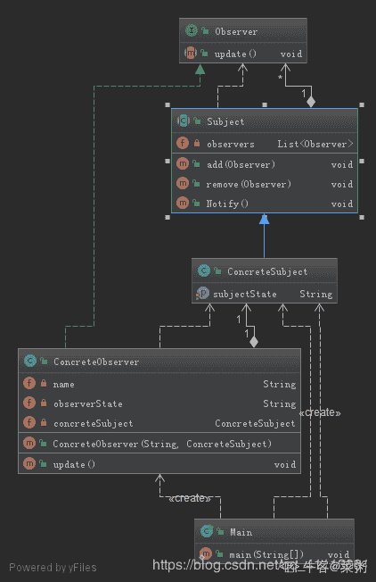
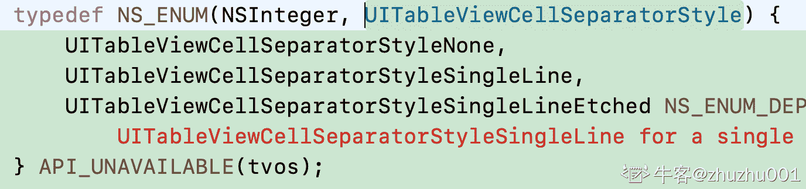

# 京东 2019 春招京东 IOS 开发类试卷

## 1

要交换变量 A 和 B 的值,应使用的语句组( )

正确答案: B   你的答案: 空 (错误)

```cpp
A=B;B=C;C=A
```

```cpp
C=A;A=B;B=C
```

```cpp
A=B;B=A
```

```cpp
C=A;B=A;B=C
```

本题知识点

iOS 工程师 京东 编程基础 *2019* *讨论

[断墨筏云](https://www.nowcoder.com/profile/208983614)

linux 中直接交换值即可 算法中引入中间变量

编辑于 2019-08-03 09:31:40

* * *

## 2

```cpp
class program
 {
     static void Main(string[] args)
     {
         int i;
         i = x(x(8));
     }
     static int x(int n)
     {
         if (n <= 3)
             return
1;
         else
             return
x(n - 2) + x(n - 4) + 1;
     }
 }
```

递归算法 x(8)需要调用几次函数 x(int n) 

正确答案: C   你的答案: 空 (错误)

```cpp
9
```

```cpp
12
```

```cpp
18
```

```cpp
24
```

本题知识点

iOS 工程师 京东 递归 iOS 工程师 京东 2019 iOS 工程师 京东 2019

讨论

[颎呀](https://www.nowcoder.com/profile/614565156)

x(8)调用 9 次没错，x(x(8))才是调用 18 次啊

答案错了吧

发表于 2019-08-24 00:02:15

* * *

[已死 201810130826474](https://www.nowcoder.com/profile/889022569)

递归算法，实现循环计算，直到计算出结果。x（8）第一次判定则是 x（6）+x（4）+1，第二次将这个结果再次判定，则得到 x（4）+x（2）+1+x（2）+x（0）+1+1，依次计算，因此 x（int n）则调用了 9 次。题目答案有误。

发表于 2019-07-06 11:16:34

* * *

[亦夜](https://www.nowcoder.com/profile/976198979)

题目问的有毛病，最后答案分明就是最外层的 x(x(8)) 方法次数

发表于 2019-12-31 09:14:05

* * *

## 3

用计算机解决问题的步骤一般为（ ）①编写程序 ②设计算法 ③分析问题 ④调试程序。

正确答案: D   你的答案: 空 (错误)

```cpp
①②③④
```

```cpp
③④①②
```

```cpp
②③①④
```

```cpp
③②①④
```

本题知识点

iOS 工程师 京东 编程基础 *2019* *讨论

[乾殇](https://www.nowcoder.com/profile/717759684)

D，先要分析才能设计算法，然后写程序，再对写出来的程序调试

发表于 2019-10-31 17:07:08

* * *

## 4

京东商城 plus 会员的消费记录金额分别为 900，512，613，700，810，若采用选择排序算法对其进行从小到大的排序，第三趟排序结果为：（）

正确答案: C   你的答案: 空 (错误)

```cpp
900，512，613，700，810
```

```cpp
512，900，613，700，810
```

```cpp
512，613，700，900，810
```

```cpp
512，613，700，810，900
```

本题知识点

iOS 工程师 京东 排序 *2019* *讨论

[LLMing](https://www.nowcoder.com/profile/242238189)

它的工作原理是：第一次从待排序的数据中选出最小的一个元素，存放在序列的起始位置（第一趟），然后再从剩余的未排序元素中寻找到最小元素，然后放到已排序的序列的末尾（第二趟）...
第一趟：512，900， 613， 700， 810
第二趟：512，613， 900， 700， 810
第三趟：512，613， 700， 900， 810

发表于 2020-03-05 09:18:00

* * *

[隆多一定赢](https://www.nowcoder.com/profile/6770161)

D 应该也对吧，每次选择最大的放到待排数组后面

发表于 2019-07-02 07:23:34

* * *

## 5

一棵完全二叉树共有 2018 个结点，则叶子结点的个数是？

正确答案: C   你的答案: 空 (错误)

```cpp
995
```

```cpp
1517
```

```cpp
1009
```

```cpp
1521
```

本题知识点

iOS 工程师 京东 树 2019

讨论

[奔腾的小马达](https://www.nowcoder.com/profile/224349141)

此题选项中无正确答案。解决此题必须记住下面的公式：完全二叉树求叶子节点时，如果二叉树节点总数为偶数时，直接除以 2 得到叶子节点数；如果二叉树节点总数为奇数时，说明不存在度为 1 的节点，所以(奇数+1)/2 即为叶子节点数目。

发表于 2019-06-30 19:33:27

* * *

[malofleur](https://www.nowcoder.com/profile/232267)

为啥我算出来是 1009…
最后一层 995 个，倒数第二层共 512 个=14 个叶子节点+497 个度为 2 的节点+1 个度为 1 的节点……

发表于 2019-07-09 16:56:36

* * *

[offer 过来自己动](https://www.nowcoder.com/profile/372304342)

1 2 4 8 16 32 64 128 256 512 995

2018 - 1023 = 995

1024 - 995 = 29
29/2 = 14
14 + 995 = 1009

发表于 2020-07-07 18:43:15

* * *

## 6

串的朴素模式匹配算法，主要思想是对主串(S)的每一个字符作为子串(T)开头，与要匹配的字符串进行匹配。主串(S)的长度为 n，要匹配的子串的长度为 m，那么朴素模式匹配算法的最坏时间复杂度为：

正确答案: C   你的答案: 空 (错误)

```cpp
O((n-m)*m)
```

```cpp
O((n＋1)*m)
```

```cpp
O((n-m＋1)*m)
```

```cpp
O((m＋1)*n)
```

本题知识点

iOS 工程师 京东 复杂度 2019

讨论

[小小怪下士 201906300125839](https://www.nowcoder.com/profile/133196007)


发表于 2020-04-13 12:02:07

* * *

[SChen1024](https://www.nowcoder.com/profile/928646526)

最多计算前 N-M+1 就好

发表于 2019-08-04 23:31:34

* * *

## 7

用俩个栈模拟实现一个队列，如果栈的容量分别是 O 和 P(O>P),那么模拟实现的队列最大容量是多少？

正确答案: C   你的答案: 空 (错误)

```cpp
O+P
```

```cpp
2O+1
```

```cpp
2P+1
```

```cpp
2O-1
```

本题知识点

iOS 工程师 京东 栈 *队列 *2019 Java 工程师 C++工程师 PHP 工程师 golang 工程师 哔哩哔哩 2021** **讨论

[Sunshine201904112151293](https://www.nowcoder.com/profile/753689350)

https://blog.csdn.net/SCS199411/article/details/91443928

发表于 2019-10-27 13:56:13

* * *

[Kris2023](https://www.nowcoder.com/profile/5790168)

链接：[`www.nowcoder.com/questionTerminal/9eb3e6cbf8b24c56a64817128b36e399?toCommentId=3070567`](https://www.nowcoder.com/questionTerminal/9eb3e6cbf8b24c56a64817128b36e399?toCommentId=3070567)
来源：牛客网

保证入队完毕之后才可以出队； 
分析：栈的特点是“后进先出(LIFO)”，而队列的特点是“先进先出(FIFO)”。用两个栈模拟实现一个队列的基本思路是：用一个栈作为存储空间，另一个栈作为输出缓冲区，入队时把元素按顺序压入两栈模拟的队列，出队时按入队的顺序出栈即可。

如下图，用容量为 m（较大的）的栈作为存储空间，容量为 n 的栈作为输出缓冲区，先将入队的前 n 个元素 push 进存储空间栈

随后对存储空间栈中的每个元素进行出栈(pop)操作，继而压入(push)输出缓冲区栈，如下图所示

对于剩余入队的前 n+1 个元素，将他们压入存储空间栈，两个栈的状态如下图：

此时已经入队了 2n+1 个元素，若此时进行出队操作，先将输出缓冲区栈中的元素出栈(pop)并输出：Q1,Q2,……,Qn，再对存储空间栈中的 n 个元素进行出栈(pop)并压入输入缓冲区栈，状态图如下：

然后对存储空间栈进行一次出栈(pop)操作并输出：Qn+1，最后再对输出缓冲区栈中的所有元素进行出栈(pop)操作并输出 Qn+2,Qn+3,……,Q2n,Q2n+1。这样两个栈总的输出序列为：Q1,Q2,……,Qn,Qn+1,Qn+2,Qn+3,……,Q2n,Q2n+1，符合队列“先进先出”的特性，模拟成功。

但是如果前面蓝字的假设不成立，即在已经入队了 2n+1 个元素的情况下，还要继续向队列中添加更多的元素，将无法满足按入队的顺序出队。

综上所述，两个栈所模拟的队列的最大容量为 2n+1。
--------------------- 
作者：阿特密斯 X 
来源：CSDN 
原文：[`blog.csdn.net/qq_42194192/article/details/82723949`](https://blog.csdn.net/qq_42194192/article/details/82723949) 
版权声明：本文为博主原创文章，转载请附上博文链接！

发表于 2019-07-14 11:14:33

* * *

[轩衅 inc 氵氺](https://www.nowcoder.com/profile/170990596)

如果将容量较大的栈做为缓冲区，最大容量不是 O+P 吗

发表于 2021-10-13 11:00:17

* * *

## 8

关于 DNS 协议以下说法错误的是（）

正确答案: B   你的答案: 空 (错误)

```cpp
可以使用 TCP 协议进行传输
```

```cpp
只能使用 UDP 协议进行传输
```

```cpp
可以进行从域名到 IP 的解析
```

```cpp
可以根据 IP 查询其使用的域名
```

本题知识点

iOS 工程师 京东 网络基础 2019

讨论

[Chayeen](https://www.nowcoder.com/profile/893678234)

这题有问题，每个答案都是对的。1\. 权威域名服务器之间，采用 DNS 进行区域更新的时候，由于区域文件太大，为保证传输的可靠性，一定需要使用 TCP 进行传输。2\. 平时普通使用，如仅仅查询域名的 IP 地址时，大多都采用 UDP 进行传输。3\. 已知域名求 IP，这是请求资源记录为 A 或者 AAAA 记录时，可以实现。4\. 已知 IP 求域名，这是请求资源记录为 PTR 时，可以实现。

发表于 2020-03-23 15:00:18

* * *

[愿逐月华 201904051222839](https://www.nowcoder.com/profile/667877488)

A、D1.域名解析过程是通过 UDP 协议进行传输的 2.域名解析的过程是域名指向 IP，而不是 IP 指向域名

发表于 2019-07-11 15:40:27

* * *

[牛客 990255411 号](https://www.nowcoder.com/profile/990255411)

DNS 是一种可以将域名和 IP 地址相互映射的以层次结构分布的数据库系统。并且 DNS 既可以基于 TCP,也可以基于 UDP,只是常用的是 UDP。所以每个选项都对。

发表于 2020-04-02 18:57:30

* * *

## 9

以下命令可以用于获取本机 cpu 使用率的是：

正确答案: C   你的答案: 空 (错误)

```cpp
ifconfig
```

```cpp
uptime
```

```cpp
top
```

```cpp
netstat
```

本题知识点

iOS 工程师 京东 Linux 操作系统 2019

讨论

[万能的翔王大人](https://www.nowcoder.com/profile/244791444)

ifconfig 是 linux 中用于显示或配置网络设备（网络接口卡）的命令 uptime 显示开机时间 top 显示当前系统资源使用情况，相当于任务管理器 netstat 命令用于显示与 IP、TCP、UDP 和 ICMP 协议相关的统计数据，一般用于检验本机各端口的网络连接情况。

发表于 2019-07-16 14:58:59

* * *

[征途是一百级大牛](https://www.nowcoder.com/profile/803324974)

top 显示当前资源使用情况，类似于资源管理器。

发表于 2021-12-23 16:36:33

* * *

[废神](https://www.nowcoder.com/profile/885938518)

ifconfig 是 linux 中用于显示或配置网络设备（网络接口卡）的命令 uptime 显示开机时间 top 显示当前系统资源使用情况，相当于任务管理器 netstat 命令用于显示与 IP、TCP、UDP 和 ICMP 协议相关的统计数据，一般用于检验本机各端口的网络连接情况。

编辑于 2021-05-18 21:41:21

* * *

## 10

如果 ORDER BY 子句后未指定 ASC 或 DESC，默认使用以下哪个？

正确答案: B   你的答案: 空 (错误)

```cpp
DESC
```

```cpp
ASC
```

```cpp
不存在默认值
```

```cpp
其它选项都不对
```

本题知识点

iOS 工程师 京东 数据库 2019

讨论

[菜鸟九八号](https://www.nowcoder.com/profile/612444337)

 默认  **ASC  *升序***

发表于 2020-02-28 10:24:24

* * *

[niujy](https://www.nowcoder.com/profile/524068450)

吧

发表于 2019-06-25 11:48:50

* * *

## 11

下图的 UML 类结构图表示的是哪种设计模式：

正确答案: B   你的答案: 空 (错误)

```cpp
访问者模式
```

```cpp
生成器模式
```

```cpp
代理模式
```

```cpp
命令模式
```

本题知识点

iOS 工程师 京东 UML 2019

讨论

[你快乐吗](https://www.nowcoder.com/profile/5271388)

咋回事，看到三个一样的题了

发表于 2020-07-11 09:49:39

* * *

[闲鱼总算翻了身](https://www.nowcoder.com/profile/909589300)

这个题图都看不清

发表于 2021-07-31 13:43:47

* * *

[菜粥](https://www.nowcoder.com/profile/5293318)

建造者模式 UML 图（IDEA 自动生成）


大话设计模式-建造者模式

[`localhost.blog.csdn.net/article/details/89140078`](https://localhost.blog.csdn.net/article/details/89140078)

大话设计模式-系列文章(共 50 篇)：

[`blog.csdn.net/qq_41113081/category_8723350.html`](https://blog.csdn.net/qq_41113081/category_8723350.html)

发表于 2020-03-23 00:06:34

* * *

## 12

对象间存在一对多关系，当一个对象被修改时，则会自动通知它的依赖对象，采用以下哪种设计模式最好？

正确答案: B   你的答案: 空 (错误)

```cpp
建造者模式
```

```cpp
观察者模式
```

```cpp
策略模式
```

```cpp
代理模式
```

本题知识点

iOS 工程师 京东 设计模式 2019

讨论

[菜粥](https://www.nowcoder.com/profile/5293318)

观察者模式 UML 图（IDEA 自动生成）

大话设计模式-观察者模式
[`localhost.blog.csdn.net/article/details/89334733`](https://localhost.blog.csdn.net/article/details/89334733)

大话设计模式-系列文章(共 50 篇)：
[`blog.csdn.net/qq_41113081/category_8723350.html`](https://blog.csdn.net/qq_41113081/category_8723350.html)

发表于 2020-03-23 00:17:01

* * *

## 13

iOS 单元测试框架有哪些？

正确答案: A B C   你的答案: 空 (错误)

```cpp
XCTest
```

```cpp
GHUnit
```

```cpp
OCMock
```

```cpp
NSXML
```

本题知识点

iOS 工程师 京东 软件测试 iOS 2019

讨论

[Monstershhh](https://www.nowcoder.com/profile/183549945)

OCUnit 是 OC 官方测试框架， 现在被 XCTest 所取代。
XCTest 是与 Foundation 框架平行的测试框架。
GHUnit 是第三方的测试框架。
OCMock 都是第三方的测试框架。

发表于 2019-08-13 18:34:37

* * *

[牛客 112948962 号](https://www.nowcoder.com/profile/112948962)

msxml 指微软的 xml 语言解析器，用来解释 xml 语言的

发表于 2020-04-03 15:05:17

* * *

[钢铁直男黑脸](https://www.nowcoder.com/profile/5835152)

选名字里有 unit 的准没错

发表于 2019-09-04 13:36:03

* * *

## 14

关于 NSOperation queue 的说法，正确的是？

正确答案: A C D   你的答案: 空 (错误)

```cpp
主要用于多线程并发处理
```

```cpp
它是一个队列，有严格的先进先出
```

```cpp
它不会遵守严格的先进先出
```

```cpp
NSOperationQueue 可以通过调整权重来调整队列的执行顺序
```

本题知识点

iOS 工程师 京东 iOS 2019

讨论

[阿甘的幽梦](https://www.nowcoder.com/profile/127652740)

***遵循先进先出

发表于 2020-05-19 22:11:37

* * *

[doyouwannadance](https://www.nowcoder.com/profile/540645161)

不同于 GCD 中的调度队列 FIFO（先进先出）的原则。NSOperationQueue 对于添加到队列中的操作，首先进入准备就绪的状态（就绪状态取决于操作之间的依赖关系），然后进入就绪状态的操作的开始执行顺序（非结束执行顺序）由操作之间相对的优先级决定（优先级是操作对象自身的属性）。

发表于 2022-02-22 16:17:49

* * *

## 15

实现多线程都有哪几种方法？

正确答案: B C   你的答案: 空 (错误)

```cpp
使用@synchronized(self)
```

```cpp
使用 GCD
```

```cpp
使用 NSOperationQueue
```

```cpp
使用@thread
```

本题知识点

iOS 工程师 京东 iOS 2019

讨论

[blacklonely](https://www.nowcoder.com/profile/760254021)

```cpp
thread 前面不能加@
```

发表于 2020-10-27 13:02:09

* * *

[卟败灬筱龙](https://www.nowcoder.com/profile/920047184)

A 添加同步锁，防止多线程操作。D 不知道是啥玩意

发表于 2021-07-09 11:40:42

* * *

[阿甘的幽梦](https://www.nowcoder.com/profile/127652740)

实现方法，题干意思是遵循大的类别

发表于 2020-05-19 22:12:31

* * *

## 16

与 alloc 相反，与 retain 相反，与 alloc 配对的分别是: 

正确答案: B   你的答案: 空 (错误)

```cpp
dealloc release dealloc
```

```cpp
dealloc release
release
```

```cpp
dealloc dealloc
dealloc
```

```cpp
release release
release
```

本题知识点

iOS 工程师 京东 iOS 2019

讨论

[沉默的子弹](https://www.nowcoder.com/profile/858662141)

与 alloc 配对的是 release?什么意思啊 一脸懵逼

发表于 2020-10-21 13:19:37

* * *

## 17

iOS 中，可以从一个应用（如 APP01）跳转到另外一个应用（如 APP02），如果要在跳转的过程中，将 username 和 password 这两个参数传递给 APP02, 下列代码正确的是：

正确答案: A   你的答案: 空 (错误)

```cpp
NSURL* open_URL_A =
[NSURL URLWithString:@"APP02://username=test01&password=123456"]
```

```cpp
NSURL* open_URL_A = [NSURL URLWithString:@"APP02://username=test01,password=123456"]
```

```cpp
NSURL* open_URL_A =
[NSURL URLWithString:@"APP02://username=test01//password=123456"]
```

```cpp
NSURL* open_URL_A =
[NSURL URLWithString:@"APP02://username=test01#password=123456"]
```

本题知识点

iOS 工程师 京东 iOS 2019

讨论

[torrey](https://www.nowcoder.com/profile/3187556)

A 利用 URL 的 query 思想

发表于 2020-01-09 21:05:52

* * *

[阿甘的幽梦](https://www.nowcoder.com/profile/127652740)

我想都是那些公司的人在刷题啊

发表于 2020-05-19 22:13:45

* * *

[zhuzhu001](https://www.nowcoder.com/profile/467703502)

A 

发表于 2019-11-10 15:58:16

* * *

## 18

在主线程调用以下代码：

```cpp
 dispatch_queue_t
mainQueue = dispatch_get_main_queue();

dispatch_sync(mainQueue,^{

NSLog(@"MainQueue");
    });
```

执行结果是 _______

正确答案: C   你的答案: 空 (错误)

```cpp
输出"MainQueue"
```

```cpp
没有任何输出
```

```cpp
程序死锁，出错
```

```cpp
无法通过编译
```

本题知识点

iOS 工程师 京东 iOS 2019

讨论

[一块腹肌的张先生](https://www.nowcoder.com/profile/9087639)

造成死锁，实际会有输出吗？？？

发表于 2021-03-20 22:14:26

* * *

[萌萌菜菜](https://www.nowcoder.com/profile/342718714)

主线程添加同步任务，导致主线程死锁，崩溃

发表于 2021-04-25 11:08:59

* * *

[wanqijian](https://www.nowcoder.com/profile/653707)

主线程添加同步任务，导致主线程死锁

发表于 2019-07-04 19:33:01

* * *

## 19

下列哪个不是 iOS 提供的 tableview cell 分割线风格?

正确答案: C   你的答案: 空 (错误)

```cpp
UITableViewCellSeparatorStyleNone
```

```cpp
UITableViewCellSeparatorStyleSingleLine
```

```cpp
UITableViewCellSeparatorStyleSingleLineShadow
```

```cpp
UITableViewCellSeparatorStyleSingleLineEtched
```

本题知识点

iOS 工程师 京东 iOS 2019

讨论

[Ryanww](https://www.nowcoder.com/profile/126034906)

UITableViewCellSeparatorStyleNone,

UITableViewCellSeparatorStyleSingleLine,

UITableViewCellSeparatorStyleSingleLineEtched

发表于 2020-07-31 17:29:13

* * *

[zhuzhu001](https://www.nowcoder.com/profile/467703502)

C   UITableViewCellSeparatorStyleSingleLineShadow 

发表于 2019-11-10 15:57:27

* * *

[Anthony_WUST](https://www.nowcoder.com/profile/400890646)

**typedef** NS_ENUM(NSInteger, UITableViewCellStyle) {

 UITableViewCellStyleDefault,*// Simple cell with text label and optional image view (behavior of UITableViewCell in iPhoneOS 2.x)*

 UITableViewCellStyleValue1,*// Left aligned label on left and right aligned label on right with blue text (Used in Settings)*

 UITableViewCellStyleValue2,*// Right aligned label on left with blue text and left aligned label on right (Used in Phone/Contacts)*

 UITableViewCellStyleSubtitle*// Left aligned label on top and left aligned label on bottom with gray text (Used in iPod).*

}; *// available in iPhone OS 3.0*

**typedef** NS_ENUM(NSInteger, UITableViewCellSeparatorStyle) {

 UITableViewCellSeparatorStyleNone,

 UITableViewCellSeparatorStyleSingleLine,

 UITableViewCellSeparatorStyleSingleLineEtched NS_ENUM_DEPRECATED_IOS(2_0, 11_0, "Use UITableViewCellSeparatorStyleSingleLine for a single line separator.")

} __TVOS_PROHIBITED;

**typedef** NS_ENUM(NSInteger, UITableViewCellSelectionStyle) {

 UITableViewCellSelectionStyleNone,

 UITableViewCellSelectionStyleBlue,

 UITableViewCellSelectionStyleGray,

 UITableViewCellSelectionStyleDefault NS_ENUM_AVAILABLE_IOS(7_0)

};

**typedef** NS_ENUM(NSInteger, UITableViewCellFocusStyle) {

 UITableViewCellFocusStyleDefault,

 UITableViewCellFocusStyleCustom

} NS_ENUM_AVAILABLE_IOS(9_0);

**typedef** NS_ENUM(NSInteger, UITableViewCellEditingStyle) {

 UITableViewCellEditingStyleNone,

 UITableViewCellEditingStyleDelete,

 UITableViewCellEditingStyleInsert

};

**typedef** NS_ENUM(NSInteger, UITableViewCellAccessoryType) {

 UITableViewCellAccessoryNone, *// don't show any accessory view*

 UITableViewCellAccessoryDisclosureIndicator,  *// regular chevron. doesn't track*

 UITableViewCellAccessoryDetailDisclosureButton __TVOS_PROHIBITED,  *// info button w/ chevron. tracks*

 UITableViewCellAccessoryCheckmark,  *// checkmark. doesn't track*

 UITableViewCellAccessoryDetailButton NS_ENUM_AVAILABLE_IOS(7_0) __TVOS_PROHIBITED *// info button. tracks*

};

发表于 2019-10-18 23:49:44

* * *

## 20

下面哪些属于 UITableViewDelegate 协议的方法？

正确答案: C   你的答案: 空 (错误)

```cpp
tableView:cellForRowAtIndexPath:
```

```cpp
tableView:numberOfRowsInSection:
```

```cpp
tableView:didSelectRowAtIndexPath:
```

```cpp
numberOfSectionsInTableView:
```

本题知识点

iOS 工程师 京东 iOS 2019

讨论

[ztwazy](https://www.nowcoder.com/profile/312549587)

其他都是数据源方法

发表于 2019-07-08 01:39:44

* * *

## 21

关于线程安全，以下说法正确的是？

正确答案: A B   你的答案: 空 (错误)

```cpp
UIView 的子类只能在主线程中操作保证了线程安全
```

```cpp
NSCache、NSArray 是线程安全的
```

```cpp
atomic 可以保证线程安全
```

```cpp
dispatch 技术中的串行队列可以保证线程安全
```

本题知识点

iOS 工程师 京东 iOS 2019

讨论

[牛客 917114279 号](https://www.nowcoder.com/profile/917114279)

为什么 D 错

发表于 2020-08-27 21:35:21

* * *

[一块腹肌的张先生](https://www.nowcoder.com/profile/9087639)

D 错的原因是，串形异步的时候。创建的子线程不影响主线程。

发表于 2021-03-20 14:37:08

* * *

[沉默的子弹](https://www.nowcoder.com/profile/858662141)

D 串行队列和线程安全没有关系 dispatch_async 两个新创建的串行队列，会创建两个线程，两个线程中对同一份可读写数据进行写操作，就会造成线程安全问题。

发表于 2020-10-29 21:55:37

* * *

## 22

关于 UIViewController，以下说法正确的是?

正确答案: A B C   你的答案: 空 (错误)

```cpp
viewDidLoad、viewWillAppear 在一个 RunLoop 里完成
```

```cpp
viewDidAppear 调用时，view 已经完成了布局
```

```cpp
present 另一个 UIViewController 时，不一定会调用 viewWillDisappear、viewDidDisappear
```

```cpp
UIViewController 可以有 ChildViewControllers，这些 ChildViewControllers 是通过 push 或 present 的方式添加的
```

本题知识点

iOS 工程师 京东 iOS 2019

讨论

[一块腹肌的张先生](https://www.nowcoder.com/profile/9087639)

b 感觉这个完成布局有歧义和。此时只是 view 已经显示 ，其约束等还未执行完成

发表于 2021-03-20 15:01:15

* * *

## 23

关于 Auto Layout 的说法，以下说法正确的是？

正确答案: A C D   你的答案: 空 (错误)

```cpp
self.view.frame =
(CGRect){0,0,1,1}会对 self.view 相关的 Constraints 造成影响
```

```cpp
add Constraints 后就可以立即获得 View 布局完的 frame
```

```cpp
如果两个视图之间有约束关联，那么这两个视图在图层结构上必定有公共祖先
```

```cpp
在一个页面里使用过多的 Auto Layout 可能会引起页面卡顿
```

本题知识点

iOS 工程师 京东 iOS 2019

## 24

关于 Memory 的说法，以下说法正确的是？

正确答案: B C   你的答案: 空 (错误)

```cpp
ARC 下，当一个对象的引用计数为 0 时，会被立即释放
```

```cpp
ARC 下，用 Obj-C 的编写的代码中，不会对 Core Foundation 中的绝大部分对象进行内存管理
```

```cpp
值类型既可以存储在栈上，也可以存储在堆上
```

```cpp
非静态的 NSObject 的子类对象只存储在堆上
```

本题知识点

iOS 工程师 京东 iOS 2019

讨论

[路边野餐丶](https://www.nowcoder.com/profile/795883397)

值类型包括数组元素、闭包局部变量等应存储在堆上，NSStackBlock 是分配在栈上的。

发表于 2020-07-08 23:57:12

* * *

[牛客 307298393 号](https://www.nowcoder.com/profile/307298393)

a 有什么毛病吗？mrc 下 autorelease 对象才需要走 runloop 循环，arc 下不就是马上释放？

发表于 2022-03-22 21:22:08

* * *

## 25

关于 block，以下说法正确的是？

正确答案: B C   你的答案: 空 (错误)

```cpp
如果 block 引用到 self，那么总是需要弱引用它
```

```cpp
如果 self 持有非空的 block，block 强引用 self，则会构成循环引用
```

```cpp
block 既可以存储在栈上，也可以存储在堆上
```

```cpp
block 用 strong 来声明属性比 copy 更安全
```

本题知识点

iOS 工程师 京东 iOS 2019

讨论

[牛客 708460592 号](https://www.nowcoder.com/profile/708460592)

A:block 是否需要弱引用 self 主要取决于 block 的持有者是不是 self，比如 uiview 的动画 block 就不需要弱引用 selfD:用 copy 更安全，copy 会将 block 从栈上移到堆中（虽然目前苹果已经默认这样做了）

发表于 2020-01-04 22:26:37

* * *

## 26

要求匹配以下 16 进制颜色值，正则表达式可以为：  #ffbbad  #Fc01DF  #FFF  #ffE

正确答案: B   你的答案: 空 (错误)

```cpp
/#([0-9a-f]{6}|[0-9a-fA-F]{3})/g
```

```cpp
/#([0-9a-fA-F]{6}|[0-9a-fA-F]{3})/g
```

```cpp
/#([0-9a-fA-F]{3}|[0-9a-f]{6})/g
```

```cpp
/#([0-9A-F]{3}|[0-9a-fA-F]{6})/g
```

本题知识点

iOS 工程师 京东 编程基础 *2019* *讨论

[louis_ncu](https://www.nowcoder.com/profile/684852623)

看到第一段中的数字 6 没有？

发表于 2020-03-08 13:44:15

* * *

[别卷啦！](https://www.nowcoder.com/profile/610837318)

选 BA C:([0-9a-f]{6} 只能匹配六次 0-9 a-f 之间的 所以不能匹配 #Fc01DF D:[0-9A-F]{3} 只能匹配三次 0-9A-F  所以不能匹配   #ffE

发表于 2020-12-29 10:46:30

* * *

## 27

使用 protocol 时，声明一组可选择实现与否的函数，需要在声明的前一行加上?

正确答案: B   你的答案: 空 (错误)

```cpp
@required
```

```cpp
@optional
```

```cpp
@interface
```

```cpp
@protocol
```

本题知识点

iOS 工程师 京东 iOS 2019

讨论

[关山难越，谁悲失路之人](https://www.nowcoder.com/profile/857508516)

A 必需实现的方法

B 可以实现，也可以实现的方法

C 类的声明

D 协议的声明

发表于 2019-07-31 09:16:15

* * *

## 28

Objective-C 有可以使用的属性，以下描述错误的是：

正确答案: A   你的答案: 空 (错误)

```cpp
retain 表示持有特性，copy 属性表示拷贝属性，都会建立一个相同的对象
```

```cpp
assign 是赋值属性，setter 方法将传入参数赋值给实例变量
```

```cpp
readonly 是只读特性，只有 getter 方法，没有 setter 方法
```

```cpp
readwrite 是可读可写特性，需要生成 getter 方法和 setter 方法
```

本题知识点

iOS 工程师 京东 iOS 2019

讨论

[落叶 1052](https://www.nowcoder.com/profile/237839288)

copy 会拷贝一份，retain 只是引用计数器加一

发表于 2020-05-21 22:46:29

* * *

[ufogxl](https://www.nowcoder.com/profile/631509)

对不可变对象 copy 并不会创建新的内存空间

发表于 2021-01-28 23:40:15

* * *

## 29

以下哪一段代码不会抛出异常：

```cpp
NSArray *array=@[1，2，3];
NSNumber * number=array[3];  
NSDictionary *dict=@{@”key”:nil};  
NSString *str=nil;
NSString *str2=[str substringFromIndex:3];  
NSString *str=@”hi”;
NSString *str2=[str substringFromIndex:3]; 
```

正确答案: B   你的答案: 空 (错误)

```cpp
字典中键值对不能为 nil,运行时崩溃
```

```cpp
OC 中向空对象发送消息,不执行任何操作,不报错,不崩溃
```

```cpp
数组下标越界,运行时崩溃
```

```cpp
OC 数组中的元素不能是基本数据类型,必须是对象,并且 array[3]下标越界,Xcode 编译时报错
```

本题知识点

iOS 工程师 京东 iOS 2019

讨论

[牛客 203908076 号](https://www.nowcoder.com/profile/203908076)

这题目到底想问什么

发表于 2020-08-18 07:59:50

* * *

## 30

Objective-C 中实现多线程都有哪几种方法：

正确答案: A D   你的答案: 空 (错误)

```cpp
采用 NSOperationQueue
```

```cpp
采用@synchronized(self)
```

```cpp
采用@thread
```

```cpp
采用 GCD
```

本题知识点

iOS 工程师 京东 iOS 2019******