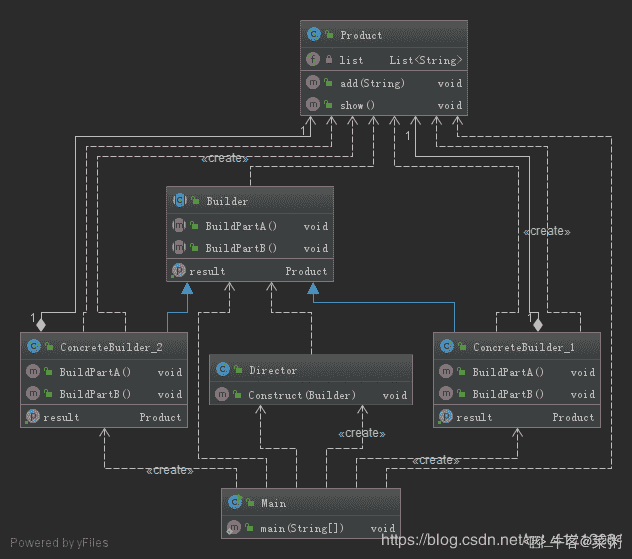
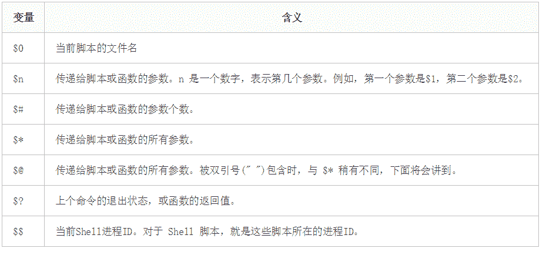

# 京东 2019 春招京东 Java 开发类试卷

## 1

在对问题的解空间树进行搜索的方法中，一个结点有多次机会成为活结点的是：（）

正确答案: B   你的答案: 空 (错误)

```cpp
动态规划
```

```cpp
回溯法
```

```cpp
分支限界法
```

```cpp
回溯法和分支限界法
```

本题知识点

Java 工程师 京东 树 2019

讨论

[codeor](https://www.nowcoder.com/profile/433036625)

回朔法:当沿一条路径走到底时，无法继续前进，退回上一结点，查看是否具体其他路径，有则继续查找，若没有则继续往上层结点回退

发表于 2019-07-14 12:51:56

* * *

[sky33](https://www.nowcoder.com/profile/516528658)

啥是活结点？

发表于 2019-08-10 17:16:59

* * *

[長歌當行](https://www.nowcoder.com/profile/585514245)

[`blog.csdn.net/ncepuzhuang/article/details/8944991`](https://blog.csdn.net/ncepuzhuang/article/details/8944991)

发表于 2019-07-28 10:22:44

* * *

## 2

在算法设计中，通常要注意理解其本质含义。算法的基本要素有：（）

正确答案: B C   你的答案: 空 (错误)

```cpp
算法对硬件的基本要求
```

```cpp
对数据对象的运算和操作
```

```cpp
算法的控制结构
```

```cpp
算法的数据机构
```

本题知识点

Java 工程师 京东 编程基础 *2019* *讨论

[等不到天亮等天黑](https://www.nowcoder.com/profile/283072066)

在大学所用算法书籍中查到，一个算法通常由两种基本要素组成：一是（对数据对象的运算和操作），二是（算法的控制结构）。因此本题选 B 和 C。

发表于 2019-06-14 01:44:42

* * *

[superYong_ 京东](https://www.nowcoder.com/profile/219222666)

数据机构啥东东           数据结构还能理解

发表于 2019-07-24 10:24:01

* * *

[给我 offer 我要 offer](https://www.nowcoder.com/profile/9477195)

一个算法通常由两种基本要素组成：一是**（对数据对象的运算和操作）**，二是**（算法的控制结构）**

发表于 2020-09-17 14:57:25

* * *

## 3

京东商城 plus 会员的消费记录金额分别为 900，512，613，700，810，若采用选择排序算法对其进行从小到大的排序，第三趟排序结果为：（）

正确答案: C   你的答案: 空 (错误)

```cpp
900，512，613，700，810
```

```cpp
512，900，613，700，810
```

```cpp
512，613，700，900，810
```

```cpp
512，613，700，810，900
```

本题知识点

Java 工程师 京东 排序 *2019* *讨论

[6666666666L](https://www.nowcoder.com/profile/300136112)

选择排序就是获取未排序部分数据中最小的数据放到数组的最前面，以此类推。

发表于 2019-05-25 21:05:28

* * *

[brealid](https://www.nowcoder.com/profile/378516225)

选：C 开始时：900，512，613，700，810 第一趟后：512，900，613，700，810 第二趟后：512，613，900，700，810 第三趟后：512，613，700，900，810 

发表于 2019-05-25 21:21:46

* * *

[木子 201908041901805](https://www.nowcoder.com/profile/994468658)

选择排序 将数字分为两部分 已排序 未排序 将未排序中最小元素与已排序最后一个元素（即最大元素）交换 直到所有数字有序

发表于 2020-03-06 15:50:12

* * *

## 4

```cpp
class program
 {
     static void Main(string[] args)
     {
         int i;
         i = x(8);
     }
     static int x(int n)
     {
         if (n <= 3)
             return 1;
         else
             return x(n - 2) + x(n - 4) + 1;
     }
 }
```

递归算法 x(8)需要调用几次函数 x(int n)

正确答案: A   你的答案: 空 (错误)

```cpp
9
```

```cpp
12
```

```cpp
18
```

```cpp
24
```

本题知识点

Java 工程师 京东 递归 2019

讨论

[中南的小菜鸡](https://www.nowcoder.com/profile/4371282)

选 A 的集合一下，我还认真看了下，就是 X(8)

发表于 2019-08-21 22:55:39

* * *

[有一点点](https://www.nowcoder.com/profile/138016195)

```cpp
题目确实有些误导，计算过程可以表示为：

x(8) = x(6)+ x(4) +1 = 9
x(6) = x(4)+ x(2) +1 = 5
x(4) = x(2)+ x(0) +1 = 3

以上共调用 x(int n) 函数 9 次，之后再计算 x(9)

```
x(9) = x(7)+ x(5) +1 = 9
x(7) = x(5)+ x(3) +1 = 5
x(5) = x(3)+ x(1) +1 = 3

同样，调用

```cpp
x(int n) 函数 9 次
```

故，总共调用函数 18 次，选 C。

```cpp

```

发表于 2019-07-01 14:53:25

* * *

[技术过硬](https://www.nowcoder.com/profile/9232985)

```cpp
题目要求：递归算法 x(8)需要调用几次函数 x(int n)。
我的理解：算 x（8）需要调用几次函数 x（int x）。 所以天真的选了 A。
正确答案：C，18 次，就是 x（x（8））总共调用了多少次 x（int n）。
无语，题目还是有歧义的。哼！
```

发表于 2019-05-24 18:01:31

* * *

## 5

下列叙述中，有关线性链表叙述正确的是（）

正确答案: D   你的答案: 空 (错误)

```cpp
线性链表中的表头元素一定存储在其他元素的前面
```

```cpp
线性链表中的各元素在存储空间中的位置不一定是连续的，但表头元素一定存储在其他元素的前面
```

```cpp
线性链表中的各元素在存储空间中的位置必须是连续的
```

```cpp
线性链表中的各元素在存储空间中的位置不一定是连续的，且各元素的存储顺序也是任意的
```

本题知识点

Java 工程师 京东 链表 *2019* *讨论

[牛客 218196695 号](https://www.nowcoder.com/profile/218196695)

如果有循环链表则表头结点不一定在其它元素的前面

发表于 2020-06-09 10:19:30

* * *

[牛客 7665501 号](https://www.nowcoder.com/profile/7665501)

线性链表包括单向链表，循环链表， 双向循环链表 A   双向链表和循环链表 守卫相接 B   同上 C 链表和数组最大区别就是 数组在内存中是连续的空间 D 对类似一下这种情况 链表为例

发表于 2019-07-13 12:53:15

* * *

[小白学编程~](https://www.nowcoder.com/profile/417979274)

线性链表，它在内存的存储不一定是连续的，因为它只需要指针指向下一节点就可以形成一个链表。而且存储的顺序也是任意的，因为在内存中，不是连续存储的，线性链表只是逻辑上的连续。

发表于 2020-09-17 15:57:05

* * *

## 6

串的朴素模式匹配算法，主要思想是对主串(S)的每一个字符作为子串(T)开头，与要匹配的字符串进行匹配。主串(S)的长度为 n，要匹配的子串的长度为 m，那么朴素模式匹配算法的最坏时间复杂度为：

正确答案: C   你的答案: 空 (错误)

```cpp
O((n-m)*m)
```

```cpp
O((n＋1)*m)
```

```cpp
O((n-m＋1)*m)
```

```cpp
O((m＋1)*n)
```

本题知识点

Java 工程师 京东 复杂度 2019

讨论

[看！那远方](https://www.nowcoder.com/profile/391905989)

```cpp
最坏时间算法也就是每次都匹配到字串的最后一位，匹配次数为 m；且匹配到主串的尾部，匹配次数为 n-m+1.所以结果是 m*(n-m+1)
```

发表于 2019-07-03 09:21:48

* * *

[低头前行](https://www.nowcoder.com/profile/544455681)

最坏的情况是遍历了所有可能的情况时，没有匹配到或者遍历了所有情况后最后一个匹配到了，可以遍历的开头字母数量是 n-m+1,解释一下 n-m+1 的来源，字符串总长 n,那么当开头字母离字符串尾部字母个数>=m 时，这样才有可能匹配到，否则数量都不够，就没法匹配了，从后往前数 m 个，而且这个倒数第 m 是可以作为开头字母的，那么可以作为开头的字母数应该是 n-(m-1)=n-m+1 对于每个有效的开头字母，要对比 m 次，因此最坏的情况下的比较次数是 m*(n-m+1)

发表于 2020-08-28 13:07:43

* * *

[菜鸟四号](https://www.nowcoder.com/profile/1366555)

主串：********************子串***开始比较第一次：***********************
第二次：******************** ***
第三次：********************  ***
直到：********************                        ***所以总共比较次数（n-m+1)*m

发表于 2019-10-21 09:36:11

* * *

## 7

广义表即我们通常所说的列表（lists)。它放松了对表元素的原子性限制，允许他们有自身结构。那么广义表 E((a,(a,b),((a,b),c)))的长度和深度分别为：

正确答案: B   你的答案: 空 (错误)

```cpp
2 和 4
```

```cpp
1 和 4
```

```cpp
1 和 3
```

```cpp
2 和 3
```

本题知识点

Java 工程师 京东 链表 *2019* *讨论

[牛客 7665501 号](https://www.nowcoder.com/profile/7665501)

广义表(a,(a,b),d,e,((i,j),k))的长度是（ ），深度是（ ）其长度为 5、深度为 3、为什么呢？
长度的求法为最大括号中的逗号数加 1，
即为：
a 后面的逗号，
(a,b)后面的逗号，
d 后面的逗号，
e 后面的逗号，((i,j),k)前面的逗号，
总计有四个，那么广义表的长度是 4+1=5;

深度的求法为上面每个元素的括号匹配数加 1 的最大值，
a 为 1+0=1;
(a,b)为 1+1=2;
d,e 类似;
((i,j),k)为 2+1=3;
故深度为 3。
原文：[`blog.csdn.net/w_k_l/article/details/78983957`](https://blog.csdn.net/w_k_l/article/details/78983957)
本题是不是可以这样解 E((a,(a,b),((a,b),c)))E((a,(a,b),((a,b),c)))E（x） x=((a,(a,b),((a,b),c)))    最外层 0 个逗号   长度是 0+1  长度是 1 深度 1                   E                              |深度 2           (a,(a,b),((a,b),c))                     /       |        \深度 3 a      (a,b)((a,b),c)                                     /   \ 深度 4                         a     b  

编辑于 2019-07-13 13:13:40

* * *

[技术过硬](https://www.nowcoder.com/profile/9232985)

广义表长度的求法：长度的求法为**最大括号**中的逗号数加 1。

广义表深度的求法：深度的求法为每个元素的**括号匹配数加 1**的最大值。

发表于 2019-05-24 18:05:08

* * *

[zhangxus](https://www.nowcoder.com/profile/453830208)

广义表的长度指：的是广义表中所包含的数据元素的个数例如，在广义表 {a,{b,c,d}} 中，它包含一个原子和一个子表，因此该广义表的长度为 2。
再比如，广义表 {{a,b,c}} 中只有一个子表 {a,b,c}，因此它的长度为 1。广义表的深度，可以通过观察该表中所包含括号的层数间接得到。这里需要注意，数左括号（或右括号）时同一层次的多个括号只计算一次比如：广义表 {{1,2},{3,{4,5}}} 中，子表 {1,2} 和 {3,{4,5}} 位于同层，此广义表中包含 3 层括号，因此深度为 3。用此方法可以看出本题答案选 B

发表于 2019-08-06 13:14:33

* * *

## 8

关于 TCP 协议的描述，以下错误的是？

正确答案: B   你的答案: 空 (错误)

```cpp
面向连接
```

```cpp
可提供多播服务
```

```cpp
可靠交付
```

```cpp
报文头部长，传输开销大
```

本题知识点

Java 工程师 京东 网络基础 2019

讨论

[挪威北](https://www.nowcoder.com/profile/613357033)

广播和多播仅应用于 UDP；TCP 是一个面向连接的协议

发表于 2019-07-05 10:08:01

* * *

[水底银河](https://www.nowcoder.com/profile/535703605)

“多播”也可以称为“组播”，在网络技术的应用并不是很多，网上视频会议、网上视频点播特别适合采用多播方式。

发表于 2019-06-22 15:45:16

* * *

[一个篱笆](https://www.nowcoder.com/profile/4324115)

TCP 是点对点的传输协议，所以没有多播服务

发表于 2020-09-13 22:53:23

* * *

## 9

在 bash shell 环境下，当一命令正在执行时，按下 control-Z 会：

正确答案: C   你的答案: 空 (错误)

```cpp
中止前台任务
```

```cpp
给当前文件加上 EOF
```

```cpp
将前台任务转入后台
```

```cpp
注销当前用户
```

本题知识点

Java 工程师 京东 shell 2019

讨论

[牛客 7665501 号](https://www.nowcoder.com/profile/7665501)

**ctrl-c：发送 SIGINT 信号给前台进程组中的所有进程。常用于终止正在运行的程序；**
ctrl-z：发送 SIGTSTP 信号给前台进程组中的所有进程，常用于挂起一个进程；
**ctrl-d：不是发送信号，而是表示一个特殊的二进制值，表示 EOF，作用相当于在终端中输入 exit 后回车；**
ctrl-\：发送 SIGQUIT 信号给前台进程组中的所有进程，终止前台进程并生成 core 文件；
ctrl-s：中断控制台输出；
ctrl-q：恢复控制台输出；
ctrl-l：清屏

发表于 2019-07-13 13:16:00

* * *

[StephenLin](https://www.nowcoder.com/profile/128759806)

ctrl c 中断

ctrl z 表示转到后台

发表于 2019-08-23 19:39:07

* * *

[SunOracle](https://www.nowcoder.com/profile/491272459)

看成 Ctrl+C 可了

发表于 2019-08-20 13:53:33

* * *

## 10

如果 ORDER BY 子句后未指定 ASC 或 DESC，默认使用以下哪个？

正确答案: B   你的答案: 空 (错误)

```cpp
DESC
```

```cpp
ASC
```

```cpp
不存在默认值
```

```cpp
其它选项都不对
```

本题知识点

Java 工程师 京东 数据库 2019

讨论

[等不到天亮等天黑](https://www.nowcoder.com/profile/283072066)

order by 用于根据指定的列对结果集进行排序。默认按照升序(asc)对记录进行排序。如果希望按照降序对记录进行排序，可以使用 desc 关键字。

编辑于 2019-06-14 02:06:04

* * *

[Juventus-🐂](https://www.nowcoder.com/profile/79434593)

默认升序排序

发表于 2022-01-26 16:08:10

* * *

[木子 201908041901805](https://www.nowcoder.com/profile/994468658)

默认升序

发表于 2020-03-06 15:56:39

* * *

## 11

下图的 UML 类结构图表示的是哪种设计模式：

正确答案: B   你的答案: 空 (错误)

```cpp
访问者模式
```

```cpp
生成器模式
```

```cpp
代理模式
```

```cpp
命令模式
```

本题知识点

Java 工程师 京东 UML 2019

讨论

[请叫我达文西](https://www.nowcoder.com/profile/335444011)

看个题目还得检查元素看图片

发表于 2019-10-21 19:58:30

* * *

[夏洛克 201904141035199](https://www.nowcoder.com/profile/507343427)

生成器模式又叫建造者模式，功能是使用简单的对象一步步构造成复杂对象

发表于 2019-08-20 15:38:11

* * *

[菜粥](https://www.nowcoder.com/profile/5293318)

建造者模式 UML 图（IDEA 自动生成）



大话设计模式-建造者模式

[`localhost.blog.csdn.net/article/details/89140078`](https://localhost.blog.csdn.net/article/details/89140078)

大话设计模式-系列文章(共 50 篇)：

[`blog.csdn.net/qq_41113081/category_8723350.html`](https://blog.csdn.net/qq_41113081/category_8723350.html)

发表于 2020-03-23 00:06:04

* * *

## 12

对象间存在一对多关系，当一个对象被修改时，则会自动通知它的依赖对象，采用以下哪种设计模式最好？

正确答案: B   你的答案: 空 (错误)

```cpp
建造者模式
```

```cpp
观察者模式
```

```cpp
策略模式
```

```cpp
代理模式
```

本题知识点

Java 工程师 京东 设计模式 2019

讨论

[棖](https://www.nowcoder.com/profile/649410702)

观察者模式：对象间存在一对多关系，如果一个对象被修改时，会自动通知它的依赖对象。
建造者模式：使用对各简单的对象一步一步构建出一个复杂对象***模式：指一个类别可以作为其他东西的接口策略模式：将每一个算法封装起来，使得每个算法可以相互替代，使得算法本身和使用算法的客户端分割开来相互独立

发表于 2019-05-25 20:52:39

* * *

[等不到天亮等天黑](https://www.nowcoder.com/profile/283072066)

观察者模式是常用设计模式中的一种。在此种一个目标物件管理所有相依于它的观察者物件，并且在它本身的状态改变时主动发出通知。这通常透过呼叫各观察者所提供的方法来实现。此种模式通常被用来实现事件处理系统。 观察者设计模式定义了对象间的一种一对多的组合关系，以便一个对象的状态发生变化时，所有依赖于它的对象都得到通知并自动刷新

发表于 2019-06-14 02:09:47

* * *

[小迷东同学](https://www.nowcoder.com/profile/940058981)

[棖](https://www.nowcoder.com/profile/649410702)观察者模式：对象间存在一对多关系，如果一个对象被修改时，会自动通知它的依赖对象。
建造者模式：使用对各简单的对象一步一步构建出一个复杂对象***模式：指一个类别可以作为其他东西的接口策略模式：将每一个算法封装起来，使得每个算法可以相互替代，使得算法本身和使用算法的客户端分割开来相互独立

发表于 2021-04-09 14:20:17

* * *

## 13

文件目录 data 当前权限为 rwx --- ---，只需要增加用户组可读可执行权限，但不允许写操作，具体方法为：

正确答案: A   你的答案: 空 (错误)

```cpp
chmod +050 data
```

```cpp
chmod +040 data
```

```cpp
chmod +005 data
```

```cpp
chmod +004 data
```

本题知识点

Java 工程师 京东 Linux 操作系统 2019

讨论

[十九の风](https://www.nowcoder.com/profile/866126994)

使用 chomd 命令改变文件权限。Linux 文件基本权限有 9 个，owner,group,others 三种身份对应各自 read,write,execute 三种权限。文件权限字符：“-rwxrwxrwx”三个一组。数字化 r:4 w:2 x:1
增加用户组可读，但不可写，第一组和第三组默认为 0，只在第二组中添加 r-x 即可 chomd +050

发表于 2019-07-10 15:06:27

* * *

[万能的翔王大人](https://www.nowcoder.com/profile/244791444)

对目录来说只有（r）权限是无法进入的，还要赋予执行权限（x）

发表于 2019-07-17 11:48:02

* * *

[cherishlife](https://www.nowcoder.com/profile/767065816)

5 不是读加执行吗，不是只加读就行了吗，为什么是 5 啊

发表于 2019-05-26 14:36:12

* * *

## 14

执行以下 shell 语句，可以生成/test 文件的是（假定执行前没有/test 文件）：

正确答案: A B C   你的答案: 空 (错误)

```cpp
touch /test
```

```cpp
a=`touch /test`
```

```cpp
>/test
```

```cpp
echo 'touch /test'
```

本题知识点

Java 工程师 京东 shell 2019

讨论

[快学习啊](https://www.nowcoder.com/profile/1337459)

B 选项是表示转义，` `中的的内容会被执行，即执行 touch /test 创建一个文件 C 选项是输出重定向，将要输出的内容写入/test 中，若是没有/test 文件则创建再写入

发表于 2019-06-30 22:33:43

* * *

[寒江雪 123471](https://www.nowcoder.com/profile/1400497)

>/test 表示输出重定向，没有文件则创建

发表于 2020-07-17 16:45:14

* * *

[求 offer 疯狂轰炸我](https://www.nowcoder.com/profile/2164604)

反引号（``）：把其中的命令执行后返回结果。

发表于 2020-07-28 20:55:21

* * *

## 15

以下不合法的 shell 头是(不合法指运行会报错)：

正确答案: C   你的答案: 空 (错误)

```cpp
#!/bin/bash
```

```cpp
#-/bin/bash
```

```cpp
!#/bin/bas
```

本题知识点

Java 工程师 京东 shell 2019

讨论

[JLNU-16-纪卓志](https://www.nowcoder.com/profile/2510060)

不定项选择具有误导性，实际上如果不是#!开头的话默认都是认为是注释的

发表于 2019-08-23 21:10:33

* * *

[牛客 7665501 号](https://www.nowcoder.com/profile/7665501)


```cpp
#-/bin/bash
```

  确实是能用的。

发表于 2019-07-13 12:43:19

* * *

[棖](https://www.nowcoder.com/profile/649410702)

感觉选 BC，开头必须为#！

发表于 2019-05-25 21:07:39

* * *

## 16

以下语句可以用来获取 shell 脚本参数的是

正确答案: A C   你的答案: 空 (错误)

```cpp
$1
```

```cpp
$?
```

```cpp
$*
```

```cpp
$$
```

本题知识点

Java 工程师 京东 shell 2019

讨论

[棖](https://www.nowcoder.com/profile/649410702)



发表于 2019-05-25 21:10:55

* * *

[huwei0706](https://www.nowcoder.com/profile/736441978)

$1 表示获取脚本的第一个参数 $* 和 $@表示传递给函数或脚本的所有参数，不被双引号(" ")包含时，都以"$1" "$2" … "$n" 的形式输出所有参数。 $? 可以获取上一个命令的退出状态。所谓退出状态，就是上一个命令执行后的返回结果。 退出状态是一个数字，一般情况下，大部分命令执行成功会返回 0，失败返回 1。 $$ 获取当前 Shell 进程 ID。对于 Shell 脚本，就是这些脚本所在的进程 ID。

编辑于 2019-08-26 18:01:13

* * *

[有一点点](https://www.nowcoder.com/profile/138016195)

难道不是选 AC？

发表于 2019-07-01 15:07:31

* * *

## 17

以下属于 Redis 支持的数据类型是（ ）

正确答案: A B C D   你的答案: 空 (错误)

```cpp
String
```

```cpp
List
```

```cpp
Set
```

```cpp
有序集合
```

本题知识点

Java 工程师 京东 Redis 2019

讨论

[猫薄荷 x](https://www.nowcoder.com/profile/4034740)

本题选 D:集合排序 redis 一共包含 5 种数据类型①字符串 String （最基本的类型，可包含任意数据）②哈希 Hash （String 类型的 field、value 映射表）③列表 List （字符串列表,有序不唯一）④集合 set （字符串集合，无序唯一）⑤集合排序 zset （字符串集合，可以通过设置分数 score 进行排序）

发表于 2019-12-21 16:41:40

* * *

[joyh](https://www.nowcoder.com/profile/661382648)

没看懂加 s 什么操作
String hash list set sortedset

发表于 2019-07-14 10:18:38

* * *

[等不到天亮等天黑](https://www.nowcoder.com/profile/283072066)

我真是服了我自己能把 Strings 看成 String！ Redis 支持五种数据类型： String,Hash,List,Set,SortedSet。

发表于 2019-06-14 02:18:41

* * *

## 18

关于 redis 下面说法错误的是（）

正确答案: B   你的答案: 空 (错误)

```cpp
Redis 主要消耗内存资源
```

```cpp
Redis 集群使用一致性 hash
```

```cpp
Redis 集群之间是异步复制的
```

```cpp
分区可以让 Redis 管理更大的内存
```

本题知识点

Java 工程师 京东 Redis 2019

讨论

[追赶帝都的脚步](https://www.nowcoder.com/profile/2999186)

*Redis Cluster*在设计中没有*使用一致性哈希*(Consistency *Hashing*),而是使用数据分片引入哈希槽(*hash* slot)来实现

发表于 2019-05-27 16:23:40

* * *

[李茂超](https://www.nowcoder.com/profile/440996577)

hash slot 分区使用 hash 函数将数据映射到一个固定范围的整数集合中（0-16383）

发表于 2019-07-13 19:07:06

* * *

[借我十年](https://www.nowcoder.com/profile/451271288)

*Redis Cluster*在设计中没有*使用一致性哈希*(Consistency *Hashing*),而是使用数据分片引入哈希槽(*hash* slot)来实现。hash slot 分区使用 hash 函数将数据映射到一个固定范围的整数集合中（0-16383）

发表于 2021-09-12 13:58:26

* * *

## 19

以下哪个区域不属于新生代？

正确答案: C   你的答案: 空 (错误)

```cpp
eden 区
```

```cpp
from 区
```

```cpp
元数据区
```

```cpp
to 区
```

本题知识点

Java 工程师 京东 Java 2019

讨论

[鲱鱼罐头 201806171927645](https://www.nowcoder.com/profile/412788602)

**蒙对的。后来搜索了一下****Java** **中的堆是** **JVM** **所管理的最**大的一块内存空间，主要用于存放各种类的实例对象。在 **Java** 中，堆被划分成两个不同的区域：新生代 ( Young )、老年代 ( Old )。新生代 ( Young ) 又被划分为三个区域：Eden、From Survivor、To Survivor。
这样划分的目的是为了使 **JVM** 能够更好的管理堆内存中的对象，包括内存的分配以及回收。
堆的内存模型大致为：


从图中可以看出： 堆大小 = 新生代 + 老年代。其中，堆的大小可以通过参数 –Xms、-Xmx 来指定。
本人使用的是 JDK1.6，以下涉及的 **JVM** 默认值均以该版本为准。
默认的，新生代 ( Young ) 与老年代 ( Old ) 的比例的值为 1:2 ( 该值可以通过参数 –XX:NewRatio 来指定 )，即：新生代 ( Young ) = 1/3 的堆空间大小。
老年代 ( Old ) = 2/3 的堆空间大小。其中，新生代 ( Young ) 被细分为 Eden 和 两个 Survivor 区域，这两个 Survivor 区域分别被命名为 from 和 to，以示区分。
默认的，Edem : from : to = 8 : 1 : 1 ( 可以通过参数 –XX:SurvivorRatio 来设定 )，即： Eden = 8/10 的新生代空间大小，from = to = 1/10 的新生代空间大小。
**JVM** 每次只会使用 Eden 和其中的一块 Survivor 区域来为对象服务，所以无论什么时候，总是有一块 Survivor 区域是空闲着的。
因此，新生代实际可用的内存空间为 9/10 ( 即 90% )的新生代空间。

发表于 2019-06-27 09:21:00

* * *

[eicomtpmh](https://www.nowcoder.com/profile/140180)

eden : from : to =8:1:1，用于新生代垃圾回收。 元数据区是用来替换永久代的，大概那个意思。 引入元数据区的意义： JDK8 引入了一个新的 native 的内存区块，Metaspace（也就是题主所说的“元数据”区域）。也就是说，之后你在调优或者调查 JVM 问题的时候就不用和 PermGen 区域打交道了，也不会有 java.lang.OutOfMemoryError: PermGen 这种内存不足的问题来骚扰你。

编辑于 2019-07-04 23:35:45

* * *

[开心点俊仔](https://www.nowcoder.com/profile/339561333)

我是一个普通的 Java 对象，我出生在 Eden 区，在 Eden 区我还看到和我长的很像的小兄弟，我们在 Eden 区中玩了挺长时间。有一天 Eden 区中的人实在是太多了，我就被迫去了 Survivor 区的“From”区，自从去了 Survivor 区，我就开始漂了，有时候在 Survivor 的“From”区，有时候在 Survivor 的“To”区，居无定所。直到我 18 岁的时候，爸爸说我成人了，该去社会上闯闯了。于是我就去了年老代那边，年老代里，人很多，并且年龄都挺大的，我在这里也认识了很多人。在年老代里，我生活了 20 年(每次 GC 加一岁)，然后被回收。（CSDN）

发表于 2021-03-29 19:46:32

* * *

## 20

以下程序会输出什么

```cpp
        int a =100,b=50,c=a---b,d=a---b;
        System.out.println(a);
        System.out.println(b);
        System.out.println(c);
        System.out.println(d);
```

正确答案: C   你的答案: 空 (错误)

```cpp
100 48 48 49
```

```cpp
100 49 48 52
```

```cpp
98 50 50 49
```

```cpp
98 50 50 48
```

本题知识点

Java 工程师 京东 Java 2019

讨论

[十年单身换一个字节 SP](https://www.nowcoder.com/profile/3240278)

我只想说。。加个括号能死啊。进公司写这种代码的人都肯定被同事打死

发表于 2019-07-08 21:56:36

* * *

[HW 柯可](https://www.nowcoder.com/profile/943949859)

Java 运算符优先级
可知自增自减运算符优先级大于加减运算符的优先级**int**  **a =100,b=50,c=a---b,d=a---b;****先考虑 a--，a 执行后自减操作，即先用 a 后再自减 1，与--a 先反**（1）c=a---b，先执行 a-b 操作，得到 c=50，再执行 a 减 1 操作，得到 a=99
（2）d=a---b，先执行 a-b 操作，得到 d=49，再执行 a 减 1 操作，得到 a=98**答案选 C!**

编辑于 2020-01-15 21:53:12

* * *

[Pine201907041743545](https://www.nowcoder.com/profile/893288377)

（1）++：自增分为前自增和后自增，就是自身加 1。例如：  int a=2;int   b=a++;   //后自增，此时先把 a 的值赋值给 b,b 的值为 2，然后 a 再加 1，a 此时的值为 3；int   c=++b;     //前自增，此时先把 b 的值加 1，b 此时的值为 3，然后赋值给 c,c 的值为 3；（2）--：自减分为前自减和后自减，就是自身减 1。例如：  int a=2;int   b=a--;   //后自减，此时先把 a 的值赋值给 b,b 的值为 2，然后 a 再减 1，a 此时的值为 1；int   c=--b;    //前自减，此时先把 b 的值减 1，b 此时的值为 1，然后赋值给 c,c 的值为 1；++x 因为++在前，所以先加后用。
x++ 因为++在后，所以先用后加。

编辑于 2019-07-05 16:28:50

* * *

## 21

JVM 内存不包含如下哪个部分( )

正确答案: D   你的答案: 空 (错误)

```cpp
Stacks
```

```cpp
PC 寄存器
```

```cpp
Heap
```

```cpp
Heap Frame
```

本题知识点

Java 工程师 京东 Java 2019

讨论

[晨曦破晓耀天地](https://www.nowcoder.com/profile/807493545)


发表于 2019-07-24 09:37:10

* * *

[宇宙銀河騎士](https://www.nowcoder.com/profile/284864965)

java 好像只有栈帧 没有堆帧 pc 寄存器 就是 程序计数器程序计数器是一个以线程私有的一块较小的内存空间，用于记录所属线程所执行的字节码的行号指示器；字节码解释器工作时，通过改变程序计数器的值来选取下一条需要执行的字节码指令，分支、循环、跳准、异常处理、线程恢复等基础功能都需要依赖程序计数器来完成 
QAQ 第一次回答 不知道对不对

编辑于 2019-06-27 10:10:20

* * *

[薛定谔没有猫丶](https://www.nowcoder.com/profile/559888266)

Stacks: JVM 中有虚拟机栈和本地方法栈，都属于栈 PC 寄存器: 即程序计数器，用来记录程序执行过程中的将要执行的下一条指令的行号 Heap：堆，这个不用说 Heap Frame：翻译过来 堆帧？对不起我只听说过栈帧（Stack Frame）

发表于 2020-07-13 18:41:50

* * *

## 22

java 有 8 种基本类型，请问 byte、int、long、char、float、double、boolean 各占多少个字节？

正确答案: B   你的答案: 空 (错误)

```cpp
1 2 8 2 4 8 1
```

```cpp
1 4 8 2 4 8 1
```

```cpp
1 4 4 2 4 4 2
```

```cpp
1 4 4 2 4 8 2
```

本题知识点

Java 工程师 京东 Java 2019

讨论

[对方正在输入..........](https://www.nowcoder.com/profile/845254012)

byte：8 位 一个字节 int：32 位 四个字节 long：64 位 八个字节 char：16 位 两个字节 float:32 位 四个字节 double：64 位 八个字节 boolean：8 位 一个字节

发表于 2019-07-08 10:48:27

* * *

[村雨遥](https://www.nowcoder.com/profile/806383223)

| 数据类型 | bit | 字节 | 封装类 | 数据范围 | 默认值 |
| --- | --- | --- | --- | --- | --- |
| `byte` | 8 | 1 | `Byte` |  ~  | `0` |
| `short` | 16 | 2 | `Short` |  ~  | `0` |
| `char` | 16 | 2 | `Character` | `\u0000` ~ `\uffff`（ ~ ） | `u0000` |
| `int` | 32 | 4 | `Integer` |  ~  | `0` |
| `long` | 64 | 8 | `Long` |  ~  | `0L` |
| `float` | 32 | 4 | `Float` |  ~  | `0.0f` |
| `double` | 64 | 8 | `Double` |  ~  | `0.0D` |
| `boolean` | 不确定 | 不确定 | `Boolean` | `true` 或 `false` | `false` |

发表于 2020-12-17 11:19:52

* * *

[甜树果子二号](https://www.nowcoder.com/profile/543920445)

boolean 数据类型只有两个可能的值：true 和 false。将此数据类型用于跟踪真/假条件的简单标志。此数据类型表示一小部分信息，但其“大小”不是精确定义的。官方文档：[`docs.oracle.com/javase/tutorial/java/nutsandbolts/datatypes.html`](https://docs.oracle.com/javase/tutorial/java/nutsandbolts/datatypes.html)

发表于 2019-10-09 18:55:44

* * *

## 23

```cpp
Integer a = 1;
Integer b = 1;
Integer c = 500;
Integer d = 500;
System.out.print(a == b);
System.out.print(c == d);
```

上述代码返回结果为：

正确答案: B   你的答案: 空 (错误)

```cpp
true、true
```

```cpp
true、false
```

```cpp
false、true
```

```cpp
false、false
```

本题知识点

Java 工程师 京东 Java 2019

讨论

[哗~啦~啦](https://www.nowcoder.com/profile/817945927)

Integer 类型在-128-->127 范围之间是被缓存了的，也就是每个对象的内存地址是相同的，赋值就直接从缓存中取，不会有新的对象产生，而大于这个范围，将会重新创建一个 Integer 对象，也就是 new 一个对象出来，当然地址就不同了，也就！=；

发表于 2019-08-13 15:19:49

* * *

[棖](https://www.nowcoder.com/profile/649410702)

Interger 的范围时[-128,127]，在这个范围内比较大小，相等为 true，超过范围为 false

发表于 2019-05-25 21:14:41

* * *

[smartpige](https://www.nowcoder.com/profile/141719391)

Integer a = 1;是自动装箱会调用 Interger.valueOf(int)方法；该方法注释如下：This method will always *** values in the range -128 to 127 inclusive, and may *** other values outside of this range.也就是说 IntegerCache 类缓存了-128 到 127 的 Integer 实例，在这个区间内调用 valueOf 不会创建新的实例。

发表于 2019-07-06 21:01:23

* * *

## 24

```cpp
String str = "";
System.out.print(str.split(",").length);
```

输出结果为：

正确答案: B   你的答案: 空 (错误)

```cpp
0
```

```cpp
1
```

```cpp
出现异常
```

本题知识点

Java 工程师 京东 Java 2019

讨论

[牛客 7665501 号](https://www.nowcoder.com/profile/7665501)

```cpp

```
    /**  * String split 这个方法默认返回一个数组，  * 如果没有找到分隔符，  * 会把整个字符串当成一个长度为 1 的字符串数组  * 返回到结果， 所以此处结果就是 1  */  private static void testSpringSpilte(){
        String str = "12,3";
        String str2 = "123";
        System.out.print(str.split(",").length);
        System.out.print(str2.split(",").length);
    }
}
```cpp

结果  2  1

```

编辑于 2019-08-21 17:16:42

* * *

[banana 那](https://www.nowcoder.com/profile/443433601)

str.split(",")方法是把 str 字符串根据分割符","划分成一个字符串数组，如果 str 字符串中找不到分隔符","，则把整个 str 字符串放入字符串数组的第一个元素。因此 str.split(",").length=1。

编辑于 2019-11-19 16:25:47

* * *

[期许了花开](https://www.nowcoder.com/profile/76590573)

这个题的答案是不是错了，切分过后是数组，数组应该是用.length 呀？？？

发表于 2019-05-26 11:17:51

* * *

## 25

后端获取数据，向前端输出过程中，以下描述正确的是

正确答案: D   你的答案: 空 (错误)

```cpp
对于前端过滤过的参数，属于可信数据，可以直接输出到前端页面
```

```cpp
对于从数据库获得的数据，属于可信数据，可以直接输出到前端页面
```

```cpp
对于从用户上传的 Excel 等文件解析出的数据，属于可信数据，可以直接输出到前端页面
```

```cpp
其它选项都不属于可信数据，输出前应该采用信息安全部发布的 XSSFilter 做进行相应编码
```

本题知识点

Java 工程师 京东 Java 2019

讨论

[天使的腿毛](https://www.nowcoder.com/profile/488736832)

三短一长选最长

发表于 2019-06-27 17:02:48

* * *

[清風逐尘乀](https://www.nowcoder.com/profile/91114325)

后端获取数据，向前端输出的过程中，输出前应该采用信息安全部发布的 XSSFilter 进行相应编码。

发表于 2019-07-04 15:14:38

* * *

[三山智讯](https://www.nowcoder.com/profile/303436764)

**其他的选项中的数据都属于不可信数据，都可能存在安全问题，因此都需要进行相应的处理**

发表于 2019-07-26 21:46:26

* * *

## 26

java8 中，下面哪个类用到了解决哈希冲突的开放定址法

正确答案: C   你的答案: 空 (错误)

```cpp
LinkedHashSet
```

```cpp
HashMap
```

```cpp
ThreadLocal
```

```cpp
TreeMap
```

本题知识点

Java 工程师 京东 Java 2019

讨论

[清風逐尘乀](https://www.nowcoder.com/profile/91114325)

ThreadLocalMap 中使用开放地址法来处理散列冲突，而 HashMap 中使用的是分离链表法。之所以采用不同的方式主要是因为：在 ThreadLocalMap 中的散列值分散得十分均匀，很少会出现冲突。并且 ThreadLocalMap 经常需要清除无用的对象，使用纯数组更加方便。

发表于 2019-07-03 14:53:49

* * *

[字节跳动内推请找我](https://www.nowcoder.com/profile/2893699)

```cpp
ThreadLocalMap 通过 key（ThreadLocal 类型）的 hashcode 来计算数组存储的索引位置 i。如果 i 位置已经存储了对象，那么就往后挪一个位置依次类推，直到找到空的位置，再将对象存放。另外，在最后还需要判断一下当前的存储的对象个数是否已经超出了阈值（threshold 的值）大小，如果超出了，需要重新扩充并将所有的对象重新计算位置。
```

发表于 2019-06-28 00:00:23

* * *

[闷死作大死](https://www.nowcoder.com/profile/433851177)

threadlocal 使用开放地址法 - 线性探测法：当前哈希槽有其他对象占了，顺着数组索引寻找下一个，直到找到为止

hashset 中调用 hashmap 来存储数据的，hashmap 采用的链地址法：当哈希槽中有其他对象了，使用链表的方式连接到那个对象上

发表于 2019-07-25 19:40:37

* * *

## 27

当我们需要所有线程都执行到某一处，才进行后面的的代码执行我们可以使用？

正确答案: B   你的答案: 空 (错误)

```cpp
CountDownLatch
```

```cpp
CyclicBarrier
```

```cpp
Semaphore
```

```cpp
Future
```

本题知识点

Java 工程师 京东 Java 2019

讨论

[huwei0706](https://www.nowcoder.com/profile/736441978)

从 jdk 作者设计的目的来看，javadoc 是这么描述它们的： CountDownLatch: A synchronization aid that allows one or more threads to wait until a set of operations being performed in other threads completes. CyclicBarrier : A synchronization aid that allows a set of threads to all wait for each other to reach a common barrier point. 从 javadoc 的描述可以得出： CountDownLatch：一个或者多个线程，等待其他多个线程完成某件事情之后才能执行； CyclicBarrier：多个线程互相等待，直到到达同一个同步点，再继续一起执行。 对于 CountDownLatch 来说，重点是“一个线程（多个线程）等待”，而其他的 N 个线程在完成“某件事情”之后，可以终止，也可以等待。 而对于 CyclicBarrier，重点是多个线程，在任意一个线程没有完成，所有的线程都必须互相等待，然后继续一起执行。 CountDownLatch 是计数器，线程完成一个记录一个，只不过计数不是递增而是递减，而 CyclicBarrier 更像是一个阀门，需要所有线程都到达，阀门才能打开，然后继续执行。 按照这个题目的描述等所有线程都到达了这一个阀门处，再一起执行，此题强调的是，一起继续执行，我认为 选 B 比较合理！

编辑于 2019-08-26 17:46:29

* * *

[littlecar](https://www.nowcoder.com/profile/551576354)

CountDownLatch 是等待一组线程执行完，才执行后面的代码。此时这组线程已经执行完。
CyclicBarrier 是等待一组线程至某个状态后再同时全部继续执行线程。此时这组线程还未执行完。
本人也是选 B，如果选 A 的话，难道是因为题目要求执行的是后面的代码？而不是继续执行线程？

发表于 2019-06-27 15:45:55

* * *

[Sanleny](https://www.nowcoder.com/profile/658422176)

**CountDownLatch** 允许一个线程或多个线程等待特定情况，同步完成线程中其他任务。举例：百米赛跑，就绪运动员等待发令枪发动才能起步。
**CyclicBarrier** 和 CountDownLatch 一样都可以协同多个线程，让指定数量的线程等待期他所有的线程都满足某些条件之后才继续执行。举例：排队上摩天轮时，每到齐四个人，就可以上同一个车厢。

发表于 2019-08-12 12:45:33

* * *

## 28

下列说法正确的是( )

正确答案: C   你的答案: 空 (错误)

```cpp
volatile,synchronized 都可以修改变量，方法以及代码块
```

```cpp
volatile，synchronized 在多线程中都会存在阻塞问题
```

```cpp
volatile 能保证数据的可见性，但不能完全保证数据的原子性，synchronized 即保证了数据的可见性也保证了原子性
```

```cpp
volatile 解决的是变量在多个线程之间的可见性、原子性，而 sychroized 解决的是多个线程之间访问资源的同步性
```

本题知识点

Java 工程师 京东 Java 2019

讨论

[布朗](https://www.nowcoder.com/profile/6273663)

synchronized 关键字和 volatile 关键字比较：

*   volatile 关键字是线程同步的轻量级实现，所以 volatile 性能肯定比 synchronized 关键字要好。但是 volatile 关键字只能用于变量而 synchronized 关键字可以修饰方法以及代码块。synchronized 关键字在 JavaSE1.6 之后进行了主要包括为了减少获得锁和释放锁带来的性能消耗而引入的偏向锁和轻量级锁以及其它各种优化之后执行效率有了显著提升，实际开发中使用 synchronized 关键字的场景还是更多一些。
*   多线程访问 volatile 关键字不会发生阻塞，而 synchronized 关键字可能会发生阻塞
*   volatile 关键字能保证数据的可见性，但不能保证数据的原子性。synchronized 关键字两者都能保证。
*   volatile 关键字主要用于解决变量在多个线程之间的可见性，而 synchronized 关键字解决的是多个线程之间访问资源的同步性。

编辑于 2019-05-25 15:50:41

* * *

[没什么好开心的](https://www.nowcoder.com/profile/485484834)

synchronized: 具有原子性，有序性和可见性；（三个都有）
volatile：具有有序性和可见性（缺一个原子性）

发表于 2019-08-03 11:22:49

* * *

[牛客 504137725 号](https://www.nowcoder.com/profile/504137725)

首先需要了解的是，Java 中只有对基本类型变量的赋值和读取是原子操作，如 i = 1 的赋值操作，但是像 j = i 或者 i++这样的操作都不是原子操作，因为他们都进行了多次原子操作，比如先读取 i 的值，再将 i 的值赋值给 j，两个原子操作加起来就不是原子操作了。

所以，如果一个变量被 volatile 修饰了，那么肯定可以保证每次读取这个变量值的时候得到的值是最新的，但是一旦需要对变量进行自增这样的非原子操作，就不会保证这个变量的原子性了。

举个栗子

一个变量 i 被 volatile 修饰，两个线程想对这个变量修改，都对其进行自增操作也就是 i++，i++的过程可以分为三步，首先获取 i 的值，其次对 i 的值进行加 1，最后将得到的新值写会到缓存中。
线程 A 首先得到了 i 的初始值 100，但是还没来得及修改，就阻塞了，这时线程 B 开始了，它也得到了 i 的值，由于 i 的值未被修改，即使是被 volatile 修饰，主存的变量还没变化，那么线程 B 得到的值也是 100，之后对其进行加 1 操作，得到 101 后，将新值写入到缓存中，再刷入主存中。根据可见性的原则，这个主存的值可以被其他线程可见。
问题来了，线程 A 已经读取到了 i 的值为 100，也就是说读取的这个原子操作已经结束了，所以这个可见性来的有点晚，线程 A 阻塞结束后，继续将 100 这个值加 1，得到 101，再将值写到缓存，最后刷入主存，所以即便是 volatile 具有可见性，也不能保证对它修饰的变量具有原子性。

发表于 2020-10-02 11:20:54

* * *

## 29

关于 Java 中参数传递的说法，哪个是错误的？

正确答案: D   你的答案: 空 (错误)

```cpp
在方法中，修改一个基础类型的参数不会影响原始参数值
```

```cpp
在方法中，改变一个对象参数的引用不会影响到原始引用
```

```cpp
在方法中，修改一个对象的属性会影响原始对象参数
```

```cpp
在方法中，修改集合和 Maps 的元素不会影响原始集合参数
```

本题知识点

Java 工程师 京东 Java 2019

讨论

[Rabbiter~](https://www.nowcoder.com/profile/45835611)

答案: D
解析: 注意!Java 中方法的参数传递都是值传递
A. 在方法中，修改一个基础类型的参数不会影响原始参数值

```cpp
public static void main(String []args){
    int i = 5;   
    func(i);
    System.out.println(i);
}
static void func(int j){
    j = 10;
}

//输出结果
5
```

在主方法调用 func(int j) 时 , 参数 i 是实际参数 , 值为 5 , 参数 j 是形式参数 , 值是 i 给的 , 也是 5 , i 和 j 没有任何关系 , 是两个独立的参数 , 所以修改 j 的值时与 i 没有关系 , 仍然输出 5。B. 在方法中，改变一个对象参数的引用不会影响到原始引用

```cpp
public static void main(String []args){
    User rabbiter = new User();
    rabbiter.setName("rabbiter");
    func(rabbiter);
    System.out.println(rabbiter.getName());
}
static void func(User user){
    user = new User();
    user.setName("zhangsan");
}

//输出结果
rabbiter
```

在主方法调用 func(User user) 时 , 对象 rabbiter 保存的是一个地址值 , 本质上就是把 rabbiter 的地址值给了形参 user , 所以此时实参 rabbiter 和形参 user 指向在堆中的同一个对象 , 他们的地址值相同 , 只是指向的对象一致 , 所以并不违反值传递的理论。
此时 , 如果修改形参 user , new 一个新的对象并让 user 指向它 , 修改的只是形参保存的地址 , 与实参 rabbiter 无关 , rabbiter 指向的对象仍然是之前的那个对象。C. 在方法中，修改一个对象的属性会影响原始对象参数

```cpp
public static void main(String []args){
    User rabbiter = new User();
    rabbiter.setName("rabbiter");
    func(rabbiter);
    System.out.println(rabbiter.getName());
}
static void func(User user){
    user.setName("zhangsan");
}

//输出结果
zhangsan
```

在主方法调用 func(User user) 时 , 对象 rabbiter 保存的是一个地址值 , 本质上就是把 rabbiter 的地址值给了形参 user , 所以此时实参 rabbiter 和形参 user 指向在堆中的同一个对象 , 他们的地址值相同 , 指向的对象一致 , 所以并不违反值传递的理论。
那么 user 对其指向的对象的属性 name 进行修改 , rabbiter 指向的对象的 name 属性也就被修改了。D. 在方法中，修改集合和 Maps 的元素不会影响原始集合参数
集合和 Maps 都是对象 , 所以此项跟 C 选项的解析一致。

编辑于 2020-03-27 22:12:23

* * *

[清風逐尘乀](https://www.nowcoder.com/profile/91114325)

来解释一下 B 选项为什么正确吧。在 Java 里，只有值传递，因为引用本身就是一个地址值，我们说的”传递引用“本质上也是“值传递”，只不过传递的是地址值。在方法中，改变一个对象参数的引用不会影响到原始引用。这是很自然的。举个例子，假设在函数外有 A a = new A();那么引用 a 指向堆中的一个对象 A()。假设有一个函数：

```cpp
void f(A a) {
    a = new A();
}

```

显然，这里 a 指向了堆中的另一个对象 A()，而在函数外的那个引用 a 依然没有改变，指向原来的对象 A()。

发表于 2019-07-04 15:06:50

* * *

[72%](https://www.nowcoder.com/profile/999727528)

在方法中改变了对象的引用，指的是仅仅改变引用而已，对象还是那个对象。**就相当于你银行卡丢了，你重新补办换了一张卡，变的是银行卡，而你卡里的钱一分都没少。**

发表于 2019-12-17 20:58:02

* * *

## 30

spring 默认使用 jdk 动态代理，那么下面哪个配置是开启强制使用 cglib 代理

正确答案: A   你的答案: 空 (错误)

```cpp
<aop:aspectj-autoproxy proxy-target-class="true"/>
```

```cpp
&ltaop:scoped-proxy proxy-target-class="true" >
```

```cpp
&ltaop:aspectj-autoproxy expose-proxy="true"/>
```

```cpp
&ltaop:config proxy-target-class="false"/>
```

本题知识点

Java 工程师 京东 Spring 2019

讨论

[布朗](https://www.nowcoder.com/profile/6273663)

Spring2.0:

Spring AOP 部分使用 JDK 动态***或者 CGLIB 来为目标对象创建***。（建议尽量使用 JDK 的动态***）

如果被***的目标对象实现了至少一个接口，则会使用 JDK 动态***。所有该目标类型实现的接口都将被***。若该目标对象没有实现任何接口，则创建一个 CGLIB***。

如果你希望强制使用 CGLIB***，（例如：希望***目标对象的所有方法，而不只是实现自接口的方法）那也可以。但是需要考虑以下问题:

无法通知（advise）Final 方法，因为他们不能被覆写。 
你需要将 CGLIB 2 二进制发行包放在 classpath 下面，与之相较 JDK 本身就提供了动态*** 
强制使用 CGLIB***需要将 |aop:config| 的 proxy-target-class 属性设为 true:

|aop:config proxy-target-class="true"|
...
|/aop:config|

***当需要使用 CGLIB***和@AspectJ 自动***支持，请按照如下的方式设置 |aop:aspectj-autoproxy| 的 proxy-target-class 属性：***

***|aop:aspectj-autoproxy proxy-target-class="true"/|***

发表于 2019-05-25 15:46:32

* * *

[littlecar](https://www.nowcoder.com/profile/551576354)

请问下选对的是怎么样选的？A 选项都看不到。。。

发表于 2019-07-15 17:33:14

* * *

[ceeeeeeeeeeeb](https://www.nowcoder.com/profile/542410100)

<aop:aspectj-autoproxy  proxy-target-class="true"/>我知道要选这个，但是 A 我看不到，笑爆我了

发表于 2019-07-25 04:03:39

* * *****