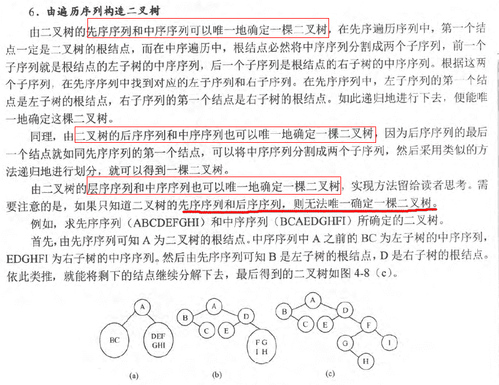
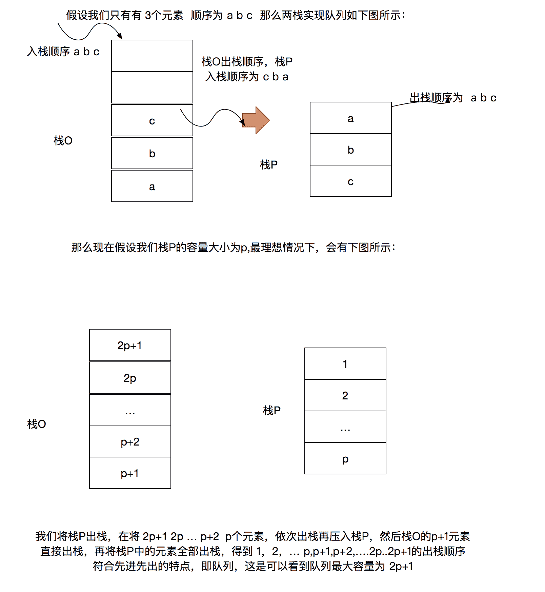
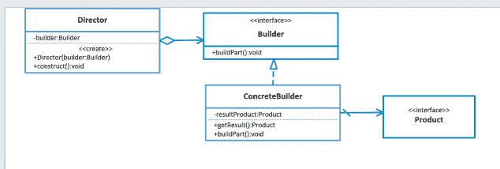
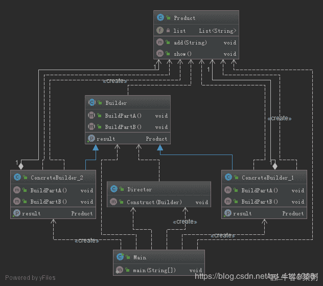
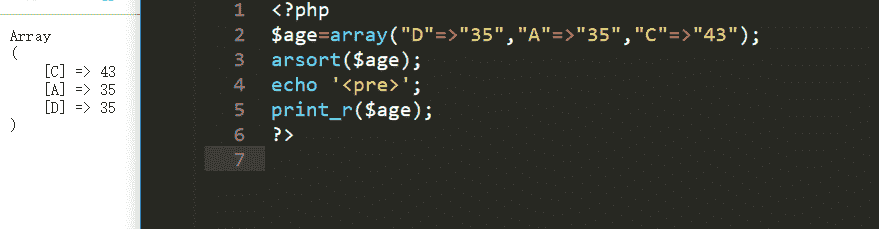
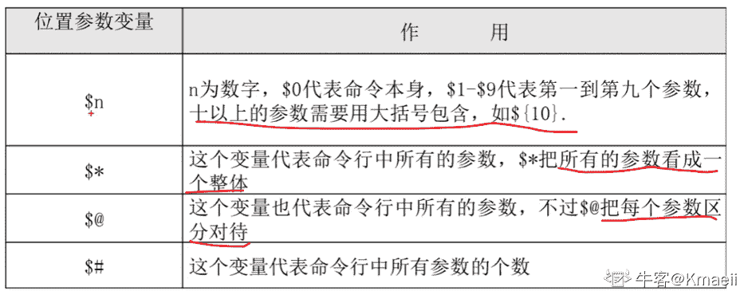
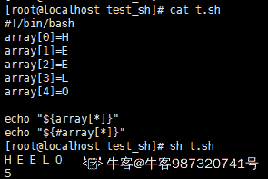

# 京东 2019 春招京东 PHP 开发类试卷

## 1

京东商城 plus 会员的消费记录金额分别为 900，512，613，700，810，若采用选择排序算法对其进行从小到大的排序，第三趟排序结果为：（）

正确答案: C   你的答案: 空 (错误)

```cpp
900，512，613，700，810
```

```cpp
512，900，613，700，810
```

```cpp
512，613，700，900，810
```

```cpp
512，613，700，810，900
```

本题知识点

京东 排序 *讨论

[千叶牧屿](https://www.nowcoder.com/profile/876465076)

选择排序（升序）的工作原理：    对一个未排序数组，先找到最大（最小）的元素，将其放在末尾（起始）位置，然后在剩余未排序的元素中选出最大（最小）元素，将其放在未排序数组的末尾（起始）位置，依次重复，直到所有元素排序完成
所以对于这道题目，选项中的 C（先选最小元素）、D（先选最大元素）两个选项都是正确的。

发表于 2020-12-15 11:28:29

* * *

[EEtransCS](https://www.nowcoder.com/profile/951566692)

给个理由，为什么不能选择最大的沉底？非要选最小的放在前面呢？堆排序不就是沉底操作吗？

发表于 2020-08-13 10:49:48

* * *

[牛客 859114727 号](https://www.nowcoder.com/profile/859114727)

选择排序的基本思想：比较+交换

一组数据，选出最小(最大)的一个数与第一个位置的数交换，然后在剩下的数中，再找最小（最大）的数与第二个位置的数交换位置，

依次类推，直到第 N-1 个元素与第 N 个元素交换位置，选择排序结束。

发表于 2020-07-19 17:17:35

* * *

## 2

在软件开发过程中，我们可以采用不同的过程模型，下列有关增量模型描述正确的（）

正确答案: B   你的答案: 空 (错误)

```cpp
已使用一种线性开发模型，具有不可回溯性
```

```cpp
把待开发的软件系统模块化，将每个模块作为一个增量组件，从而分批次地分析、设计、编码和测试这些增量组件
```

```cpp
适用于已有产品或产品原型（样品），只需客户化的工程项目
```

```cpp
软件开发过程每迭代一次，软件开发又前进一个层次
```

本题知识点

PHP 工程师 京东 软件工程 2019

讨论

[沦陷 201907291812599](https://www.nowcoder.com/profile/690366508)

根据字面意思来看，增量模型，再结合与代码本身就是用来复用的，所以可以吧每个模块都做成一个组件，谁用谁调，个人见解，欢迎纠正

发表于 2019-10-09 19:56:10

* * *

## 3

流程图中表示判断的应使用（ ）

正确答案: B   你的答案: 空 (错误)

```cpp
矩形框
```

```cpp
菱形框
```

```cpp
圆形框
```

```cpp
椭圆形框
```

本题知识点

PHP 工程师 京东 编译和体系结构 2019

讨论

[断墨筏云](https://www.nowcoder.com/profile/208983614)

b。。

发表于 2019-08-03 09:04:04

* * *

## 4

```cpp
public class Test {

  public static int count = 0;

  public static void main(String[] args) {
    int i;
    i = x(8);
    System.out.println(count);
  }

  public static int x(int n) {
    count++;
    if (n <= 3)
      return 1;
    else
      return x(n - 2) + x(n - 4) + 1;
  }
}

```

该程序最后输出结果是多少?

正确答案: A   你的答案: 空 (错误)

```cpp
9
```

```cpp
12
```

```cpp
18
```

```cpp
8
```

本题知识点

递归

讨论

[CDREAMY](https://www.nowcoder.com/profile/454211116)

以 8 为根节点画出分支树 8 个分支表明调用 8 次 再加上自身调用 x(8)一次 共 9 次                                       8                              6                4                       4          2      2       0                 2         0

发表于 2019-07-03 20:27:58

* * *

[林庆聪](https://www.nowcoder.com/profile/6143219)

问题问的是 x(8)调多少次 x(n)，而不是 x(x(8))，所以答案应该是 A

发表于 2019-06-18 16:45:55

* * *

[牛客 355937879 号](https://www.nowcoder.com/profile/355937879)

```cpp
public class Program
{
    public static int count = 0;
    public static void Main(String[] args)
    {
        int i;
        i = FuncX(8, "main 调用 FuncX");
        Console.WriteLine($"调用次数:{count},结果：{i}");
    }

    public static int FuncX(int n, string tip)
    {
        count++;

        //Console.WriteLine($"当前 n:{n},{tip}:{count}");

        if (n <= 3)
        {
            Console.WriteLine($"「{tip}」满足了:{n}\r\n");
            return 1; //==> 符合条件，不用再递过而返回 1，而且执行下一个代码
        }

        Console.WriteLine($"「{tip}」不满足了:{n}");

        int temp_count = FuncX(n - 2, "执行 n-2") + FuncX(n - 4, "执行 n-4") + 1;
        //==> 注意了这个「temp_count」在该方法区域会累计的

        //=== FuncX(n-2) => FuncX(n-4) => FuncX(n-2) => FuncX(n-4)
        //=== FuncX(n-2)符合条件，则执行 FuncX(n-4)
        //=== 注意：FuncX(n-4)包含 FuncX(n-2)以及 FuncX(n-4)

        Console.WriteLine($"{tip}.结果={temp_count}");
        return temp_count;

    }
}

```

发表于 2022-02-06 15:20:01

* * *

## 5

串的朴素模式匹配算法，主要思想是对主串(S)的每一个字符作为子串(T)开头，与要匹配的字符串进行匹配。主串(S)的长度为 n，要匹配的子串的长度为 m，那么朴素模式匹配算法的最坏时间复杂度为：

正确答案: C   你的答案: 空 (错误)

```cpp
O((n-m)*m)
```

```cpp
O((n＋1)*m)
```

```cpp
O((n-m＋1)*m)
```

```cpp
O((m＋1)*n)
```

本题知识点

复杂度

讨论

[牛客 859114727 号](https://www.nowcoder.com/profile/859114727)

串的朴素模式匹配算法也称为 BF(Brute-Force)算法，其基本思想是：从主串的第一个字符起与子串的第一个字符进行比较，若相等，则继续逐对字符进行后续的比较；若不相等，则从主串第二个字符起与子串的第一个字符重新比较，以此类推，直到子串中每个字符依次和主串中的一个连续的字符序列相等为止，此时称为匹配成功。如果不能在主串中找到与子串相同的字符序列，则匹配失败。BF 算法是最原始、最暴力的求解过程，但也是其他匹配算法的基础。下面通过具体 Demo 演示该算法的基本思想。

发表于 2020-07-19 17:22:33

* * *

[牛客 992130223 号](https://www.nowcoder.com/profile/992130223)

最好：O(1),第一次匹配就成功最坏： O((n-m + 1 ) * m ),每次匹配度需要匹配 m 个长度(子串前面都成功，最后一个匹配完发现不成功)，需要匹配 n-m + 1 次 ，这个此时子串末端已到主串末端了， n- m 是代表之前匹配的次数，+ 1 是最后一次的匹配附上参考链接：[`zhuanlan.zhihu.com/p/24649304`](https://zhuanlan.zhihu.com/p/24649304)

发表于 2020-03-17 10:33:06

* * *

[拖拉机代驾哒](https://www.nowcoder.com/profile/619988932)

朴素算法中最坏情况是，前面的都匹配，到最后一个就不匹配的情况，S=”aaaaaaaaaaaab“ P=”aaab“此种情况向前 m-n 个都比较了 n 次，最后第 m-n+1 次进行比较了 n 次，比较成功，所以总共比较次数为（m-n+1）*n 次为了解决这种情况所带来的重复比较问题，引入了 KMP 算法

发表于 2020-03-10 20:18:32

* * *

## 6

一颗二叉树的前序遍历是 ABCDFGHE，后序遍历是 BGHFDECA，中序遍历是？

正确答案: C   你的答案: 空 (错误)

```cpp
GHBADFCE
```

```cpp
DGBAFHEC
```

```cpp
BADGFHCE
```

```cpp
BAGDFHEC
```

本题知识点

PHP 工程师 京东 树 2019

讨论

[进击のlucas](https://www.nowcoder.com/profile/3411843)

这种题只要拿题干中的前序，以及选项中的中序然后构造出树，再比对一下后序就完事儿了。

发表于 2019-11-12 22:09:58

* * *

[怕是不知道怎么改网名哦](https://www.nowcoder.com/profile/355382279)

知道前序和后序遍历，中序遍历会有多种可能：这里有 2 种是：BAGFHDCEBADGFHCE 而答案中只有 BADGFHCE 因此选 C

发表于 2019-07-17 00:53:55

* * *

[遇见不相见](https://www.nowcoder.com/profile/488035187)

只知道一颗二叉树的前序遍历和后序遍历不是不能构造一个二叉树么？王道：

发表于 2019-07-14 09:52:01

* * *

## 7

用俩个栈模拟实现一个队列，如果栈的容量分别是 O 和 P(O>P),那么模拟实现的队列最大容量是多少？

正确答案: C   你的答案: 空 (错误)

```cpp
O+P
```

```cpp
2O+1
```

```cpp
2P+1
```

```cpp
2O-1
```

本题知识点

PHP 工程师 京东 栈 *2019* *讨论

[ZhuFG](https://www.nowcoder.com/profile/5138660)

作图不好请见谅

发表于 2019-07-24 14:52:42

* * *

[faded201911140743912](https://www.nowcoder.com/profile/443102165)

最重要的是通过俩个栈保持队列的先进先出特点

所以以下步骤

1⃣️1234…p 进栈 P 这些数再进栈 O（为了先进先出）

2⃣️此时 O 再进 p+1～2p+1

现在总容量 2p+1

P 中所有数出栈 O 中 2p+1～p+2 进栈 P

此时 O 中只有 p+1 出栈 正好保持了先进先出的特点（就是为什么 2p 还多一个 1）

P 再出栈 以上就满足队列先进先出的特点

发表于 2020-10-27 16:14:08

* * *

[drunken](https://www.nowcoder.com/profile/925760238)

两个关键点吧，一个是大栈不能一次进太多，否则影响小栈的出栈顺序；二是可以把 p+2 到 2p+1 入小栈，大栈栈底的 p+1 可以直接出大栈去排队

发表于 2020-08-16 11:11:41

* * *

## 8

HTTP1.1 的请求方法不包括？

正确答案: C   你的答案: 空 (错误)

```cpp
PUT
```

```cpp
DELETE
```

```cpp
POLL
```

```cpp
TRACE
```

本题知识点

PHP 工程师 京东 网络基础 2019

讨论

[IfElse201905142041626](https://www.nowcoder.com/profile/685347885)

get、post、put(文件)、delete、head、option（查询方式）、trace（追踪路径）、connect（隧道协议连接***）

编辑于 2019-08-28 11:09:33

* * *

[openmind.](https://www.nowcoder.com/profile/539390139)

| **GET：****获取 URL 所标志的资源** | **HEAD：获取 URL 所标志资源的头部信息** |
| **POST：向****服务器提交资源** | **OPTION：获取选项信息** |
| **D****ELETE：删除 URL 所标志的资源** | **T****RAC****E：用在环回测试中** |
| **PUT：向服务器上****传一个文档** | **CONNECT：****通过 HTTP 协议与代理服务器建立连接** |

编辑于 2021-05-07 10:51:14

* * *

[牛客 163734661 号](https://www.nowcoder.com/profile/163734661)

http1.1 get put post update delete

发表于 2019-06-27 01:33:16

* * *

## 9

当在浏览器输入 http://www.jd.com 后，执行过程描述有误的是哪个？ 

正确答案: B   你的答案: 空 (错误)

```cpp
客户端浏览器通过 DNS 解析到 www.jd.com 的 ip 地址，通过 ip 地址找到客户端对应的服务器地址，客户端发起 HTTP 会话到 IP，通过 tcp 进行封装数据包，输入到网络层
```

```cpp
在客户端的网络层，把 http 会话请求分成报文段，添加源地址和目的地址
```

```cpp
客户端的网络层主要通过查找路由确定到达服务器
```

```cpp
数据包通过链路层发送到路由器，通过邻居协议查找给定 ip 地址的 mac 地址，然后发送 ARR 请求查找目的地址，得到回应就可以使用 ARR 的请求应答交换的 IP 数据包，发送 IP 数据包到达服务器地址
```

本题知识点

PHP 工程师 京东 网络基础 2019

讨论

[别骂了别骂了](https://www.nowcoder.com/profile/8017615)

在浏览器中输入[www.baidu.com](http://www.baidu.com)后执行的全部过程

1、客户端浏览器通过 DNS 解析到[www.baidu.com](http://www.baidu.com)的 IP 地址 220.181.27.48，通过这个 IP 地址找到客户端到服务器的路径。客户端浏览器发起一个 HTTP 会话到 220.161.27.48，然后通过 TCP 进行封装数据包，输入到网络层。 
2、在客户端的传输层，把 HTTP 会话请求分成报文段，添加源和目的端口，如服务器使用 80 端口监听客户端的请求，客户端由系统随机选择一个端口如 5000，与服务器进行交换，服务器把相应的请求返回给客户端的 5000 端口。然后使用 IP 层的 IP 地址查找目的端。 
3、客户端的网络层不用关心应用层或者传输层的东西，主要做的是通过查找路由表确定如何到达服务器，期间可能经过多个路由器，这些都是由路由器来完成的工作，我不作过多的描述，无非就是通过查找路由表决定通过那个路径到达服务器。 
4、客户端的链路层，包通过链路层发送到路由器，通过邻居协议查找给定 IP 地址的 MAC 地址，然后发送 ARP 请求查找目的地址，如果得到回应后就可以使用 ARP 的请求应答交换的 IP 数据包现在就可以传输了，然后发送 IP 数据包到达服务器的地址。

发表于 2019-07-02 08:37:51

* * *

[牛客 163734661 号](https://www.nowcoder.com/profile/163734661)

网络层:数据段

发表于 2019-06-27 01:34:06

* * *

[沉迷单车](https://www.nowcoder.com/profile/113271023)

B，在客户端的运输层

发表于 2020-03-05 09:22:00

* * *

## 10

以下命令可以用于获取本机 cpu 使用率的是：

正确答案: C   你的答案: 空 (错误)

```cpp
ifconfig
```

```cpp
uptime
```

```cpp
top
```

```cpp
netstat
```

本题知识点

PHP 工程师 京东 操作系统 2019

讨论

[牛客 95439186 号](https://www.nowcoder.com/profile/95439186)

top 命令 所显示信息的前五行是当前系统情况整体的统计情况。

*   第一行，任务队列信息，同 uptime 命令的执行结果
*   第二行，Tasks — 任务（进程）
*   第三行，cpu 状态信息
*   第四行,内存状态
*   第五行，swap 交换分区信息

    第六行，空行

    第七行以下：各进程（任务）的状态监控

发表于 2020-04-02 12:01:57

* * *

[就不给你佛](https://www.nowcoder.com/profile/657108121)

c linux 的常用命令

发表于 2019-07-03 00:17:27

* * *

## 11

关系型数据库创建表都有主键。以下对主键描述正确的是：

正确答案: C   你的答案: 空 (错误)

```cpp
主键是唯一索引，唯一索引也是主键
```

```cpp
主键是一种特殊的唯一性索引，只可以是聚集索引
```

```cpp
主键是唯一、不为空值 的列
```

```cpp
对于聚集索引来说，创建主键时，不会自动创建主键的聚集索引
```

本题知识点

PHP 工程师 京东 数据库 2019

讨论

[YEE_HOLIC](https://www.nowcoder.com/profile/146668385)

主键与索引：1 主键唯一标识一条记录，不能重复的，不允许为空；索引 该字段没有重复值但可以有一个空值 2 主键用于保证数据完整性；索引用于提高查询排序的速度 3 主键只能有一个；一个表可以有多个唯一索引

发表于 2019-10-29 13:14:05

* * *

[丶 Berserker](https://www.nowcoder.com/profile/957501620)

答案：CA：错误。主键是一种约束，约束：对表中的数据进行限定。唯一索引是索引。两者没有直接关系。B：错误。前半句正确，后半句错误。在 Innodb 下主键索引是聚簇索引，在 MyISAM 下主键索引是非聚簇索引 C：正确。D：错误。聚集索引只是一种数据存储方式，并不是一种单独的索引类型。在 Innodb 下主键索引是聚簇索引，且 Innodb 下的表必有一个主键索引。**补充：** 在 Innodb 下主键索引是聚簇索引，在 MyISAM 下主键索引是非聚簇索引    一张表只能有一个聚簇索引。

发表于 2022-02-10 13:41:38

* * *

[断墨筏云](https://www.nowcoder.com/profile/208983614)

主键不可重复，不为空，一个表只能有一个主键

发表于 2019-08-03 09:07:57

* * *

## 12

下图的 UML 类结构图表示的是哪种设计模式：

正确答案: B   你的答案: 空 (错误)

```cpp
访问者模式
```

```cpp
生成器模式
```

```cpp
代理模式
```

```cpp
命令模式
```

本题知识点

PHP 工程师 京东 UML 2019

讨论

[烬天玉藻前](https://www.nowcoder.com/profile/195480900)

我是不是刷到了 4 道一样的题？

发表于 2020-04-18 22:34:37

* * *

[菜粥](https://www.nowcoder.com/profile/5293318)

建造者模式 UML 图（IDEA 自动生成）



大话设计模式-建造者模式

[`localhost.blog.csdn.net/article/details/89140078`](https://localhost.blog.csdn.net/article/details/89140078)

大话设计模式-系列文章(共 50 篇)：

[`blog.csdn.net/qq_41113081/category_8723350.html`](https://blog.csdn.net/qq_41113081/category_8723350.html)

发表于 2020-03-23 00:05:36

* * *

## 13

对象间存在一对多关系，当一个对象被修改时，则会自动通知它的依赖对象，采用以下哪种设计模式最好？

正确答案: B   你的答案: 空 (错误)

```cpp
建造者模式
```

```cpp
观察者模式
```

```cpp
策略模式
```

```cpp
代理模式
```

本题知识点

PHP 工程师 京东 设计模式 2019

讨论

[会飞的字节](https://www.nowcoder.com/profile/5974940)

观察者模式又叫发布订阅模式。类似于微信公众号。

作者和读者是一对多的关系，当发布一篇新的文章时，会通知订阅该公众号的读者。

而作者一旦删除或修改文章时，就会提示删除/重新发布，发送到读者的微信上。

发表于 2020-08-04 11:51:56

* * *

[菜粥](https://www.nowcoder.com/profile/5293318)

观察者模式 UML 图（IDEA 自动生成）


大话设计模式-观察者模式

[`localhost.blog.csdn.net/article/details/89334733`](https://localhost.blog.csdn.net/article/details/89334733)

大话设计模式-系列文章(共 50 篇)：

[`blog.csdn.net/qq_41113081/category_8723350.html`](https://blog.csdn.net/qq_41113081/category_8723350.html)

发表于 2020-03-23 00:22:22

* * *

[沦陷 201907291812599](https://www.nowcoder.com/profile/690366508)

观察者模式

当对象间存在一对多关系时，则使用观察者模式（Observer Pattern）。比如，当一个对象被修改时，则会自动通知它的依赖对象。观察者模式属于行为型模式。

发表于 2019-10-09 19:57:58

* * *

## 14

要求匹配以下 16 进制颜色值，正则表达式可以为：

```cpp
#ffbbad
#Fc01DF
#FFF
#ffE
```

正确答案: B   你的答案: 空 (错误)

```cpp
/#([0-9a-f]{6}|[0-9a-fA-F]{3})/g
```

```cpp
/#([0-9a-fA-F]{6}|[0-9a-fA-F]{3})/g
```

```cpp
/#([0-9a-fA-F]{3}|[0-9a-f]{6})/g
```

```cpp
/#([0-9A-F]{3}|[0-9a-fA-F]{6})/g
```

本题知识点

PHP 工程师 京东 编程基础 *2019* *讨论

[82 年的苏打水](https://www.nowcoder.com/profile/6103363)

[0-9a-fA-F]{6}表示全部数字和大小写字母  一共 6 个[0-9a-fA-F]{3}表示全部数字和大小写字母  一共 3 个
这个觉得稍微了解一点就行了[`www.runoob.com/regexp/regexp-example.html`](https://www.runoob.com/regexp/regexp-example.html)

发表于 2019-08-30 08:27:54

* * *

[黄色变白色](https://www.nowcoder.com/profile/8547911)

一脸懵逼

发表于 2019-07-28 18:54:45

* * *

[e5522129](https://www.nowcoder.com/profile/5522129)

```cpp
    var regex = /#([0-9a-fA-F]{6}|[0-9a-fA-F]{3})\b/g
    var string = "#Fc01DF #FFF #ffE #1234 #12345 #ffbbad"
    console.log(string.match(regex))
```

答案有缺陷,用答案来测试上面的 string 会匹配出 "#123",而 hex 颜色只能出现 3 或 6 位.我改进了一下,增加检测字符边界,这样只会匹配出 `["#Fc01DF", "#FFF", "#ffE", "#ffbbad"]` 编辑于 2020-02-18 09:42:58

* * *

## 15

不能从字符串 const str = 'qwbewrbbeqqbbbweebbbbqee';中能得到结果 ["b", "bb", "bbb", "bbbb"]的语句是？

正确答案: B   你的答案: 空 (错误)

```cpp
str.match(/b+/g)
```

```cpp
str.match(/b*/g)
```

```cpp
str.match(/b{1,4}/g)
```

```cpp
str.match(/b{1,5}/g)
```

本题知识点

PHP 工程师 京东 Javascript 2019

讨论

[更爱百事可乐](https://www.nowcoder.com/profile/6586649)

```cpp
/b+/g    //匹配前面的子表达式一次或多次，有一个或多个 b 

/b*/g    //匹配前面的子表达式零次或多次,结果不止数组中那么多 

/b{1,4}/g   //匹配 1-4 个 b  

/b{1,5}/g    //匹配 1-5 个 b  
```

发表于 2019-06-27 21:18:29

* * *

[$枫](https://www.nowcoder.com/profile/443026278)

+表示出现至少一次 b*表示可以不出现 b，也可以出现一次或多次{n,m}表示最少出现 n 次 b,最多出现 m 次 b 参考链接：[`www.runoob.com/regexp/regexp-syntax.html`](https://www.runoob.com/regexp/regexp-syntax.html)

发表于 2019-07-04 18:40:26

* * *

[Tobe 牛](https://www.nowcoder.com/profile/96742518)

审题，是错误的，不要看见一个对的直接选。。。

发表于 2020-03-08 09:08:44

* * *

## 16

如下代码输出为

```cpp
<?php
$num  = "1";
$num1 = "2";
print $num + $num1 ;
?>
```

正确答案: A   你的答案: 空 (错误)

```cpp
3
```

```cpp
1+2
```

```cpp
1.+.2
```

```cpp
Error
```

本题知识点

PHP 工程师 京东 PHP 2019

讨论

[MYxu](https://www.nowcoder.com/profile/3098509)

A. 字符串在相加的时候被自动转换类型了

发表于 2019-06-06 01:00:08

* * *

[短腿小萝卜](https://www.nowcoder.com/profile/847517634)

print 打印简单的类型

print_r 打印较为复杂的类型

字符进行隐式转化成整数

发表于 2020-09-16 14:25:59

* * *

[牛客 559098572 号](https://www.nowcoder.com/profile/559098572)

原本字符串，进行+运算时，强制转化为整形运算

发表于 2020-05-22 01:36:02

* * *

## 17

php-fpm 运行的网站需要修改时区，需要进行如下操作：

正确答案: A   你的答案: 空 (错误)

```cpp
修改 php.ini 的 date.timezone，重启 php-fpm
```

```cpp
修改 php.ini 的 date.timezone，无需重启 php-fpm
```

```cpp
修改 php-fpm.conf 的 date.timezone，重启 php-fpm
```

```cpp
修改 php-fpm.conf 的 date.timezone，无需重启 php-fpm
```

本题知识点

PHP 工程师 京东 PHP 2019

讨论

[mark_php](https://www.nowcoder.com/profile/38262677)

A 修改 php.ini 配置文件需要重启 php-fpm 服务，可以通过 date_default_timezone_get()函数获取当前设置的时区。

编辑于 2021-04-12 10:46:05

* * *

[牛客 875698325 号](https://www.nowcoder.com/profile/875698325)

怎么解释 ini_set 动态修改配置？

发表于 2020-05-25 00:25:18

* * *

[我是罗同学](https://www.nowcoder.com/profile/692403076)

A

发表于 2019-10-27 20:27:15

* * *

## 18

关于 arsort()函数，如下说法正确的是（）

正确答案: B   你的答案: 空 (错误)

```cpp
对数组值按照从大到小排序，稳定排序
```

```cpp
对数组值按照从大到小排序，非稳定排序
```

```cpp
对数组键按照从大到小排序，稳定排序
```

```cpp
对数组键按照从小到大排序，非稳定排序
```

本题知识点

PHP 工程师 京东 PHP 2019

讨论

[恩平陈冠希](https://www.nowcoder.com/profile/641779016)

发表一下个人看法
稳定排序的概念: 排序前两个相等的数其在序列的前后位置顺序和排序后它们两个的前后位置顺序相同。
 从上面可以看出 原来数组的键值排序是  DAC  打印出来的是  CAD   顺序乱了
欢迎大家讨论...

编辑于 2019-07-07 12:56:13

* * *

[王中阳 001](https://www.nowcoder.com/profile/485168282)

sort()、asort()、arsort() 底层是用快排实现的。无法保证同等大小的元素的顺序。

发表于 2022-02-16 10:22:38

* * *

[newview](https://www.nowcoder.com/profile/76627745)

arsort()从大到小排序，非稳定排序。

发表于 2021-02-28 14:24:39

* * *

## 19

如下代码输出为

```cpp
<?php
$array = array(1
=> 'blue', 2 => 'red', 3 => 'green', 4 => 'red');
$key =
array_search('green', $array);
print $key;
?>
```

正确答案: D   你的答案: 空 (错误)

```cpp
TRUE
```

```cpp
FALSE
```

```cpp
1
```

```cpp
3
```

本题知识点

PHP 工程师 京东 PHP 2019

讨论

[我是罗同学](https://www.nowcoder.com/profile/692403076)

D 搜索键值返回键名

发表于 2019-10-27 20:39:52

* * *

[phper_jlz](https://www.nowcoder.com/profile/528179296)

```cpp
array_search 搜索键值，返回键名
```

发表于 2019-09-03 20:50:07

* * *

[MYxu](https://www.nowcoder.com/profile/3098509)

D   ```cpp
array_search(*value*,*array*,*strict*)
```

函数在数组中搜索某个键值，并返回对应的键名。设置第三参数为 true 的时候则会同时对比 value 的值与数据类型

发表于 2019-06-06 01:04:12

* * *

## 20

关于 PHP 中 trait 正确的说法是： 

正确答案: C   你的答案: 空 (错误)

```cpp
使用 trait 实现了一种代码复用机制,使用 extent 关键字声明使用 trait
```

```cpp
使用 trait 实现了一种代码追踪机制,使用 use 关键字声明使用 trait
```

```cpp
使用 trait 实现了一种代码复用机制,使用 use 关键字声明使用 trait
```

```cpp
使用 trait 实现了一种代码追踪机制,使用 extent 关键字声明使用 trait
```

本题知识点

PHP 工程师 京东 PHP 2019

讨论

[HuangZhihao](https://www.nowcoder.com/profile/3773757)

PHP 提供 trait 实现多继承机制，子类用 use 复用 trait 类的方法属性

发表于 2019-07-09 22:05:29

* * *

[上杉绘梨依](https://www.nowcoder.com/profile/217913643)

trait 是既想集成基累属性和方法，又想拥有其他基类属性和方法的一个关键字，一般是和 use 一起，多个 trait 使用，分隔，遇到同名方法，当前累会覆盖 trait、trait 会覆盖基类

发表于 2020-05-27 13:06:18

* * *

[我是罗同学](https://www.nowcoder.com/profile/692403076)

C

发表于 2019-10-27 20:40:37

* * *

## 21

在以下 PHP 链接数据库语句中，数据库关闭指令将关闭哪个连接标识：

```cpp
<?
$link1 =mysql_connect("localhost","root","");
$link2 =mysql_connect("localhost","root","");
mysql_close();
?>
```

正确答案: D   你的答案: 空 (错误)

```cpp
报错
```

```cpp
全部关闭
```

```cpp
$link1
```

```cpp
$link2
```

本题知识点

PHP 工程师 京东 PHP 2019

讨论

[phper_jlz](https://www.nowcoder.com/profile/528179296)

mysql_close() 关闭指定连接如果没有指定，则关闭最近打开的链接

发表于 2019-09-04 21:10:52

* * *

[恩平陈冠希](https://www.nowcoder.com/profile/641779016)

补充一下一楼的说法  第二次调用 mysql_connect()，将不会建立新连接，而将返回已经打开的连接标识 所以两次 connect 都是返回同一个连接标识  那么关闭的时候实质上是关闭第一个的   就近原则
个人看法 欢迎交流讨论
参考自
[`www.jianshu.com/p/94472f89789d`](https://www.jianshu.com/p/94472f89789d)

发表于 2019-07-07 12:28:08

* * *

[一剑还](https://www.nowcoder.com/profile/557751994)

```cpp
mysql_close(link_identifier)
```

| 参数 | 描述 |
| link_identifier | 必需。MySQL 的连接标识符。如果没有指定，默认使用最后被 [mysql_connect()](https://www.w3school.com.cn/php/func_mysql_connect.asp) 打开的连接。如果没有找到该连接，函数会尝试调用 [mysql_connect()](https://www.w3school.com.cn/php/func_mysql_connect.asp) 建立连接并使用它。如果发生意外，没有找到连接或无法建立连接，系统发出 E_WARNING 级别的警告信息。 |

发表于 2019-09-03 15:11:24

* * *

## 22

在 PHP 操作数据库方法中，mysql_affected_rows()对哪个操作没有影响 

正确答案: C   你的答案: 空 (错误)

```cpp
update
```

```cpp
insert
```

```cpp
select
```

```cpp
delete
```

本题知识点

PHP 工程师 京东 PHP 2019

讨论

[点点 201903241048541](https://www.nowcoder.com/profile/828681553)

取得最近一次与 link_identifier 关联的 INSERT，UPDATE 或 DELETE 查询所影响的记录行数。

发表于 2019-07-03 11:06:55

* * *

[牛客-hiro](https://www.nowcoder.com/profile/455648)

mysqli_affected_rows() 函数返回前一次 MySQL 操作（SELECT、INSERT、UPDATE、REPLACE、DELETE）所影响的记录行数。mysql_affected_rows() 取得最近一次与 link_identifier 关联的 INSERT，UPDATE 或 DELETE 查询所影响的记录行数。 

发表于 2019-09-23 16:20:53

* * *

## 23

在 PHP 中哪个变量数组总是包含所有总客户端发出的 cookies 数据：

正确答案: B   你的答案: 空 (错误)

```cpp
$_COOKIES
```

```cpp
$_COOKIE
```

```cpp
$_GETCOOKIE
```

```cpp
$_GETCOOKIES
```

本题知识点

PHP 工程师 京东 PHP 2019

讨论

[我是罗同学](https://www.nowcoder.com/profile/692403076)

B 超全局变量 例如$_SESSION $_POST $_SERVER $_FILES $_ENV 等

发表于 2019-10-27 20:48:26

* * *

[牛客 530445185 号](https://www.nowcoder.com/profile/530445185)

[$_COOKIE](https://www.php.net/manual/zh/reserved.variables.cookies.php)，不是[$_COOKIE](https://www.php.net/manual/zh/reserved.variables.cookies.php)S

发表于 2020-08-06 10:04:42

* * *

## 24

PHP 链接数据库方法中，使用以下那条指令能够实现数据库的长久连接：

正确答案: A   你的答案: 空 (错误)

```cpp
mysql_pconnect
```

```cpp
mysql_pconnetcd
```

```cpp
mysql_connectd
```

```cpp
mysql_connect
```

本题知识点

PHP 工程师 京东 PHP 2019 C++工程师 牛客

讨论

[小白吃小白](https://www.nowcoder.com/profile/936962575)

mysql_pconnect — 打开一个到 MySQL 服务器的持久连接 ,如果成功则返回一个正的 MySQL 持久连接标识符，出错则返回 **flase**。mysql_connect — 打开一个到 MySQL 服务器的连接 

发表于 2019-07-12 08:30:30

* * *

[mark_php](https://www.nowcoder.com/profile/38262677)

A 如果采用 PDO 的方式则建立长连接是 new PDO($dsn, $user, $pwd, array(PDO::ATTR_PERSISTENT=>true))

发表于 2021-04-08 10:51:08

* * *

[周楚岚](https://www.nowcoder.com/profile/653161627)

mysql_pconnect

(PHP 4, PHP 5)

mysql_pconnect — 打开一个到 MySQL 服务器的持久连接

说明[ ¶](https://www.php.net/manual/zh/function.mysql-pconnect.php#refsect1-function.mysql-pconnect-unknown-unknown-unknown-unknown-unknown-unknown-unknown-unknown-unknown-unknown-unknown-unknown-unknown-seealtb)

mysql_pconnect ([ string $server [, string $username [, string $password [, int $client_flags ]]]] ) : resource

如果成功则返回一个正的 MySQL 持久连接标识符，出错则返回 FALSE。

mysql_pconnect() 建立一个到 MySQL 服务器的连接。如果没有提供可选参数，则使用如下默认值：server = 'localhost:3306'，username = 服务器进程所有者的用户名，password = 空密码。client_flags 参数可以是以下常量的组合：MYSQL_CLIENT_COMPRESS，MYSQL_CLIENT_IGNORE_SPACE 或者 MYSQL_CLIENT_INTERACTIVE。

server 参数也可以包括端口号，例如 "hostname:port"，或者是本机套接字的的路径，例如 ":/path/to/socket"。

> Note:
> 
> 对 ":port" 的支持是 3.0B4 版添加的。
> 
> 对 ":/path/to/socket" 的支持是 3.0.10 版添加的。

mysql_pconnect() 和 [mysql_connect()](https://www.php.net/manual/zh/function.mysql-connect.php) 非常相似，但有两个主要区别。

首先，当连接的时候本函数将先尝试寻找一个在同一个主机上用同样的用户名和密码已经打开的（持久）连接，如果找到，则返回此连接标识而不打开新连接。

其次，当脚本执行完毕后到 SQL 服务器的连接不会被关闭，此连接将保持打开以备以后使用（[mysql_close()](https://www.php.net/manual/zh/function.mysql-close.php) 不会关闭由 mysql_pconnect() 建立的连接）。

可选参数 client_flags 自 PHP 4.3.0 版起可用。

此种连接称为“持久的”。

> Note:
> 
> 注意，此种连接仅能用于模块版本的 PHP。更多信息参见[数据库持久连接](https://www.php.net/manual/zh/features.persistent-connections.php)一节。

Warning

使用持久连接需要调整一些 Apache 和 MySQL 的配置以使不会超出 MySQL 所允许的连接数目。

发表于 2020-08-04 01:07:12

* * *

## 25

在 PHP 的存储目录中，/tmp 是长传文件的默认存储目录，更改这个目录需要编辑哪个文件的哪个属性值？

正确答案: D   你的答案: 空 (错误)

```cpp
php.conf 文件的 upload_dir 属性
```

```cpp
php.conf 文件的 upload_tmp_dir 属性
```

```cpp
php.ini 文件的 upload_dir 属性
```

```cpp
php.ini 文件的 upload_tmp_dir 属性
```

本题知识点

PHP 工程师 京东 PHP 2019

讨论

[牛客-hiro](https://www.nowcoder.com/profile/455648)

在 PHP 的存储目录中，/tmp 是长传文件的默认存储目录。更改这个目录需要编辑：

```cpp
php.ini 文件的 upload_tmp_dir 属性
```

[`www.php.net/manual/zh/ini.core.php#ini.upload-tmp-dir`](https://www.php.net/manual/zh/ini.core.php#ini.upload-tmp-dir)

发表于 2019-09-23 15:23:12

* * *

[我是罗同学](https://www.nowcoder.com/profile/692403076)

D

发表于 2019-10-27 20:50:39

* * *

[CharryPeng](https://www.nowcoder.com/profile/496877)

根本不存在 php.conf 文件？Unix 类系统下配置文件后缀为 cnf，win 下后缀为 ini

发表于 2019-09-16 10:55:53

* * *

## 26

```cpp

	$a=['a','b','c'];

	$b=['a','b'];

	$c=$a+$b;

```

则$c 等于：

正确答案: B   你的答案: 空 (错误)

```cpp
{a,a,b,b,c};
```

```cpp
{a,b,c};
```

```cpp
{a,b,c,a,b};
```

```cpp
{a,c,a,b};
```

本题知识点

PHP 工程师 京东 PHP 2019

讨论

[glim](https://www.nowcoder.com/profile/648433)

正确答案 B, 在 PHP 中， 数组 +   ， 当键值相同时， 前面的覆盖后面的

发表于 2019-05-24 11:32:03

* * *

[牛客-hiro](https://www.nowcoder.com/profile/455648)

题目应该这样写：

```cpp
$a=['a','b','c'];
$b=['a','b'];
$c=$a+$b;
```

才正确。
+ 运算符把右边的数组元素附加到左边的数组后面，两个数组中都有的键名，则只用左边数组中的，右边的被忽略。

编辑于 2019-09-23 16:18:23

* * *

[假装是大佬 s](https://www.nowcoder.com/profile/393206923)

在 PHP 中可以使用{}来定义数组？是我迷糊了吗？

发表于 2019-08-15 15:11:02

* * *

## 27

```cpp
function
double($a)
{
       return
$a*$a;
}
$c=double(5);
```

则变量 c 的数据类型为：

正确答案: C   你的答案: 空 (错误)

```cpp
fload
```

```cpp
double
```

```cpp
int
```

```cpp
string
```

本题知识点

PHP 工程师 京东 PHP 2019

讨论

[Q3347751916](https://www.nowcoder.com/profile/244110690)

这是 javascript 题啊，出题人有没有看清楚

发表于 2019-06-29 22:15:38

* * *

[小洪 1617](https://www.nowcoder.com/profile/6833493)

这是 JS 题，JS 的数据类型 不存在 int，double 这种的……只有 number 但这题的结果其实也不是 number， 而是 undefined。。因为 return 后面换行了。如果 return 后面有换行，JS 会自动补全一个 分号。 因此代码就变成了： return;   $a*$a;        所以 return 的结果会是一个空行，而不是乘积。所以 typeof 得出的结果会是 undefined。。

如果把 return 后面的换行去掉，那么就是 number

发表于 2019-07-30 09:27:09

* * *

[TeFuir201906262020928](https://www.nowcoder.com/profile/647119827)

为什么我输出的是 number

发表于 2019-07-29 19:58:04

* * *

## 28

下面的代码的输出是结果为：

```cpp
<?php 
$s = '12345'; 
$s[$s[1]] = '2'; 
Echo $s; 
?>
```

正确答案: D   你的答案: 空 (错误)

```cpp
12345
```

```cpp
11345
```

```cpp
22345
```

```cpp
12245
```

本题知识点

PHP 工程师 京东 PHP 2019

讨论

[牛客 528598908 号](https://www.nowcoder.com/profile/528598908)

把字符串看做数组，$s[1]中，因为是从 0 开始的，所以 1 对应的就是$s ="12345"里的 2，所以$s[1]=2。然后$s[$s[1]] = '2'就变成了$s[2] = '2'; 左边$s[2]对应的数是$s ="12345"里的 3 而=是赋值的意思，所以把右边的 2 赋值给了$s ="12345"里的 3。所以就变成了 12245

发表于 2020-04-10 18:26:30

* * *

[uniChao](https://www.nowcoder.com/profile/443686873)

把字符串看做数组

发表于 2022-02-21 14:16:38

* * *

[牛客 531967236 号](https://www.nowcoder.com/profile/531967236)

面试出这题好无聊，图啥

发表于 2022-02-08 20:17:05

* * *

## 29

以下语句可以用来获取 shell 脚本参数的是

正确答案: A C   你的答案: 空 (错误)

```cpp
$1
```

```cpp
$?
```

```cpp
$*
```

```cpp
$$
```

本题知识点

PHP 工程师 京东 shell 2019

讨论

[Evan 丶.](https://www.nowcoder.com/profile/6090029)

shell 中$0, $#, $*, $@, $?, $$的含义$0    当前脚本的文件名$n    传递给脚本或函数的参数。n 是一个数字，表示第几个参数。例如，第一个参数是$1，第二个参数是$2。$#    传递给脚本或函数的参数个数。$*    传递给脚本或函数的所有参数。$@    传递给脚本或函数的所有参数。$?    上个命令的退出状态，或函数的返回值。$$    当前 Shell 进程 ID。对于 Shell 脚本，就是这些脚本所在的进程 ID。$!    Shell 最后运行的后台 Process 的 PID$-    显示 Shell 使用的当前选项，与 set 命令功能相同。$* 和 $@ 的区别        $* 和 $@ 都表示传递给函数或脚本的所有参数，不被双引号(" “)包含时，都以”$1" “2&quot;…&quot;2"…"n” 的形式输出所有参数当它们被双引号(" “)包含时，”$*" 会将所有的参数作为一个整体，以"$1 $2 … n&quot;的形式输出所有参数；&quot;n"的形式输出所有参数；"@" 会将各个参数分开，以"$1" “2&quot;…&quot;2"…"n” 的形式输出所有参数。

发表于 2020-08-04 20:43:33

* * *

[派小星 326](https://www.nowcoder.com/profile/261111942)

$? 返回的是 shell 执行结果的返回码，这个不算是 SHELL 脚本参数吧

发表于 2020-03-24 01:34:11

* * *

[Kmaeii](https://www.nowcoder.com/profile/365222092)

答案是 A,C 吧？

发表于 2020-07-15 09:06:50

* * *

## 30

下面代码执行后输出为（  ）

```cpp
#!/bin/bash
array[0]=H
array[1]=E
array[2]=E
array[3]=L
array[4]=O
echo "${#array[*]}"
```

正确答案: B   你的答案: 空 (错误)

```cpp
4
```

```cpp
5
```

```cpp
H E E L O
```

```cpp
0 1 2 3 4
```

本题知识点

PHP 工程师 京东 shell 2019

讨论

[大星星和小猩猩](https://www.nowcoder.com/profile/9374535)

bash shell 中的符号“#”往往跟长度、数量有关~

发表于 2020-04-01 17:48:23

* * *

[牛客 987320741 号](https://www.nowcoder.com/profile/987320741)

如上图，答案：B

发表于 2020-08-20 10:19:55

* * *

[薄荷加可乐](https://www.nowcoder.com/profile/399843282)

bash 中 `${#var}` 用来获取变量的长度，所以答案是**5** 😂

发表于 2019-07-15 18:13:49

* * ****