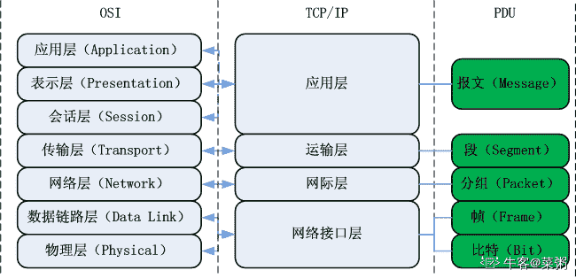
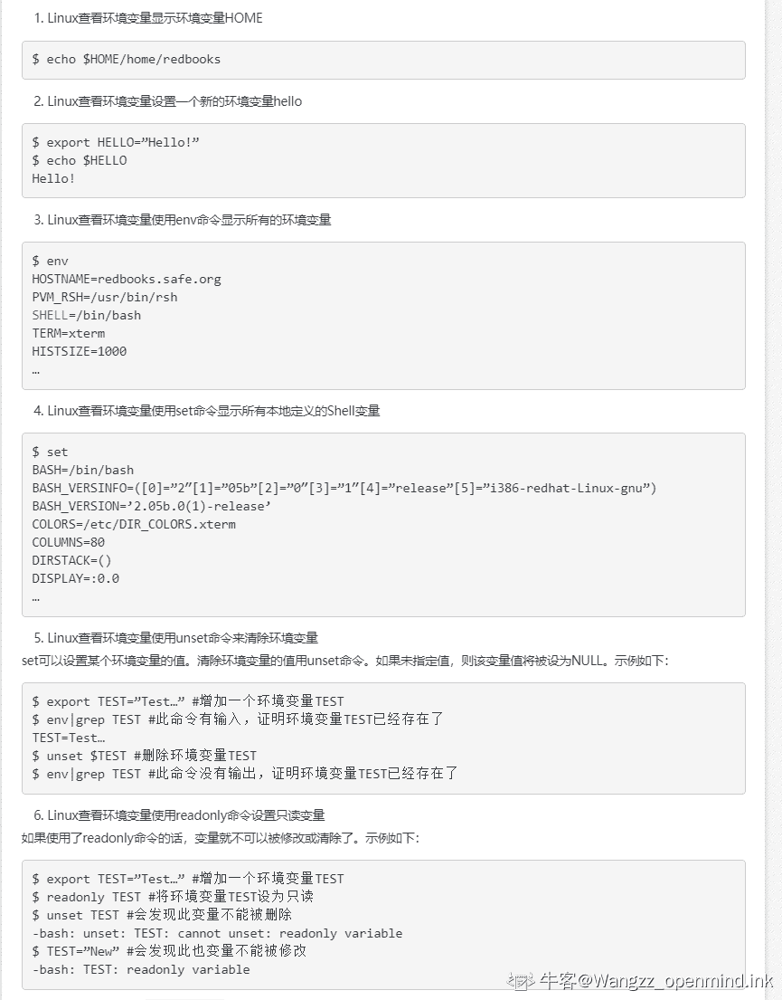
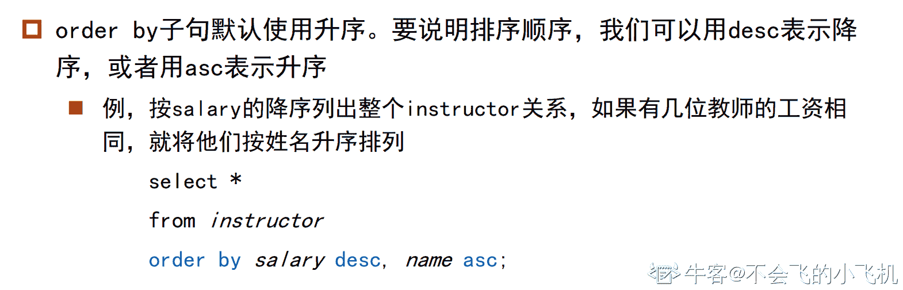
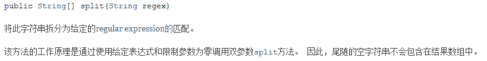
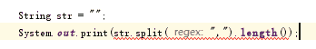
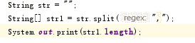
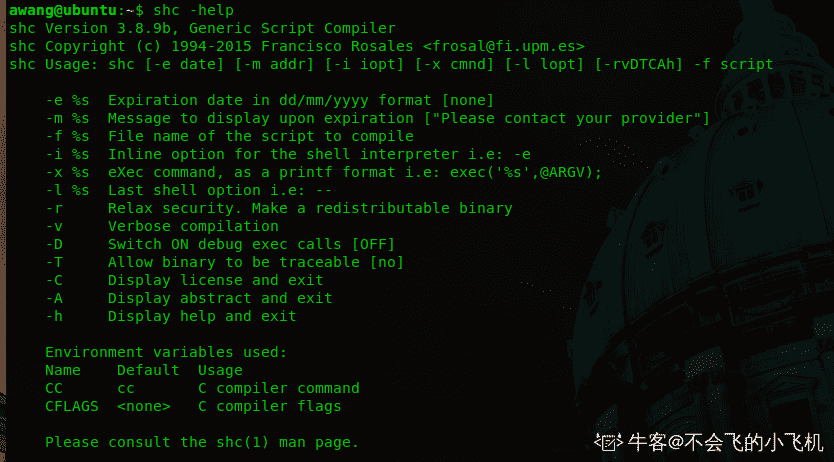
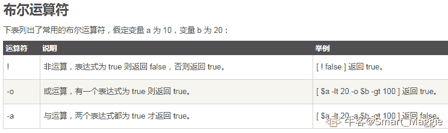
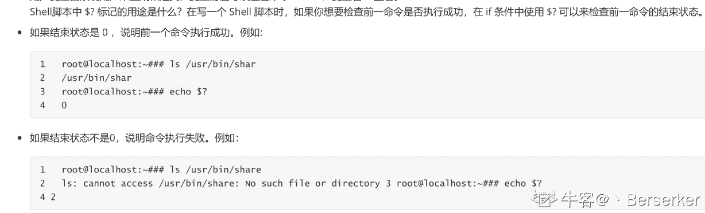

# 京东 2019 春招京东技术运维类试卷

## 1

要交换变量 A 和 B 的值,应使用的语句组( ) 

正确答案: B   你的答案: 空 (错误)

```cpp
A=B;B=C;C=A
```

```cpp
C=A;A=B;B=C
```

```cpp
A=B;B=A
```

```cpp
C=A;B=A;B=C
```

本题知识点

运维工程师 京东 2019

讨论

[雨木木 1](https://www.nowcoder.com/profile/947072902)

直接赋值一个个代

发表于 2019-09-02 10:43:57

* * *

## 2

在软件开发过程中，我们可以采用不同的过程模型，下列有关增量模型描述正确的（）

正确答案: B   你的答案: 空 (错误)

```cpp
已使用一种线性开发模型，具有不可回溯性
```

```cpp
把待开发的软件系统模块化，将每个模块作为一个增量组件，从而分批次地分析、设计、编码和测试这些增量组件
```

```cpp
适用于已有产品或产品原型（样品），只需客户化的工程项目
```

```cpp
软件开发过程每迭代一次，软件开发又前进一个层次
```

本题知识点

运维工程师 京东 软件工程 2019

讨论

[大西瓜 233](https://www.nowcoder.com/profile/916448049)

概念问题 选 B 增量模型是把待开发的软件系统模块化，将每个模块作为一个增量组件，从而分批次地分析、设计、编码和测试这些增量组件。运用增量模型的软件开发过程是递增式的过程。相对于瀑布模型而言，采用增量模型进行开发，开发人员不需要一次性地把整个软件产品提交给用户，而是可以分批次进行提交。A 是瀑布模型 C 是原型模型 D 是螺旋模型

发表于 2019-11-15 21:00:27

* * *

[123hao](https://www.nowcoder.com/profile/1580288)

发现京东年年都考这题啊

发表于 2020-08-29 08:27:58

* * *

[foxband](https://www.nowcoder.com/profile/594462035)

D 是迭***

发表于 2019-10-28 18:52:53

* * *

## 3

流程图中表示判断的应使用（ ）

正确答案: B   你的答案: 空 (错误)

```cpp
矩形框
```

```cpp
菱形框
```

```cpp
圆形框
```

```cpp
椭圆形框
```

本题知识点

运维工程师 京东 2019

## 4

京东商城 plus 会员的消费记录金额分别为 900，512，613，700，810，若采用选择排序算法对其进行从小到大的排序，第三趟排序结果为：（）

正确答案: C   你的答案: 空 (错误)

```cpp
900512613700810
```

```cpp
512900613700810
```

```cpp
512613700900810
```

```cpp
512613700810900
```

本题知识点

运维工程师 京东 2019

讨论

[律己。](https://www.nowcoder.com/profile/353944860)

选择排序，即每次选择最小的与第一个数（选择过的除外）交换。第一次：512 900 613 700 810 第二次：512 613 900 700 810 第三次：512 613 700 900 810

发表于 2019-06-04 20:26:18

* * *

## 5

下列叙述中，有关线性链表叙述正确的是（）

正确答案: D   你的答案: 空 (错误)

```cpp
线性链表中的表头元素一定存储在其他元素的前面
```

```cpp
线性链表中的各元素在存储空间中的位置不一定是连续的，但表头元素一定存储在其他元素的前面
```

```cpp
线性链表中的各元素在存储空间中的位置必须是连续的
```

```cpp
线性链表中的各元素在存储空间中的位置不一定是连续的，且各元素的存储顺序也是任意的
```

本题知识点

运维工程师 京东 2019

## 6

下列关于队列的叙述中正确的是（）

正确答案: C   你的答案: 空 (错误)

```cpp
在队列中只能插入数据
```

```cpp
在队列中只能删除数据
```

```cpp
队列是先进先出的线性表
```

```cpp
队列是先进后出的线性表
```

本题知识点

运维工程师 京东 队列 *2019* *讨论

[天尊墨宇](https://www.nowcoder.com/profile/667959477)

选 C 队列是线性表，只能在一端插入，一端删除，所以是先进先出的，类似于排队。

发表于 2020-10-09 07:25:55

* * *

[SZU_QicaiHuang](https://www.nowcoder.com/profile/985959958)

队列是线性表，只能在一端插入，另一端删除，所以是先进先出。

发表于 2019-12-24 15:45:19

* * *

## 7

一颗二叉树的前序遍历是 ABCDFGHE，后序遍历是 BGHFDECA，中序遍历是？

正确答案: C   你的答案: 空 (错误)

```cpp
GHBADFCE
```

```cpp
DGBAFHEC
```

```cpp
BADGFHCE
```

```cpp
BAGDFHEC
```

本题知识点

运维工程师 京东 树 2019

讨论

[滴水-888](https://www.nowcoder.com/profile/562585559)

前序遍历和后序遍历不能唯一确定一棵树

发表于 2019-07-09 11:00:43

* * *

[牛客 818471470 号](https://www.nowcoder.com/profile/818471470)

一颗二叉树的前序遍历是 ABCDFGHE，后序遍历是 BGHFDECA，中序遍历是？ 这道题有窍门，我来跟大家分享一下: 先序是 根左右 ABCDFGHE 中序是 左根右 后序是 左右根 BGHFDECA 这道题已知前后序，现在求的是中序。 👇🏻👇🏻👇🏻重点就是下面这两句话👇🏻👇🏻👇🏻 根据上面的顺序得知: 中序第一个访问的左，后序第一个访问的是左 中序最后一个访问的右，先序最后一个访问的是右 所以 后序第一个是 B 先序最后一个是 E 所以快速解决了这道题。 中序: BADGFHCE

编辑于 2021-06-02 23:29:33

* * *

[遇光](https://www.nowcoder.com/profile/251218595)

根据二叉树的前序遍历可知 A 为根节点，再根据前序遍历 ABCDFGHE 和后序遍历 BGHFDECA 可知，B 在后序遍历处于第 1 位，所以 B 一定为 A 的左子树，且 A 的左子树只有 B。再根据前序和后序遍历 C 为 A 的右子树。接下来再看后序遍历，我们可以看到 E 是在 C 前面；在前序遍历中 E 排在最后，说明 E 是 C 的右子树并且 C 的右子树唯一。下就是 D 了，由前序和后序遍历可知 D 为 C 的左子树的节点，剩下的结点有 FGH，在前序遍历和后序遍历分别为 FGH 和 GHF，说明 F 是 GH 的父节点，GH 分别为 F 的左右孩子节点，但是现在无法确定的是 FGH 是 D 的左孩子节点还是右孩子节点，如果 F 为 D 的左孩子节点，中序遍历为：BAGFHDCE；如果 F 为 D 的右孩子结点，中序遍历为：BADGFHCE。https://blog.csdn.net/Mr_fengzi/article/details/95799155

发表于 2019-12-07 14:52:59

* * *

## 8

当在浏览器输入 http://www.jd.com 后，执行过程描述有误的是哪个？

正确答案: B   你的答案: 空 (错误)

```cpp
客户端浏览器通过 DNS 解析到 www.jd.com 的 ip 地址，通过 ip 地址找到客户端对应的服务器地址，客户端发起 HTTP 会话到 IP，通过 tcp 进行封装数据包，输入到网络层
```

```cpp
在客户端的网络层，把 http 会话请求分成报文段，添加源地址和目的地址
```

```cpp
客户端的网络层主要通过查找路由确定到达服务器
```

```cpp
数据包通过链路层发送到路由器，通过邻居协议查找给定 ip 地址的 mac 地址，然后发送 ARR 请求查找目的地址，得到回应就可以使用 ARR 的请求应答交换的 IP 数据包，发送 IP 数据包到达服务器地址
```

本题知识点

运维工程师 京东 网络基础 2019

讨论

[dreamwhigh](https://www.nowcoder.com/profile/301974589)

网络层：分片，IP 数据报；传输层：分段，TCP 报文段

发表于 2019-08-13 15:10:24

* * *

[永夜初晗 201906202308930](https://www.nowcoder.com/profile/901251563)

分段发生在传输层，分片发生在网络层

发表于 2019-06-21 00:57:56

* * *

## 9

以下哪个协议可以用来发现本地设备的硬件地址？

正确答案: B   你的答案: 空 (错误)

```cpp
RARP
```

```cpp
ARP
```

```cpp
IP
```

```cpp
ICMP
```

本题知识点

运维工程师 京东 网络基础 2019

讨论

[李维安](https://www.nowcoder.com/profile/3823629)

ARP 通过查找 ip 地址，找出来对应的 MAC 地址，就是物理地址

发表于 2019-07-28 23:24:24

* * *

[牛客 607527475 号](https://www.nowcoder.com/profile/607527475)

RARP（反向地址转换协议）：Reverse Address Resolution ProtocolARP（地址解析协议）：Address Resolution ProtocolICMP（internet 控制报文协议）：Internet Control Message Protocol

发表于 2021-05-07 08:30:34

* * *

[Lane.](https://www.nowcoder.com/profile/849834097)

反向地址转换协议（RARP：Reverse Address Resolution Protocol） 反向地址转换协议（RARP）允许局域网的物理机器从网关服务器的 ARP 表或者缓存上请求其 IP 地址

发表于 2019-10-29 09:47:15

* * *

## 10

OSI 七层模型中,物理层，数据链路层，网络层，传输层的单位是什么（）

正确答案: B   你的答案: 空 (错误)

```cpp
帧 frame，包 packet，段 segment，比特 bit
```

```cpp
比特 bit，帧 frame，包 packet，段 segment
```

```cpp
帧 frame，比特 bit，段 segment，包 packet
```

```cpp
比特 bit，包 packet，帧 frame，段 segment
```

本题知识点

运维工程师 京东 网络基础 2019

讨论

[菜粥](https://www.nowcoder.com/profile/5293318)



发表于 2020-06-28 12:02:53

* * *

[断墨筏云](https://www.nowcoder.com/profile/208983614)

比特成帧，帧成报文，报文成包，包成段

编辑于 2019-08-03 08:49:51

* * *

## 11

关于 DNS 协议以下说法错误的是

正确答案: B D   你的答案: 空 (错误)

```cpp
使用 tcp 协议进行传输
```

```cpp
属于传输层的协议
```

```cpp
可以进行从域名到 ip 的解析
```

```cpp
占用 52 号端口
```

本题知识点

运维工程师 京东 网络基础 2019

讨论

[Breakeveny](https://www.nowcoder.com/profile/950657073)

DNS 在同时占用用 TCP 和 UDP 的 53 端口 在数据传送时使用可靠的 TCP 协议 在域名解析时使用 UDP 协议

发表于 2019-11-14 17:26:22

* * *

[只小白](https://www.nowcoder.com/profile/588423073)

这题目答案不对吧？感觉是 BD，DNS 在进行区域传输的时候使用 TCP 协议，其它时候则使用 UDP 协议；

发表于 2019-06-20 09:47:22

* * *

[牛客 910827090 号](https://www.nowcoder.com/profile/910827090)

DNS 属于应用层协议 DNS 即用 TCP（传输时），又用 UDPDNS 端口号 53

发表于 2021-09-05 23:09:40

* * *

## 12

IP 网络地址中，一个 C 类 IP 地址由（）字节的网络地址和（）字节的主机地址组成。

正确答案: D   你的答案: 空 (错误)

```cpp
1,3
```

```cpp
2,2
```

```cpp
1,2
```

```cpp
3,1
```

本题知识点

运维工程师 京东 网络基础 2019

讨论

[延大 _ 王星星](https://www.nowcoder.com/profile/395313099)

A 类 IP 地址： 一个 A 类 IP 地址是指， 在 IP 地址的四段号码中，第一段号码为网络号码，剩下的三段号码为本地计算机的号码。 如果用二进制表示 IP 地址的话，A 类 IP 地址就由 1 字节的网络地址和 3 字节主机地址组成，网络地址的最高位必须是“0”。 A 类 IP 地址中网络的标识长度为 8 位，主机标识的长度为 24 位，A 类网络地址数量较少，有 126 个网络，每个网络可以容纳主机数达 1600 多万台。 2、B 类 IP 地址 一个 B 类 IP 地址是指，在 IP 地址的四段号码中，前两段号码为网络号码。如果用二进制表示 IP 地址的话，B 类 IP 地址就由 2 字节的网络地址和 2 字节主机地址组成，网络地址的最高位必须是“10”。 B 类 IP 地址中网络的标识长度为 16 位，主机标识的长度为 16 位，B 类网络地址适用于中等规模的网络，有 16384 个网络，每个网络所能容纳的计算机数为 6 万多台。 3、C 类 IP 地址 一个 C 类 IP 地址是指，在 IP 地址的四段号码中，前三段号码为网络号码，剩下的一段号码为本地计算机的号码。 如果用二进制表示 IP 地址的话，C 类 IP 地址就由 3 字节的网络地址和 1 字节主机地址组成，网络地址的最高位必须是“110”。 C 类 IP 地址中网络的标识长度为 24 位，主机标识的长度为 8 位，C 类网络地址数量较多，有 209 万余个网络。适用于小规模的局域网络，每个网络最多只能包含 254 台计算机。

发表于 2019-10-09 17:23:06

* * *

[木易 yr](https://www.nowcoder.com/profile/8769797)

IP 网络地址中，一个 C 类 IP 地址由 3 个字节的网络地址和 1 个字节的主机地址组成。

发表于 2019-06-28 14:12:03

* * *

## 13

在 bash shell 环境下，当一命令正在执行时，按下 control-Z 会： 

正确答案: C   你的答案: 空 (错误)

```cpp
中止前台任务
```

```cpp
给当前文件加上 EOF
```

```cpp
将前台任务转入后台
```

```cpp
注销当前用户
```

本题知识点

运维工程师 京东 shell 2019

讨论

[Evan 丶.](https://www.nowcoder.com/profile/6090029)

shell 中 ctrl+c、z、d、\、s、q、l 的含义 ctrl-c：    发送 SIGINT 信号给前台进程组中的所有进程。常用于终止正在运行的程序；ctrl-z：    发送 SIGTSTP 信号给前台进程组中的所有进程，常用于挂起一个进程；ctrl-d：    不是发送信号，而是表示一个特殊的二进制值，表示 EOF，作用相当于在终端中输入 exit 后回车；ctrl-\：    发送 SIGQUIT 信号给前台进程组中的所有进程，终止前台进程并生成 core 文件；ctrl-s：    中断控制台输出；ctrl-q：    恢复控制台输出；ctrl-l：    清屏

发表于 2020-08-04 20:42:04

* * *

[finch_xu](https://www.nowcoder.com/profile/451767132)

Linux 中 Control+z 和 Control+c 都是中断命令。
不同点：control+z 是任务中断，但任务并没有结束，它还在进程中，但状态是维持挂起状态。
当你执行指令 find / -name “test.c”,按 ctrl+z 中断，你可以 fg+作业号前台继续执行，也可以 bg+作业号后台执行被中断的任务。

发表于 2020-04-20 13:47:35

* * *

[略萌 233](https://www.nowcoder.com/profile/747099759)

eof 是什么

发表于 2020-06-04 19:39:57

* * *

## 14

以下命令用于设置环境变量的是：

正确答案: A   你的答案: 空 (错误)

```cpp
export
```

```cpp
cat
```

```cpp
echo
```

```cpp
env
```

本题知识点

运维工程师 京东 Linux 2019

讨论

["Jerry┎](https://www.nowcoder.com/profile/5946032)

export 用于将 shell 变量输出为环境变量，或者将 shell 函数输出为环境变量 cat 经常用来显示文件的内容**echo**用于在 shell 中打印 shell 变量的值，或者直接输出指定的字符串 env 用于显示系统中已存在的环境变量，以及在定义的环境中执行指令

发表于 2019-07-06 19:36:12

* * *

[openmind.](https://www.nowcoder.com/profile/539390139)



发表于 2021-06-30 16:40:43

* * *

[ahuuua](https://www.nowcoder.com/profile/3527191)

env 查看环境变量与常见环境变量说明 set 查看所有变量（环境变量和自定义变量）export 将自定义变量转成环境变量

发表于 2019-08-13 15:50:16

* * *

## 15

linux 系统下有多个文件目录，每个文件目录都有其独特的功能和作用，以下描述正确的是：

正确答案: C   你的答案: 空 (错误)

```cpp
/bin: 必要的用户二进制可执行文件(部分用户使用)
```

```cpp
/usr: 是文件系统的第二个主要部分. /usr 是不可共享的只读数据
```

```cpp
/etc: 主机特定的系统配置
```

```cpp
/boot: 系统启动时要用到的所有文件
```

本题知识点

运维工程师 京东 Linux 2019

讨论

[可导的蜗牛菌](https://www.nowcoder.com/profile/754627585)

★/bin 可执行文件（二进制）

★/boot linux 内核和系统启动文件

★/dev 设备文件

★/etc 系统配置文件

★/home 用户主目录

★/initrd 启动时挂在 initrdimg 映像文件

★/lib 共享库文件

★/lost+found fsck 放置的零散文件

★/media 系统自动挂在 CD-ROM

★/mnt 被挂载的文件系统

★/opt 可选文件和程序的存放目录

★/proc 存放所有标志为文件的进程

★/root 根用户的主目录

★/sbin 存放更多的可执行文件（二进制）

★/srv

★/sys

★/tmp 存放用户和程序的临时文件

发表于 2019-07-17 23:03:12

* * *

[大星星和小猩猩](https://www.nowcoder.com/profile/9374535)

/bin
该目录又称为二进制目录，包含了那些供系统管理员和普通用户使用的重要 linux 命令的二进制映像。该目录存放的内容包括各种可执行文件，还有某些可执行文件的符号连接，常用的命令有：cp、dmesg、kill、login、rm、ping、chomd、bash、cat、echo、ls、 mail、vi 等。/usr 该目录是 linux 系统最庞大的目录，我们要用到的很多应用程序和文件几乎都存放在这个目录了。
其中，/usr/share 用于存放一些 共享 的数据，比如音乐文件或者图标等等。/etc 该目录是整个 Linux 系统的中心，其中包含所有系统管理和维护方面的配置文件，如 dhcpd.conf、host.conf、logrotate.conf、man.config、mke2fs.conf、modprobe.conf、resolv.conf、sysctl.conf、syslog.conf（或 rsyslog.conf）、xinetd.conf 和 yum.conf 等。
/boot
该目录存放系统核心文件以及启动时必须读取的文件，包括 Linux 内核的二进制映像。

发表于 2020-04-05 19:16:15

* * *

[ceeeeeeeeeeeb](https://www.nowcoder.com/profile/542410100)

**目录详解**
/bin：系统有很多放置执行档的目录，但/bin 比较特殊。**因为/bin 放置的是在单人维护模式下还能够***作的指令。**在/bin 底下的指令可以被 root 与一般帐号所使用，主要有：cat,chmod(修改权限), chown, date, mv, mkdir, cp, bash 等等常用的指令。

/boot：**主要放置开机会使用到的档案，包括 Linux 核心档案以及开机选单与开机所需设定档**等等。Linux kernel 常用的档名为：vmlinuz ，如果使用的是 grub 这个开机管理程式，则还会存在/boot/grub/这个目录。

/dev：在 Linux 系统上，**任何装置与周边设备都是以档案的型态存在于这个目录当中**。 只要通过存取这个目录下的某个档案，就等于存取某个装置。比要重要的档案有/dev/null, /dev/zero, /dev/tty , /dev/lp, / dev/hd, /dev/sd*等等

/etc：**系统主要的设定档几乎都放置在这个目录内，例如人员的帐号密码档、各种服务的启始档等等。** 一般来说，这个目录下的各档案属性是可以让一般使用者查阅的，但是只有 root 有权力修改。 FHS 建议不要放置可执行档(binary)在这个目录中。 比较重要的档案有：/etc/inittab, /etc/init.d/, /etc/modprobe.conf, /etc/X11/, /etc/fstab, /etc/sysconfig/等等。 另外，其下重要的目录有：/etc/init.d/ ：所有服务的预设启动 script 都是放在这里的，例如要启动或者关闭 iptables 的话： /etc/init.d/iptables start、/etc/init.d/ iptables stop

/home：**这是系统预设的使用者家目录(home directory)**。 在你新增一个一般使用者帐号时，预设的使用者家目录都会规范到这里来。比较重要的是，家目录有两种代号：

~ ：代表当前使用者的家目录，
~guest：则代表用户名为 guest 的家目录。

/lib：系统的函式库非常的多，而**/****lib****放置的****则是在开机时会用到的函式库****，以及在/bin 或/sbin 底下的指令会呼叫的函式库**而已 。 什么是函式库呢？妳可以将他想成是外挂，某些指令必须要有这些外挂才能够顺利完成程式的执行之意。 尤其重要的是/lib/modules/这个目录，因为该目录会放置核心相关的模组(驱动程式)。

/media：media 是媒体的英文，顾名思义，这个**/media 底下放置的就是可移除的装置**。 包括软碟、光碟、DVD 等等装置都暂时挂载于此。 常见的档名有：/media/floppy, /media/cdrom 等等。

/mnt：如果妳想要**暂时挂载某些额外的装置**，一般建议妳可以放置到这个目录中。在古早时候，这个目录的用途与/media 相同啦。 只是有了/media 之后，这个目录就用来暂时挂载用了。

/opt：这个是给**第三方协力软体放置的目录** 。 什么是第三方协力软体啊？举例来说，KDE 这个桌面管理系统是一个独立的计画，不过他可以安装到 Linux 系统中，因此 KDE 的软体就建议放置到此目录下了。 另外，如果妳想要自行安装额外的软体(非原本的 distribution 提供的)，那么也能够将你的软体安装到这里来。 不过，以前的 Linux 系统中，我们还是习惯放置在/usr/local 目录下。

/root：**系统管理员(root)的家**目录。 之所以放在这里，是因为如果进入单人维护模式而仅挂载根目录时，该目录就能够拥有 root 的家目录，所以我们会希望 root 的家目录与根目录放置在同一个分区中。

/sbin：Linux 有非常多指令是用来设定系统环境的，这些指令只有 root 才能够利用来设定系统，其他使用者最多只能用来查询而已。放在/sbin 底下的为**开机过程中所需要的，里面包括了开机、修复、还原系统所需要的指令。**至于某些伺服器软体程式，一般则放置到/usr/sbin/当中。至于本机自行安装的软体所产生的系统执行档(system binary)，则放置到/usr/local/sbin/当中了。常见的指令包括：fdisk, fsck, ifconfig, init, mkfs 等等。

/srv：srv 可以视为 service 的缩写，是**一些网路服务启动之后，这些服务所需要取用的资料目录。** 常见的服务例如 WWW, FTP 等等。 举例来说，WWW 伺服器需要的网页资料就可以放置在/srv/www/里面。呵呵，看来平时我们编写的代码应该放到这里了。

/tmp：这是让一般使用者或者是正在执行的程序暂时放置档案的地方。这个目录是任何人都能够存取的，所以你需要定期的清理一下。当然，重要资料不可放置在此目录啊。 因为 FHS 甚至建议在开机时，应该要将/tmp 下的资料都删除。

**usr 目录的内容**

/usr/X11R6/：为 X Window System 重要数据所放置的目录，之所以取名为 X11R6 是因为最后的 X 版本为第 11 版，且该版的第 6 次释出之意。

/usr/bin/：绝大部分的用户可使用指令都放在这里。请注意到他与/bin 的不同之处。(是否与开机过程有关)

/usr/include/：c/c++等程序语言的档头(header)与包含档(include)放置处，当我们以 tarball 方式 (*.tar.gz 的方式安装软件)安装某些数据时，会使用到里头的许多包含档。

/usr/lib/：包含各应用软件的函式库、目标文件(object file)，以及不被一般使用者惯用的执行档或脚本(script)。 某些软件会提供一些特殊的指令来进行服务器的设定，这些指令也不会经常被系统管理员操作， 那就会被摆放到这个目录下啦。要注意的是，如果你使用的是 X86_64 的 Linux 系统， 那可能会有/usr/lib64/目录产生

/usr/local/：统管理员在本机自行安装自己下载的软件(非 distribution 默认提供者)，建议安装到此目录， 这样会比较便于管理。举例来说，你的 distribution 提供的软件较旧，你想安装较新的软件但又不想移除旧版， 此时你可以将新版软件安装于/usr/local/目录下，可与原先的旧版软件有分别啦。 你可以自行到/usr/local 去看看，该目录下也是具有 bin, etc, include, lib…的次目录

/usr/sbin/：非系统正常运作所需要的系统指令。最常见的就是某些网络服务器软件的服务指令(daemon)

/usr/share/：放置共享文件的地方，在这个目录下放置的数据几乎是不分硬件架构均可读取的数据， 因为几乎都是文本文件嘛。在此目录下常见的还有这些次目录：/usr/share/man：联机帮助文件

/usr/share/doc：软件杂项的文件说明

/usr/share/zoneinfo：与时区有关的时区文件

/usr/src/：一般原始码建议放置到这里，src 有 source 的意思。至于核心原始码则建议放置到/usr/src/linux/目录下。

发表于 2019-08-01 13:42:27

* * *

## 16

如果 ORDER BY 子句后未指定 ASC 或 DESC，默认使用以下哪个？ 

正确答案: B   你的答案: 空 (错误)

```cpp
DESC
```

```cpp
ASC
```

```cpp
不存在默认值
```

```cpp
其它选项都不对
```

本题知识点

运维工程师 京东 数据库 SQL 2019

讨论

[大星星和小猩猩](https://www.nowcoder.com/profile/9374535)

默认是 ASC，记住即可，没有为什么。

编辑于 2020-03-16 13:08:53

* * *

[computer001](https://www.nowcoder.com/profile/819420031)

默认是 asc

发表于 2019-08-26 17:24:14

* * *

[七叶丶芏](https://www.nowcoder.com/profile/685590228)

这个只要有点 SQL 基础的都知道是 ASC

发表于 2019-07-03 06:55:13

* * *

## 17

重复的数据，会增加磁盘空间的占有率，延长操作数据的时间。可以使用规范化处理数据冗余，以下对符合第一范式的表述正确的是：

正确答案: C   你的答案: 空 (错误)

```cpp
非键属性和键（主键）属性间没有传递依赖
```

```cpp
非键属性和键（主键）属性间没有部分依赖
```

```cpp
表中不应该有重复组。列重复拆成另外一张表；行重复拆成多行
```

```cpp
一个表中的列值与其他表中的主键匹配
```

本题知识点

运维工程师 京东 数据库 2019

讨论

[StackOverflowError](https://www.nowcoder.com/profile/9615834)

1NF：关系中的每个属性都不可分。2NF：消除了非主属性对于码（键）的部分函数依赖。3NF：消除了非主属性对于码（键）的传递函数依赖。BCNF：消除了主属性对于码（键）的部分或传递函数依赖。

发表于 2019-08-14 19:29:26

* * *

[JoeyTong03](https://www.nowcoder.com/profile/42923815)

1NF：列的原子性 2NF：非主键列完全依赖主键 3NF：不存在传递依赖

发表于 2019-07-08 10:20:38

* * *

[mercury_mky](https://www.nowcoder.com/profile/3038322)

A：B：第二范式 C：第一范式 D：其他

1.  1.  第一范式

        1.  在关系模型中，所有的域都应该是原子的：每一列都是不可分割的原子数据项，而不能是集合、数组、记录等费院子数据项。

        2.  符合第一范式（1NF）表中的每个域值只能是实体的一个属性或一个属性的一部分。

        3.  简而言之，第一范式就是无重复的域。

        4.  **说明：**在任何一个[关系数据库](https://baike.baidu.com/item/%E5%85%B3%E7%B3%BB%E6%95%B0%E6%8D%AE%E5%BA%93)中，第一范式（1NF）是对[关系模式](https://baike.baidu.com/item/%E5%85%B3%E7%B3%BB%E6%A8%A1%E5%BC%8F)的设计基本要求，一般设计中都必须满足第一范式（1NF）。不过有些关系模型中突破了 1NF 的限制，这种称为非 1NF 的关系模型。换句话说，是否必须满足 1NF 的最低要求，主要依赖于所使用的[关系模型](https://baike.baidu.com/item/%E5%85%B3%E7%B3%BB%E6%A8%A1%E5%9E%8B)。

    2.  第二范式

        1.  在 1NF 的基础上，非码属性必须完全依赖于候选码（在 1NF 基础上消除非主属性对主码的部分函数依赖）

        2.  第二范式（2NF）是在第一范式（1NF）的基础上建立起来的，即满足第二范式（2NF）必须先满足第一范式（1NF）。**第二范式（2NF）要求数据库表中的每个实例或记录必须可以被唯一地区分。**

        3.  第二范式（2NF）要求实体的属性完全依赖于主关键字。

        4.  第二范式就是在第一范式的基础上属性完全依赖于主键。

    3.  第三范式

        1.  在 2NF 基础上，任何非主[属性](https://baike.baidu.com/item/%E5%B1%9E%E6%80%A7)不依赖于其它非主属性（在 2NF 基础上消除传递依赖）

        2.  例如，存在一个部门信息表，其中每个部门有部门编号（dept_id）、部门名称、部门简介等信息。那么在员工信息表中列出部门编号后就不能再将部门名称、部门简介等与部门有关的信息再加入员工信息表中。

    4.  **巴斯-科德范式（BCNF）**

        1.  在 3NF 基础上，任何非主属性不能对主键子集依赖（在 3NF 基础上消除对主码子集的依赖）

        2.  它事实上是对第三范式的修正，使数据库冗余度更小。 

编辑于 2022-01-06 14:44:34

* * *

## 18

下列哪种方法不能用于文本加密（） 

正确答案: C   你的答案: 空 (错误)

```cpp
RSA
```

```cpp
RC4
```

```cpp
MD5
```

```cpp
DES
```

本题知识点

运维工程师 京东 加密和安全 2019

讨论

[大星星和小猩猩](https://www.nowcoder.com/profile/9374535)

哈希算法不能用于加密，因为它不可逆，信息没有完整保留下来。

发表于 2020-03-13 15:14:30

* * *

[永夜初晗 201906202308930](https://www.nowcoder.com/profile/901251563)

md5 单向加密，不能还原出原文件

发表于 2019-06-21 01:02:16

* * *

[瓯江小黄鱼](https://www.nowcoder.com/profile/475313140)

RSA 非对称加密 RC4、DES 对称加密 MD5 单向散列函数

发表于 2019-07-16 21:35:15

* * *

## 19

已知 int 占 4 个字节，bool 占 1 个字节。

```cpp
unsigned int
value = 1024;
bool condition =
*((bool *)(&value));
if (condition)
value += 1; condition = *((bool *)(&value));
if (condition)
value += 1; condition = *((bool *)(&value));
```

问 value, condition 的值为 ____。

正确答案: D   你的答案: 空 (错误)

```cpp
1026, 1
```

```cpp
1025, 0
```

```cpp
1025, 1
```

```cpp
1024, 0
```

本题知识点

运维工程师 京东 C++ 2019 C 语言

讨论

[紫气](https://www.nowcoder.com/profile/5398851)

*((bool *)(&value))取 value 地址, 然后转换成 bool 类型的指针, 然后解指针(范文 bool * 存的地址.).value = 1024 = 2^(10  ) = 二进制 10000000000
转换成 bool * 后, 解指针的时候仅仅取后 8 位 00000000 所以 bool condition = 0 导致 if 语句一个没进去. so...注: 说的不正确 勿喷, 做 java 题, 做到 C 来了.

发表于 2019-07-04 17:33:24

* * *

[字节跳动内推请找我](https://www.nowcoder.com/profile/2893699)

value 是无符号 32 位,而 condition 取了 32 位中的低 8 位，当 value 是 1024 时，对应的低 8 位全是 0，因此 condition 的值是 0\.因为 condition 的值是 0，因此不会走下边的 if 语句，导致 value 的值没变，从而导致 condition 的值也不会变，代码执行完毕。

发表于 2019-07-03 23:13:58

* * *

[jm123](https://www.nowcoder.com/profile/321473362)

没看懂，求解

发表于 2019-07-02 16:07:35

* * *

## 20

```cpp
String str = "";
System.out.print(str.split(",").length);
```

输出结果为：

正确答案: B   你的答案: 空 (错误)

```cpp
0
```

```cpp
1
```

```cpp
出现异常
```

本题知识点

运维工程师 京东 Java 2019

讨论

[ThinkingOverflow](https://www.nowcoder.com/profile/165701207)

注意 2 点： 1：String 获取长度用的是 length（）方法，而数组类型我们直接用属性 length 获取长度，所以 String[]数组类型我们应该用 length 获取长度；2：总结来说，因为原字符串不包含分隔符，所以直接返回原字符串，分割出来只有一个空的字符串数组，所以结果是 1.（注意，虽然原字符串为空，存到字符串数组为空，但是这个空也会算一个元素。）

编辑于 2019-10-30 19:55:42

* * *

[Yoga19](https://www.nowcoder.com/profile/499715882)

我自己做错了，看完答案也没理解为什么是 1，索性自己试一遍。首先开 API 看一下 spit 方法
返回的是 String[ ]，那调用 length()肯定是不可能正常编译运行的，果然
这里补充一点：String 获取长度用的是 length（）方法，而数组类型我们直接用属性 length 获取长度，所以 String[]数组类型我们应该用 length 获取长度
跑出来的结果是 1，然后我输出 str1[0]结果是[],也就是空数组本题应该是想考查 spit 方法跟正则表达式的问题，但是返回类型是 String[]使用 length（）方法很容易进行误导建议修改一下答案或者把 length（）方法改成 length 属性

发表于 2019-07-02 20:37:37

* * *

[一发入魂秋招求上岸](https://www.nowcoder.com/profile/316204457)

这题错了，split 方法返回的是 String 数组，应该用 length 属性，而不是 length（）方法。

发表于 2019-07-03 23:03:25

* * *

## 21

当一个嵌套函数在其外部区域引用了一个值时，该嵌套函数就是一个闭包，以下代码输出值为：

```cpp
def adder(x):
    def wrapper(y):
        return x + y
    return wrapper
adder5 = adder(5)
print(adder5(adder5(6)))
```

正确答案: D   你的答案: 空 (错误)

```cpp
10
```

```cpp
12
```

```cpp
14
```

```cpp
16
```

本题知识点

运维工程师 京东 Python 2019

讨论

[你的题友小沙弥](https://www.nowcoder.com/profile/786672612)

adder(5) #返回了 wrapper ，且 x=5 adder5 = adder(5) #    adder5 是对 wrapper 的引用   此时 x 等于 5
adder5(6) # 相当于 wrapper(6)  = 5+6=11 所以 adder5(6)  =11 ，同理 adder5(7)=12adder5(adder5(6)) # = adder5(11) =  wrapper(11) =5+11=16 

发表于 2019-07-04 00:41:28

* * *

[昵称起个昵称好难](https://www.nowcoder.com/profile/572370)

闭包就是：

1.一个函数（外函数）内部定义了一个函数（内函数）

2.内函数调用了外函数的变量

3.并且外函数的返回值是内函数的引用

第一个 adder5=adder（5）结束后，x=5，adder 返回值为 wrapper

adder5(6)，此时 wrapper(6)，所以值为 11，x 为 5

adder5(adder5(6))，同理，11+5=16

发表于 2019-11-03 21:51:52

* * *

[鹿温柔](https://www.nowcoder.com/profile/340634989)

闭包：如果一个函数内部又定义了一个函数，就把外部的函数称为外函数，内部的函数称为内函数。如果内函数引用了外函数的变量，而外函数返回内函数（引用），就把这种形式称之为 闭包。并且当外函数结束时会将变量绑定给内函数。adder(5) = wrapper(x=5, y)adder5 = wrapper(x=5, y)adder5(6) = wrapper(x=5, 6) = 5 + 6 = 11adder5(adder5(6)) = adder(11) = wrapper (x =5, 11) = 5 + 11 = 16

发表于 2019-12-20 09:37:16

* * *

## 22

关于 Python 中的复数，下列说法错误的是（）

正确答案: C   你的答案: 空 (错误)

```cpp
表是复数的语法是 real + image j
```

```cpp
实部和虚部都是浮点数
```

```cpp
虚部必须后缀 j，且必须小写
```

```cpp
方法 conjugate 返回复数的共轭复数
```

本题知识点

运维工程师 京东 Python 2019

讨论

[浪里白条 2019](https://www.nowcoder.com/profile/946924649)

1 虚数不能单独存在，它们总是和一个值为 0.0 的实数部分一起来构成一个复数。
2 复数由实数部分和虚数部分构成
3 表示虚数的语法： real+imagj
4 实数部分和虚数部分都是浮点数
5 虚数部分必须有后缀 j 或 J

发表于 2019-07-07 21:24:08

* * *

[clutchbear](https://www.nowcoder.com/profile/7389895)

[`www.runoob.com/w3cnote/python-complex-intro.html`](https://www.runoob.com/w3cnote/python-complex-intro.html)1、虚数不能单独存在，它们总是和一个值为 0.0 的实数部分一起构成一个复数 2、复数由实数部分和虚数部分构成 3、表示虚数的语法：real+imagej。故 A 正确。4、实数部分和虚数部分都是浮点数 B 正确。5、虚数部分必须有后缀 j 或 J 后缀大小写均可，C 错误。其中 B 容易误解，指的是输出结果是浮点数。例子如下：

```cpp
aa=123-12j
print(aa.real)  # output 实数部分 123.0
print(aa.imag)  # output 虚数部分 -12.0
```

结果：

```cpp
123.0
-12.0
```

发表于 2019-11-19 10:24:09

* * *

[Aurora__](https://www.nowcoder.com/profile/783432509)

虚部后缀可以为 j 或者 J

发表于 2019-07-02 12:52:22

* * *

## 23

下面哪个是 Python 中不可变的数据结构？

正确答案: C   你的答案: 空 (错误)

```cpp
set
```

```cpp
list
```

```cpp
tuple
```

```cpp
dict
```

本题知识点

运维工程师 京东 Python 2019

讨论

[、hi](https://www.nowcoder.com/profile/623067178)

**可变数据类型：列表 list[ ]、字典 dict{ }**
**不可变数据类型：整型 int、字符串 str' '、元组 tuple（）**

发表于 2019-07-05 20:08:39

* * *

[那华](https://www.nowcoder.com/profile/9152885)

CPython 标准的内置数据类型有：**Number**(整数型 int , 浮点数型 float, 布尔型 bool , 复数 complex) **String List Tuple Set Dictionary**Python 可变数据类型：可改变变量的值，且不会新建对象 List Dictionary SetPython 不可变数据类型：不允许变量的值发生改变，发生改变时会新建对象 Tuple string Number

发表于 2019-07-06 16:18:10

* * *

[毛毛虫 chh](https://www.nowcoder.com/profile/7540767)

python 中的数据类型:整型，字符串，元组(只读列表，只能查询，不可更改)，集合，列表，字典； 不可变数据类型:整型，字符串，元组；当该数据类型的对应变量的值发生了改变，那么它对应的内存地址也会改变； 可变数据类型: 集合，列表，字典；数据发生改变，但内存地址不变

发表于 2019-08-07 11:08:55

* * *

## 24

已知 print_func.py 的代码如下：

```cpp
print('Hello World!')
print('__name__value: ', __name__)
def main():
    print('This message is from main function')
if __name__ =='__main__':
    main()
```

print_module.py 的代码如下：

```cpp
import print_func
print("Done!")
```

运行 print_module.py 程序，结果是：

正确答案: A   你的答案: 空 (错误)

```cpp
Hello World!
__name__ value: print_func
Done!
```

```cpp
Hello World!
__name__ value: print_module
Done!
```

```cpp
Hello World!
__name__ value: __main__
Done!
```

```cpp
Hello World!
__name__ value:
Done!
```

本题知识点

运维工程师 京东 Python 2019

讨论

[蔡光伟](https://www.nowcoder.com/profile/132605971)

其中 if __name__ == '__main__'：这句估计很多和我一样的初学者都是不求甚解。
这里作一下解释：

1：__name__ 是一个变量。前后加了双下划线是因为是因为这是系统定义的名字。普通变量不要使用此方式命名变量。
2：Python 有很多模块，而这些模块是可以独立运行的！这点不像 C++和 C 的头文件。
3：import 的时候是要执行所 import 的模块的。
4：__name__ 就是标识模块的名字的一个系统变量。这里分两种情况：假如当前模块是主模块（也就是调用其他模块的模块），那么此模块名字就是 __main__，通过 if 判断这样就可以执行“__mian__:”后面的主函数内容；假如此模块是被 import 的，则此模块名字为文件名字（不加后面的.py），通过 if 判断这样就会跳过“__mian__:”后面的内容。

通过上面方式，python 就可以分清楚哪些是主函数，进入主函数执行；并且可以调用其他模块的各个函数等等。

* * *

1\. 如果模块是被导入，__name__ 的值为模块名字

2\. 如果模块是被直接执行，__name__ 的值为’__main__’来源：[`www.cnblogs.com/1204guo/p/7966461.html`](https://www.cnblogs.com/1204guo/p/7966461.html)

编辑于 2019-08-22 09:51:56

* * *

[骑行男孩](https://www.nowcoder.com/profile/668723177)

答案错误，应该选 A 如果是直接执行 print_func 文件，则 __name__ 的值为 __main__；如果是以导入模块的形式执行 print_func 文件，则 __name__ 的值为该文件名 print_func。__name__ 的目的就是如果是以导入模块的形式执行文件，不会执行 if __name__ == '__main__'下面的语句。

发表于 2019-07-12 13:18:59

* * *

[牛客 684160825 号](https://www.nowcoder.com/profile/684160825)

首先程序从第 11 行开始执行！！！

```cpp
import print_func #调用模块依次执行
```

打印 Hello World,
接着打印 _name__value: print_func
(此时 print_func.py 作为**模块**被调用则 _name__ 就是他自己的名字)

```cpp
if __name__ == '__main__':
    main(
```

_main__ 的定义为: 一段程序作为**主线运行程序**时其内置名称为 main
由于这里是被**调用**的，所以 main 是 print_module.py。if 条件不满足跳过，回到主程序中。
打印 Done

发表于 2020-02-06 14:59:17

* * *

## 25

下面哪个命令可以设置脚本 test.sh 的有效期为 2019 年 11 月 18 日（ ）

正确答案: B   你的答案: 空 (错误)

```cpp
shc -m 18/11/2019 test.sh
```

```cpp
shc -e 18/11/2019
test.sh
```

```cpp
gzexe 18/11/2019
test.sh
```

```cpp
shc -d 18/11/2019
test.sh
```

本题知识点

运维工程师 京东 shell 2019

讨论

[大星星和小猩猩](https://www.nowcoder.com/profile/9374535)



发表于 2020-04-01 17:35:03

* * *

[思想的星空物语](https://www.nowcoder.com/profile/391297104)

linux shell 加密解密方法(shc/gzexe)

shc 常用命令:
-e date （指定过期日期）

-m message （指定过期提示的信息）

-f script_name（指定要编译的 Shell 的路径及文件名）

-r Relax security. （可以相同操作系统的不同系统中执行）

-v Verbose compilation（编译的详细情况）gzexe 常用命令:

gzexe 命令 – 压缩执行文件

**语法格式：**gzexe [参数] [文件]

**常用参数：**

| -d | 解开压缩文件 |

**参考实例**

压缩可执行文件：

```cpp
[root@linuxcool ~]# gzexe abc
```

解压可执行文件:

```cpp
gzexe -d test.sh
```

发表于 2021-06-06 11:55:21

* * *

[绊倒铁盒](https://www.nowcoder.com/profile/417465184)

expire 过期，首字母缩写，

发表于 2021-03-12 19:25:45

* * *

## 26

if [ $2 -a $2 = "test" ] 中 -a 是什么意思（）

正确答案: D   你的答案: 空 (错误)

```cpp
大于
```

```cpp
减
```

```cpp
全部
```

```cpp
并且
```

本题知识点

运维工程师 京东 Linux shell 2019

讨论

[Smart_Maggie](https://www.nowcoder.com/profile/8653996)

-a 是 shell 中的布尔运算符，表示与运算

发表于 2019-08-22 10:13:58

* * *

[phoenixfrank](https://www.nowcoder.com/profile/969156946)

linux 中的 a 参数不是 all 就是 and 记住就好

发表于 2021-07-24 18:15:55

* * *

[yyf201903301319600](https://www.nowcoder.com/profile/728063291)

and

发表于 2019-07-24 17:34:34

* * *

## 27

如何获取上一条命令执行的返回码（）

正确答案: C   你的答案: 空 (错误)

```cpp
$!
```

```cpp
$0
```

```cpp
$?
```

```cpp
$#
```

本题知识点

运维工程师 京东 Linux 2019

讨论

[怕是不知道怎么改网名哦](https://www.nowcoder.com/profile/355382279)

            $0   #  脚本启动名(包括路径)
            $n   #  第 n 个参数,n=1,2,…9
            $*   #  所有参数列表(不包括脚本本身)
            $@   #  所有参数列表(独立字符串)
            $#   #  参数个数(不包括脚本本身)
            $$   #  当前程式的 PID
            $!   #  执行上一个指令的 PID
            $?   #  执行上一个指令的返回值

发表于 2019-07-06 16:49:50

* * *

[炫歌](https://www.nowcoder.com/profile/622959792)

$? 最后一次执行命令的返回状态。如果这个变量的值为 0，证明上一个命令正确执行，如果这个变量的值为非 0(具体是哪个数，由命令自己决定)，则证明上一个命令执行不正确

发表于 2020-11-14 15:31:34

* * *

[丶 Berserker](https://www.nowcoder.com/profile/957501620)

检查前一条命令的执行状态。

发表于 2022-02-11 17:03:48

* * *

## 28

以下不合法的 shell 头是(不合法指运行会报错)：

正确答案: C   你的答案: 空 (错误)

```cpp
#!/bin/bash
```

```cpp
#-/bin/bash
```

```cpp
!#/bin/bas
```

本题知识点

运维工程师 京东 shell 2019

讨论

[牛客 747455908 号](https://www.nowcoder.com/profile/747455908)

#! 魔法指令，指向对应的解释器#  注释!#  不符合语***报错

发表于 2020-05-29 23:34:53

* * *

[牛客 794236994 号](https://www.nowcoder.com/profile/794236994)

不小心就错了

发表于 2021-08-28 13:46:31

* * *

## 29

以下哪个命令可实现文件去重并排序（）

正确答案: D   你的答案: 空 (错误)

```cpp
uniq demo.txt
```

```cpp
sort demo.txt
```

```cpp
uniq demo.txt|sort
```

```cpp
sort demo.txt|uniq
```

本题知识点

运维工程师 京东 Linux 2019

讨论

[大星星和小猩猩](https://www.nowcoder.com/profile/9374535)

 uniq 只能处理邻接的行，所以需要先排序才能去重

发表于 2020-03-23 15:54:28

* * *

[callmexss](https://www.nowcoder.com/profile/5308170)

```cpp
 ~> tldr uniq
uniq
Output the unique lines from the given input or file.
Since it does not detect repeated lines unless they are adjacent, we need to sort them first.

 - Display each line once:
   sort {{file}} | uniq

 - Display only unique lines:
   sort {{file}} | uniq -u

 - Display only duplicate lines:
   sort {{file}} | uniq -d

 - Display number of occurrences of each line along with that line:
   sort {{file}} | uniq -c

 - Display number of occurrences of each line, sorted by the most frequent:
   sort {{file}} | uniq -c | sort -nr
```

因为 `uniq` 只能处理邻接的行，所以需要先排序才能去重。

工具 `tldr (tl; dr -> too long, do not read.)` [项目主页](https://github.com/tldr-pages/tldr)。

发表于 2019-07-10 15:22:02

* * *

[秋秋 201907101559624](https://www.nowcoder.com/profile/113096814)

D。先排序后去重

发表于 2019-07-11 10:12:34

* * *

## 30

执行以下 shell 语句，可以生成/test 文件的是（假定执行前没有/test 文件）：

正确答案: A B C   你的答案: 空 (错误)

```cpp
touch /test
```

```cpp
a=`touch /test`
```

```cpp
>/test
```

```cpp
echo 'touch /test'
```

本题知识点

运维工程师 京东 shell 2019

讨论

[274367565](https://www.nowcoder.com/profile/274367565)

B 是给变量 a 赋字符串的值啊，如果是命令执行结果应该是 a=$(touch /test)，B 是错误的呀

发表于 2020-06-20 17:39:21

* * *

[遇光](https://www.nowcoder.com/profile/251218595)

在 centos7.6 上 ABC 都可以运行成功

发表于 2019-12-07 14:42:54

* * *

[牛客 527161027 号](https://www.nowcoder.com/profile/527161027)

B 选项是使用反引号的形式执行命令，一共三种写法：eval, $()和 `` 都是允许的 C 选项只能在 bash 下执行，欲在 zsh 下执行完整的形式应该是 echo "">/test

编辑于 2021-08-28 11:26:43

* * **