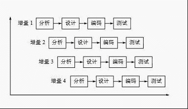
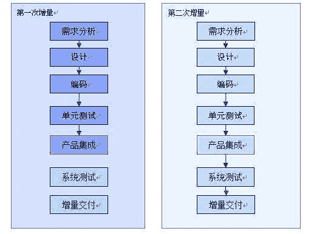
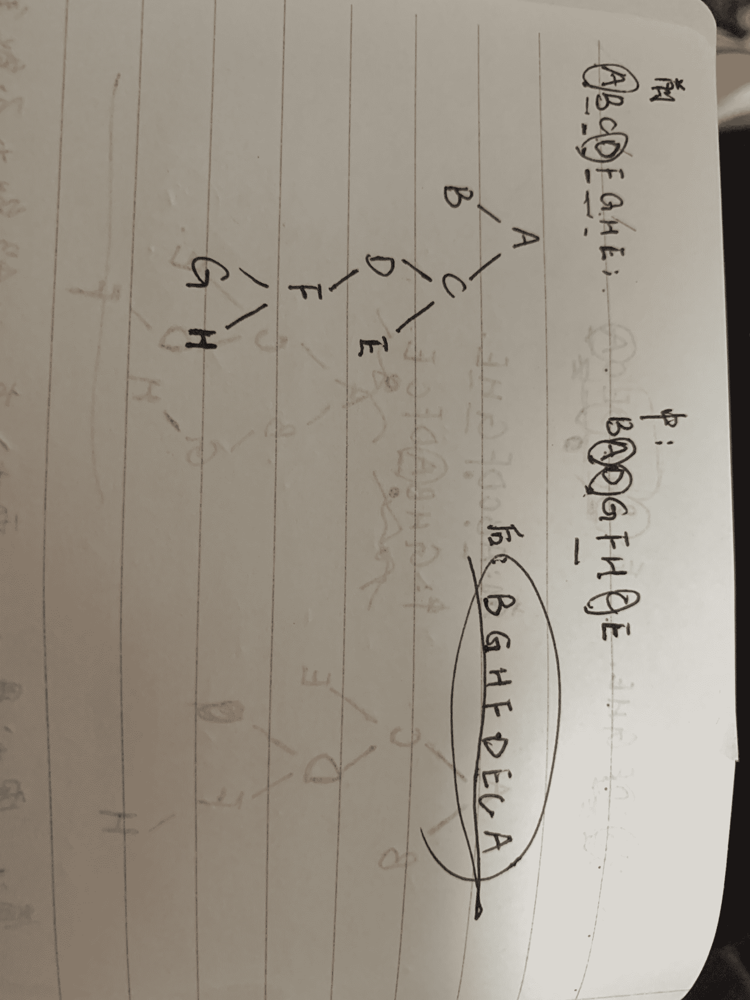
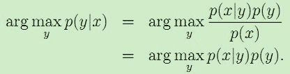
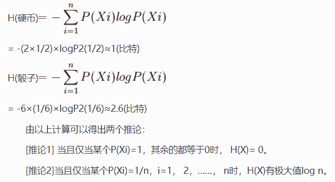
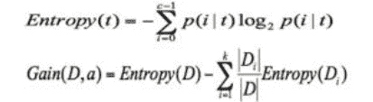
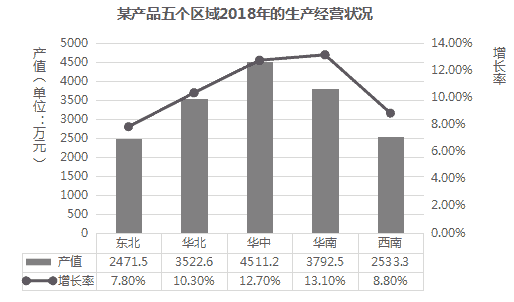
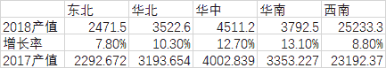
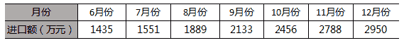

# 京东 2019 春招京东数据分析类试卷

## 1

在软件开发过程中，我们可以采用不同的过程模型，下列有关增量模型描述正确的（）

正确答案: B   你的答案: 空 (错误)

```cpp
已使用一种线性开发模型，具有不可回溯性
```

```cpp
把待开发的软件系统模块化，将每个模块作为一个增量组件，从而分批次地分析、设计、编码和测试这些增量组件
```

```cpp
适用于已有产品或产品原型（样品），只需客户化的工程项目
```

```cpp
软件开发过程每迭代一次，软件开发又前进一个层次
```

本题知识点

算法工程师 京东 数据分析工具/软件 数据分析工程师 数据分析师 2019

讨论

[小绿叶 yo](https://www.nowcoder.com/profile/255599086)

**增量模型**(Incremental Model)又称演化模型。与建造大厦相同，软件也是一步一步建造起来的。在增量模型中，软件被作为一系列的增量构件来设计、实现、集成和测试、每一个构件是由多种相互作用的模块所形成的提供特定功能的代码片段构成（B 对），增量模型在各个阶段并不交付一个可运行的完整产品，而是交付满足客户需求的一个子集的可运行产品。整个产品被分解成若干构件，开发人员逐个构件地交付产品，这样做的好处是软件开发可以较好地适应变化，客户可以不断地看到所开发的软件，从而降低开发风险。（A 错误，具有回溯性，可返回修改）

**** **2、增量模型的基本思想**

(1)增量模型属于非整体开发模型，它推迟某些阶段或所有阶段的细节，从而较早的产生工作软件（C 错误，是属于未开发的）

(2)增量方式包括增量开发和增量提交

(3)增量开发指在项目开发周期内，以一定的时间间隔开发部分工作软件

(4)增量提交指在项目开发周期内，以一定的时间间隔向用户提交工作软件及相应文档。

软件开发过程每迭代一次，软件开发又前进一个层次。是螺旋模型的软件过程如 D 错误

发表于 2019-07-10 09:43:23

* * *

[创始元灵](https://www.nowcoder.com/profile/220889961)

增量模型融合了[瀑布模型](https://baike.so.com/doc/517072-547439.html)的基本成分(重复应用)和原型实现的迭代特征，该模型采用随着日程时间的进展而交错的线性序列，每一个线性序列产生软件的一个可发布的“增量”。在增量模型中，软件被作为一系列的增量构件来设计、实现、集成和测试、每一个构件是由多种相互作用的模块所形成的提供特定功能的代码片段构成。当使用增量模型时，第 1 个增量往往是核心的产品，即第 1 个增量实现了**基本的需求**（**C****错误，是属于未开发的**），**但很多补充的特征还没有发布**。客户对每一个增量的使用和评估都作为下一个增量发布的新特征和功能，这个过程在每一个增量发布后不断重复（**A 错误，****具有不可回溯性**），直到产生了最终的完善产品。增量迭代是 RUP 统一过程，RUP 强调的每次迭代都包含了需求,设计和开发,测试等各个过程,而且每次迭代完成后都是一 个可以交付的原型.迭代不是并行,在每次迭代过程中仍然要遵循需求->设计->开发的瀑布过程.迭代周期的长度跟项目的周期和规模有很大的关 系.（**D ****错误**） 

发表于 2019-07-10 20:08:07

* * *

[凯 95](https://www.nowcoder.com/profile/128470472)

增量模型是把待开发的软件系统模块化，将每个模块作为一个增量组件，从而分批次地分析、设计、编码和测试这些增量组件

发表于 2019-05-25 23:41:50

* * *

## 2

一颗二叉树的前序遍历是 ABCDFGHE，后序遍历是 BGHFDECA，中序遍历是？

正确答案: C   你的答案: 空 (错误)

```cpp
GHBADFCE
```

```cpp
DGBAFHEC
```

```cpp
BADGFHCE
```

```cpp
BAGDFHEC
```

本题知识点

算法工程师 京东 树 数据分析工具/软件 数据分析工程师 数据分析师 2019

讨论

[Arsent](https://www.nowcoder.com/profile/192569809)

更快的是，要求中序（左中右），即：后续遍历的头部+前序遍历的尾部（B 开头 E 结尾，就是正确的）中间的顺序不唯一。还有一个 BAGFHDCE 也是正确的

发表于 2019-08-24 11:10:48

* * *

[_ 猪猪猪八戒](https://www.nowcoder.com/profile/8046431)

C 考察的是三种遍历的特点，并不是把正确的树推出来。中序遍历的第一个节点和后序遍历的第一个节点相同，B 中序遍历的最后一个节点和前序遍历的最后一个节点相同，E 故中序遍历结果为 B.......E，只有 C 选项符合

发表于 2020-03-02 10:57:53

* * *

[超爱吃香菇的小姑娘](https://www.nowcoder.com/profile/653788698)

已知前序遍历和后序遍历，无法确定唯一的一棵二叉树。所以，最好的方法是：直接代入选项，排除，很快且准确率高。

编辑于 2019-07-16 20:46:18

* * *

## 3

关于 TCP 协议的描述，以下错误的是？

正确答案: B   你的答案: 空 (错误)

```cpp
面向连接
```

```cpp
可提供多播服务
```

```cpp
可靠交付
```

```cpp
报文头部长，传输开销大
```

本题知识点

算法工程师 京东 网络基础 数据分析工程师 数据分析师 2019

讨论

[小绿叶 yo](https://www.nowcoder.com/profile/255599086)

**来源：《计算机网络》（第 7 版 P210）**

**TCP 最主要的特点：**

**（1）    1）****TCP 是面向连接的运输层协议。**应用进程之间的通信像“打电话”：通话前要先拨号建立连接，通话结束后要挂机释放链接。（A 选项，面向连接）

**（2）    2）****每一条 TCP 连接只能有两个端点(endpoint),**点对点。（B 选项，TCP 只能提供点对点，不提供多播）

**（3）    3）****TCP 提供可靠交付的服务。**无差错、不丢失、不重复，并且按序到达。（C 选项）（D 选项，TCP 提供的是可靠交付，所以 TCP 首部开销会大；UDP 协议只是尽最大努力交付，UDP 的首部开销小）

**（4）    4）****TCP 提供全双工通信。**双向通信.

**（5）    5）****面向字节流。**“面向字节流“的含义是：虽然应用程序和 TCP 的交互是一次一个数据块（大小不等），但 TCP 把应用程序交下来 的数据仅仅看成是一连串的无结构的字节流 。TCP 并不知道所传送的字节流的含义。

发表于 2019-08-17 17:36:30

* * *

[offline-ma](https://www.nowcoder.com/profile/74953640)

多播和广播 UDP

TCP 是面向连接的

发表于 2019-07-11 14:32:27

* * *

[愿逐月华 201904051222839](https://www.nowcoder.com/profile/667877488)

B1.TCP 面向可靠连接，具有重传机制 2.广播和多播仅应用于 UDP

发表于 2019-07-11 15:33:25

* * *

## 4

以下命令用于设置环境变量的是：

正确答案: A   你的答案: 空 (错误)

```cpp
export
```

```cpp
cat
```

```cpp
echo
```

```cpp
env
```

本题知识点

算法工程师 京东 Linux 数据分析工具/软件 数据分析工程师 数据分析师 2019

讨论

[我的 offer 还在多远的未来](https://www.nowcoder.com/profile/159098729)

export： 设置环境变量
echo：查看是否成功
env：显示所有的环境变量
set：显示所有本地定义的 Shell 变量
unset：清除环境变量

发表于 2019-06-28 11:33:04

* * *

[白白的圣诞树](https://www.nowcoder.com/profile/721893509)

export： 设置环境变量
echo：查看是否成功
env：显示所有的环境变量
cat：用于连接文件并打印到标准输出设备上（文本输出命令）set：显示所有本地定义的 Shell 变量
unset：清除环境变量

发表于 2019-10-12 17:56:55

* * *

[创始元灵](https://www.nowcoder.com/profile/220889961)

export： 设置环境变量
echo：查看是否成功
env：显示所有的环境变量
cat：用于连接文件并打印到标准输出设备上（文本输出命令）。

发表于 2019-07-10 20:17:03

* * *

## 5

数据库事务的特性不包含：

正确答案: B   你的答案: 空 (错误)

```cpp
原子性
```

```cpp
并发性
```

```cpp
一致性
```

```cpp
持久性
```

本题知识点

算法工程师 京东 数据库 数据分析工具/软件 数据分析工程师 数据分析师 2019

讨论

[小绿叶 yo](https://www.nowcoder.com/profile/255599086)

**数据库事务四大特性:**

**1、原子性（Atomicity）**

原子性是指事务包含的所有操作要么全部成功，要么全部失败回滚，因此事务的操作如果成功就必须要完全应用到数据库，如果操作失败则不能对数据库有任何影响。

**2、 一致性（Consistency）**

一致性是指事务必须使数据库从一个一致性状态变换到另一个一致性状态，也就是说一个事务执行之前和执行之后都必须处于一致性状态。

拿转账来说，假设用户 A 和用户 B 两者的钱加起来一共是 5000，那么不管 A 和 B 之间如何转账，转几次账，事务结束后两个用户的钱相加起来应该还得是 5000，这就是事务的一致性。

**3、隔离性（Isolation）**

隔离性是当多个用户并发访问数据库时，比如操作同一张表时，数据库为每一个用户开启的事务，不能被其他事务的操作所干扰，多个并发事务之间要相互隔离。

即要达到这么一种效果：对于任意两个并发的事务 T1 和 T2，在事务 T1 看来，T2 要么在 T1 开始之前就已经结束，要么在 T1 结束之后才开始，这样每个事务都感觉不到有其他事务在并发地执行。

**4、持久性（Durability）**

持久性是指一个事务一旦被提交了，那么对数据库中的数据的改变就是永久性的，即便是在数据库系统遇到故障的情况下也不会丢失提交事务的操作

发表于 2019-07-10 09:50:51

* * *

[创始元灵](https://www.nowcoder.com/profile/220889961)

数据库事务的四大特性：原子性、一致性、隔离性、持久性（**B.错误****、****并发性**）

发表于 2019-07-10 20:19:21

* * *

[我的 offer 还在多远的未来](https://www.nowcoder.com/profile/159098729)

数据库事务的四大特性：原子性、一致性、隔离性、持久性

发表于 2019-06-28 11:32:51

* * *

## 6

索引是对数据库表中一个或多个列的值进行排序的数据结构，以协助快速查询、更新数据库表中数据。以下对索引的特点描述错误的是：

正确答案: C   你的答案: 空 (错误)

```cpp
加快数据的检索速度
```

```cpp
加速表和表之间的连接
```

```cpp
在使用分组和排序子句进行数据检索时，并不会减少查询中分组和排序的时间
```

```cpp
通过创建唯一性索引，可以保证数据库表中每一行数据的唯一性
```

本题知识点

算法工程师 京东 数据库 数据分析工具/软件 数据分析工程师 数据分析师 2019

讨论

[创始元灵](https://www.nowcoder.com/profile/220889961)

索引的特点：
创建索引的好处
（1）通过创建索引,可以在查询的过程中,提高系统的性能
（2）通过创建唯一性索引,可以保证数据库表中每一行数据的唯一性
（3）**在使用分组和排序子句进行数据检索时,可以减少查询中分组和排序的时间**
创建索引的坏处
（1）创建索引和维护索引要耗费时间,而且时间随着数据量的增加而增大
（2）索引需要占用物理空间,如果要建立聚簇索引,所需要的空间会更大
（3）在对表中的数据进行增加删除和修改时需要耗费较多的时间,因为索引也要动态地维护

发表于 2019-07-10 21:33:37

* * *

[幸运之神 777](https://www.nowcoder.com/profile/518535102)

[`blog.csdn.net/sqlserverdiscovery/article/details/79129672`](https://blog.csdn.net/sqlserverdiscovery/article/details/79129672)

索引的第 3 个优点是可以加快表连接的速度。

要说明这个问题，首先要降到表连接的 3 种算法，分别是：hash，nested loop，merge。现在有 A、B 两个表，A 表数据量 1000w，B 表数据 2000w，关联字段是 ID。对 hash 算法的影响：无其他过滤条件，但是 select A.ID,B.ID

在这个前提下，如果创建索引，会加快连接速度。

因为这个时候虽然需要访问表里所有的数据，但是可以直接用索引的数据，进行关联，因为只需要返回两个表的 ID 字段的值。

而相对于表来说，索引中只包含了 ID 字段的值，所以占用的磁盘空间，相对于表来说，会小很多，所以扫描整个索引所需要的时间，远小于扫描全表的时间，本质上就是访问的数据页数少了，IO 次数少了，所需要的时间就少了。

发表于 2019-07-19 22:38:12

* * *

[清风 k](https://www.nowcoder.com/profile/864573181)

索引的特点：
创建索引的好处
（1）通过创建索引,可以在查询的过程中,提高系统的性能
（2）通过创建唯一性索引,可以保证数据库表中每一行数据的唯一性
（3）在使用分组和排序子句进行数据检索时,可以减少查询中分组和排序的时间
创建索引的坏处
（1）创建索引和维护索引要耗费时间,而且时间随着数据量的增加而增大
（2）索引需要占用物理空间,如果要建立聚簇索引,所需要的空间会更大
（3）在对表中的数据进行增加删除和修改时需要耗费较多的时间,因为索引也要动态地维护

发表于 2021-11-02 19:40:49

* * *

## 7

如果 ORDER BY 子句后未指定 ASC 或 DESC，默认使用以下哪个？ 

正确答案: B   你的答案: 空 (错误)

```cpp
DESC
```

```cpp
ASC
```

```cpp
不存在默认值
```

```cpp
其它选项都不对
```

本题知识点

算法工程师 京东 数据库 数据分析工具/软件 数据分析工程师 数据分析师 2019

讨论

[小绿叶 yo](https://www.nowcoder.com/profile/255599086)

解析：ASC 升序，DESC 降序，默认升序。

发表于 2019-07-10 09:54:57

* * *

[Arsent](https://www.nowcoder.com/profile/192569809)

Order by 默认是升序，可以调 DESC 降序

发表于 2019-08-24 10:59:20

* * *

[牛客 747547278 号](https://www.nowcoder.com/profile/747547278)

默认 asc

发表于 2021-12-11 17:40:52

* * *

## 8

关于 Python 中的复数，下列说法错误的是（）

正确答案: C   你的答案: 空 (错误)

```cpp
表是复数的语法是 real + image j
```

```cpp
实部和虚部都是浮点数
```

```cpp
虚部必须后缀 j，且必须小写
```

```cpp
方法 conjugate 返回复数的共轭复数
```

本题知识点

算法工程师 京东 Python 数据分析工具/软件 数据分析工程师 数据分析师 2019

讨论

[小绿叶 yo](https://www.nowcoder.com/profile/255599086)

**关于****python****中的复数：**

1.表示复数的语法是 real + image j

2.实部和虚部都是浮点数

3.虚部的后缀可以是 “j” 或者 “J”

4.复数的 conjugate 方法可以返回该复数的共轭复数。

发表于 2019-07-10 10:37:46

* * *

[爱吃松籽的小果果](https://www.nowcoder.com/profile/121264369)

1、虚数不能单独存在，它们总是和一个值为 0.0 的实数部分一起构成一个复数

2、复数由实数部分和虚数部分构成

3、表示虚数的语法：real+imagej

4、实数部分和虚数部分都是浮点数

5、虚数部分必须有后缀 j 或 J

发表于 2019-08-29 18:39:24

* * *

[村雨 1943](https://www.nowcoder.com/profile/717384)

答案：C

分析：

A，Python 中复数表达形式：`real + image j/J`；
B，Python 实部和虚部均浮点类型；
C，虚部后缀为`j`或`J`；
D，方法 conjugate 返回复数的共轭复数，如`1+2j`调用此方法后变为`1-2j`;

发表于 2019-11-29 11:30:58

* * *

## 9

执行以下 shell 语句，可以生成/test 文件的是（假定执行前没有/test 文件）：

正确答案: A B C   你的答案: 空 (错误)

```cpp
touch /test
```

```cpp
a=`touch /test`
```

```cpp
>/test
```

```cpp
echo 'touch /test'
```

本题知识点

算法工程师 京东 数据分析工具/软件 数据分析工程师 数据分析师 2019

讨论

[zjq02010](https://www.nowcoder.com/profile/195290936)

要注意下，b 选项，不是单引号，而是反单引号，a=`touch /test`表示执行 touch /test 并将结果返回给 a

发表于 2020-06-05 18:21:14

* * *

[MagicCarpet](https://www.nowcoder.com/profile/5204516)

A. Linux touch 命令用于修改文件或者目录的时间属性，包括存取时间和更改时间。若文件不存在，系统会建立一个新的文件。 B 不知道 C. 在 shell 中 '>'  为创建， '>>' 为追加。当文件不存在时,'>'与‘>>’都会默认创建。D. echo 是一个 Shell 内建命令，用来在终端输出字符串，并在最后默认加上换行符。单引号包围的字符串中不能解析变量。

编辑于 2019-07-07 05:18:02

* * *

[一只小星星](https://www.nowcoder.com/profile/4705227)

试了一下~  B 是可以的

发表于 2019-08-23 19:55:17

* * *

## 10

if [ $2 -a $2 = "test" ]中 -a 是什么意思 

正确答案: D   你的答案: 空 (错误)

```cpp
大于
```

```cpp
减
```

```cpp
全部
```

```cpp
并且
```

本题知识点

算法工程师 京东 数据分析工具/软件 数据分析工程师 数据分析师 2019

讨论

[创始元灵](https://www.nowcoder.com/profile/220889961)

 Linux_shell 的逻辑判断 

发表于 2019-07-10 21:39:22

* * *

[无聊的咸鱼瘫](https://www.nowcoder.com/profile/448866055)

linux 的逻辑判断-a,与-o,或|,非

发表于 2019-08-12 10:47:33

* * *

[说好了](https://www.nowcoder.com/profile/430539962)

and 所以是 a

发表于 2019-06-20 16:23:46

* * *

## 11

文件目录 data 当前权限为 rwx --- ---，只需要增加用户组可读权限，但不允许写操作，具体方法为：

正确答案: A   你的答案: 空 (错误)

```cpp
chmod+050data
```

```cpp
chmod+040data
```

```cpp
chmod+005data
```

```cpp
chmod+004data
```

本题知识点

算法工程师 京东 数据分析工具/软件 数据分析工程师 数据分析师 2019

讨论

[MagicCarpet](https://www.nowcoder.com/profile/5204516)

Linux/Unix 的文件调用权限分为三级 : 文件拥有者、群组、其他。利用 chmod 可以藉以控制文件如何被他人所调用。r 表示可读取，w 表示可写入，x 表示可执行，X 表示只有当该文件是个子目录或者该文件已经被设定过为可执行。 数字分别表示 User、Group、及 Other 的权限。

r=4，w=2，x=1

*   若要 rwx 属性则 4+2+1=7；
*   若要 rw-属性则 4+2=6；
*   若要 r-x 属性则 4+1=5。 

发表于 2019-07-07 05:34:58

* * *

[创始元灵](https://www.nowcoder.com/profile/220889961)

使用 chomd 命令改变文件权限。Linux 文件基本权限有 9 个，owner,group,others 三种身份对应各自 read,write,execute 三种权限。文件权限字符：“-rwxrwxrwx”三个一组。数字化 r:4
w:2 x:1 增加用户组可读，但不可写，第一组和第三组默认为 0，只在第二组中添加 r-x 即可 chomd +050

发表于 2019-07-10 21:47:04

* * *

[大 0 小 O](https://www.nowcoder.com/profile/7384724)

题中的 data 为目录，目录的 x 代表的是用户能否进入该目录成为工作目录，目录的 r 表示具有读取目录结构列表的权限。没有 x 权限则无法切换到该目录，也就无法执行该目录下的任何命令，即使拥有该目录的 r/w 权限。

发表于 2019-10-10 02:44:14

* * *

## 12

以下哪个模型是生成式模型：

正确答案: A   你的答案: 空 (错误)

```cpp
贝叶斯模型
```

```cpp
逻辑回归
```

```cpp
SVM
```

```cpp
条件随机场
```

本题知识点

算法工程师 京东 机器学习 数据分析工具/软件 数据分析工程师 数据分析师 2019

讨论

[MagicCarpet](https://www.nowcoder.com/profile/5204516)

 ***   生成模型，就是生成(数据的分布)的模型；
*   判别模型，就是判别(数据输出量)的模型。** **生成式模型：**朴素贝叶斯
混合高斯模型
隐马尔科夫模型(HMM)
贝叶斯网络
Sigmoid Belief Networks
马尔科夫随机场(Markov Random Fields)
深度信念网络(DBN)
**判别式模型：****K 近邻(KNN)**线性回归(Linear Regression)
逻辑斯蒂回归(Logistic Regression)
神经网络(NN)
支持向量机(SVM)
高斯过程(Gaussian Process)
条件随机场(CRF)
CART(Classification and Regression Tree)
---------------------
原文：[`blog.csdn.net/u013630349/article/details/47146425`](https://blog.csdn.net/u013630349/article/details/47146425)

编辑于 2019-08-25 05:44:34

* * *

[幸运之神 777](https://www.nowcoder.com/profile/518535102)

判别式模型举例：要确定一个羊是山羊还是绵羊，用判别模型的方法是从历史数据中学习到模型，然后通过提取这只羊的特征来预测出这只羊是山羊的概率，是绵羊的概率。（logistic 回归，>0.5 为正例，否则，为反例）

生成式模型举例：利用生成模型是根据山羊的特征首先学习出一个山羊的模型，然后根据绵羊的特征学习出一个绵羊的模型，然后从这只羊中提取特征，放到山羊模型中看概率是多少，在放到绵羊模型中看概率是多少，哪个大就是哪个。（朴素贝叶斯分类就是这样）常见的模型大多是判别模型，生成模型有：朴素贝叶斯（需要求联合概率分布），隐马尔科夫 HMM，高斯混合模型 GMM，LDA（Latent Dirichlet Allocation）是一种文档主题生成模型，也称为一个三层[贝叶斯](https://baike.baidu.com/item/%E8%B4%9D%E5%8F%B6%E6%96%AF)概率模型。

发表于 2019-07-19 22:52:24

* * *

[小绿叶 yo](https://www.nowcoder.com/profile/255599086)

解析：

**判别式模型（Discriminative Model）**是直接对条件概率 p(y|x;θ)建模。常见的判别式模型有 线性回归模型、线性判别分析、支持向量机 SVM、神经网络等。

**生成式模型（Generative Model）**则会对 x 和 y 的联合分布 p(x,y)建模，然后通过贝叶斯公式来求得 p(yi|x)，然后选取使得 p(yi|x)最大的 yi，即：



常见的生成式模型有 隐马尔可夫模型 HMM、朴素贝叶斯模型、高斯混合模型 GMM、LDA 等。

发表于 2019-07-11 11:07:06

* * *

## 13

下列关于计算机存储容量单位的说法中，错误的是（）

正确答案: C   你的答案: 空 (错误)

```cpp
1KB<1MB<1GB
```

```cpp
基本单位是字节（Byte）
```

```cpp
一个汉字需要一个字节的存储空间
```

```cpp
一个字节能够容纳一个英文字符
```

本题知识点

编译和体系结构

讨论

[小绿叶 yo](https://www.nowcoder.com/profile/255599086)

**UTF-8 编码**：一个英文[字符](https://baike.baidu.com/item/%E5%AD%97%E7%AC%A6)等于一个字节，一个中文（含繁体）等于三个字节。中文标点占三个字节，英文标点占一个字节

**Unicode 编码**：一个英文等于两个字节，一个中文（含繁体）等于**两个**字节。中文标点占两个字节，英文标点占两个字节

发表于 2019-07-11 13:04:22

* * *

[北斗酌美酒](https://www.nowcoder.com/profile/170736954)

```cpp
1、位（bit） 
来自英文 bit，音译为“比特”，表示二进制位。位是计算机内部数据储存的最小单位，11010100 是一个 8 位二进制数。一个二进制位只可以表示 0 和 1 两种状态（21）；两个二进制位可以表示 00、01、10、11 四种（22）状态；三位二进制数可表示八种状态（23）……。 

2、字节（byte） 
字节来自英文 Byte，音译为“拜特”，习惯上用大写的“B”表示。 
字节是计算机中数据处理的基本单位。计算机中以字节为单位存储和解释信息，规定一个字节由八个二进制位构成，即 1 个字节等于 8 个比特（1Byte=8bit）。八位二进制数最小为 00000000，最大为 11111111；通常 1 个字节可以存入一个 ASCII 码，2 个字节可以存放一个汉字国标码。
```

 发表于 2020-02-04 03:55:21

* * *

[넌어디에서](https://www.nowcoder.com/profile/346342866)

计算机的最小单位不应该是位吗？

编辑于 2019-07-25 15:30:06

* * *

## 14

以下机器学习中，在数据预处理时，不需要考虑归一化处理的是：

正确答案: C   你的答案: 空 (错误)

```cpp
logistic 回归
```

```cpp
SVM
```

```cpp
树形模型
```

```cpp
神经网络
```

本题知识点

算法工程师 京东 机器学习 数据分析工具/软件 数据分析工程师 数据分析师 2019

讨论

[幸运之神 777](https://www.nowcoder.com/profile/518535102)

当使用梯度下降法寻求最优解时，很有可能走“之字型”路线（垂直等高线走），从而导致需要迭代很多次才能收敛；在梯度下降进行求解时能较快的收敛。所以，使用梯度下降法求解最优解的模型，归一化就非常重要！knn，logistc 回归，gbdt，xgboost，adaboost 还有一些模型是基于距离的，所以量纲对模型影响较大，就需要归一化数据，处理特征之间的权重问题，这样可以提高计算精度。比如，knn，svm，kmeans，k 近邻，主成分分析；神经网络对数据分布本无要求，但归一化可以加快训练数据；那么不需要归一化处理的模型，决策树，随机森林。他们因为它们不关心变量的值，而是关心变量的分布和变量之间的条件概率

编辑于 2019-07-20 00:28:43

* * *

[烟花易冷 201907161859980](https://www.nowcoder.com/profile/843334870)

树模型，对数据量纲不敏感，因此不需要数据归一化

发表于 2019-07-16 19:01:42

* * *

[美丽东](https://www.nowcoder.com/profile/9013277)

参考：百面机器学习第一章第一节数值特征归一化方法有：线性函数归一化和零均值归一化需要通过梯度下降法求解的模型需要数值特征归一化：如线性回归、逻辑回归、支持向量机、神经网络模型。（原因：随机梯度下降时，特征值相差大，会导致更新速度慢，需要兼顾特征值小的特征）不需要特征归一化：决策树模型，决策树模型分裂根据信息增益，信息增益与特征归一化无关。

发表于 2020-09-24 16:40:03

* * *

## 15

从使用的主要技术上看，可以把分类方法归结为哪几种类型 

正确答案: A B C D   你的答案: 空 (错误)

```cpp
规则归纳方法
```

```cpp
贝叶斯分类方法
```

```cpp
决策树分类方法
```

```cpp
基于距离的分类方法
```

本题知识点

算法工程师 京东 机器学习 数据分析工具/软件 数据分析工程师 数据分析师 2019

讨论

[yang9599](https://www.nowcoder.com/profile/873723471)

从使用技术上来分，可以分为四种类型：基于距离的分类方法、决策树分类方法、贝叶斯分类方法和规则归纳方法。基于距离的分类方法主要有最邻近方法；决策树方法有 ID3、C4.5、VFDT 等；贝叶斯方法包括朴素贝叶斯方法和 EM 算法；规则归纳方法包括 AQ 算法、CN2 算法和 FOIL 算法。

引用于知乎专栏（[`zhuanlan.zhihu.com/p/26704628）`](https://zhuanlan.zhihu.com/p/26704628%EF%BC%89)

发表于 2019-07-28 09:46:19

* * *

[Yuerya](https://www.nowcoder.com/profile/363083827)

这个分类标准是什么呢？想问深度神经网络、或者逻辑回归这种，算是其中一种类型吗还是怎样？

发表于 2021-04-10 18:16:06

* * *

## 16

数据挖掘的挖掘方法包括:( )

正确答案: A B C D   你的答案: 空 (错误)

```cpp
聚类分析
```

```cpp
回归分析
```

```cpp
神经网络
```

```cpp
决策树算法
```

本题知识点

算法工程师 京东 机器学习 数据分析工具/软件 数据分析工程师 数据分析师 2019

讨论

[♥乔木♥](https://www.nowcoder.com/profile/8448640)

主要有决策树 、神经网络 、回归 、聚类 、关联规则 、贝叶斯分类

发表于 2020-01-14 17:14:35

* * *

[ZhouHS](https://www.nowcoder.com/profile/187596801)

感觉有点问题，决策树，神经网络也是回归的一种

发表于 2021-02-03 16:54:18

* * *

[Fabulous_HK](https://www.nowcoder.com/profile/201232292)

万物皆可挖

发表于 2020-08-31 09:40:10

* * *

## 17

检测一元正态分布中的离群点，属于异常检测中的基于（ ）的离群点检测

正确答案: A   你的答案: 空 (错误)

```cpp
统计方法
```

```cpp
邻近度
```

```cpp
密度
```

```cpp
聚类技术
```

本题知识点

算法工程师 京东 数据分析工具/软件 数据分析工程师 数据分析师 2019

讨论

[祫衣](https://www.nowcoder.com/profile/42106114)

背景资料：[`www.csuldw.com/2019/03/24/2019-03-24-anomaly-detection-introduction/?from=timeline&isappinstalled=0`](http://www.csuldw.com/2019/03/24/2019-03-24-anomaly-detection-introduction/?from=timeline&isappinstalled=0)

发表于 2019-08-15 21:14:40

* * *

## 18

熵是为消除不确定性所需要获得的信息量，投掷均匀正六面体骰子的熵是：

正确答案: B   你的答案: 空 (错误)

```cpp
1 比特
```

```cpp
2.6 比特
```

```cpp
3.2 比特
```

```cpp
3.8 比特
```

本题知识点

算法工程师 京东 数据分析工具/软件 数据分析工程师 数据分析师 2019

讨论

[小绿叶 yo](https://www.nowcoder.com/profile/255599086)


参考网址：[`blog.sina.com.cn/s/blog_5ebba6660101h6ez.html`](http://blog.sina.com.cn/s/blog_5ebba6660101h6ez.html)

编辑于 2019-07-19 14:54:04

* * *

[零葬](https://www.nowcoder.com/profile/75718849)

注意比特为单位时，log 是以 2 为底，以 e 为底的时候单位是奈特

发表于 2020-12-23 16:59:30

* * *

[幸运之神 777](https://www.nowcoder.com/profile/518535102)

本题中某个位面的信息熵计算出来，乘以 6 就好了！构造决策树过程中，如何选择根节点，内部节点了？选择信息增益大的属性作为节点，ID3 算法；选择信息增益率大的属性作为节点，可以避免 ID3 算法倾向于选择值多的属性，且可以处理连续数据（离散化），c4.5 算法信息熵与信息增益：

发表于 2019-07-20 09:17:34

* * *

## 19

以下相关关系取值，哪个蕴含了无关系？

正确答案: B   你的答案: 空 (错误)

```cpp
Cor(X, Y) = 1
```

```cpp
Cor(X, Y) = 0
```

```cpp
Cor(X, Y) = 2
```

```cpp
其他都是
```

本题知识点

算法工程师 京东 数据分析工具/软件 数据分析工程师 数据分析师 2019

讨论

[超爱吃香菇的小姑娘](https://www.nowcoder.com/profile/653788698)

本题有疑问：(2)选项为 0 只能说明没有线性关系，但是可能有其他关系。(3)选项的值怎么能为 2 呢？不是应为-1~1 吗？

发表于 2019-07-16 21:53:20

* * *

[零葬](https://www.nowcoder.com/profile/75718849)

这题只有别想多了才能做对，相信它就这么简单😂

发表于 2020-12-23 17:00:20

* * *

[极乐 disco](https://www.nowcoder.com/profile/866892783)

cor 计算相关系数，=0 不相干 cov 是协方差 若两个随机变量 X 和 Y 相互独立，则 E[(X-E(X))(Y-E(Y))]=cov =0

发表于 2020-08-05 19:22:15

* * *

## 20

下列关于大数据的分析理念的说法中，错误的是（）

正确答案: D   你的答案: 空 (错误)

```cpp
在数据基础上倾向于全体数据而不是抽样数据
```

```cpp
在分析方法上更注重相关分析我不是因果分析
```

```cpp
在分析效果上更追究效率而不是绝对精确
```

```cpp
在数据规模上强调相对数据而不是绝对数据
```

本题知识点

算法工程师 京东 数据分析工具/软件 数据分析工程师 数据分析师 2019

讨论

[daisy---张](https://www.nowcoder.com/profile/860644437)

1.用全量代替样本 2.兼容不精确
3.更加关注相关规律：只关注关联关系，不关注因果关系参考：[`blog.csdn.net/chengxvsyu/article/details/91630583`](https://blog.csdn.net/chengxvsyu/article/details/91630583)

发表于 2020-03-29 22:57:23

* * *

[Joey413](https://www.nowcoder.com/profile/214367454)

CD；大数据分析针对于数据整体而不是局部，所以对于结果是追求精准；数据也要追求绝对数据而不是相对数据。

发表于 2020-12-07 14:08:53

* * *

[neoinheart](https://www.nowcoder.com/profile/945992423)

参考：[`blog.csdn.net/chengxvsyu/article/details/91630583`](https://blog.csdn.net/chengxvsyu/article/details/91630583)

发表于 2019-09-19 20:24:53

* * *

## 21

置信概率可以用来评估区间估计的什么性能

正确答案: D   你的答案: 空 (错误)

```cpp
精确性
```

```cpp
显著性
```

```cpp
规范性
```

```cpp
可靠性
```

本题知识点

算法工程师 京东 数据分析工具/软件 数据分析工程师 数据分析师 2019

讨论

[超爱吃香菇的小姑娘](https://www.nowcoder.com/profile/653788698)

置信概率（confidence probability）是用来衡量统计推断可靠程度的概率。

发表于 2019-07-16 21:58:49

* * *

## 22

为数据的总体分布建模；把多维空间划分成组等问题属于数据挖掘的哪一类任务？

正确答案: B   你的答案: 空 (错误)

```cpp
探索性数据分析
```

```cpp
建模描述
```

```cpp
预测建模
```

```cpp
寻找模式和规则
```

本题知识点

算法工程师 京东 数据分析工具/软件 数据分析工程师 数据分析师 2019 数据挖掘

讨论

[小绿叶 yo](https://www.nowcoder.com/profile/255599086)

相关类似习题：

来源[`wenku.baidu.com/view/a5fa7ae7cd22bcd126fff705cc17552707225e29.html?from=search`](https://wenku.baidu.com/view/a5fa7ae7cd22bcd126fff705cc17552707225e29.html?from=search)

6. 使用交互式的和可视化的技术，对数据进行探索属于数据挖掘的哪一类任务？（ A）

A. 探索性数据分析 B. 建模描述 C. 预测建模 D. 寻找模式和规则

7. 为数据的总体分布建模；把***空间划分成组等问题属于数据挖掘的哪一类任务？ (B)

A. 探索性数据分析 B. 建模描述 C. 预测建模 D. 寻找模式和规则

8. 建立一个模型，通过这个模型根据已知的变量值来预测其他某个变量值属于数据挖掘的

哪一类任务？(C)A. 根据内容检索 B. 建模描述 C. 预测建模 D. 寻找模式和规则

9. 用户有一种感兴趣的模式并且希望在数据集中找到相似的模式，属于数据挖掘哪一类任

务？(A)

A. 根据内容检索 B. 建模描述 C. 预测建模 D. 寻找模式和规则

编辑于 2019-07-17 21:08:34

* * *

[打怪升级的小 mm](https://www.nowcoder.com/profile/242009134)

6. 使用交互式的和可视化的技术，对数据进行探索属于数据挖掘的哪一类任务？（ A）

A. 探索性数据分析 B. 建模描述 C. 预测建模 D. 寻找模式和规则

7. 为数据的总体分布建模；把***空间划分成组等问题属于数据挖掘的哪一类任务？ (B)

A. 探索性数据分析 B. 建模描述 C. 预测建模 D. 寻找模式和规则

8. 建立一个模型，通过这个模型根据已知的变量值来预测其他某个变量值属于数据挖掘的

哪一类任务？(C)A. 根据内容检索 B. 建模描述 C. 预测建模 D. 寻找模式和规则

9. 用户有一种感兴趣的模式并且希望在数据集中找到相似的模式，属于数据挖掘哪一类任

务？(A)

A. 根据内容检索 B. 建模描述 C. 预测建模 D. 寻找模式和规则

发表于 2021-04-10 04:41:14

* * *

## 23

下列关于普查的缺点的说法中，正确的是（）

正确答案: A   你的答案: 空 (错误)

```cpp
工作量较大，容易导致调查内容有限、产生重复和遗漏现象
```

```cpp
误差不易被控制
```

```cpp
对样本的依赖性比较强
```

```cpp
评测结果不够稳定
```

本题知识点

算法工程师 京东 数据分析工具/软件 数据分析工程师 数据分析师 2019

讨论

[小绿叶 yo](https://www.nowcoder.com/profile/255599086)

**普查的优点：**

由于是调查某一人群的所有成员，所以在确定调查对象上比较简单；

所获得的资料全面，可以知道全部调查对象的相关情况，准确性高；

普查所获得的数据为抽样调查或其他调查提供基本依据。

**普查的缺点：**

工作量大，花费大，组织工作复杂；

调查内容有限；

易产生重复和遗漏现象；

由于工作量大而可能导致调查的精确度下降，调查质量不易控制。

来源：[`baike.baidu.com/item/%E6%99%AE%E6%9F%A5/10339088?fr=aladdin`](https://baike.baidu.com/item/%E6%99%AE%E6%9F%A5/10339088?fr=aladdin)

发表于 2019-07-17 21:14:49

* * *

## 24

数据科学家使用的统计方法有（ ）

正确答案: A   你的答案: 空 (错误)

```cpp
马尔科夫过程
```

```cpp
等价划分类
```

```cpp
线性累加
```

```cpp
不知道
```

本题知识点

算法工程师 京东 数据分析工具/软件 数据分析工程师 数据分析师 2019

讨论

[小蝌蚪加油啊](https://www.nowcoder.com/profile/820403381)

统计学习方法的经典研究主题包括：

*   线性回归模型
*   感知机
*   k 近邻法
*   朴素贝叶斯法
*   决策树
*   Logistic 回归于最大熵模型
*   支持向量机
*   提升方法
*   EM 算法
*   隐马尔可夫模型
*   条件随机场

发表于 2019-08-27 21:50:23

* * *

## 25

在下列算法中，对于缺失值敏感的模型为：

正确答案: B   你的答案: 空 (错误)

```cpp
随机森林
```

```cpp
Logistic Regression（逻辑回归）
```

```cpp
C4.5
```

```cpp
朴素贝叶斯
```

本题知识点

算法工程师 京东 数据分析工具/软件 数据分析工程师 数据分析师 2019

讨论

[小绿叶 yo](https://www.nowcoder.com/profile/255599086)

AC 基于树模型，对缺失值敏感度低；D 朴素贝叶斯对缺失值也比较稳定；B 逻辑回归是线性模型，对缺失值敏感。

来源：[`blog.csdn.net/weixin_44915703/article/details/93913370`](https://blog.csdn.net/weixin_44915703/article/details/93913370)

发表于 2019-07-17 22:44:33

* * *

[用户 983782](https://www.nowcoder.com/profile/223047202)

如果存在稀疏特征，该特征的系数为趋向于 0

发表于 2020-04-13 22:19:10

* * *

[LittleFunfun](https://www.nowcoder.com/profile/240303669)

树形结构主要是有关概率和数据分布的，对缺失的数据不敏感

发表于 2019-08-01 20:02:29

* * *

## 26

京东仓库中对某种商品进行合格性检验，已知这种商品的不合格率为 0.001，即 1000 件商品中会有一件次品。现有现有一种快速检验商品方法，它的准确率是 0.99，即在商品确实是次品的情况下，它有 99%的可能抽检显示红色。它的误报率是 5%，即在商品不是次品情况下，它有 5%的可能抽检显示红色。现有有一件商品检验结果为红色，请问这件商品是次品的可能性有多大？

正确答案: B   你的答案: 空 (错误)

```cpp
0.01
```

```cpp
0.02
```

```cpp
0.03
```

```cpp
0.04
```

本题知识点

算法工程师 京东 概率统计 *数据分析工具/软件 数据分析工程师 数据分析师 2019 概率论与数理统计* *讨论

[小绿叶 yo](https://www.nowcoder.com/profile/255599086)

已知 ： P（次品）= 0.001， P（红|次品）= 0.99， P（红|正品） = 0.05

则，

P（正品）=1 - 0.001 = 0.999，

P（红色且次品） = P（红|次品） x P（次品）

P（红色且正品） = P（红|正品） x P（正品）

P（红） = P（红色且次品） + P（红色且正品）=0.99x0.001 + 0.05x0.999=0.05094

根据贝叶斯公式，

P（次品|红）= P（红|次品） x P（次品） / P（红）= 0.99 x 0.001 / 0.50094 = 0.02

---------------------

作者：圣洁不吃冰淇淋

来源：CSDN

原文：[`blog.csdn.net/weixin_44915703/article/details/93913370`](https://blog.csdn.net/weixin_44915703/article/details/93913370)

---------------------

贝叶斯公式学习：

[`study.163.com/course/courseLearn.htm?courseId=1209427813&from=study - /learn/video?lessonId=1279388504&courseId=1209427813`](https://study.163.com/course/courseLearn.htm?courseId=1209427813&from=study%20-%20/learn/video?lessonId=1279388504&courseId=1209427813)

编辑于 2019-07-19 11:07:09

* * *

[阿晏](https://www.nowcoder.com/profile/591947042)

（0.001*0.99） / （0.001*0.99 + 0.999*0.05）

发表于 2019-05-28 12:18:54

* * *

[云朵后的小丑鱼](https://www.nowcoder.com/profile/8796484)

假设有 100000 件产品，爆红的有 5099 件（5000 为误报，99 为次品），是次品的概率是 99/5099=0.019416

发表于 2020-01-17 16:08:45

* * *

## 27

有 30 个需要渡河，只有一条船，船每次最多载 4 人（包括划船的人），往返一次需要 5 分钟。那么，21 分钟后，还有几个人在等待过河？（ ） 

正确答案: D   你的答案: 空 (错误)

```cpp
10
```

```cpp
11
```

```cpp
15
```

```cpp
14
```

本题知识点

算法工程师 京东 数学运算 数据分析工程师 数据分析师 2019

讨论

[拜托来个 offer 让我上岸](https://www.nowcoder.com/profile/910959533)

答案有问题吧，有人能解释一下嘛？20 分钟经历 4 次来回，21 分钟时有 4 人还在船上，4*3+4 = 16，不应该还有 14 人等待过河吗？

发表于 2019-07-09 14:00:19

* * *

[杨 xd](https://www.nowcoder.com/profile/853223797)

正确答案应该是 14，0 分:26,5 分:23,10 分:20,15 分:17,20 分:14,25 分:11

编辑于 2019-08-23 15:47:22

* * *

[寒夏](https://www.nowcoder.com/profile/7911594)

船夫是本来就在船上，还是船夫也在 30 人中？若船夫本就在船上，则 30-3*5=15， 若船夫在 30 人之中，则 30-4-3*4=14。

发表于 2019-08-01 10:34:14

* * *

## 28

一批商品，甲乙合作生产需要 10 天完成，乙丙两人合作生产需要 12 天。现在由甲丙合作生产 4 天，剩下的交由乙单独生产，还需要 12 天才能完成。如果该批商品由乙单独完成，需要多少天？（ ）

正确答案: A   你的答案: 空 (错误)

```cpp
15
```

```cpp
18
```

```cpp
20
```

```cpp
25
```

本题知识点

算法工程师 京东 数学运算 数据分析工具/软件 数据分析工程师 数据分析师 2019

讨论

[阿漫](https://www.nowcoder.com/profile/8235767)

10 甲+10 乙＝12 乙+12 丙＝4 甲+4 丙+12 乙 乙＝2 甲＝4 丙 原式＝15 乙

发表于 2019-07-08 22:39:13

* * *

[冲上顶峰](https://www.nowcoder.com/profile/189892324)

设完成这项工作，甲乙丙分别需要 x,y,z 天，则 1/x+1/y=1/101/y+1/z=/12(1/x+1/z)*4+12*1/y=1 解得 y=15 天

发表于 2019-06-02 15:15:51

* * *

[那里面有只小怪兽](https://www.nowcoder.com/profile/880418811)

想问一下大家，这种题列方程 1 分钟内能做出来吗，是不是有技巧

发表于 2019-08-20 14:41:15

* * *

## 29

下图显示的是 2018 年某产品在五个区域的经营状况，请问 2017 年哪个地区的产品产值最高？（）

正确答案: C   你的答案: 空 (错误)

```cpp
东北
```

```cpp
华北
```

```cpp
华中
```

```cpp
华南
```

```cpp
西南
```

本题知识点

算法工程师 京东 资料分析 数据分析工具/软件 数据分析工程师 数据分析师 2019

讨论

[小绿叶 yo](https://www.nowcoder.com/profile/255599086)



发表于 2019-07-19 13:51:10

* * *

[我要拿 offer!](https://www.nowcoder.com/profile/2470771)

关键字‘产品总值’，明显华中的最高

发表于 2019-09-10 16:57:26

* * *

[牛客 925174718 号](https://www.nowcoder.com/profile/925174718)

＇c

发表于 2021-09-06 20:19:22

* * *

## 30

下表为我国某产品 2018 下半年的进口额情况，请问 6-12 月当中，其中有几个月的增长率是超过了 10%的？（ ）

正确答案: A   你的答案: 空 (错误)

```cpp
4
```

```cpp
3
```

```cpp
2
```

```cpp
1
```

本题知识点

算法工程师 京东 数学运算 数据分析工具/软件 数据分析工程师 数据分析师 2019

讨论

[冲上顶峰](https://www.nowcoder.com/profile/189892324)

7-8，8-9,9-10,10-11 全部都超过了呀

发表于 2019-06-01 22:21:01

* * *

[offer++++++++](https://www.nowcoder.com/profile/305513886)

这个平台的题目可以权威一点吗

发表于 2019-07-30 17:22:05

* * *

[寒夏](https://www.nowcoder.com/profile/7911594)

明明是四个！

发表于 2019-07-30 10:35:56

* * **