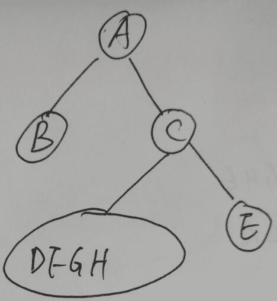
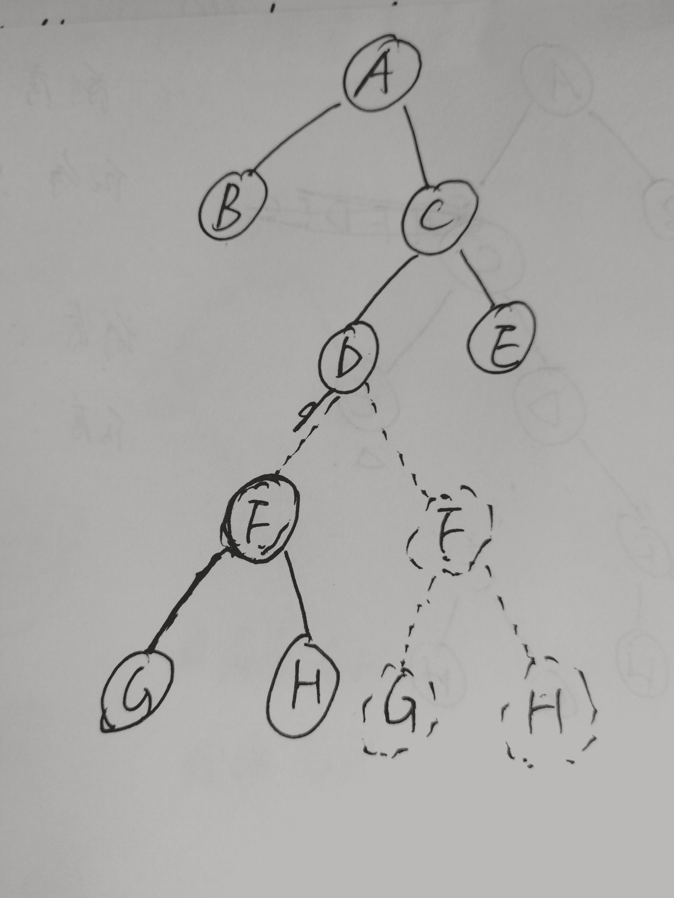
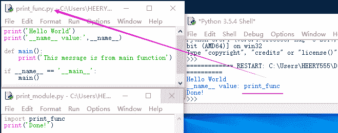

# 京东 2019 春招京东运维开发类试卷

## 1

流程图中表示判断的应使用（ ）

正确答案: B   你的答案: 空 (错误)

```cpp
矩形框
```

```cpp
菱形框
```

```cpp
圆形框
```

```cpp
椭圆形框
```

本题知识点

Java 工程师 C++工程师 运维工程师 京东 2019

讨论

[Shaw 轶](https://www.nowcoder.com/profile/906527062)

基本问题，流程图中菱形◇框表示判断

发表于 2019-08-24 14:46:46

* * *

## 2

在软件开发过程中，我们可以采用不同的过程模型，下列有关增量模型描述正确的（）

正确答案: B   你的答案: 空 (错误)

```cpp
已使用一种线性开发模型，具有不可回溯性
```

```cpp
把待开发的软件系统模块化，将每个模块作为一个增量组件，从而分批次地分析、设计、编码和测试这些增量组件
```

```cpp
适用于已有产品或产品原型（样品），只需客户化的工程项目
```

```cpp
软件开发过程每迭代一次，软件开发又前进一个层次
```

本题知识点

Java 工程师 C++工程师 运维工程师 京东 2019

## 3

用计算机解决问题的步骤一般为（ ）①编写程序 ②设计算法 ③分析问题 ④调试程序。

正确答案: D   你的答案: 空 (错误)

```cpp
①②③④
```

```cpp
③④①②
```

```cpp
②③①④
```

```cpp
③②①④
```

本题知识点

Java 工程师 C++工程师 运维工程师 京东 2019

## 4

广义表即我们通常所说的列表（lists)。它放松了对表元素的原子性限制，允许他们有自身结构。那么广义表 E((a,(a,b),((a,b),c)))的长度和深度分别为：

正确答案: B   你的答案: 空 (错误)

```cpp
2 和 4
```

```cpp
1 和 4
```

```cpp
1 和 3
```

```cpp
2 和 3
```

本题知识点

Java 工程师 C++工程师 运维工程师 京东 链表 *2019* *讨论

[麻叶绿了和小轩窗](https://www.nowcoder.com/profile/8352165)

深度：嵌套了最多层括号的括号数

长度：第一层括号的逗号数这样记，不知道有没有 bug

编辑于 2019-08-06 21:41:55

* * *

[hinatamako](https://www.nowcoder.com/profile/668412262)

去掉最外面的一层括号，剩下的还是一个整体，故长度是 1，深度是脱几层括号能把最里面的数露出来，显然是右边的那个 ab，共脱了 4 层括号

发表于 2019-07-09 16:02:32

* * *

[小鱼仙馆](https://www.nowcoder.com/profile/947555172)

长度是元素的个数，深度是括弧的最多的重数

发表于 2019-07-09 00:03:01

* * *

## 5

一颗二叉树的前序遍历是 ABCDFGHE，后序遍历是 BGHFDECA，中序遍历是？

正确答案: C   你的答案: 空 (错误)

```cpp
GHBADFCE
```

```cpp
DGBAFHEC
```

```cpp
BADGFHCE
```

```cpp
BAGDFHEC
```

本题知识点

Java 工程师 C++工程师 运维工程师 京东 树 2019

讨论

[南飘雪](https://www.nowcoder.com/profile/144622107)

根据二叉树的前序遍历可知 A 为根节点，再根据前序遍历 ABCDFGHE 和后序遍历 BGHFDECA 可知，B 在后序遍历处于第 1 位，所以 B 一定为 A 的左子树，且 A 的左子树只有 B。再根据前序和后序遍历 C 为 A 的右子树。接下来再看后序遍历，我们可以看到 E 是在 C 前面；在前序遍历中 E 排在最后，说明 E 是 C 的右子树并且 C 的右子树唯一，所以树的结构如下：
接下就是 D 了，由前序和后序遍历可知 D 为 C 的左子树的节点，剩下的结点有 FGH，在前序遍历和后序遍历分别为 FGH 和 GHF，说明 F 是 GH 的父节点，GH 分别为 F 的左右孩子节点，但是现在无法确定的是 FGH 是 D 的左孩子节点还是右孩子节点，树的结构如下所示：
如果 F 为 D 的左孩子节点，中序遍历为：BAGFHDCE；如果 F 为 D 的右孩子结点，中序遍历为：BADGFHCE。综上所以选 C 以上就是我的解释，不知道正不正确。

编辑于 2019-07-11 16:42:21

* * *

[LUIYI](https://www.nowcoder.com/profile/693396603)

我算出来是 BAGFHDCE？？ 啊 两种可能，BADGFHCE

编辑于 2020-08-27 16:22:20

* * *

[白起丶](https://www.nowcoder.com/profile/815173790)

两个答案，分别为 BAGFHDCE 和 BADGFHCE

发表于 2020-08-13 16:17:01

* * *

## 6

下列关于队列的叙述中正确的是（）

正确答案: C   你的答案: 空 (错误)

```cpp
在队列中只能插入数据
```

```cpp
在队列中只能删除数据
```

```cpp
队列是先进先出的线性表
```

```cpp
队列是先进后出的线性表
```

本题知识点

Java 工程师 C++工程师 运维工程师 京东 队列 *2019* *讨论

[_FURIA_](https://www.nowcoder.com/profile/137331247)

队列>先进先出 从头插入 尾部数据操作栈    >先进后出 从头插入 从头取出数据 ABC 依次进栈 则依次出栈的顺序为 CBAABC 依次入队 则依次出队的顺序为 ABC

发表于 2020-05-29 17:12:40

* * *

[一个小橘纸](https://www.nowcoder.com/profile/64319637)

队，先进先出，线性表

发表于 2019-07-09 14:22:21

* * *

## 7

关于 TCP 协议的描述，以下错误的是？

正确答案: B   你的答案: 空 (错误)

```cpp
面向连接
```

```cpp
可提供多播服务
```

```cpp
可靠交付
```

```cpp
报文头部长，传输开销大
```

本题知识点

Java 工程师 C++工程师 运维工程师 京东 网络基础 2019

讨论

[TIGER 为梦想而生](https://www.nowcoder.com/profile/252458644)

TCP 面向连接，一对一的，不支持广播或者多播

发表于 2019-07-08 00:17:31

* * *

[Outlook(^_^)](https://www.nowcoder.com/profile/756940768)

TCP：面向连接，具有差错控制，确认机制，定时连接管理机制提供可靠，按序的交付传输的是字节流，不是消息流，不保留数据报的边界不支持多播广播有 20 个字节的首部开销传送的是 TCP 数据报 UDP：无连接没有各种机制尽最大努力的交付传输的是消息流，保留数据报的边界，不会拆分，也不会合并支持多播广播只有 8 个字节的首部开销传送的是 UDP 用户数据报

发表于 2021-05-24 18:00:17

* * *

[蕉太狼、](https://www.nowcoder.com/profile/837535327)

TCP 报文头部为 20 个字节，源端口 2、目的端口 2、序列号 4、顺序号 4、首部长度+保留+标志位 2、滑动窗口 2、TCP 校验和 2、紧急指针 2

发表于 2020-03-19 20:58:14

* * *

## 8

HTTP1.1 的请求方法不包括？

正确答案: C   你的答案: 空 (错误)

```cpp
PUT
```

```cpp
DELETE
```

```cpp
POLL
```

```cpp
TRACE
```

本题知识点

Java 工程师 C++工程师 运维工程师 京东 网络基础 2019

讨论

[TIGER 为梦想而生](https://www.nowcoder.com/profile/252458644)

1.0 三种 post，get，head，1.1 八种 post，get，head，options，put，delete，trace，connect

发表于 2019-07-08 00:30:19

* * *

[宝宝太难了](https://www.nowcoder.com/profile/48569652)

http 八种请求方式 OPTIONS, HEAD, GET 向特定资源发出请求, POST 提交请求, DELETE, TRACE 回显服务器收到的请求, CONNECT, PUT 向指定资源位置上传最新内容

发表于 2019-09-24 11:02:03

* * *

[牛客 71362361 号](https://www.nowcoder.com/profile/71362361)

不是 poll  是 options

发表于 2021-08-10 17:18:14

* * *

## 9

以下哪个协议可以用来发现本地设备的硬件地址？

正确答案: B   你的答案: 空 (错误)

```cpp
RARP
```

```cpp
ARP
```

```cpp
IP
```

```cpp
ICMP
```

本题知识点

Java 工程师 C++工程师 运维工程师 京东 网络基础 2019

讨论

[瓯江小黄鱼](https://www.nowcoder.com/profile/475313140)

答案：BRARP 协议：反向地址转换协议 ARP 协议：根据 IP 地址获取物理地址

发表于 2019-07-16 11:22:24

* * *

[小邋遢 008](https://www.nowcoder.com/profile/211912378)

ARP  Address Resolution Protocol  地址解析协议。OSI 模型（物理层、数据链路层、网络层、传输层、会话层、表达层、应用层）把网络工作分为七层，IP 地址在 OSI 模型的第三层，MAC 地址在第二层，彼此不直接打交道。在通过以太网发送 IP 数据包时，需要先封装第三层（32 位 IP 地址）、第二层（48 位 MAC 地址）的报头，但由于发送时只知道目标 IP 地址，不知道其 MAC 地址，又不能跨第二、三层，所以需要使用 ARP 。使用 ARP 可根据网络层 IP 数据包包头中的 IP 地址信息解析出目标硬件地址（MAC 地址）信息，以保证通信的顺利进行。ICMP（Internet Control Message Protocol）Internet 控制报文协议。它是 TCP/IP 协议簇的一个子协议

发表于 2019-08-24 18:53:32

* * *

## 10

在 bash shell 环境下，当一命令正在执行时，按下 control-Z 会：

正确答案: C   你的答案: 空 (错误)

```cpp
中止前台任务
```

```cpp
给当前文件加上 EOF
```

```cpp
将前台任务转入后台
```

```cpp
注销当前用户
```

本题知识点

Java 工程师 C++工程师 运维工程师 京东 shell 2019

讨论

[大星星和小猩猩](https://www.nowcoder.com/profile/9374535)

记住就行。Z，zhuan，转，所以是 “将前台任务**转**入后台”。

发表于 2020-04-01 17:33:15

* * *

[牛客 946196034 号](https://www.nowcoder.com/profile/946196034)

我以为是 control c

发表于 2021-12-07 09:34:55

* * *

[武岩](https://www.nowcoder.com/profile/4552908)

ctrl+c : kill 进程 ctrl+z: suspend 进程，fg 恢复

发表于 2020-10-20 21:26:30

* * *

## 11

在 Linux 系统中，如果想要将某个文件的权限设置为组外用户成员只读，组内成员用户可读可写，文件拥有者可拥有全部权限，则该文件的权限需要设置的数字为（）

正确答案: D   你的答案: 空 (错误)

```cpp
753
```

```cpp
763
```

```cpp
754
```

```cpp
764
```

本题知识点

Java 工程师 C++工程师 运维工程师 京东 Linux 2019

讨论

[村雨遥](https://www.nowcoder.com/profile/806383223)

*   赋予权限的顺序：所有者-组成员-其他人
*   读：4
*   写：2
*   执行：1

发表于 2019-11-30 10:50:00

* * *

[南山南，梦一场](https://www.nowcoder.com/profile/511088773)

文件/文件夹有三种权限，读-写-执行，对应于，rwx，为了方便都会转成二进制 0 和 1 。只读为 100，所有权限为 111，读写为 110，转换后为 4，7，6

发表于 2019-08-26 09:05:10

* * *

[最后一首鬼鸡](https://www.nowcoder.com/profile/634721710)

111 110 100 分别对应 ugo，基础题

发表于 2022-02-21 11:22:19

* * *

## 12

索引是对数据库表中一个或多个列的值进行排序的数据结构，以协助快速查询、更新数据库表中数据。以下对索引的特点描述错误的是：

正确答案: C   你的答案: 空 (错误)

```cpp
加快数据的检索速度
```

```cpp
加速表和表之间的连接
```

```cpp
在使用分组和排序子句进行数据检索时，并不会减少查询中分组和排序的时间
```

```cpp
通过创建唯一性索引，可以保证数据库表中每一行数据的唯一性
```

本题知识点

Java 工程师 C++工程师 运维工程师 京东 数据库 2019

讨论

[菜鸟九八号](https://www.nowcoder.com/profile/612444337)

*   **大大加快数据的检索速度**，这也是创建索引的最主要的原因,也是题目已给出的；*   **加速表和表之间的连接**；*   **在使用分组和排序子句进行数据检索时，同样可以显著减少查询中分组和排序的时间**；*   **通过创建唯一性索引，可以保证数据库表中每一行数据的唯一性**；

发表于 2020-02-23 10:53:44

* * *

[海海不掉头发](https://www.nowcoder.com/profile/493926724)

选 C 呐！在使用分组和排序子句进行数据检索时，同样可以显著减少查询中分组和排序的时间；

发表于 2021-05-08 16:58:18

* * *

[TomorrowButToday](https://www.nowcoder.com/profile/5550763)

唯一索引的列的值必须唯一，但是允许有空值。普通索引没有任何限制

发表于 2019-08-26 16:00:23

* * *

## 13

重复的数据，会增加磁盘空间的占有率，延长操作数据的时间。可以使用规范化处理数据冗余，以下对符合第一范式的表述正确的是：

正确答案: C   你的答案: 空 (错误)

```cpp
非键属性和键（主键）属性间没有传递依赖
```

```cpp
非键属性和键（主键）属性间没有部分依赖
```

```cpp
表中不应该有重复组。列重复拆成另外一张表；行重复拆成多行
```

```cpp
一个表中的列值与其他表中的主键匹配
```

本题知识点

Java 工程师 C++工程师 运维工程师 京东 操作系统 2019

讨论

[远亲晋林](https://www.nowcoder.com/profile/667447408)

第一范式：列不可分，同一列不能有多个值

第二范式：非主键都依赖主键，比如多主键时不能只依赖其中一个

第三范式：除主键外其他字段都依赖主键

发表于 2019-07-20 09:46:04

* * *

[达克文](https://www.nowcoder.com/profile/175330967)

**关系数据库--范式**

**部分函数依赖：****设 X,Y 是关系 R 的两个属性集合，存在 X→Y，若 X’是 X 的真子集，存在 X’→Y，则称 Y 部分函数依赖于 X。**

**举个例子：学生基本信息表 R 中（学号，身份证号，姓名）当然学号属性取值是唯一的，在 R 关系中，（学号，身份证号）->（姓名），（学号）->（姓名），（身份证号）->（姓名）；所以姓名部分函数依赖与（学号，身份证号）；**

**完全函数依赖：****设 X,Y 是关系 R 的两个属性集合，X’是 X 的真子集，存在 X→Y，但对每一个 X’都有 X’!→Y，则称 Y 完全函数依赖于 X。**

**例子：学生基本信息表 R（学号，班级，姓名）假设不同的班级学号有相同的，班级内学号不能相同，在 R 关系中，（学号，班级）->（姓名），但是（学号）->(姓名)不成立，（班级）->(姓名)不成立，所以姓名完全函数依赖与（学号，班级）；**

**传递函数依赖：****设 X,Y,Z 是关系 R 中互不相同的属性集合，存在 X→Y(Y !→X),Y→Z，则称 Z 传递函数依赖于 X。**

**例子：在关系 R(学号 ,宿舍, 费用)中，(学号)->(宿舍),宿舍！=学号，(宿舍)->(费用),费用!=宿舍，所以符合传递函数的要求；**

**1 、第一范式（1NF）**

**  在任何一个关系数据库中，第一范式（1NF）是对关系模式的基本要求，不满足第一范式（1NF）的数据库就不是关系数据库。**

**  所谓第一范式（1NF）是指数据库表的每一列(即每个属性)都是不可分割的基本数据项，同一列中不能有多个值，即实体中的某个属性不能有多个值或者不能有重复的属性。简而言之，第一范式就是无重复的列。**

**  2、 第二范式（2NF）**

**  第二范式（2NF）是在第一范式（1NF）的基础上建立起来的，即满足第二范式（2NF）必须先满足第一范式（1NF）。第二范式（2NF）要求数据库表中的每个实例或行必须可以被唯一地区分。为实现区分通常需要为表加上一个列，以存储各个实例的唯一标识。员工信息表中加上了员工编号（emp_id）列，因为每个员工的员工编号是唯一的，因此每个员工可以被唯一区分。这个唯一属性列被称为主关键字或主键、主码。**

**  第二范式（2NF）要求实体的属性完全依赖于主关键字。所谓完全依赖是指不能存在仅依赖主关键字一部分的属性，如果存在，那么这个属性和主关键字的这一部分应该分离出来形成一个新的实体，新实体与原实体之间是一对多的关系。为实现区分通常需要为表加上一个列，以存储各个实例的唯一标识。简而言之，第二范式就是非主属性依赖于主关键字。**

**3 、第三范式（3NF）**

**  满足第三范式（3NF）必须先满足第二范式（2NF）。在满足第二范式的基础上，切不存在传递函数依赖，那么就是第三范式。简而言之，第三范式就是属性不依赖于其它非主属性。**

**最后简单的总结一下：**

**1、第一范式（1NF）：一个关系模式 R 的所有属性都是不可分的基本数据项。 **

**2、第二范式（2NF）：关系模式 R 属于第一范式，且每个非主属性都完全函数依赖于键码。 **

**3、第三范式（3NF）：关系模式 R 属于第一范式，且每个非主属性都不伟递领带于键码。**

发表于 2020-05-22 17:04:48

* * *

[牛客 390580113 号](https://www.nowcoder.com/profile/390580113)

所以到底是哪个家伙把这题归为操作系统的😱

发表于 2021-11-23 00:15:20

* * *

## 14

数据库事务的特性不包含：

正确答案: B   你的答案: 空 (错误)

```cpp
原子性
```

```cpp
并发性
```

```cpp
一致性
```

```cpp
持久性
```

本题知识点

Java 工程师 C++工程师 运维工程师 京东 数据库 2019

讨论

[CrossWay](https://www.nowcoder.com/profile/941898119)

B 数据库事务的四大特性：原子性、一致性、隔离性、持久性

发表于 2019-07-09 14:54:22

* * *

[不要这样丫](https://www.nowcoder.com/profile/380640753)

数据库的四大特性

       原子性：事务内包含的所有操作要么全部成功，要么全部失败回滚；

       一致性：不管任何时间有少个并发的事务，系统也必须保持一致；

       隔离性：多个并发的事务的操作，在同一时间只能有一个事务执行（及串行的执行）；

       持久性：事务正确执行后，事务中对数据的操作不会回滚；

发表于 2021-06-15 14:09:52

* * *

[远亲晋林](https://www.nowcoder.com/profile/667447408)

A：原子性（atomicity）

C：一致性（consistency）

I：隔离性（isolation）

D：持久性（durability）

发表于 2019-07-20 09:29:47

* * *

## 15

以下指针与引用的区别描述错误的是？

正确答案: C   你的答案: 空 (错误)

```cpp
指针是一个变量，存储的内容为一个地址；引用是给一个已有对象起的别名
```

```cpp
指针需要分配内存空间；引用不需要分配内存空间
```

```cpp
指针和引用自增运算结果一致
```

```cpp
指针是间接访问，引用是直接访问
```

本题知识点

Java 工程师 C++工程师 运维工程师 京东 C++ 2019 C 语言

讨论

[李正浩大魔王](https://www.nowcoder.com/profile/4876759)

C 错误  引用是别名，自增等于对象自增，指针是变量，指针自增等于指向下一个地址

发表于 2019-07-12 15:16:08

* * *

[Mylus](https://www.nowcoder.com/profile/628964758)

引用底层实现不是指针吗？为什么不占用内存

发表于 2019-10-13 22:03:47

* * *

[何学良](https://www.nowcoder.com/profile/6505437)

c 错误 引用是一个变量的值自增，指针的自增是指指针的后移

发表于 2019-07-31 19:38:42

* * *

## 16

下面哪个是 Python 中的不变的数据结构？ 

正确答案: C   你的答案: 空 (错误)

```cpp
set
```

```cpp
list
```

```cpp
tuple
```

```cpp
dict
```

本题知识点

Java 工程师 C++工程师 运维工程师 京东 Python 2019

讨论

[冲鸭！冲鸭！冲鸭！](https://www.nowcoder.com/profile/551437339)

python 中的 list、tuple、dict、set**1、list**（1）构造 list，使用[ ]把 list 的所有元素都括起来就是一个列表，用变量 L 表示。其中的元素不要求是同一种数据类型。（2）**列表中元素是有序的**。可以通过索引来访问。
（3）访问 list 的元素，L[0]：表示列表中的第一个元素，L[-1]：表示列表中的最后一个元素。         L[起始索引:终止索引]：表示访问列表中的多个元素，包含头，不包含尾。（4）**列表是可以被修改的**，包括添加元素，删除元素，替换元素。1）添加元素：L.append(元素)、L.insert(元素插入到列表中的位置，元素)2）删除元素：L.pop()<==>L.pop(-1)，L.pop(要删除元素在列表中的位置)、L.remove(要删除元素)，删除列表中第一次匹配到的元素
3）替换元素：L[要替换元素在列表中的位置]=新的元素值（5）计算列表的长度：len(L)（6）计算列表中某一个元素在列表中出现的次数：L.count(要统计的元素)（7）列表拼接，用+，L1=[1,2],L2=[3,4],L1+L2=[1,2,3,4]（8）列表中元素复制，用*，L= [2,3],L*3 = [2,3,2,3,2,3]**2、tuple**（1）构造 tuple，使用（）把 tuple 的所有元素都括起来就是一个元组，用变量 T 表示。python 规定只有单个元素的元组应表示成（元素，），避免歧义。其中的元素不要求是同一种数据类型。（2）**元组中元素是有序的**。可以通过索引访问。
（3）访问 tuple 的元素，T[0]：表示元组中的第一个元素，T[-1]：表示元组中的最后一个元素。（4）**元组是不可以被修改的**，因此它没有 append（）、insert（）、pop（）等方法。注意：元组中可以包含列表，如 T= （1，2，[4，5]），T[2] = [ ],错误 T[2][0] =5,正确**3、dict**（1）构造 dict，使用{ }把 dict 所有元素都括起来就是一个字典，用 D 表示。D 中元素的形式是 key：value 的形式。其中的 key 或者 value 都不要求是同一种数据类型。（2）**字典中元素是无序的**。不可以通过索引访问。
（3）访问 dict 的元素，使用 D[key]来查找对应的 value。如果 key 不存在，则会报错。为避免报错：1）访问前先判断 if key in D：
print（D[key]）
2）使用 get()方法
print(D.get[key])，key 不存在会输出 None
（4）**字典是可以被修改的。**D[key] = 新的 value，如果 key 不存在，则会想字典中添加这一键值对。注意：字典的一个最明显的特点是查找速度快，无论字典中有多少个数据，查找的速度都是一样的，因为它是按照 key 来查找的。但是它占用的内存大。典型的以空间换时间的思想。**4、set**（1）构建 set，S = set(传入一个列表)，或者 S = {元素 1，元素 2，....}。其中的元素不要求是同一种数据类型。如：S= set（[1,2,3,3,4,5]）print(S) #{1,2,3,4,5}
注意：创建空集合只能使用 S = set()，而不能使用 S = { }，这是用来创建空字典的。（2）**集合中元素是无序的**。不可以通过索引来访问元素。（3）**集合是可以被修改的。**（4）添加元素和删除元素。1）S.add(元素)
2）S.remove(元素)。删除之前要进行判断：if 元素 in S： S.remove(元素)，否则会报错。

编辑于 2019-07-27 14:40:29

* * *

[干不死往死里干](https://www.nowcoder.com/profile/101655648)

string int float tuple boolen 不可变 
list dict 和 set 为可变帮助记忆的方法：不可变的看作是个体， 可变是一个容器

发表于 2019-07-18 17:48:38

* * *

[clutchbear](https://www.nowcoder.com/profile/7389895)

不可变：整型、字符串、元组可变：   集合、列表、字典

发表于 2019-11-12 18:41:12

* * *

## 17

已知 print_func.py 的代码如下：

```cpp
print('Hello
World!')
print('__name__
value: ', __name__)

def main():

print('This message is from main function')

if __name__ ==
'__main__':

main()
```

print_module.py 的代码如下：

```cpp
import print_func
print("Done!")
```

运行 print_module.py 程序，结果是：

正确答案: A   你的答案: 空 (错误)

```cpp
Hello World!  __name__ value: print_func  Done!
```

```cpp
Hello World!  __name__ value: print_module  Done!
```

```cpp
Hello World!  __name__ value: __main__  Done!
```

```cpp
Hello World!  __name__ value:  Done!
```

本题知识点

Java 工程师 C++工程师 运维工程师 京东 Python 2019

讨论

[offer 在哪呢？](https://www.nowcoder.com/profile/393584532)

应该选择 A。运行 print_module.py 后的结果如下:自己运行自己的程序，__name__ 即为 __main__ 当程序当做脚本被别人调用运行时，其 __name__ 为自己的模块名称，这里的 print_func 即被导入到 print_module 中当做脚本被运行时，则 print_func 的 __name__ 即变为其自身的模块名。详情见：[`blog.csdn.net/HEERY551/article/details/94736960`](https://blog.csdn.net/HEERY551/article/details/94736960)

编辑于 2021-03-25 18:34:23

* * *

[李镇强](https://www.nowcoder.com/profile/86259879)

```cpp
一个模块中有 __name__
1\. 直接运行 __name__ 为 __main__
2\. 调用该模块,__name__ 为被调用模块的 模块名
```

发表于 2019-07-17 09:59:07

* * *

[Cybo1024](https://www.nowcoder.com/profile/301709852)

正确答案应该是 A 吧，调用者调用的模块中含有 __name__ 应该是被调用模块的模块名

发表于 2019-09-02 21:55:31

* * *

## 18

关于 http 协议，以下说法错误的是： 

正确答案: A B   你的答案: 空 (错误)

```cpp
GET 请求的参数一般位于消息头部
```

```cpp
POST 请求的数据位于消息的头部
```

```cpp
GET 请求的参数一般位于 URL 中
```

```cpp
POST 请求的数据位于消息的主体
```

本题知识点

Java 工程师 C++工程师 运维工程师 京东 网络基础 2019

讨论

[offer 要来了](https://www.nowcoder.com/profile/660688118)

GET 和 POST 的区别

1、概括

对于 GET 方式的请求，浏览器会把 http header 和 data 一并发送出去，服务器响应 200（返回数据）；

而对于 POST，浏览器先发送 header，服务器响应 100 continue，浏览器再发送 data，服务器响应 200 ok（返回数据）

2、区别：

1、get 参数通过 url 传递，post 放在 request body 中。

2、get 请求在 url 中传递的参数是有长度限制的，而 post 没有。

3、get 比 post 更不安全，因为参数直接暴露在 url 中，所以不能用来传递敏感信息。

4、get 请求只能进行 url 编码，而 post 支持多种编码方式。

5、get 请求会浏览器主动***，而 post 支持多种编码方式。

6、get 请求参数会被完整保留在浏览历史记录里，而 post 中的参数不会被保留。

7、GET 和 POST 本质上就是 TCP 链接，并无差别。但是由于 HTTP 的规定和浏览器/服务器的限制，导致他们在应用过程中体现出一些不同。

8、GET 产生一个 TCP 数据包；POST 产生两个 TCP 数据包。

发表于 2019-07-23 23:47:42

* * *

[一湾湾一](https://www.nowcoder.com/profile/596399047)

GET  和 POST 区别：

*   因为 http 协议用法约束，GET 使用 URL 或者 COOKIE 传参，而 POST 将数据放在 body
*   因为操作系统和浏览器设置的不同，GET 方式提交的数据有长度限制，而 POST 的长度则可以很大。
*   POST 比 GET 安全，因为数据在地址栏上不可见。get 提交数据，用户名和密码会明文出现在 URL 上，加上浏览器会缓存，其他人可以查看浏览器的历史记录获取你的账号密码。此外使用 GET 提交数据还可能造成 Cross-site request forgery 攻击
*   **GET 和 POST 最大的区别是 **GET 请求是幂等性的，POST 不是。 正因为它们有这样的区别，所以不应该且不能用 get 请求做数据的增删改这些有副作用的操作。因为 get 请求是幂等的，在网络不好的隧道中会尝试重试。如果用 get 请求增数据，会有重复操作的风险，而这种重复操作可能会导致副作用（浏览器和操作系统并不知道你会用 get 请求去做增操作）。

编辑于 2019-12-24 14:08:53

* * *

## 19

Objective-C 有可以使用的属性，以下描述错误的是：

正确答案: A   你的答案: 空 (错误)

```cpp
retain 表示持有特性，copy 属性表示拷贝属性，都会建立一个相同的对象
```

```cpp
assign 是赋值属性，setter 方法将传入参数赋值给实例变量
```

```cpp
readonly 是只读特性，只有 getter 方法，没有 setter 方法
```

```cpp
readwrite 是可读可写特性，需要生成 getter 方法和 setter 方法
```

本题知识点

Java 工程师 C++工程师 运维工程师 京东 iOS 2019

讨论

[Jennis](https://www.nowcoder.com/profile/1604630)

用 retain 修饰的可变类属性被赋值时是指针拷贝，并不会产生新对象，因此被引用的对象内容改变时，它的内容也会随之改变，而用 copy 修饰的可变类属性被赋值时则是内容拷贝，会生成一个全新的对象，不会受原引用对象的影响

发表于 2020-07-23 10:00:32

* * *

## 20

Objective-C 中实现多线程都有哪几种方法：  

正确答案: A D   你的答案: 空 (错误)

```cpp
采用 NSOperationQueue
```

```cpp
采用@synchronized(self)
```

```cpp
采用@thread
```

```cpp
采用 GCD
```

本题知识点

Java 工程师 C++工程师 运维工程师 京东 iOS 2019

讨论

[牛客 1502979 号](https://www.nowcoder.com/profile/1502979)

 ```cpp
@synchronized(self)
```

    防止不同的线程同时获取相同的锁

发表于 2020-08-10 17:01:02

* * *

[doyouwannadance](https://www.nowcoder.com/profile/540645161)

C 选项应该是 NSThread

发表于 2022-02-21 11:38:48

* * *

## 21

关于参数处理，不正确的是？

正确答案: C   你的答案: 空 (错误)

```cpp
$#表示传递到脚本的参数个数
```

```cpp
$$脚本运行的当前进程 ID 号
```

```cpp
$!后台运行的第一个进程 ID 号
```

```cpp
$?显示最后命令的退出状态
```

本题知识点

Java 工程师 C++工程师 运维工程师 京东 shell 2019

讨论

[201903191843762](https://www.nowcoder.com/profile/299517311)

$#      传递到脚本的参数个数
$*      以一个单字符串显示所有向脚本传递的参数。
           如"$*"用「"」括起来的情况、以"$1 $2 … $n"的形式输出所有参数。
$$ 脚本运行的当前进程 ID 号
$! 后台运行的最后一个进程的 ID 号
$@   与$*相同，但是使用时加引号，并在引号中返回每个参数。
         如"$@"用「"」括起来的情况、以"$1" "$2" … "$n" 的形式输出所有参数。
$-     显示 Shell 使用的当前选项，与 set 命令功能相同。
$?    显示最后命令的退出状态。0 表示没有错误，其他任何值表明有错误。

发表于 2020-03-04 20:56:05

* * *

[寒江雪 123471](https://www.nowcoder.com/profile/1400497)

$! 后台运行的最后一个进程的进程 ID

发表于 2020-07-17 16:41:42

* * *

[GerKM](https://www.nowcoder.com/profile/8562778)

 登录  木木统 关注 Linux 中的$符号的三种常见用法 原创 2019-08-21 16:40:52  26 点赞  木木统  码龄 4 年 关注 本文总结了 Linux 中的$符号的各种用法 用法一： 显示脚本参数（$0、$?、$*、$@、$#、$$、$!）（本质上属于变量替换） $0：就是该 bash 文件名,个位数的，可直接使用数字，但两位数以上，则必须使用 {} 符号来括住，如${10}. $?：是上一指令的返回值，成功是 0，不成功是 1。一般来说，UNIX(linux) 系统的进程以执行系统调用 exit() 来结束的。这个回传值就是 status 值。回传给父进程，用来检查子进程的执行状态。一般指令程序倘若执行成功，其回传值为 0；失败为 1。 $*：所有脚本参数的内容：就是调用调用本 bash shell 的参数。 $@：基本上与上面相同。只不过是“$*”返回的是一个字符串，字符串中存在多外空格。 “$@”返回多个字符串。 $#：返回所有脚本参数的个数。 $$ :Shell 本身的 PID（ProcessID），即当前进程的 PID。 $! ：Shell 最后运行的后台 Process 的 PID $- ：使用 Set 命令设定的 Flag 一览

发表于 2021-02-23 18:11:53

* * *

## 22

if [ $2 -a $2 = "test" ]中 -a 是什么意思

正确答案: D   你的答案: 空 (错误)

```cpp
大于
```

```cpp
减
```

```cpp
全部
```

```cpp
并且
```

本题知识点

Java 工程师 C++工程师 运维工程师 京东 shell 2019

讨论

[HEREISDAVID](https://www.nowcoder.com/profile/864672146)

全是重复题，shell 本来就 30 几道，还重复一半

发表于 2020-10-05 20:37:00

* * *

## 23

以下语句可以用来获取 shell 脚本参数的是

正确答案: A C   你的答案: 空 (错误)

```cpp
$1
```

```cpp
$?
```

```cpp
$*
```

```cpp
$$
```

本题知识点

Java 工程师 C++工程师 运维工程师 京东 shell 2019

讨论

[Evan 丶.](https://www.nowcoder.com/profile/6090029)

shell 中$0, $#, $*, $@, $?, $$的含义$0    当前脚本的文件名$n    传递给脚本或函数的参数。n 是一个数字，表示第几个参数。例如，第一个参数是$1，第二个参数是$2。$#    传递给脚本或函数的参数个数。$*    传递给脚本或函数的所有参数。$@    传递给脚本或函数的所有参数。$?    上个命令的退出状态，或函数的返回值。$$    当前 Shell 进程 ID。对于 Shell 脚本，就是这些脚本所在的进程 ID。$* 和 $@ 的区别        $* 和 $@ 都表示传递给函数或脚本的所有参数，不被双引号(" “)包含时，都以”$1" “2&quot;…&quot;2"…"n” 的形式输出所有参数当它们被双引号(" “)包含时，”$*" 会将所有的参数作为一个整体，以"$1 $2 … n&quot;的形式输出所有参数；&quot;n"的形式输出所有参数；"@" 会将各个参数分开，以"$1" “2&quot;…&quot;2"…"n” 的形式输出所有参数。

发表于 2020-08-04 20:25:59

* * *

[王涛 20190816231828](https://www.nowcoder.com/profile/883647026)

答案有误，是 A 和 C

发表于 2019-08-17 12:53:23

* * *

[大星星和小猩猩](https://www.nowcoder.com/profile/9374535)

答案应该选 A。C 其实严格来讲也是不对的。$* 是指以"$1 $2 … $n"的形式输出所有参数。**简单地说就是把所有的参数拼接成一个字符串输出，是一个新生成的东西，所获取的并非是是参数。**

发表于 2020-04-01 17:51:14

* * *

## 24

以下不合法的 shell 头是(不合法指运行会报错)：

正确答案: C   你的答案: 空 (错误)

```cpp
#!/bin/bash
```

```cpp
#-/bin/bash
```

```cpp
!#/bin/bas
```

本题知识点

Java 工程师 C++工程师 运维工程师 京东 shell 2019

讨论

[大星星和小猩猩](https://www.nowcoder.com/profile/9374535)

A.**#!/bin/bash  这句要写在脚本的第一行，意思是指使用 /bin/ 路径下的 bash 程序来执行这个脚本。**
B.#是注释的意思，B 中#后面的东西都被注释掉了。
C.不正确，执行会报错。

编辑于 2020-04-01 16:53:33

* * *

[武岩](https://www.nowcoder.com/profile/4552908)

这题出的不严谨，问的是 Shell 脚本头，应该是指用#!来设置指定的脚本解释器，B 感觉也不符合。

编辑于 2020-10-20 20:53:11

* * *

[牛客 393607527 号](https://www.nowcoder.com/profile/393607527)

我第一次选 C，答案说选 B 第二次又来这题，我选 B，答案又说选 C

发表于 2021-11-21 02:54:02

* * *

## 25

linux 命令执行成功后会返回

正确答案: A   你的答案: 空 (错误)

```cpp
0
```

```cpp
1
```

```cpp
2
```

```cpp
-1
```

本题知识点

Java 工程师 C++工程师 运维工程师 京东 Linux 2019

讨论

[ZackyRan](https://www.nowcoder.com/profile/607705074)

没有消息就是最好的消息

发表于 2019-09-17 17:59:15

* * *

[黄色变白色](https://www.nowcoder.com/profile/8547911)

linux 命令执行成功后会返回 0，否则返回对应的错误码

发表于 2019-08-29 20:13:24

* * *

[牛壮壮](https://www.nowcoder.com/profile/764544521)

没有消息就是最好的消息

发表于 2021-09-06 11:09:02

* * *

## 26

执行以下 shell 语句，可以生成/test 文件的是（假定执行前没有/test 文件）：

正确答案: A B C   你的答案: 空 (错误)

```cpp
touch /test
```

```cpp
a=`touch /test`
```

```cpp
>/test
```

```cpp
echo 'touch /test'
```

本题知识点

Java 工程师 C++工程师 运维工程师 京东 shell 2019

讨论

[满目星河💕](https://www.nowcoder.com/profile/838771896)

echo 是输出一个字符串

发表于 2020-03-10 13:13:26

* * *

[武岩](https://www.nowcoder.com/profile/4552908)

C 为什么正确？

发表于 2020-10-20 21:27:44

* * *

[岁月安好 1](https://www.nowcoder.com/profile/148762521)

第二个用的是反引号，是命令替换，先执行 ' '内的内容然后赋值给 a

发表于 2020-09-10 18:36:29

* * *

## 27

如何获取上一条命令执行的返回码

正确答案: C   你的答案: 空 (错误)

```cpp
$!
```

```cpp
$0
```

```cpp
$?
```

```cpp
$#
```

本题知识点

Java 工程师 C++工程师 运维工程师 京东 shell 2019

讨论

[请叫我小吴](https://www.nowcoder.com/profile/693269216)

*   $#：传入的参数数量*   $@：传入的参数列表*   $0,$1,...：传入的第 i 个参数*   !$或者$_：上一个命令的最后一个参数*   $?：上一条命令返回的状态码*   $!：Shell 最后运行的后台 Process 的 PID

发表于 2020-04-16 16:37:27

* * *

## 28

Git 的使用是程序员不可缺少的一项技能。以下对 git 的描述不正确的是( )

正确答案: B   你的答案: 空 (错误)

```cpp
git 可以利用快照签名回溯历史版本
```

```cpp
git 要求必须搭建有中心服务器启动运行才能提交修改
```

```cpp
git 属于分布式版本控制工具
```

```cpp
git 可以采用公钥认证进行安全管理
```

本题知识点

Java 工程师 C++工程师 运维工程师 京东 软件工程 开发工具 2019

讨论

[弱水三千 4](https://www.nowcoder.com/profile/9079816)

b，git 是去中心化

发表于 2019-08-01 15:56:33

* * *

## 29

用户乙收到甲数字签名后的消息 M，为验证消息的真实性，首先需要从 CA 获取用户甲的数字证书，该数字证书中包含（ ）

正确答案: A   你的答案: 空 (错误)

```cpp
甲的公钥
```

```cpp
甲的私钥
```

```cpp
乙的公钥
```

```cpp
乙的私钥
```

本题知识点

Java 工程师 C++工程师 运维工程师 京东 运维 2019

讨论

[星辰 end](https://www.nowcoder.com/profile/654552242)

数字证书就是经过 CA 认证过的公钥，而私钥一般情况都是由证书持有者在自己本地生成的，由证书持有者自己负责保管。具体使用时，签名操作是发送方用私钥进行签名，接受方用发送方证书来验证签名；加密操作则是用接受方的证书进行加密，接受方用自己的私钥进行解密。

发表于 2020-06-29 17:20:47

* * *

[妮妮妹妹](https://www.nowcoder.com/profile/998137453)

数字签名，又称公钥数字签名，由发送者产生的别人无法伪造的数字串，是对发送者发送信息真实性的一个有效证明。钥匙是一对：1、签名：密钥；2、验证：公钥。

发表于 2021-06-07 11:31:42

* * *

[牛客 559836593 号](https://www.nowcoder.com/profile/559836593)

```cpp
 A 甲的公钥
```

发表于 2021-02-25 20:22:40

* * *

## 30

京东与某著名社交网络公司 T 决定开展一项业务合作，在合作前京东与公司 T 希望匹配以下双方用户重合度以预估合作价值。为符合国家要求，保护用户个人隐私，以下哪个方案是最佳的？

正确答案: C   你的答案: 空 (错误)

```cpp
双方直接使用用户手机号明文进行匹配
```

```cpp
双方使用 MD5 对用户手机号做不可逆加密进行匹配
```

```cpp
双方使用相同 key 的 SHA256 对用户手机号进行加密进行匹配
```

```cpp
双方使用相同 key 的 AES 算法对用户手机号做加密进行匹配
```

本题知识点

Java 工程师 C++工程师 运维工程师 京东 加密和安全 2019

讨论

[大星星和小猩猩](https://www.nowcoder.com/profile/9374535)

只有 B 和 C 才能保护用户隐私，A 和 D 都不行。A 明文的方式很明显会暴露隐私；而 D 是对称加密算法，使用秘钥加密后，可以使用相同的秘钥进行解密，**相当于没有加密**。而 B 和 C 中，**加了盐值的****SHA256 比 MD5 安全性更高，更能保护隐私性**。所以选 C。

发表于 2020-03-13 15:37:07

* * *

[IdealLine](https://www.nowcoder.com/profile/619318647)

SHA256 加密不可逆，AES 是对称加密，加密解密用同一把 key。若双方使用相同 key 的 AES 算法加密，等于没有加密。

发表于 2019-07-20 19:40:29

* * *

[warrior_shadow](https://www.nowcoder.com/profile/172321)

SHA256 和 MD5 都是散列算法，不可逆的

发表于 2019-09-29 10:02:34

* * ***