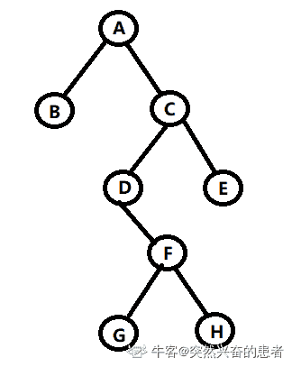

# 京东 2019 春招京东 Android 开发类试卷

## 1

要交换变量 A 和 B 的值,应使用的语句组( ) 

正确答案: B   你的答案: 空 (错误)

```cpp
A=B;B=C;C=A
```

```cpp
C=A;A=B;B=C
```

```cpp
A=B;B=A
```

```cpp
C=A;B=A;B=C
```

本题知识点

C 语言

讨论

[乾殇](https://www.nowcoder.com/profile/717759684)

B，先定义一个中转量为 A 的值，再将 B 赋值给 A，最后将中转量赋值给 B

发表于 2019-10-31 17:10:47

* * *

## 2

京东商城 plus 会员的消费记录金额分别为 900，512，613，700，810，若采用选择排序算法对其进行从小到大的排序，第三趟排序结果为：（）

正确答案: C   你的答案: 空 (错误)

```cpp
900，512，613，700，810
```

```cpp
512，900，613，700，810
```

```cpp
512，613，700，900，810
```

```cpp
512，613，700，810，900
```

本题知识点

安卓工程师 京东 排序 *2019* *讨论

[阿乐啊呵](https://www.nowcoder.com/profile/798911257)

选择排序：每趟找到最小的，放在首位

发表于 2019-06-30 17:21:56

* * *

[coder_hezi](https://www.nowcoder.com/profile/56601192)

不能说是放在首位，是放在未排序的首位

发表于 2020-03-15 20:46:46

* * *

[c++新手](https://www.nowcoder.com/profile/345072514)

为什么不能每次选择最大的放到最后一位这样答案就是 D 了

发表于 2020-04-21 19:41:00

* * *

## 3

在软件开发过程中，我们可以采用不同的过程模型，下列有关增量模型描述正确的（）

正确答案: B   你的答案: 空 (错误)

```cpp
已使用一种线性开发模型，具有不可回溯性
```

```cpp
把待开发的软件系统模块化，将每个模块作为一个增量组件，从而分批次地分析、设计、编码和测试这些增量组件
```

```cpp
适用于已有产品或产品原型（样品），只需客户化的工程项目
```

```cpp
软件开发过程每迭代一次，软件开发又前进一个层次
```

本题知识点

安卓工程师 京东 软件工程 软件开发 2019

讨论

[冯白丁](https://www.nowcoder.com/profile/666899705)

1. 瀑布模型：提出了软件开发的系统化、顺序方法，强调开发的阶段性，各阶段具有顺序性和依赖性。

2. 增量过程模型：1) 增量模型：把软件产品作为一系列的增量构件来设计、编码、集成和测试。2） RAD 模型：侧重于短暂开发周期的增量软件过程模型。

3. 演化过程模型： 原型开发；螺旋模型；协同开发模型

4. 统一过程模型：一种以体系结构为核心、迭代及增量的软件过程框架

编辑于 2019-09-04 21:44:49

* * *

[肉肉 _ 冲鸭](https://www.nowcoder.com/profile/612252642)

[增量模型](http://baike.baidu.com/item/%E5%A2%9E%E9%87%8F%E6%A8%A1%E5%9E%8B)（Incremental Model）：把待开发的软件系统模块化，将每个模块作为一个增量组件，从而分批次地分析、设计、编码和测试这些增量组件   缺点:待开发的软件系统需要能被模块化。

发表于 2019-06-27 16:02:23

* * *

## 4

用计算机解决问题的步骤一般为（ ）①编写程序 ②设计算法 ③分析问题 ④调试程序。

正确答案: D   你的答案: 空 (错误)

```cpp
①②③④
```

```cpp
③④①②
```

```cpp
②③①④
```

```cpp
③②①④
```

本题知识点

安卓工程师 京东 编程基础 *软件工程 2019* *讨论

[段思维](https://www.nowcoder.com/profile/4305751)

很简单的步骤吧，，，

发表于 2019-10-08 17:53:33

* * *

## 5

栈的特点是先进后出。栈底至栈顶依次存放元素 A、B、C、D，  在第五个元素 E 入栈前，栈中元素可以出栈，则出栈序列可能是：（）

正确答案: A   你的答案: 空 (错误)

```cpp
DCBEA
```

```cpp
DEBCA
```

```cpp
DBCEA
```

```cpp
DCAEB
```

本题知识点

安卓工程师 京东 栈 *2019* *讨论

[Milifiore](https://www.nowcoder.com/profile/187135488)

看所有选项，已知 D 为最先出的，那么此时 E 还未入栈，栈中元素为 CBA，之后的出栈顺序中不可能出现先 B 后 C 或者先 A 后 C

编辑于 2020-10-25 21:32:03

* * *

[牛客 759947485 号](https://www.nowcoder.com/profile/759947485)

栈的入栈与出栈规则，由次是 DCBA，e 可以在这个顺序随机插入出栈。

发表于 2020-05-18 14:29:09

* * *

[温泉翁群无](https://www.nowcoder.com/profile/418648734)

栈是一种后进先出的数据结构，排除法做较快，D 先出，B 在 A 之前出，C 在 B 之前出，E 应该不用管

发表于 2019-11-27 23:29:04

* * *

## 6

下列关于队列的叙述中正确的是（）

正确答案: C   你的答案: 空 (错误)

```cpp
在队列中只能插入数据
```

```cpp
在队列中只能删除数据
```

```cpp
队列是先进先出的线性表
```

```cpp
队列是先进后出的线性表
```

本题知识点

安卓工程师 京东 队列 *2019* *讨论

[温泉翁群无](https://www.nowcoder.com/profile/418648734)

队列是只允许在一端进行插入另一端进行删除的线性表，简称 FIFO，只允许删除的一端叫做队头，只允许插入的一端叫做队尾。是先进先出的线性表。。

发表于 2019-11-27 23:36:09

* * *

[天尊墨宇](https://www.nowcoder.com/profile/667959477)

FIFO(First In First Out)选 C

发表于 2020-10-09 07:28:28

* * *

## 7

一颗二叉树的前序遍历是 ABCDFGHE，后序遍历是 BGHFDECA，中序遍历是？

正确答案: C   你的答案: 空 (错误)

```cpp
GHBADFCE
```

```cpp
DGBAFHEC
```

```cpp
BADGFHCE
```

```cpp
BAGDFHEC
```

本题知识点

安卓工程师 京东 树 2019

讨论

[Gangan](https://www.nowcoder.com/profile/6038051)

已知前序和后序遍历，是不能确定一颗二叉树的

发表于 2019-08-08 22:46:19

* * *

[突然兴奋的患者](https://www.nowcoder.com/profile/419742543)

按照 C 选项的中序遍历，以及题目给的前序和后序，我画出了如下图中对应的树结构，以便大家理解

发表于 2020-07-09 22:07:15

* * *

[小镇精灵科技](https://www.nowcoder.com/profile/733582614)

由前序推理

确切信息:

1.A 在最顶侧

2.E 在最右侧

猜测信息:

1.B 和 C 同级或 B 为 C 父级

由后序推理

确切信息:

1.B 在最左侧

结合前序和后序推理

确切信息:

1.B 和 C 同级且分别为 A 的左右节点

2.FGH 在 D 下侧 由于 E 在最右侧 则 F 不可能是其子节点 所以只能是 D 的子节点

3.D 在 C 下侧 E 也在 C 下侧

猜测信息:

1.对比前序和后序排列规律猜测 FGH 为一组树

综合以上出:

A

B C

D E

F

G

发表于 2019-11-15 17:03:56

* * *

## 8

当在浏览器输入 http://www.jd.com 后，执行过程描述有误的是哪个？ 

正确答案: B   你的答案: 空 (错误)

```cpp
客户端浏览器通过 DNS 解析到 www.jd.com 的 ip 地址，通过 ip 地址找到客户端对应的服务器地址，客户端发起 HTTP 会话到 IP，通过 tcp 进行封装数据包，输入到网络层
```

```cpp
在客户端的网络层，把 http 会话请求分成报文段，添加源地址和目的地址
```

```cpp
客户端的网络层主要通过查找路由确定到达服务器
```

```cpp
数据包通过链路层发送到路由器，通过邻居协议查找给定 ip 地址的 mac 地址，然后发送 ARR 请求查找目的地址，得到回应就可以使用 ARP 的请求应答交换的 IP 数据包，发送 IP 数据包到达服务器地址
```

本题知识点

安卓工程师 京东 网络基础 2019

讨论

[大月佥槑](https://www.nowcoder.com/profile/499970558)

在客户端的**传输层**，把 HTTP 会话请求分成报文段，添加源和目的端口

发表于 2019-05-23 22:32:40

* * *

[牛客 354766564 号](https://www.nowcoder.com/profile/354766564)

D 选项为什么是链路层发到路由器？

发表于 2020-09-04 09:27:28

* * *

[找工作这么难啊！](https://www.nowcoder.com/profile/999776808)

域名解析之后不应该是 tcp 建立连接吗？A 怎么直接建立 http 连接了？

发表于 2020-09-04 11:44:56

* * *

## 9

linux 系统中某文件的组外成员的权限为只读；所有者有全部权限；组内的权限为读与写，则该文件的权限为：

正确答案: D   你的答案: 空 (错误)

```cpp
753
```

```cpp
763
```

```cpp
754
```

```cpp
764
```

本题知识点

安卓工程师 京东 Linux 2019

讨论

[大月佥槑](https://www.nowcoder.com/profile/499970558)

u-g-o：用户-组内用户-其他用户 r-w-x：用 4-2-1 表示。组外成员 o 的权限为只读：r-- = 4 所有者 a 有全部权限：rwx; = 7 组内 g 的权限为读与写:rw- = 6

发表于 2019-05-23 22:39:02

* * *

[沈怀请](https://www.nowcoder.com/profile/933046486)

读：4 写：2 执行：1 所有者：4+2+1=7 组：4+2=6 其他：4 故 764

发表于 2020-03-07 16:06:54

* * *

[_____ 陌念〆](https://www.nowcoder.com/profile/1655686)

有没有可能是三个 bit 位  |    r    |    w    |    x    |r = 4w = 2x = 1 然后拼接一下得到结果。

发表于 2019-05-24 13:12:50

* * *

## 10

索引是对数据库表中一个或多个列的值进行排序的数据结构，以协助快速查询、更新数据库表中数据。以下对索引的特点描述错误的是：

正确答案: C   你的答案: 空 (错误)

```cpp
加快数据的检索速度
```

```cpp
加速表和表之间的连接
```

```cpp
在使用分组和排序子句进行数据检索时，并不会减少查询中分组和排序的时间
```

```cpp
通过创建唯一性索引，可以保证数据库表中每一行数据的唯一性
```

本题知识点

安卓工程师 京东 数据库 2019

讨论

[#8](https://www.nowcoder.com/profile/226543311)

索引的特点

1.  大大加快检索数据的速度
2.  通过创建唯一性索引，可以保证数据库表中每一行数据的唯一性
3.  加速表与表之间的连接
4.  查询语句汇总含有分组或者排序的语句时，速度更快
5.  查询的过程中，使用索引，使用优化隐藏器，从而提高系统的性能

索引的不足

1.  创建和维护索引，比较耗费时间，随着数据量的增大而增大
2.  创建索引，占一定的物理空间（聚簇索引，占用空间会更大）
3.  在对表进行增删改的时候，索引相应的也需要进行动态的更新

所以这题就选 C 编辑于 2019-09-18 10:14:30

* * *

[phoenixfrank](https://www.nowcoder.com/profile/969156946)

当查询条件命中索引时，group by 与 order by 使用索引是可以加快速度的。

发表于 2020-02-11 10:47:37

* * *

[niujy](https://www.nowcoder.com/profile/524068450)

3

发表于 2019-06-25 11:50:48

* * *

## 11

下图的 UML 类结构图表示的是哪种设计模式：

正确答案: B   你的答案: 空 (错误)

```cpp
访问者模式
```

```cpp
生成器模式
```

```cpp
代理模式
```

```cpp
命令模式
```

本题知识点

安卓工程师 京东 UML 2019

讨论

[举荐](https://www.nowcoder.com/profile/44206441)

生成器模式也叫建造者模式

发表于 2020-03-21 22:47:43

* * *

[闲鱼总算翻了身](https://www.nowcoder.com/profile/909589300)

生成器模式也叫建造者模式

发表于 2021-07-31 13:44:07

* * *

[菜粥](https://www.nowcoder.com/profile/5293318)

建造者模式 UML 图（IDEA 自动生成）


大话设计模式-建造者模式

[`localhost.blog.csdn.net/article/details/89140078`](https://localhost.blog.csdn.net/article/details/89140078)

大话设计模式-系列文章(共 50 篇)：

[`blog.csdn.net/qq_41113081/category_8723350.html`](https://blog.csdn.net/qq_41113081/category_8723350.html)

发表于 2020-03-23 00:04:58

* * *

## 12

对象间存在一对多关系，当一个对象被修改时，则会自动通知它的依赖对象，采用以下哪种设计模式最好？

正确答案: B   你的答案: 空 (错误)

```cpp
建造者模式
```

```cpp
观察者模式
```

```cpp
策略模式
```

```cpp
代理模式
```

本题知识点

安卓工程师 京东 设计模式 2019

讨论

[温泉翁群无](https://www.nowcoder.com/profile/418648734)

观察者模式，，，修改的对象为被观察者，它的依赖对象为观察者，观察者很多

发表于 2019-11-27 23:38:42

* * *

[菜粥](https://www.nowcoder.com/profile/5293318)

观察者模式 UML 图（IDEA 自动生成）


大话设计模式-观察者模式
[`localhost.blog.csdn.net/article/details/89334733`](https://localhost.blog.csdn.net/article/details/89334733)

大话设计模式-系列文章(共 50 篇)：
[`blog.csdn.net/qq_41113081/category_8723350.html`](https://blog.csdn.net/qq_41113081/category_8723350.html)

发表于 2020-03-23 00:16:20

* * *

## 13

在 Android 的 Activity 活动中，我们一般可以归结为四种状态，这四种状态不包含( )

正确答案: B   你的答案: 空 (错误)

```cpp
运行状态
```

```cpp
初始状态
```

```cpp
暂停状态
```

```cpp
销毁状态
```

本题知识点

安卓工程师 京东 Android 2019

讨论

[牛客 55348104 号](https://www.nowcoder.com/profile/55348104)

Running（运行）：在屏幕前台（位于当前任务堆栈的顶部）

Paused（暂停）：失去焦点但仍然对用户可见（覆盖 Activity 可能是透明或未完全遮挡）

Stopped（停止）：完全被另一个 Activity 覆盖

Destroyed（销毁）：退出，完全销毁

发表于 2020-10-27 16:31:46

* * *

[骨标平均不进五分不改名](https://www.nowcoder.com/profile/512875194)

Activity 四种状态：1、running2、paused3、stopped4、killed

发表于 2019-07-01 11:45:49

* * *

[Ele_DD](https://www.nowcoder.com/profile/7821934)

有人知道 如何获取 一个 Activity 的状态吗？网上千篇一律都说有四种 谁有代码 证明一下？

发表于 2020-02-25 15:17:06

* * *

## 14

如果 Android 应用程序需要设置屏幕方向为横屏方式显示，那么需要在 AndroidMainfest.xml 文件增加哪种权限（ ）

正确答案: A   你的答案: 空 (错误)

```cpp
android.permission.SET_ORIENTATION
```

```cpp
permission.SET
```

```cpp
android.permission.STATUS_BAR
```

```cpp
android.permission.SYSTEM_ALERT_WINDOW
```

本题知识点

安卓工程师 京东 Android 2019

讨论

[牛客 299890557 号](https://www.nowcoder.com/profile/299890557)

这个题目值得商榷，Manifest.permission 中没有 android.permission.SET_ORIENTATION 这个权限。查看 frameworks/base/core/res/AndroidManifest.xml 源码，android.permission.SET_ORIENTATION 权限已经明确标识了@hide，以及不允许第三方应用使用。

发表于 2020-06-28 09:55:28

* * *

[好好学习天天向上 2021](https://www.nowcoder.com/profile/5611794)

我好像并没有用到过？

发表于 2020-04-07 20:30:38

* * *

[牛客 701793973 号](https://www.nowcoder.com/profile/701793973)

这也不要权限呀

发表于 2021-12-10 13:10:45

* * *

## 15

在进行网络访问时，APP 中需要开启的权限是（）

正确答案: A   你的答案: 空 (错误)

```cpp
android.permission.INTERNET
```

```cpp
android.permission.ACCESS_NETWORK_STATE
```

```cpp
android.permission.ACCESS_WIFI_STATE
```

```cpp
android.permission.BLUETOOTH
```

本题知识点

安卓工程师 京东 Android 2019

讨论

[骨标平均不进五分不改名](https://www.nowcoder.com/profile/512875194)

A 选项：网络权限 B 选项：网络状态 C 选项：wifi 状态 D 选项：蓝牙

发表于 2019-06-27 21:55:19

* * *

## 16

ANR 产生时, 系统会生成一个跟踪日志文件，文件是（）

正确答案: A   你的答案: 空 (错误)

```cpp
data/anr/traces.txt
```

```cpp
data/anr/log.txt
```

```cpp
data/log/traces.txt
```

```cpp
data/data/log.txt
```

本题知识点

安卓工程师 京东 Android 2019

讨论

[沐沐 26](https://www.nowcoder.com/profile/71626723)

ANR 即 Application Not Responding，应用无响应。发生 ANR 时，系统会产生 traces.txt 文件，目录为/data/anr 

> 由于该文件的产生是在 DVM 中的，所以只有运行 DVM 实例的进程才能产生该文件，也就是说只有 Java 代码才能产生该文件，App 应用的 Native 层（如 Android Library、用 c/c++编译的库）即使异常也不会产生 ANR 日志文件

发表于 2019-07-18 10:26:53

* * *

[温泉翁群无](https://www.nowcoder.com/profile/418648734)

ANR， Application Not Responding，   

发表于 2019-11-27 23:47:58

* * *

## 17

有代码片段如下，代码的主要作用是（）

```cpp
Intent intent = new Intent(Intent.ACTION_WEB_SEARCH);
intent.putExtra(SearchManager.QUERY, "安卓");
startActivity(intent);
```

正确答案: A   你的答案: 空 (错误)

```cpp
打开浏览器，并使用默认的搜索引擎进行关键字“安卓”搜索
```

```cpp
打开浏览器，并传递参数“安卓”
```

```cpp
跳转到其他 Activity 活动并进行参数传递
```

```cpp
通知后台服务，保存关键字“安卓”到 SQLite
```

本题知识点

安卓工程师 京东 Android 2019

讨论

[牛客 664512 号](https://www.nowcoder.com/profile/664512)

这题有歧义

发表于 2021-05-20 13:16:02

* * *

[HLQ_Struggle](https://www.nowcoder.com/profile/1920947)

关键字 web_search 以及 query，明显带着参数跳转浏览器并执行查询操作。

发表于 2020-07-09 07:47:44

* * *

[温泉翁群无](https://www.nowcoder.com/profile/418648734)

隐式启动。有 WEB 有 QUERY，肯定排除 C  &D。

发表于 2019-11-27 23:51:45

* * *

## 18

@+id/资源 ID 名，@id/资源 ID 名，@android:id/资源 ID 名三种 id 格式的区别，下面（）说法是错误的。

正确答案: D   你的答案: 空 (错误)

```cpp
@+id/资源 ID 名用来新定义资源的 ID
```

```cpp
@id/资源 ID 名：表示引用已经存在的资源
```

```cpp
@android:id/资源 ID 名表示应用系统存在的资源
```

```cpp
@+id/资源 ID 名：表示引用已经存在的资源
```

本题知识点

安卓工程师 京东 Android 2019

讨论

[骨标平均不进五分不改名](https://www.nowcoder.com/profile/512875194)

1.  ***android:id="@+id/new_name" ******开发者为当前的控件或者布局新定义一个 id 名称。该 ID 名称在 R.java 文件中会分配一个唯一的 int 型常量，用于对资源引用的索引。（如果 R.java 中存在这个值则直接使用存在的值，否则会在 R.java 文件中生成 new_name 值）***
2.  ***android:id="@id/defined_name" 
    引用一个名称为 defined_name 的 id 资源。该引用针对的是开发者自定义的 id 资源。（如果 R.java 中存在这个值，则使用此值）；否则会造成编译错误。***
3.  ***android:id="@android:id/sys_name" 
    引用名称为 sys_name 的系统内部资源。*** 

发表于 2019-07-01 11:43:19

* * *

## 19

Android 的补间动画不包括（ ）

正确答案: D   你的答案: 空 (错误)

```cpp
AlphaAnimation
```

```cpp
ScaleAnimation
```

```cpp
RotateAnimation
```

```cpp
RenderAnimation
```

本题知识点

安卓工程师 京东 Android 2019

讨论

[大月佥槑](https://www.nowcoder.com/profile/499970558)

1.AlphaAnimation：透明度渐变效果，创建时许指定开始以及结束透明度，还有动画的持续 时间，透明度的变化范围(0,1)，0 是完全透明，1 是完全不透明；对应<alpha/>标签。

2.ScaleAnimation：缩放渐变效果，创建时需指定开始以及结束的缩放比，以及缩放参考点， 还有动画的持续时间；对应<scale/>标签。

3.TranslateAnimation：位移渐变效果，创建时指定起始以及结束位置，并指定动画的持续 时间即可；对应<translate/>标签。

4.RotateAnimation：旋转渐变效果，创建时指定动画起始以及结束的旋转角度，以及动画 持续时间和旋转的轴心；对应<rotate/>标签。

5.AnimationSet：组合渐变，就是前面多种渐变的组合，对应<set/>标签。

发表于 2019-05-23 23:10:29

* * *

[Linkdamo](https://www.nowcoder.com/profile/897387143)

两 A 一 R 一 T 一 S

发表于 2021-11-18 01:15:13

* * *

[听海.](https://www.nowcoder.com/profile/305512864)

加油！

发表于 2022-01-29 10:27:14

* * *

## 20

在开发阶段，现在需要新增加界面功能，以下的步骤哪些不是必须的( )

正确答案: D   你的答案: 空 (错误)

```cpp
新建 Activity 活动类
```

```cpp
在 AndroidManifest.xml 文件中增加 Activity 的配置
```

```cpp
新建 layout 的布局文件，并在 Activity 中引用
```

```cpp
在 res/menu 目录下新建 xml 菜单文件
```

本题知识点

安卓工程师 京东 Android 2019

讨论

[Ele_DD](https://www.nowcoder.com/profile/7821934)

垃圾题目 setContent 不一定要 xml 文件，况且我复用其他的不行吗？

发表于 2020-03-05 17:06:25

* * *

[今时今日乜法则都没鸠用](https://www.nowcoder.com/profile/126182989)

这什么鬼题目，如果在原 activity 和 xml 上修改难道还要新建？

发表于 2019-10-22 19:17:53

* * *

[李艺为](https://www.nowcoder.com/profile/193967602)

AB 必须的。layout 也可以 new view 出来，然后 setContentView 的，不一定要 xml 来写，所以 C 也不是必须的，D 不必须，界面可以没菜单

编辑于 2020-08-28 07:16:31

* * *

## 21

Android 手机安装的应用都是以 apk 的形式来进行的。他实质上是个压缩包。在 apk 包中都没有包含的文件是（）

正确答案: D   你的答案: 空 (错误)

```cpp
开发过程中的各种资源文件
```

```cpp
代码类文件包 classes.dex
```

```cpp
AndroidManifest.xml
```

```cpp
src 下的.java 文件
```

本题知识点

安卓工程师 京东 Android 2019

讨论

[IFlipped](https://www.nowcoder.com/profile/858115101)

java 文件已被编译

发表于 2019-08-01 12:16:52

* * *

[Kmorebi](https://www.nowcoder.com/profile/124925111)

我们写的 JAVA 文件被编译成 DEX 字节码文件了

发表于 2020-07-04 11:08:53

* * *

## 22

Android APP 开发过程中，下列的那些做法是不推荐的。（）

正确答案: C   你的答案: 空 (错误)

```cpp
针对特定屏幕密度使用特定的图标和位图
```

```cpp
用到的数据资源如字符串，长度等统一定义在资源文件 xml 中
```

```cpp
在程序和布局视图中，直接赋值字符串常量或颜色等属性
```

```cpp
统一编码规范，命名规范，资源引用规范等以便于管理或后期维护
```

本题知识点

安卓工程师 京东 Android 2019

讨论

[牛客 882237718 号](https://www.nowcoder.com/profile/882237718)

c 不推荐直接写在在布局 xml 中 建议抽取成变量 放在 string.xml 和 color.xml 中 便于集体修改

发表于 2020-09-02 13:47:12

* * *

[举荐](https://www.nowcoder.com/profile/44206441)

这个在 Androidstudio 里就一直有这样的代码提示

发表于 2020-03-21 22:52:17

* * *

[小黑嘿](https://www.nowcoder.com/profile/664019768)

c 不推荐直接写在在布局 xml 中 建议抽取成变量 放在 string.xml 和 color.xml 中 便于集体修改

编辑于 2019-09-04 13:23:09

* * *

## 23

后端获取数据，向前端输出过程中，以下描述正确的是

正确答案: D   你的答案: 空 (错误)

```cpp
对于前端过滤过的参数，属于可信数据，可以直接输出到前端页面
```

```cpp
对于从数据库获得的数据，属于可信数据，可以直接输出到前端页面
```

```cpp
对于从用户上传的 Excel 等文件解析出的数据，属于可信数据，可以直接输出到前端页面
```

```cpp
其它选项都不属于可信数据，输出前应该采用信息安全部发布的 XSSFilter 做进行相应编码
```

本题知识点

安卓工程师 京东 Android 2019

讨论

[牛客 701793973 号](https://www.nowcoder.com/profile/701793973)

？？特么跟安卓有毛关系？

发表于 2020-05-26 09:57:40

* * *

[LongSh1z](https://www.nowcoder.com/profile/583231387)

简单说明
XSS : 跨站脚本攻击(Cross Site Scripting)，为不和层叠样式表(Cascading Style Sheets, CSS)的缩写混淆，故将跨站脚本攻击缩写为 XSS。恶意攻击者往 Web 页面里插入恶意 html 代码，当用户浏览该页之时，嵌入其中 Web 里面的 html 代码会被执行，从而达到恶意攻击用户的特殊目的。

sql 注入
所谓 SQL 注入，就是通过把 SQL 命令插入到 Web 表单提交或输入域名或页面请求的查询字符串，最终达到欺骗服务器执行恶意的 SQL 命令。具体来说，它是利用现有应用程序，将（恶意）的 SQL 命令注入到后台数据库引擎执行的能力，它可以通过在 Web 表单中输入（恶意）SQL 语句得到一个存在安全漏洞的网站上的数据库，而不是按照设计者意图去执行 SQL 语句。

发表于 2019-08-06 11:10:26

* * *

[甜树果子二号](https://www.nowcoder.com/profile/543920445)

[`developer.mozilla.org/zh-CN/docs/Glossary/Cross-site_scripting`](https://developer.mozilla.org/zh-CN/docs/Glossary/Cross-site_scripting)

发表于 2020-02-10 20:30:48

* * *

## 24

下列哪些操作会使线程释放锁资源？

正确答案: B C   你的答案: 空 (错误)

```cpp
sleep()
```

```cpp
wait()
```

```cpp
join()
```

```cpp
yield()
```

本题知识点

安卓工程师 京东 Android Java 2019

讨论

[我只要亿个 Offer](https://www.nowcoder.com/profile/936216030)

1.sleep 会使当前线程睡眠指定时间，不释放锁 2.yield 会使当前线程重回到可执行状态，等待 cpu 的调度，不释放锁 3.wait 会使当前线程回到线程池中等待，释放锁，当被其他线程使用 notify，notifyAll 唤醒时进入可执行状态 4.当前线程调用 某线程.join（）时会使当前线程等待某线程执行完毕再结束，底层调用了 wait，释放锁

发表于 2019-10-06 23:15:58

* * *

[基层程序员](https://www.nowcoder.com/profile/495010940)

join()底层就是调用 wait()方法的，wait()释放锁资源，故 join 也释放锁资源

发表于 2019-07-03 17:49:04

* * *

[大月佥槑](https://www.nowcoder.com/profile/499970558)

**1.sleep()方法**

在指定时间内让当前正在执行的线程暂停执行，但不会释放“锁标志”。不推荐使用。

sleep()使当前线程进入阻塞状态，在指定时间内不会执行。

**2.wait()方法**

在其他线程调用对象的 notify 或 notifyAll 方法前，导致当前线程等待。线程会释放掉它所占有的“锁标志”，从而使别的线程有机会抢占该锁。

当前线程必须拥有当前对象锁。如果当前线程不是此锁的拥有者，会抛出 IllegalMonitorStateException 异常。

唤醒当前对象锁的等待线程使用 notify 或 notifyAll 方法，也必须拥有相同的对象锁，否则也会抛出 IllegalMonitorStateException 异常。

waite()和 notify()必须在 synchronized 函数或 synchronized　block 中进行调用。如果在 non-synchronized 函数或 non-synchronized　block 中进行调用，虽然能编译通过，但在运行时会发生 IllegalMonitorStateException 的异常。

**3.yield 方法 **

暂停当前正在执行的线程对象。

yield()只是使当前线程重新回到可执行状态，所以执行 yield()的线程有可能在进入到可执行状态后马上又被执行。

yield()只能使同优先级或更高优先级的线程有执行的机会。 

**4.join 方法**

等待该线程终止。

等待调用 join 方法的线程结束，再继续执行。如：t.join();//主要用于等待 t 线程运行结束，若无此句，main 则会执行完毕，导致结果不可预测。

发表于 2019-05-23 23:18:52

* * *

## 25

以下哪个区域不属于新生代？

正确答案: C   你的答案: 空 (错误)

```cpp
eden 区
```

```cpp
from 区
```

```cpp
元数据区
```

```cpp
to 区
```

本题知识点

安卓工程师 京东 Android 2019

讨论

[落日下的嗜血](https://www.nowcoder.com/profile/596242499)

应该是考虚拟机中 GC: 新生代中存在 1 个 eden 区和两个 Survivor 区，分别为 From 区，和 to 区 JDK8 中将持久代去掉，以元数据区替换。

编辑于 2019-07-12 23:58:58

* * *

[高嵩 201808052106242](https://www.nowcoder.com/profile/54848069)

这道理考察的是 java 回收机制的 分代收集器算法，分代收集算***结合不同的收集算法来处理不同的空间，根据生命周期的长短将它们分别放到不同的区域，并在不同的区域采用不同的收集算法。 新生代有三个空间，Eden 空间、From Survivor 空间、To Survivor 空间 ，由于 Eden 空间中大都数对象生命周期很短，所以新生代的空间划分并不均分，HotSpot 虚拟机默认 Eden 空间和两个 Survivor 空间的所占的比例为 8 : 1

发表于 2020-11-22 12:47:00

* * *

[哀乐之颠写年华](https://www.nowcoder.com/profile/283473796)

没看明白这一题

发表于 2019-07-04 21:32:49

* * *

## 26

当我们需要所有线程都执行到某一处，才进行后面的的代码执行我们可以使用？

正确答案: A   你的答案: 空 (错误)

```cpp
CountDownLatch
```

```cpp
CyclicBarrier
```

```cpp
Semaphore
```

```cpp
Future
```

本题知识点

安卓工程师 京东 Android 2019

讨论

[stoneWang](https://www.nowcoder.com/profile/6907962)

CountDownLatch 是一个非常实用的多线程控制工具类。常用的就下面几个方法：

```cpp
CountDownLatch(int count) //实例化一个倒计数器，count 指定计数个数 countDown() // 计数减一 await() //等待，当计数减到 0 时，所有线程并行执行
```

发表于 2019-07-31 17:15:34

* * *

[DQ_coding](https://www.nowcoder.com/profile/692943460)

CountDownLatch 是一个同步工具类，用来协调多个线程之间的同步，或者说起到线程之间的通信（而不是用作互斥的作用）。 CountDownLatch 能够使一个线程在等待另外一些线程完成各自工作之后，再继续执行。使用一个计数器进行实现。计数器初始值为线程的数量。当每一个线程完成自己任务后，计数器的值就会减一。当计数器的值为 0 时，表示所有的线程都已经完成了任务，然后在 CountDownLatch 上等待的线程就可以恢复执行任务。

发表于 2020-11-23 14:03:26

* * *

[展鹤](https://www.nowcoder.com/profile/4204002)

```cpp

```
CyclicBarrier 是多个线程互相等待。

```cpp
CountDownLatch 是所有 countdown()减少到 0 后，所有 await()线程执行。。所以 cyclicBarrier 也可以达到上述要求吧
```

```cpp

```

发表于 2020-02-14 16:25:47

* * *

## 27

java 有 8 种基本类型，请问 byte、int、long、char、float、double、boolean 各占多少个字节？

正确答案: B   你的答案: 空 (错误)

```cpp
1 2 8 2 4 8 1
```

```cpp
1 4 8 2 4 8 1
```

```cpp
1 4 4 2 4 4 2
```

```cpp
1 4 4 2 4 8 2
```

本题知识点

安卓工程师 京东 Java 2019

讨论

[机智的遊先生](https://www.nowcoder.com/profile/541684691)

变量名称 字节 位数

byte 1 8

short 2 16

int 4 32

long 8 64

float 4 32

double 8 64

char 2 16

boolean 1 8

发表于 2019-07-23 23:30:18

* * *

[白起丶](https://www.nowcoder.com/profile/815173790)

看了一下评论好像没有对 boolean 类型所占空间做出明确定义，这里简要谈一下我的了解。boolean 类型占据一个字节或者四个字节。在 java 规范 2 中，如果 boolean 用于声明一个基本类型变量时是占四个字节，如果用于声明一个数组类型时，那么数组中的每个元素占一个字节。

发表于 2020-06-27 21:50:18

* * *

[IDEA2022.4.2](https://www.nowcoder.com/profile/181223548)

我这里解释一下 boolean 占多大的空间，JVM 规范给出的是 4 个字节也就是单个 boolean 当做 int 处理，boolean 数组 1 个字节的定义，具体还要看虚拟机实现是否按照规范来，1 个字节、4 个字节都是有可能的。其实这就是运算效率与存储空间之间的博弈

发表于 2020-04-14 09:05:36

* * *

## 28

要求匹配以下 16 进制颜色值，正则表达式可以为：  #ffbbad  #Fc01DF  #FFF  #ffE

正确答案: B   你的答案: 空 (错误)

```cpp
/#([0-9a-f]{6}|[0-9a-fA-F]{3})/g
```

```cpp
/#([0-9a-fA-F]{6}|[0-9a-fA-F]{3})/g
```

```cpp
/#([0-9a-fA-F]{3}|[0-9a-f]{6})/g
```

```cpp
/#([0-9A-F]{3}|[0-9a-fA-F]{6})/g
```

本题知识点

Javascript

讨论

[小小小菜 bird](https://www.nowcoder.com/profile/672201874)

首先正则表达式写在两个/之间，然后第一个为#表示字符串第一个为#，然后[0-9a-fA-F]表示范围是数字和大小写字母，之后{6}表示连续 6 个字符，之间还有一个|表示条件或；最后一个 g，表示表明可以进行全局匹配，如果不写 g，那么只会完成一轮匹配（或者说只返回第一个匹配的），写 g，可以进行全局搜索。

发表于 2020-05-09 19:39:11

* * *

[有何不可 qwert](https://www.nowcoder.com/profile/3924256)

fk

发表于 2019-06-27 22:48:26

* * *

[对方正在输入..........](https://www.nowcoder.com/profile/845254012)

以#开头，后面是数字和 a-f 的字符（大写或小写），这个值是 6 位或 3 位。要匹配一个 3 位是为了符合 16 进制颜色的简写规则

发表于 2019-07-05 16:43:19

* * *

## 29

如何获取上一条命令执行的返回码

正确答案: C   你的答案: 空 (错误)

```cpp
$!
```

```cpp
$0
```

```cpp
$？
```

```cpp
$#
```

本题知识点

安卓工程师 京东 shell 2019

讨论

[Evan 丶.](https://www.nowcoder.com/profile/6090029)

shell 中$0, $#, $*, $@, $?, $$的含义$0    当前脚本的文件名$n    传递给脚本或函数的参数。n 是一个数字，表示第几个参数。例如，第一个参数是$1，第二个参数是$2。$#    传递给脚本或函数的参数个数。$*    传递给脚本或函数的所有参数。$@    传递给脚本或函数的所有参数。$?    上个命令的退出状态，或函数的返回值。$$    当前 Shell 进程 ID。对于 Shell 脚本，就是这些脚本所在的进程 ID。$!    Shell 最后运行的后台 Process 的 PID$-    显示 Shell 使用的当前选项，与 set 命令功能相同。$* 和 $@ 的区别        $* 和 $@ 都表示传递给函数或脚本的所有参数，不被双引号(" “)包含时，都以”$1" “2&quot;…&quot;2"…"n” 的形式输出所有参数当它们被双引号(" “)包含时，”$*" 会将所有的参数作为一个整体，以"$1 $2 … n&quot;的形式输出所有参数；&quot;n"的形式输出所有参数；"@" 会将各个参数分开，以"$1" “2&quot;…&quot;2"…"n” 的形式输出所有参数。

发表于 2020-08-04 20:42:59

* * *

## 30

以下语句可以用来获取 shell 脚本参数的是

正确答案: A C   你的答案: 空 (错误)

```cpp
$1
```

```cpp
$?
```

```cpp
$*
```

```cpp
$$
```

本题知识点

安卓工程师 京东 shell 2019

讨论

[大月佥槑](https://www.nowcoder.com/profile/499970558)

$# 是传给脚本的参数个数$0 是脚本本身的名字$1 是传递给该 shell 脚本的第一个参数$2 是传递给该 shell 脚本的第二个参数$@ 是传给脚本的所有参数的列表$* 是以一个单字符串显示所有向脚本传递的参数，与位置变量不同，参数可超过 9 个$$ 是脚本运行的当前进程 ID 号$? 是显示最后命令的退出状态，0 表示没有错误，其他表示有错误

发表于 2019-05-23 23:48:29

* * *

[Nature201905272221277](https://www.nowcoder.com/profile/88887667)

答案错了，牛客还不改吗

发表于 2020-04-09 19:42:33

* * *

[牛客 570237057 号](https://www.nowcoder.com/profile/570237057)

$*代表命令行中所有参数，把所有参数当做一个整体对待 $@也代表命令行中所有参数，不过是把每个参数区分对待 $n，n 为数字，0 代表命令本身，1—9 为第一到第九个参数，十以上要用大括号括起来 $#代表命令行中所有参数个数 $？为上一次执行命令的返回状态，如果这个值为 0，则证明上一命令正确执行 $$当前进程号（pid） $！后台运行的最后一个进程的进程号

编辑于 2021-12-02 10:47:53

* * *

## 31

小 M 要制作一种黑暗饮料，这种饮料的原料有 n 种，编号为 1-n ，已知小 M 的容器最多容纳 v 升材料，黑暗料理的各种原料配比为 a1 : a2 : a3 : ... : an, 每种原料分别有 b1，b2，... bn 升。 问小 M 最多可以制作多少升这种饮料。小 M 使用的各种原料体积和不能超过 v 。数据范围：  ， 

本题知识点

安卓工程师 京东 数学 模拟 2019

讨论

[P.Foden](https://www.nowcoder.com/profile/173188198)

```cpp
import java.text.DecimalFormat;
import java.util.Scanner;

public class Main {
    public static void main(String[] args) {
        Scanner in=new Scanner(System.in);
        int n=in.nextInt();
        int v=in.nextInt();
        int sum=0;
        double[]a=new double[n];
        double[]b=new double[n];
        for (int i = 0; i <n ; i++) {
            a[i]=in.nextDouble();
            sum+=a[i];
        }
        for (int i = 0; i <n ; i++) {
            b[i]=in.nextDouble();
        }
        double weightMax=b[0]/a[0]*sum;
        //int weightMaxIndex=0;
        for (int i = 1; i < n; i++) {
            double maxV=b[i]/a[i]*sum;
            if(maxV<weightMax){
                weightMax=maxV;
               // weightMaxIndex=i;
            }
        }
        if(weightMax>=v){
            keepFour(v);
        }else{
            keepFour(weightMax);
        }
    }
    public static  void keepFour(double d1){
        DecimalFormat df=new DecimalFormat("#0.0000");
        System.out.println(df.format(d1));
    }

}

```

发表于 2020-04-17 22:03:13

* * *

[无心 2019](https://www.nowcoder.com/profile/991674511)

```cpp
#include<bits/stdc++.h>
using namespace std;
int main()
{
    int n,v;
    cin>>n>>v;
    vector<double>a(n),b(n);
    double res=v,sum=0.0,tmp;
    for(int i=0;i<n;i++)
    {
        cin>>a[i];
        sum+=a[i];
    }
    for(int i=0;i<n;i++)
    {
        cin>>b[i];
        tmp=b[i]/a[i];
        res=min(res,tmp);
    }
    tmp=res*sum;
    res=tmp < v ? tmp : v;
    cout << fixed << setprecision(4)<<res<<endl;
    return 0;
}
```

发表于 2019-08-20 21:59:15

* * *

[Wayne_Sun](https://www.nowcoder.com/profile/975854345)

```cpp
import java.text.DecimalFormat;
import java.util.ArrayList;
import java.util.List;
import java.util.Scanner;

public class Main {
    private static List<Double> lista;
    private static List<Double> listb;

    public static void main(String[] args) {
        Scanner in = new Scanner(System.in);
        int n = in.nextInt();
        int V = in.nextInt();
        double suma  = 0;
        double min = Double.MAX_VALUE;
        lista = new ArrayList<>(n);
        listb = new ArrayList<>(n);
        for (int i = 0; i < n; i++) {
            double temp = in.nextDouble();
            //构造配比数组
            lista.add(temp);
            //计算每份饮料所需体积
            suma+=temp;
        }
        for (int i = 0; i < n; i++) {
            double temp = in.nextDouble();
            //构造拥有原料体积数组
            listb.add(temp);
        }
        for (int i = 0; i < n; i++) {
            //求在原料允许的情况下，最多能做多少份饮料
            min = Math.min(listb.get(i)/lista.get(i), min);
        }
        //在原料允许的情况下最多能做的饮料体积
        double ans2 = min*suma;
        //比较容器体积和 ans，求出较小值即为答案
        double ans = Math.min(V,ans2);
        DecimalFormat df = new DecimalFormat("0.0000");
        System.out.println(df.format(ans));
    }
}

```

发表于 2020-08-05 23:09:23

* * *

## 32

现在给出一张含有 n 个点的有向无环图，我们称这张图是“有序图”当且仅当这个图满足以下条件：1\. 存在一个 1-n 数字的全排列 p ，并令 i 号结点的权值为 p[i] 。2\. 如果图中存在 u 号结点到 v 号结点的一条边，则 u 号结点的权值要小于 v 号结点的权值。  显然可能有多个序列满足条件，请你找出字典序最小的全排列 p ，使得这个图成为有序图。数据范围： 

本题知识点

安卓工程师 京东 图 排序 *2019* *讨论

[nbgao](https://www.nowcoder.com/profile/211289)

```cpp
#include <bits/stdc++.h>
using namespace std;

const int M = 100003;
vector<int> E[M];
int indegree[M];

int main(){
    int n, m, u, v;
    cin>>n>>m;
    int r[n+1];
    for(int i=0;i<m;i++){
        cin>>u>>v;
        E[v].push_back(u);
        indegree[u]++;
    }
    priority_queue<int> q;
    for(int i=1;i<=n;i++)
        if(!indegree[i])
            q.push(i);
    int k = n;
    while(!q.empty()){
        int p = q.top();
        q.pop();
        r[p] = k--;
        for(int i=0;i<E[p].size();i++){
            v = E[p][i];
            indegree[v]--;
            if(indegree[v]==0)
                q.push(v);
        }
    }
    for(int i=1;i<=n;i++){
        if(i==n)
            cout<<r[i]<<endl;
        else
            cout<<r[i]<<" ";
    }
    return 0;
}
```

发表于 2020-01-13 02:35:29

* * *

[何止 hz](https://www.nowcoder.com/profile/197695128)

逆向拓扑排序+优先队列，满足拓扑关系的前提下，将节点值大的往后放

```cpp
import java.io.BufferedReader;
import java.io.IOException;
import java.io.InputStreamReader;
import java.util.ArrayList;
import java.util.Comparator;
import java.util.PriorityQueue;

/**
 * @Author: coderjjp
 * @Date: 2020-05-11 22:27
 * @Description:
 * @version: 1.0
 */
public class Main {
    public static void main(String[] args) throws IOException {
        BufferedReader br = new BufferedReader(new InputStreamReader(System.in));
        String[] line1 = br.readLine().split(" ");
        int n = Integer.parseInt(line1[0]);
        int m = Integer.parseInt(line1[1]);
        int hash[] = new int[n+1];//记录 1-n 的出度
        ArrayList<Integer> from[] = new ArrayList[n+1];//记录每个点被谁指向
        for (int i = 0; i < m; i++){
            String line[] = br.readLine().split(" ");
            int f = Integer.parseInt(line[0]);
            int t = Integer.parseInt(line[1]);
            if (from[t] == null)
                from[t] = new ArrayList<>();
            from[t].add(f);
            hash[f]++;
        }
        //维护一个最大优先队列
        PriorityQueue<Integer> queue = new PriorityQueue<>((o1, o2) -> o2 - o1);//将出度为 0 的进队
        for (int i = 1; i <= n; i++)
            if (hash[i] == 0)
                queue.offer(i);
        int ans[] = new int[n+1];//记录 1-n 个节点的权重
        int w = n;
        while (!queue.isEmpty()){
            int cur = queue.poll();
            ans[cur] = w;
            w--;
            if (from[cur] != null)
                for (int i: from[cur]){
                    hash[i]--;
                    if (hash[i] == 0)
                        queue.offer(i);
                }
        }
        StringBuilder res = new StringBuilder().append(ans[1]);
        for (int i = 2; i <= n; i++)
            res.append(" ").append(ans[i]);
        System.out.println(res);
    }
}
```

发表于 2020-05-11 22:43:30

* * *

[sky 游荡](https://www.nowcoder.com/profile/543255165)

1，先出出度为 0 的点作为最大值点。2，同时存在多个出度为 0 的点，先出数值大的点。

```cpp
from collections import defaultdict
import queue
graph,opp_graph,out = defaultdict(list),defaultdict(list),defaultdict(int)
n,m = map(int,input().split())

q = queue.PriorityQueue()
for _ in range(m):
    x,y = map(int,(input().split()))
    graph[x].append(y)
    opp_graph[y].append(x)
for d in range(1,n+1):
    out[d] = len(graph[d])
    if out[d]==0:
        q.put(-d)
ans ,count= [0 for i in range(n)],n
while not q.empty():
    node = -q.get()
    ans[node-1] = count
    count-=1
    for d in opp_graph[node]:
        out[d] -= 1
        if out[d]==0:
            q.put(-d)
print(' '.join(list(map(str,ans))))

```

 发表于 2020-04-23 00:56:43

* * ******