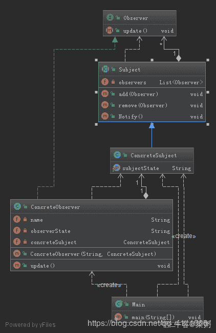

# 京东 2019 春招京东 C 开发类试卷

## 1

模式串的长度是 m，主串的长度是 n（m<n），使用 KMP 算法匹配的时间复杂度是（）？

正确答案: A   你的答案: 空 (错误)

```cpp
O(m+n)
```

```cpp
O(m∙n)
```

```cpp
O(m∙log2n)
```

```cpp
O(n∙log2m)
```

本题知识点

C++工程师 京东 安卓工程师 复杂度 2019

讨论

[Chrety](https://www.nowcoder.com/profile/994602167)

KMP 为线性算法，处理主和匹配串的复杂度都为)，所以是,选 A

发表于 2019-08-02 08:51:00

* * *

## 2

流程图中表示判断的应使用（ ）

正确答案: B   你的答案: 空 (错误)

```cpp
矩形框
```

```cpp
菱形框
```

```cpp
圆形框
```

```cpp
椭圆形框
```

本题知识点

C++工程师 京东 安卓工程师 编译和体系结构 2019

讨论

[一颗小瓜子](https://www.nowcoder.com/profile/1659497)

矩形：执行的处理 圆角矩阵或扁圆：程序开始或结束 平行四边形：数据输入输出 菱形： 判断 圆形：联结，按顺序数据的流程

发表于 2020-08-04 23:22:45

* * *

## 3

在对问题的解空间树进行搜索的方法中，一个结点有多次机会成为活结点的是：（）

正确答案: B   你的答案: 空 (错误)

```cpp
动态规划
```

```cpp
回溯法
```

```cpp
分支限界法
```

```cpp
回溯法和分支限界法
```

本题知识点

C++工程师 京东 安卓工程师 树 2019

讨论

[ronincccc](https://www.nowcoder.com/profile/30800095)

回溯法是妥妥的。。可以各种节点重复跑；分支限界法剪枝搜索策略(广度搜索)与算法框架
基本思想:

分支限界法与回溯法求解目标不同 : **回溯法的求解目标是找出解空间中满足约束条件的所有解，而分支限界法的求解目标是找出满足约束条件的一个解，或者是在满足约束条件的解中找出使某一个目标函数值达到极大或者极小的解，即某种意义下的最优解**
搜索方式不同 : 回溯法以深度优先搜索的方式进行搜索，而**分支限界法使用广度优先搜索或者最小耗费优先的方式进行搜索解空间，其策略是 : 在扩展结点处，先生成其所有的儿子结点(分支)， 然后从当前的活结点表中选择下一个扩展结点。**
计算一个函数值(限界) : 为了加速搜索的过程，在每一个活结点处，计算一个函数值，并根据函数值，从当前活结点表中选择一个最有利的结点作为扩展结点，使得搜索朝着解空间上最优解的分支进行推进，一遍尽快的找出一个最优解。
每个活结点只有一次机会成为扩展结点，一旦成为扩展结点，就一次性产生所有的儿子结点，在儿子结点中，导致不可行解或者导致非最优解的儿子结点被舍弃，其余的加入到活结点表中。
活结点表有两种框架：(1) 队列式分支限界法。(2) 优先队列式分支限界法 (主要是确定优先级的选取)
--------------------- 
作者：zxzxin 
来源：CSDN 
原文：[`blog.csdn.net/zxzxzx0119/article/details/80102094`](https://blog.csdn.net/zxzxzx0119/article/details/80102094) 
版权声明：本文为博主原创文章，转载请附上博文链接！

发表于 2019-07-17 20:02:47

* * *

## 4

在软件开发过程中，我们可以采用不同的过程模型，下列有关增量模型描述正确的（）

正确答案: B   你的答案: 空 (错误)

```cpp
已使用一种线性开发模型，具有不可回溯性
```

```cpp
把待开发的软件系统模块化，将每个模块作为一个增量组件，从而分批次地分析、设计、编码和测试这些增量组件
```

```cpp
适用于已有产品或产品原型（样品），只需客户化的工程项目
```

```cpp
软件开发过程每迭代一次，软件开发又前进一个层次
```

本题知识点

C++工程师 京东 安卓工程师 软件工程 软件开发 2019

讨论

[Sandya](https://www.nowcoder.com/profile/675406387)

A 瀑布模型 B 增量模型 C 原型模型 D 迭代模型

发表于 2019-05-31 09:49:24

* * *

[相见欢、](https://www.nowcoder.com/profile/757258771)

三短一长选。。。。。

发表于 2020-08-28 17:00:30

* * *

## 5

栈的特点是先进后出。栈底至栈顶依次存放元素 A、B、C、D，  在第五个元素 E 入栈前，栈中元素可以出栈，则出栈序列可能是：（）

正确答案: A   你的答案: 空 (错误)

```cpp
DCBEA
```

```cpp
DEBCA
```

```cpp
DBCEA
```

```cpp
DCAEB
```

本题知识点

C++工程师 京东 安卓工程师 栈 *2019* *讨论

[张文钊必胜](https://www.nowcoder.com/profile/315278363)

肯定顺序是 DCBA   E 插在中间

发表于 2019-09-17 16:38:50

* * *

## 6

一棵完全二叉树共有 2018 个结点，则叶子结点的个数是？

正确答案: C   你的答案: 空 (错误)

```cpp
995
```

```cpp
1517
```

```cpp
1009
```

```cpp
1521
```

本题知识点

C++工程师 京东 安卓工程师 树 2019

讨论

[牛客 3167837 号](https://www.nowcoder.com/profile/3167837)

完全二叉树，2018 为偶数，则 n1=1；n0+n1+n2=2018, n0=n2+1; =>n0=1009；

发表于 2019-09-02 16:26:47

* * *

[IT 小学生哈哈](https://www.nowcoder.com/profile/7358360)

共有 2018 个节点说明有 11 层，前 10 层的节点总数为 1023，所以第 11 层节点总数为 995,995 个节点需要占据第 10 层 498 个节点，所以第 10 层的叶节点为 512-498=14，所以总共叶节点为 995+14=1009 啊。

发表于 2019-05-23 16:53:07

* * *

[向宁冋桌](https://www.nowcoder.com/profile/55926446)

这道题我也很懵逼啊！

发表于 2019-06-14 13:19:56

* * *

## 7

广义表即我们通常所说的列表（lists)。它放松了对表元素的原子性限制，允许他们有自身结构。那么广义表 E((a,(a,b),((a,b),c)))的长度和深度分别为：

正确答案: B   你的答案: 空 (错误)

```cpp
2 和 4
```

```cpp
1 和 4
```

```cpp
1 和 3
```

```cpp
2 和 3
```

本题知识点

C++工程师 京东 安卓工程师 链表 *2019* *讨论

[帅的人正在学](https://www.nowcoder.com/profile/5375777)

广义表长度=属于最外层括号的逗号数加一。本题逗号为 0 所以长度为 1

广义表深度=删除几层括号后可成为一个序列。

发表于 2019-06-14 11:21:07

* * *

[YkekeY](https://www.nowcoder.com/profile/709604258)

这样应该方便理解了吧，理工男，字丑，忍受一下吧😂

发表于 2021-04-10 20:23:49

* * *

[山巅贝壳](https://www.nowcoder.com/profile/851329023)

广义表长度=元素与逗号的个数决定；广义表深度=括号层数（同一个方向的）

发表于 2020-05-27 18:16:02

* * *

## 8

关于 DNS 协议以下说法错误的是 

正确答案: A D   你的答案: 空 (错误)

```cpp
使用 tcp 协议进行传输
```

```cpp
使用 udp 协议进行传输
```

```cpp
可以进行从域名到 ip 的解析
```

```cpp
一定可以根据 ip 查询其使用的域名
```

本题知识点

C++工程师 京东 安卓工程师 网络基础 2019

讨论

[shuai06](https://www.nowcoder.com/profile/207575826)

原来是选错误的🤣

发表于 2020-03-12 10:22:08

* * *

[云间隔红木](https://www.nowcoder.com/profile/257868723)

这个题目不太严谨  DNS 服务器到服务器是 TCP 协议；DNS 客户端到服务器是 UDP 协议

发表于 2021-08-20 15:42:28

* * *

[ronincccc](https://www.nowcoder.com/profile/30800095)

域名服务：UDP 可以进行从域名到 ip 的解析

发表于 2019-07-19 22:16:51

* * *

## 9

在 vi 编辑器中，强制退出不保存的命令是？

正确答案: D   你的答案: 空 (错误)

```cpp
:q
```

```cpp
:w
```

```cpp
:wq
```

```cpp
:q!
```

本题知识点

C++工程师 京东 安卓工程师 Linux 2019

讨论

[trap1](https://www.nowcoder.com/profile/42353888)

1.  按 insert 键进入编辑模式
2.  编辑完成后按 esc 键推出编辑模式
3.  : wq 保存并退出
4.  : w 保存
5.  : w filename 另存为 filename
6.  : wq! 保存并强制退出
7.  : wq! Filename 以 filename 为文件名保存后强制退出
8.  : q!  强制退出
9.  : x  保存并退出  

发表于 2021-03-14 09:48:46

* * *

[牛客 4938kunn](https://www.nowcoder.com/profile/820995325)

A 选项是退出命令，但实际操作中若未对文件修改则可以退出，若有修改操作则必须强制退出（不保存时）D，否则是无法退出末行命令模式。

编辑于 2021-01-06 11:23:19

* * *

[清风不问烟雨 201906241639647](https://www.nowcoder.com/profile/901112546)

也没说强制退出啊，为啥加！号

发表于 2019-06-26 15:48:18

* * *

## 10

关系型数据库创建表都有主键。以下对主键描述正确的是：

正确答案: C   你的答案: 空 (错误)

```cpp
主键是唯一索引，唯一索引也是主键
```

```cpp
主键是一种特殊的唯一性索引，只可以是聚集索引
```

```cpp
主键是唯一、不为空值 的列
```

```cpp
对于聚集索引来说，创建主键时，不会自动创建主键的聚集索引
```

本题知识点

C++工程师 京东 安卓工程师 数据库 2019

讨论

[牛客 524333815 号](https://www.nowcoder.com/profile/524333815)

B 为什么是错的？

发表于 2020-03-22 09:43:00

* * *

[牛客 140930684 号](https://www.nowcoder.com/profile/140930684)

主键是一种约束，不是索引

发表于 2020-05-11 16:22:10

* * *

[不要把我当工具人](https://www.nowcoder.com/profile/531522761)

1.搜索码:表的属性 2.索引是由搜索码和对应物理记录的指针组成 3.物理存储上记录的存放顺序和搜索码顺序相同的搜索码对应的索引叫做聚集索引 4.默认创建表时，物理上记录的顺序就按照主键的顺序存储，所以主键也是聚集索引，但主键可以不是聚集索引，可以将需要范围查询的字段的索引设为聚集索引，这样记录就会按照要设为聚集索引的字段重新排序 5.简单来说就是聚集索引和表中记录顺序是一样的，非聚集索引也叫二级索引也叫辅助索引，索引是排序的，但是索引对应的数据之间无序

发表于 2021-11-25 12:33:22

* * *

## 11

下图的 UML 类结构图表示的是哪种设计模式：

正确答案: B   你的答案: 空 (错误)

```cpp
访问者模式
```

```cpp
生成器模式
```

```cpp
代理模式
```

```cpp
命令模式
```

本题知识点

C++工程师 京东 安卓工程师 UML 2019

讨论

[陈一彬](https://www.nowcoder.com/profile/50750932)

看到 builder 所以是生成器模拟？

发表于 2019-06-27 15:42:55

* * *

## 12

对象间存在一对多关系，当一个对象被修改时，则会自动通知它的依赖对象，采用以下哪种设计模式最好？

正确答案: B   你的答案: 空 (错误)

```cpp
建造者模式
```

```cpp
观察者模式
```

```cpp
策略模式
```

```cpp
代理模式
```

本题知识点

C++工程师 京东 安卓工程师 设计模式 2019

讨论

[菜粥](https://www.nowcoder.com/profile/5293318)

观察者模式 UML 图（IDEA 自动生成）



大话设计模式-观察者模式

[`localhost.blog.csdn.net/article/details/89334733`](https://localhost.blog.csdn.net/article/details/89334733)

大话设计模式-系列文章(共 50 篇)：

[`blog.csdn.net/qq_41113081/category_8723350.html`](https://blog.csdn.net/qq_41113081/category_8723350.html)

编辑于 2020-03-23 00:23:19

* * *

[苍山孤雪](https://www.nowcoder.com/profile/9062453)

观察者模式，一个目标物件管理所有相依于它的观察者物件，并且在它本身的状态改变时主动发出通知。

发表于 2019-09-22 16:10:46

* * *

## 13

以下程序的运行结果是（）

```cpp
#include <stdio.h> 
int main() { 
    int sum, pad,pAd; 
    sum = pad = 5; 
    pAd = ++sum, pAd++, ++pad; 
    printf("%d\n",pAd); 
}
```

正确答案: C   你的答案: 空 (错误)

```cpp
5
```

```cpp
6
```

```cpp
7
```

```cpp
8
```

本题知识点

C++工程师 京东 C++ 2019 C 语言

讨论

[小玥同学今天有努力嘛](https://www.nowcoder.com/profile/7364669)

由于赋值运算符优先级>逗号运算符优先级，所以 pAd = ++sum,pAd++, ++pad;  等价于 (pAd = ++sum),pAd++, ++pad; 执行完上面语句后，sum=6,pAd=7,pad=6

发表于 2020-04-17 23:07:04

* * *

[薛洛南](https://www.nowcoder.com/profile/414375509)

这题目除了挖牛角尖，意义不大，实际当中有谁会这么写代码，会被人骂死

发表于 2020-02-08 14:39:35

* * *

[乾殇](https://www.nowcoder.com/profile/717759684)

B

只有一个++pad 进行了改变 5+1=6

发表于 2019-11-01 14:31:46

* * *

## 14

下列函数的功能是（）

```cpp
void abc(int *p1,int *p2)
{  
    int p;  
    p=*p1;  
    *p1=*p2;  
    *p2=p;  
}
```

正确答案: A   你的答案: 空 (错误)

```cpp
交换*p1 和*p2 的值
```

```cpp
交换*p1 和*p2 的地址
```

```cpp
正确，但无法改变*p1 和*p2 的值
```

```cpp
可能造成系统故障
```

本题知识点

C++工程师 京东 C++ 2019 C 语言

讨论

[success%](https://www.nowcoder.com/profile/2130358)

都是使用的*取值和赋值，没有改变地址。

发表于 2019-06-25 00:07:50

* * *

[？201909101544494](https://www.nowcoder.com/profile/704673349)

为什么不是 D，当 p1 和 P2 都为空时，会报异常啊

发表于 2020-08-21 15:43:42

* * *

[我是管小亮](https://www.nowcoder.com/profile/396369905)

取*，代表交换的是值，或者可以用引用。

```cpp
void swap(int &p1,int &p2){  
    int p=p1;
    p1=p2;
    p2=p;
}
```

发表于 2020-08-18 22:58:55

* * *

## 15

以下程序的运行结果是（）

```cpp
int main() { 
    int m = 12,n = 34;    
    printf("%d%d", m++, ++n);    
    printf("%d%d\n", n++, ++m);  
} 
```

正确答案: A   你的答案: 空 (错误)

```cpp
12353514
```

```cpp
12353513
```

```cpp
12343514
```

```cpp
12343513
```

本题知识点

C++工程师 京东 C++ 2019 C 语言

讨论

[success%](https://www.nowcoder.com/profile/2130358)

x++先使用后加 1。 ++x 先加 1 后使用。

发表于 2019-06-25 00:09:52

* * *

[一条小飞龙](https://www.nowcoder.com/profile/388027013)

++在前先执行加再执行输出，++在后先输出再加

发表于 2021-05-16 16:12:09

* * *

[牛客 259035480 号](https://www.nowcoder.com/profile/259035480)

a

发表于 2020-07-16 10:49:52

* * *

## 16

变量 a 是一个 64 位有符号的整数，初始值用 16 进制表示为：0x7FFFFFFFFFFFFFFF;变量 b 是一个 64 位有符号的整数，初始值用 16 进制表示为：0x8000000000000000。则 a+b 的结果用 10 进制表示为多少 

正确答案: B   你的答案: 空 (错误)

```cpp
1
```

```cpp
-1
```

```cpp
2⁶³+2⁶²+…+2²+2¹+2⁰
```

```cpp
–(2⁶³+2⁶²+…+2²+2¹+2⁰)
```

本题知识点

编译和体系结构

讨论

[CdreamE](https://www.nowcoder.com/profile/140343897)

0x7FFFFFFFFFFFFFFF + 1 = 0X8000000000000000，那么

a + b = 0X8000000000000000 - 1 + 0x8000000000000000 = -1

发表于 2019-06-28 15:42:32

* * *

[大闸蟹养殖专业户](https://www.nowcoder.com/profile/423282307)

补码定点数加法运算 [A+B]补 = [A]补 + [B]补 符号位参与运算，符号位产生的进位丢掉 0x7FFFFFFFFFFFFFFF
+0x8000000000000000
= 0xFFFFFFFFFFFFFFFF 非符号位取反加一得原码 10000....01 即十进制 -1

编辑于 2020-02-28 11:09:08

* * *

[大山猫](https://www.nowcoder.com/profile/269431238)

```cpp
最简单的方法如下：

0x7FFFFFFFFFFFFFFF + 1 = 0X8000000000000000，那么

 a + b =  0X8000000000000000 - 1 + 0x8000000000000000 = -1 added by Guoqing Du
```

发表于 2019-06-28 12:37:22

* * *

## 17

下列哪种方法不能用于文本加密（）

正确答案: C   你的答案: 空 (错误)

```cpp
RSA
```

```cpp
RC4
```

```cpp
MD5
```

```cpp
DES
```

本题知识点

C++工程师 京东 安卓工程师 加密和安全 2019

讨论

[大月佥槑](https://www.nowcoder.com/profile/499970558)

链接：[`interview.nowcoder.com/questionTerminal/81f417fa8610419b95d4250ec9c87275?source=relative`](https://interview.nowcoder.com/questionTerminal/81f417fa8610419b95d4250ec9c87275?source=relative)
来源：牛客网

1.RSA：由 RSA 公司发明，是一个支持变长密钥的公共密钥算法，需要加密的文件块的长度也是可变的，非对称算法； 2.RC2 和 RC4：对称算法，用变长密钥对大量数据进行加密，比 DES 快；3.DES（Data Encryption Standard）：对称算法，数据加密标准，速度较快，适用于加密大量数据的场合； 4.MD5：严格来说不算加密算法，只能说是摘要算法；

发表于 2019-06-10 11:21:58

* * *

[zakerfine](https://www.nowcoder.com/profile/695807490)

文本加密要求既可以加密明文，又能够解密密文，MD5 是单向加密算法

发表于 2021-07-20 21:53:17

* * *

[jpg=javapythongo](https://www.nowcoder.com/profile/475633458)

hash 不可逆

发表于 2020-10-06 09:38:15

* * *

## 18

c/c++语言中，关于类的静态成员的不正确描述是（）

正确答案: D   你的答案: 空 (错误)

```cpp
静态成员不属于对象，是类的共享成员
```

```cpp
c++11 之前，非 const 的静态成员要在类外定义和初始化
```

```cpp
静态成员函数不拥有 this 指针，需要通过类参数访问对象成员
```

```cpp
只有静态成员函数可以操作静态数据成员
```

本题知识点

C++工程师 京东 C++ 2019 C 语言

讨论

[拖拉机嘟嘟嘟](https://www.nowcoder.com/profile/117252758)

对于 B 选项，在 C++11 之前是对的，只允许在类内声明，类外定义和初始化；C++11 才开始允许静态成员变量在类内定义并初始化。

编辑于 2019-08-17 12:14:11

* * *

[露西恩缇努维尔](https://www.nowcoder.com/profile/408614969)

D 选项，应该是

```cpp
静态成员函数只能访问静态成员变量和静态成员函数。
```

题中的描述混淆了两者的关系

编辑于 2020-05-26 09:58:58

* * *

[笨汪](https://www.nowcoder.com/profile/2493314)

选项 B 也有一点问题，静态成员可以类内声明，类外初始化

发表于 2019-05-30 10:55:19

* * *

## 19

以下程序统计给定字符串（所有字母都为大写）中每个大写字母的出现次数（不需要检查合法性）

```cpp
void AlphabetCounting(char a[],int n){ 
    int count[26]={},i,kind=0; 
    for(i=0;i<n;++i)
        (____________); 
    for(i=0;i<26;++i){ 
        if(++kind>1)
            putchar(';');
       printf("%c=%d", (______), (______)); 
    } 
} 
```

以下能补全程序，正确功能的选项是（）

正确答案: D   你的答案: 空 (错误)

```cpp
++count[a[i]-'z']，'Z'-i，count['Z'-i]
```

```cpp
++count['A'-a[i]]，'A'+i，count[i]
```

```cpp
++count[i]，i，count[i]
```

```cpp
++count['Z'-a[i]]，'Z'-i，count[i]
```

本题知识点

C++工程师 京东 安卓工程师 C++ 2019 C 语言

讨论

[Jarlin](https://www.nowcoder.com/profile/7985304)

简直是***一样的题目

发表于 2019-07-15 19:56:12

* * *

[考研驸马](https://www.nowcoder.com/profile/425243305)

void AlphabetCounting(char a[]) {    int count[26] = { 0 };
    int i=0;
    while (a[i] != '\0') {
        if (a[i] >= 'A'&&a[i] <= 'Z') {
            **++count['Z' - a[i]];**
        }
        i++;
    }
    for (i = 0; i < 26; ++i) {
       **printf("  %c = %d  ", 'Z' - i, count[i]);**
        //每行输出 5 个值
        if ((i + 1) % 5 == 0) {
            cout << endl;
        }
    }
}

发表于 2019-07-18 09:52:37

* * *

[牛客 57498768 号](https://www.nowcoder.com/profile/57498768)

```cpp

```
++count['Z' - a[i]]'Z'-i,count[i]
```cpp

```

  前两个之间也不加个逗号隔开，把我看懵了都

发表于 2021-02-23 16:20:43

* * *

## 20

关于指针下列说法正确的是（）

正确答案: A B D   你的答案: 空 (错误)

```cpp
任何指针都可以转化为 void *
```

```cpp
void *可以转化为任何指针
```

```cpp
指针的大小为 8 个字节
```

```cpp
指针虽然高效、灵活但可能不安全
```

本题知识点

C++工程师 京东 C++ 2019 牛客 C 语言

讨论

[CdreamE](https://www.nowcoder.com/profile/140343897)

1.指针和 void*可以相互转化

2.指针大小和系统位数有关，16 位系统是 2 个字节，32 位系统是个 4 字节，64 位系统是 8 个字节

3.指针有安全隐患

嘿嘿，求 zan

发表于 2019-06-28 11:02:20

* * *

[牛壮壮](https://www.nowcoder.com/profile/764544521)

1.指针和 void*可以相互转化

2.指针大小和系统位数有关，16 位系统是 2 个字节，32 位系统是个 4 字节，64 位系统是 8 个字节

3.指针有安全隐患

嘿嘿，求 zan

发表于 2021-12-01 09:20:37

* * *

[success%](https://www.nowcoder.com/profile/2130358)

C 看系统位数

发表于 2019-06-25 00:22:34

* * *

## 21

已知 int 占 4 个字节，unsigned char 占 1 个字节。 unsigned int number = 0xffaabcdd;，以下可以将 number 的值变为 0xffaacddd 的方式有（）

正确答案: B C   你的答案: 空 (错误)

```cpp
*((unsigned char *)(&number) + 1) = 0xcd;
```

```cpp
number = (number & 0xffff00ff) | 0x00cd00;
```

```cpp
number = (number & 0xffee43dd) | 0xbbaacddd;
```

```cpp
number = (number & 0xffccbcff) + 0x1100;
```

本题知识点

C++工程师 京东 C++ 2019 C 语言

讨论

[倾辰](https://www.nowcoder.com/profile/2675596)

一开始也想选 A，但不知道大佬们有没有考虑大端存储和小端存储对本题带来的影响？

发表于 2019-07-05 20:55:30

* * *

[大萝卜头 1075](https://www.nowcoder.com/profile/184618035)

int 型数值赋给 char 型变量时，只保留其最低 8 位，高位部分舍弃所以

```cpp
(unsigned char*)(&number)为指向 oxdd 的指针
(unsigned char*)(&number)+1 为指向 oxbc 的指针
``` 

发表于 2019-07-29 21:40:32

* * *

[黄色变白色](https://www.nowcoder.com/profile/8547911)


发表于 2019-07-02 21:21:21

* * *

## 22

已知 int 占 4 个字节，bool 占 1 个字节。对于下面代码：

```cpp
#include <iostream>
using namespace std;

int main(int argc, char** argv) {
    unsigned int value = 1024;
    bool condition = *((bool*)(&value));
    if (condition) value += 1; condition = *((bool*)(&value));
    if (condition) value += 1; condition = *((bool*)(&value));
}

```

value, condition 的结果为（）

正确答案: D   你的答案: 空 (错误)

```cpp
1026, 1
```

```cpp
1025, 0
```

```cpp
1025, 1
```

```cpp
1024, 0
```

本题知识点

C++工程师 京东 C++ 2019 C 语言

讨论

[菜鸟来也](https://www.nowcoder.com/profile/609573695)

将 1024 化成十六进制为：0x0400
题中&value 取地址相当于取首地址（低地址）

若数据是采用大端存储方式，则低地址对应的是数据的高位，即最左边的 0.
则 condition = 0，不执行两个 if 语句，则 value 不变，还是 1024，

若数据是采用小端存储方式，则低地址对应的是数据的地位，即最右边的 0.
则 condition = 0，不执行两个 if 语句，value 值还是 1024.

所谓的大端存储，即低地址存放高位数据，高地址存放低位数据。
对应的小端存储，即低地址存放低位数据，高地址存放高位数据。

对于一个数据 0x12345678，对应大小端存储方式如下：

小端存储方式
0x00    |78|
0x01    |56|        
0x02    |34|
0x03    |12|

大端存储方式
0x00    |12|
0x01    |34|        
0x02    |56|
0x03    |78|
注：
一个字节地址空间占 8 个位(bit)，而一个十六进制数据位占 4 位(bit)，
所以一个内存地址可以存两个十六进制数据位。

发表于 2019-06-27 22:20:43

* * *

[北雷北雷](https://www.nowcoder.com/profile/488594459)

```cpp
unsigned int value = 1024;  
bool  *p = (bool *)(&value);  
for (unsigned int i = 0;i < sizeof(unsigned int);++i) 
    {
        cout << *(p + i) << endl;
    }
```

1024 表示为十六进制是 0x0400,
(bool *)(&value);取的是第一位的地址 condition 取值为起始的高位字节（大端）/低位字节（小端），都是 0。

编辑于 2020-08-05 16:18:11

* * *

[嗨哥早点结婚](https://www.nowcoder.com/profile/594518917)

个人认为，这里考的是堆栈地址生长的方向问题。而不是大小端的问题

发表于 2022-01-28 10:05:34

* * *

## 23

关于虚函数，以下说法正确的是？

正确答案: C   你的答案: 空 (错误)

```cpp
虚函数不能定义为 private
```

```cpp
虚函数不可以被子类覆盖
```

```cpp
子类不能调用父类 private 的虚函数
```

```cpp
虚函数的重载性和它声明的权限有关
```

本题知识点

C++工程师 京东 安卓工程师 C++ 2019

讨论

[ChessC](https://www.nowcoder.com/profile/848210337)

只允许在堆上生成对象，而不允许在栈上生成对象的方法就可以将虚析构放在 private 里

发表于 2019-05-24 00:03:25

* * *

[能卖萌能编程](https://www.nowcoder.com/profile/5789886)

本题考察的知识点是，重载与多态。 1.虚函数的重载与参数的个数或者返回者类型相关。 2.而虚函数声明的权限决定了能否被继承的子类进行重写，强调的是多态。

发表于 2019-05-31 16:39:42

* * *

[沙漠中的码农](https://www.nowcoder.com/profile/932477955)

C++中 虚函数可以为 private，并且可以被子类覆盖，AB 错误 。函数的覆盖或者重定义更前面的访问权限无关

发表于 2019-08-22 16:15:54

* * *

## 24

以下指针与引用的区别描述错误的是（）

正确答案: C   你的答案: 空 (错误)

```cpp
指针是一个变量，存储的内容为一个地址；引用是给一个已有对象起的别名
```

```cpp
指针需要分配内存空间；引用不需要分配内存空间
```

```cpp
指针和引用自增运算结果一致
```

```cpp
指针是间接访问，引用是直接访问
```

本题知识点

C++工程师 京东 C++ 2019 C 语言

讨论

[ganming](https://www.nowcoder.com/profile/997783280)

指针自曾是地址的移动，而应用的自增是对值得自增例如：int a[2] = {0,10} ；int *p = a;          // 指针
int b = &a[0];     // 引用 p++;                  // p 指向 a 后面的内存,a 指向 a[0],所以 p++后，p 指向 a[1]
b++;                  // 相当于 a[0]++;b 只是 a[0]的一个别名，和 a[0]一样使用

发表于 2019-09-06 16:12:53

* * *

[回家养猪去](https://www.nowcoder.com/profile/500042497)

指针的自增，指向下一内存单元。

发表于 2019-06-27 12:39:20

* * *

[牛客 675788935 号](https://www.nowcoder.com/profile/675788935)

引用不需要分配空间？ 引用不就是指针实现的嘛

发表于 2020-11-10 13:59:38

* * *

## 25

打开文件方式中，以追加方式打开文件的是？

正确答案: C   你的答案: 空 (错误)

```cpp
ios::in
```

```cpp
ios::out
```

```cpp
ios::app
```

```cpp
ios::trunc
```

本题知识点

C++工程师 京东 安卓工程师 iOS 2019

讨论

[易路人](https://www.nowcoder.com/profile/314944802)

C++ 文件和流 [`www.runoob.com/cplusplus/cpp-files-streams.html`](https://www.runoob.com/cplusplus/cpp-files-streams.html)

发表于 2019-08-24 14:46:35

* * *

## 26

以下程序片段输出什么内容:

```cpp
#include <iostream>
using namespace std;

class Demo {
public:
    Demo() :count(0) {}
    ~Demo() {}

    void say(const string& msg) {
        fprintf(stderr, "%s\n", msg.c_str());
    }
private:
    int count;
};

int main(int argc, char** argv) {
    Demo* v = NULL;
    v->say("hello world");
}
```

正确答案: C   你的答案: 空 (错误)

```cpp
运行错误
```

```cpp
编译错误
```

```cpp
输出 "hello world"
```

```cpp
不确定答案
```

本题知识点

C++工程师 京东 安卓工程师 C++ 2019

讨论

[God~Like](https://www.nowcoder.com/profile/8390058)

初始化为 NULL 的类指针，可以安全的调用不涉及类成员变量的类成员函数而不会出错。

发表于 2019-07-18 10:19:29

* * *

[阿 wsl](https://www.nowcoder.com/profile/310812458)

初始化为空的类指针，可以安全调用没有使用类成员的成员函数

发表于 2020-07-25 10:17:15

* * *

[水无痕啊](https://www.nowcoder.com/profile/861577192)

stderr 标准错误输出流，这个流的输出是无缓冲的输出，不要看到不是 stdout 就跟我一样选了不确定...

发表于 2019-05-27 23:40:53

* * *

## 27

if [ $2 -a $2 = "test" ]中 -a 是什么意思

正确答案: D   你的答案: 空 (错误)

```cpp
大于
```

```cpp
减
```

```cpp
全部
```

```cpp
并且
```

本题知识点

C++工程师 京东 安卓工程师 C++ C++工程师 京东 2019 C++工程师 京东 2019 C++工程师 京东 2019 C 语言

讨论

[大月佥槑](https://www.nowcoder.com/profile/499970558)

-a：与 
-o：或 
!：非

发表于 2019-06-10 11:49:54

* * *

[金鱼 kk](https://www.nowcoder.com/profile/721401290)

c++里面有这样的表达式吗？这么多年第一次见

发表于 2019-07-18 12:33:03

* * *

[子虚乌有忘是公](https://www.nowcoder.com/profile/46053614)

这个不是 shell 语句嘛，再 ning ma 的见嘞。

发表于 2020-03-03 10:40:00

* * *

## 28

以下哪个命令可实现文件去重并排序：

正确答案: D   你的答案: 空 (错误)

```cpp
uniq demo.txt
```

```cpp
sort demo.txt
```

```cpp
uniq demo.txt|sort
```

```cpp
sort demo.txt|uniq
```

本题知识点

C++工程师 京东 安卓工程师 Linux shell 2019

讨论

[李镇强](https://www.nowcoder.com/profile/86259879)

uniq 是删除相邻的重复行，故要先排序

发表于 2019-09-05 18:18:52

* * *

[ladychili](https://www.nowcoder.com/profile/36576300)

先**排序**再**去重**，否则无法去掉相间隔的重复行

发表于 2019-07-01 02:19:26

* * *

[NUAA 丶无痕](https://www.nowcoder.com/profile/175219884)

uniq 命令删除文件中的重复行。uniq 命令读取由 InFile 参数指定的标准输入或文件。该命令**首先比较相邻的行，然后除去第二行和该行的后续副本。重复的行一定相邻。**（在发出 uniq 命令之前，请使用 sort 命令使所有重复行相邻。uniq 命令这种方式估计是想节省系统资源）最后，uniq 命令将最终单独的行写到标准输出或由 OutFile 参数指定的文件。InFile 和 OutFile 参数必须指定不同的文件。

发表于 2019-07-20 10:22:15

* * *

## 29

linux 命令执行成功后会返回

正确答案: A   你的答案: 空 (错误)

```cpp
0
```

```cpp
1
```

```cpp
2
```

```cpp
-1
```

本题知识点

C++工程师 京东 安卓工程师 Linux 2019

讨论

[hwzub](https://www.nowcoder.com/profile/435703816)

以前老师说过一句供记忆的方法：“幸福的家庭都是一样的，不幸的家庭各有各的不幸”，成功都返回 0，失败返回对应的错误号。

发表于 2020-08-28 20:27:21

* * *

[大月佥槑](https://www.nowcoder.com/profile/499970558)

"OS error code   1:  Operation not permitted"
"OS error code   2:  No such file or directory"
"OS error code   3:  No such process"
"OS error code   4:  Interrupted system call"
"OS error code   5:  Input/output error"
"OS error code   6:  No such device or address"
"OS error code   7:  Argument list too long"
"OS error code   8:  Exec format error"
"OS error code   9:  Bad file descriptor"
"OS error code  10:  No child processes"
"OS error code  11:  Resource temporarily unavailable"
"OS error code  12:  Cannot allocate memory"
"OS error code  13:  Permission denied"......

发表于 2019-06-10 11:55:02

* * *

[ceeeeeeeeeeeb](https://www.nowcoder.com/profile/542410100)

0 正确其他错误

发表于 2019-07-31 13:00:53

* * *

## 30

以下不合法的 shell 头是(不合法指运行会报错)：

正确答案: C   你的答案: 空 (错误)

```cpp
#!/bin/bash
```

```cpp
#-/bin/bash
```

```cpp
!#/bin/bas
```

本题知识点

C++工程师 京东 安卓工程师 shell 2019

讨论

[douyahu](https://www.nowcoder.com/profile/97455337)

第一个是运行 bin 目录下 bash 第二个是注释 第三个错误

发表于 2020-07-24 08:25:25

* * *

[-latch](https://www.nowcoder.com/profile/807470648)

sh 是 shell script 的解释器，sh 有很多种

```cpp
#!/bin/bash
```

告诉操作系统，用这个路径下的 sh 来解释 shell script

发表于 2022-03-12 16:20:11

* * *

[yjiewei](https://www.nowcoder.com/profile/538289959)

这题我遇到好多次了 sh it

发表于 2020-12-27 12:14:00

* * *

## 31

给出 m 个字符串 S1，S2，...，Sm 和一个单独的字符串 T 。请在 T 中选出尽可能多的子串同时满足：  1）这些子串在 T 中互不相交。 2）这些子串都是 S1，S2，...，Sm 中的某个串。问最多能选出多少个子串。数据范围：  ，输入的每个字符串长度满足 

本题知识点

安卓工程师 京东 字符串 *动态规划 贪心 哈希 *C++工程师 2019** **讨论

[nbgao](https://www.nowcoder.com/profile/211289)

```cpp
#include <bits/stdc++.h>
using namespace std;

const int N = 100003;
int dp[N], nxt[N];
vector<int> v[N];

void Next(string t){
    int i=0, j=-1, n=t.length();
    nxt[0] = -1;
    while(i<n){
        if(j==-1 || t[i]==t[j])
            nxt[++i] = ++j;
        else
            j = nxt[j];
    }
}

void KMP(string s, string t){
    Next(t);
    int n=s.length(), m=t.length(), i=0, j=0;
    while(i<n){
        if(j==-1 || s[i]==t[j]){
            i++;
            j++;
        }else
            j = nxt[j];
        if(j==m){
            v[i-1].push_back(i-m-1);
            j = nxt[j];
        }
    }
}

int main(){
    int n;
    cin>>n;
    string s, t[n];
    for(int i=0;i<n;i++)
        cin>>t[i];
    cin>>s;
    for(int i=0;i<n;i++)
        KMP(s, t[i]);
    int l=s.length();
    for(int i=0;i<l;i++){
        dp[i+1] = dp[i];
        for(int j=0;j<v[i].size();j++)
            dp[i+1] = max(dp[i+1], dp[v[i][j]+1]+1);
    }
    cout<<dp[l]<<endl;
    return 0;
}
```

发表于 2020-01-14 02:10:18

* * *

[超级大便大丶](https://www.nowcoder.com/profile/5451633)

用 KMP 做的，先用 KMP 求出所有 S[i]能与 T 串匹配的区间，然后问题就变化成了求最大不相交区间这个经典贪心问题了，直接对区间按右端点排序，然后取满足条件的区间即可。

```cpp
#include<bits/stdc++.h>
using namespace std;
#define MAXN 100100
#define eps 1e-7
#define For(i,a,b) for(int i=a;i<=b;i++) 
#define Fore(i,a,b) for(int i=a;i>=b;i--) 
#define lson l,mid,rt<<1
#define rson mid+1,r,rt<<1|1
#define mkp make_pair
#define pb push_back
#define cr clear()
#define met(a,b) memset(a,b,sizeof(a))
#define iossy ios::sync_with_stdio(false),cin.tie(0),cout.tie(0)
#define fre freopen
#define pi acos(-1.0)
#define inf 1e9+9
#define Vector Point
#define fir first
#define sec second
#define fxx(a) cout<<fixed<<setprecision(a)
#define flu cout.flush()
typedef pair<int,int> pii;
const int Mod=1000000007;
typedef unsigned long long ull;
typedef long long ll;
///以上的都没啥用
const int base=227;
const int base1=123;
const int maxn=100005;
char T[maxn],S[15][maxn];
struct node {
	int l,r;
	node(){}
	node(int l,int r):l(l),r(r) {}
	bool operator < (const node &a) const {
		if(r==a.r) return l<a.l;
		return r<a.r;
        //重载小于号，按右端点从小到大排序
	}
};
vector<node>st;  //保存区间
int m,rt;
int Next[maxn];
void init(char *t) {
	int l=strlen(t);
	int j=-1;Next[0]=-1;
	for(int i=0;i<l;) {
		if(j==-1 || t[i]==t[j]) i++,j++,Next[i]=j;
		else j=Next[j];
	}
}
void kmp(char *t,char *s) {
	init(t);
	int j=0,ls=strlen(s),lt=strlen(t);
	for(int i=0;i<ls;) {
		if(j==-1 || s[i]==t[j]) i++,j++;
		else j=Next[j];
		if(j==lt) {
			st.pb(node(i-lt+1,i));  
		}
	}
    //标准的 KMP，处理出所有区间
}
void solve() {
	scanf("%d",&m);st.clear();
	For(i,1,m) scanf("%s",S[i]);
	scanf("%s",T);
	rt=0;
	For(i,1,m) {
		kmp(S[i],T);
	}
	sort(st.begin(),st.end());
	int last=-1,ans=0;
	For(i,1,st.size()) {
		if(st[i-1].l>last) {
			last=st[i-1].r;
			ans++;
		}
	}
	printf("%d\n",ans);
}
int main() {
	int t=1;
	//freopen("in.txt","r",stdin);
	For(i,1,t) solve();
	return 0;
}

```

编辑于 2019-08-22 16:13:08

* * *

[祝福大家(●◡●)ﾉ❤](https://www.nowcoder.com/profile/4652558)

```cpp
#include<iostream>
#include<string>
#include<vector>
#include<algorithm>
using namespace std;
class compare_vector_1_less {
public:
	bool operator () (const vector<int>& a, const vector<int>& b) {
		return a[1] < b[1];
	}
};
int main() {
	int n = 0;
	cin >> n;
	vector<string> str_set(n);
	for (int i = 0; i < n; i++)
	{
		cin >> str_set[i];
	}
	string str_obj;
	cin >> str_obj;
	vector<vector<int>> range;
	//得到子串所在的区间
	for (int i = 0; i < n; i++)
	{
		int start_index = 0;
		string::size_type temp = str_obj.find(str_set[i], start_index);
		while (temp != string::npos)
		{
			vector<int> range_temp(2);
			range_temp[0] = temp;
			range_temp[1] = temp + str_set[i].size() - 1;
			range.push_back(range_temp);
			start_index = range_temp[1] + 1;
			temp = str_obj.find(str_set[i], start_index);
		}
	}
	//用贪心算法求解最大不相交区间的集合
	sort(range.begin(), range.end(), compare_vector_1_less());
    int max_res = 0;
	int start = 0;
	for (int i = 0; i < range.size(); i++)
	{
		if (range[i][0] >= start) {
			max_res++;
			start = range[i][1] + 1;
		}
	}
	cout << max_res << endl;
	//system("pause");
	return 0;
}
```

 发表于 2019-08-29 13:38:21

* * *

## 32

体育场突然着火了，现场需要紧急疏散，但是过道真的是太窄了，同时只能容许一个人通过。现在知道了体育场的所有座位分布，座位分布图是一棵树，已知每个座位上都坐了一个人，安全出口在树的根部，也就是 1 号结点的位置上。其他节点上的人每秒都能向树根部前进一个结点，但是除了安全出口以外，没有任何一个结点可以同时容纳两个及以上的人，这就需要一种策略，来使得人群尽快疏散，问在采取最优策略的情况下，体育场最快可以在多长时间内疏散完成。数据范围： 

本题知识点

安卓工程师 京东 树 动态规划 递归 C++工程师 2019

讨论

[牛客 372964232 号](https://www.nowcoder.com/profile/372964232)

C++抄的前面答案+offer+邻接表

```cpp
/*
 这道题是找根节点下的最大子树
 因为是多叉树，可以利用图中的邻接表，这里利用 vector 和 list 实现
 先记录根节点下的次子节点子节点。分别以次子节点为根，然后利用广度优先或者深度优先遍历计算得到各个节点的子树节点总和
 取次子节点中最大的值作为结果
*/
#include<bits/stdc++.h>
using namespace std;
int main()
{
    int m;cin >> m;
    vector<list<int>> vec(m, list<int>());
    int x,y;
    //创建邻接表
    while(cin >>x >>y)
    {
        vec[x-1].push_back(y-1);
        vec[y-1].push_back(x-1);
    }
    queue<int> que;
    map<int, int> mac;
    vector<bool> vis(m, false);
    vector<int> subNode;
    vis[0] = true;
    int res = 0;

    //得到次子节点
    for(auto it = vec[0].begin();it!=vec[0].end();it++)
    {
        subNode.push_back(*it);
        vis[*it] = true;
    }

    //遍历次子节点分别求子树节点个数
    for(int i = 0; i < subNode.size();i++)
    {
        que.push(subNode[i]);
        int num = 0;
        while(!que.empty())
        {
            int tem = que.front();
            num++;
            vis[tem] = true;
            for(auto it = vec[tem].begin(); it != vec[tem].end(); it++)
            {
                if(!vis[*it])
                {
                    que.push(*it);
                }
            }
            que.pop();
        }
        res = res < num ? num : res;
    }

    cout << res << endl;
    return 0;
}
```

发表于 2019-08-05 22:12:37

* * *

[杨先森 1](https://www.nowcoder.com/profile/8658920)

```cpp
#include <vector>
#include <stdio.h>

using namespace std;
 // 使用并查集求出各个子树的最大节点数，即为最后结果
struct DSU {
    vector<int> f, cnt;
    DSU(int n) : f(n), cnt(n, 1) {
        for (int i = 0; i < n; i++)
            f[i] = i;
    }

    int find(int x) {
        if (f[x] == f[f[x]]) return f[x];
        return f[x] = find(f[x]);
    }
    bool merge(int x, int y) {
        int fx = find(x), fy = find(y);
        if (fx == fy) return false;
        f[fy] = fx;
        cnt[fx] += cnt[fy];
        return true;
    }
};

int main() {
    int n;
    scanf("%d", &n);
    DSU dsu(n+1);

    vector<int> root;
    for (int i = 1; i < n; i++) {
        int a, b;
        scanf("%d%d", &a, &b);
        if (a == 1) root.push_back(b);
        else if (b == 1) root.push_back(a);
        else dsu.merge(a, b);
    }
    int ans = 0;
    for (int a : root) ans = max(ans, dsu.cnt[dsu.find(a)]);
    printf("%d\n", ans);
    return 0;

}

```

编辑于 2019-12-26 19:26:41

* * *

[勇敢牛牛，不怕困难！](https://www.nowcoder.com/profile/840813925)

```cpp
#include <iostream>
#include <vector>
#include <functional>

using namespace std;

int main(const int argc, const char* argv[]) {
  int n;
  cin >> n;
  vector<vector<int>> g(n + 1);
  for (int i = 0; i < n - 1; ++i) {
    int u, v;
    cin >> u >> v;
    g[u].emplace_back(v);
    g[v].emplace_back(u);
  }

  int ans = 0;
  function<int(int, int)> dfs = & -> int {
    int total = 0;
    for (const int nxt : g[curr]) {
      if (nxt == parent) continue;
      int numOfSubTree = dfs(nxt, curr);
      ans = max(ans, numOfSubTree);
      total += numOfSubTree;
    }
    return 1 + total;
  };

  dfs(1, 0);
  return printf("%d\n", ans), 0;
}
```

发表于 2021-07-11 19:46:00

* * *****