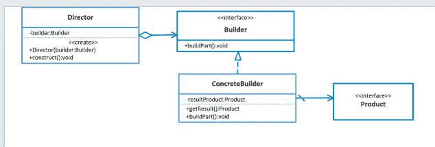
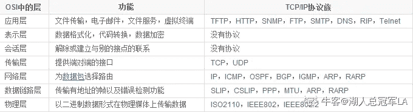

# 京东 2019 春招京东测试开发类试卷

## 1

模式串的长度是 m，主串的长度是 n（m<n>正确答案: A   你的答案: 空 (错误)

```cpp
O(m+n)
```

```cpp
O(m*n)
```

```cpp
O(m*log(2n))
```

```cpp
O(n*log(2m))
```

本题知识点

京东 复杂度 2019

讨论

[Chrety](https://www.nowcoder.com/profile/994602167)

KMP 为线性算法，处理主和匹配串的复杂度都为，所以是,选 A

编辑于 2019-08-02 08:49:07

* * *

## 2

京东商城 plus 会员的消费记录金额分别为 900，512，613，700，810，若采用选择排序算法对其进行从小到大的排序，第三趟排序结果为：（）

正确答案: C   你的答案: 空 (错误)

```cpp
900512613700810
```

```cpp
512900613700810
```

```cpp
512613700900810
```

```cpp
512613700810900
```

本题知识点

测试工程师 京东 Java 工程师 C++工程师 排序 *测试开发工程师 2019* *讨论

[import-include](https://www.nowcoder.com/profile/393352792)

****选择排序**的工作原理是每一次从待排序的数据元素中选出最小（ 或最大）的一个元素，存放在序列的起始位置，在剩余的未排序的元素中继续重复上述操作，直至全部待排序的元素排完。所以本题的解题过程：**第一趟排序：512   900   613   700   810 第二趟排序：512   613   900   700   810  第三趟排序：512   613   700   900   810 

发表于 2019-07-01 09:43:01

* * *

[逆袭的黑马](https://www.nowcoder.com/profile/508968808)

这题答案出错了吧

发表于 2021-08-16 17:58:28

* * *

[牛客 920820896 号](https://www.nowcoder.com/profile/920820896)

第一趟不初始化排序吗

发表于 2021-12-04 09:44:51

* * *

## 3

在软件开发过程中，我们可以采用不同的过程模型，下列有关增量模型描述正确的（）

正确答案: B   你的答案: 空 (错误)

```cpp
已使用一种线性开发模型，具有不可回溯性
```

```cpp
把待开发的软件系统模块化，将每个模块作为一个增量组件，从而分批次地分析、设计、编码和测试这些增量组件
```

```cpp
适用于已有产品或产品原型（样品），只需客户化的工程项目
```

```cpp
软件开发过程每迭代一次，软件开发又前进一个层次
```

本题知识点

测试工程师 京东 Java 工程师 C++工程师 软件工程 测试开发工程师 2019

讨论

[面临孤独](https://www.nowcoder.com/profile/317499190)

a.瀑布模型 c.演化模型 d.喷泉模型

发表于 2020-09-29 10:10:20

* * *

[寻找那颗星](https://www.nowcoder.com/profile/126719889)

增量模型也称为渐增模型，其最大特点就是将待开发的软件系统模块化和组件化。

发表于 2019-08-04 14:55:09

* * *

[zzzlight](https://www.nowcoder.com/profile/851888665)

D 是螺旋模型

发表于 2020-05-15 22:52:12

* * *

## 4

下列关于队列的叙述中正确的是（）

正确答案: C   你的答案: 空 (错误)

```cpp
在队列中只能插入数据
```

```cpp
在队列中只能删除数据
```

```cpp
队列是先进先出的线性表
```

```cpp
队列是先进后出的线性表
```

本题知识点

测试工程师 京东 Java 工程师 C++工程师 队列 *测试开发工程师 2019* *讨论

[向着光亮那方 201907281612749](https://www.nowcoder.com/profile/967164624)

队列先进先出，头删除，尾添加

发表于 2019-08-24 17:23:57

* * *

[lyana 林](https://www.nowcoder.com/profile/457908476)

C

发表于 2019-07-01 11:06:14

* * *

## 5

用俩个栈模拟实现一个队列，如果栈的容量分别是 O 和 P(O>P),那么模拟实现的队列最大容量是多少？

正确答案: C   你的答案: 空 (错误)

```cpp
O+P
```

```cpp
2O+1
```

```cpp
2P+1
```

```cpp
2O-1
```

本题知识点

测试工程师 京东 Java 工程师 C++工程师 栈 *队列 *测试开发工程师 2019** **讨论

[平头哥 plus](https://www.nowcoder.com/profile/608831630)

[`blog.csdn.net/SCS199411/article/details/91443928`](https://blog.csdn.net/SCS199411/article/details/91443928)

发表于 2019-09-14 15:26:54

* * *

[一个响亮的名字娜](https://www.nowcoder.com/profile/321045153)

设 stack1 的容量是 O，stack2 的容量是 P，（O>P），将 stack1 作为存储空间，stack2 作为输出的缓冲空间。1、将 P 个元素 push 到 stack1 中；2、再将该 P 个元素 pop 到 stack2 中；（此时出栈的顺序就是队列前 P 个元素的出栈顺序）3、将 P+1 个元素 push 到 stack1 中；4、将 P 个元素 pop 到 stack2 中，先将 stack1 中剩余的元素 pop，然后依次 pop 出 stack2 中的元素。所以最终实现队列的最大容量是 2P+1 发表于 2019-09-02 16:37:37

* * *

[lay302](https://www.nowcoder.com/profile/692156861)

栈是先进后出，队列是先进先出，举例说明：进栈序列 abcd，出栈序列为 dcba，而队列则进出都为 abcd，因此想用两个栈来模拟队列，也就是进出的队列顺序都是一致的，而栈会逆序，因此自然而然想到让序列 abcd 先进一个栈，再出来变为 dcba，在进另一个栈，再出来就是 abcd 了，相当于经过两次逆序操作。当然要保证第二个栈为空的时候第一个栈出来的元素才能进去，否则 顺序就乱了。按照以上的思路，最大容量为 2P 才对，因为第二个栈可以存 P 个，第一个栈最多只能存 P 个，再多的话第二个栈放不下。那么多出来的 1 个元素是怎么来的呢？大家都想当然认为序列只能经由栈 1 暂存，再全部进入到栈 2 以把顺序变回来，但其实栈 1 可以压 P+1 个元素，多的这个元素直接从栈 1 弹出（为保证顺序，要在栈 2 清空之前弹出）

编辑于 2020-03-10 17:48:52

* * *

## 6

下列叙述中，有关线性链表叙述正确的是（）

正确答案: D   你的答案: 空 (错误)

```cpp
线性链表中的表头元素一定存储在其他元素的前面
```

```cpp
线性链表中的各元素在存储空间中的位置不一定是连续的，但表头元素一定存储在其他元素的前面
```

```cpp
线性链表中的各元素在存储空间中的位置必须是连续的
```

```cpp
线性链表中的各元素在存储空间中的位置不一定是连续的，且各元素的存储顺序也是任意的
```

本题知识点

测试工程师 京东 Java 工程师 C++工程师 链表 *测试开发工程师 2019* *讨论

[灼夜芳华っ](https://www.nowcoder.com/profile/8345370)

线性链表的顺序取决于由指针构成链，与各元素在存储空间上的地址没有关系，所以表头元素也不一定存储在其他元素的前面，故各元素的存储顺序也是任意的。

发表于 2020-08-24 16:46:46

* * *

[你的 offer 对我打了烊](https://www.nowcoder.com/profile/598309941)

线性表链式存储结构的特点是：用一组任意的存储单元存储线性表的数据元素（这组存储单元可以是连续的，也可以不连续）。

根据线性表练市存储的特点可知，数据表示包括 2 部分：**数据本身+指示其直接后继的信息**；即**节点=数据域+指针域。**

n 个节点链接成一个**链表（**又称**线性链表**或**单链表）**，即为线性表（a[1],a[2],....,a[n]）的链式存储结构。

发表于 2020-04-14 23:26:22

* * *

[龙包叔叔](https://www.nowcoder.com/profile/767066473)

&

这里说的元素应该指的是每个节点

发表于 2020-04-30 10:36:22

* * *

## 7

以下哪个协议可以用来发现本地设备的硬件地址？

正确答案: B   你的答案: 空 (错误)

```cpp
RARP
```

```cpp
ARP
```

```cpp
IP
```

```cpp
ICMP
```

本题知识点

测试工程师 京东 Java 工程师 C++工程师 网络基础 测试开发工程师 2019

讨论

[干草堆](https://www.nowcoder.com/profile/9438704)

arp，即 address resolution protocol，地址解析协议，根据 ip 地址获取物理地址的协议

发表于 2019-06-30 10:08:58

* * *

[Kyrieving](https://www.nowcoder.com/profile/574618782)

RARP 是根据 MAC 地址获取 IP 地址

发表于 2020-08-27 14:20:12

* * *

[miya—牛](https://www.nowcoder.com/profile/51743239)

ARP：根据 IP 地址寻找物理地址（MAC）协议。RARP：根据物理地址（MAC）寻找 IP 地址协议

发表于 2021-03-09 13:20:00

* * *

## 8

在 bash shell 环境下，当一命令正在执行时，按下 control-Z 会：

正确答案: C   你的答案: 空 (错误)

```cpp
中止前台任务
```

```cpp
给当前文件加上 EOF
```

```cpp
将前台任务转入后台
```

```cpp
注销当前用户
```

本题知识点

测试工程师 京东 Java 工程师 C++工程师 shell 测试开发工程师 2019

讨论

[hahaha6667](https://www.nowcoder.com/profile/546641704)

ctrl c 中断

ctrl z 表示转到后台

发表于 2020-03-04 10:14:26

* * *

[浪子亭](https://www.nowcoder.com/profile/8721102)

&将命令丢到后台中执行 Ctrl - Z 将目前的工作丢到后台中暂停 bg 让 Ctrl -Z  的后台暂停工作在后天启动执行

发表于 2019-06-08 15:39:22

* * *

[牛客 527161027 号](https://www.nowcoder.com/profile/527161027)

中止前台任务是 ^C 但是 ^Z 本来的任务应该是将当前任务暂停，转入前台还是后台看后面输入 fg 还是 bg。这个题目 C 答案不严谨

发表于 2021-08-28 11:22:18

* * *

## 9

select 语句完整语法如下：

1.  select  目标表的列名或列表达式序列
2.  from 基本表名和（或）视图序列
3.  [where 行条件表达式]
4.  [group by  列名序列 [having  组条件表达式]]
5.  [order by 列名 [asc | desc]]

则 sql 语句的执行顺序是：

正确答案: B   你的答案: 空 (错误)

```cpp
1),3),4),2),5)
```

```cpp
2),3),4),1),5)
```

```cpp
2),4),3),1),5)
```

```cpp
2),3),5),1),4)
```

本题知识点

测试工程师 京东 Java 工程师 C++工程师 数据库 SQL 测试开发工程师 2019

讨论

[进步不生锈](https://www.nowcoder.com/profile/8398003)

写法顺序：select--from--where--group by--having--order by 执行顺序：from--where--group by--having--select--order by 就是 select 要放后面，如果有 order by，则 order by 放最后，因为 order by 是对结果进行排序

发表于 2020-03-02 16:16:35

* * *

[zhangshaofeng](https://www.nowcoder.com/profile/304023199)

一、sql 执行顺序 
(1)from 
(3) join 
(2) on 
(4) where 
(5)group by(开始使用 select 中的别名，后面的语句中都可以使用)
(6) avg,sum.... 
(7)having 
(8) select 
(9) distinct 
(10) order by

发表于 2020-07-03 15:59:28

* * *

[🐤201904121546909](https://www.nowcoder.com/profile/284999892)

1.  先从 from 字句一个表或多个表创建工作表
2.  将 where 条件应用于 1）的工作表，保留满足条件的行
3.  GroupBy 将 2）的结果分成多个组
4.  Having 将条件应用于 3）组合的条件过滤，只保留符合要求的组。
5.  Order By 对结果进行排序。

发表于 2019-07-14 18:29:59

* * *

## 10

下图的 UML 类结构图表示的是哪种设计模式：

正确答案: B   你的答案: 空 (错误)

```cpp
访问者模式
```

```cpp
生成器模式
```

```cpp
代理模式
```

```cpp
命令模式
```

本题知识点

测试工程师 京东 Java 工程师 C++工程师 UML 测试开发工程师 2019

讨论

[你快乐吗](https://www.nowcoder.com/profile/5271388)

看到了好几道一样的题，都是生成器模式，图都不换一下。。。

编辑于 2020-07-11 09:54:26

* * *

[闲鱼总算翻了身](https://www.nowcoder.com/profile/909589300)

这个题图太小了点

发表于 2021-07-31 13:50:24

* * *

## 11

下列哪些不是自顶向下增量式集成测试特点（ ）

正确答案: B   你的答案: 空 (错误)

```cpp
需要开发桩模块
```

```cpp
需要开发驱动模块
```

```cpp
模块集成时首先集成主控模块
```

```cpp
能及时发现设计上的错误
```

本题知识点

测试工程师 京东 Java 工程师 C++工程师 软件测试 测试开发工程师 2019

讨论

[梵希 1998](https://www.nowcoder.com/profile/557765032)

自顶向下测试：是从程序的初始模块开始测试。

（1）该方***在早期发现顶层的错误。

（2）早期的程序框架可以进行演示

（3）需要开发桩模块辅助测试。有些甚至需要多个桩模块辅助，加大了桩模块本来的错误影响。

（4）测试完一个上层模块后，挑选哪个模块作为下一个测试模块，以及测试的顺序没有唯一的界定标准。

优点：较早地验证了主要控制和判断点；按深度优先可以首先实现和验证一个完整的软件功能；功能较早证实，带来信心；只需一个驱动，减少驱动器开发的费用；支持故障隔离。

缺点：柱的开发量大；底层验证被推迟；底层组件测试不充分。

自底向上测试：是从程序的底层模块开始测试。

（1）I/O 操作可以提前测试，更好提交测试用例。

（2）测试后比较容易观察输出。

（3）需要开发驱动模块。

（4）直到最后一个模块提交，程序才能完整的系统测试。

优点：对底层组件行为较早验证；工作最初可以并行集成，比自顶向下效率高；减少了桩的工作量；支持故障隔离。

缺点：驱动的开发工作量大；对高层的验证被推迟，设计上的错误不能被及时发现。

发表于 2019-07-05 14:26:53

* * *

[罗卜卜](https://www.nowcoder.com/profile/956725769)

此题答案有误，只有 B 是错误的，其他三个都正确

发表于 2019-08-14 13:24:58

* * *

[xfyl](https://www.nowcoder.com/profile/512470783)

emmm 选的是 B 吧？做别的题时自顶向下测试优点就选“能及时发现设计的上的错误”来着。。。。。。。

发表于 2019-09-06 11:18:27

* * *

## 12

使用语句覆盖对下列代码进行测试用例设计时，需要设计（      ）个测试用例

```cpp
public  static void Test(int a, int b, int c)
{
    if ((a > 1) && (c == 0))
        b = b / a;
    if ((a == 1) && (b > 1))
        b = b + 1;
}
```

正确答案: B   你的答案: 空 (错误)

```cpp
1
```

```cpp
2
```

```cpp
3
```

```cpp
4
```

本题知识点

测试工程师 京东 Java 工程师 C++工程师 软件测试 测试开发工程师 2019

讨论

[牛客 592246541 号](https://www.nowcoder.com/profile/592246541)

注意审题, 是使用语句覆盖.语句覆盖:选择足够的测试用例，使程序中的每条语句至少执行一次。***所谓足够的指的是越少越好***

发表于 2019-12-05 15:29:48

* * *

[阿伟一路向北](https://www.nowcoder.com/profile/769445352)

由于 a>1 和 a==1 不可能同时成立，因此两个执行语句无法通过一组取值而同时执行，因此，需要两次。

发表于 2020-03-17 09:47:07

* * *

[88668](https://www.nowcoder.com/profile/512881910)

简言之，语句覆盖，就是设计若干个[测试用例](https://baike.baidu.com/item/%E6%B5%8B%E8%AF%95%E7%94%A8%E4%BE%8B)，运行被测程序，使得每一可执行语句至少执行一次。这里的“若干个”，意味着使用[测试用例](https://baike.baidu.com/item/%E6%B5%8B%E8%AF%95%E7%94%A8%E4%BE%8B)越少越好。[语句覆盖率](https://baike.baidu.com/item/%E8%AF%AD%E5%8F%A5%E8%A6%86%E7%9B%96%E7%8E%87)的公式可以表示如下：[语句覆盖率](https://baike.baidu.com/item/%E8%AF%AD%E5%8F%A5%E8%A6%86%E7%9B%96%E7%8E%87)=可执行的语句总数/被评价到的语句数量 x 100%

发表于 2019-10-31 15:37:00

* * *

## 13

为下列代码设计测试用例，要求满足条件组合覆盖，需要设计测试用例的个数为（  ）

```cpp
BEGIN
INPUT(A,B)
IF(A>5)AND(B<O)
THEN
X=A+B
ELSE
X=A-B
END
```

正确答案: D   你的答案: 空 (错误)

```cpp
1
```

```cpp
2
```

```cpp
3
```

```cpp
4
```

本题知识点

测试工程师 京东 Java 工程师 C++工程师 软件测试 测试开发工程师 2019

讨论

[一个锤子🔨](https://www.nowcoder.com/profile/672774198)

都符合，都不符合，一个符合一个不符合（有两种情况）。

发表于 2019-08-22 08:25:41

* * *

[哄哄冲鸭！](https://www.nowcoder.com/profile/892906202)

条件组合覆盖:在[白盒测试](https://baike.baidu.com/item/%E7%99%BD%E7%9B%92%E6%B5%8B%E8%AF%95)法中，选择足够的[测试用例](https://baike.baidu.com/item/%E6%B5%8B%E8%AF%95%E7%94%A8%E4%BE%8B)，使得每个判定中条件的各种可能组合都至少[出现](https://baike.baidu.com/item/%E5%87%BA%E7%8E%B0/1921361)一次。

发表于 2020-08-09 15:08:55

* * *

[꧁灬 Fwwwddd 灬꧂](https://www.nowcoder.com/profile/3564738)

2×2(true,false)×(true,false)

发表于 2019-05-24 11:39:10

* * *

## 14

测试工程师在软件测试计划阶段依据（ ）制定指定测试进度

正确答案: A   你的答案: 空 (错误)

```cpp
工作说明书
```

```cpp
概要设计说明书
```

```cpp
详细设计说明书
```

```cpp
单元测试用例
```

本题知识点

测试工程师 京东 Java 工程师 C++工程师 软件测试 测试开发工程师 2019

讨论

[达克文](https://www.nowcoder.com/profile/175330967)

个人理解：

工作说明书—SOW 制定测试的进度

概要设计说明书-HLD 设计测试的用例

详细设计说明书-LLD 程序员编码实现

单元测试用例-UTC 单元测试使用

发表于 2020-04-23 09:54:22

* * *

[他大舅](https://www.nowcoder.com/profile/198385)

答案：选 B        测试设计阶段：《测试方案》一般由经验丰富的测试人员设计，测试方案依据《需求规格说明书》和《概要设计说明书》进行设计。其中包括需求点简介，测试思路和详细测试方法等内容，进而来制定测试进度的

发表于 2019-06-24 15:23:01

* * *

[DoubleWen](https://www.nowcoder.com/profile/864204848)

答案：选 A。测试计划是根据 SRS 以及开发的计划文档对测试进度进行安排。从选项分析排除 BCD。

发表于 2019-08-13 17:21:22

* * *

## 15

某购物中心电梯限坐 15 人。在电梯中安装计数器来统计乘客数量。如出现超出规定人数以外的任何情况，会有不同的警示音。软件编写后进行边界值测试，应选取的边界值是：（ ）

正确答案: A   你的答案: 空 (错误)

```cpp
0，1，15，16
```

```cpp
1，15
```

```cpp
1，10，15
```

```cpp
0，15，20
```

本题知识点

测试工程师 京东 Java 工程师 C++工程师 软件测试 测试开发工程师 2019

讨论

[石城一郎](https://www.nowcoder.com/profile/498315274)

其实-1，14 也要考虑，但题目中没有，只能选最接近的答案了

发表于 2020-03-09 12:43:29

* * *

[牛客 751157367 号](https://www.nowcoder.com/profile/751157367)

为什么不是 0 没人的时候 15 人数没超过的时候 20 人超过的时候呢？

发表于 2021-10-09 19:37:15

* * *

[牛客 740973687 号](https://www.nowcoder.com/profile/740973687)

没人的时候一个人都需要

发表于 2021-09-01 11:08:52

* * *

## 16

风险暴露又称风险曝光度，测量的是资产的整个安全性风险。某公司软件团队计划项目中采用 20 个可复用的构件，每个构件平均是 100LOC（ Line of Code，源代码行数），本地每个 LOC 的成本是 150 元人民币。下面是该团队定义的一个项目风险： 1．风险识别：预定要复用的软件构件中只有 50%将被集成到应用中，剩余功能必须定制开发； 2．风险概率：60%；  该项目风险曝光度正确的是：（ ）

正确答案: A   你的答案: 空 (错误)

```cpp
90000
```

```cpp
150000
```

```cpp
180000
```

```cpp
300000
```

本题知识点

测试工程师 京东 Java 工程师 C++工程师 软件测试 测试开发工程师 2019

讨论

[梵希 1998](https://www.nowcoder.com/profile/557765032)

（20*100*150）*（1-0.5）*0.6=90000

发表于 2019-07-09 11:44:55

* * *

[catherine_wxz](https://www.nowcoder.com/profile/517168185)

风险曝光度等于风险发生的概率乘以风险发生时带来的项目成本

发表于 2019-07-04 09:33:30

* * *

[悦心 1205](https://www.nowcoder.com/profile/237208630)

风险曝光度（riskexposu[re](https://www.baidu.com/s?wd=re&tn=SE_PcZhidaonwhc_ngpagmjz&rsv_dl=gh_pc_zhidao)）=错误出现率（风险出现率）X 错误造成损失（风险损失）
比方说有一套产品 100 个，一套产品 10 元，有 60%可以使用，剩下的风险率 50%，求风险曝光度

100*（1-60%）*50%*10=风险曝光度；

发表于 2019-09-10 14:01:44

* * *

## 17

测试用例设计的方法有（ ）

正确答案: A   你的答案: 空 (错误)

```cpp
等价类、边界值
```

```cpp
预置条件
```

```cpp
业务流程图
```

```cpp
依照测试点，写预期结果
```

本题知识点

测试工程师 京东 Java 工程师 C++工程师 软件测试 测试开发工程师 2019

讨论

[heejeong](https://www.nowcoder.com/profile/36490639)

黑盒测试用例设计方法包括等价类划分法、边界值分析法、错误推测法、因果图法、判定表驱动法、正交试验设计法、功能图法、场景图法等。白盒测试常见的用例设计方法有：代码检查法、静态结构分析法、静态质量度量法、逻辑覆盖法、基本路径覆盖测试法、域测试、符号测试。详见 Molrang 博客：[`www.cnblogs.com/molrang/p/6420918.html`](https://www.cnblogs.com/molrang/p/6420918.html)

发表于 2019-09-22 10:24:46

* * *

[urnotlynn](https://www.nowcoder.com/profile/264195635)

测试用例常见的设计方法有：等价类划分法、边界值分析法、错误推测法、判定表法、正交实验法。

发表于 2019-07-05 23:09:55

* * *

[牛客 270612839 号](https://www.nowcoder.com/profile/270612839)

选择测试用例是软件测试员最重要的任务，选择测试用例的方法是等价类划分。等价类划分是指分步骤的，把海量的测试用例集缩减得很小，但过程同样有效，比如我们测试 1+1,1+2，1+3，1+4 之后，没必要测试 1+5，1+6。而临界值，比如 1+999999999。就需要处理数据溢出的情况。

发表于 2020-08-09 22:23:08

* * *

## 18

测试结束的标准不是（ ）

正确答案: C   你的答案: 空 (错误)

```cpp
用例执行结束
```

```cpp
覆盖率达到标准
```

```cpp
缺陷都修复
```

```cpp
指标都达到标准质量
```

本题知识点

测试工程师 京东 Java 工程师 C++工程师 软件测试 测试开发工程师 2019

讨论

[爱笑的人](https://www.nowcoder.com/profile/307815618)

答案应该是 A，因为测试用例的执行结束，并不代表测试结束，用例执行结束之后，还有回归测试，集成测试，用户验收测试等等，而广义上的缺陷都修复，应该指的是本次测试用例执行结束后出现的缺陷都要修复，那就也包括后面回归测试等等测出来的缺陷，所以答案应该是 A

发表于 2019-11-21 10:09:52

* * *

[_ 张张张 i](https://www.nowcoder.com/profile/517258984)

C——并不是所有缺陷都能被修复

发表于 2019-06-17 21:56:33

* * *

[牛客 943971743 号](https://www.nowcoder.com/profile/943971743)

缺陷不可能都被修复呀

发表于 2019-08-01 15:13:51

* * *

## 19

侧重于观察资源耗尽情况下的软件表现的系统测试称为？

正确答案: B   你的答案: 空 (错误)

```cpp
强度测试
```

```cpp
压力测试
```

```cpp
容量测试
```

```cpp
性能测试
```

本题知识点

测试工程师 京东 Java 工程师 C++工程师 软件测试 测试开发工程师 2019 奇安信 2020

讨论

[达克文](https://www.nowcoder.com/profile/175330967)

**强度测试**：为了确定系统在**最差环境下**的工作能力，在非标准工作环境下，不断人为降低系统工作所需要的资源，以测试系统在**资源不足的情况**下的工作状态。**压力测试：高负荷下的负载测试**
**负载测试**：**模拟实际软件系统所承受的系统负荷**，通过模拟增加用户量，观察响应时间，数据吞吐量，CPU 占用，发现系统存在的性能瓶颈、内存泄漏、不能实时同步等问题。**容量测试**：是性能测试的一种，**测试系统的最大容量**，为系统扩容，为性能优化提供参考。**性能测试**—疲劳强度测试通过**增加短时间的交易量**，而缩短测试时间来达到既定的测试目标，尽可能在短时间内完成规定的所有交易量。

发表于 2020-05-24 09:31:47

* * *

[fruitdrops](https://www.nowcoder.com/profile/924052678)

压力测试是通过逐步增加系统负载的方式来测试系统性能的变化，最终确定在什么负载条件下系统性能处于失效状态，并以此来获得系统能提供的最大服务级别的测试。

发表于 2019-07-23 17:55:23

* * *

[牛客 887282447 号](https://www.nowcoder.com/profile/887282447)

压力测试：在一定的软硬件和网络环境下，在一定的并发用户数下长时间运行（使系统长时间工作在极限情况下），找到系统出问题的点和出现问题的表现负载测试：在一定的软硬件和网络环境下，不断的增加系统的负载（并发用户），查看系统的运行情况（得到系统的各项性能指标）

编辑于 2020-01-04 16:32:05

* * *

## 20

白盒测试方法不包括（ ）

正确答案: D   你的答案: 空 (错误)

```cpp
语句覆盖
```

```cpp
条件覆盖、判定/条件覆盖、条件组合覆盖
```

```cpp
路径覆盖
```

```cpp
边界值测试
```

本题知识点

测试工程师 京东 Java 工程师 C++工程师 软件测试 测试开发工程师 2019

讨论

[哄哄冲鸭！](https://www.nowcoder.com/profile/892906202)

记录高赞回答：
白盒测试方法包括：语句覆盖、判定覆盖、条件覆盖、判定条件覆盖、条件组合覆盖、路径覆盖，因此没有边界值测试！虽然边界值测试既可以用于黑盒也可以用于白盒，但它的确不属于白盒测试方法。

发表于 2020-08-10 14:13:46

* * *

[虚幻如影](https://www.nowcoder.com/profile/478887402)

为什么在 16 题的时候：既可以用于黑盒测试，也可以用于白盒测试的方法的是？答案是：边界值法难道是我眼花了，可惜不能发截图！！！

发表于 2020-01-07 10:20:34

* * *

[_ 张张张 i](https://www.nowcoder.com/profile/517258984)

D——边界值是属于黑盒测试方法

发表于 2019-06-17 21:53:12

* * *

## 21

如果某测试用例集实现了某软件的路径覆盖，那么它一定同时实现了该软件的？

正确答案: A   你的答案: 空 (错误)

```cpp
判定覆盖
```

```cpp
条件覆盖
```

```cpp
判断/条件覆盖
```

```cpp
组合覆盖
```

本题知识点

测试工程师 京东 Java 工程师 C++工程师 软件测试 测试开发工程师 2019

讨论

[狙击蝴蝶](https://www.nowcoder.com/profile/43861090)

例：**判定表达式：a>1 or b>1****用判定覆盖设计的测试数据：**

a＝5 （判定表达式的值为“真”）

a＝0 （判定表达式的值为“假”）

这里不需要管 b 的取值，就已经满足判定覆盖的条件了。

**用条件覆盖设计的测试数据：**

a＝5 （条件 a>1 的值为“真”）

a＝0（条件 a>1 的值为“假”）

b＝5 （条件 b>1 的值为“真”）

b＝0 （条件 b>1 的值为“假”）

这里不考虑 a>1 or b>1 这个表达式的取值的情况，但必须把 a>1 和 b>1 这两个条件的取值考虑全。

发表于 2020-02-03 23:02:15

* * *

[、hi](https://www.nowcoder.com/profile/623067178)

路径测试时执行了每个路径，每个判定的结果肯定经历过一次 。所以路径覆盖，则判定必覆盖。

发表于 2019-07-09 21:28:20

* * *

[萌梦蒙](https://www.nowcoder.com/profile/186482601)

判定覆盖和条件覆盖的区别？

发表于 2019-08-25 00:25:53

* * *

## 22

以程序内部的逻辑结构为基础的测试用例设计技术属于

正确答案: D   你的答案: 空 (错误)

```cpp
灰盒测试
```

```cpp
数据测试
```

```cpp
黑盒测试
```

```cpp
白盒测试
```

本题知识点

测试工程师 京东 Java 工程师 C++工程师 软件测试 测试开发工程师 2019

讨论

[DoubleJoy](https://www.nowcoder.com/profile/609618174)

黑盒看不到内部，根据内部来设计用例的是白盒

发表于 2019-07-18 21:00:08

* * *

[左右左右 EQEQ](https://www.nowcoder.com/profile/377846902)

灰盒测试，是介于[白盒测试](https://baike.baidu.com/item/%E7%99%BD%E7%9B%92%E6%B5%8B%E8%AF%95/934440)与[黑盒测试](https://baike.baidu.com/item/%E9%BB%91%E7%9B%92%E6%B5%8B%E8%AF%95/934030)之间的一种测试，灰盒测试多用于[集成测试](https://baike.baidu.com/item/%E9%9B%86%E6%88%90%E6%B5%8B%E8%AF%95/1924552)阶段，不仅关注输出、输入的正确性，同时也关注程序内部的情况。

发表于 2021-04-08 22:26:16

* * *

## 23

测试应该什么时候介入比较好 

正确答案: A   你的答案: 空 (错误)

```cpp
越早越好
```

```cpp
开发人员开始开发的时候
```

```cpp
开发代码完成后
```

```cpp
什么时候都可以
```

本题知识点

测试工程师 京东 Java 工程师 C++工程师 软件测试 测试开发工程师 2019

讨论

[DoubleJoy](https://www.nowcoder.com/profile/609618174)

为避免软件缺陷造成的高成本支出或损失，软件测试越早介入越可以帮助规避风险。

发表于 2019-07-17 11:31:07

* * *

[牛客-吃的](https://www.nowcoder.com/profile/577492445)

理论和实际还是有出入的，理论上讲：越早越好，就算是多点时间熟悉系统也好，实际上，什么时候接入还得看定的计划周期

发表于 2022-03-10 14:05:38

* * *

[牛客 690176344 号](https://www.nowcoder.com/profile/690176344)

程序员代码都没写好我咋测试？

发表于 2021-09-17 17:40:15

* * *

## 24

下述（ ）不属于单元测试

正确答案: A   你的答案: 空 (错误)

```cpp
全局数据结构是否有问题
```

```cpp
逻辑覆盖、循环覆盖
```

```cpp
代码评审、代码走查
```

```cpp
静态数据流分析
```

本题知识点

测试工程师 京东 Java 工程师 C++工程师 软件测试 测试开发工程师 2019

讨论

[wurui007](https://www.nowcoder.com/profile/746694387)

单元测试的策略：

1.  逻辑覆盖、
2.  循环覆盖、
3.  同行评审、
4.  桌前检查、
5.  代码走查、
6.  代码评审、
7.  景泰数据流分析

发表于 2019-07-05 15:00:07

* * *

[原语](https://www.nowcoder.com/profile/4696084)

D 选项的景泰数据流分析应该是静态数据流分析吧？

发表于 2019-07-23 10:45:47

* * *

[213201803230041158](https://www.nowcoder.com/profile/7345130)

单元测试是对软件组成进行的测试。其目的是检验软件基本组成单位的正确性。测试对象是软件设计的最小单元：模块，又称为模块测试。 
测试阶段：编码后或者编码前（TDD） 
测试对象：最小模块 
测试人员：白盒测试工程师或开发人员 
测试依据：代码和注释+设计详细文档 
测试方法：白盒测试 
测试内容：模块接口测试、局部数据结构测试、路径测试、错误处理测试、边界测试
————————————————
版权声明：本文为 CSDN 博主「@make great efforts」的原创文章，遵循 CC 4.0 BY-SA 版权协议，转载请附上原文出处链接及本声明。
原文链接：[`blog.csdn.net/daboluo521/article/details/81385017`](https://blog.csdn.net/daboluo521/article/details/81385017)

发表于 2020-03-04 11:19:07

* * *

## 25

以下程序

```cpp
main()
{ 
int m=12,n=34;
printf("%d%d",m++,++n);
printf("%d%d\n",n++,++m);
}
```

程序运行后的输出结果是（）

正确答案: A   你的答案: 空 (错误)

```cpp
12353514
```

```cpp
12353513
```

```cpp
12343514
```

```cpp
12343513
```

本题知识点

测试工程师 京东 Java 工程师 C++工程师 Java 测试开发工程师 2019 C 语言

讨论

[会飞的字节](https://www.nowcoder.com/profile/5974940)

m++ ，这里 m 输出 12 后，m=13\.++n,   这里 n 输出 35，   n 依旧=35\.n++, 这里 n 输出 35, n=36\.++m,这里 m 输出 14,m=14,

发表于 2020-07-24 19:16:53

* * *

[牛客 7665501 号](https://www.nowcoder.com/profile/7665501)

虽然我写对了。但是我寻思你这浓眉大眼的京东也开始学习顺丰和 360，把 C++混入 Java 了吗

发表于 2019-09-03 12:36:49

* * *

[弓长 baci](https://www.nowcoder.com/profile/647385721)

答案选 A，++在前表示先使用再计算，++在后表示先计算再使用。第一次输出时，先使用 m 的值（12），再将 m 加 1（13），先将 n 加 1（35）,在使用 n 的值（35）.所以此时输出的结果为 1235，第二次输出之前 m = 13,n = 35,同理，此时输出为 3514，两次输出加起来即为 12353514，所以选 A

发表于 2019-07-03 10:28:25

* * *

## 26

已知 int 占 4 个字节，bool 占 1 个字节。

```cpp
unsigned int value = 1024;
bool condition = *((bool *)(&value));
if (condition) value += 1; condition = *((bool *)(&value));
if (condition) value += 1; condition = *((bool *)(&value));
```

问 value, condition 的值为 ____。

正确答案: D   你的答案: 空 (错误)

```cpp
1026, 1
```

```cpp
1025, 0
```

```cpp
1025, 1
```

```cpp
1024, 0
```

本题知识点

测试工程师 京东 Java 工程师 C++工程师 C++ 测试开发工程师 2019 C 语言

讨论

[112333](https://www.nowcoder.com/profile/9847103)

c 语言题都拿出来了。。。。。。bool 是一个字节，&value 就是获取 value 的地址，(bool*)(&value)就是用 bool 指针指向 value 地址，外面再套个*就是获取 bool 指向地址的值 1024 转二进制只有第 11 位是 1，那么低八位肯定都是 0，那么 bool 指向的低八位肯定也是零也就是 false，所有那两个 condition 都没有通过

发表于 2019-07-01 18:04:57

* * *

[Sky_Hill](https://www.nowcoder.com/profile/800325612)

这是 c 语言啊
*(地址)代表取地址上存的值
(bool*)代表强转成 bool 类型的指针
&value 代表取 value 这个变量的地址
这里就是取 value 的地址转成 bool 型的指针,然后取这个指针指向的值,也就是 1024,但因是 bool 型只能赋给 8 位所以全是 0,导致 if 语句一个都没执行
注意:if 后面没有大括号,不过不影响

发表于 2019-08-01 12:27:42

* * *

[✌正儿八经✌](https://www.nowcoder.com/profile/938237870)

蒙对了

发表于 2019-09-16 17:30:28

* * *

## 27

关于 JDK1.8 中 Java 的抽象类、接口，以下描述错误的是？

正确答案: C   你的答案: 空 (错误)

```cpp
抽象类不一定含有抽象方法，接口中的方法都是抽象方法
```

```cpp
一个类只能继承一个抽象类，但可以实现多个接口；一个接口可以继承多个接口
```

```cpp
抽象类和接口中的方法都没有方法体
```

```cpp
抽象类可以含有私有成员变量，接口不含有私有成员变量
```

本题知识点

测试工程师 京东 Java 工程师 C++工程师 Java 测试开发工程师 2019

讨论

[35 岁退休卖炒粉](https://www.nowcoder.com/profile/195695151)

这道题是不是应该加上 JDK 的版本？

发表于 2019-07-01 17:30:42

* * *

[清風逐尘乀](https://www.nowcoder.com/profile/91114325)

选择 C。A----------抽象类不一定含有抽象方法，接口中的方法都是抽象方法。接口中的方法默认修饰符有 public abstract。
B----------一个类只能继承一个一个抽象类，但可以实现多个接口；一个接口可以继承多个接口。
Java 里类是单继承的，接口是可以多继承的，用关键字 extends。
C----------抽象类和接口中的方法都没有方法体。
抽象类中的方法是可以有方法体的。JDK1.8 之后，接口中的方法也可以有方法体，用 default 关键字修饰方法。
D----------抽象类可以含有私有成员变量，接口不含有私有成员变量。
接口中的成员变量都是 public static final 的，一般用作常量。

编辑于 2019-07-03 13:24:37

* * *

[D·Song](https://www.nowcoder.com/profile/296436385)

A 也错了，jdk1.8 里面接口里面 static/default 修饰的方法也可以有方法体

```cpp
interface A{

    default void test1(){
        System.out.println("default");
    }

    static void test2(){
        System.out.println("static");
    }

    void test3();
}

```

编辑于 2020-02-13 21:59:30

* * *

## 28

HTTP 协议工作在（）？

正确答案: A   你的答案: 空 (错误)

```cpp
应用层
```

```cpp
传输层
```

```cpp
网络层
```

```cpp
数据链路层
```

本题知识点

测试工程师 京东 Java 工程师 C++工程师 网络基础 测试开发工程师 2019

讨论

[HW 柯可](https://www.nowcoder.com/profile/943949859)



发表于 2020-02-06 12:06:08

* * *

[一位不知名人士](https://www.nowcoder.com/profile/56386160)

HTTP 协议是面向事务的应用层协议，本身是无连接的，虽然使用了 TCP 连接，但通信双方在交换 HTTP 报文之前不需要先建立 HTTP 连接。

发表于 2020-06-19 17:32:27

* * *

[rzzzz](https://www.nowcoder.com/profile/767561632)

应用层

发表于 2019-06-30 19:24:41

* * *

## 29

if [ $2 -a $2 = "test" ]中 -a 是什么意思  

正确答案: D   你的答案: 空 (错误)

```cpp
大于
```

```cpp
减
```

```cpp
全部
```

```cpp
并且
```

本题知识点

测试工程师 京东 Java 工程师 C++工程师 shell 测试开发工程师 2019

讨论

[laceyrran](https://www.nowcoder.com/profile/597691263)

Linux_shell 逻辑判断-a 与-o 或！非

发表于 2021-01-10 15:16:53

* * *

[谁动了我的奶酪 1994](https://www.nowcoder.com/profile/5845878)

and 与 or 或

发表于 2021-01-31 00:35:31

* * *

[牛客 879654083 号](https://www.nowcoder.com/profile/879654083)

不是所有吗？

发表于 2020-04-17 10:00:05

* * *

## 30

文件目录 data 当前权限为 rwx --- ---，只需要增加用户组可读权限，但不允许写操作，具体方法为：

正确答案: A   你的答案: 空 (错误)

```cpp
chmod+050data
```

```cpp
chmod+040data
```

```cpp
chmod+005data
```

```cpp
chmod+004data
```

本题知识点

测试工程师 京东 Java 工程师 C++工程师 Linux 操作系统 测试开发工程师 2019

讨论

[项非田](https://www.nowcoder.com/profile/176448694)

别忘了，文件夹首先要可访问才行，因此不论干什么必须加上 x 权限！

发表于 2019-07-21 19:31:50

* * *

[请叫我小吴](https://www.nowcoder.com/profile/693269216)

文件权限字符：[rwx] [rw-] [r-] 三个一组。
第一组：[rwx]  拥有者的权限
第二组：[rw-]  同群组使用功能者的权限
第三组：[r-]   其他使用功能者的权限
而且转换为数字时：r(读)= 4, w（写） = 2, x（执行） = 1。

题目这里当前权限为 rwx --- ---，因为只增加读操作不增加写操作，第一组和第三组默认为 0，于是有 040，但是目录要加上“执行”权限，才能“读”或者“写”，所以加入执行部分变成 050。

发表于 2020-04-16 16:31:55

* * *

[35 岁退休卖炒粉](https://www.nowcoder.com/profile/195695151)

没有涵养的语文题目，建议删除

发表于 2019-07-09 14:07:11

* * *

## 31

现在有红，绿两种颜色的石头，现在我们需要用这两种石头搭建一个塔，塔需要满足如下三个条件： 1． 第 1 层应该包含 1 块石头，第 2 层应该包含两块，第 i 层需要包含 i 块石头。2． 同一层的石头应该是同一个颜色（红或绿）。3． 塔的层数尽可能多。  问在满足上面三个条件的前提下，有多少种不同的建造塔的方案，当塔中任意一个对应位置的石头颜色不同，我们就认为这两个方案不相同。石头可以不用完。数据范围：红绿颜色石头数量满足  ,  

本题知识点

Java 工程师 C++工程师 测试工程师 京东 数学 动态规划 测试开发工程师 2019

讨论

[Unlimited_Blade_Works](https://www.nowcoder.com/profile/978138053)

```cpp
#include <bits/stdc++.h>
using namespace std;

#define INIT() ios::sync_with_stdio(false);cin.tie(0);cout.tie(0);
const int MOD = 1000000007;
const int N = 200007;
//滚动数组
//dp[level&1][j]表示前 level 层放 j 个石头
//（个数较少那个颜色的石头，假定为绿色）
//这样在两种颜色石头不均匀时
//可以优化复杂度
//dp 数组全部更新的最坏复杂度为
//O(level*min(a,b))
//(level 可计算出最大约为 400sqrt(5))
//所以差不多是 O(10⁸)的复杂度
int dp[2][N + 5];

void solve(int a, int b) {
    if(a==0||b==0) {
        cout<<1<<endl;
        return;
    }
    memset(dp, 0, sizeof(dp));
    int level = sqrt(2 * (a + b));
    if (a > b) swap(a, b);
    dp[1][0] = dp[1][1] = 1;
    int sum = 1, lower, upper;
    int cur, last;
    for (int i = 2; i <= level; i++) {
        sum += i;
        //前 i 层最多要放的绿石个数（最多 sum 个，但不能超过绿石总个数 a）
        int tmp_upper = min(sum, a);
        //前 i 层最少要放的绿石个数
        //最坏情况，前 i 层将 b 个红石放完(sum-b>0)，那么前 i 层至少放 sum-b 个绿石
        //若 sum-b<0，说明前 i 层最少可以不放红石，即 dp[i][j]中 j 从 0 开始更新
        //综上，j 的更新范围下界为 max(sum - b, 0)
        int tmp_lower = max(sum - b, 0);
        //下界大于上界，说明红石放完，绿石总数量也不够放下一层了，那么就是最高层了
        //停止更新
        if (tmp_lower > tmp_upper) break;
        upper = tmp_upper;
        lower = tmp_lower;
        cur = i & 1;
        last = !cur;
        //dp[i-1][j]表示第 i 层放红石
        // dp[i-1][j-i]表示第 i 层放绿石（那么前 i 层至少 i 个绿石（即 j>=i））
        //转移方程：dp[i][j] = dp[i-1][j] + dp[i-1]j-i
        //前 i 层的绿石少于 j，说明第 i 层只可能放了红石
        //dp[i][j] = dp[i-1]j
        for (int j = lower; j < i; j++) dp[cur][j] = dp[last][j];
        for (int j = i; j <= upper; j++) {
            dp[cur][j] = (dp[last][j] + dp[last][j - i]) % MOD;
        }
    }
    int ans = 0;
    for (int j = lower; j <= upper; j++) {
        ans = (ans + dp[cur][j]) % MOD;
    }
    cout << ans << endl;
}

int main() {
    INIT()
    int a, b;
    while (cin >> a >> b) {
        solve(a, b);
    }
    return 0;
}
```

发表于 2019-06-10 11:14:14

* * *

[Hachiko123456](https://www.nowcoder.com/profile/404334034)

在此粘贴下管哥的代码给大家参考下 import java.util.*;
/**
 * 
 * @author DRG
 * DRG NB
 *
 */
public class Main2 {
    public static void main(String[] args) {
        Scanner in = new Scanner(System.in);
        int G = in.nextInt();
        int R = in.nextInt();
        int min = Math.min(R, G);
        int max = Math.max(R, G);
        R = min;
        G = max;
        int level = 1, sum = 0;
        /**
         * level 为最大层数
         */
        while (sum <= R + G) {
            level++;
            sum += level;
        }
        /**
         * array[i][j]表示前 i 层有 j 个绿色宝石的方案数
         * 那么可以得出递推式 array[i][j]=array[i-1][j-i]+array[i-1][j];
         * 针对第 i 层来说，如果第 i 层放置绿色宝石，那么前 i-1 层就只能放 j-i 个绿色宝石，所以为 array[i-1][j-i]
         * 如果第 i 层不放置绿色宝石，而放红色宝石，那么前 i-1 层就放 j 个绿色宝石，为 array[i-1][j]
         * 所以没有必要保存所有的状态，只需要保存上一层和当前层的状态即可
         */
        int[][] array = new int[2][G + 1];
        int answer = 0;
        if (G > 0) {
            array[1][1] = 1;
            answer++;
        }
        if (R > 0) {
            array[1][0] = 1;
            answer++;
        }
        int total = 1;
        int result;
        /**
         * total 是前 lev 层所需要的石头总数量，不分颜***r />          */
        for (int lev = 2; lev < level; lev++) {
            total += lev;
            result = 0;
            /**
             * one 代表当前层
             * two 代表上一层
             */
            int one = lev % 2;
            int two = (lev - 1) % 2;
            /**
             * 遍历在当前层放置的绿色宝石的数量
             */
            for (int i = 0; i <= total && i <= G; i++) {
                array[one][i] = 0;
                /**
                 * 当放在第 lev 层是绿色宝石的时候，那么
                 * array[one][i]+=array[two][i-lev]
                 * 因为本来就只有 i 颗绿色宝石，你在 lev 层放置了 lev 颗之后，那么前 lev-1 层只能放置 i-lev 颗绿色宝石
                 * 而前 lev-1 层只能放置 i-lev 颗绿色宝石为 array[two][i-lev]
                 */
                if (i >= lev && R >= total - i) {
                    array[one][i] += array[two][i - lev];
                    if (array[one][i] >= 1000000007) {
                        array[one][i] %= 1000000007;
                    }

                }
                /**
                 * 当放在第 lev 层是红色宝石的时候，那么
                 * array[one][i]+=array[two][i]
                 * 因为本来就只有 i 颗绿色宝石，你在 lev 层没有放置绿色宝石，那么就是说在 lev-1 层放置了 lev 颗绿色宝石
                 * 而前 lev-1 层只能放置 lev 颗绿色宝石为 array[two][lev]
                 */
                if (total - i <= R) {
                    array[one][i] += array[two][i];
                    if (array[one][i] >= 1000000007) {
                        array[one][i] %= 1000000007;
                    }
                }
                /**
                 * 因为 one 代表的是当前层，所以把它累加起来即可得出最终结果
                 */
                if (array[one][i] != 0) {
                    result += array[one][i];
                    if (result >= 1000000007) {
                        result %= 1000000007;
                    }
                }
            }
            answer=result;
        }
        System.out.println(answer);
        in.close();
    }
}

```cpp

            发表于 2019-05-28 19:39:15

            [nbgao](https://www.nowcoder.com/profile/211289)

```
#include <bits/stdc++.h>
using namespace std;

const int MOD = 1000000007;

int main(){
    int a,b;
    cin>>a>>b;
    if(a==0 || b==0){
        cout<<1<<endl;
        return 0;
    }
    if(a>b)
        swap(a,b);
    int dp[300001], t=1, l, r, s=0;
    memset(dp,0,sizeof(dp));
    dp[0] = dp[1] = 1;
    for(int i=2;i<=sqrt(2*(a+b));i++){
        t += i;
        int q = min(t, a);
        int p = max(t-b, 0);
        if(p>q)
            break;
        r = q;
        l = p;
        for(int j=r;j>=i+1;j--)
            dp[j] = (dp[j]+dp[j-i])%MOD;
        dp[i]++;
    }
    for(int i=l;i<=r;i++)
        s = (s+dp[i])%MOD;
    cout<<s<<endl;    

    return 0;
}
```cpp

            发表于 2020-01-21 01:16:39

```*****</n>