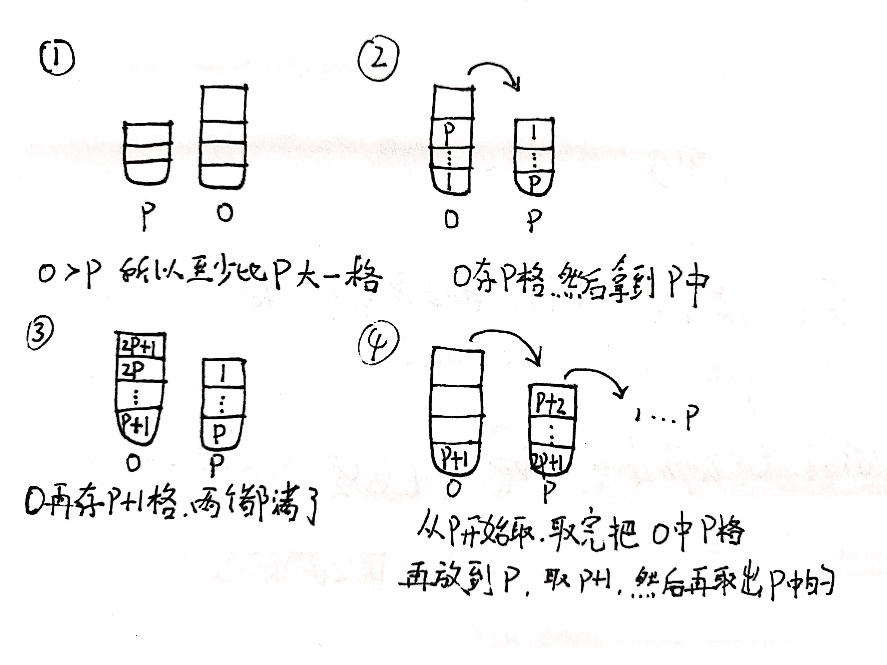
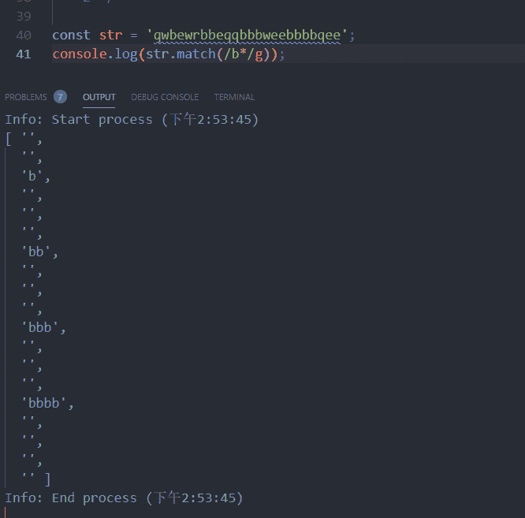

# 京东 2019 春招京东前端开发类试卷

## 1

模式串的长度是 m，主串的长度是 n（m<n>正确答案: A   你的答案: 空 (错误)

```cpp
O(m+n)
```

```cpp
O(m∙n)
```

```cpp
O(m∙log2n)
```

```cpp
O(n∙log2m)
```

本题知识点

前端工程师 京东 复杂度 2019

讨论

[Chrety](https://www.nowcoder.com/profile/994602167)

KMP 为线性算法，处理主和匹配串的复杂度都为)，所以是,选 A

编辑于 2019-08-02 08:50:42

* * *

[endeavorFly](https://www.nowcoder.com/profile/283249391)

kmp 算法可以在 O(m+n)的时间完成串的模式匹配

发表于 2019-06-10 10:24:51

* * *

[boncsunny](https://www.nowcoder.com/profile/2056361)

> 小灰漫画对 KMP 算法的解析：[`blog.csdn.net/bjweimengshu/article/details/104528964/`](https://blog.csdn.net/bjweimengshu/article/details/104528964/)

发表于 2020-08-04 09:26:19

* * *

## 2

在对问题的解空间树进行搜索的方法中，一个结点有多次机会成为活结点的是：（）

正确答案: B   你的答案: 空 (错误)

```cpp
动态规划
```

```cpp
回溯法
```

```cpp
分支限界法
```

```cpp
回溯法和分支限界法
```

本题知识点

前端工程师 京东 树 2019

讨论

[OrientObjectPro](https://www.nowcoder.com/profile/3143319)

分支限界法：分支限界法常以广度优先或以最小耗费（最大效益）优先的方式搜索问题的解空间树。在分支限界法中，每一个活结点只有一次机会成为扩展结点。活结点一旦成为扩展结点，就一次性产生其所有儿子结点。在这些儿子结点中，导致不可行解或导致非最优解的儿子结点被舍弃，其余儿子结点被加入活结点表中。此后，从活结点表中取下一结点成为当前扩展结点，并重复上述结点扩展过程。这个过程一直持续到找到所需的解或活结点表为空时为止。回溯法：不用多说了吧，一般先有一个 bool 型数组，标记每个记录是否被访问，在结束时，有一个恢复现场，即 bool=false，代表这次访问结束，以后的 dfs 还可以继续访问这个结点。

发表于 2019-06-28 23:18:26

* * *

## 3

在软件开发过程中，我们可以采用不同的过程模型，下列有关增量模型描述正确的（）

正确答案: B   你的答案: 空 (错误)

```cpp
已使用一种线性开发模型，具有不可回溯性
```

```cpp
把待开发的软件系统模块化，将每个模块作为一个增量组件，从而分批次地分析、设计、编码和测试这些增量组件
```

```cpp
适用于已有产品或产品原型（样品），只需客户化的工程项目
```

```cpp
软件开发过程每迭代一次，软件开发又前进一个层次
```

本题知识点

前端工程师 京东 软件工程 2019

讨论

[ac/dc](https://www.nowcoder.com/profile/2867123)

a:瀑布模型 b.增量模型 c.原型模型 d.螺旋模型

发表于 2020-05-19 20:24:44

* * *

[IoE](https://www.nowcoder.com/profile/655404835)

增量模型：
在增量模型中，软件被作为一系列的增量构件来设计、实现、集成和测试。与构建大厦类似，先设计一个总体规划图，然后一层层地构造搭建整个建筑。增量模型是把整个软件系统分解为若干个软件构件，开发过程中，逐个实现每个构件，实现一个构件，展示一个构件。如果发现问题可以及早进行修正，逐步进行完善，最终获得满意的软件产品。在使用增量模型时，第一个增量往往是实现基本需求的核心构件。该核心构件交付用户使用后，经过评价形成下一个增量的开发计划，它包括对核心构件的修改和一些新功能的发布。这个过程在每个增量发布后不断重复，直到产生最终的完善产品。来源：[`url.cn/5CDn0eN`](https://baike.baidu.com/item/%E8%BD%AF%E4%BB%B6%E5%B7%A5%E7%A8%8B%E6%A8%A1%E5%9E%8B)

发表于 2019-10-14 10:10:34

* * *

[满天过海 _ 春จุ๊บ](https://www.nowcoder.com/profile/997209155)

把待开发的软件系统模块化，将每个模块作为一个增量组件，从而分批次地分析、设计、编码和测试这些增量组件

发表于 2019-08-08 15:13:45

* * *

## 4

用计算机解决问题的步骤一般为（ ）①编写程序 ②设计算法 ③分析问题 ④调试程序。

正确答案: D   你的答案: 空 (错误)

```cpp
①②③④
```

```cpp
③④①②
```

```cpp
②③①④
```

```cpp
③②①④
```

本题知识点

前端工程师 京东 编程基础 *2019* *讨论

[满天过海 _ 春จุ๊บ](https://www.nowcoder.com/profile/997209155)

分析设计，编写测试

发表于 2019-08-08 15:14:57

* * *

[牛客 79807876 号](https://www.nowcoder.com/profile/79807876)

1.分析 2.算法（逻辑）3.编写 4.调试（确认是否符合事实）选 D

编辑于 2019-07-02 09:59:47

* * *

[一码前行](https://www.nowcoder.com/profile/941302682)

D ,拿到一个需求,首先要去分析问题,然后考虑算法.,再进行编写程序,程序完成后,进行调试.

发表于 2019-06-26 09:05:04

* * *

## 5

栈的特点是先进后出。栈底至栈顶依次存放元素 A、B、C、D，  在第五个元素 E 入栈前，栈中元素可以出栈，则出栈序列可能是：（）

正确答案: A   你的答案: 空 (错误)

```cpp
DCBEA
```

```cpp
DEBCA
```

```cpp
DBCEA
```

```cpp
DCAEB
```

本题知识点

前端工程师 京东 栈 *2019* *讨论

[不二 20180507201576](https://www.nowcoder.com/profile/8153733)

栈的特点是先进后出，进去的顺序是 ABCD，所以，出去的基本顺序是 DCBA，然后 E 在这顺序的任意位置插入。

编辑于 2019-05-27 12:39:11

* * *

[test2837738](https://www.nowcoder.com/profile/1988651)

不理解，E 都入栈了，A 怎么出栈的

发表于 2021-07-03 20:21:20

* * *

[满天过海 _ 春จุ๊บ](https://www.nowcoder.com/profile/997209155)

先进后出，是重点，

发表于 2019-08-08 15:16:12

* * *

## 6

下列关于队列的叙述中正确的是（）

正确答案: C   你的答案: 空 (错误)

```cpp
在队列中只能插入数据
```

```cpp
在队列中只能删除数据
```

```cpp
队列是先进先出的线性表
```

```cpp
队列是先进后出的线性表
```

本题知识点

前端工程师 京东 队列 *2019* *讨论

[不二 20180507201576](https://www.nowcoder.com/profile/8153733)

队列是先进先出的线性表，栈是先进后出的线性表

编辑于 2019-05-27 12:41:53

* * *

[满天过海 _ 春จุ๊บ](https://www.nowcoder.com/profile/997209155)

队列，先进先出

发表于 2019-08-08 15:16:48

* * *

## 7

用俩个栈模拟实现一个队列，如果栈的容量分别是 O 和 P(O>P),那么模拟实现的队列最大容量是多少？

正确答案: C   你的答案: 空 (错误)

```cpp
O+P
```

```cpp
2O+1
```

```cpp
2P+1
```

```cpp
2O-1
```

本题知识点

前端工程师 京东 栈 *队列 *2019** **讨论

[浦发真爱粉](https://www.nowcoder.com/profile/1558859)

栈，先进后出；队列，先进先出。用 O 和 P 这两个栈实现先进先出就可以了。

发表于 2019-07-17 16:45:55

* * *

[攻城狮~星空🌙201905221506436](https://www.nowcoder.com/profile/235083332)

当出现最大容量时，P：存 p 个（1,2,3,,...,n)              O：存 p+1 个(n+1,,...,2n,2n+1)出队列顺序需要：P 出栈-P 中压入剩余 n 个数据-O 中出栈剩余的一个元素-P 全部出栈：1、P 中先出 p 个(1,2,3,...,n) 2、O 中 p 个依次压入 P(2n+1,2n,...,n+2)3、O 出剩余 1 个(n+1)4、P 中最后出 p 个(n+2,n+3,..,2n+1)

发表于 2019-08-08 15:25:59

* * *

[sea_sid](https://www.nowcoder.com/profile/304610805)

P：存 p 个              O：存 p+1 个出队列对应于：1、P 中先出 p 个， 2、O 中 p 个压入 P，3、O 出剩余 1 个，4、P 中最后出 p 个

发表于 2019-07-29 16:01:35

* * *

## 8

网卡实现的主要功能是？

正确答案: A   你的答案: 空 (错误)

```cpp
物理层与数据链路层的功能
```

```cpp
数据链路层与网络层的功能
```

```cpp
网络层与传输层的功能
```

```cpp
传输层与应用层的功能
```

本题知识点

前端工程师 京东 网络基础 2019

讨论

[MambaHJ](https://www.nowcoder.com/profile/743392944)

网卡实现数据的封装与解封，链路管理，编码与译码功能。网卡工作在数据链路层， 但也可以向下兼容物理层。

发表于 2019-06-28 23:08:16

* * *

[牛客 778046099 号](https://www.nowcoder.com/profile/778046099)

网卡实现的不是带网络字样的

发表于 2020-09-10 15:43:42

* * *

## 9

linux 系统下有多个文件目录，每个文件目录都有其独特的功能和作用，以下描述正确的是：

正确答案: C   你的答案: 空 (错误)

```cpp
/bin: 必要的用户二进制可执行文件(部分用户使用)
```

```cpp
/usr: 是文件系统的第二个主要部分. /usr 是不可共享的只读数据
```

```cpp
/etc: 主机特定的系统配置
```

```cpp
/boot: 系统启动时要用到的所有文件
```

本题知识点

前端工程师 京东 Linux 2019

讨论

[大星星和小猩猩](https://www.nowcoder.com/profile/9374535)

**/bin**
该目录又称为二进制目录，包含了那些供系统管理员和普通用户使用的重要 linux 命令的二进制映像。该目录存放的内容包括各种可执行文件，还有某些可执行文件的符号连接，常用的命令有：cp、dmesg、kill、login、rm、ping、chomd、bash、cat、echo、ls、 mail、vi 等。**/usr**该目录是 linux 系统最庞大的目录，我们要用到的很多应用程序和文件几乎都存放在这个目录了。
其中，**/usr/share 用于存放一些 共享 的数据，比如音乐文件或者图标等等。****/etc**该目录是整个 Linux 系统的中心，其中包含所有系统管理和维护方面的配置文件，如 dhcpd.conf、host.conf、logrotate.conf、man.config、mke2fs.conf、modprobe.conf、resolv.conf、sysctl.conf、syslog.conf（或 rsyslog.conf）、xinetd.conf 和 yum.conf 等。
**/boot**
该目录存放系统核心文件以及启动时必须读取的文件，包括 Linux 内核的二进制映像。

编辑于 2020-04-05 19:15:42

* * *

[littlecar](https://www.nowcoder.com/profile/551576354)

/bin 存放普通用户可以使用的指令。
/usr 这个目录中包含了命令库文件和在通常操作中不会修改的文件，其地位类似 Windows 上面的”Program Files”目录（安装程序的时候，默认就是安装在此文件内部某个子文件夹内。输入命令后系统默认执行/usr/bin 下的程序。/etc 全局的配置文件存放目录。存放系统和软件的配置。
/boot 引导程序，内核等存放的目录。

发表于 2019-07-16 09:31:32

* * *

[ceeeeeeeeeeeb](https://www.nowcoder.com/profile/542410100)

链接：[`www.nowcoder.com/questionTerminal/df1afacb43a84b7589ea2375058bbb74?toCommentId=3356247`](https://www.nowcoder.com/questionTerminal/df1afacb43a84b7589ea2375058bbb74?toCommentId=3356247)
来源：牛客网
**目录详解**
/bin：系统有很多放置执行档的目录，但/bin 比较特殊。**因为/bin 放置的是在单人维护模式下还能够***作的指令。**在/bin 底下的指令可以被 root 与一般帐号所使用，主要有：cat,chmod(修改权限), chown, date, mv, mkdir, cp, bash 等等常用的指令。

/boot：**主要放置开机会使用到的档案，包括 Linux 核心档案以及开机选单与开机所需设定档**等等。Linux kernel 常用的档名为：vmlinuz ，如果使用的是 grub 这个开机管理程式，则还会存在/boot/grub/这个目录。

/dev：在 Linux 系统上，**任何装置与周边设备都是以档案的型态存在于这个目录当中**。 只要通过存取这个目录下的某个档案，就等于存取某个装置。比要重要的档案有/dev/null, /dev/zero, /dev/tty , /dev/lp, / dev/hd, /dev/sd*等等

/etc：**系统主要的设定档几乎都放置在这个目录内，例如人员的帐号密码档、各种服务的启始档等等。** 一般来说，这个目录下的各档案属性是可以让一般使用者查阅的，但是只有 root 有权力修改。 FHS 建议不要放置可执行档(binary)在这个目录中。 比较重要的档案有：/etc/inittab, /etc/init.d/, /etc/modprobe.conf, /etc/X11/, /etc/fstab, /etc/sysconfig/等等。 另外，其下重要的目录有：/etc/init.d/ ：所有服务的预设启动 script 都是放在这里的，例如要启动或者关闭 iptables 的话： /etc/init.d/iptables start、/etc/init.d/ iptables stop

/home：**这是系统预设的使用者家目录(home directory)**。 在你新增一个一般使用者帐号时，预设的使用者家目录都会规范到这里来。比较重要的是，家目录有两种代号：

~ ：代表当前使用者的家目录，
~guest：则代表用户名为 guest 的家目录。

/lib：系统的函式库非常的多，而**/****lib****放置的****则是在开机时会用到的函式库****，以及在/bin 或/sbin 底下的指令会呼叫的函式库**而已 。 什么是函式库呢？妳可以将他想成是外挂，某些指令必须要有这些外挂才能够顺利完成程式的执行之意。 尤其重要的是/lib/modules/这个目录，因为该目录会放置核心相关的模组(驱动程式)。

/media：media 是媒体的英文，顾名思义，这个**/media 底下放置的就是可移除的装置**。 包括软碟、光碟、DVD 等等装置都暂时挂载于此。 常见的档名有：/media/floppy, /media/cdrom 等等。

/mnt：如果妳想要**暂时挂载某些额外的装置**，一般建议妳可以放置到这个目录中。在古早时候，这个目录的用途与/media 相同啦。 只是有了/media 之后，这个目录就用来暂时挂载用了。

/opt：这个是给**第三方协力软体放置的目录** 。 什么是第三方协力软体啊？举例来说，KDE 这个桌面管理系统是一个独立的计画，不过他可以安装到 Linux 系统中，因此 KDE 的软体就建议放置到此目录下了。 另外，如果妳想要自行安装额外的软体(非原本的 distribution 提供的)，那么也能够将你的软体安装到这里来。 不过，以前的 Linux 系统中，我们还是习惯放置在/usr/local 目录下。

/root：**系统管理员(root)的家**目录。 之所以放在这里，是因为如果进入单人维护模式而仅挂载根目录时，该目录就能够拥有 root 的家目录，所以我们会希望 root 的家目录与根目录放置在同一个分区中。

/sbin：Linux 有非常多指令是用来设定系统环境的，这些指令只有 root 才能够利用来设定系统，其他使用者最多只能用来查询而已。放在/sbin 底下的为**开机过程中所需要的，里面包括了开机、修复、还原系统所需要的指令。**至于某些伺服器软体程式，一般则放置到/usr/sbin/当中。至于本机自行安装的软体所产生的系统执行档(system binary)，则放置到/usr/local/sbin/当中了。常见的指令包括：fdisk, fsck, ifconfig, init, mkfs 等等。

/srv：srv 可以视为 service 的缩写，是**一些网路服务启动之后，这些服务所需要取用的资料目录。** 常见的服务例如 WWW, FTP 等等。 举例来说，WWW 伺服器需要的网页资料就可以放置在/srv/www/里面。呵呵，看来平时我们编写的代码应该放到这里了。

/tmp：这是让一般使用者或者是正在执行的程序暂时放置档案的地方。这个目录是任何人都能够存取的，所以你需要定期的清理一下。当然，重要资料不可放置在此目录啊。 因为 FHS 甚至建议在开机时，应该要将/tmp 下的资料都删除。

**usr 目录的内容**

/usr/X11R6/：为 X Window System 重要数据所放置的目录，之所以取名为 X11R6 是因为最后的 X 版本为第 11 版，且该版的第 6 次释出之意。

/usr/bin/：绝大部分的用户可使用指令都放在这里。请注意到他与/bin 的不同之处。(是否与开机过程有关)

/usr/include/：c/c++等程序语言的档头(header)与包含档(include)放置处，当我们以 tarball 方式 (*.tar.gz 的方式安装软件)安装某些数据时，会使用到里头的许多包含档。

/usr/lib/：包含各应用软件的函式库、目标文件(object file)，以及不被一般使用者惯用的执行档或脚本(script)。 某些软件会提供一些特殊的指令来进行服务器的设定，这些指令也不会经常被系统管理员操作， 那就会被摆放到这个目录下啦。要注意的是，如果你使用的是 X86_64 的 Linux 系统， 那可能会有/usr/lib64/目录产生

/usr/local/：统管理员在本机自行安装自己下载的软件(非 distribution 默认提供者)，建议安装到此目录， 这样会比较便于管理。举例来说，你的 distribution 提供的软件较旧，你想安装较新的软件但又不想移除旧版， 此时你可以将新版软件安装于/usr/local/目录下，可与原先的旧版软件有分别啦。 你可以自行到/usr/local 去看看，该目录下也是具有 bin, etc, include, lib…的次目录

/usr/sbin/：非系统正常运作所需要的系统指令。最常见的就是某些网络服务器软件的服务指令(daemon)

/usr/share/：放置共享文件的地方，在这个目录下放置的数据几乎是不分硬件架构均可读取的数据， 因为几乎都是文本文件嘛。在此目录下常见的还有这些次目录：/usr/share/man：联机帮助文件

/usr/share/doc：软件杂项的文件说明

/usr/share/zoneinfo：与时区有关的时区文件

/usr/src/：一般原始码建议放置到这里，src 有 source 的意思。至于核心原始码则建议放置到/usr/src/linux/目录下。

发表于 2019-08-02 18:09:53

* * *

## 10

下列选项中，不属于 JavaScript 继承的方式的一项是（）

正确答案: D   你的答案: 空 (错误)

```cpp
原型链继承
```

```cpp
构造函数继承
```

```cpp
组合继承
```

```cpp
关联继承
```

本题知识点

前端工程师 京东 Javascript 2019 浩鲸云 2020

讨论

[惜兮 0122](https://www.nowcoder.com/profile/4838030)

JavaScript 实现继承共 6 种方式：原型链继承、借用构造函数继承、组合继承、原型式继承、寄生式继承、寄生组合式继承。

发表于 2019-06-29 21:54:32

* * *

[Leophen](https://www.nowcoder.com/profile/118061608)

[`www.cnblogs.com/Leophen/p/11401734.html`](https://www.cnblogs.com/Leophen/p/11401734.html)

发表于 2019-08-23 18:02:18

* * *

[喵呜 201805101431943](https://www.nowcoder.com/profile/1453160)

构造函数继承是每次继承都会把父类的所有属性方法全部拷贝一份，而对于公用的方法重复拷贝会浪费内存原型链继承所有对象都公用一份原型属性和方法，对一个类的修改回影响的其他类组合继承是结合两种继承方式，用构造函数方式继承属性，原型链方式继承方法

发表于 2019-08-06 14:08:23

* * *

## 11

下列哪项不是 websocket 的特性

正确答案: B   你的答案: 空 (错误)

```cpp
和 http 协议不同
```

```cpp
客户端采用长轮询的方式向服务端发起请求
```

```cpp
仍然需要至少一次客户端服务端握手
```

```cpp
websocket 客户端基于事件的编程模型与 node 类似
```

本题知识点

前端工程师 京东 网络基础 2019

讨论

[喵呜 201805101431943](https://www.nowcoder.com/profile/1453160)

websocket 是基于 tcp 的协议，websocket 只需要服务端和客户端一次握手，就可以自由进行数据传送和接收，允许服务端主动发送数据，不需要使用轮询的方式

发表于 2019-08-06 14:19:19

* * *

[Leophen](https://www.nowcoder.com/profile/118061608)

[`www.cnblogs.com/Leophen/p/11401909.html`](https://www.cnblogs.com/Leophen/p/11401909.html)

发表于 2019-08-23 18:25:01

* * *

[ballball 你了给个 offer 吧](https://www.nowcoder.com/profile/328209304)

时间片轮训的方式

发表于 2019-06-30 23:38:20

* * *

## 12

关于 ES6 的使用以下描述错误的是？

正确答案: B   你的答案: 空 (错误)

```cpp
const a = 1;
const b = 2;
const map = {a, b};
```

```cpp
enum TYPE {
  OK,
  YES
}
```

```cpp
class A {
  constructor (a) {
  this.a = a;
  }
}
class AA extends A {
  constructor (a, b) {
    super(a);
    this.b = b;
  }
  toString () {
    return this.a + '' + this.b;
  }
}
```

```cpp
function* greet(){
 yield "How";
 yield "are";
 yield "you";
}
var greeter = greet();
console.log(greeter.next().value);
console.log(greeter.next().value);
console.log(greeter.next().value);
```

本题知识点

前端工程师 京东 Javascript 2019

讨论

[ijse](https://www.nowcoder.com/profile/92878526)

enum 这是 ts 的语法

发表于 2019-05-27 16:09:03

* * *

[喵呜 201805101431943](https://www.nowcoder.com/profile/1453160)

es6 中将构造方法的 function 换成了 class，用于与普通函数区分，其中的属性都放在 constructor 中，方法在原型中，子类继承采用 extends 关键字;对于 es6 中枚举的使用，只能是以类的方式定义枚举类，不能直接使用 enum 关键字

发表于 2019-08-06 15:13:30

* * *

[旺仔大馒头](https://www.nowcoder.com/profile/8019634)

在 JavaScript 目前的版本中，没有枚举这个概念（当然，ECMA-262 第三版中已经将 enum 作为关键字保留）。然而，如同 JavaScript 中没有 class 一样，但我们仍然可以通过间接的方式——JSON 来实现它。如下，我们来定义 Week 的枚举：
 ```cpp
if(typeof WeekDay == "undefined"){
    var WeekDay = {};
    WeekDay.Sunday = 0;
    WeekDay.Monday = 1;
    WeekDay.Tuesday = 2;
    WeekDay.Wedesay = 3;
    WeekDay.Thursday = 4;
    WeekDay.Friday = 5;
    WeekDay.Saturday = 6;
}
```

测试如下：

```cpp
alert(WeekDay.Monday);　 // -----> Output: 1
```

当然，我们有更为直观的方式。以定义 DOM 文档节点类型为例，定义方式如下：

```cpp
if(typeof Node == "undefined"){
    var Node = {
        ELEMENT_NODE: 1,
        ATTRIBUTE_NODE: 2,
        TEXT_NODE: 3,
        CDATA_SECTION_NODE: 4,
        ENTITY_REFERENCE_NODE: 5,
        ENTITY_NODE: 6,
        PROCESSING_INSTRUCTION_NODE: 7,
        COMMENT_NODE: 8,
        DOCUMENT_NODE: 9,
        DOCUMENT_TYPE_NODE: 10,
        DOCUMENT_FRAGEMENT_NODE: 11,
        NOTATION_NODE: 12
    }
}
```

就是使用字面量的方式枚举。 发表于 2019-08-14 11:30:48

* * *

## 13

```cpp
for(let i=0;i<2;i++){
    setTimeout(function(){
    console.log(i)
    },100);
}
for(var i=0;i<2;i++){
    setTimeout(function(){
        console.log(i)
    },100);
}
```

问：控制台打印的结果是？

正确答案: A   你的答案: 空 (错误)

```cpp
0 1 2 2
```

```cpp
0 1 0 1
```

```cpp
0 1 1 1
```

```cpp
1 1 0 0
```

本题知识点

前端工程师 京东 Javascript 2019

讨论

[js 我来了](https://www.nowcoder.com/profile/954719781)

①Js 是单线程的，Settimeout 是异步宏任务，所以代码执行遇到异步的，就放在事件队列中的，等线程中的任务执行完后才会执行事件队列中的任务。② let 是 es6 中声明变量的方式，有自己的作用域块，可以放变量，所以 let 绑定 for 循环时，每个 i 都有自己的值. 在这个 for 循环中就是满足一次条件向事件队列中添加一个打印 i 的事件，且每个事件中的 i 有自己的值 ③Var 没有作用域块，for 循环的变量就会后一个覆盖前一个，当循环完毕时 i 就只有一个值，又因为 for 循环的判断条件是不满足跳出，所以 i 最后是 2 而不是 1 ④这些完了后执行事件队列中的任务，就打印了 0122

编辑于 2019-10-13 17:26:13

* * *

[heiheihei-candy](https://www.nowcoder.com/profile/864110793)

第一个：let 将 i 绑定到 for 循环快中，事实上它将其重新绑定到循环体的每一次迭代中，确保上一次迭代结束的值重新被赋值。setTimeout 里面的 function()属于一个新的域，通过 var 定义的变量是无法传入到这个函数执行域中的，通过使用 let 来声明块变量，这时候变量就能作用于这个块，所以 function 就能使用 i 这个变量了；输出为 0,1.第二个：settimeout 是异步执行，1s 后往异步任务队列里面添加一个任务，只有同步的全部执行完，才会执行异步任务队列里的任务，当主线执行完成后，i 是 2，所以此时再去执行任务队列里的任务时，所以输出两次 2.

编辑于 2019-07-01 21:31:35

* * *

[牛客 227386002 号](https://www.nowcoder.com/profile/227386002)

他们的解释有点复杂，我看了好几个才看明白，总的来说就是，js 是单线程，所以等待输出了等一个函数才开始第二个，所以是 0 1，然后第二个函数由于定时函数生效，然而 for 循环是一瞬间完成的，所以 for 循环已经走完了，然而延时函数才准备输出，此时 i 为 2，所以输出了两次 i=2

发表于 2021-01-12 17:49:25

* * *

## 14

以下哪个选项的描述是错误的

正确答案: D   你的答案: 空 (错误)

```cpp
iframe 是用来在网页中插入第三方页面，早期的页面使用 iframe 主要是用于导航栏这种很多页面都相同的部分，这样在切换页面的时候避免重复下载
```

```cpp
iframe 的创建比一般的 DOM 元素慢了 1-2 个数量级
```

```cpp
iframe 标签会阻塞页面的的加载
```

```cpp
iframe 本质是动态语言的 Incude 机制和利用 ajax 动态填充内容
```

本题知识点

前端工程师 京东 Javascript 2019 HTML

讨论

[Heller｀い](https://www.nowcoder.com/profile/38578855)

把上面大佬发的链接内容粘了过来

局限：

1、创建比一般的 DOM 元素慢了 1-2 个数量级

iframe 的创建比其它包括 scripts 和 css 的 DOM 元素的创建慢了 1-2 个数量级，使用 iframe 的页面一般不会包含太多 iframe，所以创建 DOM 节点所花费的时间不会占很大的比重。但带来一些其它的问题：onload 事件以及连接池（connection pool）

2、阻塞页面加载

及时触发 window 的 onload 事件是非常重要的。onload 事件触发使浏览器的 “忙” 指示器停止，告诉用户当前网页已经加载完毕。当 onload 事件加载延迟后，它给用户的感觉就是这个网页非常慢。

window 的 onload 事件需要在所有 iframe 加载完毕后（包含里面的元素）才会触发。在 Safari 和 Chrome 里，通过 JavaScript 动态设置 iframe 的 SRC 可以避免这种阻塞情况

3、唯一的连接池

浏览器只能开少量的连接到 web 服务器。比较老的浏览器，包含 Internet Explorer 6 & 7 和 Firefox 2，只能对一个域名（hostname）同时打开两个连接。这个数量的限制在新版本的浏览器中有所提高。Safari 3+ 和 Opera 9+ 可同时对一个域名打开 4 个连接，Chrome 1+, IE 8 以及 Firefox 3 可以同时打开 6 个

绝大部分浏览器，主页面和其中的 iframe 是共享这些连接的。这意味着 iframe 在加载资源时可能用光了所有的可用连接，从而阻塞了主页面资源的加载。如果 iframe 中的内容比主页面的内容更重要，这当然是很好的。但通常情况下，iframe 里的内容是没有主页面的内容重要的。这时 iframe 中用光了可用的连接就是不值得的了。一种解决办法是，在主页面上重要的元素加载完毕后，再动态设置 iframe 的 SRC。

4、不利于 SEO

搜索引擎的检索程序无法解读 iframe。另外，iframe 本身不是动态语言，样式和脚本都需要额外导入。综上，iframe 应谨慎使用。

发表于 2019-08-30 16:00:33

* * *

[牛客 697208409 号](https://www.nowcoder.com/profile/697208409)

iframe 本身就不是动态语言，样式和脚本都需要额外导入。

发表于 2019-06-27 10:07:05

* * *

[星星牛客](https://www.nowcoder.com/profile/529756972)

局限： 1、创建比一般的 DOM 元素慢了 1-2 个数量级 iframe 的创建比其它包括 scripts 和 css 的 DOM 元素的创建慢了 1-2 个数量级，使用 iframe 的页面一般不会包含太多 iframe，所以创建 DOM 节点所花费的时间不会占很大的比重。但带来一些其它的问题：onload 事件以及连接池（connection pool） 2、阻塞页面加载 及时触发 window 的 onload 事件是非常重要的。onload 事件触发使浏览器的 “忙” 指示器停止，告诉用户当前网页已经加载完毕。当 onload 事件加载延迟后，它给用户的感觉就是这个网页非常慢。 window 的 onload 事件需要在所有 iframe 加载完毕后（包含里面的元素）才会触发。在 Safari 和 Chrome 里，通过 JavaScript 动态设置 iframe 的 SRC 可以避免这种阻塞情况 3、唯一的连接池 浏览器只能开少量的连接到 web 服务器。比较老的浏览器，包含 Internet Explorer 6 & 7 和 Firefox 2，只能对一个域名（hostname）同时打开两个连接。这个数量的限制在新版本的浏览器中有所提高。Safari 3+ 和 Opera 9+ 可同时对一个域名打开 4 个连接，Chrome 1+, IE 8 以及 Firefox 3 可以同时打开 6 个 绝大部分浏览器，主页面和其中的 iframe 是共享这些连接的。这意味着 iframe 在加载资源时可能用光了所有的可用连接，从而阻塞了主页面资源的加载。如果 iframe 中的内容比主页面的内容更重要，这当然是很好的。但通常情况下，iframe 里的内容是没有主页面的内容重要的。这时 iframe 中用光了可用的连接就是不值得的了。一种解决办法是，在主页面上重要的元素加载完毕后，再动态设置 iframe 的 SRC。 4、不利于 SEO 搜索引擎的检索程序无法解读 iframe。另外，iframe 本身不是动态语言，样式和脚本都需要额外导入。综上，iframe 应谨慎使用。

发表于 2021-12-27 00:05:43

* * *

## 15

下列说法错误的是？

正确答案: C   你的答案: 空 (错误)

```cpp
HTTP 状态码中 500 表示服务器发生错误
```

```cpp
TCP 协议需要三次握手和四次挥手
```

```cpp
域名系统 DNS 采用的是有连接的 TCP 传输协议
```

本题知识点

前端工程师 京东 网络基础 2019

讨论

[Ponecrazy](https://www.nowcoder.com/profile/539583808)

DNS 在进行域名解析时使用 UDP，但是在域名服务器之间传输时使用的是 TCP

发表于 2019-09-06 18:17:43

* * *

[ijse](https://www.nowcoder.com/profile/92878526)

dns 是 udp 协议

发表于 2019-05-27 16:09:37

* * *

[牛客 113839108 号](https://www.nowcoder.com/profile/113839108)

DNS 的解析与传输 DNS 在进行域名解析时使用·UDP，但是在域名服务器之间传输时使用的是 TCP

发表于 2022-01-19 15:05:06

* * *

## 16

以下对 HTTP 协议描述正确的是：

正确答案: C   你的答案: 空 (错误)

```cpp
HTTP 是有序连接的
```

```cpp
HTTP 是媒体耦合的
```

```cpp
HTTP 是无状态
```

```cpp
HTTP 基于客户端/服务端（C/S）架构模型，通过不可靠链接来交换信息
```

本题知识点

前端工程师 京东 网络基础 2019

讨论

[Strive~~](https://www.nowcoder.com/profile/573926722)

A:HTTP 是无连接：无连接的含义是限制每次连接只处理一个请求。服务器处理完客户的请求，并收到客户的应答后，即断开连接。采用这种方式可以节省传输时间。 B:HTTP 是媒体独立的：意味着，只要客户端和服务器知道如何处理的数据内容，任何类型的数据都可以通过 HTTP 发送。客户端以及服务器指定使用适合的 MIME-type 内容类型。 D:HTTP 是基于客户端/服务端（C/S）的架构模型，通过一个可靠的链接来交换信息，是一个无状态的请求/响应协议。

发表于 2019-07-01 08:29:43

* * *

## 17

HTTP 协议工作在（）？

正确答案: A   你的答案: 空 (错误)

```cpp
应用层
```

```cpp
传输层
```

```cpp
网络层
```

```cpp
数据链路层
```

本题知识点

前端工程师 京东 网络基础 2019

讨论

[super--Mary](https://www.nowcoder.com/profile/222008125)

http 协议处于 tcp/ip 协议体系的应用层。

发表于 2019-06-26 18:53:59

* * *

[忘魂儿](https://www.nowcoder.com/profile/107947914)

tcp 是传输层，http 是应用层

发表于 2022-01-27 21:24:28

* * *

[蓝色橡皮](https://www.nowcoder.com/profile/390385757)

b

发表于 2019-06-26 18:39:11

* * *

## 18

要求匹配以下 16 进制颜色值，正则表达式可以为：

```cpp
#ffbbad
#Fc01DF
#FFF
#ffE
```

正确答案: B   你的答案: 空 (错误)

```cpp
/#([0-9a-f]{6}|[0-9a-fA-F]{3})/g
```

```cpp
/#([0-9a-fA-F]{6}|[0-9a-fA-F]{3})/g
```

```cpp
/#([0-9a-fA-F]{3}|[0-9a-f]{6})/g
```

```cpp
/#([0-9A-F]{3}|[0-9a-fA-F]{6})/g
```

本题知识点

前端工程师 京东 Javascript 2019

讨论

[旺仔大馒头](https://www.nowcoder.com/profile/8019634)

选 B。

*   十六进制颜色值满足某些条件可以简写。
    color: #FF33AA;
    上述颜色值可以进行简写，因为每两位都是重复的，完全可以省略掉一半。
    color: #f3a;
    上面是十六进制颜色值推荐简写方式。
*   所以一共有 6 位或者 3 位。
*   而颜色的表达可以用大写字母或者小写字母或者数字表示。所以是 A-Z，a-z，0-9。符合题意的只有 B。

编辑于 2019-08-19 10:06:12

* * *

[T1ng](https://www.nowcoder.com/profile/3428732)

1\. 数字、大小写字母   =>  [0-9a-fA-F]2\. 相同时可以简写 **#11bbCC | #1bC  =>   {6} |****{3} **

发表于 2021-04-22 16:32:20

* * *

[牛客 206597936 号](https://www.nowcoder.com/profile/206597936)

答案 B 匹配 16 进制的颜色值：格式为 # + 3 位数字或字母  或 6 位数字或字母/^#([\da-fA-F]{3}|[\da-fA-F]{6})$/g  A  匹配不了第二个 B  可以匹配 C 匹配不了第二个 D 匹配不了第四个

发表于 2021-01-19 21:14:46

* * *

## 19

从字符串 const str = 'qwbewrbbeqqbbbweebbbbqee';中能得到结果 ["b", "bb", "bbb", "bbbb"] 以下错误语句是？

正确答案: B   你的答案: 空 (错误)

```cpp
str.match(/b+/g)
```

```cpp
str.match(/b*/g)
```

```cpp
str.match(/b{1,4}/g)
```

```cpp
str.match(/b{1,5}/g)
```

本题知识点

前端工程师 京东 Javascript 2019

讨论

[539862319](https://www.nowcoder.com/profile/122752942)

正则表达式里：？出现 0 次或 1 次.  [0,1]* 出现 0 次或多次.  [0,+∞]+ 出现 1 次或多次  [1,+∞]

发表于 2019-07-17 14:26:00

* * *

[白小唯](https://www.nowcoder.com/profile/7723625)

错误原因(更正)

编辑于 2019-07-23 13:51:34

* * *

[inMeTheTiger,](https://www.nowcoder.com/profile/489017124)

代表次数的量词元字符：* : 0 到多个 + : 1 到多个 ? : 0 次或 1 次 可有可无 {n} : 正好 n 次； {n,} : n 到多次 {n,m} : n 次到 m 次所以显而易见 cd 也对，ab 中 b 为啥错大家的答案也说的很清楚了~

发表于 2020-08-18 14:12:49

* * *

## 20

DOM 文件对象模型，提供了树状结构的表示方法，以下描述正确的是：

正确答案: D   你的答案: 空 (错误)

```cpp
Document 不是一個 document node，是一种节点格式
```

```cpp
不是所有的 HTML elements 都是 element nodes
```

```cpp
所有的 comments 都是 document node
```

```cpp
在 HTML element 內的 text 內容也是 text node
```

本题知识点

前端工程师 京东 HTML 2019 CSS

讨论

[ssy2017](https://www.nowcoder.com/profile/1349818)

DOM 树中总共分为如下几种节点格式：Element 类型（元素节点）、Text 类型（文本节点）、Comment 类型（注释节点）、Document 类型（document 节点）。第一题：document 可以说是一种节点格式，但节点树的根节点也叫 document，所以第一题的说法太绝对，是错的。第二题：所有的 HTML elements（元素节点，其实就是 HTML 标签）都是 element。第三题：comments 属于注释节点

发表于 2019-07-08 16:13:40

* * *

[虚弱布衣](https://www.nowcoder.com/profile/629540170)

这个内看的我难受，就选它

发表于 2020-04-17 15:20:48

* * *

[aSuncat](https://www.nowcoder.com/profile/359143087)

一、DOM 树一共有 12 种节点类型，常用的有 4 种：1、Document 类型（document 节点）——DOM 的“入口点”2、Element 节点（元素节点）——HTML 标签，树构建块 3、Text 类型（文本节点）——包含文本 4、Comment 类型（注释节点）——有时我们可以将一些信息放入其中，它不会显示，但 JS 可以从 DOM 中读取它。二、题目解析 A. Document 不是一个 document node，是一种节点格式（错误。是 document node，也是节点格式）B. 不是所有的 HTML elements 都是 element nodes（错误。所有的都是）C. 所有的 comments 都是 document node（错误。不是 document node, 应该是 comment node）D. 在 HTML element 內的 text 內容也是 text node （正确）  

发表于 2021-10-26 11:23:05

* * *

## 21

DOM 事件流包括哪些阶段： 

正确答案: A B C   你的答案: 空 (错误)

```cpp
事件捕获阶段
```

```cpp
处于目标阶段
```

```cpp
事件冒泡阶段
```

```cpp
事件监控阶段
```

本题知识点

前端工程师 京东 2019

讨论

[Leophen](https://www.nowcoder.com/profile/118061608)

[`www.cnblogs.com/Leophen/p/11405579.html`](https://www.cnblogs.com/Leophen/p/11405579.html)

发表于 2019-08-24 18:28:45

* * *

[Eve︶墨](https://www.nowcoder.com/profile/5515645)

**1、DOM0 级事件就是直接通过 onclick 等方式实现相应的事件

这说明 DOM0 级添加事件时，后面的事件会覆盖前面的事件，而 DOM2 级则不会，多个事件都会执行；

另外，DOM0 级事件具有很好的跨浏览器优势，会以最快的速度绑定，但由于绑定速度太快，可能页面还未完全加载出来，以至于事件可能无法正常运行

2、DOM1 级事件
因为 DOM 1 一般只有设计规范没有具体实现,所以一般跳过

3、**DOM2 级事件**** **主流浏览器 DOM2 级事件是通过以下两个方法用于处理指定和删除事件处理程序的操作** **只有****DOM2 事件流包括三个阶段**：

1.  事件捕获阶段

2.  处于目标阶段

3.  事件冒泡阶段

发表于 2020-02-26 14:45:03

* * *

[君羡 _Degn](https://www.nowcoder.com/profile/244874898)

DOM 事件流 DOM 事件流包括三个阶段。 事件捕获阶段 处于目标阶段 事件冒泡阶段

发表于 2019-07-06 07:54:00

* * *

## 22

下列哪个不是 HTML DOM 的 event 事件？

正确答案: B   你的答案: 空 (错误)

```cpp
onclick()
```

```cpp
onMove()
```

```cpp
onblur()
```

```cpp
onfocus()
```

本题知识点

前端工程师 京东 HTML 2019

讨论

[ssy2017](https://www.nowcoder.com/profile/1349818)

js 的时间中没有 onmove 事件，有一个 onmousemove 事件。

发表于 2019-07-08 16:16:39

* * *

[天天打游戏梦毕业吗？](https://www.nowcoder.com/profile/791230386)

反正事件都是小写的

发表于 2019-12-01 20:47:48

* * *

[吾矢](https://www.nowcoder.com/profile/990385455)

onclick():鼠标事件---》鼠标点击触发 onblur():表单事件---》元素失去焦点触发 onfocus():表单事件---》元素获得焦点时触发

发表于 2020-01-16 22:05:50

* * *

## 23

创建带有 ID 属性的 DOM 元素有什么副作用

正确答案: B C   你的答案: 空 (错误)

```cpp
会造成 DOM 树分支过多
```

```cpp
会增加内存负担
```

```cpp
会创建同名的全局变量
```

本题知识点

前端工程师 京东 HTML 2019 CSS

讨论

[Seul0725](https://www.nowcoder.com/profile/179130175)

如果一个元素拥有 ID 属性,那么 ID 属性的属性值就会成为 window 对象的属性名.

发表于 2019-07-15 23:44:51

* * *

[有本事别跑](https://www.nowcoder.com/profile/760955900)

**带有 id 的 DOM 树元素会成为全局变量****！**
对于 DOM 树中具有 ID 的给定 HTMLElement，可以使用其 ID 作为变量名来检索 div。所以对于一个 div

```cpp
<div id="example">some text</div>
```

在[Internet Explorer 8](http://en.wikipedia.org/wiki/Internet_Explorer_8)和 Chrome 中，可以执行以下操作：

```cpp
alert(example.innerHTML); //=> 'some text'
```

要么

```cpp
alert(window['example'].innerHTML); //=> 'some text'
```

编辑于 2020-08-30 10:58:16

* * *

[LPicker](https://www.nowcoder.com/profile/868997482)

我觉得 B 应该也对

发表于 2020-01-12 17:24:36

* * *

## 24

In HTML tables, table row is defined by

正确答案: B   你的答案: 空 (错误)

```cpp
< th > tag
```

```cpp
< tr > tag
```

```cpp
< td > tag
```

```cpp
< row > tag
```

本题知识点

前端工程师 京东 HTML 2019

讨论

[孤 201910192259487](https://www.nowcoder.com/profile/933714754)

tr 的意思就是 table row 表格行

发表于 2020-03-17 13:09:54

* * *

[稳丶赢](https://www.nowcoder.com/profile/542043659)

翻译如下：在 HTML 的表格中，表格行被定义为哪个?

发表于 2019-10-13 01:04:27

* * *

[Undefined404](https://www.nowcoder.com/profile/8260488)

审查元素后，前三个选项真的都是 tag 字符串，第四个选项是

```cpp
<row> tag </row>
```

不过，原题应该是出自：[`study2online.com/question/805.html`](https://study2online.com/question/805.html)四个选项是：A. <th>B. <tr>C. <td>D. <row>所以应该是题目录入的问题，<tr> 是一行呀~

编辑于 2019-07-18 11:10:51

* * *

## 25

页面导入样式文件时，对于使用 link 和 @import 说法错误的是 

正确答案: B   你的答案: 空 (错误)

```cpp
link 属于 XHTML 标签，除了加载 CSS 外，还能用于定义 RSS，定义 rel 连接属性等作用；而 @import 是 CSS 提供的，只能用于加载 CSS
```

```cpp
页面被加载的时，link 和 @import 引用的 CSS 都会等到页面被加载完再加载
```

```cpp
@import 是 CSS2.1 提出的，只在 IE5 以上才能被识别，而 link 是 XHTML 标签，无兼容问题
```

```cpp
link 支持使用 JS 控制 DOM 去改变样式，而 @import 不支持
```

本题知识点

前端工程师 京东 HTML 2019 CSS

讨论

[冲鸭！冲鸭！冲鸭！](https://www.nowcoder.com/profile/551437339)

**link 和@import 的区别：**1）link 是 XHTML 标签，无兼容问题；@import 是在 CSS2.1 提出的，低版本的浏览器不支持。2）link 可以加载 CSS，Javascript；@import 只能加载 CSS。3）link 加载的内容是与页面同时加载；@import 需要页面网页完全载入以后加载。**用法：**1）link 的写法：
<link rel="stylesheet" href="index.css">
2）import 的写法：
<style type=”text/css”>
    @import url（“index.css”）；
</style>

发表于 2019-08-02 12:14:55

* * *

[小火柴的蓝色梦想](https://www.nowcoder.com/profile/598664151)

 选择  B     我觉得 B 的说法是错误的。 因为 link 引入的 css 会同时被加载，而@import 引入的 css 会等到页面全部被下载完再被加载。所以我认为 B 的说法是错误的！

发表于 2019-06-27 09:56:43

* * *

[AlanLee97](https://www.nowcoder.com/profile/5571214)

link 标签和 import 标签的区别

link 属于 html 标签，而@import 是 css 提供的

页面被加载时，link 会同时被加载，而@import 引用的 css 会等到页面加载结束后加载。

link 是 html 标签，因此没有兼容性，而@import 只有 IE5 以上才能识别。

link 方式样式的权重高于@import 的。

发表于 2020-02-06 21:50:31

* * *

## 26

如何在新窗口打开链接？

正确答案: B   你的答案: 空 (错误)

```cpp
<a href="url" new>
```

```cpp
<a href="url" target="_blank">
```

```cpp
<a href="url" target="">
```

```cpp
<a href="url" target="new">
```

本题知识点

前端工程师 京东 HTML 2019

讨论

[小白白油](https://www.nowcoder.com/profile/486558638)

标签的 target 属性有 5 个值： _self：在当前框架中打开链接 _blank：在全新的空白窗口中打开链接 _top：在顶层框架中打开链接 _parent：在当前框架的上一层打开链接 framename：在指定的框架或浮动框架内打开链接（框架名可以自定义）

发表于 2019-09-25 16:26:29

* * *

[小火柴的蓝色梦想](https://www.nowcoder.com/profile/598664151)

选择 B    tagert="_blank 是打开新页面的选择，blank 是打开新页面的意思 。

发表于 2019-06-26 10:30:11

* * *

## 27

```cpp
<style>
    .main{
        color:blue
    }
    span{
        color:green
    }
</style>
<div style="color:red !important" class=""main"">
    <span>123</span>
</div>
```

问 123 的颜色是？

正确答案: C   你的答案: 空 (错误)

```cpp
red
```

```cpp
blud
```

```cpp
green
```

```cpp
white
```

本题知识点

前端工程师 京东 2019 CSS

讨论

[黑猫警长长](https://www.nowcoder.com/profile/301842906)

首先，优先级顺序：！important>行内样式>id 选择器>类选择器>标签选择器>通配符>继承在这道题目：对于 span 有两种种影响样式的方式， (1)继承自父 div 的 color     而对于 color 而言，它受到类选择器和一个内联样式的影响，并且在这个内联样式中又有一个！important，最为最高级影响 (！important>内联>类选择器)，这就使得 div 的颜色为 red,而作为其子元素的 span 也应该继承自父元素的 color
 (2)标签选择器 span 但比较这两种影响，（1）作为样式继承的优先级为 0,（2）作为标签选择器的优先级为 1，所以（2）的优先级以微弱优势高于（1），所以最终采用标签选择器定义的 green

编辑于 2019-07-19 16:26:57

* * *

[已注销](https://www.nowcoder.com/profile/631714656)

记住继承的样式优先级为 0，虽然加了！import 的样式优先级是最高的，但是对于 span 而言，color 这个样式是可以继承，所以优先级是没有自身设置的样式的优先级高的，所以颜色为绿色。

发表于 2019-07-02 09:38:48

* * *

[那年、那天](https://www.nowcoder.com/profile/780510312)

div 是 span 的父级，继承的样式权重小于给自身设置样式的权重

发表于 2019-12-16 20:49:25

* * *

## 28

以下哪个 CSS 属性可以继承

正确答案: A   你的答案: 空 (错误)

```cpp
font-size
```

```cpp
margin
```

```cpp
width
```

```cpp
padding
```

本题知识点

前端工程师 京东 2019 CSS

讨论

[Cao/L 慧](https://www.nowcoder.com/profile/831703808)

在这里列举下 css 可继承属性：所有元素可继承：visibility 和 cursor。 
内联元素可继承：letter-spacing、word-spacing、white-space、line-height、color、font、font-family、font-size、font-style、font-variant、font-weight、text-decoration、text-transform、direction。 
终端块状元素可继承：text-indent 和 text-align。 
列表元素可继承：list-style、list-style-type、list-style-position、list-style-image。
--------------------- 
作者：菜鸟腾飞 
来源：CSDN 
原文：[`blog.csdn.net/drdongshiye/article/details/77619680`](https://blog.csdn.net/drdongshiye/article/details/77619680) 
版权声明：本文为博主原创文章，转载请附上博文链接！

发表于 2019-06-05 18:23:04

* * *

[空心人 008](https://www.nowcoder.com/profile/982240946)

错选了 width，想了想才明白块级元素不是继承了父级的宽度，而是它的宽度本身就是默认百分之百撑满父级

发表于 2020-07-14 11:57:13

* * *

[蜜桃汽水](https://www.nowcoder.com/profile/331444852)

与外观有关：字体、颜色、对齐方式可以继承；与布局有关：内外边距、宽度等不能继承

发表于 2021-10-16 12:44:13

* * *

## 29

手动写动画最小时间间隔是多久

正确答案: A   你的答案: 空 (错误)

```cpp
16.7ms
```

```cpp
60ms
```

```cpp
26ms
```

```cpp
6ms
```

本题知识点

前端工程师 京东 2019 CSS

讨论

[王澜](https://www.nowcoder.com/profile/342741497)

多数显示器的默认频率是 60hz,即每秒刷新 60 次。所以理论上的最小间隔是 1/60*1000ms=16.7ms

发表于 2019-07-18 16:31:48

* * *

[简简 DD](https://www.nowcoder.com/profile/7158912)

显示器默认频率 60hz,既美妙刷新 60 次，所以时间是 1/60 秒

发表于 2019-05-28 15:55:54

* * *

[bxgo](https://www.nowcoder.com/profile/6692169)

这题现在不好答了，电竞屏 120hz

发表于 2019-12-23 16:52:20

* * *

## 30

如何使列表项标记变为方块

正确答案: C   你的答案: 空 (错误)

```cpp
type: square
```

```cpp
type: 2
```

```cpp
list-style-type: square
```

```cpp
list-type: square
```

本题知识点

前端工程师 京东 2019 CSS

讨论

[Undefined404](https://www.nowcoder.com/profile/8260488)

```cpp
list-style-type

```

list-style-type 用于**设置不同列表列表项的样式**。无序列表常使用：

```cpp
ul {
    list-style-type:circle;  /* 每一项前都是圆圈 */
}
ul {
    list-style-type:square; /* 每一项前都是正方形 */
}

```

有序列表也可以用 list-style-type 来设置列表项

```cpp
ol {
    list-style-type:upper-roman;  /* 每一项前面都是大写罗马数字 */
}
ol {
    list-style-type:lower-alpha; /* 每一项前都是小写字母 */
}

```

有序列表的小写字母如果大于 26 项再次从 'aa'开始

发表于 2019-07-19 10:45:12

* * *

[张莹 1](https://www.nowcoder.com/profile/849528179)

这样也可以

```cpp
<ul type="square">  <li>123</li>  <li>123</li>  <li>123</li>  <li>123</li>  <li>123</li> </ul>
```

发表于 2021-11-02 16:53:49

* * *

[牛客 435799492 号](https://www.nowcoder.com/profile/435799492)

列表：有序列表与无序列表有序列表  <ul><li></li></ul>  常用样式  li{list-style-type:square}  /**li{list-style-type:circle}**

发表于 2020-04-23 21:54:13

* * *

## 31

拉齐有一个 01 序列，他可以对这个序列进行任意多次变换，每次变换都是把序列的最后若干个元素放到最前面，例如：010011，将最后 3 个元素 011 放到最前面，序列变为 011010 。所有变换结束后，拉齐需要挑出一个全为 1 的连续区间，要求最大化区间长度。数据范围：输入序列长度满足 

本题知识点

前端工程师 京东 数组 动态规划 贪心 字符串 *2019* *讨论

[白色纯度](https://www.nowcoder.com/profile/485984577)

最好的办法就行将字符串首尾相连，一次遍历查找就行。不过我们也可以将字符串乘 2，然后一次遍历查找最长连续 1 的长度。双指针遍历很容易找得到的。Python2 的代码：

```cpp
def max_interval(num):
    if num=='1'*len(num):
        return len(num)
    num = num*2
    i,j = 0,0
    res = 0
    while i < len(num):
        while i<len(num) and num[i]=='1':
            i += 1
        res = max(res,i-j)
        i += 1
        j = i
    return res
if __name__=='__main__':
    s = raw_input().strip()
    print(max_interval(s))
```

发表于 2019-08-09 20:51:50

* * *

[牛客 793971400 号](https://www.nowcoder.com/profile/793971400)

JS V8 来了！

```cpp
while (line = readline()) {
    var s1 = line;
    var c = 0;
    var l = 0;
    if (s1.indexOf(0) != -1) {
        var s2 = s1 + s1;
        for (let i = 0; i < s2.length; i++) {
            if (s2[i] != 0) {
                c++;
                if (c > l) {
                    l = c
                }
            } else {
                c = 0
            }
        }
        print(l)
    } else {
        print(s1.length)
    }
}
```

发表于 2020-02-13 11:27:07

* * *

[nbgao](https://www.nowcoder.com/profile/211289)

```cpp
#include <bits/stdc++.h>
using namespace std;

int main(){
    string s,t;
    int n,r=0;
    cin>>s;
    t = s+s;
    n = t.length();
    for(int i=0;i<n;i++){
        int j = i;
        while(i<n && t[i]=='1')
            i++;
        r = max(r, i-j);
    }
    if(r==2*s.length())
        cout<<r/2<<endl;
    else
        cout<<r<<endl;
    return 0;
}

```

发表于 2019-11-12 11:26:03

* * *

## 32

已知一个奇怪的队列，这个队列中有 n 个数，初始状态时，顺序是 1,2,3,4,…n，是 1-n 按顺序排列。这个队列只支持一种操作，就是把队列中的第 i 号元素提前到队首 (1<i<=n) ，如有 4 个元素，初始为 1，2，3，4 ,可以将 3 提前到队首，得到 3，1，2，4 。  现在给出一个经过若干次操作之后的序列，请你找出这个序列至少是由原序列操作了多少次得到的。数据范围： 

本题知识点

前端工程师 京东 队列 *查找 *动态规划 数组 贪心 2019** **讨论

[LongXiaJun](https://www.nowcoder.com/profile/252937)

```cpp
"""
利用后半部分已排序的性质，由后往前遍历，遇到不是 nums[i] < nums[i-1]输出 i 即可
"""

n = int(input().strip())
nums = list(map(int, input().strip().split()))
ans, i , j =  0, 0, 0

if len(nums) <= 1:
    print(0)
    exit()

for i in range(n-1,1, -1):
    if nums[i] < nums[i-1]:
        print(i)
        exit()

print(0)

```

发表于 2019-08-01 18:02:13

* * *

[小蝌蚪 666](https://www.nowcoder.com/profile/5416579)

```cpp
#include <iostream>
#include <vector>
using namespace std;
int main(void){
    int n;
    cin>>n;
    vector<int> v(n);
    for(int i = 0; i < n; ++i){
        cin>>v[i];
    }
    for(int i = n-1; i > 0; --i){
        if(v[i]<v[i-1]){
            cout<<i<<endl;
            return 0;
        }
    }
    //退出循环条件：n 为 1 或者整个数组是升序的
    cout<<0<<endl;
    return 0;
}
```

把数组分成两部分：前半部分 front 是无序，后半部分 back 为升序队列，以 n=4 为例初始状态：front={}为空，back={1,2,3,4}按照严格升序操作数 3：front={3}，back={1,2,4}操作数 2：front={2,3}，back={1,4}...每一次操作都是从 back 里面随意拿一个数放到 front，操作之后 back 仍为有序的，且数目每次减 1，所以从数组末尾检查看降序排列的 back 数组个数 s，n-s 即为最小操作次数

发表于 2019-08-23 15:15:46

* * *

[无心 2019](https://www.nowcoder.com/profile/991674511)

```cpp
#include<bits/stdc++.h>
using namespace std;
int main()
{
    int n;
    cin>>n;
    vector<int>num(n);
    for(int i=0;i<n;i++)
        cin>>num[i];
    int res=n-1;
    for(int i=n-1;i>0;i--)
    {
        if(num[i]>num[i-1])
            res--;
        else 
            break;
    }
    cout<<res<<endl;
    return 0;
}
```

发表于 2019-08-21 19:50:46

* * *********</n>