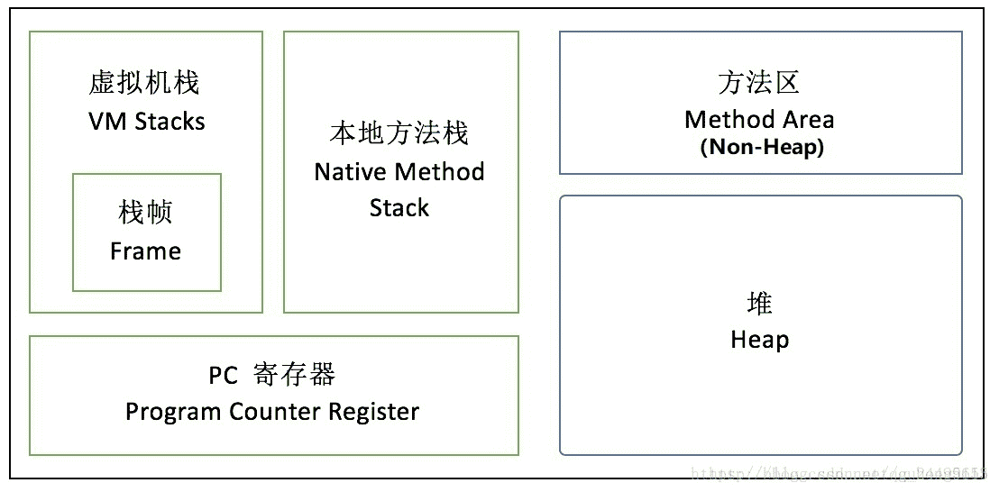
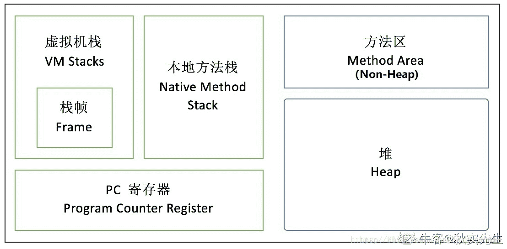
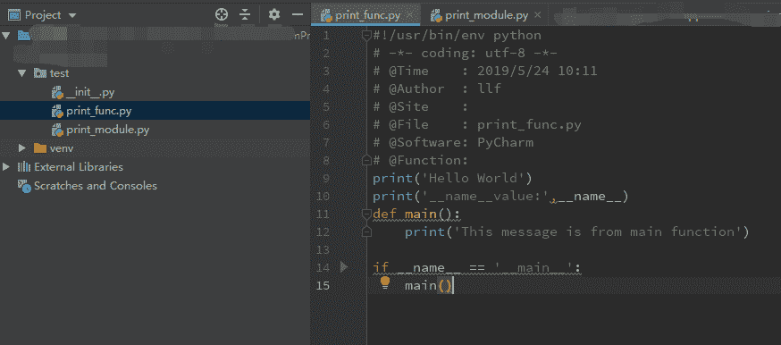
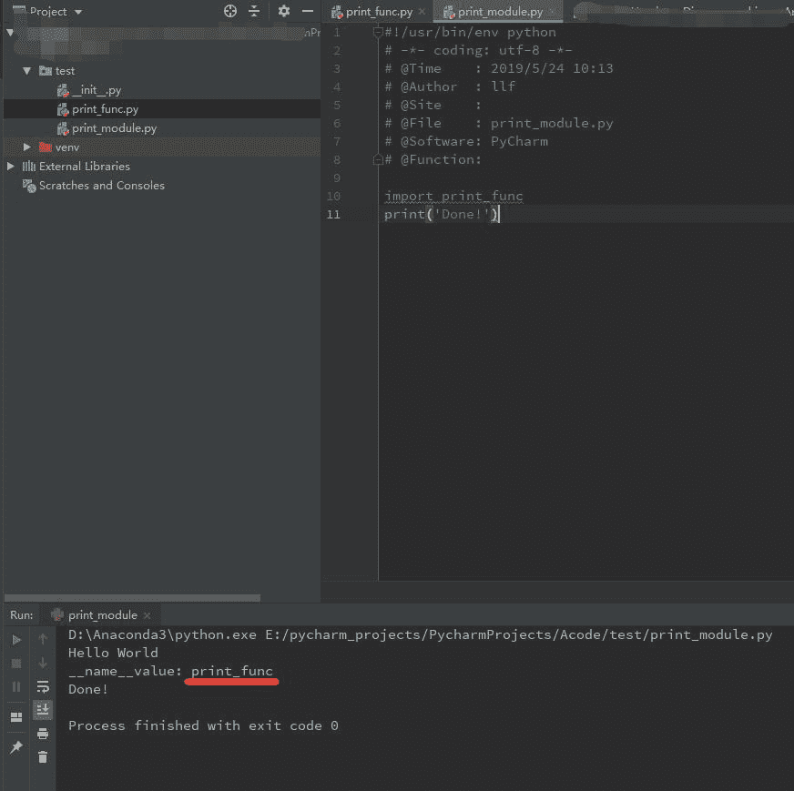
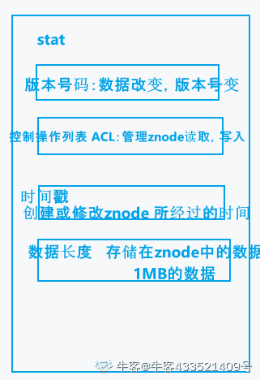
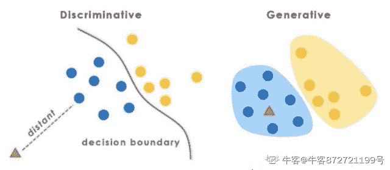

# 京东 2019 春招京东算法类试卷

## 1

在对问题的解空间树进行搜索的方法中，一个结点有多次机会成为活结点的是：（）

正确答案: B   你的答案: 空 (错误)

```cpp
动态规划
```

```cpp
回溯法
```

```cpp
分支限界法
```

```cpp
回溯法和分支限界法
```

本题知识点

算法工程师 京东 机器学习 2019

讨论

[张云超](https://www.nowcoder.com/profile/3386783)

分支限界法思想

1.  以广度优先或以最小耗费（最大效益）优先的方式搜索问题的解空间树
2.  分支限界法中，每一个活结点只有一次机会成为扩展结点，活结点一旦成为扩展结点，就一次性产生其所有儿子结点，其中导致不可行解或导致非最优解的儿子结点被舍弃，其余儿子结点被加入活结点表中
3.  然后从活结点表中取下一结点成为当前扩展结点
4.  重复上述结点扩展过程，直至到找到所需的解或活结点表为空时为止

从中可以看出，广度优先且不满足的被舍弃，满足的找其儿子节点，所以其不可能再次成为活结点回溯法：深度优先自然可以回到此节点。

发表于 2019-05-24 15:34:34

* * *

[Jackson_888](https://www.nowcoder.com/profile/951951941)

分支界限是广度优先，一旦成为扩展节点就将其所有儿子作为活结点（除了非最优解或不可行解的儿子节点，其余儿子为新的活结点）回溯法是深度优先，可以回到此节点，此节点再次成为活结点延伸。

发表于 2019-08-02 00:18:22

* * *

[牛奶可乐 201809180155732](https://www.nowcoder.com/profile/98304450)

分支限界法，类似于树的 BFS 算法，维护一个队列，每当 pop 出一个 element 的时候，把符合标准并且和这个元素相连的元素入队列，和 BFS 所有相连节点入队列不同，分支限界法如果估计某个节点往后的路径 cost 最大，或者最小为 c 不满足要求的话，就不入队列

发表于 2019-07-27 08:28:43

* * *

## 2

下列有关图的说法错误的是（）

正确答案: B C   你的答案: 空 (错误)

```cpp
在有向图中，出度为 0 的结点成为叶子结点
```

```cpp
用邻接矩阵表示图，可以在 O(1) 时间复杂度内判断任意两个结点之间是否有边相连，并求得各结点的度
```

```cpp
按深度优先遍历图和前序遍历树类似，得到的结果是唯一的
```

```cpp
若有向图 G 中从结点 Vi 到结点 Vj 有一条路径,则在图 G 的结点的线性序列中结点 Vi 必在结点 Vj 之前的话,则称为一个拓扑序列
```

本题知识点

算法工程师 京东 图 2019

讨论

[Echo201811262032380](https://www.nowcoder.com/profile/766138303)

A. 图是更加广义的树，也有叶子节点。 C. DFS,BFS 的结果均不同，要看规则，比如先 左后右，还是先右后左。 D. 拓扑序列

发表于 2019-10-09 07:53:02

* * *

[༄奥利奥࿐ེ](https://www.nowcoder.com/profile/228357444)

深度优先搜索（DFS）序列不唯一，他与算法、图的存储结构及出发点有关

发表于 2019-06-19 10:34:48

* * *

[学术废物](https://www.nowcoder.com/profile/6473476)

没看到还要求各点的度……

发表于 2022-03-16 21:53:51

* * *

## 3

在软件开发过程中，我们可以采用不同的过程模型，下列有关增量模型描述正确的（）

正确答案: B   你的答案: 空 (错误)

```cpp
已使用一种线性开发模型，具有不可回溯性
```

```cpp
把待开发的软件系统模块化，将每个模块作为一个增量组件，从而分批次地分析、设计、编码和测试这些增量组件
```

```cpp
适用于已有产品或产品原型（样品），只需客户化的工程项目
```

```cpp
软件开发过程每迭代一次，软件开发又前进一个层次
```

本题知识点

算法工程师 京东 软件工程 2019

讨论

[牛奶可乐 201809180155732](https://www.nowcoder.com/profile/98304450)

百度百科：增量模型是把待开发的软件系统模块化，将每个模块作为一个增量组件，从而分批次地分析、设计、编码和测试这些增量组件。运用增量模型的软件开发过程是递增式的过程。相对于瀑布模型而言，采用增量模型进行开发，开发人员不需要一次性地把整个软件产品提交给用户，而是可以分批次进行提交。

发表于 2019-07-27 08:35:15

* * *

[Nooni](https://www.nowcoder.com/profile/881583987)

a) 瀑布模型：分为制定计划、需求分析、软件设计、程序编写、软件测试和运行维护等六个基本活动，线性；b) 增量模型；c) 快速原型模型：快速建立原型，让用户与系统交互，再根据需求细化；d) 演化模型：迭***方法。

发表于 2020-04-17 17:07:56

* * *

[universal 猿](https://www.nowcoder.com/profile/324425200)

瀑布模型，水只能向下方流，所以回溯困难，适用于小型且对最终和阶段性成果非常确定的工程软件开发。

发表于 2020-06-19 17:10:13

* * *

## 4

要交换变量 A 和 B 的值,应使用的语句组( ) 

正确答案: B   你的答案: 空 (错误)

```cpp
A=B;B=C;C=A
```

```cpp
C=A;A=B;B=C
```

```cpp
A=B;B=A
```

```cpp
C=A;B=A;B=C
```

本题知识点

算法工程师 京东 2019 C++ C 语言

讨论

[wood-mood](https://www.nowcoder.com/profile/488996996)

通过第三个变量来将两个元素替换时，简记：同一个变量不会在等号的某一边重复出现两次

发表于 2020-12-11 17:43:51

* * *

[帅哥濠](https://www.nowcoder.com/profile/546414165)

这个都不会的话重新学也可以

发表于 2021-10-06 11:50:18

* * *

[牛客 913740887 号](https://www.nowcoder.com/profile/913740887)

通过第三个变量来交换 a.b 值

发表于 2021-05-19 17:56:43

* * *

## 5

用俩个栈模拟实现一个队列，如果栈的容量分别是 O 和 P(O>P),那么模拟实现的队列最大容量是多少？

正确答案: C   你的答案: 空 (错误)

```cpp
O+P
```

```cpp
2O+1
```

```cpp
2P+1
```

```cpp
2O-1
```

本题知识点

算法工程师 京东 2019

讨论

[Atlantis－H](https://www.nowcoder.com/profile/59111041)

https://www.cnblogs.com/eniac12/p/4865158.html

发表于 2019-05-25 20:25:11

* * *

[兰陵王＆阿兰朵](https://www.nowcoder.com/profile/5248812)

答：栈 A 的容量为 O，栈 B 的容量为 P,由于 O>P,则 A 为存储栈，B 为缓存区 1.将 1,..,P 元素入栈 A，栈底到栈顶的顺序为 P,...,1,然后 A 栈弹出，依次入栈 B,然后输出 1,,..P2.将 P+1,...,2P+1 元素入栈 A，然后依次弹出 2P+1,...,P+2 共 n 个元素，然后依次入栈 B,栈 A 弹出输出 P+1，栈 B 依次弹出 P+2,..,2P+1 元素实现队列容量为 2P+1

发表于 2019-05-30 22:40:49

* * *

[201906201759268](https://www.nowcoder.com/profile/141506099)

栈：先进先出队列：先进后出问题可以转换为：在装入 N 个元素时，出栈时依然满足先进先出，但在装入 N+1 个元素时，不再满足先进先出的逻辑。解: 大的栈作为存储站，小的栈作为缓冲栈；栈 O 装入栈 P 容易的元素，为了使得这些元素先进先出，必须将这些元素压如缓冲栈，再从缓冲栈 pop

发表于 2019-08-24 13:55:30

* * *

## 6

下列关于队列的叙述中正确的是（） 

正确答案: C   你的答案: 空 (错误)

```cpp
在队列中只能插入数据
```

```cpp
在队列中只能删除数据
```

```cpp
队列是先进先出的线性表
```

```cpp
队列是先进后出的线性表
```

本题知识点

算法工程师 京东 队列 *2019* *讨论

[一个小橘纸](https://www.nowcoder.com/profile/64319637)

队列，先进先出的线性表

发表于 2019-07-09 14:23:51

* * *

## 7

栈的特点是先进后出。栈底至栈顶依次存放元素 A、B、C、D，  在第五个元素 E 入栈前，栈中元素可以出栈，则出栈序列可能是：（）

正确答案: A   你的答案: 空 (错误)

```cpp
DCBEA
```

```cpp
DEBCA
```

```cpp
DBCEA
```

```cpp
DCAEB
```

本题知识点

算法工程师 京东 栈 *2019* *讨论

[Pasca00](https://www.nowcoder.com/profile/722206986)

栈里面原本的元素出栈顺序是 DCBA，这一部分是无论如何都不会变的

发表于 2019-08-23 15:29:13

* * *

[紫溪明](https://www.nowcoder.com/profile/628368209)

由于栈是先入后出的 E 入栈之前 栈中的元素都可以出栈 故 E 的位置不定 但其他的元素出栈顺序必须按照顺序出栈

发表于 2019-06-08 16:51:11

* * *

## 8

下列叙述中，有关线性链表叙述正确的是（）

正确答案: D   你的答案: 空 (错误)

```cpp
线性链表中的表头元素一定存储在其他元素的前面
```

```cpp
线性链表中的各元素在存储空间中的位置不一定是连续的，但表头元素一定存储在其他元素的前面
```

```cpp
线性链表中的各元素在存储空间中的位置必须是连续的
```

```cpp
线性链表中的各元素在存储空间中的位置不一定是连续的，且各元素的存储顺序也是任意的
```

本题知识点

算法工程师 京东 链表 *2019* *讨论

[紫溪明](https://www.nowcoder.com/profile/628368209)

链表的特点就是不一定按照顺序存储，无论是存储的空间位置还是存储顺序都是任意的

发表于 2019-06-08 17:04:18

* * *

[橙子可以吃](https://www.nowcoder.com/profile/193380320)

&

链表存储空间中的位置，存储顺序都是不连续的

发表于 2020-09-04 14:18:34

* * *

[鲜榨白开水](https://www.nowcoder.com/profile/796067913)

```cpp
线性链表中的各元素在存储空间中的位置不一定是连续的，且各元素的存储（地址）顺序也是任意的

```

发表于 2020-08-09 19:47:06

* * *

## 9

关系型数据库创建表都有主键。以下对主键描述正确的是：

正确答案: C   你的答案: 空 (错误)

```cpp
主键是唯一索引，唯一索引也是主键
```

```cpp
主键是一种特殊的唯一性索引，只可以是聚集索引
```

```cpp
主键是唯一、不为空值
的列
```

```cpp
对于聚集索引来说，创建主键时，不会自动创建主键的聚集索引
```

本题知识点

算法工程师 京东 数据库 2019

讨论

[wo~wo](https://www.nowcoder.com/profile/773124419)

主键是一种约束，唯一索引是一种索引，两者在本质上是不同的。 主键创建后一定包含一个唯一性索引，唯一性索引并不一定就是主键。 唯一性索引列允许空值，而主键列不允许为空值。 主键列在创建时，已经默认为空值 + 唯一索引了。 主键可以被其他表引用为外键，而唯一索引不能。 一个表最多只能创建一个主键，但可以创建多个唯一索引。 主键更适合那些不容易更改的唯一标识，如自动递增列、身份证号等。 在 RBO 模式下，主键的执行计划优先级要高于唯一索引。 两者可以提高查询的速度。

发表于 2020-01-01 16:31:25

* * *

[张云超](https://www.nowcoder.com/profile/3386783)

主键索引是唯一索引的一种特殊类型，两者有区别，比如主键索引不能为空，唯一索引可以

发表于 2019-05-24 15:38:42

* * *

[freeNeasy](https://www.nowcoder.com/profile/3295443)

聚集索引：类似字典的拼音目录。表中的数据按照聚集索引的规则来存储的。就像新华字典。整本字典是按照 A-Z 的顺序来排列。这也是一个表只能有一个聚集索引的原因。因为这个特点，具体索引应该建在那些经常需要 order by,group by,按范围取值的列上。因为数据本身就是按照聚集索引的顺序存储的。不应该建在需要频繁修改的列上，因为聚集索引的每次改动都以为这表中数据的物理数据的一次重新排序。就想新华字典一样。聚集索引适合建立在大数据量但是小数目不同值的列上，就像新华字典有收录了一两万的汉字，但是其拼音只有 A-Z 一样。但是并不是不同值越少越好。如果一个列只有极少值，如性别只有男女，在大数据量下无论是聚集索引和非聚集索引都是不适合建立的。因为其不同值辣么少。就像要查性别为男的，那么平均有一半就符合条件。就算建立索引也用处不大。值得注意的是有些数据库如 sql server 在你创建主键时会默认主键即为聚集索引，如果没有指定主键数据库本身也会创建一个不可见的索引，因为表本身总要有个排序规则是吧。主键作为聚集索引与大数据量但是小数目不同值适合建立聚集索引的规则是相违背的。即使这样也需要这样做的原因刚才说过，表总是需要一个排序规则的。如果你有更加合适的列适合做聚集索引是可以修改聚集索引的，但是聚集索引的修改一定一定一定要谨慎，因为聚集索引涉及要数据的物理存放数据。不合理的聚集索引会十分严重的拖累数据库的性能。注意，虽然一般主键默认就是聚集索引，但是并不代表聚集索引的值具有唯一约束，主键不等于具体索引。

发表于 2020-06-21 21:16:15

* * *

## 10

如果 ORDER BY 子句后未指定 ASC 或 DESC，默认使用以下哪个？

正确答案: B   你的答案: 空 (错误)

```cpp
DESC
```

```cpp
ASC
```

```cpp
不存在默认值
```

```cpp
其它选项都不对
```

本题知识点

算法工程师 京东 数据库 2019

讨论

[philipma](https://www.nowcoder.com/profile/2447617)

sql 默认升序 ASC

发表于 2019-06-12 00:05:15

* * *

[弱水三千 4](https://www.nowcoder.com/profile/9079816)

默认升序

发表于 2019-08-01 12:12:26

* * *

[PooChai](https://www.nowcoder.com/profile/437673378)

默认升序

发表于 2019-05-27 09:45:37

* * *

## 11

以下程序统计给定输入中每个大写字母的出现次数（不需要检查合法性）

```cpp
void
AlphabetCounting(char a[],int n){
  int
count[26]={},i,kind=0;

for(i=0;i<n;++i) (____________);

for(i=0;i<26;++i){

if(++kind>1) putchar(';');

printf("%c=%d",(____________));
   }
}
```

以下能补全程序，正确功能的选项是（）

正确答案: D   你的答案: 空 (错误)

```cpp
++count[a[i]-'z']

'Z'-i,count['Z'-i]
```

```cpp
++count['A'-a[i]]

'A'+i,count[i]
```

```cpp
++count[i]

i,count[i]
```

```cpp
++count['Z'-a[i]]

'Z'-i,count[i]
```

本题知识点

算法工程师 京东 C++ 2019

讨论

[馨馨秋雨梦](https://www.nowcoder.com/profile/925784853)

题意为输入设定全是大写 （ASCII 码 A-Z 为 65-90，递增）： 一、count 存储 A-Z 的个数，即 count[0]存储 A 的个数，于是 ++count[a[i]-‘A’]； 'A’+i，count[i]； 二、count 存储 Z~A 的个数，即 count[0]存储 Z 的个数，于是 ++count[‘Z’-a[i]]； ’Z’-i，count[i]。 所以答案为 D

编辑于 2019-06-19 15:23:14

* * *

[大闸蟹养殖专业户](https://www.nowcoder.com/profile/423282307)

很容易排除呀 
A 选项用了小写的 z index 肯定不对
B index 是负数
C 压根就不和大写字母沾边
立即推 选 D 一般写这种都是用 x-'A'这样来索引的 这道题倒了一下

发表于 2020-02-29 17:03:25

* * *

[查十三。](https://www.nowcoder.com/profile/179321657)

这个存储顺序是反的，题目也没说按照正确 A-Z 的顺序输出

发表于 2019-07-07 16:22:02

* * *

## 12

已知 int 占 4 个字节，bool 占 1 个字节。

```cpp
unsigned int
value = 1024;
bool condition =
*((bool *)(&value));
if (condition)
value += 1; condition = *((bool *)(&value));
if (condition)
value += 1; condition = *((bool *)(&value));
```

问 value, condition 的值为 ____。

正确答案: D   你的答案: 空 (错误)

```cpp
1026, 1
```

```cpp
1025, 0
```

```cpp
1025, 1
```

```cpp
1024, 0
```

本题知识点

算法工程师 京东 C++ 2019 C 语言

讨论

[regretful](https://www.nowcoder.com/profile/440791680)

bool 是一个字节，&value 就是获取 value 的地址，(bool*)(&value)就是用 bool 指针指向 value 地址，外面再套个*就是获取 bool 指向地址的值 1024 转二进制只有第 11 位是 1，那么低八位肯定都是 0，那么 bool 指向的低八位肯定也是零也就是 false，所有那两个 condition 都没有通过

发表于 2020-02-29 18:05:28

* * *

[掌间の小露珠](https://www.nowcoder.com/profile/6771124)

1024——100 00000000 :共 10 个 0， bool condition =*((bool *)(&value)); 取了后面 8 位的 0 作为 bool 变量值，一直是 0，没执行过 value +=1;

发表于 2019-07-06 17:34:46

* * *

[牛客 530417724 号](https://www.nowcoder.com/profile/530417724)

bool condition=*((bool*)(value))

其中 &value 表示取 value 的地址。

再将强转成 bool 类型 的指针 外面再加*表示取指针所指向的地址的值。

发表于 2020-11-10 16:07:03

* * *

## 13

在 c/c++语言中，关于类的静态成员的不正确描述是（）

正确答案: D   你的答案: 空 (错误)

```cpp
静态成员不属于对象，是类的共享成员
```

```cpp
c++11 之前，非 const 的静态数据成员要在类外定义和初始化
```

```cpp
静态成员函数不拥有 this 指针，需要通过类参数访问对象成员
```

```cpp
只有静态成员函数可以操作静态数据成员
```

本题知识点

算法工程师 京东 C++ 2019 C 语言

讨论

[清風逐尘乀](https://www.nowcoder.com/profile/91114325)

A----------静态成员不属于对象，是类的共享成员。B----------静态成员要在类外定义和初始化。B 显然是有问题的。静态成员变量存储在方法区，也是在类内定义和初始化的。C----------静态成员函数不含有 this 指针，需要通过类参数访问对象成员。因为静态成员函数被调用的时候，该静态成员函数所属的类很有可能还没有被初始化，所以静态成员函数是不含有 this 指针的。D----------只有静态成员函数可以操作静态数据成员。D 显然也是有问题的，非静态成员函数也可以操作静态数据成员。

编辑于 2019-07-03 13:14:59

* * *

[AlbertNie](https://www.nowcoder.com/profile/397498947)

【完整版】

静态成员

**本质**：静态成员与类本身直接相关，而不与类对象保持关联，除此之外，它和其他类成员基本**一样**。

静态成员包括：静态成员数据，静态成员函数

**如何声明？**

在成员声明之前加上`static`关键字。

```cpp
class A {
public:   // or private 
    static int a;        // 静态成员数据声明，也是定义
    static int func();   // 静态成员函数声明
    static int func() const; // error!
}
```

> note : 静态成员函数也不与任何对象绑定在一起，即不拥有 this 指针，这也就导致了静态成员函数体内不能使用 this 指针，也不能访问非静态成员（隐式 this 指针），且其不能被声明为 const（因为 const 表示该函数不会修改对象的成员数据，而 static 函数压根不能访问==对象（非类）==的数据成员，也就谈不上修改了，故而 c++规定不能用将静态成员函数声明为 const。）
> 
> 再次强调：静态成员函数只能访问类的静态成员变量。

**如何定义？**

注意，这时成员数据和成员函数的行为是不同的。

*   成员数据

    *   通常在外部初始化

    ```cpp
    int A::a = 10;
    ```

    *   如果非要在内部初始化，那么成员数据必须是 constexpr 或者 const 修饰的常量整数类型，初始值必须是字面值常量整数类型

    ```cpp
    class A{
         // ok，但只能用于类内替换，否则必须在外部重新定义（具体见 C++ primer 5nd p271），但不需要再次指定初始值
        static constexpr int a = 10; 
        static const float a = 10.0;   // error 不是整数类型
        static int a = 10;   // error!
    } 
    ```

*   成员函数：内类内外都可定义，不写`static`关键字。

```cpp
int A::func(){    // 内外定义，加上类作用域，不写 static 关键字
   ....
}
```

**如何使用？**

*   通过作用域运算符访问

```cpp
cout << A::a << endl;
```

*   和普通成员函数一样

```cpp
A obj;  
A* ptr;
cout << obj.a << endl;    // 通过对象（或引用）访问
cout << ptr->a << endl;  // 通过指针访问
```

**特殊场合**

*   静态数据类型可以是不完全类型，特别的，静态数据成员的类型可以就是它所属的类类型，普通成员则不行。

```cpp
class A{
    static A a;  // ok
    A b;  // error!
}
```

*   静态成员可以做默认实参，普通成员则不行。

```cpp
class A{
   static int a;
   int func(int num =  a;)
}
```

发表于 2021-05-08 13:17:11

* * *

[Keepmove1](https://www.nowcoder.com/profile/895859743)

是类和类的多个对象共同拥有的一个属性或者是方法，静态成员可以通过类名.静态成员名或者是对象名.静态成员名调用。

发表于 2019-07-02 19:57:16

* * *

## 14

以下程序

```cpp
main(){  
    int m=12,n=34;
    printf("%d%d",m++,++n);
    printf("%d%d\n",n++,++m);
}
```

程序运行后的输出结果是（）？

正确答案: A   你的答案: 空 (错误)

```cpp
12353514
```

```cpp
12353513
```

```cpp
12343514
```

```cpp
12343513
```

本题知识点

算法工程师 京东 C++ Java 2019 C 语言

讨论

[秋秋 201907101559624](https://www.nowcoder.com/profile/113096814)

A. m++ 先输出在自加，++m 先自加在输出 printf("%d%d",12++,++34);  ==》 12 35
printf("%d%d\n",35++,++13); ===》35 14

编辑于 2019-07-11 10:17:45

* * *

[风云独舞](https://www.nowcoder.com/profile/286256613)

不要忘记前面已经自加过后，变量的值已经改变了

          第一个输出：m++值：12，m 的值：13

                              ++n 值：35，n 的值：35

          第一个输出：n++值：35，n 的值：36

                              ++m 值：14，n 的值：14

          故最终输出：12353514

发表于 2019-09-02 16:18:57

* * *

[无咎 20190127104243](https://www.nowcoder.com/profile/186173193)

A

发表于 2019-07-08 18:07:20

* * *

## 15

JVM 内存不包含如下哪个部分( )

正确答案: D   你的答案: 空 (错误)

```cpp
Stacks
```

```cpp
PC 寄存器
```

```cpp
Heap
```

```cpp
Heap Frame
```

本题知识点

算法工程师 京东 Java 2019

讨论

[newcomer](https://www.nowcoder.com/profile/291053)

JVM 内存五大区域：

发表于 2019-06-06 17:11:44

* * *

[飞鸟与她](https://www.nowcoder.com/profile/9158041)

PC 寄存器即程序计数器

发表于 2019-07-03 11:20:06

* * *

[李梦蝶](https://www.nowcoder.com/profile/6006679)



发表于 2019-08-18 08:41:22

* * *

## 16

下列哪些操作会使线程释放锁资源？

正确答案: B C   你的答案: 空 (错误)

```cpp
sleep()
```

```cpp
wait()
```

```cpp
join()
```

```cpp
yield()
```

本题知识点

算法工程师 京东 Java 2019

讨论

[浮生后雪](https://www.nowcoder.com/profile/995843523)

刚看到一个大佬写的，给大家参考一下所谓的释放锁资源实际是通知对象内置的 monitor 对象进行释放，而只有所有对象都有内置的 monitor 对象才能实现任何对象的锁资源都可以释放。又因为所有类都继承自 Object，所以 wait(）就成了 Object 方法，也就是通过 wait()来通知对象内置的 monitor 对象释放，而且事实上因为这涉及对硬件底层的操作，所以 wait()方法是 native 方法，底层是用 C 写的。其他都是 Thread 所有，所以其他 3 个是没有资格释放资源的而 join()有资格释放资源其实是通过调用 wait()来实现的

```cpp
代码如下： 
wait()方法    
    public final native void wait(long timeoutMillis) throws InterruptedException;

join()方法
public final synchronized void join(long millis)
    throws InterruptedException {
        long base = System.currentTimeMillis();
        long now = 0;

        if (millis < 0) {
            throw new IllegalArgumentException("timeout value is negative");
        }

        if (millis == 0) {
            while (isAlive()) {
                wait(0);
            }
        } else {
            while (isAlive()) {
                long delay = millis - now;
                if (delay <= 0) {
                    break;
                }
                wait(delay);
                now = System.currentTimeMillis() - base;
            }
        }
    }

```

发表于 2019-07-23 21:52:52

* * *

[Keepmove1](https://www.nowcoder.com/profile/895859743)

**1.sleep()方法**

在指定时间内让当前正在执行的线程暂停执行，但不会释放“锁标志”。不推荐使用。

sleep()使当前线程进入阻塞状态，在指定时间内不会执行。

**2.wait()方法**

在其他线程调用对象的 notify 或 notifyAll 方法前，导致当前线程等待。线程会释放掉它所占有的“锁标志”，从而使别的线程有机会抢占该锁。

当前线程必须拥有当前对象锁。如果当前线程不是此锁的拥有者，会抛出 IllegalMonitorStateException 异常。

唤醒当前对象锁的等待线程使用 notify 或 notifyAll 方法，也必须拥有相同的对象锁，否则也会抛出 IllegalMonitorStateException 异常。

waite()和 notify()必须在 synchronized 函数或 synchronized　block 中进行调用。如果在 non-synchronized 函数或 non-synchronized　block 中进行调用，虽然能编译通过，但在运行时会发生 IllegalMonitorStateException 的异常。

**3.yield 方法**

暂停当前正在执行的线程对象。

yield()只是使当前线程重新回到可执行状态，所以执行 yield()的线程有可能在进入到可执行状态后马上又被执行。

yield()只能使同优先级或更高优先级的线程有执行的机会。 

        4.join 方法
join()等待该线程终止。

等待调用 join 方法的线程结束，再继续执行。如：t.join();//主要用于等待 t 线程运行结束，若无此句，main 则会执行完毕，导致结果不可预测

发表于 2019-07-03 17:14:08

* * *

[张云超](https://www.nowcoder.com/profile/3386783)

yield()不会释放锁，只是通知调度器自己可以让出 cpu 时间片，但只是建议，调度器也不一定采纳

发表于 2019-05-24 15:44:06

* * *

## 17

下列说法正确的是( )

正确答案: C   你的答案: 空 (错误)

```cpp
volatile,synchronized
都可以修改变量，方法以及代码块
```

```cpp
volatile，synchronized 在多线程中都会存在阻塞问题
```

```cpp
volatile 能保证数据的可见性，但不能完全保证数据的原子性，synchronized 即保证了数据的可见性也保证了原子性
```

```cpp
volatile 解决的是变量在多个线程之间的可见性、原子性，而 sychroized 解决的是多个线程之间访问资源的同步性
```

本题知识点

算法工程师 京东 Java 2019

讨论

[Bean 冷的心](https://www.nowcoder.com/profile/411517301)

**可见性：**

可见性是一种复杂的属性，因为可见性中的错误总是会违背我们的直觉。通常，我们无法确保执行读操作的线程能适时地看到其他线程写入的值，有时甚至是根本不可能的事情。为了确保多个线程之间对内存写入操作的可见性，必须使用同步机制。

**可见性，是指线程之间的可见性，一个线程修改的状态对另一个线程是可见的。**也就是一个线程修改的结果。另一个线程马上就能看到。比如：用 volatile 修饰的变量，就会具有可见性。volatile 修饰的变量不允许线程内部缓存和重排序，即直接修改内存。所以对其他线程是可见的。但是这里需要注意一个问题，volatile 只能让被他修饰内容具有可见性，但不能保证它具有原子性。比如 volatile int a = 0；之后有一个操作 a++；这个变量 a 具有可见性，但是 a++ 依然是一个非原子操作，也就是这个操作同样存在线程安全问题。

在 Java 中 volatile、synchronized 和 final 实现可见性。

**原子性：**

**原子是世界上的最小单位，具有不可分割性。**比如 a=0；（a 非 long 和 double 类型） 这个操作是不可分割的，那么我们说这个操作时原子操作。再比如：a++； 这个操作实际是 a = a + 1；是可分割的，所以他不是一个原子操作。非原子操作都会存在线程安全问题，需要我们使用同步技术（sychronized）来让它变成一个原子操作。一个操作是原子操作，那么我们称它具有原子性。java 的 concurrent 包下提供了一些原子类，我们可以通过阅读 API 来了解这些原子类的用法。比如：AtomicInteger、AtomicLong、AtomicReference 等。

在 Java 中 synchronized 和在 lock、unlock 中操作保证原子性。

**有序性：**

Java 语言提供了 volatile 和 synchronized 两个关键字来保证线程之间操作的有序性，volatile 是因为其本身包含“禁止指令重排序”的语义，synchronized 是由“一个变量在同一个时刻只允许一条线程对其进行 lock 操作”这条规则获得的，此规则决定了持有同一个对象锁的两个同步块只能串行执行。

当一个变量定义为 volatile 之后，将具备两种特性：

1.保证此变量对所有的线程的可见性，这里的“可见性”，如本文开头所述，当一个线程修改了这个变量的值，volatile 保证了新值能立即同步到主内存，以及每次使用前立即从主内存刷新。但普通变量做不到这点，普通变量的值在线程间传递均需要通过主内存（详见：[Java 内存模型](http://www.cnblogs.com/zhengbin/p/6407137.html)）来完成。

2.禁止指令重排序优化。有 volatile 修饰的变量，赋值后多执行了一个“load addl $0x0, (%esp)”操作，这个操作相当于一个**内存屏障**（指令重排序时不能把后面的指令重排序到内存屏障之前的位置），只有一个 CPU 访问内存时，并不需要内存屏障；（什么是指令重排序：是指 CPU 采用了允许将多条指令不按程序规定的顺序分开发送给各相应电路单元处理）。

volatile 性能：

volatile 的读性能消耗与普通变量几乎相同，但是写操作稍慢，因为它需要在本地代码中插入许多内存屏障指令来保证处理器不发生乱序执行。

摘自[`www.cnblogs.com/zhengbin/p/5654805.html`](https://www.cnblogs.com/zhengbin/p/5654805.html)

发表于 2019-07-12 15:07:25

* * *

[希望不一样](https://www.nowcoder.com/profile/934000618)

```cpp

	*   关键字 volatile 是线程同步的轻量级实现，所以 volatile 性能肯定比 synchronized 要好，并且只能修改变量，而 synchronized 可以修饰方法，以及代码块。

	*   多线程访问 volatile 不会发生阻塞，而 synchronized 会出现阻塞

	*   volatile 能保证数据的可见性，但不能保证原子性；而 synchronized 可以保证原子性，也可以间接保证可见性，因为它会将私有内存和公共内存中的数据做同步

	*   关键字 volatile 解决的下变量在多线程之间的可见性；而 synchronized 解决的是多线程之间资源同步问题

	--<<*Java 多线程编程核心技术*>>

            发表于 2019-07-24 15:27:44

            [VivienneW_w](https://www.nowcoder.com/profile/473106017)

                                                                    volatile 和 synchronized 的区别  

*   volatile 本质是在告诉 jvm 当前变量在寄存器（工作内存）中的值是不确定的，需要从主存中读取； synchronized 则是锁定当前变量，只有当前线程可以访问该变量，其他线程被阻塞住。     

*   volatile 仅能使用在变量级别；synchronized 则可以使用在变量、方法、代码块和类级别的。     

*   volatile 仅能实现变量的修改可见性，不能保证原子性；而 synchronized 则可以保证变量的修改可见性和原子性。     

*   volatile 不会造成线程的阻塞；synchronized 可能会造成线程的阻塞。     

*   volatile 标记的变量不会被编译器优化；synchronized 标记的变量可以被编译器优化。     

*   volatile 能保证数据的可见性，但不能完全保证数据的原子性（不能保证复合操作的原子性），synchronized 即保证了数据的可见性，也保证了原子性。 

            发表于 2019-07-07 22:49:15

        18
        java8 中，下面哪个类用到了解决哈希冲突的开放定址法 

    正确答案:
                                                                  C
                                        你的答案:

                  空
                             (错误)

```
LinkedHashSet
```cpp

```
HashMap
```cpp

```
ThreadLocal
```cpp

```
TreeMap
```cpp

本题知识点

                                                            算法工程师 
                                                京东 
                                                Java 
                                                2019 

讨论

[牛客 860965529 号](https://www.nowcoder.com/profile/860965529)

threadlocalmap 使用开放定址法解决 haah 冲突，hashmap 使用链地址法解决 hash 冲突

发表于 2019-07-05 18:19:18

* * *

[人余月半子](https://www.nowcoder.com/profile/514787832)

                                                                    什么是开发地址法：[`cloud.tencent.com/developer/article/1361248`](https://cloud.tencent.com/developer/article/1361248)

发表于 2020-03-08 16:40:58

* * *

[亻 201802241215330](https://www.nowcoder.com/profile/2518118)

                                                                    散列表之开放定址法  在前面的文章中我们介绍过《散列表之链接法》，在链接法中，如果不同键值却将有相同的映射值，即有不同键值的元素却映射到散列表中的同一位置，那么就采用链表的方法，将映射到同一位置的元素插入到同一个链表之中，当需要删除， 查询元素时，只需要遍历该链表即可，链接法在最坏情况下删除和查询元素的时间代价为 O(n)O(n) 今天我们来讲散列表中另外一种解决冲突的方法，那就是开放定址法(open addressing)。  假如你在外面旅游时，吃坏东西，急需上厕所，当你好不容易找到一件洗手间的时候，发现排了好多人，这时你会怎么做？  如果是链接法:排队不就行了，我就在外面等，迟早会排到我的 如果是开放定址法:直接放弃现有厕所，去寻找新的厕所 没错，放弃已被占用的位置，寻找新的插入位置就是开放定址法的思想，开放定址法中的开放二字指的是没有被占用的位置，定址指的是确定位置。开放定址法中，所有的元素都放在散列表中(链接法放在链表中)。也就是说散列表中的每一个位置，要么有元素，要么没有元素。当需要删除，查询元素时，我们从某一个位置开始，按照某种特定的确定下一个位置的方法来检查所有表项，直到找到目标元素，或者没有找到。

发表于 2019-07-29 09:01:27

* * *

## 19

          当一个嵌套函数在其外部区域引用了一个值时，该嵌套函数就是一个闭包，以下代码输出值为： 

```
def adder(x):
    def wrapper(y):
        return x + y
    return wrapper
adder5 = adder(5)
print(adder5(adder5(6)))
```cpp

正确答案:
                                                                                   D
                       你的答案:

                  空
                             (错误)

```
10
```cpp

```
12
```cpp

```
14
```cpp

```
16
```cpp

本题知识点

                                                            算法工程师 
                                                京东 
                                                Python 
                                                2019 

讨论

[clutchbear](https://www.nowcoder.com/profile/7389895)

                                                                    1\. 如果在一个函数的内部定义了另一个函数，外部的我们叫他外函数，内部的我们叫他内函数。
 2\. 在一个外函数中定义了一个内函数，内函数里运用了外函数的临时变量，并且外函数的返回值是内函数的引用。这样就构成了一个闭包。
   3\. 一般情况下，如果一个函数结束，函数的内部所有东西都会释放掉，还给内存，局部变量都会消失。但是闭包是一种特殊情况，如果外函数在结束的时候发现有自己的临时变量将来会在内部函数中用到，就把这个临时变量绑定给了内部函数，然后自己再结束。 

   具体就是 5+6+5=16 
   [`www.cnblogs.com/Lin-Yi/p/7305364.html`](https://www.cnblogs.com/Lin-Yi/p/7305364.html)

发表于 2019-07-03 19:55:30

* * *

[doushizu](https://www.nowcoder.com/profile/809764587)

                                                                      如题：当一个嵌套函数在其外部区域引用了一个值时，该嵌套函数就是一个闭包 
   整理格式后，运行如下： 
   def adder(x): 
     def wrapper(y):

         return x + y

     return wrapper
 adder5 = adder(5)
 print(adder5(adder5(6)))
 print(adder5(6))
 print(adder5(1))
   print(adder5(2)) 
   --------------------------------- 
   16 
   11 
   6 
   7 

发表于 2019-07-03 11:41:29

* * *

[枫叶无痕](https://www.nowcoder.com/profile/859556741)

                                                                    简单式理解(需要文字里深入理解的请看楼上）:首先 adder(x)的返回值为 wrapper，则 wrapper=adder(5)，只是这个 wrapper 中 x 为 5，其次 wrapper(6)则是 y=6，返回值为 x+y=5+6=11，因此 wrapper(6）的值为 11，然后 wrapper(wrapper(6）)就相当于 wrapper(11)，同理得 x+y=5+11=16，所以最后的答案是 16。如有理解错误，请大神指出

发表于 2019-11-27 10:05:17

* * *

## 20

        关于 Python 中的复数，下列说法错误的是（）

正确答案:
                                                                  C
                                        你的答案:

                  空
                             (错误)

```
表是复数的语法是 real + image j
```cpp

```
实部和虚部都是浮点数
```cpp

```
虚部必须后缀 j，且必须小写
```cpp

```
方法 conjugate 返回复数的共轭复数
```cpp

本题知识点

                                                            算法工程师 
                                                京东 
                                                2019 

讨论

[cosJin](https://www.nowcoder.com/profile/685136502)

                                                                    可以是 j 也可以是 J

发表于 2019-05-29 17:16:51

* * *

[橙子可以吃](https://www.nowcoder.com/profile/193380320)

                                                                    &

a=complex(3,4)，3+4j

real+imag j，均为浮点型

a.conjugate()为 a 的共轭复数，为 3_4j

发表于 2020-09-04 15:13:18

* * *

## 21

        下面哪个是 Python 中的不变的数据结构？

正确答案:
                                                                  C
                                        你的答案:

                  空
                             (错误)

```
set
```cpp

```
list
```cpp

```
tuple
```cpp

```
dict
```cpp

本题知识点

                                                            算法工程师 
                                                京东 
                                                Python 
                                                2019 

讨论

[clutchbear](https://www.nowcoder.com/profile/7389895)

                                                                      [`www.cnblogs.com/operationhome/p/9642460.html`](https://www.cnblogs.com/operationhome/p/9642460.html) 
   6 个常用数据类型：整型，字符串，元组，集合，列表，字典 
   不可变：整型、字符串、元组

   可变：集合、列表、字典 

发表于 2019-11-11 19:09:39

* * *

[馨馨秋雨梦](https://www.nowcoder.com/profile/925784853)

                                                                    元组可以理解为一个固定的列表，一旦初始化其中的元素便不可修改（认真理解这句话），只能对元素进行查询

发表于 2019-06-19 15:29:25

* * *

[马儿 666888](https://www.nowcoder.com/profile/139004564)

                                                                      可变类型：list, dict , set 
   不可变类型:  int，string，tuple 

发表于 2020-02-17 19:44:45

* * *

## 22

  已知 print_func.py 的代码如下： 

```
print('Hello
World!')
print('__name__
value: ', __name__)

def main():

print('This message is from main function')

if __name__ ==
'__main__':

main()

print_module.py 的代码如下：
import print_func
print("Done!")
```cpp

  运行 print_module.py 程序，结果是： 

正确答案:
                                A
                                                                          你的答案:

                  空
                             (错误)

```
Hello World!  __name__ value: print_func  Done!
```cpp

```
Hello World!  __name__ value: print_module  Done!
```cpp

```
Hello World!  __name__ value: __main__  Done!
```cpp

```
Hello World!  __name__ value:  Done!
```cpp

本题知识点

                                                            算法工程师 
                                                京东 
                                                Python 
                                                2019 

讨论

[WaterXMan](https://www.nowcoder.com/profile/530994502)

                                                                    当运行模块的时候，__name__ 等于“__main__”；如果 import 到其他模块中，则 __name__ 等于模块名称（不包含后缀.py）

发表于 2019-06-12 09:43:34

* * *

[只是不想说](https://www.nowcoder.com/profile/1587329)

                                                                      我测试了一下，感觉有点问题 
   

发表于 2019-05-24 10:21:02

* * *

[leojungle](https://www.nowcoder.com/profile/579019025)

                                                                      应该选择 A。 
   当 print_func 作为模块导入的时候不会执行 main 函数，其 __name__ 的值为模块名：print_func。 
   因此会打印出 print_func. 

编辑于 2019-12-24 16:20:05

* * *

## 23

        Zookeeper 在 config 命名空间下，每个 znode 最多能存储（）数据？   

正确答案:
                                A
                                                                          你的答案:

                  空
                             (错误)

```
1M
```cpp

```
16M
```cpp

```
512K
```cpp

```
64K
```cpp

本题知识点

                                                            算法工程师 
                                                京东 
                                                ZooKeeper 
                                                2019 

讨论

[兰陵王＆阿兰朵](https://www.nowcoder.com/profile/5248812)

  ZooKeeper 数据模型中的每个 znode 都维护着一个** stat **结构。一个 stat 仅提供一个 znode 的**元数据**。它由版本号，操作控制列表(ACL)，时间戳和数据长度组成。 

*   **版本号** - 每个 znode 都有版本号，这意味着每当与 znode 相关联的数据发生变化时，其对应的版本号也会增加。当多个 zookeeper 客户端尝试在同一 znode 上执行操作时，版本号的使用就很重要。   

*   **操作控制列表(ACL)** - ACL 基本上是访问 znode 的认证机制。它管理所有 znode 读取和写入操作。   

*   **时间戳** - 时间戳表示创建和修改 znode 所经过的时间。它通常以毫秒为单位。ZooKeeper 从“事务 ID"(zxid)标识 znode 的每个更改。**Zxid **是唯一的，并且为每个事务保留时间，以便你可以轻松地确定从一个请求到另一个请求所经过的时间。   

*   **数据长度** - 存储在 znode 中的数据总量是数据长度。你最多可以存储 1MB 的数据。   

发表于 2019-05-31 21:17:01

* * *

[玩命升级打怪的 Allen](https://www.nowcoder.com/profile/433521409)

   

发表于 2021-08-25 09:05:53

* * *

[D-LJY](https://www.nowcoder.com/profile/292692282)

                                                                    在传输过程中每个文件包是 64kb

发表于 2021-06-26 21:43:20

* * *

## 24

          一般情况下，串行程序并行化设计需要将工作进行拆分，使得分布在每个进程中的工作量大致相仿，并行让它们之间的通信量最少。以下串行程序并行化设计步骤正确的是：  
   1、将串行程序中需要要执行的指令和数据按照计算部分拆分成多个小任务  
   2、将上一步聚合好的任务分配到进程/线程中。这一步还主要注意的是，要使得通信量最小化，让各个进程/线程所得到的工作量大致均衡  
   3、确定第一步识别出来的任务之间需要执行何种通信 
    4、将第一步确定的任务与通信结合成更大的任务  

正确答案:
                                                 B
                                                         你的答案:

                  空
                             (错误)

```
1->2->3->4
```cpp

```
1->3->4->2
```cpp

```
1->2->4->3
```cpp

```
1->4->3->2
```cpp

本题知识点

                                                            算法工程师 
                                                京东 
                                                操作系统 
                                                2019 

讨论

[CatchTDream~](https://www.nowcoder.com/profile/240761)

                                                                    有做言语理解的感觉了。。

发表于 2021-07-27 23:27:28

* * *

[亲爱的暴躁的热心网友皮皮文](https://www.nowcoder.com/profile/3496468)

                                                                      数据开发的思路 

   1 先设置每个 stage 执行 什么计算 
   2 各个 stage 间的依赖关系网络传输方式 
   3 合成为一个 mapreduce 作业 
   4 丢在大数据系统中之星 mr 作业 

发表于 2021-10-12 21:32:17

* * *

[Kwong77](https://www.nowcoder.com/profile/710558030)

求告知这是哪本书上的内容😢

发表于 2020-11-15 13:43:49

* * *

## 25

  有如下两组数据 {(-1,0),(-1,2),(1,2)}  

  {(0,0),(1,0),(1,1)} 

 我们在该数据集上训练一个线性 SVM 模型，该模型中的支持向量是哪些？ 

正确答案:
                                                                  C
                                        你的答案:

                  空
                             (错误)

```
(−1,2),(1,1),(1,0)
```cpp

```
(−1,0),(−1,2),(1,1),(1,0)
```cpp

```
(−1,0),(1,2),(0,0),(1,1)
```cpp

```
(−1,0),(-1,2),(0,0),(1,0)
```cpp

本题知识点

                                                            算法工程师 
                                                京东 
                                                机器学习 
                                                2019 

讨论

[豆豆豆 711](https://www.nowcoder.com/profile/243490180)

                                                                    这道题有问题吧答案，数据集里面都没有 0,1 啊，正确答案的数据集（-1,0）（0,0,）（1,2）（1,1）吧应该是 = =

发表于 2019-05-24 10:13:40

* * *

[葑歆](https://www.nowcoder.com/profile/243416731)

                                                                    选 c，支持向量机是找到一条线或者一个超平面把他们分开，c 的点都是在 y=x+1 和 y=x 组成的区间范围内

发表于 2020-07-12 09:54:35

* * *

[天天天天天天天天天天天](https://www.nowcoder.com/profile/429767092)

                                                                    这题完全不知道他想怎么解，维度为 2 的解空间，秩最多为 2，也就是只需要任意两个飞相关的支持向量就可以了。

发表于 2019-07-27 11:36:29

* * *

## 26

        以下哪个模型是生成式模型：

正确答案:
                                A
                                                                          你的答案:

                  空
                             (错误)

```
贝叶斯模型
```cpp

```
逻辑回归
```cpp

```
SVM
```cpp

```
条件随机场
```cpp

本题知识点

                                                            算法工程师 
                                                京东 
                                                机器学习 
                                                2019 

讨论

[张云超](https://www.nowcoder.com/profile/3386783)

                                                                      判别式模型与生成模型区别（引自知乎：[`zhuanlan.zhihu.com/p/30941701`](https://zhuanlan.zhihu.com/p/30941701)） 
   1.判别式模型这么做： 

  我们根据训练数据得到分类函数和分界面，比如说根据 SVM 模型得到了一个分界面，然后直接计算条件概率  ，我们将最大的  作为新样本的分类。判别式模型不能反映训练数据本身的特性，能力有限，其只能告诉我们分类的类别。 

  2.生成式模型这么做 

  一般我们对每一个类建立一个模型，有多少个类别，我们就建立多少个模型。比方说类别标签有｛猫，狗，猪｝，那首先根据猫的特征学习出一个猫的模型，再根据狗的特征学习出狗的模型，之后分别计算新测试样本  跟三个类别的联合概率  ，然后根据贝叶斯公式： 

   

  分别计算  ，选择三类中最大的  作为样本的分类。 

发表于 2019-05-24 15:22:24

* * *

[孤独相望](https://www.nowcoder.com/profile/1736221)

                                                                    判别式模型(Discriminative Model)：直接对条件概率 p(y|x)进行建模，常见判别模型有：线性回归、决策树、支持向量机 SVM、k 近邻、神经网络等；
 生成式模型(Generative Model)：对联合分布概率 p(x,y)进行建模，常见生成式模型有：隐马尔可夫模型 HMM、朴素贝叶斯模型、高斯混合模型 GMM、LDA 等；
 生成式模型更普适；判别式模型更直接，目标性更强
   生成式模型关注数据是如何产生的，寻找的是数据分布模型；判别式模型关注的数据的差异性，寻找的是分类面 
   由生成式模型可以产生判别式模型，但是由判别式模式没法形成生成式模型  

发表于 2020-04-02 18:57:31

* * *

[牛客 872721199 号](https://www.nowcoder.com/profile/872721199)

                                                                    

发表于 2019-12-12 23:10:15

* * *

## 27

        因为文本数据在可用的数据中是非常无结构的，它内部会包含很多不同类型的噪点，所以要做数据预处理。以下不是自然语言数据预处理过程的是：

正确答案:
                                                 B
                                                         你的答案:

                  空
                             (错误)

```
词汇规范化
```cpp

```
词汇关系统一化
```cpp

```
对象标准化
```cpp

```
噪声移除
```cpp

本题知识点

                                                            算法工程师 
                                                京东 
                                                自然语言处理 
                                                2019 

讨论

[美团打工人](https://www.nowcoder.com/profile/4417755)

                                                                    典型英文自然语言处理工作流程是什么样 对于纯文本句子。首先将其转换成小写，并清除标点符号，将其 Normalization。然后用 Tokenization 将其分拆成词，接下来可以清除 Stop Words，以减少要处理的词汇量。根据应用的不同，可以选择同时进行 Stemming 和 Lemmatization，将词还原成词根或词干。常见的方法是先进行 Lemmatization，再进行 Stemming。这个程序将自然语言句子转换成标准化记号序列，这样可以用于进一步分析

发表于 2020-03-14 10:01:00

* * *

[wzhao](https://www.nowcoder.com/profile/1768674)

                                                                    [`www.itcodemonkey.com/article/9361.html`](https://www.itcodemonkey.com/article/9361.html)

发表于 2019-08-24 10:52:26

* * *

## 28

        可以从新闻文本数据中分析出名词短语，动词短语，主语的技术是？  

正确答案:
                                                 B
                                                         你的答案:

                  空
                             (错误)

```
词性标注
```cpp

```
依存分析和句法分析
```cpp

```
N-Gram 抽取
```cpp

```
词袋模型
```cpp

本题知识点

                                                            算法工程师 
                                                京东 
                                                自然语言处理 
                                                2019 

讨论

[UESTC_ 周乐](https://www.nowcoder.com/profile/6823159)

                                                                      依存语法 (Dependency Parsing, DP) ：通过分析语言单位内成分之间的依存关系揭示其句法结构（依存句法分析与语义依存分析的区别：[`www.cnblogs.com/CheeseZH/p/5768389.html`](https://www.cnblogs.com/CheeseZH/p/5768389.html)）；==>划分动词短语、名词短语 
   词性标注：在本质上是分类问题，将语料库中的单词按词性分类。一个词的词性由其在所属语言的含义、形态和语法功能决定。以汉语为例，汉语的词类系统有 18 个子类，包括 7 类体词，4 类谓词、5 类虚词、代词和感叹词。词类不是闭合集，而是有兼词现象，例如“制服”在作为“服装”和作为“动作”时会被归入不同的词类，因此词性标注与上下文有关。==>划分动词、名词

发表于 2021-08-19 11:33:47

* * *

[你永远得不到的祖奶奶](https://www.nowcoder.com/profile/855996890)

                                                                    我居然选了词性标记  瓦特

发表于 2020-08-05 20:29:43

* * *

## 29

        均值移动（Mean Shift）算法的核心思想是：  

正确答案:
                                                 B
                                        你的答案:

                  空
                             (错误)

```
构建 Hessian 矩阵，判别当前点是否为比邻域更亮或更暗的点，由此来确定关键点的位置
```cpp

```
找到概率密度梯度为零的采样点，并以此作为特征空间聚类的模式点
```cpp

```
从每一个点开始作为一个类，然后迭代的融合最近的类。能创建一个树形层次结构的聚类模型
```cpp

本题知识点

                                                            算法工程师 
                                                京东 
                                                机器学习 
                                                2019 

讨论

[龟龟龟龟啊](https://www.nowcoder.com/profile/897802024)

                                                                      对于 Mean Shift 算法，是一个迭代的步骤，即先算出当前点的偏移均值，将该点移动到此偏移均值，然后以此为新的起始点，继续移动，直到满足最终的条件。 

发表于 2020-08-26 13:35:46

* * *

[Jackson_888](https://www.nowcoder.com/profile/951951941)

                                                                      [`blog.csdn.net/hjimce/article/details/45718593`](https://blog.csdn.net/hjimce/article/details/45718593)

   基于核密度估计的爬山算法，基本形式是： 
   给 d 维空间的 n 个数据点集 X，那么对于空间中任一点 x 的 meanshift 就可以表示为漂移向量（表示圆心的向量），用 sk 表示数据集的点到 x 的距离小于球半径 h 的数据点集。漂移过程就是不断加入新的点（就是到 x 距离小于求半径的点），一边更新球圆心 x。圆心会向数据集密度最大的地方移动。 

   C 明显错，不是树形层次结构聚类模型。。。 
   A 错，没这么复杂。 

发表于 2019-08-02 00:14:54

* * *

## 30

        随机抽样一致算法（random sample consensus,RANSAC）,采用迭代的方式从一组包含离群的被观测数据中估算出数学模型的参数。对于 RANSAC 的基本假设描述不正确的是： 

正确答案:
                                                 B
                                                         你的答案:

                  空
                             (错误)

```
给定一组（通常很小）的内群，存在一个程序，这个程序可以估算最佳解释或最适用于这一数据模型的参数
```cpp

```
离群点离 inliers 集中区域的差距再可控范围内
```cpp

```
"内群”数据可以通过几组模型的参数来叙述其分别，而“离群”数据则是不适合模型化的数据
```cpp

```
数据会受噪声影响，噪声指的是离群，例如从极端的噪声或错误解释有关数据的测量或不正确的假设
```cpp

本题知识点

                                                            算法工程师 
                                                京东 
                                                机器学习 
                                                2019 

讨论

[ladychili](https://www.nowcoder.com/profile/36576300)

                                                                      看完 D 选项我开始怀疑自己的阅读理解水平。好好断句有这么难吗。 

编辑于 2019-07-05 06:37:27

* * *

## 31

          有一个含有 n 个数字的序列，每个数字的大小是不超过 200 的正整数，同时这个序列满足以下条件：    

   
 
 

   但是很不幸的是，在序列保存的过程中，有些数字丢失了，请你根据上述条件，计算可能有多少种不同的序列可以满足以上条件。 

   数据范围：  ， 序列中的数字满足  ， 数字为 0 时表示丢失

本题知识点

                                                            算法工程师 
                                                京东 
                                                动态规划 
                                                2019 

讨论

[梦樱羽](https://www.nowcoder.com/profile/7927705)

                                                                    [`www.cnblogs.com/zaq19970105/p/10954966.html`](https://www.cnblogs.com/zaq19970105/p/10954966.html)

发表于 2019-05-31 15:42:43

* * *

[牛奶可乐 201809180155732](https://www.nowcoder.com/profile/98304450)

                                                                    这个题目我都看不懂  是我太菜了吗  index 到底是从 0 开始 还是从 1 还是

编辑于 2019-07-28 03:53:15

* * *

[nbgao](https://www.nowcoder.com/profile/211289)

```
#include <bits/stdc++.h>
using namespace std;

const int N = 1e4+3;
const int M = 998244353;

int main(){
    int n;
    scanf("%d", &n);
    int a[n+2];
    for(int i=1;i<=n;i++)
        scanf("%d", &a[i]);
    a[0] = a[n+1] = 1;
    long dp[n+2][203][3], s1[203], s2[203];
    dp[0][1][1] = 1;
    for(int i=1;i<=200;i++)
        s1[i] = s2[i] = 1;
    for(int i=1;i<=n+1;i++){
        int l=1, r=200;
        if(a[i])
            l = r = a[i];
        for(int j=l;j<=r;j++){
            dp[i][j][0] = (s2[200]-s2[j])%M;
            dp[i][j][1] = (dp[i-1][j][0]+dp[i-1][j][1]+dp[i-1][j][2])%M;
            dp[i][j][2] = s1[j-1]%M;
        }
        for(int j=1;j<=200;j++){
            s1[j] = s1[j-1] + dp[i][j][0] + dp[i][j][1] + dp[i][j][2];
            s2[j] = s2[j-1] + dp[i][j][0] + dp[i][j][1];
        }
    }
    printf("%ld\n", (dp[n+1][1][0]+dp[n+1][1][1])%M);
    return 0;
}
```cpp

发表于 2020-10-10 01:02:41

* * *

```***