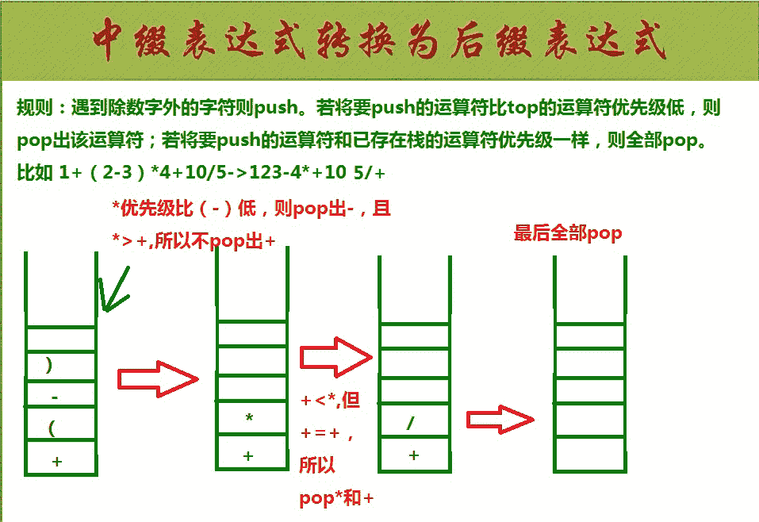
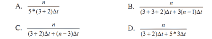
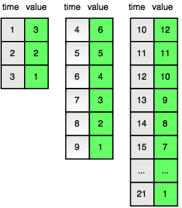

# 寒武纪 2019 秋招软件岗笔试（一）

## 1

假设栈初始为空，将中缀表达式 g/f+(e*d-c*b)/a 转换为等价的后缀表达式的过程中，当扫描到 b 时，栈中的元素依次是

正确答案: B   你的答案: 空 (错误)

```cpp
+（* -
```

```cpp
+（ - *
```

```cpp
/ + ( * - *
```

```cpp
/ + - *
```

本题知识点

Java 工程师 C++工程师 寒武纪 2019

讨论

[牛客小黑](https://www.nowcoder.com/profile/7602693)



发表于 2019-05-27 20:43:56

* * *

## 2

下列选项中，不能构成二分查找中关键字比较序列的是

正确答案: A   你的答案: 空 (错误)

```cpp
510,210,460,190
```

```cpp
510,460,210,190
```

```cpp
170,500,200,440
```

```cpp
170,200,500,440
```

本题知识点

Java 工程师 C++工程师 寒武纪 2019

讨论

[Jae 旻 Hyun](https://www.nowcoder.com/profile/926763253)

【初看题目内心 OS：二分查找的数组不是应该有序吗？难道我记忆力错乱了？】正儿八经分割线******************************************************************************题目“关键字比较？！”，分析如下：A. 510，210，460，190 第一个关键字是 510，而第二个关键字是 210，证明第一次取值范围是关键字 500 的左半部分（默认从小到大排序，左半部分的值小于 500 而右半部分的值大于 500），第三个关键字是 460，显然大于 210，证明第二次的取值范围是[210，500]，第四个关键字是 190，显然 190 不属于[210,500]范围内，逻辑错误，故选择 A。B. 510，460，210，190 第一个关键字是 510，而第二个关键字是 460，证明第一次取值范围是关键字 500 的左半部分（默认从小到大排序，左半部分的值小于 500 而右半部分的值大于 500），第三个关键字是 210，证明第二次的取值范围是 460 的左半部分，第四个关键字是 190，证明第三次的取值范围是 210 的左半部分，逻辑正确。C. 170，500，200，440 第一个关键字是 170，而第二个关键字是 500，证明第一次取值范围是关键字 170 的右半部分（默认从小到大排序，左半部分的值小于 170 而右半部分的值大于 170），第三个关键字是 200，证明第二次的取值范围[170，500]，第四个关键字是 440，显然 440 是属于[170，500]的范围内，逻辑正确。D. 170，200，500，440 第一个关键字是 170，而第二个关键字是 200，证明第一次取值范围是关键字 170 的右半部分（默认从小到大排序，左半部分的值小于 170 而右半部分的值大于 170），第三个关键字是 500，证明第二次的取值范围是 200 的右半部分，第四个关键字是 440，证明第三次的取值范围是[200，500]，逻辑正确。

发表于 2019-09-03 21:21:38

* * *

[yukiop](https://www.nowcoder.com/profile/820328513)

选项 A，510<210,代表他选的 510 左边的，则后面应该都比 510 小，看一下，210，460，190 都满足，ok。再看 210 小于 460，代表他选的 210 右边的，后面的数都要大于 210 才对，460 满足，190 就错了。B、c、d 同理

发表于 2021-01-09 20:12:03

* * *

## 3

把 32 位非零浮点数强制转换成 16 位浮点数后，不可能

正确答案: D   你的答案: 空 (错误)

```cpp
大于原数
```

```cpp
小于原数
```

```cpp
等于原数
```

```cpp
与原数符号相反
```

本题知识点

Java 工程师 C++工程师 寒武纪 2019

讨论

[W、墨](https://www.nowcoder.com/profile/137480009)

答案为 D，32 位转为 16 位会发生小数点的舍去，所以前三种都有可能发生

发表于 2019-09-16 17:48:02

* * *

## 4

下列程序段的时间复杂度是 for(int k = 1; k <= n; k *= 2)for(int j = k; j <= n; j++)count++;

正确答案: C   你的答案: 空 (错误)

```cpp
O(log2n)
```

```cpp
O(n)
```

```cpp
O(nlog2n)
```

```cpp
O(n2)
```

本题知识点

Java 工程师 C++工程师 寒武纪 2019

讨论

[馨馨秋雨梦](https://www.nowcoder.com/profile/925784853)

for(int k=1; k<=n; k*=2) 这个循环最终执行的次数假设为 x，则 x 次的时候 k=2^x 。 当 k>n 时停止执行，于是 2^x>n ，则可以认为该循环一共执行了 log2n 次。 加上内循环时间复杂度是 nlog2n

发表于 2019-06-13 17:28:06

* * *

## 5

一个 8 位二进制整数，若采用补码表示，且由 3 个 1 和 5 个 0 组成，则最小值为

正确答案: B   你的答案: 空 (错误)

```cpp
-126
```

```cpp
-125
```

```cpp
-3
```

```cpp
-32
```

本题知识点

Java 工程师 C++工程师 寒武纪 2019

讨论

[W、墨](https://www.nowcoder.com/profile/137480009)

正数的补码与原码、反码相同，负数的补码等于其反码加 1，且无论是反码还是补码，其最高位都只用来表示数的正负，显然负数比任何整数小，所以补码的最高位为 1；由于补码和原码的关系，所求的最小数的补码应该最大，5 个 0 和 3 个 1 组成的最大负数补码应该是 10000011，其原码为 11111101，即-125。

发表于 2019-09-16 17:53:20

* * *

## 6

某指令流水线由 5 段组成，各段所需要的时间分别为：△t、3△t、△t、2△t、△t，连续输入 n 条指令时的吞吐率为

你的答案

本题知识点

Java 工程师 C++工程师 寒武纪 2019

讨论

[陈建-binary](https://www.nowcoder.com/profile/297106470)

答案：B 吞吐率公式：吞吐率 = 指令条数 / 流水线时间流水线时间公式：流水线时间 = 一条指令所需时间+（指令条数-1）*时间最长的指令的一段

发表于 2020-01-05 22:22:54

* * *

[W、墨](https://www.nowcoder.com/profile/137480009)

选 B    流水线时间计算有个公式：一条指令所需时间+（指令条数-1）*时间最长的指令的一段

发表于 2019-09-16 18:22:23

* * *

[Nuullll](https://www.nowcoder.com/profile/40083586)

B

发表于 2019-07-12 15:02:15

* * *

## 7

已知袋子中有白球和黑球各 99 个，按照以下规则将球取出：每次从袋中拿出两个球；如果两个球是同色的，则再放入一个黑球；如果两个球是异色的，则再放入一个白球。请问最终袋里只剩一个黑球的概率是

你的答案

本题知识点

Java 工程师 C++工程师 寒武纪 2019

讨论

[天台的自闭患者](https://www.nowcoder.com/profile/339450026)

每次操作白球要么不减少要么减 2，白球为 99 奇数，可见最后一个球只可能是白球，黑球的概率是 0

发表于 2019-06-26 16:34:42

* * *

[Nuullll](https://www.nowcoder.com/profile/40083586)

denote (white, black) := (99, 99)状态转移：

1.  取出两个黑球：(99, 99) -> (99, 98)
2.  取出两个白球：(99, 99) -> (97, 100)
3.  取出一白一黑：(99, 99) -> (99, 98)

则白球数量要么不变，要么-2，因此白球数量奇偶不变，最终必然剩一个白球。考虑到总球数在减少，黑球数量也必定会下降至 1。最终一白一黑，取出需放回一个白球，故只剩一个黑球的概率为 0

发表于 2019-07-12 15:07:20

* * *

[向宁冋桌](https://www.nowcoder.com/profile/55926446)

```cpp
思路一：
将黑球看作 0，白球看作 1，那么对于每次的操作可以做这样的想象：每次捞起两个数字做一次异或操作，并将所得的结果再次丢回桶中，因此最后的结果实际上相当于把所有的球都进行一次异或运算，最后所得的结果即为最后剩余的球。
思路二：
使用(黑球个数, 白球个数)来表示桶中黑球和白球的个数变动，正数表示增加，负数表示减少，根据规则找规律： 
1、如果每次从桶里面拿出两个白球，则应放入一个黑球：(0, -2) + (1, 0) = (1, -2)； 
2、如果每次从桶里面拿出两个黑球，则应放入一个黑球：(-2, 0) + (1, 0) = (-1, 0)； 
3、如果每次从桶里面拿出一个白球和一个黑球，则应放入一个白球：(-1, -1) + (0, 1) = (-1, 0)； 
从以上各种情况可以看出以下规律： 
1）每次都会减少一个球，那么最后的结果肯定是桶内只剩一个球，要么是白球，要么是黑球； 
2）每次拿球后，白球的数目要么不变，要么两个两个地减少； 
所以，从上面的分析可以得知，最后不可能只剩下一个黑球，那么必然就只能是白球了。
```

发表于 2019-07-02 17:08:42

* * *

## 8

若 f[0]=0, f[1]=1,f[n+1] = (f[n] + f[n-1]) / 2，则随着 i 的增大，f[i]将接近于

你的答案

本题知识点

Java 工程师 C++工程师 寒武纪 2019

讨论

[varty](https://www.nowcoder.com/profile/1348888)

2 * f(n) = f(n-1) + f(n-2)f(n) - f(n-1) = f(n-2) - f(n-1) + f(n-1) - f(n)令 g(n) = f(n) - f(n-1),  g(1) = 1g(n) = -g(n-1) - g(n) g(n) = -1/2 * g(n-1) = (-1/2)^(n-1) * g(1)f(n) = f(0) + 1 + (-1/2)¹ + (-1/2)² +....(-1/2)^(n-1)      = 1/(1 - (-1/2) ) = 2/3

发表于 2019-07-01 20:42:32

* * *

[Nuullll](https://www.nowcoder.com/profile/40083586)

令 g[n] = f[n] - f[n-1], n=1,2,...f[n+1] - f[n] = -(f[n] - f[n-1])/2 即 g[n+1] = -g[n]/2g[1] = 1 故 g[n] = (-2)^(1-n)g[n] + g[n-1] + ... + g[1] = f[n] - f[0] = (-2)^(1-n) + ... + 1 = 2/3 * (1 - (-2)^(-n))f[n] -> 2/3

发表于 2019-07-12 15:25:25

* * *

[Rains_](https://www.nowcoder.com/profile/145096949)

0.6125 写到第 7 项会发现，为 1/2+1/2³+x+y，前面两项不变，后面的数一直变小

发表于 2019-06-29 18:13:46

* * *

## 9

这段代码执行后的输出结果是 ____：

char *str = “Cambricon”;

str[0] = ‘\0’;

printf(“%s\n”, str);

你的答案

本题知识点

Java 工程师 C++工程师 寒武纪 2019

讨论

[陈建-binary](https://www.nowcoder.com/profile/297106470)

ubuntu gcc 7.4.0 下直接编译通过，运行直接报 “段错误”

发表于 2020-01-06 11:00:43

* * *

[吕诺](https://www.nowcoder.com/profile/644282223)

输出空字符。

发表于 2019-09-16 10:19:24

* * *

[Nuullll](https://www.nowcoder.com/profile/40083586)

""

发表于 2019-07-12 15:25:55

* * *

## 10

C++中虚函数的关键字是

你的答案

本题知识点

Java 工程师 C++工程师 寒武纪 2019

讨论

[Nuullll](https://www.nowcoder.com/profile/40083586)

virtual

发表于 2019-07-12 15:26:02

* * *

## 11

函数 exam_2_1 判断含有 n 个无符号短整型数的数组 data 中是否有重复元素，如果是，返回 true，否则返回 false。

请把两处空缺的语句填写完整，注意时间复杂度不要超过 O(n)。

bool exam_2_1 (unsigned short* data, int n) {

    bool buffer[65536];

    memset(buffer,false,sizeof(buffer));

    for(int i=0;i<n;i++)

        if( _____________) return true;

        else  __________;

    return false;

}

你的答案

本题知识点

Java 工程师 C++工程师 寒武纪 2019

讨论

[Nuullll](https://www.nowcoder.com/profile/40083586)

buffer[data[i]]buffer[data[i]] = true

发表于 2019-07-12 15:27:51

* * *

[向宁冋桌](https://www.nowcoder.com/profile/55926446)

i == n - 1 && buffer[data[i]] == truebuffer[data[i]]=true;

编辑于 2019-07-02 18:22:13

* * *

[riskkkky](https://www.nowcoder.com/profile/836392525)

buffer[data[i]]==true;buffer[data[i]]=true;

发表于 2019-06-27 20:53:31

* * *

## 12

下面的程序完成了以下功能：在非降序列中二分查找一个数，当 v 存在时返回它出现的第一个位置，如果不存在，返回这样一个下标 i，在此处插入 v（原来的元素 A[i], A[i+1],…全部向后移动一个位置）后序列仍然有序：

#include<iostream>

using namespace std;

int lower_bound（int *A, int l, int r, int v） {

    int mid;

    while (l < r) {

        mid = ;

        if () r = mid;

        else l = mid + 1;

    }

return l;

}

int main() {

    int A[10] = {0, 0, 1, 2, 4, 5, 10, 20, 20, 30};

// 在 A 数组里用 lower_bound 查找 40

    cout << lower_bound() << endl;

    return 0;

}

你的答案

本题知识点

Java 工程师 C++工程师 寒武纪 2019

讨论

[Nuullll](https://www.nowcoder.com/profile/40083586)

l + (r - 2) << 1A[mid] >= vA, 0, 10, 40

发表于 2019-07-12 15:30:33

* * *

[量子猫～](https://www.nowcoder.com/profile/656967226)

mid=(l+r)/2A[mid]>vlow_bound(A,0,9,40)

发表于 2019-07-11 17:50:01

* * *

## 13

下面的程序实现了，使用优先队列的 dijkstra 算法求解起点为 0 的单源最短路问题。有定义如下：

typedef pair<int, int> pii;

priority_queue<pii, vector<pii>, greater<pii> > q;

pair 在比较时会先比较第一个数，再比较第二个数，因此 q 是一个小元素优先的优先队列。对于图中节点 x，first[x]代表其第一条出边的编号。对于图中编号为 e 的边，v[e]代表这条边的终点，w[e]代表这条边的权值。

试完善以下代码：

bool done[MAXN];

for (int i = 0; i < n; i++) d[i] = (i == 0 ? 0 : INF);

memset(done, false, sizeof(done));

q.push(make_pair(d[0], 0));

while(!q.empty()) {

pii u = q.top(); q.pop();

int x = u.second;

if (done[x])  ;

done[x] = true;

for (int e = first[x]; e != -1; e = next[e])

if () {

d[v[e]] = ;

;

}

}

你的答案

本题知识点

Java 工程师 C++工程师 寒武纪 2019

## 14

BigNumber 是一个大数类，其重载了<运算符（但是没有重载>运算符），你可以直接使用<进行比较大小，可惜的是，这种比较非常的费时。 exam_2_3 可以从一个含有 n 个元素的 BigNumber 数组 data 中找出最大的和最小的，请把它填写完整，注意对 BigNumber 类<运算符方法的调用不允许超过 1.5n 次。

struct BigNumber

{

    bool operator < (const BigNumber& r) const;

    …一些其他成员

};

一个例子，函数 exam_2_3_1 可以返回两个 BigNumber 中较大的那个。

BigNumber exam_2_3_1(BigNumber a, BigNumber b){return a<b?b:a;}

void exam_2_3 (BigNumber* data,int n,/*out*/BigNumber* pmax,/*out*/BigNumber* pmin){

*pmax=data[0];

    *pmin=data[0];

    int i=1;

    while(i<n){

        //在这个括号里写你的代码，没有行数限制

    }

}

你的答案

本题知识点

Java 工程师 C++工程师 寒武纪 2019

## 15

MIPS 指令实现的简单数据通路中，操作分成了哪 5 个时钟周期？对 MIPS 的寄存器——寄存器 ALU 指令和 store 指令请各写出一条具体指令，并列出它们在在各个时钟周期的具体操作。

你的答案

本题知识点

Java 工程师 C++工程师 寒武纪 2019

## 16

什么是进程和线程？有何区别？用户进程间通信和线程间通信分别有哪几种方式？

你的答案

本题知识点

Java 工程师 C++工程师 寒武纪 2019

## 17

规格化 float16 浮点数，有 1 位符号位，5 位阶码，10 位尾数。请问 fp16 精确能表示数字 -2048 和-2049 么？fp16 所表示的十进制数的有效数字大约是多少位？

你的答案

本题知识点

Java 工程师 C++工程师 寒武纪 2019

## 18

C 语言函数 strcat 的定义如下：

char *strcat (char *dest, const char *src);

请问：为什么这个函数不是 void 类型的，而有一个 char *的返回值？const char *src 相比于 char *src，为什么要加 const？进一步地，const char *src 和 char const *src 以及 char* const src 有什么区别。

你的答案

本题知识点

Java 工程师 C++工程师 寒武纪 2019

讨论

[mickeymoon](https://www.nowcoder.com/profile/122755030)

const char *p; // 声明一个指向字符或字符串常量的指针(p 所指向的内容不可修改)

 char const *p;// 同上

 char * const p;//声明一个指向字符或字符串的指针常量，即不可以修改 p 的值，也就是地址无法修改。

发表于 2019-06-25 11:03:59

* * *

## 19

在 C++的工程项目中，一般头文件里都会出现类似于下列的代码，而且命名基于所在项目源代码树的全路径

#ifndef CAMB_INCLUDE_TEST_H_

#define CAMB_INCLUDE_TEST_H_

…   // code

#endif  // CAMB_INCLUDE_TEST_H_

简述#define #endif 和 #ifndef 的作用

你的答案

本题知识点

Java 工程师 C++工程师 寒武纪 2019

讨论

[陈建-binary](https://www.nowcoder.com/profile/297106470)

注意：**单独使用** #define 是宏定义，不是 C 语言关键字，为了方便程序修改和运行效率设置的。用法：带参宏定义的一般形式为： #define 宏名（形参表）字符串。**当#define 和#****ifndef****和****endif 一起用，如题目那样**，就是条件编译。当项目工程变大，可能会重复包含同一个头文件，题目中条件编译就是防止重复包含同一个头文件的写法。

发表于 2020-01-08 20:33:14

* * *

## 20

已知拓展欧几里得算法如下：

void gcd(int a, int b, int& d, int& x, int& y) {

    if (!b) { d = a; x = 1; y = 0; }

    else { gcd(b, a%b, d, y, x); y-= x*(a/b); }

}

请问给定 a 和 b（均大于 0），求解得到的 d，x，y 分别代表什么？

模 n 逆元的定义如下：如果有 ax=1(mod n),那么我们称 x 是 a 的模 n 逆元。

则 a 在模 n 意义下逆元存在的条件是什么？试说明如何用拓展欧几里得算法计算逆元

你的答案

本题知识点

Java 工程师 C++工程师 寒武纪 2019

## 21

给定一个 12 小时制的时间，请将其转换成 24 小时制的时间。说明：12 小时制的午夜 12：00：00AM，对应的 24 小时制时间为 00：00：00。12 小时制的中午 12：00：00PM，对应的 24 小时制时间为 12：00：00。

本题知识点

寒武纪 Java 工程师 C++工程师 数学 模拟 字符串 *2019* *讨论

[lmz9509](https://www.nowcoder.com/profile/122121993)

```cpp
/*
思路：十二小时制：AM 中从 0-11 都是二十四小时制一样 12AM 改成 00:00:00
十二小时制的 PM 则需要开始变化，把每个时辰都加上 12（时位）
*/
import java.io.BufferedReader;
import java.io.IOException;
import java.io.InputStreamReader; 
public class Main {
    public static void main(String[] args) throws IOException {
        BufferedReader br = new BufferedReader(new InputStreamReader(System.in));
        String[] str = br.readLine().split(":");
        //分情况讨论
        //①AM 且小于 12：00：00
        int hour = Integer.parseInt(str[0]);
        char ch = str[2].charAt(2);
        if(hour<12 && ch == 'A'){
            System.out.println(str[0] + ":" + str[1] + ":" + str[2].substring(0,2));
        }else if(hour == 12 && ch == 'A'){
            System.out.println("00" + ":" + str[1] + ":" + str[2].substring(0,2));
        }else if(hour <12 && ch == 'P'){
            hour = hour+12;
            System.out.println(String.valueOf(hour) + ":" + str[1] + ":" + str[2].substring(0,2));
        }else if(hour == 12 && ch == 'P'){
            System.out.println("12" + ":" + str[1] + ":" + str[2].substring(0,2));
        }
    }
}
```

发表于 2020-05-20 19:32:47

* * *

[filter 一切](https://www.nowcoder.com/profile/905699754)

```cpp
var a=readline();
if(a=='12:00:00PM'){
    print('12:00:00')
}else{
if(a=='12:00:00AM'){
    print('00:00:00')
}else{
    print(a[a.length-2]=='P' ? a.slice(0,a.length-2).replace(/\d+(?=:)/,a.slice(0,2)*1+12):a.slice(0,a.length-2))
}
}
```

发表于 2020-05-18 11:08:49

* * *

[亚洲舞王智海](https://www.nowcoder.com/profile/707254802)

```cpp
st=input()#特殊情况单独处理如果是下午就加 12 个小时
if st=='12:00:00AM' : print('00:00:00')
elif st=='12:00:00PM' : print('12:00:00')
elif st[-2:]=='PM' : print(str(int(st[:2])+12)+st[2:8])
else : print(st[:8])
```

发表于 2019-12-27 11:21:44

* * *

## 22

小爱有一个奇怪的计数器。在第一个时刻计数器显示数字 3，在接下来的每一个时刻，屏幕上的数字都会减 1，直到减到 1 为止。

接下来，计数器会重置为上一个计数周期初始值的两倍，然后再每一个时刻减 1。具体过程如下图所示：
找出规律，并打印出 t 时刻计数器的值。

本题知识点

寒武纪 Java 工程师 C++工程师 数学 穷举 2019

讨论

[小蝌蚪 666](https://www.nowcoder.com/profile/5416579)

```cpp
#include <iostream>
using namespace std;
int main(void){
    //1e12 大于 int 类型范围
    long long t, time = 3;
    cin>>t;
    while(t > time){
        t -= time;
        time *= 2;
    }
    cout<<time+1-t<<endl;
    return 0;
}
```

变量 time 表示当前周期的起始计数大小，分别是 3,6,12,...，t 减去相应的周期大小，当 t 不大于下一周期大小时，表示在当前周期显示，观察题目所给的表格，发现 time+value 为定值，为了表示方便，再把 time 减去上一周期的起始值，得到索引 1,2,3,...这些索引值加上 value 之和等于本周期起始计数值加 1

编辑于 2019-08-23 15:59:38

* * *

[好吃懒做贪玩东](https://www.nowcoder.com/profile/905189897)

```cpp
//非迭代版本
import java.util.Scanner;
public class Main {
    public static void main(String[] args) {
        Scanner scanner = new Scanner(System.in);
        long time = scanner.nextLong();
        long value = 3;
        while(time - value > 0){
            time -= (value);
            value <<= 1;
        }
        value -= time - 1;
        System.out.println(value);
    }
}

```

编辑于 2019-07-08 19:12:12

* * *

[谁的电脑](https://www.nowcoder.com/profile/743368)

可以看到每一组 time 和 value**相加的和**是一样的，4、10、22、48...，且这些**和**之间的差依次为 6、12、24...规律就出来了。

```cpp
import java.io.BufferedReader;
import java.io.InputStreamReader;

public class Main {
    public static void main(String[] args) throws Exception {
        BufferedReader br = new BufferedReader(new InputStreamReader(System.in));
        long t = Long.parseLong(br.readLine());
        long sum = 4L, n = 6L;
        while (t >= sum) {
            sum += n;
            n *= 2;
        }
        System.out.println(sum - t);
    }
}
```

编辑于 2019-07-31 16:46:17

* * *

## 23

给定一个由正整数组成的集合 S，找出一个最大的子集合 S，使得 S 中任意两个数字的和都不能被 K 整除。例如 S=「10，10，12，19，22，24，25」，K=4。此时 S 最多只能取 3 个数，可能的取值为「10，12，25」或者「19，22，24」等。

本题知识点

寒武纪 Java 工程师 C++工程师 数学 贪心 数组 2019

讨论

[改个名字没人认识我](https://www.nowcoder.com/profile/5679342)

先说一下例子里面的「19，22，25」是能被 4 整除的，应该是题目出错了！思路很简单，直接求余数，假如按例子「10，10，12，19，22，24，25」看求 4 的余数可以知道：[2,2,0,3,2,0,1]，统计起来就是 2 个 0，1 个 1，3 个 2，1 个 3。0 这里，最多只能有一个，比如两个被 4 整除的数肯定加起来还能被 4 整除，接下来就是 1 和 3 了，这两个哪个多就选哪个，因为 1 和 3 任选一个加起来肯定就能被 4 整除，所以就选最多的那个，另一个不选。接下来就是最中间那个，这里就是 2 了，它也最多只能选 1 个，因为两个求余为 2 的加起来也能被 4 整除，所以这里特殊的就是 0 和中间那个，存在就加 1，其他的是选两个里面最大的那个，代码如下：import java.util.*; public class Main {
     public static void main(String[] args){
        Scanner sc= new Scanner(System.in);
        int m=sc.nextInt();
        int n=sc.nextInt();
        int [] array1=new int [n];
        for (int i = 0; i < m; i++) 
            array1[sc.nextInt()%n]++;
        int sum=array1[0]>0?1:0;
        for (int i = 1,j=n-1; i<=j; i++,j--) 
                sum+=(i==j)?(array1[i]>=1?1:0):Math.max(array1[i], array1[j]);
        System.out.println(sum);
     }    
     } 

发表于 2019-07-11 16:13:44

* * *

[瓜瓜请多指教](https://www.nowcoder.com/profile/420829469)

求出任意两个数不能被 K 整除的集合#include <bits/stdc++.h>
#include <algorithm>
using namespace std;

vector<vector<int>>  q;
bool BT(vector<int> res,int k)
{
    for(unsigned int i=0;i<res.size();i++)
    {
       for(unsigned int j=i+1;j<res.size();j++)
       {
           if((res[i]+res[j])%k==0)
           return  false;
       }
    }
    return  true;
}

void DFS(vector<int> ret,vector<int>& res,int k)
{
   for(unsigned int i=0;i<ret.size();i++)
   {
      res.push_back(ret[i]);
      for(unsigned int j=i+1;j<ret.size();j++)
      {
       res.push_back(ret[j]);
       if(BT(res,k)) continue;
       else
         res.pop_back();
      }
      q.push_back(re***r />       re***r />    }
}

int main()
{
   int N,K,input;
   cin>>N>>K;
   vector<int>  ret,re***r />    while(cin>>input)
       ret.push_back(input);
   if(K==0) {cout<<ret.size();return 0;}
   DFS(ret,res,K);
   int m=0;
   for(int i=0;i<q.size();i++)
   {
      int t=q[i].size();
      m=max(m,t);
   }
   cout<<m<<endl;
    return 0;
}

发表于 2019-12-01 20:00:09

* * *

[卖报人](https://www.nowcoder.com/profile/3484782)

```cpp
//K 范围很小啊，直接求余数哈希，特别注意处理一下余数为 0，以及 K 为偶数时余数为 K/2 的情况即可。
#include<iostream>
using namespace std;

int main() {
    int N, K;
    cin>>N>>K;

    int rec[K];
    long long tmp;
    int res = 0;

    for(int i = 0; i < K; i++) {
        rec[i] = 0;
    }

    for(int i = 0; i < N; i++) {
        cin>>tmp;
        rec[tmp%K]++;
    }

    if(rec[0] > 0) {
        res = 1;
    }
    if(K%2 == 0) {
        for(int i = 1; i <= K/2-1; i++) {
            res = res + max(rec[i], rec[K-i]);
        }
        if(rec[K/2] > 0) {
            res++;
        }
    }
    else {
        for(int i = 1; i <= K/2; i++) {
            res = res + max(rec[i], rec[K-i]);
        }
    }
    cout<<res<<endl;
    return 0;
}
```

发表于 2020-07-10 13:47:57

* * *

## 24

小爱和小溪有 N 个数字，他们两个想公平的分配这些数字。小爱拿的数字集合为 I=「i1, i2, ik」，小溪获得剩下的 J，J=「j1, j2, jn-k」。但是他们衡量分配公平与否的原则与众不同:


在小爱拿到其中的 K 个数字的前提下，计算出他们分配偏差 f(I)的最小值。

本题知识点

寒武纪 Java 工程师 C++工程师 数学 动态规划 穷举 2019

讨论

[nbgao](https://www.nowcoder.com/profile/211289)

```cpp
#include <bits/stdc++.h>
using namespace std;

int n, m, Min=INT_MAX;

void F(int *a, vector<int> t, int d, int num){
    if(num==m){
        vector<int> v;
        set<int> s;
        for(int i=0;i<m;i++)
            s.insert(t[i]);
        for(int i=0;i<n;i++){
            if(s.find(a[i]) != s.end())
                s.erase(a[i]);
            else
                v.push_back(a[i]);
        }
        int sum = 0;
        for(int i=0;i<t.size();i++)
            for(int j=0;j<v.size();j++)
                sum += abs(t[i]-v[j]);
        Min = min(Min, sum);
        return;
    }
    for(int j=d;j<n;j++){
        t.push_back(a[j]);
        F(a, t, j+1, num+1);
        t.pop_back();
    }
}

int main(){
    cin>>n>>m;
    int a[n];
    for(int i=0;i<n;i++)
        cin>>a[i];
    vector<int> t;
    F(a, t, 0, 0);
    cout<<Min<<endl;
    return 0;
}
```

发表于 2019-12-16 00:44:32

* * *

[张小公爷](https://www.nowcoder.com/profile/565039518)

具体解题思路可见博客及代码：[`blog.csdn.net/qq_40880600/article/details/99345244`](https://blog.csdn.net/qq_40880600/article/details/99345244)

发表于 2019-08-12 22:06:45

* * *

[牛客 961935183 号](https://www.nowcoder.com/profile/961935183)

我的思路是，先从小到大排列 ，取最中间的数是肯定满足要求的，依次取，最后分成两组，不知道为什么 AC 只有百分之 40#include<bits/stdc++.h>
using namespace std;
int main(){
int n,m,k;
    cin>>n>>m;
    vector<int> q,w;
    for(int i=0;i<n;i++){
        cin>>k;
        q.push_back(k);
    }
    sort(q.begin(),q.end());
    int len=min(m,n-m);
    int sum=0;
    for(int i=0;i<len;i++){
        vector<int> q1(q);
        vector<int> q2(q);
        int sum1=0,sum2=0;
        for(int j=0;j<q.size();j++){
           sum1+=abs(q[q.size()/2]-q[j]);
           sum2+=abs(q[q.size()/2-1]-q[j]);
        }
      if(sum1<=sum2){
          q.erase(q.begin()+q.size()/2);
          w.push_back(q[q.size()/2]);
      }
        else{
           q.erase(q.begin()+q.size()/2-1);
            w.push_back(q[q.size()/2-1]);
        }
    }
    for(int i=0;i<w.size();i++){
        for(int j=0;j<q.size();j++){
            sum+=abs(w[i]-q[j]);
        }

    }
cout<<sum;     
    }

发表于 2020-08-17 15:26:09

* * **