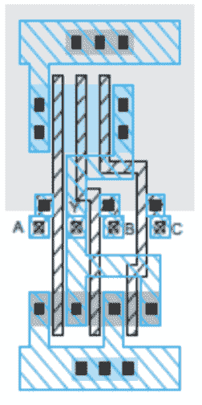

# 寒武纪 2019 秋招后端岗笔试（二）

## 1

温度升上，载流子输运速度

正确答案: B   你的答案: 空 (错误)

```cpp
变快
```

```cpp
变慢
```

本题知识点

Java 工程师 C++工程师 寒武纪 2019

## 2

对于一个 PN 结，如果反偏电压降低，耗尽区宽度将

正确答案: B   你的答案: 空 (错误)

```cpp
变宽
```

```cpp
变窄
```

本题知识点

Java 工程师 C++工程师 寒武纪 2019

## 3

天线效应是由于以下哪个 CMOS 工艺造成的

正确答案: D   你的答案: 空 (错误)

```cpp
退火
```

```cpp
CMP
```

```cpp
CVD
```

```cpp
RIE
```

本题知识点

Java 工程师 C++工程师 寒武纪 2019

讨论

[牛客 lsy](https://www.nowcoder.com/profile/530620499)

D 反应离子刻蚀。在[深亚微米集成电路](https://baike.baidu.com/item/%E6%B7%B1%E4%BA%9A%E5%BE%AE%E7%B1%B3%E9%9B%86%E6%88%90%E7%94%B5%E8%B7%AF/10509955)加工工艺中，经常使用了一种基于[等离子技术](https://baike.baidu.com/item/%E7%AD%89%E7%A6%BB%E5%AD%90%E6%8A%80%E6%9C%AF/1984455)的离子刻蚀工艺（plasma etching）。此种技术适应随着尺寸不断缩小，掩模刻蚀分辨率不断提高的要求。但在[蚀刻](https://baike.baidu.com/item/%E8%9A%80%E5%88%BB/5492484)过程中，会产生游离电荷，当[刻蚀](https://baike.baidu.com/item/%E5%88%BB%E8%9A%80/4678109)[导体](https://baike.baidu.com/item/%E5%AF%BC%E4%BD%93)（金属或多晶硅）的时候，裸露的导体表面就会收集游离电荷。所积累的电荷多少与其暴露在等离子束下的导体面积成正比。如果积累了电荷的导体直接连接到器件的[栅极](https://baike.baidu.com/item/%E6%A0%85%E6%9E%81/7029724)上，就会在多晶硅栅下的薄[氧化层](https://baike.baidu.com/item/%E6%B0%A7%E5%8C%96%E5%B1%82)形成 F-N [隧穿电流](https://baike.baidu.com/item/%E9%9A%A7%E7%A9%BF%E7%94%B5%E6%B5%81)泄放电荷，当积累的电荷超过一定数量时，这种 F-N 电流会损伤栅氧化层，从而使器件甚至整个芯片的可靠性和寿命严重的降低。在 F-N 泄放电流作用下，面积比较大的栅得到的损伤较小。因此，天线效应（Process Antenna Effect，PAE），又称之为“等离子导致栅氧损伤（plasma induced gate oxide damage，PID）”。

发表于 2021-08-13 16:51:22

* * *

## 4

STA 中，以下哪个 RC corner 会使得 cell delay 最大

正确答案: B   你的答案: 空 (错误)

```cpp
typical
```

```cpp
cworst
```

```cpp
cbest
```

```cpp
rcworst
```

```cpp
rcbest
```

本题知识点

Java 工程师 C++工程师 寒武纪 2019

## 5

STA 中，以下哪个 RC corner 会使得 wire delay 最大

正确答案: D   你的答案: 空 (错误)

```cpp
typical
```

```cpp
cworst
```

```cpp
cbest
```

```cpp
rcworst
```

```cpp
rcbest
```

本题知识点

Java 工程师 C++工程师 寒武纪 2019

## 6

请写出下面 layout 的输出， Y=___________

你的答案

本题知识点

Java 工程师 C++工程师 寒武纪 2019

## 7

a)请简述 pre-route 和 post-route timing report 的主要区别。b) 如果相同的 timing path 在 pre-route 时满足时序要求，在 post-route 时不满足时序要求，试分析可能的原因。c) 在 pre-route 时，可以采取哪些办法减少这种情况的发生。

你的答案

本题知识点

Java 工程师 C++工程师 寒武纪 2019

## 8

试列举先进工艺（16/14nm 及以下）采用了哪些新的技术，并分别说明这些技术解决了什么问题，对后端设计带来什么样的变化和新的挑战。

你的答案

本题知识点

Java 工程师 C++工程师 寒武纪 2019

## 9

a)请用 verilog 实现四选一输出（即，有 A,B,C,D 四个数据输入端口，S0，S1 为两个选择信号，Y 为输出端口，S0=0，S1=0，输出 A，S0=0，S1=1，输出 B，S0=1，S1=0 输出 C，S0=1，S1=1 输出 D）

b) 请用门级网表实现这一功能，可用的逻辑门包括，2 输入与非门 NAND，2 输入或非门 NOR，非门 INV

你的答案

本题知识点

Java 工程师 C++工程师 寒武纪 2019

讨论

[ZhaoSong](https://www.nowcoder.com/profile/633982557)

解答 a，直接的 case 语句

```cpp
module MUX (
	input wire S0, S1, 		// select
	input wire A, B, C, D, 	// data in
	output reg Y 			// data out
);
	// 写法一
	always @(*) begin
		case ({S1, S0})
			2'b00:	Y = A;
			2'b01:	Y = B;
			2'b10:	Y = C;
			2'b11:	Y = D; 
		endcase
	end
endmodule
```

解答 b，感觉自己写得很繁琐

```cpp
module MUX (     input wire S0, S1,         // select     input wire A, B, C, D,     // data in     output wire Y             // data out
);     wire nS0, nS1;     INV(nS0, S0);     INV(nS1, S1);     wire nS1_nS0;        NOR(nS1_nS0, S1, S0);     wire n__nS1_nS0_A;    NAND(n__nS1_nS0_A, nS1_nS0, A);     wire nS1_S0;        NOR(nS1_S0, S1, nS0);     wire n__nS1_S0_B;    NAND(n__nS1_S0_B, nS1_S0, B);     wire S1_nS0;        NOR(S1_nS0, nS1, S0);     wire n__S1_nS0_C;    NAND(n__S1_nS0_C, S1_nS0, C);     wire S1_S0;            NOR(nS1, nS0);     wire n__S1_S0_D;    NAND(n__S1_S0_D, S1_S0, D);          wire y0_or_y1;        NAND(y1_or_y2, n__nS1_nS0_A, n__nS1_S0_B);     wire y2_or_y3;        NAND(y2_or_y3, n__S1_nS0_C, n__S1_S0_D);     wire n__y0_or_y1;    INV(n__y0_or_y1, y0_or_y1);     wire n__y2_or_y3;    INV(n__y2_or_y3, yy2_or_y3);     NAND(Y, n__y0_or_y1, n__y0_or_y1);

endmodule

```

发表于 2021-03-13 20:49:23

* * *

[神奇波波](https://www.nowcoder.com/profile/938238613)

```cpp
always(*)begin
    case {s0,s1}
        2'b00: y = a;
        2'b01: y = b;
        2'b10: y = c;
        2'b11: y = d;
        default: y = 0;
end
```

主要部分这样更整齐一点

发表于 2020-06-14 17:30:48

* * *

[牛客 60026618 号](https://www.nowcoder.com/profile/60026618)

```cpp
module mux4_to_1_behavioral( output  reg Y,
                input A,B,C,D,
                input S0,S1
                );

always @(A,B,C,D,S0,S1)
if(!S0)
  begin
    if(S1==0)   
     Y=A;   
    else Y=B;
  end
else   if(S0==1)
  begin
    if(S1==0)
    Y=C;
    else Y=D;
  end
endmodule

module mux4_to_1_behavioral( output  reg Y,
                 input A,B,C,D,
                input S0,S1
                );
wire  a,b,c,d,S00;
nand n1(d,S0,S1),
     n2(b,S00,S1);
nor  n3(a,S0,S1);
not  n4(S00,S0);
always @(A,B,C,D,a,b,c,d)
  begin
    if(a==1)
        Y=A;
    else if(b==0) Y=B;
    else if(d==0) Y=D;
    else Y=C;
  end
endmodule 

module mux4_to_1_behavioral( output  Y,
                input A,B,C,D,
                input S0,S1
                );
assign Y=(S0&S1)?D:((S0&!S1)?C:((!S0&S1)?B:A));
endmodule
```

编辑于 2019-12-20 10:54:32

* * *

## 10

Clock jitter 是由于什么产生的？如何减小 clock jitter？如何测量 clock jitter？

你的答案

本题知识点

Java 工程师 C++工程师 寒武纪 2019

## 11

假如有 10000 个触发器，现在有两种门控时钟的方法，A:  100 个门控时钟，每个带 100 个触发器，B:  1000 个门控时钟，每个带 10 个触发器，两种方案均可使用 buffer，请列举两种方法的优劣，如何选择。

你的答案

本题知识点

Java 工程师 C++工程师 寒武纪 2019

## 12

一个 n 位十进制数(n <= 1000000)必定包含 1、2、3、4 四个数字，现在将它顺序重排，求给出一种方案，使得重排后的数是 7 的倍数。

你的答案

本题知识点

Java 工程师 C++工程师 寒武纪 2019

## 13

试证明，任意一个正整数 m 与它的十进制表示中的所有数码之差能被 9 整除

你的答案

本题知识点

Java 工程师 C++工程师 寒武纪 2019