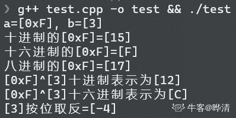
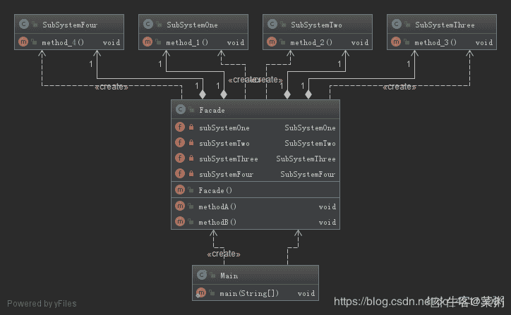

# 爱奇艺 2019 秋招 C 方向笔试题（A）

## 1

使用堆排序方法排序（45，78，57，25，41，89），初始堆为（      ）

正确答案: B   你的答案: 空 (错误)

```cpp
78,45,57,25,41,89
```

```cpp
89,78,57,25,41,45
```

```cpp
89,78,25,45,41,57
```

```cpp
89,45,78,41,57,25
```

本题知识点

排序 *讨论

[修改昵称失败](https://www.nowcoder.com/profile/947651)

首先建立完全二叉树
从最后一个叶子节点开始第一次交换了 57 和 89 的位置然后比较 45 和 89，进行交换
再比较换下来的 45，45 不符合大根堆，与 57 交换

发表于 2019-05-29 21:11:08

* * *

[叫我皮卡丘](https://www.nowcoder.com/profile/1078265)


发表于 2019-08-05 17:40:53

* * *

[牛客 ID：507639719](https://www.nowcoder.com/profile/507639719)

堆排序 (Heap sort) 就是利用堆(假设利用大顶堆)进行排序的方法 。基本思想是

1.  构建初始堆
2.  将根节点与末尾元素交换，进行堆构造（末尾元素不参与）
3.  重复 2 过程，直到“堆”仅剩 1 个元素。

```cpp
function HeapSort(arr) {
  arr = [0, ...arr]; // 方便左右子树表示
  //第一步，构建初始堆
  for (let i = ~~Math.length / 2; i > 0; i--) {
    buildHeap(arr, i, arr.length);
  }

  for (let i = arr.length; i > 1; i--) {
    // 交换
    [arr[1], arr[i - 1]] = [arr[i - 1], arr[1]];
    // 根元素与末尾元素交换，再构建大顶堆
    buildHeap(arr, 1, i - 1);
  }
  return arr.slice(1); // 移除添加的 0 元素
}

// 构造大顶堆
function buildHeap(arr, i, length) {
  let temp = arr[i];
  for (let j = 2 * i; j <= length; j *= 2) {
    if (arr[j] < arr[j + 1]) j++;
    if (temp > arr[j]) break;
    arr[i] = arr[j];
    i = j;
  }
  arr[i] = temp;
}

// ------- 测试
let arr = [3, 9, 5, 2, 6];
console.log(HeapSort(arr)); // [ 9, 5, 6, 2, 3 ]

arr = [5, 3, 9, 8, 3, 4];
console.log(HeapSort(arr)); // [ 8, 3, 3, 5, 9, 4 ]
```

发表于 2019-06-09 09:31:00

* * *

## 2

6 个圆盘的汉诺塔，总的移动次数是（      ）

正确答案: D   你的答案: 空 (错误)

```cpp
30
```

```cpp
33
```

```cpp
60
```

```cpp
63
```

本题知识点

递归

讨论

[Michael264](https://www.nowcoder.com/profile/54836329)

> **定义** Hanoi(n, a, b, c)：将 n 个盘子从 a 柱移到 c 柱，b 柱起中转作用。f(n)：n 个盘子的汉诺塔的总移动次数。

**Hanoi(n, a, b, c) = Hanoi(n-1, a, c, b) + 1 + Hanoi(n-1, b, a, c)**：将 a 上面 n-1 个盘子移到 b，再将 a 最下面的盘子移到 c，再将 b 上的 n-1 个盘子移到 c，此时，**n 盘子汉诺塔问题 **变成了**移****动一个盘子 + ****两个 n-1 盘子汉诺塔问题。**故 **f(n) = f(n-1) + 1 + f(n-1) = 2f(n-1) + 1****=> f(n) + 1 = 2(f(n-1) + 1) ****=> f(n) + 1 = 2^(n-1) (f(1) + 1)****=> f(n) + 1 = 2^n****=> f(n) = 2^n -1**

发表于 2019-08-14 19:29:51

* * *

[忽然间要很好](https://www.nowcoder.com/profile/587724363)

f(1)=1f(2)=3f(n)=2*f(n-1)+1 相当于借助 B 柱 将 A 柱上前 n-1 个盘先放在 B 柱上（f(n-1)），再挪最后一个盘到 c 盘(+1)，之后再挪 B 柱的 n-1 个盘到 C 柱（f(n-1)），递归循环。

发表于 2019-05-30 12:37:57

* * *

[问纤](https://www.nowcoder.com/profile/857851073)

2＾n - 1

发表于 2019-06-07 09:40:52

* * *

## 3

设哈希表长为 11，哈希函数为 Hash (key)=key%11。存在关键码{43,7,29,22,16,92,44,8,19}，采用二次探测法处理冲突，建立的 hash 表为（    ）

正确答案: B   你的答案: 空 (错误)

```cpp
其他几项都不对
```

本题知识点

安卓工程师 爱奇艺 C++工程师 iOS 工程师 Java 工程师 测试工程师 算法工程师 前端工程师 运维工程师 哈希 *2019 测试开发工程师 大数据开发工程师* *讨论

[冲上顶峰](https://www.nowcoder.com/profile/189892324)

解析：采用开放定址法处理冲突中的二次探测再散列（也即是题目中的二元探测法）,则哈希函数变为 Hash(key） = (Hash(key)  + d) % 11，其中 d = 1², -1², 2², -2², 3²,……，则开始计算。

对于 43，代入公式为 Hash(43) = 43 % 11 = 10, 则地址为 10；

对于 7，代入公式为 Hash(7) = 7 % 11 = 7,则地址为 7；

对于 29，代入公式为 Hash(29) = 29 % 11 = 7, 与 7 冲突，则采用二次探测进行消除冲突， 继续(7 + 1) % 11 = 8，没有冲突，则地址为 8；

对于 22，代入公式 Hash(22) = 22 % 11 = 0, 则地址为 0；

对于 16，代入公式 Hash(16) = 16 % 11 = 5, 则地址为 5；

对于 92，代入公式 Hash(92) = 92 % 11 = 4,则地址为 4；

对于 44，代入公式 Hash(44) = 44 % 11 = 0, 与 22 的地址冲突，则继续(0 + 1) % 11 = 1,没有冲突，则地址为 1；

对于 8， 代入公式 Hash(8) = 8 % 11 = 8, 与 29 有冲突，则继续(8 + 1) % 11 = 9, 没有冲突，则地址为 9；

对于 19，代入公式 Hash(19) = 19 % 11 = 8\. 与 29 有冲突，则继续(8 + 1) * 11 = 9, 与 8 有冲突，继续(8 - 1) % 11 = 7, 与 7 有冲突，则继续(8 + 4) % 11 = 1, 与 44 有冲突，则继续(8 - 4) % 11 = 4, 与 92 有冲突，则继续(8 + 9) % 11 = 6, 没有冲突，则地址为 6.

所以最后得到的 Hash 表为下图所示：


发表于 2019-06-01 19:33:14

* * *

[sugarhit](https://www.nowcoder.com/profile/598224351)

真的。字太小了。19 和 29 根本看不清

发表于 2019-08-20 15:36:44

* * *

[OKOKOKOKOK](https://www.nowcoder.com/profile/2857851)

二次探测法：设发生冲突的地址为 d，则新的地址序列为 d+1²,d-1²,d+2²,d-2²,...

发表于 2019-05-30 14:11:07

* * *

## 4

有关希尔排序算法叙述正确的是（      ）

正确答案: A B   你的答案: 空 (错误)

```cpp
最后一次的步长增量一定为 1
```

```cpp
分割后子序列内部的排序算法是直接插入排序
```

```cpp
分割后子序列内部的排序算法是直接选择排序
```

```cpp
希尔排序是稳定排序算法
```

本题知识点

安卓工程师 爱奇艺 C++工程师 iOS 工程师 Java 工程师 测试工程师 算法工程师 前端工程师 运维工程师 排序 *2019 测试开发工程师 大数据开发工程师* *讨论

[Yd。201906031539658](https://www.nowcoder.com/profile/907160213)

[Shell 排序](https://baike.baidu.com/item/Shell%E6%8E%92%E5%BA%8F)的执行时间依赖于[增量](https://baike.baidu.com/item/%E5%A2%9E%E9%87%8F)序列。好的[增量](https://baike.baidu.com/item/%E5%A2%9E%E9%87%8F)序列的共同特征：① 最后一个[增量](https://baike.baidu.com/item/%E5%A2%9E%E9%87%8F)必须为 1；② 应该尽量避免序列中的值(尤其是相邻的值)互为倍数的情况。有人通过大量的实验，给出了较好的结果：当 n 较大时，比较和移动的次数约在 nl.25 到 1.6n1.25 之间。2．Shell 排序的时间性能优于[直接插入排序](https://baike.baidu.com/item/%E7%9B%B4%E6%8E%A5%E6%8F%92%E5%85%A5%E6%8E%92%E5%BA%8F)希尔排序的时间性能优于[直接插入排序](https://baike.baidu.com/item/%E7%9B%B4%E6%8E%A5%E6%8F%92%E5%85%A5%E6%8E%92%E5%BA%8F)的原因：①当文件初态基本有序时[直接插入排序](https://baike.baidu.com/item/%E7%9B%B4%E6%8E%A5%E6%8F%92%E5%85%A5%E6%8E%92%E5%BA%8F)所需的比较和移动次数均较少。②当 n 值较小时，n 和  的差别也较小，即[直接插入排序](https://baike.baidu.com/item/%E7%9B%B4%E6%8E%A5%E6%8F%92%E5%85%A5%E6%8E%92%E5%BA%8F)的最好[时间复杂度](https://baike.baidu.com/item/%E6%97%B6%E9%97%B4%E5%A4%8D%E6%9D%82%E5%BA%A6)O(n)和最坏时间复杂度 0(  )差别不大。③在希尔排序开始时[增量](https://baike.baidu.com/item/%E5%A2%9E%E9%87%8F)较大，分组较多，每组的记录数目少，故各组内直接插入较快，后来增量 di 逐渐缩小，分组数逐渐减少，而各组的记录数目逐渐增多，但由于已经按 di-1 作为距离排过序，使文件较接近于有序状态，所以新的一趟排序过程也较快。因此，希尔排序在效率上较直接插入排序有较大的改进。

发表于 2019-06-03 16:49:08

* * *

[Zoe 小茗](https://www.nowcoder.com/profile/324939503)

排序最后一次则会对间隔为 1 的元素，也就是相邻元素执行标准插入排序。

发表于 2019-08-04 15:19:53

* * *

[Juventus-🐂](https://www.nowcoder.com/profile/79434593)

希尔排序的执行时间依赖于增量序列。最后一个增量必须为 1，时间性能优于直接插入排序。

发表于 2022-01-23 15:41:36

* * *

## 5

广义表 K=(m,n,(p,(q,s)),(h,f)),则 head[tail[head[tail[tail(K)]]]]的值为（      ）

正确答案: B   你的答案: 空 (错误)

```cpp
s
```

```cpp
q
```

```cpp
p
```

```cpp
h
```

本题知识点

安卓工程师 爱奇艺 C++工程师 iOS 工程师 Java 工程师 测试工程师 算法工程师 前端工程师 运维工程师 链表 *2019 测试开发工程师 大数据开发工程师* *讨论

[冲上顶峰](https://www.nowcoder.com/profile/189892324)

head() 返回列表的第一个元素；

tail() 返回列表的删去第一个元素之后的剩余列表；K=(m,n,(p,(q,s)),(h,f)),
head[tail[head[tail[tail(K)]]]]
tail(K)-------(n,(p,(q,s)),(h,f))tail[tail[K]]--------((p,(q,s)),(h,f))head()-----((p,(q,s))tail()-----(q,s)head()-------q

发表于 2019-06-01 19:30:59

* * *

[Astrallee](https://www.nowcoder.com/profile/376787917)

我为什么觉得是（p,s)啊，前面的 tail 也是按照这个思路来的。取到最后两个的时候是(p,(q,s))。 tail 一次 不应该是((q,s))吗

发表于 2019-12-06 23:33:27

* * *

[OKOKOKOKOK](https://www.nowcoder.com/profile/2857851)

从最里层括号一直向外计算。head(a,b)：保留括号第一个元素 a，去除其余 tail(a,b)：去除第一个元素 a，保留其余

发表于 2019-05-30 14:16:30

* * *

## 6

在一个空的 5 阶 B-树中依次插入关键字序列{6,8,15,16,22,10,18,32,20}，插入完成后，关键字 6 所在结点包含的关键字个数为（      ）

正确答案: B   你的答案: 空 (错误)

```cpp
2
```

```cpp
3
```

```cpp
4
```

```cpp
5
```

本题知识点

爱奇艺 树 2019

讨论

[newcomer](https://www.nowcoder.com/profile/291053)

一颗 m 阶 B 树，非叶节点至多可以有 m-1 个关键字，至少可以有 ceil(n/2)-1 个，根节点可以至少有一个关键字。根据这个原则，可以画出 5 阶 B 树的构建过程，如下图所示：

编辑于 2019-07-03 10:22:34

* * *

[漫步云端.](https://www.nowcoder.com/profile/478154402)

这篇博客写的挺好[`blog.csdn.net/li_canhui/article/details/85305147`](https://blog.csdn.net/li_canhui/article/details/85305147)

发表于 2019-08-28 21:36:48

* * *

[默默学习的啦啦啦](https://www.nowcoder.com/profile/146773881)

n 阶 B-树，每个结点中关键字个数范围为 ceil(n/2) - 1 ~ n-1 个，因此为 2-4 个，插入时首先插入 6,8,15,16；再插入 22 时结点个数大于 4，因此取 15 为中间结点拆分，变成 15 - (6,8),(16,22)，继续插入 10,18,32 变成 15 - (6,8,10),(16,18,22,32)，再插入 20 时结点个数大于 4，取 20 为中间结点拆分，合并到根节点上变为(15,20) - (6,8,10),(16,18),(22,32)

编辑于 2019-05-31 09:42:32

* * *

## 7

在求两个集合并集的过程中，可能需用到的操作是（      ）  

正确答案: A B C D   你的答案: 空 (错误)

```cpp
取元素
```

```cpp
插入元素
```

```cpp
比较操作
```

```cpp
求表长
```

本题知识点

安卓工程师 爱奇艺 C++工程师 iOS 工程师 Java 工程师 测试工程师 算法工程师 前端工程师 运维工程师 哈希 *2019 测试开发工程师 大数据开发工程师* *讨论

[叫我皮卡丘](https://www.nowcoder.com/profile/1078265)

需求：求两个集合的并集 1\. 取元素，至少得知道集合存的是啥元素 2\. 插入元素，并集可能存在集合 A 中有而集合 B 中无的元素，需要插入到新的集合中 3\. 比较操作，判断是否相等 4\. 求表长，完整遍历

发表于 2019-08-05 17:54:29

* * *

[拾陆 humin](https://www.nowcoder.com/profile/334013855)

联想 归并排序

发表于 2019-06-13 18:51:00

* * *

[冲上顶峰](https://www.nowcoder.com/profile/189892324)

还需要求表长

发表于 2019-06-01 19:27:00

* * *

## 8

TCP 协议与 UDP 协议负责端到端连接，下列那些信息只出现在 TCP 报文，UDP 报文不包含此信息（      ）

正确答案: A D   你的答案: 空 (错误)

```cpp
序列号
```

```cpp
源端口
```

```cpp
目标端口
```

```cpp
窗口大小
```

本题知识点

安卓工程师 爱奇艺 C++工程师 iOS 工程师 Java 工程师 测试工程师 算法工程师 前端工程师 运维工程师 网络基础 2019 测试开发工程师 大数据开发工程师

讨论

[叫我皮卡丘](https://www.nowcoder.com/profile/1078265)

UDP 头部信息只有 4 个，从哪来：源端口到哪去：目的端口有多长：长度对不对：校验和

发表于 2019-08-05 18:13:13

* * *

[冲上顶峰](https://www.nowcoder.com/profile/189892324)

[`www.cnblogs.com/steven520213/p/8005258.html`](https://www.cnblogs.com/steven520213/p/8005258.html)**UDP****的包头结构：**
    源端口 16 位
    目的端口 16 位
    长度 16 位
    校验和 16 位

发表于 2019-06-01 19:41:07

* * *

[newcomer](https://www.nowcoder.com/profile/291053)

TCP 与 UDP 最大的不同就是前者是可靠传输，后者是不可靠的。为了保证可靠传输，TCP 采用了一系列机制，比如序列号是指客户端确认序列号以及以前的信息都收到了，窗口大小则是提高传输效率，保证信息按序到达。这些很明显 UDP 是没有的。

发表于 2019-07-03 09:09:53

* * *

## 9

程序员编写程序时使用文件系统提供的系统调用将内存中由 address 地址开始的 n 个字节或 n 个记录的信息写入指定文件中，但发现文件名不可用，可行的解决办法是（）

正确答案: A B   你的答案: 空 (错误)

```cpp
使用文件描述符代替文件名
```

```cpp
使用文件句柄代替文件名
```

```cpp
使用当前进程的 PCB 编号代替
```

```cpp
以上办法都不可行
```

本题知识点

安卓工程师 爱奇艺 C++工程师 iOS 工程师 Java 工程师 测试工程师 算法工程师 前端工程师 运维工程师 操作系统 2019 测试开发工程师 大数据开发工程师

讨论

[dylmail](https://www.nowcoder.com/profile/501837184)

**无论是文件句柄（Windows 中概念），还是文件描述符（linux 中概念），其最终目的都是用来定位打开的文件在内存中的位置，只是它们映射的方式不一样。****PCB（进程控制块）在 linux 中具体实现是 task_struct 数据结构，这些进程必须要有唯一标识符，所以里面含有 pid（进程 ID）**

发表于 2020-06-30 17:24:38

* * *

[360 公司内推小助手](https://www.nowcoder.com/profile/385100296)

文件句柄与文件描述符 [`www.cnblogs.com/ChunJian-YANG/p/5322041.html`](https://www.cnblogs.com/ChunJian-YANG/p/5322041.html)

发表于 2019-06-03 15:27:55

* * *

## 10

某软件公司正在升级一套水务管理系统。该系统用于县市级供排水企业、供水厂、排水厂中水务数据的管理工作。系统经重新整合后，开发人员决定不再使用一张备份数据表 waterinfo001 表，需永久删除。选出符合要求的语句。 

正确答案: C   你的答案: 空 (错误)

```cpp
DELETE TABLE waterinfo001
```

```cpp
DELETE FROM TABLE waterinfo001
```

```cpp
DROP TABLE waterinfo001
```

```cpp
DROP FROM TABLE waterinfo001
```

本题知识点

安卓工程师 爱奇艺 C++工程师 iOS 工程师 Java 工程师 测试工程师 算法工程师 前端工程师 运维工程师 数据库 SQL 2019 测试开发工程师 大数据开发工程师

讨论

[夏花爱秋叶](https://www.nowcoder.com/profile/4085682)

```cpp
1. drop 是完全删除表，包括表结构
2. delete 是删除表数据，保留表的结构，而且可以加 where,只删除一行或者多行
3. truncate 只能删除表数据，会保留表结构，而且不能加 where

```

发表于 2020-03-11 11:37:04

* * *

[叫我皮卡丘](https://www.nowcoder.com/profile/1078265)

DELETE FROM waterinfo001;清除 waterinfo001 表全部记录 DROP TABLE waterinfo001;删除 waterinfo001 表

编辑于 2019-11-07 08:05:54

* * *

[fighting.java](https://www.nowcoder.com/profile/543231756)

| 1. drop 是完全删除表，包括表结构 2. delete 是删除表数据，保留表的结构，而且可以加 where,只删除一行或者多行 3. truncate 只能删除表数据，会保留表结构，而且不能加 where |

发表于 2020-04-29 20:33:49

* * *

## 11

下面程序的输出结果是（）

```cpp
#include<iostream>
using namespace std;
class ClassA {
    friend long fun (ClassA a) {
        if (a.i < 2) return 1;
        return a.i * fun(ClassA(a.i-1));
    }
public:
    ClassA(long a) { i = a; }
private:
    long i;
};

int main() {
    int sum = 0;
    for (int i = 0; i < 4; i++) {
        sum += fun(ClassA(i));
    }
    cout << sum;
}
```

正确答案: A   你的答案: 空 (错误)

```cpp
10
```

```cpp
12
```

```cpp
16
```

```cpp
34
```

本题知识点

C++工程师 爱奇艺 C++ 2019 C 语言

讨论

[Zzzzzzzzzy](https://www.nowcoder.com/profile/218201376)

直白的说法： 若进入递归的数 x 小于 2，则返回 1，若进入递归的数 x 大于等于 2，则返回 x*f(x-1)

发表于 2019-07-16 11:31:23

* * *

[#请叫我尹小慧~~](https://www.nowcoder.com/profile/320706752)

friend long fun (ClassA a)
    {
        if (a.i < 2) return 1;
        return a.i * fun(ClassA(a.i-1));
    }Class A(i)->a.i = i;func(0)=1func(1)=1   func(2)=2*func(1)=2*1func(3)=3*func(2)=3*2*1 其实这就是一个递归题，func（i）i==0 || i==1,func(i)=1;i>=2,func(i)=i*(i-1)*..* 1

发表于 2019-06-04 21:01:17

* * *

[Qofter](https://www.nowcoder.com/profile/408155192)

i = 0, sum = 0+1;i = 1, sum = 0+1+1;i = 2, sum = 0+1+1+2*1;i = 3, sum = 0+1+1+2*1+3*2;   //10

发表于 2020-10-28 13:11:28

* * *

## 12

要使 a 的低四位翻转，需要进行操作是（）

正确答案: C   你的答案: 空 (错误)

```cpp
a|0xF
```

```cpp
a&0xF
```

```cpp
a⁰xF
```

```cpp
~a
```

本题知识点

C++工程师 爱奇艺 C++ 2019 C 语言

讨论

[牛客 1465584 号](https://www.nowcoder.com/profile/1465584)

0x 开头为 16 进制，0xf 对应的二进制数为 1111。**^为异或操作，若参加运算的两个二进制位值相同则为 0，否则为 1；**a 与 0xf 做异或操作，可以实现低四位的翻转。如果是| 按位或 ，则将低四位数全变成 1.
如果是& 按位与，则结果不变。其他的位运算符号：
& 按位与 如果两个相应的二进制位都为 1，则该位的结果值为 1，否则为 0| 按位或 两个相应的二进制位中只要有一个为 1，该位的结果值为 1
^ 按位异或 若参加运算的两个二进制位值相同则为 0，否则为 1
~ 取反 ~是一元运算符，用来对一个二进制数按位取反，即将 0 变 1，将 1 变 0
<< 左移 用来将一个数的各二进制位全部左移 N 位，右补 0
>> 右移 将一个数的各二进制位右移 N 位，移到右端的低位被舍弃，对于无符号数，高位补 0

发表于 2019-08-26 14:43:52

* * *

[晔清](https://www.nowcoder.com/profile/9091701)

主要研究为什么选 C 不选 D，因为他俩都能实现按位翻转。关键在于该题只需要低四位翻转。假设 int a = 3; 二进制表示为 00000000 00000000 00000000 00000011 低四位就是 0011, 需要将其翻转为 1100，选项 A 为按位或运算, 有一个为 1 即为 1，得到的结果是低四位=1111,不能实现按位翻转。选项 B 为按位与运算，都为 1 才为 1，得到的结果是低四位=0011,不能实现按位翻转。选项 C 为按位异或运算，不同为 1 相同为 0，可以通过与 0xF 异或的方式翻转低四位，a=3 的二进制表示 00000000 00000000 00000000 000000110xF 的二进制表示 00000000 00000000 00000000 00001111 (具体可以通过右移运算符判断>>4 = 0)异或后只翻转低四位。3 ^ 0xF = 00000000 00000000 00000000 00001100
选项 D 的关键在于其只进行了按位取反操作，会对 a 的所有位都进行按位取反操作，a = 00000000 00000000 00000000 00000011
~a = 11111111 11111111 11111111 11111100 该二进制表示的是以补码形式表示的负数-4 正数不需要进行按位取反加 1 的操作，其原码=反码=补码。只有负数才需要这样做。假设我们现在有一个补码表示的负数，我们要想知道其原码为多少，可以对补码进行除符号位外按位取反再加 1 的操作。~a = 11111111 11111111 11111111 11111100     = 10000000 00000000 00000000 00000011     = 10000000 00000000 00000000 00000100     =  (-4)因此 D 选项不光翻转了低四位，是翻转了每一位。所以选 C。

```cpp
#include <cstdio>
#include <cstdlib>
#include <cstring>

int main()
{
        int a = 0xF, b = 3;

        printf("a=[0x%X], b=[%d]\n", a, b);

        printf("十进制的[0xF]=[%d]\n", a);
        printf("十六进制的[0xF]=[%0X]\n", a);
        printf("八进制的[0xF]=[%0o]\n", a);

        printf("[0xF]^[3]十进制表示为[%d]\n", a ^ b);
        printf("[0xF]^[3]十六进制表示为[%X]\n", a ^ b);
        printf("[%d]按位取反=[%d]\n", b, ~b);

        return 0;
}
```



编辑于 2022-03-13 12:14:55

* * *

[拖拉机嘟嘟嘟](https://www.nowcoder.com/profile/117252758)

与低四位进行抑或操作（ ^）例如 0101 ^ 1111=1010，实现翻转

发表于 2019-08-17 12:00:29

* * *

## 13

下列程序输出的 * 个数是（）

```cpp
class Point {
public:
    Point(int xx = 0, int yy = 0) {
        X = xx;
        Y = yy;
    }
    Point(Point &p) {
        X = p.X;
        Y = p.Y;
        cout << "*";
    }
private:
    int X, Y;
};

class Line {
public:
    Line(Point xp1, Point xp2) : p1(xp1), p2(xp2) {}
private:
    Point p1, p2;
};
```

正确答案: D   你的答案: 空 (错误)

```cpp
1
```

```cpp
2
```

```cpp
3
```

```cpp
4
```

本题知识点

C++工程师 爱奇艺 C++ 2019 C 语言

讨论

[Lyapunov 小威](https://www.nowcoder.com/profile/139432617)

Line (Point xp1, Point xp2):p1(xp1),p2(xp2)中使用的是传值，myp1 和 myp2 传值给 xp1，xp2 时使用了两次复制构造函数.p1(xp1),p2(xp2)又使用了两次，因此一共是四次。

发表于 2019-08-09 23:01:05

* * *

[FingWin](https://www.nowcoder.com/profile/411583492)

这题是考关于拷贝构造函数的调用，有 3 种情况：1、当用一个对象对初始化另一个对象时，系统会自动调用，如：Base b1 = b2；2、当类对象作为实参，值传递时，系统会自动调用，如 func（p1）；这里会调用拷贝构造函数，按照参数的值构造一个临时对象，这个临时对象仅仅在该函数执行时存在，在函数执行结束之后，调用析构函数，引用传递和指针传递是不会调用任何构造函数的。3、当函数的返回值是类对象时，如 return p1；

发表于 2020-03-04 21:06:22

* * *

[不要白菜](https://www.nowcoder.com/profile/242392442)

传值操作会调用拷贝构造函数 所以是四次，如果是传引用的话就是两次。 Line (Point &xp1, Point &xp2):p1(xp1),p2(xp2)
        {}

发表于 2019-05-30 17:04:51

* * *

## 14

下列程序的运行结果是 1，横线处应当填入的代码为（）

```cpp
#include <iostream>
using namespace std;

class B;
class A {
    friend class B;
public:
    void Display() {
        cout << x << endl;
    }
private:
    int x;
};

class B {
public:
    void Set(int i) { ____ = i; }
    void Display() { a.Display(); }
private:
    A a;
};

int main() {
    B b;
    b.Set(1);
    b.Display();
    return 0;
}
```

正确答案: C   你的答案: 空 (错误)

```cpp
A::x
```

```cpp
A.x
```

```cpp
a.x
```

```cpp
x
```

本题知识点

C++工程师 爱奇艺 C++ 2019

讨论

[OrientObjectPro](https://www.nowcoder.com/profile/3143319)

友元只能通过某具体对象访问所有的数据成员

发表于 2019-08-08 22:35:21

* * *

[牛顿吃苹果](https://www.nowcoder.com/profile/7873039)

横线在哪里

发表于 2022-01-03 17:22:58

* * *

[logic/](https://www.nowcoder.com/profile/831086303)

排版反人类。。。

发表于 2021-07-19 15:33:10

* * *

## 15

下列程序的运行结果是（）

```cpp
class A {
public:
    void f() {
        cout << "A::f()";
    }
};

class B: public A {
public:
    void f() {
        cout << "B::f()";
    }
};
int main() {
    B b;
    b.f();
    return 0;
}
```

正确答案: C   你的答案: 空 (错误)

```cpp
A::f()
```

```cpp
A::f()B::f()
```

```cpp
B::f()
```

```cpp
B::f()A::f()
```

本题知识点

C++工程师 爱奇艺 C++ 2019

讨论

[拖拉机嘟嘟嘟](https://www.nowcoder.com/profile/117252758)

如果子类的函数与父类的名称相同，但是参数不同，父类函数被隐藏（重定义）

如果子类函数与父类函数的名称相同&&参数也相同&&但是父类函数没有 virtual，父类函数被隐藏

如果子类函数与父类函数的名称相同&&参数也相同&&但是父类函数有 virtual，父类函数被覆盖（重写）转自：[`www.cnblogs.com/cdp1591652208/p/7748546.html`](https://www.cnblogs.com/cdp1591652208/p/7748546.html)

编辑于 2019-08-17 12:04:57

* * *

[MathildaChan](https://www.nowcoder.com/profile/3875262)

跟构造函数的执行顺序不同。注意区分！

发表于 2020-05-10 10:35:27

* * *

[牛客 346787623 号](https://www.nowcoder.com/profile/346787623)

本题选错的可能会选到 A 选项，这和下面的情况混淆了，如果是下面那样，那么就是选 A

```cpp
int main() {
    B b;
    A &p = b;
    p.f();            // 此时因为 A 中没有将 f 声明为虚函数，那么就会调用 A 中的 fun 函数
    return 0;
}
```

而本题，是将 A 中的成员方法给隐藏了

发表于 2022-03-12 14:59:31

* * *

## 16

在 C++里，同一个模板的声明和定义是不能在不同文件中分别放置的，否则会报编译错误。为了解决这个问题，可以采取以下办法有（）

正确答案: A B C   你的答案: 空 (错误)

```cpp
模板的声明和定义都放在一个.h 文件中。
```

```cpp
模板的声明和定义可以分别放在.h 和.cpp 文件中，在使用的地方，引用定义該模板的 cpp 文件。
```

```cpp
使用 export 使模板的声明实现分离。
```

```cpp
以上说法都不对
```

本题知识点

C++工程师 爱奇艺 C++ 2019

讨论

[God~Like](https://www.nowcoder.com/profile/8390058)

解释一下 B 选项，模板的声明和定义不能分别单独的放在.h 和.cpp 文件中的原因是当实例化一个模板时，编译器必须看到模板确切的定义，而不仅仅是它的声明。若在 main()函数中包含.h 文件，则编译器无法知道模板的确切定义，**所以要在 main()中包含.cpp 文件，.cpp 文件中又会包含.h 文件，这样一来通过在 main 函数中包含.cpp 文件就会将类的定义和声明都包含进来，编译器自然能找到模板的确切定义。**（在 main 函数中引用）。

编辑于 2019-08-06 10:04:12

* * *

[兵小冰](https://www.nowcoder.com/profile/137704303)

《C++ Template》第六章讲过这个问题
组织模板代码有三种方式
1.包含模型（常规写法 将实现写在头文件中）
2.显式实例化（实现写在 cpp 文件中，使用 template class 语法进行显式实例化）
3.分离模型（使用 C++ export 关键字声明导出）

第三种方式理论最优，但是实际从 C++标准提出之后主流编译器没有支持过，并且在最新的 C++11 标准中已经废除此特性，export 关键字保留待用。
那么实际上能够使用的实现分离也就只有显式实例化

比较有意思的是，《C++ Template》书中作者建议代码为分离模型做准备，等待编译器支持之后替换，没想到最终这个特性被 C++标准废弃了。
作者：唐沂
链接：[`www.zhihu.com/question/20630104/answer/80220897`](https://www.zhihu.com/question/20630104/answer/80220897)
来源：知乎
著作权归作者所有。商业转载请联系作者获得授权，非商业转载请注明出处。

发表于 2021-02-06 18:27:45

* * *

[爱上 IT](https://www.nowcoder.com/profile/90066846)

```cpp
使用 export 使模板的声明实现分离。这句话啥意思啊，不太懂。
```

发表于 2021-03-29 01:56:53

* * *

## 17

如下代码：

```cpp
int arr[8] = {1,6,3,3,8,0,7,4};
int *p = arr;
```

下面答案中能够正确输出全部偶数的是（）

正确答案: A B C   你的答案: 空 (错误)

```cpp
for(int i=0; i<8; i++)
    if(arr[i] % 2 == 0)
printf("%d", arr[i]);
```

```cpp
for(int i=0; i<8; i++)
    if(p[i] % 2 == 0)
printf("%d", p[i]);
```

```cpp
int i=0;
while(i<8){
    if(*(p+i) % 2 == 0)
    printf("%d", *(p+i));
    i++;
}
```

```cpp
int i=0;
while(i<8){
    if((arr+i) % 2 == 0)
    printf("%d", arr+i);
    i++;
}
```

本题知识点

C++工程师 爱奇艺 C++ 2019 C 语言

讨论

[牛客 725813083 号](https://www.nowcoder.com/profile/725813083)

排版***醉了

发表于 2021-02-22 03:27:51

* * *

[XITman](https://www.nowcoder.com/profile/627872815)

D 错误的原因是（arr+i）%2 arr 里是一个地址（表示的是数组的第一个元素的地址）arr+i 是第 i 个元素的地址，直接拿地址%2 是错误的，应该*（arr+i）%2 然后输出也是一样要解引用它的值，这 2 点改掉就是正确的。正确代码如下：

```cpp
int i=0;
while(i<8)
{
if(*(arr+i) % 2 == 0)
printf("%d", *arr+i);
i++;
}
```

发表于 2020-07-21 15:26:23

* * *

[山火水](https://www.nowcoder.com/profile/298900)

A 和 B 都是什么玩意，iif 又是什么东西，题目出成这样也太菜了

发表于 2020-09-24 07:32:39

* * *

## 18

下列程序段的功能是将 2~n 的质数放入向量 A 中，请将横线处缺失程序补充完整（）

```cpp
vector<int>  A(10); 
 int n; 
 int count = 0, i, j;
 cin >> n;
 A.reserve(n);
 A[count++] = 2; 
 for(i = 3; i < n; i++)
 { if (i % 2 == 0)
 ;
 j = 3;
 while (j <= i/2 && i % j != 0)
 j += 2; 
 if (j > i/2) A[count++] = i;
 }
```

正确答案: A   你的答案: 空 (错误)

```cpp
continue
```

```cpp
break
```

```cpp
count++
```

```cpp
j++
```

本题知识点

C++工程师 爱奇艺 iOS 工程师 Java 工程师 测试工程师 算法工程师 C++ 2019 大数据开发工程师

讨论

[将大局逆转吧！](https://www.nowcoder.com/profile/609448954)

横线在哪

发表于 2019-08-09 10:23:12

* * *

[拿着菜刀的白菜](https://www.nowcoder.com/profile/3502052)

where is the line....baby

发表于 2019-08-24 09:35:21

* * *

[我的天鸭](https://www.nowcoder.com/profile/243498)

这题的程序其实有点问题，reserve 不会创建元素，是不能通过 [ ] 进行引用的，如果拿这个程序去编译，不出意外的话只能索引到 vector 中的前 10 个质数如果要修改，可以把 reserve 换成 resize，或者将 [ ] 改为 insert/push_back

发表于 2019-08-06 14:48:43

* * *

## 19

下图的 UML 类结构图表示的是哪种设计模式？

正确答案: D   你的答案: 空 (错误)

```cpp
解释器模式
```

```cpp
装饰模式
```

```cpp
桥接模式
```

```cpp
责任链模式
```

本题知识点

C++工程师 爱奇艺 Java 工程师 设计模式 2019

讨论

[LYcreate](https://www.nowcoder.com/profile/625552701)

题中的 UML 类图不够详细，所以让人难以判断。具体的图看这边：[`c.biancheng.net/view/1383.html`](http://c.biancheng.net/view/1383.html)

发表于 2019-09-08 14:15:56

* * *

[菜粥](https://www.nowcoder.com/profile/5293318)

**责任链模式** 又称为 **职责链模式**

职责链模式 UML 图（IDEA 自动生成）


大话设计模式-职责链模式

[`localhost.blog.csdn.net/article/details/90202435`](https://localhost.blog.csdn.net/article/details/90202435)

大话设计模式-系列文章(共 50 篇)：

[`blog.csdn.net/qq_41113081/category_8723350.html`](https://blog.csdn.net/qq_41113081/category_8723350.html)

发表于 2020-03-25 00:08:41

* * *

[闲鱼总算翻了身](https://www.nowcoder.com/profile/909589300)

责任链模式又称为职责链模式

发表于 2021-07-31 13:57:43

* * *

## 20

下列描述中，哪些是外观模式的特点（      ）

正确答案: A C D   你的答案: 空 (错误)

```cpp
对客户端屏蔽了子系统组件
```

```cpp
实现了子系统与客户端之间的紧耦合关系
```

```cpp
单个子系统的修改不影响其他子系统
```

```cpp
子系统类变化时，只需要修改外观类即可
```

本题知识点

C++工程师 爱奇艺 Java 工程师 设计模式 2019

讨论

[菜粥](https://www.nowcoder.com/profile/5293318)

外观模式

*   把子系统的功能封装到一个类里，对外只提供这一个类，适合于老系统对外提供接口
    

大话设计模式-外观模式：

[`localhost.blog.csdn.net/article/details/89139360`](https://localhost.blog.csdn.net/article/details/89139360)

大话设计模式-系列文章(共 50 篇)：

[`blog.csdn.net/qq_41113081/category_8723350.html`](https://blog.csdn.net/qq_41113081/category_8723350.html)

发表于 2020-03-25 00:16:24

* * ******