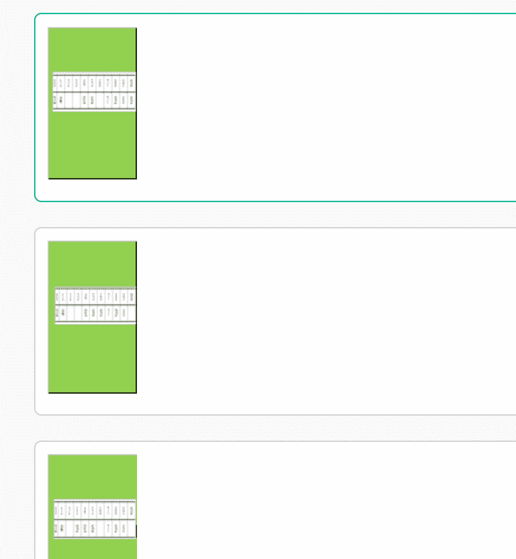
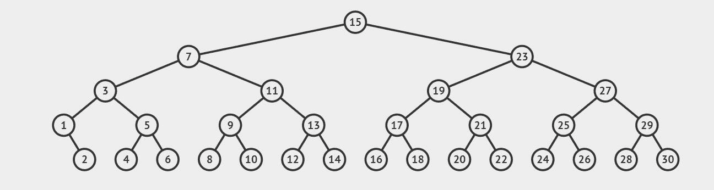
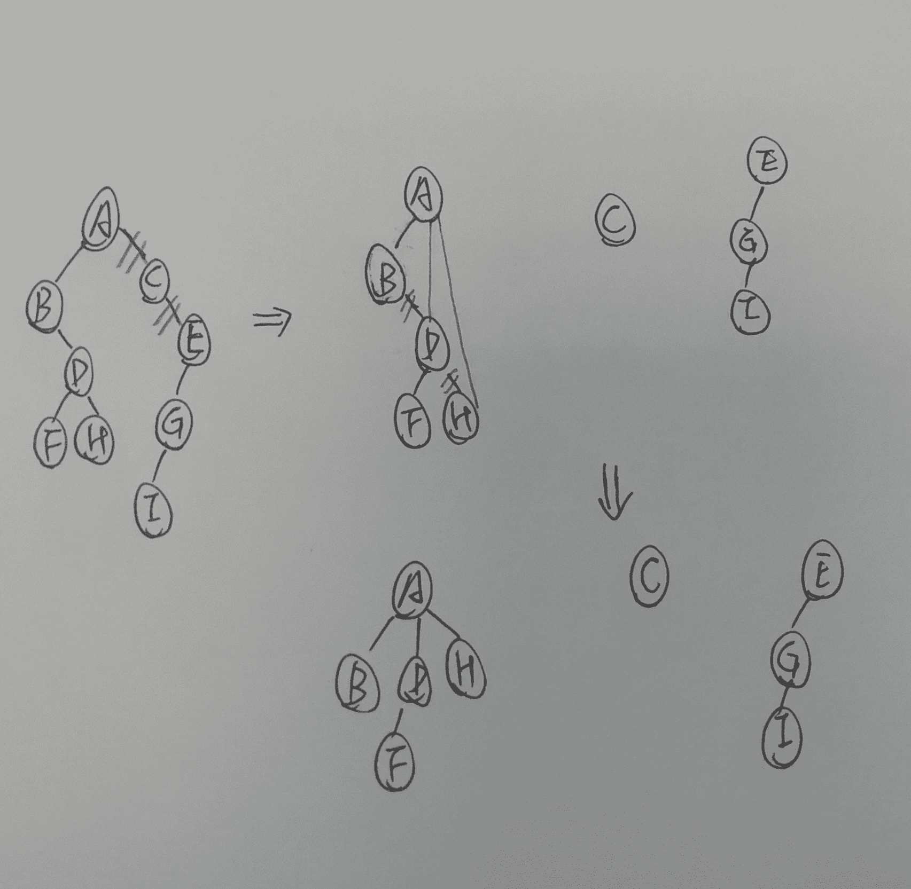
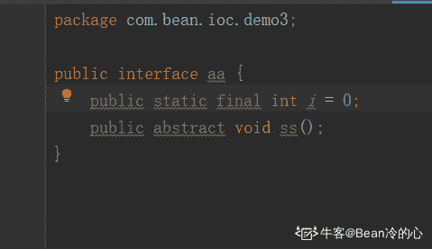
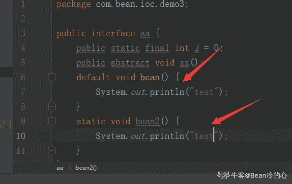
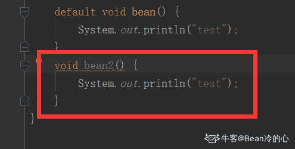

# 爱奇艺 2019 秋招 Android 方向笔试题（B）

## 1

某学生信息表，设一组表示成绩的关键字序列(24,15,32,28,19,10,40)采用直接插入排序时，当插入记录 19 到有序表时，为找插入位置需比较次数为（      ）

正确答案: C   你的答案: 空 (错误)

```cpp
2
```

```cpp
3
```

```cpp
4
```

```cpp
5
```

本题知识点

排序 *讨论

[铜豌豆 183](https://www.nowcoder.com/profile/7553292)

插入排序是从后往前比的   所以  15 24 28 32 的比较方向是   32->28->24->15

发表于 2019-05-31 21:34:13

* * *

[包子 10086](https://www.nowcoder.com/profile/4034573)

直接插入排序(straight insertion sort)的做法是：每次从无序表中取出第一个元素，把它插入到有序表的合适位置，使有序表仍然有序。
大概是：24 直接放进去                                                                                     24
第一趟   15 比 24 小放到 24 前面，比较 1 次                                                 15    24 第二趟   32 比 24 大放 24 后面，比较 1 次                                                     15    24     32 第三趟   28 比 32 小，比 24 大，比较 2 次                                                     15   24     28     32 第四趟，19 比 32 小，比 28 小，比 24 小，比 15 大，比较 4 次                       15    19    24     28    32

发表于 2019-06-06 20:29:30

* * *

[plzGEtoUtofmYHEAD](https://www.nowcoder.com/profile/1251387)

做对这题需要明白插入排序的过程，当插 19 的时候，前面四个元素都已经是有序的了，在表中是 15 24 28 32，然后 19 需要开始跟 32 比，比 32 小，说明要放到 32 前面，再跟 28 比，同理跟 24 比，然后跟 15 比，比 15 大，就要放到 15 后面。所以比较了四次

发表于 2019-06-23 16:52:32

* * *

## 2

A、B、C、D、E、F 依次入栈，其出栈顺序为 B、D、C、F、E、A，则该栈最小容量为（      ）

正确答案: D   你的答案: 空 (错误)

```cpp
6
```

```cpp
5
```

```cpp
4
```

```cpp
3
```

本题知识点

安卓工程师 爱奇艺 C++工程师 iOS 工程师 Java 工程师 算法工程师 前端工程师 运维工程师 栈 *队列 *2019 测试开发工程师 大数据开发工程师** **讨论

[包子 10086](https://www.nowcoder.com/profile/4034573)

A B                            ---B 出   C  D                       ---D C 出   E  F                       ----F E 出                                ----A 出所以是 3

发表于 2019-06-06 20:32:05

* * *

[688](https://www.nowcoder.com/profile/625142838)

A B 进栈
B 出栈
C D 进栈  出栈  此时出栈 B D C
F E 进栈  依次出完栈：F E A
所以  最少 3

发表于 2019-05-31 19:16:55

* * *

## 3

设哈希表长为 11，哈希函数为 Hash (key)=key%11。存在关键码{7,29,22,16,92,44,8,19}，采用线性探测法处理冲突，建立的 hash 表为（    ）

正确答案: A   你的答案: 空 (错误)

```cpp
其他几项都不对
```

本题知识点

安卓工程师 爱奇艺 C++工程师 iOS 工程师 Java 工程师 测试工程师 算法工程师 前端工程师 运维工程师 哈希 *2019 测试开发工程师 大数据开发工程师* *讨论

[牛仙儿](https://www.nowcoder.com/profile/510479121)

请问哪来的 15 和 43，有这两个关键字吗，请让出题人解答一下这个问题

发表于 2019-11-06 12:50:09

* * *

[Dloading](https://www.nowcoder.com/profile/8974581)

为难我？？?

发表于 2019-06-18 17:21:14

* * *

[牛客 ID：507639719](https://www.nowcoder.com/profile/507639719)

根据哈希函数及处理冲突的方法将各元素存储在一段有限的连续空间中，即得到哈希表。

处理冲突，即根据哈希函数得到的哈希地址已经被占用，则按照一定规则求下一个哈希地址，如此反复。

线性探测法是处理冲突的一种方法。如果地址已被占用，就探查下一个紧挨着的地址，如果还是不能用，就探查下一个紧挨着的地址，如此反复。到达数组的末尾，就回到数组的开头，如果探查了 m 次还是没有空位，说明数组已经满了。

本题过程：

1.  7 根据哈希函数，放在散列表序号 7 位置上
2.  29 根据哈希函数，需要放在 7 位置，发送冲突，查找下一个位置是否为空，8 位置是空的，29 放在 8 位置

重复这个思路

发表于 2019-06-07 10:22:20

* * *

## 4

下列哪些算法在排序过程中需要一个记录的辅助空间（      ）

正确答案: A B C   你的答案: 空 (错误)

```cpp
直接选择排序
```

```cpp
直接插入排序
```

```cpp
冒泡排序
```

```cpp
归并排序
```

本题知识点

安卓工程师 爱奇艺 C++工程师 iOS 工程师 Java 工程师 测试工程师 算法工程师 前端工程师 运维工程师 排序 *2019 测试开发工程师 大数据开发工程师* *讨论

[叫我皮卡丘](https://www.nowcoder.com/profile/1078265)

*   直接选择排序：前面逐渐有序，每次从后面的无序数列中找最大或最小继续添加到前面有序数列中，两两交换需要一个辅助空间
*   直接插入排序：类似打斗地主，每次抓一张牌，从后往前比较，把新抓的牌放到合适大小的位置，两两交换需要一个辅助空间
*   冒泡排序：每次把当前无序数列中最大或最小的数交换到此无序数量的最后，两两交换需要一个辅助空间
*   归并排序：分治法把当前待排数组分成多个子序列，先使每个子序列有序，再使子序列段间有序，需要 O(n) 的辅助空间

发表于 2019-08-06 20:25:41

* * *

[o 小菜](https://www.nowcoder.com/profile/733670437)

一个记录的辅助空间   指的是 O（1）的空间？我以为是需要一个用来记录的辅助空间 O（n）。。。

发表于 2019-06-23 09:47:07

* * *

[Fstar_](https://www.nowcoder.com/profile/3231999)

（其实本题的 “需要用到一个记录的辅助空间” 其实不够严谨，因为遍历也是要一个变量 i 的。我觉得考的是空间复杂度是否为 O(1)。想起了高中时各种看不太懂的题目，出题人是真的随便。）

1.  选择排序。从未排序区间中找出最小值时，需要一个 **临时变量 min** 记录最小值。（此外还要记录最小值的索引值）

2.  插入排序。每次插入时，**需要用一个变量保存要插入的变量的值**，然后在已排序区间内从后往前比较，如果没有找到位置，前一个元素会覆盖掉后一个元素，直到找到正确位置，再用前面提到的那个变量覆盖掉那个位置的值。

3.  冒泡排序。因为可能需要交换两个元素，所以需要一个 **临时变量 tmp**：

```cpp
tmp = a1;
a1 = a2;
a2 = tmp;
```

1.  归并排序。前面三者的空间复杂度都是 O(1)，而归并排序的时间复杂度是 O(n)，也就是要 n 个记录的辅助空间。这 n 个变量的产生，发生在 merge 函数。该函数负责将两个有序的数组合并成一个有序的数组，所以需要创建一个 **长度为这两个有序数组长度和的空数组**。

编辑于 2019-08-19 16:26:39

* * *

## 5

假设在有序线性表 A[1..30]上进行二分查找,则比较五次查找成功的结点数为（      ） 

正确答案: C   你的答案: 空 (错误)

```cpp
8
```

```cpp
12
```

```cpp
15
```

```cpp
16
```

本题知识点

安卓工程师 爱奇艺 C++工程师 iOS 工程师 Java 工程师 测试工程师 算法工程师 前端工程师 运维工程师 查找 *2019 测试开发工程师 大数据开发工程师* *讨论

[叫我皮卡丘](https://www.nowcoder.com/profile/1078265)

我们可以画出二分查找的搜索路径树：


编辑于 2019-08-06 20:55:00

* * *

[chasein](https://www.nowcoder.com/profile/2885572)

写了一段代码测试了一下

```cpp
public class BinarySearch {
    static Map<Integer, Integer> map = new HashMap<>();
    public static void main(String[] args) {
        int[] a = new int[30];
        for (int i = 0; i < a.length; i++) {
            a[i] = i + 1;
        }
        for (int i = 0; i < a.length; i++) {
            binarySearch(a, a[i]);
        }
        for (Map.Entry entry : map.entrySet()){
            if (entry.getValue() == (Integer)5){
                System.out.println(entry.getKey() + ":" + entry.getValue());
            }
        }
    }

    static Map<Integer, Integer> binarySearch(int[] a, int key){
        int low = 0;
        int high = a.length - 1;
        int compTimes = 0;
        while (low <= high) {
            ++compTimes;
            int mid = (low + high) / 2;
            if (a[mid] == key){
                map.put(key, compTimes);
                return map;
            }else if (a[mid] > key){
                high = mid - 1;
            }else {
                low = mid + 1;
            }
        }
        return null;
    }
}
```

输出结果为：
2:5
4:5
6:5
8:5
10:5
12:5
14:5
16:5
18:5
20:5
22:5
24:5
26:5
28:5

30:5 二分查找的次数为 logN,最多查找 5 次的话，那么 N 最大可以是 31，最小可以是 16，最多有 31 个数。规律应该是这样。31 个数经过 5 次查找成功的节点数为 2^(5-1)=1630 个数经过 5 次查找成功的节点数为 2^(5-1)-1=1529 个数经过 5 次查找成功的节点数为 2^(5-1)-2=14...16 个数经过 5 次查找成功的节点数为 2^(5-1)-15=115 个数经过 5 次查找成功的节点数为 2^(5-1)-16=0

编辑于 2019-06-16 09:54:36

* * *

[兰陵王＆阿兰朵](https://www.nowcoder.com/profile/5248812)

答：查找一次成功的节点数为 1，值为 15 查找二次成功的节点数为 2，值为 7,,23 查找三次成功的节点数为 4,值为 3,11,19,27 查找四次成功的节点数为 8，值为 1,5,9,13,17,21,25,29 查找五次成功的节点数为 15，值为 2,3,4,6,8,10,12,14,16,18,20,22,24,26,28，30

发表于 2019-05-30 19:29:32

* * *

## 6

已知一个由 5 个顶点 8 条边构成的有向图，以下说法正确的是（  ）

正确答案: C   你的答案: 空 (错误)

```cpp
各顶点的度之和为 8
```

```cpp
若以邻接表作为存储结构，邻接表中结点个数为 16
```

```cpp
各顶点的入度之和为 8
```

```cpp
若以邻接矩阵作为存储结构，矩阵中非 0 元素个数为 16
```

本题知识点

安卓工程师 爱奇艺 C++工程师 iOS 工程师 Java 工程师 测试工程师 算法工程师 前端工程师 运维工程师 图 2019 测试开发工程师 大数据开发工程师

讨论

[大凱 201806101049505](https://www.nowcoder.com/profile/311310891)

A：顶点的度包括入度和出度，本题 8 个边，对应 16 个度（8 个出度和 8 个入度）B：邻接表中存储的是有入度的顶点，因此是 8 个 C：8 个入度 D：邻接矩阵总共有 25 个元素，图的一条边对应邻接矩阵中的一个非零元素，因此有 25 - 8 = 17 个非零元素

编辑于 2019-09-01 10:55:14

* * *

[没事学学习](https://www.nowcoder.com/profile/8729250)

A 有向图的度分出度和入度，这里说法有歧义 B 邻接表的节点数等于 节点数+边数 = 13C 正确 D 有向图邻接矩阵非零个数等于边数 = 8

发表于 2019-09-24 23:53:26

* * *

[tempest111](https://www.nowcoder.com/profile/492238502)

有向图，八条边就是八个入度和八个出度

发表于 2019-06-09 08:28:16

* * *

## 7

已知二叉树 A(B(,D(F,H)),C(,E(G(I)))),由此二叉树转换的森林描述正确的是（      ）

正确答案: B D   你的答案: 空 (错误)

```cpp
该森林包含两棵树
```

```cpp
该森林包含三棵树
```

```cpp
以 A 为根的树有两个孩子
```

```cpp
以 A 为根的树有三个孩子
```

本题知识点

爱奇艺 树 2019

讨论

[一切顺利呀～](https://www.nowcoder.com/profile/195487876)

这样吗？

发表于 2019-06-10 09:32:43

* * *

[BubbleTg](https://www.nowcoder.com/profile/3275039)

卧槽，完美错过答案。。。。

发表于 2019-11-10 19:42:47

* * *

[plzGEtoUtofmYHEAD](https://www.nowcoder.com/profile/1251387)

这题分两步来完成 1.先从广义表得到这棵二叉树的结构 2.二叉树转森林对于第一步需要明白广义表的括号表示的就是树的层次，同一括号内属于同一层，上面这个例子中，最外面是 A，它是最高一层，就是根结点，然后括号中便是下一层，也就是它的左子树和右子树，类似的分析这一层，我们可以发现 B 和 C 的地位又是在这一层的最外面，所以 B 和 C 分别就是 A 的左右子树的根节点，类似的可以进行后面的分析。需要注意的就是 B 的子树那一层中，第一个是逗号，这就是表示 B 没有左孩子。分析完就可以画出这棵二叉树。上面有老哥给出了图，可以参考图来分析。对于第二步，二叉树转森林，需要明白的就是二叉链表来表示树的结构，由于我们无法知道有多少个孩子，而只有两个分叉，所以解决办法就是左分支表示该结点的左孩子，而右分支是它的兄弟，也就是孩子兄弟表示法。明白这一点，我们对二叉树根结点 A 进行分裂，A 的右孩子是 C，C 的右孩子是 E，说明 C 和 E 都是 A 的兄弟，也就意味着它们都是和 A 一样的地位，是森林中一棵树的根，所以断开之后就得到了三棵树。B 选项正确。再分析树 A，A 的左孩子是 B，按照刚才所说，这是 A 的一个孩子，而 B 的右孩子是 D，D 是 B 的兄弟，也就是 A 的第二个孩子，同理 H 是 A 的第三个孩子，而 F 由于是 D 的左子树上，所以它是 D 的孩子。分析完毕，我们发现 A 为根的树有三个孩子，D 正确。

发表于 2019-06-23 14:55:13

* * *

## 8

internet 骨干网中的路由器通过 BGP 协议传输数据,BGP 协议使用传输层的协议与端口有（      ）

正确答案: B C   你的答案: 空 (错误)

```cpp
udp 协议
```

```cpp
tcp 协议
```

```cpp
端口 179
```

```cpp
端口 169
```

本题知识点

安卓工程师 爱奇艺 C++工程师 iOS 工程师 Java 工程师 测试工程师 算法工程师 前端工程师 运维工程师 网络基础 2019 测试开发工程师 大数据开发工程师

讨论

[chasein](https://www.nowcoder.com/profile/2885572)

在 BGP 中，路由器对使用 179 端口的半永久 TCP 连接来交换选路信息。--课本上原话

发表于 2019-06-16 11:18:12

* * *

[Poesia](https://www.nowcoder.com/profile/421739150)

边界网关*协议*（*BGP*）是运行于 TCP 上的一种自治系统的路由*协议*。

发表于 2019-08-20 09:29:02

* * *

[猫猫要当攻城狮](https://www.nowcoder.com/profile/48452620)

Bgp 是少有的基于 TCP 协议 端口使用 179 基于 TCP，所以 BGP 更新方式是单播更新

发表于 2021-05-24 10:34:45

* * *

## 9

OS 在进行磁盘调度时，要考虑选择合适的算法。此时有 6 个请求者请求访问磁盘。1 号请求者要访问 9 号柱面 6 号磁头 3 号扇区；2 号请求者要访问 7 号柱面 5 号磁头 6 号扇区；3 号请求者要访问 15 号柱面 20 号磁头 6 号扇区；4 号请求者要访问 9 号柱面 4 号磁头 4 号扇区；5 号请求者要访问 20 号柱面 9 号磁头 5 号扇区；6 号请求者要访问 7 号柱面 15 号磁头 2 号扇区。假设此时磁头位于 8 号柱面，那么最省时间的响应次序为（）

正确答案: A C   你的答案: 空 (错误)

```cpp
146235
```

```cpp
241356
```

```cpp
621435
```

```cpp
352614
```

本题知识点

安卓工程师 爱奇艺 C++工程师 iOS 工程师 Java 工程师 测试工程师 算法工程师 前端工程师 运维工程师 操作系统 2019 测试开发工程师 大数据开发工程师

讨论

[dodger](https://www.nowcoder.com/profile/975751143)

难道 A 和 C 一样？既然是最省时间，那该只有一个呀

发表于 2019-08-05 20:21:43

* * *

[688](https://www.nowcoder.com/profile/625142838)

先排好序列
c：扫描算法：先左后右
A 最短寻道优先 先去与所在的柱面最近的

发表于 2019-05-31 20:16:44

* * *

[缓缓龟](https://www.nowcoder.com/profile/279553791)

答案 c 绝对比 a 选项更加省时

发表于 2020-05-11 15:50:00

* * *

## 10

某学院包含多个专业如计算机科学、信息管理、软件工程、网络工程。每个专业每年都招收一个班级的学生。在招生过程中就已明确规定，一个学生只能就读于该学院的一个班级，但是一个班级可以招收不超过 60 个学生。那么，学生和班级之间是 ________ 的关系。

正确答案: D   你的答案: 空 (错误)

```cpp
一对多
```

```cpp
多对多
```

```cpp
一对一
```

```cpp
多对一
```

本题知识点

安卓工程师 爱奇艺 C++工程师 iOS 工程师 Java 工程师 测试工程师 算法工程师 前端工程师 运维工程师 数据库 SQL 2019 测试开发工程师 大数据开发工程师

讨论

[哈刚](https://www.nowcoder.com/profile/863660992)

给定一个学生只能找到一个班级给定一个班级可以揪出多个学生 so，学生 vs 班级 多 对 1

发表于 2020-07-24 01:25:30

* * *

[初来乍到的初](https://www.nowcoder.com/profile/534563284)

多个学生可以在一个班级 因此是多对一

发表于 2020-06-17 23:44:06

* * *

[没错就是这个超](https://www.nowcoder.com/profile/2342546)

多个学生构成一个班（多对一），一个班有很多个学生（一对多），一个学生有一个学号（一对一）

发表于 2021-04-03 10:09:59

* * *

## 11

以下程序的运行结果是：(    )

```cpp
TreeSet<Integer> set = new TreeSet<Integer>();
TreeSet<Integer> subSet = new TreeSet<Integer>();
for(int i=606;i<613;i++){
    if(i%2==0){
     set.add(i);
     }
 }
subSet = (TreeSet)set.subSet(608,true,611,true);
set.add(609);
System.out.println(set+" "+subSet);
```

正确答案: C   你的答案: 空 (错误)

```cpp
编译失败
```

```cpp
发生运行时异常
```

```cpp
[606, 608, 609，610, 612] [608, 609，610]
```

```cpp
[606, 608, 609，610, 612] [608, 610]
```

本题知识点

安卓工程师 爱奇艺 Java 工程师 Java 2019

讨论

[Rye-gogogo](https://www.nowcoder.com/profile/986190489)

没有一个说到点子上的，这个出题应该是考 subSet 是否指向原数据，不过刚好测试用例出的不好。比如 subList 得到的引用是指向原数据的，对 subList 修改会修改原 List。subSet 也一样，和 subList 都是返回元数据结构的一个视图。比如，最后添加的是 609，不是 629 的话，结果是：[606, 608, 609, 610, 612] [608, 609, 610]

编辑于 2020-09-01 08:28:03

* * *

[tuyouxian](https://www.nowcoder.com/profile/633383262)

没什么好说的，去翻了 API=======subset(form，true，to，true)是 Treeset 的非静态方法，该方法返回从 form 元素到 to 元素的一个 set 集合，两个 boolean 类型是确认是否包含边境值用的。

发表于 2019-08-09 08:17:48

* * *

[树街猫 o(=•ェ•=)m](https://www.nowcoder.com/profile/2309609)

```cpp
TreeSet<Integer> set = new TreeSet<Integer>();  
TreeSet<Integer> subSet = new TreeSet<Integer>(); 
 for(int i=606;i<613;i++){    
 if(i%2==0){ if(i%2==0){  set.add(i);    
 }  
​} 
​subSet = (TreeSet)set.subSet(608,true,611,true);  //此时的 subSet 的值为[606,608,610,612] set.add(629); 
​System.out.println(set+" "+subSet);
```

subset 方法是求 set 的范围内的子集，两个 true 是表示是否包含端点（608 和 611），故 subSet 的值为[608,610]

编辑于 2019-07-21 14:24:16

* * *

## 12

关于 Java 以下描述正确的有(      )

正确答案: A   你的答案: 空 (错误)

```cpp
native 关键字表名修饰的方法是由其它非 Java 语言编写的
```

```cpp
能够出现在 import 语句前的只有注释语句
```

```cpp
接口中定义的方法只能是 public
```

```cpp
构造方法只能被修饰为 public 或者 default
```

本题知识点

安卓工程师 爱奇艺 Java 工程师 Java 2019

讨论

[Bean 冷的心](https://www.nowcoder.com/profile/411517301)

C 是错的。接口是更抽象的东西，属性默认是：public static final 的，方法默认是 public abstract 的！
题目中如果说可以使用 static 或者 default 修饰方法，jdk1.8 后是没问题的，但是绝对不可以说默认是 static 的：
默认意味着去掉也正确，假如我在这里去掉 static：
很明显有错，所以 C100%不对！

发表于 2019-08-07 15:35:07

* * *

[Tiny_py](https://www.nowcoder.com/profile/113222507)

1.  A：native 是由调用本地方法库（如操作系统底层函数），可以由 C，C++实现，A 正确
2.  B：import 是用于导包语句，其前面可以出现 package，用来声明包的，B 错误
3.  C：接口方法的修饰符可以是：public，abstract，default，static（后两者需要有{}），C 正确
4.  D：构造方法可以用 private，protected，default，private，D 错误

发表于 2019-06-01 22:52:56

* * *

[沸腾♛灵魂的温度](https://www.nowcoder.com/profile/1936809)

D 选项  “只能”一词太狭隘不同于普通方法，构造方法（器）不能是 abstract, static, final, native, strictfp, 或者 synchronized 的。原因如下：
构造器不是通过继承得到的，所以没有必要把它声明为 final 的。
同理，一个抽象的构造器将永远不会被实现。（所以也不能声明为 abstract 的）
构造器总是关联一个对象而被调用，所以把它声明为 static 是没有意义的。
没有实际的需要把构造器定义成同步的，因为它将会在构造的时候锁住该对象，直到所有的构造器完成它们的工作，这个构造的过程对其它线程来说，通常是不可访问的。 （synchronized）
本地化的方法情况特别复杂，所以 JVM 调用起来非常麻烦，需要考虑很多种情况，没有 native 关键字的情况下，JVM 实现起来比较容易。

发表于 2019-06-01 21:14:50

* * *

## 13

下列流当中，属于处理流的是：（）     

正确答案: C D   你的答案: 空 (错误)

```cpp
FilelnputStream
```

```cpp
lnputStream
```

```cpp
DatalnputStream
```

```cpp
BufferedlnputStream
```

本题知识点

安卓工程师 爱奇艺 Java 工程师 Java 2019

讨论

[无情的 AC 机器](https://www.nowcoder.com/profile/1709935)

按照流是否直接与特定的地方（如磁盘、内存、设备等）相连，分为节点流和处理流两类。

*   节点流：可以从或向一个特定的地方（节点）读写数据。如 FileReader.
*   处理流：是对一个已存在的流的连接和封装，通过所封装的流的功能调用实现数据读写。如 BufferedReader.处理流的构造方法总是要带一个其他的流对象做参数。一个流对象经过其他流的多次包装，称为流的链接。

**JAVA 常用的节点流：**

*   文 件 FileInputStream FileOutputStrean FileReader FileWriter 文件进行处理的节点流。
*   字符串 StringReader StringWriter 对字符串进行处理的节点流。
*   数 组 ByteArrayInputStream ByteArrayOutputStreamCharArrayReader CharArrayWriter 对数组进行处理的节点流（对应的不再是文件，而是内存中的一个数组）。
*   管 道 PipedInputStream PipedOutputStream PipedReaderPipedWriter 对管道进行处理的节点流。

**常用处理流（关闭处理流使用关闭里面的节点流）**

*   缓冲流：BufferedInputStrean BufferedOutputStream BufferedReader BufferedWriter  增加缓冲功能，避免频繁读写硬盘。

*   转换流：InputStreamReader OutputStreamReader 实现字节流和字符流之间的转换。
*   数据流 DataInputStream DataOutputStream  等-提供将基础数据类型写入到文件中，或者读取出来.

流的关闭顺序

1.  一般情况下是：先打开的后关闭，后打开的先关闭
2.  另一种情况：看依赖关系，如果流 a 依赖流 b，应该先关闭流 a，再关闭流 b。例如，处理流 a 依赖节点流 b，应该先关闭处理流 a，再关闭节点流 b
3.  可以只关闭处理流，不用关闭节点流。处理流关闭的时候，会调用其处理的节点流的关闭方法。

发表于 2019-06-10 15:30:09

* * *

[DennisLee](https://www.nowcoder.com/profile/83123595)

节点流：从一个节点读取数据处理流：对一个已存在的流进行封装

发表于 2020-04-20 23:18:10

* * *

[越王怒江](https://www.nowcoder.com/profile/8309948)

**CD** **此题考察对于 java 流的理解** 节点流是实际工作的流，处理流（我们叫包装流可能容易理解一点）设计的目的是让对流中数据的操作，转化成我们能更简单明了的看懂的数据（而不是二进制的字节等）的操作，但实际上增加了很多类，是 io 流变的更复杂
**字节流必是一个接点流，字符流就是一个操作流**
使用时，必须是有一个结点流，然后才能用操作流来包装结点流，即把结点流当参数传个操作流

编辑于 2019-08-12 13:03:46

* * *

## 14

下列关于系列化和反序列化描述正确的是：

正确答案: A B   你的答案: 空 (错误)

```cpp
序列化是将数据转为 n 个 byte 序列的过程
```

```cpp
反序列化是将 n 个 byte 转换为数据的过程
```

```cpp
将类型 int 转换为 4  byte 是反序列化过程
```

```cpp
将 8 个字节转换为 long 类型的数据为序列化过程
```

本题知识点

安卓工程师 爱奇艺 Java 工程师 Java 2019

讨论

[牛客 442146202 号](https://www.nowcoder.com/profile/442146202)

来点通俗易懂的吧把你看得懂的转换为看不懂的，就是序列化。把你看不懂的转换为看得懂的，就是反序列化。

发表于 2020-04-02 01:58:23

* * *

[lkk123](https://www.nowcoder.com/profile/205972387)

**正确答案：A 、B****序列化**：将数据结构转换称为二进制数据流或者文本流的过程。序列化后的数据方便在网络上传输和在硬盘上存储。 **反序列化：与序列化相反，是将二进制数据流或者文本流转换称为易于处理和阅读的数据结构的过程。

本质其实还是一种协议，一种数据格式，方便数据的存储和传输。C、D 选项正好说反了**

编辑于 2019-08-08 19:54:14

* * *

[Overfly](https://www.nowcoder.com/profile/1501800)

序列化是把对象转换为字节序列的过程，为了存储在磁盘上或者进行网络传输。 反序列化是把存储在磁盘或网络节点上的字节序列恢复为对象的过程。 这是 java 进程之间通信的方式。

编辑于 2019-08-07 08:17:22

* * *

## 15

ScrollView 可以有几个直接的子控件

正确答案: A   你的答案: 空 (错误)

```cpp
1
```

```cpp
2
```

```cpp
3
```

```cpp
无限制
```

本题知识点

安卓工程师 爱奇艺 Android 2019

讨论

[揚](https://www.nowcoder.com/profile/573095620)

ScrollView 只能添加一个子控件，如果添加了多个子控件，则会出现“ScrollView can host only one direct child”异常
解决办法：子控件外面再套一层 LinearLayout,注意只能是 Linearlayout，布局中不能出现 RelativeLayout

发表于 2019-09-10 22:06:45

* * *

## 16

Androidmanifest.xml 中不会出现哪个标签（）

正确答案: D   你的答案: 空 (错误)

```cpp
activity
```

```cpp
application
```

```cpp
uses-permission
```

```cpp
fragment
```

本题知识点

安卓工程师 爱奇艺 Android 2019

讨论

[序列不愿意被预测](https://www.nowcoder.com/profile/421723822)

fragment 是依赖 activity 的

发表于 2020-08-13 09:52:09

* * *

## 17

Android 中，资源 ID 保存在哪里（）

正确答案: A   你的答案: 空 (错误)

```cpp
R.java
```

```cpp
MainActivity.java
```

```cpp
AndroidMannifest.xml
```

```cpp
其他几项都不对
```

本题知识点

安卓工程师 爱奇艺 Android 2019

讨论

[绿叶萌飞](https://www.nowcoder.com/profile/4942325)

按住 Ctrl+鼠标左键点击代码中的 R.id.XXX（资源 id），就会跳转到 R.java 文件

发表于 2019-10-07 13:39:09

* * *

[清浅~安然](https://www.nowcoder.com/profile/6156056)

R 一般资源 ID 都存放在 Android 的 R 文件中

发表于 2019-09-29 17:20:43

* * *

## 18

下面说法正确的是

正确答案: B   你的答案: 空 (错误)

```cpp
setRequestMethod 方法的参数为 int 类型的响应码
```

```cpp
通过 getResponseCode 方法获得连接网络返回的响应码
```

```cpp
setDoInput 方法设置的 boolean 类型变量，初始值是 false，因此需要我们设置其为 true
```

```cpp
doOutput 属性的初始值是 true，因此根据需要来选择是否更改
```

本题知识点

安卓工程师 爱奇艺 Android 2019

讨论

[张晋](https://www.nowcoder.com/profile/9550644)

*   A. setRequestMethod 方法 属于 HttpURLConnection 类，方法完整定义：

    ```cpp
    public void setRequestMethod(String method) throws ProtocolException {...}
    ```

    明显参数是 String 类型，所以 A 错。
    补充：HttpURLConnection 是 java 中的一个抽象类，Android app 开发中可以用 HttpURLConnection 和服务器端通信，具体可以参考[`blog.csdn.net/zhangjin1120/article/details/52735201`](https://blog.csdn.net/zhangjin1120/article/details/52735201)
    我们经常需要设定网络请求的类型是 GET 还是 POST，所以常用：

    ```cpp
    URL url = new URL(yourURL);
    HttpURLConnection urlConnection = (HttpURLConnection) url.openConnection();
    urlConnection.setRequestMethod("GET");// 设置请求的方式
    //urlConnection.setRequestMethod("POST");// 设置为 POST
    ```

    我们再看看 HttpURLConnection 的源码是如何定义 setRequestMethod(）的参数的：
     ```cpp
          /**
         * The HTTP method (GET,POST,PUT,etc.).
         */
        protected String method = "GET";
    ```

    可以看到我们只需要传入 String 类型的"GET"、“POST”等等。所以 setRequestMethod()方法的参数一定是 String 类型的。 
*   B getResponseCode 方法也是属于 HttpURLConnection 类，方法完整定义：

    ```cpp
     /* 
      * @return the HTTP Status-Code, or -1
      */
      public int getResponseCode() throws IOException {...}
    ```

    根据注释，知道 B 正确。
*   C setDoInput 方法也属于 URLConnection 类，
    URLConnection 类是 HttpURLConnection 类的父类。
    查看 URLConnection 类源码如下：

    ```cpp
    *
       * @see     java.net.URLConnection#getDoInput()
       * @see     java.net.URLConnection#setDoInput(boolean)
       */
      protected boolean doInput = true;
      ...
      ...
      public void setDoInput(boolean doinput) {
          if (connected)
              throw new IllegalStateException("Already connected");
          doInput = doinput;
      }
    ```

    可知，doInput 的默认值为 true,所以 C 错。
*   D setDoOutput 方法也属于 URLConnection 类，
    URLConnection 类是 HttpURLConnection 类的父类。
    查看 URLConnection 类源码如下：

```cpp
    /*
     * @see     java.net.URLConnection#getDoOutput()
     * @see     java.net.URLConnection#setDoOutput(boolean)
     */
    protected boolean doOutput = false;
    ...
    ...
    public void setDoOutput(boolean dooutput) {
        if (connected)
            throw new IllegalStateException("Already connected");
        doOutput = dooutput;
    }
```

可知，doOutput 默认值是 false,所以 D 错。

编辑于 2020-11-08 23:20:54

* * *

[牛客 393320879 号](https://www.nowcoder.com/profile/393320879)

1.setRequestMethod 是请求的方法,放 get 或者 post 的 2.正确,获取返回码,方法名已经很清楚了 3 和 4 不清楚,查了一下 这里说的很好[`blog.csdn.net/u010665691/article/details/45558119`](https://blog.csdn.net/u010665691/article/details/45558119)

发表于 2019-12-09 12:08:12

* * *

[牛客 391986549 号](https://www.nowcoder.com/profile/391986549)

10 道题就对了 3 道是什么心情。。。。

发表于 2019-11-08 16:15:12

* * *

## 19

关于 Message、Handler、Message Queue、Looper 以下描述错误的是

正确答案: C   你的答案: 空 (错误)

```cpp
Message 消息，理解为线程间交流的信息，处理数据后台线程需要更新 UI，则发送 Message 内含一些数据给 UI 线程。
```

```cpp
Handler 处理者，是 Message 的主要处理者，负责 Message 的发送，Message 内容的执行处理。
```

```cpp
Message Queue 消息队列，用来存放通过 Handler 发布的消息，按照先进后出执行。
```

```cpp
Looper 是每条线程里的 Message Queue 的管家。
```

本题知识点

安卓工程师 爱奇艺 Android 2019

讨论

[牛客 251903788 号](https://www.nowcoder.com/profile/251903788)

1、Handler 负责发送 Message 和处理 Mesage2、Message 就是消息载体，可用 what 区分，也可传递对象 3、Message Queue 消息队列，存储 Message,先进先出 4、Looper 循环取出 Message Queue 里的 Message 交给 Handler 处理。5、一个线程只有一个 Looper 和 Message Queue，子线程中使用 Handler 一定要 Looper.prepare()创建 Looper，然后 loop，主线程在应用启动时已经创建 Looper。

发表于 2020-07-09 19:30:01

* * *

[牛客 179486335 号](https://www.nowcoder.com/profile/179486335)

Message Queue 是单链表，不存在先进先出或是先进后出

发表于 2021-01-28 09:22:46

* * *

[薪火传](https://www.nowcoder.com/profile/4843936)

```cpp
Message Queue 消息队列，用来储存 message 对象都数据结构
```

发表于 2019-09-23 16:59:32

* * *

## 20

哪些方法可用于显示指定目标组件（      ）

正确答案: A B C   你的答案: 空 (错误)

```cpp
setComponent()
```

```cpp
setClass()
```

```cpp
setClassName()
```

```cpp
getClassName()
```

本题知识点

安卓工程师 爱奇艺 Android 2019

讨论

[LongSh1z](https://www.nowcoder.com/profile/583231387)

题目的意思原来是显式 intent 启动 activity 有什么方法...

1.显式 Intent

（1）构造方法

```cpp
//Intent intent = new Intent(Context packageContext,Class<?> cls);  //前者为启动活动的上下文，后者为想要启动的目标活动 Intent intent = new Intent(FirstActivity.this,SecondActivity.class);
```

（2）setComponent 方法

```cpp
ComponentName componentName = new ComponentName(this, SecondActivity.class);  
Intent intent = new Intent();  
intent.setComponent(componentName);  
startActivity(intent);
```

（3）setClass/setClassName 方法

```cpp
Intent intent = new Intent();  
intent.setClass(this, SecondActivity.class);  // 或者 intent.setClassName(this, "top.longsh1z.www.SecondActivity");  // 或者 intent.setClassName(this.getPackageName(), "top.longsh1z.www.SecondActivity");        
startActivity(intent);
```

编辑于 2019-08-06 16:05:20

* * *

[路了的](https://www.nowcoder.com/profile/360573011)

Intent intent = new Intent(aactivity.this,bactivity.class);startActivity(intent); //显示指定目标组件，Intent intent = new Intent();intent.setClass(aactivity.this,bactivity.class);startActivity(intent);//显示指定目标组件与第一个效果一样 intent.setClassName(包名，包名➕activity);startActivity(intent)//这个打开不同 Application 的 activity；

发表于 2019-10-30 01:52:35

* * *******