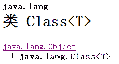
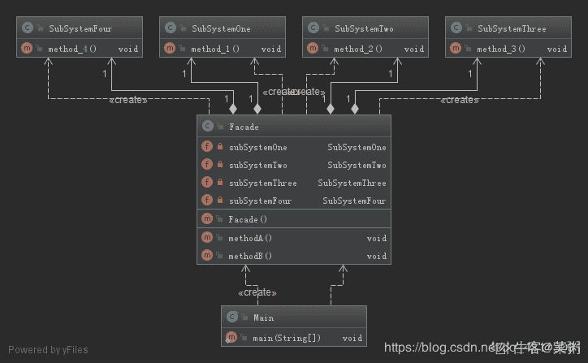

# 爱奇艺 2019 秋招 Java 方向笔试题（A）

## 1

使用堆排序方法排序（45，78，57，25，41，89），初始堆为（      ）

正确答案: B   你的答案: 空 (错误)

```cpp
78,45,57,25,41,89
```

```cpp
89,78,57,25,41,45
```

```cpp
89,78,25,45,41,57
```

```cpp
89,45,78,41,57,25
```

本题知识点

排序 *讨论

[修改昵称失败](https://www.nowcoder.com/profile/947651)

首先建立完全二叉树
从最后一个叶子节点开始第一次交换了 57 和 89 的位置然后比较 45 和 89，进行交换
再比较换下来的 45，45 不符合大根堆，与 57 交换

发表于 2019-05-29 21:11:08

* * *

[叫我皮卡丘](https://www.nowcoder.com/profile/1078265)


发表于 2019-08-05 17:40:53

* * *

[牛客 ID：507639719](https://www.nowcoder.com/profile/507639719)

堆排序 (Heap sort) 就是利用堆(假设利用大顶堆)进行排序的方法 。基本思想是

1.  构建初始堆
2.  将根节点与末尾元素交换，进行堆构造（末尾元素不参与）
3.  重复 2 过程，直到“堆”仅剩 1 个元素。

```cpp
function HeapSort(arr) {
  arr = [0, ...arr]; // 方便左右子树表示
  //第一步，构建初始堆
  for (let i = ~~Math.length / 2; i > 0; i--) {
    buildHeap(arr, i, arr.length);
  }

  for (let i = arr.length; i > 1; i--) {
    // 交换
    [arr[1], arr[i - 1]] = [arr[i - 1], arr[1]];
    // 根元素与末尾元素交换，再构建大顶堆
    buildHeap(arr, 1, i - 1);
  }
  return arr.slice(1); // 移除添加的 0 元素
}

// 构造大顶堆
function buildHeap(arr, i, length) {
  let temp = arr[i];
  for (let j = 2 * i; j <= length; j *= 2) {
    if (arr[j] < arr[j + 1]) j++;
    if (temp > arr[j]) break;
    arr[i] = arr[j];
    i = j;
  }
  arr[i] = temp;
}

// ------- 测试
let arr = [3, 9, 5, 2, 6];
console.log(HeapSort(arr)); // [ 9, 5, 6, 2, 3 ]

arr = [5, 3, 9, 8, 3, 4];
console.log(HeapSort(arr)); // [ 8, 3, 3, 5, 9, 4 ]
```

发表于 2019-06-09 09:31:00

* * *

## 2

6 个圆盘的汉诺塔，总的移动次数是（      ）

正确答案: D   你的答案: 空 (错误)

```cpp
30
```

```cpp
33
```

```cpp
60
```

```cpp
63
```

本题知识点

递归

讨论

[Michael264](https://www.nowcoder.com/profile/54836329)

> **定义** Hanoi(n, a, b, c)：将 n 个盘子从 a 柱移到 c 柱，b 柱起中转作用。f(n)：n 个盘子的汉诺塔的总移动次数。

**Hanoi(n, a, b, c) = Hanoi(n-1, a, c, b) + 1 + Hanoi(n-1, b, a, c)**：将 a 上面 n-1 个盘子移到 b，再将 a 最下面的盘子移到 c，再将 b 上的 n-1 个盘子移到 c，此时，**n 盘子汉诺塔问题 **变成了**移****动一个盘子 + ****两个 n-1 盘子汉诺塔问题。**故 **f(n) = f(n-1) + 1 + f(n-1) = 2f(n-1) + 1****=> f(n) + 1 = 2(f(n-1) + 1) ****=> f(n) + 1 = 2^(n-1) (f(1) + 1)****=> f(n) + 1 = 2^n****=> f(n) = 2^n -1**

发表于 2019-08-14 19:29:51

* * *

[忽然间要很好](https://www.nowcoder.com/profile/587724363)

f(1)=1f(2)=3f(n)=2*f(n-1)+1 相当于借助 B 柱 将 A 柱上前 n-1 个盘先放在 B 柱上（f(n-1)），再挪最后一个盘到 c 盘(+1)，之后再挪 B 柱的 n-1 个盘到 C 柱（f(n-1)），递归循环。

发表于 2019-05-30 12:37:57

* * *

[问纤](https://www.nowcoder.com/profile/857851073)

2＾n - 1

发表于 2019-06-07 09:40:52

* * *

## 3

设哈希表长为 11，哈希函数为 Hash (key)=key%11。存在关键码{43,7,29,22,16,92,44,8,19}，采用二次探测法处理冲突，建立的 hash 表为（    ）

正确答案: B   你的答案: 空 (错误)

```cpp
其他几项都不对
```

本题知识点

安卓工程师 爱奇艺 C++工程师 iOS 工程师 Java 工程师 测试工程师 算法工程师 前端工程师 运维工程师 哈希 *2019 测试开发工程师 大数据开发工程师* *讨论

[冲上顶峰](https://www.nowcoder.com/profile/189892324)

解析：采用开放定址法处理冲突中的二次探测再散列（也即是题目中的二元探测法）,则哈希函数变为 Hash(key） = (Hash(key)  + d) % 11，其中 d = 1², -1², 2², -2², 3²,……，则开始计算。

对于 43，代入公式为 Hash(43) = 43 % 11 = 10, 则地址为 10；

对于 7，代入公式为 Hash(7) = 7 % 11 = 7,则地址为 7；

对于 29，代入公式为 Hash(29) = 29 % 11 = 7, 与 7 冲突，则采用二次探测进行消除冲突， 继续(7 + 1) % 11 = 8，没有冲突，则地址为 8；

对于 22，代入公式 Hash(22) = 22 % 11 = 0, 则地址为 0；

对于 16，代入公式 Hash(16) = 16 % 11 = 5, 则地址为 5；

对于 92，代入公式 Hash(92) = 92 % 11 = 4,则地址为 4；

对于 44，代入公式 Hash(44) = 44 % 11 = 0, 与 22 的地址冲突，则继续(0 + 1) % 11 = 1,没有冲突，则地址为 1；

对于 8， 代入公式 Hash(8) = 8 % 11 = 8, 与 29 有冲突，则继续(8 + 1) % 11 = 9, 没有冲突，则地址为 9；

对于 19，代入公式 Hash(19) = 19 % 11 = 8\. 与 29 有冲突，则继续(8 + 1) * 11 = 9, 与 8 有冲突，继续(8 - 1) % 11 = 7, 与 7 有冲突，则继续(8 + 4) % 11 = 1, 与 44 有冲突，则继续(8 - 4) % 11 = 4, 与 92 有冲突，则继续(8 + 9) % 11 = 6, 没有冲突，则地址为 6.

所以最后得到的 Hash 表为下图所示：


发表于 2019-06-01 19:33:14

* * *

[sugarhit](https://www.nowcoder.com/profile/598224351)

真的。字太小了。19 和 29 根本看不清

发表于 2019-08-20 15:36:44

* * *

[OKOKOKOKOK](https://www.nowcoder.com/profile/2857851)

二次探测法：设发生冲突的地址为 d，则新的地址序列为 d+1²,d-1²,d+2²,d-2²,...

发表于 2019-05-30 14:11:07

* * *

## 4

有关希尔排序算法叙述正确的是（      ）

正确答案: A B   你的答案: 空 (错误)

```cpp
最后一次的步长增量一定为 1
```

```cpp
分割后子序列内部的排序算法是直接插入排序
```

```cpp
分割后子序列内部的排序算法是直接选择排序
```

```cpp
希尔排序是稳定排序算法
```

本题知识点

安卓工程师 爱奇艺 C++工程师 iOS 工程师 Java 工程师 测试工程师 算法工程师 前端工程师 运维工程师 排序 *2019 测试开发工程师 大数据开发工程师* *讨论

[Yd。201906031539658](https://www.nowcoder.com/profile/907160213)

[Shell 排序](https://baike.baidu.com/item/Shell%E6%8E%92%E5%BA%8F)的执行时间依赖于[增量](https://baike.baidu.com/item/%E5%A2%9E%E9%87%8F)序列。好的[增量](https://baike.baidu.com/item/%E5%A2%9E%E9%87%8F)序列的共同特征：① 最后一个[增量](https://baike.baidu.com/item/%E5%A2%9E%E9%87%8F)必须为 1；② 应该尽量避免序列中的值(尤其是相邻的值)互为倍数的情况。有人通过大量的实验，给出了较好的结果：当 n 较大时，比较和移动的次数约在 nl.25 到 1.6n1.25 之间。2．Shell 排序的时间性能优于[直接插入排序](https://baike.baidu.com/item/%E7%9B%B4%E6%8E%A5%E6%8F%92%E5%85%A5%E6%8E%92%E5%BA%8F)希尔排序的时间性能优于[直接插入排序](https://baike.baidu.com/item/%E7%9B%B4%E6%8E%A5%E6%8F%92%E5%85%A5%E6%8E%92%E5%BA%8F)的原因：①当文件初态基本有序时[直接插入排序](https://baike.baidu.com/item/%E7%9B%B4%E6%8E%A5%E6%8F%92%E5%85%A5%E6%8E%92%E5%BA%8F)所需的比较和移动次数均较少。②当 n 值较小时，n 和  的差别也较小，即[直接插入排序](https://baike.baidu.com/item/%E7%9B%B4%E6%8E%A5%E6%8F%92%E5%85%A5%E6%8E%92%E5%BA%8F)的最好[时间复杂度](https://baike.baidu.com/item/%E6%97%B6%E9%97%B4%E5%A4%8D%E6%9D%82%E5%BA%A6)O(n)和最坏时间复杂度 0(  )差别不大。③在希尔排序开始时[增量](https://baike.baidu.com/item/%E5%A2%9E%E9%87%8F)较大，分组较多，每组的记录数目少，故各组内直接插入较快，后来增量 di 逐渐缩小，分组数逐渐减少，而各组的记录数目逐渐增多，但由于已经按 di-1 作为距离排过序，使文件较接近于有序状态，所以新的一趟排序过程也较快。因此，希尔排序在效率上较直接插入排序有较大的改进。

发表于 2019-06-03 16:49:08

* * *

[Zoe 小茗](https://www.nowcoder.com/profile/324939503)

排序最后一次则会对间隔为 1 的元素，也就是相邻元素执行标准插入排序。

发表于 2019-08-04 15:19:53

* * *

[Juventus-🐂](https://www.nowcoder.com/profile/79434593)

希尔排序的执行时间依赖于增量序列。最后一个增量必须为 1，时间性能优于直接插入排序。

发表于 2022-01-23 15:41:36

* * *

## 5

广义表 K=(m,n,(p,(q,s)),(h,f)),则 head[tail[head[tail[tail(K)]]]]的值为（      ）

正确答案: B   你的答案: 空 (错误)

```cpp
s
```

```cpp
q
```

```cpp
p
```

```cpp
h
```

本题知识点

安卓工程师 爱奇艺 C++工程师 iOS 工程师 Java 工程师 测试工程师 算法工程师 前端工程师 运维工程师 链表 *2019 测试开发工程师 大数据开发工程师* *讨论

[冲上顶峰](https://www.nowcoder.com/profile/189892324)

head() 返回列表的第一个元素；

tail() 返回列表的删去第一个元素之后的剩余列表；K=(m,n,(p,(q,s)),(h,f)),
head[tail[head[tail[tail(K)]]]]
tail(K)-------(n,(p,(q,s)),(h,f))tail[tail[K]]--------((p,(q,s)),(h,f))head()-----((p,(q,s))tail()-----(q,s)head()-------q

发表于 2019-06-01 19:30:59

* * *

[Astrallee](https://www.nowcoder.com/profile/376787917)

我为什么觉得是（p,s)啊，前面的 tail 也是按照这个思路来的。取到最后两个的时候是(p,(q,s))。 tail 一次 不应该是((q,s))吗

发表于 2019-12-06 23:33:27

* * *

[OKOKOKOKOK](https://www.nowcoder.com/profile/2857851)

从最里层括号一直向外计算。head(a,b)：保留括号第一个元素 a，去除其余 tail(a,b)：去除第一个元素 a，保留其余

发表于 2019-05-30 14:16:30

* * *

## 6

在一个空的 5 阶 B-树中依次插入关键字序列{6,8,15,16,22,10,18,32,20}，插入完成后，关键字 6 所在结点包含的关键字个数为（      ）

正确答案: B   你的答案: 空 (错误)

```cpp
2
```

```cpp
3
```

```cpp
4
```

```cpp
5
```

本题知识点

爱奇艺 树 2019

讨论

[newcomer](https://www.nowcoder.com/profile/291053)

一颗 m 阶 B 树，非叶节点至多可以有 m-1 个关键字，至少可以有 ceil(n/2)-1 个，根节点可以至少有一个关键字。根据这个原则，可以画出 5 阶 B 树的构建过程，如下图所示：

编辑于 2019-07-03 10:22:34

* * *

[漫步云端.](https://www.nowcoder.com/profile/478154402)

这篇博客写的挺好[`blog.csdn.net/li_canhui/article/details/85305147`](https://blog.csdn.net/li_canhui/article/details/85305147)

发表于 2019-08-28 21:36:48

* * *

[默默学习的啦啦啦](https://www.nowcoder.com/profile/146773881)

n 阶 B-树，每个结点中关键字个数范围为 ceil(n/2) - 1 ~ n-1 个，因此为 2-4 个，插入时首先插入 6,8,15,16；再插入 22 时结点个数大于 4，因此取 15 为中间结点拆分，变成 15 - (6,8),(16,22)，继续插入 10,18,32 变成 15 - (6,8,10),(16,18,22,32)，再插入 20 时结点个数大于 4，取 20 为中间结点拆分，合并到根节点上变为(15,20) - (6,8,10),(16,18),(22,32)

编辑于 2019-05-31 09:42:32

* * *

## 7

在求两个集合并集的过程中，可能需用到的操作是（      ）  

正确答案: A B C D   你的答案: 空 (错误)

```cpp
取元素
```

```cpp
插入元素
```

```cpp
比较操作
```

```cpp
求表长
```

本题知识点

安卓工程师 爱奇艺 C++工程师 iOS 工程师 Java 工程师 测试工程师 算法工程师 前端工程师 运维工程师 哈希 *2019 测试开发工程师 大数据开发工程师* *讨论

[叫我皮卡丘](https://www.nowcoder.com/profile/1078265)

需求：求两个集合的并集 1\. 取元素，至少得知道集合存的是啥元素 2\. 插入元素，并集可能存在集合 A 中有而集合 B 中无的元素，需要插入到新的集合中 3\. 比较操作，判断是否相等 4\. 求表长，完整遍历

发表于 2019-08-05 17:54:29

* * *

[拾陆 humin](https://www.nowcoder.com/profile/334013855)

联想 归并排序

发表于 2019-06-13 18:51:00

* * *

[冲上顶峰](https://www.nowcoder.com/profile/189892324)

还需要求表长

发表于 2019-06-01 19:27:00

* * *

## 8

TCP 协议与 UDP 协议负责端到端连接，下列那些信息只出现在 TCP 报文，UDP 报文不包含此信息（      ）

正确答案: A D   你的答案: 空 (错误)

```cpp
序列号
```

```cpp
源端口
```

```cpp
目标端口
```

```cpp
窗口大小
```

本题知识点

安卓工程师 爱奇艺 C++工程师 iOS 工程师 Java 工程师 测试工程师 算法工程师 前端工程师 运维工程师 网络基础 2019 测试开发工程师 大数据开发工程师

讨论

[叫我皮卡丘](https://www.nowcoder.com/profile/1078265)

UDP 头部信息只有 4 个，从哪来：源端口到哪去：目的端口有多长：长度对不对：校验和

发表于 2019-08-05 18:13:13

* * *

[冲上顶峰](https://www.nowcoder.com/profile/189892324)

[`www.cnblogs.com/steven520213/p/8005258.html`](https://www.cnblogs.com/steven520213/p/8005258.html)**UDP****的包头结构：**
    源端口 16 位
    目的端口 16 位
    长度 16 位
    校验和 16 位

发表于 2019-06-01 19:41:07

* * *

[newcomer](https://www.nowcoder.com/profile/291053)

TCP 与 UDP 最大的不同就是前者是可靠传输，后者是不可靠的。为了保证可靠传输，TCP 采用了一系列机制，比如序列号是指客户端确认序列号以及以前的信息都收到了，窗口大小则是提高传输效率，保证信息按序到达。这些很明显 UDP 是没有的。

发表于 2019-07-03 09:09:53

* * *

## 9

程序员编写程序时使用文件系统提供的系统调用将内存中由 address 地址开始的 n 个字节或 n 个记录的信息写入指定文件中，但发现文件名不可用，可行的解决办法是（）

正确答案: A B   你的答案: 空 (错误)

```cpp
使用文件描述符代替文件名
```

```cpp
使用文件句柄代替文件名
```

```cpp
使用当前进程的 PCB 编号代替
```

```cpp
以上办法都不可行
```

本题知识点

安卓工程师 爱奇艺 C++工程师 iOS 工程师 Java 工程师 测试工程师 算法工程师 前端工程师 运维工程师 操作系统 2019 测试开发工程师 大数据开发工程师

讨论

[dylmail](https://www.nowcoder.com/profile/501837184)

**无论是文件句柄（Windows 中概念），还是文件描述符（linux 中概念），其最终目的都是用来定位打开的文件在内存中的位置，只是它们映射的方式不一样。****PCB（进程控制块）在 linux 中具体实现是 task_struct 数据结构，这些进程必须要有唯一标识符，所以里面含有 pid（进程 ID）**

发表于 2020-06-30 17:24:38

* * *

[360 公司内推小助手](https://www.nowcoder.com/profile/385100296)

文件句柄与文件描述符 [`www.cnblogs.com/ChunJian-YANG/p/5322041.html`](https://www.cnblogs.com/ChunJian-YANG/p/5322041.html)

发表于 2019-06-03 15:27:55

* * *

## 10

某软件公司正在升级一套水务管理系统。该系统用于县市级供排水企业、供水厂、排水厂中水务数据的管理工作。系统经重新整合后，开发人员决定不再使用一张备份数据表 waterinfo001 表，需永久删除。选出符合要求的语句。 

正确答案: C   你的答案: 空 (错误)

```cpp
DELETE TABLE waterinfo001
```

```cpp
DELETE FROM TABLE waterinfo001
```

```cpp
DROP TABLE waterinfo001
```

```cpp
DROP FROM TABLE waterinfo001
```

本题知识点

安卓工程师 爱奇艺 C++工程师 iOS 工程师 Java 工程师 测试工程师 算法工程师 前端工程师 运维工程师 数据库 SQL 2019 测试开发工程师 大数据开发工程师

讨论

[夏花爱秋叶](https://www.nowcoder.com/profile/4085682)

```cpp
1. drop 是完全删除表，包括表结构
2. delete 是删除表数据，保留表的结构，而且可以加 where,只删除一行或者多行
3. truncate 只能删除表数据，会保留表结构，而且不能加 where

```

发表于 2020-03-11 11:37:04

* * *

[叫我皮卡丘](https://www.nowcoder.com/profile/1078265)

DELETE FROM waterinfo001;清除 waterinfo001 表全部记录 DROP TABLE waterinfo001;删除 waterinfo001 表

编辑于 2019-11-07 08:05:54

* * *

[fighting.java](https://www.nowcoder.com/profile/543231756)

| 1. drop 是完全删除表，包括表结构 2. delete 是删除表数据，保留表的结构，而且可以加 where,只删除一行或者多行 3. truncate 只能删除表数据，会保留表结构，而且不能加 where |

发表于 2020-04-29 20:33:49

* * *

## 11

以下程序的执行结果是：

```cpp
static boolean foo(char c){
     System.out.print(c);
     return true;
 }
 public static void main(String[] args) {
     int i =0;
     for(foo('A');foo('B')&&(i<2);foo('C')){
         i++;
         foo('D');
     }
 }
```

正确答案: A   你的答案: 空 (错误)

```cpp
ABDCBDCB
```

```cpp
ABCDABCD
```

```cpp
编译时出错
```

```cpp
运行时抛出异常
```

本题知识点

安卓工程师 爱奇艺 Java 工程师 Java 2019

讨论

[Yd。201906031539658](https://www.nowcoder.com/profile/907160213)

1.其实 foo(‘A’);就是初始化条件，只会执行一次，所以第一个打印的肯定是 A 
2.因为 i=0;循环条件是 i<2 （由此可知循环 i 等于 2 的时候就会停止循环，)所有 0<2 满足条件，接着会输出 B，然后执行 i++；i 就变成 1 了，再输出 D，再最后输出 C，一次循环后的结果是：ABDC 
3.第二次循环的开始是 foo(‘A’);是初始条件所以不会执行，直接从 foo(‘B’)开始，输出 B，然后 i 为 1，且小于 2，此时循环体内再次执行 i++；i 的值为 2 了，再次输出 D，最后输出 C 
第二次循环输出：BDC 
4.*然后循环再次执行 for(foo(‘A’);foo(‘B’)&&(i<2);foo(‘C’)) 
直接输出 B，***i 的值在第二轮循环后的值变成了 2，2<2 不成立，终止循环，输出 B
--------------------- 
作者：deoppressoliber 
来源：CSDN 
原文：[`blog.csdn.net/deoppressoliber/article/details/54574631`](https://blog.csdn.net/deoppressoliber/article/details/54574631) 
版权声明：本文为博主原创文章，转载请附上博文链接！

发表于 2019-06-03 17:05:37

* * *

[我从大数据中找个零](https://www.nowcoder.com/profile/6649551)

考察的是 for 循环三条语句的执行顺序 for(第一条语句；第二条语句；第三条语句；) 首次循环时先执行前两句。以后的每次循环结束，都是执行最后一条语句，然后执行判断语句（也就是第二条语句）条件成立进入下一次循环。 第一条语句只会被执行一次

发表于 2019-11-20 11:19:09

* * *

[顾萧白](https://www.nowcoder.com/profile/710428015)

for（循环开始条件；判断条件；循环后条件）

按照执行顺序依次执行

发表于 2019-10-24 15:02:54

* * *

## 12

关于 Java 以下描述正确的有(      )

正确答案: C D   你的答案: 空 (错误)

```cpp
Class 类是 Object 类的超类
```

```cpp
Object 类是一个 final 类
```

```cpp
String 类是一个 final 类
```

```cpp
Class 类可以装载其它类
```

本题知识点

安卓工程师 爱奇艺 Java 工程师 Java 2019

讨论

[东京异种](https://www.nowcoder.com/profile/725155193)

A.class 类是 Object 的派生类 B.每个类都使用 Object 类作为超类，而 final 修饰的类不能被继承 C.D.Class 类中的 forName()方法返回与带有给定字符串名的类或接口相关联的 Class 对象（装载其他类）

发表于 2019-08-06 09:36:49

* * *

[DingYu](https://www.nowcoder.com/profile/646808631)

额 做的时候一直在想装载是什么 ， 其实就是加载，应该是 Class.forName()这个方法！

发表于 2019-08-03 20:36:34

* * *

[左手 201809131222262](https://www.nowcoder.com/profile/337184788)

关于 A 选项，我想说一下：我查阅了很多资料，关于 Class 和 Object 的关系，至少有三种说法：1.两者没有继承关系的 2.Object 是 Class 的实例 3.Class 是 Object 的类类型的父类（是 类类型，此处没有打错），Object 是 Class 的父类。为此我翻阅了根据 jdk1.8 手册，发现：

```cpp
public final class Class<T> extends Object 
```

可见 Class 继承于 Object，所以 Class 是 Object 的子类

发表于 2020-02-22 15:49:05

* * *

## 13

Gadget has-a Sprocket and Gadget has-a Spring and Gadget is-a Widget and Widget has-a
Sprocket 以下哪两段代码可以表示这个关系? (选择两项) (    )

正确答案: A C   你的答案: 空 (错误)

```cpp
class Widget { Sprocket s; }
class Gadget extends Widget { Spring s; }
```

```cpp
class Widget { }
class Gadget extends Widget { Spring s1; Sprocket s2; }
```

```cpp
class Widget { Sprocket s1; Spring s2; }
class Gadget extends Widget { }
```

```cpp
class Gadget { Spring s; }
class Widget extends Gadget{ Sprocket s; }
```

本题知识点

安卓工程师 爱奇艺 Java 工程师 Java 2019

讨论

[怀疑一切](https://www.nowcoder.com/profile/836881958)

is-a   表示继承：Gadget is-a Widget 就表示 Gadget 继承 Widget；has-a 表示从属：Gadget has-a Sprocket 就表示 Gadget 中有 Sprocket 的引用，Sprocket 是 Gadget 的组成部分；like-a 表示组合：如果 A like-a B，那么 B 就是 A 的接口

发表于 2019-09-24 20:47:08

* * *

[alonetj](https://www.nowcoder.com/profile/43372448)

完全是吃了没文化的亏

发表于 2019-09-11 19:43:04

* * *

[白起丶](https://www.nowcoder.com/profile/815173790)

从题目中可以得出以下几个结论：

1.  Gadget 中有对 Sprocket 的引用。
2.  Gadget 中有对 Spring 的引用。

3.  Gadget 继承了 Widget。
4.  Widget 中有对 Sprocket 的引用。

*   A

    ```cpp
    class Widget { Sprocket s; }
    class Gadget extends Widget { Spring s; }
    ```

    完全符合要求，这里的结论 1 虽然没有明确表明，但是因为结论 3（Gadget 继承了 Widget）的存在，即父类中的非私有成员（Sprocket）子类都默认拥有。故结论都成立。
*   B

    ```cpp
    class Widget { }
    class Gadget extends Widget { Spring s1; Sprocket s2; }
    ```

    结论 123 成立，但是没有表明结论 4。
*   C

    ```cpp
    class Widget { Sprocket s1; Spring s2; }
    class Gadget extends Widget { }
    ```

    完全符合要求，这里的结论 12 虽然没有明确表明，但是因为结论 3（Gadget 继承了 Widget）的存在，即父类中的非私有成员（Sprocket 和 Spring）子类都默认拥有。故结论都成立。
*   D

    ```cpp
    class Gadget { Spring s; }
    class Widget extends Gadget{ Sprocket s; }
    ```

    结论 24 成立，但是结论 13 没有表明。这里只是表明了 Widget 继承了 Gadget，并且 Widget 具有对 Spring 的引用。

发表于 2020-06-07 10:51:49

* * *

## 14

以下代码可以使用的修饰符是：（）

```cpp
public interface Status {
 /*INSERT CODE HERE*/  int MY_VALUE=10;
 }
```

正确答案: A B D   你的答案: 空 (错误)

```cpp
final
```

```cpp
static
```

```cpp
abstract
```

```cpp
public
```

本题知识点

安卓工程师 爱奇艺 Java 工程师 Java 2019

讨论

[鱼泡泡-菜鸟成长记](https://www.nowcoder.com/profile/504722264)

接口中字段的修饰符：public static final（默认不写）接口中方法的修饰符：public abstract（默认不写） 

发表于 2019-06-12 11:23:43

* * *

[Nemo521](https://www.nowcoder.com/profile/4621981)

abstract 只能修饰类和方法 不能修饰字段

发表于 2019-08-17 08:22:52

* * *

[你的 offer 对我打了烊](https://www.nowcoder.com/profile/598309941)

ABD 中的三个关键字在接口中的存在原因：public：接口可以被其他接口继承，也可以被类实现，类与接口、接口与接口可能会形成多层级关系，采用 public 可以满足变量的访问范围；static：如果变量不是 static 的，那么接口必须实例化才可以访问自己的变量，接口不能被实例化，故非 static 的变量是无效的；final：如果变量不是 final 的，而方法是 abstract 的，因此接口中的方法又不可以修改变量值，虽然可以直接修改静态成员变量，但所有实现类对应的值都被修改了，此做法等同于抽象类，故需要 final 修饰成员变量；

发表于 2020-03-06 22:52:52

* * *

## 15

下列描述中，哪些是外观模式的特点（      ）

正确答案: A C D   你的答案: 空 (错误)

```cpp
对客户端屏蔽了子系统组件
```

```cpp
实现了子系统与客户端之间的紧耦合关系
```

```cpp
单个子系统的修改不影响其他子系统
```

```cpp
子系统类变化时，只需要修改外观类即可
```

本题知识点

C++工程师 爱奇艺 Java 工程师 设计模式 2019

讨论

[菜粥](https://www.nowcoder.com/profile/5293318)

外观模式

*   把子系统的功能封装到一个类里，对外只提供这一个类，适合于老系统对外提供接口
    

大话设计模式-外观模式：

[`localhost.blog.csdn.net/article/details/89139360`](https://localhost.blog.csdn.net/article/details/89139360)

大话设计模式-系列文章(共 50 篇)：

[`blog.csdn.net/qq_41113081/category_8723350.html`](https://blog.csdn.net/qq_41113081/category_8723350.html)

发表于 2020-03-25 00:16:24

* * *

## 16

执行下列程序的输出结果为（      ）

```cpp
public class Test {
    public static void main(String[] args) {
         String s1 = "HelloWorld";
         String s2 = new String("HelloWorld");
         if (s1 == s2) {
             System.out.println("s1 == s2");
         } else {
             System.out.println("s1 != s2");
         }
         if (s1.equals(s2)) {
             System.out.println("s1 equals s2");
         } else {
             System.out.println("s1 not equals s2");
         }
     }
 }
```

正确答案: D   你的答案: 空 (错误)

```cpp
s1 == s2
s1 not equals s2
```

```cpp
s1 == s2
s1 equals s2
```

```cpp
s1 != s2
s1 not equals s2
```

```cpp
s1 != s2
s1 equals s2
```

本题知识点

Java 工程师 爱奇艺 Java 2019

讨论

[人余月半子](https://www.nowcoder.com/profile/514787832)

1.== 和 equals():

(1)“==” 用于比较基本数据类型时比较的是值，用于比较引用类型时比较的是引用指向的地址。(2)Object 中的 equals() 与 “==” 的作用相同，但 String 类重写了 equals()方法，比较的是对象中的内容。    

```cpp
public boolean equals(Object anObject) { if (this == anObject) {
          return true;  } else { if (anObject instanceof String) {
            String aString = (String)anObject;
      if (this.coder() == aString.coder()) {  return this.isLatin1() ? StringLatin1.equals(this.value, aString.value) : StringUTF16.equals(this.value, aString.value); 
       }
      } return false;  }
}

```

发表于 2019-10-22 16:24:07

* * *

[原知](https://www.nowcoder.com/profile/393643081)

s1 直接指向常量池中的字符串变量（没有就在常量池创建一个） s2 是指向堆里的一个字符串对象，对象里面有常量池中字符串对象的引用

发表于 2019-08-27 23:07:40

* * *

[taio](https://www.nowcoder.com/profile/231020598)

直接 new string（“...”）就创建了一个新对象

string s2=“...”的方式定义的话，类加载器会判断这个字符串值在不在字符串常量池，若有则直接把 s2 作为 s1 的引用，不在的话再 new。

发表于 2020-03-18 11:30:54

* * *

## 17

在 socket 编程中，可以使用方法（      ）获取本机的 ip 地址

正确答案: B   你的答案: 空 (错误)

```cpp
getInetAddress()
```

```cpp
getLocalAddress()
```

```cpp
getReuseAddress()
```

```cpp
getLocalPort()
```

本题知识点

Java 工程师 爱奇艺 Java 2019

讨论

[晨曦破晓耀天地](https://www.nowcoder.com/profile/807493545)

getInetAddress 获取主机名和 IP 地址 getLocalAddress()顾名思义，获取本地 IP 地址 getReuseAddress()返回布尔类型，表示复用地址 getLocalPort()API 的说明：“Returns the Internet Protocol (IP) port number of the interface on which the request was received. ”

发表于 2019-08-05 21:25:40

* * *

[你的 offer 对我打了烊](https://www.nowcoder.com/profile/598309941)

来个误导项 ipconfig🤣

发表于 2020-03-06 22:47:31

* * *

[曲终人散丶 Sam](https://www.nowcoder.com/profile/41507351)

这题考查单词的认识情况。

发表于 2020-05-31 20:00:05

* * *

## 18

```cpp
class Alpha {
 public void foo() { System.out.print("Afoo "); }
 }
 public class Beta extends Alpha {15\. public void foo() { System.out.print("Bfoo "); }
 public static void main(String[] args) {
 Alpha a = new Beta();
 Beta b = (Beta)a;
 a.foo();
 b.foo();
 }
 }
```

以上代码的执行结果是(  )

正确答案: D   你的答案: 空 (错误)

```cpp
Afoo Afoo
```

```cpp
Afoo Bfoo
```

```cpp
Bfoo Afoo
```

```cpp
Bfoo Bfoo
```

本题知识点

Java 工程师 爱奇艺 2019

讨论

[啊，职位啊](https://www.nowcoder.com/profile/758349753)

涉及的考察内容是方法的重写，java 多态特性：
[`blog.csdn.net/mahao25/article/details/96040126`](https://blog.csdn.net/mahao25/article/details/96040126)

发表于 2019-08-10 11:03:53

* * *

[菜鸟四号](https://www.nowcoder.com/profile/1366555)

本题考查的是重写（吐槽一句，牛客的排版真的很 low）Alpha a=new Beta();这行代码表示 a 可以调用 Alpha 的所有方法和其子类 Beta 的所有方法，如果 Beta 重写了父类 Alpha 的方法，则调用子类的方法。

发表于 2019-10-21 15:32:13

* * *

[joyh](https://www.nowcoder.com/profile/661382648)

实例化谁就调用谁吗

发表于 2019-09-10 11:37:42

* * *

## 19

下列代码编译和运行的结果是：（）

```cpp
public class Threads4{
     public static void main(String[] args){
         new Threads4().go();
     }
     public void go(){
         Runnable r=new Runnable(){
             public void run(){
                 System.out.print("foo");
             }
         };
     Thread t=new Thread(r);
     t.start();
     }
 } 
```

正确答案: C   你的答案: 空 (错误)

```cpp
编译错误
```

```cpp
抛出运行时异常
```

```cpp
输出：foo
```

```cpp
代码正常运行，但是无输出
```

本题知识点

Java 工程师 爱奇艺 Java 2019

讨论

[泡泡 201908061058789](https://www.nowcoder.com/profile/458221310)

在 java 多线程中实现多线程的方式有两种①extends Thread ②implements Runnable。这两种情况是我们最常见的，还有一种是由第二种变形而来的直接 new Runnable(){}，我们都知道 java 的接口是不可以实例化的，但代码中的 new Runnable(){xxx}确是实例化了，为什么？ 接口和抽象类不可以实例化是对的，这个是 java 语法规范来的，**而 new Runnable(){}其实不是实例化 Runnable 接口来的，实际上一种内部类的一种简写** 在这里：①首先构造了一个”implements Runnable “的无名 local 内部类(方法内的内部类)②然后构造了这个无名 local 内部类的一个实例③然后用 Runnable 来表示这个无名 local 内部类的 type(OO 多态)。 例如上面这段代码编译后你会看到其实是编译了两个类来的，如下： 其中 Text2$1 就是无名 local 内部内类，这个也就很好地解释了为什么在 main（）方法中 new Runnable(){xxx}里面的调用 main()方法中的变量的时候要用 final 关键字来修饰

发表于 2019-09-06 19:58:57

* * *

[研究所走一波](https://www.nowcoder.com/profile/619153880)


发表于 2019-08-14 21:05:39

* * *

[CodeBear_](https://www.nowcoder.com/profile/316835193)

我总觉得这个大括号有毛病啊

发表于 2019-08-08 18:44:32

* * *

## 20

以下程序的执行结果是：

```cpp
static boolean foo(char c){
    System.out.print(c);
    return true;
 }
public static void main(String[] args) {
     int i =0;
     for(foo('A');foo('B')&&(i<2);foo('C')){
         i++;
         foo('D');
     }
}
```

正确答案: A   你的答案: 空 (错误)

```cpp
ABDCBDCB
```

```cpp
ABCDABCD
```

```cpp
编译时出错
```

```cpp
运行时抛出异常
```

本题知识点

Java 工程师 爱奇艺 Java 2019

讨论

[三天打鱼两天晒网是你吗](https://www.nowcoder.com/profile/263122519)

**做这道面试题之前我们要了解 for 语句
1.各部分执行的顺序
2.各部分执行的次数
3.循环的终止条件**

**分号之前第一部分是初始化语句也就是 foo('a')所以只会执行一次，第二部分是循环终止控制，也就是循环条件当 foo('b') && (i<2)为 false 时条件就会终止,所以循环会执行两次**

**第三部分在每次循环完毕时执行，所以执行顺序是先 foo('a')所以先打印 a,再次执行 foo('b')并且判断条件 i<2 条件是否满足，满足的话进入循环体,然后 i++ i 等于 1,然后执行 foo('d')**

**再打印 d ,执行完毕再执行 foo('c')打印 c，这是循环一次的结果 abdc，第二遍循环，因为 a 是初始化变量所以只执行一次，直接执行循环条件,先执行 foo('b')并且判断 i<2 条件是**

**否满足，现在 i 是 1 所以条件满足进入循环体,执行 i++,再次执行 foo('d'),循环完毕执行('c')然后打印 c,循环第二遍的结果是 bdc,这时循环还会继续执行,因为它还不知道**

**i 是否小于 2,初始化变量不执行,执行循环条件,先执行 foo('b')打印 b 然后判断循环条件,现在 i 等于 2 所以 i<2 的条件不满足,所以循环结束**

发表于 2019-12-17 10:41:43

* * *

[加拉帕戈斯象龟](https://www.nowcoder.com/profile/905996492)

```cpp
for(1;2;3){
    4;
}
```

选 A 这题考察的应该是 for 循环的执行顺序：1 只在开头执行一次便不再执行；然后是 2->4->3->2->4->3 这样循环下去；等到满足终止条件时到 2 就停止了。个人观点。。。

编辑于 2019-08-07 19:33:17

* * *

[liudng](https://www.nowcoder.com/profile/304971514)

```cpp
for(初始化语句; 布尔表达式; 更新语句) {
    正文过程;
}
```

执行顺序:

1.  初始化语句, 仅在循环开始前执行一次;
2.  布亇表达式, 用于决定是否继续执行正文过程, 表达式中异常则结束循环;
3.  正文过程, 如果过程中存在 break, return 或者异常, 循环结束(不会执行更新语句), 如果遇到 continue, 则会执行更新语句后进入下一轮循环;
4.  更新语句, 注意更新语句不做逻辑真假判断, 到这里一轮循环结束;
5.  布亇表达式, 进入新一轮循环;
6.  ...

编辑于 2019-08-10 14:32:15

* * ******