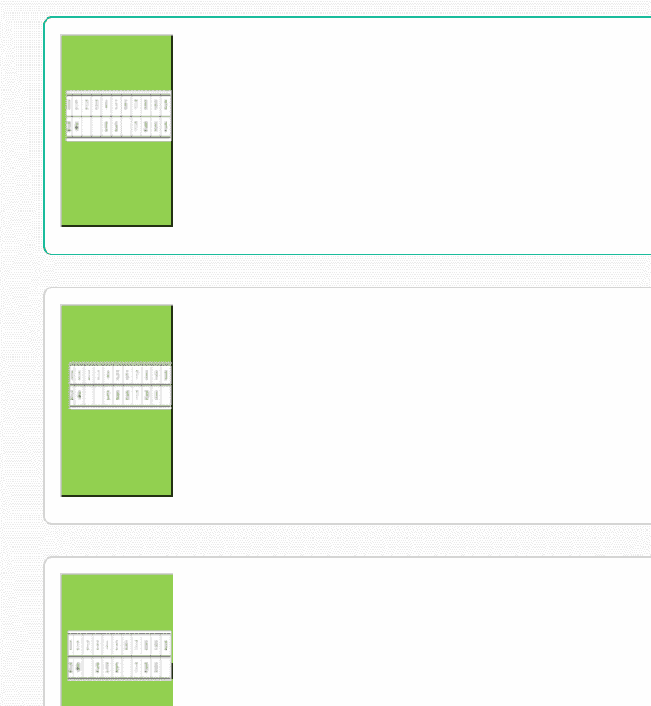
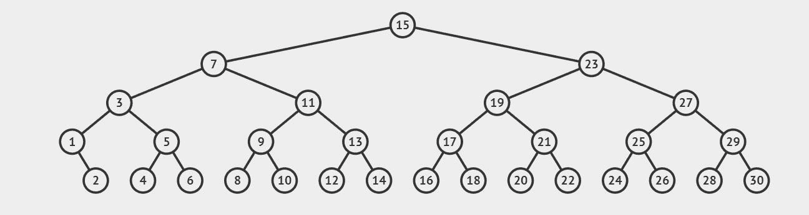
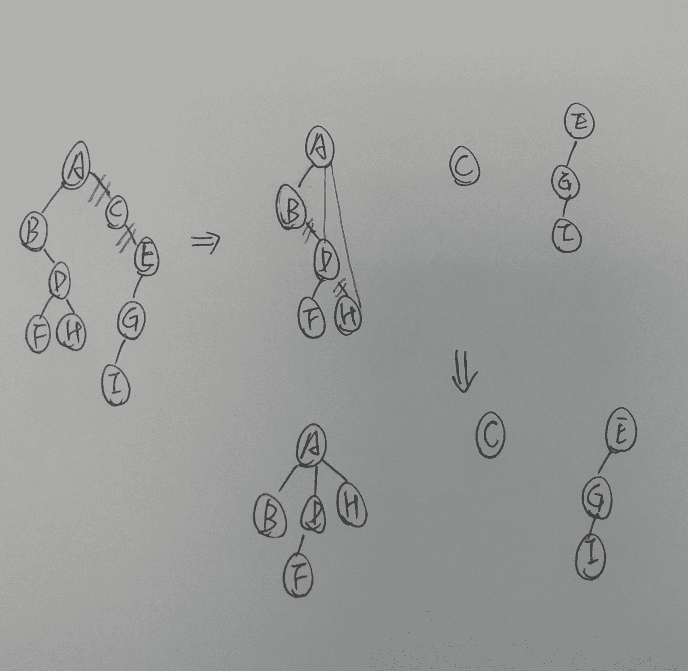
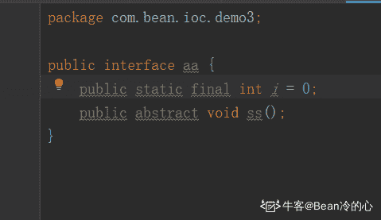
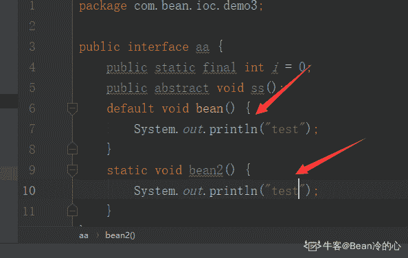
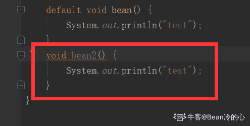
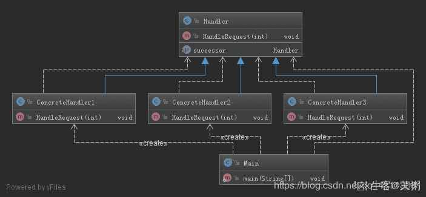
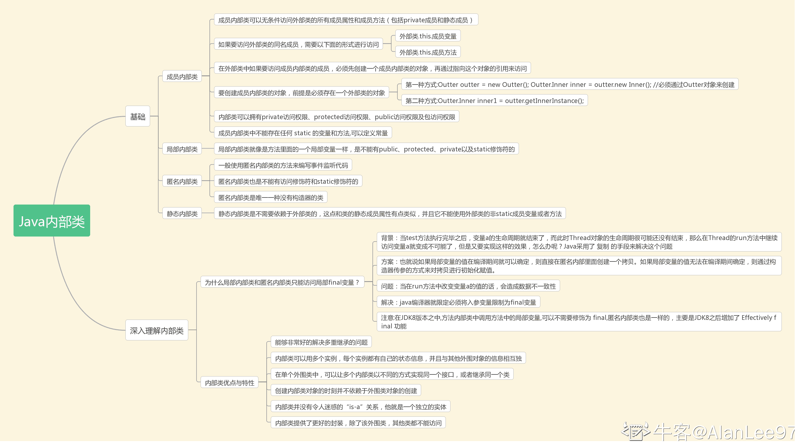

# 爱奇艺 2019 秋招 Java 方向笔试题（B）

## 1

某学生信息表，设一组表示成绩的关键字序列(24,15,32,28,19,10,40)采用直接插入排序时，当插入记录 19 到有序表时，为找插入位置需比较次数为（      ）

正确答案: C   你的答案: 空 (错误)

```cpp
2
```

```cpp
3
```

```cpp
4
```

```cpp
5
```

本题知识点

排序 *讨论

[铜豌豆 183](https://www.nowcoder.com/profile/7553292)

插入排序是从后往前比的   所以  15 24 28 32 的比较方向是   32->28->24->15

发表于 2019-05-31 21:34:13

* * *

[包子 10086](https://www.nowcoder.com/profile/4034573)

直接插入排序(straight insertion sort)的做法是：每次从无序表中取出第一个元素，把它插入到有序表的合适位置，使有序表仍然有序。
大概是：24 直接放进去                                                                                     24
第一趟   15 比 24 小放到 24 前面，比较 1 次                                                 15    24 第二趟   32 比 24 大放 24 后面，比较 1 次                                                     15    24     32 第三趟   28 比 32 小，比 24 大，比较 2 次                                                     15   24     28     32 第四趟，19 比 32 小，比 28 小，比 24 小，比 15 大，比较 4 次                       15    19    24     28    32

发表于 2019-06-06 20:29:30

* * *

[plzGEtoUtofmYHEAD](https://www.nowcoder.com/profile/1251387)

做对这题需要明白插入排序的过程，当插 19 的时候，前面四个元素都已经是有序的了，在表中是 15 24 28 32，然后 19 需要开始跟 32 比，比 32 小，说明要放到 32 前面，再跟 28 比，同理跟 24 比，然后跟 15 比，比 15 大，就要放到 15 后面。所以比较了四次

发表于 2019-06-23 16:52:32

* * *

## 2

A、B、C、D、E、F 依次入栈，其出栈顺序为 B、D、C、F、E、A，则该栈最小容量为（      ）

正确答案: D   你的答案: 空 (错误)

```cpp
6
```

```cpp
5
```

```cpp
4
```

```cpp
3
```

本题知识点

安卓工程师 爱奇艺 C++工程师 iOS 工程师 Java 工程师 算法工程师 前端工程师 运维工程师 栈 *队列 *2019 测试开发工程师 大数据开发工程师** **讨论

[包子 10086](https://www.nowcoder.com/profile/4034573)

A B                            ---B 出   C  D                       ---D C 出   E  F                       ----F E 出                                ----A 出所以是 3

发表于 2019-06-06 20:32:05

* * *

[688](https://www.nowcoder.com/profile/625142838)

A B 进栈
B 出栈
C D 进栈  出栈  此时出栈 B D C
F E 进栈  依次出完栈：F E A
所以  最少 3

发表于 2019-05-31 19:16:55

* * *

## 3

设哈希表长为 11，哈希函数为 Hash (key)=key%11。存在关键码{7,29,22,16,92,44,8,19}，采用线性探测法处理冲突，建立的 hash 表为（    ）

正确答案: A   你的答案: 空 (错误)

```cpp
其他几项都不对
```

本题知识点

安卓工程师 爱奇艺 C++工程师 iOS 工程师 Java 工程师 测试工程师 算法工程师 前端工程师 运维工程师 哈希 *2019 测试开发工程师 大数据开发工程师* *讨论

[牛仙儿](https://www.nowcoder.com/profile/510479121)

请问哪来的 15 和 43，有这两个关键字吗，请让出题人解答一下这个问题

发表于 2019-11-06 12:50:09

* * *

[Dloading](https://www.nowcoder.com/profile/8974581)

为难我？？?

发表于 2019-06-18 17:21:14

* * *

[牛客 ID：507639719](https://www.nowcoder.com/profile/507639719)

根据哈希函数及处理冲突的方法将各元素存储在一段有限的连续空间中，即得到哈希表。

处理冲突，即根据哈希函数得到的哈希地址已经被占用，则按照一定规则求下一个哈希地址，如此反复。

线性探测法是处理冲突的一种方法。如果地址已被占用，就探查下一个紧挨着的地址，如果还是不能用，就探查下一个紧挨着的地址，如此反复。到达数组的末尾，就回到数组的开头，如果探查了 m 次还是没有空位，说明数组已经满了。

本题过程：

1.  7 根据哈希函数，放在散列表序号 7 位置上
2.  29 根据哈希函数，需要放在 7 位置，发送冲突，查找下一个位置是否为空，8 位置是空的，29 放在 8 位置

重复这个思路

发表于 2019-06-07 10:22:20

* * *

## 4

下列哪些算法在排序过程中需要一个记录的辅助空间（      ）

正确答案: A B C   你的答案: 空 (错误)

```cpp
直接选择排序
```

```cpp
直接插入排序
```

```cpp
冒泡排序
```

```cpp
归并排序
```

本题知识点

安卓工程师 爱奇艺 C++工程师 iOS 工程师 Java 工程师 测试工程师 算法工程师 前端工程师 运维工程师 排序 *2019 测试开发工程师 大数据开发工程师* *讨论

[叫我皮卡丘](https://www.nowcoder.com/profile/1078265)

*   直接选择排序：前面逐渐有序，每次从后面的无序数列中找最大或最小继续添加到前面有序数列中，两两交换需要一个辅助空间
*   直接插入排序：类似打斗地主，每次抓一张牌，从后往前比较，把新抓的牌放到合适大小的位置，两两交换需要一个辅助空间
*   冒泡排序：每次把当前无序数列中最大或最小的数交换到此无序数量的最后，两两交换需要一个辅助空间
*   归并排序：分治法把当前待排数组分成多个子序列，先使每个子序列有序，再使子序列段间有序，需要 O(n) 的辅助空间

发表于 2019-08-06 20:25:41

* * *

[o 小菜](https://www.nowcoder.com/profile/733670437)

一个记录的辅助空间   指的是 O（1）的空间？我以为是需要一个用来记录的辅助空间 O（n）。。。

发表于 2019-06-23 09:47:07

* * *

[Fstar_](https://www.nowcoder.com/profile/3231999)

（其实本题的 “需要用到一个记录的辅助空间” 其实不够严谨，因为遍历也是要一个变量 i 的。我觉得考的是空间复杂度是否为 O(1)。想起了高中时各种看不太懂的题目，出题人是真的随便。）

1.  选择排序。从未排序区间中找出最小值时，需要一个 **临时变量 min** 记录最小值。（此外还要记录最小值的索引值）

2.  插入排序。每次插入时，**需要用一个变量保存要插入的变量的值**，然后在已排序区间内从后往前比较，如果没有找到位置，前一个元素会覆盖掉后一个元素，直到找到正确位置，再用前面提到的那个变量覆盖掉那个位置的值。

3.  冒泡排序。因为可能需要交换两个元素，所以需要一个 **临时变量 tmp**：

```cpp
tmp = a1;
a1 = a2;
a2 = tmp;
```

1.  归并排序。前面三者的空间复杂度都是 O(1)，而归并排序的时间复杂度是 O(n)，也就是要 n 个记录的辅助空间。这 n 个变量的产生，发生在 merge 函数。该函数负责将两个有序的数组合并成一个有序的数组，所以需要创建一个 **长度为这两个有序数组长度和的空数组**。

编辑于 2019-08-19 16:26:39

* * *

## 5

假设在有序线性表 A[1..30]上进行二分查找,则比较五次查找成功的结点数为（      ） 

正确答案: C   你的答案: 空 (错误)

```cpp
8
```

```cpp
12
```

```cpp
15
```

```cpp
16
```

本题知识点

安卓工程师 爱奇艺 C++工程师 iOS 工程师 Java 工程师 测试工程师 算法工程师 前端工程师 运维工程师 查找 *2019 测试开发工程师 大数据开发工程师* *讨论

[叫我皮卡丘](https://www.nowcoder.com/profile/1078265)

我们可以画出二分查找的搜索路径树：


编辑于 2019-08-06 20:55:00

* * *

[chasein](https://www.nowcoder.com/profile/2885572)

写了一段代码测试了一下

```cpp
public class BinarySearch {
    static Map<Integer, Integer> map = new HashMap<>();
    public static void main(String[] args) {
        int[] a = new int[30];
        for (int i = 0; i < a.length; i++) {
            a[i] = i + 1;
        }
        for (int i = 0; i < a.length; i++) {
            binarySearch(a, a[i]);
        }
        for (Map.Entry entry : map.entrySet()){
            if (entry.getValue() == (Integer)5){
                System.out.println(entry.getKey() + ":" + entry.getValue());
            }
        }
    }

    static Map<Integer, Integer> binarySearch(int[] a, int key){
        int low = 0;
        int high = a.length - 1;
        int compTimes = 0;
        while (low <= high) {
            ++compTimes;
            int mid = (low + high) / 2;
            if (a[mid] == key){
                map.put(key, compTimes);
                return map;
            }else if (a[mid] > key){
                high = mid - 1;
            }else {
                low = mid + 1;
            }
        }
        return null;
    }
}
```

输出结果为：
2:5
4:5
6:5
8:5
10:5
12:5
14:5
16:5
18:5
20:5
22:5
24:5
26:5
28:5

30:5 二分查找的次数为 logN,最多查找 5 次的话，那么 N 最大可以是 31，最小可以是 16，最多有 31 个数。规律应该是这样。31 个数经过 5 次查找成功的节点数为 2^(5-1)=1630 个数经过 5 次查找成功的节点数为 2^(5-1)-1=1529 个数经过 5 次查找成功的节点数为 2^(5-1)-2=14...16 个数经过 5 次查找成功的节点数为 2^(5-1)-15=115 个数经过 5 次查找成功的节点数为 2^(5-1)-16=0

编辑于 2019-06-16 09:54:36

* * *

[兰陵王＆阿兰朵](https://www.nowcoder.com/profile/5248812)

答：查找一次成功的节点数为 1，值为 15 查找二次成功的节点数为 2，值为 7,,23 查找三次成功的节点数为 4,值为 3,11,19,27 查找四次成功的节点数为 8，值为 1,5,9,13,17,21,25,29 查找五次成功的节点数为 15，值为 2,3,4,6,8,10,12,14,16,18,20,22,24,26,28，30

发表于 2019-05-30 19:29:32

* * *

## 6

已知一个由 5 个顶点 8 条边构成的有向图，以下说法正确的是（  ）

正确答案: C   你的答案: 空 (错误)

```cpp
各顶点的度之和为 8
```

```cpp
若以邻接表作为存储结构，邻接表中结点个数为 16
```

```cpp
各顶点的入度之和为 8
```

```cpp
若以邻接矩阵作为存储结构，矩阵中非 0 元素个数为 16
```

本题知识点

安卓工程师 爱奇艺 C++工程师 iOS 工程师 Java 工程师 测试工程师 算法工程师 前端工程师 运维工程师 图 2019 测试开发工程师 大数据开发工程师

讨论

[大凱 201806101049505](https://www.nowcoder.com/profile/311310891)

A：顶点的度包括入度和出度，本题 8 个边，对应 16 个度（8 个出度和 8 个入度）B：邻接表中存储的是有入度的顶点，因此是 8 个 C：8 个入度 D：邻接矩阵总共有 25 个元素，图的一条边对应邻接矩阵中的一个非零元素，因此有 25 - 8 = 17 个非零元素

编辑于 2019-09-01 10:55:14

* * *

[没事学学习](https://www.nowcoder.com/profile/8729250)

A 有向图的度分出度和入度，这里说法有歧义 B 邻接表的节点数等于 节点数+边数 = 13C 正确 D 有向图邻接矩阵非零个数等于边数 = 8

发表于 2019-09-24 23:53:26

* * *

[tempest111](https://www.nowcoder.com/profile/492238502)

有向图，八条边就是八个入度和八个出度

发表于 2019-06-09 08:28:16

* * *

## 7

已知二叉树 A(B(,D(F,H)),C(,E(G(I)))),由此二叉树转换的森林描述正确的是（      ）

正确答案: B D   你的答案: 空 (错误)

```cpp
该森林包含两棵树
```

```cpp
该森林包含三棵树
```

```cpp
以 A 为根的树有两个孩子
```

```cpp
以 A 为根的树有三个孩子
```

本题知识点

爱奇艺 树 2019

讨论

[一切顺利呀～](https://www.nowcoder.com/profile/195487876)

这样吗？

发表于 2019-06-10 09:32:43

* * *

[BubbleTg](https://www.nowcoder.com/profile/3275039)

卧槽，完美错过答案。。。。

发表于 2019-11-10 19:42:47

* * *

[plzGEtoUtofmYHEAD](https://www.nowcoder.com/profile/1251387)

这题分两步来完成 1.先从广义表得到这棵二叉树的结构 2.二叉树转森林对于第一步需要明白广义表的括号表示的就是树的层次，同一括号内属于同一层，上面这个例子中，最外面是 A，它是最高一层，就是根结点，然后括号中便是下一层，也就是它的左子树和右子树，类似的分析这一层，我们可以发现 B 和 C 的地位又是在这一层的最外面，所以 B 和 C 分别就是 A 的左右子树的根节点，类似的可以进行后面的分析。需要注意的就是 B 的子树那一层中，第一个是逗号，这就是表示 B 没有左孩子。分析完就可以画出这棵二叉树。上面有老哥给出了图，可以参考图来分析。对于第二步，二叉树转森林，需要明白的就是二叉链表来表示树的结构，由于我们无法知道有多少个孩子，而只有两个分叉，所以解决办法就是左分支表示该结点的左孩子，而右分支是它的兄弟，也就是孩子兄弟表示法。明白这一点，我们对二叉树根结点 A 进行分裂，A 的右孩子是 C，C 的右孩子是 E，说明 C 和 E 都是 A 的兄弟，也就意味着它们都是和 A 一样的地位，是森林中一棵树的根，所以断开之后就得到了三棵树。B 选项正确。再分析树 A，A 的左孩子是 B，按照刚才所说，这是 A 的一个孩子，而 B 的右孩子是 D，D 是 B 的兄弟，也就是 A 的第二个孩子，同理 H 是 A 的第三个孩子，而 F 由于是 D 的左子树上，所以它是 D 的孩子。分析完毕，我们发现 A 为根的树有三个孩子，D 正确。

发表于 2019-06-23 14:55:13

* * *

## 8

internet 骨干网中的路由器通过 BGP 协议传输数据,BGP 协议使用传输层的协议与端口有（      ）

正确答案: B C   你的答案: 空 (错误)

```cpp
udp 协议
```

```cpp
tcp 协议
```

```cpp
端口 179
```

```cpp
端口 169
```

本题知识点

安卓工程师 爱奇艺 C++工程师 iOS 工程师 Java 工程师 测试工程师 算法工程师 前端工程师 运维工程师 网络基础 2019 测试开发工程师 大数据开发工程师

讨论

[chasein](https://www.nowcoder.com/profile/2885572)

在 BGP 中，路由器对使用 179 端口的半永久 TCP 连接来交换选路信息。--课本上原话

发表于 2019-06-16 11:18:12

* * *

[Poesia](https://www.nowcoder.com/profile/421739150)

边界网关*协议*（*BGP*）是运行于 TCP 上的一种自治系统的路由*协议*。

发表于 2019-08-20 09:29:02

* * *

[猫猫要当攻城狮](https://www.nowcoder.com/profile/48452620)

Bgp 是少有的基于 TCP 协议 端口使用 179 基于 TCP，所以 BGP 更新方式是单播更新

发表于 2021-05-24 10:34:45

* * *

## 9

OS 在进行磁盘调度时，要考虑选择合适的算法。此时有 6 个请求者请求访问磁盘。1 号请求者要访问 9 号柱面 6 号磁头 3 号扇区；2 号请求者要访问 7 号柱面 5 号磁头 6 号扇区；3 号请求者要访问 15 号柱面 20 号磁头 6 号扇区；4 号请求者要访问 9 号柱面 4 号磁头 4 号扇区；5 号请求者要访问 20 号柱面 9 号磁头 5 号扇区；6 号请求者要访问 7 号柱面 15 号磁头 2 号扇区。假设此时磁头位于 8 号柱面，那么最省时间的响应次序为（）

正确答案: A C   你的答案: 空 (错误)

```cpp
146235
```

```cpp
241356
```

```cpp
621435
```

```cpp
352614
```

本题知识点

安卓工程师 爱奇艺 C++工程师 iOS 工程师 Java 工程师 测试工程师 算法工程师 前端工程师 运维工程师 操作系统 2019 测试开发工程师 大数据开发工程师

讨论

[dodger](https://www.nowcoder.com/profile/975751143)

难道 A 和 C 一样？既然是最省时间，那该只有一个呀

发表于 2019-08-05 20:21:43

* * *

[688](https://www.nowcoder.com/profile/625142838)

先排好序列
c：扫描算法：先左后右
A 最短寻道优先 先去与所在的柱面最近的

发表于 2019-05-31 20:16:44

* * *

[缓缓龟](https://www.nowcoder.com/profile/279553791)

答案 c 绝对比 a 选项更加省时

发表于 2020-05-11 15:50:00

* * *

## 10

某学院包含多个专业如计算机科学、信息管理、软件工程、网络工程。每个专业每年都招收一个班级的学生。在招生过程中就已明确规定，一个学生只能就读于该学院的一个班级，但是一个班级可以招收不超过 60 个学生。那么，学生和班级之间是 ________ 的关系。

正确答案: D   你的答案: 空 (错误)

```cpp
一对多
```

```cpp
多对多
```

```cpp
一对一
```

```cpp
多对一
```

本题知识点

安卓工程师 爱奇艺 C++工程师 iOS 工程师 Java 工程师 测试工程师 算法工程师 前端工程师 运维工程师 数据库 SQL 2019 测试开发工程师 大数据开发工程师

讨论

[哈刚](https://www.nowcoder.com/profile/863660992)

给定一个学生只能找到一个班级给定一个班级可以揪出多个学生 so，学生 vs 班级 多 对 1

发表于 2020-07-24 01:25:30

* * *

[初来乍到的初](https://www.nowcoder.com/profile/534563284)

多个学生可以在一个班级 因此是多对一

发表于 2020-06-17 23:44:06

* * *

[没错就是这个超](https://www.nowcoder.com/profile/2342546)

多个学生构成一个班（多对一），一个班有很多个学生（一对多），一个学生有一个学号（一对一）

发表于 2021-04-03 10:09:59

* * *

## 11

以下程序的运行结果是：(    )

```cpp
TreeSet<Integer> set = new TreeSet<Integer>();
TreeSet<Integer> subSet = new TreeSet<Integer>();
for(int i=606;i<613;i++){
    if(i%2==0){
     set.add(i);
     }
 }
subSet = (TreeSet)set.subSet(608,true,611,true);
set.add(609);
System.out.println(set+" "+subSet);
```

正确答案: C   你的答案: 空 (错误)

```cpp
编译失败
```

```cpp
发生运行时异常
```

```cpp
[606, 608, 609，610, 612] [608, 609，610]
```

```cpp
[606, 608, 609，610, 612] [608, 610]
```

本题知识点

安卓工程师 爱奇艺 Java 工程师 Java 2019

讨论

[Rye-gogogo](https://www.nowcoder.com/profile/986190489)

没有一个说到点子上的，这个出题应该是考 subSet 是否指向原数据，不过刚好测试用例出的不好。比如 subList 得到的引用是指向原数据的，对 subList 修改会修改原 List。subSet 也一样，和 subList 都是返回元数据结构的一个视图。比如，最后添加的是 609，不是 629 的话，结果是：[606, 608, 609, 610, 612] [608, 609, 610]

编辑于 2020-09-01 08:28:03

* * *

[tuyouxian](https://www.nowcoder.com/profile/633383262)

没什么好说的，去翻了 API=======subset(form，true，to，true)是 Treeset 的非静态方法，该方法返回从 form 元素到 to 元素的一个 set 集合，两个 boolean 类型是确认是否包含边境值用的。

发表于 2019-08-09 08:17:48

* * *

[树街猫 o(=•ェ•=)m](https://www.nowcoder.com/profile/2309609)

```cpp
TreeSet<Integer> set = new TreeSet<Integer>();  
TreeSet<Integer> subSet = new TreeSet<Integer>(); 
 for(int i=606;i<613;i++){    
 if(i%2==0){ if(i%2==0){  set.add(i);    
 }  
​} 
​subSet = (TreeSet)set.subSet(608,true,611,true);  //此时的 subSet 的值为[606,608,610,612] set.add(629); 
​System.out.println(set+" "+subSet);
```

subset 方法是求 set 的范围内的子集，两个 true 是表示是否包含端点（608 和 611），故 subSet 的值为[608,610]

编辑于 2019-07-21 14:24:16

* * *

## 12

关于 Java 以下描述正确的有(      )

正确答案: A   你的答案: 空 (错误)

```cpp
native 关键字表名修饰的方法是由其它非 Java 语言编写的
```

```cpp
能够出现在 import 语句前的只有注释语句
```

```cpp
接口中定义的方法只能是 public
```

```cpp
构造方法只能被修饰为 public 或者 default
```

本题知识点

安卓工程师 爱奇艺 Java 工程师 Java 2019

讨论

[Bean 冷的心](https://www.nowcoder.com/profile/411517301)

C 是错的。接口是更抽象的东西，属性默认是：public static final 的，方法默认是 public abstract 的！
题目中如果说可以使用 static 或者 default 修饰方法，jdk1.8 后是没问题的，但是绝对不可以说默认是 static 的：
默认意味着去掉也正确，假如我在这里去掉 static：
很明显有错，所以 C100%不对！

发表于 2019-08-07 15:35:07

* * *

[Tiny_py](https://www.nowcoder.com/profile/113222507)

1.  A：native 是由调用本地方法库（如操作系统底层函数），可以由 C，C++实现，A 正确
2.  B：import 是用于导包语句，其前面可以出现 package，用来声明包的，B 错误
3.  C：接口方法的修饰符可以是：public，abstract，default，static（后两者需要有{}），C 正确
4.  D：构造方法可以用 private，protected，default，private，D 错误

发表于 2019-06-01 22:52:56

* * *

[沸腾♛灵魂的温度](https://www.nowcoder.com/profile/1936809)

D 选项  “只能”一词太狭隘不同于普通方法，构造方法（器）不能是 abstract, static, final, native, strictfp, 或者 synchronized 的。原因如下：
构造器不是通过继承得到的，所以没有必要把它声明为 final 的。
同理，一个抽象的构造器将永远不会被实现。（所以也不能声明为 abstract 的）
构造器总是关联一个对象而被调用，所以把它声明为 static 是没有意义的。
没有实际的需要把构造器定义成同步的，因为它将会在构造的时候锁住该对象，直到所有的构造器完成它们的工作，这个构造的过程对其它线程来说，通常是不可访问的。 （synchronized）
本地化的方法情况特别复杂，所以 JVM 调用起来非常麻烦，需要考虑很多种情况，没有 native 关键字的情况下，JVM 实现起来比较容易。

发表于 2019-06-01 21:14:50

* * *

## 13

下列流当中，属于处理流的是：（）     

正确答案: C D   你的答案: 空 (错误)

```cpp
FilelnputStream
```

```cpp
lnputStream
```

```cpp
DatalnputStream
```

```cpp
BufferedlnputStream
```

本题知识点

安卓工程师 爱奇艺 Java 工程师 Java 2019

讨论

[无情的 AC 机器](https://www.nowcoder.com/profile/1709935)

按照流是否直接与特定的地方（如磁盘、内存、设备等）相连，分为节点流和处理流两类。

*   节点流：可以从或向一个特定的地方（节点）读写数据。如 FileReader.
*   处理流：是对一个已存在的流的连接和封装，通过所封装的流的功能调用实现数据读写。如 BufferedReader.处理流的构造方法总是要带一个其他的流对象做参数。一个流对象经过其他流的多次包装，称为流的链接。

**JAVA 常用的节点流：**

*   文 件 FileInputStream FileOutputStrean FileReader FileWriter 文件进行处理的节点流。
*   字符串 StringReader StringWriter 对字符串进行处理的节点流。
*   数 组 ByteArrayInputStream ByteArrayOutputStreamCharArrayReader CharArrayWriter 对数组进行处理的节点流（对应的不再是文件，而是内存中的一个数组）。
*   管 道 PipedInputStream PipedOutputStream PipedReaderPipedWriter 对管道进行处理的节点流。

**常用处理流（关闭处理流使用关闭里面的节点流）**

*   缓冲流：BufferedInputStrean BufferedOutputStream BufferedReader BufferedWriter  增加缓冲功能，避免频繁读写硬盘。

*   转换流：InputStreamReader OutputStreamReader 实现字节流和字符流之间的转换。
*   数据流 DataInputStream DataOutputStream  等-提供将基础数据类型写入到文件中，或者读取出来.

流的关闭顺序

1.  一般情况下是：先打开的后关闭，后打开的先关闭
2.  另一种情况：看依赖关系，如果流 a 依赖流 b，应该先关闭流 a，再关闭流 b。例如，处理流 a 依赖节点流 b，应该先关闭处理流 a，再关闭节点流 b
3.  可以只关闭处理流，不用关闭节点流。处理流关闭的时候，会调用其处理的节点流的关闭方法。

发表于 2019-06-10 15:30:09

* * *

[DennisLee](https://www.nowcoder.com/profile/83123595)

节点流：从一个节点读取数据处理流：对一个已存在的流进行封装

发表于 2020-04-20 23:18:10

* * *

[越王怒江](https://www.nowcoder.com/profile/8309948)

**CD** **此题考察对于 java 流的理解** 节点流是实际工作的流，处理流（我们叫包装流可能容易理解一点）设计的目的是让对流中数据的操作，转化成我们能更简单明了的看懂的数据（而不是二进制的字节等）的操作，但实际上增加了很多类，是 io 流变的更复杂
**字节流必是一个接点流，字符流就是一个操作流**
使用时，必须是有一个结点流，然后才能用操作流来包装结点流，即把结点流当参数传个操作流

编辑于 2019-08-12 13:03:46

* * *

## 14

下列关于系列化和反序列化描述正确的是：

正确答案: A B   你的答案: 空 (错误)

```cpp
序列化是将数据转为 n 个 byte 序列的过程
```

```cpp
反序列化是将 n 个 byte 转换为数据的过程
```

```cpp
将类型 int 转换为 4  byte 是反序列化过程
```

```cpp
将 8 个字节转换为 long 类型的数据为序列化过程
```

本题知识点

安卓工程师 爱奇艺 Java 工程师 Java 2019

讨论

[牛客 442146202 号](https://www.nowcoder.com/profile/442146202)

来点通俗易懂的吧把你看得懂的转换为看不懂的，就是序列化。把你看不懂的转换为看得懂的，就是反序列化。

发表于 2020-04-02 01:58:23

* * *

[lkk123](https://www.nowcoder.com/profile/205972387)

**正确答案：A 、B****序列化**：将数据结构转换称为二进制数据流或者文本流的过程。序列化后的数据方便在网络上传输和在硬盘上存储。 **反序列化：与序列化相反，是将二进制数据流或者文本流转换称为易于处理和阅读的数据结构的过程。

本质其实还是一种协议，一种数据格式，方便数据的存储和传输。C、D 选项正好说反了**

编辑于 2019-08-08 19:54:14

* * *

[Overfly](https://www.nowcoder.com/profile/1501800)

序列化是把对象转换为字节序列的过程，为了存储在磁盘上或者进行网络传输。 反序列化是把存储在磁盘或网络节点上的字节序列恢复为对象的过程。 这是 java 进程之间通信的方式。

编辑于 2019-08-07 08:17:22

* * *

## 15

下图的 UML 类结构图表示的是哪种设计模式？

正确答案: D   你的答案: 空 (错误)

```cpp
解释器模式
```

```cpp
装饰模式
```

```cpp
桥接模式
```

```cpp
责任链模式
```

本题知识点

C++工程师 爱奇艺 Java 工程师 设计模式 2019

讨论

[LYcreate](https://www.nowcoder.com/profile/625552701)

题中的 UML 类图不够详细，所以让人难以判断。具体的图看这边：[`c.biancheng.net/view/1383.html`](http://c.biancheng.net/view/1383.html)

发表于 2019-09-08 14:15:56

* * *

[菜粥](https://www.nowcoder.com/profile/5293318)

**责任链模式** 又称为 **职责链模式**

职责链模式 UML 图（IDEA 自动生成）



大话设计模式-职责链模式

[`localhost.blog.csdn.net/article/details/90202435`](https://localhost.blog.csdn.net/article/details/90202435)

大话设计模式-系列文章(共 50 篇)：

[`blog.csdn.net/qq_41113081/category_8723350.html`](https://blog.csdn.net/qq_41113081/category_8723350.html)

发表于 2020-03-25 00:08:41

* * *

[闲鱼总算翻了身](https://www.nowcoder.com/profile/909589300)

责任链模式又称为职责链模式

发表于 2021-07-31 13:57:43

* * *

## 16

以下关于外观模式的叙述中正确是（      ）

正确答案: B C D   你的答案: 空 (错误)

```cpp
外观模式符合单一职责原则
```

```cpp
在外观模式中，一个子系统的外部与内部通信通过统一的外观对象进行
```

```cpp
在外观模式中，客户类只需要直接与外观对象进行交互
```

```cpp
外观模式是迪米特法则的一种具体实现
```

本题知识点

Java 工程师 爱奇艺 设计模式 2019

讨论

[﹏清心](https://www.nowcoder.com/profile/8274267)

看成选正确的，选了 BCD 好气。 说下 A 为啥不对，外观模式是本系统向外部封装提供一个统一的接口，以用来隐藏本系统的复杂性。 而单一职责原则告诉我们，一个对象或一个系统，应该只关注本身的实现，而不要操心别人怎么使用自己。 😂同理说下 D 选项，迪米特法则又叫最小知识原则，对于客户端，也就是调用者而言，我只需知道外观模式那个系统给我的统一接口就好，不需要再了解其内部实现。

编辑于 2019-08-04 02:03:08

* * *

[牛客 760858560 号](https://www.nowcoder.com/profile/760858560)

单一职责（Single-Responsibility）原则是指：一个类有且只有一个职责。如果这个类需要变更，那么有且只有一个让其变化的原因。 而外观模式的实现方式是 增加外观类，负责使用者和复杂系统之间所有的交互。 外观模式其实是违反了单一职责原则，外观类将所有子系统的操作封装成统一出口给到调用者，大概率会出现外观类逐渐膨胀复杂的情况。

发表于 2021-07-25 23:53:00

* * *

[么么么么么么么么么么么](https://www.nowcoder.com/profile/647470320)

外观模式 外观模式（Facade Pattern）隐藏系统的复杂性，并向客户端提供了一个客户端可以访问系统的接口。这种类型的设计模式属于结构型模式，它向现有的系统添加一个接口，来隐藏系统的复杂性。 这种模式涉及到一个单一的类，该类提供了客户端请求的简化方法和对现有系统类方法的委托调用。 介绍 意图：为子系统中的一组接口提供一个一致的界面，外观模式定义了一个高层接口，这个接口使得这一子系统更加容易使用。 主要解决：降低访问复杂系统的内部子系统时的复杂度，简化客户端之间的接口。 何时使用： 1、客户端不需要知道系统内部的复杂联系，整个系统只需提供一个"接待员"即可。 2、定义系统的入口。 如何解决：客户端不与系统耦合，外观类与系统耦合。 关键代码：在客户端和复杂系统之间再加一层，这一层将调用顺序、依赖关系等处理好。 应用实例： 1、去医院看病，可能要去挂号、门诊、划价、取药，让患者或患者家属觉得很复杂，如果有提供接待人员，只让接待人员来处理，就很方便。 2、JAVA 的三层开发模式。 优点： 1、减少系统相互依赖。 2、提高灵活性。 3、提高了安全性。 缺点：不符合开闭原则，如果要改东西很麻烦，继承重写都不合适。 使用场景： 1、为复杂的模块或子系统提供外界访问的模块。 2、子系统相对独立。 3、预防低水平人员带来的风险。 注意事项：在层次化结构中，可以使用外观模式定义系统中每一层的入口。

发表于 2021-10-18 16:01:41

* * *

## 17

下列程序执行后输出结果为（      ）

```cpp
class BaseClass {
    public BaseClass() {}

    {
        System.out.println("I’m BaseClass class");
    }

     static {
         System.out.println("static BaseClass");
     }
 }

 public class Base extends BaseClass {
     public Base() {}

     {
         System.out.println("I’m Base class");
     }

     static {
         System.out.println("static Base");
     }

     public static void main(String[] args) {
         new Base();
     }
 }
```

正确答案: D   你的答案: 空 (错误)

```cpp
static BaseClass
I’m BaseClass class
static Base
I’m Base class
```

```cpp
I’m BaseClass class
I’m Base class
static BaseClass
static Base
```

```cpp
I’m BaseClass class
static BaseClass
I’m Base class
static Base
```

```cpp
static BaseClass
static Base
I’m BaseClass class
I’m Base class
```

本题知识点

Java 工程师 爱奇艺 Java 2019

讨论

[ZeroOfferException](https://www.nowcoder.com/profile/8111259)

补充一下完整版的，执行顺序从左到右：    父类静态代码块 ->子类静态代码块 ->父类非静态代码块 -> 父类构造函数 -> 子类非静态代码块 -> 子类构造函数。案例代码如下：

```cpp
public class Father { static {
        System.out.println("父类静态代码块");  }

    {
        System.out.println("父类非静态代码块");  } public Father(){
        System.out.println("父类构造函数");  } }

```
public class Son extends Father{ static {
        System.out.println("子类静态代码块");  }

    {
        System.out.println("子类非静态代码块");  } public Son(){
        System.out.println("子类构造函数");  } public static void main(String[] args) {
        Son son = new Son();  }
}

结果为：   父类静态代码块
    子类静态代码块
    父类非静态代码块
    父类构造函数
    子类非静态代码块
    子类构造函数  
```cpp 
```

发表于 2019-09-23 17:23:56

* * *

[sskkrr](https://www.nowcoder.com/profile/550504916)

父类的静态代码块子类的静态代码块父类的构造方法子类的构造方法

发表于 2019-06-11 16:53:37

* * *

[…完美搭配い](https://www.nowcoder.com/profile/334768212)

1、静态优先，构造随后 2、无论静态还是构造，先父再子

发表于 2019-09-09 15:05:27

* * *

## 18

下面程序的结果是

```cpp
public class Demo {
    public static String sRet = "";
    public static void func(int i)
    {
        try
        {
            if (i%2==0)
            {
                throw new Exception();
            }
        }
        catch (Exception e)
        {
            sRet += "0";
            return;
        } 
        finally
        {
            sRet += "1";
        }
        sRet += "2";
    }
    public static void main(String[] args)
    {
        func(1);
        func(2);
        System.out.println(sRet);
    }
}
```

正确答案: B   你的答案: 空 (错误)

```cpp
120
```

```cpp
1201
```

```cpp
12012
```

```cpp
101
```

本题知识点

Java 工程师 爱奇艺 Java 2019

讨论

[买奔驰还是买宝马](https://www.nowcoder.com/profile/863629431)

第一步，func(1)，if 条件不成立，不抛出异常，catch 不运行，final 运行，拼串得到“1”，程序继续往下走，拼串得到“12”。 第二步，fun(2)，if 条件成立，抛出异常，catch 捕获异常，运行 catch 里面代码，拼串得到“120”，虽然有 return，但是不管出不出异常，final 里代码必须执行，执行 final，拼串得到“1201”，然后 return 结束。所以最终结果“1201”。 新手刚学，欢迎交流。

编辑于 2019-08-20 20:53:54

* * *

[牛客 23333](https://www.nowcoder.com/profile/834574280)

写出这种代码的人可以拿去人道毁灭了

发表于 2019-09-19 11:05:26

* * *

[过了笔试至少再过个面试吧](https://www.nowcoder.com/profile/746701735)

“1201”①调用 func(1),if 不符合，直接进入 finally，sRet=“1"②finally 语句中没有返回值，故继续向下执行，sRet="12"③调用 func(2),if 符合，sRet="120"，**此时有返回值!!!**④调用 finally 语句，sRet="1201"⑤因为已经有返回值了，finally 之后的语句也不再执行，sRet="1201"。菜狗解析，有错误指出嘻嘻

发表于 2019-09-03 18:31:51

* * *

## 19

10\. class Line {
11\. public class Point { public int x,y;}
12\. public Point getPoint() { return new Point(); }
13\. }
14\. class Triangle {
15\. public Triangle() {
16\. // insert code here
17\. }
18\. }
在第 16 行插入哪段代码可以获得一个 Point 对象的坐标?(  )

正确答案: D   你的答案: 空 (错误)

```cpp
Point p = Line.getPoint();
```

```cpp
Line.Point p = Line.getPoint();
```

```cpp
Point p = (new Line()).getPoint();
```

```cpp
Line.Point p = (new Line()).getPoint();
```

本题知识点

Java 工程师 爱奇艺 Java 2019

讨论

[AtInfinity](https://www.nowcoder.com/profile/548270256)

(1)把类定义在另一个类的内部，该类就被称为内部类。
举例：把类 B 定义在类 A 中，类 B 就被称为内部类。
(2)内部类的访问规则
A:可以直接访问外部类的成员，包括私有
B:外部类要想访问内部类成员，必须创建对象
(3)内部类的分类
A:成员内部类 B:局部内部类 C:匿名内部类(4)成员内部类访问规则
成员内部类不是静态的：
外部类名.内部类名 对象名 = new 外部类名().new 内部类名();
成员内部类是静态的： 外部类名.内部类名 对象名 = new 外部类名.内部类名();(5)局部内部类
A:局部内部类访问局部变量必须加 final 修饰。
B:为什么呢?
因为局部变量使用完毕就消失，而堆内存的数据并不会立即消失。
所以，堆内存还是用该变量，而改变量已经没有了。
为了让该值还存在，就加 final 修饰。
通过反编译工具我们看到了，加入 final 后，堆内存直接存储的是值，而不是变量名。
(6)匿名内部类(掌握)
A:是局部内部类的简化形式
B:前提
存在一个类或者接口
C:格式:
new 类名或者接口名() {
重写方法;
}
D:本质：
其实是继承该类或者实现接口的子类匿名对象 

编辑于 2019-08-18 08:25:54

* * *

[AlanLee97](https://www.nowcoder.com/profile/5571214)



发表于 2020-02-09 19:51:25

* * *

[之渊](https://www.nowcoder.com/profile/662789664)

因为 Point 在 类 Line 里面，属于内部类，直接 使用 Point  p 肯定报错。而 public class Point { public int x,y;}  是 Point 的构造方法， Line 肯定不能 获取到，Point 只能获取到其 Class  

```cpp
Class c =Line.Point.class;
```

但是如果是  

```cpp
private      class Point   ，  Line.Point 将报错不到 
```

对象，只能通过

```cpp
getPoint() 
```

，而 getPoint 不是静态方法，所以需要 new Line ,选择最后一个选项

发表于 2019-08-06 09:37:11

* * *

## 20

表达式(short)10/10.2*2 运算后结果类型是（）

正确答案: C   你的答案: 空 (错误)

```cpp
short
```

```cpp
int
```

```cpp
double
```

```cpp
float
```

本题知识点

Java 工程师 爱奇艺 Java 2019 C++ C 语言

讨论

[ZeroOfferException](https://www.nowcoder.com/profile/8111259)

    首先，要注意是(short)10/10.2*2，而不是(short) (10/10.2*2)，前者只是把 10 强转为 short，又由于式子中存在浮点数，所以会对结果值进行一个自动类型的提升，浮点数默认为 double，所以答案是 double；后者是把计算完之后值强转 short。

发表于 2019-09-23 17:29:07

* * *

[随便看看啊](https://www.nowcoder.com/profile/903114229)

强制类型转换的优先级高于+ - * /

发表于 2019-07-01 14:45:56

* * *

[无情的 AC 机器](https://www.nowcoder.com/profile/1709935)

**java 黙认浮点类型为 double****float 数据类型有一个后缀为" f "或" F "。** **long 类型有一个后缀，为" l " 或者" L "。**

发表于 2019-06-10 15:48:08

* * *******