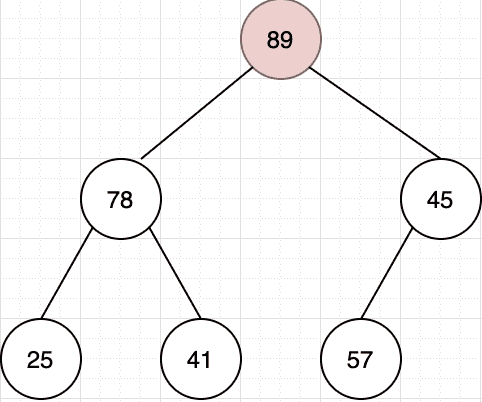

# 爱奇艺 2019 秋招测试开发方向笔试题（A）

## 1

使用堆排序方法排序（45，78，57，25，41，89），初始堆为（      ）

正确答案: B   你的答案: 空 (错误)

```cpp
78,45,57,25,41,89
```

```cpp
89,78,57,25,41,45
```

```cpp
89,78,25,45,41,57
```

```cpp
89,45,78,41,57,25
```

本题知识点

排序 *讨论

[修改昵称失败](https://www.nowcoder.com/profile/947651)

首先建立完全二叉树
从最后一个叶子节点开始第一次交换了 57 和 89 的位置然后比较 45 和 89，进行交换
再比较换下来的 45，45 不符合大根堆，与 57 交换

发表于 2019-05-29 21:11:08

* * *

[叫我皮卡丘](https://www.nowcoder.com/profile/1078265)


发表于 2019-08-05 17:40:53

* * *

[牛客 ID：507639719](https://www.nowcoder.com/profile/507639719)

堆排序 (Heap sort) 就是利用堆(假设利用大顶堆)进行排序的方法 。基本思想是

1.  构建初始堆
2.  将根节点与末尾元素交换，进行堆构造（末尾元素不参与）
3.  重复 2 过程，直到“堆”仅剩 1 个元素。

```cpp
function HeapSort(arr) {
  arr = [0, ...arr]; // 方便左右子树表示
  //第一步，构建初始堆
  for (let i = ~~Math.length / 2; i > 0; i--) {
    buildHeap(arr, i, arr.length);
  }

  for (let i = arr.length; i > 1; i--) {
    // 交换
    [arr[1], arr[i - 1]] = [arr[i - 1], arr[1]];
    // 根元素与末尾元素交换，再构建大顶堆
    buildHeap(arr, 1, i - 1);
  }
  return arr.slice(1); // 移除添加的 0 元素
}

// 构造大顶堆
function buildHeap(arr, i, length) {
  let temp = arr[i];
  for (let j = 2 * i; j <= length; j *= 2) {
    if (arr[j] < arr[j + 1]) j++;
    if (temp > arr[j]) break;
    arr[i] = arr[j];
    i = j;
  }
  arr[i] = temp;
}

// ------- 测试
let arr = [3, 9, 5, 2, 6];
console.log(HeapSort(arr)); // [ 9, 5, 6, 2, 3 ]

arr = [5, 3, 9, 8, 3, 4];
console.log(HeapSort(arr)); // [ 8, 3, 3, 5, 9, 4 ]
```

发表于 2019-06-09 09:31:00

* * *

## 2

6 个圆盘的汉诺塔，总的移动次数是（      ）

正确答案: D   你的答案: 空 (错误)

```cpp
30
```

```cpp
33
```

```cpp
60
```

```cpp
63
```

本题知识点

递归

讨论

[Michael264](https://www.nowcoder.com/profile/54836329)

> **定义** Hanoi(n, a, b, c)：将 n 个盘子从 a 柱移到 c 柱，b 柱起中转作用。f(n)：n 个盘子的汉诺塔的总移动次数。

**Hanoi(n, a, b, c) = Hanoi(n-1, a, c, b) + 1 + Hanoi(n-1, b, a, c)**：将 a 上面 n-1 个盘子移到 b，再将 a 最下面的盘子移到 c，再将 b 上的 n-1 个盘子移到 c，此时，**n 盘子汉诺塔问题 **变成了**移****动一个盘子 + ****两个 n-1 盘子汉诺塔问题。**故 **f(n) = f(n-1) + 1 + f(n-1) = 2f(n-1) + 1****=> f(n) + 1 = 2(f(n-1) + 1) ****=> f(n) + 1 = 2^(n-1) (f(1) + 1)****=> f(n) + 1 = 2^n****=> f(n) = 2^n -1**

发表于 2019-08-14 19:29:51

* * *

[忽然间要很好](https://www.nowcoder.com/profile/587724363)

f(1)=1f(2)=3f(n)=2*f(n-1)+1 相当于借助 B 柱 将 A 柱上前 n-1 个盘先放在 B 柱上（f(n-1)），再挪最后一个盘到 c 盘(+1)，之后再挪 B 柱的 n-1 个盘到 C 柱（f(n-1)），递归循环。

发表于 2019-05-30 12:37:57

* * *

[问纤](https://www.nowcoder.com/profile/857851073)

2＾n - 1

发表于 2019-06-07 09:40:52

* * *

## 3

设哈希表长为 11，哈希函数为 Hash (key)=key%11。存在关键码{43,7,29,22,16,92,44,8,19}，采用二次探测法处理冲突，建立的 hash 表为（    ）

正确答案: B   你的答案: 空 (错误)

```cpp
其他几项都不对
```

本题知识点

安卓工程师 爱奇艺 C++工程师 iOS 工程师 Java 工程师 测试工程师 算法工程师 前端工程师 运维工程师 哈希 *2019 测试开发工程师 大数据开发工程师* *讨论

[冲上顶峰](https://www.nowcoder.com/profile/189892324)

解析：采用开放定址法处理冲突中的二次探测再散列（也即是题目中的二元探测法）,则哈希函数变为 Hash(key） = (Hash(key)  + d) % 11，其中 d = 1², -1², 2², -2², 3²,……，则开始计算。

对于 43，代入公式为 Hash(43) = 43 % 11 = 10, 则地址为 10；

对于 7，代入公式为 Hash(7) = 7 % 11 = 7,则地址为 7；

对于 29，代入公式为 Hash(29) = 29 % 11 = 7, 与 7 冲突，则采用二次探测进行消除冲突， 继续(7 + 1) % 11 = 8，没有冲突，则地址为 8；

对于 22，代入公式 Hash(22) = 22 % 11 = 0, 则地址为 0；

对于 16，代入公式 Hash(16) = 16 % 11 = 5, 则地址为 5；

对于 92，代入公式 Hash(92) = 92 % 11 = 4,则地址为 4；

对于 44，代入公式 Hash(44) = 44 % 11 = 0, 与 22 的地址冲突，则继续(0 + 1) % 11 = 1,没有冲突，则地址为 1；

对于 8， 代入公式 Hash(8) = 8 % 11 = 8, 与 29 有冲突，则继续(8 + 1) % 11 = 9, 没有冲突，则地址为 9；

对于 19，代入公式 Hash(19) = 19 % 11 = 8\. 与 29 有冲突，则继续(8 + 1) * 11 = 9, 与 8 有冲突，继续(8 - 1) % 11 = 7, 与 7 有冲突，则继续(8 + 4) % 11 = 1, 与 44 有冲突，则继续(8 - 4) % 11 = 4, 与 92 有冲突，则继续(8 + 9) % 11 = 6, 没有冲突，则地址为 6.

所以最后得到的 Hash 表为下图所示：


发表于 2019-06-01 19:33:14

* * *

[sugarhit](https://www.nowcoder.com/profile/598224351)

真的。字太小了。19 和 29 根本看不清

发表于 2019-08-20 15:36:44

* * *

[OKOKOKOKOK](https://www.nowcoder.com/profile/2857851)

二次探测法：设发生冲突的地址为 d，则新的地址序列为 d+1²,d-1²,d+2²,d-2²,...

发表于 2019-05-30 14:11:07

* * *

## 4

有关希尔排序算法叙述正确的是（      ）

正确答案: A B   你的答案: 空 (错误)

```cpp
最后一次的步长增量一定为 1
```

```cpp
分割后子序列内部的排序算法是直接插入排序
```

```cpp
分割后子序列内部的排序算法是直接选择排序
```

```cpp
希尔排序是稳定排序算法
```

本题知识点

安卓工程师 爱奇艺 C++工程师 iOS 工程师 Java 工程师 测试工程师 算法工程师 前端工程师 运维工程师 排序 *2019 测试开发工程师 大数据开发工程师* *讨论

[Yd。201906031539658](https://www.nowcoder.com/profile/907160213)

[Shell 排序](https://baike.baidu.com/item/Shell%E6%8E%92%E5%BA%8F)的执行时间依赖于[增量](https://baike.baidu.com/item/%E5%A2%9E%E9%87%8F)序列。好的[增量](https://baike.baidu.com/item/%E5%A2%9E%E9%87%8F)序列的共同特征：① 最后一个[增量](https://baike.baidu.com/item/%E5%A2%9E%E9%87%8F)必须为 1；② 应该尽量避免序列中的值(尤其是相邻的值)互为倍数的情况。有人通过大量的实验，给出了较好的结果：当 n 较大时，比较和移动的次数约在 nl.25 到 1.6n1.25 之间。2．Shell 排序的时间性能优于[直接插入排序](https://baike.baidu.com/item/%E7%9B%B4%E6%8E%A5%E6%8F%92%E5%85%A5%E6%8E%92%E5%BA%8F)希尔排序的时间性能优于[直接插入排序](https://baike.baidu.com/item/%E7%9B%B4%E6%8E%A5%E6%8F%92%E5%85%A5%E6%8E%92%E5%BA%8F)的原因：①当文件初态基本有序时[直接插入排序](https://baike.baidu.com/item/%E7%9B%B4%E6%8E%A5%E6%8F%92%E5%85%A5%E6%8E%92%E5%BA%8F)所需的比较和移动次数均较少。②当 n 值较小时，n 和  的差别也较小，即[直接插入排序](https://baike.baidu.com/item/%E7%9B%B4%E6%8E%A5%E6%8F%92%E5%85%A5%E6%8E%92%E5%BA%8F)的最好[时间复杂度](https://baike.baidu.com/item/%E6%97%B6%E9%97%B4%E5%A4%8D%E6%9D%82%E5%BA%A6)O(n)和最坏时间复杂度 0(  )差别不大。③在希尔排序开始时[增量](https://baike.baidu.com/item/%E5%A2%9E%E9%87%8F)较大，分组较多，每组的记录数目少，故各组内直接插入较快，后来增量 di 逐渐缩小，分组数逐渐减少，而各组的记录数目逐渐增多，但由于已经按 di-1 作为距离排过序，使文件较接近于有序状态，所以新的一趟排序过程也较快。因此，希尔排序在效率上较直接插入排序有较大的改进。

发表于 2019-06-03 16:49:08

* * *

[Zoe 小茗](https://www.nowcoder.com/profile/324939503)

排序最后一次则会对间隔为 1 的元素，也就是相邻元素执行标准插入排序。

发表于 2019-08-04 15:19:53

* * *

[Juventus-🐂](https://www.nowcoder.com/profile/79434593)

希尔排序的执行时间依赖于增量序列。最后一个增量必须为 1，时间性能优于直接插入排序。

发表于 2022-01-23 15:41:36

* * *

## 5

广义表 K=(m,n,(p,(q,s)),(h,f)),则 head[tail[head[tail[tail(K)]]]]的值为（      ）

正确答案: B   你的答案: 空 (错误)

```cpp
s
```

```cpp
q
```

```cpp
p
```

```cpp
h
```

本题知识点

安卓工程师 爱奇艺 C++工程师 iOS 工程师 Java 工程师 测试工程师 算法工程师 前端工程师 运维工程师 链表 *2019 测试开发工程师 大数据开发工程师* *讨论

[冲上顶峰](https://www.nowcoder.com/profile/189892324)

head() 返回列表的第一个元素；

tail() 返回列表的删去第一个元素之后的剩余列表；K=(m,n,(p,(q,s)),(h,f)),
head[tail[head[tail[tail(K)]]]]
tail(K)-------(n,(p,(q,s)),(h,f))tail[tail[K]]--------((p,(q,s)),(h,f))head()-----((p,(q,s))tail()-----(q,s)head()-------q

发表于 2019-06-01 19:30:59

* * *

[Astrallee](https://www.nowcoder.com/profile/376787917)

我为什么觉得是（p,s)啊，前面的 tail 也是按照这个思路来的。取到最后两个的时候是(p,(q,s))。 tail 一次 不应该是((q,s))吗

发表于 2019-12-06 23:33:27

* * *

[OKOKOKOKOK](https://www.nowcoder.com/profile/2857851)

从最里层括号一直向外计算。head(a,b)：保留括号第一个元素 a，去除其余 tail(a,b)：去除第一个元素 a，保留其余

发表于 2019-05-30 14:16:30

* * *

## 6

在一个空的 5 阶 B-树中依次插入关键字序列{6,8,15,16,22,10,18,32,20}，插入完成后，关键字 6 所在结点包含的关键字个数为（      ）

正确答案: B   你的答案: 空 (错误)

```cpp
2
```

```cpp
3
```

```cpp
4
```

```cpp
5
```

本题知识点

爱奇艺 树 2019

讨论

[newcomer](https://www.nowcoder.com/profile/291053)

一颗 m 阶 B 树，非叶节点至多可以有 m-1 个关键字，至少可以有 ceil(n/2)-1 个，根节点可以至少有一个关键字。根据这个原则，可以画出 5 阶 B 树的构建过程，如下图所示：

编辑于 2019-07-03 10:22:34

* * *

[漫步云端.](https://www.nowcoder.com/profile/478154402)

这篇博客写的挺好[`blog.csdn.net/li_canhui/article/details/85305147`](https://blog.csdn.net/li_canhui/article/details/85305147)

发表于 2019-08-28 21:36:48

* * *

[默默学习的啦啦啦](https://www.nowcoder.com/profile/146773881)

n 阶 B-树，每个结点中关键字个数范围为 ceil(n/2) - 1 ~ n-1 个，因此为 2-4 个，插入时首先插入 6,8,15,16；再插入 22 时结点个数大于 4，因此取 15 为中间结点拆分，变成 15 - (6,8),(16,22)，继续插入 10,18,32 变成 15 - (6,8,10),(16,18,22,32)，再插入 20 时结点个数大于 4，取 20 为中间结点拆分，合并到根节点上变为(15,20) - (6,8,10),(16,18),(22,32)

编辑于 2019-05-31 09:42:32

* * *

## 7

在求两个集合并集的过程中，可能需用到的操作是（      ）  

正确答案: A B C D   你的答案: 空 (错误)

```cpp
取元素
```

```cpp
插入元素
```

```cpp
比较操作
```

```cpp
求表长
```

本题知识点

安卓工程师 爱奇艺 C++工程师 iOS 工程师 Java 工程师 测试工程师 算法工程师 前端工程师 运维工程师 哈希 *2019 测试开发工程师 大数据开发工程师* *讨论

[叫我皮卡丘](https://www.nowcoder.com/profile/1078265)

需求：求两个集合的并集 1\. 取元素，至少得知道集合存的是啥元素 2\. 插入元素，并集可能存在集合 A 中有而集合 B 中无的元素，需要插入到新的集合中 3\. 比较操作，判断是否相等 4\. 求表长，完整遍历

发表于 2019-08-05 17:54:29

* * *

[拾陆 humin](https://www.nowcoder.com/profile/334013855)

联想 归并排序

发表于 2019-06-13 18:51:00

* * *

[冲上顶峰](https://www.nowcoder.com/profile/189892324)

还需要求表长

发表于 2019-06-01 19:27:00

* * *

## 8

TCP 协议与 UDP 协议负责端到端连接，下列那些信息只出现在 TCP 报文，UDP 报文不包含此信息（      ）

正确答案: A D   你的答案: 空 (错误)

```cpp
序列号
```

```cpp
源端口
```

```cpp
目标端口
```

```cpp
窗口大小
```

本题知识点

安卓工程师 爱奇艺 C++工程师 iOS 工程师 Java 工程师 测试工程师 算法工程师 前端工程师 运维工程师 网络基础 2019 测试开发工程师 大数据开发工程师

讨论

[叫我皮卡丘](https://www.nowcoder.com/profile/1078265)

UDP 头部信息只有 4 个，从哪来：源端口到哪去：目的端口有多长：长度对不对：校验和

发表于 2019-08-05 18:13:13

* * *

[冲上顶峰](https://www.nowcoder.com/profile/189892324)

[`www.cnblogs.com/steven520213/p/8005258.html`](https://www.cnblogs.com/steven520213/p/8005258.html)**UDP****的包头结构：**
    源端口 16 位
    目的端口 16 位
    长度 16 位
    校验和 16 位

发表于 2019-06-01 19:41:07

* * *

[newcomer](https://www.nowcoder.com/profile/291053)

TCP 与 UDP 最大的不同就是前者是可靠传输，后者是不可靠的。为了保证可靠传输，TCP 采用了一系列机制，比如序列号是指客户端确认序列号以及以前的信息都收到了，窗口大小则是提高传输效率，保证信息按序到达。这些很明显 UDP 是没有的。

发表于 2019-07-03 09:09:53

* * *

## 9

程序员编写程序时使用文件系统提供的系统调用将内存中由 address 地址开始的 n 个字节或 n 个记录的信息写入指定文件中，但发现文件名不可用，可行的解决办法是（）

正确答案: A B   你的答案: 空 (错误)

```cpp
使用文件描述符代替文件名
```

```cpp
使用文件句柄代替文件名
```

```cpp
使用当前进程的 PCB 编号代替
```

```cpp
以上办法都不可行
```

本题知识点

安卓工程师 爱奇艺 C++工程师 iOS 工程师 Java 工程师 测试工程师 算法工程师 前端工程师 运维工程师 操作系统 2019 测试开发工程师 大数据开发工程师

讨论

[dylmail](https://www.nowcoder.com/profile/501837184)

**无论是文件句柄（Windows 中概念），还是文件描述符（linux 中概念），其最终目的都是用来定位打开的文件在内存中的位置，只是它们映射的方式不一样。****PCB（进程控制块）在 linux 中具体实现是 task_struct 数据结构，这些进程必须要有唯一标识符，所以里面含有 pid（进程 ID）**

发表于 2020-06-30 17:24:38

* * *

[360 公司内推小助手](https://www.nowcoder.com/profile/385100296)

文件句柄与文件描述符 [`www.cnblogs.com/ChunJian-YANG/p/5322041.html`](https://www.cnblogs.com/ChunJian-YANG/p/5322041.html)

发表于 2019-06-03 15:27:55

* * *

## 10

某软件公司正在升级一套水务管理系统。该系统用于县市级供排水企业、供水厂、排水厂中水务数据的管理工作。系统经重新整合后，开发人员决定不再使用一张备份数据表 waterinfo001 表，需永久删除。选出符合要求的语句。 

正确答案: C   你的答案: 空 (错误)

```cpp
DELETE TABLE waterinfo001
```

```cpp
DELETE FROM TABLE waterinfo001
```

```cpp
DROP TABLE waterinfo001
```

```cpp
DROP FROM TABLE waterinfo001
```

本题知识点

安卓工程师 爱奇艺 C++工程师 iOS 工程师 Java 工程师 测试工程师 算法工程师 前端工程师 运维工程师 数据库 SQL 2019 测试开发工程师 大数据开发工程师

讨论

[夏花爱秋叶](https://www.nowcoder.com/profile/4085682)

```cpp
1. drop 是完全删除表，包括表结构
2. delete 是删除表数据，保留表的结构，而且可以加 where,只删除一行或者多行
3. truncate 只能删除表数据，会保留表结构，而且不能加 where

```

发表于 2020-03-11 11:37:04

* * *

[叫我皮卡丘](https://www.nowcoder.com/profile/1078265)

DELETE FROM waterinfo001;清除 waterinfo001 表全部记录 DROP TABLE waterinfo001;删除 waterinfo001 表

编辑于 2019-11-07 08:05:54

* * *

[fighting.java](https://www.nowcoder.com/profile/543231756)

| 1. drop 是完全删除表，包括表结构 2. delete 是删除表数据，保留表的结构，而且可以加 where,只删除一行或者多行 3. truncate 只能删除表数据，会保留表结构，而且不能加 where |

发表于 2020-04-29 20:33:49

* * *

## 11

在测试计划阶段需要根据（      ）完成测试进度的制定

正确答案: A   你的答案: 空 (错误)

```cpp
SOW
```

```cpp
HLD
```

```cpp
LLD
```

```cpp
UTC
```

本题知识点

Java 工程师 C++工程师 测试工程师 爱奇艺 软件测试 测试开发工程师 2019

讨论

[你谁呀](https://www.nowcoder.com/profile/196874365)

SOW:statement of work，工作任务说明书 HLD: High Level Design,概要设计说明书 LLD: Low Level Design，详细设计说明书 UTC: Unit Testing Cases，单元测试用例

发表于 2019-07-13 09:45:47

* * *

[哄哄冲鸭！](https://www.nowcoder.com/profile/892906202)

SOW statement of work 工作任务说明书 HLD high level design 概要设计说明书 LLD low level design 详细设计说明书 UTC unit test cases 单元测试用例

发表于 2020-08-10 14:17:43

* * *

[努力奔跑的逐](https://www.nowcoder.com/profile/366691593)

SOW:statement of work，工作任务说明书 HLD: High Level Design,概要设计说明书 LLD: Low Level Design，详细设计说明书 UTC: Unit Testing Cases，单元测试用例

发表于 2021-06-30 07:07:55

* * *

## 12

2 元地铁票售票软件：投币 2 元时，按下“2 元”按钮，弹出相应地铁票；投币 5 元，则弹出地铁票同时退还 3 元，若对该功能进行测试用例设计最宜选择哪种方法（      ）

正确答案: D   你的答案: 空 (错误)

```cpp
等价类划分法
```

```cpp
边界值分析
```

```cpp
错误推测法
```

```cpp
因果图
```

本题知识点

Java 工程师 C++工程师 测试工程师 爱奇艺 软件测试 测试开发工程师 2019

讨论

[没有人路过的行星](https://www.nowcoder.com/profile/461849744)

这道题容易错选 A，A 应该是不确定输入值或者可输入值过多，只能划分区间，而题目中的地铁投币已经限定了可投币的类型，也就限定了输入值，那么通过确定的输入推导可能的输出，正好符合因果图。

发表于 2020-03-15 19:39:05

* * *

[牛客 47163106 号](https://www.nowcoder.com/profile/47163106)

首先不存在有效和无效条件，不能使用等价类划分；其次没有给出数值范围，不能使用边界值分析；最后错误推导法凭借经验，这个不适合

发表于 2020-12-06 12:26:37

* * *

[倦眼问酒书 i](https://www.nowcoder.com/profile/1903371)

因果图是从需求中找出因（输入条件）和果（输出或程序改变的状态），通过因果图转化为判定表。 1.输入条件之间的关系（组合、约束） 2.输入与输出的关系 3.输出条件的关系

发表于 2019-07-16 12:21:05

* * *

## 13

在执行集成测试阶段，需要输出的是（      ）

正确答案: D   你的答案: 空 (错误)

```cpp
集成测试用例
```

```cpp
集成测试代码
```

```cpp
集成测试脚本
```

```cpp
集成测试报告
```

本题知识点

Java 工程师 C++工程师 测试工程师 爱奇艺 软件测试 测试开发工程师 2019

讨论

[牛客 685897295 号](https://www.nowcoder.com/profile/685897295)

这题目是有歧义吗？问的是什么产生了输出还是产生的输出是什么……

发表于 2020-02-11 21:10:36

* * *

[azedplayer](https://www.nowcoder.com/profile/1871642)

这题目入土吧。阴间题目

发表于 2020-08-04 16:49:37

* * *

[牛客 240913849 号](https://www.nowcoder.com/profile/240913849)

执行集成测试阶段  注意“执行”   产生的就是集成测试报告了

发表于 2020-04-17 01:12:13

* * *

## 14

自顶向下增量式集成测试的缺点包括（      ）

正确答案: B C   你的答案: 空 (错误)

```cpp
驱动的开发工作量大
```

```cpp
底层验证被推迟
```

```cpp
底层组间测试不充分
```

```cpp
设计上的错误不能及时被发现
```

本题知识点

Java 工程师 C++工程师 测试工程师 爱奇艺 软件测试 测试开发工程师 2019

讨论

[牛客 579107075 号](https://www.nowcoder.com/profile/579107075)

集成测试的基础策略有很多，通常分为两种：非增量式集成测试策略和增量式集成测试策略

第一种：非增量式集成测试策略

非增量式集成测试策略也叫做大爆炸集成、一次性集成；

即在最短的时间内把所有的系统组件一次性集成到被测系统中，并通过最少的用例来验证整个系统，不考虑各组件之间的相互依赖性或者可能存在的风险。

优点：

*   容易理解，比较简单

*   可以多人并行工作，对人力物力资源的利用率较高。

缺点：

*   问题定位和修改都比较困难
*   即使被测系统能够被一次性集成，但是还会有许多接口上测试被遗漏，甚至会躲过测试遗留在系统中。

适用场景：

*   适用于维护型的项目，并且新增的项目只有少数的模块被增加或修改
*   适用于测试系统比较小，并且各个组件都经过了充分的单元测试。

第二种：增量式集成测试策略

增量式集成的策略有很多种：自顶向下集成，自底向上集成，三明治集成，基于功能集成，基于风险集成，基于分布式集成等。

该策略最大的特点就是：支持故障隔离、定位问题

1，自顶向下集成:(个人理解：随着底层不断增加，测试越来越难以全面。)

  自顶向下集成首先要集成主控制模块，然后从软件控制层次结构向下逐步集成，可以采用深度优先或者广度优先进行集成测试，主要验证接口的稳定性。

优势：

*   能够较早的验证主要的控制点和判断点，如果主控制出现问题能够及时发现。

*   深度优先：首先实现并验证一个完整的功能需求的正确性

缺点：

      桩的开发和维护是该方法的最大问题，底层模块增加，系统越来越复杂，底层模块从测试会越来越不充分。

使用场景：

        接口变化比较小的项目并且控制结构比较清晰。

2.自底向上集成

对底层模型的行为进行较早的验证，早期可能出现并行的测试。

缺点：

      对顶部的验证推迟了，设计上的错误不能被及时发现，随着顶层的集成，对产品底部的异常越来越难发现。

使用场景：

      顶层接口变化比较复杂的，变化比较频繁的系统

3.三明治集成

  三明治集成属于混合式集成，综合了自顶向下和自底向上集成的优缺点；测试的时候，将被测软件分成三份，中间一份为目标层，目标层的上部分采用自顶向下集成策略，下部分采用自底向上集成策略。最后在目标层进行会和。

缺点：

      最大的缺点就是对中间层的测试不够充分；

使用场景：

    适用于大多数项目。使用时要尽可能的减少驱动模块和桩模块的数量。

4.基于功能集成

     基于功能角度出发，按照功能的关键程度对功能模块进行集成。

缺点：

    对一些接口测试不充分。系统很复杂的时候，功能之间的相互联系很难分析清楚，会造成大量的冗余测试

5.基于风险集成

     是一种假设，系统风险度较高的模块间的集成往往是错误集中的地方。

优点：

     加速系统的稳定性。

关键点：

      风险的识别和评估。

通常跟基于功能集成合用

6.基于分布式集成

    主要是验证松散耦合的同级模块之间的交互稳定性。在一个分布式系统中，由于没有专门的控制轨迹，没有专门的服务层，所以构造测试包非常困难，主要验证远程主机之间的接口是否具有最低限度的可操作性。

使用场景：

   主要用在分布式系统中。

发表于 2020-09-17 11:43:38

* * *

[寻找那颗星](https://www.nowcoder.com/profile/126719889)

**自顶向下测试**：是从程序的初始模块开始测试。

（1）该方***在早期发现顶层的错误。

（2）早期的程序框架可以进行演示

（3）需要开发桩模块辅助测试。有些甚至需要多个桩模块辅助，加大了桩模块本来的错误影响。

（4）测试完一个上层模块后，挑选哪个模块作为下一个测试模块，以及测试的顺序没有唯一的界定标准。

**优点**：较早地验证了主要控制和判断点；按深度优先可以首先实现和验证一个完整的软件功能；功能较早证实，带来信心；只需一个驱动，减少驱动器开发的费用；支持故障隔离。

**缺点**：柱的开发量大；底层验证被推迟；底层组件测试不充分。**注意;自底向上才需要驱动开发模块。**

发表于 2019-07-16 22:16:21

* * *

[BubbleTg](https://www.nowcoder.com/profile/3275039)

完美错过正确选项。。。。

发表于 2019-11-11 00:50:22

* * *

## 15

测试人员在 Windows Server 2003 系统下，通过逐步增加用户数对某购物网站进行测试，统计发现该平台在吞吐量超过 300 页每秒时，系统处于失效状态。该测试内容为哪种测试（      ）

正确答案: C   你的答案: 空 (错误)

```cpp
性能测试
```

```cpp
负载测试
```

```cpp
压力测试
```

```cpp
系统测试
```

本题知识点

Java 工程师 C++工程师 测试工程师 爱奇艺 软件测试 测试开发工程师 2019

讨论

[kobbe](https://www.nowcoder.com/profile/653410323)

负载测试是通过改变系统负载方式、增加负载等来发现系统中所存在的性能问题。负载测试是一种测试方法，可以为性能测试、压力测试所采用。
性能测试是为获取或验证系统性能指标而进行测试。多数情况下，性能测试会在不同负载情况下进行。
压力测试通常是在高负载情况下来对系统的稳定性进行测试，更有效地发现系统稳定性的隐患和系统在负载峰值的条件下功能隐患等。

发表于 2019-08-06 17:11:54

* * *

[悠悠 0227](https://www.nowcoder.com/profile/290762924)

压力测试是测试软件的瓶颈和极限 负载测试是性能在极限情况下能坚持多久

发表于 2019-08-12 19:43:53

* * *

[菜包包 hyf](https://www.nowcoder.com/profile/498189482)

压力测试可理解为找到一个阈值，而负载测试可理解为坚持的时间

发表于 2019-08-26 14:33:18

* * *

## 16

我们在调试程序的时候，最常使用的就是设置断点，这种断点设置方式是位置断点，即就是在源程序的行前点击（      ）快捷键，即可设置一个位置断点。

正确答案: C   你的答案: 空 (错误)

```cpp
F1
```

```cpp
F5
```

```cpp
F9
```

```cpp
F10
```

本题知识点

Java 工程师 C++工程师 测试工程师 爱奇艺 调试工具 测试开发工程师 2019

讨论

[你快乐吗](https://www.nowcoder.com/profile/5271388)

不同的 IDE，快捷键应该不一样吧

发表于 2020-07-11 09:59:11

* * *

[牛客 367517028 号](https://www.nowcoder.com/profile/367517028)

能不能不要出这样的题啊

发表于 2021-04-06 22:08:32

* * *

[h2lloworld](https://www.nowcoder.com/profile/8885333)

这道题是真的很 奇怪呢。。。

发表于 2020-08-19 15:33:35

* * *

## 17

使用 Eclipse 调试应用程序，如果要查看当前类或者接口的继承关系，默认进入时，显示的是（      ）。

正确答案: B   你的答案: 空 (错误)

```cpp
当前类/接口继承或实现的超类、接口
```

```cpp
继承或者实现当前类/接口的子类、子接口
```

```cpp
当前类或者接口
```

```cpp
继承关系直接全部展示
```

本题知识点

Java 工程师 C++工程师 测试工程师 爱奇艺 调试工具 测试开发工程师 2019

讨论

[你快乐吗](https://www.nowcoder.com/profile/5271388)

调试模式下，进入的是当前类/接口的子类/子接口；如果直接按 ctrl 键，点击进入的是当前类/接口的父类/父接口。

发表于 2020-07-11 09:53:16

* * *

## 18

网络管理员在/opt 目录下编写了 setup.sh 安装 office 应用软件的 shell 程序,不指定路径可以直接执行 setup.sh 的方法是（      ）

正确答案: A B   你的答案: 空 (错误)

```cpp
PATH=".:$PATH"
```

```cpp
export PATH="$PATH:/opt"
```

```cpp
PATH="PATH:/opt"
```

```cpp
path="$path:."
```

本题知识点

Java 工程师 C++工程师 测试工程师 爱奇艺 shell 测试开发工程师 2019

讨论

[牛客 987320741 号](https://www.nowcoder.com/profile/987320741)

选项 APATH=".:$PATH"可以在 Shell 交互模式下直接赋值，因为 PATH 是环境变量，所以添加当前目录是可以的（既本题中描述的当前目录/opt）,注意赋值的字符串中环境变量 PATH 需$符打头，间隔的多个路径需要以冒号“:”分隔。选项 B  效果与选项 A 一致，使用 export 指令设置环境变量选项 C  赋值的字符串中环境变量 PATH 需$符打头，本选项中没有，所以错误选项 D  PATH 环境变量是大写字母，本选项中全为小写，被当成其它的变量而非环境变量 PATH，所以错误应选：A B

编辑于 2020-08-20 09:32:56

* * *

[起什么名字呢好迷茫](https://www.nowcoder.com/profile/172593675)

`PATH=".:$PATH"`
以上命令代表把当前目录放入环境变量

发表于 2020-03-06 19:45:18

* * *

[云海翻腾](https://www.nowcoder.com/profile/897474272)

扯淡玩意

发表于 2021-02-02 10:16:01

* * *

## 19

以下声明错误的有：

正确答案: D   你的答案: 空 (错误)

```cpp
dic = {}
```

```cpp
dic = {100:200}
```

```cpp
dic = {(1,2,3):'test'}
```

```cpp
dic = {[1,2,3]:'test'}
```

本题知识点

Java 工程师 C++工程师 测试工程师 爱奇艺 算法工程师 Python 测试开发工程师 2019 大数据开发工程师

讨论

[村雨 1943](https://www.nowcoder.com/profile/717384)

答案：D

分析：

Python 的字典数据类型中，每个值由一对键值对组成，即 key:value，但是 key 值必须为不可变的类型；
A，声明了一个空的字典；
B，数值为不可变类型；
C，tuple 为不可变类型；
D，list 为可变类型；

发表于 2019-11-29 11:25:38

* * *

[neoinheart](https://www.nowcoder.com/profile/945992423)

**可变(mutable)对象类型 ：**list、dict、set、bytearray、user-defined classes (unless specifically made immutable)**不可变(immutable)对象类型： **int、float、decimal、complex、bool、str、tuple、range、frozenset、bytes
**备注：[`www.cnblogs.com/shiyublog/p/10809953.html`](https://www.cnblogs.com/shiyublog/p/10809953.html)**

发表于 2019-10-16 21:07:37

* * *

[xuehuia](https://www.nowcoder.com/profile/562039162)

字典的键值必须是不可变类型，如数字，字符串，元组，而列表是可变类型。

发表于 2020-05-16 21:48:52

* * *

## 20

下列代码输出为：

```cpp
str1 = "Hello,Python";
str2 = "Python";
print(str1.index(str2));
```

正确答案: B   你的答案: 空 (错误)

```cpp
5
```

```cpp
6
```

```cpp
7
```

```cpp
8
```

本题知识点

Java 工程师 C++工程师 测试工程师 爱奇艺 算法工程师 Python 测试开发工程师 2019 大数据开发工程师

讨论

[妙蛙种子不吃冰糖葫芦](https://www.nowcoder.com/profile/901372368)

str2 指向字符串 Python 的起始位置，即 P 所在的位置。

str1.index(str2)即返回 str1 中 str2 指向的 P 位置的下标。

str1 是一个字符串，下标从 0 开始数起，数到 P 就是 6，注意逗号在字符串内也占一个位置。

发表于 2020-02-19 21:33:18

* * *

[极度 Vs 伯爵](https://www.nowcoder.com/profile/8096260)

语法

index()方法语法：

```cpp
str.index(str, beg=0,  end=len(string))
```

参数

*   str -- 指定检索的字符串
*   beg -- 开始索引，默认为 0。
*   end -- 结束索引，默认为字符串的长度。

从 Hello 开始数到 p 截止，从下标 0 开始数

发表于 2019-09-05 15:30:08

* * *

[manjusaka1](https://www.nowcoder.com/profile/299585019)

index(substr，beg=0，end=len(string)):在[beg, end]范围内查找 substring，找到返回 substr 的起始下标，否则返回一个异常 ValueError: substring not found 如：string = 'Hello Python'  print(string.index('h', 0, len(string))) # 输出 9  print(string.index('thon') # 输出 8  print(strin.index('thon', 9, len(string)) # 抛出异常：ValueError: substing not found

发表于 2019-07-11 22:19:05

* * ******