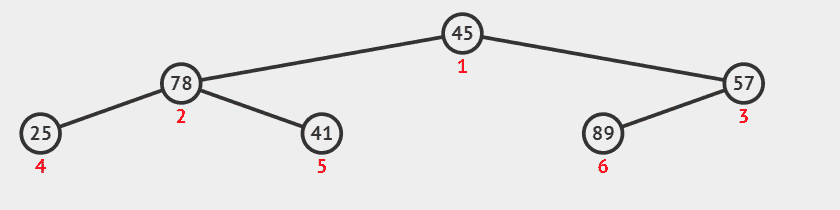
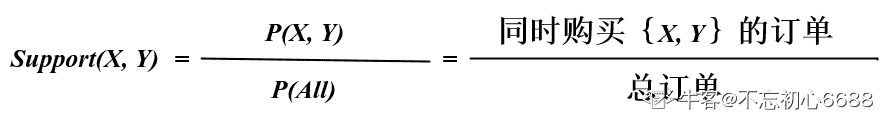

# 爱奇艺 2019 秋招大数据开发方向笔试题（A）

## 1

使用堆排序方法排序（45，78，57，25，41，89），初始堆为（      ）

正确答案: B   你的答案: 空 (错误)

```cpp
78,45,57,25,41,89
```

```cpp
89,78,57,25,41,45
```

```cpp
89,78,25,45,41,57
```

```cpp
89,45,78,41,57,25
```

本题知识点

排序 *讨论

[修改昵称失败](https://www.nowcoder.com/profile/947651)

首先建立完全二叉树
从最后一个叶子节点开始第一次交换了 57 和 89 的位置然后比较 45 和 89，进行交换
再比较换下来的 45，45 不符合大根堆，与 57 交换

发表于 2019-05-29 21:11:08

* * *

[叫我皮卡丘](https://www.nowcoder.com/profile/1078265)



发表于 2019-08-05 17:40:53

* * *

[牛客 ID：507639719](https://www.nowcoder.com/profile/507639719)

堆排序 (Heap sort) 就是利用堆(假设利用大顶堆)进行排序的方法 。基本思想是

1.  构建初始堆
2.  将根节点与末尾元素交换，进行堆构造（末尾元素不参与）
3.  重复 2 过程，直到“堆”仅剩 1 个元素。

```cpp
function HeapSort(arr) {
  arr = [0, ...arr]; // 方便左右子树表示
  //第一步，构建初始堆
  for (let i = ~~Math.length / 2; i > 0; i--) {
    buildHeap(arr, i, arr.length);
  }

  for (let i = arr.length; i > 1; i--) {
    // 交换
    [arr[1], arr[i - 1]] = [arr[i - 1], arr[1]];
    // 根元素与末尾元素交换，再构建大顶堆
    buildHeap(arr, 1, i - 1);
  }
  return arr.slice(1); // 移除添加的 0 元素
}

// 构造大顶堆
function buildHeap(arr, i, length) {
  let temp = arr[i];
  for (let j = 2 * i; j <= length; j *= 2) {
    if (arr[j] < arr[j + 1]) j++;
    if (temp > arr[j]) break;
    arr[i] = arr[j];
    i = j;
  }
  arr[i] = temp;
}

// ------- 测试
let arr = [3, 9, 5, 2, 6];
console.log(HeapSort(arr)); // [ 9, 5, 6, 2, 3 ]

arr = [5, 3, 9, 8, 3, 4];
console.log(HeapSort(arr)); // [ 8, 3, 3, 5, 9, 4 ]
```

发表于 2019-06-09 09:31:00

* * *

## 2

6 个圆盘的汉诺塔，总的移动次数是（      ）

正确答案: D   你的答案: 空 (错误)

```cpp
30
```

```cpp
33
```

```cpp
60
```

```cpp
63
```

本题知识点

递归

讨论

[Michael264](https://www.nowcoder.com/profile/54836329)

> **定义** Hanoi(n, a, b, c)：将 n 个盘子从 a 柱移到 c 柱，b 柱起中转作用。f(n)：n 个盘子的汉诺塔的总移动次数。

**Hanoi(n, a, b, c) = Hanoi(n-1, a, c, b) + 1 + Hanoi(n-1, b, a, c)**：将 a 上面 n-1 个盘子移到 b，再将 a 最下面的盘子移到 c，再将 b 上的 n-1 个盘子移到 c，此时，**n 盘子汉诺塔问题 **变成了**移****动一个盘子 + ****两个 n-1 盘子汉诺塔问题。**故 **f(n) = f(n-1) + 1 + f(n-1) = 2f(n-1) + 1****=> f(n) + 1 = 2(f(n-1) + 1) ****=> f(n) + 1 = 2^(n-1) (f(1) + 1)****=> f(n) + 1 = 2^n****=> f(n) = 2^n -1**

发表于 2019-08-14 19:29:51

* * *

[忽然间要很好](https://www.nowcoder.com/profile/587724363)

f(1)=1f(2)=3f(n)=2*f(n-1)+1 相当于借助 B 柱 将 A 柱上前 n-1 个盘先放在 B 柱上（f(n-1)），再挪最后一个盘到 c 盘(+1)，之后再挪 B 柱的 n-1 个盘到 C 柱（f(n-1)），递归循环。

发表于 2019-05-30 12:37:57

* * *

[问纤](https://www.nowcoder.com/profile/857851073)

2＾n - 1

发表于 2019-06-07 09:40:52

* * *

## 3

设哈希表长为 11，哈希函数为 Hash (key)=key%11。存在关键码{43,7,29,22,16,92,44,8,19}，采用二次探测法处理冲突，建立的 hash 表为（    ）

正确答案: B   你的答案: 空 (错误)

```cpp
其他几项都不对
```

本题知识点

安卓工程师 爱奇艺 C++工程师 iOS 工程师 Java 工程师 测试工程师 算法工程师 前端工程师 运维工程师 哈希 *2019 测试开发工程师 大数据开发工程师* *讨论

[冲上顶峰](https://www.nowcoder.com/profile/189892324)

解析：采用开放定址法处理冲突中的二次探测再散列（也即是题目中的二元探测法）,则哈希函数变为 Hash(key） = (Hash(key)  + d) % 11，其中 d = 1², -1², 2², -2², 3²,……，则开始计算。

对于 43，代入公式为 Hash(43) = 43 % 11 = 10, 则地址为 10；

对于 7，代入公式为 Hash(7) = 7 % 11 = 7,则地址为 7；

对于 29，代入公式为 Hash(29) = 29 % 11 = 7, 与 7 冲突，则采用二次探测进行消除冲突， 继续(7 + 1) % 11 = 8，没有冲突，则地址为 8；

对于 22，代入公式 Hash(22) = 22 % 11 = 0, 则地址为 0；

对于 16，代入公式 Hash(16) = 16 % 11 = 5, 则地址为 5；

对于 92，代入公式 Hash(92) = 92 % 11 = 4,则地址为 4；

对于 44，代入公式 Hash(44) = 44 % 11 = 0, 与 22 的地址冲突，则继续(0 + 1) % 11 = 1,没有冲突，则地址为 1；

对于 8， 代入公式 Hash(8) = 8 % 11 = 8, 与 29 有冲突，则继续(8 + 1) % 11 = 9, 没有冲突，则地址为 9；

对于 19，代入公式 Hash(19) = 19 % 11 = 8\. 与 29 有冲突，则继续(8 + 1) * 11 = 9, 与 8 有冲突，继续(8 - 1) % 11 = 7, 与 7 有冲突，则继续(8 + 4) % 11 = 1, 与 44 有冲突，则继续(8 - 4) % 11 = 4, 与 92 有冲突，则继续(8 + 9) % 11 = 6, 没有冲突，则地址为 6.

所以最后得到的 Hash 表为下图所示：


发表于 2019-06-01 19:33:14

* * *

[sugarhit](https://www.nowcoder.com/profile/598224351)

真的。字太小了。19 和 29 根本看不清

发表于 2019-08-20 15:36:44

* * *

[OKOKOKOKOK](https://www.nowcoder.com/profile/2857851)

二次探测法：设发生冲突的地址为 d，则新的地址序列为 d+1²,d-1²,d+2²,d-2²,...

发表于 2019-05-30 14:11:07

* * *

## 4

有关希尔排序算法叙述正确的是（      ）

正确答案: A B   你的答案: 空 (错误)

```cpp
最后一次的步长增量一定为 1
```

```cpp
分割后子序列内部的排序算法是直接插入排序
```

```cpp
分割后子序列内部的排序算法是直接选择排序
```

```cpp
希尔排序是稳定排序算法
```

本题知识点

安卓工程师 爱奇艺 C++工程师 iOS 工程师 Java 工程师 测试工程师 算法工程师 前端工程师 运维工程师 排序 *2019 测试开发工程师 大数据开发工程师* *讨论

[Yd。201906031539658](https://www.nowcoder.com/profile/907160213)

[Shell 排序](https://baike.baidu.com/item/Shell%E6%8E%92%E5%BA%8F)的执行时间依赖于[增量](https://baike.baidu.com/item/%E5%A2%9E%E9%87%8F)序列。好的[增量](https://baike.baidu.com/item/%E5%A2%9E%E9%87%8F)序列的共同特征：① 最后一个[增量](https://baike.baidu.com/item/%E5%A2%9E%E9%87%8F)必须为 1；② 应该尽量避免序列中的值(尤其是相邻的值)互为倍数的情况。有人通过大量的实验，给出了较好的结果：当 n 较大时，比较和移动的次数约在 nl.25 到 1.6n1.25 之间。2．Shell 排序的时间性能优于[直接插入排序](https://baike.baidu.com/item/%E7%9B%B4%E6%8E%A5%E6%8F%92%E5%85%A5%E6%8E%92%E5%BA%8F)希尔排序的时间性能优于[直接插入排序](https://baike.baidu.com/item/%E7%9B%B4%E6%8E%A5%E6%8F%92%E5%85%A5%E6%8E%92%E5%BA%8F)的原因：①当文件初态基本有序时[直接插入排序](https://baike.baidu.com/item/%E7%9B%B4%E6%8E%A5%E6%8F%92%E5%85%A5%E6%8E%92%E5%BA%8F)所需的比较和移动次数均较少。②当 n 值较小时，n 和  的差别也较小，即[直接插入排序](https://baike.baidu.com/item/%E7%9B%B4%E6%8E%A5%E6%8F%92%E5%85%A5%E6%8E%92%E5%BA%8F)的最好[时间复杂度](https://baike.baidu.com/item/%E6%97%B6%E9%97%B4%E5%A4%8D%E6%9D%82%E5%BA%A6)O(n)和最坏时间复杂度 0(  )差别不大。③在希尔排序开始时[增量](https://baike.baidu.com/item/%E5%A2%9E%E9%87%8F)较大，分组较多，每组的记录数目少，故各组内直接插入较快，后来增量 di 逐渐缩小，分组数逐渐减少，而各组的记录数目逐渐增多，但由于已经按 di-1 作为距离排过序，使文件较接近于有序状态，所以新的一趟排序过程也较快。因此，希尔排序在效率上较直接插入排序有较大的改进。

发表于 2019-06-03 16:49:08

* * *

[Zoe 小茗](https://www.nowcoder.com/profile/324939503)

排序最后一次则会对间隔为 1 的元素，也就是相邻元素执行标准插入排序。

发表于 2019-08-04 15:19:53

* * *

[Juventus-🐂](https://www.nowcoder.com/profile/79434593)

希尔排序的执行时间依赖于增量序列。最后一个增量必须为 1，时间性能优于直接插入排序。

发表于 2022-01-23 15:41:36

* * *

## 5

广义表 K=(m,n,(p,(q,s)),(h,f)),则 head[tail[head[tail[tail(K)]]]]的值为（      ）

正确答案: B   你的答案: 空 (错误)

```cpp
s
```

```cpp
q
```

```cpp
p
```

```cpp
h
```

本题知识点

安卓工程师 爱奇艺 C++工程师 iOS 工程师 Java 工程师 测试工程师 算法工程师 前端工程师 运维工程师 链表 *2019 测试开发工程师 大数据开发工程师* *讨论

[冲上顶峰](https://www.nowcoder.com/profile/189892324)

head() 返回列表的第一个元素；

tail() 返回列表的删去第一个元素之后的剩余列表；K=(m,n,(p,(q,s)),(h,f)),
head[tail[head[tail[tail(K)]]]]
tail(K)-------(n,(p,(q,s)),(h,f))tail[tail[K]]--------((p,(q,s)),(h,f))head()-----((p,(q,s))tail()-----(q,s)head()-------q

发表于 2019-06-01 19:30:59

* * *

[Astrallee](https://www.nowcoder.com/profile/376787917)

我为什么觉得是（p,s)啊，前面的 tail 也是按照这个思路来的。取到最后两个的时候是(p,(q,s))。 tail 一次 不应该是((q,s))吗

发表于 2019-12-06 23:33:27

* * *

[OKOKOKOKOK](https://www.nowcoder.com/profile/2857851)

从最里层括号一直向外计算。head(a,b)：保留括号第一个元素 a，去除其余 tail(a,b)：去除第一个元素 a，保留其余

发表于 2019-05-30 14:16:30

* * *

## 6

在一个空的 5 阶 B-树中依次插入关键字序列{6,8,15,16,22,10,18,32,20}，插入完成后，关键字 6 所在结点包含的关键字个数为（      ）

正确答案: B   你的答案: 空 (错误)

```cpp
2
```

```cpp
3
```

```cpp
4
```

```cpp
5
```

本题知识点

爱奇艺 树 2019

讨论

[newcomer](https://www.nowcoder.com/profile/291053)

一颗 m 阶 B 树，非叶节点至多可以有 m-1 个关键字，至少可以有 ceil(n/2)-1 个，根节点可以至少有一个关键字。根据这个原则，可以画出 5 阶 B 树的构建过程，如下图所示：

编辑于 2019-07-03 10:22:34

* * *

[漫步云端.](https://www.nowcoder.com/profile/478154402)

这篇博客写的挺好[`blog.csdn.net/li_canhui/article/details/85305147`](https://blog.csdn.net/li_canhui/article/details/85305147)

发表于 2019-08-28 21:36:48

* * *

[默默学习的啦啦啦](https://www.nowcoder.com/profile/146773881)

n 阶 B-树，每个结点中关键字个数范围为 ceil(n/2) - 1 ~ n-1 个，因此为 2-4 个，插入时首先插入 6,8,15,16；再插入 22 时结点个数大于 4，因此取 15 为中间结点拆分，变成 15 - (6,8),(16,22)，继续插入 10,18,32 变成 15 - (6,8,10),(16,18,22,32)，再插入 20 时结点个数大于 4，取 20 为中间结点拆分，合并到根节点上变为(15,20) - (6,8,10),(16,18),(22,32)

编辑于 2019-05-31 09:42:32

* * *

## 7

在求两个集合并集的过程中，可能需用到的操作是（      ）  

正确答案: A B C D   你的答案: 空 (错误)

```cpp
取元素
```

```cpp
插入元素
```

```cpp
比较操作
```

```cpp
求表长
```

本题知识点

安卓工程师 爱奇艺 C++工程师 iOS 工程师 Java 工程师 测试工程师 算法工程师 前端工程师 运维工程师 哈希 *2019 测试开发工程师 大数据开发工程师* *讨论

[叫我皮卡丘](https://www.nowcoder.com/profile/1078265)

需求：求两个集合的并集 1\. 取元素，至少得知道集合存的是啥元素 2\. 插入元素，并集可能存在集合 A 中有而集合 B 中无的元素，需要插入到新的集合中 3\. 比较操作，判断是否相等 4\. 求表长，完整遍历

发表于 2019-08-05 17:54:29

* * *

[拾陆 humin](https://www.nowcoder.com/profile/334013855)

联想 归并排序

发表于 2019-06-13 18:51:00

* * *

[冲上顶峰](https://www.nowcoder.com/profile/189892324)

还需要求表长

发表于 2019-06-01 19:27:00

* * *

## 8

TCP 协议与 UDP 协议负责端到端连接，下列那些信息只出现在 TCP 报文，UDP 报文不包含此信息（      ）

正确答案: A D   你的答案: 空 (错误)

```cpp
序列号
```

```cpp
源端口
```

```cpp
目标端口
```

```cpp
窗口大小
```

本题知识点

安卓工程师 爱奇艺 C++工程师 iOS 工程师 Java 工程师 测试工程师 算法工程师 前端工程师 运维工程师 网络基础 2019 测试开发工程师 大数据开发工程师

讨论

[叫我皮卡丘](https://www.nowcoder.com/profile/1078265)

UDP 头部信息只有 4 个，从哪来：源端口到哪去：目的端口有多长：长度对不对：校验和

发表于 2019-08-05 18:13:13

* * *

[冲上顶峰](https://www.nowcoder.com/profile/189892324)

[`www.cnblogs.com/steven520213/p/8005258.html`](https://www.cnblogs.com/steven520213/p/8005258.html)**UDP****的包头结构：**
    源端口 16 位
    目的端口 16 位
    长度 16 位
    校验和 16 位

发表于 2019-06-01 19:41:07

* * *

[newcomer](https://www.nowcoder.com/profile/291053)

TCP 与 UDP 最大的不同就是前者是可靠传输，后者是不可靠的。为了保证可靠传输，TCP 采用了一系列机制，比如序列号是指客户端确认序列号以及以前的信息都收到了，窗口大小则是提高传输效率，保证信息按序到达。这些很明显 UDP 是没有的。

发表于 2019-07-03 09:09:53

* * *

## 9

程序员编写程序时使用文件系统提供的系统调用将内存中由 address 地址开始的 n 个字节或 n 个记录的信息写入指定文件中，但发现文件名不可用，可行的解决办法是（）

正确答案: A B   你的答案: 空 (错误)

```cpp
使用文件描述符代替文件名
```

```cpp
使用文件句柄代替文件名
```

```cpp
使用当前进程的 PCB 编号代替
```

```cpp
以上办法都不可行
```

本题知识点

安卓工程师 爱奇艺 C++工程师 iOS 工程师 Java 工程师 测试工程师 算法工程师 前端工程师 运维工程师 操作系统 2019 测试开发工程师 大数据开发工程师

讨论

[dylmail](https://www.nowcoder.com/profile/501837184)

**无论是文件句柄（Windows 中概念），还是文件描述符（linux 中概念），其最终目的都是用来定位打开的文件在内存中的位置，只是它们映射的方式不一样。****PCB（进程控制块）在 linux 中具体实现是 task_struct 数据结构，这些进程必须要有唯一标识符，所以里面含有 pid（进程 ID）**

发表于 2020-06-30 17:24:38

* * *

[360 公司内推小助手](https://www.nowcoder.com/profile/385100296)

文件句柄与文件描述符 [`www.cnblogs.com/ChunJian-YANG/p/5322041.html`](https://www.cnblogs.com/ChunJian-YANG/p/5322041.html)

发表于 2019-06-03 15:27:55

* * *

## 10

某软件公司正在升级一套水务管理系统。该系统用于县市级供排水企业、供水厂、排水厂中水务数据的管理工作。系统经重新整合后，开发人员决定不再使用一张备份数据表 waterinfo001 表，需永久删除。选出符合要求的语句。 

正确答案: C   你的答案: 空 (错误)

```cpp
DELETE TABLE waterinfo001
```

```cpp
DELETE FROM TABLE waterinfo001
```

```cpp
DROP TABLE waterinfo001
```

```cpp
DROP FROM TABLE waterinfo001
```

本题知识点

安卓工程师 爱奇艺 C++工程师 iOS 工程师 Java 工程师 测试工程师 算法工程师 前端工程师 运维工程师 数据库 SQL 2019 测试开发工程师 大数据开发工程师

讨论

[夏花爱秋叶](https://www.nowcoder.com/profile/4085682)

```cpp
1. drop 是完全删除表，包括表结构
2. delete 是删除表数据，保留表的结构，而且可以加 where,只删除一行或者多行
3. truncate 只能删除表数据，会保留表结构，而且不能加 where

```

发表于 2020-03-11 11:37:04

* * *

[叫我皮卡丘](https://www.nowcoder.com/profile/1078265)

DELETE FROM waterinfo001;清除 waterinfo001 表全部记录 DROP TABLE waterinfo001;删除 waterinfo001 表

编辑于 2019-11-07 08:05:54

* * *

[fighting.java](https://www.nowcoder.com/profile/543231756)

| 1. drop 是完全删除表，包括表结构 2. delete 是删除表数据，保留表的结构，而且可以加 where,只删除一行或者多行 3. truncate 只能删除表数据，会保留表结构，而且不能加 where |

发表于 2020-04-29 20:33:49

* * *

## 11

下面程序的输出结果是（）

```cpp
#include<iostream>
using namespace std;
class ClassA {
    friend long fun (ClassA a) {
        if (a.i < 2) return 1;
        return a.i * fun(ClassA(a.i-1));
    }
public:
    ClassA(long a) { i = a; }
private:
    long i;
};

int main() {
    int sum = 0;
    for (int i = 0; i < 4; i++) {
        sum += fun(ClassA(i));
    }
    cout << sum;
}
```

正确答案: A   你的答案: 空 (错误)

```cpp
10
```

```cpp
12
```

```cpp
16
```

```cpp
34
```

本题知识点

C++工程师 爱奇艺 C++ 2019 C 语言

讨论

[Zzzzzzzzzy](https://www.nowcoder.com/profile/218201376)

直白的说法： 若进入递归的数 x 小于 2，则返回 1，若进入递归的数 x 大于等于 2，则返回 x*f(x-1)

发表于 2019-07-16 11:31:23

* * *

[#请叫我尹小慧~~](https://www.nowcoder.com/profile/320706752)

friend long fun (ClassA a)
    {
        if (a.i < 2) return 1;
        return a.i * fun(ClassA(a.i-1));
    }Class A(i)->a.i = i;func(0)=1func(1)=1   func(2)=2*func(1)=2*1func(3)=3*func(2)=3*2*1 其实这就是一个递归题，func（i）i==0 || i==1,func(i)=1;i>=2,func(i)=i*(i-1)*..* 1

发表于 2019-06-04 21:01:17

* * *

[Qofter](https://www.nowcoder.com/profile/408155192)

i = 0, sum = 0+1;i = 1, sum = 0+1+1;i = 2, sum = 0+1+1+2*1;i = 3, sum = 0+1+1+2*1+3*2;   //10

发表于 2020-10-28 13:11:28

* * *

## 12

下列程序段的功能是将 2~n 的质数放入向量 A 中，请将横线处缺失程序补充完整（）

```cpp
vector<int>  A(10); 
 int n; 
 int count = 0, i, j;
 cin >> n;
 A.reserve(n);
 A[count++] = 2; 
 for(i = 3; i < n; i++)
 { if (i % 2 == 0)
 ;
 j = 3;
 while (j <= i/2 && i % j != 0)
 j += 2; 
 if (j > i/2) A[count++] = i;
 }
```

正确答案: A   你的答案: 空 (错误)

```cpp
continue
```

```cpp
break
```

```cpp
count++
```

```cpp
j++
```

本题知识点

C++工程师 爱奇艺 iOS 工程师 Java 工程师 测试工程师 算法工程师 C++ 2019 大数据开发工程师

讨论

[将大局逆转吧！](https://www.nowcoder.com/profile/609448954)

横线在哪

发表于 2019-08-09 10:23:12

* * *

[拿着菜刀的白菜](https://www.nowcoder.com/profile/3502052)

where is the line....baby

发表于 2019-08-24 09:35:21

* * *

[我的天鸭](https://www.nowcoder.com/profile/243498)

这题的程序其实有点问题，reserve 不会创建元素，是不能通过 [ ] 进行引用的，如果拿这个程序去编译，不出意外的话只能索引到 vector 中的前 10 个质数如果要修改，可以把 reserve 换成 resize，或者将 [ ] 改为 insert/push_back

发表于 2019-08-06 14:48:43

* * *

## 13

以下声明错误的有：

正确答案: D   你的答案: 空 (错误)

```cpp
dic = {}
```

```cpp
dic = {100:200}
```

```cpp
dic = {(1,2,3):'test'}
```

```cpp
dic = {[1,2,3]:'test'}
```

本题知识点

Java 工程师 C++工程师 测试工程师 爱奇艺 算法工程师 Python 测试开发工程师 2019 大数据开发工程师

讨论

[村雨 1943](https://www.nowcoder.com/profile/717384)

答案：D

分析：

Python 的字典数据类型中，每个值由一对键值对组成，即 key:value，但是 key 值必须为不可变的类型；
A，声明了一个空的字典；
B，数值为不可变类型；
C，tuple 为不可变类型；
D，list 为可变类型；

发表于 2019-11-29 11:25:38

* * *

[neoinheart](https://www.nowcoder.com/profile/945992423)

**可变(mutable)对象类型 ：**list、dict、set、bytearray、user-defined classes (unless specifically made immutable)**不可变(immutable)对象类型： **int、float、decimal、complex、bool、str、tuple、range、frozenset、bytes
**备注：[`www.cnblogs.com/shiyublog/p/10809953.html`](https://www.cnblogs.com/shiyublog/p/10809953.html)**

发表于 2019-10-16 21:07:37

* * *

[xuehuia](https://www.nowcoder.com/profile/562039162)

字典的键值必须是不可变类型，如数字，字符串，元组，而列表是可变类型。

发表于 2020-05-16 21:48:52

* * *

## 14

下列代码输出为：

```cpp
str1 = "Hello,Python";
str2 = "Python";
print(str1.index(str2));
```

正确答案: B   你的答案: 空 (错误)

```cpp
5
```

```cpp
6
```

```cpp
7
```

```cpp
8
```

本题知识点

Java 工程师 C++工程师 测试工程师 爱奇艺 算法工程师 Python 测试开发工程师 2019 大数据开发工程师

讨论

[妙蛙种子不吃冰糖葫芦](https://www.nowcoder.com/profile/901372368)

str2 指向字符串 Python 的起始位置，即 P 所在的位置。

str1.index(str2)即返回 str1 中 str2 指向的 P 位置的下标。

str1 是一个字符串，下标从 0 开始数起，数到 P 就是 6，注意逗号在字符串内也占一个位置。

发表于 2020-02-19 21:33:18

* * *

[极度 Vs 伯爵](https://www.nowcoder.com/profile/8096260)

语法

index()方法语法：

```cpp
str.index(str, beg=0,  end=len(string))
```

参数

*   str -- 指定检索的字符串
*   beg -- 开始索引，默认为 0。
*   end -- 结束索引，默认为字符串的长度。

从 Hello 开始数到 p 截止，从下标 0 开始数

发表于 2019-09-05 15:30:08

* * *

[manjusaka1](https://www.nowcoder.com/profile/299585019)

index(substr，beg=0，end=len(string)):在[beg, end]范围内查找 substring，找到返回 substr 的起始下标，否则返回一个异常 ValueError: substring not found 如：string = 'Hello Python'  print(string.index('h', 0, len(string))) # 输出 9  print(string.index('thon') # 输出 8  print(strin.index('thon', 9, len(string)) # 抛出异常：ValueError: substing not found

发表于 2019-07-11 22:19:05

* * *

## 15

下面关于 Adaboost 算法的描述中，错误的是（ ）

正确答案: D   你的答案: 空 (错误)

```cpp
AdaBoost 模型是弱分类器的线性组合：[http://image.acmcoder.com/assets/public/55d6b8200a5dab5d54b57b17_1475201469092.png]
```

```cpp
提升树是以分类树或者回归树为基本分类器的提升办法，提升树被认为是统计学习中最有效的办法之一
```

```cpp
AdaBoost 算法的一个解释是该算法实际上是前向分步算法的一个实现，在这个方法里，模型是加法模型，损失函数是指数损失，算法是前向分步算法。
```

```cpp
AdaBoost 同时独立地学习多个弱分类器
```

本题知识点

Java 工程师 C++工程师 测试工程师 爱奇艺 算法工程师 机器学习 大数据开发工程师 2019

讨论

[newcomer](https://www.nowcoder.com/profile/291053)

Adaboost 算法的思想是在前一轮识别过程中识别错误的样本会在下一轮中提升权重，而那些识别正确的样本会降低权重。所以不是独立的学习弱分类器

发表于 2019-07-02 22:45:01

* * *

[花与人间事同](https://www.nowcoder.com/profile/968042590)

Boosting：同质弱学习器 **顺序串行 **学习 Bagging：同质弱学习器 **独立并行 **学习

发表于 2021-06-01 16:20:00

* * *

[呆哥不是个好少年](https://www.nowcoder.com/profile/82165986)

adaboost 是在每次分类后调整权重对错分的类别加大权重，是迭代的算法，不是并行

发表于 2019-09-06 12:55:06

* * *

## 16

下列关于随机森林和 Adaboost 说法正确的是（      ）

正确答案: A C D   你的答案: 空 (错误)

```cpp
和 adaboost 相比，随机森林对错误和离群点更鲁棒
```

```cpp
随机森林准确率不依赖于个体分类器的实例和他们之间的依赖性
```

```cpp
随机森林对每次划分所考虑的属性数很偏感
```

```cpp
Adaboost 初始时每个训练元组被赋予相等的权重
```

本题知识点

Java 工程师 C++工程师 测试工程师 爱奇艺 算法工程师 机器学习 大数据开发工程师 2019

讨论

[不是江小白](https://www.nowcoder.com/profile/550965516)

C 选项的

```cpp
随机森林对每次划分所考虑的属性数很偏感

```

猜测是说 随机森林的超参数中有个 node size 这个参数，而 node size 的目标是生成树的时候尽量保持最小偏差，所以随机森林每次划分节点个数的时候会对偏差很敏感个人理解 欢迎大佬指正

编辑于 2020-09-08 18:34:13

* * *

[南瓜风](https://www.nowcoder.com/profile/911953959)

C 选项是什么意思

发表于 2020-02-15 21:43:17

* * *

[冲上顶峰](https://www.nowcoder.com/profile/189892324)

准确率是一直都依赖于样本的，受到正负样本的影响，

发表于 2019-06-01 19:26:19

* * *

## 17

Apriori 算法在机器学习和数据挖掘中被广泛使用，已知有 1000 名球迷看奥运会，分为 AB 两队，每队各 500 人，其中 A 队有 500 人看了乒乓球比赛，同时又有 450 人看了羽毛球比赛；B 队有 450 人看了羽毛球比赛，如下表所示：
那么 乒乓球→羽毛球的支持度、置信度和提升度分别是（ ）

正确答案: A   你的答案: 空 (错误)

```cpp
0.45 0.9 1
```

```cpp
0.1 0.1 1
```

```cpp
0.45 0.1 0
```

```cpp
0.1 0.45 0
```

本题知识点

Java 工程师 C++工程师 测试工程师 爱奇艺 算法工程师 机器学习 大数据开发工程师 2019

讨论

[不忘初心 6688](https://www.nowcoder.com/profile/519279307)



发表于 2019-08-26 20:49:21

* * *

[OFFER_HXJ](https://www.nowcoder.com/profile/654269742)

 乒乓球→羽毛球的支持度难道不是 4500/1000=0.45 吗

发表于 2019-07-22 14:18:19

* * *

[两份鸡柳送到九楼](https://www.nowcoder.com/profile/7355176)

可以看看这个，和该题一模一样 https://m.baidu.com/ala/c/www.360doc.cn/mip/477451393.html

发表于 2020-03-27 09:06:38

* * *

## 18

以下有关神经网络的说法错误的是（      ）

正确答案: A   你的答案: 空 (错误)

```cpp
MP 模型在隐藏层和输出层都对神经元进行激活函数处理
```

```cpp
使用多层功能神经元可以解决非线性可分问题
```

```cpp
神经网络“学”到的东西，蕴含在连接权值和阈值中
```

```cpp
BP 算法基于梯度下降策略
```

本题知识点

Java 工程师 C++工程师 测试工程师 爱奇艺 算法工程师 数据挖掘 大数据开发工程师 2019

讨论

[2019new](https://www.nowcoder.com/profile/8359323)

**MP**多层感知机，隐藏层只是加权求和没有 激活函数，通常在输出层加激活函数

发表于 2020-04-01 16:13:18

* * *

[超凡 666](https://www.nowcoder.com/profile/379354771)

B 选项, 如果不使用激活函数,无论加多少层, 不都是一个线性的数据传递吗

发表于 2021-03-30 09:58:07

* * *

[killsy](https://www.nowcoder.com/profile/580283018)

relu 就是 activation func

发表于 2020-04-20 20:21:08

* * *

## 19

关于 K 均值和 DBSCAN 的比较，以下说法正确的是()

正确答案: A B C   你的答案: 空 (错误)

```cpp
K 均值使用簇的基于原型的概念，而 DBSCAN 使用基于密度的概念
```

```cpp
K 均值很难处理非球形的簇和不同大小的簇，DBSCAN 可以处理不同大小和不同形状的簇。
```

```cpp
K 均值可以发现不是明显分离的簇，即便簇有重叠也可以发现，但是 DBSCAN 会合并有重叠的簇
```

```cpp
K 均值丢弃被它识别为噪声的对象，而 DBSCAN 一般聚类所有对象
```

本题知识点

Java 工程师 C++工程师 测试工程师 爱奇艺 算法工程师 数据挖掘 大数据开发工程师 2019

讨论

[近来可好？](https://www.nowcoder.com/profile/134822053)

*   聚类分为：基于划分、层次、密度、图形和模型五大类；
*   均值聚类 k-means 是基于划分的聚类， DBSCAN 是基于密度的聚类。区别为：

    1.  k-means 需要指定聚类簇数 k，并且且初始聚类中心对聚类影响很大。k-means 把任何点都归到了某一个类，对异常点比较敏感。DBSCAN 能剔除噪声，需要指定邻域距离阈值 eps 和样本个数阈值 MinPts，可以自动确定簇个数。

    2.  K 均值和 DBSCAN 都是将每个对象指派到单个簇的划分聚类算法，但是 K 均值一般聚类所有对象，而 DBSCAN 丢弃被它识别为噪声的对象。

    3.  K 均值很难处理非球形的簇和不同大小的簇。DBSCAN 可以处理不同大小或形状的簇，并且不太受噪声和离群点的影响。当簇具有很不相同的密度时，两种算法的性能都很差。

    4.  K 均值只能用于具有明确定义的质心（比如均值或中位数）的数据。DBSCAN 要求密度定义（基于传统的欧几里得密度概念）对于数据是有意义的。

    5.  K 均值算法的时间复杂度是 O(m)，而 DBSCAN 的时间复杂度是 O(m²)。
    6.  DBSCAN 多次运行产生相同的结果，而 K 均值通常使用随机初始化质心，不会产生相同的结果。

    7.  K 均值 DBSCAN 和都寻找使用所有属性的簇，即它们都不寻找可能只涉及某个属性子集的簇。

    8.  K 均值可以发现不是明显分离的簇，即便簇有重叠也可以发现，但是 DBSCAN 会合并有重叠的簇。

    9.  K 均值可以用于稀疏的高维数据，如文档数据。DBSCAN 通常在这类数据上的性能很差，因为对于高维数据，传统的欧几里得密度定义不能很好处理它们。      原文：[`www.cnblogs.com/hugechuanqi/p/10509307.html`](https://www.cnblogs.com/hugechuanqi/p/10509307.html)

发表于 2020-03-03 14:47:48

* * *

[牛客 282092948 号](https://www.nowcoder.com/profile/282092948)

选项 D 中错误的是不是因为这个描述：”

```cpp
DBSCAN 一般聚类所有对象
```

“DBSCAN 不适合处理稀疏的高维数据

发表于 2021-03-10 11:16:32

* * *

## 20

关于 ELM 神经网络的描述，下列选项中正确的是（      ）

正确答案: B D   你的答案: 空 (错误)

```cpp
通过梯度下降法，利用反向传播的方式来进行学习
```

```cpp
是一种泛化的单隐层前馈神经网络
```

```cpp
容易形成局部极小值而得不到全局最优值
```

```cpp
输入层和隐含层之间的权重和隐含层节点的阈值是通过随机初始化得到的
```

本题知识点

Java 工程师 C++工程师 测试工程师 爱奇艺 算法工程师 数据挖掘 大数据开发工程师 2019

讨论

[小老鼠快实现愿望吧](https://www.nowcoder.com/profile/176614150)

A、C 是传统的神经网络做法，和存在的问题。（BP 算法）ELM（极限学习机 Extreme Learning Maching):该算法随机产生输入层与隐层间的连接权重及隐层神经元的阈值，且在训练过程中无需调整，只需要设置隐层神经元的个数，便可以获得唯一的全局最优解。[`blog.csdn.net/csuwlf/article/details/85002255`](https://blog.csdn.net/csuwlf/article/details/85002255)

发表于 2020-03-16 12:04:55

* * *

[玩命升级打怪的 Allen](https://www.nowcoder.com/profile/433521409)

传统做法，

```cpp
通过梯度下降法，利用反向传播的方式来进行学习
```

 ```cpp
容易形成局部极小值而得不到全局最优值
```  发表于 2021-09-04 10:16:23

* * ******