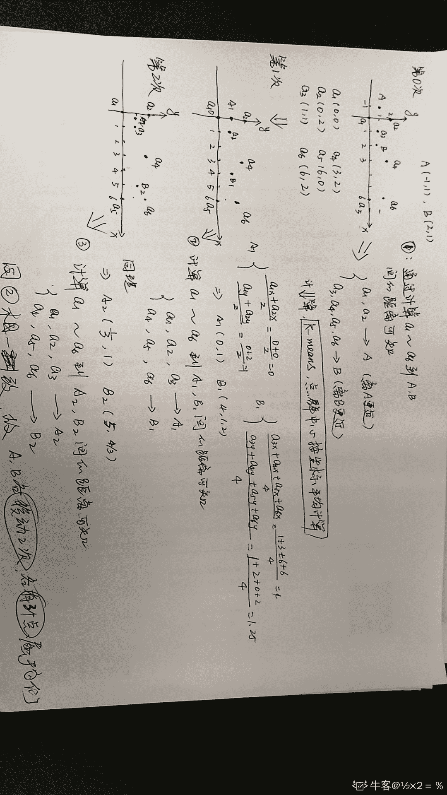
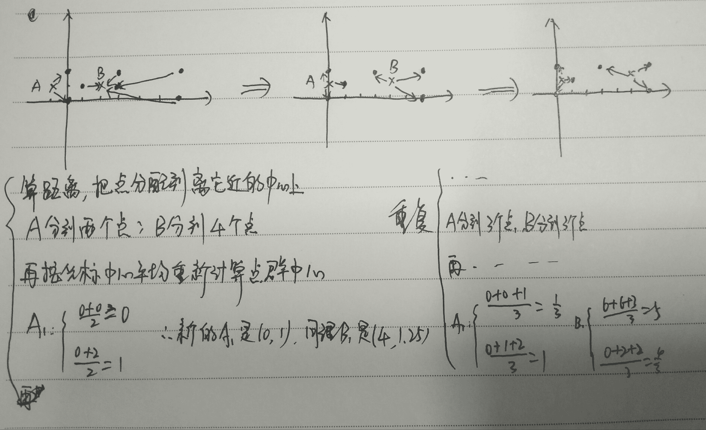
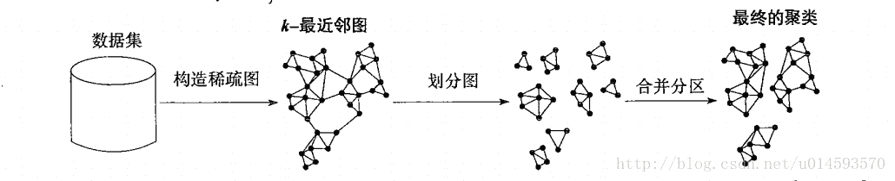

# 爱奇艺 2019 秋招大数据开发方向笔试题（B）

## 1

某学生信息表，设一组表示成绩的关键字序列(24,15,32,28,19,10,40)采用直接插入排序时，当插入记录 19 到有序表时，为找插入位置需比较次数为（      ）

正确答案: C   你的答案: 空 (错误)

```cpp
2
```

```cpp
3
```

```cpp
4
```

```cpp
5
```

本题知识点

排序 *讨论

[铜豌豆 183](https://www.nowcoder.com/profile/7553292)

插入排序是从后往前比的   所以  15 24 28 32 的比较方向是   32->28->24->15

发表于 2019-05-31 21:34:13

* * *

[包子 10086](https://www.nowcoder.com/profile/4034573)

直接插入排序(straight insertion sort)的做法是：每次从无序表中取出第一个元素，把它插入到有序表的合适位置，使有序表仍然有序。
大概是：24 直接放进去                                                                                     24
第一趟   15 比 24 小放到 24 前面，比较 1 次                                                 15    24 第二趟   32 比 24 大放 24 后面，比较 1 次                                                     15    24     32 第三趟   28 比 32 小，比 24 大，比较 2 次                                                     15   24     28     32 第四趟，19 比 32 小，比 28 小，比 24 小，比 15 大，比较 4 次                       15    19    24     28    32

发表于 2019-06-06 20:29:30

* * *

[plzGEtoUtofmYHEAD](https://www.nowcoder.com/profile/1251387)

做对这题需要明白插入排序的过程，当插 19 的时候，前面四个元素都已经是有序的了，在表中是 15 24 28 32，然后 19 需要开始跟 32 比，比 32 小，说明要放到 32 前面，再跟 28 比，同理跟 24 比，然后跟 15 比，比 15 大，就要放到 15 后面。所以比较了四次

发表于 2019-06-23 16:52:32

* * *

## 2

A、B、C、D、E、F 依次入栈，其出栈顺序为 B、D、C、F、E、A，则该栈最小容量为（      ）

正确答案: D   你的答案: 空 (错误)

```cpp
6
```

```cpp
5
```

```cpp
4
```

```cpp
3
```

本题知识点

安卓工程师 爱奇艺 C++工程师 iOS 工程师 Java 工程师 算法工程师 前端工程师 运维工程师 栈 *队列 *2019 测试开发工程师 大数据开发工程师** **讨论

[包子 10086](https://www.nowcoder.com/profile/4034573)

A B                            ---B 出   C  D                       ---D C 出   E  F                       ----F E 出                                ----A 出所以是 3

发表于 2019-06-06 20:32:05

* * *

[688](https://www.nowcoder.com/profile/625142838)

A B 进栈
B 出栈
C D 进栈  出栈  此时出栈 B D C
F E 进栈  依次出完栈：F E A
所以  最少 3

发表于 2019-05-31 19:16:55

* * *

## 3

设哈希表长为 11，哈希函数为 Hash (key)=key%11。存在关键码{7,29,22,16,92,44,8,19}，采用线性探测法处理冲突，建立的 hash 表为（    ）

正确答案: A   你的答案: 空 (错误)

```cpp
其他几项都不对
```

本题知识点

安卓工程师 爱奇艺 C++工程师 iOS 工程师 Java 工程师 测试工程师 算法工程师 前端工程师 运维工程师 哈希 *2019 测试开发工程师 大数据开发工程师* *讨论

[牛仙儿](https://www.nowcoder.com/profile/510479121)

请问哪来的 15 和 43，有这两个关键字吗，请让出题人解答一下这个问题

发表于 2019-11-06 12:50:09

* * *

[Dloading](https://www.nowcoder.com/profile/8974581)

为难我？？?

发表于 2019-06-18 17:21:14

* * *

[牛客 ID：507639719](https://www.nowcoder.com/profile/507639719)

根据哈希函数及处理冲突的方法将各元素存储在一段有限的连续空间中，即得到哈希表。

处理冲突，即根据哈希函数得到的哈希地址已经被占用，则按照一定规则求下一个哈希地址，如此反复。

线性探测法是处理冲突的一种方法。如果地址已被占用，就探查下一个紧挨着的地址，如果还是不能用，就探查下一个紧挨着的地址，如此反复。到达数组的末尾，就回到数组的开头，如果探查了 m 次还是没有空位，说明数组已经满了。

本题过程：

1.  7 根据哈希函数，放在散列表序号 7 位置上
2.  29 根据哈希函数，需要放在 7 位置，发送冲突，查找下一个位置是否为空，8 位置是空的，29 放在 8 位置

重复这个思路

发表于 2019-06-07 10:22:20

* * *

## 4

下列哪些算法在排序过程中需要一个记录的辅助空间（      ）

正确答案: A B C   你的答案: 空 (错误)

```cpp
直接选择排序
```

```cpp
直接插入排序
```

```cpp
冒泡排序
```

```cpp
归并排序
```

本题知识点

安卓工程师 爱奇艺 C++工程师 iOS 工程师 Java 工程师 测试工程师 算法工程师 前端工程师 运维工程师 排序 *2019 测试开发工程师 大数据开发工程师* *讨论

[叫我皮卡丘](https://www.nowcoder.com/profile/1078265)

*   直接选择排序：前面逐渐有序，每次从后面的无序数列中找最大或最小继续添加到前面有序数列中，两两交换需要一个辅助空间
*   直接插入排序：类似打斗地主，每次抓一张牌，从后往前比较，把新抓的牌放到合适大小的位置，两两交换需要一个辅助空间
*   冒泡排序：每次把当前无序数列中最大或最小的数交换到此无序数量的最后，两两交换需要一个辅助空间
*   归并排序：分治法把当前待排数组分成多个子序列，先使每个子序列有序，再使子序列段间有序，需要 O(n) 的辅助空间

发表于 2019-08-06 20:25:41

* * *

[o 小菜](https://www.nowcoder.com/profile/733670437)

一个记录的辅助空间   指的是 O（1）的空间？我以为是需要一个用来记录的辅助空间 O（n）。。。

发表于 2019-06-23 09:47:07

* * *

[Fstar_](https://www.nowcoder.com/profile/3231999)

（其实本题的 “需要用到一个记录的辅助空间” 其实不够严谨，因为遍历也是要一个变量 i 的。我觉得考的是空间复杂度是否为 O(1)。想起了高中时各种看不太懂的题目，出题人是真的随便。）

1.  选择排序。从未排序区间中找出最小值时，需要一个 **临时变量 min** 记录最小值。（此外还要记录最小值的索引值）

2.  插入排序。每次插入时，**需要用一个变量保存要插入的变量的值**，然后在已排序区间内从后往前比较，如果没有找到位置，前一个元素会覆盖掉后一个元素，直到找到正确位置，再用前面提到的那个变量覆盖掉那个位置的值。

3.  冒泡排序。因为可能需要交换两个元素，所以需要一个 **临时变量 tmp**：

```cpp
tmp = a1;
a1 = a2;
a2 = tmp;
```

1.  归并排序。前面三者的空间复杂度都是 O(1)，而归并排序的时间复杂度是 O(n)，也就是要 n 个记录的辅助空间。这 n 个变量的产生，发生在 merge 函数。该函数负责将两个有序的数组合并成一个有序的数组，所以需要创建一个 **长度为这两个有序数组长度和的空数组**。

编辑于 2019-08-19 16:26:39

* * *

## 5

假设在有序线性表 A[1..30]上进行二分查找,则比较五次查找成功的结点数为（      ） 

正确答案: C   你的答案: 空 (错误)

```cpp
8
```

```cpp
12
```

```cpp
15
```

```cpp
16
```

本题知识点

安卓工程师 爱奇艺 C++工程师 iOS 工程师 Java 工程师 测试工程师 算法工程师 前端工程师 运维工程师 查找 *2019 测试开发工程师 大数据开发工程师* *讨论

[叫我皮卡丘](https://www.nowcoder.com/profile/1078265)

我们可以画出二分查找的搜索路径树：


编辑于 2019-08-06 20:55:00

* * *

[chasein](https://www.nowcoder.com/profile/2885572)

写了一段代码测试了一下

```cpp
public class BinarySearch {
    static Map<Integer, Integer> map = new HashMap<>();
    public static void main(String[] args) {
        int[] a = new int[30];
        for (int i = 0; i < a.length; i++) {
            a[i] = i + 1;
        }
        for (int i = 0; i < a.length; i++) {
            binarySearch(a, a[i]);
        }
        for (Map.Entry entry : map.entrySet()){
            if (entry.getValue() == (Integer)5){
                System.out.println(entry.getKey() + ":" + entry.getValue());
            }
        }
    }

    static Map<Integer, Integer> binarySearch(int[] a, int key){
        int low = 0;
        int high = a.length - 1;
        int compTimes = 0;
        while (low <= high) {
            ++compTimes;
            int mid = (low + high) / 2;
            if (a[mid] == key){
                map.put(key, compTimes);
                return map;
            }else if (a[mid] > key){
                high = mid - 1;
            }else {
                low = mid + 1;
            }
        }
        return null;
    }
}
```

输出结果为：
2:5
4:5
6:5
8:5
10:5
12:5
14:5
16:5
18:5
20:5
22:5
24:5
26:5
28:5

30:5 二分查找的次数为 logN,最多查找 5 次的话，那么 N 最大可以是 31，最小可以是 16，最多有 31 个数。规律应该是这样。31 个数经过 5 次查找成功的节点数为 2^(5-1)=1630 个数经过 5 次查找成功的节点数为 2^(5-1)-1=1529 个数经过 5 次查找成功的节点数为 2^(5-1)-2=14...16 个数经过 5 次查找成功的节点数为 2^(5-1)-15=115 个数经过 5 次查找成功的节点数为 2^(5-1)-16=0

编辑于 2019-06-16 09:54:36

* * *

[兰陵王＆阿兰朵](https://www.nowcoder.com/profile/5248812)

答：查找一次成功的节点数为 1，值为 15 查找二次成功的节点数为 2，值为 7,,23 查找三次成功的节点数为 4,值为 3,11,19,27 查找四次成功的节点数为 8，值为 1,5,9,13,17,21,25,29 查找五次成功的节点数为 15，值为 2,3,4,6,8,10,12,14,16,18,20,22,24,26,28，30

发表于 2019-05-30 19:29:32

* * *

## 6

已知一个由 5 个顶点 8 条边构成的有向图，以下说法正确的是（  ）

正确答案: C   你的答案: 空 (错误)

```cpp
各顶点的度之和为 8
```

```cpp
若以邻接表作为存储结构，邻接表中结点个数为 16
```

```cpp
各顶点的入度之和为 8
```

```cpp
若以邻接矩阵作为存储结构，矩阵中非 0 元素个数为 16
```

本题知识点

安卓工程师 爱奇艺 C++工程师 iOS 工程师 Java 工程师 测试工程师 算法工程师 前端工程师 运维工程师 图 2019 测试开发工程师 大数据开发工程师

讨论

[大凱 201806101049505](https://www.nowcoder.com/profile/311310891)

A：顶点的度包括入度和出度，本题 8 个边，对应 16 个度（8 个出度和 8 个入度）B：邻接表中存储的是有入度的顶点，因此是 8 个 C：8 个入度 D：邻接矩阵总共有 25 个元素，图的一条边对应邻接矩阵中的一个非零元素，因此有 25 - 8 = 17 个非零元素

编辑于 2019-09-01 10:55:14

* * *

[没事学学习](https://www.nowcoder.com/profile/8729250)

A 有向图的度分出度和入度，这里说法有歧义 B 邻接表的节点数等于 节点数+边数 = 13C 正确 D 有向图邻接矩阵非零个数等于边数 = 8

发表于 2019-09-24 23:53:26

* * *

[tempest111](https://www.nowcoder.com/profile/492238502)

有向图，八条边就是八个入度和八个出度

发表于 2019-06-09 08:28:16

* * *

## 7

已知二叉树 A(B(,D(F,H)),C(,E(G(I)))),由此二叉树转换的森林描述正确的是（      ）

正确答案: B D   你的答案: 空 (错误)

```cpp
该森林包含两棵树
```

```cpp
该森林包含三棵树
```

```cpp
以 A 为根的树有两个孩子
```

```cpp
以 A 为根的树有三个孩子
```

本题知识点

爱奇艺 树 2019

讨论

[一切顺利呀～](https://www.nowcoder.com/profile/195487876)

这样吗？

发表于 2019-06-10 09:32:43

* * *

[BubbleTg](https://www.nowcoder.com/profile/3275039)

卧槽，完美错过答案。。。。

发表于 2019-11-10 19:42:47

* * *

[plzGEtoUtofmYHEAD](https://www.nowcoder.com/profile/1251387)

这题分两步来完成 1.先从广义表得到这棵二叉树的结构 2.二叉树转森林对于第一步需要明白广义表的括号表示的就是树的层次，同一括号内属于同一层，上面这个例子中，最外面是 A，它是最高一层，就是根结点，然后括号中便是下一层，也就是它的左子树和右子树，类似的分析这一层，我们可以发现 B 和 C 的地位又是在这一层的最外面，所以 B 和 C 分别就是 A 的左右子树的根节点，类似的可以进行后面的分析。需要注意的就是 B 的子树那一层中，第一个是逗号，这就是表示 B 没有左孩子。分析完就可以画出这棵二叉树。上面有老哥给出了图，可以参考图来分析。对于第二步，二叉树转森林，需要明白的就是二叉链表来表示树的结构，由于我们无法知道有多少个孩子，而只有两个分叉，所以解决办法就是左分支表示该结点的左孩子，而右分支是它的兄弟，也就是孩子兄弟表示法。明白这一点，我们对二叉树根结点 A 进行分裂，A 的右孩子是 C，C 的右孩子是 E，说明 C 和 E 都是 A 的兄弟，也就意味着它们都是和 A 一样的地位，是森林中一棵树的根，所以断开之后就得到了三棵树。B 选项正确。再分析树 A，A 的左孩子是 B，按照刚才所说，这是 A 的一个孩子，而 B 的右孩子是 D，D 是 B 的兄弟，也就是 A 的第二个孩子，同理 H 是 A 的第三个孩子，而 F 由于是 D 的左子树上，所以它是 D 的孩子。分析完毕，我们发现 A 为根的树有三个孩子，D 正确。

发表于 2019-06-23 14:55:13

* * *

## 8

internet 骨干网中的路由器通过 BGP 协议传输数据,BGP 协议使用传输层的协议与端口有（      ）

正确答案: B C   你的答案: 空 (错误)

```cpp
udp 协议
```

```cpp
tcp 协议
```

```cpp
端口 179
```

```cpp
端口 169
```

本题知识点

安卓工程师 爱奇艺 C++工程师 iOS 工程师 Java 工程师 测试工程师 算法工程师 前端工程师 运维工程师 网络基础 2019 测试开发工程师 大数据开发工程师

讨论

[chasein](https://www.nowcoder.com/profile/2885572)

在 BGP 中，路由器对使用 179 端口的半永久 TCP 连接来交换选路信息。--课本上原话

发表于 2019-06-16 11:18:12

* * *

[Poesia](https://www.nowcoder.com/profile/421739150)

边界网关*协议*（*BGP*）是运行于 TCP 上的一种自治系统的路由*协议*。

发表于 2019-08-20 09:29:02

* * *

[猫猫要当攻城狮](https://www.nowcoder.com/profile/48452620)

Bgp 是少有的基于 TCP 协议 端口使用 179 基于 TCP，所以 BGP 更新方式是单播更新

发表于 2021-05-24 10:34:45

* * *

## 9

OS 在进行磁盘调度时，要考虑选择合适的算法。此时有 6 个请求者请求访问磁盘。1 号请求者要访问 9 号柱面 6 号磁头 3 号扇区；2 号请求者要访问 7 号柱面 5 号磁头 6 号扇区；3 号请求者要访问 15 号柱面 20 号磁头 6 号扇区；4 号请求者要访问 9 号柱面 4 号磁头 4 号扇区；5 号请求者要访问 20 号柱面 9 号磁头 5 号扇区；6 号请求者要访问 7 号柱面 15 号磁头 2 号扇区。假设此时磁头位于 8 号柱面，那么最省时间的响应次序为（）

正确答案: A C   你的答案: 空 (错误)

```cpp
146235
```

```cpp
241356
```

```cpp
621435
```

```cpp
352614
```

本题知识点

安卓工程师 爱奇艺 C++工程师 iOS 工程师 Java 工程师 测试工程师 算法工程师 前端工程师 运维工程师 操作系统 2019 测试开发工程师 大数据开发工程师

讨论

[dodger](https://www.nowcoder.com/profile/975751143)

难道 A 和 C 一样？既然是最省时间，那该只有一个呀

发表于 2019-08-05 20:21:43

* * *

[688](https://www.nowcoder.com/profile/625142838)

先排好序列
c：扫描算法：先左后右
A 最短寻道优先 先去与所在的柱面最近的

发表于 2019-05-31 20:16:44

* * *

[缓缓龟](https://www.nowcoder.com/profile/279553791)

答案 c 绝对比 a 选项更加省时

发表于 2020-05-11 15:50:00

* * *

## 10

某学院包含多个专业如计算机科学、信息管理、软件工程、网络工程。每个专业每年都招收一个班级的学生。在招生过程中就已明确规定，一个学生只能就读于该学院的一个班级，但是一个班级可以招收不超过 60 个学生。那么，学生和班级之间是 ________ 的关系。

正确答案: D   你的答案: 空 (错误)

```cpp
一对多
```

```cpp
多对多
```

```cpp
一对一
```

```cpp
多对一
```

本题知识点

安卓工程师 爱奇艺 C++工程师 iOS 工程师 Java 工程师 测试工程师 算法工程师 前端工程师 运维工程师 数据库 SQL 2019 测试开发工程师 大数据开发工程师

讨论

[哈刚](https://www.nowcoder.com/profile/863660992)

给定一个学生只能找到一个班级给定一个班级可以揪出多个学生 so，学生 vs 班级 多 对 1

发表于 2020-07-24 01:25:30

* * *

[初来乍到的初](https://www.nowcoder.com/profile/534563284)

多个学生可以在一个班级 因此是多对一

发表于 2020-06-17 23:44:06

* * *

[没错就是这个超](https://www.nowcoder.com/profile/2342546)

多个学生构成一个班（多对一），一个班有很多个学生（一对多），一个学生有一个学号（一对一）

发表于 2021-04-03 10:09:59

* * *

## 11

下面程序输出结果为（）

```cpp
#include <stdio.h>
#include <stdlib.h>
class A {
};
int main() {
    printf("%d\n", sizeof(class A));
    return 0;
}
```

正确答案: B   你的答案: 空 (错误)

```cpp
0
```

```cpp
1
```

```cpp
4
```

```cpp
8
```

本题知识点

C++工程师 爱奇艺 2019 C 语言

讨论

[plzGEtoUtofmYHEAD](https://www.nowcoder.com/profile/1251387)

当类不包含任何成员的时候，大小本该是 0，但是为了便于区分，大小是 1

编辑于 2019-06-23 14:42:24

* * *

[THE_LIN](https://www.nowcoder.com/profile/680957182)

空类的大小原本是 0，但是为什么实际上是 1，主要的一个中心思想是在强调：任何相同类的不同对象应该拥有不同的地址*。*

发表于 2020-05-22 22:36:10

* * *

[桃园饭桶](https://www.nowcoder.com/profile/2788977)

网上常见的解释是，如果空类大小为 0，可能会使得两个不同对象拥有相同内存。还是不太理解底层什么原理。

发表于 2019-11-20 21:34:56

* * *

## 12

下列程序的运行结果是 1, 请将横线处缺失程序补充完整（）

```cpp
class C
 {public:
 C(int a=0);
 void Show();
 private:
 int H;}; 
 void C::Show()
 {  cout<<H<<endl;  }
 C::C(int a)
 {         ; }
 int main()
 {    C  m(1);
 m.Show();
 }
```

正确答案: C   你的答案: 空 (错误)

```cpp
a=H
```

```cpp
H=0
```

```cpp
H=a
```

```cpp
a=1
```

本题知识点

C++工程师 爱奇艺 iOS 工程师 Java 工程师 算法工程师 C++ 2019 大数据开发工程师

讨论

[我的天鸭](https://www.nowcoder.com/profile/243498)

这道题的难度主要在排版反人类

发表于 2019-08-06 10:50:15

* * *

[我想挣钱](https://www.nowcoder.com/profile/403188193)

没学过 c＋＋，但是看样子像构造函数初始化操作

发表于 2019-06-17 10:42:31

* * *

[梁晓辉](https://www.nowcoder.com/profile/1837392)

手机，没看到横线。。。

发表于 2021-09-12 11:08:12

* * *

## 13

以下代码输出为：

```cpp
list1 = {'1':1,'2':2}
list2 = list1
list1['1'] = 5
sum = list1['1'] + list2['1']
print(sum)
```

正确答案: D   你的答案: 空 (错误)

```cpp
1
```

```cpp
2
```

```cpp
7
```

```cpp
10
```

本题知识点

Java 工程师 C++工程师 测试工程师 爱奇艺 算法工程师 Python 测试开发工程师 2019 大数据开发工程师

讨论

[蹲一大把的 offer](https://www.nowcoder.com/profile/515070749)

**b = a: ****赋值引用，a 和 b 都指向同一个对象。****l**ist1 和 list2 指向的是同一块内存空间 list1['1']=5  ------>  **改变了这一块内存空间中'1'的 value 值**执行这一步后内存空间存储的数据变为：**{'1': 5, '2': 2}**因此 sum = list1['1']+list2['1']=5+5=10

发表于 2019-10-09 20:36:02

* * *

[先做一名合格的 Coder](https://www.nowcoder.com/profile/366851065)

赋值，在原有对象的引用计数上+1，所以原有对象变，它也跟着变，就像贴标签，把两个标签贴到了一个对象上。这和深浅拷贝还是不一样的，深浅拷贝的均开辟新内存，赋值不会开辟新的内存地址。可以用 id()进行测试

编辑于 2019-11-04 09:46:43

* * *

[木木木木木-](https://www.nowcoder.com/profile/2195631)

浅拷贝和深拷贝可变类型 set,list,dict 进行浅拷贝后，拷贝后的也会受影响。

发表于 2019-08-05 15:43:19

* * *

## 14

下列代码输出为：

```cpp
str = "Hello,Python";
suffix = "Python";
print (str.endswith(suffix,2));
```

正确答案: A   你的答案: 空 (错误)

```cpp
True
```

```cpp
False
```

```cpp
语法错误
```

```cpp
P
```

本题知识点

Java 工程师 C++工程师 测试工程师 爱奇艺 算法工程师 Python 测试开发工程师 2019 大数据开发工程师

讨论

[MongoStorm](https://www.nowcoder.com/profile/8213169)

忽略题目本身不严谨的格式，str.endswith(suffix,2) 中的 2 是指：从字符串"Hello,Python" 中的位置 2，也就是第一个‘l’开始检索，判断是否以 suffix 结尾，故本题输出 True 。

发表于 2019-12-29 13:42:48

* * *

[往事随风丶](https://www.nowcoder.com/profile/309853761)

python 里加分号什么鬼？

发表于 2019-08-26 16:28:33

* * *

[鲤之](https://www.nowcoder.com/profile/215444756)

```cpp
str.endswith(suffix[, start[,  end]]) 用于判断字符串是否以指定后缀结尾，如果以指定后缀结尾返回 True，否则返回 False。
可选参数"start"与"end"为检索字符串的开始与结束位置。
```

发表于 2019-07-11 18:39:45

* * *

## 15

两个种子点 A(-1,1)，B(2,1)，其余点为(0,0)，(0,2)，(1,1)，(3,2)，(6,0)，(6,2)，利用 Kmeans 算法，点群中心按坐标平均计算。最终种子点 A 需要移动的次数，种子点 B 需要移动的次数，属于种子点 A 的点数（不包含 A），属于种子点 B 的点数（不包含 B）分别为（）

正确答案: A   你的答案: 空 (错误)

```cpp
2,2,3,3
```

```cpp
1,1,3,3
```

```cpp
1,1,2,4
```

```cpp
2,2,2,4
```

本题知识点

Java 工程师 C++工程师 算法工程师 爱奇艺 机器学习 大数据开发工程师 2019

讨论

[½×2＝％](https://www.nowcoder.com/profile/256374777)



发表于 2019-09-15 20:34:48

* * *

[lu。。](https://www.nowcoder.com/profile/640264950)



编辑于 2019-07-10 09:15:42

* * *

[kimhee](https://www.nowcoder.com/profile/898141501)

第一遍计算每个点到 A 和 B 的欧式距离看出(0,0)（0,2）离 A 近，其他点离 B 近，求均值计算新的距离中心 A1，A2，画出点的大***置和第一步算的距离都可以看出主要是（1,1）点有争议，只算（1,1）到 A1 和 A2 的距离即可。可以迅速判断选项。我有个问题是，计算 A1 和 A2 时用不用带 A 和 B 作为类内点。

发表于 2019-09-07 11:03:11

* * *

## 16

EM 算法（Exception Maximization Algorithm）是机器学习领域的一个经典算法，下面关于 EM 算法的表述中不正确的有（ ）

正确答案: A   你的答案: 空 (错误)

```cpp
EM 算法属于一种分类算法
```

```cpp
如果优化的目标函数是凸函数，那么 EM 算法一定能找到全局最优解
```

```cpp
EM 算法可以分为 E-Step 和 M-Step 两步
```

```cpp
EM 算法可用于从不完整的数据中计算最大似然估计
```

本题知识点

Java 工程师 C++工程师 算法工程师 爱奇艺 机器学习 大数据开发工程师 2019

讨论

[啊哈嗯哼～](https://www.nowcoder.com/profile/436799658)

EM 是聚类算法啊，同样的还有 K-Means

发表于 2019-09-07 21:16:10

* * *

[WeIlV](https://www.nowcoder.com/profile/38397951)

分类就是向事物分配标签，聚类就是将相似的事物放在一起

发表于 2020-09-10 10:39:32

* * *

[MR-唐超](https://www.nowcoder.com/profile/598309607)

EM --- cluster algorithm

发表于 2019-08-17 03:28:56

* * *

## 17

下列层次聚类算法中，哪些更适合处理大数据？（      ）

正确答案: A B C D   你的答案: 空 (错误)

```cpp
CURE 算法
```

```cpp
ROCK 算法
```

```cpp
Chameleon 算法
```

```cpp
BIRCH 算法
```

本题知识点

Java 工程师 C++工程师 算法工程师 爱奇艺 大数据开发工程师 2019

讨论

[无聊的咸鱼瘫](https://www.nowcoder.com/profile/448866055)

CURE 算法：可以处理大型数据、离群点和具有非球形大小和非均匀大小的簇的数据。

ROCK 算法：基于划分的 k-means 等算法是聚类大数据集的算法，它处理的数据对象仅限于数值型数据。

Chameleon（变色龙）算法：



BIRCH 算法：BIRCH 算法比较适合于数据量大，类别数 K 也比较多的情况。它运行速度很快，只需要单遍扫描数据集就能进行聚类。

发表于 2019-08-13 18:57:34

* * *

[努力的小里奥](https://www.nowcoder.com/profile/674707812)

个人理解：这个 Chameleon 算法的运行速度慢 O(n²)，那 岂不是适应不了大量的数据了？

发表于 2020-05-21 17:33:02

* * *

## 18

下面列出特征选择算法中，不属于启发式搜索的有（）

正确答案: A   你的答案: 空 (错误)

```cpp
分支限界搜索
```

```cpp
序列前向选择搜索
```

```cpp
增 L 去 R 搜索
```

```cpp
序列浮动选择搜索
```

本题知识点

Java 工程师 C++工程师 算法工程师 爱奇艺 数据挖掘 大数据开发工程师 2019

讨论

[ht1024](https://www.nowcoder.com/profile/577022403)

启发式搜索有序列向前选择，序列向后选择，双向搜索，增 L 去 R 选择算法，序列浮动选择，决策树。而分支限界搜索属于完全搜索

发表于 2019-08-26 20:24:55

* * *

[lucas111111111](https://www.nowcoder.com/profile/438434053)

1、完全搜索：广度优先算法 分支限界算法 定向搜索算法 最优优先算法

2、启发式搜索：序列前向选择 序列厚向选择 双向搜索（类似于向前法 向后法 向前向后法）、增 L 去 R、序列浮动算法、决策树算法

3、随机算法：随机产生序列选择算法 模拟退火算法 遗传算法

发表于 2020-09-17 16:51:54

* * *

[溪度](https://www.nowcoder.com/profile/519429863)

参考:[`blog.csdn.net/sina012345/article/details/39778545?ops_request_misc=%257B%2522request%255Fid%2522%253A%2522160181357019195264713735%2522%252C%2522scm%2522%253A%252220140713.130102334..%2522%257D&request_id=160181357019195264713735&biz_id=0&utm_medium=distribute.pc_search_result.none-task-blog-2`](https://blog.csdn.net/sina012345/article/details/39778545?ops_request_misc=%257B%2522request%255Fid%2522%253A%2522160181357019195264713735%2522%252C%2522scm%2522%253A%252220140713.130102334..%2522%257D&request_id=160181357019195264713735&biz_id=0&utm_medium=distribute.pc_search_result.none-task-blog-2)~all~sobaiduend~default-1-39778545.first_rank_ecpm_v3_pc_rank_v2&utm_term=%E5%BA%8F%E5%88%97%E5%89%8D%E5%90%91%E6%90%9C%E7%B4%A2&spm=1018.2118.3001.4187

发表于 2020-10-04 20:34:38

* * *

## 19

 以下各项均是针对数据仓库的不同说法，你认为正确的有(        )

正确答案: B D   你的答案: 空 (错误)

```cpp
数据仓库就是数据库
```

```cpp
数据仓库是一切商业智能系统的基础
```

```cpp
数据仓库是面向业务的，支持联机事务处理（OLTP）
```

```cpp
数据仓库支持决策而非事务处理
```

本题知识点

Java 工程师 C++工程师 算法工程师 爱奇艺 数据挖掘 大数据开发工程师 2019

讨论

[tuyouxian](https://www.nowcoder.com/profile/633383262)

数据仓库是支持分析决策，依赖 hdfs，支持 OLAP，我选 BD

发表于 2019-09-06 12:50:22

* * *

[苏落](https://www.nowcoder.com/profile/189989654)

正确答案是 BD 数据库的操作：一般称为联机事务处理 OLTP（On-Line Transaction Processing），针对具体的业务在数据库中的联机操作，具有数据量较少的特点，通常对少量的数据记录进行查询、修改。数据仓库的操作：一般称为联机分析处理 OLAP（On-Line Analytical Processing），针对某些主题（综合数据）的历史数据进行分析，支持管理决策。

发表于 2020-03-15 20:32:44

* * *

[孤单的跟鞋声和你的笑丶](https://www.nowcoder.com/profile/277595)

我当然也是觉得 C 有点问题，但是细想之下，它只是说支持，并不是说就是 OLTP 的，因为主流的数据仓库里面 比如 GreenPlum 它支持分布式事务能力，这个跟 C 选项匹配吗？？

发表于 2020-05-02 21:13:49

* * *

## 20

关于 BP 神经网络说法正确的是（      ）

正确答案: A B C D   你的答案: 空 (错误)

```cpp
是一种非线性模型
```

```cpp
sigmoid 是其常用的一种激活函数
```

```cpp
可用于分类或回归
```

```cpp
有良好的自组织自学习能力机器学习方法
```

本题知识点

Java 工程师 C++工程师 算法工程师 爱奇艺 数据挖掘 大数据开发工程师 2019

讨论

[头发还是这么短](https://www.nowcoder.com/profile/120902802)

A：非线性是由于激活函数产生的，B:sigmoid 是常见的激活函数，值域在【0,1】C:神经网络能够用于分类和回归.D:能够利用反向传播减少误差进行自主学习

发表于 2019-08-04 22:26:11

* * *******