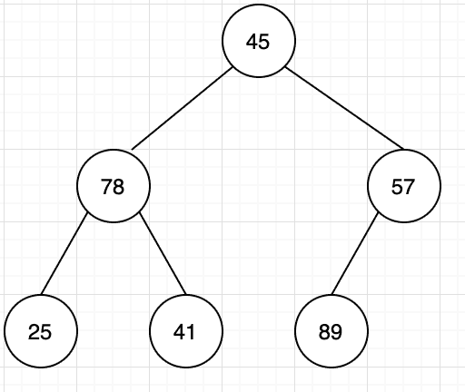

# 爱奇艺 2019 秋招前端开发方向笔试题（A）

## 1

使用堆排序方法排序（45，78，57，25，41，89），初始堆为（      ）

正确答案: B   你的答案: 空 (错误)

```cpp
78,45,57,25,41,89
```

```cpp
89,78,57,25,41,45
```

```cpp
89,78,25,45,41,57
```

```cpp
89,45,78,41,57,25
```

本题知识点

排序 *讨论

[修改昵称失败](https://www.nowcoder.com/profile/947651)

首先建立完全二叉树
从最后一个叶子节点开始第一次交换了 57 和 89 的位置然后比较 45 和 89，进行交换
再比较换下来的 45，45 不符合大根堆，与 57 交换

发表于 2019-05-29 21:11:08

* * *

[叫我皮卡丘](https://www.nowcoder.com/profile/1078265)


发表于 2019-08-05 17:40:53

* * *

[牛客 ID：507639719](https://www.nowcoder.com/profile/507639719)

堆排序 (Heap sort) 就是利用堆(假设利用大顶堆)进行排序的方法 。基本思想是

1.  构建初始堆
2.  将根节点与末尾元素交换，进行堆构造（末尾元素不参与）
3.  重复 2 过程，直到“堆”仅剩 1 个元素。

```cpp
function HeapSort(arr) {
  arr = [0, ...arr]; // 方便左右子树表示
  //第一步，构建初始堆
  for (let i = ~~Math.length / 2; i > 0; i--) {
    buildHeap(arr, i, arr.length);
  }

  for (let i = arr.length; i > 1; i--) {
    // 交换
    [arr[1], arr[i - 1]] = [arr[i - 1], arr[1]];
    // 根元素与末尾元素交换，再构建大顶堆
    buildHeap(arr, 1, i - 1);
  }
  return arr.slice(1); // 移除添加的 0 元素
}

// 构造大顶堆
function buildHeap(arr, i, length) {
  let temp = arr[i];
  for (let j = 2 * i; j <= length; j *= 2) {
    if (arr[j] < arr[j + 1]) j++;
    if (temp > arr[j]) break;
    arr[i] = arr[j];
    i = j;
  }
  arr[i] = temp;
}

// ------- 测试
let arr = [3, 9, 5, 2, 6];
console.log(HeapSort(arr)); // [ 9, 5, 6, 2, 3 ]

arr = [5, 3, 9, 8, 3, 4];
console.log(HeapSort(arr)); // [ 8, 3, 3, 5, 9, 4 ]
```

发表于 2019-06-09 09:31:00

* * *

## 2

6 个圆盘的汉诺塔，总的移动次数是（      ）

正确答案: D   你的答案: 空 (错误)

```cpp
30
```

```cpp
33
```

```cpp
60
```

```cpp
63
```

本题知识点

递归

讨论

[Michael264](https://www.nowcoder.com/profile/54836329)

> **定义** Hanoi(n, a, b, c)：将 n 个盘子从 a 柱移到 c 柱，b 柱起中转作用。f(n)：n 个盘子的汉诺塔的总移动次数。

**Hanoi(n, a, b, c) = Hanoi(n-1, a, c, b) + 1 + Hanoi(n-1, b, a, c)**：将 a 上面 n-1 个盘子移到 b，再将 a 最下面的盘子移到 c，再将 b 上的 n-1 个盘子移到 c，此时，**n 盘子汉诺塔问题 **变成了**移****动一个盘子 + ****两个 n-1 盘子汉诺塔问题。**故 **f(n) = f(n-1) + 1 + f(n-1) = 2f(n-1) + 1****=> f(n) + 1 = 2(f(n-1) + 1) ****=> f(n) + 1 = 2^(n-1) (f(1) + 1)****=> f(n) + 1 = 2^n****=> f(n) = 2^n -1**

发表于 2019-08-14 19:29:51

* * *

[忽然间要很好](https://www.nowcoder.com/profile/587724363)

f(1)=1f(2)=3f(n)=2*f(n-1)+1 相当于借助 B 柱 将 A 柱上前 n-1 个盘先放在 B 柱上（f(n-1)），再挪最后一个盘到 c 盘(+1)，之后再挪 B 柱的 n-1 个盘到 C 柱（f(n-1)），递归循环。

发表于 2019-05-30 12:37:57

* * *

[问纤](https://www.nowcoder.com/profile/857851073)

2＾n - 1

发表于 2019-06-07 09:40:52

* * *

## 3

设哈希表长为 11，哈希函数为 Hash (key)=key%11。存在关键码{43,7,29,22,16,92,44,8,19}，采用二次探测法处理冲突，建立的 hash 表为（    ）

正确答案: B   你的答案: 空 (错误)

```cpp
其他几项都不对
```

本题知识点

安卓工程师 爱奇艺 C++工程师 iOS 工程师 Java 工程师 测试工程师 算法工程师 前端工程师 运维工程师 哈希 *2019 测试开发工程师 大数据开发工程师* *讨论

[冲上顶峰](https://www.nowcoder.com/profile/189892324)

解析：采用开放定址法处理冲突中的二次探测再散列（也即是题目中的二元探测法）,则哈希函数变为 Hash(key） = (Hash(key)  + d) % 11，其中 d = 1², -1², 2², -2², 3²,……，则开始计算。

对于 43，代入公式为 Hash(43) = 43 % 11 = 10, 则地址为 10；

对于 7，代入公式为 Hash(7) = 7 % 11 = 7,则地址为 7；

对于 29，代入公式为 Hash(29) = 29 % 11 = 7, 与 7 冲突，则采用二次探测进行消除冲突， 继续(7 + 1) % 11 = 8，没有冲突，则地址为 8；

对于 22，代入公式 Hash(22) = 22 % 11 = 0, 则地址为 0；

对于 16，代入公式 Hash(16) = 16 % 11 = 5, 则地址为 5；

对于 92，代入公式 Hash(92) = 92 % 11 = 4,则地址为 4；

对于 44，代入公式 Hash(44) = 44 % 11 = 0, 与 22 的地址冲突，则继续(0 + 1) % 11 = 1,没有冲突，则地址为 1；

对于 8， 代入公式 Hash(8) = 8 % 11 = 8, 与 29 有冲突，则继续(8 + 1) % 11 = 9, 没有冲突，则地址为 9；

对于 19，代入公式 Hash(19) = 19 % 11 = 8\. 与 29 有冲突，则继续(8 + 1) * 11 = 9, 与 8 有冲突，继续(8 - 1) % 11 = 7, 与 7 有冲突，则继续(8 + 4) % 11 = 1, 与 44 有冲突，则继续(8 - 4) % 11 = 4, 与 92 有冲突，则继续(8 + 9) % 11 = 6, 没有冲突，则地址为 6.

所以最后得到的 Hash 表为下图所示：


发表于 2019-06-01 19:33:14

* * *

[sugarhit](https://www.nowcoder.com/profile/598224351)

真的。字太小了。19 和 29 根本看不清

发表于 2019-08-20 15:36:44

* * *

[OKOKOKOKOK](https://www.nowcoder.com/profile/2857851)

二次探测法：设发生冲突的地址为 d，则新的地址序列为 d+1²,d-1²,d+2²,d-2²,...

发表于 2019-05-30 14:11:07

* * *

## 4

有关希尔排序算法叙述正确的是（      ）

正确答案: A B   你的答案: 空 (错误)

```cpp
最后一次的步长增量一定为 1
```

```cpp
分割后子序列内部的排序算法是直接插入排序
```

```cpp
分割后子序列内部的排序算法是直接选择排序
```

```cpp
希尔排序是稳定排序算法
```

本题知识点

安卓工程师 爱奇艺 C++工程师 iOS 工程师 Java 工程师 测试工程师 算法工程师 前端工程师 运维工程师 排序 *2019 测试开发工程师 大数据开发工程师* *讨论

[Yd。201906031539658](https://www.nowcoder.com/profile/907160213)

[Shell 排序](https://baike.baidu.com/item/Shell%E6%8E%92%E5%BA%8F)的执行时间依赖于[增量](https://baike.baidu.com/item/%E5%A2%9E%E9%87%8F)序列。好的[增量](https://baike.baidu.com/item/%E5%A2%9E%E9%87%8F)序列的共同特征：① 最后一个[增量](https://baike.baidu.com/item/%E5%A2%9E%E9%87%8F)必须为 1；② 应该尽量避免序列中的值(尤其是相邻的值)互为倍数的情况。有人通过大量的实验，给出了较好的结果：当 n 较大时，比较和移动的次数约在 nl.25 到 1.6n1.25 之间。2．Shell 排序的时间性能优于[直接插入排序](https://baike.baidu.com/item/%E7%9B%B4%E6%8E%A5%E6%8F%92%E5%85%A5%E6%8E%92%E5%BA%8F)希尔排序的时间性能优于[直接插入排序](https://baike.baidu.com/item/%E7%9B%B4%E6%8E%A5%E6%8F%92%E5%85%A5%E6%8E%92%E5%BA%8F)的原因：①当文件初态基本有序时[直接插入排序](https://baike.baidu.com/item/%E7%9B%B4%E6%8E%A5%E6%8F%92%E5%85%A5%E6%8E%92%E5%BA%8F)所需的比较和移动次数均较少。②当 n 值较小时，n 和  的差别也较小，即[直接插入排序](https://baike.baidu.com/item/%E7%9B%B4%E6%8E%A5%E6%8F%92%E5%85%A5%E6%8E%92%E5%BA%8F)的最好[时间复杂度](https://baike.baidu.com/item/%E6%97%B6%E9%97%B4%E5%A4%8D%E6%9D%82%E5%BA%A6)O(n)和最坏时间复杂度 0(  )差别不大。③在希尔排序开始时[增量](https://baike.baidu.com/item/%E5%A2%9E%E9%87%8F)较大，分组较多，每组的记录数目少，故各组内直接插入较快，后来增量 di 逐渐缩小，分组数逐渐减少，而各组的记录数目逐渐增多，但由于已经按 di-1 作为距离排过序，使文件较接近于有序状态，所以新的一趟排序过程也较快。因此，希尔排序在效率上较直接插入排序有较大的改进。

发表于 2019-06-03 16:49:08

* * *

[Zoe 小茗](https://www.nowcoder.com/profile/324939503)

排序最后一次则会对间隔为 1 的元素，也就是相邻元素执行标准插入排序。

发表于 2019-08-04 15:19:53

* * *

[Juventus-🐂](https://www.nowcoder.com/profile/79434593)

希尔排序的执行时间依赖于增量序列。最后一个增量必须为 1，时间性能优于直接插入排序。

发表于 2022-01-23 15:41:36

* * *

## 5

广义表 K=(m,n,(p,(q,s)),(h,f)),则 head[tail[head[tail[tail(K)]]]]的值为（      ）

正确答案: B   你的答案: 空 (错误)

```cpp
s
```

```cpp
q
```

```cpp
p
```

```cpp
h
```

本题知识点

安卓工程师 爱奇艺 C++工程师 iOS 工程师 Java 工程师 测试工程师 算法工程师 前端工程师 运维工程师 链表 *2019 测试开发工程师 大数据开发工程师* *讨论

[冲上顶峰](https://www.nowcoder.com/profile/189892324)

head() 返回列表的第一个元素；

tail() 返回列表的删去第一个元素之后的剩余列表；K=(m,n,(p,(q,s)),(h,f)),
head[tail[head[tail[tail(K)]]]]
tail(K)-------(n,(p,(q,s)),(h,f))tail[tail[K]]--------((p,(q,s)),(h,f))head()-----((p,(q,s))tail()-----(q,s)head()-------q

发表于 2019-06-01 19:30:59

* * *

[Astrallee](https://www.nowcoder.com/profile/376787917)

我为什么觉得是（p,s)啊，前面的 tail 也是按照这个思路来的。取到最后两个的时候是(p,(q,s))。 tail 一次 不应该是((q,s))吗

发表于 2019-12-06 23:33:27

* * *

[OKOKOKOKOK](https://www.nowcoder.com/profile/2857851)

从最里层括号一直向外计算。head(a,b)：保留括号第一个元素 a，去除其余 tail(a,b)：去除第一个元素 a，保留其余

发表于 2019-05-30 14:16:30

* * *

## 6

在一个空的 5 阶 B-树中依次插入关键字序列{6,8,15,16,22,10,18,32,20}，插入完成后，关键字 6 所在结点包含的关键字个数为（      ）

正确答案: B   你的答案: 空 (错误)

```cpp
2
```

```cpp
3
```

```cpp
4
```

```cpp
5
```

本题知识点

爱奇艺 树 2019

讨论

[newcomer](https://www.nowcoder.com/profile/291053)

一颗 m 阶 B 树，非叶节点至多可以有 m-1 个关键字，至少可以有 ceil(n/2)-1 个，根节点可以至少有一个关键字。根据这个原则，可以画出 5 阶 B 树的构建过程，如下图所示：

编辑于 2019-07-03 10:22:34

* * *

[漫步云端.](https://www.nowcoder.com/profile/478154402)

这篇博客写的挺好[`blog.csdn.net/li_canhui/article/details/85305147`](https://blog.csdn.net/li_canhui/article/details/85305147)

发表于 2019-08-28 21:36:48

* * *

[默默学习的啦啦啦](https://www.nowcoder.com/profile/146773881)

n 阶 B-树，每个结点中关键字个数范围为 ceil(n/2) - 1 ~ n-1 个，因此为 2-4 个，插入时首先插入 6,8,15,16；再插入 22 时结点个数大于 4，因此取 15 为中间结点拆分，变成 15 - (6,8),(16,22)，继续插入 10,18,32 变成 15 - (6,8,10),(16,18,22,32)，再插入 20 时结点个数大于 4，取 20 为中间结点拆分，合并到根节点上变为(15,20) - (6,8,10),(16,18),(22,32)

编辑于 2019-05-31 09:42:32

* * *

## 7

在求两个集合并集的过程中，可能需用到的操作是（      ）  

正确答案: A B C D   你的答案: 空 (错误)

```cpp
取元素
```

```cpp
插入元素
```

```cpp
比较操作
```

```cpp
求表长
```

本题知识点

安卓工程师 爱奇艺 C++工程师 iOS 工程师 Java 工程师 测试工程师 算法工程师 前端工程师 运维工程师 哈希 *2019 测试开发工程师 大数据开发工程师* *讨论

[叫我皮卡丘](https://www.nowcoder.com/profile/1078265)

需求：求两个集合的并集 1\. 取元素，至少得知道集合存的是啥元素 2\. 插入元素，并集可能存在集合 A 中有而集合 B 中无的元素，需要插入到新的集合中 3\. 比较操作，判断是否相等 4\. 求表长，完整遍历

发表于 2019-08-05 17:54:29

* * *

[拾陆 humin](https://www.nowcoder.com/profile/334013855)

联想 归并排序

发表于 2019-06-13 18:51:00

* * *

[冲上顶峰](https://www.nowcoder.com/profile/189892324)

还需要求表长

发表于 2019-06-01 19:27:00

* * *

## 8

TCP 协议与 UDP 协议负责端到端连接，下列那些信息只出现在 TCP 报文，UDP 报文不包含此信息（      ）

正确答案: A D   你的答案: 空 (错误)

```cpp
序列号
```

```cpp
源端口
```

```cpp
目标端口
```

```cpp
窗口大小
```

本题知识点

安卓工程师 爱奇艺 C++工程师 iOS 工程师 Java 工程师 测试工程师 算法工程师 前端工程师 运维工程师 网络基础 2019 测试开发工程师 大数据开发工程师

讨论

[叫我皮卡丘](https://www.nowcoder.com/profile/1078265)

UDP 头部信息只有 4 个，从哪来：源端口到哪去：目的端口有多长：长度对不对：校验和

发表于 2019-08-05 18:13:13

* * *

[冲上顶峰](https://www.nowcoder.com/profile/189892324)

[`www.cnblogs.com/steven520213/p/8005258.html`](https://www.cnblogs.com/steven520213/p/8005258.html)**UDP****的包头结构：**
    源端口 16 位
    目的端口 16 位
    长度 16 位
    校验和 16 位

发表于 2019-06-01 19:41:07

* * *

[newcomer](https://www.nowcoder.com/profile/291053)

TCP 与 UDP 最大的不同就是前者是可靠传输，后者是不可靠的。为了保证可靠传输，TCP 采用了一系列机制，比如序列号是指客户端确认序列号以及以前的信息都收到了，窗口大小则是提高传输效率，保证信息按序到达。这些很明显 UDP 是没有的。

发表于 2019-07-03 09:09:53

* * *

## 9

程序员编写程序时使用文件系统提供的系统调用将内存中由 address 地址开始的 n 个字节或 n 个记录的信息写入指定文件中，但发现文件名不可用，可行的解决办法是（）

正确答案: A B   你的答案: 空 (错误)

```cpp
使用文件描述符代替文件名
```

```cpp
使用文件句柄代替文件名
```

```cpp
使用当前进程的 PCB 编号代替
```

```cpp
以上办法都不可行
```

本题知识点

安卓工程师 爱奇艺 C++工程师 iOS 工程师 Java 工程师 测试工程师 算法工程师 前端工程师 运维工程师 操作系统 2019 测试开发工程师 大数据开发工程师

讨论

[dylmail](https://www.nowcoder.com/profile/501837184)

**无论是文件句柄（Windows 中概念），还是文件描述符（linux 中概念），其最终目的都是用来定位打开的文件在内存中的位置，只是它们映射的方式不一样。****PCB（进程控制块）在 linux 中具体实现是 task_struct 数据结构，这些进程必须要有唯一标识符，所以里面含有 pid（进程 ID）**

发表于 2020-06-30 17:24:38

* * *

[360 公司内推小助手](https://www.nowcoder.com/profile/385100296)

文件句柄与文件描述符 [`www.cnblogs.com/ChunJian-YANG/p/5322041.html`](https://www.cnblogs.com/ChunJian-YANG/p/5322041.html)

发表于 2019-06-03 15:27:55

* * *

## 10

某软件公司正在升级一套水务管理系统。该系统用于县市级供排水企业、供水厂、排水厂中水务数据的管理工作。系统经重新整合后，开发人员决定不再使用一张备份数据表 waterinfo001 表，需永久删除。选出符合要求的语句。 

正确答案: C   你的答案: 空 (错误)

```cpp
DELETE TABLE waterinfo001
```

```cpp
DELETE FROM TABLE waterinfo001
```

```cpp
DROP TABLE waterinfo001
```

```cpp
DROP FROM TABLE waterinfo001
```

本题知识点

安卓工程师 爱奇艺 C++工程师 iOS 工程师 Java 工程师 测试工程师 算法工程师 前端工程师 运维工程师 数据库 SQL 2019 测试开发工程师 大数据开发工程师

讨论

[夏花爱秋叶](https://www.nowcoder.com/profile/4085682)

```cpp
1. drop 是完全删除表，包括表结构
2. delete 是删除表数据，保留表的结构，而且可以加 where,只删除一行或者多行
3. truncate 只能删除表数据，会保留表结构，而且不能加 where

```

发表于 2020-03-11 11:37:04

* * *

[叫我皮卡丘](https://www.nowcoder.com/profile/1078265)

DELETE FROM waterinfo001;清除 waterinfo001 表全部记录 DROP TABLE waterinfo001;删除 waterinfo001 表

编辑于 2019-11-07 08:05:54

* * *

[fighting.java](https://www.nowcoder.com/profile/543231756)

| 1. drop 是完全删除表，包括表结构 2. delete 是删除表数据，保留表的结构，而且可以加 where,只删除一行或者多行 3. truncate 只能删除表数据，会保留表结构，而且不能加 where |

发表于 2020-04-29 20:33:49

* * *

## 11

如果想要调用 obj 对象的 arr 属性，以下做法中，错误的是（）

正确答案: C   你的答案: 空 (错误)

```cpp
obj["arr"]
```

```cpp
obj["a"+"r"+"r"]
```

```cpp
obj{"arr"}
```

```cpp
obj.arr
```

本题知识点

前端工程师 爱奇艺 Javascript 2019

讨论

[bug 之所措](https://www.nowcoder.com/profile/169072962)

谁让我在代码看到 B 这样的写法的话，我一棒子就下去。

发表于 2019-08-26 17:29:36

* * *

[fairy 中意](https://www.nowcoder.com/profile/871360100)

访问 obj 的方式有两种 1️⃣点的方式 obj.arr; 2️⃣中括号的方式 obj["arr"];

发表于 2019-09-21 11:06:14

* * *

[牛客 255532060 号](https://www.nowcoder.com/profile/255532060)

A 和 b 拼接完 是一样的，在加上 D, 所以是 C

发表于 2021-05-01 21:59:42

* * *

## 12

现有一组人员年龄的数据，要求将这些人员的年龄按照从小到大的顺序进行排列起来，要怎样来实现

正确答案: D   你的答案: 空 (错误)

```cpp
function numberSort(a,b)
{
  return a - b;
}
var arr=new Array("23","6","12","35","76");
document.write(arr.push(numberSort));
```

```cpp
function numberSort(a,b)
{
  return b - a;
}
var arr=new Array("23","6","12","35","76");
document.write(arr.push(numberSort));
```

```cpp
function numberSort(a,b)
{
  return b-a;
}
var arr=new Array("23","6","12","35","76");
document.write(arr.sort(numberSort));
```

```cpp
function numberSort(a,b)
{
  return a - b;
}
var arr=new Array("23","6","12","35","76");
document.write(arr.sort(numberSort));
```

本题知识点

前端工程师 爱奇艺 Javascript 2019

讨论

[小🐮客](https://www.nowcoder.com/profile/990177409)

呃呃，觉得别人之前的解析 **有误或者不妥！**

```cpp
arr.sort([compareFunction])
```

一、sort() 方法参数为空（即没有指明 compareFunction） ，元素按照转换为的字符串的诸个字符的 Unicode 位点进行排序，本题不涉及，不详说。二、sort() 方法参数指明 compareFunction ，数组会按照调用函数的返回值排序（**这句不懂没关系**）。如： ```cpp
[3, 2, 1].sort(function (a, b) {
    return a - b;
});
```

它会将数字数组 [3, 2, 1] 按 **小到大** 排序后返回 更新后的数组 [1, 2, 3]。**执行的机制（两数比较，小的排在大的前面）：**

*   a - b < 0，那么 a 会被排列到 b 之前;
*   a - b = 0，a 和 b 的相对位置不变。备注： ECMAScript 标准并不保证这一行为，而且也不是所有浏览器都会遵守（例如 Mozilla 在 2003 年之前的版本）；
*   a - b > 0，那么 b 排列到 a 之前。

三、**重点来了！！！**问：记住上面的 执行机制，我是不是就真正理解了 sort() 的用法了 ？？？答：难说。。。因为，sort(compreFunction) 中的 compreFunction(a, b) 参数的值 **极其混乱！！！****极其混乱？？？**看这段代码在不同浏览器执行情况

```cpp
let arr = [3, 2, 1];
arr.sort(function (a, b) {
    console.log(a, b, arr);
    return a - b;
});
```

*   

*   

*   

**而且同一浏览器中的不同版本运行效果也不一样！！！（***取决于该版本对 sort() 执行算法吧？？？***）****四、那么复杂，如何快速掌握呢？**

**升序排序 return  a - b； 降序排序 return b - a。**

**学习传送门：****[`developer.mozilla.org/zh-CN/docs/Web/JavaScript/Reference/Global_Objects/Array/sort`](https://developer.mozilla.org/zh-CN/docs/Web/JavaScript/Reference/Global_Objects/Array/sort)** 

编辑于 2021-10-08 19:57:39

* * *

[旺仔大馒头](https://www.nowcoder.com/profile/8019634)

1\. 使用 sort 进行排序，排序规则按照写的 numberSort 函数。2\. numberSort 函数中，返回的值是负数，即 a-b<0，那么位置不变，仍是 a 在前 b 在后。若 a-b>0，则需要交换位置，交换之后：a 在后 b 在前。升序排序 return a-b，降序排序 return b-a。

编辑于 2019-08-13 23:44:55

* * *

[地心级](https://www.nowcoder.com/profile/719067718)

偏新手方面理解 sort()1.它是用来排序一个数组,默认是从小到大,如果直接 arr.sort()  ,那么它只能比较个位数,如果变成了多位数,会取第一位进行比较,后面的不会管    arr=[1,2,6,8,4,2]         arr.sort()   // [1,2,2,4,6,8]
    arr=[1,6,45,21,13,47]    arr.sort()  //[1,13,21,45,47,6]  也有可能是// [13,1,21,47,45,6]
2.添加一个函数,可以让它对多位数进行比较,函数默认两个参数 a 和 b,然后函数里面 a-b 或者 b-a,答案分别是 1 和-1, 1 为不换位置,-1 换位置( 也就是正序和倒序)  语法跟题目是一样的 3.push 是把一个值放到一个数组的最后一位,

发表于 2019-10-24 09:06:28

* * *

## 13

如果想要获取整个网页文档中 h1 标签的个数，可以通过（）

正确答案: B   你的答案: 空 (错误)

```cpp
var hele=document.getElementByTagName('h1');
alert(hele.length);
```

```cpp
var hele=document.getElementsByTagName('h1');
alert(hele.length);
```

```cpp
var hele=getElementsByTagName('h1');
alert(hele.length);
```

```cpp
var hele=getElementByTagName('h1');
alert(hele.length);
```

本题知识点

前端工程师 爱奇艺 Javascript 2019

讨论

[冯十岁](https://www.nowcoder.com/profile/64008924)

document.getElementById();document.getElementsByTagName();document.getElementsByName();document.getElementsByClassName();除了 ById 是 Element，其余都是 Elements

发表于 2020-02-13 17:34:28

* * *

[ceco](https://www.nowcoder.com/profile/716574355)

记住 ID 具有唯一性所以只能返回 element，className、Name、TagName 都是可以重复的所以需要返回 elements 就行了。

发表于 2020-09-07 09:22:24

* * *

[旺仔大馒头](https://www.nowcoder.com/profile/8019634)

A 和 B 之间的区别在 Element 和 Elements。因为返回的是集合，所以必然是 Elements。选 B。

发表于 2019-08-14 22:39:12

* * *

## 14

分析下面代码：

```cpp
<html>
 <head>
 <script>
 function myFunc() {
     document.write(a);
     document.write(func());
     var a = 1;
     function func() {
         return 2;
     }
 }
 </script>
 </head>
 <body>
 <p>1</p>
 <button onclick = "myFunc()">点击</button>
 </body>
 </html>
```

点击按钮后页面上的最终输出结果为：（）

正确答案: D   你的答案: 空 (错误)

```cpp
112
```

```cpp
12
```

```cpp
1undefined2
```

```cpp
undefined2
```

本题知识点

前端工程师 爱奇艺 Javascript 2019 HTML

讨论

[旺仔大馒头](https://www.nowcoder.com/profile/8019634)

题目问的是点击按钮后页面上的最终输出结果，所以原来页面上的 p 标签的 1，会被 document.write 函数输出的内容覆盖。所以没有 1。

打印 a 是 undefined 是因为 var a 的时候进行了变量提升，但是要执行到那一步才会真的赋值。

```cpp
<html>
 <head>
 <script>
 function myFunc() {
 document.write(a); // a 已变量提升，但是因为赋值在后面，所以打印 undefined
 document.write(func()); // 执行函数 打印出 2
 var a = 1; // 这里的 a 已经变量提升了，但是在这一步才赋值
 function func() {
 return 2;
 }
 }
 </script>
 </head>
 <body>
 <p>1</p>
 <button onclick = "myFunc()">点击</button> 
 </body>
 </html>
```

发表于 2019-08-19 10:43:32

* * *

[牛客 74475162 号](https://www.nowcoder.com/profile/74475162)

。。。。每次都忘记，变量提升，赋值不提升！！！

发表于 2019-06-28 19:01:59

* * *

[rida233](https://www.nowcoder.com/profile/196946988)

p 标签那个 1 不输出吗

发表于 2019-08-08 21:18:26

* * *

## 15

在日常生活中，往往需要注册很多的账户，而账户名通常是由字母、数字、下划线组成的字符，怎样才能知道自己注册的账号是合法的（      ）

正确答案: A B   你的答案: 空 (错误)

```cpp
var filt=/^[a-zA-Z_0-9]+$/;
if(!filt.test(str))
{
  alert("账号只包含字母、数字、下划线");
}
```

```cpp
var filt=/^[a-zA-Z0-9_]+$/;
if(!filt.test(str))
{
  alert("账号只包含字母、数字、下划线");
}
```

```cpp
var filt=/^[_a-z0-9]+$/;
if(!filt.test(str))
{
  alert("账号只包含字母、数字、下划线");
}
```

```cpp
var filt=/^[a-z_0-9]+$/;
if(!filt.test(str))
{
  alert("账号只包含字母、数字、下划线");
}
```

本题知识点

前端工程师 爱奇艺 Javascript 2019

讨论

[offer 冲冲冲冲](https://www.nowcoder.com/profile/543174886)

我寻思着 AB 有什么不一样呢 原来是不定项。。

发表于 2019-10-08 23:35:35

* * *

[牛客 391187410 号](https://www.nowcoder.com/profile/391187410)

原来是不定项🤣

发表于 2020-06-28 11:49:38

* * *

[三七互娱内推招聘专员](https://www.nowcoder.com/profile/113910183)

CD 选项不能匹配大写字母

发表于 2019-08-27 21:49:08

* * *

## 16

当用户打开一个网页时，想一直停留在当前打开的页面，禁止页面前进和后退，以下正确的是（      ）

正确答案: A D   你的答案: 空 (错误)

```cpp
window.history.forward(1);
```

```cpp
window.history.back(1);
```

```cpp
window.history.go(-1);
```

```cpp
window.history.forward(-1);
```

本题知识点

前端工程师 爱奇艺 Javascript 2019

讨论

[初挔](https://www.nowcoder.com/profile/147374963)

这个题目我是这么理解的：现在已经打开了一个新的网站，这个网站可以后退，不可以前进（因为不是通过后退打开的）。在这样的情况下，执行 ABCD 四个选项，当执行 A 或 D 的时候，由于网站是新打开的，无法前进，所以执行 history.forward(1)和 history.forward(-1)方法都不起作用，而执行 B 或 C 的时候，都会回退至上一个网站，所以答案是 AD。并且，history.forward、history.back 方法都不需要参数，输入的参数不起作用。

发表于 2021-03-02 16:11:52

* * *

[旺仔大馒头](https://www.nowcoder.com/profile/8019634)

选 AD。B. Window History Backhistory.back() 方法加载历史列表中前一个 URL。 这等同于在浏览器中点击后退按钮。C. 跳转到 history 中指定的一个点

你可以用 go() 方法载入到会话历史中的某一特定页面， 通过与当前页面相对位置来标志 (当前页面的相对位置标志为 0).

向后移动一个页面 (等同于调用 back()):

```cpp
window.history.go(-1);
```

向前移动一个页面, 等同于调用了 forward():

```cpp
window.history.go(1);
```

AD.
1\.
<SCRIPT language="JavaScript">
javascript:window.history.forward(1);
</SCRIPT>
这 种方法是用于防止由下一个页面返回的。
简单的说，页面 A（A 中有这段代码）转向页面 B，
这时，B 向 A 转向是被禁止。
2.
有时候我们再做网页时不希望某个网页通过浏览器的前进后退按钮来后退或前进，可以通过简单的办法达到该效果<body οnbefοreunlοad="history.go(0)">这样这个网页就会永远停留再这个页面，不能前进后退了。

编辑于 2019-08-14 11:06:43

* * *

[弹铁蛋同学](https://www.nowcoder.com/profile/770526402)

window.history.forward(1),总是会将 window.history.list 里面你的所有页面走完，直到页面再也不能往前，对于 window.history.list.length=5 的时候，无论在哪个页面发起 history,forward(1)，都会走到当前页面。因此是可以很好地阻止页面后退，缺点是带来了很多的额外的 http request,因为需要一个页面一个页面后退。在我们的一个 application 里面我发现，window.history.forward(1)，会走到某个页面，停止。以至于在那个页面之后的页面，就无法实现组织后退的功能。

编辑于 2021-01-16 17:09:38

* * *

## 17

设置不同屏幕中，元素的位置不会发生改变的是（      ）

正确答案: A   你的答案: 空 (错误)

```cpp
@media screen
```

```cpp
@media print
```

```cpp
@media mouse
```

```cpp
@media key
```

本题知识点

前端工程师 爱奇艺 2019 CSS

讨论

[360 公司内推小助手](https://www.nowcoder.com/profile/385100296)

[`www.runoob.com/cssref/css3-pr-mediaquery.html`](https://www.runoob.com/cssref/css3-pr-mediaquery.html)

使用 @media 查询，你可以针对不同的媒体类型定义不同的样式。

@media 可以针对不同的屏幕尺寸设置不同的样式，特别是如果你需要设置设计响应式的页面，@media 是非常有用的。

当你重置浏览器大小的过程中，页面也会根据浏览器的宽度和高度重新渲染页面。

| print | 用于打印机和打印预览 |

没有 mouse 和 key 这两个选项

发表于 2019-06-03 15:45:24

* * *

[祯民](https://www.nowcoder.com/profile/463267767)

**使用** **@media** **查询，你可以针对不同的媒体类型定义不同的样式。**

**@media** **可以针对不同的屏幕尺寸设置不同的样式，特别是如果你需要设置设计响应式的页面，****@media** **是非常有用的。**

**当你重置浏览器大小的过程中，页面也会根据浏览器的宽度和高度重新渲染页面。**

** **

发表于 2019-09-27 09:01:42

* * *

[牛牛 121](https://www.nowcoder.com/profile/383958544)

设置媒体查询，通过写适应不同屏幕尺寸的 css 样式来实现响应式。在不同屏幕中，元素位置不会改变？？？逗我玩呢

发表于 2021-10-03 09:31:32

* * *

## 18

在做一份调查报告时，要求将问题文类，同一表单内的数据在一组显示，并表明此类型的名称，如何将相同类型的表单进行分组（      ）

正确答案: A   你的答案: 空 (错误)

```cpp
<fieldset><legend>类型名</legend>内容显示</fieldset>
```

```cpp
<fieldset><label>类型名</label>内容显示</fieldset>
```

```cpp
<tab><legend>类型名</legend>内容显示</tab>
```

```cpp
<tab><label>类型名</label>内容显示</tab>
```

本题知识点

前端工程师 爱奇艺 HTML 2019

讨论

[每天都要努力呀！](https://www.nowcoder.com/profile/956413803)


发表于 2020-02-20 12:26:29

* * *

[牛客 777459450 号](https://www.nowcoder.com/profile/777459450)

例子：

```cpp
<form>
  <fieldset>
    <legend>健康信息</legend>
    身高：<input type="text" />
    体重：<input type="text" />
  </fieldset>
</form> 
```

legend ：为 [fieldset 元素](https://www.w3school.com.cn/tags/tag_fieldset.asp)定义标题（caption）fieldset ：将表单内的相关元素分组。
tab：有这个标签？

发表于 2019-12-20 17:34:53

* * *

[庄生晓梦 201903242109791](https://www.nowcoder.com/profile/562518607)

我能说我看到的四个选项一毛一样吗？

发表于 2019-08-18 11:45:47

* * *

## 19

实现翻书的效果可以使用 CSS3 里的什么方法？

正确答案: A   你的答案: 空 (错误)

```cpp
rotateY
```

```cpp
translateY
```

```cpp
scaleY
```

```cpp
perspective(n)
```

本题知识点

前端工程师 爱奇艺 2019 CSS

讨论

[小🐮客](https://www.nowcoder.com/profile/990177409)

正确答案：AA、rotateY：定义沿 Y 轴的 3D 旋转，可实现翻书的效果 B、translateY：沿着 Y 轴移动元素 C、scaleY：定义 2D 缩放转换时，改变元素的高度；定义 3D 缩放转换时，通过给定一个 Y 轴的值 D、perspective(n)：改变 3D 元素是怎样查看透视图（注：只影响 3D 转换元素）

发表于 2019-09-04 10:50:57

* * *

[360 公司内推小助手](https://www.nowcoder.com/profile/385100296)

translateY 表示元素沿着 Y 轴移动

发表于 2019-06-03 15:50:32

* * *

[即兴 201908021013190](https://www.nowcoder.com/profile/775787625)

正确答案选 A，

*   ```cpp
    rotateY 沿着 Y 轴旋转
    ```

编辑于 2019-08-06 14:56:03

* * *

## 20

下列哪种选择器不是 CSS3 才定义的

正确答案: C   你的答案: 空 (错误)

```cpp
:enabled
```

```cpp
:checked
```

```cpp
:before
```

```cpp
:only-child
```

本题知识点

前端工程师 爱奇艺 2019 CSS

讨论

[lockMymind](https://www.nowcoder.com/profile/900631689)

:before 选择器早在 CSS 2.1 版本就定义了，:before 选择器在被选元素的内容前面插入内容。 ```cpp
p:before{ 
content:"哈哈";
color:red;
font-weight:400;
}
``` 

发表于 2019-08-07 15:19:20

* * *

[安如水](https://www.nowcoder.com/profile/788092848)

:before 过时语法，仅用来支持 ie8，现在伪元素都用：：before

发表于 2019-09-24 12:43:07

* * *

[夏花爱秋叶](https://www.nowcoder.com/profile/4085682)

```cpp
## css1/css2 的选择器
1. 常规的 class 选择器/id 选择器/通配符/父子选择器/属性选择器
2. 兄弟选择器中的+, 但是 ~ 是 css3 的
3. first-letter/first-line/first-child,但是 last-child 是 css3 的
4. a 标签的 link/visited/hover/active, 还有 focus
5. before/after 选择器
```

编辑于 2020-03-11 10:28:35

* * ******