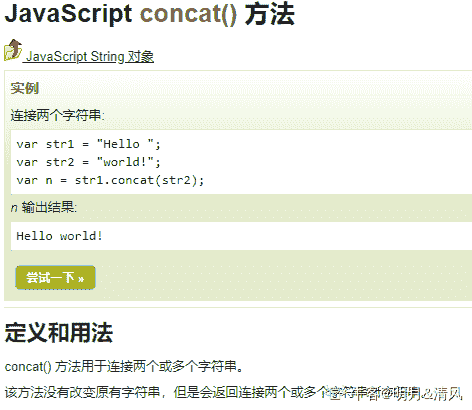

# 爱奇艺 2019 秋招前端开发方向笔试题（B）

## 1

某学生信息表，设一组表示成绩的关键字序列(24,15,32,28,19,10,40)采用直接插入排序时，当插入记录 19 到有序表时，为找插入位置需比较次数为（      ）

正确答案: C   你的答案: 空 (错误)

```cpp
2
```

```cpp
3
```

```cpp
4
```

```cpp
5
```

本题知识点

排序 *讨论

[铜豌豆 183](https://www.nowcoder.com/profile/7553292)

插入排序是从后往前比的   所以  15 24 28 32 的比较方向是   32->28->24->15

发表于 2019-05-31 21:34:13

* * *

[包子 10086](https://www.nowcoder.com/profile/4034573)

直接插入排序(straight insertion sort)的做法是：每次从无序表中取出第一个元素，把它插入到有序表的合适位置，使有序表仍然有序。
大概是：24 直接放进去                                                                                     24
第一趟   15 比 24 小放到 24 前面，比较 1 次                                                 15    24 第二趟   32 比 24 大放 24 后面，比较 1 次                                                     15    24     32 第三趟   28 比 32 小，比 24 大，比较 2 次                                                     15   24     28     32 第四趟，19 比 32 小，比 28 小，比 24 小，比 15 大，比较 4 次                       15    19    24     28    32

发表于 2019-06-06 20:29:30

* * *

[plzGEtoUtofmYHEAD](https://www.nowcoder.com/profile/1251387)

做对这题需要明白插入排序的过程，当插 19 的时候，前面四个元素都已经是有序的了，在表中是 15 24 28 32，然后 19 需要开始跟 32 比，比 32 小，说明要放到 32 前面，再跟 28 比，同理跟 24 比，然后跟 15 比，比 15 大，就要放到 15 后面。所以比较了四次

发表于 2019-06-23 16:52:32

* * *

## 2

A、B、C、D、E、F 依次入栈，其出栈顺序为 B、D、C、F、E、A，则该栈最小容量为（      ）

正确答案: D   你的答案: 空 (错误)

```cpp
6
```

```cpp
5
```

```cpp
4
```

```cpp
3
```

本题知识点

安卓工程师 爱奇艺 C++工程师 iOS 工程师 Java 工程师 算法工程师 前端工程师 运维工程师 栈 *队列 *2019 测试开发工程师 大数据开发工程师** **讨论

[包子 10086](https://www.nowcoder.com/profile/4034573)

A B                            ---B 出   C  D                       ---D C 出   E  F                       ----F E 出                                ----A 出所以是 3

发表于 2019-06-06 20:32:05

* * *

[688](https://www.nowcoder.com/profile/625142838)

A B 进栈
B 出栈
C D 进栈  出栈  此时出栈 B D C
F E 进栈  依次出完栈：F E A
所以  最少 3

发表于 2019-05-31 19:16:55

* * *

## 3

设哈希表长为 11，哈希函数为 Hash (key)=key%11。存在关键码{7,29,22,16,92,44,8,19}，采用线性探测法处理冲突，建立的 hash 表为（    ）

正确答案: A   你的答案: 空 (错误)

```cpp
其他几项都不对
```

本题知识点

安卓工程师 爱奇艺 C++工程师 iOS 工程师 Java 工程师 测试工程师 算法工程师 前端工程师 运维工程师 哈希 *2019 测试开发工程师 大数据开发工程师* *讨论

[牛仙儿](https://www.nowcoder.com/profile/510479121)

请问哪来的 15 和 43，有这两个关键字吗，请让出题人解答一下这个问题

发表于 2019-11-06 12:50:09

* * *

[Dloading](https://www.nowcoder.com/profile/8974581)

为难我？？?

发表于 2019-06-18 17:21:14

* * *

[牛客 ID：507639719](https://www.nowcoder.com/profile/507639719)

根据哈希函数及处理冲突的方法将各元素存储在一段有限的连续空间中，即得到哈希表。

处理冲突，即根据哈希函数得到的哈希地址已经被占用，则按照一定规则求下一个哈希地址，如此反复。

线性探测法是处理冲突的一种方法。如果地址已被占用，就探查下一个紧挨着的地址，如果还是不能用，就探查下一个紧挨着的地址，如此反复。到达数组的末尾，就回到数组的开头，如果探查了 m 次还是没有空位，说明数组已经满了。

本题过程：

1.  7 根据哈希函数，放在散列表序号 7 位置上
2.  29 根据哈希函数，需要放在 7 位置，发送冲突，查找下一个位置是否为空，8 位置是空的，29 放在 8 位置

重复这个思路

发表于 2019-06-07 10:22:20

* * *

## 4

下列哪些算法在排序过程中需要一个记录的辅助空间（      ）

正确答案: A B C   你的答案: 空 (错误)

```cpp
直接选择排序
```

```cpp
直接插入排序
```

```cpp
冒泡排序
```

```cpp
归并排序
```

本题知识点

安卓工程师 爱奇艺 C++工程师 iOS 工程师 Java 工程师 测试工程师 算法工程师 前端工程师 运维工程师 排序 *2019 测试开发工程师 大数据开发工程师* *讨论

[叫我皮卡丘](https://www.nowcoder.com/profile/1078265)

*   直接选择排序：前面逐渐有序，每次从后面的无序数列中找最大或最小继续添加到前面有序数列中，两两交换需要一个辅助空间
*   直接插入排序：类似打斗地主，每次抓一张牌，从后往前比较，把新抓的牌放到合适大小的位置，两两交换需要一个辅助空间
*   冒泡排序：每次把当前无序数列中最大或最小的数交换到此无序数量的最后，两两交换需要一个辅助空间
*   归并排序：分治法把当前待排数组分成多个子序列，先使每个子序列有序，再使子序列段间有序，需要 O(n) 的辅助空间

发表于 2019-08-06 20:25:41

* * *

[o 小菜](https://www.nowcoder.com/profile/733670437)

一个记录的辅助空间   指的是 O（1）的空间？我以为是需要一个用来记录的辅助空间 O（n）。。。

发表于 2019-06-23 09:47:07

* * *

[Fstar_](https://www.nowcoder.com/profile/3231999)

（其实本题的 “需要用到一个记录的辅助空间” 其实不够严谨，因为遍历也是要一个变量 i 的。我觉得考的是空间复杂度是否为 O(1)。想起了高中时各种看不太懂的题目，出题人是真的随便。）

1.  选择排序。从未排序区间中找出最小值时，需要一个 **临时变量 min** 记录最小值。（此外还要记录最小值的索引值）

2.  插入排序。每次插入时，**需要用一个变量保存要插入的变量的值**，然后在已排序区间内从后往前比较，如果没有找到位置，前一个元素会覆盖掉后一个元素，直到找到正确位置，再用前面提到的那个变量覆盖掉那个位置的值。

3.  冒泡排序。因为可能需要交换两个元素，所以需要一个 **临时变量 tmp**：

```cpp
tmp = a1;
a1 = a2;
a2 = tmp;
```

1.  归并排序。前面三者的空间复杂度都是 O(1)，而归并排序的时间复杂度是 O(n)，也就是要 n 个记录的辅助空间。这 n 个变量的产生，发生在 merge 函数。该函数负责将两个有序的数组合并成一个有序的数组，所以需要创建一个 **长度为这两个有序数组长度和的空数组**。

编辑于 2019-08-19 16:26:39

* * *

## 5

假设在有序线性表 A[1..30]上进行二分查找,则比较五次查找成功的结点数为（      ） 

正确答案: C   你的答案: 空 (错误)

```cpp
8
```

```cpp
12
```

```cpp
15
```

```cpp
16
```

本题知识点

安卓工程师 爱奇艺 C++工程师 iOS 工程师 Java 工程师 测试工程师 算法工程师 前端工程师 运维工程师 查找 *2019 测试开发工程师 大数据开发工程师* *讨论

[叫我皮卡丘](https://www.nowcoder.com/profile/1078265)

我们可以画出二分查找的搜索路径树：


编辑于 2019-08-06 20:55:00

* * *

[chasein](https://www.nowcoder.com/profile/2885572)

写了一段代码测试了一下

```cpp
public class BinarySearch {
    static Map<Integer, Integer> map = new HashMap<>();
    public static void main(String[] args) {
        int[] a = new int[30];
        for (int i = 0; i < a.length; i++) {
            a[i] = i + 1;
        }
        for (int i = 0; i < a.length; i++) {
            binarySearch(a, a[i]);
        }
        for (Map.Entry entry : map.entrySet()){
            if (entry.getValue() == (Integer)5){
                System.out.println(entry.getKey() + ":" + entry.getValue());
            }
        }
    }

    static Map<Integer, Integer> binarySearch(int[] a, int key){
        int low = 0;
        int high = a.length - 1;
        int compTimes = 0;
        while (low <= high) {
            ++compTimes;
            int mid = (low + high) / 2;
            if (a[mid] == key){
                map.put(key, compTimes);
                return map;
            }else if (a[mid] > key){
                high = mid - 1;
            }else {
                low = mid + 1;
            }
        }
        return null;
    }
}
```

输出结果为：
2:5
4:5
6:5
8:5
10:5
12:5
14:5
16:5
18:5
20:5
22:5
24:5
26:5
28:5

30:5 二分查找的次数为 logN,最多查找 5 次的话，那么 N 最大可以是 31，最小可以是 16，最多有 31 个数。规律应该是这样。31 个数经过 5 次查找成功的节点数为 2^(5-1)=1630 个数经过 5 次查找成功的节点数为 2^(5-1)-1=1529 个数经过 5 次查找成功的节点数为 2^(5-1)-2=14...16 个数经过 5 次查找成功的节点数为 2^(5-1)-15=115 个数经过 5 次查找成功的节点数为 2^(5-1)-16=0

编辑于 2019-06-16 09:54:36

* * *

[兰陵王＆阿兰朵](https://www.nowcoder.com/profile/5248812)

答：查找一次成功的节点数为 1，值为 15 查找二次成功的节点数为 2，值为 7,,23 查找三次成功的节点数为 4,值为 3,11,19,27 查找四次成功的节点数为 8，值为 1,5,9,13,17,21,25,29 查找五次成功的节点数为 15，值为 2,3,4,6,8,10,12,14,16,18,20,22,24,26,28，30

发表于 2019-05-30 19:29:32

* * *

## 6

已知一个由 5 个顶点 8 条边构成的有向图，以下说法正确的是（  ）

正确答案: C   你的答案: 空 (错误)

```cpp
各顶点的度之和为 8
```

```cpp
若以邻接表作为存储结构，邻接表中结点个数为 16
```

```cpp
各顶点的入度之和为 8
```

```cpp
若以邻接矩阵作为存储结构，矩阵中非 0 元素个数为 16
```

本题知识点

安卓工程师 爱奇艺 C++工程师 iOS 工程师 Java 工程师 测试工程师 算法工程师 前端工程师 运维工程师 图 2019 测试开发工程师 大数据开发工程师

讨论

[大凱 201806101049505](https://www.nowcoder.com/profile/311310891)

A：顶点的度包括入度和出度，本题 8 个边，对应 16 个度（8 个出度和 8 个入度）B：邻接表中存储的是有入度的顶点，因此是 8 个 C：8 个入度 D：邻接矩阵总共有 25 个元素，图的一条边对应邻接矩阵中的一个非零元素，因此有 25 - 8 = 17 个非零元素

编辑于 2019-09-01 10:55:14

* * *

[没事学学习](https://www.nowcoder.com/profile/8729250)

A 有向图的度分出度和入度，这里说法有歧义 B 邻接表的节点数等于 节点数+边数 = 13C 正确 D 有向图邻接矩阵非零个数等于边数 = 8

发表于 2019-09-24 23:53:26

* * *

[tempest111](https://www.nowcoder.com/profile/492238502)

有向图，八条边就是八个入度和八个出度

发表于 2019-06-09 08:28:16

* * *

## 7

已知二叉树 A(B(,D(F,H)),C(,E(G(I)))),由此二叉树转换的森林描述正确的是（      ）

正确答案: B D   你的答案: 空 (错误)

```cpp
该森林包含两棵树
```

```cpp
该森林包含三棵树
```

```cpp
以 A 为根的树有两个孩子
```

```cpp
以 A 为根的树有三个孩子
```

本题知识点

爱奇艺 树 2019

讨论

[一切顺利呀～](https://www.nowcoder.com/profile/195487876)

这样吗？

发表于 2019-06-10 09:32:43

* * *

[BubbleTg](https://www.nowcoder.com/profile/3275039)

卧槽，完美错过答案。。。。

发表于 2019-11-10 19:42:47

* * *

[plzGEtoUtofmYHEAD](https://www.nowcoder.com/profile/1251387)

这题分两步来完成 1.先从广义表得到这棵二叉树的结构 2.二叉树转森林对于第一步需要明白广义表的括号表示的就是树的层次，同一括号内属于同一层，上面这个例子中，最外面是 A，它是最高一层，就是根结点，然后括号中便是下一层，也就是它的左子树和右子树，类似的分析这一层，我们可以发现 B 和 C 的地位又是在这一层的最外面，所以 B 和 C 分别就是 A 的左右子树的根节点，类似的可以进行后面的分析。需要注意的就是 B 的子树那一层中，第一个是逗号，这就是表示 B 没有左孩子。分析完就可以画出这棵二叉树。上面有老哥给出了图，可以参考图来分析。对于第二步，二叉树转森林，需要明白的就是二叉链表来表示树的结构，由于我们无法知道有多少个孩子，而只有两个分叉，所以解决办法就是左分支表示该结点的左孩子，而右分支是它的兄弟，也就是孩子兄弟表示法。明白这一点，我们对二叉树根结点 A 进行分裂，A 的右孩子是 C，C 的右孩子是 E，说明 C 和 E 都是 A 的兄弟，也就意味着它们都是和 A 一样的地位，是森林中一棵树的根，所以断开之后就得到了三棵树。B 选项正确。再分析树 A，A 的左孩子是 B，按照刚才所说，这是 A 的一个孩子，而 B 的右孩子是 D，D 是 B 的兄弟，也就是 A 的第二个孩子，同理 H 是 A 的第三个孩子，而 F 由于是 D 的左子树上，所以它是 D 的孩子。分析完毕，我们发现 A 为根的树有三个孩子，D 正确。

发表于 2019-06-23 14:55:13

* * *

## 8

internet 骨干网中的路由器通过 BGP 协议传输数据,BGP 协议使用传输层的协议与端口有（      ）

正确答案: B C   你的答案: 空 (错误)

```cpp
udp 协议
```

```cpp
tcp 协议
```

```cpp
端口 179
```

```cpp
端口 169
```

本题知识点

安卓工程师 爱奇艺 C++工程师 iOS 工程师 Java 工程师 测试工程师 算法工程师 前端工程师 运维工程师 网络基础 2019 测试开发工程师 大数据开发工程师

讨论

[chasein](https://www.nowcoder.com/profile/2885572)

在 BGP 中，路由器对使用 179 端口的半永久 TCP 连接来交换选路信息。--课本上原话

发表于 2019-06-16 11:18:12

* * *

[Poesia](https://www.nowcoder.com/profile/421739150)

边界网关*协议*（*BGP*）是运行于 TCP 上的一种自治系统的路由*协议*。

发表于 2019-08-20 09:29:02

* * *

[猫猫要当攻城狮](https://www.nowcoder.com/profile/48452620)

Bgp 是少有的基于 TCP 协议 端口使用 179 基于 TCP，所以 BGP 更新方式是单播更新

发表于 2021-05-24 10:34:45

* * *

## 9

OS 在进行磁盘调度时，要考虑选择合适的算法。此时有 6 个请求者请求访问磁盘。1 号请求者要访问 9 号柱面 6 号磁头 3 号扇区；2 号请求者要访问 7 号柱面 5 号磁头 6 号扇区；3 号请求者要访问 15 号柱面 20 号磁头 6 号扇区；4 号请求者要访问 9 号柱面 4 号磁头 4 号扇区；5 号请求者要访问 20 号柱面 9 号磁头 5 号扇区；6 号请求者要访问 7 号柱面 15 号磁头 2 号扇区。假设此时磁头位于 8 号柱面，那么最省时间的响应次序为（）

正确答案: A C   你的答案: 空 (错误)

```cpp
146235
```

```cpp
241356
```

```cpp
621435
```

```cpp
352614
```

本题知识点

安卓工程师 爱奇艺 C++工程师 iOS 工程师 Java 工程师 测试工程师 算法工程师 前端工程师 运维工程师 操作系统 2019 测试开发工程师 大数据开发工程师

讨论

[dodger](https://www.nowcoder.com/profile/975751143)

难道 A 和 C 一样？既然是最省时间，那该只有一个呀

发表于 2019-08-05 20:21:43

* * *

[688](https://www.nowcoder.com/profile/625142838)

先排好序列
c：扫描算法：先左后右
A 最短寻道优先 先去与所在的柱面最近的

发表于 2019-05-31 20:16:44

* * *

[缓缓龟](https://www.nowcoder.com/profile/279553791)

答案 c 绝对比 a 选项更加省时

发表于 2020-05-11 15:50:00

* * *

## 10

某学院包含多个专业如计算机科学、信息管理、软件工程、网络工程。每个专业每年都招收一个班级的学生。在招生过程中就已明确规定，一个学生只能就读于该学院的一个班级，但是一个班级可以招收不超过 60 个学生。那么，学生和班级之间是 ________ 的关系。

正确答案: D   你的答案: 空 (错误)

```cpp
一对多
```

```cpp
多对多
```

```cpp
一对一
```

```cpp
多对一
```

本题知识点

安卓工程师 爱奇艺 C++工程师 iOS 工程师 Java 工程师 测试工程师 算法工程师 前端工程师 运维工程师 数据库 SQL 2019 测试开发工程师 大数据开发工程师

讨论

[哈刚](https://www.nowcoder.com/profile/863660992)

给定一个学生只能找到一个班级给定一个班级可以揪出多个学生 so，学生 vs 班级 多 对 1

发表于 2020-07-24 01:25:30

* * *

[初来乍到的初](https://www.nowcoder.com/profile/534563284)

多个学生可以在一个班级 因此是多对一

发表于 2020-06-17 23:44:06

* * *

[没错就是这个超](https://www.nowcoder.com/profile/2342546)

多个学生构成一个班（多对一），一个班有很多个学生（一对多），一个学生有一个学号（一对一）

发表于 2021-04-03 10:09:59

* * *

## 11

当在手机中需要保存移动手机号码时，怎样才能知道输入的手机号就是 11 位的移动手机号（      ）

正确答案: A   你的答案: 空 (错误)

```cpp
var filt=/¹[0-9]{10}$/;
if(!filt.test(str))
{
  alert("手机号输入错误");
}
```

```cpp
var filt=¹[0-9]{10};
if(!filt.test(str))
{
  alert("手机号输入错误");
}
```

```cpp
var filt=/^[0-9]{10}/;
if(!filt.test(str))
{
  alert("手机号输入错误");
}
```

```cpp
var filt=/¹[0-9]/;
if(!filt.test(str))
{
alert("手机号输入错误");
}
```

本题知识点

前端工程师 爱奇艺 Javascript 2019

讨论

[我属猫](https://www.nowcoder.com/profile/8018242)

```cpp
var filt=/¹[0-9]{10}$/;
```

发表于 2019-08-29 17:55:30

* * *

[Graceful_beauty](https://www.nowcoder.com/profile/486840612)

怎么感觉都错了 没加号吧

发表于 2019-08-07 17:58:36

* * *

[旺仔大馒头](https://www.nowcoder.com/profile/8019634)

```cpp
var filt=/¹[0-9]{10}+$/;
```

1.  ^ 匹配输入字符串的开始位置。在这里也就是要求 1 开始。
2.  [0-9]{10}+ [0-9]匹配 0~9 之间的数字，{10}重复 10 次。+匹配前面的子表达式一次或多次。 
3.  $  匹配输入字符串的结尾位置。

发表于 2019-08-14 09:47:26

* * *

## 12

用户在登陆某个账号时，通常是将账号名和密码分别输入到对应的文本框中，现要将账号名和密码连接起来作为用户的唯一标识符，怎样来实现这一功能（      ）

正确答案: A   你的答案: 空 (错误)

```cpp
userName.concat(pwd);
```

```cpp
userName.append(pwd);
```

```cpp
userName.appendTo(pwd);
```

```cpp
userName.pop(pwd);
```

本题知识点

前端工程师 爱奇艺 Javascript 2019

讨论

[明月&清风](https://www.nowcoder.com/profile/87550465)

string 也有 concat()方法

发表于 2020-02-23 09:59:29

* * *

[三七互娱内推招聘专员](https://www.nowcoder.com/profile/113910183)

A：concat()拼接两个数组，且不改变原数组，会返回一个拼接完的数组的副本，Array 方法。大部分用户输入的 input 为 text ->String 所以如果要用的话应该用：userName.split("").concat(pwd.split("")).join("");BC：元素插入到一个元素尾部(内部) D:pop 数组操作，删除返回数组最后一个元素。这题我屏蔽了，脑残题设，出题人有没有搞清楚输入的是什么

发表于 2019-10-27 11:16:04

* * *

[小风爱学习](https://www.nowcoder.com/profile/466646714)

A. concat() 方法用于连接两个或多个数组。该方法不会改变现有的数组，而仅仅会返回被连接数组的一个副本。B. append() 方法在被选元素的结尾（仍然在内部）插入指定内容。C. appendTo() 方法在被选元素的结尾（仍然在内部）插入指定内容。D. pop() 方法用于删除并返回数组的最后一个元素。

发表于 2019-08-08 09:51:24

* * *

## 13

执行以下代码，其实现的效果为（）

```cpp
<div>
   <input type="button" id ="button1" value="1" onclick="moveBtn(this);">
   <input type="button" id ="button2" value="2" />
</div>
<script type="text/javascript">
   function moveBtn(obj) {
     var clone = obj.cloneNode(true);
     var parent = obj.parentNode;
     parent.appendChild(clone);
     parent.removeChild(obj);
   }
</script>
```

正确答案: B   你的答案: 空 (错误)

```cpp
鼠标单击 button1 后将 button1 链接到 button2 的后面
```

```cpp
鼠标单击 button1 后将 button1 移动到 button2 的后面
```

```cpp
鼠标单击 button1 后将 button2 移动到 button1 的后面
```

```cpp
鼠标单击 button1 后将 button2 链接到 button1 的后面
```

本题知识点

前端工程师 爱奇艺 Javascript 2019

讨论

[旺仔大馒头](https://www.nowcoder.com/profile/8019634)

```cpp
<div>
 <input type="button"id ="button1"value="1"onclick="moveBtn(this);">
 <input type="button"id ="button2"value="2"/>
 </div>
 <script type="text/javascript">
 function moveBtn(obj) {
     var clone = obj.cloneNode(true); // 复制一个 button1 结点
     var parent = obj.parentNode; // 找到 button1 的父节点
     parent.appendChild(clone); // 将复制的结点加入到父节点，也就是 button1 的复制结点现在在 button2 后面了
     parent.removeChild(obj); // 移除原来的 button1
 }
 </script>
```

所以最终达到的效果，就是把 button1 结点移到 button2 结点后面。

发表于 2019-08-20 08:50:30

* * *

[sunnyJS](https://www.nowcoder.com/profile/268526439)

只有我们清楚**appendChild()** 方法可向节点的子节点列表的**末尾添加**新的子节点即可。

发表于 2019-08-08 14:58:12

* * *

[前端 GG](https://www.nowcoder.com/profile/7646864)

谁能告诉我链接是啥

发表于 2019-09-03 22:18:10

* * *

## 14

分析下面 javascript 代码：

```cpp
<script>
 function out(x){
     var temp = 2;
     function inside(y){
         document.write( x + y + (temp--));
     }
     inside(5);
 }
 out(3);
 </script>
```

输出结果为：

正确答案: C   你的答案: 空 (错误)

```cpp
8
```

```cpp
9
```

```cpp
10
```

```cpp
11
```

本题知识点

前端工程师 爱奇艺 Javascript 2019

讨论

[牛客 165430013 号](https://www.nowcoder.com/profile/165430013)

--运算符前置和后置的区别

如果该运算符作为后置操作符，则返回它递减之前的值。

如果该运算符作为前置操作符，则返回它递减之后的值。

后置：

var i = 5;

var a = i--;

console.log(i);//输出 4

console.log(a);//输出 5

前置：

var j = 5;

var b = --j;

console.log(j);//输出 4

console.log(b);//输出 4

发表于 2019-08-30 09:23:47

* * *

[酷炫的卡车司机](https://www.nowcoder.com/profile/5446852)

这道题有两个考点：（1）var 定义的变量有定义提升的问题。（2）就是 a++ ； ++a；的问题。（a++就是等执行完改语句再加加； ++a 就是先加加再执行）（btw，希望牛客的代码排版优化一下，这种排版无疑会增加题目难度~）

发表于 2020-03-20 17:16:30

* * *

[Breakp](https://www.nowcoder.com/profile/855723586)

先调用 out(3)，x=3，此时 temp=2，再调用 inside(5)，此时 y=5，x=3，temp=2 然后执行 x + y + (temp--)temp--会在结束本次计算后执行，所以相当于 x+y+temp=>5+3+2=>10

编辑于 2019-08-13 14:34:39

* * *

## 15

在开发中，往往需要从后台调用一些数据在前端显示，如何在前端显示一组无序的数据（      ）①

```cpp
$(document).ready(function(e) {
    var $li = $("<li>张三</li>");
    $("ul").append($li);
});
```

②

```cpp
$(document).ready(function(e) {
    var $li = $("<li>张三</li>");
    $($li).appendTo("ul");
});
```

③

```cpp
$(document).ready(function() {
    var $li = $("<li>张三</li>");
    $($li).append("ul");
});
```

④

```cpp
$(document).ready(function(e) {
    var $li = $("<li>张三</li>");
    $("ul").appendTo($li);
});
```

正确答案: A B   你的答案: 空 (错误)

```cpp
①
```

```cpp
②
```

```cpp
③
```

```cpp
④
```

本题知识点

前端工程师 爱奇艺 Javascript 2019

讨论

[淡写青春](https://www.nowcoder.com/profile/77213475)

1\. append(content)方法

方法作用：**向每个匹配的元素内部追加内容。**

参数介绍：content (<Content>): 要追加到目标中的内容。

用法示例：

HTML 代码为<p>I come from </p><p>I love  </p>

向所有 p 标签中追加一个单词 china，则写法为 $("p").append("china");

结果为：<p>I come from china</p><p>I love china </p>

2\. appendTo(expr)方法

方法作用：**把所有匹配的元素追加到指定的元素元素集合中。**

参数介绍：expr (String): 用于匹配元素的 jQuery 表达式。

用法示例：

HTML 代码为<b>I love china </b><p></p>

把标签 b 追加到 p 元素中，写法为$("b").appendTo("p");

结果为：><p><b>I love china </b></p>

使用 appendTo 这个方法是颠倒了常规的$(A).append(B)的操作，即不是把 B 追加到 A 中，而是把 A 追加到 B 中。

发表于 2019-09-09 20:16:06

* * *

[我是大艺术家](https://www.nowcoder.com/profile/9689203)

.append()和.appendTo()两种方法功能相同，主要的不同是语法——内容和目标的位置不同

发表于 2019-08-07 12:04:53

* * *

[acxc](https://www.nowcoder.com/profile/232958856)

a.append(b):把 b 追加给 a; b.appendTo(a):把 b 追加给 a; 两者等价?!

编辑于 2019-08-06 13:04:32

* * *

## 16

```cpp
var str = "stiabsstringapbs";
 var obj = {};
 for (var i = 0; i < str.length; i++) {
          var key = str[i];
               if (!obj[key]) {
                   obj[key] = 1;
              } else {
                   obj[key]++;
                }
  }
  var max = -1;
  var max_key = "";
  var key;
  for (key in obj) {
           if (max < obj[key]) {
                     max = obj[key];
                     max_key = key;
         }
 }
   alert("max:"+max+" max_key:"+max_key);
```

关于上述代码说法错误的是（      ）。

正确答案: B C   你的答案: 空 (错误)

```cpp
obj 是用来统计字符数量的
```

```cpp
代码所实现的功能是：统计字符串中，所有字符的数量
```

```cpp
max 表示最大字符，key 表示字符
```

```cpp
代码实现功能是：判断一个字符串中出现次数最多的字符，统计这个次数
```

本题知识点

前端工程师 爱奇艺 Javascript 2019

讨论

[浪险](https://www.nowcoder.com/profile/683173318)

```cpp
var str = "stiabsstringapbs";                 //定义字符串
 var obj = {};                                //定义对象
 for (var i = 0; i < str.length; i++) {       //遍历字符串
          var key = str[i];                   //存储字符
               if (!obj[key]) {               //若对象中不存在该 key，初始化为 1
                   obj[key] = 1;
              } else {                        //若对象中存在该 key，则数值加 1
                   obj[key]++;
                }
  }                               
/*第一个 for 循环结束得到每个字符数量的对象,大概下面这鸟样
obj={
    s:4,
    t:2,
    i:2,
    ...
}*/
  var max = -1;                               //初始化最大数量，最大数量字符
  var max_key = "";
  var key;
  for (key in obj) {                          //遍历 obj 对象，获得字符最大数量及对应字符
           if (max < obj[key]) {
                     max = obj[key];
                     max_key = key;
         }
 }
   alert("max:"+max+" max_key:"+max_key);
```

编辑于 2019-08-20 15:46:12

* * *

[ChenPlusPlus](https://www.nowcoder.com/profile/8099802)

***，看成说法正确的了，完美避开正确答案😥

发表于 2019-09-01 12:59:00

* * *

[Don`tgiveup](https://www.nowcoder.com/profile/232561466)

这是一道很不错的语文题。🤐

发表于 2021-01-22 17:18:14

* * *

## 17

通常我们需要获取某个信息时，都会通过几个缩写的关键字进行检索，那么，在开发中，应该使用哪个元素来表示缩写的元素（      ）

正确答案: A   你的答案: 空 (错误)

```cpp
abbr
```

```cpp
search
```

```cpp
key
```

```cpp
bdo
```

本题知识点

前端工程师 爱奇艺 HTML 2019

讨论

[每天都要努力呀！](https://www.nowcoder.com/profile/956413803)

```cpp
The <abbr title="People's Republic of China">PRC</abbr> was founded in 1949.
```

结果：The PRC was founded in 1949.鼠标在结果的 PRC 上时会显示 People's Republic of China

发表于 2019-08-20 11:41:01

* * *

[CCXLOVEWJ](https://www.nowcoder.com/profile/710828867)

看半天，不知道题意是啥

发表于 2019-12-26 16:40:16

* * *

[更爱百事可乐](https://www.nowcoder.com/profile/6586649)

**<abbr> 标签用来表示一个缩写词或者首字母缩略词**，如"WWW"或者"NATO"。

通过对缩写词语进行标记，您就能够为浏览器、拼写检查程序、翻译系统以及搜索引擎分度器提供有用的信息。在某些浏览器中，当您把鼠标移至带有 <abbr> 标签的缩写词/首字母缩略词上时，**<abbr> 标签的 title 属性可被用来展示缩写词/首字母缩略词的完整版本。**

发表于 2019-07-13 10:08:08

* * *

## 18

HTML 语言中，设置表格中文字与边框距离的标签是（      ）

正确答案: C   你的答案: 空 (错误)

```cpp
<table boder=””>
```

```cpp
<table cellspacing=””>
```

```cpp
<table cellpadding=””>
```

```cpp
<table width=””>
```

本题知识点

前端工程师 爱奇艺 HTML 2019

讨论

[小白白油](https://www.nowcoder.com/profile/486558638)

表格标记的常用属性有 9 个： cellpadding：单元格边沿与其内容之间的空白 cellspacing：单元格之间的空白 border：表格边框的宽度（也可以理解我边框的粗细程度） height：表格高度 width：表格的宽度 bgcolor：表格背景颜色 align：表格相对周围元素的对齐方式（也可以理解为表格中的文字内容的对齐方式） frame：规定外侧边框哪些部分是可见的 rules：规定内侧边框哪些部分是可见的

发表于 2019-09-23 17:05:52

* * *

[JsonWang0102](https://www.nowcoder.com/profile/482834539)

cellpadding 单元格边距，就是文字与边框之间的距离
cellspacing 单元格之间的间距

发表于 2019-06-06 23:26:44

* * *

[oOPsnut](https://www.nowcoder.com/profile/70353361)

```cpp
<table boder=””>  border---边框
```

```cpp
<table cellspacing=””>  cellspacing--单元格之间的间距
```

```cpp
<table cellpadding=””>  cellpadding--文字与单元格边框的间距
```

```cpp
<table width=””>  width--宽度
```

发表于 2019-10-24 16:53:51

* * *

## 19

使用什么可以实现 css3 动画效果

正确答案: A   你的答案: 空 (错误)

```cpp
keyframes
```

```cpp
transition
```

```cpp
transform
```

```cpp
rotate3d
```

本题知识点

前端工程师 爱奇艺 2019 CSS

讨论

[轻描淡写丶所以](https://www.nowcoder.com/profile/3354013)

@keyframes 只是给 animation 提供方法而已， transition 是过渡，但也是动画阿？ 所以为什么答案是 A？？？？ 

发表于 2020-01-19 09:56:05

* * *

[小白白油](https://www.nowcoder.com/profile/486558638)

CSS3 的属性： transform（转换）：改变元素形状、尺寸和位置 transition（过渡）：元素从一种样式逐渐改变为另一种的效果 animation（动画）：通过 CSS3 的@keyframes（关键帧）规则，可以创建动画 rotate（deg）：旋转给定的角度，正值为顺时针，负值为逆时针

发表于 2019-09-25 16:52:18

* * *

[攻城虱](https://www.nowcoder.com/profile/904446864)

[`www.cnblogs.com/qianduanjingying/p/4937574.html`](https://www.cnblogs.com/qianduanjingying/p/4937574.html)变形（transform）、过渡（transition）、动画（animation）

发表于 2019-08-17 16:15:29

* * *

## 20

CSS 优先级顺序正确的是

正确答案: C   你的答案: 空 (错误)

```cpp
!important > class > id > tag
```

```cpp
!important > tag > class > id
```

```cpp
!important > id > class > tag
```

```cpp
class > !important > id > tag
```

本题知识点

前端工程师 爱奇艺 2019 CSS

讨论

[九分天白](https://www.nowcoder.com/profile/781731503)

!important，作用是**提高指定样式规则的应用优先权（优先级）**。语法格式**{ cssRule !important }**，即写在定义的最后面，例如：box{color:red !important;}。

 在 CSS 中，通过对某一样式声明! important ，可以更改默认的 CSS 样式优先级规则，**使该条样式属性声明具有最高优先级。**

发表于 2020-04-23 08:18:53

* * *

[刘琦 201905100927139](https://www.nowcoder.com/profile/702775772)

C  !important 属于属性过滤器,权重高于内联样式,id 选择器的权值为 0100,class 选择器的权值为 0010,tag 选择器的权值为 0001

发表于 2019-10-31 19:26:57

* * *

[牛客 845235656 号](https://www.nowcoder.com/profile/845235656)

记错了 把 id 的权重记成 1 了

发表于 2020-08-13 00:30:00

* * *******