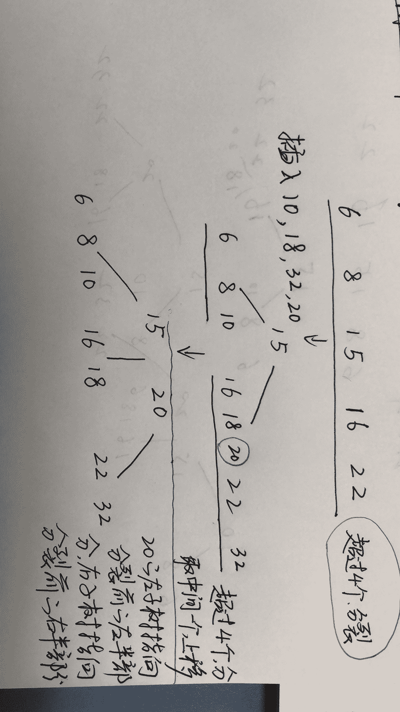
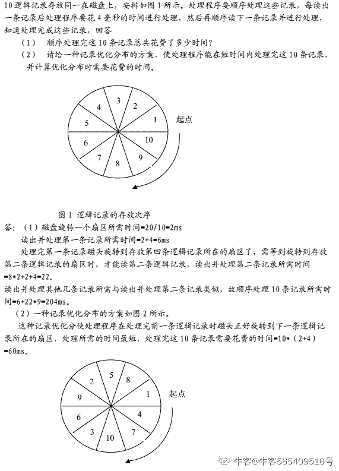

# 爱奇艺 2019 秋招运维方向笔试题（A）

## 1

使用堆排序方法排序（45，78，57，25，41，89），初始堆为（      ）

正确答案: B   你的答案: 空 (错误)

```cpp
78,45,57,25,41,89
```

```cpp
89,78,57,25,41,45
```

```cpp
89,78,25,45,41,57
```

```cpp
89,45,78,41,57,25
```

本题知识点

排序 *讨论

[修改昵称失败](https://www.nowcoder.com/profile/947651)

首先建立完全二叉树
从最后一个叶子节点开始第一次交换了 57 和 89 的位置然后比较 45 和 89，进行交换
再比较换下来的 45，45 不符合大根堆，与 57 交换

发表于 2019-05-29 21:11:08

* * *

[叫我皮卡丘](https://www.nowcoder.com/profile/1078265)


发表于 2019-08-05 17:40:53

* * *

[牛客 ID：507639719](https://www.nowcoder.com/profile/507639719)

堆排序 (Heap sort) 就是利用堆(假设利用大顶堆)进行排序的方法 。基本思想是

1.  构建初始堆
2.  将根节点与末尾元素交换，进行堆构造（末尾元素不参与）
3.  重复 2 过程，直到“堆”仅剩 1 个元素。

```cpp
function HeapSort(arr) {
  arr = [0, ...arr]; // 方便左右子树表示
  //第一步，构建初始堆
  for (let i = ~~Math.length / 2; i > 0; i--) {
    buildHeap(arr, i, arr.length);
  }

  for (let i = arr.length; i > 1; i--) {
    // 交换
    [arr[1], arr[i - 1]] = [arr[i - 1], arr[1]];
    // 根元素与末尾元素交换，再构建大顶堆
    buildHeap(arr, 1, i - 1);
  }
  return arr.slice(1); // 移除添加的 0 元素
}

// 构造大顶堆
function buildHeap(arr, i, length) {
  let temp = arr[i];
  for (let j = 2 * i; j <= length; j *= 2) {
    if (arr[j] < arr[j + 1]) j++;
    if (temp > arr[j]) break;
    arr[i] = arr[j];
    i = j;
  }
  arr[i] = temp;
}

// ------- 测试
let arr = [3, 9, 5, 2, 6];
console.log(HeapSort(arr)); // [ 9, 5, 6, 2, 3 ]

arr = [5, 3, 9, 8, 3, 4];
console.log(HeapSort(arr)); // [ 8, 3, 3, 5, 9, 4 ]
```

发表于 2019-06-09 09:31:00

* * *

## 2

6 个圆盘的汉诺塔，总的移动次数是（      ）

正确答案: D   你的答案: 空 (错误)

```cpp
30
```

```cpp
33
```

```cpp
60
```

```cpp
63
```

本题知识点

递归

讨论

[Michael264](https://www.nowcoder.com/profile/54836329)

> **定义** Hanoi(n, a, b, c)：将 n 个盘子从 a 柱移到 c 柱，b 柱起中转作用。f(n)：n 个盘子的汉诺塔的总移动次数。

**Hanoi(n, a, b, c) = Hanoi(n-1, a, c, b) + 1 + Hanoi(n-1, b, a, c)**：将 a 上面 n-1 个盘子移到 b，再将 a 最下面的盘子移到 c，再将 b 上的 n-1 个盘子移到 c，此时，**n 盘子汉诺塔问题 **变成了**移****动一个盘子 + ****两个 n-1 盘子汉诺塔问题。**故 **f(n) = f(n-1) + 1 + f(n-1) = 2f(n-1) + 1****=> f(n) + 1 = 2(f(n-1) + 1) ****=> f(n) + 1 = 2^(n-1) (f(1) + 1)****=> f(n) + 1 = 2^n****=> f(n) = 2^n -1**

发表于 2019-08-14 19:29:51

* * *

[忽然间要很好](https://www.nowcoder.com/profile/587724363)

f(1)=1f(2)=3f(n)=2*f(n-1)+1 相当于借助 B 柱 将 A 柱上前 n-1 个盘先放在 B 柱上（f(n-1)），再挪最后一个盘到 c 盘(+1)，之后再挪 B 柱的 n-1 个盘到 C 柱（f(n-1)），递归循环。

发表于 2019-05-30 12:37:57

* * *

[问纤](https://www.nowcoder.com/profile/857851073)

2＾n - 1

发表于 2019-06-07 09:40:52

* * *

## 3

设哈希表长为 11，哈希函数为 Hash (key)=key%11。存在关键码{43,7,29,22,16,92,44,8,19}，采用二次探测法处理冲突，建立的 hash 表为（    ）

正确答案: B   你的答案: 空 (错误)

```cpp
其他几项都不对
```

本题知识点

安卓工程师 爱奇艺 C++工程师 iOS 工程师 Java 工程师 测试工程师 算法工程师 前端工程师 运维工程师 哈希 *2019 测试开发工程师 大数据开发工程师* *讨论

[冲上顶峰](https://www.nowcoder.com/profile/189892324)

解析：采用开放定址法处理冲突中的二次探测再散列（也即是题目中的二元探测法）,则哈希函数变为 Hash(key） = (Hash(key)  + d) % 11，其中 d = 1², -1², 2², -2², 3²,……，则开始计算。

对于 43，代入公式为 Hash(43) = 43 % 11 = 10, 则地址为 10；

对于 7，代入公式为 Hash(7) = 7 % 11 = 7,则地址为 7；

对于 29，代入公式为 Hash(29) = 29 % 11 = 7, 与 7 冲突，则采用二次探测进行消除冲突， 继续(7 + 1) % 11 = 8，没有冲突，则地址为 8；

对于 22，代入公式 Hash(22) = 22 % 11 = 0, 则地址为 0；

对于 16，代入公式 Hash(16) = 16 % 11 = 5, 则地址为 5；

对于 92，代入公式 Hash(92) = 92 % 11 = 4,则地址为 4；

对于 44，代入公式 Hash(44) = 44 % 11 = 0, 与 22 的地址冲突，则继续(0 + 1) % 11 = 1,没有冲突，则地址为 1；

对于 8， 代入公式 Hash(8) = 8 % 11 = 8, 与 29 有冲突，则继续(8 + 1) % 11 = 9, 没有冲突，则地址为 9；

对于 19，代入公式 Hash(19) = 19 % 11 = 8\. 与 29 有冲突，则继续(8 + 1) * 11 = 9, 与 8 有冲突，继续(8 - 1) % 11 = 7, 与 7 有冲突，则继续(8 + 4) % 11 = 1, 与 44 有冲突，则继续(8 - 4) % 11 = 4, 与 92 有冲突，则继续(8 + 9) % 11 = 6, 没有冲突，则地址为 6.

所以最后得到的 Hash 表为下图所示：


发表于 2019-06-01 19:33:14

* * *

[sugarhit](https://www.nowcoder.com/profile/598224351)

真的。字太小了。19 和 29 根本看不清

发表于 2019-08-20 15:36:44

* * *

[OKOKOKOKOK](https://www.nowcoder.com/profile/2857851)

二次探测法：设发生冲突的地址为 d，则新的地址序列为 d+1²,d-1²,d+2²,d-2²,...

发表于 2019-05-30 14:11:07

* * *

## 4

有关希尔排序算法叙述正确的是（      ）

正确答案: A B   你的答案: 空 (错误)

```cpp
最后一次的步长增量一定为 1
```

```cpp
分割后子序列内部的排序算法是直接插入排序
```

```cpp
分割后子序列内部的排序算法是直接选择排序
```

```cpp
希尔排序是稳定排序算法
```

本题知识点

安卓工程师 爱奇艺 C++工程师 iOS 工程师 Java 工程师 测试工程师 算法工程师 前端工程师 运维工程师 排序 *2019 测试开发工程师 大数据开发工程师* *讨论

[Yd。201906031539658](https://www.nowcoder.com/profile/907160213)

[Shell 排序](https://baike.baidu.com/item/Shell%E6%8E%92%E5%BA%8F)的执行时间依赖于[增量](https://baike.baidu.com/item/%E5%A2%9E%E9%87%8F)序列。好的[增量](https://baike.baidu.com/item/%E5%A2%9E%E9%87%8F)序列的共同特征：① 最后一个[增量](https://baike.baidu.com/item/%E5%A2%9E%E9%87%8F)必须为 1；② 应该尽量避免序列中的值(尤其是相邻的值)互为倍数的情况。有人通过大量的实验，给出了较好的结果：当 n 较大时，比较和移动的次数约在 nl.25 到 1.6n1.25 之间。2．Shell 排序的时间性能优于[直接插入排序](https://baike.baidu.com/item/%E7%9B%B4%E6%8E%A5%E6%8F%92%E5%85%A5%E6%8E%92%E5%BA%8F)希尔排序的时间性能优于[直接插入排序](https://baike.baidu.com/item/%E7%9B%B4%E6%8E%A5%E6%8F%92%E5%85%A5%E6%8E%92%E5%BA%8F)的原因：①当文件初态基本有序时[直接插入排序](https://baike.baidu.com/item/%E7%9B%B4%E6%8E%A5%E6%8F%92%E5%85%A5%E6%8E%92%E5%BA%8F)所需的比较和移动次数均较少。②当 n 值较小时，n 和  的差别也较小，即[直接插入排序](https://baike.baidu.com/item/%E7%9B%B4%E6%8E%A5%E6%8F%92%E5%85%A5%E6%8E%92%E5%BA%8F)的最好[时间复杂度](https://baike.baidu.com/item/%E6%97%B6%E9%97%B4%E5%A4%8D%E6%9D%82%E5%BA%A6)O(n)和最坏时间复杂度 0(  )差别不大。③在希尔排序开始时[增量](https://baike.baidu.com/item/%E5%A2%9E%E9%87%8F)较大，分组较多，每组的记录数目少，故各组内直接插入较快，后来增量 di 逐渐缩小，分组数逐渐减少，而各组的记录数目逐渐增多，但由于已经按 di-1 作为距离排过序，使文件较接近于有序状态，所以新的一趟排序过程也较快。因此，希尔排序在效率上较直接插入排序有较大的改进。

发表于 2019-06-03 16:49:08

* * *

[Zoe 小茗](https://www.nowcoder.com/profile/324939503)

排序最后一次则会对间隔为 1 的元素，也就是相邻元素执行标准插入排序。

发表于 2019-08-04 15:19:53

* * *

[Juventus-🐂](https://www.nowcoder.com/profile/79434593)

希尔排序的执行时间依赖于增量序列。最后一个增量必须为 1，时间性能优于直接插入排序。

发表于 2022-01-23 15:41:36

* * *

## 5

广义表 K=(m,n,(p,(q,s)),(h,f)),则 head[tail[head[tail[tail(K)]]]]的值为（      ）

正确答案: B   你的答案: 空 (错误)

```cpp
s
```

```cpp
q
```

```cpp
p
```

```cpp
h
```

本题知识点

安卓工程师 爱奇艺 C++工程师 iOS 工程师 Java 工程师 测试工程师 算法工程师 前端工程师 运维工程师 链表 *2019 测试开发工程师 大数据开发工程师* *讨论

[冲上顶峰](https://www.nowcoder.com/profile/189892324)

head() 返回列表的第一个元素；

tail() 返回列表的删去第一个元素之后的剩余列表；K=(m,n,(p,(q,s)),(h,f)),
head[tail[head[tail[tail(K)]]]]
tail(K)-------(n,(p,(q,s)),(h,f))tail[tail[K]]--------((p,(q,s)),(h,f))head()-----((p,(q,s))tail()-----(q,s)head()-------q

发表于 2019-06-01 19:30:59

* * *

[Astrallee](https://www.nowcoder.com/profile/376787917)

我为什么觉得是（p,s)啊，前面的 tail 也是按照这个思路来的。取到最后两个的时候是(p,(q,s))。 tail 一次 不应该是((q,s))吗

发表于 2019-12-06 23:33:27

* * *

[OKOKOKOKOK](https://www.nowcoder.com/profile/2857851)

从最里层括号一直向外计算。head(a,b)：保留括号第一个元素 a，去除其余 tail(a,b)：去除第一个元素 a，保留其余

发表于 2019-05-30 14:16:30

* * *

## 6

在一个空的 5 阶 B-树中依次插入关键字序列{6,8,15,16,22,10,18,32,20}，插入完成后，关键字 6 所在结点包含的关键字个数为（      ）

正确答案: B   你的答案: 空 (错误)

```cpp
2
```

```cpp
3
```

```cpp
4
```

```cpp
5
```

本题知识点

爱奇艺 树 2019

讨论

[newcomer](https://www.nowcoder.com/profile/291053)

一颗 m 阶 B 树，非叶节点至多可以有 m-1 个关键字，至少可以有 ceil(n/2)-1 个，根节点可以至少有一个关键字。根据这个原则，可以画出 5 阶 B 树的构建过程，如下图所示：

编辑于 2019-07-03 10:22:34

* * *

[漫步云端.](https://www.nowcoder.com/profile/478154402)

这篇博客写的挺好[`blog.csdn.net/li_canhui/article/details/85305147`](https://blog.csdn.net/li_canhui/article/details/85305147)

发表于 2019-08-28 21:36:48

* * *

[默默学习的啦啦啦](https://www.nowcoder.com/profile/146773881)

n 阶 B-树，每个结点中关键字个数范围为 ceil(n/2) - 1 ~ n-1 个，因此为 2-4 个，插入时首先插入 6,8,15,16；再插入 22 时结点个数大于 4，因此取 15 为中间结点拆分，变成 15 - (6,8),(16,22)，继续插入 10,18,32 变成 15 - (6,8,10),(16,18,22,32)，再插入 20 时结点个数大于 4，取 20 为中间结点拆分，合并到根节点上变为(15,20) - (6,8,10),(16,18),(22,32)

编辑于 2019-05-31 09:42:32

* * *

## 7

在求两个集合并集的过程中，可能需用到的操作是（      ）  

正确答案: A B C D   你的答案: 空 (错误)

```cpp
取元素
```

```cpp
插入元素
```

```cpp
比较操作
```

```cpp
求表长
```

本题知识点

安卓工程师 爱奇艺 C++工程师 iOS 工程师 Java 工程师 测试工程师 算法工程师 前端工程师 运维工程师 哈希 *2019 测试开发工程师 大数据开发工程师* *讨论

[叫我皮卡丘](https://www.nowcoder.com/profile/1078265)

需求：求两个集合的并集 1\. 取元素，至少得知道集合存的是啥元素 2\. 插入元素，并集可能存在集合 A 中有而集合 B 中无的元素，需要插入到新的集合中 3\. 比较操作，判断是否相等 4\. 求表长，完整遍历

发表于 2019-08-05 17:54:29

* * *

[拾陆 humin](https://www.nowcoder.com/profile/334013855)

联想 归并排序

发表于 2019-06-13 18:51:00

* * *

[冲上顶峰](https://www.nowcoder.com/profile/189892324)

还需要求表长

发表于 2019-06-01 19:27:00

* * *

## 8

TCP 协议与 UDP 协议负责端到端连接，下列那些信息只出现在 TCP 报文，UDP 报文不包含此信息（      ）

正确答案: A D   你的答案: 空 (错误)

```cpp
序列号
```

```cpp
源端口
```

```cpp
目标端口
```

```cpp
窗口大小
```

本题知识点

安卓工程师 爱奇艺 C++工程师 iOS 工程师 Java 工程师 测试工程师 算法工程师 前端工程师 运维工程师 网络基础 2019 测试开发工程师 大数据开发工程师

讨论

[叫我皮卡丘](https://www.nowcoder.com/profile/1078265)

UDP 头部信息只有 4 个，从哪来：源端口到哪去：目的端口有多长：长度对不对：校验和

发表于 2019-08-05 18:13:13

* * *

[冲上顶峰](https://www.nowcoder.com/profile/189892324)

[`www.cnblogs.com/steven520213/p/8005258.html`](https://www.cnblogs.com/steven520213/p/8005258.html)**UDP****的包头结构：**
    源端口 16 位
    目的端口 16 位
    长度 16 位
    校验和 16 位

发表于 2019-06-01 19:41:07

* * *

[newcomer](https://www.nowcoder.com/profile/291053)

TCP 与 UDP 最大的不同就是前者是可靠传输，后者是不可靠的。为了保证可靠传输，TCP 采用了一系列机制，比如序列号是指客户端确认序列号以及以前的信息都收到了，窗口大小则是提高传输效率，保证信息按序到达。这些很明显 UDP 是没有的。

发表于 2019-07-03 09:09:53

* * *

## 9

程序员编写程序时使用文件系统提供的系统调用将内存中由 address 地址开始的 n 个字节或 n 个记录的信息写入指定文件中，但发现文件名不可用，可行的解决办法是（）

正确答案: A B   你的答案: 空 (错误)

```cpp
使用文件描述符代替文件名
```

```cpp
使用文件句柄代替文件名
```

```cpp
使用当前进程的 PCB 编号代替
```

```cpp
以上办法都不可行
```

本题知识点

安卓工程师 爱奇艺 C++工程师 iOS 工程师 Java 工程师 测试工程师 算法工程师 前端工程师 运维工程师 操作系统 2019 测试开发工程师 大数据开发工程师

讨论

[dylmail](https://www.nowcoder.com/profile/501837184)

**无论是文件句柄（Windows 中概念），还是文件描述符（linux 中概念），其最终目的都是用来定位打开的文件在内存中的位置，只是它们映射的方式不一样。****PCB（进程控制块）在 linux 中具体实现是 task_struct 数据结构，这些进程必须要有唯一标识符，所以里面含有 pid（进程 ID）**

发表于 2020-06-30 17:24:38

* * *

[360 公司内推小助手](https://www.nowcoder.com/profile/385100296)

文件句柄与文件描述符 [`www.cnblogs.com/ChunJian-YANG/p/5322041.html`](https://www.cnblogs.com/ChunJian-YANG/p/5322041.html)

发表于 2019-06-03 15:27:55

* * *

## 10

某软件公司正在升级一套水务管理系统。该系统用于县市级供排水企业、供水厂、排水厂中水务数据的管理工作。系统经重新整合后，开发人员决定不再使用一张备份数据表 waterinfo001 表，需永久删除。选出符合要求的语句。 

正确答案: C   你的答案: 空 (错误)

```cpp
DELETE TABLE waterinfo001
```

```cpp
DELETE FROM TABLE waterinfo001
```

```cpp
DROP TABLE waterinfo001
```

```cpp
DROP FROM TABLE waterinfo001
```

本题知识点

安卓工程师 爱奇艺 C++工程师 iOS 工程师 Java 工程师 测试工程师 算法工程师 前端工程师 运维工程师 数据库 SQL 2019 测试开发工程师 大数据开发工程师

讨论

[夏花爱秋叶](https://www.nowcoder.com/profile/4085682)

```cpp
1. drop 是完全删除表，包括表结构
2. delete 是删除表数据，保留表的结构，而且可以加 where,只删除一行或者多行
3. truncate 只能删除表数据，会保留表结构，而且不能加 where

```

发表于 2020-03-11 11:37:04

* * *

[叫我皮卡丘](https://www.nowcoder.com/profile/1078265)

DELETE FROM waterinfo001;清除 waterinfo001 表全部记录 DROP TABLE waterinfo001;删除 waterinfo001 表

编辑于 2019-11-07 08:05:54

* * *

[fighting.java](https://www.nowcoder.com/profile/543231756)

| 1. drop 是完全删除表，包括表结构 2. delete 是删除表数据，保留表的结构，而且可以加 where,只删除一行或者多行 3. truncate 只能删除表数据，会保留表结构，而且不能加 where |

发表于 2020-04-29 20:33:49

* * *

## 11

HTTP 连接过程中，服务器端返回状态码 403 表示（      ）

正确答案: A   你的答案: 空 (错误)

```cpp
服务器拒绝请求
```

```cpp
服务器找不到请求的网页
```

```cpp
请求的网页已永久移动到新位置
```

```cpp
服务器目前无法使用
```

本题知识点

运维工程师 爱奇艺 网络基础 运维 2019

讨论

[考研必胜-上岸上岸](https://www.nowcoder.com/profile/262381939)

101 切换协议 200 成功 301 永久重定向 302 暂时重定向 400 语法错误 403 没有足够的权限 404 找不到对应的资源 500 服务器内部错误 503 服务不可用

发表于 2020-08-06 23:24:06

* * *

[已注销](https://www.nowcoder.com/profile/631714656)

B 对应 404，C 对应 301，D 对应 503

发表于 2019-06-03 16:20:28

* * *

[openmind.](https://www.nowcoder.com/profile/539390139)

HTTP 状态码详解： [`www.processon.com/view/5d1b1bd8e4b0f7ca49d95367?fromnew=1#map`](https://www.processon.com/view/5d1b1bd8e4b0f7ca49d95367?fromnew=1#map)

发表于 2021-05-04 15:05:35

* * *

## 12

半夜,你被服务器运营商的短信通知吵醒,短信告诉你"您的服务器在 xxx.xx.xxx.xx 在美国(ip:xx.xx.xx.xx)登录",作为运维工程师的你马上打开电脑并连上服务器,并在终端上打下()命令来查看最近的登录用户

正确答案: B   你的答案: 空 (错误)

```cpp
last -n 5 | awk  "{print $1 '\t' $7}"
```

```cpp
last -n 5 | awk  '{print $1 "\t" $7}'
```

```cpp
last -n 5 | awk  "{printf $1 '\t' $7}"
```

```cpp
last -n 5 | awk  '{printf $1 "\t" $7}'
```

本题知识点

运维工程师 爱奇艺 运维 2019

讨论

[懒猫先生。](https://www.nowcoder.com/profile/6243995)

awk 大括号之外只能用单引号.D 选项 printf 不对

发表于 2020-06-22 18:58:46

* * *

[taetaeyst](https://www.nowcoder.com/profile/177309341)

awk 中' '是代表代码的引用

发表于 2020-07-21 15:23:14

* * *

[牛客 558285112 号](https://www.nowcoder.com/profile/558285112)

printf 是格式化输出，要跟格式化字符

发表于 2021-04-21 17:42:00

* * *

## 13

命令 grep -A5 custer f1.txt 的含义是

正确答案: A   你的答案: 空 (错误)

```cpp
匹配文本文件 fi.txt 中的 custer，并打印出该行及下面的 5 行
```

```cpp
匹配文本文件 fi.txt 中的 custer，并打印出该行及上面的 5 行
```

```cpp
匹配文本文件 fi.txt 中的 custer，并打印出该行上面的 5 行
```

```cpp
匹配文本文件 fi.txt 中的 custer，并打印出该行下面的 5 行
```

本题知识点

运维工程师 爱奇艺 运维 2019

讨论

[磕磕](https://www.nowcoder.com/profile/107617791)

-A 是显示匹配和它后面的 n 行。 -B 是显示匹配行和它前面的 n 行。 （before）-C 是匹配行和它前后各 n 行。 

发表于 2020-03-05 13:41:20

* * *

[努力向上的小图](https://www.nowcoder.com/profile/3267299)

-A 是显示匹配和它后面的 n 行。 after-B 是显示匹配行和它前面的 n 行。before-C 是匹配行和它前后各 n 行。after&before

发表于 2020-07-07 20:40:46

* * *

[牛客 998592889 号](https://www.nowcoder.com/profile/998592889)

  -B, --before-context=NUM  print NUM lines of leading context
  -A, --after-context=NUM   print NUM lines of trailing context
  -C, --context=NUM         print NUM lines of output context

发表于 2020-06-29 10:22:03

* * *

## 14

假如服务器被攻击,你要列出访问次数前十的 ip 地址,以下命令你不需要用到的是

正确答案: A   你的答案: 空 (错误)

```cpp
netstat
```

```cpp
uniq
```

```cpp
sort
```

```cpp
last
```

本题知识点

运维工程师 爱奇艺 运维 2019

讨论

[唔。寐](https://www.nowcoder.com/profile/4648256)

last | awk '{print$3}' | sort | uniq -c | sort -rn | head -10 ,last 显示服务器上用户最近登录信息，第三列为远程登录主机的 ip,第一次 sort 排序来让 uniq -c 显示重复行出现次数,sort -rn 依据显示的次数降序显示，head -10 代表显示 10 行

编辑于 2020-03-20 11:43:11

* * *

[大星星和小猩猩](https://www.nowcoder.com/profile/9374535)

**last | awk '{print$3}' | sort | uniq -c | sort -rn | head -10**last 显示服务器上用户最近登录信息，第三列为远程登录主机的 ip，第一次 sort 排序来让 uniq -c 显示重复行出现次数，sort -rn 依据显示的次数降序显示，head -10 代表显示 10 行

发表于 2020-04-02 11:01:35

* * *

[懒猫先生。](https://www.nowcoder.com/profile/6243995)

这道题我的理解是 A 答案。D 答案那是对于已经被入侵后的服务器使用，而被攻击的服务器如果没有被入侵是查不到登录信息的，而且入侵不一定会有登录信息。A 答案可以查看当前连接的信息。比如对端口进行攻击的连接

发表于 2020-06-22 19:02:43

* * *

## 15

下列关于 zabbix 的说法正确的是

正确答案: D   你的答案: 空 (错误)

```cpp
zabbix_agentd 是客户端守护进程,同来用来客户端排错
```

```cpp
zabbix_proxy 用来向收集客户端数据
```

```cpp
zabbix_sender 专门用于发送数据给 server，通常用于耗时比较长的检查。
```

```cpp
zabbix_server 用来接受其他进程提交的数据
```

本题知识点

运维工程师 爱奇艺 运维 2019

讨论

[zhello](https://www.nowcoder.com/profile/666342245)

Zabbix agent 用于采集上传监控数据

Zabbix server 负责配置和接收监控信息

Zabbix proxy 负责分担 server 的处理性能压力

Zabbix sender 用于 agent 主动上传数据

Zabbix get 用于 server 主动拉取数据

发表于 2020-03-25 22:34:37

* * *

[妮妮妹妹](https://www.nowcoder.com/profile/998137453)

zabbix 基于 web 界面提供分布式系统监视以及网络监视功能的企业级开源解决方案。

Zabbix agent 用于采集上传监控数据

Zabbix server 负责配置和接收监控信息

Zabbix proxy 负责分担 server 的处理性能压力

Zabbix sender 用于 agent 主动上传数据

Zabbix get 用于 server 主动拉取数据

发表于 2021-06-07 15:54:18

* * *

[牛客 559836593 号](https://www.nowcoder.com/profile/559836593)

```cpp
zabbix_server 用来接受其他进程提交的数据
```

发表于 2021-02-25 20:15:35

* * *

## 16

创建用户时不指定用户主目录的参数（      ）

正确答案: C   你的答案: 空 (错误)

```cpp
useradd -o
```

```cpp
useradd -m
```

```cpp
useradd -M
```

```cpp
useradd -d
```

本题知识点

运维工程师 爱奇艺 Linux 2019

讨论

[年糕*](https://www.nowcoder.com/profile/596219597)

| 参数 | 全称 | 释义 |
| --- | --- | --- |
| -b | base-dir BASE_DIR | 新账户的主目录的基目录 |
| -c | comment COMMENT | 新账户的 GECOS 字段 |
| **-d** | **home-dir HOME_DIR** | **新账户的主目录** |
| -D | defaults | 显示或更改默认的 useradd 配置 |
| -e | expiredate EXPIRE_DATE | 新账户的过期日期 |
| -f | inactive INACTIVE | 新账户的密码不活动期 |
| -g | gid GROUP | 新账户主组的名称或 ID |
| -G | groups GROUPS | 新账户的附加组列表 |
| -h | help | 显示此帮助信息并推出 |
| -k | skel SKEL_DIR | 使用此目录作为骨架目录 |
| -K | key KEY=VALUE | 不使用 /etc/login.defs 中的默认值 |
| -l | no-log-init | 不要将此用户添加到最近登录和登录失败数据库 |
| **-m** | **create-home** | **创建用户的主目录** |
| **-M** | **no-create-home** | **不创建用户的主目录** |
| -N | no-user-group | 不创建同名的组 |
| **-o** | **non-unique** | **允许使用重复的 UID 创建用户** |
| -p | password PASSWORD | 加密后的新账户密码 |
| -r | system | 创建一个系统账户 |
| -s | shell SHELL | 新账户的登录 shell |
| -u | uid UID | 新账户的用户 ID |
| -U | user-group | 创建与用户同名的组 |
| -Z | selinux-user SEUSER | 为 SELinux 用户映射使用指定 SEUSER |

发表于 2019-08-06 13:18:11

* * *

[BubbleTg](https://www.nowcoder.com/profile/3275039)

这么多，我学要记住吗？？？😔

发表于 2020-08-09 14:12:30

* * *

[SereneMA](https://www.nowcoder.com/profile/187007874)

[root@master ~]# useradd --help
Usage: useradd [options] LOGIN
       useradd -D
       useradd -D [options]

Options:
  -b, --base-dir BASE_DIR       base directory for the home directory of the
                                new account
  -c, --comment COMMENT         GECOS field of the new account
  -d, --home-dir HOME_DIR       home directory of the new account
  -D, --defaults                print or change default useradd configuration
  -e, --expiredate EXPIRE_DATE  expiration date of the new account
  -f, --inactive INACTIVE       password inactivity period of the new account
  -g, --gid GROUP               name or ID of the primary group of the new
                                account
  -G, --groups GROUPS           list of supplementary groups of the new
                                account
  -h, --help                    display this help message and exit
  -k, --skel SKEL_DIR           use this alternative skeleton directory
  -K, --key KEY=VALUE           override /etc/login.defs defaults
  -l, --no-log-init             do not add the user to the lastlog and
                                faillog databases
  -m, --create-home             create the user's home directory
  -M, --no-create-home          do not create the user's home directory
  -N, --no-user-group           do not create a group with the same name as
                                the user
  -o, --non-unique              allow to create users with duplicate
                                (non-unique) UID
  -p, --password PASSWORD       encrypted password of the new account
  -r, --system                  create a system account
  -R, --root CHROOT_DIR         directory to chroot into
  -s, --shell SHELL             login shell of the new account
  -u, --uid UID                 user ID of the new account
  -U, --user-group              create a group with the same name as the user
  -Z, --selinux-user SEUSER     use a specific SEUSER for the SELinux user mapping

发表于 2019-09-25 18:51:57

* * *

## 17

网络管理员在/opt 分区上安装应用软件，提示磁盘可用空间不足,解决需要的指令和参数是（      ）

正确答案: A C D   你的答案: 空 (错误)

```cpp
umount /opt
```

```cpp
mkfs opt
```

```cpp
resize
```

```cpp
parted
```

本题知识点

运维工程师 爱奇艺 Linux 2019

讨论

[我的天鸭](https://www.nowcoder.com/profile/243498)

这个 resize 改窗口大小的命令是认真的吗，应该是 resize2fs 吧，用于放大或者缩小没有挂载的文件系统的大小

发表于 2019-08-06 19:53:12

* * *

[feelinghappy](https://www.nowcoder.com/profile/6136320)

**parted 命令格式**
parted 有两种运行模式：命令行模式和交互模式。与 fdisk 的交互模式交互模式不同，在 parted 的交互模式下执行命令，一旦按回车键确认，命令就马上执行，对磁盘的更改就立刻生效。
parted 命令的常用格式是：
1、# parted [选项] <硬盘设备名>
2、# parted [选项] <硬盘设备名> <子命令> [<子命令参数>]
格式（1）用于进入 parted 的交互模式，在该模式下输入 parted 的子命令对指定的硬盘进行分区等操作。quit 命令用于退出交互模式。
格式（2）直接在命令行方式下对指定的硬盘进行分区等操作。
其中常用的选项为：
-h, ––help — 显示求助信息
-i, ––interactive — 在必要时提示用户
-l, ––list — 显示所有磁盘设备的分区表
-s, ––script — 从不提示用户
-v, ––version — 显示版本

发表于 2020-08-16 13:59:46

* * *

[gybcloud](https://www.nowcoder.com/profile/664012)

可用空间不足就 umount 吗？网络管理员都这么干吗？出来给解释一下？

发表于 2021-03-20 19:55:01

* * *

## 18

邮件服务器为每个用户限制磁盘存储空间上限，执行 checkquota -cug /var/mail 指令后, 在/var/mail 目录自动创建的配置文件是（      ）

正确答案: B C   你的答案: 空 (错误)

```cpp
quota.user
```

```cpp
aquota.user
```

```cpp
aquota.group
```

```cpp
quota.group
```

本题知识点

运维工程师 爱奇艺 Linux 2019

讨论

[ceeeeeeeeeeeb](https://www.nowcoder.com/profile/542410100)

aquota.group 与 aqouta.user 分别是组以及用户磁盘配额需要的配置文件，而且权限还是 600

发表于 2019-08-07 09:17:38

* * *

[大星星和小猩猩](https://www.nowcoder.com/profile/9374535)

**aquota.group 与 aqouta.user 分别是组以及用户磁盘配额需要的配置文件。**如果没有这两个文件，则磁盘配额是不会生效的。**quota(选项)(参数)** **选项有：**-g：列出群组的磁盘空间限制；
-q：简明列表，只列出超过限制的部分；
-u：列出用户的磁盘空间限制；
-v：显示该用户或群组，在所有挂入系统的存储设备的空间限制；
-V：显示版本信息。

**参数有：**
用户或者工作组：指定要显示的用户或者工作组。

编辑于 2020-04-05 23:41:01

* * *

[YaSiR-linux](https://www.nowcoder.com/profile/97911731)

-g 扫描磁盘空间时，计算每个群组识别码所占用的目录和文件数目。
-R 排除根目录所在的分区。
-u 扫描磁盘空间时，计算每个用户识别码所占用的目录和文件数目。

发表于 2019-07-23 18:02:39

* * *

## 19

某页式虚拟存储系统，针对作业 A 按照 10 个字地址序列进行访问。若采用 FIFO 调度算法会产生 5 次缺页中断，若采用 LRU 算法会产生 6 次缺页中断，则以下推断合理的是（    ）

正确答案: A B C D   你的答案: 空 (错误)

```cpp
分配给作业 A 的存储块 M=3
```

```cpp
作业 A 的第 0 页在调度之前已放入内存块中
```

```cpp
系统可以按照作业 A 的页号进行调度
```

```cpp
若采用 FIFO 调度算法，中断率为 50%，若采用 LRU 算法，中断率为 60%。
```

本题知识点

运维工程师 爱奇艺 操作系统 2019

讨论

[梦想中的 offer](https://www.nowcoder.com/profile/495662984)

爱奇艺考这？

发表于 2021-06-07 20:06:24

* * *

[OrientObjectPro](https://www.nowcoder.com/profile/3143319)

这题有水平，做题者需要盲推字节序列，真牛逼

发表于 2019-08-18 11:23:05

* * *

[征途是一百级大牛](https://www.nowcoder.com/profile/803324974)

啥玩意儿是字节序列

发表于 2021-12-24 16:25:09

* * *

## 20

某磁盘格式化后每个盘面 10 个扇区，现有记录 1~11 存放于同一磁道，若要顺序处理这些记录，则以下说法正确的是（     ）

正确答案: B C D   你的答案: 空 (错误)

```cpp
若磁盘转速为 25ms,每条记录的平均处理时间为 5ms,则处理第一条记录的时间为 6ms.
```

```cpp
若磁盘转速为 20ms,每条记录的平均处理时间为 4ms,则处理完 10 条记录的时间为 204ms。
```

```cpp
若磁盘转速为 20ms,每条记录的平均处理时间为 4ms,则处理第一条记录的时间为 6ms.
```

```cpp
若随机处理这 10 条记录，则所消耗的系统时间可以低至 60ms。
```

本题知识点

运维工程师 爱奇艺 操作系统 2019

讨论

[好想吃火锅](https://www.nowcoder.com/profile/5924575)

题目假定了磁头一开始是在 1 的起点，转动一个扇区是 2ms，处理数据 4ms，一条数据需要 6ms，最坏情况是顺时针旋转数据逆时针排列，从第一条数据终点到下一条数据的起点转动 8 个扇区，延迟 16ms，6+9（16+6）=204ms 最好情况是顺时针，所以 6×10=60

发表于 2020-04-20 03:46:25

* * *

[牛客 565409516 号](https://www.nowcoder.com/profile/565409516)



发表于 2021-07-16 15:16:52

* * *

[征途是一百级大牛](https://www.nowcoder.com/profile/803324974)

反向排列，(20/10)+4+9*(4+18)=204 正向排列，(20/10+4)*10=60

发表于 2021-12-23 15:05:55

* * ******