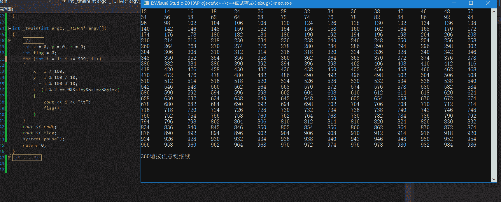
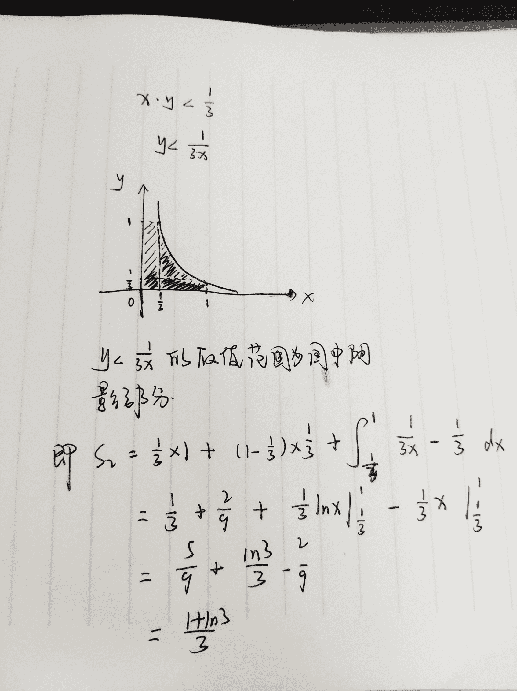
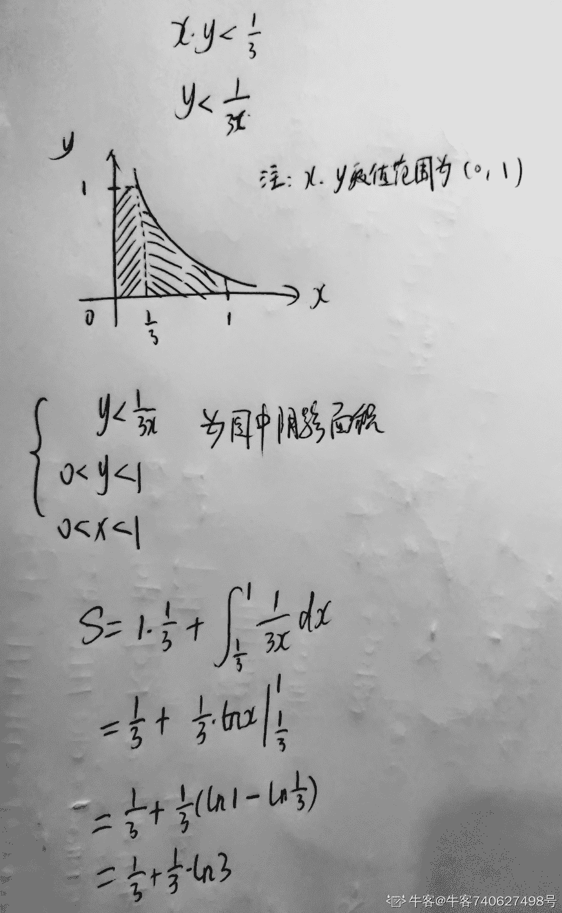
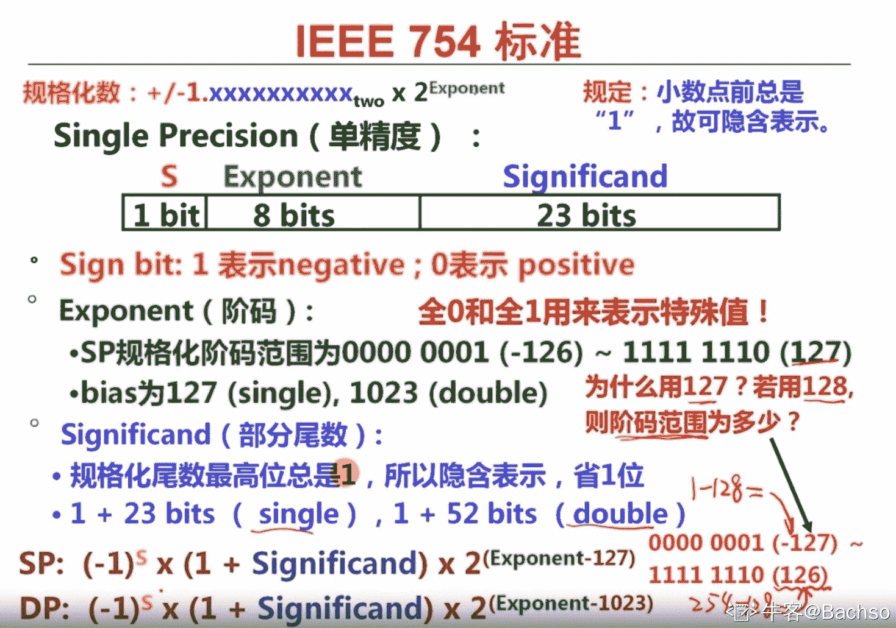

# 寒武纪 2019 秋招软件岗试题（二）

## 1

如果开始时计算机处于大写输入状态，现在反复按照 CapsLock、字母键 A、字母键 S、字母键 D、字母键 F 的顺序来回按键，即 Capslock、A、S、D、F、D、S、A、Capslock、A、S、D、F、D、… ，则屏幕上输出的第 85 个字母是

正确答案: A   你的答案: 空 (错误)

```cpp
a
```

```cpp
b
```

```cpp
A
```

```cpp
B
```

本题知识点

Java 工程师 C++工程师 寒武纪 算法工程师 2019

讨论

[布朗](https://www.nowcoder.com/profile/6273663)

注意审题，开始时计算机处于大写状态

发表于 2019-05-28 19:54:22

* * *

[馨馨秋雨梦](https://www.nowcoder.com/profile/925784853)

注意，题目问的是字母，CapsLock 不是字母

发表于 2019-06-13 16:02:52

* * *

[梅妮](https://www.nowcoder.com/profile/557156060)

开始时计算机处于大写状态，于是按下 CapsLock 变为小写，小大写一个循环是 14 个数，用 85 对 14 去余的余数为 1，所以输出的是第一个数 a

发表于 2019-06-21 16:19:12

* * *

## 2

在程序运行过程中，如果递归调用的层数过多，会因为【       】引发错误

正确答案: A   你的答案: 空 (错误)

```cpp
系统分配的栈空间溢出
```

```cpp
系统分配的堆空间溢出
```

```cpp
系统分配的队列空间溢出
```

```cpp
系统分配的链表空间溢出
```

本题知识点

Java 工程师 C++工程师 寒武纪 算法工程师 2019

讨论

[wyu123](https://www.nowcoder.com/profile/306439566)

函数调用是通过栈实现的

发表于 2019-06-12 11:11:39

* * *

[馨馨秋雨梦](https://www.nowcoder.com/profile/925784853)

递归调用占用的是栈内存。

发表于 2019-06-13 16:03:31

* * *

## 3

假定有 4 个整数用 8 位补码分别表示 R1=FEH ,R2=F2H ,R3=90H,R4=F8H,若将运算结果存放在一个 8 位的寄存器中，则下列运算会发生溢出的是

正确答案: B   你的答案: 空 (错误)

```cpp
R1*R2
```

```cpp
R2*R3
```

```cpp
R1*R4
```

```cpp
R2*R4
```

本题知识点

Java 工程师 C++工程师 寒武纪 算法工程师 2019

讨论

[不知道起个啥](https://www.nowcoder.com/profile/479232705)

R1: -2R2: -14R3:-112R4:-8 整数用 8 位补码表示-128 ~ 127
R1*R2 = 28 < 127R2*R3  > 127 溢出 R1*R4  =16 < 127R2*R4 = 112 < 127 选 B

编辑于 2019-06-01 10:29:05

* * *

[馨馨秋雨梦](https://www.nowcoder.com/profile/925784853)

8 位寄存器能保存的补码整数的范围是-128~+127， r1 中的数值是-2 r2 中的数值是-14 r3 中的数值是-112 r4 中的数值是-8， 则 4 个运算会发生溢出的是 r2×r3， 负数时最高位为 1,负数的补码为对应的原码部分取反加 1

编辑于 2019-06-13 16:10:54

* * *

[牛客 555057164 号](https://www.nowcoder.com/profile/555057164)

EFH 翻译的时候 H 是干什么的啊？EF 按照 16 位翻译 H 干什么的啊？

发表于 2020-01-29 12:43:34

* * *

## 4

下列函数的时间复杂度是【      】

int test(int n) {

    int i = 0, sum = 0;

    while(sum < n) sum += ++i;

    return i;

}

正确答案: C   你的答案: 空 (错误)

```cpp
 O(log2n)
```

```cpp
O(n)
```

```cpp
 O(n0.5) 
```

```cpp
O(nlog[2]n)
```

本题知识点

Java 工程师 C++工程师 寒武纪 算法工程师 2019

讨论

[offer 快到碗里来啊！](https://www.nowcoder.com/profile/4725702)


发表于 2019-06-01 10:32:50

* * *

[东木流](https://www.nowcoder.com/profile/901974763)

sum+=++i;可以拆分为++i;sum+=i;,所以当达到 n 时，是 1+2+3+.....+i=n,即 i(i+1)/2=n，不考虑低次幂和系数，即由 0（n）=n^(0.5)

发表于 2019-06-07 12:18:31

* * *

[馨馨秋雨梦](https://www.nowcoder.com/profile/925784853)

sum=k(k+1)/2 因为 sum

发表于 2019-06-13 16:15:12

* * *

## 5

一个栈的入栈序列为 1,2,3，…，n，其出栈顺序是 p1,p2,p3,…,pn。若 p2=3, 则 p3 可能的取值的个数是

正确答案: C   你的答案: 空 (错误)

```cpp
n-3
```

```cpp
n-2
```

```cpp
n-1
```

```cpp
无法确定
```

本题知识点

Java 工程师 C++工程师 寒武纪 算法工程师 2019

讨论

[馨馨秋雨梦](https://www.nowcoder.com/profile/925784853)

感觉题目会造成误解，入栈序列并没有明确入栈顺序，所以 p3 是除 3 以外的数，即 n-1

编辑于 2019-06-13 16:23:16

* * *

[hhhyc](https://www.nowcoder.com/profile/95646864)

第二个出栈的元素为 3，那么 4,5,6...,n 都可以作为第三个出栈的元素，这里就有 n-3 种情况；如果 p1=4，p2=3，接着出栈就会有 p3=2；如果 p1=2，p2=3，接着出栈就会有 p3=1；综上所述，p3 不能为 3，其他值都可以取，因此一共有 n-1 种情况

发表于 2019-06-12 21:36:07

* * *

[offer 快到碗里来啊！](https://www.nowcoder.com/profile/4725702)

不能够是 3

发表于 2019-06-01 10:38:49

* * *

## 6

一个 8 位二进制整数，若采用补码表示，且由 4 个 1 和 4 个 0 组成，则最小值为

正确答案: D   你的答案: 空 (错误)

```cpp
-120
```

```cpp
-7
```

```cpp
-112
```

```cpp
-121
```

本题知识点

Java 工程师 C++工程师 寒武纪 算法工程师 2019

讨论

[hhhyc](https://www.nowcoder.com/profile/95646864)

补码的特点是最高位为负权，其他位依然为正权，这里 8 位二进制，意味着最高位的权重为-2⁷=-128，要使 4 个 1 与 4 个 0 组成的值尽量小，那么就应当使得最高位为 1，其他的 1 尽量往低位放，因此最小值为 1000 0111 = -128 + 4 + 2 + 1 = -121

发表于 2019-06-12 21:44:06

* * *

[summerrr](https://www.nowcoder.com/profile/5030955)

补码负数的特点是数值位对应的真值越小，其绝对值越大，即负得越多。所以由 4 个 1 和 4 个 O 组成的补码数中，最小的补码表示为 10000111，即真值为-121(1111 1001)。

发表于 2019-06-03 14:03:26

* * *

[牛客 753413162 号](https://www.nowcoder.com/profile/753413162)

-121，求最小值首先考虑的是负值，所以最高符号位用去一个 1，因为是补码表示，所以真值是其求反并且最低位进 1，因此补码的低位优先填 1，可以得出补码表示为 1000 0111，再次求补得出原码 1111 1001，真值为 -121.

编辑于 2021-05-30 06:49:21

* * *

## 7

在 1 到 999 之间，有 __________ 个每位数字上数字完全不相同而且由偶数构成的整数。

你的答案

本题知识点

Java 工程师 C++工程师 寒武纪 算法工程师 2019

讨论

[Bostonpigeons](https://www.nowcoder.com/profile/4126418)

有偶数构成 偶数只有 2 4 6 8 0

一位 4

两位 4×4

三位 4×4×3

4+16+48=68

发表于 2019-06-13 23:06:35

* * *

[@十梦九她可好](https://www.nowcoder.com/profile/618885908)



发表于 2019-06-12 12:11:30

* * *

[牛客 118529394 号](https://www.nowcoder.com/profile/118529394)

1 位：2,4,6,8     count1=42 位：十位  2，4，6，8            个位：2，4，6，8，0，不能和十位一样，所以 count2 = 4*3 + 4 = 163 位：百位：2，4，6，8          十位：2，4，6，8，0 不能和百位一样
          个位： 2，4，6，8，0 不能和百位、十位一样   所以 count3 = 4*4*3 = 48 总共 sum= sum1+sum2+sum3=4+16+48 = 68

发表于 2021-02-27 21:34:55

* * *

## 8

随着 n 逐渐增大，Darts 函数的输出结果逐渐接近于 ____。

double rand_double() {

        return rand() / (double)RAND_MAX;

}

double Darts(int n) {

      int k = 0;

      double x, y;

      for (int i = 0; i < n; i++) {

      x = rand_double();

      y = x;

      if ((x * x + y * y) <= 1.0)

      k++;

   }

   return k * 4.0 / n;

}

你的答案

本题知识点

Java 工程师 C++工程师 寒武纪 算法工程师 2019

讨论

[Bostonpigeons](https://www.nowcoder.com/profile/4126418)

2*x*x<=1 x<=sqrt(0.5)所以 k/n==sqrt(0.5) 4*sqrt(1/2)=2*sqrt(2)

发表于 2019-06-13 23:08:41

* * *

[Bachso](https://www.nowcoder.com/profile/740627498)

1\. double rand_double() 函数返回值为随机的一个 (0 , 1] 的数字。2\. double Darts(int n) 函数，当 n 取很大值时候，意思为在 [0, n) 中随机打点，k 个点落在一个范围。这个范围使得 x 满足 2 * x² <= 1, 即 x <= sqrt(0.5). 这句话相当于隐含了 k / n == (x 取值范围)  / 1 ==  sqrt(0.5) / 13.  k * 4.0 / n == 4 *  sqrt(0.5) == 2 * sqrt(2) 

发表于 2020-09-09 03:18:50

* * *

[feifeiase](https://www.nowcoder.com/profile/731890134)

x²+y²=1;x>0,x<1y>0,y<1k 统计落在 1/4 圆中的点数量，所以结果应该为Π？

发表于 2020-07-17 19:36:09

* * *

## 9

从 （0， 1）中随机选择两个数，两个数的积小于 1/3 的概率是 _________

你的答案

本题知识点

Java 工程师 C++工程师 寒武纪 算法工程师 2019

讨论

[笛安](https://www.nowcoder.com/profile/134084179)



编辑于 2019-07-31 13:51:21

* * *

[轻描淡写 6](https://www.nowcoder.com/profile/8358374)

1/3(1+ln3)

发表于 2019-06-13 18:54:46

* * *

[Bachso](https://www.nowcoder.com/profile/740627498)

@ 笛安答得很好了，重新写一遍...

发表于 2020-09-09 03:32:47

* * *

## 10

先序遍历为 d,c,b,a 的不同二叉树的个数是

你的答案

本题知识点

Java 工程师 C++工程师 寒武纪 算法工程师 2019

讨论

[加油加油(ง•̀..•́)ง](https://www.nowcoder.com/profile/702717558)

卡特兰数     带入 n=4 结果为 14

发表于 2019-06-09 21:23:27

* * *

[墨麟非攻](https://www.nowcoder.com/profile/816425108)

2³，一共是 8 个

发表于 2019-07-02 17:18:56

* * *

[ChaunceyGe](https://www.nowcoder.com/profile/330763171)

结果为 14，和下面链接的题目差不多
[`www.nowcoder.com/questionTerminal/2c8e8b07e17241ebb2bc98670294edad`](https://www.nowcoder.com/questionTerminal/2c8e8b07e17241ebb2bc98670294edad)

发表于 2019-06-25 21:57:27

* * *

## 11

程序完善题

 已知求解多源最短路的 Floyd-Warshall 算法如下：

for (int k = 0; k < n; k++)

  for (int i = 0; i < n; i++)

    for (int j = 0; j < n; j++)

      if (d[i][k] < INF && d[k][j] < INF)

        d[i][j] = ________________________

如果现在我们不关心多源最短路问题，只关心每两点是否有通路，可以用 1 和 0 分别表示连通和不连通。

for (int k = 0; k < n; k++)

  for (int i = 0; i < n; i++)

    for (int j = 0; j < n; j++)

      d[i][j] =_____________________________

你的答案

本题知识点

Java 工程师 C++工程师 寒武纪 算法工程师 2019

讨论

[Schehera(ฅฅ)](https://www.nowcoder.com/profile/4711534)

d[i][j] < d[i][k]+d[k][j] ? d[i][j] : d[i][k]+d[k][j] (d[i][j] == 1 || d[i][k]+d[k][j]>0) ? 1 : 0 这是我做的解答，不知道是否正确。

发表于 2019-09-13 08:32:36

* * *

## 12

 同余与模，完善下列程序计算 (a^n) % mod

int pow_mod(int a, int n, int mod) {

  if (n == 0) return ________;

  int x = ________;

  long long ans = (long long)x * x % mod;

  if (n % 2 == 1) ans =________;

  return (int)ans;

}

你的答案

本题知识点

Java 工程师 C++工程师 寒武纪 算法工程师 2019

讨论

[Yang_95](https://www.nowcoder.com/profile/901536560)

1pow_mod(a, n / 2, mod)ans * a % mod

发表于 2019-07-04 16:52:38

* * *

## 13

下面的程序完成了以下功能：在非降序列中二分查找一个数，当 v 存在时返回它出现的第一个位置，如果不存在，返回这样一个下标 i，在此处插入 v（原来的元素 A[i], A[i+1],…全部向后移动一个位置）后序列仍然有序：

#include<iostream>

using namespace std;

int lower_bound（int *A, int l, int r, int v） {

    int mid;

    while (l < r) {

        mid = ;

        if () r = mid;

        else l = mid + 1;

    }

return l;

}

int main() {

    int A[10] = {0, 0, 1, 2, 4, 5, 10, 20, 20, 30};

// 在 A 数组里用 lower_bound 查找 40

    cout << lower_bound() << endl;

    return 0;

}

你的答案

本题知识点

Java 工程师 C++工程师 寒武纪 算法工程师 2019

讨论

[墨麟非攻](https://www.nowcoder.com/profile/816425108)

l + ((r-l)>>2)A[mid] > vA，0，9，40

发表于 2019-07-02 17:20:28

* * *

[百度 _zopen](https://www.nowcoder.com/profile/3532665)

(l+r)/2A[r] > vA, 0, 9, 40 不知道对不对啊，欢迎评论！

发表于 2019-06-27 17:38:59

* * *

## 14

下面的程序实现了，使用优先队列的 dijkstra 算法求解起点为 0 的单源最短路问题。有定义如下：

typedef pair<int, int> pii;

priority_queue<pii, vector<pii>, greater<pii> > q;

pair 在比较时会先比较第一个数，再比较第二个数，因此 q 是一个小元素优先的优先队列。对于图中节点 x，first[x]代表其第一条出边的编号。对于图中编号为 e 的边，v[e]代表这条边的终点，w[e]代表这条边的权值。

试完善以下代码：

bool done[MAXN];

for (int i = 0; i < n; i++) d[i] = (i == 0 ? 0 : INF);

memset(done, false, sizeof(done));

q.push(make_pair(d[0], 0));

while(!q.empty()) {

        pii u = q.top(); q.pop();

        int x = u.second;

        if (done[x])  ;

        done[x] = true;

        for (int e = first[x]; e != -1; e = next[e])

          if () {

             d[v[e]] = ; ;

          }

}

你的答案

本题知识点

Java 工程师 C++工程师 寒武纪 算法工程师 2019

讨论

[牛客 556781672 号](https://www.nowcoder.com/profile/556781672)

continue;d[x]+w[e]<d[v[e]];d[v[e]]=d[x]+w[e]q.push(make_pair(d[v[e]],v[e]));

编辑于 2021-09-21 20:46:43

* * *

## 15

列举几条虚拟内存相比较于实存的几个优点。

你的答案

本题知识点

Java 工程师 C++工程师 寒武纪 算法工程师 2019

讨论

[xudanya](https://www.nowcoder.com/profile/6735613)

虚拟内存别称虚拟存储器（百度百科）主存和联机工作的辅存共同构成了虚拟存储器，虚拟存储器具有主存的速度和辅存的容量。虚拟存储器将主存或辅存的地址空间统一编址，形成庞大的地址空间，用户可以自由编程，而不必在乎实际的内存容量和程序在主存中实际的存放位置。

发表于 2019-09-06 15:17:24

* * *

## 16

以下判断素数的代码在 int 表示的所有正数范围内是正确的么？为什么？如何改进？

bool is_prime(int n) {

  assert(n >= 1);

  for (int i = 2; (i * i) <= n; i++)

    if (n % i == 0) return false;

  return true;

}

你的答案

本题知识点

Java 工程师 C++工程师 寒武纪 算法工程师 2019

讨论

[LiverProudmoore](https://www.nowcoder.com/profile/1057569)

i * i 可能会超过 int 溢出变成负数。i <= sqrt(n + 1) 好点

发表于 2021-03-11 19:20:28

* * *

[xudanya](https://www.nowcoder.com/profile/6735613)

```cpp
// 1 既不是质数也不是合数 返回 false
bool is_prime(int n) {

  assert(n >= 1);

  if ( n == 1 )
      return false;
  for (int i = 2; (i * i) <= n; i++)

    if (n % i == 0) return false;

  return true;

}
```

发表于 2019-09-06 15:25:41

* * *

[Rookie_Z](https://www.nowcoder.com/profile/961930472)

```cpp
import java.util.*;
public class Main{
    public boolean is_prime(int num){
         //Scanner sc = new Scanner(System.in);
          //int num = sc.nextInt();
          boolean flag = true;
          for(int i=2;i<num;i++){
            if(num%i==0){
                flag = false;
                continue;                
            }
          }
          return flag;                   
    }

}

```

发表于 2019-07-02 14:11:57

* * *

## 17

简述 C 和 C++ 中 struct 的区别

你的答案

本题知识点

Java 工程师 C++工程师 寒武纪 算法工程师 2019

讨论

[xudanya](https://www.nowcoder.com/profile/6735613)

C：    struct 是用户自定义数据类型（UDT），struct 没有权限设置的。 C++：    struct 是抽象数据类型（ADT），支持成员函数的定义；    struct 增加了访问权限,且可以和类一样有成员函数；     C++中的 struct 等同于 class,只是 class 默认成员权限是 private,而 struct 默认成员权限是 public；    C++允许声明结构变量时省略关键字 struct。

发表于 2019-09-06 15:30:07

* * *

## 18

规格化 float16 浮点数，有 1 位符号位，5 位阶码，10 位尾数。请问 fp16 精确能表示数字 -2048 和-2049 么？fp16 所表示的十进制数的有效数字大约是多少位？

你的答案

本题知识点

Java 工程师 C++工程师 寒武纪 算法工程师 2019

讨论

[yaogang](https://www.nowcoder.com/profile/204366870)

f16 的表示方式应该是(1+f)*(2^e-15)，其中 f 为 10 位尾数除以 2¹⁰，e 为阶码部分数值（正值）则-2048 为 1 11010 0000000000 它能表示的下一个数是 1 11010 0000000001 即-2050 有效位数应该为 1/2¹⁰

发表于 2019-07-25 12:20:54

* * *

[Bachso](https://www.nowcoder.com/profile/740627498)

f16 表示，共 16 位 ，其中符号位 **S (Sign)  1 **位****，阶码 **E (Exponent) 5 **位**** ，尾数 **Sig (Significand) 10 **位****在浮点表示法中，需要注意区分以下几个概念:1\. **阶**: 真正得指数次幂，比如 2048 = 2¹¹，此时阶为 11 (十进制)
2\. **阶码 E：** 浮点数中表示阶的方法，用 **移码(二进制) **表示，**E = 阶 + 偏置**3. **偏置 Bias：** IEEE 745 中偏置规定为 2^(E - 1) - 1。此处 2^(5-1) -1 = 15，Bias = 154\. **尾数 Sig：**原码表示，**小数点之后**的数字。**注意: 规格化的表示中，**小数点前的 1 默认存在，不包含在尾数表示中。(非规格化的表示中，小数点前的 0 默认存在，不包含在尾数表示中)真值 =   (-1)^**S** *  (1+**Sig**) *  2^(**E** - **Bias**)
-2048 =  (-1)^**(1)** * (1 + **0**) *   2^(**26** - 15)三部分组成浮点数的表示。对应可求得：S = 1E = 26 = 11010Sig = 0000000000-2048 的 fp16 浮点数表示为 -2048 = 1 11010 0000000000 可得-2048 的 “下个” 可表示的**机器数为****尾数加 1**，即 1 11010 0000000001 尾数 sig = 0**.00****0****0000001** =  **1 * 2^(-10)** = 0.5*10 此时可得出浮点数表示得 **分辨率为 ****0.5*10**带入上述真值公式求职得三部分可得 (-1)^**(1)** *  1 + 0.5¹⁰*  2^(**26** - 15) = -  ( 1 + 2^(-10) ) * 2¹¹= -  (2048 + 2) = **-2050****答案：****规格化 float16 浮点数可以表示 -2048，下一个可表示得数为 -2050，无法精确表示 -2049****fp16 所表示的十进制数的有效数字长度，即为分辨率 0.5^(尾数的位数)，此题为 **0.5¹⁰****

> 以下为 IEEE 754 单精度 float 32 的分析 Source:[`www.coursera.org/lecture/jisuanji-xitong/w2-4-2-ieee-754zhong-gui-ge-hua-shu-de-biao-shi-x3BlL`](https://www.coursera.org/lecture/jisuanji-xitong/w2-4-2-ieee-754zhong-gui-ge-hua-shu-de-biao-shi-x3BlL)



编辑于 2020-09-11 16:02:01

* * *

## 19

C 语言函数 strcat 的定义如下：

char *strcat (char *dest, const char *src);

请问：为什么这个函数不是 void 类型的，而有一个 char *的返回值？const char *src 相比于 char *src，为什么要加 const？进一步地，const char *src 和 char const *src 以及 char* const src 有什么区别。

你的答案

本题知识点

Java 工程师 C++工程师 寒武纪 算法工程师 2019

讨论

[百度 _zopen](https://www.nowcoder.com/profile/3532665)

1 方便赋值；2 src 是源数据，设为 const 常量，使其只读，保护其不被改变；3 不知道不知道对不对啊，欢迎评论！

发表于 2019-06-27 17:39:55

* * *

## 20

在 C++的工程项目中，一般头文件里都会出现类似于下列的代码，而且命名基于所在项目源代码树的全路径

#ifndef CAMB_INCLUDE_TEST_H_

#define CAMB_INCLUDE_TEST_H_

…   // code

#endif  // CAMB_INCLUDE_TEST_H_

简述#define #endif 和 #ifndef 的作用

你的答案

本题知识点

Java 工程师 C++工程师 寒武纪 算法工程师 2019

讨论

[星辰大海 12138](https://www.nowcoder.com/profile/249262)

1）一般情况下，源程序中所有的行都参加编译。但是有时希望只对其中满足一定条件的内容进行编译，即“条件编译 2）条件编译命令最常见的形式为：#ifndef 标识符程序段 1#else 程序段 2 #endif 它的作用是：当标识符已经被定义过（一般是用#define 命令定义），则对程序段 1 进行编译，否则编译程序段 23）在一个大的软件工程里面，可能会有多个文件同时包含一个头文件，当这些文件编译链接成一个可执行文件时，就会出现大量“重定义”错误。在头文件中使用#define 、#ifndef、#endif 能避免头文件重定义

发表于 2019-06-22 16:44:16

* * *

## 21

给定一个仅由小写字母组成的字符串。现在请找出一个位置，删掉那个字母之后，字符串变成回文。请放心总会有一个合法的解。如果给定的字符串已经是一个回文串，那么输出-1。

本题知识点

寒武纪 Java 工程师 C++工程师 算法工程师 字符串 *穷举 动态规划 2019* *讨论

[nbgao](https://www.nowcoder.com/profile/211289)

```cpp
#include <bits/stdc++.h>
using namespace std;

int main(){
    string s;
    int T;
    cin>>T;
    while(T--){
        cin>>s;
        int l = s.length(), p=-1;
        string t(s.rbegin(), s.rend());
        for(int i=0;i<l;i++)
            if(s[i]!=t[i]){
                p = (s[i]==t[i+1])?l-i-1:i;
                break;
            }
        cout<<p<<endl;
    }
    return 0;
}
```

发表于 2019-11-03 01:22:21

* * *

[Bostonpigeons](https://www.nowcoder.com/profile/4126418)

|  
```cpp
#include<iostream>
```

```cpp
#include<bits/stdc++.h>
#include<cstring>
usingnamespacestd;
string s;
intjudge(inta){
string s1;
for(inti=0;i<s.length();i++){
if(i==a) continue;
s1+=s[i];
}
//   cout<<s1<<endl;
for(inti=0;i<=s1.length()/2;i++){
if(s1[i]!=s1[s1.length()-i-1]) return0;
}
cout<<a<<endl;
return1;
}
intmain()
{
intn;
cin>>n;
//string s;
for(inti=0;i<n;i++){
cin>>s;
if(judge(-1)) continue;
for(intj=0,k=s.length()-1;j<=(s.length()/2);j++,k--){
if(s[j]!=s[k]){
if(!judge(j)) cout<<k<<endl;
break;
}
}
}
return0;
}
```

 |

编辑于 2019-06-13 23:12:05

* * *

[picklemanrick](https://www.nowcoder.com/profile/794909196)

```cpp
def get_whether_Ustr(temp_str):
    temp_list = list(temp_str)
    if temp_list == list(reversed(temp_list)):
        return -1
    return 0
n = int(input())
for i in range(n):
    str = input()
    if get_whether_Ustr(str) == -1:
        print(-1)
        continue
    for ind,chr in enumerate(str):
        temp_str = str[:ind]+str[ind+1:]
        if get_whether_Ustr(temp_str) == -1:
            print(ind)
            break
```

发表于 2022-01-10 02:38:45

* * *

## 22

给定两个长度为 N 的整型数组 A 和 B。如果 Ai==Bj 则认为（i，j）为最佳配对。所有的最佳配对在满足以下条件的情况下组成最佳配对集合：A 和 B 中的各个元素最多在集合中出现一次。例如，A =「5， 10， 11，12， 14」，B = 「8， 9 ，11， 11， 5」，配对集合为「（0，4），（2，2），（2，3）」，因为在集合 A 中索引 2 出现了两次，所以上面的配对集合不是最佳配对集合。你的任务是修改 B 中的一个元素，使得最佳配对集合的元素最多。并输出最佳配对集合的数量。

本题知识点

寒武纪 Java 工程师 C++工程师 算法工程师 数组 排序 *贪心 2019* *讨论

[我要上岸！！](https://www.nowcoder.com/profile/149866270)

```cpp
n = int(input())
a = [int(n) for n in input().split()]
b = [int(n) for n in input().split()]
count = 0
for item in b:
    if item in a:
        count += 1
        a.remove(item)
if count == n:
    print(count-1)
else: print(count+1)

```

发表于 2019-07-29 16:41:18

* * *

[nbgao](https://www.nowcoder.com/profile/211289)

```cpp
#include <bits/stdc++.h>
using namespace std;

int main(){
    int n,cnt=0;
    cin>>n;
    int a[n],b[n];
    for(int i=0;i<n;i++)
        cin>>a[i];
    for(int i=0;i<n;i++)
        cin>>b[i];
    for(int i=0;i<n;i++)
        for(int j=0;j<n;j++)
            if(a[i]==b[j]){
                cnt++;
                b[j] = 0;
                break;
            }
    cout<<((cnt==n)?cnt-1:cnt+1)<<endl;
    return 0;
}
```

发表于 2019-12-03 01:42:39

* * *

[昔遥暮云](https://www.nowcoder.com/profile/294241826)

```cpp
#include <bits/stdc++.h>
using namespace std;
int main(){
    int n;
    cin>>n;
    vector<int> arr1(n,0),arr2(n,0);
    for(int i=0;i<n;i++)
        cin>>arr1[i];
    for(int i=0;i<n;i++)
        cin>>arr2[i];
    sort(arr1.begin(),arr1.end());
    sort(arr2.begin(),arr2.end());
    int i=0,j=0,ans=0;
    while(i<n&&j<n){
        if(arr1[i]==arr2[j]){
            i++;
            j++;
            ans++;
        }
        else if(arr1[i]<arr2[j])
            i++;
        else
            j++;
    }
    ans==n ? ans--:ans++;
    cout<<ans;
    return 0;
}

```

发表于 2019-10-12 14:44:23

* * ***