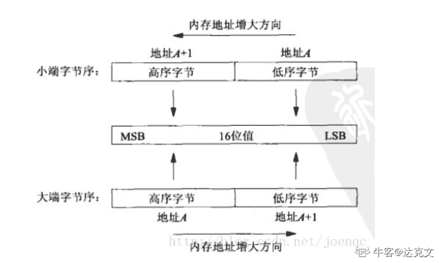
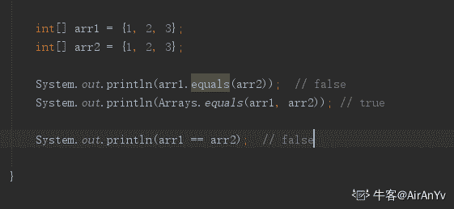

# 用友 2017 秋招笔试题（一）

## 1

下列哪些是与数据库管理相关的技术：(    )

正确答案: A B D F   你的答案: 空 (错误)

```cpp
RDBMS
```

```cpp
NoSQL
```

```cpp
Nginx
```

```cpp
NewSQL
```

```cpp
ActiveMQ
```

```cpp
HBase
```

本题知识点

Java 工程师 C++工程师 安卓工程师 iOS 工程师 运维工程师 前端工程师 算法工程师 测试工程师 用友 数据库 2017

讨论

[455](https://www.nowcoder.com/profile/4226014)

RDBMS （Relational Database Management System）关系数据库管理系统 NoSQL 非关系型的数据库 NewSQL 新型关系型数据库 ActiveMQ Apache 下的一个中间件 Hbase 是一个分布式的 面向列的数据库

发表于 2019-06-19 18:33:19

* * *

[创始元灵](https://www.nowcoder.com/profile/220889961)

RDBMS （Relational Database Management System）关系数据库管理系统 NoSQL 非关系型的数据库 NewSQL 新型关系型数据库 ActiveMQ Apache 下的一个中间件

发表于 2019-07-17 20:04:30

* * *

[你的 offer 对我打了烊](https://www.nowcoder.com/profile/598309941)

NewSQL 第一次听说🤣

发表于 2020-03-28 20:01:17

* * *

## 2

下面哪些产品或技术支持 WEB 应用的部署和运行：(    )

正确答案: B C E   你的答案: 空 (错误)

```cpp
Kafka
```

```cpp
WebSphere
```

```cpp
Jetty
```

```cpp
Cassandra
```

```cpp
NodeJS
```

```cpp
Spark
```

本题知识点

Java 工程师 C++工程师 安卓工程师 iOS 工程师 运维工程师 前端工程师 算法工程师 PHP 工程师 测试工程师 用友 2017

讨论

[创始元灵](https://www.nowcoder.com/profile/220889961)

WebSphereJetty
NodeJS

发表于 2019-07-17 20:08:03

* * *

## 3

下面哪些技术是用来处理 XML 文件的技术 (    )

正确答案: A B F   你的答案: 空 (错误)

```cpp
DOM
```

```cpp
STAX
```

```cpp
JSON
```

```cpp
XSLT
```

```cpp
YAML
```

```cpp
SAX
```

本题知识点

Java 工程师 C++工程师 安卓工程师 iOS 工程师 运维工程师 前端工程师 算法工程师 PHP 工程师 测试工程师 用友 2017

讨论

[烟雨青衫客](https://www.nowcoder.com/profile/701098688)

不是 A B D F 都可以吗

发表于 2019-08-13 15:33:10

* * *

## 4

关于 HTTP，下面哪些描述是准确的 (    )

正确答案: B D E F   你的答案: 空 (错误)

```cpp
HTTP 协议上只能传输 HTML 格式的数据的超文本传输协议
```

```cpp
HTTP 是建立在 TCP 协议之上的应用层协议
```

```cpp
HTTP 协议是为长连接设计的协议
```

```cpp
HTTP 是基于请求/响应模型设计的协议
```

```cpp
HTTP 协议是一种明文协议，不够安全
```

```cpp
HTTP 协议支持多种方法，如 HEAD, DELETE, PUT, TRACE, GET,POST
```

本题知识点

Java 工程师 C++工程师 安卓工程师 iOS 工程师 运维工程师 前端工程师 算法工程师 测试工程师 用友 网络基础 2017

讨论

[生不逢时爱不逢人](https://www.nowcoder.com/profile/553046612)

在 HTTP/1.0 中默认使用短链接。也就是说，客户端和服务器每进行一次 HTTP 操作，就建立一次连接，任务结束就中断连接。

从 HTTP/1.1 起，默认使用长连接

发表于 2019-10-28 10:40:40

* * *

[哟，我喜欢](https://www.nowcoder.com/profile/8095403)

还能传输图像、视频、二进制文件

发表于 2019-07-01 10:55:46

* * *

[钢钢钢不爽](https://www.nowcoder.com/profile/630871145)

http 难道不是长连接吗？早期版本是短链接，现在支持长连接了啊

发表于 2020-08-27 10:53:43

* * *

## 5

下面哪些性质不是传统关系数据库事务的基本特征：（    ）

正确答案: A C   你的答案: 空 (错误)

```cpp
伸缩性
```

```cpp
原子性
```

```cpp
容错性
```

```cpp
一致性
```

```cpp
持久性
```

```cpp
隔离性
```

本题知识点

Java 工程师 C++工程师 安卓工程师 iOS 工程师 运维工程师 前端工程师 算法工程师 测试工程师 用友 数据库 2017

讨论

[你今天学到了啥](https://www.nowcoder.com/profile/969193193)

四大特征，原子，一致，隔离，持久 我没记错的话好像叫什么 ACID

发表于 2019-10-24 20:17:48

* * *

[phoenixfrank](https://www.nowcoder.com/profile/969156946)

这太尴尬了 我选反了😂 还是要认真审题啊盆友们

发表于 2020-02-12 11:18:06

* * *

[取个 name 太难](https://www.nowcoder.com/profile/540555690)

不是。。。看成是了。。。

发表于 2021-09-23 16:38:28

* * *

## 6

C++中，关于虚函数，下面哪些描述是正确的 （    ）

正确答案: C F   你的答案: 空 (错误)

```cpp
虚函数是实现方法重载的工具
```

```cpp
所有的函数都是虚函数
```

```cpp
通过虚函数，类体系获得了多态性支持
```

```cpp
虚函数必须在子类中实现
```

```cpp
虚函数不能够被子类继承
```

```cpp
基类的析构函数建议为虚析构函数
```

本题知识点

C++工程师 用友 C++ 2017 C 语言

讨论

[Guaidao](https://www.nowcoder.com/profile/300027476)

D 选项中（存疑）：只有父类的纯虚函数需要在子类中实现，一般的虚函数子类可以直接从父类中继承。

发表于 2019-09-07 09:57:36

* * *

[_random](https://www.nowcoder.com/profile/5246141)

A:虚函数并不能重载，只能被重写（覆盖），所以 A 错 B:JAVA 中虽然普通函数和 C++的虚函数是一样的，但是可以加 final 限制，变成非虚函数 C:C++里面这是对的，虚函数就是为了实现一个接口，多种实现，满足多态 D:C++中子类可以不实现基类的虚函数，此时子类任然是一个抽象类，不能实列化对象 E:这个不用多说，肯定是可以的，子类会继承成员函数，虚函数也是成员函数 F:为了防止指针引用的时候，是建议这么做，不然会存在内存泄漏所以按照 C++的标签的话：CF, 至于 JAVA 的标签，咋也不敢问也不敢说

发表于 2019-11-05 16:17:35

* * *

[那只死猪啊啊啊](https://www.nowcoder.com/profile/897035205)

我以为是顺丰的

发表于 2019-09-12 16:19:27

* * *

## 7

计算机在内存中存储数据时使用了大端(bigendian)、小端(littleendian)模式，请分别问 0X123456 在大端模式下，首个字节是：(    )

正确答案: D   你的答案: 空 (错误)

```cpp
0X23
```

```cpp
0X34
```

```cpp
0X56
```

```cpp
0X12
```

```cpp
0X1
```

```cpp
0X6
```

本题知识点

Java 工程师 C++工程师 安卓工程师 iOS 工程师 运维工程师 前端工程师 算法工程师 测试工程师 用友 操作系统 2017

讨论

[牛客 573511322 号](https://www.nowcoder.com/profile/573511322)

大端模式，就是从数的高位（大的位数）开始存； 小端模式，就是从数的低位（小的位数）开始存。

发表于 2020-10-14 21:14:03

* * *

[达克文](https://www.nowcoder.com/profile/175330967)

BigEndian(大端)：低字节在高内存地址
LittleEndian(小端)：低字节在低内存地址

发表于 2020-05-20 22:45:19

* * *

[Kianccc](https://www.nowcoder.com/profile/791584434)

所谓的大端模式（Big-endian），是指数据的高字节，保存在内存的低地址中，而数据的低字节，保存在内存的高地址中，这样的存储模式有点儿类似于把数据当作字符串顺序处理：地址由小向大增加，而数据从高位往低位放；

所谓小端模式（Little-endian）, 是指数据的高字节保存在内存的高地址中,而数据的低字节保存在内在的低地址中,这种存储模式将地址的高低和数据位 权有效结合起来,高地址部分权值高,低地址部分权值低,和我们的逻辑方法一致;

发表于 2019-09-21 23:31:44

* * *

## 8

在并发程序开发中为了避免竞争，系统允许多少个进程同时进入一个临界区(    )

正确答案: D   你的答案: 空 (错误)

```cpp
不超过计算机 CPU 的总核心数
```

```cpp
不超过计算机 CPU 的物理核心数
```

```cpp
8
```

```cpp
1
```

```cpp
16
```

```cpp
0
```

本题知识点

Java 工程师 C++工程师 安卓工程师 iOS 工程师 运维工程师 前端工程师 算法工程师 测试工程师 用友 操作系统 2017

讨论

[ScreenShot](https://www.nowcoder.com/profile/1509172)

每个进程中访问临界资源的那段程序称为临界区（临界资源是一次仅允许一个进程使用的共享资源）。每次只准许一个进程进入临界区，进入后不允许其他进程进入。 

发表于 2019-09-05 16:29:02

* * *

[20200722](https://www.nowcoder.com/profile/433084385)

不论是硬件临界资源还是软件临界资源，多个进程必须互斥的对它进行访问。人们把每个进程中访问临界资源的那段代码叫做临界区，显然，若能够保证进程之间可以互斥的进入临界区，那么就实现了进程对临界资源的互斥访问。所以临界区实际上是一段代码，临界资源是供进程使用的硬件或者软件。

发表于 2020-10-12 00:10:04

* * *

[炫歌](https://www.nowcoder.com/profile/622959792)

看清题目：  临界区  那一定只能是一个啦

发表于 2020-07-04 18:29:22

* * *

## 9

下面 HttpServletResponse 方法调用，那些给客户端回应了一个定制的 HTTP 回应头：(    )

正确答案: A B   你的答案: 空 (错误)

```cpp
response.setHeader("X-MyHeader", "34");
```

```cpp
response.addHeader("X-MyHeader", "34");
```

```cpp
response.setHeader(new HttpHeader("X-MyHeader", "34"));
```

```cpp
response.addHeader(new HttpHeader("X-MyHeader", "34"));
```

```cpp
response.addHeader(new ServletHeader("X-MyHeader", "34"));
```

```cpp
response.setHeader(new ServletHeader("X-MyHeader", "34"));
```

本题知识点

Java 工程师 用友 2017

讨论

[72%](https://www.nowcoder.com/profile/999727528)

```cpp
response.setHeader("X-MyHeader", "34");是将 http 请求头重新替换,

```
response.addHeader("X-MyHeader", "34");是在原有的请求头后添加。
```cpp

```

发表于 2019-12-07 10:33:55

* * *

## 10

关于 Java 中的数组，下面的一些描述，哪些描述是准确的：（    ）

正确答案: A C F   你的答案: 空 (错误)

```cpp
数组是一个对象，不同类型的数组具有不同的类
```

```cpp
数组长度是可以动态调整的
```

```cpp
数组是一个连续的存储结构
```

```cpp
一个固定长度的数组可类似这样定义: int array[100]
```

```cpp
两个数组用 equals 方法比较时，会逐个便利其中的元素，对每个元素进行比较
```

```cpp
可以二维数组，且可以有多维数组，都是在 Java 中合法的
```

本题知识点

Java 工程师 C++工程师 安卓工程师 iOS 工程师 运维工程师 前端工程师 算法工程师 测试工程师 用友 Java 2017

讨论

[AirAnYv](https://www.nowcoder.com/profile/200363574)

我是错在 E 选项了  所以分析一下 给后人填坑 数组是一种引用数据类型  那么他肯定是继承 Object 类的  所以里面有 equals() 方法 但是肯定没有重写过 因为他并不是比较数组内的内容  使用 Arrays.equals()  是比较两个数组中的内容。

编辑于 2019-09-06 17:05:38

* * *

[左手 201809131222262](https://www.nowcoder.com/profile/337184788)

Object.equals()比较的是两个数组的地址，相当于==的作用，如果是遍历数组中的元素，进行一一比较，应该选择 Arrays.equals()

发表于 2020-02-22 09:00:33

* * *

[IDEA2022.4.2](https://www.nowcoder.com/profile/181223548)

数组的长度是固定的，int[] array =new int[100]就对了

编辑于 2019-12-07 13:01:27

* * *

## 11

有对夫妻生了三个孩子，其中一个是男孩，请猜猜老二是女孩的概率是多少

你的答案

本题知识点

Java 工程师 C++工程师 安卓工程师 iOS 工程师 运维工程师 前端工程师 算法工程师 PHP 工程师 测试工程师 用友 2017

讨论

[JosephChen](https://www.nowcoder.com/profile/532837405)

答案： 3/7 方法 1 枚举法，可以做出来方法 2 条件概率：        P(老二是女孩)=P（至少一个男孩）***P（老二是女孩 | 至少一个男孩）**+P（全女孩）*P（老二是女孩 | 全女孩）
        上式是全概率公式，加粗部分是待求
        1/2                 =7/8                           * x                                                  +1/8               *1        求得：
                x=3/7

发表于 2019-06-29 18:49:33

* * *

## 12

给定一串数字，5 15 1115 3115 132115 ..., 从第一个数字开始，第二个数字 15，表示第一个数值是“1 个 5”，第三数字表示第二个数字按数字顺序由“1 个 1 和 1 个 5 构成，第四个数字表示第三个数字是按数字顺序由“3 个 1 和 1 个 5 构成”，依此规律，后一个数字是前一个数字的这种形式的编码。假设第一个数字为 1，那么问第六个数字是: ______________

你的答案

本题知识点

Java 工程师 C++工程师 安卓工程师 iOS 工程师 运维工程师 前端工程师 算法工程师 PHP 工程师 测试工程师 用友 2017

讨论

[牛客 488063054 号](https://www.nowcoder.com/profile/488063054)

1，11，21，1211，111221，312211

发表于 2019-06-05 22:35:41

* * *

[一陆](https://www.nowcoder.com/profile/9654931)

1113122115（表示第五个数是由一个 1，一个 3，一个 2，两个 1，一个 5 组成）

发表于 2019-07-15 22:38:50

* * *

## 13

36 进制，A-Z,分别表示 10 到 35, 请问 1976 经过 36 进制编码后是什么数字 ___________

你的答案

本题知识点

Java 工程师 C++工程师 安卓工程师 iOS 工程师 运维工程师 前端工程师 算法工程师 PHP 工程师 测试工程师 用友 2017

讨论

[crazy_passwd](https://www.nowcoder.com/profile/392535199)

我是短除法做的，然后依次数。。

发表于 2019-10-25 11:03:45

* * *

[MR 丶锐](https://www.nowcoder.com/profile/3519565)

**题 建议删除

发表于 2019-07-20 20:33:20

* * *

[安好 20190329093383](https://www.nowcoder.com/profile/838809334)

发表于 2019-07-04 08:18:48

* * *

## 14

已知一颗二叉树，如果先序遍历的节点顺序是：ADCEFGHB，中序遍历是：CDFEGHAB，则后续遍历序列的结果为 _________________

你的答案

本题知识点

Java 工程师 C++工程师 安卓工程师 iOS 工程师 运维工程师 前端工程师 算法工程师 PHP 工程师 测试工程师 用友 2017

## 15

如果 X 大于 0 并小于 65536，用移位法计算 X 乘以 17 的值, 请给出计算过程 ___________

你的答案

本题知识点

Java 工程师 C++工程师 安卓工程师 iOS 工程师 运维工程师 前端工程师 算法工程师 PHP 工程师 测试工程师 用友 2017

讨论

[南风过熙](https://www.nowcoder.com/profile/827484648)

        x = (x << 4) + x;

发表于 2019-09-30 14:14:59

* * *

[JosephChen](https://www.nowcoder.com/profile/532837405)

什么叫移位法？猜一下吧。X*17=X*（16+1）=X*16+X=X<<4+x 是这样么？

发表于 2019-06-29 19:00:50

* * *

[Fine4869](https://www.nowcoder.com/profile/7284168)

x = x << 4 + x

发表于 2019-05-30 16:47:42

* * *

## 16

关系型数据库中 primary key 和 foreign key 的区别

你的答案

本题知识点

Java 工程师 C++工程师 安卓工程师 iOS 工程师 运维工程师 前端工程师 算法工程师 PHP 工程师 测试工程师 用友 2017

## 17

Java 中 HashMap 和 Hashtable 的区别，对作为 key 的数据对象有什么建议？

你的答案

本题知识点

Java 工程师 C++工程师 安卓工程师 iOS 工程师 运维工程师 前端工程师 算法工程师 PHP 工程师 测试工程师 用友 2017

## 18

介绍一下 Java 中线程的状态

你的答案

本题知识点

Java 工程师 C++工程师 安卓工程师 iOS 工程师 运维工程师 前端工程师 算法工程师 PHP 工程师 测试工程师 用友 2017

讨论

[Ryantour](https://www.nowcoder.com/profile/348863024)

新建（newThread）、就绪（runnable）、运行（running）、死亡（dead）、堵塞（blocked）。

发表于 2020-08-08 10:20:05

* * *

[Mason201908281402868](https://www.nowcoder.com/profile/633521593)

新建，就绪，运行，堵塞，死亡。

发表于 2019-11-20 08:41:26

* * *

## 19

下面一段 JavaScript 代码

```cpp
var myObject = {
foo: "bar",
func: function() {
var self = this;
console.log("outer func:  this.foo = " + this.foo);
console.log("outer func:  self.foo = " + self.foo);
(function() {
console.log("inner func:  this.foo = " + this.foo);
console.log("inner func:  self.foo = " + self.foo);
}());
}
};
myObject.func()
```

请打出输出的信息

你的答案

本题知识点

Java 工程师 C++工程师 安卓工程师 iOS 工程师 运维工程师 前端工程师 算法工程师 PHP 工程师 测试工程师 用友 2017

讨论

[Helloween](https://www.nowcoder.com/profile/729406229)

outer func:  this.foo = barouter func:  self.foo = barinner func:  this.foo = undefined
inner func:  self.foo = bar

 发表于 2020-12-07 20:22:49

* * *

## 20

描述一下 Adapter 设计模式的意图和使用方法，并用 UML 图描述一下这种设计模式

你的答案

本题知识点

Java 工程师 C++工程师 安卓工程师 iOS 工程师 运维工程师 前端工程师 算法工程师 PHP 工程师 测试工程师 用友 2017

## 21

实现一个堆栈数据结构，堆栈中存储的为整型数，要求提供 push, pop, peek 方法，并且堆栈没有容量限制（假设内存够用），注意不要使用外部的数据结构 。

你的答案

本题知识点

Java 工程师 C++工程师 安卓工程师 iOS 工程师 运维工程师 前端工程师 算法工程师 PHP 工程师 测试工程师 用友 2017

## 22

 对称二叉树，是一种二叉树，具有对称的性质，如：     1    /   \

  2      2

 / \      / \3   4  4   3

现在给定一个二叉树的根节点，节点存储的值为整型数，请实现一个算法判断该二叉树是否为对称二叉树

你的答案

本题知识点

Java 工程师 C++工程师 安卓工程师 iOS 工程师 运维工程师 前端工程师 算法工程师 PHP 工程师 测试工程师 用友 2017

讨论

[为了技术而刷题](https://www.nowcoder.com/profile/284852946)

```cpp
class Solution:
    def isSymmetric(self,root):
        if not root:
            return True
        def recurr(L,R):
            if not L and not R:
                return True
            if not L&nbs***bsp;not R:
                return False
            if L.val==R.val:
                return True
            else:
                return False
            return recurr(L.left, R.right) and recurr(L.right, R.left)
        return recurr(root.left, root.right)
```

编辑于 2020-09-04 19:12:35

* * *

## 23

Fibonacci 函数是这样的一个函数 f(0)=0, f(1)=1, f(n)=f(n-1)+f(n-2), 其中 n 为大于等于 2 的自然数,f(n)为第 n 个 Fibonannci 数。现在需要一个方法，在需要的时候才获取第 n 个 Fibonannci 数，由于 Fibonacci 函数的特殊性，获取 f(n)，需要从 0..n-1 全部的 Fibonannci 数计算出来，这显然是耗时耗资源的，因此设计上准备采用缓存技术提升效率，请实现这样一个算法，使用缓存技术加速 Fibonannci 数的计算。

你的答案

本题知识点

Java 工程师 C++工程师 安卓工程师 iOS 工程师 运维工程师 前端工程师 算法工程师 PHP 工程师 测试工程师 用友 2017

## 24

有一个数据库，包括销售员表(sale_reps), 客户表(Customer)和订单表(Order), 它们的数据如下：

sale_reps：ID，名字，薪水， 提成比例， 雇佣日期

客户:ID, 名称，城市


订单：ID, 客户 ID, 签单雇员 ID,金额， 签单日期


问题 1：写一个程序,统计每一个销售员获得的总的提成，输出列包括销售员的 ID,名字、提成金额问题 2: 写一个程序， 统计没有实现签单的销售员，输出包括销售员的 ID 和名字

你的答案

本题知识点

Java 工程师 C++工程师 安卓工程师 iOS 工程师 运维工程师 前端工程师 算法工程师 PHP 工程师 测试工程师 用友 2017

## 25

两个矩形，矩形 1(xl1, yt1, xr1, yb1)，矩形 2（xl2，yt2, xr2, yb2），坐标 xl,yt 表示左上角坐标， 小 xr, yb 表示右下角坐标，求它们一起覆盖的总面积 

你的答案

本题知识点

Java 工程师 C++工程师 安卓工程师 iOS 工程师 运维工程师 前端工程师 算法工程师 PHP 工程师 测试工程师 用友 2017