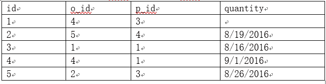

# 用友 2017 秋招笔试题（二）

## 1

下列哪些是 HTML5 相关的框架或类库：(     )

正确答案: B D E   你的答案: 空 (错误)

```cpp
spring-core
```

```cpp
ReactiveJS
```

```cpp
Dubbo
```

```cpp
Bootstrap
```

```cpp
AngularJS
```

```cpp
Hibernate
```

本题知识点

Java 工程师 C++工程师 安卓工程师 iOS 工程师 运维工程师 前端工程师 算法工程师 测试工程师 用友 HTML 2017

讨论

[牛客 940360835 号](https://www.nowcoder.com/profile/940360835)

简单列举一下常见前端框架：  布局框架 element-ui layui bootstrap js 框架 vue  angular react

发表于 2021-03-15 17:57:06

* * *

[牛客 911648315 号](https://www.nowcoder.com/profile/911648315)

BDE 都是前端的属于 html 框架 A 是包括大部分后端模块和前端模块，前端模块又包括前端框架 dubbo 是 java rpc 框架 最后一个是后端的

发表于 2020-06-04 06:15:55

* * *

[Yaoyo999](https://www.nowcoder.com/profile/516961328)

这里的 html 指广义 包含 html css js

发表于 2021-01-07 10:24:56

* * *

## 2

从 WEB 应用的角度，一个应用都需要维护一些不同作用范围的状态， 请问下面哪些状态作用域是 WEB 应用特有的：(    )

正确答案: A D F   你的答案: 空 (错误)

```cpp
会话
```

```cpp
全局
```

```cpp
线程本地
```

```cpp
请求
```

```cpp
本地
```

```cpp
应用
```

本题知识点

Java 工程师 C++工程师 安卓工程师 iOS 工程师 运维工程师 前端工程师 算法工程师 PHP 工程师 测试工程师 用友 2017

## 3

关于 XML，JSON、HTML5 下面哪些描述是错误的 (     )

正确答案: B D E   你的答案: 空 (错误)

```cpp
JSON 比 XML 在数据编码上 JSON 更具有效率，更节约空间
```

```cpp
HTML5 是一种特殊的 XML
```

```cpp
XML 对数据的类型描述表达比 JSON 更丰富
```

```cpp
HTML5 在跨系统交互面是一种理想的交换格式
```

```cpp
XML 比 JSON 更能表达结构化数据
```

```cpp
存在一些数据库，直接支持 XML 或 JSON 数据的操作，如 mongodb, postgresql
```

本题知识点

Java 工程师 C++工程师 安卓工程师 iOS 工程师 运维工程师 前端工程师 算法工程师 PHP 工程师 测试工程师 用友 2017 HTML

讨论

[--sgf--](https://www.nowcoder.com/profile/8882859)

JSON 和 XML 之间的区别：1、JSON 是 JavaScript Object Notation；XML 是可扩展标记语言。2、JSON 是基于 JavaScript 语言；XML 源自 SGML。3、JSON 是一种表示对象的方式；XML 是一种标记语言，使用标记结构来表示数据项。4、JSON 不提供对命名空间的任何支持；XML 支持名称空间。5、JSON 支持数组；XML 不支持数组。6、XML 的文件相对难以阅读和解释；与 XML 相比，JSON 的文件非常易于阅读。7、JSON 不使用结束标记；XML 有开始和结束标签。8、JSON 的安全性较低；XML 比 JSON 更安全。9、JSON 不支持注释；XML 支持注释。10、JSON 仅支持 UTF-8 编码；XML 支持各种编码。

发表于 2021-12-30 18:57:52

* * *

[tlltll](https://www.nowcoder.com/profile/984905694)

B ----- HTML-Hyper Text Markup Language 超文本标记语言，被设计用来显示数据，核心在于数据的外观。HTML 文档==网页 XML-EXtensible Markup Language 可扩展标记语言，被设计用于结构化、传输和存储数据，核心在于数据的内容。XML 文档==纯文本 你可以选择在 web 应用程序中，使用 XML 传输数据，使用 HTML 格式化并显示数据。它们不是相似竞争互相替代的关系，它们互相合作和互补。 所以从设计理念上看，HTML 和 XML 的关系，就像 Java 和 Javascript、雷锋和雷峰塔的关系-即相互独立，基本没啥关系。 https://www.jianshu.com/p/5f5ebefd0cbe ------------------------------------------------------------------- E -----JSON 可以包含更多的结构化信息，更容易表达不同的数据格式，像 numbers ，string 和 NULL 值，甚至是数组。

编辑于 2020-09-15 00:17:28

* * *

[无聊★刷刷](https://www.nowcoder.com/profile/875199633)

html5 和 xml 相当于 javascript 和 java 雷峰塔和雷锋彼此相对独立，html5 核心是数据的外观，xml 核心在数据的内容

发表于 2021-04-21 21:53:05

* * *

## 4

有六个元素 6，5，4，3，2，1 的顺序进栈，问下列哪一个不是合法的出栈序列？（    ）

正确答案: C   你的答案: 空 (错误)

```cpp
5 4 3 6 1 2
```

```cpp
4 5 3 1 2 6
```

```cpp
3 4 6 5 2 1
```

```cpp
2 3 4 1 5 6
```

```cpp
6 5 4 3 2 1
```

```cpp
2 3 4 5 6 1
```

本题知识点

Java 工程师 C++工程师 安卓工程师 iOS 工程师 运维工程师 前端工程师 算法工程师 测试工程师 用友 栈 *2017* *讨论

[是瑶瑶公主呀](https://www.nowcoder.com/profile/592649258)

后进先出，34 进的时候 56 都在了不能 6 先出

发表于 2019-10-14 11:05:19

* * *

[白起丶](https://www.nowcoder.com/profile/815173790)

这个多选让我检查了好几遍，害

发表于 2020-06-17 09:56:07

* * *

[hume666](https://www.nowcoder.com/profile/9386478)

654321 进我看成 123456 进

发表于 2022-03-06 08:50:05

* * *

## 5

关于索引下面哪些描述是正确的：（    ）

正确答案: B E F   你的答案: 空 (错误)

```cpp
索引是为了提高查询效率的，通过建立索引查询效率会得到提高
```

```cpp
索引对数据插入的效率有一定的影响
```

```cpp
唯一索引是一种特殊的索引，表中的行的物理顺序与索引顺序一致，且不允许两行数据在索引列上有相同的值
```

```cpp
每个表都必须具有一个主键索引
```

```cpp
对于数据重复度高，值范围有限的列如果建索引建议使用位图索引
```

```cpp
可以在多个列上建立联合索引
```

本题知识点

Java 工程师 C++工程师 安卓工程师 iOS 工程师 运维工程师 前端工程师 算法工程师 测试工程师 用友 数据库 2017

讨论

[风中沉思](https://www.nowcoder.com/profile/9087105)

A 选项 并不是建立了索引就会提高索引查找速度

B 选项  唯一索引的列的物理顺序 并不和索引顺序一致，只有聚集索引列的物理顺序和逻辑顺 序 一致，一个表也只能有一个聚集索引

D 选项个人认为是对的，对于 MySQL 而言，当创建一个主键是默认创建一个主键索引，如果在创建表时没有显式地定义主键,则 InnoDB 存储引擎会按如下方式选择或创建主键:

1 首先判断表中是否有非空的唯一索引,如果有,则该列即为主键.

2 如果不符合上述条件,InnoDB 存储引擎自动创建一个 6 字节大小的指针.所以每个表必有一个主键索引，若有不当之处，欢迎指正。

编辑于 2019-10-24 18:58:17

* * *

[海海不掉头发](https://www.nowcoder.com/profile/493926724)

```cpp
C 选项，表中的行的物理顺序与索引顺序一致，没有这种说法。
```

发表于 2021-05-02 16:08:32

* * *

[珙桐青年](https://www.nowcoder.com/profile/533181656)

唯一索引只是不允许两行数据在索引列上有相同值，没有要求行的物理顺序与索引顺序一致。
对于唯一索引来说，由于索引定义了唯一性，查找到第一个满足条件的记录后，就会停止继续检索，但普通索引会继续查找其他满足条件的记录。 

编辑于 2020-02-19 16:56:10

* * *

## 6

下面有关位运算的一些结论哪些是正确的 （    ）

正确答案: A B D   你的答案: 空 (错误)

```cpp
十二进制数 81 的二进制数为: 01100001
```

```cpp
十进制数-11 的补码为：11110101
```

```cpp
十进制数 76 和 81 异或的结果为十进制数 28
```

```cpp
位运算(A|B)&C = (A&C)|(B&C)
```

```cpp
加法运算等同于位或运算，如 A+B=A|B
```

```cpp
与二进制数 00101101 等值的十六进制数是 2C
```

本题知识点

编译和体系结构

讨论

[牛客 617519190 号](https://www.nowcoder.com/profile/617519190)

答案：ABD

C：29

F：2D

发表于 2020-12-01 16:59:06

* * *

## 7

下面关于进程和线程的描述，错误的是（    ）

正确答案: D E   你的答案: 空 (错误)

```cpp
进程是资源分配和拥有的单位,同一个进程内的线程共享进程的资源。
```

```cpp
每个线程都有其运行的栈，每个线程都需要一部分内存开销，主要内存开销由栈大小决定
```

```cpp
每个进程有自己独立的地址空间，线程共享进程地址空间，线程间通信更为方便
```

```cpp
进程和线程都具有良好的数据封装和保护机制，进程和线程的强制退出都是安全没有副作用的
```

```cpp
线程比进程消耗的资源更多，但是线程切换的开销比进程小,线程具有更好的效率
```

```cpp
一个进程结束，其中的所有线程都会退出，系统不允许没有关联进程的线程运行
```

本题知识点

Java 工程师 C++工程师 安卓工程师 iOS 工程师 运维工程师 前端工程师 算法工程师 测试工程师 用友 操作系统 2017

讨论

[风海洋](https://www.nowcoder.com/profile/784097590)


发表于 2020-11-19 11:20:43

* * *

[siomarry](https://www.nowcoder.com/profile/930036328)

D 选项：线程的开销比进程开销消耗资源少

发表于 2019-10-29 11:07:32

* * *

[JHUN_20_ 吴天](https://www.nowcoder.com/profile/436281436)

我知道别的对了，但我还不知道这两怎么错了。虽然我选对了=-=bd 去了

发表于 2020-02-24 23:13:31

* * *

## 8

下面哪些条件下，计算机抖动振荡不会发生：(    )

正确答案: C F   你的答案: 空 (错误)

```cpp
cpu 速度大幅提高，非常快
```

```cpp
IO 效率提升
```

```cpp
程序的工作区的内存页，在主存中保持
```

```cpp
单一进程运行，不存在多进程调度
```

```cpp
计算机的 CPU 核数足够多
```

```cpp
内存足够大，不使用交换空间
```

本题知识点

Java 工程师 C++工程师 安卓工程师 iOS 工程师 运维工程师 前端工程师 算法工程师 测试工程师 用友 操作系统 2017

讨论

[我的天鸭](https://www.nowcoder.com/profile/243498)

不需要换页就不会发生抖动

发表于 2019-09-09 21:29:41

* * *

[牛客 376127978 号](https://www.nowcoder.com/profile/376127978)

单一进程不能保证，此进程过大，分页较多，而内存较小，还是容易抖动

发表于 2020-03-14 11:44:29

* * *

[72%](https://www.nowcoder.com/profile/999727528)

程序全部调入系统内存，不产生页面置换时就不会产生抖动

发表于 2019-12-14 16:56:11

* * *

## 9

JavaWEB 中有一个类，当会话种绑定了属性或者删除了属性时，他会得到通知，这个类是：(    )

正确答案: A   你的答案: 空 (错误)

```cpp
HttpSessionAttributeListener
```

```cpp
HttpSessionBindingListener
```

```cpp
HttpSessionObjectListener
```

```cpp
HttpSessionListener;
```

```cpp
HttpSession
```

```cpp
HttpSessionActivationListener
```

本题知识点

Java 工程师 C++工程师 安卓工程师 iOS 工程师 运维工程师 前端工程师 算法工程师 测试工程师 用友 Java 2017

讨论

[百思不得姐](https://www.nowcoder.com/profile/697603280)

**HttpSessionAttributeListener**：可以实现此侦听器接口获取此 web 应用程序中会话属性列表更改的通知；

**HttpSessionBindingListener**：当该对象从一个会话中被绑定或者解绑时通知该对象，这个对象由 HttpSessionBindingEvent 对象通知。这可能是 servlet 程序显式地从会话中解绑定属性的结果，可能是由于会话无效，也可能是由于会话超时；

**HttpSessionObjectListener**：没有该接口 API；

**HttpSessionListener**：当 web 应用程序中的活动会话列表发生更改时通知该接口的实现类，为了接收该通知事件，必须在 web 应用程序的部署描述符中配置实现类；

**HttpSessionActivationListener**：绑定到会话的对象可以侦听容器事件，通知它们会话将被钝化，会话将被激活。需要一个在虚拟机之间迁移会话或持久会话的容器来通知所有绑定到实现该接口会话的属性。

发表于 2019-09-05 16:28:27

* * *

[牛客 7226799687659 号](https://www.nowcoder.com/profile/46034815)

我选了后缀都有 listener 的。。。。。。。。。。。

发表于 2019-09-30 11:35:21

* * *

[IDEA2022.4.2](https://www.nowcoder.com/profile/181223548)

我来看看有多少人掉进了不定项选择的坑

发表于 2019-09-04 10:31:07

* * *

## 10

关于 Java 中的 ClassLoader 下面的哪些描述是错误的：(    )

正确答案: B D F   你的答案: 空 (错误)

```cpp
默认情况下，Java 应用启动过程涉及三个 ClassLoader: Boostrap, Extension, System
```

```cpp
一般的情况不同 ClassLoader 装载的类是不相同的，但接口类例外，对于同一接口所有类装载器装载所获得的类是相同的
```

```cpp
类装载器需要保证类装载过程的线程安全
```

```cpp
ClassLoader 的 loadClass 在装载一个类时，如果该类不存在它将返回 null
```

```cpp
ClassLoader 的父子结构中，默认装载采用了父优先
```

```cpp
所有 ClassLoader 装载的类都来自 CLASSPATH 环境指定的路径
```

本题知识点

Java 工程师 C++工程师 安卓工程师 iOS 工程师 前端工程师 算法工程师 测试工程师 用友 Java 2017

讨论

[HW 柯可](https://www.nowcoder.com/profile/943949859)

**A.Java 系统提供 3 种类加载器：****启动类加载器（Bootstrap ClassLoader）  扩展类加载器（Extension ClassLoader） 应用程序类加载器（Application ClassLoader）. A 正确****B.《深入理解 Java 虚拟机》P228：对于任意一个类，都需要由加载它的类加载器和这个类本身一同确立其在 Java 虚拟机中的唯一性，每一个类加载器，都拥有一个独立的类名称空间。这句话可以表达得更通俗一些：比较两个类是否“相等”，只有在这两个类是由同一个类加载器加载的前提下才有意义，否则，即使这两个类来源于同一个 Class 文件，被同一个虚拟机加载，只要加载它们的类加载器不同，那么这两个类必定不相等。**接口类是一种特殊类，因此对于同一接口不同的类装载器装载所获得的类是不相同的。**B 错误****C.类只需加载一次就行，因此要保证类加载过程线程安全，防止类加载多次。C 正确****D.** Java 程序的类加载器采用双亲委派模型，实现双亲委派的代码集中在 java.lang.ClassLoader 的 loadClass()方法中，此方法实现的大致逻辑是：先检查是否已经被加载，若没有加载则调用父类加载器的 loadClass()方法，若父类加载器为空则默认使用启动类加载器作为父类加载器。如果父类加载失败，抛出 ClassNotFoundException 异常。D 错误**E.双亲委派模型的工作过程：如果一个类加载器收到了类加载的请求，它首先不会自己去尝试加载这个类，而是把这个请求委派给父类加载器去完成，每一个层次的类加载器都是如此，因此所有的加载请求最终都应该传送到顶层的启动类加载器中，只有当父加载器反馈自己无法完成这个加载请求时，子加载器才会尝试自己去加载。E 正确****F.**应用程序类加载器（Application ClassLoader）负责加载******用户类路径（ClassPath）上所指定的类库，不是所有的 ClassLoader 都加载此路径。F 错误**

编辑于 2020-01-16 13:03:33

* * *

[Nowpleasedon＇tgo](https://www.nowcoder.com/profile/6328676)

    从 java 虚拟机的角度讲，只有两种不同的类加载器：一种是启动类加载器（Bootstrap ClassLoader），这个类加载器使用的是 c++实现的，是虚拟机的一部分，另一类是就是所有其他类加载器，这些类加载器都由 java 语言实现，独立于虚拟机外部，并且全都继承自抽象类。从开发人员的角度看，类加载器还可以划分为 3 种系统类加载器，启动类加载器（Bootstrap ClassLoader），负责加载存放在<JAVA_HOME>/lib 目录中的，或者被-Xbootclasspath 参数所指定的路径中的，并且是虚拟机识别的（仅按照文件名识别，如 rt.jar，名字不符的类库即使放在 lib 目录中也不会被加载）类库加载到虚拟机中内存中。启动类加载器无法被 java 程序直接引用，用户在编写自定义类加载器是，如果需要把加载请求委派给引导类加载器，那直接使用 null 代替即可。扩展类加载器（Extension ClassLoader）：这个类加载器有 sun.misc.Launcher$ExtClassLoader 实现，负责加载<JAVA_HOME>/lib/ext 目录中的，或者被 java.ext.dirs 系统变量所指定的路径中的所有类库，开发者可以直接使用扩展类加载器。     应用类加载器（Application ClassLoader）：这个类加载器由 sun.misc.Launcher$AppClassLoader 实现。由于这个类加载器是 ClassLoader 中的 getSystemClassLoader（）方法的返回值，所以也称它为系统类加载器（System ClassLoader）。他负责加载用户类路径（ClassPath）上所指定的类库，开发者可以直接使用这个类加载器，如果应用程序中没有自定义过自己的类加载器，一般情况下这个就是程序中默认的类加载器。对此，如果有必要开发者可以加入自己定义的类加载器。    一般对于我们 java 程序员来说，类的加载使用的是双亲委派模型，即当一个类需要加载时，会将类传给 Application ClassLoader，但是 Application ClassLoader 并不会加载，不管它是否能加载，而是传给它的"父类" Extension ClassLoader，Extension ClassLoader 同样不会加载，同样传给 Bootstrap ClassLoader（注意不是我们常说的那种父类，但是可以这样理解）,这时 Bootstrap ClassLoader 会判断它是否能加载，能加载就直接加载了，不能加载就传给 Extension ClassLoader，Extension ClassLoader 同样的判断是否能加载，能加载就直接加载，不能加载就传给 Application ClassLoader，然后 Application ClassLoader 也判断能否加载，如果还是不能加载应该就是报 ClassNotFoundException 了。这就是双亲委托模型的简单理解了。
    对于上面的"父类"为什么要打引号，因为它们并不是真的像 java 中继承的关系，而是组合的关系，即在"子类"中存在一个成员变量指向"父类"的引用。    所以 AE 对 DF 错了。
    对于 C，很容易理解，因为我们知道一个类只需要加载一次就够了，所以要保证线程安全。
    难点就在 B 了，其实也好理解，就是体现双亲委托模型的优势的时候了，之所以使用双亲委托机制是为了保证 java 程序的稳定运作，比如当你使用的不是双亲委托模型的时候，然后刚好开发者又定义了一个类，一个 java.lang.String 这样一个类，如果不使用双亲委托模型，当类加载的时候就有可能会加载开发者定义的 String 类，这导致了 java 代码的一片混乱，可读性极差。（PS：但这并不意味着类加载器只要双亲委托模型就行了，没有完美的模型，只有最合适的模型，有不同的需求使用不同的模型。比如破坏双亲委派模型，有兴趣的牛友可以自行了解），所以可以这么说，不同的类加载器加载出来的类是不一样的，不同的类加载器加载同一个类会在方法区产生两个不同的类，彼此不可见，并且在堆中生成不同的 Class 实例。对于接口，其实就是一个特殊的类，和类一样，在堆中产生不同的 class 对象。    纯手打，个人理解，欢迎大佬指出错误。

编辑于 2019-09-19 14:51:50

* * *

[编程小海浪](https://www.nowcoder.com/profile/797024057)

Java 语言系统自带有三个类加载器: 
- **Bootstrap ClassLoader** 最顶层的加载类，主要加载核心类库，%JRE_HOME%\lib 下的 rt.jar、resources.jar、charsets.jar 和 class 等。另外需要注意的是可以通过启动 jvm 时指定-Xbootclasspath 和路径来改变 Bootstrap ClassLoader 的加载目录。比如 java -Xbootclasspath/a:path 被指定的文件追加到默认的 bootstrap 路径中。我们可以打开我的电脑，在上面的目录下查看，看看这些 jar 包是不是存在于这个目录。 
- **Extention ClassLoader** 扩展的类加载器，加载目录%JRE_HOME%\lib\ext 目录下的 jar 包和 class 文件。还可以加载-D java.ext.dirs 选项指定的目录。 
- **Appclass Loader 也称为 SystemAppClass** 加载当前应用的 classpath 的所有类。**加载顺序：****1\. Bootstrap CLassloder 
2\. Extention ClassLoader 
3\. AppClassLoader**

发表于 2019-09-07 17:31:17

* * *

## 11

有一个苹果，两个人通过抛硬币决定由谁吃，规则是抛到硬币正面的那个人吃到苹果，请问后一个抛硬币的人吃到苹果的概率为 ______________

你的答案

本题知识点

Java 工程师 C++工程师 安卓工程师 iOS 工程师 运维工程师 前端工程师 算法工程师 PHP 工程师 测试工程师 用友 2017

## 12

分析下面几个字符串的编码规律：123->112123ab  -> aabufsoft-> uufufsufsoufsofufsoftyonyou -> yyoyonyonyyonyoyonyou 请给出字符串“Programmer”的编码结果或者简单描述一些编码规律

你的答案

本题知识点

Java 工程师 C++工程师 安卓工程师 iOS 工程师 运维工程师 前端工程师 算法工程师 PHP 工程师 测试工程师 用友 2017

讨论

[奚](https://www.nowcoder.com/profile/1919173)

PPrProProgProgrPrograProgramProgrameProgramer 编码规律：第 N 次（从 1 开始）取前 N 个字符，直到取完所有字符

发表于 2019-06-17 10:38:44

* * *

## 13

一个小球从 h 米高处自由落下,每次着地后都反弹到前一次高度的 1/n,求小球经过的总路程 ___________

你的答案

本题知识点

Java 工程师 C++工程师 安卓工程师 iOS 工程师 运维工程师 前端工程师 算法工程师 PHP 工程师 测试工程师 用友 2017

## 14

若二叉查找树（Binary Search Tree）有三个节点，对应于三个不同的值 A、B、C，画 c 出所有的 BST 构造

你的答案

本题知识点

Java 工程师 C++工程师 安卓工程师 iOS 工程师 运维工程师 前端工程师 算法工程师 PHP 工程师 测试工程师 用友 2017

## 15

程序： int x = 100; int y = 50; if(x >80 || ++y > 50) x = x + y;问 x 等于多少，为什么。

你的答案

本题知识点

Java 工程师 C++工程师 安卓工程师 iOS 工程师 运维工程师 前端工程师 算法工程师 PHP 工程师 测试工程师 用友 2017

## 16

查询时，走表扫描和索引扫描有什么区别，谈一下对他们的理解？

你的答案

本题知识点

Java 工程师 C++工程师 安卓工程师 iOS 工程师 运维工程师 前端工程师 算法工程师 PHP 工程师 测试工程师 用友 2017

## 17

PreparedStatement 比 Statement 有什么优势？什么时后不适用使用 PreparedStatement?

你的答案

本题知识点

Java 工程师 C++工程师 安卓工程师 iOS 工程师 运维工程师 前端工程师 算法工程师 PHP 工程师 测试工程师 用友 2017

## 18

什么是自动垃圾回收?有了自动垃圾回收，程序员还要关心内存管理吗?

你的答案

本题知识点

Java 工程师 C++工程师 安卓工程师 iOS 工程师 运维工程师 前端工程师 算法工程师 PHP 工程师 测试工程师 用友 2017

## 19

下面一段 JavaScript 代码

```cpp
var globalVar = "abc";
var x = { foo : 1};
var y = {bar : "hello"}
(function() {
delete x.foo;
console.log(x.foo);
delete globalVar;
console.log(glovalVar);
var yobj = Object.create(y);
delete yobj.x;
console.log(yobj.x);
})();
```

请打出输出的信息

你的答案

本题知识点

Java 工程师 C++工程师 安卓工程师 iOS 工程师 运维工程师 前端工程师 算法工程师 PHP 工程师 测试工程师 用友 2017

## 20

描述一下策略设计模式的意图和使用方法，并用 UML 图描述一下这种设计模式

你的答案

本题知识点

Java 工程师 C++工程师 安卓工程师 iOS 工程师 运维工程师 前端工程师 算法工程师 PHP 工程师 测试工程师 用友 2017

## 21

实现一个队列，并提供入队(queue)和出对(dequeue）操作，队列存储的数据为整型数，并且队列没有容量限制（假设内存够用），注意不要使用外部的数据结构 

你的答案

本题知识点

Java 工程师 C++工程师 安卓工程师 iOS 工程师 运维工程师 前端工程师 算法工程师 PHP 工程师 测试工程师 用友 2017

讨论

[哈哈哈-](https://www.nowcoder.com/profile/473469942)

```cpp
public class Queue {
    private int[] data;         //存放数据的数组
    private int front=0;        //队列头所在的索引
    private int rear=0;         //队列尾所在的索引
    private int size=0;         //队列的大小

    public Queue(int size) {
        this.size = size;      //队列的大小
        data = new int[size];  //初始化数组
    }

    /**
     * 入队操作
     * @param value
     */
    public void in(int value) throws Exception {
        if(rear == size){
            throw  new Exception("队列已经满了");
        }
        data[rear++] = value;
    }

    /**
     * 出队操作
     */
    public int out() throws Exception {
        if(isEmpty()){
            throw  new Exception("队列是空队列");
        }
        int value = data[front];
        front++;
        return value;
    }

    /**
     * 队列是否为空队列
     * @return
     */
    public boolean isEmpty(){
        return  front == rear;
    }

    /**
     * 遍历队列中的元素
     */
    public void traverse(){
        for(int i = front; i < rear; i++){
            System.out.println(data[i]+" ");
        }
    }
}

```

发表于 2020-04-27 11:00:26

* * *

## 22

两个字符串，如“add”， “egg”, 被认为是同形的，因为有如下规则存在:如果 a 和 e, d 和 g 是等价的，那么 add 可以转化为 egg, 而 bar 和 foo 就不是同形的，但 foo 和 egg 是同形的。请实现一个算法，对任意两个给定的字符串，判断他们是否为同形的。

你的答案

本题知识点

Java 工程师 C++工程师 安卓工程师 iOS 工程师 运维工程师 前端工程师 算法工程师 PHP 工程师 测试工程师 用友 2017

## 23

 输入输出，通常用输入流和输出流进行抽象，现在有一个输出流，假设该类用 C++定义如下：

```cpp
class OutStream
{
public:
 virtual  void write(char b) = 0;
}
```

现在有个需求，要求在输出时过滤所有的之前输出过的字符， 请根据这一需求，设计和实现这样一个输出流。

你的答案

本题知识点

Java 工程师 C++工程师 安卓工程师 iOS 工程师 运维工程师 前端工程师 算法工程师 PHP 工程师 测试工程师 用友 2017

## 24

有一个数据库，包括雇员表(employee), 客户表(customer)、产品表和订单表(Order), 订单明细(orderline) 它们的数据如下：

雇员表：ID，名字(name)， 雇佣日期(hire_date) 客户:ID, 名称(name)，城市(city) 产品表：ID,产品编码(code)，价格(price)，名称(name)

订单：ID, 客户 ID(c_id), 签单雇员 ID(e_id), 签单日期


   订单明细：ID, 订单 ID(o_id), 产品 id(p_id), 订单数量(quantity)



问题 1：订单明细中哪些列是外键，分别应用哪个表的主键问题 2: 写一个程序，统计每个订单的总金额,显示包括订单的 ID 和订单总额问题 3：按照产品编码统计所有编码首字母相同的产品的总的销售数量，显示产品编码的首字母，产品的销售数量 

你的答案

本题知识点

Java 工程师 C++工程师 安卓工程师 iOS 工程师 运维工程师 前端工程师 算法工程师 PHP 工程师 测试工程师 用友 2017

## 25

写一个程序测试平面中一个点是否位于一个直角三角形区域内部(包括边)，这个三角形的三个顶点坐标（px,py），（px+w， py）， (px,py+h)， 即两个直角边边长为 w 和 h,测试的点坐标为（x,y）,注意这里的 w,h 可能为负值。

你的答案

本题知识点

Java 工程师 C++工程师 安卓工程师 iOS 工程师 运维工程师 前端工程师 算法工程师 PHP 工程师 测试工程师 用友 2017*