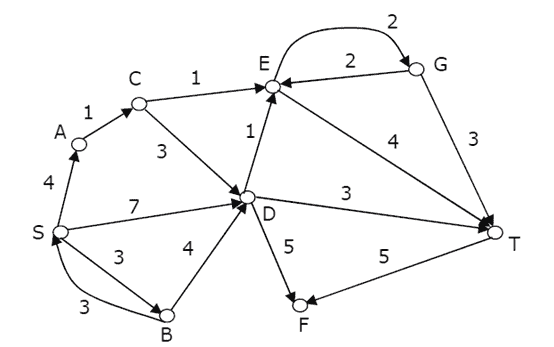
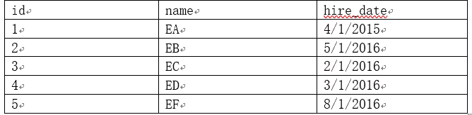
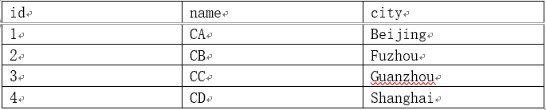
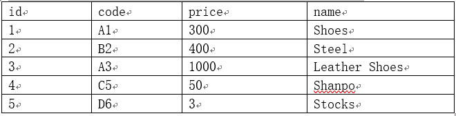
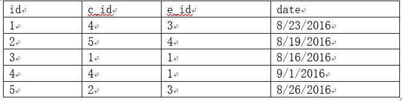
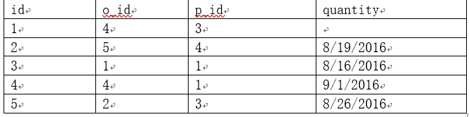

# 用友 2017 秋招笔试题（三）

## 1

在 Web 应用的集群中，经常用到一个 WEB 服务器，作为反向代理，请问下面哪些技术可以用作反向代理：(    )

正确答案: A C E   你的答案: 空 (错误)

```cpp
Apache Web Server
```

```cpp
JQuery
```

```cpp
Squid
```

```cpp
Tomcat
```

```cpp
Nginx
```

```cpp
Hadoop
```

本题知识点

Java 工程师 C++工程师 安卓工程师 iOS 工程师 运维工程师 前端工程师 算法工程师 PHP 工程师 测试工程师 用友 2017

## 2

REST 风格的服务已经被广泛的普及和采纳，下面关于 REST 风格服务的描述，哪些是正确的：（    ）

正确答案: B D F   你的答案: 空 (错误)

```cpp
REST 风格的服务，数据以 HTTP 协议交换，数据编码格式为 JSON 数据格式
```

```cpp
REST 风格的服务，充分利用了 HTTP 的方法语义，实现服务的语义，如 PUT, DELETE, GET, POST 等
```

```cpp
REST 风格的服务很适合服务器之间进行高效的通信
```

```cpp
REST 风格的服务非常符合现代 WEB 应用的需要，能够实现有效的前后端分离模式
```

```cpp
REST 风格的服务比 SOAP-WebService 更具有效率,并且具有更强大的语义表达能力
```

```cpp
REST 服务建议把服务当作资源，每个资源都有唯一的 URI 标识，通过这个 URI 标识访问和控制 REST 服务
```

本题知识点

Java 工程师 C++工程师 安卓工程师 iOS 工程师 运维工程师 前端工程师 算法工程师 PHP 工程师 测试工程师 用友 2017

## 3

下面的语言中哪些语言是动态语言(    )

正确答案: B   你的答案: 空 (错误)

```cpp
C
```

```cpp
JavaScript
```

```cpp
C++
```

```cpp
CSS
```

```cpp
Java
```

```cpp
Objective-C
```

本题知识点

Java 工程师 C++工程师 安卓工程师 运维工程师 前端工程师 算法工程师 PHP 工程师 测试工程师 用友 Javascript 2017 C++ C 语言

讨论

[pierrejacques](https://www.nowcoder.com/profile/7207840)

屁题一道

发表于 2020-05-27 11:25:51

* * *

[我太难啦](https://www.nowcoder.com/profile/223181266)

静态语言（强类型语言）

静态语言是在编译时变量的数据类型即可确定的语言，多数静态类型语言要求在使用变量之前必须声明数据类型。 

例如：C++、Java、Delphi、C#等。

动态语言（弱类型语言）

动态语言是在运行时确定数据类型的语言。变量使用之前不需要类型声明，通常变量的类型是被赋值的那个值的类型。 
例如 PHP/ASP/Ruby/Python/Perl/ABAP/SQL/JavaScript/Unix Shell 等等。

发表于 2019-07-11 16:42:49

* * *

[牛客 465355649 号](https://www.nowcoder.com/profile/465355649)

动态类型语言：动态类型语言是指在运行期间才去做数据类型检查的语言，也就是说，在用动态类型的语言编程时，永远也不用给任何变量指定数据类型，该语言会在你第一次赋值给变量时，在内部将数据类型记录下来。Python 和 Ruby 就是一种典型的动态类型语言，其他的各种脚本语言如 JavaScript 也属于动态类型语言。

静态类型语言：静态类型语言与动态类型语言刚好相反，它的数据类型是在编译其间检查的，也就是说在写程序时要声明所有变量的数据类型，C/C++ 是静态类型语言的典型代表，其他的静态类型语言还有 C#、JAVA 等。

发表于 2019-12-10 11:09:23

* * *

## 4

小堆是一种完全二叉树，其中每个树节点的值都小于或等于其子节点，堆通常编码成数组，以广度优先的方式，从左邻居到右邻居的遍历的方式，编码到数组中。例如：

       1

      /   \

   2       3

  /  \      /  \

4   5    6   7
是一个小堆，编码为数组后为[1, 2, 3, 4, 5, 6, 7]。根据这一小堆定义，选出下面的是小堆的数组（    ）

正确答案: A D   你的答案: 空 (错误)

```cpp
[3, 5, 6, 9, 8, 20, 10, 12, 18, 9]
```

```cpp
[3, 12, 10, 18, 9, 9, 20, 5, 6, 8]
```

```cpp
[3, 6, 10, 12, 9, 9, 20, 5, 18, 8]
```

```cpp
[3, 5, 9, 6, 8, 18, 10, 9, 20, 12]
```

```cpp
[3, 18, 10, 12, 9, 9, 20, 5, 6, 8]
```

```cpp
[3, 5, 9, 6, 18, 20, 10, 12, 8, 9]
```

本题知识点

用友 树 2017

讨论

[我的天鸭](https://www.nowcoder.com/profile/243498)

NMD，A 是 3 5 **6 9** 8 20 10 12 18 9 吧

发表于 2019-09-05 15:18:14

* * *

[黑闪⚡](https://www.nowcoder.com/profile/962532797)

什么破题

发表于 2020-03-25 21:34:29

* * *

[非常凡想](https://www.nowcoder.com/profile/757410448)

这个题出错了吧，应该选 D

发表于 2020-10-14 22:12:14

* * *

## 5

下面关于数据库范式的说法哪些是正确的：（    ）

正确答案: A D E   你的答案: 空 (错误)

```cpp
关系型数据库设计必须符合第一范式，在这种范式下一个数据列只能有一个值
```

```cpp
数据库设计范式的引入，提高了数据库访问的效率
```

```cpp
数据库表设计[学号，学生姓名、年龄、性别、课程号、课程名称 课程学分]满足第二范式，但不满足第三范式
```

```cpp
满足第四范式必然满足第三范式，满足第三范式必然满足第二范式
```

```cpp
通过数据范式的引入，可以减少数据冗余，消除数据操作异常
```

```cpp
数据库设计时，符合的范式的等级越高越好
```

本题知识点

Java 工程师 C++工程师 安卓工程师 iOS 工程师 运维工程师 前端工程师 算法工程师 测试工程师 用友 数据库 2017

讨论

[花房陈鹿](https://www.nowcoder.com/profile/236359886)

B:数据库设计范式的引入是为了是为了解决插入、删除异常等问题，并不能提高访问效率；C：主码是（学号，课程号），不满足第二范式；F：不是越高越好，看具体需求。

发表于 2019-12-15 22:40:16

* * *

[付*君](https://www.nowcoder.com/profile/377329163)

第一范式：表的每一列属性不可再分。不满足第一范式的就不是关系数据库。 第二范式：在第一范式的基础上，非主键列属性完全依赖于主键列属性。如果是组合字段主键，部分属性可能只依赖于主键中的某个字段。 第三范式：非主键列只能由主键***定，不能由其他非主键***定或导出。 数据库范式的引入，主要是为了解决数据冗余、插入异常、删除异常、更新异常等问题！ c 选项，主键是【学号，课程号】，但是非主键列并不完全依赖主键，如：课程学分只依赖于课程号

编辑于 2020-08-23 21:59:40

* * *

[我太难啦](https://www.nowcoder.com/profile/223181266)

目前[关系数据库](https://baike.baidu.com/item/%E5%85%B3%E7%B3%BB%E6%95%B0%E6%8D%AE%E5%BA%93)有六种范式：第一范式（1NF）、第二范式（2NF）、第三范式（3NF）、巴斯-科德范式（BCNF）、[第四范式](https://baike.baidu.com/item/%E7%AC%AC%E5%9B%9B%E8%8C%83%E5%BC%8F)(4NF）和[第五范式](https://baike.baidu.com/item/%E7%AC%AC%E4%BA%94%E8%8C%83%E5%BC%8F)（5NF，又称完美范式）。满足最低要求的范式是第一范式（1NF）。在第一范式的基础上进一步满足更多规范要求的称为第二范式（2NF），其余范式以次类推。一般来说，数据库只需满足第三范式(3NF）就行了。

发表于 2019-07-11 16:47:42

* * *

## 6

下面的一些说法哪些是正确的：(    )

正确答案: B C   你的答案: 空 (错误)

```cpp
缓存策略中基于 LRU 的淘汰策略，在缓存满时，会把最近进入缓存的数据先淘汰，以保持高的命中率
```

```cpp
中缀表达式 A+(B+C)*D 的后缀表但式为 ABC+D*+
```

```cpp
堆栈是一种 LIFO 的数据结构
```

```cpp
高级语言通过编译或者即时编译 (JIT) 后成为汇编语言被机器装载执行
```

```cpp
TCP 协议和 UDP 协议都在 IP 协议之上，TCP 是面向连接的, UDP 是面向非连接的，但无论 TCP 还是 UDP 建立通信都需要一次握手，以确保对方的端口已经打开
```

```cpp
现代的操作系统一般都分为用户态和内核态，用户态和内核态的切换是经常发生的，程序员不需要对内核态和用户态的切换进行编程关注
```

本题知识点

Java 工程师 C++工程师 运维工程师 用友 栈 *2017* *讨论

[WangKuku](https://www.nowcoder.com/profile/925758523)

A:    刚好说反了，LRU 的过程如下（其实很好理解，访问的频率越高越不该丢弃）：        1. 新数据插入到链表头部；        2. 每当缓存命中（即缓存数据被访问），则将数据移到链表头部；3. 当链表满的时候，将链表尾部的数据丢弃。 B:    有种简单的方法：1\. 先将中缀表达式加括号：(A + ((B + C) * D))； 2\. 再把运算符移到括号后面（前缀移到前面）：(A ((B C)+ D)*)+； 3\. 把括号去掉：ABC+D*+。 C:    LIFO：Last In First Out（后进先出）。D:    汇编语言也并不能被机器执行，机器可以执行的是二进制的机器语言。E:    TCP 建立通信需要三次握手，而 UDP，在传送数据前不需要先建立连接，远地的主机在收到 UDP 报文后也不需要给出任何确认。F:    这个读起来就不像对的...程序员是可以通过调用 fork()函数的方式进行切换的。

发表于 2019-09-22 00:18:27

* * *

[Despacito007](https://www.nowcoder.com/profile/893487814)

堆栈就是指栈，某本数据结构的书上就是这么讲的...

发表于 2020-11-01 16:05:24

* * *

[牛客 129457616 号](https://www.nowcoder.com/profile/129457616)

```cpp

```
LRU（最近最久未使用）：把之前置换进来最久没有使用的页面置换出去；
能被计算机识别的只有机器语言，高级语言转换成机器语言的两种方法：
    （1）高级语言（编译为）汇编语言（汇编操作为）机器语言
    （2）高级语言（翻译为）机器语言
UDP 不需要建立连接；TCP 建立连接采用的三次握手，释放是四次握手；
用户态——>内核态:“访管指令”；
内核态——>用户态：执行一条特权指令——修改 PSW 的标志位为“用户态”。
```cpp

            发表于 2021-11-14 14:05:00

        7
        关于内存管理的描述，下面哪些描述是正确的（    ）

    正确答案:
                                                                  C
                                             D
                                                         你的答案:

                  空
                             (错误)

```
现代操作系统都引入了虚拟内存技术，在虚拟内存下机制下，每个进程都似乎拥有全部的内存资源，但其实是以一种隔离的方式共同使用同样的底层无物理内存，因此虚拟内存提高了程序的运行效率
```cpp

```
Java 中所有用户数据的内存都是分配在 Java 的堆内存中的
```cpp

```
C 语言通过 malloc 和 free 分配内存，通过 realloc 对一个地址指向的内存在分配
```cpp

```
当系统内存管理中出现频繁的页面换入换出时，系统地性能会大受影响
```cpp

```
内存是现代计算机 CPU 能访问的最快的存储单元，所以尽量的把数据放入内存能够提升数据访问效率
```cpp

```
现代语言提供了内存的垃圾回收机制后，操作系统的内存管理不再是必须的了
```cpp

本题知识点

                                                            Java 工程师 
                                                C++工程师 
                                                安卓工程师 
                                                iOS 工程师 
                                                运维工程师 
                                                前端工程师 
                                                算法工程师 
                                                测试工程师 
                                                用友 
                                                操作系统 
                                                2017 

讨论

[咱可不是啥好人😒](https://www.nowcoder.com/profile/9218587)

                                                                    A 的运行效率应该也是和 C 选项差不多的意思，使用虚拟内存，需要额外的进行地址映射等操作，程序的运行效率降低

发表于 2020-02-10 23:58:31

* * *

[我只是想求一个 offer，给个机会面试](https://www.nowcoder.com/profile/200333)

                                                                    难道尽量把数据放到内存不能提升数据访问效率？尽量放肯定好的啊，不用访问磁盘就很无敌了感觉

发表于 2020-02-05 14:48:56

* * *

[UoweMe](https://www.nowcoder.com/profile/972115911)

                                                                    运行效率表述不对

发表于 2019-12-05 00:25:12

* * *

## 8

        下面哪些特性不是 HTML5 新引入的特性：(    )

正确答案:
                                                                  C
                                                              E
                                        你的答案:

                  空
                             (错误)

```
audio 和 video 支持
```cpp

```
Canvas
```cpp

```
AJAX
```cpp

```
localStorage
```cpp

```
ES6
```cpp

```
WebSocket
```cpp

本题知识点

                                                            Java 工程师 
                                                C++工程师 
                                                安卓工程师 
                                                iOS 工程师 
                                                运维工程师 
                                                前端工程师 
                                                算法工程师 
                                                测试工程师 
                                                用友 
                                                HTML 
                                                2017 

讨论

[嘿嘿 _ 哈哈](https://www.nowcoder.com/profile/798181578)

  一、语义标签： 

  <section>：定义页面的区域     <header>：页面标题    <footer>：页面页脚      <nav>：页面导航元素    

  <article>：页面的文章或主要内容     <aside>：页面的附加内容，比如边栏     <figure>：文章的配图 

  <figcaption>：<figure>元素的标题       <summary>：<details>元素的可视标题 

  二、增强型表单 

  三、视频和音频 

  四、Canvas 绘图 

  五、SVG 绘图 

  六、地理定位:使用 getCurrentPosition()方法来获取用户的位置。以实现“LBS 服务”  

  七、拖放 API 

  八、WebWorker 

  九、WebStorage 

   十、WebSocket 
   参考：[`www.cnblogs.com/binguo666/p/10928907.html`](https://www.cnblogs.com/binguo666/p/10928907.html)

发表于 2020-10-07 14:07:09

* * *

[Pc-Lin](https://www.nowcoder.com/profile/8208693)

                                                                    没我人吗？？？？

发表于 2019-09-12 18:37:14

* * *

[PUNTA](https://www.nowcoder.com/profile/938899341)

                                                                    没什么好说的，学过的都知道😁

发表于 2019-09-25 20:27:10

* * *

## 9

        JSP 中提供了一些内置的对象，可以访问不同作用范围中的数据，请问下面哪些描述是正确的：（    ）

正确答案:
                                A
                                                              C
                                                              E
                                        你的答案:

                  空
                             (错误)

```
只有在 jsp 允许会话的时候，jsp 才会提供内置对象 session
```cpp

```
request 内置对象存放请求级的数据，我们可以保存 request 对象，在处理下次请求时再把保存的 request 拿出来，以建立请求之间的关系
```cpp

```
pageContext 内置对象通常存放页面级的变量，经常被用于 tag 开发中，为页面变量赋值，JSP 页面可以直接使用这些变量
```cpp

```
response 是一个内置对象，它用于存储该次 WEB 请求的共享数据
```cpp

```
application 是一个内置对象，它管理整个应用共享的数据
```cpp

```
session 和 application 是性能杀手，应该慎用
```cpp

本题知识点

                                                            Java 工程师 
                                                C++工程师 
                                                安卓工程师 
                                                iOS 工程师 
                                                运维工程师 
                                                前端工程师 
                                                算法工程师 
                                                PHP 工程师 
                                                测试工程师 
                                                用友 
                                                2017 

## 10

        Java 是一门支持反射的语言,基于反射为 Java 提供了丰富的动态性支持，下面关于 Java 反射的描述，哪些是错误的：(    )

正确答案:
                                A
                                                                               D
                                                              F
                       你的答案:

                  空
                             (错误)

```
Java 反射主要涉及的类如 Class, Method, Filed,等，他们都在 java.lang.reflet 包下
```cpp

```
通过反射可以动态的实现一个接口，形成一个新的类，并可以用这个类创建对象，调用对象方法
```cpp

```
通过反射，可以突破 Java 语言提供的对象成员、类成员的保护机制，访问一般方式不能访问的成员
```cpp

```
Java 反射机制提供了字节码修改的技术，可以动态的修剪一个类
```cpp

```
Java 的反射机制会给内存带来额外的开销。例如对永生堆的要求比不通过反射要求的更多
```cpp

```
Java 反射机制一般会带来效率问题，效率问题主要发生在查找类的方法和字段对象，因此通过缓存需要反射类的字段和方法就能达到与之间调用类的方法和访问类的字段一样的效率
```cpp

本题知识点

                                                            Java 工程师 
                                                C++工程师 
                                                安卓工程师 
                                                iOS 工程师 
                                                运维工程师 
                                                前端工程师 
                                                算法工程师 
                                                测试工程师 
                                                用友 
                                                Java 
                                                2017 

讨论

[IDEA2022.4.2](https://www.nowcoder.com/profile/181223548)

                                                                    A 选项 Class 类位于 lang 包下面，D 选项反射的本质就是从字节码中查找，动态获取类的整容结构，包括属性，构造器，动态调用对象的方法，而不是修剪类，F 选项我觉得应该是，使用了反射的效率都会降低，就算加了缓存

发表于 2019-09-20 09:49:04

* * *

[_ 澈](https://www.nowcoder.com/profile/2458301)

                                                                      A Class 类在 java.lang 包 
   B 动态代理技术可以动态创建一个代理对象，反射不行 
   C 反射访问私有成员时，Field 调用 setAccessible 可解除访问符限制 
   D CGLIB 实现了字节码修改，反射不行 
   E 反射会动态创建额外的对象，比如每个成员方法只有一个 Method 对象作为 root，他不胡直接暴露给用户。调用时会返回一个 Method 的包装类 
   F 反射带来的效率问题主要是动态解析类，JVM 没法对反射代码优化。 

发表于 2020-04-20 08:44:16

* * *

[3kna1j](https://www.nowcoder.com/profile/541130640)

                                                                    程序编译时，会生成一个字节码文件，后缀为.class，当我们 new 一个对象时，jvm 会从本地加载相应的.class 文件在内存中，同时产生一个 Class 对象，这个 Class 对象无论 new 多少个本地对象，都只会生成一个，这个 Class 对象所属的位置为 java.lang，排除 A。反射时，运用的是内存中生成的 Class 对象，然后反推到字节码文件中，再获取相应对象的方法或者属性，但是并不会动态修剪字节码文件。关于 F 的效率问题，主要是寻找对应的字节码文件所需的时间。如有错请斧正。

发表于 2020-05-22 18:27:58

* * *

## 11

        文具盒中有红色笔 3 至，蓝色笔 2 支，随机挑出两只笔，画两个圆圈，问都是红色的概率是多少：

你的答案

本题知识点

                                                            Java 工程师 
                                                C++工程师 
                                                安卓工程师 
                                                iOS 工程师 
                                                运维工程师 
                                                前端工程师 
                                                算法工程师 
                                                PHP 工程师 
                                                测试工程师 
                                                用友 
                                                2017 

讨论

[魔法师的学徒 201906021924197](https://www.nowcoder.com/profile/329197258)

                                                                    5 支笔挑出两支总共有 5*4/2=10 种可能，两支都是红色的有 3*2/2=3 种可能，所以都是红色的概率为 3/10，也就是 30%的概率

发表于 2019-06-02 19:27:11

* * *

## 12

        请问按照下面的排列规律，空白处应该是什么：   90e9179262()63da18 

你的答案

本题知识点

                                                            Java 工程师 
                                                C++工程师 
                                                安卓工程师 
                                                iOS 工程师 
                                                运维工程师 
                                                前端工程师 
                                                算法工程师 
                                                PHP 工程师 
                                                测试工程师 
                                                用友 
                                                2017 

## 13

        下面程序段的时间复杂度为 ________。(n>1)  

```
sum=1；for (i=0;sum<n;i++) sum+=1
```cpp

你的答案

本题知识点

                                                            Java 工程师 
                                                C++工程师 
                                                安卓工程师 
                                                iOS 工程师 
                                                运维工程师 
                                                前端工程师 
                                                算法工程师 
                                                PHP 工程师 
                                                测试工程师 
                                                用友 
                                                2017 

## 14

          在下图中找到从 S 节点开始，到达目标节点 T，请根据 Dijkstra 最短路径算法，找出一条最短路径。图中的边上的数字是两个节点的距离，箭头方向只是示意走动方向，不代表单向连通 
   

你的答案

本题知识点

                                                            Java 工程师 
                                                C++工程师 
                                                安卓工程师 
                                                iOS 工程师 
                                                运维工程师 
                                                前端工程师 
                                                算法工程师 
                                                PHP 工程师 
                                                测试工程师 
                                                用友 
                                                2017 

## 15

        猴子第一天摘下若干个桃子，当即吃了一半，还不瘾，又多吃了一个,第二天早上又将剩下的桃子吃掉一半，又多吃了一个。以后每天早上都吃了前一天剩的一半零一个。到第 10 天早上想再吃时，见只剩下一个桃子了。求第一天共摘了多少（也可以用程序说明一下计算过程，不用最终结果）

你的答案

本题知识点

                                                            Java 工程师 
                                                C++工程师 
                                                安卓工程师 
                                                iOS 工程师 
                                                运维工程师 
                                                前端工程师 
                                                算法工程师 
                                                PHP 工程师 
                                                测试工程师 
                                                用友 
                                                2017 

讨论

[我太难啦](https://www.nowcoder.com/profile/223181266)

```
#include<stdio.h>
int main()
{
    int day=9,x1=0,x2=1;
    for(;day>0;day--)
    {
        x1=(x2+1)*2;
        x2=x1;
    }
    printf("The first day of picking peaches number is：%d\n",x1);
}

```cpp

发表于 2019-07-11 16:56:48

* * *

## 16

        什么是数据库视图？物化视图和普通视图的区别？

你的答案

本题知识点

                                                            Java 工程师 
                                                C++工程师 
                                                安卓工程师 
                                                iOS 工程师 
                                                运维工程师 
                                                前端工程师 
                                                算法工程师 
                                                PHP 工程师 
                                                测试工程师 
                                                用友 
                                                2017 

## 17

        位运算是常见的运算，计算机内部运算时所有的数都是以二进制进行表达的，移位运算是常见的运算，移位包括左移和右移，右移时包括符号右移和无符号右移，现在有个八位的整数-4， 请问在符号右移两位和无符号右移两位的十进制数值分别是多少：

你的答案

本题知识点

                                                            Java 工程师 
                                                C++工程师 
                                                安卓工程师 
                                                iOS 工程师 
                                                运维工程师 
                                                前端工程师 
                                                算法工程师 
                                                PHP 工程师 
                                                测试工程师 
                                                用友 
                                                2017 

## 18

        下面这个 HTML 和 JavaScript 程序结合的片断： 

```
<button>Button 1!
</button><button>Button 2!
</button><button>Button 3!
</button>var prizes = ['IPHONE', 'Football', 'BMW'];
for (var btnNum = 0; btnNum < prizes.length; btnNum++) {
document.getElementById('btn-' + btnNum).onclick = function() {
console.log(prizes[btnNum]);
};
}
```cpp

你的答案

本题知识点

                                                            Java 工程师 
                                                C++工程师 
                                                安卓工程师 
                                                iOS 工程师 
                                                运维工程师 
                                                前端工程师 
                                                算法工程师 
                                                PHP 工程师 
                                                测试工程师 
                                                用友 
                                                2017 

## 19

        Java 核心类库中的 HashSet 和 TreeSet 有什么区别？

你的答案

本题知识点

                                                            Java 工程师 
                                                C++工程师 
                                                安卓工程师 
                                                iOS 工程师 
                                                运维工程师 
                                                前端工程师 
                                                算法工程师 
                                                PHP 工程师 
                                                测试工程师 
                                                用友 
                                                2017 

## 20

        请问工厂方法模式和抽象工厂模式有什么区别？

你的答案

本题知识点

                                                            Java 工程师 
                                                C++工程师 
                                                安卓工程师 
                                                iOS 工程师 
                                                运维工程师 
                                                前端工程师 
                                                算法工程师 
                                                PHP 工程师 
                                                测试工程师 
                                                用友 
                                                2017 

## 21

  实现一个单向顺序链表，链表中存储的数据为整型数，要求提供 add、contains 和 remove 方法，表示新增和删除结点，链表没有容量限制（假设内存够用）  

你的答案

本题知识点

                                                            Java 工程师 
                                                C++工程师 
                                                安卓工程师 
                                                iOS 工程师 
                                                运维工程师 
                                                前端工程师 
                                                算法工程师 
                                                PHP 工程师 
                                                测试工程师 
                                                用友 
                                                2017 

## 22

  删除一个字符串中前面出现过的字符，只保留首次出现的字符， 例如 

  "hello  it is a test and you can do it will"。 

  输出结果为："helo itsandyucw" 

你的答案

本题知识点

                                                            Java 工程师 
                                                C++工程师 
                                                安卓工程师 
                                                iOS 工程师 
                                                运维工程师 
                                                前端工程师 
                                                算法工程师 
                                                PHP 工程师 
                                                测试工程师 
                                                用友 
                                                2017 

## 23

  贷款是个复杂的流程，中间会遇到各种审批环节，在一个审批过程中，只要有一个环节审批不通过，整个贷款就会被否决， 假设贷款申请类为 Loan,贷款人的信用信息和本次贷款的背景、以及审批过程的流程数据存在 LoanContext 审批接口为： 

```
public interface IApprove  
{
boolean approve(LoanContext ctx, Loan loan);
}
```cpp

  1). 请设计这么一个系统称为 LoanManager，支持动态的添加审批环节，支持这种审批业务。 

  2). 如果审批算法发生变化，比如中间审批，只要老板审批通过，不管其他审批是否审批通过系统都审批通过，为了适应这种需求，需要动态的修改和调整审批算法，你要如何重构代码呢？ 

你的答案

本题知识点

                                                            Java 工程师 
                                                C++工程师 
                                                安卓工程师 
                                                iOS 工程师 
                                                运维工程师 
                                                前端工程师 
                                                算法工程师 
                                                PHP 工程师 
                                                测试工程师 
                                                用友 
                                                2017 

## 24

  有一个数据库，包括雇员表(employee), 客户表(customer)、产品表和订单表(Order), 订单明细(orderline) 它们的数据如下： 

   雇员表：ID，名字(name)，雇佣日期(hire_date) 
   

   客户:ID, 名称(name)，城市(city)  

 

   产品表：ID,产品编码(code)，价格(price)，名称(name)  

 

   订单：ID, 客户 ID(c_id), 签单雇员 ID(e_id), 签单日期  

  

   订单明细：ID, 订单 ID(o_id), 产品 id(p_id), 订单数量(quantity)  

 

   问题 1: 写一个程序，统计产品的畅销情况,显示产品的编码、名称，销售数量  

   问题 2：统计最具价值员工,最具价值员工是销售订单总额最大的员工,显示员工名字和销售金额  

你的答案

本题知识点

                                                            Java 工程师 
                                                C++工程师 
                                                安卓工程师 
                                                iOS 工程师 
                                                运维工程师 
                                                前端工程师 
                                                算法工程师 
                                                PHP 工程师 
                                                测试工程师 
                                                用友 
                                                2017 

## 25

  平面中给定一个点，和一条线段，判断这个点是否在这个线段上，假设点类为 

```
classPoint {
      intx;
      inty;
}
```cpp

  线段两个点位 v1, v2, 需要测试的点位 p, 请实现一个简单的程序判断这个点是否在线段上 

你的答案

本题知识点

                                                            Java 工程师 
                                                C++工程师 
                                                安卓工程师 
                                                iOS 工程师 
                                                运维工程师 
                                                前端工程师 
                                                算法工程师 
                                                PHP 工程师 
                                                测试工程师 
                                                用友 
                                                2017 

```*