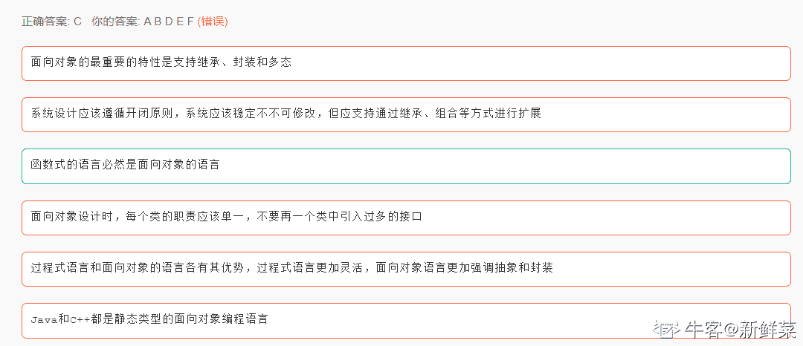

# 用友 2017 秋招笔试题（四）

## 1

下面哪些中间件产品提供了 JSP 和 Servlet 的服务：(     )

正确答案: B D   你的答案: 空 (错误)

```cpp
NGINX
```

```cpp
Tomcat
```

```cpp
Apache Web Server
```

```cpp
Jetty
```

```cpp
ActiveMQ
```

```cpp
RabbitMQ
```

本题知识点

Java 工程师 C++工程师 安卓工程师 iOS 工程师 运维工程师 前端工程师 算法工程师 PHP 工程师 测试工程师 用友 2017

## 2

下面关于 WebService 的哪些描述是正确的：（    ）

正确答案: B E   你的答案: 空 (错误)

```cpp
WEB Service 的传输协议必须是 HTTP，否则不能称之为 WebService
```

```cpp
XML Security 题 gogmde1 机制是 WebService 中的 XML 数据安全的基本机制
```

```cpp
Apache AXIS 是一种流行的 WebService 框架
```

```cpp
SOAP-RPC 比 JSON-RPC 在数据处理上更具有效率
```

```cpp
SOAP WebService 通过 WSDL 描述接口， WSDL 支持对 WebService 进行人机可识别的描述
```

```cpp
WebService 的数据格式通过 XSLT 进行精确的描述，每个元素的格式及其数据类型都可描绘清晰
```

本题知识点

Java 工程师 C++工程师 安卓工程师 iOS 工程师 运维工程师 前端工程师 算法工程师 PHP 工程师 测试工程师 用友 2017

## 3

下面关于面向对象的一些理解哪些是错误的(    )

正确答案: C   你的答案: 空 (错误)

```cpp
面向对象的最重要的特性是支持继承、封装和多态
```

```cpp
系统设计应该遵循开闭原则，系统应该稳定不不可修改，但应支持通过继承、组合等方式进行扩展
```

```cpp
函数式的语言必然是面向对象的语言
```

```cpp
面向对象设计时，每个类的职责应该单一，不要再一个类中引入过多的接口
```

```cpp
过程式语言和面向对象的语言各有其优势，过程式语言更加灵活，面向对象语言更加强调抽象和封装
```

```cpp
Java 和 C++都是静态类型的面向对象编程语言
```

本题知识点

Java 工程师 C++工程师 安卓工程师 运维工程师 前端工程师 算法工程师 测试工程师 用友 C++ Java 2017

讨论

[新鲜菜](https://www.nowcoder.com/profile/280881429)

🙄

发表于 2020-06-17 14:51:16

* * *

[IDEA2022.4.2](https://www.nowcoder.com/profile/181223548)

我就选了 C，看到是不定项选择我又选了个 E🤣

发表于 2019-09-03 09:51:06

* * *

[雪 201812201347396](https://www.nowcoder.com/profile/379755278)

动态类型语言是指在运行期间才去做数据类型检查的语言，也就是说，在用动态类型的语言编程时，永远也不用给任何变量指定数据类型，该语言会在你第一次赋值给变量时，在内部将数据类型记录下来。静态类型语言与动态类型语言刚好相反，它的数据类型是在编译其间检查的，也就是说在写程序时要声明所有变量的数据类型，C/C++是静态类型语言的典型代表，其他的静态类型语言还有 C#、JAVA 等。

发表于 2019-09-03 00:07:30

* * *

## 4

下面关于二分查找的叙述争正确的是: (    )

正确答案: D   你的答案: 空 (错误)

```cpp
表必须有序，表可以顺序方式存储，也可以链表方式存储
```

```cpp
表必须有序且表中数据必须是整型，实型或字符型
```

```cpp
表必须有序，而且只能从小到大排列
```

```cpp
表必须有序，且表只能以顺序方式存储
```

```cpp
表不需要有序，只要符合小堆和大堆的数据排列要求即可
```

```cpp
表不需要有序，但存储必须是顺序存储
```

本题知识点

Java 工程师 C++工程师 安卓工程师 iOS 工程师 运维工程师 前端工程师 算法工程师 测试工程师 用友 查找 *2017* *讨论

[仰望 stars](https://www.nowcoder.com/profile/50240849)

因为二分查找需要随机读，因此只能用数组来保存，而不能用链表。

发表于 2019-09-17 19:13:32

* * *

[一颗梅子 x](https://www.nowcoder.com/profile/534086512)

被不定项选择迷惑。。看来还是基础知识不扎实

发表于 2019-11-13 20:04:37

* * *

[Lance217](https://www.nowcoder.com/profile/338831259)

二分查找，一定要有序由于需要跳跃，因此链表不可取

发表于 2020-03-20 06:27:59

* * *

## 5

关于数据库的事务，下面哪些描述是正确的：（    ）

正确答案: A D E   你的答案: 空 (错误)

```cpp
一个数据库事务可以包含多个查询、修改、删除、插入等数据库动作，它们要么作为一个整体完全得到确认，要么完全失败
```

```cpp
下面的数据库动作“begin transaction; insert into employee values(1, 'Cardinal'); commit; rollback;”最终插入的数据会被取消，不会记录到数据库中
```

```cpp
主流的数据库系统都允许设置数据库事务隔离级别，隔离级别“read commited”时，一个事务不能读取另一个事务中修改的数据，但可以读取另一个事务中新插入的数据
```

```cpp
一个事务只能包含对一个数据库实例的数据操作，不允许跨多个数据库实例，跨多个数据库实例需要分布式事务支持
```

```cpp
数据库事务会给数据库带来并发操作带来一定影响，会降低系统的并发能力
```

```cpp
互联网应用大量采用补偿机制而不是事务机制，证明事务对数据库系统不再重要
```

本题知识点

Java 工程师 C++工程师 安卓工程师 iOS 工程师 运维工程师 前端工程师 算法工程师 测试工程师 用友 数据库 2017

讨论

[牛客 149347611 号](https://www.nowcoder.com/profile/149347611)

B：commit 之前 rollback 才会取消数据的插入 C：读已提交(read committed)：可以看到其他事务添加的新纪录，而且其他事务对现存记录做出的修改一旦被提交，也可以看到，避免丢失修改和脏读。二级封锁协议

发表于 2019-12-29 16:00:48

* * *

[直上云霄](https://www.nowcoder.com/profile/487954389)

B 选项数据操作已经提交了，已经被记录了。C 选项数据库事务隔离，不能删除修改数据亦不能读取数据了

发表于 2019-11-08 09:28:59

* * *

[不要把我当工具人](https://www.nowcoder.com/profile/531522761)

C 保持疑问，应该是可读取另一个事务新插入的数据，不然为什么会有幻读现象，幻读就是一个事务内两次读取的记录数目不同，可能由于其他事务的插入和删除造成的，只有将事务隔离级别变为串行化或者使用间隙锁才能解决幻读现象

发表于 2021-11-25 14:40:56

* * *

## 6

关于 XML，下面哪些描述是错误的：(    )

正确答案: B   你的答案: 空 (错误)

```cpp
每个合格的 XML 都有唯一的根元素
```

```cpp
XML 和 Java,C/C++一样是门编程语言
```

```cpp
XML 的格式上是要求严格的，每个元素的开闭必须完整，不允许交叉开闭，如
```

```cpp
XML 常用于 WebService 中用来做数据交换的标准
```

```cpp
XML 中元素是大小写敏感的
```

```cpp
XML 中的数据可以通过 XPATH 检索查询
```

本题知识点

Java 工程师 C++工程师 安卓工程师 iOS 工程师 运维工程师 前端工程师 算法工程师 PHP 工程师 测试工程师 用友 2017

## 7

下面关于计算机和操作系统的一些描述哪些是正确的（    ）

正确答案: A E   你的答案: 空 (错误)

```cpp
CPU 根据程序计数器(PC)从内存中装载指令到 CPU 中执行
```

```cpp
PCI 总线负责把虚拟内存地址转化为物理内存地址并进行访问
```

```cpp
进程间通信时，每次通信的消息必须是固定大小的
```

```cpp
用来实现同步的工具有很多，比如 SEMAPHORE， PIPE
```

```cpp
如果外设要请求 CPU 提供服务时，需要向其发送中断信号
```

```cpp
Linux 操作系统是微内核架构的
```

本题知识点

Java 工程师 C++工程师 安卓工程师 iOS 工程师 运维工程师 前端工程师 算法工程师 测试工程师 用友 操作系统 2017

讨论

[嘤嘤怪.](https://www.nowcoder.com/profile/4887286)

pipe 是进程间通信用的，半双工

发表于 2020-04-02 22:53:44

* * *

[WillemGavin](https://www.nowcoder.com/profile/136600156)

PCI 是主机与外设之间的通信总线

发表于 2020-03-08 10:12:59

* * *

[dj12356](https://www.nowcoder.com/profile/135514616)

Linux 操作系统是单内核架构的

发表于 2019-10-04 17:52:22

* * *

## 8

下面关于 WEB 开发中，常见的技术和问题描述正确的是：(    )

正确答案: C   你的答案: 空 (错误)

```cpp
CSS selector 中，支持按照元素的 id 选择，元素的名称进行选择，元素的 class 属性进行选择，比如「#div .red」就是选择 CSS class 属性中包括 red 的所有的 div 元素
```

```cpp
JSON 是一种以 JavaScript 语法表示的数据对象格式，比如描述一个学生，包括，其中，姓名，年龄就可以这样表达 {name:"John"， age: 18}
```

```cpp
HTML 页面中的第一个指令： 表明这是一个符合 HTML 标准的页面
```

```cpp
不同的浏览器对 HTML 渲染的方式稍有差异，但是所有的主流浏览器都支持 JavaScript 语言，而且提供的 JavaScript 的编程环境都是一致的
```

```cpp
HTML 页面装载时，首先把整个 HTML 页面下载下来，再根据 HTML 中出现的顺序依次下载它引用的外部的 JavaScript 代码和图片资源，最后才执行页面中的 JavaScript 代码
```

```cpp
JavaScript 中的函数就是一个对象，每个函数对象都继承了 JavaScript 的 Function 类
```

本题知识点

前端工程师 用友 2017 HTML CSS

讨论

[很累却不敢停下](https://www.nowcoder.com/profile/364243461)

A.“#div .red”就是选择**Id 为“div”的元素内部的所有 class 为“red”的元素；**element1  element2（后代选择器)表示选择 element1 内部所有的 element2 元素。B.{**"name"**: "John"， **"age"**: 18},json 数据中的键都需要添加**""(双引号）**
D.不同浏览器提供的**编程环境不一致**（包括 html、css、js 编程的不一致），所以在编程时才要使用 -ms、-webkit、-moz 来实现不同浏览器的兼容性（解决 css 编程不一致）E.JS 文件**按在 HTML 中引入的顺序依次载入**（不是最后载入），在载入后马上执行，执行时会阻塞页面后续的内容（包括页面的渲染、其它资源的下载）F.**箭头函数**没有**super**关键字，所以**箭头函数没有继承任何对象**，也就不可能**继承 Function 类。**箭头函数也有 apply、bind、call 函数，但是与 Funtion 类中的 apply、bind、call 函数不同。箭头函数中 apply、bind、call 函数中提供的第一个参数会被忽略,不能改变 this 的指向。**本质：**经阅读 MDN web doc 文档，知道**每个 JavaScript 函数实际上都是一个 ****Function**** 对象**(（function(){}).constructor==Function   (()=>{}).constructor==Function)。所以每一个函数和 Function 都是对象和类的关系，**每个函数都是 Function 类的实例，不存在继承关系**。继承：子类和父类之间的关系感谢大家的提醒和指正！如有错误，欢迎指正，大家共同学习！

编辑于 2021-08-28 23:27:08

* * *

[web 全栈开发小心](https://www.nowcoder.com/profile/599965293)

没有官方的答案吗？有些评论误人子弟

发表于 2021-01-12 11:21:57

* * *

[咚咚呱](https://www.nowcoder.com/profile/735469384)

C 怎么能是对的呢，在 h5 还没有出来之前的 html 页面，比如 html4.0.1，就不是表明符合 h5 规范啊

发表于 2020-11-02 15:05:39

* * *

## 9

下面关于 JavaWEB 的一些概念哪些是正确的：（    ）

正确答案: A C D E   你的答案: 空 (错误)

```cpp
每个 WEB 请求都可以被拦截，拦截方法是通过 ServletFilter，并进行适当的配置
```

```cpp
HttpServletResponse 的 sendRedirect 和 forward 都是从一个页面切换到另一个页面，它们设计的目标和意图是一致的
```

```cpp
所有保存在会话的数据都应该是实现 Serializable 接口的，这样中间件能够更友好的处理会话数据
```

```cpp
所有的 JSP 都是 Servlet, JSP 能完成的工作 Servlet 一定能够完成
```

```cpp
现代的 JavaWEB 应用已经对文件支持了，能够直接从 HttpServletRequest 的 getPart 等方法中访问上传得文件
```

```cpp
可以通过 ServletConfig 获取应用的所有配置信息
```

本题知识点

Java 工程师 C++工程师 安卓工程师 iOS 工程师 运维工程师 前端工程师 算法工程师 PHP 工程师 测试工程师 用友 2017

## 10

关于 Java 的一些概念，下面哪些描述是正确的：(    )

正确答案: B F   你的答案: 空 (错误)

```cpp
所有的 Java 异常和错误的基类都是 java.lang.Exception, 包括 java.lang.RuntimeException
```

```cpp
通过 try … catch … finally 语句，finally 中的语句部分无论发生什么异常都会得到执行
```

```cpp
java 中所有的数据都是对象
```

```cpp
Java 通过垃圾回收回收不再引用的变量，垃圾回收时对象的 finallize 方法一定会得到执行
```

```cpp
Java 是跨平台的语言，无论通过哪个版本的 Java 编写的程序都能在所有的 Java 运行平台中运行
```

```cpp
Java 通过 synchronized 进行访问的同步，synchronized 作用非静态成员方法和静态成员方法上同步的目标是不同的
```

本题知识点

Java 工程师 C++工程师 安卓工程师 iOS 工程师 运维工程师 前端工程师 算法工程师 测试工程师 用友 Java 2017

讨论

[这是怎么一肥事](https://www.nowcoder.com/profile/6031985)

A.错误（Error）的基类是 ThrowableC.基本类型不是对象 D.垃圾回收器并不总是工作，只有当内存资源告急时，垃圾回收器才会工作；即使垃圾回收器工作，finalize 方法也不一定得到执行，这是由于程序中的其他线程的优先级远远高于执行 finalize（）函数线程的优先级。（这是楼下的答案）E.低版本 JRE 无法运行高版本 JRE

发表于 2019-10-23 09:34:26

* * *

[郫县男子计院](https://www.nowcoder.com/profile/328790495)

finalize 在被 JVM 回收时会进行判断：1、如果此对象 finalize 未被执行过，则执行，并放置此对象到 F-Queue 中，此时，若在下次 GC 之前，重新与 GC ROOTS 建立引用连接，则对象"复活",下次 GC 时如果此对象又被 GC，则直接进行回收，因为 finalize 只执行一次。2、如果此对象 finalize 已经执行过一次，则在 GC 时不执行 finalize，直接回收

发表于 2019-09-18 18:25:58

* * *

[咸鱼小哲](https://www.nowcoder.com/profile/8534200)

A、java 异常和错误的基类 Throwable,包括 Exception 和 ErrorB、try...catch...finally finally 不管什么异常都会执行 C、java 是面向对象的，但是不是所有的都是对象，基本数据类型就不是对象，所以才会有封装类的；D、如果是等待清理队列中如果又被调用，则不会执行 finallize 方法 E、JAVA 跨平台性    实现在任意平台的 java 程序都可以在其他平台运行 F、synchronized 实现方式：三种

编辑于 2019-09-11 12:33:58

* * *

## 11

二维数组 A[0..5,0..6]的每个元素占五个字节，将其按列优先次序存储在起始地址为 1000 的内存单元中，则元素 A[5，4]的地址是多少：

你的答案

本题知识点

Java 工程师 C++工程师 安卓工程师 iOS 工程师 运维工程师 前端工程师 算法工程师 PHP 工程师 测试工程师 用友 2017

讨论

[下次再说](https://www.nowcoder.com/profile/771511516)

下标从 0 开始，六行七列 列优先存储 1000+(4*6+5)*5＝1145

发表于 2021-06-15 12:28:44

* * *

## 12

小张预见用友软件的股票在下一个交易日的 8 个交易时间的交易价格，这 8 个交易时间的价格按时序排列为[100, 108, 90, 88, 101, 80 89, 86]，假设他只能买一次，卖一次,，请问它如何操作获利才能最大

你的答案

本题知识点

Java 工程师 C++工程师 安卓工程师 iOS 工程师 运维工程师 前端工程师 算法工程师 PHP 工程师 测试工程师 用友 2017

## 13

一颗二叉树，共有 300 个节点，请问该二叉树的最大高度和最小高度分别为多少高。

你的答案

本题知识点

Java 工程师 C++工程师 安卓工程师 iOS 工程师 运维工程师 前端工程师 算法工程师 PHP 工程师 测试工程师 用友 2017

## 14

有如下递归函数 f(n)，其时间复杂度为？

```cpp
int f(int n){
int sum = 0;
for(int i=0; i
sum = sum + i;
return f(n/2) + f((n+1)/2) + sum;
}
```

你的答案

本题知识点

Java 工程师 C++工程师 安卓工程师 iOS 工程师 运维工程师 前端工程师 算法工程师 PHP 工程师 测试工程师 用友 2017

讨论

[houziqiang](https://www.nowcoder.com/profile/487885538)

nlog(n)

发表于 2019-05-28 15:19:39

* * *

[wssssh](https://www.nowcoder.com/profile/454040280)

nnlog(n)

发表于 2019-05-28 14:28:08

* * *

## 15

折叠一批纸鹤，甲同学单独折叠需要 9 分钟，乙同学单独折叠需要 30 小时，丙折叠需要 45 分钟，则甲、乙，丙三同学共同折叠需要多少分钟

你的答案

本题知识点

Java 工程师 C++工程师 安卓工程师 iOS 工程师 运维工程师 前端工程师 算法工程师 PHP 工程师 测试工程师 用友 2017

讨论

[安若惜](https://www.nowcoder.com/profile/855549168)

如果答案是 6 的话，乙同学是 30 分钟吧？

发表于 2019-07-16 20:07:54

* * *

## 16

在 SQL 中有一些数据集合的操作，通过数据集合能够获取两个数据集结合后的目标数据集，请列举出你所了解的 SQL 重的集合操作并简单解释？

你的答案

本题知识点

Java 工程师 C++工程师 安卓工程师 iOS 工程师 运维工程师 前端工程师 算法工程师 PHP 工程师 测试工程师 用友 2017

## 17

位运算是常见的运算，计算机内部运算时所有的数都是以二进制进行表达的，移位运算是常见的运算，移位包括左移和右移，右移时包括符号右移和无符号右移，现在有个八位的整数-4， 请问在符号右移两位和无符号右移两位的十进制数值分别是多少：

你的答案

本题知识点

Java 工程师 C++工程师 安卓工程师 iOS 工程师 运维工程师 前端工程师 算法工程师 PHP 工程师 测试工程师 用友 2017

## 18

JavaScript 中的.call 和.apply 方法有什么区别？

你的答案

本题知识点

Java 工程师 C++工程师 安卓工程师 iOS 工程师 运维工程师 前端工程师 算法工程师 PHP 工程师 测试工程师 用友 2017

## 19

Java 中的 HashMap.entrySet().iterator()和 CoucurrentHashMap.entrySet().iterate()返回的迭代器有什么共同点和不同点？

你的答案

本题知识点

Java 工程师 C++工程师 安卓工程师 iOS 工程师 运维工程师 前端工程师 算法工程师 PHP 工程师 测试工程师 用友 2017

## 20

请描述一下模板方法模式的意图和你对模板模式的理解？

你的答案

本题知识点

Java 工程师 C++工程师 安卓工程师 iOS 工程师 运维工程师 前端工程师 算法工程师 PHP 工程师 测试工程师 用友 2017

## 21

现在有一个堆栈的数据结构，该堆栈有两个方法 push 方法和 pop 方法，请利用这个堆栈实现一个队列，该队列有三个个方法 enqueue、dequeue、empty(是否为空),假设这些数据结构中维护的为整数

```cpp
class  Stack {
public:
void push(int v);
int pop();
bool empty();
}
```

你的答案

本题知识点

Java 工程师 C++工程师 安卓工程师 iOS 工程师 运维工程师 前端工程师 算法工程师 PHP 工程师 测试工程师 用友 2017

## 22

给一个单词，写一个程序找到这个单词中的字符的排列组合情况，例如 AAA, 只有一个排列 AAA, AAC 有 AAC,CAA,ACA，又如 ABC,有 ABC，BAC，CBA，BCA，ACB，CAB 等几种排列。

你的答案

本题知识点

Java 工程师 C++工程师 安卓工程师 iOS 工程师 运维工程师 前端工程师 算法工程师 PHP 工程师 测试工程师 用友 2017

## 23

现在有个数据处理系统,支持处理很多种类型的数据：Struct Data{int type;void* payload;}class DataProcessSystem{public:void process(Data*data);}由于不同数据类型的数据处理有不同的方式，因此架构时设计出了数据处理器一个接口对数据进行处理 class IDataProcess{public:virtual void doProcess(Data* data) = 0;}程序员为此开发了大量的实现，每个实现都是处理某种数据类型的单条数据。但是现在随着业务的变化,法能够接受批量的数据，但处理的基本数据类型没有变化。基于上面的需求描述，请设计一个系统，编程语言不限，每个基本数据类型的处理实现可以忽略，但必须把关键类的关键部分用这种编程语言表达出来。

你的答案

本题知识点

Java 工程师 C++工程师 安卓工程师 iOS 工程师 运维工程师 前端工程师 算法工程师 PHP 工程师 测试工程师 用友 2017

## 24

有一个学习管理系统，其中有三个表：学生表(student), 课程表(course), 学习表(study)学生表包括：学生标识(id),(学生学号)code,学生的姓(lastname),学生的名字(firstname),学生的出生日期(birthday)课程表，包括：课程 id, 课程编码(code),课程名称(title)学习表，包括: 学习情况 id, 学生 id(s_id),课程 id(c_id),学生学习成绩(performance)./问题 1: 哪些表，哪些字段应该建立唯一索引问题 2：统计各门课程中，成绩“最好”的学生,要求显示课程编码，课程名称，学生编码，学生名称，学习成绩

你的答案

本题知识点

Java 工程师 C++工程师 安卓工程师 iOS 工程师 运维工程师 前端工程师 算法工程师 PHP 工程师 测试工程师 用友 2017

## 25

平面中的矩形

```cpp
struct Rect {
int x; //顶点坐标 x
int y;//顶点坐标 y
int w; //高
int h; /宽
}
```

现在有两个矩形，请写一个程序判断这两个矩形是否有交集(isIntersect)

你的答案

本题知识点

Java 工程师 C++工程师 安卓工程师 iOS 工程师 运维工程师 前端工程师 算法工程师 PHP 工程师 测试工程师 用友 2017*