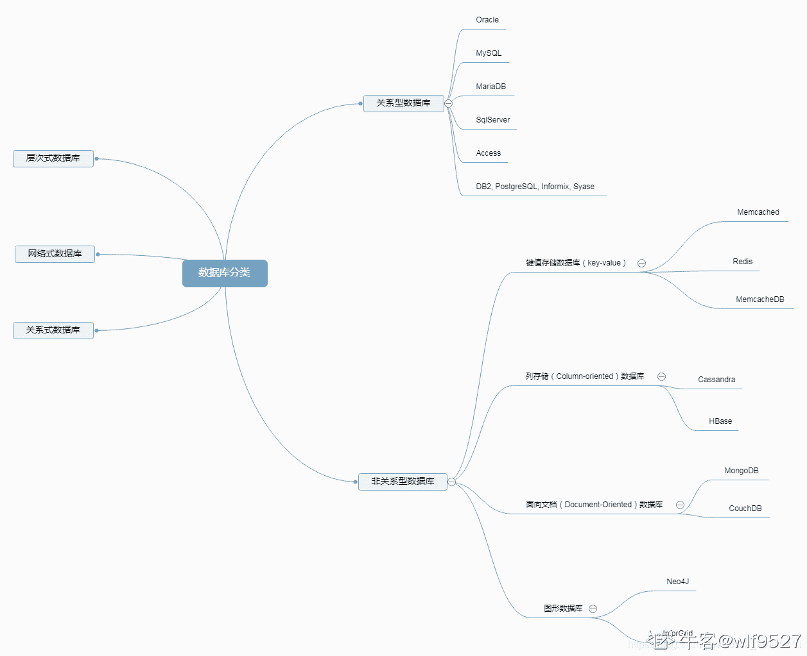
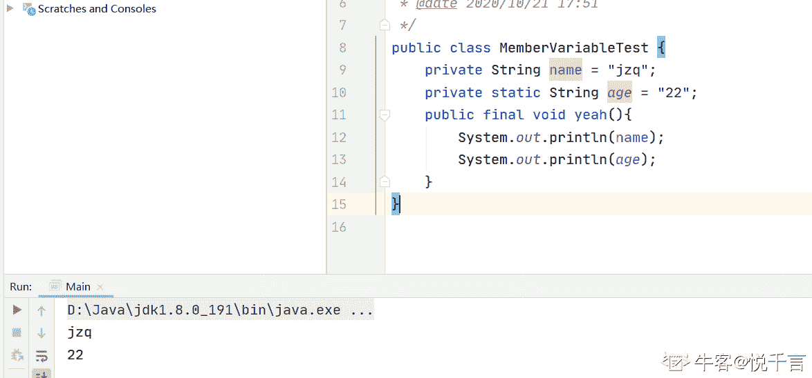
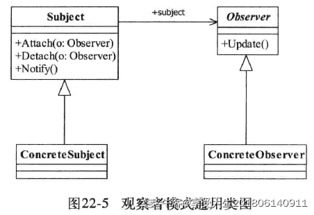

# 用友 2017 秋招笔试题（五）

## 1

下列属于关系型数据库的是（    ）

正确答案: A B E   你的答案: 空 (错误)

```cpp
Oracle
```

```cpp
MySql
```

```cpp
IMS
```

```cpp
MongoDB
```

```cpp
SQLServer
```

```cpp
BerkeyDB
```

本题知识点

Java 工程师 C++工程师 安卓工程师 iOS 工程师 运维工程师 前端工程师 算法工程师 测试工程师 用友 数据库 2017

讨论

[wlf9527](https://www.nowcoder.com/profile/757534157)



发表于 2021-03-28 11:24:52

* * *

[那年明月在](https://www.nowcoder.com/profile/3401023)

IMS 数据库是[IBM](https://bkso.baidu.com/item/IBM/9190)公司开发的两种数据库类型之一。这两种数据库类型，一种是关系数据库，典型代表产品：[DB2](https://bkso.baidu.com/item/DB2/7034285)；另一种则是[层次数据库](https://bkso.baidu.com/item/%E5%B1%82%E6%AC%A1%E6%95%B0%E6%8D%AE%E5%BA%93/10915947)，代表产品：IMS 层次数据库。IMS 是最早的大型[数据库管理系统](https://bkso.baidu.com/item/%E6%95%B0%E6%8D%AE%E5%BA%93%E7%AE%A1%E7%90%86%E7%B3%BB%E7%BB%9F)，其数据库模式是多个物理数据库记录型(PDBR)的集合。每个 PDBR 对应[层次数据模型](https://bkso.baidu.com/item/%E5%B1%82%E6%AC%A1%E6%95%B0%E6%8D%AE%E6%A8%A1%E5%9E%8B/1232420)的一个层次模式，用一个 DBD 定义。各个用户所需数据的[逻辑结构](https://bkso.baidu.com/item/%E9%80%BB%E8%BE%91%E7%BB%93%E6%9E%84/9663235)称为[外模式](https://bkso.baidu.com/item/%E5%A4%96%E6%A8%A1%E5%BC%8F/3169013)，每个外模式是一组逻辑数据库记录型(LDBR)的集合。LDBR 是应用程序所需的局部逻辑结构。用户按照外模式操纵数据。为啥 C 不对？

发表于 2019-07-19 15:48:07

* * *

[学术废物](https://www.nowcoder.com/profile/6473476)

MongoDB 听过没用过 原来真不是关系型数据库

发表于 2022-03-17 09:52:55

* * *

## 2

下面程序的运行结果是：（    ）

```cpp
public static void main(String args[]) {

    Thread t = new Thread() {
           public void run() {
                pong();
           }
     };

    t.run();
    System.out.print("ping");
}

   static void pong() {
     System.out.print("pong");
    }

```

正确答案: B   你的答案: 空 (错误)

```cpp
pingpong
```

```cpp
pongping
```

```cpp
pingpong 和 pongping 都有可能
```

```cpp
都不输出
```

```cpp
pong
```

```cpp
ping
```

本题知识点

Java 工程师 安卓工程师 iOS 工程师 运维工程师 前端工程师 算法工程师 PHP 工程师 测试工程师 用友 Java C++工程师 2017

讨论

[惠鸿飞](https://www.nowcoder.com/profile/881469708)

t.run 是调用的 Thead 类中的 run()方法，t.start 才是执行线程，所以这题就是执行普通 run()方法，先输出 pong，在输出 ping。

发表于 2019-11-05 11:35:45

* * *

[1a23456789](https://www.nowcoder.com/profile/97920043)

并不是多线程竞争问题,就是正常执行,先执行 t.run();跑线程方法输出"pong",再执行打印语句"ping"
retrun "pongping"

发表于 2019-09-10 20:51:20

* * *

[牛客 995731343 号](https://www.nowcoder.com/profile/995731343)

t.run 直接执行代码，按顺序打印代码；t.start 是另起线程，与当前线程同时竞争 cpu 资源，结果存在不确定性

发表于 2020-03-04 12:36:04

* * *

## 3

下面有关 Java 的说法正确的是（    ）

正确答案: A C D F   你的答案: 空 (错误)

```cpp
一个类可以实现多个接口
```

```cpp
抽象类必须有抽象方法
```

```cpp
protected 成员在子类可见性可以修改
```

```cpp
通过 super 可以调用父类构造函数
```

```cpp
final 的成员方法实现中只能读取类的成员变量
```

```cpp
String 是不可修改的，且 java 运行环境中对 string 对象有一个对象池保存
```

本题知识点

Java 工程师 C++工程师 安卓工程师 iOS 工程师 运维工程师 前端工程师 算法工程师 测试工程师 用友 Java 2017

讨论

[IDEA2022.4.2](https://www.nowcoder.com/profile/181223548)

解释一下 c 选项，意思是父类中的 protected 方法子类在重写的时候访问权限可以修改，其实就是重写的要素之一，换了个说法而已

发表于 2019-09-15 17:58:18

* * *

[悦千言](https://www.nowcoder.com/profile/320259883)

解释一下后两个，final 的成员方法除了能读取类的成员变量，还能读取类变量。（之前混淆了，给大家带来混乱，抱歉）
String 不可以修改，StringBuffer 和 StringBuilder 可以修改，String 只能改变指引，如果字符串常量池中没有正需要的串，就创建一 个新的字符串，然后让 String 对象指向它。

编辑于 2020-10-21 18:05:28

* * *

[那天 ws](https://www.nowcoder.com/profile/988744)

```cpp
    抽象类能继承一个普通类（或抽象类），实现多个接口。
    抽象类和普通类相比只是不能被实例化，只能作为子类的超类。
    抽象类是用来捕捉子类的通用特性的，被用来创建继承层级里子类的模板。
    可以有默认的方法实现。
    抽象类可以有构造方法。
    可以有 main 方法。
    不必须有抽象方法，但是包含抽象方法的类一定是抽象类。

    ===接口===
    接口能实现多个其他接口。
    接口是抽象方法的集合，一个类实现了某个接口就必须实现抽象方法。
    接口抽象方法默认修饰符是 public（可以不写），不能使用其他修饰符。
    java 8 中接口可以包含具体的方法实现，方法实现必须 default 修饰。
```

发表于 2019-10-17 17:33:55

* * *

## 4

下列 HTTP 错误代码描述正确的是：(    )

正确答案: A C F   你的答案: 空 (错误)

```cpp
502 - 网关错误
```

```cpp
403 - 服务不可用
```

```cpp
404 - 无法找到文件
```

```cpp
500 - 请求无效
```

```cpp
200 – 内部错误
```

```cpp
2xx – 都是成功的 http 请求和服务
```

本题知识点

Java 工程师 C++工程师 安卓工程师 iOS 工程师 运维工程师 前端工程师 算法工程师 测试工程师 用友 网络基础 2017

讨论

[五毒魔尊](https://www.nowcoder.com/profile/135557472)

| 100 | Continue | 继续。[客户端](http://www.dreamdu.com/webbuild/client_vs_server/)应继续其请求 |
| 101 | Switching Protocols | 切换协议。服务器根据客户端的请求切换协议。只能切换到更高级的协议，例如，切换到 HTTP 的新版本协议 |
|   |
| 200 | OK | 请求成功。一般用于 GET 与 POST 请求 |
| 201 | Created | 已创建。成功请求并创建了新的资源 |
| 202 | Accepted | 已接受。已经接受请求，但未处理完成 |
| 203 | Non-Authoritative Information | 非授权信息。请求成功。但返回的 meta 信息不在原始的服务器，而是一个副本 |
| 204 | No Content | 无内容。服务器成功处理，但未返回内容。在未更新网页的情况下，可确保浏览器继续显示当前文档 |
| 205 | Reset Content | 重置内容。服务器处理成功，用户终端（例如：浏览器）应重置文档视图。可通过此返回码清除浏览器的表单域 |
| 206 | Partial Content | 部分内容。服务器成功处理了部分 GET 请求 |
|   |
| 300 | Multiple Choices | 多种选择。请求的资源可包括多个位置，相应可返回一个资源特征与地址的列表用于用户终端（例如：浏览器）选择 |
| 301 | Moved Permanently | 永久移动。请求的资源已被永久的移动到新 URI，返回信息会包括新的 URI，浏览器会自动定向到新 URI。今后任何新的请求都应使用新的 URI 代替 |
| 302 | Found | 临时移动。与 301 类似。但资源只是临时被移动。客户端应继续使用原有 URI |
| 303 | See Other | 查看其它地址。与 301 类似。使用 GET 和 POST 请求查看 |
| 304 | Not Modified | 未修改。所请求的资源未修改，服务器返回此状态码时，不会返回任何资源。客户端通常会缓存访问过的资源，通过提供一个头信息指出客户端希望只返回在指定日期之后修改的资源 |
| 305 | Use Proxy | 使用***。所请求的资源必须通过***访问 |
| 306 | Unused | 已经被废弃的 HTTP 状态码 |
| 307 | Temporary Redirect | 临时重定向。与 302 类似。使用 GET 请求重定向 |
|   |
| 400 | Bad Request | 客户端请求的语法错误，服务器无法理解 |
| 401 | Unauthorized | 请求要求用户的身份认证 |
| 402 | Payment Required | 保留，将来使用 |
| 403 | Forbidden | 服务器理解请求客户端的请求，但是拒绝执行此请求 |
| 404 | Not Found | 服务器无法根据客户端的请求找到资源（网页）。通过此代码，网站设计人员可设置"您所请求的资源无法找到"的个性页面 |
| 405 | Method Not Allowed | 客户端请求中的方法被禁止 |
| 406 | Not Acceptable | 服务器无法根据客户端请求的内容特性完成请求 |
| 407 | Proxy Authentication Required | 请求要求***的身份认证，与 401 类似，但请求者应当使用***进行授权 |
| 408 | Request Time-out | 服务器等待客户端发送的请求时间过长，超时 |
| 409 | Conflict | 服务器完成客户端的 PUT 请求是可能返回此代码，服务器处理请求时发生了冲突 |
| 410 | Gone | 客户端请求的资源已经不存在。410 不同于 404，如果资源以前有现在被永久删除了可使用 410 代码，网站设计人员可通过 301 代码指定资源的新位置 |
| 411 | Length Required | 服务器无法处理客户端发送的不带 Content-Length 的请求信息 |
| 412 | Precondition Failed | 客户端请求信息的先决条件错误 |
| 413 | Request Entity Too Large | 由于请求的实体过大，服务器无法处理，因此拒绝请求。为防止客户端的连续请求，服务器可能会关闭连接。如果只是服务器暂时无法处理，则会包含一个 Retry-After 的响应信息 |
| 414 | Request-URI Too Large | 请求的 URI 过长（URI 通常为网址），服务器无法处理 |
| 415 | Unsupported Media Type | 服务器无法处理请求附带的媒体格式 |
| 416 | Requested range not satisfiable | 客户端请求的范围无效 |
| 417 | Expectation Failed | 服务器无法满足 Expect 的请求头信息 |
|   |
| 500 | Internal Server Error | 服务器内部错误，无法完成请求 |
| 501 | Not Implemented | 服务器不支持请求的功能，无法完成请求 |
| 502 | Bad Gateway | 作为网关或者***工作的服务器尝试执行请求时，从远程服务器接收到了一个无效的响应 |
| 503 | Service Unavailable | 由于超载或系统维护，服务器暂时的无法处理客户端的请求。延时的长度可包含在服务器的 Retry-After 头信息中 |
| 504 | Gateway Time-out | 充当网关或***的服务器，未及时从远端服务器获取请求 |
| 505 | HTTP Version not supported | 服务器不支持请求的 HTTP 协议的版本，无法完成处理 |

发表于 2019-06-13 14:23:08

* * *

[好超超爱佳丽](https://www.nowcoder.com/profile/529755027)

这些错误码一定要记住吗，用到查一下不可吗

发表于 2020-04-20 09:21:43

* * *

[IFindaJob](https://www.nowcoder.com/profile/124375258)

100 Continue 继续。[客户端](http://www.dreamdu.com/webbuild/client_vs_server/)应继续其请求

101 Switching Protocols 切换协议。服务器根据客户端的请求切换协议。只能切换到更高级的协议，例如，切换到 HTTP 的新版本协议

200 OK 请求成功。一般用于 GET 与 POST 请求

201 Created 已创建。成功请求并创建了新的资源

202 Accepted 已接受。已经接受请求，但未处理完成

203 Non-Authoritative Information 非授权信息。请求成功。但返回的 meta 信息不在原始的服务器，而是一个副本

204 No Content 无内容。服务器成功处理，但未返回内容。在未更新网页的情况下，可确保浏览器继续显示当前文档

205 Reset Content 重置内容。服务器处理成功，用户终端（例如：浏览器）应重置文档视图。可通过此返回码清除浏览器的表单域

206 Partial Content 部分内容。服务器成功处理了部分 GET 请求

300 Multiple Choices 多种选择。请求的资源可包括多个位置，相应可返回一个资源特征与地址的列表用于用户终端（例如：浏览器）选择

301 Moved Permanently 永久移动。请求的资源已被永久的移动到新 URI，返回信息会包括新的 URI，浏览器会自动定向到新 URI。今后任何新的请求都应使用新的 URI 代替

302 Found 临时移动。与 301 类似。但资源只是临时被移动。客户端应继续使用原有 URI

303 See Other 查看其它地址。与 301 类似。使用 GET 和 POST 请求查看

304 Not Modified 未修改。所请求的资源未修改，服务器返回此状态码时，不会返回任何资源。客户端通常会缓存访问过的资源，通过提供一个头信息指出客户端希望只返回在指定日期之后修改的资源

305 Use Proxy 使用代理。所请求的资源必须通过代理访问

306 Unused 已经被废弃的 HTTP 状态码

307 Temporary Redirect 临时重定向。与 302 类似。使用 GET 请求重定向

400 Bad Request 客户端请求的语法错误，服务器无法理解

401 Unauthorized 请求要求用户的身份认证

402 Payment Required 保留，将来使用

403 Forbidden 服务器理解请求客户端的请求，但是拒绝执行此请求

404 Not Found 服务器无法根据客户端的请求找到资源（网页）。通过此代码，网站设计人员可设置"您所请求的资源无法找到"的个性页面

405 Method Not Allowed 客户端请求中的方法被禁止

406 Not Acceptable 服务器无法根据客户端请求的内容特性完成请求

407 Proxy Authentication Required 请求要求代理的身份认证，与 401 类似，但请求者应当使用代理进行授权

408 Request Time-out 服务器等待客户端发送的请求时间过长，超时

409 Conflict 服务器完成客户端的 PUT 请求时可能返回此代码，服务器处理请求时发生了冲突

410 Gone 客户端请求的资源已经不存在。410 不同于 404，如果资源以前有现在被永久删除了可使用 410 代码，网站设计人员可通过 301 代码指定资源的新位置

411 Length Required 服务器无法处理客户端发送的不带 Content-Length 的请求信息

412 Precondition Failed 客户端请求信息的先决条件错误

413 Request Entity Too Large 由于请求的实体过大，服务器无法处理，因此拒绝请求。为防止客户端的连续请求，服务器可能会关闭连接。如果只是服务器暂时无法处理，则会包含一个 Retry-After 的响应信息

414 Request-URI Too Large 请求的 URI 过长（URI 通常为网址），服务器无法处理

415 Unsupported Media Type 服务器无法处理请求附带的媒体格式

416 Requested range not satisfiable 客户端请求的范围无效

417 Expectation Failed 服务器无法满足 Expect 的请求头信息

500 Internal Server Error 服务器内部错误，无法完成请求

501 Not Implemented 服务器不支持请求的功能，无法完成请求

502 Bad Gateway 作为网关或者代理工作的服务器尝试执行请求时，从远程服务器接收到了一个无效的响应

503 Service Unavailable 由于超载或系统维护，服务器暂时的无法处理客户端的请求。延时的长度可包含在服务器的 Retry-After 头信息中

504 Gateway Time-out 充当网关或代理的服务器，未及时从远端服务器获取请求

505 HTTP Version not supported 服务器不支持请求的 HTTP 协议的版本，无法完成处理

发表于 2021-07-26 09:34:38

* * *

## 5

在 SQL 中语法规范中，having 子句的使用下面描述正确的是：（    ）

正确答案: A C   你的答案: 空 (错误)

```cpp
having 子句即可包含聚合函数作用的字段也可包括普通的标量字段
```

```cpp
使用 having 的同时不能使用 where 子句
```

```cpp
having 子句必须于 group by 子句同时使用，不能单独使用
```

```cpp
使用 having 子句的作用是限定分组条件
```

```cpp
Having 子句和 where 子句是等同的
```

```cpp
如果 select 语句中没有聚合函数的使用，就不能使用 having 子句
```

本题知识点

Java 工程师 C++工程师 安卓工程师 iOS 工程师 运维工程师 前端工程师 算法工程师 测试工程师 用友 数据库 SQL 2017

讨论

[八股取士](https://www.nowcoder.com/profile/3545178)

B。where 在分组前过滤，having 在分组后过滤，两者之间不冲突。D。group by 限定分组条件，即用按照那一列进行分组，相同列值被分为一组。E。参考 B 的解析。F。没有聚合函数的使用也可以用 having 过滤。

发表于 2019-09-04 15:29:59

* * *

[无限苦肉盖神](https://www.nowcoder.com/profile/152165957)

having 的作用是对分组查询的结果进行过滤

发表于 2020-03-26 08:13:10

* * *

[猪猪侠 380](https://www.nowcoder.com/profile/876521187)

当一条 sql 语句没有 group by 的话，整张表的数据会自成一组。

发表于 2020-03-23 18:03:58

* * *

## 6

关于 XML，下面哪些描述是错误的：(    )

正确答案: B   你的答案: 空 (错误)

```cpp
每个合格的 XML 都有唯一的根元素
```

```cpp
XML 和 Java,C/C++一样是门编程语言
```

```cpp
XML 的格式上是要求严格的，每个元素的开闭必须完整，不允许交叉开闭，如
```

```cpp
XML 常用于 WebService 中用来做数据交换的标准
```

```cpp
XML 中元素是大小写敏感的
```

```cpp
XML 中的数据可以通过 XPATH 检索查询
```

本题知识点

Java 工程师 C++工程师 安卓工程师 iOS 工程师 运维工程师 前端工程师 算法工程师 PHP 工程师 测试工程师 用友 2017

讨论

[帅的人正在学](https://www.nowcoder.com/profile/5375777)

XML 可扩展标记语言 用于标记电子文件使其具有结构性的标记语言

发表于 2019-07-21 16:18:59

* * *

## 7

以下对 TCP 和 UDP 描述正确的是: （    ）

正确答案: D F   你的答案: 空 (错误)

```cpp
TCP 不能提供数据传输的可靠性；
```

```cpp
UDP 能够保证数据传输的可靠性；
```

```cpp
TCP 数据传输效率高于 UDP；
```

```cpp
TCP 是面向连接的,UDP 不是面向连接的
```

```cpp
TCP 运行在 IP 层之上，UDP 不一定运行在 IP 层之上
```

```cpp
TCP 和 UDP 程序在同一机器上可以使用相同的端口
```

本题知识点

Java 工程师 C++工程师 安卓工程师 iOS 工程师 运维工程师 前端工程师 算法工程师 测试工程师 用友 网络基础 2017

讨论

[钟期既遇](https://www.nowcoder.com/profile/651790790)

答案：DF

A.TCP 是面向连接的，所以可以提供数据传输的可靠性

B.UDP 是面向无连接的，所以不可以提供数据传输的可靠性

C.TCP 报文的首部是 20 个字节，而 UDP 首部是 8 个字节，所以 UDP 的传输效率更高

D.TCP 是面向连接的，UDP 不是面向连接的

E.TCP 不一定运行在 IP 层之上，通用路由封装（GRE）定义了在任意一种网络层协议上封装任意一个其它网络层协议的协议

F.不同的协议可以使用相同的端口

编辑于 2020-06-26 09:24:31

* * *

[米 T](https://www.nowcoder.com/profile/786175082)

TCP 和 UDP 传输协议监听同一个端口后，接收数据互不影响，不冲突。因为数据接收时时根据五元组{传输协议，源 IP，目的 IP，源端口，目的端口}判断接受者的。参考链接：https://www.jianshu.com/p/df9e55e94f95

发表于 2019-07-08 08:08:52

* * *

[无用心ω_ω](https://www.nowcoder.com/profile/872657555)

TCP 报文的头部是 20 字节，UDP 头部是 8 字节，UDP 的传输效率更高

发表于 2020-04-07 10:28:37

* * *

## 8

下面关于 WEB 开发中，常见的技术和问题描述正确的是：(    )

正确答案: C   你的答案: 空 (错误)

```cpp
CSS selector 中，支持按照元素的 id 选择，元素的名称进行选择，元素的 class 属性进行选择，比如 “#div .red”就是选择 CSS class 属性中包括 red 的所有的 div 元素
```

```cpp
JSON 是一种以 JavaScript 语法表示的数据对象格式，比如描述一个学生，包括，其中，姓名，年龄就可以这样表达 {name:"John"， age: 18}
```

```cpp
HTML 页面中的第一个指令： 表明这是一个符合 HTML5 标准的页面
```

```cpp
不同的浏览器对 HTML 渲染的方式稍有差异，但是所有的主流浏览器都支持 JavaScript 语言，而且提供的 JavaScript 的编程环境都是一致的
```

```cpp
HTML 页面装载时，首先把整个 HTML 页面下载下来，再根据 HTML 中出现的顺序依次下载它引用的外部的 JavaScript 代码和图片资源，最后才执行页面中的 JavaScript 代码
```

```cpp
JavaScript 中的函数就是一个对象，每个函数对象都继承了 JavaScript 的 Function 类
```

本题知识点

Java 工程师 C++工程师 安卓工程师 iOS 工程师 运维工程师 前端工程师 算法工程师 PHP 工程师 测试工程师 用友 2017 HTML CSS

讨论

[安酱 xx](https://www.nowcoder.com/profile/889473221)

A。#div 是选择器。所以 a 的意思是选择 id 为 div 的元素中 class 为 red 的元素 B。json 的数据格式是属性名和属性值都要加引号。即{“属性名”：“属性值”} D。不同浏览器的编程环境不一样 E。js 下载后就会解析，然后阻塞接下来的下载。详细可以看这个，讲的很详细 http://blog.csdn.net/xifeijian/article/details/10813339 F。js 中的箭头函数没有继承 Function

编辑于 2021-04-06 20:24:32

* * *

[Jnim](https://www.nowcoder.com/profile/509820987)

A:

```cpp
CSS selector 中，支持按照元素的 id 选择，元素的名称进行选择，元素的 class 属性进行选择，比如 “div .red”就是选择 CSS class 属性中包括 red 的所有的 div 元素
```

B：json 是一种和语言无关的数据交换的格式，可以表示成数组、集合格式和对象格式， 

```cpp
{"name":"John"， "age": 18}
```

  C：编程环境不一致

发表于 2020-08-25 16:48:39

* * *

[麻麻哇](https://www.nowcoder.com/profile/871103037)

F 剪头函数

发表于 2020-11-09 14:30:07

* * *

## 9

下面关于 JavaWEB 的一些概念哪些是正确的：（    ）

正确答案: A C D E   你的答案: 空 (错误)

```cpp
每个 WEB 请求都可以被拦截，拦截方法是通过 ServletFilter，并进行适当的配置
```

```cpp
HttpServletResponse 的 sendRedirect 和 forward 都是从一个页面切换到另一个页面，它们设计的目标和意图是一致的
```

```cpp
所有保存在会话的数据都应该是实现 Serializable 接口的，这样中间件能够更友好的处理会话数据
```

```cpp
所有的 JSP 都是 Servlet, JSP 能完成的工作 Servlet 一定能够完成
```

```cpp
现代的 JavaWEB 应用已经对文件支持了，能够直接从 HttpServletRequest 的 getPart 等方法中访问上传得文件
```

```cpp
可以通过 ServletConfig 获取应用的所有配置信息
```

本题知识点

Java 工程师 C++工程师 安卓工程师 iOS 工程师 运维工程师 前端工程师 算法工程师 PHP 工程师 测试工程师 用友 2017

## 10

小堆是一种完全二叉树，其中每个树节点的值都小于或等于其子节点，堆通常编码成数组，以广度优先的方式，从左邻居到右邻居的遍历的方式，编码到数组中，例如：是一个小堆，编码为数组后为[1，2，3，4，5，6，7]，根据这一小堆定义，选出下面的是小堆的数组：

1

/   \

2     3

/  \  /  \4   5  6  7

正确答案: A D   你的答案: 空 (错误)

```cpp
[3 5 6 9 8 20 10 12 18 9]
```

```cpp
[312 10 18 9 9 20 5 6 8]
```

```cpp
[3 6 10 12 9 9 20 5 18 8]
```

```cpp
[3 5 9 6 8 18 10 9 20 12]
```

```cpp
[3 18 10 12 9 9 20 5 6 8]
```

```cpp
[3 5 9 6 18 20 10 12 8 9]
```

本题知识点

Java 工程师 C++工程师 安卓工程师 iOS 工程师 运维工程师 算法工程师 测试工程师 用友 堆 2017

讨论

[逍遥小生](https://www.nowcoder.com/profile/736240369)

这**是 69 还是 6  9 啊

发表于 2019-06-28 17:21:25

* * *

[Cherish20180921201825](https://www.nowcoder.com/profile/214936171)

你不知道 69 写在一起很不文雅吗🙄🙄

发表于 2019-09-12 14:58:26

* * *

[妈妈说如果昵称太长是会被](https://www.nowcoder.com/profile/8521332)

你们这些程序员是不可能 69 的哈哈哈哈哈哈哈哈哈

发表于 2019-11-09 16:35:13

* * *

## 11

30 个人围坐在一起轮流表演节目。他们按顺序从 1 到 3 依次不重复地报数，数到 3 的人出来表演节目，并且表演过的人不再参加报数，那么在仅剩一个没表演过节目的时候，共报数多少人数？

你的答案

本题知识点

Java 工程师 C++工程师 安卓工程师 iOS 工程师 运维工程师 前端工程师 算法工程师 PHP 工程师 测试工程师 用友 2017

讨论

[雪落╭ァ指間](https://www.nowcoder.com/profile/417334122)

方法一：一共 30 个人，1——3 报数报到 3 的出列，出列了 29 人，所以报数为 29*3=87 次方法二：根据题意,30 人报数 30 人次,其中有 10 人次报数为 3,则此 10 人出列,剩下 20 人；20 人报数 21 人次,其中有 7 人次报数为 3,则此 7 人出列,剩下 13 人；13 人报数 15 人次,其中有 5 人报数为 3,则此 5 人出列,剩下 8 人；8 人报数 9 人次,其中有 3 人报数为 3,则此 3 人出列,剩下 5 人；5 人报数 6 人次,其中有 2 人报数为 3,则此 2 人出列,剩下 3 人；3 人报数 3 人次,其中有 1 人次报数为 3,则此 1 人出列,剩下 2 人；2 人报数 3 人次,其中 1 人次报数为 3,则此人出列,剩下 1 人.在这个过程中一共报数：30+21+15+9+6+3+3=87 人次
第二轮报数第 19 和 20 人报的数是 1、2,必须把 3 也报完,才算第二轮结束,所以报 3 的这个人就是第二轮报数的第一个人.因此是 21 人报数,7 个人报 3.后面也以此类推,只要剩下的人不是 3 的倍数,要轮回到第一第二个人。

发表于 2019-06-20 10:19:52

* * *

## 12

一副扑克牌 54 张，现分成 3 等份每份 18 张，问大小王出现在同一份中的概率是多少?

你的答案

本题知识点

Java 工程师 C++工程师 安卓工程师 iOS 工程师 运维工程师 前端工程师 算法工程师 PHP 工程师 测试工程师 用友 2017

讨论

[雪落╭ァ指間](https://www.nowcoder.com/profile/417334122)

54 张扑克牌，分三组每组 18，小王一定在这 3 组里面。那么现在想要把大王和小王放在一组，54 张牌除去小王 53 张，大王就是其中 1/53 一组 18 张，除去小王还有 17 张，大王放在这 17 张任意位置就是 17*（1/53）=17/53

发表于 2019-06-20 09:59:43

* * *

## 13

设元素序列 a,b,c,d,e,f 经过初始为空的栈 S 后，得到出栈序列 cedfba,则栈 S 的最小容量为 _

你的答案

本题知识点

Java 工程师 C++工程师 安卓工程师 iOS 工程师 运维工程师 前端工程师 算法工程师 PHP 工程师 测试工程师 用友 2017

讨论

[踏上不归路](https://www.nowcoder.com/profile/220948689)

这个很简单，看最后随出来

发表于 2019-07-01 18:05:49

* * *

[没有感情的代码机器](https://www.nowcoder.com/profile/762035481)

4

发表于 2019-06-25 13:23:17

* * *

## 14

简述 SoftReference 、 WeakReference 和 PhantomReference 区别

你的答案

本题知识点

Java 工程师 C++工程师 安卓工程师 iOS 工程师 运维工程师 前端工程师 算法工程师 PHP 工程师 测试工程师 用友 2017

讨论

[没有感情的代码机器](https://www.nowcoder.com/profile/762035481)

答案呢

发表于 2019-06-25 13:23:48

* * *

## 15

介绍一下内联接,外联接区别？

你的答案

本题知识点

Java 工程师 C++工程师 安卓工程师 iOS 工程师 运维工程师 前端工程师 算法工程师 PHP 工程师 测试工程师 用友 2017

## 16

下面这段代码的输出结果是什么。

```cpp
class HelloA {

    public HelloA() {
        System.out.println("HelloA");
    }

    { System.out.println("I'm A class"); }

    static { System.out.println("static A"); }

}

public class HelloB extends HelloA {
    public HelloB() {
        System.out.println("HelloB");
    }

    { System.out.println("I'm B class"); }

    static { System.out.println("static B"); }

    public static void main(String[] args) { 
 new HelloB(); 
 }
}
```

你的答案

本题知识点

Java 工程师 C++工程师 安卓工程师 iOS 工程师 运维工程师 前端工程师 算法工程师 PHP 工程师 测试工程师 用友 2017

讨论

[ktoking](https://www.nowcoder.com/profile/561628806)

public class ExA {      static {          System.out.println("父类--静态代码块");      }      public ExA() {          System.out.println("父类--[构造函数](https://www.baidu.com/s?wd=%E6%9E%84%E9%80%A0%E5%87%BD%E6%95%B0&tn=44039180_cpr&fenlei=mv6quAkxTZn0IZRqIHckPjm4nH00T1dBuAmdPAFWuhDdPH61nHnd0ZwV5Hcvrjm3rH6sPfKWUMw85HfYnjn4nH6sgvPsT6KdThsqpZwYTjCEQLGCpyw9Uz4Bmy-bIi4WUvYETgN-TLwGUv3EPjRYrjDzP1fdPHDdrjRYnW6d)");      }      {          System.out.println("父类--非静态代码块");      }      public static void main(String[] args) {          new ExB();      }  }  class ExB extends ExA {      static {          System.out.println("子类--静态代码块");      }      {          System.out.println("子类--非静态代码块");      }      public ExB() {          System.out.println("子类--[构造函数](https://www.baidu.com/s?wd=%E6%9E%84%E9%80%A0%E5%87%BD%E6%95%B0&tn=44039180_cpr&fenlei=mv6quAkxTZn0IZRqIHckPjm4nH00T1dBuAmdPAFWuhDdPH61nHnd0ZwV5Hcvrjm3rH6sPfKWUMw85HfYnjn4nH6sgvPsT6KdThsqpZwYTjCEQLGCpyw9Uz4Bmy-bIi4WUvYETgN-TLwGUv3EPjRYrjDzP1fdPHDdrjRYnW6d)");      }  }  执行结果 ===== 父类--静态代码块 子类--静态代码块 父类--非静态代码块 父类--构造函数 子类--非静态代码块 子类--构造函数

发表于 2020-04-20 21:58:23

* * *

[牛客 789607974 号](https://www.nowcoder.com/profile/789607974)

static A
static B
I'm A class
HelloA
I'm B class
HelloB

发表于 2019-07-09 16:18:07

* * *

## 17

已知一颗二叉树，如果先序遍历的节点顺序是：ADCEFGHB，中序遍历是：CDFEGHAB，则后续遍历序列的结果为 _________________

你的答案

本题知识点

Java 工程师 C++工程师 安卓工程师 iOS 工程师 运维工程师 前端工程师 算法工程师 PHP 工程师 测试工程师 用友 2017

讨论

[abserver](https://www.nowcoder.com/profile/252944924)

参考答案后序序列无误，所画的二叉树有误，对其进行中序遍历不能得到题中所给条件。正确画法如下：                    A
                   /  \
                 D    B
                /  \
             C     E
                    /  \
                  F    G
                           \                             H

发表于 2019-07-11 10:46:52

* * *

[ajune](https://www.nowcoder.com/profile/415709869)

根据先序遍历结果，可以推出 A 为根节点，B 为左子树的第一个节点，根据中序遍历结果推出以 A 为父节点的右子树只有一个节点 B。再次向下推，先序中的 C 应为 D 的左子节点。接着看 E 和 F，在先序和中序中 E 和 F 的先后顺序不同，所以可以推出 F 为 E 的左子节点，再看 G 和 H，由于先序中序结果中顺序一样，则 H 为 G 的右子节点。 个人总结，如果先序中序结果中挨着的两个节点顺序一样，那么后一个结点是前一个节点的右子节点。否则先序结果中后一个结点是前一个节点的左子节点。

发表于 2019-06-02 19:00:14

* * *

## 18

数组 A[0..5,0..6]的每个元素占五个字节，将其按列优先次序存储在起始地址为 1000 的内存单元中，则元素 A[5，5]的地址是：

你的答案

本题知识点

Java 工程师 C++工程师 安卓工程师 iOS 工程师 运维工程师 前端工程师 算法工程师 PHP 工程师 测试工程师 用友 2017

讨论

[烟雨青衫客](https://www.nowcoder.com/profile/701098688)

不是 1000+（5*7+5）*5 = 1200 咩

发表于 2019-08-11 15:09:43

* * *

## 19

cookie 和 session 的区别

你的答案

本题知识点

Java 工程师 C++工程师 安卓工程师 iOS 工程师 运维工程师 前端工程师 算法工程师 PHP 工程师 测试工程师 用友 2017

## 20

描述一下观察者模式的意图和使用方法，并用 UML 图描述一下这种设计模式

你的答案

本题知识点

Java 工程师 C++工程师 安卓工程师 iOS 工程师 运维工程师 前端工程师 算法工程师 PHP 工程师 测试工程师 用友 2017

讨论

[牛客 688694058 号](https://www.nowcoder.com/profile/688694058)

定义一个一对多的依赖关系，每当一个类发生改变时，其他类接到通知并发送改变。就是要在具体类中引用多个有更新方法的观察者，当具体类改变时，依次在类中调用他们的更新方法

发表于 2021-07-27 11:24:28

* * *

[享受人生 201806140911863](https://www.nowcoder.com/profile/427252116)



发表于 2020-07-27 09:49:55

* * *

## 21

实现一个二叉树，二叉树节点保存一个整数：

```cpp
class Node {
public Node left;
public Node right;
public int data;
Node(int newData) {
left = null;
right = null;
data = newData;
}
}
```

写出二叉树的先序遍历（先根，再左，再右），注意不允许用递归

```cpp
void preorder(Node node);
```

你的答案

本题知识点

Java 工程师 C++工程师 安卓工程师 iOS 工程师 运维工程师 前端工程师 算法工程师 PHP 工程师 测试工程师 用友 2017

## 22

输入两个 ASCII 码字符串，从第一个字符串中删除第二个字符串中出现的所有字符。并分析算法的时间复杂度。例如： 输入"abcdea" 与 "ac"，则应该输出"bde"。

你的答案

本题知识点

Java 工程师 C++工程师 安卓工程师 iOS 工程师 运维工程师 前端工程师 算法工程师 PHP 工程师 测试工程师 用友 2017

讨论

[烟雨青衫客](https://www.nowcoder.com/profile/701098688)

```cpp
	public static String deletePattern(String a, String b) {
		if (a==null || b==null) {
			return a;
		}
		char[] bs = b.toCharArray();
		StringBuilder as = new StringBuilder();
		for (int j = 0; j < bs.length; j++) {
			for (int i = 0; i < a.length(); i++) {
				if (a.charAt(i)!=bs[j]) {
					as.append(a.charAt(i));
				}
			}
			a = as.toString();
			as.setLength(0);
//			as.delete(0, as.length());  两种清空方法
		}
		return a;
	}
```

发表于 2019-08-11 19:29:04

* * *

## 23

两个升序整数数组 A 和 B，A 的长度为 m，B 的长度为 n。将数组 B 合并到数组 A 中，得到唯一的升序排序数组（假设 A 数组的长度足够长），并分析算法的时间复杂度和空间复杂度。

你的答案

本题知识点

Java 工程师 C++工程师 安卓工程师 iOS 工程师 运维工程师 前端工程师 算法工程师 PHP 工程师 测试工程师 用友 2017

## 24

在数据库执行下面的语句，查询的数据是否一致?如果不一致,改写一下保证一致.

```cpp
create unique index i_PK_INVBASDOC on bd_invbasdoc(PK_INVBASDOC);
select pk_invbasdoc from bd_invbasdoc where rownum<20001 and  1 = 1 and ( 1 = 1 ) order by PK_INVBASDOC asc
drop index i_PK_INVBASDOC;
select pk_invbasdoc from bd_invbasdoc where rownum<20001 and  1 = 1 and ( 1 = 1 ) order by PK_INVBASDOC asc
```

对 oracle 不熟悉的同学：rownum 是一个伪列，它取得第一条记录则 rownum 值为 1，第二条为 2，一次类推，不是真实的数据库列

你的答案

本题知识点

Java 工程师 C++工程师 安卓工程师 iOS 工程师 运维工程师 前端工程师 算法工程师 PHP 工程师 测试工程师 用友 2017

## 25

将一个 String 转化为 int（atoi），String 转换 int，两个注意点，一是正负数的判断，二是注意 int 值的范围

你的答案

本题知识点

Java 工程师 C++工程师 安卓工程师 iOS 工程师 运维工程师 前端工程师 算法工程师 PHP 工程师 测试工程师 用友 2017