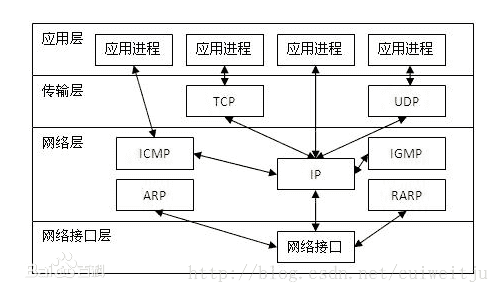
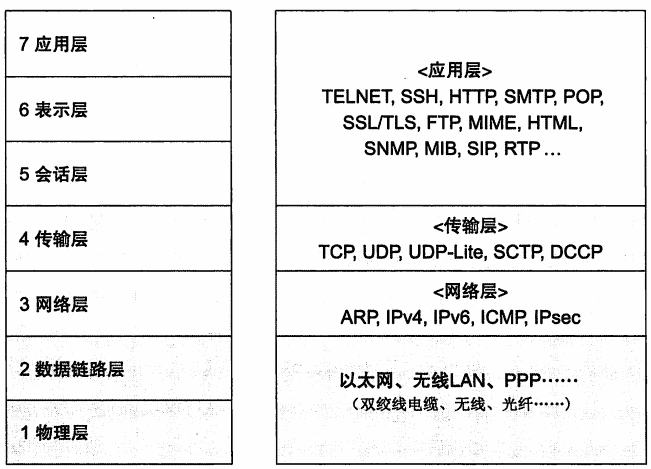
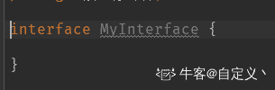
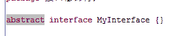
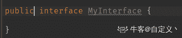
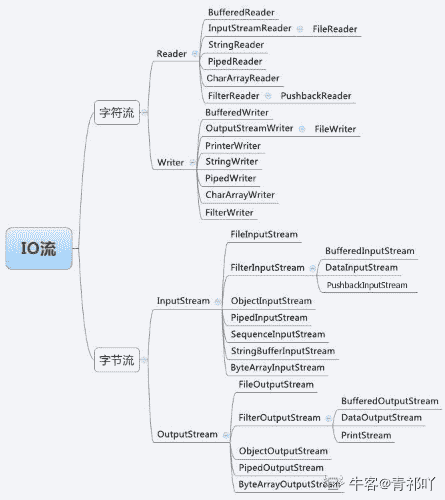
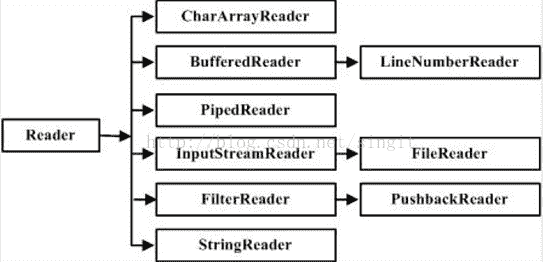
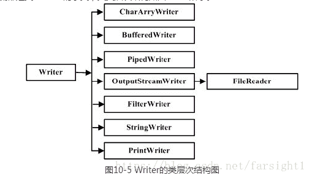

# 用友 2018 秋招 Java 笔试题（一）

## 1

TCP/IP 模型中，下列哪些协议属于网络层的协议（）

正确答案: A B C   你的答案: 空 (错误)

```cpp
IP 协议
```

```cpp
ARP 协议
```

```cpp
ICMP 协议
```

```cpp
RIP 协议
```

本题知识点

Java 工程师 用友 网络基础 2018

讨论

[szx3](https://www.nowcoder.com/profile/1439339)



发表于 2019-06-18 09:22:08

* * *

[咸鱼小哲](https://www.nowcoder.com/profile/8534200)

B 选项：在[TCP/IP](https://www.baidu.com/s?wd=TCP%2FIP&tn=SE_PcZhidaonwhc_ngpagmjz&rsv_dl=gh_pc_zhidao)模型中，ARP 协议属于 IP 层；在 OSI 模型中，ARP 协议属于链路层但是 D 选项不是应用层的嘛？？？《[计算机网络-自顶向下方法](http://www.so.com/s?q=%E8%AE%A1%E7%AE%97%E6%9C%BA%E7%BD%91%E7%BB%9C-%E8%87%AA%E9%A1%B6%E5%90%91%E4%B8%8B%E6%96%B9%E6%B3%95&ie=utf-8&src=se_lighten_quotes_f)》里的：rip 是被当作一个应用层进程（虽然它是一个能操作 UNIX 内核中的转发表的特殊进程)来实现的，所以它能在一个标准套接字上发送和接收报文，并且使用一个标准的运输层协议。RIP 是一个运行在 UDP 上的应用层协议。 

发表于 2019-08-21 14:20:45

* * *

[张云超](https://www.nowcoder.com/profile/3386783)

OSI（左）与 TCP／IP（右）对比

发表于 2019-05-30 14:46:15

* * *

## 2

下列说法正确的是（）

正确答案: A C D   你的答案: 空 (错误)

```cpp
ping 命令和 tracert 命令发送均是 ICMP 协议的数据包
```

```cpp
ping 是用来检查网络是否通畅或者网络连接速度的命令。当 ping 不通时，则说明网络一定不连通。
```

```cpp
跟踪路由（Tracert）是路由跟踪的实用程序，用于确定 IP 数据包访问目标所采取的路径
```

```cpp
死亡之 ping 主要是由于单个 IP 包的长度超过了 IP 协议规范所规定的包长度。
```

本题知识点

Java 工程师 用友 网络基础 2018

讨论

[米 T](https://www.nowcoder.com/profile/786175082)

选 A C D

*   ping 命令

*Ping 命令是用于测试网络连接量的程序。ing 发送一个 ICMP（Internet Control Messages Protocol）即因特网信报控制协议；回声请求消息给目的地并报告是否收到所希望的 ICMP 回声应答。它是用来检查网络是否通畅或者网络连接速度的命令。**但是当 PING 不通的时候，也可能是因为时延太长，不一定是网络不通。*

*   Tracert 命令

*Tracert（跟踪路由）是路由跟踪实用程序，用于确定 IP 数据包访问目标所采取的路径。Tracert 命令用 IP 生存时间 (TTL) 字段和 ICMP 错误消息来确定从一个主机到网络上其他主机的路由。*

*   *死亡之 pign* 

*死亡之 ping，这种攻击主要是由于单个包的长度超过了 IP 协议规范所规定的包长度。
就是是对方 IP 内存溢出，达到破坏对方系统的效果* 

编辑于 2019-06-27 19:07:21

* * *

[赵凸凸](https://www.nowcoder.com/profile/62578781)

Ping 不成功不代表网络不连通，也有可能是时延

发表于 2021-04-07 14:41:08

* * *

[vicyor](https://www.nowcoder.com/profile/2210832)

ping 指令检查网络是否连通,发送的是 ICMP 报文.tracert  ip     是求当前主机到目表 ip 的所有经过路由.

发表于 2020-02-19 15:09:36

* * *

## 3

程序中常采用变量表示数据，变量具有名、地址、值、作用域、生存期等属性。关于变量的叙述，正确的是（）

正确答案: A C D   你的答案: 空 (错误)

```cpp
根据作用域规则，在函数中定义的变量只能在函数中引用
```

```cpp
在函数中定义的变量，其生存期为整个程序执行期间
```

```cpp
在函数中定义的变量不能与其所在函数的形参同名
```

```cpp
在函数中定义的变量，其存储单元在内存的栈区
```

本题知识点

Java 工程师 用友 Java 2018 C 语言

讨论

[米 T](https://www.nowcoder.com/profile/786175082)

这里主要说明 D 为什么是对的首先说明栈内存和堆内存里存放的是什么

*   栈内存中存放函数中定义的一些基本类型的变量和对象的引用变量；
*   堆内存中存放 new 创建的对象和数组。

简单的来说，堆主要是用来存放对象的，栈主要是用来执行程序的这么做是因为

*   栈的存取速度快，栈数据可以共享，但是栈中的数据大小和生存期必须确定，缺乏灵活性中存放一些基本类型的对象和对象句柄
*   堆是操作系统分配给自己内存，由于从操作系统管理的内存分配，所以再分配和销毁时都需要占用时间，因此用堆的效率非常低，但是优点在于编译器不需要指导从堆里分配多少存储控件，也不需要知道存储的数据要再堆里停留多长事件，因此用堆保存数据时会得到更大的灵活性

参考链接：https://blog.csdn.net/wangbo1998/article/details/80379016

发表于 2019-06-27 19:41:24

* * *

[若水永远](https://www.nowcoder.com/profile/863155295)

C 选项

发表于 2020-02-20 21:23:03

* * *

[木桑苏](https://www.nowcoder.com/profile/416651563)

D 选项不太严谨，如果定义的是引用类型变量，且没有通过逃逸分析，则可能会被分配到堆中，逃逸分析是 jdk1.8 默认开启的

发表于 2020-08-06 09:27:28

* * *

## 4

以下对继承的描述错误的是（）

正确答案: A   你的答案: 空 (错误)

```cpp
Java 中的继承允许一个子类继承多个父类
```

```cpp
父类更具有通用性，子类更具体
```

```cpp
Java 中的继承存在着传递性
```

```cpp
当实例化子类时会调用父类中的构造方法
```

本题知识点

Java 工程师 用友 Java 2018

讨论

[Mr_ 黄](https://www.nowcoder.com/profile/763240689)

A 肯定是错误的，Java 不能多继承
实例化子类，会隐式的调用父类的无参构造，如果父类没有无参构造，则需要使用 super()显示的调用父类的其他构造方法。D 选项说的是递归调用，递归是自己调用自己，这并不属于递归调用，所以我认为 D 也是错误的，答案应该选择 AD
如果有错误，请指出。

发表于 2019-09-06 11:56:26

* * *

[IDEA2022.4.2](https://www.nowcoder.com/profile/181223548)

我来看看有多少人被不定项选择给迷惑了

发表于 2019-09-04 10:25:48

* * *

[初心未改 201808302105341](https://www.nowcoder.com/profile/569067866)

居然选了 BCD

发表于 2019-09-18 17:05:05

* * *

## 5

Java1.8 之后，Java 接口的修饰符可以为（）

正确答案: D   你的答案: 空 (错误)

```cpp
private
```

```cpp
protected
```

```cpp
final
```

```cpp
abstract
```

本题知识点

Java 工程师 用友 Java 2018

讨论

[自定义丶](https://www.nowcoder.com/profile/571493834)

1、应该是 **public default(不写) abstract** 可以修饰， 证明    1、写酱紫的源代码 ，使用反编译软件可以看到这个源代码编译之后的结果，我们知道，我们不写的修饰符，都会在编译阶段被加上，所以 default 和 abstract 可以修饰接口。    2、写酱紫的源代码， 也使用反编译软件进行反编译

发表于 2019-09-09 09:17:07

* * *

[你要做一个很优秀的媛](https://www.nowcoder.com/profile/783235959)

我不是很理解为啥选 d 接口不是一直用 abstract 修饰吗 只是全部都有这个关键字所以省略不写 为啥要 jdk1.8 之后

发表于 2020-01-18 22:59:12

* * *

[米 T](https://www.nowcoder.com/profile/786175082)

接口是一种特殊的抽象类，先说明抽象类中的抽象方法，再说明接口
抽象类中的抽象方法(其前有 abstract1 修饰)不能用 private、 static、 synchronized、na
tive 访回修饰符修饰。原因如下:
1\. private 抽象方法没有方法体,是用来被继承的,所以不能用 private 修饰;
2.staticstatic 修饰的方法可以通过类名来访间该方法(即该方法的方法体),抽象方法用 sttic 修饰没有意义;3\. synchronized 该关键字是为该方法加一个锁。而如果该关键字修饰的方法是 static 方法。则使用的锁就是 class 变量的锁。如果是修饰类方法。则用 this 变量锁。
但是抽象类不能实例化对象,因为该方法不是在该抽象类中实现的。是在其子类实现的。所以，锁应该归其子类所有。所以，抽象方法也就不能用 synchronized 关键字修饰了;
3\. nativenative 这个东西本身就和 abstract 冲突,他们都是方法的声明,只是一个把方法实现移交给子类,另一个是移交给本地操作系统。如果同时出现,就相当于即把实现移交给子类,又把实现移交给本地操作系统,那到底谁来实现具体方法呢终于说到了接口！
接口是一种特殊的抽象类,接口中的方法全部是抽象方法(但其前的 abstract 可以省略),所以抽象类中的抽象方法不能用的访间修饰符这里也不能用。同时额外说明一下 protect 关键词 4\. protect
protected 访同修饰符也不能使用,因为接口可以让所有的类去实现(非继承),不只是其子类,但是要用 public 去修饰。接口可以去继承一个已有的接口。
参考链接：http://www.360doc.com/content/16/0406/21/26211242_548419991.shtml

编辑于 2019-06-27 19:43:36

* * *

## 6

下列说法正确的是（）

正确答案: A B C   你的答案: 空 (错误)

```cpp
Cookie 是 Web 服务器发送给客户端的一小段信息，客户端请求时，可以读取该信息发送到服务器端
```

```cpp
关闭浏览器意味着会话 ID 丢失，但所有与原会话关联的会话数据仍保留在服务器上，直至会话过期
```

```cpp
在禁用 Cookie 时可以使用 URL 重写技术跟踪会话
```

```cpp
隐藏表单域将字段添加到 HTML 表单并在客户端浏览器中显示
```

本题知识点

Java 工程师 用友 2018

讨论

[米 T](https://www.nowcoder.com/profile/786175082)

A B C 这道题的考点是：客户端会话跟踪技术有三种典型的客户端会话跟踪解决方案：    1，Cookie；    2，URL 重写；    3，隐藏表单域；1.Cookie 将 Cookie 保存在客户机的磁盘上，称为永久 Cookie。以后客户端只要访问该网站，就会将这个 Cookie 再次发送到服务器上，前提是这个 Cookie 在有效期内。这样就实现了对客户的跟踪。2\. URL 重写用户在第一次访问 EncodeURLServlet 时，由于不知道用户是否禁用了 cookie，所以 response.encodeURL()方法内部会将 JSESSIONID 重写在 url 上，但是一旦第二次访问时，由于用户是带着 cookie 来的，所以 response.encodeURL()不会将 JSESSIONID 重写在 url 上。 而且，就算用户关闭了浏览器，也可以通过设置装载 JSESSIONID 的 cookie 的失效时间来控制浏览器关闭后，session 仍未失效。3\. 隐藏表单域将会话 ID 添加到 HTML 表单元素中提交到服务器,此表单元素并不在客户端显示 。 只能用于特定操作中。仅当每个页面都由表单提交而动态生成的时候，才可以使用隐藏表单域，用来存储相关会话信息。参考链接：https://www.cnblogs.com/linguoguo/p/5106618.htmlhttps://blog.csdn.net/qfs_v/article/details/2652119

发表于 2019-06-27 20:05:51

* * *

[张云超](https://www.nowcoder.com/profile/3386783)

隐藏域是用来收集或发送信息的不可见元素，对于网页的访问者来说，隐藏域是看不见的。当表单被提交时，隐藏域就会将信息用你设置时定义的名称和值发送到服务器上。

发表于 2019-05-30 14:59:39

* * *

[vicyor](https://www.nowcoder.com/profile/2210832)

浏览器客户端禁用 Cookie 时候，可以用 response.encodeURL 来完成 URL 重写.

发表于 2020-02-19 15:17:23

* * *

## 7

关于数据库的事务，以下错误的是（）

正确答案: B C   你的答案: 空 (错误)

```cpp
事务具有原子性， 事务是逻辑工作的基本单位
```

```cpp
事务具有一致性，事务会中的操作要么全做，要么全不做
```

```cpp
事务具有隔离性，所以不会引发死锁
```

```cpp
事务具有持续性，一旦提交永久的改变数据库的数据
```

本题知识点

Java 工程师 用友 数据库 2018

讨论

[米 T](https://www.nowcoder.com/profile/786175082)

B C 数据库事务的四大特性为：1\. 原子性原子性是指事务包含的所有操作要么全部成功，要么全部失败回滚事务是用户定义的一个数据库操作序列，这些操作要么全做，要么全不做，是一个不可分割的工作单位。2\. 一致性一致性是指事务必须使数据库从一个一致性状态变换到另一个一致性状态，也就是说一个事务执行之前和执行之后都必须处于一致性状态。3\. 隔离性当多个用户并发访问数据库时，比如操作同一张表时，数据库为每一个用户开启的事务，不能被其他事务的操作所干扰，多个并发事务之间要相互隔离。4\. 持续性持久性是指一个事务一旦被提交了，那么对数据库中的数据的改变就是永久性的，即便是在数据库系统遇到故障的情况下也不会丢失提交事务的操作。A 是对的；B 是错的，后半句是描述原子性的不是描述一致性的 C 是错的，隔离性是并发事务相互隔离，但是并不能防止死锁 D 是对的，持久性是指一个事务一旦被提交了，那么对数据库中的数据的改变就是永久性的

发表于 2019-06-27 20:13:10

* * *

[FearIsUnreal](https://www.nowcoder.com/profile/2825614)

```cpp
事务具有原子性， 事务是逻辑工作的基本单位，事务会中的操作要么全做，要么全不做

```

```cpp
事务具有一致性，事物的执行结果必须是使得数据库从一个一致性状态转变为另一个一致性状态。
```

```cpp
事务具有隔离性，一个事务的执行不能被其他事务干扰。
```

发表于 2019-06-05 15:33:02

* * *

[Pengber_](https://www.nowcoder.com/profile/968089956)

B 正确，数据库系统概述第五版王珊著中写道“事物中操作要么全做要么都不做是保持一致性的关键，与原子***息相关”。

发表于 2021-03-02 23:38:00

* * *

## 8

Java 创建对象的说法正确的有（）

正确答案: A B C D   你的答案: 空 (错误)

```cpp
用 new 语句创建对象，是最常见的创建对象的方法。
```

```cpp
运用反射手段,调用 java.lang.Class 或者 java.lang.reflect.Constructor 类的 newInstance()实例方法。
```

```cpp
调用对象的 clone()方法。
```

```cpp
运用反序列化手段，调用 java.io.ObjectInputStream 对象的 readObject()方法。
```

本题知识点

Java 工程师 用友 Java 2018

讨论

[灰灰 _ 两个人儿](https://www.nowcoder.com/profile/102728819)

Java 有 5 种方式来创建对象： 1、使用 new 关键字（最常用）： ObjectName obj = new ObjectName(); 2、使用反射的 Class 类的 newInstance()方法： ObjectName obj = ObjectName.class.newInstance(); 3、使用反射的 Constructor 类的 newInstance()方法： ObjectName obj = ObjectName.class.getConstructor.newInstance(); 4、使用对象克隆 clone()方法： ObjectName obj = obj.clone(); 5、使用反序列化（ObjectInputStream）的 readObject()方法： try (ObjectInputStream ois = new ObjectInputStream(new FileInputStream(FILE_NAME))) { ObjectName obj = ois.readObject(); }

编辑于 2019-07-22 14:51:25

* * *

[牛客 426949686 号](https://www.nowcoder.com/profile/426949686)

Java 有 5 种方式来创建对象：

1.  使用 new 关键字（最常用）： ObjectName obj = new ObjectName();
2.  使用反射的 Class 类的 newInstance()方法： ObjectName obj = ObjectName.class.newInstance(); 
3.  使用反射的 Constructor 类的 newInstance()方法： ObjectName obj = ObjectName.class.getConstructor.newInstance();
4.  使用对象克隆 clone()方法： ObjectName obj = obj.clone(); 
5.  使用反序列化（ObjectInputStream）的 readObject()方法： try (ObjectInputStream ois = new ObjectInputStream(new FileInputStream(FILE_NAME))) { ObjectName obj = ois.readObject(); } 

编辑于 2019-12-24 10:29:03

* * *

[郭乾亮](https://www.nowcoder.com/profile/391401632)

Java 创建对象的 5 种方式：

*   1.new
*   2.对象克隆 clone()方法
*   3.反射 Constructor 类的 newInstance()方法
*   4.反射的 Class 类的 newInstance()方法
*   5.反序列化的 readObject()方法

发表于 2021-07-16 20:15:47

* * *

## 9

下面哪个流类不属于面向字符的流（）

正确答案: B C   你的答案: 空 (错误)

```cpp
BufferedWriter
```

```cpp
FileInputStream
```

```cpp
ObjectInputStream
```

```cpp
InputStreamReader
```

本题知识点

Java 工程师 用友 Java 2018

讨论

[青祁吖](https://www.nowcoder.com/profile/643412545)



发表于 2020-08-05 21:43:12

* * *

[Majesty_x](https://www.nowcoder.com/profile/652334996)

面向字符的输入流类都是 Reader 的子类， 面向字符的输出流都是类 Writer 的子类

发表于 2019-06-03 12:47:16

* * *

[IDEA2022.4.2](https://www.nowcoder.com/profile/181223548)

既然是字符流，那么一般是 reader 和 writer 结尾，那么就选 BC 了

发表于 2019-09-04 10:56:19

* * *

## 10

关于多线程和多进程，下面描述正确的是（）：

正确答案: A C   你的答案: 空 (错误)

```cpp
多进程里，子进程可获得父进程的所有堆和栈的数据；而线程会与同进程的其他线程共享数据，拥有自己的栈空间。
```

```cpp
线程因为有自己的独立栈空间且共享数据，所有执行的开销相对较大，同时不利于资源管理和保护。
```

```cpp
线程的通信速度更快，切换更快，因为他们在同一地址空间内。
```

```cpp
一个线程可以属于多个进程。
```

本题知识点

Java 工程师 用友 Java 2018

讨论

[拚却](https://www.nowcoder.com/profile/682174704)

1、一个线程只能属于一个进程，而一个进程可以有多个线程，但至少有一个线程（通常说的主线程）。
2、资源分配给进程，同一进程的所有线程共享该进程的所有资源。
3、线程在执行过程中，需要协作同步。不同进程的线程间要利用消息通信的办法实现同步。
4、处理机分给线程，即真正在处理机上运行的是线程。
5、线程是指进程内的一个执行单元，也是进程内的可调度实体。

发表于 2019-07-29 20:20:04

* * *

[HW 柯可](https://www.nowcoder.com/profile/943949859)

**A.**子进程得到的是除了代码段是与父进程共享以外，其他所有的都是得到父进程的一个副本，子进程的所有资源都继承父进程，得到父进程资源的副本，子进程可获得父进程的所有堆和栈的数据，但二者并不共享地址空间。两个是单独的进程，继承了以后二者就没有什么关联了，子进程单独运行；进程的线程之间共享由进程获得的资源，但线程拥有属于自己的一小部分资源，就是栈空间，保存其运行状态和局部自动变量的。**B.**线程之间共享进程获得的数据资源，所以开销小，但不利于资源的管理和保护；而进程执行开销大，但是能够很好的进行资源管理和保护。**C.**线程的通信速度更快，切换更快，因为他们共享同一进程的地址空间。**D.**一个进程可以有多个线程，线程是进程的一个实体，是 CPU 调度的基本单位。

发表于 2020-02-03 13:13:40

* * *

[开水 KaisLeung](https://www.nowcoder.com/profile/7396825)

同一个进程下的多个线程之间可以共享数据，因此开销较小。

发表于 2019-09-16 08:59:16

* * *

## 11

请补齐下面的代码：

```cpp
public class T25 {
/*
*  生成给定数量的０到 1000 随机整数，并把生成的随机存入到一个 int 数组中  @param int count 要生成的随机数量
*  @return int[] 生成的随机数存储数组
*/
int[] createArray(int count){
int number[]=new int[count];
for(int i=0;i
{
int n=(int)(Math.random( )*1000);
number[i]=n;
System.out.println("number["+i+"]="+number[i]);
}
return number;
}
/**计算给定数组的奇数的比率
* @param int[] number 要计算的数组
* @return double 奇数的比率
*/
double calculateOddRate(int[] number)
{
int count=(①); //读取数组元素的个数，即要计算平均数的整数个数
double odd=0; //奇数计数
for(int n:number){
if( (②)){ //如果 n 是奇数，奇数计数加１
odd++;
}
}
return odd/count;
}
public static void main(String[] args)
T25 t=new T25( );
int[] number=t.createArray(100);
double oddRate=t.calculateOddRate(number);
System.out.println("奇数为:"+oddRate*100+"%");
System.out.println("偶数为:"+(1-oddRate)*100+"%");
}
}
```

<count>运行结果 number[0]=907 …..//此处省略 98 行 number[99]=598 奇数为:52.0%偶数为:48.0%请补全代码：①1②2</count>

你的答案 (错误)

12 参考答案 (1) number.length
(2) n%2==1

本题知识点

Java 工程师 用友 Java 2018

讨论

[0→1](https://www.nowcoder.com/profile/4349214)

用  n%2==1 来判断是不是奇数，当 n 为负数时会出错的，所以 应该用 n%2!=0，来判断是不是奇数最合理

发表于 2019-06-11 13:53:17

* * *

[希望不一样](https://www.nowcoder.com/profile/934000618)

有毒吧这题

发表于 2019-08-19 17:00:29

* * *

[bugkill](https://www.nowcoder.com/profile/261205)

n&1==1 判断奇数更快，更直观。答案竟然说错了

发表于 2019-06-18 16:18:39

* * *

## 12

TCP/IP 五层协议从上到下分别为：应用层、1、2、数据链路层和物理层。

你的答案 (错误)

12 参考答案 (1) 传输层
(2) 网络层

本题知识点

Java 工程师 用友 网络基础 2018

讨论

[魂一百](https://www.nowcoder.com/profile/671034181)

(1)传输层 (2)Internet 层

发表于 2019-09-08 17:46:11

* * *

[牛客 412768065 号](https://www.nowcoder.com/profile/412768065)

从上到下:应用层、运输层、网络层、数据链路层、物理

编辑于 2020-09-06 20:15:01

* * *

[向阳花 ff](https://www.nowcoder.com/profile/269595176)

TCP/IP 一般四层：应用层，运输层，网际层和网络接口层

发表于 2020-07-28 08:31:00

* * *

## 13

设某颗二叉树中有 360 个节点，则该二叉树的最小高度是 1。

你的答案 (错误)

1 参考答案 (1) 9

本题知识点

Java 工程师 用友 树 2018

讨论

[Keepyourself.](https://www.nowcoder.com/profile/5766980)

log2 （360） 向下取整 然后加一

发表于 2019-05-31 21:27:50

* * *

[花言不知梦](https://www.nowcoder.com/profile/4035965)

应该是 8 吧比如说，有三个结点，那么二叉树的最小高度是 1，对吧！..

发表于 2020-05-13 22:03:01

* * *

## 14

Java 异常的基类为 java.lang.1，java.lang.Exception 和 java.lang.2 继承于该类。

你的答案 (错误)

12 参考答案 (1) Throwable
(2) Error

本题知识点

Java 工程师 用友 Java 2018

讨论

[陆小影](https://www.nowcoder.com/profile/347214)

import java.lang.Exception;

import java.lang.Error;

public class Exception extends Throwable

public class Error extends Throwable

发表于 2022-02-12 09:35:55

* * *

[vicyor](https://www.nowcoder.com/profile/2210832)

Error 是指与 java 虚拟机有关的错误.Exception 是指一般的异常.

发表于 2020-02-19 15:29:08

* * *

[卿一哥](https://www.nowcoder.com/profile/687830543)

ThrowableError

发表于 2020-03-12 14:22:31

* * *

## 15

在 java 中 0.6332 的数据类型是 1。

你的答案 (错误)

1 参考答案 (1) double

本题知识点

Java 工程师 用友 Java 2018

讨论

[็殷子贤](https://www.nowcoder.com/profile/568829847)

默认为 double 类型，float 类型需要自己定义：0.6332f

发表于 2019-09-10 16:48:35

* * *

## 16

给定一个字符串的格式如下：(a,(b,1),(2,(c,a),5))，括号内的元素可以是任意的数字或字母，也可以是一个括号。请实现一个算法用于消除表达式内嵌套的括号，例如将上面的表达式变为(a,b,1,2,c,a,5)，如果表达式有误请报错。

你的答案

本题知识点

Java 工程师 用友 2018

讨论

[YL,](https://www.nowcoder.com/profile/826877749)

```cpp

```
public class Test03 { public static void main(String[] args) {
        Stack<Character> stack = new Stack<Character> ();
        String s = "(a,(b,1),(2,(c,a),5))";
        String resultStr = "("; for (int i = 0;i<s.length();i++){ if (s.charAt(i) == '('){
               stack.push('(');
           }else if (s.charAt(i) == ')'){ if (stack.isEmpty()){
                   System.out.println("Error!"); break;
               } if (stack.peek() == '(') {
                   stack.pop();
               }
           } else{
               resultStr += s.charAt(i);
           }
        } if (stack.size() == 0){
            System.out.println(resultStr+")");
        }else{
            System.out.println("Error");
        }
    }

}

```cpp

```

发表于 2019-07-18 19:54:46

* * *

[翔新](https://www.nowcoder.com/profile/56080868)

```cpp
public class Main{
    String str_input;
    public static void main(String[] args){
         Main m = new Main();
          m.input();
          m.cal();
    }
   public void input(){
        Scanner sc = new Scanner(System.in); str = sc.nextLine();
        str_input = sc.nextLine();
    }
    public void cal(){
        Stack<Character> stack = new Stack<>();
        String result = "(";
        char[] c = str_input.toCharArray();
        for(int i = 1; i < c.length - 1; i ++){
            if(c[i] == '('){
                stack.push(c[i]);
            }
            else if(c[i] == ')'){
                if(!stack.empty()){
                    stack.pop();
                }
                else{
                    throw new Exception;
                }
            }
            else{
                result += c[i];
            }
        }
        if(!stack.empty)){ throw new Exception; }
        else{
            result += ')';
            System.out.println(result);
        }
    }
}
```

发表于 2019-06-01 13:19:30

* * *

[繁荣](https://www.nowcoder.com/profile/642550949)

public static String RemoveBrackets(String s){
        Stack<Character> stack = new Stack<Character>();
        String resultStr = "(";
        for(int i = 0;i<s.length();i++){
            if(s.charAt(i)=='('){
                stack.push('(');    
            }else if(s.charAt(i)==')'){
                if(stack.empty()){
                    return "Error";
                }else if(stack.peek()!='('){
                    return "Error";
                }else{
                    stack.pop();
                }
            }else{
                resultStr +=s.charAt(i);
            }
        }
        if(!stack.empty()){
            return "Error";
        }
        return resultStr+")";
    }

发表于 2019-09-16 21:02:27

* * *

## 17

在一个 N 个整数数组里面，有多个奇数和偶数，设计一个排序算法，令所有的奇数都在左边。请完成 sort 的代码实现（

```cpp
void sort(int[]a)
{
…
}
```

例如： 当输入 a = {8,4,1,6,7,4,9,6,4}，a = {1,7,9,8,4,6,4,6,4}为一种满足条件的排序结果。

你的答案

本题知识点

Java 工程师 用友 2018

讨论

[undefined201810240812879](https://www.nowcoder.com/profile/866195483)

Deque <integer>dq = new ArrayDeque<>();
        for(int i=0;i<a.length;i++) {
            if(a[i]%2 == 1) {
                dq.addFirst(a[i]);
            }else {
                dq.addLast(a[i]);
            }
        }
        System.out.println("a="+dq.toString());

发表于 2019-06-10 10:38:46

* * *

[FearIsUnreal](https://www.nowcoder.com/profile/2825614)

```cpp

	**//(1）设置 begin， end 两个指针，begin 指向数组的偶数，end 指向数组的奇数；**

	**//(2)交换偶数和奇数，同时 begin++，end--；**

    public void sort(int a[])
    {
        int begin = 0, end = a.length - 1;
        while(begin < end)
        {
            if(a[begin] % 2 == 0 && a[end] % 2 == 1)
            {
                int temp = a[begin];
                a[begin] = a[end];
                a[end] = temp;
            }
            else if(a[begin] % 2 == 1)
            {
                begin++;
            }
            else if(a[end] % 2 == 0)
            {
                end--;
            }
        }
        for(int jj = 0; jj< a.length; jj++)
        {
            System.out.print(a[jj]);
        }
    }

```

发表于 2019-06-06 22:49:36

* * *

[张云超](https://www.nowcoder.com/profile/3386783)

```cpp
快慢指针同时从一侧出发，找到第一个偶数时，慢指针停下来，快指针寻找下一个奇数，找到就交换，然后快慢指针+1 继续。     
int[] sort(int[] a){
        int len = a.length;
        int pre = 0;
        int pos = 0;
        boolean flag = true;
        for(; pos<len; pos++) {
            if(flag && a[pos] % 2 == 0) {
                pre = pos;
                flag = false;
            }
            if((!flag) && a[pos] % 2 == 1) {
                int temp = a[pos];
                a[pos] = a[pre];
                a[pre] = temp;
                pre++;
                }
        }
        return a;     }

```

发表于 2019-05-30 14:30:43

* * *

## 18

输入一个整形数组，数组里有正数也有负数。数组中连续的一个或多个整数组成一个子数组，每个子数组都有一个和。求所有子数组的和的最大值。要求时间复杂度为 O(n)。例如输入的数组为 1, -2, 3, 10, -4, 7, 2, -5，那么该数组中连续的最大的子数组为 3, 10, -4, 7, 2，因此输出为该子数组的和 18。

你的答案

本题知识点

Java 工程师 用友 2018

讨论

[张云超](https://www.nowcoder.com/profile/3386783)

注意题目描述，有正数有负数，如果允许无非负数，那么需要单独考虑。原理：如果前几个数加和小于零，那么前面的数所做的全是无用功所以清零

```cpp
    int maxSubSum(int[] a) {
        int len = a.length;
        int sum = 0;
        int maxSum = 0;
       for(int i=0; i<len; i++) {
            sum += a[i];
            if(sum > 0){
                if(sum > maxSum) {                     maxSum = sum;                 }    
            }    
            else {
                sum = 0;
            }    
        }
        return maxSum;
    }

```

发表于 2019-05-30 15:05:29

* * *

[brilliantspark](https://www.nowcoder.com/profile/472160315)

public static void main(String[] args) {

        int[] s ={1, -2, 3, 10, -4, 7, 2, -5};
        int l = s.length;
        int[] sums = new int[l];
        sums[0] = s[0];
        int max = sums[0];
        for (int i = 1; i < l; i++) {
            sums[i] = Math.max(s[i], sums[i - 1] + s[i]);
            max = Math.max(max, sums[i]);
        }

        System.out.println(max);

    }

发表于 2019-08-13 10:29:57

* * *

[敢闯草](https://www.nowcoder.com/profile/689775385)

public int getmax(int[] array) {
        int sum=0;
        int summax=0;

            for(int i=0;i<array.length;i++) {
                 if(sum<=0) {
                     sum=array[i];
                 }
                 else {
                     sum=array[i]+sum;
                 }
                 if(sum>summax) {
                     summax=sum;
                 }

            }

        return summax;

    }

发表于 2019-07-20 11:00:51

* * *

## 19

Student(S#,Sname,Sage,Ssex) 学生表，

Course(C#,Cname,T#) 课程表，

SC(S#,C#,score) 成绩表，

Teacher(T#,Tname) 教师表 。

其中，S#代表学生号，C#代表课程号，T#代表教师号。

根据上述描述，请写出如下的查询语句：

1、查询姓“李”的老师的个数；

2、查询没学过“叶平”老师课的同学的学号、姓名；

3、查询学过“001”并且也学过编号“002”课程的同学的学号、姓名。

你的答案

本题知识点

Java 工程师 用友 2018

讨论

[午夜龙骑](https://www.nowcoder.com/profile/208608914)

1.先求出所有的 001 的 S#2.查出所有 002 的且符合 001 的数据 select Student.* from SC,Course,Student where SC.S#=Course.C# and Student.S#=SC.S# and Course.Cname='002' and S# in(select S# from SC,Course where SC.S#=Course.C# and Course.Cname='001')

发表于 2020-08-16 19:44:53

* * *

[xiaoxin1818](https://www.nowcoder.com/profile/726084435)

1.select  count(*) from Teacher where Tname like "李%"2.select  S#,Sname from Student where S#   NOT IN(select   S#    from   SC   where   C#    =   (select   C#   from Course  where  T#   =   (select   T#  from Teacher where Tname =  '叶平')))   3.select   S# ,  Sname  from   Student   where   S#   in   (select    S#    from   SC    where    C#    =  "001"   )

发表于 2019-09-22 17:18:06

* * *

[魔鬼筋肉云](https://www.nowcoder.com/profile/268020437)

1、select count(*) from Teacher where Tname  like '李%'2、select S#,Sname from Student where S# not in(select S# from SC where C# in(select C# from Course,Teacher where Tname='叶平' and Course.T#  =  Teacher.T#))3、select S#,Sname from Student where S# in(select S# from SC where C# = 001 or C# = 002 group by S#having count(S#)=2)

发表于 2019-09-16 15:41:26

* * *</integer>