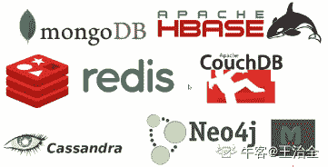
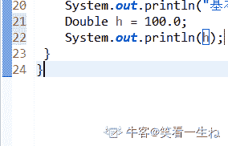

# 用友 2018 秋招 Java 笔试题（二）

## 1

下面哪些具体实现类可以用于存储键，值对，并且方法调用提供了基本的多线程安全支持：()

正确答案: A E   你的答案: 空 (错误)

```cpp
java.util.ConcurrentHashMap
```

```cpp
java.util.Map
```

```cpp
java.util.TreeMap
```

```cpp
java.util.SortMap
```

```cpp
java.util.Hashtable
```

```cpp
java.util.HashMap
```

本题知识点

Java 工程师 用友 Java 2018

讨论

[南风过熙](https://www.nowcoder.com/profile/827484648)

线程安全的 map:**HashTable,**SynchronizedMap,**ConcurrentHashMap******

发表于 2019-06-21 09:58:55

* * *

[IDEA2022.4.2](https://www.nowcoder.com/profile/181223548)

Hashtable 的方法都是 synchrnized 修饰的线程安全，ConcurrentHashMap 并发容器，JDK7 采用分段锁，JDK8 采用 CAS 算法，线程安全，建议使用，Connections 工具类提供了一个方法 synchrnizedMap 可以把 Map 同步，本质就是给每一个方法加上 synchrnized 关键字进行同步

发表于 2019-09-04 10:36:23

* * *

[雷布斯克茨威格](https://www.nowcoder.com/profile/627745755)

*   Hashtable 是线程安全的哈希表，它是通过 synchronized 来保证线程安全的；即，多线程通过同一个“对象的同步锁”来实现并发控制。Hashtable 在线程竞争激烈时，效率比较低（此时建议使用 ConcurrentHashMap）。当一个线程访问 Hashtable 的同步方法时，其它线程如果也在访问 Hashtable 的同步方法时，可能会进入阻塞状态。

*   Collections.synchronizedMap()使用了 synchronized 同步关键字来保证对 Map 的操作是线程安全的。

*   ConcurrentHashMap 是线程安全的哈希表。在 JDK1.7 中它是通过“锁分段”来保证线程安全的，本质上也是一个“可重入的互斥锁”（ReentrantLock）。多线程对同一个片段的访问，是互斥的；但是，对于不同片段的访问，却是可以同步进行的。在 JDK1.8 中是通过使用 CAS 原子更新、volatile 关键字、synchronized 可重入锁实现的。

发表于 2020-05-07 21:51:30

* * *

## 2

下面的 switch 语句中，x 可以是哪些类型的数据：()

```cpp
switch(x)
{
default:
System.out.println("Hello");
}
```

正确答案: B D   你的答案: 空 (错误)

```cpp
long
```

```cpp
char
```

```cpp
float
```

```cpp
byte
```

```cpp
double
```

```cpp
Object
```

本题知识点

Java 工程师 用友 Java 2018

讨论

[绿野仙踪*](https://www.nowcoder.com/profile/270891644)

以 java8 为准，switch 支持 10 种类型 基本类型：byte char short int 对于包装类 ：Byte,Short,Character,Integer String enum 2、实际只支持 int 类型 Java 实际只能支持 int 类型的 switch 语句，那其他的类型时如何支持的 a、基本类型 byte char short 原因：这些基本数字类型可自动向上转为 int, 实际还是用的 int。 b、基本类型包装类 Byte,Short,Character,Integer 原因：java 的自动拆箱机制 可看这些对象自动转为基本类型 c、String 类型 原因：实际 switch 比较的 string.hashCode 值，它是一个 int 类型 如何实现的，网上例子很多。此处不表。 d、enum 类型 原因 ：实际比较的是 enum 的 ordinal 值（表示枚举值的顺序），它也是一个 int 类型 所以也可以说 switch 语句只支持 int 类型

发表于 2020-02-13 12:43:36

* * *

[声心听聆](https://www.nowcoder.com/profile/51226879)

jdk1.7 之前 byte,short ,int ,charjdk1.7 之后加入 String 

发表于 2019-06-03 15:30:01

* * *

[有劲？](https://www.nowcoder.com/profile/953391971)

在 Java7 之前，switch 只能支持 byte、short、char、int 或者其对应的封装类以及 Enum 类型。在 Java7 中，也支持了 String 类型
String byte short int char Enum 类型

发表于 2019-06-12 22:41:55

* * *

## 3

如果进栈序列为 e1，e2，e3，e4，则可能的出栈序列是()注：一个元素进栈后可以马上出栈，不用等全部进栈

正确答案: B C   你的答案: 空 (错误)

```cpp
e3，e1，e4，e2
```

```cpp
e2，e4，e3，e1
```

```cpp
e2，e3，e4，e1
```

```cpp
任意顺序都有可能
```

本题知识点

Java 工程师 用友 栈 *Java 2018* *讨论

[烟雨先生](https://www.nowcoder.com/profile/706295765)

栈的规则：先进后出例如进栈序列为：1，2，3，4 全部进栈完成再出栈的序列则为：4，3，2，1 注：一个元素进栈后可以马上出栈，不用等全部进栈
例如：2 这个元素一进就想出了，后面的 3，4 正常进栈再出栈。那么出栈顺序就是：2，4，3，1  (1 是第一个进的，进的时候也没有立刻出去，所以被压在栈底，最后才能出去）例如：2 这个元素一进就想出了，后面的 3 一进也想立刻想出去了，后面的 4 跟着进栈那么出栈顺序就是：2，3，4，1  (2，3 都进了立刻出 所以这时 4 压着的是 1，所以出栈顺序是 4 在前面）

发表于 2020-02-06 20:19:35

* * *

[牛客 354778696 号](https://www.nowcoder.com/profile/354778696)

条件一.进栈顺序、e1、e2、e3、e4

条件二.1 个元素进栈后可以马上出栈。

注：栈的规则—先进后出

那么出栈顺序有以下情况：

栈里留 0 个元素出栈顺序为：

1234

栈里留 1 个元素出栈顺序为

2341

1342

1243

栈里留 2 个元素出栈顺序为

3421

2431

1432

栈里留 3 个元素出栈顺序为

4321

所以综上比较正确答案，如果所有可能都可以的话，那肯定不止这几种情况的哈，画了图手机纯手打，省略了重复的情况

发表于 2020-01-06 13:25:31

* * *

[哈哈 jay](https://www.nowcoder.com/profile/6683691)

e3 若先出栈说明 1、2 被压，那么 4 进栈后会先于 1、2 出栈

发表于 2019-11-01 17:08:32

* * *

## 4

下面那些是非关系型数据库()

正确答案: A C   你的答案: 空 (错误)

```cpp
Redis
```

```cpp
Mysql
```

```cpp
MongoDb
```

```cpp
SqlServer
```

本题知识点

Java 工程师 用友 数据库 2018

讨论

[王治全](https://www.nowcoder.com/profile/345829746)

一、关系型数据库


关系型数据库最典型的数据结构是表，由二维表及其之间的联系所组成的一个数据组织
优点：
1、易于维护：都是使用表结构，格式一致；
2、使用方便：SQL 语言通用，可用于复杂查询；
3、复杂操作：支持 SQL，可用于一个表以及多个表之间非常复杂的查询。
缺点：
1、读写性能比较差，尤其是海量数据的高效率读写；
2、固定的表结构，灵活度稍欠；
3、高并发读写需求，传统关系型数据库来说，硬盘 I/O 是一个很大的瓶颈。二、非关系型数据库



非关系型数据库严格上不是一种数据库，应该是一种数据结构化存储方法的集合，可以是文档或者键值对等。
优点：
1、格式灵活：存储数据的格式可以是 key,value 形式、文档形式、图片形式等等，文档形式、图片形式等等，使用灵活，应用场景广泛，而关系型数据库则只支持基础类型。
2、速度快：nosql 可以使用硬盘或者随机存储器作为载体，而关系型数据库只能使用硬盘；
3、高扩展性；
4、成本低：nosql 数据库部署简单，基本都是开源软件。

缺点：
1、不提供 sql 支持，学习和使用成本较高；
2、无事务处理；
3、数据结构相对复杂，复杂查询方面稍欠。

非关系型数据库的分类和比较：
1、文档型
2、key-value 型
3、列式数据库
4、图形数据库

发表于 2019-08-15 23:54:07

* * *

[Juventus-🐂](https://www.nowcoder.com/profile/79434593)

非关系型:mongoDB，redis

发表于 2022-01-28 14:37:40

* * *

[月灯 uuu](https://www.nowcoder.com/profile/395308697)

A C

发表于 2021-03-16 11:08:01

* * *

## 5

下面的 Java 赋值语句哪些是有错误的 （）

正确答案: B F   你的答案: 空 (错误)

```cpp
int i =1000;
```

```cpp
float f = 45.0;
```

```cpp
char s = ‘\u0639’;
```

```cpp
Object o = ‘f’;
```

```cpp
String s = "hello,world\0";
```

```cpp
Double d = 100;
```

本题知识点

Java 工程师 用友 Java 2018

讨论

[ifg](https://www.nowcoder.com/profile/804513030)

b：小数如果不加 f 后缀，默认是 double 类型。double 转成 float 向下转换，意味着精度丢失，所以要进行强制类型转换。c：是使用 unicode 表示的字符。d：'f' 字符会自动装箱成包装类，就可以向上转型成 Object 了。f：整数默认是 int 类型，int 类型不能转型为 Double，最多通过自动装箱变为 Integer 但是 Integer 与 Double 没有继承关系，也没法进行转型。

发表于 2019-09-25 16:18:53

* * *

[笑看一生ね](https://www.nowcoder.com/profile/907435578)

Double 是 java 定义的包装类，double 是 java 定义的数据类型，不同的数据类型不能自动装箱拆箱只有对应类型的数据类型和包装类才能自动装箱拆箱
例子：

发表于 2019-09-06 14:14:16

* * *

[水底银河](https://www.nowcoder.com/profile/535703605)

java 中默认声明的小数是 double 类型的，如 double d=4.0

如果声明： float x = 4.0 则会报错，需要如下写法：float x = 4.0f 或者 float x = (float)4.0

其中 4.0f 后面的 f 只是为了区别 double，并不代表任何数字上的意义     

发表于 2019-06-26 12:04:08

* * *

## 6

CAP 定律中的 CAP 指的是以下哪些特性    ( )

正确答案: A B C   你的答案: 空 (错误)

```cpp
一致性
```

```cpp
可用性
```

```cpp
分区容错性
```

```cpp
可重复性
```

本题知识点

Java 工程师 用友 2018

讨论

[有劲？](https://www.nowcoder.com/profile/953391971)

CAP 原则又称 CAP 定理，指的是在一个分布式系统中， Consistency（一致性）、 Availability（可用性）、Partition tolerance（分区容错性），三者不可得兼。

CAP 原则是 NOSQL 数据库的基石。Consistency（一致性）、 Availability（可用性）、Partition tolerance（分区容错性）。

分布式系统的 CAP 理论：理论首先把分布式系统中的三个特性进行了如下归纳：

*   一致性（C）：在分布式系统中的所有数据备份，在同一时刻是否同样的值。（等同于所有节点访问同一份最新的数据副本）
*   可用性（A）：在集群中一部分节点故障后，集群整体是否还能响应客户端的读写请求。（对数据更新具备高可用性）
*   分区容忍性（P）：以实际效果而言，分区相当于对通信的时限要求。系统如果不能在时限内达成数据一致性，就意味着发生了分区的情况，必须就当前操作在 C 和 A 之间做出选择。

发表于 2019-06-12 22:45:43

* * *

## 7

jdk1.8 版本之前的前提下，接口和抽象类描述正确的有（ ）

正确答案: B C   你的答案: 空 (错误)

```cpp
抽象类没有构造函数
```

```cpp
接口没有构造函数
```

```cpp
抽象类不允许多继承
```

```cpp
接口中的方法可以有方法体
```

本题知识点

Java 工程师 用友 Java 2018

讨论

[BingBingSama](https://www.nowcoder.com/profile/991430749)

题目说的很清楚了 1.8 以前的版本的前提下， 没那么接口中是不可以有方法体的。
一个赞喂出题人吃一口屎

发表于 2020-10-15 21:53:48

* * *

[王春阳 201906150959543](https://www.nowcoder.com/profile/451137698)

jdk1.8 后接口中用 static 或 default 修饰的方法可以有方法体

发表于 2019-06-15 10:32:15

* * *

[李浩 201904112341189](https://www.nowcoder.com/profile/546114021)

抽象类可以🈶️构造函数，只是不能实例化

发表于 2019-10-08 19:38:21

* * *

## 8

在 Java 中，关于 HashMap 类的描述，以下正确的是 ()

正确答案: A C D   你的答案: 空 (错误)

```cpp
HashMap 使用键/值得形式保存数据
```

```cpp
HashMap 能够保证其中元素的顺序
```

```cpp
HashMap 允许将 null 用作键
```

```cpp
HashMap 允许将 null 用作值
```

本题知识点

Java 工程师 用友 Java 2018

讨论

[白起丶](https://www.nowcoder.com/profile/815173790)

| Map 集合类  | key  | value  |
| HashMap  | 允许为 null  | 允许为 null  |
| TreeMap  | 不允许为 null  | 允许为 null  |
| ConcurrentMap  | 不允许为 null  | 不允许为 null  |
| HashTable  | 不允许为 null  | 不允许为 null  |

发表于 2020-06-11 16:06:52

* * *

[归墨](https://www.nowcoder.com/profile/74777823)

HashMap 不按插入顺序排序，按照哈希值排序。所以无序。但是不增删改键的情况下，输出是按照一定顺序不变的

发表于 2019-11-25 20:02:31

* * *

[牛客 943950868 号](https://www.nowcoder.com/profile/943950868)

这就是需要去看下源码了，了解的更详细

| Map 集合类  | key  | value  |
| HashMap  | 允许为 null  | 允许为 null  |
| TreeMap  | 不允许为 null  | 允许为 null  |
| ConcurrentMap  | 不允许为 null  | 不允许为 null  |
| HashTable  | 不允许为 null  | 不允许为 null |

发表于 2021-10-08 16:01:50

* * *

## 9

下面代码的运行结果为：（）

```cpp
import java.io.*;
import java.util.*;
public class foo{
    public static void main (String[] args){
        String s;
        System.out.println("s=" + s);
    }
}
```

正确答案: C   你的答案: 空 (错误)

```cpp
代码得到编译，并输出“s=”
```

```cpp
代码得到编译，并输出“s=null”
```

```cpp
由于 String s 没有初始化，代码不能编译通过
```

```cpp
代码得到编译，但捕获到 NullPointException 异常
```

本题知识点

Java 工程师 用友 Java 2018

讨论

[IDEA2022.4.2](https://www.nowcoder.com/profile/181223548)

局部变量可以先申明不用必须初始化，但使用到了一定要先初始化

发表于 2019-09-04 10:17:53

* * *

[灰灰 _ 两个人儿](https://www.nowcoder.com/profile/102728819)

局部变量，没有像成员变量那样类加载时会有初始化赋值，所以要使用局部变量时，一定要显式的给它赋值，也就是定义时就给它数值。

发表于 2019-07-22 16:02:03

* * *

[低调的我](https://www.nowcoder.com/profile/4546028)

局部变量需要显示初始化

发表于 2019-07-11 21:37:06

* * *

## 10

关于 equals 和 hashCode 描述正确的是    ()

正确答案: A B C   你的答案: 空 (错误)

```cpp
两个 obj，如果 equals()相等，hashCode()一定相等（符合代码规范的情况下）
```

```cpp
两个 obj，如果 hashCode()相等，equals()不一定相等
```

```cpp
两个不同的 obj， hashCode()可能相等
```

```cpp
其他都不对
```

本题知识点

Java 工程师 用友 Java 2018

讨论

[低调的我](https://www.nowcoder.com/profile/4546028)

“==”：作用是判断两个对象的地址是否相等，即，判断两个对象是不是同一个对象，如果是基本数据类型，则比较的是值是否相等。"equal"：作用是判断两个对象是否相等，但一般有两种使用情况              1.类没有覆盖 equals()方法,则相当于通过“==”比较              2.类覆盖 equals()方法，一般，我们都通过 equals()方法来比较两个对象的内容是否相等，相等则返回 true,如 String 地址比较是通过计算对象的哈希值来比较的，hashcode 属于 Object 的本地方法，对象相等（地址相等），hashcode 相等，对象不相等，hashcode()可能相等，哈希冲突

编辑于 2019-07-11 21:46:21

* * *

[JohnLinOne](https://www.nowcoder.com/profile/196082408)

hashCode()的存在是为了查找的快捷性,用于在散列存储结构中确定对象的存储地址如果两个对象 equals 相等,则 hashCode()也一定相等如果 equals 方法被重写,则 hashCode()也应该被重写
如果两个对象的 hashCode()相等, equals()方法不一定相等 equals 方法没有重写,比较的就是应用类型的变量所指向的对象的地址

发表于 2019-09-27 14:25:01

* * *

[IDEA2022.4.2](https://www.nowcoder.com/profile/181223548)

两个对象的 equals 比较为 true，那么他们的 HashCode 一定相同，反之，两个对象的 HashCode 相同不一满足 equals 比较为 true，解释一下为什么，这是因为 HashCode 采用的其实是一种杂凑算法，当然，这也是 Java 认为最有效的算法，既然是凑出来的那么就有一种情况就是两个不同的对象返回相同的 hashCode，并且这种算法越糟糕返回相同的概率越大

编辑于 2021-04-12 23:16:02

* * *

## 11

根据下面一段程序，判断 A 最匹配的类型是 1, B 最匹配的类型是 2。

```cpp
TreeMap<A,B> map = new TreeMap<A,B>( );
map.put(“S1”, 100); 
map.put(“S2”, 15);
int v = map.get(“S1”)
```

你的答案 (错误)

12 参考答案 (1) String
(2) Integer

本题知识点

Java 工程师 用友 Java 2018

讨论

[你的 offer 对我打了烊](https://www.nowcoder.com/profile/598309941)

看 put 方法里面的内容，可见 A 是字符串，B 是整数类型，然后泛型里面都是用的包装型，B 就是 Integer

发表于 2020-03-14 08:42:55

* * *

[王治全](https://www.nowcoder.com/profile/345829746)

由 intv = map.get(“S1”) 可知，将字符串转换成 Integer 类型，均使用包装类

发表于 2019-08-16 00:02:18

* * *

## 12

下面这段程序循环运行的次数是 1

```cpp
for (int i = 1; i >= 0; i = i + i) {
System.out.println(i);
}
```

你的答案 (错误)

1 参考答案 (1) 31

本题知识点

Java 工程师 用友 Java 2018

讨论

[低调的我](https://www.nowcoder.com/profile/4546028)

i=1= 2⁰       一次    i = 2¹i = 2 = 2¹     两次  i= 2²。。。。。i = 2²⁹       30 次    i=2³⁰I = 2³⁰       31 次   i= 2³¹ > 2³¹-1   越界  i < 0  结束

发表于 2019-07-11 21:54:05

* * *

[Java 后端练习生](https://www.nowcoder.com/profile/534037268)

在 java 中 int 类型占 4 字节即 32 位，在 2³² 中取出一半用于表示负数，所以最小值是-(2³²/2)， 即-2³¹； 并在表示正数的那一半中取出一位用于存储正负值，所以最大值是(2³²/2)-1, 即 2³¹-1

发表于 2021-04-19 09:25:53

* * *

[和歌忘忧](https://www.nowcoder.com/profile/679109747)

Int 最大 2³¹-1

发表于 2021-03-22 14:41:20

* * *

## 13

JSON 是一种非常流行的文本格式的数据编码方式，下面有一个 Java 类 Person：

```cpp
public class Person {
       private String name;
       private int age;
       private boolean married;

       public Person(String name, int age, boolean married) {
           this.name = name;
           this.age = age;
           this.married = married;
       }
       public String getName( ) {
           return name;
       }
       public void setName(String n) {
              this.name = n;
       }

       public void setAge(int a) {
          this.age = a;
       }

       public int getAge( ) {
              return age;
       }

       public void setMarried(boolean flag) {
           this.married = flag;
       }

       public isMarried( ) {
          return married;
       }
}

```

把下面这个对象 ps

Person[] ps = new Person[] {new Person(“tommy”, 16, false”)}

用 JSON 表式出来（JSON 种不用表示类型信息，只表示结构信息即可）:1。

你的答案 (错误)

1 参考答案 (1) [{“name”:”tommy”, “age”: 16, “married”: false}]

本题知识点

Java 工程师 用友 Java 2018

讨论

[我了个去哎](https://www.nowcoder.com/profile/2817866)

没注意到 是 Person[]  后面有个方括号,  代表的是数组,   而传入的参数只有一份, 所以这个数组中只有一个对象,   下标只有 0  所以  [{'name":"tommy","age":16,"married":false}]

发表于 2019-06-14 01:57:07

* * *

[声心听聆](https://www.nowcoder.com/profile/51226879)

个人理解：name 是键   tommy 是 String 值  age 是键   16 是 int 类型的值 married 是键  false 是 boolean 类型的值为啥 json 设计为键值对的形式？我的理解既然你存到 json 中数据，实际应用中的 json 类型是 Objecty 也就是可以使用 List<T>集合 json 的格式说了，这样设计的目的是为了从后端从数据库取值后往前端返回数据，在前端取 json 数据一般使用的是 ajax 通过键就可以取到值不一定对

发表于 2019-06-03 13:39:37

* * *

## 14

下面一段程序：

```cpp
public static char charAt(String s, int n,  int m) {        
    if (n == 1) return s.charAt(m);
    char first  = charAt(s, n / 2, m * 2);
    char second = charAt(s, n / 2, m * 2 + 1);
    System.out.print(first + "-" + second + "-");
    return first;
}   

```

执行语句 System.out.println (charAt("helloworld",5,1))的输出为 1

你的答案 (错误)

1 参考答案 (1) o-w-o-r-o-o-o

本题知识点

Java 工程师 用友 Java 2018

讨论

[声心听聆](https://www.nowcoder.com/profile/51226879)

public static char charAt(String s, int n,  int m) {            if(n == 1) return s.charAt(m);    char first  = charAt(s, n / 2, m * 2);**<1>**    char second = charAt(s, n / 2, m * 2+ 1);**<2>**    System.out.print(first + "-"+ second + "-");**<3>**    return first;}   System.out.println (charAt("helloworld",5,1))
<1>程序先运行到这里，char first = charAt(s,2,2);//因为返回值是 ocharAt(s,2,2)char first1 =charAt(s,1,4);  // o   下标是 4   charAt(4)char second =charAt(s,1,5); // w  下标是 5  charAt(5)System.out.println(o-w-);  打印部分：return  first:   所以返回值是 o 也就是 first1**<2>**char second = charAt(s,2,3);//因为返回值是 ochar first2 = charAt(s,1,6);// o 下标 是 6 charAt(6)char second = charAt(s,1,7) //r 下标是 7 charAt(7)System.out.println(o-r-) //打印部分 return  first  // 返回值是  o   charAt(6)也就是 first2**<3>****char first ='o'****char second = 'o'**打印为（o-o-）因为最后还有一个返回值： return first   也就是 o  charAt(s,5,1)它的返回值；o-w-   o-r-  o-o- o

发表于 2019-06-03 15:15:36

* * *

## 15

写出 3 种以上常用的设计模式。

你的答案

本题知识点

Java 工程师 用友 2018

讨论

[郑航扫地僧](https://www.nowcoder.com/profile/233384735)

工厂模式、单例模式、适配器模式、桥接模式

发表于 2019-10-20 23:43:13

* * *

[略傻](https://www.nowcoder.com/profile/590262796)

emmmm 我一直以为这是让我写代码……//单例 public class Singleton{private static Singleton sing;private Singleton{}private statiic Singleton get{if(null==sing){sing=new Singleton();return sing;}}}//享元 public interface Flyweight{void action(int arg);}//迭代器 public interface Iterator{Object next();void first();void last();boolean hasNext();}

发表于 2019-08-23 09:48:29

* * *

[低调的我](https://www.nowcoder.com/profile/4546028)

1.创建型模式：工厂模式 抽象工厂模式  单例模式  建造者模式  原型模式 2.结构性模式：适配器模式 桥接模式 过滤器模式 组合模式 装饰器模式 外观模式 享元模式 ***模式 3.行为型模式：责任链模式 命令模式 解释器模式 迭代器模式 中介者模式 备忘录模式 观察者模式 状态模式 空对象模式 策略模式 模板模式 访问者模式 4.J2EE 模式：MVC 模式 业务代表模式 组合实体模式 数据访问对象模式 前端控制器模式 拦截过滤器模式 服务定位器模式 传输对象模式

发表于 2019-07-11 22:12:03

* * **